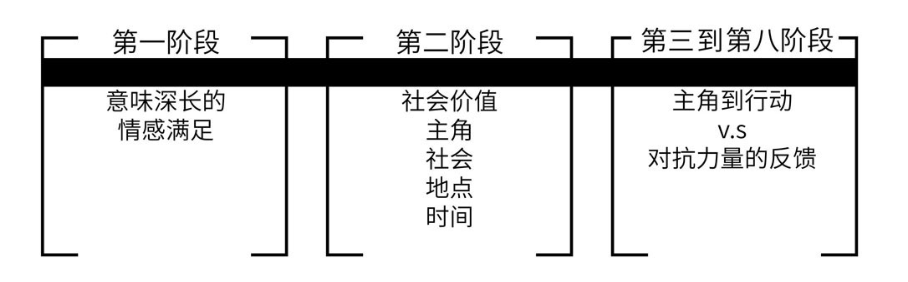

# 0401. 故事的定义

The Definition of Story

若想掌握故事化营销的精髓，首席市场营销官首先需要找到这些根本问题的真实答案：「故事究竟是什么？有哪些主要构成部分？这些元素如何在故事中相互作用？怎样才能创造出一个强劲有力的营销故事？这个故事如何才能传递出我想表达的内涵？故事怎样在消费者的头脑中产生作用，影响他的情感，引导他的选择？最重要的是，怎样用故事激励消费者采取正向有利的行动？」

故事和艺术及音乐一样，你以为你懂得它的含义，但给它下定义的时候却无从下手。你大概很奇怪为什么会这样，毕竟你已经听了一辈子故事，可以举出成百上千的例子。你每天都向朋友、同事和自己讲故事，以为自己知道什么是故事，但若想给它下个定义，你的想法却模棱两可。

在这个问题上，工具书也帮不上什么忙。让我们一起来看看《牛津英语词典》中的定义：「关于虚构或真实的人和事件的娱乐性叙述。」这样一个语义暧昧的定义对市场营销人员是没什么实际作用的。如果不知道手中的工具是什么、怎么用、坏了如何修理，又何谈把它用好呢？

更糟糕的是，《罗格同义词词典》使用「描述」这种令人困惑的转喻词和「旅程」这种不当用词将故事的定义沉重化了。如果市场营销人员错误地采用这些软性定义，无视故事的真实面貌，他会误以为自己的营销活动讲述了一个有力的故事。结果就是营销活动的失败被归咎于故事这个方法本身，却没有意识到他根本就没有讲好故事。

让我们先来了解一下故事不是什么。排除掉没有说服力的同义词和错误观念之后，才能厘清故事的定义。

## 01. 故事不是什么

### 1. 故事不是加工程序

不同零件在生产流水线上用螺丝钉铆接固定，一步步组装成汽车，这不是故事。组装制造是横向加工处理的过程，和故事一样，制造工序通过开始、中间、结束三个步骤，从打开状态进入闭合状态，对汽车来说也就是从零件状态进入组合状态。但是和故事不同之处在于，加工程序不涉及欲望、冲突和核心人物。因此，没有任何人的生活被触动或颠覆。程序只是序列化的累积，而故事是层层递进。

### 2. 故事不是层级制度

被问及企业故事的时候，许多高层管理者会直接拿出企业架构图来解释。在他们眼里，企业「故事」是为了说明这家公司如何做事以及决策和任务如何沿着权力金字塔上下流动。但是企业组织只是一种纵向的加工程序。层级制度用秩序将混乱规范化，但并没有讲述任何故事。

### 3. 故事不是大事记

还有一些高层管理人员会把公司年表当作企业故事。企业大事记，特别是招股说明书中披露的那一类，同样也是另一种程序。只是这种加工程序是时间化的，以时间序列中的一系列成长事件列表的形式呈现。

### 4. 故事不是人生旅程

「旅程」这个流行词是「人生故事」的时髦比喻，但它是错误的。生活并不像旅程。如果我们的人生真的有迹可循，那也是毫无逻辑的曲折路线。我们左摇右晃，跌跌撞撞地追寻成就、爱与安全感。

「旅程」这种委婉的说法让我们暂时忘记冷酷的现实，如同我们在对孩子进行如厕训练的时候用的那些文雅词汇一样，这类形容词在文明社会中占有一席之地。然而精彩故事的主人公不会是被动的旅人。为了实现自己的愿望，他必须在流动的时空中奋力挣扎前行。

### 5. 故事不是单纯的叙事

许多市场营销活动惨败的原因是由于广告公司不懂得「叙事」和「故事」的区别。「叙事」一词看似学术甚至科学，但在商业语境中，这个词既不准确又缺乏逻辑。它的使用犯了一个彻头彻尾的错误：所有的故事都是叙事，但并不是所有叙事都可以称为故事。前面提到的四个不当用词都是叙事，但都不是故事。

叙事可以视为对事件的一种平淡、乏味并且重复的描述。它像白开水一样在脑海中一晃而过，对消费者毫无影响。

故事则充满价值，层层递进。想象力是故事的天然归宿，人类的心智欣然拥抱精彩的故事。故事叩开用户的心扉，顺应并刺激消费者的选择。

下一次你觉得别人的「故事」无聊透顶的时候，十有八九对方讲的根本就不是故事。真正的故事会让你全神贯注，侧耳倾听；而让你厌烦的是叙事的折磨，其中大部分是这种重复性的唠唠叨叨：「…… 然后我这样，然后我那样，然后，然后，然后……」

## 02. 故事是什么

那么故事究竟是什么呢？人类历史上一切故事的核心事件可以概括为一句话：冲突颠覆生活。因此，故事的最佳定义如下：一系列由冲突驱动的动态递进的事件，在人物的生活中引发了意义重大的改变。

## 03. 故事设计的八个阶段

如果把故事作为一种艺术形式来追求，它会无限复杂，充满无穷变化。虚构故事包含了从滑稽戏到悲剧的多种样态，范围跨度从独角戏到交错编织的多个情节及次要情节，长度也从几秒钟的笑话到上百小时的多季电视连续剧不等。然而这些不同变体却拥有一个同样简洁而根本的核心。当我们使用「故事形式」这个短语的时候，我们指的正是故事那个放之四海皆准而不可约减的根基。

如果对每个连贯的故事进行深入剖析，我们就会发现，有八个关键元素通过八道程序进行组合，从始至终贯穿着整个创意过程：

这些元素的表现和人一样充满变化，正如世界上没有两个个性完全相同的人，世界上也不会有两个完全相同的故事。只是在每个故事的核心，都有一个相同的核心骨架固定住故事的血肉，经过时间长河的洗礼也不会改变。

正如音乐和舞蹈这类艺术形式，故事的基本维度是时间。古典音乐可以把演出分为不同乐章，精彩故事的创意准备和动态变化同样可以分为八个阶段。对故事原则的执行程度决定了每个阶段成功与否。

我们将以斯蒂文·泽里安和艾伦·索金的作品《点球成金》（Moneyball）为例，阐述每个阶段和相应的首要原则。此片荣获了包括最佳男主角、最佳影片和最佳改编剧本在内的八个奥斯卡提名。

### 第一阶段：目标受众

基本原则：意味深长的情绪感染。

作者在创作故事之前，首先需要清晰地了解他的受众是谁，以及他的作品对受众的思想和情感会产生怎样的影响。

《点球成金》：编剧的目标受众为对体育有兴趣的成年观众，特别是其中的棒球球迷以及布拉德·皮特的粉丝。鉴于大部分真正的棒球爱好者都知道影片的核心事件在现实中的结局，讲故事的人希望达到的特殊效果是让观众对事件背后的原因和过程有更深入的理解。编剧的特定目标是当银幕上一个沉默寡言的英雄打破不可能，并且创造奇迹的时候，观众从平静的喜悦中得到意义深远的情感满足。

### 第二阶段：主题

基本原则：平衡。

每个故事都发生在特定现实世界中的特定时间。故事开始时，主角的人生围绕核心价值锚定不变，处于平衡状态。他的日常生活中也会遇到许多微小的起伏波澜，但是并未影响核心价值向正面或负面的一端倾斜。

《点球成金》：泽里安和索金两位编剧设定的主题是奥克兰运动家队的总经理比利·比恩努力打造冠军球队的真实故事。

2001 年，比利·比恩（布拉德·皮特饰）组建了一支相当出色的队伍。他的球队虽然没有打进世界职业棒球大赛，但成功闯入了季后赛。比恩职业生涯中的核心价值 —— 成功 / 失败 —— 处于平衡状态。

### 第三阶段：激励事件

基本原则：失衡。

激励事件是一个意料之外的事件，它打破核心人物生活的平衡，从而为整个故事拉开帷幕。核心价值的中立状态急剧向正面或负面扭转。无论走向如何，这一重大改变将主人公置于压力之下。

《点球成金》：2002 年赛季开始时，比利·比恩遇到了耶鲁大学经济系毕业生彼得·布兰德（乔纳·希尔饰）。布兰德向他介绍了用赛伯计量学评估球员的方法，比恩看出这个方法的优势，雇用布兰德为助手。这一激励事件打破了比恩生活的平衡，向正面推进。他对新的赛季充满希望。他对成功 / 失败的核心观念向正面倾斜。

然而《点球成金》的激励事件也带来了一个不妙的副作用：比恩全心拥护这个反传统的数据分析法，导致他和另外两个人产生摩擦 —— 球队经理亚特·贺维（菲利普·塞默·霍夫曼饰）和首席球探格雷迪·富森（肯·梅德洛克饰）。这两个人痛恨赛伯计量学。从这个角度看，激励事件的冲击又将比恩对成功 / 失败的观念由正急剧推向负。他面对的是有可能摧毁整个职业生涯的重大危机。

### 第四阶段：欲望对象

基本原则：未被满足的需求。

当核心人物察觉到生活的平衡被激励事件打破，自己已经置身于危险境地的时候，他自然想要找回生活重心的平稳。为了达到这个目的，他产生了欲望对象，这也是所有故事的必要构成部分。欲望对象被定义为核心人物为了找回生活平衡而必须得到的东西。

《点球成金》：比利·比恩的欲望对象是带领球队闯进职业棒球大赛。

### 第五阶段：第一个行动

基本原则：策略选择。

为了让生活重归宁静，核心人物开始采取行动。这个行动被设计为应当引发正面反馈的策略，这一行动有得到欲望对象的可能，最不济也至少是向欲望对象推进。

《点球成金》：比恩依靠彼得·布兰德的赛伯计量学方法对准备引进的球员进行评估，雇用不被其他人看好的球员来填补去年离开的球星留下的空缺。

### 第六阶段：第一个反馈

基本原则：悖反期望。

在这一阶段，现实突然击碎了核心人物的期望。核心人物不仅没有得到正面反馈，反而发现敌对势力的力量超出预期，让主角的全部努力付诸东流。主角主观认为的结果与实际发生的事情之间产生巨大鸿沟。这一意料之外的反馈将主角打回原地，甚至将主角推至目标的反向。

《点石成金》：奥克兰运动家队在 46 场比赛中输掉了 26 场。球队经理亚特·贺维认为赛伯计量学方法是无稽之谈，并不顾比恩的反对，组建了自己认可的阵容。

### 第七阶段：危机下的抉择

基本原则：洞察。

现在，主角置身于更大的危机之中，不仅没有得到欲望对象，反而快要失去它了。他从第一个反馈中得到教训，带着洞察力重整旗鼓，选择采取第二个行动。第二个行动比第一个行动更加困难，并且风险更大，但是他希望借此获得能够帮助他得到欲望对象的正面反馈。

《点石成金》：比恩交易走了贺维的明星一垒手，逼迫球队经理采用布兰德的方法。

### 第八阶段：高潮反馈

基本原则：闭幕。

在紧凑的故事中，主角的第二个行动引发满足期望的高潮反馈，令他得到欲望对象。这一高潮事件让主角的生活重归平衡，结束了整个故事。

《点石成金》：比恩的统计方法激励球队取得 20 场连胜，打破了美国棒球联赛的纪录。在赛季结束时，球队战绩为 103 胜 59 负，在季后赛中取得一席之地，并让比恩重新有机会带领球队进入职棒大赛。

故事设计的八个阶段：

第一阶段：目标受众 = 意味深长的情绪感染

第二阶段：主题 = 平衡

第三阶段：激励事件 = 失衡

第四阶段：欲望对象 = 未被满足的需求

第五阶段：第一个行动 = 策略选择

第六阶段：第一个反馈 = 悖反期望

第七阶段：危机下的抉择 = 洞察

第八阶段：高潮反馈 = 闭幕

## 04. 长故事

首要原则：渐进式行动 / 反馈。

在扩展的作品中，第七阶段和第八阶段会以不同的形式重复，推动故事渐进式发展，直至达到最终的高潮。世界的负面反馈一次又一次地让主角的希望破灭。主角每次采取的新行动和出乎意料的结果让他在正负之间来回挣扎，力量逐级增强。一次次的反转和悖反令压力终于累积到临界点，直到主角做出危机决策，决定采取高潮行动，最终不可逆地成功得到欲望对象，或者再也无法得到欲望对象。

渐进式故事：下面是一个真实发生过的故事，它在多年间层层递进，经历许多转折点。看看你能否通过一系列公开报道过的事件猜出主角。

目标受众：公众。

主题：食品零售业。

企业家发现了一个有利可图的生意机会，产品线质量优异，于是成为这家公司的总裁。

激励事件：企业家提前退休后，企业在新总裁的领导下业绩一落千丈。

第一个行动：企业家回到公司重新担任总裁之后，希望让公司扭亏为盈。

第一个反馈：全球经济下滑，之前的消费者现在已经买不起产品，销量和利润下降。

第二个行动：为了削减成本，企业家关闭了 10% 的直销店，解雇部分员工，并采取更多措施。

第二个反馈：利润持续下降，股价跳水，华尔街称这家公司正面临惨败。

第三个行动：创始人降低定价。

第三个反馈：销量下滑得更厉害。

第四个行动：创始人削减运营成本。

第四个反馈：利润缩减。

第五个行动：创始人灵机一动，通过有益于员工的社会举动重塑了公司形象。

第五个反馈：消费者在社会举措的感染下重回品牌怀抱，并为公司赢得良好口碑。

第六个行动：股东寻求更大利益，敦促总裁砍掉员工福利。

第六个反馈：总裁捍卫员工福祉。

第七个行动：总裁为员工提供了更多福利，并打造了全新的品牌营销活动，展现出关怀员工的企业文化，并利用社交媒体进行传播。

第七个反馈：公关赢得巨大成功。

第八个行动：投资新产品。

第八个反馈：新产品失败。

第九个行动：总裁从失败中得到教训，开始询问消费者到底想要什么。

第九个反馈：消费者给出反馈。

第十个行动：总裁满足消费者需求。

第十个反馈 / 高潮和闭幕：消费者为总裁带来巨大成功。

你大概已经猜到了，这就是霍华德·舒尔茨和星巴克的故事。

大部分市场营销使用简短紧凑的故事。在商业世界中，品牌面对的是极短的广告时间和高昂的创意成本及制作成本，营销故事不得不局限于一至两个转折点。

## 05. 意义

故事的八个阶段是这样创造意义的：首先，所有故事的核心脉搏都是一至多个二元对立的价值观，比如生 / 死，自由 / 暴政，成功 / 失败，真理 / 谎言，爱 / 恨，诸如此类。随着故事发展，核心价值由负转正或者由正转负。例如在印第安纳·琼斯的冒险故事中，核心价值是由生到死；在奥威尔的政治隐喻作品《1984》中，核心价值从自由转向专政；在职业故事《点球成金》中，主角转败为胜。

其次，故事中的因果动态解释了为什么发生和如何发生，也就是上述转变背后的原因。例如，印第安纳·琼斯能够幸存下来并继续战斗，是因为他在压力面前机智勇敢、沉着冷静；温斯顿·史密斯在专政下屈服，是因为他无法忍受「老大哥」的残酷行为；奥克兰运动家队赢得比赛，比利·比恩保住工作，因为他从始至终都相信自己的判断。这种对价值和原因简明清晰的总结用一句话说明了故事的意义。

我们将会在第六章中证明，充满意义和情感的高潮将如何推动消费者采取有利行动。为了给最终的创意环节打好基础，下一章我们会先逐一展开分析故事的八个阶段，并充分探索每个阶段包含的内容。