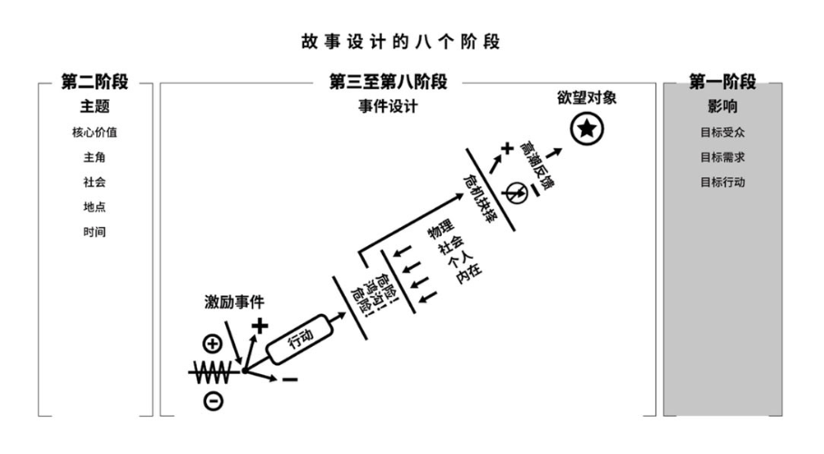
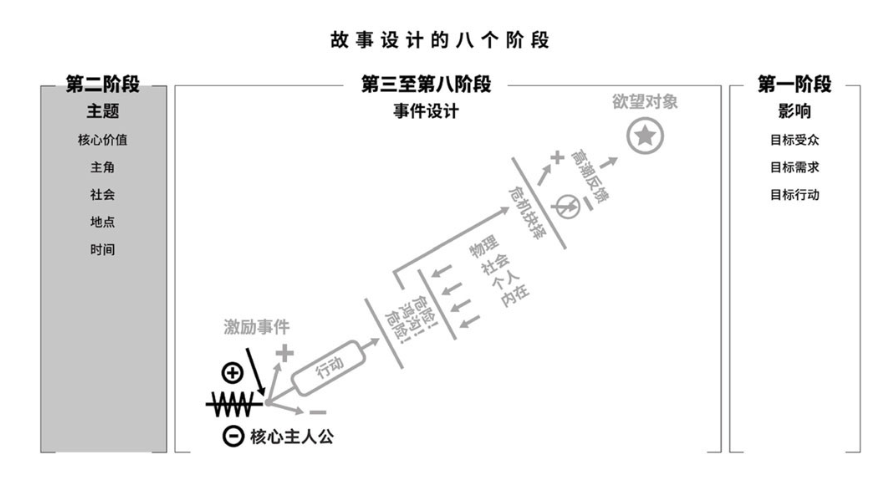
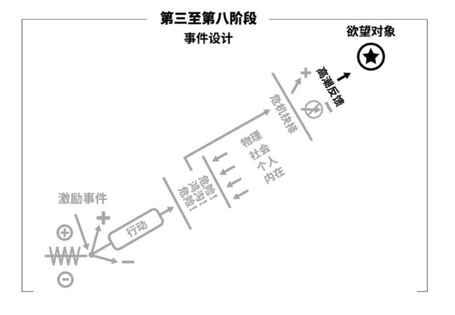
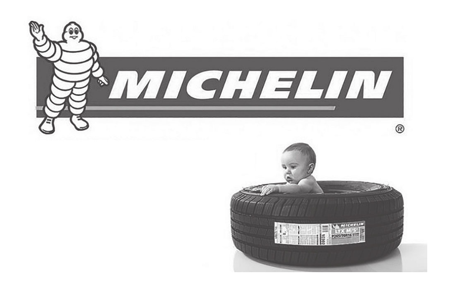

# 06 目的导向型故事

The Purpose-Told Story

前面两章中，我们探讨了从远古神话到 21 世纪的电视连续剧，每个故事中深藏的事件设计。本章，我们将把这种古老范式引入 21 世纪的创新市场营销中的对应部分，即目的导向型故事。首先，让我们对虚构型故事和目的型故事进行比较分析，主要聚焦于后者独有的构成元素。

## 01. 虚构型故事与目的型故事

### 1. 长篇与短篇

最早的时候，当部落的人们聚集在篝火边时，讲故事的人就确定了故事的标准时长。他们的依据是单次就坐时长，即人们在一个地方能舒舒服服地坐着，专心致志听故事而不走神的时间。这个从实践中得出的结果后来就成为了传统的两小时左右的演出长度，包括戏剧、歌剧、芭蕾和电影，都是如此。

也有一些罕见的例外，比如尼尔·奥拉姆长达 24 小时的戏剧《偏见》（The Warp，参见吉尼斯世界纪录）。抛开这类情况不谈，单次就坐时长原则解释了为什么作家要拆散他们的长篇作品或者长篇电视剧，比如《战争与和平》（War and Peace ）、《黑道家族》（The Sopranos）等，分割成便于吸收的单元，也就是今天我们所说的章节和分集。

与长篇虚构作品不同，目的型故事会缩略事件。典型的商业故事是在三十秒电视广告或三分钟 YouTube 视频中讲述的迷你故事。通用电气的「欧文怎么了」和多芬的「真美素描」分别是这两个类型的绝佳范例。

假如我们用转折点来衡量的话，长篇小说有多个故事线，时刻驱动着数以百计的转折和冲突。而营销故事则不然，目的型作品通常只用一击就在预期和结果之间拉开巨大鸿沟，有时会有两次这样的转折，但基本不会超过三次。

### 2. 模糊记忆和细节记忆

故事会留下印记。正如之前提到的那样，人类心智是不断创造故事、存储故事的机器。因此，故事在记忆中留存的时间要远远超过事实和数据，并始终栩栩如生。但是大部分虚构作品的故事相当庞大，读者或观众能记住的不过是故事的大致情节和部分人物的浮光掠影。除此之外那成千上万的细节要么模糊不清，要么被全部置之脑后。

简洁紧凑的目的型故事更容易被人们记住。品牌故事或者旨在刺激需求的故事最重要的细节就是品牌或商品的名字。如同乐迷的脑海中会循环响起心爱的音乐一样，一旦消费者想起对某种产品或服务的需求，与之相关的目的型故事就会在他脑海中不断回放。

### 3. 满足与行动

虚构型故事将受众带入闭合圆圈之中，让观众全身心地投入；目的型故事则将这个圆圈打开一个缺口。两种模式的出发点都是引起好奇心和共鸣（激励事件），在过程中不断深化受众与故事的联系（复杂渐进）。但是到了需要收获结果的时候（危机 / 高潮），虚构型故事让受众的体验完整画上句号，而目的型故事会在这个基础上多走关键一步：目的型故事的受众会将这种故事化体验带入现实生活中，每次购买相关产品或服务时，都会重新体验一遍这个故事。换言之，目的型故事的最终目的就是将故事高潮的美学体验转化成市场中的有效行为，即把受众变成消费者。

最好的目的型故事和虚构型故事都用有意义的情感体验满足观众。在故事中，我们为那些之前从不觉得好笑的事情发笑，为那些从不觉得悲伤的事情落泪，最重要的是，无论是哭还是笑，我们对生活产生前所未有的洞见，而这一切都包裹在一种我们从未体验过的情感当中。想法和情感融为一体，无论大小多寡，都为我们的内心生活增添了一个丰富的维度。经过美妙故事的洗礼，我们的人格更完整了。

### 4. 单一体验和重复体验

虚构型故事和目的型故事的最关键区别是这样：虚构型故事在单次叙述中完成了它的使命，而目的型故事则在消费者脑海中不断重现，每购买一次产品或服务，故事就会重复一次。目的型故事不仅驱动消费者进行初次购买，而且驱动消费者不断进行重复性全价购买，由此获得利润。

集中的体验能够令人感到愉悦，是因为它带领我们穿越时间，让我们忘却时间的流逝。我们对时间的感知是如此主观，以至于演奏乐器、看喜欢的球队比赛、打电子游戏或者沉浸在引人入胜的故事中都能让时间从我们的意识中消失。无论是一出好戏、一部好小说还是电影或者电视剧，故事的力量都会将我们卷入时间漩涡中。直到这魔法般的咒语消失，我们看看手表，面面相觑：「哇，已经过去三个小时了？」一些故事的死忠粉丝甚至会反复回到他钟爱的经典作品中，一次又一次重新体验。尽管如此，每次故事高潮过后，受众又会被打回到日常生活当中。

以市场为目的的故事同样能吸引人的注意力，将时间的概念抹去；它还可以不断在受众的脑海中重复，不受时间限制。大众对目的型故事的重复讲述会产生连锁反应，也就是口碑。虚构型故事也有同样的作用，但区别在于大部分作品没有品牌的生命周期那么长（除了《星球大战》等个例）。

### 5. 作者忠诚和品牌忠诚

读者对虚构型故事的忠诚对象是故事作者。读者寄希望于作者的下一部作品还能给他们带来这种快感。但目的型故事的受众对作者漠不关心，而对品牌或产品产生依赖和忠诚。品牌忠诚度以及作为结果的重复购买，都源自目的型故事创造的镜像体验。

## 02. 镜像体验

精彩的故事能够同时创造两种互为镜像的体验：理性体验和情感体验。

理性镜像体验始于好奇，并终结于好奇。故事的激励事件挑逗观众的理性，不断制造问题：「接下来会发生什么？再接下来呢？故事的结局是什么？主角能得到他的欲望对象吗？」理性镜像体验映射出我们在生活中也会问自己的想法和问题。正如莎士比亚所言：故事给自然立了一面镜子。

情感镜像体验始于共鸣，也终结于共鸣。当故事的主角由内而外地散发出人性光芒的时候，这种「善」的内核吸引观众本能地和这个人类同伴产生联系。观众迅速在潜意识里陷入对主角的认同，也就是我们所说的共鸣。正如我们在前一章中讨论过的，对于目的型故事来说，共鸣是不可或缺的。假如失去这一层根本联系，故事就无法驱动任何人采取行动，更谈不上驱动消费者购买。[1]

在虚构型故事中，情感镜像体验有两个步骤。目的型故事比虚构型故事多一个步骤。

第一步，认同。当目标消费者意识到他和主角之间有共通的人性的时候，他的直觉会遵循亲近的逻辑：「那个角色和我同样为人，所以我希望那个角色得到他想要的。如果我遭遇了相同的处境，我也想得到它。」换句话说，观众同主角建立了情感纽带。[2]

第二步，潜意识互换。一旦目标观众对主角产生认同，他就会感觉这是他自己的故事。因此他会用现实生活中的欲望来代替角色在故事中的欲望。他站在主角一边，支持主角得到故事中的欲望对象，从而间接地接近自己在现实生活中的欲望。

受众本能地感觉故事中的事件仿佛发生在他自己身上。当故事线发展的时候，他感受到从负到正的转变，问题逐渐得到解决，直到故事高潮间接地满足了他自己的需求。

为什么叙述得当的目的型故事会产生持续的效用？这种潜意识里产生的从虚构到自我的镜像互换简单地解释了缘由。

第三步，重新演绎。潜在消费者的镜像体验激励他采取行动。消费者想要重新体验目的型故事带来的正面改变，于是他选择购买故事中植入的产品或服务。在故事之后发生的这种重新演绎不仅满足了消费者的需求，也达到了营销者的目的。简而言之，受众的确变成了消费者。

## 03. 科学背景

要想理解镜像体验是怎样发生的，它为什么能行之有效，我们还需要往回追溯，来看看神经科学是如何看待故事的。

正如第三章中提到过的，布罗德曼第 10 区是大脑中最庞大的区域，负责回放记忆、逻辑思考、解决问题、做出选择并且规划行动。大脑中的其他部分负责执行这些决策，但是决策背后的思想只存在于布罗德曼第 10 区。在这一区域中，过去流向未来。[3]

人的心智会记住过去经历的因果关系的模式，借此规划未来的行动方针。在过去的事件长年累月的影响下，我们了解事物如何运行，世间各种力量如何相互连接。当新的情况出现时，心智会根据以往积累的模式，想象出接下来可以采取哪些行动，并预测出这些行动可能会产生的后果。

将过去的遭遇和对未来的预期连接起来的过程不只关乎实际发生的事实，它同时还包括虚构的经验。当故事吸引住人类心智的时候，与之相应的事件同样在大脑布罗德曼 10 区中上演。记忆功能紧接着把这些镜花水月的事件标记为「似乎如此」，和真实事件一起储存起来。随着时间的推移，「似乎如此」渐渐淡化为「确实如此」。应对未来的时候，理性不会刻意区分这些记忆是虚构还是事实，而是聚焦于这些记忆中相通的子结构。人的意识将「确实如此」和「似乎如此」背后的因果关系抽象出来，融合在一起。如此累积的关于因果的知识将在未来派上用场。

每个人都按照自己对概率的感知采取行动。个体在现实世界和虚构世界中的体验的总和会告诉他某一行动可能会产生怎样后果。通过这种独特的心理机制，故事为我们提供关于决策与反馈的洞见及指导，由此逐渐构建出未来决策的参考框架。聪明的营销者能够利用目的型故事影响这种行为倾向。

创作目的型故事

创作目的型故事和虚构型故事一样，同样经过八个阶段。与后者不同的是，目的型故事力求在消费者心中制造镜像体验，最终导向盈利性的重新演绎。目的型故事的弧光带领消费者从生活中的某处缺失走向圆满，从需求走向满足。

## 04. 第一个阶段：三个目标

和在第四章概述的一样，设计故事的第一个阶段是确定目标受众。虚构型故事的作者通常会扩大受众面，但目的型故事的创作者则不然。作为营销者，你必须很确切地知道瞄准的是哪类群体，这包括确定目标市场及需求是什么，并且确定最重要的结果 —— 目标行动是什么。

第一步：研究目标受众群体

在这个大数据时代，目标市场的人口统计数据（包括消费者、客户或投资人的年龄、性别、教育、收入等）都可以轻易获得，就算没有，也不难通过研究发现。

第二步：定位需求、欲望和问题

接下来需要发掘的是隐匿在消费者内心深处的深层需求。大数据能够告诉我们一个人表面上看起来是什么样子，但这并不是他们真正的样子；调查问卷告诉我们他们的架子上放着什么，但是无法告诉我们他们心里面放着什么。

要想设计一个最有效率也最强大的营销故事，就要跳出人口统计数据的窠臼，问问自己那个广告从业者的经典问题：「哪里才是痛点？」

这就是史蒂夫·乔布斯的天才之处。他看得到别人看不到的东西：电脑卖相丑陋。他说戴尔公司的产品是「毫无新意的米色盒子」。[4] 他说得对。戴尔当时的塑料机组盒非常笨重，布满电线，看着都很难受，更别说带着这样一部电脑到处走了。乔布斯察觉到消费者潜意识中想要但是并没有清楚意识到的东西：独一无二的身份。消费者希望在别人眼里，他们是具有创造力和反叛精神的精英。于是他创造了一款又一款象征这些品质的产品，无论走到哪里，无论放在桌子上还是口袋里，它们都显得那么美丽动人、优雅别致。乔布斯对手机的创新唤醒了人们潜意识中的无声需求。苹果公司将他的蓝图不断故事化，创造了一系列绝妙的广告，给我们留下了品牌营销的一段佳话。

若想找到故事的目标受众想要什么，不妨问问：「我的目标受众痛点在哪里？哪些东西是他需要而不自知的？有什么隐藏的问题亟须解决？」

第三步：设计目标行动

无论营销故事多么受人欢迎，如果人们把它当作虚构型故事，看完就抛到脑后的话，这个故事终究是无足轻重的。多芬的「真美素描」故事讲得如此深入人心，以至于人们涌入商店购买多芬香皂，销售额简直令人瞠目结舌。

营销人员应当想清楚，你想让目标受众看完故事之后采取怎样的行动。如果你讲述的故事是针对企业客户的，也许你的目标行动是让客户签订合同；如果你的故事针对的是潜在消费者，你大概希望他们把商品拿到收银台结账；如果你在经销大宗商品，也许你想让顾客走进展示厅，好让销售团队大展身手；如果你提供专业服务，你大概想让人们访问你的网站，进行预约。如果你在进行品牌营销活动，你的目标行动则发生在受众的脑海里 —— 你要让受众从不知道这个品牌到产生品牌认知，必要的时候可能还要让他们对品牌的印象从负面转向正面。

尽管这些目标看上去似乎显而易见，但是很多营销活动距离实现目标还差得远呢。他们不愿意花时间弄清楚自己的目标是什么，只是一个劲儿地自吹自擂，夸下海口，求他们的用户：「来买吧！」

## 05. 第二个阶段：主题

确定故事主题需要三个核心步骤。

第一步：发现核心价值

在第一阶段中识别出消费者未被满足的需求，导向第二阶段中的第一步：满足痛点，找出最能够戏剧化呈现解决方案的核心价值。下面将以多芬的「真美行动」为例，它的故事化营销把品牌从濒临消失的边缘拉了回来。

正如我们在前一章的情感创造部分阐述的那样，奥美广告公司洞悉了目标受众的激励事件和欲望对象，产生创作灵感，围绕自我批评 / 自我欣赏这一核心价值编织了一个目的型故事。2013 年 4 月 14 日，这个名为「多芬真美素描」的三分钟影片首度和受众见面。故事成功地呈现了核心价值的动态变化，和多芬的受众紧紧联系在一起，在 YouTube 上收获了高达 97.6% 的正面反馈。视频如病毒般传播，点击率在一周内超过了 1500 万次，不到十天内就飙升到 3000 万次。两个月内，这次营销活动在全球内收获了 1.63 亿次播放，并在戛纳国际创意节上赢得了钛狮大奖。最终它的媒体形象高达 46 亿，销售额几乎翻了一番。[5]

第二步：选择主角

所有的企业都可以根据基本业务分为以下三个类别：资源开发、产品开发或提供服务。虽然有一些企业涵盖三种业务，但是每个企业都有一项业务是永远不会外包的，这项业务就是它最真实的属性。营销活动的传统就是致力于传播推广品牌的这个独特属性。因此，营销者通常会根据企业的主营业务，从上述三个类别中选择最契合企业核心属性的一个作为主角。

1. 资源中心型企业

资源中心型企业依靠有效地开采某一自然资源或者原材料，在竞争中取得优势。例如，矿业公司开发地球蕴含的矿物质，制药企业在生化领域进行创新。每当矿物从地底被开采出来，或者某个生物学的秘密被发现的时候，资源中心型企业就对这种资源享有垄断，从而占据市场。这些资源的最终消费者此时似乎还完全不明确，他们大概正坐在遥远的千里之外，距离产品之间还有制造、包装、销售等许许多多道工序。这种情况下，B2B 营销就会把公司作为故事主角，讲述自身的故事。

这并不是一项简单的任务。要想为一个庞大企业精炼出一个人格，难度不亚于把美国五十个州精炼成一个山姆大叔。若想完成这项任务，就要求营销者在创意上出奇制胜。

2. 产品中心型企业

产品中心型企业建立竞争优势的途径是创造出性能更好、更美观、更便捷、更耐久的产品。这类公司的营销故事通常把产品作为主角，给它配上拟人化的声音、个性或人格。举例来说，在苹果的「来个苹果机」（Get a Mac）营销活动中，贾斯汀·隆饰演了诚实可靠、通情达理的 Mac，约翰·霍奇曼则饰演阴险狡诈、装模作样的 PC。在宝洁公司的故事中，「干净先生」的动画形象模仿当代的大力士赫拉克里斯，或者是藏在灯中的灯神，随时准备搞定宝洁面对的一切家务难题。

3. 服务中心型企业

服务中心型企业依靠更高水平的服务超越同业竞争者。如果它能提供更高质量的服务，医疗、金融或是法律服务的终端用户就会更健康，更富有或更安全。服务业从业者将自己的才华与技能用于为客户提供更优质的服务，于是营销活动习惯将这些专业人员塑造成帮手，而非英雄；与之相对，客户则被塑造成了主角。非政府组织、慈善机构和政府等非营利性机构也适用这一规律。

上个世纪，上述三种选角策略都被营销人员奉为圭臬。然而互联网的兴起改变了这一规则。当买家在网上给零售商打分的时候 —— 有时候会给好评感谢卖家，但是大部分是给差评 —— 一切都不一样了。口碑反馈更加实时，并且传播速度更快。于是，以客户为中心成为了现代营销的不二教条。今天的一个又一个营销案例中，企业都被塑造成服务者（不管他们究竟是不是），而消费者则被塑造成了主角。

很好。以消费者为中心的故事在全球商业领域中掀起了一场积极的变革。只要这些故事有创意、吸引人、不阿谀逢迎，故事就会产生正面作用。最重要的依旧是诚实。千禧世代和 Z 世代消费者痛恨胡说八道。

必要的共鸣

如果你塑造的故事主角无法让目标受众产生情感共鸣，他就不会留意你的故事到底怎么样。他不听，不认可，更不会采取行动。共鸣必不可少。这个基本原则不言自明，但每当一个无法引起共鸣的故事需要推翻重写的时候，营销人员的反应通常是这种典型的自说自话：「不管这个故事是不是陈词滥调，只要我们的核心角色看着跟典型客户差不多，情感上的共鸣自然就来了。所以选角一定能拯救平庸。」无数次痛苦的经验证实这种逻辑有多么荒诞不经。以消费者为中心并不等同于选一个普通人当主角。消费者想要的是天然的亲近感，不是刻板的模仿。[6]

实际上，对大多数企业故事来说，唯一理性的选择就是以他们的产品或者公司为主角。这种情况下，故事就必须以产品或公司的视角展开。若想成功完成任务，故事创作者就要解决这个挑战：如何在消费者和故事主角（要么是没有生命的事物，要么是非人格化的机构）之间构建起能够产生共鸣的连接呢？

以产品为主角

根据定义，主角必须具有做出主观选择的自由意志。但是产品却只是客观物品，没有自我意识，没有意志力，更不会做出选择或采取行动。营销人员通常会利用幻想来解决这个问题，找演员或者动画角色来扮演拟人化的产品，或者像绿野仙踪里所描述的世界那样，为物品赋予生命。最近 Pier1、Nest Labs 和 Geico 保险的广告活动都采用了这种方式，主角分别是会说话的茶壶、唠叨的郊区住宅和上蹿下跳的澳大利亚蜥蜴。

创造幻想的世界和角色需要想象力、创新精神和富有创造性的执行力。很多营销活动畏难而退，放弃了故事这种方式，直接让代言人吹嘘或承诺那些不一定有的产品功效或是服务质量。

以企业为主角

正如上一章中提到的，主角内心深处的人性闪光点塑造了故事中「善」的核心，也是引起共鸣的磁石。若想把企业打造成令人感同身受的故事主角，营销人员必须找出企业的首要价值。这项价值必须对企业至关重要，如果失去了这一价值，企业将不复存在。其次，营销人员要把作为主角的企业形象和这项首要价值结合起来，让主角的选择和行为构成故事。

但是在实际操作中，企业扮演主角通常会让故事显得空洞。有些公司选择冠名体育场馆来给自己的名字增添亲民度。公关公司通过给心脏移植手术捐款让客户和慈善扯上关系。慈善活动成为新闻通稿的素材，但通常无法战胜消费者对跨国企业的反感。所以要记住，善意通过行动表现，而不是通过联系。

不过公司使命讲述了另外一个故事。星巴克、宝洁、荷兰皇家帝斯曼这样的企业会主动承担起社会职责，资助有需要的学生、参与灾后重建和第三世界医疗援助等社会服务。这些使命故事让企业成为有人情味儿的主角，引起受众的共鸣。更重要的是，它们和充满自我感动的公关材料完全不同。由负到正的自然弧光让这类目的型故事毫无做作。

以品牌为主角

每个人从身处的文化中获得自己的身份定位。被问到「你是谁」的时候，人们会说出自己的国籍、种族、宗教、职业或者婚姻状况，以及喜欢的音乐、电影、书籍、艺术、饮食或者是球队，或许还会加上一些独特的个人经验或者个人成就。但是这些也是从出生开始就被周围的文化影响着的。直到今天，现代化的生活给身份定位增加了一个维度：品牌。20 世纪前半叶，人们一度习惯把产品上的商标藏起来或者直接剪掉，但如今却恰恰相反。

第二次世界大战后，品牌认同和随之而来的商标现象在纽约麦迪逊大街上率先成型。今天，人们已经习惯把品牌商标穿在胸前。这些商标不只宣传了品牌，也同时展示着商标主人的品味、阶级、政治倾向、性征、个性等等。

不管品牌是资源中心型、产品中心型还是服务中心型，通常都要比第三世界国家还要庞大复杂。它同时代表着作为背景的企业和作为前景的生活方式。每个品牌都在世界中表达着独特的存在感，以及它制造的独一无二的气场：IBM 代表天才，百威代表好时光，路易威登代表奢侈。这些基本品质是通过几十年的辛勤耕耘树立起来的。如果营销故事的主角是某个公司或者产品，那么主角的个性应当和品牌的气场一致，与之相关的故事也应该强化这种个性。[7]

避开特权阶级

当你选择主角的时候，一定要记住人性中自我矛盾的地方。一个人可以从任何事物中找到自己的标签，不管是破洞牛仔裤、钻戒、巨无霸汉堡还是高级料理。人们用产品来界定自身形象的时候，并不代表他们对制造这些产品的企业有什么感情。人们对权力毫无共鸣。人们尊重权力，仰赖权力的庇护，反抗权力，崇拜权力，但不会和权力产生共情。比方说，最富裕的人群往往需要奢侈品来确认自己的身份。尽管他们在生活中身居高位，但是夜深人静独自躺在床上的时候，他们内心深处仍然觉得自己是个失败者。这种感受是放之四海皆准的。

当人们在世界中寻找自己的位置的时候，他们本能地感觉到，他们要对抗的力量从爱的变幻莫测到死的不可避免，无穷无尽，势不可挡。当我们面对生活中的一切不如意的时候，所有人都或多或少，时不时地感觉自己是个失败者，无一例外。

当故事的激励事件打破了主角生活的平衡时，观众应当感觉到他同样在对抗强大的反面力量。失败者的感觉要比其他一切都更能让人产生共鸣。所以无论什么情况，都要避免让特权阶级成为主角。如果以企业作为故事主人公，不要吹嘘它的规模、覆盖率、财富或影响力。如果以产品作为故事主人公，不要夸耀它的新奇、时尚或名望。世间对成功人士是难以共情的，请以优雅的谦卑姿态做营销。

第三步：创造背景设定

社会和物理位置

目的型故事中的社会和物理设定包罗万象，从概念到具体、从动画到真实、从独立个体到庞大社会都囊括其中。我们接下来将对苹果公司的两个广告故事进行比较：「来个苹果机」和「误会」。

「来个苹果机」营销活动从 2006 年一直活跃到 2009 年，讲述了 66 个 30 秒的故事，取得巨大成功。每个故事中都有两个角色，分别象征着竞争电脑品牌，站在极简主义的奶白色抽象背景前。一个角色身穿休闲服（贾斯汀·隆饰），自称是台苹果电脑。另一个则西装革履（喜剧演员约翰·霍奇曼饰），自称是台 PC。在每个迷你故事中，两台「电脑」之间迅速产生矛盾，然后经过一次转折点，最终以苹果电脑的胜利作为结局。「来个苹果机」系列营销活动最终斩获了 2007 年的艾菲大奖。[8]

在「误会」中，营销者以现实主义的手法逼真地描绘了住在郊区的一家人庆祝圣诞的场景。广告通过自然的画面讲述了一个不合群少年的故事。少年在热闹的家庭聚会中，整日只是低头摆弄自己的苹果手机。随后故事产生出人意料的转折，少年实际上一直在用苹果手机编辑一段短视频，庆祝这个充满欢乐的家庭节日。这则广告在 2013 年圣诞期间循环播放，并在创意艾美奖上赢得优秀广告奖。

故事的物理和社会设定限制了故事的范围。在这个特定的世界中，只有特定事情是有可能发生的。

地点和时间

广告从业者有时把故事设定在过去，有时设定在未来，有时甚至设定在一个超越时间的世界，比如利用格林兄弟或者安徒生的童话世界展示洗发产品（《长发公主》）和卧室家具（《豌豆公主》）。但是在大多数目的型故事中，熟悉度和亲近度影响着故事的时代设定，因此大部分都发生在符合当代现实的情境中。

时间跨度则完全是另一套规矩。故事有魔法，可以像活塞似的压缩时间，甚至能把一小时压缩成一瞬间。比如说，一则电视广告可以在三十秒之内讲完一个婚礼的故事；一份投资企划书可以把几十年的经营历史浓缩进几页纸里。这对营销人员是非常有利的。你可以灵活地选取主角生命中的任意跨度来创作你的故事。

## 06. 第三个阶段：激励事件

激励事件在突然间让主角的人生失去平衡，掀开故事帷幕，将核心价值的负荷正负颠倒。这一出人意料的时间迅速抓住受众的好奇心，并让他心里产生了一个问题：「最后会怎样？」正是这个问题拉着他一路跟随故事发展，因为故事的答案就藏在故事高潮之中。

对于目的型故事，激励事件的特性和它所造成的失衡取决于主角的天性。比如说，如果你的主角代表一个企业，那么相对应的激励事件可以是并购、收购或者诉讼；如果主角是一款产品，那么初始事件可以是创新，也可以是淘汰。如果主角是消费者，那么你可以在人类可能会面临的一切事件中做出选择，从孩子出生到亲人去世都在考虑范围之内。

但是不管你赋予主角怎样的个性，他对激励事件的反应都应该激起观众的共鸣和关心，让他成为故事的善意核心。利用好奇心和同理心双管齐下，你就能把观众的一时兴趣转化成吊胃口的悬念，给第五阶段的突然转折打下基础。

不仅如此，从观众的角度来看，主人公生活中突发的命运转折也折射出受众的生活和他的目标需求，亦即营销者在研究故事设定时发现的消费者未被满足的欲望。这个「钩子」成为镜像故事的开端，带领受众一步步走向故事的高潮，并最终采取行动。

下面我们以「12 月 21 号」营销活动为例，这是李奥贝纳广告公司马德里分公司为西班牙国家彩票（SELAE）创造的活动。

先简单介绍一下背景，西班牙的圣诞彩票是全球第二古老的彩票，从 1812 年运营至今。两个世纪以来，它已经成为了一种国家级现象，每年有 75% 西班牙人参与年末抽奖。[9] 2016 年，西班牙一年一度的圣诞彩票产生了 26 亿欧元销售额。[10]

圣诞彩票的操作规则和其他彩票不同，它由从 00000 到 99999 的十万个可能中奖的号码组成。头等奖（又称 El Gordo 或者「胖子奖」）给每个中奖者发放四百万欧元奖金。2016 年共有 165 位「胖子奖」得主，他们总共赢取了高达 6.6 亿欧元奖金。[11]

每张彩票售价 200 欧元，超出了个人对彩票的购买能力。但是每张彩票下面都包含十张打孔小票，叫做「décimos」，鼓励人们一起买一张彩票，如果该彩票中奖，每张「décimo」就可以分得 10%。彩票的这种策略让亲朋好友为了共同的梦想在圣诞佳节紧密连接在一起。

近些年来，社会分裂在西班牙已经不只是政治议题，而成为了社会现实，一部分原因是受加泰罗尼亚独立运动的影响。这种分裂倾向给共同购买彩票的模式造成了很大的威胁。组团购买彩票的人会不会越来越少？如果是这样，买彩票会不会被视为自私行为？西班牙国家彩票讲的故事不仅防止了这种风险，还把彩票塑造成能够让人们团结在一起的商品。

「12 月 21 号」的故事开始于一个西班牙海滨城市，一位宠爱孩子的老奶奶正在给孙子准备早餐。她小心翼翼地把水果、面包和牛奶在托盘上摆好，送进孙子的起居室。

孙子这时正忙着玩手机，爱答不理地对奶奶说自己不饿。这时，房间里的电视吸引了老奶奶的注意力，电视中的主持人正在实时直播「胖子奖」的抽奖过程。

奶奶跑去翻出她买的彩票，惊喜地发现手中一个又一个号码被主持人开出。她不知所措地冲出房子，去找和自己一起买了这张彩票的邻居。

老奶奶刚一走，电视上的主持人话锋一转，解释说：「这就是去年的抽奖情况。明天我们将迎来今年的大日子，敬请期待。」

老奶奶的儿子走进房间，问仍然心不在焉的孙子：「奶奶去哪了？」孙子说：「去找她朋友了。她以为自己中了奖。」儿子感到情况不对，马上出门去追老奶奶。他的生活在此刻失去了平衡。

奶奶的误会形成了整个故事的激励事件。它抓住观众的注意力，让他们忍不住去想：「接下来会发生什么？」这场戏同时建立起对主角的共鸣。故事继续发展，镇上的人们，也就是买彩票的人集体成为故事主角。儿子身为集体中的一员，脸上写满了对老奶奶的担心，让观众感同身受。作为观众，我们意识到如果自己的奶奶老糊涂了，以为自己捡到了天上掉下来的馅饼，我们也会想要保护她，不让她受伤害。还要想办法让她接受自己没中奖的现实，就像广告中的儿子冲到街上去追老奶奶一样。

## 07. 第四个阶段：欲望对象

第四阶段聚焦于故事趋近高潮时观众的好奇心和同理心。想要找回生活的平衡，主角就必须实现特定目标或者得到特定对象，也就是我们之前称为「欲望对象」的故事元素。和激励事件一样，目的型故事中的欲望对象也根据主角的设定而有很多种可能。它既可以是具体实物，比如一台新的苹果手机，也可以是能够改善生活的情境，比如经济保障、升职加薪，甚至可以是更抽象的事物，比如一段发生在梦中的恋情。要想讲一个独一无二的故事，就要把自己的知识和想象结合起来，问自己一个问题：「我的品牌、企业、产品或消费者究竟想要什么？」

得到问题答案之后，再问自己两个问题：「这个欲望对象和故事的核心价值（比如正义 / 不公或富有 / 贫穷）有什么关系？再进一步引申，这个故事的核心价值和公司的核心价值有什么关系？」你的答案并不需要严丝合缝地匹配，但是它们也不能相差太远。价值和欲望必须互相映照，这样才能把故事和创造它的企业结合在一起。

无论欲望目标是实物还是情境，主角都必须得到它，重新平衡自己的生活。这种欲望驱动主角前进，从而让你的故事充满力量。

在「12 月 21 号」中，整个小镇的欲望对象就是让老奶奶免于尴尬和失望。为了实现这个目标，越来越多的人同心协力，一起执行一个越来越复杂的计划。随着故事的展开，核心价值渐渐明朗，那就是孤立 / 团结。它引领我们从祖孙之间几乎零交流的开场推进到一个非常不同的结果。

## 08. 第五个阶段：第一个行动

第五个阶段中，你的主角要开始自己的行动了。为了得到欲望对象，主角就要按照自己对概率的预期采取行动。主角有意无意地以语言或者行动作为策略，试图换取世界对他的积极反馈。主角的独特个性决定了他将会采取的独特行动。

因此，目的型故事的创作者必须细致深入研究笔下主角的心理。不仅「角色想要什么」这个问题需要知识和想象力，「我的角色希望发生什么？为了让这件事情发生，他会怎么做？」这类问题也同样需要创作者的知识和想象发挥作用。

让我们再次回到「12 月 21 号」的例子，儿子作为群体主角的代表，采取的第一个行动是他拿着奶奶的外套出了门，想告诉她真相，并给她披上外套安慰她，直到……

## 09. 第六阶段：第一个反馈

第六阶段违背了主角的预期。他预期的结果和他的世界出乎意料的反应之间产生巨大鸿沟，让主角惊愕不已。第一个反馈或者出人意料，或者强大有力，或者二者并存。

在西班牙彩票的故事中，儿子在一条街上找到奶奶，发现奶奶正在和那个合买彩票的邻居一起雀跃庆祝。儿子和邻居的目光交汇在一起，邻居心领神会地对他耸了耸肩，无声地说：就让老人家开心一会儿吧。

长篇虚构作品会将多个层面的冲突组合在一起，制造这种反馈，包括内在冲突、个人冲突、社会冲突或物理冲突。但大部分营销故事更紧凑，明确将关注点集中在结果上。因此营销故事通常很少会让主角遭遇多个层面的冲突。

开发引人入胜的故事意味着创造和观众有关，并且能够映照出他们生活中的正负二元性的冲突。想想看，我们的生活中充斥着亟待解决的问题，需要满足的需求和想被填充的欲望；可是另一方面，我们往往没有足够时间完成工作，距离想得到的东西太过遥远，恋情触礁，久病不愈……

负面力量阻碍主角实现欲望的时候，产生的冲突迫使他深入挖掘自我力量，做出艰难的选择并采取行动。从观众的视角来看，主角故事化的挣扎折射出他们在真实生活中的挣扎，紧紧抓住他们的注意力，加深了他们的代入感并且激励他们去购买。

强大的故事背后的创造力源自让·保罗·萨特所说的稀缺性。世界上的任何东西都如此稀缺：食物总是不够，爱总是不够，时间更是永远不够。要想满足从最基础到最高级的种种需求，我们必须和阻碍我们得到所求的这种匮乏争斗不休。简而言之，现实的本质是人性对否定和拒绝的不断反击。

试想一下这样一个电视广告，三个简单而愉快的场景接连呈现在你眼前：先是一个快乐的家庭，然后是一个更快乐的家庭，最后是世界上最快乐的家庭。

这样的三连击会产生怎样的反馈呢？刚开始看的时候你或许脸上还挂着笑容，但等到第二幕，笑容就开始僵在脸上，而第三个家庭出现的时候，你心里已经暗暗下决心绝不购买这家的任何产品。当自作多情的广告搔首弄姿的时候，没人会掏出钱包破财。

营销故事从问题推进到答案，而不是直接给出一个又一个答案。正面的故事高潮需要从负面的设定开始。因为无论最后的结局有多圆满，如果过程中始终是积极向上的场景，那么这种冗余的重复就会把观众脑海中的美满场面消耗殆尽。

边际效用递减

理由重复越多次，它就越不重要。

重复会削弱影响力。在实践中，这个原则遵循事不过三的惯例，即一鼓作气，再而衰，三而竭。第一块蛋糕吃起来最香甜，第二块有点儿噎，到第三块的时候就已经很恶心了。同样的原则也适用于故事设计。

故事的头等大敌就是重复。重复引来故事的二号敌人：贫乏。为什么这么多品牌活动陷入无聊的重复 ——「然后…… 然后…… 然后……」？为什么这么多的产品和服务广告打出去几乎没有效果？答案就是，因为他们的故事刻意避免任何一丁点儿冲突。这又是为什么呢？答案：负面恐惧症。

负面恐惧症：对一切负面事物的恐惧

负面恐惧症是营销教育的副产品。自商学院开创以来，营销作为其中一门独特的学科，一直培训营销者要「突出正面，排除负面」。这种常识和良好传统逐渐演变成恐慌，蔓延至企业生活的方方面面，从外部宣传到内部团建无一例外。如今，一个员工对其他人最差的评价大概是：「他太负面了。」

被评价为「负面」的这家伙十有八九只是个能看清真实世界的现实主义者，包括好的一面和坏的一面。但是企业的一个个格子间里，那些害怕面对尖锐现实的人总会避开那些能够认清现实真相的人。负面恐惧症患者对真实不屑一顾，而目光短浅的代价就是他们的职业生涯通常不会太长。既然如此，为什么有人会以职业生涯为代价，忽视那些真实存在的负面事实呢？有三个主要原因：

第一，如前所述，商学院教育要求营销者保护品牌远离任何反对意见。

第二，浸淫在过度保护文化中的人们过分敏感，认为世界的真相令人不快甚至令人惊恐。

第三，为求自保。

想想这样的一个例子，如果一则广告始于新鲜刺激的负面激励事件，在高潮时迎来辉煌灿烂的正面爆发，但不知道为什么并没有转化成销量。这则广告失败的原因可能藏在从创造到发行中涉及的任何环节，但是指责却会立刻落到批准负面开场的那个人身上。

为了避免背黑锅，高级营销人员的自保方式是拒绝批准任何可能被认为负面的元素。这真是一个令人遗憾的结果，负面恐惧症不仅扭曲了他们的商业判断，更葬送了品牌推广原本能够实现的影响力。

否定原则

引人入胜的营销故事从不回避生活中消极的那一面。故事要么在第二个阶段建立起负面基础，也就是在激励事件打破主角生活平衡的时候；要么在第六个阶段，当故事的反面力量突然对主角形成阻力的时候。

这个出人预料的转折让主角和观众的脑海中同时冒出这个问题：「为什么？！」好奇心驱使他们更深入地审视故事中的社会和背景设定。当他们找到答案的时候，他们终于洞悉了与主人公的欲望相悖的真正力量，以及主角身处的世界的真实面貌。消费者喜欢以这种故事化的方式自行发现真理。他们想用自己的双眼看到真相，而不是被别人告知什么是真相；他们想发现出人意料的生动事实，不想坐在教室里听课。

这种洞察让消费者的镜像故事同样得到答案，走向自我需求的满足。虽然消费者还不知道最终的结果，但是他知道答案就在前方，不能扭头看向别处。哪怕是在这个注意力涣散的时代，这种好奇心也会牢牢抓住潜在消费者的注意力。

营销故事通常都很简洁。主角和他追求的欲望对象之间往往只有一个转折点。

但是在类似「12 月 21 号」这类长一些的故事中，第五个阶段和第六个阶段是递进式发展的。

在第六个阶段中违背了主角期待的对抗力量现在正挡在他的欲望对象前面。但与此同时，意料之外的反馈也让他对自己的世界产生了全新的理解。在第七个阶段，他将基于这一洞察采取最终行动。

## 10. 第七个阶段：危机抉择

第七个阶段将故事推向危机，也就是张力和悬念最大的时候。主角根据他新获得的知识选择了新的策略，他希望借此引发的反馈能够让他得到欲望对象。

在大部分虚构型故事的这个阶段，主角陷于两难境地之中，被迫在两个矛盾的正面选项或者两个都令人反感的负面选项中做出抉择。

但是目的型营销故事绝非如此。主角在第六个阶段洞悉的知识清晰地指明了通向欲望对象的路径。他已经想出了新的策略，并且即将付诸实践。

当主角采取行动的时候，张力达到顶峰，观众感知到世界的下一个反馈将为最戏剧性的问题提供解答：「最后会发生什么？」

在「12 月 21 号」中，事件层层递进，直到主角们意识到这一天快要结束。一顿美妙的龙虾大餐之后，他们知道奶奶很快会发现并没有 400 万欧元奖金等着她。她的儿子决定告诉奶奶真相，并想好了开口的方式。

## 11. 第八个阶段：高潮反馈

第八个阶段负责履行诺言。主角的第二个行动唤起了世界对他的积极反馈，让他得到欲望对象，使生活重归平衡。这一高潮事件不仅满足了观众情感上对故事结果的好奇心，而且还戏剧化地让他们意识到，如何解决自己生活中的镜像问题 —— 自己该如何满足欲望。

在「12 月 21 号」故事的前半段，儿子第一次试图保护母亲的行动失败了。他和邻居普里商量在酒吧庆祝奶奶「中奖」。对抗力量立刻出现：酒吧老板和其他客人知道彩票还没开奖。路人的随口一句话都有可能粉碎奶奶奇迹般的一天。当奶奶走在镇上的时候，她的家人朋友提前打电话提醒酒吧老板，确保酒吧里的每个人都知情。奶奶一进门，大家就开香槟为她庆祝。

在酒吧庆祝之后，奶奶起身去美发店问候朋友。小镇上更多人参与到这场行动中来，人们都跟在奶奶身后为她庆贺。

奶奶一度突然问道：「为什么电视台的工作人员还没来呀？」她的儿子几乎就要放弃，打算揭开真相了，但他被刚刚还表现得漠不关心的孙子拦住了。这个小伙子被这一天的热情感染，跑去找有摄像机的朋友，让她假装采访奶奶。镇上的人们本以为奶奶这下可以放心了，不料采访结束时，奶奶却突然转向人群，叫大家到灯塔那边一起庆祝。

「12 月 21 号」在最终的反转中落下帷幕。儿子正要向奶奶解释真相，奶奶没让他开口，说：「我知道你要说什么。」儿子叹了一口气，以为奶奶知道了真相，并且很失落。出乎意料的是，奶奶从口袋里拿出「中奖」的彩票，对儿子说：「但你应该听妈妈的话。如果你收下它，我会更高兴的。「

儿子拥抱了母亲，与普里交换了眼色，他们决定让这场戏继续下去。那一刻，观众得到了启发。意外的奖金不是让奶奶如此激动的原因，她开心的是这件事会给小镇带来欢乐，让他们能够一起庆祝，更好地生活在一起。当屏幕渐暗的时候，我们意识到，不管有没有赢得「胖子奖」，在一整天的冒险之后，所有人都从欢聚中得到了幸福。「12 月 21 号」巧妙地实现了令复杂的剧情渐进式发展，带领观众的注意力抵达故事高潮。

开窍时刻

故事高潮让观众头脑中突然涌入充满意义和感情的洞见。那一刻，观众突然清晰地感觉到：「我明白了！」他们的脑海中如电光石火一般，感觉自己突然开窍了。神经科学家通过监测发现，这种「开窍」的状态会持续 6—8 秒。在这充满奇迹和快感的瞬间中，任何呈现在头脑中的信息都会在记忆中留下印记。因此，聪明的营销人员利用这一时刻植入商标。西班牙彩票在故事的最后 5 分钟就是这样做的，他们还适时地在商标下面打出了宣传语：「没有比分享更棒的奖金了。」

行动号召

开窍时刻的最终效果是把整个故事变成一个强有力的行动号召，让受众在现实世界中复制主角的成功。通过购买故事的核心产品或服务，消费者得以重温这个镜像故事。

## 12. 明确的故事与含蓄的故事

回顾了故事的八个阶段之后，请注意并不是所有营销故事都需要明确地带领观众走过所有八个阶段。正如我们已经知道的，人类心智的构造既可以接受故事，也可以创造故事。一个关键词或者一个关键的图像或许就能够涵盖整个故事，观众会在头脑中想象出没有明确表达的其他几个故事阶段。

比如，想想耐克的著名宣传语「Just do it」。这三个词暗示了怎样的故事？像下面这样：

「那天我正在爬楼梯，好不容易才爬到最上面（主角及背景设定）。那一刻我突然意识到该锻炼身体了（激励事件），不然早晚有一天我会爬不上去（欲望对象：健康）。我买了一双耐克鞋，开始跑步（第一个行动）。疼痛难以忍耐（第一个反馈）。但是我坚持下来了（第二个行动）。每天我都努力战胜疼痛，直到我减肥成功，感觉浑身轻松，还完成了本地的 10 公里路跑赛（第二个反馈 / 高潮）。

「行动号召：买耐克。」

有时故事甚至不需要文字。比如下图这个著名的米其林广告：

看到这则广告，受众会想到怎样的故事呢？大概是下面这样：

「在一个风雨交加的夜晚，我沿着蜿蜒的公路开车（以消费者为主角），家人坐在后排（初始设定的平衡状态）。这时，前面的卡车突然失控（激励事件），让我和家人置身险境（欲望对象：家人安全）。我急打方向盘（第一个行动），轮胎冲进泥泞中（第一个反馈）。但是我试图绕过前面侧滑的卡车时（第二个行动），我的米其林轮胎紧紧抓住路肩，我安然无恙地超过了卡车，重新回到柏油马路（第二个反馈 / 高潮）。谢谢我的米其林，它救了我们一家人的命。

「行动号召：买米其林。」

如果叙述方式巧妙的话，一点点信息就可以延伸出许多信息。

## 参考资料

[1] 詹妮弗·爱迪生·艾斯卡拉斯、芭芭拉·B. 斯特恩：《同情与移情：戏剧型广告的情感反应》，发表于《消费者研究杂志》总第 29 期，2003 年 3 月第 4 期。

[2] 詹妮弗·爱迪生·艾斯卡拉斯：《想象使用产品的你：心理模拟、叙述输送与说服理论》，发表于《广告学杂志》总第 33 期，2004 年夏第 2 期。

[3] N. 拉姆纳尼、A. M. 欧文：《前额叶前部的功能：解剖学与神经影像洞察》，发表于《脑科学国家评论》总第 5 期，2004 年第 3 期。

[4] 查尔斯·库柏：《如果苹果能够重新走入家庭，那么戴尔呢？》，CNET，2008 年 5 月 9 日。

[5] http://adage.com/article/news/ten-years-dove-s-real-beauty-aging/291216.

[6] 梅勒妮·C. 格林、提摩西·C. 布洛克：《公共叙事说服的输送功能》，发表于《人格与社会心理学杂志》总第 79 期，2000 年第 5 期。

[7] 詹妮弗·爱迪生·艾斯卡拉斯：《叙事过程：建立消费者与品牌的连接》，发表于《消费者心理学杂志》总第 14 期，2004 年第 1—2 期。

[8] www.storynomics.com/resources/applegetamac.

[9] https://www.thelocal.es/20151216/fat-chance-everything-you-need-to-know-about-spains-christmas-lottery.

[10] http://time.com/4616441/el-gordo-spain-christmas-lottery-2016.

[11] http://www.foxnews.com/world/2016/12/22/winners-spains-el-gordo-2-4b-lottery-take-home-418k-each.html.

