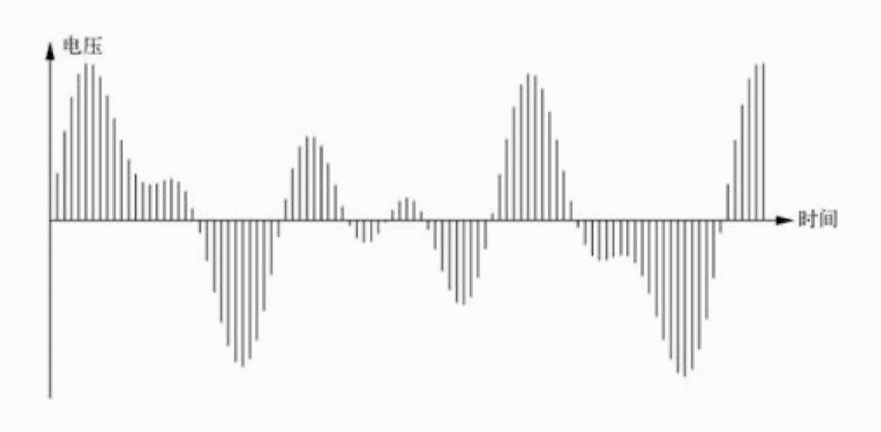
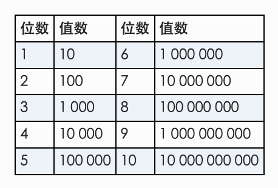
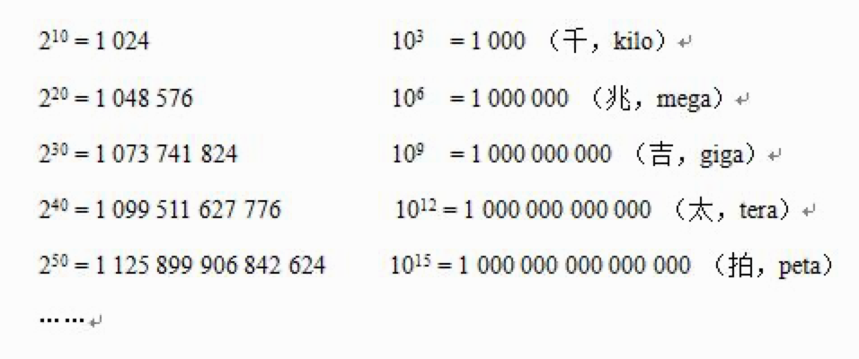
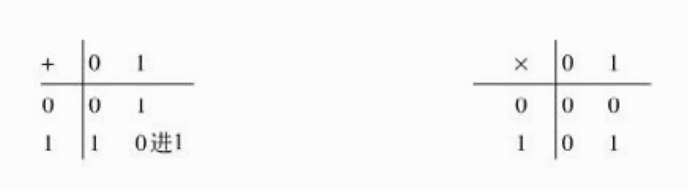

# 02 比特、字节与信息表示

这一章，我们来讨论计算机表示信息的三个基本思想。

首先，计算机是数字处理器。它们存储和处理离散的信息，这些信息表现为不连续的块，具有不连续的值，基本上就是一个个数值。而与之相对的模拟信息，则是平滑变化的值。

其次，计算机用比特表示信息。比特就是二进制数字，即一个非 0 即 1 的值。计算机中的一切都用比特来表示。计算机内部使用二进制，而不是人们所熟悉的十进制。

再次，较大的信息以比特组表示。数值、字母、单词、姓名、声音、照片、电影，以及处理这些信息的程序所包含的指令，都是用比特组来表示的。

本章关于数字的讨论并不是非看不可，但其背后的思想却非常重要。

## 2.1 模拟与数字

首先，我们谈一谈模拟与数字的区别。「模拟」（analog）与「类似的」（analogous）词根相同，表达的意思是：值随着其他因素变化而平滑变化。现实生活中的很多事物都具有模拟性质，比如水龙头或汽车方向盘。如果你想让车转个小弯，轻轻打一打方向盘即可，打多打少由你自己来定。拿它跟转向灯作个比较，后者要么开要么关，没有中间状态。在模拟装置中，某些事物（汽车转弯幅度）会随另一些事物（方向盘转动幅度）的变化平滑而连续地变化。变化过程没有间断，一个事物的微小变化就意味着另一个事物的微小变化。

数字系统处理的是离散值：可能的取值是有限的（转向灯只可能是关闭的或在左右方向打开）。某个事物小小的变化，要么不引发其他事物变化，要么就引发其他事物的突变，使其从一个离散的值跳到另一个离散的值。

比如手表。「模拟」手表有时针、分针和秒针，秒针每分钟转一圈。虽然现代的手表都由内部的数字电路控制，但时针和分针仍然随着时间流逝而平滑移动，而且三根表针都能走遍所有可能的位置。数字手表或手机时钟显示的时间只有数值。显示屏每秒变化一次，每分钟更新一次分钟的值，但不会显示分钟的小数位。

再比如汽车的速度表。大多数汽车都有模拟速度表，速度指针平滑地上下移动，按比例指示汽车的速度。从一个速度到另一个速度的过渡是平滑的，没有间断。与之相对，汽车的 GPS 导航仪则用数字来显示最接近的时速，不管单位是英里 / 小时还是公里 / 小时。稍微加点速，速度值会从 65 变成 66，再减点速就又变回 65，但永远不会出现 65.5。

又比如温度计。温度计的红色液体（通常是染色酒精）或水银柱是模拟的：液体会随着温度变化按比例膨胀或收缩，因此温度产生较小的变化，液体柱高度也会相应产生较小变化。但大楼外面显示温度的广告牌则是数字的：显示屏显示的是数值，温度介于 36.5 和 37.4 之间时，它都显示为 37。

这可能会导致一些奇怪的情况。几年前，我在美国高速公路上开车，收听到加拿大电台的节目。加拿大采用公制单位，播音员出于好意，想照顾到所有美加的听众，就如此宣布说：「刚才的一小时，华氏度上升了一度，摄氏度没有变化。」

有人要问，为什么用数字而不用模拟呢？我们这个世界可是模拟的呀，而且手表、速度表等等模拟设备也更容易让人一目了然。但不管怎样，很多现代的技术都是数字的，而且我们这本书也是在讲述数字的故事。外部世界的数据 —— 声音、图片、运动、温度，等等一切，在输入端都会尽可能早地转换为数字形式，而在输出端则会尽可能晚地转换回模拟形式。原因就在于数字化的数据容易处理，无论最初来源是什么，数字化数据都可以用多种方式来存储、传输和处理，但模拟信息则不行。第 9 章将会介绍，通过删除冗余和不重要的信息，还可以压缩数字化信息。为了安全和隐私可以对它进行加密，可以将它与其他数据合并，可以复制它而不出错，可以通过互联网把它发送到任何地方，可以将它保存到几乎无限种设备中。而对于模拟信息，上述很多做法是根本行不通的。

与模拟系统相比，数字系统还有另一个优势，就是它更容易扩展。比如说，给模拟天文馆增加一颗新发现的星星，专业人员必须辛苦地做出光照效果来；而在数字天文馆，只要在数据文件里添加一行信息即可。我的数字手表可以连续不断地以百分之一秒显示时间流逝，而要让模拟手表做到这一点可就太难了。不过，模拟系统有时候也有它的优势，像泥版、石雕、羊皮纸、图书和照片等古老的媒体，都经历了数字格式未曾经历过的时间考验。

## 2.2 模数转换

怎么把模拟信息转换为数字形式？我们还是举几个简单的例子吧，先说照片和音乐，通过它们可以说明一些重要的思想。

把照片转换为数字形式，应该是最容易想象的了。假设我们给自家的小猫拍张照片：

胶卷相机的成像，是通过把胶片感光区曝露给被拍物体反射的光线实现的，胶片上不同区域接收到的不同颜色的光量不同，从而影响胶片上的染料。在胶片显影、印相时，彩色染料数量决定了显示出来的颜色变化。

对数码相机来说，镜头把影像聚焦到一块位于红、绿、蓝滤镜后面的矩形感光器阵列上，感光器由微小的光敏探测器组成。每个探测器存储一定数量的电荷，与落在它上面的光量成正比。这些电荷被转换为数字值，照片的数字表示就是这些表现光强度的数值序列。探测器越小，数量越多，电荷测量的结果就越精细，数字化图像就能越精确地反映原始的影像。

传感器阵列的每个单元都由一组能够捕获红、绿、蓝光的探测器构成，每个单元对应一个像素，即像元。3000×2000 像素的图像，包含 600 万个像元，或 600 万像素，对今天的数码相机而言并不算大。像素的颜色通常由三个值表示，分别代表红、绿、蓝光的强度，因此 600 万像素的图像总共要存储 1800 万个颜色值。屏幕在显示图像时，使用的是红、绿、蓝光三元组的阵列，其亮度与像素亮度一致。如果你用放大镜仔细观察手机或电脑屏幕，很容易看到每个独立的彩色块。

第二个模数转换的例子是声音，尤其是音乐。之所以说音乐是个不错的例子，原因在于以它为代表的数字信息的所有权，第一次引起了社会、经济和法律上的广泛关注。数字音乐与唱片或磁带不同，你可以在自己家的计算机里无限次地复制它，完全免费，而且还可以通过互联网把它复制发送到世界的任何角落，不会有任何音质损失，同样完全免费。唱片业把这当成了严重的威胁，试图通过法律或政治手段阻止数字音乐的拷贝。这场战争远未结束，每天都有小规模的战役打响，因此而对簿公堂和引爆政治辩论俨然成了家常便饭。

什么是声音？音源通过振动或快速运动引起空气压力的波动，人的耳朵把这种压力变化转换为神经活动，经大脑解释之后就形成了「声音」。1870 年代，托马斯·爱迪生制造了一个叫做「留声机」的机器，这台机器能把声波转换为蜡筒上类似的螺旋沟槽，而通过这些沟槽又能再次创造出同样的气压波动来。把声音转换为沟槽就是「录音」，而从沟槽换回到气压波动就是「回放」。爱迪生的发明迅速地得到改进，1940 年代就出现了密纹唱片（long-playing record）或简称 LP，而且至今还在使用（尽管数量已经不多了）。麦克风随着时间推移把变化的声压转换为变化的值并记录下来，然后根据这些值在乙烯基的盘片上压制出与声压一致的螺旋沟槽。播放 LP 时，唱针随着沟槽起伏，其运动轨迹被转换为波动的电流，电流经过放大后驱动扬声器或耳机，通过它们的振动薄膜产生声音。

把空气压力随时间的变化形象地绘制出来并不难。其中压力可以用任何物理方法来表示，在此我们假设用电路中的电压。当然，电流、光的亮度，以及爱迪生发明的留声机中的纯机制装置都没有问题。

图中声波的高度表示声音强度或大小，水平方向的坐标轴表示时间：每秒钟声波的数量就是声调或频率。

假设我们以固定时间间隔连续测量这条曲线的高度（在这里就是电压值），就会得到下图所示的这些垂直线条。

测量得到的数值连接起来与曲线近似，测量越频繁，越准确，结果也就越吻合。测量得到的数值序列是波形的数字化表示，可以存储、复制、操作它们，也可以把它们发送到任何地方。如果有设备把这些数值转换成对应的电压或电流，然后再通过电压或电流驱动音箱或耳机，就能够实现回放。从声波到数值是模数转换，相应的设备叫 A/D 转换器；反过来当然是数模转换，或者叫 D/A。转换过程并不是完美无缺的，两个方向的转换都会损失一点信息。但大多数情况下，这种损失是人所觉察不到的（当然，也有不少唱片发烧友会说 CD 音质不如 LP 好）。

1982 年左右，音频光盘（或 CD）面世，成为最早承载数字声音的产品。今天的读者，恐怕没有谁不认识这个标志：

与 LP 唱片上的模拟沟槽不同，CD 用长长的螺旋状轨道在盘面的一侧记录数值。轨道上任意一个区块的表面要么平滑，要么是一个微小的凹坑。这些下凹或平滑的区块就是用来编码声波的数字值的，每个区块是一位，连续的多位表示二进制编码中的一个数值，二进制的概念我们在下一节再介绍。光盘旋转时，一束激光照射到轨道上，而光电传感器则检测每个区块上反射回来的光量多少。如果光量不多，说明是凹坑；如果反射光很强，说明不是凹坑。标准 CD 编码采样率为每秒 44 100 次，而每次采样获得两个振幅值（立体声的左、右声道），精确度为 65 536（即 216，这并非巧合）分之一。轨道上的每个区块非常非常小，小到只有用显微镜才能看见，一张 CD 的表面上有 60 亿个小区块。（DVD 中的区块更小，由于区块更小，激光束频率更高，DVD 的存储容量近 5GB，而 CD 大约为 700MB。）

音频 CD 的出现几乎让 LP 没有了立足之地，相比之下，CD 的优点实在太多了：落上点灰尘也不用太担心了，更没有磨损一说，而且绝对小巧。但到了我写这本书的时候，LP 开始在某种程度上复苏，流行音乐 CD 的人气则日渐衰退。有朝一日，CD 很可能也会像 LP 一样变成古董，这倒让我很高兴，因为我收藏的音乐全部都是 CD 格式的。我现在完全拥有它们，而它们的存在将比我的生命更久远。CD 还有第二个用途，那就是作为存储、分发软件及数据的介质，不过这个功能已经被 DVD 取代，而 DVD 很可能又会被下载所取代。

声音和图片经常会被压缩，因为这两种媒体包含很多人类根本感知不到的细节。对于音乐，典型的压缩技术是 MP3，大约能把音频文件的体积压缩到原来的十分之一，同时几乎让人感觉不到音质下降。对于图片，最常用的压缩技术是 JPEG（是制定该标准的联合图像专家组 ——Joint Photographic Experts Group 的英文字头），它的压缩率也能达到 10 倍甚至更高。上文提到很多处理对数字信息能做，但对模拟信息却很难（或不可能），压缩就是一个例子。第 9 章我们再进一步探讨压缩。

那电影呢？1870 年代，摄影师埃德沃德·迈布里奇向世人证明，快速连续地显示一系列静态图片能够创造出运动的错觉。今天，电影显示影像的速度是每秒 24 帧，而电视大约是 25 到 30 帧，这个速度足以让人的眼睛把顺序播放的影像感知为动画。而通过组合（并同步）声音和影像，就可以创造出数字电影。而利用压缩技术减少空间占用，则催生了包括 MPEG（代表 Moving Picture Experts Group）在内的标准电影格式。实际上，视频的表示要比单纯的音频表示更复杂，一方面是它本身就复杂，另一方面很大程度上还因为它受到了电视的拖累，而电视在其存在的大部分时间内都是模拟的。模拟电视在世界范围内正逐渐被淘汰，而美国 2009 年已经将广播电视切换成了数字信号。

还有一些信息很方便以数字形式来表示，因为除了想好如何表示它之外，根本不需要做什么转换。比如这本书中的文字、字母、数字和标点符号，我们称为其普通文本。可以为其中每个字母指定一个唯一的数值，如 A 是 1，B 是 2 等等，这不就是一种数字化表示方法嘛。而事实也正是如此，只不过在表示标准中，A 到 Z 用的是 65 到 90，a 到 z 用的是 97 到 122，数字 0 到 9 用的是 48 到 57，而标点符号等其他字符用的是其他数值。这个表示标准叫做 ASCII，即 American Standard Code for Information Interchange（美国信息交换标准代码）。

下面给出了 ASCII 中的部分标准编码，前四行被我省略了，因为其中包含的都是些制表符、空格符等非打印字符。

不同地区有不同的字符集标准，但也有一个世界通用的标准叫 Unicode，它为所有语言的所有字符都规定了一个唯一的数值。这是一个非常庞大的字符集，人类的创造力是无穷无尽的，但在建立自身书写系统方面却很少有规则。目前，Unicode 涵盖的字符远远超过 100 000 个，而且这个数字还在稳步增长。可想而知，Unicode 中的大部分都是包括中文在内的亚洲字符集，但决不限于此。要了解 Unicode 都包含哪些字符集，可以访问 unicode.org，这个站点内容丰富，强烈推荐读者去看一看。

一言以蔽之：数字表示法能够表示上述所有信息，以及任何可以转换为数值的信息。因为只有数值，所以就可以用数字计算机来处理，而且正如第 9 章要介绍的，还可以通过互联网等通用数字网络将它复制到其他计算机上去。

## 2.3 比特、字节与二进制

「世界上只有 10 种人，理解二进制的和不理解二进制的。」

数字系统用数值来表示所有信息，但使用的却不是我们熟悉的（以 10 为基数的）十进制，这乍一看让人有点纳闷。那使用几进制？使用二进制，也就是逢 2 进 1 的数制。

虽说是人都或多或少懂点数学，但以我的经验来看，人们对数值的理解有时候并不靠谱。这一点从描述（再熟悉不过的）十进制和（多数人不熟悉的）二进制之间的关系就可以看出来。在这一节里，我会尽最大努力讲得通俗易懂，万一你听不懂或者我没讲清楚，你只要不断对自己重复一句话：「跟普通的数一样，只不过是逢 2 而不是逢 10 进 1。」

2.3.1 比特

表示数字信息的最基本单位是比特（bit）。英文 bit 是合并 binary digit（二进制数字）之后造出来的，造这个词的人是统计学家约翰·图基，时间是 1940 年代中期。（图基还在 1958 年发明了单词 software—— 软件。）据说，鼎鼎大名的氢弹之父爱德华·泰勒更喜欢「bigit」这个词，但这个词最终没有流行起来，真是谢天谢地。binary 是指只有两个值的东西（前缀「bi」的意思就是「两个」），事实也的确如此：一个比特就是要么是 0 要么是 1 的一个数，没有其他可能。而十进制中有 0 到 9，共有 10 种可能的值。

只用一个比特，可以表示任何二选一的事物。这种二选一的例子比比皆是：开 / 关、真 / 假、是 / 否、高 / 低、进 / 出、上 / 下、左 / 右、南 / 北、东 / 西、男 / 女，等等。一个比特足以让人确定选择了两个中的哪一个。举个例子，我们可以用 0 表示「关」，用 1 表示「开」，或者反过来，哪个值表示哪个状态都无所谓，只要大家都没有意见就行。这张图是我的打印机的电源开关，由此可见，惯例还是用 0 表示「关」，用 1 表示「开」。

一个比特表示开 / 关、真 / 假之类的二选一的情形没有问题，但我们经常还要面对更多选项，表示更复杂的事物。为此，可以使用一组比特，然后为不同的 0 和 1 的组合赋予不同的含义。比如，可以用两个比特来表示大学四年：新生（00）、大二（01）、大三（10）和毕业班（11）。如果再多考虑一种情况，比如研究生，那两个比特就不够用了，因为两个比特只有 4 种组合，没有第五种可能。但是三个比特没问题，实际上三个比特能表示 8 种不同的情况，这样我们就可以把教师、教工和博士后都包含进来。三个比特的全部组合为：000、001、010、011、100、101、110 和 111。

比特数与它们所能表示的情况数之间有一个关系，很简单：N 个比特能表示 2N 种组合，即 2×2×2…×2（乘 N 次）。据此，就有：

对于十进制数呢？其实也有类似的关系：N 个十进制数字，可以表示 10N 种不同的情况（我们称之为「数值」）：

2.3.2 2 的幂和 10 的幂

由于计算机中的一切都是以二进制形式来处理，因此像大小、容量等概念一般都是用 2 的几次幂来表达的。如果有 N 比特，那么就有 2N 种可能的值，所以知道 2 的幂是多少（比如到 210）是很有用的。但随着数值越来越大，完全记住它们也没有什么必要。好在有一种简便的方法，可以得到它们的近似值：2 的某次幂与 10 的某次幂接近，它们的对应关系严格有序，容易记忆：

（这个对照表最后包含的表示大小的单位叫「拍」或 1015，其英文单词发音不是「皮」而是「拍」。另外，书后附有一个更全的词汇表，列出了更多单位。）随着数值增长，这个近似值的误差也会增大，不过到了 1015 这么大的时候误差也就 12.6%，所以还是可以在很大范围内使用的。经常会有人混淆上述 2 的幂与 10 的幂之间的关系（有时候是想用来支持他们的观点），于是 kilo 或 1K 可能是指 1000，但也可能指 210 即 1024。一般来说，这种混淆导致的误差并不大，因此在涉及很大的比特数时，用 2 和 10 的幂来做心算没什么问题。

说起来可能有点不值当的，但这种差异有时候也会带来麻烦。例如，著名硬盘驱动器制造商美国希捷公司，就曾因为这种差异在加州卷入一场集体诉讼。「原告称希捷公司对存储容量的术语 gigabyte（或 GB），使用的是十进制定义，即 1GB = 109（1 000 000 000）字节，这是在误导消费者，因为计算机操作系统报告硬盘容量时，使用的是 GB 的二进制定义，即 1GB=230（1 073 741 824）字节，相差大约 7%。」我个人并不认为很多消费者被严重误导了，但希捷公司选择了和解，并没有据理力争。

2.3.3 二进制数值

如果每个数字都能按照通常的进位法则来解释，那么一系列比特就可以表示一个数值，只不过此时的基数是 2，而不是 10。0 到 9，共 10 位数字，足以为 10 个项目计数或分配标签。如果数量超过 10，则必须使用更多位数字，比如两位十进制数字可以表示的数值或标签能达到 100 个，即 00 到 99。多于 100 的时候，就要用三位数字，其表示的范围是 1000，即 000 到 999。（根据约定俗成的做法，我们平时不会写出数值前导的零，但这些零是暗含的。另外，我们平时计数也都从 1 而非 0 开始。）

十进制数值实际上是 10 的某次幂之和的简写，比如 1867 就是 1×103+8×102+6×101+7×100，即 1×1000+8×100+6×10+7×1，即 1000+800+6+7。上小学的时候，你把它们叫做个位、十位、百位……。这些概念我们太熟了，熟到根本不用去想。

二进制数也一样，只不过基数是 2，不是 10，而且只涉及 0 和 1 两个数字。比如可以把二进制数 11101 看成 1×24+1×23+1×22+0×21+1×20，用十进制来表示，就是 16+8+4+0+1，即 29。

既然比特序列可以解释为数值，那么自然就有了为项目分配二进制标签的模式：按数值顺序排列。前面我们看到了为新生、大二、大三、大四学生分配的标签 00、01、10、11，它们分别是十进制数值的 0、1、2、3。紧接着的序列是 000、001、010、011、100、101、110、111，也就是十进制数值 0 到 7。

下面我们做个练习，看你理解了多少。我们都熟悉扳着自己的手指从一数到十，要是你用二进制数来数（每个手指，包括大拇指，都代表一位二进制数），最大能数到多少？值的范围有多大？如果你数到 132，发现它的二进制表示是一个似曾相识的手势，那说明我前面讲的你都理解了。

前面我们都看到了，把二进制转换成十进制很容易：只要把相应位置上值为 1 的 2 的对应次幂加起来即可。而把十进制转换成二进制要难一些，但也不太难。就是反复地用 2 除十进制数。每次除完，把余数写下来，要么是 0，要么是 1，然后再用 2 除商。这样反复除下去，直到原来的数被除到等于 0。最后得到的余数的序列，就是相应的二进制数，但顺序相反，所以要倒转一次。

举个例子，把 1867 转换为二进制数的步骤如下：

反向读取这些位，能得到 111 0100 1011，把相应位上为 1 的 2 的对应次幂加起来可以验算：1024+512+256+64+8+2+1＝1867。

整个过程的每一步都会产生剩余数值的最低有效位（即最右边的位）。其实，把一个很大秒数表示的时间转换成日、时、分、秒的过程与此类似：除以 60 得到分钟（余数是秒），结果除以 60 得到小时（余数是分钟），结果再除以 24 得到天数（余数是小时）。区别在于时间转换使用了不止一个基数，而是先后用到了 60 和 24。

二进制的算术实在太简单了。因为总共才两个数字，加法和乘法表都只有两行两列。

虽然你将来不太可能自己动手做二进制算术，但这两个如此简单的表，其实也说明了为什么相对于十进制算术，执行这种计算的计算机电路要简单得多。

2.3.4 字节

在所有现代计算机中，数据处理及内存组织的基本单位都是 8 个比特。8 比特被称为 1 字节，而字节（byte）这个词是由 IBM 的计算机设计师维尔纳·巴克霍尔兹（Werner Buchholz）在 1956 年发明的。一个字节可以编码 256 个不同的值（28，即 8 个 0 和 1 的所有不同组合），这个值可以是一个 0 到 255 间的整数，也可以是 ASCII 字符集中的一个字符，或者其他什么。通常，为了表示更大或更复杂的数据，需要用到多个字节的字节组。两个字节有 16 比特，也就是 16 位，可以表示 0 到 216-1（65 535）之间的数值。两个字节也可以表示 Unicode 字符集中的一个字符，比如以下字符中的任意一个：

这是两个字符，即「东京」，每个字符占两个字节。四个字节是 32 位，既可以表示「东京」，也可以表示最大直至 232-1 的值，这个最大值大约是 43 亿。用一组字节表示什么都可以，但 CPU 自己特别定义了一些适中的字节组（比如表示不同大小的整数），以及处理这些字节组的指令。

要是你想把一或多个字节表示的数值写出来，那可以用十进制，如果它真是一个数值的话，十进制是最适合人类看的。如果你想看清每一个比特，特别是在不同比特编码不同信息的情况下，那还是二进制更方便。然而，二进制写起来太长了，比十进制格式长三倍还多，因此我们常用另一种替代数制，即十六进制。十六进制的基数是 16，因此也就有 16 个数字（就像十进制有 10 个数字，二进制有 2 个数字一样），分别是 0、1、…、9、A、B、C、D、E、F。每个十六进制数字表示 4 个比特，对于一般的数值，十六进制 0 相当于二进制 0000，依此类推，十六进制 9 相当于二进制 1001。接下去，十六进制 A 相当于二进制 1010（十进制 10），十六进制 B 相当于二进制 1011（十进制 11），依此类推，十六进制 F 相当于二进制 1111（十进制 15）。

除非你是程序员，否则能看到十六进制数的机会并不多。一个例子就是网页中的颜色值。前面说过，计算机中一个像素的颜色值大都使用三个字节来表示，一个表示红色分量，一个表示绿色分量，最后一个表示蓝色分量，这就是所谓的 RGB 编码。红绿蓝三个组分分别用一个字节表示，因此红色分量就有 256 种可能的值，三个组分中的绿色分量也有 256 种可能的值，同样，三个组分中的蓝色分量也有 256 种可能的值。于是一个像素可能的颜色值就是 256×256×256 种，听起来好多啊。我们可以用 2 和 10 的幂来简单估计一下这个数有多大。这个数是 28×28×28，即 224 或 24×220，大约是 16×106，即 1600 万。在描述计算机显示器的情况下，你可能听说过这个数（「超过 1600 万种颜色！」）。

一个深红色的像素可以表示为 FF0000，换句话说，就是红色分量最多，没有绿色和蓝色；而一个鲜蓝色（并非深蓝色），即类似很多网页中链接的颜色，可以表示为 0000CC。黄色是红加绿，因此 FFFF00 就是最深的黄色。阴影的灰色具有等量的红、绿、蓝组分，因此一个中等灰度的像素应该是 808080，也就是红、绿、蓝组分的数量都相等。黑色和白色分别是 000000 和 FFFFFF。

Unicode 编码表就使用十六进制来表示字符：

上面两个字符的十六进制编码为 6771 4EAC。第 8 章将会介绍以十六进制表示的以太网地址，第 10 章则会讨论用十六进制表示 URL 中的特殊字符。

有时候，在某计算机的广告中，我们会看到「64 位」这个说法（「Windows 7 家庭高级版 64 位」）。什么意思呢？计算机在内部操作数据时，是以不同大小的块为单位的，这些块包含数值（32 位和 64 位表示数值比较方便）和地址，而地址也就是信息在 RAM 中的位置。前面所说的 64 位，指就是地址。大约 25 年前，16 位地址升级到了 32 位地址（足够访问 4GB 的 RAM），而现在 32 位又升级到 64 位。我不想预测什么时候会从 64 变成 128，总得过上好一阵子吧，先不必想那么多。

关于比特和字节，我们讨论到现在最重要的是必须知道，一组比特的含义取决于它们的上下文，光看这些比特看不出来。一个字节可以只用 1 个比特来表示男或女，另外 7 个空闲不用，也可以用来保存一个不大的整数，或者一个 #之类的 ASCII 字符，它还可能是另一种书写系统中一个字符的一部分，或者用 2、4 或 8 个字节表示的一个大数的一部分，一张照片或一段音乐的一部分，甚至是供 CPU 执行的一条指令的一部分。

事实上，一个程序的指令就是另一个程序的数据。从网上下载一个新程序，或者从 CD-ROM 或 DVD 中安装该程序时，它就是数据，所有比特将无一例外地被复制一遍。但在运行这个程序时，它的比特会被当成指令，CPU 在处理这些比特时，又会把它们当成数据。

## 2.4 小结

为什么用二进制而不用十进制？因为制造只有两种状态（如开和关）的物理设备，比制造有十种状态的设备更容易。这种简单的性质在数不清的技术中都得到了利用，比如：电流（流动或不流动）、电压（高或低）、电荷（存在或不存在）、磁性（南或北）、光（亮或暗）、反射率（反光或不反光）。约翰·冯·诺依曼很早就清楚地认识到了这一点，他在 1946 年说过：「我们储存器中最基本的单位自然是采用二进制系统，因为我们不打算度量电荷的不同级别。」

为什么我们要知道或者要关心二进制数呢？这个问题问得好。至少在我的课上，理解另一种不熟悉的数制，相当于做了一次量化推理的练习，而有了这个训练之后，对我们习以为常的十进制的理解也将更深一层。除此之外，另一个意义在于，比特的数量在一定程度上揭示了涉及的空间、时间或者复杂性。再从根本上说，计算机值得我们花时间去理解，而二进制正是其运作的核心所在。

现实生活中也能找到一些与计算机无关的应用二进制的场景，或许是因为人们都认为大小、长短的加倍、减半是一种自然而然的运算。比如，高德纳在《计算机程序设计艺术》中描述了 14 世纪英国的酒器单位，分为 13 个二进制量级：2 吉耳是 1 超品（chopin），2 超品是 1 品脱，2 品脱是 1 夸脱，依此类推，直到 2 百瑞尔（barrel）是 1 豪格海（hogshead），2 豪格海是 1 派普（pipe），2 派普是 1 坦恩（tun）。这些单位中差不多还有一半仍然在英制液体度量体系中使用。当然，其中一些很令人陶醉的词，比如费尔金（firkin）和基尔德坎（kilderki）（2 费尔金是 1 百瑞尔），今天已经很难得见了。

