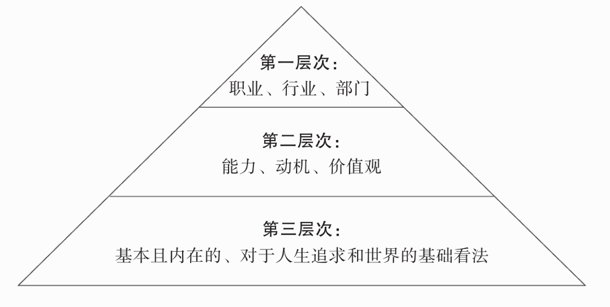

# 04 深层的改变

在重塑自我的过程中，我们会做出两种改变：发展方向的微调和观念的深层改变。通常来说，我们所做的最初的改变是浅层的改变。我们只是试着去做一些没做过的工作，与新认识的人交流，去学习一些新技能。即使做出深层改变的需求变得迫切，但当事人对于改变的意义仍然是不明确的。各种微小的变化会不断发生，但会受到固有的习惯、对各种情况的设想以及做事情的优先顺序等因素的制约。一段时间以后，这些限制因素会随着当事人不断获得新的信息而不复存在。而各种微小的变化迟早会积少成多，最终形成一个更深层的变化，从而改变我们的生活。

当然，这里所说的微小的变化并非无关紧要。事实上，它们往往是解决让我们不堪重负的职业问题的唯一方法。我们会在苏珊·方丹的故事中看到，打算一开始就进行重大的改变往往很快就会遭遇失败，从头开始。尽管进两步再退一步看起来像是在浪费时间，其实这么做往往可以让自己更明确自己新的职业身份。如果我们过早地中断重塑的过程（苏珊就差点那么做），那将危害我们将「新的自我」进行彻底内化的能力。通常直到我们自我重塑后很长时间，我们才会意识到一件事情 —— 我们必须重新评估我们工作身份的基础。在苏珊的案例中，她发现，要实现自己的目标，不仅要解决工作方面的问题，更要平衡自己的工作和生活。她同时也发现，需要对自己进行深层的改变才能实现那种平衡。

## 01. 苏珊的故事

38 岁的英国人苏珊·方丹是一位拥有工商管理硕士学位的高管。圣诞节后的第一天，她突然有了一种不祥的预感。她刚刚从一个顶尖的管理咨询公司辞掉合伙人和企业战略业务主管的职位，一部分原因在于她是有着两个孩子的单身母亲，而那份工作使得她根本无暇顾及家庭。但是，正如她所形容的，「刚出刀山，又入火海」。事情总是不尽如人意。她已经接受了一份相似的工作 —— 一家英国顶级公司高级主管的职位。

我在欧美嘉咨询公司待了大约 9 年的时间，经历了很多变化。我刚从商学院毕业时的最早的战略合作伙伴已经被一个更大的企业所收购，然后我们又被一家变革管理咨询公司所兼并。在这些变化中我做得都很好，但是当我们到了准备开始重组的下一个阶段，之前出现过的问题再次出现了，似乎我们并没有从过去的问题中得到什么教训。我和我的许多同事由此对公司非常不满。公司经常置客户的利益于不顾。另外，我感觉我在那家公司已经学不到什么东西了。我开始考虑离开，但因为我一直很努力地工作，而且我有两个孩子，所以我不知道我能做什么，更不知道我接下来到底想要什么。不过，我很清楚地知道，我不想再进另外一家咨询公司了，到一家新的公司去做同样的事情对我已经完全没有吸引力了。

我发现猎头对我也基本没什么帮助。我曾问他们：「这是我的技能，我还能做什么其他的工作？」他们的回答都是：「你为什么不去安达信（曾是全球收入总额最高且最有影响的会计师事务所和财务咨询公司）或贝恩（一家全球领先的战略咨询公司）？」他们所有人的建议几乎如出一辙。我的回应则是：「我很清楚我不想继续做那些了，如果我想做，我就不会来找你们了。我可以自己找份类似的工作。」那是一个毫无意义的过程。

我唯一能想到的就是一些企业规划类的工作，类似于我现在所做的事情。但我希望出差频率和工作的时间都可以减少一些。我没有什么时间去调查研究。我只是想要一种相对简单的生活方式。我想找个全职工作，但不想经常出差，如果待在咨询公司就必须那么做。我已经很清楚地告诉过猎头公司我的想法，但它们的建议仍然一成不变，无一例外都是出差，给公司提一些在我看来没什么用的建议。

我之前的一位客户听说我正在找工作，于是给我提供了一个工作机会。我受宠若惊，没怎么想就去面试了。那是一家很棒的公司，着实让人兴奋。我和他们一起共事过，因此我认识他们公司的战略总监，也很喜欢那家公司。我当时认为这将是一个很好的职业转型的机会（他们公司简直是追着要我去，其实那个人之前就明确表示过他希望我去他那里工作）。我告诉他，我打算离开咨询行业，因为我不喜欢一直忙碌的节奏和无休止的出差。我当时以为我们对彼此的想法都很了解，所以我接受了战略项目负责人一职。

我很快就知道自己犯了一个错误。我上班的第二天，就发现自己的日程被排满了，而且很多工作还在国外。我的确是想找一个好工作，但我有两个孩子，而且他们的生活已经受到了很大的影响。我看出来了，这份工作跟之前的工作一样，不能让我自主地安排自己的时间，或许还不如之前的公司，因为我在这家新公司暂时还只是一个无名之辈。

我当时就想：「我都干了些什么呀？」我曾经有机会离开这一切，可是都没有事先去彻底想明白自己的选择。我已经很长时间没有换过工作了。我都没有勇气去休息一段时间，给自己一些空间和时间来思考一下。我只是马不停蹄地开始做另一个工作，都不曾允许自己退后一步去考虑：我还可以做些其他什么事情，这是否就是我想要的？

我在那家公司只待了两周。起初，我认为应该待上一段时间才对，毕竟我曾经答应过来工作。几天后，我就发现别说两周了，那些工作量两年都做不完，因为我收到的提案数量在快速增加。我应该一开始就离开。

同样，如果我留下来，我也无法平衡工作和生活，是我没找对地方。这让我感到非常不安，因为无论是从简历还是经验来看，某种程度上来说，我都是最适合做这份工作的。我差点就这么说了，但其实主要原因还是工作和生活的平衡问题。从某种意义上说，这是一种「身为母亲的选择」，但我认为这也跟价值观有关。我在欧美嘉咨询公司曾经的完整形象已经破碎，而我现在已经跳到了另一家充满内斗的大公司（这家公司里被争论的事情往往并不是当务之急）。这个情况对于我个人来说也未必是坏事，因为这样我才会想清楚：「不，这样是不对的。」但在商业领域中，做出任何一个决策都绝非易事，不可能没有争论。

苏珊最近刚刚离婚，而且暂时还没有第二份收入来减轻她的决定对她生活造成的影响。

辞职的感觉，就像一个身在 80000 英尺 [1] 高空的人，没带降落伞就从飞机上跳下来。我一时间不知所措。我并不后悔，而是怀疑我的判断是否正确。我问自己：「为什么我会接受一份不适合自己的职业？」我也想知道：「如果这是错误的职业，那么正确的又是什么？」我不想回到那些一直跟我谈论工作问题的人那里。我想要一些空间，但同时也感受到了相当大的经济压力。我知道自己必须快速地重新开始工作，但是我也知道，未经仔细思考就快速跳槽到另一份工作的做法已经伤害到了自己。我意识到，自己确实需要一些时间去好好想想。

在节日期间的圣诞聚会上，苏珊见到了很多老客户，他们听说了她的情况后，都说要打电话给她，并邀请她共进午餐。在过了新年之后的通话里，苏珊告诉他们自己辞职了，于是许多人都愿意提供一些兼职的项目给她做。她发现这才是她需要的平台。「我过去甚至从未考虑过要做自由职业，只是希望可以有一些自己的空间。不过，抱着‘从头再来’的心态临时接下几个这样的工作，而不是当作长期的工作方式，还是挺不错的。」

苏珊作为自由职业者接下的第一个项目和她之前的工作是一样的。她很快发现自己基本上可以回到之前的收入水平，没有任何困难。以往的那种大难临头般的焦虑感已经不在了，于是苏珊开始去尝试一些她一直想做的事情。她联系了一两家慈善机构，她曾在那里做过志愿者，并用自己营销和战略规划方面的专业知识帮助过它们。这件事情使得她参与到国际视力保护的公益活动中。苏珊帮助非营利组织策划了一些大型的筹款活动。当得知他们其实非常希望更年轻、有更明确的商业目的的代表参与进来，并且希望有更平衡的男女比例时，苏珊跟他们签约了。

我正式开始了自由职业，主要为之前的客户提供服务，同时也参与慈善活动（我并不把它看作工作）。这就是我在那段迷茫期的一段历程。大约两年之后，「志愿者工作」变成了我的主要工作。我的深度改变的第一步发生在几个月之后，那时我意识到了自己并不想再找一份全职工作了。我的收入很不错，也很享受自由职业的生活方式。如果不是之前体验了那两周的工作，我决不会冒险去做自由职业者。但是自从做了之后，我才发现这种工作状态真的很适合我。

几年之后，很明显的是，我的生活状况越来越好，我能够做很有趣的工作，我的人脉圈子也对自己很有帮助。我开始想：「那么，这真的是我想要做的事情吗？」我喜欢现在这种独立的生活方式，其实现在的工作和自己的价值观与之前是一样的。通过参与公益性的慈善工作，我开始有了更多的付费的慈善咨询业务。这大概是在我从事自由职业两年之后的事情了。

目前，我为英国最大的专门从事慈善事业的咨询公司提供服务。公司帮助我建立了自己的部门。这可能是通向下一个阶段的过渡阶段，但我知道自己肯定还会在慈善领域，因为我非常热爱它。我可能会做一个独立的承包商，也可能做和咨询相关的全职工作。我希望的是，自己不会再在发现自己的需要之前就草率行动，不会再犯这类错误。

[1] 1 英尺 = 0.3048 米。

## 02. 小成功带来大变化

苏珊的一个重大的失策就是在她刚准备职业转型的时候就接受了一份「新瓶装旧酒」的工作。像许多人一样，在还没有想好方向的时候，她就开始转型了，她之所以这么做，仅仅是出于逃避难以忍受的工作环境的本能。苏珊并没有在转型过渡期时惴惴不安，而是相信自己一定能找到「好工作」。但做出这个大胆决定的时机其实并不成熟，因为她一开始并不明确到底是什么样的价值观和设想使她做出了那样的选择。

到辞职的时候，很明显，苏珊自己想做的工作和看重的事情都在发生着变化。但到底是做一个理性得不近人情的工商管理学硕士应该从事的工作，一心扑在事业上，还是像一个母亲，以自己的家庭和孩子为重，苏珊的内心非常矛盾。所想和所做的不一致，导致苏珊之后的生活出现了问题。她找了一个错误的工作，这个工作与自己先前的设想完全不同，也打破了自己的原有安排。因为接受这一工作时过于仓促，所以苏珊并没有考虑过其他的工作，没有去尝试，也没有总结之前的经验教训，当发现工作不适合自己的时候，她开始怀疑当时自己的决定了。此时，苏珊仍然没有意识到是自己的错误决定打破了原有的平衡，因此，她并没有通过这次错误的决定来反思过去的得失以及接下来应该怎么做。不过，她很明智地没有仓促决定，而是给了自己较长的时间来寻找答案。1

那些可以生动、清楚地让我们知道自己不想成为什么样的人的尝试很重要，但还不是全部。加里曾对「保守型」选择进行了不断的尝试，其实他内心并非真的想做「保守型」的选择；琼在转变过程中不断纠结是否要重新回到大学里的某个部门，其实回到大学也并不是追随她的内心；而苏珊，多亏了她所犯的错误，使得她果断地选择了不再回到公司。自那时起，一个假设开始形成：「也许一个‘常规的’工作并不能实现我平衡生活和工作的目标。」她这样对自己说。但若要了解自己在另一份更为理想的工作中应该是什么样的，苏珊不能只依赖于反思过去的经历和点点滴滴。她必须重新开始行动。她不再去咨询猎头公司找一份和原来一样的工作，于是，她有了更多的时间和空间去做出新的尝试，这使她很偶然地加入了一个非营利组织。

为了不再重犯之前的错误，苏珊改变了她探索新职业的规则；她放弃了通过一个重大改变就达到目的的想法，而是采取一系列的小步骤，摸着石头过河。她有选择性地参加了一些项目 —— 有些是为了维持生计，有些是为了探索新的职业方向，还有一些是她自己心甘情愿地投入时间的、自己喜爱的工作（例如非营利组织的工作）。最初，非营利组织的工作是她的一大「精神支柱」，是她在那个困难时期获得快乐的源泉。慢慢地，她发现自己沉浸到了这个后来成为自己维持生计的行业，这是她之前没有想到的。她发现自己很享受自由职业的工作状态，这在一开始只是不得已的选择。

每一个看似很小的步骤，一次只能带来一个改变，但积少成多，就能产生质变。社会科学家认为，「小成功」策略（这些策略会在起步阶段，快速创造出明显的机会和有利条件，对目标的实现有一定的积极作用）在许多情况下都是解决大问题的最有效的方法。2「小成功」策略之所以比一个宏伟的战略更容易带来更大的成功，部分原因与心理有关：把问题定义为「大而严重」会使我们感到沮丧和无助，从而压抑我们的创造性（或只是让我们做出习惯性的反应），并且会击垮我们。我们就会犯「为了改变而改变」的错误。当我们认为改变就意味着「大胆的尝试」时，我们的恐惧会不断加深，但我们可以步步为营，用一系列更为稳妥的步骤来克服这种恐惧。

「小成功」策略也是很好的学习和寻找支持的方法。例如，苏珊在第一次咨询业务中就获得了不错的报酬，而且差旅安排也是自己能够接受的，这让她放下了心理包袱，并发现了以前被自己忽略的业务资源。一次小小的成功看上去不值一提，但很多次的小成功累积起来就会促进深层的变化，并且使得接下来的问题变得更加容易解决。

在苏珊的案例中，首先要解决的问题就是保持稳定的收入，接下来是如何发展她的人脉以及如何做出更灵活的工作安排。每一个步骤都会带来新的信息，这些新的信息又会相应地改变她在职业探索中所考虑的因素。苏珊经历了两年的过渡期，在这期间，她在新旧工作之间犹豫，在私营企业和非营利组织之间徘徊，后来又回过头来思考「我到底想做什么」。当苏珊在两年的过渡期之后开始反思她真正想做的事情的时候，她已经具备了相关和直接的经验，来坚定地做出选择。

## 03. 卸下包袱

像很多其他职业转型的人一样，苏珊职业转型的起点是在一家顶级的咨询公司做全职工作。然而，她的职业生活（包括她的工作方式、她处理与同事及老板的关系的方式，以及她平衡私人生活和职业生活的方式）已经发生了改变，这个改变源自她职业转型过程中所学到的一切。跳槽是一个人对自己的生活做出根本性变化的一次机会。很多人都像苏珊那样，曾经长期地保持着他们的职业理想，但由于各种原因（包括经济、家庭或社会方面的压力），使得他们一直无法将梦想付诸实践。在有些案例中，比如苏珊的案例，问题不在于工作本身，而是工作方式缺乏灵活性。在其他案例中，那些人往往是想换一个职业，比如梦想成为一名作家、音乐家或者企业家，但是实践起来有着太多的约束和限制。还有一些人在转型中面临更深层的问题（比如做回自己），这些人由于工作的原因，不得不压抑自己以适应环境。不管是什么原因，当长期被忽略的价值观、自己看中的事情和激情又重新被唤起的时候，或者生活中我们的所想和所做无法调和的时候，转型的时机就来了。

伊丽莎白·麦克纳，在描述那些努力平衡工作和个人生活的女性如何生活和转型时，讲了一个关于女人手握石头，在湖中游泳的寓言故事。当女人接近湖心时，由于石头很重，女人开始下沉。岸上的人们看到时，都劝她扔掉石头，但她却固执地带着石头一直游，于是下沉得越来越厉害。对于那些旁观者而言，解决办法是显而易见的。随着她不断下沉，人群中「扔掉石头」的声音也越喊越大，但人们的大喊大叫却无济于事。在她即将沉到水下的一刻，人们听见她说：「我不能扔，那块石头是我的。」3

麦克纳用「女人溺水」的故事说明，我们是如何固执地坚守自己原来的状态的。事实上，苏珊有很多「石头」。其中一个是她认为的一份好工作，就是转型去做一个理性得不近人情的工商管理学硕士应该从事的工作。当她在纠结是否应该牺牲自己事业上的雄心，转而去做一个合格的母亲的时候，那块石头变得越来越重。另一块石头就是她害怕钱不够用，这是一种可以理解，但未经验证的恐惧。虽然她知道自己应该寻求什么样的深层改变（这些改变就是取得更好的事业与家庭的平衡，做更有意义的事），当有了一块可以紧紧抓住的石头（既能挣到钱，又和以前的职业相关的新工作）的时候，她便说服自己这是一个不错的选择。

然而，放弃旧有观念，并不是一蹴而就的，而是需要同时处理一系列的问题：我们的偏好、优先考虑的事情、习惯、应该坚持什么、放弃什么。当苏珊第一次辞职时，她以为是咨询行业的特点带来的问题，而不是她自己的态度和行为问题。她换了一种新的工作方式，并因此更加了解自己，同时对于到底是什么样的个人诉求在促使自己寻求改变，她也进行了更为谨慎的分析。

经验告诉我们，无论做了多少自我反省，我们在职业生涯转型之初都很难确定转变过程中到底会遇到哪些障碍。自身的经验会限制我们对于事情的可行性和自身兴趣的判断。苏珊的故事并不仅仅是关于如何找回对于工作的热情和如何找到更加平衡的生活方式，也是关于如何丢掉致使你做出看似合理、实则错误的决策的旧有观念。在苏珊的案例中，她的旧有观念是：什么样的工作能挣到钱，以及什么样的工作能够让她取得工作与生活的平衡。接下来的丹·麦克艾维的故事会告诉我们，在探索各种可能性的过程中，我们会开始认识、质疑，并最终放弃我们原有的职业身份所要遵循的一些基本行动原则。这些原则包括，我们与所在机构和同事的关系，以及我们应该如何在私人生活和工作之间取得平衡。

## 04. 丹的故事

47 岁的丹·麦克艾维曾经是一个企业转型专家，后来又成了计算机科学家。自从顶级的计算机制造商贝塔公司辞职之后，他就面临着一个新任务：实现自己的转型。作为一个年轻人，丹很清楚想要过上更美好的生活，就需要努力工作并接受良好的教育。因此他坚持不懈，取得了一个又一个的成功，直到有一天他开始自问，自己为什么有那么大的动力去努力，自己为此付出了什么样的代价。「说起来真是令人难过，」他后来反思道：「我对每次成功的唯一的反应就是，其实我本该做得更好。」

丹曾经参加了美国陆军，并通过夜校的学习获得了历史学的学士学位。在获得计算机科学硕士学位之后，他又去京都大学学习微处理器设计，并最终获得了工程博士学位。之后，他又和松下电器共同创立了一个合资企业，开发太阳能计算机。虽然该企业的年收入后来增至 6000 万美元，但最终还是倒闭了。于是，丹回到美国通用数据公司，担任硬件开发副总。但是他在职期间，该公司失去了市场领军的位置。后来，丹去了贝塔，管理着公司数十亿美元的台式电脑生意，而后又去了问题重重的便携式电脑部门，对部门进行转型。

作为便携式电脑部门的负责人，丹将年营业收入从不到 10 亿美元做到了超过 50 亿美元，并因此大受褒奖。然而那个公司后来被分裂成两个独立的企业，他的职责也被重新划分。

个人电脑业务不再需要我了，于是我打算辞职。但我跟心理咨询师咨询之后，他让我知道，自己需要坚持下去并且把它做好。他说，我非常需要在商界获得一次大的「成功」。我曾经是一个优秀的的芯片设计师，但我刚进的那家公司却倒闭了。我带着远大的梦想来到通用数据公司，但公司却拒绝改变。

丹在贝塔坚持做了下去，同时开始考虑一个转型计划。

这是个人成长和转型过程的一部分。我在贝塔做了大量的心理评估测试，发现大部分测试结果都是废话。即使有一些有用的东西，我也会直接忽略，因为我已经相当成功了。我因为自己的冷酷无情和傲慢受到了报应。我的反应总是这样的，「好吧，去尝试，然后再看结果」。有一天，我参加了一个叫「拥抱大树」的课程。那次体验真的是太棒了。我被要求写出我的个人理想。我写道：我想实现个人的成长，并且在享受陪伴我的孩子的同时，在贝塔启动一个商业计划。接着，我突然意识到自己原来是在用工作来逃避不和谐的婚姻。于是我决定，不能仅仅因为自己婚姻的不幸而忽略孩子。我的生活节奏变得飞快，这样我才能暂时保持平衡，才能让自己暂时不必考虑婚姻问题。

在贝塔，我已经赚到了远远超过我所需要的钱，但我还是给了自己一些继续做下去的理由。「我要养家糊口。」我对自己说道。我仍然把自己当作参军时的自己。我害怕一旦我的生命里不再有「公司」这个概念，就会觉得空虚。在贝塔公司，我每天都会拿到一个日程表，上面有当日的行程安排。如果我把时间表上的所有事情都完成了，那天就是个好日子。而那些完成的事情你一定不会感兴趣去问。既然我已决定离开，就不得不自己想办法去寻找下一步做什么。

丹提前一年就告知公司自己会辞职，以便给自己多点时间来找到一个顶替者。作为一个即将离任的员工，他很快就失去了在业内的名声，并且开始受到排挤。他多次深刻地意识到他之所以能感觉到自己的价值，都是依赖于自己的头衔，于是他开始思考「如果没有这个头衔，我会是谁」这个开放性的问题。

他开始回忆，自己去年在贝塔研究组织变革，那是一个他可以提供自己的经验并从中学习的领域。但每个人都劝他不要考第二个博士学位，而是建议他到商学院去兼职任教，那里需要经验丰富的高管去给学生传授管理的实际经验。他在网络上研究这些项目，这促使他想去组建一个由学者和商界人士组成的团队，去教授领导力课程。仅仅一个冷不防的电话，就使得他在一家著名的商学院做起了兼职教学和课程开发的工作。

这似乎是一种理想的转型办法。丹曾经一直想做教学。对于他来说，最重要的事就是花更多时间陪伴孩子，因此他选择做灵活的兼职工作。在此期间，他还有时间去给他的女儿们当足球教练，以及作为「父亲」应当履行而尚未履行的职责。即使到了那个时候，他仍然怀疑自己的动机。

我纠结于我是谁。我不知道来到名牌商学院是不是大致符合我的价值观。有一个「大我」—— 我想要成为的人和一个「小我」—— 需要支持来实现转型的自己，小我问道：「妈妈如果知道我做了一名教授会说些什么呢？」

他努力想明白自己的动力。「为什么我仍然觉得有必要做得更多？有强迫症的工作狂不是健康的。我不喜欢被一种未知力量推动的感觉。我想要找到它的根源。为什么我总是在为一些事情疲于奔命却不能做回自己？」在生活节奏放缓之后，他开始有时间思考童年生活对他职业生涯带来的影响。「我意识到，40% 的同学像我一样，在嗜酒的家庭中长大。我们过于争强好胜，总是试图做得更多。我们永远不会觉得自己已经足够好了。」

丹越是想弄清自己的动力在哪里，就越是想努力去理解作为一个酒鬼父亲的孩子，自己到底继承了父辈的什么特点。

我来到戒酒协会，希望有人能帮我解开在成长的重要阶段，酗酒的父亲会对自己带来何种影响的困惑。我很惊讶地发现这明明就是问题的根源，而我之前却没有发现。可能是因为之前我还没准备好，或者当时我没有听进去。之前我深信，「自己具有控制力，并且能将自己的意志强加在宇宙之上」，以至于自己不知道世间居然还有信仰这种东西。也因此，我从来都没有真正理解一些生活的基本信条。当然，我现在开始理解了，这真的非常令人兴奋。一旦你开始探索和发现，就不能回头了。谁会想过行尸走肉般的生活？

当丹开始反省自己的人生时，也在尝试帮助高管更清楚地认识自我。「在课堂上，我用自己的三个具体的例子和商界人士讨论他们原本不愿公开讨论的情绪问题：第一是，尽管客观来说我已经很成功了，但是当一部分业务被别人分走时，我仍然很有挫败感；第二是，当我试图平衡家庭和事业的时候所面临的困难；第三个则是我的经历、自我价值与地位、头衔的关系。」作为思考过程的一部分，丹还决定写一写关于他的转型。「我不知道是否会对别人有价值，因为那只是我的个人经历。我是为了帮助别人才写这个的，至于效果怎样要等写完才知道。」

大约在丹离开贝塔公司的一年半以后，一个颇具吸引力的机会降临了，这使得他重新开始考虑做一份长期稳定的工作。这个工作机会的到来是一个诱因，这使他不得不开始思考「我的余生到底想要做点什么」之类的更大的问题。这是一次机会，一次成为拥有令人兴奋的技术和巨大潜力的公司 CEO 的机会。

我感到非常兴奋，因为这个公司所需要的正是我最擅长的，但做这个工作需要大量的时间。我仍然想自己创立一个非常成功的公司。但经过了短暂的思考，我果断地做了决定。我已经有了更重要的事情要做，那就是做好一对 11 岁的双胞胎的家长。这两个孩子和她们母亲的关系自从我们离婚以后就一直反复无常，所以我必须成为她们坚强的后盾。在做决定的过程中，我跟我的孩子们的辅导员和退休的老领导进行了沟通。和老领导的谈话扑灭了我曾经的幻想，那就是我曾以为，如果我建立一个强大的团队，我就可能达到工作和生活的平衡，并且把我每周的工作时间缩减到 40~50 个小时。那真的不太可能。当我思考应该怎样做才不会遗憾的时候，我意识到我宁愿错失建立一个伟大公司的机会，也不愿意错过看着我的孩子们变成一个坚强、健康的人的成长过程。

所以，我很高兴自己顺利地「通过了考验」。我坚信，在我们的人生中，我们会从各种各样的自己选择或被迫学习的课程中学到很多东西。在我离开贝塔之后，我明白了，自己需要通过取得成就和成功来获取外界的认可，同时会无法平衡自己的生活。虽然我很愿意再次去做一个执行总裁，而且我真的相信我可以干得不错，但是代价太大，并不值得。

## 05. 探索隐藏的根基

换一个工作和重塑职业生涯的区别在于一个人内在转变的程度不同，而这往往是旁人发现不了的。

当丹第一次去商学院做兼职时，他担心自己改变了一切只是由于相同的原因 —— 自己一直想获取一个能向外界证明自身价值的头衔。在他离开了高层行政工作之后，他对工作和头衔的看法开始发生改变。之后，为了有时间陪伴孩子，他选择做兼职工作，并接下了一个短期业务来帮助他渡过经济上的难关。在发现自己仍然会被一些知名的企业和项目所吸引之后，疯狂打拼的念头又被激起，这让他开始思考下一个问题：「我为什么会这么拼命地工作？」他尝试用各种方式来解决这个问题。比如，把自己当教学管理者的经历当作案例来研究，回顾自己的职业生涯，从自己有个嗜酒的父亲这个方面来分析，等等。当一份诱人的工作机会使得他重新开始考虑做全职工作时，寻求深刻转变的想法就形成了。随着情况的发展，他必须想出如何调和工作与生活的关系的方法：如何才能既拥有一个具有挑战性的工作并做出有意义的贡献，又可以同时履行他的家庭职责，做一个好父亲。

丹和苏珊的故事说明，要想确定新的职业身份，需要我们对各种目标职业的基本看法进行重新审视。为了说明基本看法是什么，我们可以把职业生涯看作有三层的金字塔（见图 4-1）。4 金字塔的顶端是我们自己以及外人看到的最明显的东西：我们在什么机构做什么工作。举个例子，丹是一家高科技公司的高管。第二层就是不会因换公司或换工作而变化的价值观和驱动力。这就是麻省理工学院的职业专家埃德加·沙因所说的「职业锚」，它包括我们的能力、偏好以及无论如何也不愿意放弃的工作所带来的价值。5

图 4-1 职业生涯决策标准的层次

由于自身的经验，丹把自己视为一个擅长做企业转型的专业人才 —— 他可以使陷入困境的公司走向健康的发展道路；他可以灵活地在更大或更小的范围（例如，在大公司或小型创业公司）发挥这一专长；他可以做咨询，也可以在一线工作；他可以任职经理，也可以自己做老板。但不变的是，只有那些来自管理方面的挑战才是激励他去工作的主要因素。丹离职后，那次使他内心骚动的所谓「完美的工作」机会可能再次抢走他陪伴家人的时间，然而，也掩饰了金字塔最下面一层所包含的他的专业和个人价值观之间的矛盾。因此，在他的探索过程中，他不得不继续深挖：他必须探索最底下、也是最终的那一层金字塔，理解基本看法（我们内心深处对世事的看法），这才是他真正的驱动力所在。

尽管我们的基本看法经常一直隐藏于我们的潜意识中，但是它们决定着我们如何规划自己的职业生涯。我们往往忽略那些基本看法，即使它们已经过时或不再正确。正是因为基本看法被认为是理所当然存在着的，所以它们很难被改变。当我们并未认识到自己的基本看法时，我们只是做出逐渐的改变。我们只是从一种情况转向另一种从表面上看似不同的情况。无论所属的组织和身边的同事如何变化，最终我们还是会重新回到与原来类似的角色和关系中，做着一样的工作，过着一样的生活。为什么？6 因为我们的职业身份并没有发生改变。

我们在职业生涯的转型期，通常来说，最难改变的基本看法是，我们对所在机构的留恋、对成功的定义，以及对可能从事的新职业的想法。为了阐明这些问题，我们将举出一些转型成功的案例，案例中的一些人是已经在前面章节提到的，另一些则会在后面章节出现。

## 06. 我们的头衔，我们自己

哈里斯·罗伯茨是一位经理人，他曾尝试在他所工作的 Pharmaco 公司寻找更广阔的平台和角色，却一次又一次的失望，直到他看到公司里其他人得知他要离职时的平淡反应，才明白自己为什么长期得不到提拔。当他决定去一个更小的卫生保健公司当运营总监之后，他才意识到自己对原来的公司太过依赖，同时也意识到那里已经不再适合自己。

当我在 Pharmaco 工作时，我就是 Pharmaco 的人。我觉得自己像被那个公司洗脑了，我用 Pharmaco 的方式去应对一切。我简直成了他们的忠臣：我出现在公司的简介视频里，谈论 Pharmaco 对于我的意义。常有人说我，「你的血管里流着 Pharmaco 的血」。我对此感到自豪，因为我已经在那里待了很长时间，因此公司对于我来说意义非凡。如今，在新公司里，我真正地全身心地投入到公司的愿景和发展上，但这次是从一个完全不同的角度。我把精力放在个人目标上，因为我想为公司做些什么。我在想：「这次，我不要为了公司而失去自己，而是为了公司朝着理想的方向发展而奋斗。这次我想考验一下自己，看看自己能做些什么。」这次的我更成熟了。

研究成人发展心理学的心理学家会同意，这样想是更成熟的表现。在转型期，很多人（比如哈里斯和丹）往往误认为：依赖于头衔及机构而获得的认同感，以及对于机构的过度认可，会影响他们在其他领域的发展。即使经过长期的事业发展，我们仍然会因为活在他人的价值观和期望中而受到伤害。例如苏珊，担心同行会觉得她从一个雄心勃勃的咨询职业生涯转为母亲的角色是在放慢生活节奏。当她接受了那个并不适合的工作时，她得到了许多验证：每个人都想要她的名片，邀请她共进午餐。转型的过程，其实就是在做回自己，并摆脱「应该成为的自我」（即我们人生中重要的人期望我们成为的那个自我）。7 也就是要摆脱对于自己在组织中的身份的过度依赖。那种过度依赖难以发现，却是有害的。

难以改变职业（或者为什么寻求改变，但往往最终还是回到了老路）的原因之一，就是我们会完全地将自己在机构中的身份内化到骨子里，并依靠这些身份来对外界表明自身的价值和成就。尽管我们会承认，象征成功的外在因素，如头衔、收入和名声，并不是很重要，我们还是会像哈里斯那样，通过不断告诉自己公司有多需要我们来隐藏自己需要改变的事实。很多人像丹那样，每当公司需要的时候，就会不顾家庭责任地推迟假期，大多数职场人士都会不同程度地认同：为了公司可以牺牲自我。由于基本看法往往存在于环环相扣的一系列事情之中，而且经常有关于工作与生活的平衡，或是无力摆脱毫无必要的职场政治斗争，其实是我们没有搞清楚，对组织忠诚和不顾一切地为公司效力这两者的不同。

### 1. 谁来做主

约翰·亚历山大，离开了一家大型投资银行的高级职位，成为一名小说家。但此后，他还在为新老客户兼职做财务咨询工作。这并非他的本意，但当他辞职的时候，几个客户希望他继续做顾问。他很惊喜，因为那些客户愿意找他本人，而不是他的公司。在答应了继续做顾问之后，约翰惊讶地发现，那些客户打破了传统意义上的客户关系的规则。

我对那些客户说的第一句话是：「你们必须明白一件事。我会尽量抽时间帮你们做事，但是别提什么银行的惯例（如果客户有足够大的单子，银行员工应该抛开一切手头的事，比如取消假期去服务客户）。我不会再那么做了。如果我要离开一个月去写一本书，相信我，我真的会那么做。另外，顺便说一句，亲爱的总裁先生，我知道，如果你有一个假期你一定会去享受它。即使你正在面临公司的大规模兼并，你还是会离开办公室。让我告诉你，我现在也有假期了。」我发现他们的反应不是「哦，好，在这种情况下我们不去打扰你」，事实是，他们都大笑起来，并且说：「我们一直以为投资银行的人都是些工作狂呢。」这实际上让我达到了一个与之前相比，和他们更为平等的地位。

对于约翰来说，离开投资银行，就失去了大公司和高职位的光环，同时不再需要 24 小时为客户服务了，也摆脱了以往剪不断理还乱的各种工作关系。虽然离开的主要动机是去写作，约翰其实也准备好了离开那些没有意义的、烦人的银行合作伙伴之间的政治斗争。他也不能忍受那些限制了他与客户之间关系的商业规则。当他意识到，如果改变一下工作方式，自己会非常愿意继续做咨询，于是他开始尝试以各种方式更改规则，尤其是他与同事合作提供财务顾问的工作模式。

最后，约翰创建了一个虚拟的组织，公然地挑战传统的由初级分析师参与的投资银行团队的模式 —— 初级分析师的工作就是根据高级合伙人的时间和想法，为其出谋划策。「这个团队已经逐步形成了，现在已经有八个人了，都是兼职。我们不需要办公室，团队成员也没有底薪，同时没有秘书，每个成员都是平等的。我们不做任何书面形式的报告或 PPT。」那么，约翰已经成功转型了吗？如果我们从他小说的创作来看，答案很明显是肯定的。但如果我们从他做财务咨询的工作来看，从金字塔的顶部和中间来看，好像没有什么变化。但基本上看来，约翰已把一切重新做了调整。

「工作和生活的平衡」已成了当务之急，因为实现这个目标实属不易。对于大多数寻求职业转型的职场人士来说，无论是否在一开始时就意识到，改变工作侵占私人生活的现状都是一个紧迫的问题。但丹·麦克艾维和苏珊·方丹发现，纠正这一失衡并非是一个简单的问题，因为它属于庞大的、环环相扣的基本看法系统中的一部分。对于约翰而言，自主时间（除咨询工作之外，他希望做点其他的事情的时间）变多不是因为他终于可以自主地安排日程，而是因为他不再按照别人对自己的工作内容和工作方式的期望而生活了。

### 2. 熟能生巧

我们大多数人都知道，需要避免一成不变的职业生涯：不可靠的或单调的工作、枯燥的公司政治以及无暇享受生活。但就像寻找人生的使命一样，找到一个真正适合的新的选择绝非易事，这需要时间。无论第一步做什么，这一过程都会逐渐改变我们的认识和我们的学习目标。学习会周期性地发生。最初的学习周期多集中在目前（或表面）的问题上，后来则会面临更大的问题：我应该怎样才能协调好各种事情？我生活的哪些方面需要调整？

即使当我们在职业转型之初就开始思考这些更深层次的问题，还是需要些时间才会发现到底什么才是我们真正想要改变的。想在一开始就做出大的改变往往会适得其反。对于「我们是谁」以及「别人对我们的期望是什么」这样问题的惯性思考，会暗中动摇我们寻求改变的想法。就像在转型之初就试图发现真实的自我可能会适得其反，如果一开始就试图改变自己的基本看法，通常会导致难以付诸行动或拒绝真正的改变。只有清楚了改变意味着什么（不是理解「改变」的概念是什么，而是明白改变后我们的生活会发生怎样的变化），我们才能实现深层的转型。

转型往往不是来自宏伟的计划或谨慎的策略，而是从实践中获得的一点一滴的成功，从而逐渐增强我们改变的能力，最终实现转型的成功。正如本书的第二部分所指出的，正是从笨拙或肤浅的第一次努力开始，再到追求更深层次转变的实践过程中，新的职业身份才得以不断形成。熟能生巧、不断实践，最终让我们重新认识到真实的自我，并且凭借在实践中积累的新的认识来指导我们新的职业发展。
