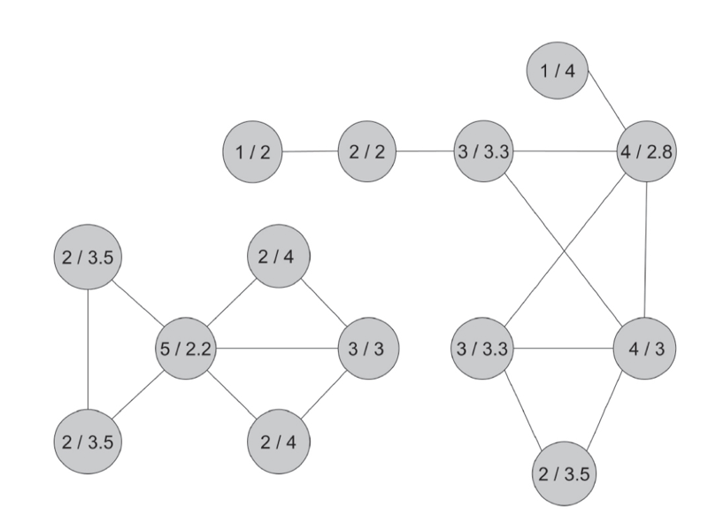
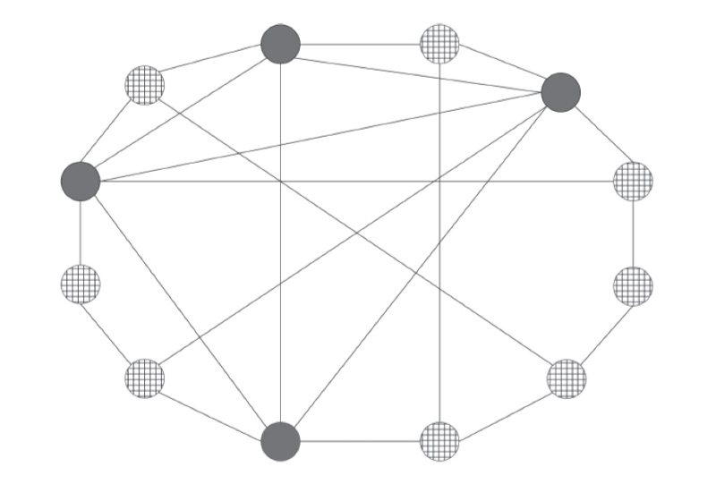
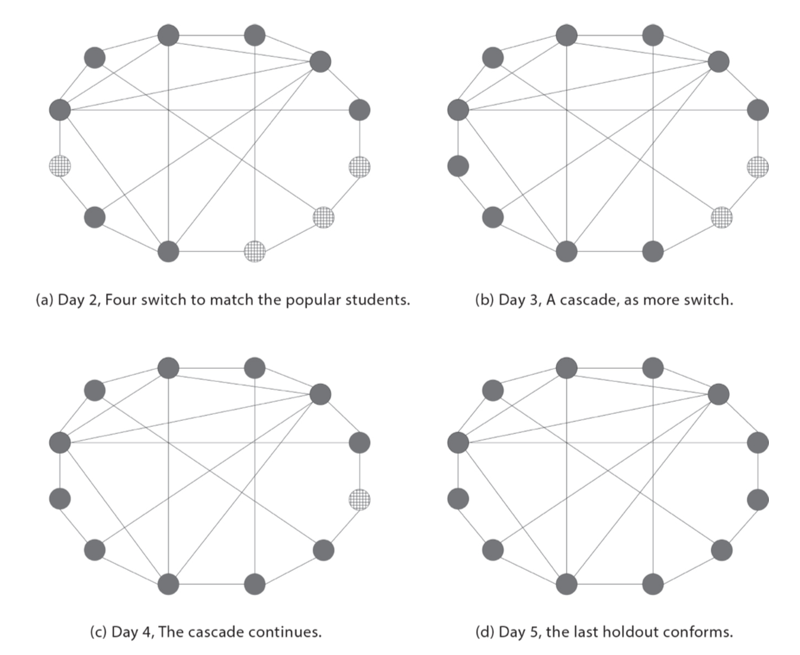

# 0201. Power and Influence: Central Position in Networks 

0201权势和影响力：网络中的核心位置

导读：

1、今天是人气度的时代。名人网红的关注度直接左右着大众的观点、情感与抉择。

2、社交中的「友谊悖论」，让最受欢迎的人出现在很多人的朋友圈中。时尚业以之推动潮流走向，中学生也容易由此「沾染恶习」……

3、拥有人脉广泛的朋友比拥有为数众多的朋友更重要 —— 关键是你认识谁。朋友的朋友，朋友的朋友的朋友…… 如何通过特征向量中心度测算你的全部网络影响力 —— 这正是谷歌搜索成功的秘密。

4、美第奇家族在文艺复兴时期的崛起，缘于他们在家族婚姻与商业网络中的绝好位置，有着独一无二的「中介中心度」。

5、伟人不是生而伟大，而是越活越伟大。中心度带来更多中心度，朋友的数量会像复利那样增长。

Sometimes, idealistic people are put off by the whole business of networking as something tainted by flattery and the pursuit of selfish advantage. But virtue in obscurity is rewarded only in Heaven. To succeed in this world you have to be known to people.

 —  SONIA SOTOMAYOR, MY BELOVED WORLD

Mahatma Gandhi mobilized tens of thousands of people to participate in the Salt March in 1930 to protest British rule. It was a walk of more than two hundred miles from Gandhi's base to the town of Dandi near the sea, where salt was produced from seawater. The narrow purpose of the march was to protest a salt tax. In such a hot climate, salt is essential and is consumed in large quantities, and high salt taxes were particularly symbolic of the hardships imposed on India by the British colonialists. More generally, the Salt March put in motion the acts of civil disobedience that would eventually end British rule.

If you see a parallel to earlier protests of British taxes on its colonies, you are not alone. The Boston Tea Party that protested British taxes more than a century before was not lost on Gandhi. In fact, he stated,「Even as America won its independence through suffering, valour and sacrifice, so shall India, in God's good time achieve her freedom by suffering, sacrifice and non-violence.」It is said that after the Salt March, at Gandhi's meeting in London with Lord Irwin (the Viceroy of India), when asked if he wanted sugar or cream for his tea, Gandhi replied that no, he preferred salt「to remind us of the famous Boston tea party.」1

The Salt March offered just a glimpse of what Gandhi would later accomplish, and his act of illegally producing salt in April of 1930 encouraged millions to follow in civil disobedience. Martin Luther King Jr. mentions being moved when he first read of Gandhi's march to the sea, and it is easy to see how it inspired King's approach to the civil rights movement and organized marches.

These are examples in which an individual had the ability to, directly and indirectly, encourage millions of people to act. That reach was essential in Gandhi's and King's eventual success in changing the world. Judging power and influence by how many people a person can mobilize or impact is a natural starting point as it captures a person's reach.

Networks help us to identify and measure this sort of reach. A first measure of reach is simply counting how many people one knows or can count as a friend or colleague. In today's world we might also ask how many followers one has on social media. As we shall see, how many friends and followers a person has matters in subtle ways in driving a population's perceptions and social norms.

However, having many direct friends or connections is just one way in which a person can be influential, and much of this chapter will be devoted to understanding other network sources of power. Neither Gandhi nor King directly knew more than a small fraction of, nor could they personally contact, everyone they mobilized. They had key allies and friends, and also reached many through the publicity that their acts created. The Salt March began with a contingent of dedicated followers and swelled as it progressed and its publicity grew.

A person can have few friends or contacts and still be very influential if those few friends and contacts are themselves highly influential. This sort of indirect reach is often where power resides, and we can see this sort of influence very clearly via network concepts. Gaining influence via influential friends becomes an iterative and somewhat circular notion, but one that turns out to be quite understandable in a network context, with many implications. Iterative, network-based measures of power and influence will help us understand how to best seed a diffusion, as well as what it was that made Google an innovative search engine.

When it comes to measuring power, this will not be the end of our story. Another way in which people can be important, and one that is particularly evident when considering networks, is being a key connector or coordinator. A person can be a bridge or intermediary between people who don't know each other directly — enabling that person to broker favors and consolidate power by being uniquely positioned to coordinate the actions of others. This sort of power is seen in stories like The Godfather , and is evident in networks that explain the rise of the Medici in medieval Florence.

Understanding how networks embody power and influence will be useful when we later discuss things like financial contagions, inequality, and polarization. We will start with a look at direct influence.

有时候，富有理想的人会被整个业界圈子反感，被视为讨好卖乖和追求个人私利。可是，默默无闻的美德只有在天堂才会得到回报。要在这个世界上取得成功，你必须让人们知道你。

—— 索尼娅·索托马约尔（Sonia Sotomayor，美国最高法院大法官），《我挚爱的世界》（ My Beloved World ）

1930 年，圣雄甘地动员了数万人参与反抗英国统治的「食盐进军」（Salt March）。这是一场长度超过 200 英里 [1] 的步行运动，从甘地的基地到生产食盐的沿海城市丹迪，目的是抗议盐税。在当地的炎热气候下，食盐是必需品，消费量很大。高额的盐税于是成为英国殖民者给印度带来的苦难的特定象征。从更宽广的视角看，食盐进军发起的非暴力不合作运动最终结束了英国的统治。

如果你发现英国对殖民地的税收在之前遇到过类似抗议，那并不稀奇。甘地同样注意到，一个多世纪前的波士顿茶党曾反抗英国的税收。他讲道：「美国依靠苦难、英勇战斗和牺牲赢得了独立，而印度应该依靠苦难、牺牲和非暴力在上帝眷顾下实现自由。」据说食盐进军后在伦敦同印度总督欧文爵士会面时，甘地被问及希望在茶水中加糖还是奶油，他回答说不，他希望加点盐，「好让我们回想起著名的波士顿茶党」。[2]

食盐进军让我们瞥见了甘地后来将完成的壮举的冰山一角，他在 1930 年 4 月非法生产食盐的行动鼓励了数百人追随非暴力不合作运动。马丁·路德·金曾提及第一次读到甘地向大海进军时的感动。我们很容易看出这如何启发了他在发动民权运动与组织游行时的做法。

有大量的案例表明，个人有能力直接或间接地激发千百万人的行动。极大的影响范围是甘地和马丁·路德·金最终成功改变世界的关键。很自然地，一个人的位势和影响力可以通过他发动或激励的人数来判断，因为这反映了他的作用范围。

人类网络能帮助我们认清和测量这种作用范围。对作用范围的第一个测量指标是简单地数一个人认识多少人，或者有多少朋友或同事。在当今世界，我们可能还会询问，他在社交媒体上有多少关注者。我们将看到，一个人有多少朋友或关注者，对决定一个群体的认知和社交习俗有着微妙的影响。

当然，有许多直接的朋友或熟人只是个人发挥影响力的一种方式，而本章的很大部分将用来探讨权势的其他人类网络根源。无论甘地还是马丁·路德·金，对于他们动员起来的民众都只直接认识其中很小一部分，也不可能都有个人接触。他们有着重要的同盟和朋友，并通过其行动产生的宣传影响更多人。食盐进军就是从少数追随者起步，随着运动的发展和宣传的扩大，才变得声势浩大。

一个人的朋友或熟人可以很少，但如果这些朋友或熟人自身举足轻重，他也可能具有相当的影响力。此类间接作用的范围往往就是权势所在，我们能通过人类网络的概念非常清楚地看到这种影响力。借助显赫的友人来获取影响力是一种有迭代性、循环式的说法，但在人类网络的环境下，这很容易理解，并且带有许多启示。对权势和影响力的迭代的、基于网络的测量方法可以帮助我们弄清楚如何最好地启动扩散效应，以及是什么让谷歌成为极具创新性的搜索引擎。

提到对权势的衡量，这不是我们要讲的故事的结尾。人们还可以用另一种方式变得更加重要 —— 在网络中显得尤其突出 —— 即成为关键的连接点或者说协调人。某人可以成为相互不直接认识的人们之中的桥梁或中介，使他处于协调其他人行动的独特位置，从而获取居间好处，强化其权势。这类权势既反映在《教父》那样的故事中，也可以用于解释美第奇家族通过人际网络在中世纪的佛罗伦萨的崛起。

在之后探讨金融传染、不平等和极端化等现象时，理解人际网络如何赋予权势和影响力将非常有帮助。我们先从直接影响力入手。

[1] 英制单位。1 英里约等于 1.609 公里。

[2] 参阅 Adrija Roychowdhury,「How Mahatma Gandhi Drew Inspiration from the American Independence Struggle,」The Indian Express,2016 年 7 月 4 日。

## 2.1 Popularity: Degree Centrality

Although he did not mobilize people to march like Gandhi, Michael Jordan did mobilize people to buy shoes. His ability to influence huge numbers of people was unparalleled. It is not by accident that, just during his sports career, Michael Jordan was paid more than half a billion dollars by companies wanting to advertise their products. 2 He earned just over `$`90 million in salary from actually playing basketball. By that metric, his value in marketing was (and remains) much larger than his direct value as an athlete and entertainer. Michael Jordan's incredible visibility enabled him to directly influence the decisions of millions of people around the globe. 3

In network parlance, how many connections or links (relationships) that a person has in some network is called that person's「degree.」The associated measure of how central a person is within the network is known as「degree centrality.」If someone has 200 friends and someone else has 100 friends, then the first person is twice as central according to degree centrality. Such a count is instinctual and an obvious first method of measuring influence. 4

And it is not just at the scale of a Gandhi, King, or Jordan that the number of people whom someone can reach matters. You are constantly being influenced by your friends and acquaintances. The people with the highest degree in any community, however small, have a disproportionate presence and influence.

What I mean by disproportionate presence refers to an important phenomenon known as the「friendship paradox,」which was pointed out by the sociologist Scott Feld in 1991. 5

Have you ever had the impression that other people have many more friends than you do? If you have, you are not alone. Our friends have more friends on average than a typical person in the population. This is the friendship paradox.

In Figure 2.1, we see the friendship paradox in a network of friendships in a high school from a classic study by James Coleman. 6 There are fourteen girls pictured. For nine of them, their friends have on average more friends than they do. Two have the same number of friends as their friends do on average, while only three of the girls are more popular than their friends on average. 7

Figure 2.1: The friendship paradox. Data from James Coleman's 1961 study of high school friendships. Each node (circle) is a girl and a link indicates a mutual friendship between two girls. The paradox is that most of the girls are less popular than their friends. The first number listed for each girl is how many friends the girl has and the second number is the average number of friends that the girl's friends have. For instance, the girl in the lower left-hand corner has 2 friends, and those friends have 2 and 5 friends, for an average of 3.5. So the 2 / 3.5 represents that she is less popular than her friends on average. This is true for 9 out of 14 of the girls, while only 3 are more popular than their friends, and 2 are equal in popularity to their friends.

The friendship paradox is easy to understand. The most popular people appear on many other people's friendship lists, while the people with very few friends appear on relatively few people's lists. The people with many friends are overrepresented on people's lists of friends relative to their share in the population, while the people with very few friends are underrepresented. Someone with ten friends is counted as a friend by twice as many people as another person who has just five friends.

In a mathematical sense, the paradox is not very deep — but paradoxes rarely are. Nonetheless it has implications for almost all of our interactions. Anyone who has been a parent, or a child for that matter, is familiar with statements like「everybody else at school has a…」or「everybody else at school is allowed to…」Although these sorts of statements are usually false, they often reflect what we perceive. The most popular students can be greatly overrepresented among the children's friends, and so if the most popular students are all following some fad, then children end up thinking that everyone else is. Popular people disproportionately set perceptions and determine norms of behavior.

To see the implications of the friendship paradox most starkly, let us consider a simple example, and then look at some data that corroborate the example.

Consider a class of students who are influenced by their friends. 8 These students, deep down, are conformists. They are faced with a simple choice: do they wear solid or plaid clothes? They each have a preference for solid or plaid and on the first day of school they follow that preference, as pictured in Figure 2.2.

Figure 2.2: The first day of school: The four most popular students have a preference for solids; the eight others prefer plaids.

Being true conformists, the students would like to do what the majority of others are doing, and only follow their own preference if there were equal numbers of others in each style. As pictured in Figure 2.2, four students prefer solids and eight prefer plaids. Thus, two thirds of the students prefer plaids, and if they could all see the whole group's preferences, then they would all wear plaids the next day. However, note that it is the four most popular students, perhaps the boldest students, who prefer solids.

Figure 2.3: Students look around and try to match the majority of their friends. The most popular are all friends with each other (a clique) and all stay with solid. Popular students are overrepresented in students' perceptions, and begin a cascade of people switching to solid.

The students don't see everyone — they interact mainly with their friends as indicated by the links.

Figures 2.3 (a) to (d) show what happens each following day. The popular students all see each other and some others, and they all see a majority wearing solids and so they continue to wear solids. Some other students see mostly popular students, and so they switch to wearing solids. As we see in Figure 2.3 panel (a) the popular students all stay with solids and four more students switch to solids, and by the second day we have eight of the students wearing solids. Things quickly unravel from there, as we see in panels (b) to (d). Each day more of the students who are still wearing plaids see a majority of their friends wearing solids and they switch to solids. By the fifth day every student in the class ends up wearing solids, despite the fact that a majority of them started with a preference for plaids.

We can see the friendship paradox's role in this cascade of fashion by examining Figure 2.4, which shows how the students incorrectly perceive the population preferences, based on what they see among their friends on the first day. The most popular students are overrepresented in people's friendships and so three quarters of the students perceive that solids are in the majority even though two thirds of the students prefer plaid.

There are two aspects that you might notice about the structure of this example. One is that the most popular students all have the same preferences: all like solids. This helps in speeding coordination, and to their preferred fashion. This matters, and there are reasons for why the most popular students will be similar to each other, as we shall soon explore. The second is that the popular students form a clique — they are all friends with each other. This reinforces their behaviors and maintains their norm of solids, which then eventually takes over the rest of the population. It makes the example work cleanly, but the idea that the most popular people are disproportionately influential still holds without this. Indeed, fashion designers have long understood the importance of having celebrities wear their new and different designs on the Oscars red carpet.

The impact of popularity and the friendship paradox is perhaps at its purest in settings of peer influence, such as students' perceptions of others at school. A long series of studies have found that students tend to overestimate the fraction of their peers who smoke, consume alcohol, and use drugs, as well as the frequency with which they do so, and often by substantial margins. For instance, a large study covering one hundred U.S. college campuses found that students systematically overestimate consumption of eleven different substances, including cigarettes, alcohol, and marijuana. 9 In particular, a further study focusing on alcohol consumption compared students' self-reported drinking behavior — how many drinks they had the last time they partied or socialized, with their perceptions of how many the typical student at their school had the last time she or he partied or socialized. Out of the more than 72,000 students at the 130 colleges in the study, the median student answered 4 drinks — a fact that seems alarming, especially given that a quarter of the students answered 5 drinks or more. But what is surprising, given how high these numbers are, is that more than 70 percent of the students still managed to overestimate the alcohol consumption of the typical student at their own school by a drink or more. 10

Figure 2.4: The friendship paradox at work. The fractions next to the students are their perceptions of the preferences for solids over plaids, based on what they see among their friends. Most of them mistakenly perceive a majority preference for solids, with only the few students in the lower right initially perceiving a majority for plaids. Even those students will quickly see a majority wearing solids.

To explain these misperceptions, we don't have to dig deeply into the psychology of the students. The friendship paradox provides an easy insight. When students are attending parties or social events, they are interacting disproportionately with the people who attend the most parties — so students' perceptions of alcohol consumption ends up overrepresenting people who attend many parties. This is a version of the friendship paradox — the people who students see at the parties are more likely to attend more parties than the average student. Students' perceptions are not only influenced by their experiences at parties and other social events, but also by what they know about their closer friends. Here again, the friendship paradox is at work. If more popular students are more likely to smoke or consume alcohol, that will bias students' estimates. Indeed, one study estimated that each additional friendship that a middle school student had accounted for a 5 percent increase in the probability that the student smoked. 11 Similar estimates have been found for alcohol: being named as a friend by five additional others accounted for a 30 percent increase in the likelihood that a middle school student had tried alcohol. 12

There are several effects that push students who socialize the most to be higher consumers of alcohol and cigarettes. One is that such consumption by teenagers is a social activity. People who spend more time socializing with others thus have more reason to consume alcohol. There is also a reverse effect: students with a higher propensity to consume alcohol would tend to seek out opportunities to consume it and others with whom to share it. 13 On top of these effects is that students who have less parental supervision have more time to hang out with other students, and more opportunities to try alcohol, cigarettes, and drugs. Finally, social activities by their very nature experience feedback. Viewing one's peers drinking encourages drinking. That increased level of drinking further increases the drinking of peers, and so this continues to cycle in a feedback loop. 14

So, given that students' estimates of peer behavior are based at least in part, if not largely, on their personal observations, the friendship paradox and the fact that the most socially active students often take more extreme behaviors leads us to expect students to systematically overestimate peers' behaviors. More generally, given that many behaviors are influenced by perceived norms, we end up with behaviors driven disproportionately by those who socialize the most, and the resulting norms are more extreme than if our perceptions were not network-based.

The friendship paradox is enhanced by social media, where the magnitude of the effect can be staggering. For example, a study of Twitter behavior 15 found that more than 98 percent of users had fewer followers than the people whom they followed: typically a user's「friends」had more than ten times as many followers as the user. Those more popular users are more active, and despite their small numbers they play an important role in viral content. Given the increased use of social media, especially by adolescents, the potential for biased perceptions in favor of a tiny proportion of the most popular users becomes overwhelming, especially when one factors in that the most popular social media users may have very different behaviors, as we see from the relationship between students' popularity and earlier and heavier use of alcohol and cigarettes. Partying is also by its very nature a social activity, which can further amplify the effects of social media as pictures and stories of alcohol and drug consumption are shared. In contrast, behaviors such as studying tend to be more solitary events and information about them is less likely to be shared. It is thus natural for a teen to overestimate the amount of drugs and alcohol consumed by his or her peers and to underestimate the time spent studying by those same peers.

The bias that accompanies the friendship paradox, whether or not we realize it, applies well beyond「friendships.」The friendship bias is an example of「selection bias」: our observations are often from biased samples depending on how that sample was picked. We disproportionately fly on the most heavily booked flights, eat at the most popular restaurants, drive on the busiest roads and at the busiest times, go to parks and attractions at the most crowded times, and attend the most crowded concerts and movies. These experiences bias our perceptions as well as our perceived social norms, usually without our understanding those effects. As Shane Frederick (2012) states in a study about our tendency to overestimate other people's willingness to pay for things:「Customers in the queue at Starbucks are more visible than those hidden away in their offices unwilling to spend `$`4 on coffee.」16

人气度：中心度

迈克尔·乔丹没有像甘地那样动员民众参与游行，却激励了大家购买球鞋。他对数量庞大的民众的影响力无与伦比。仅仅是在运动生涯阶段，乔丹就从希望他帮忙推销产品的各家公司收获了 5 亿美元以上的报酬，这绝非偶然。[3] 而他从打篮球中获取的薪水才刚超过 9000 万美元。从上述两个数字来看，乔丹在当时的市场营销价值远远高于他作为运动员和娱乐明星的直接价值（今天依然如此）。这种令人难以置信的受关注度使他可以直接影响全球千百万人的决策。[4]

在网络术语中，某个人在特定网络中有多少联系或者链接（关系）被称为此人的「度」（degree）。与之相关的反映某个人在网络中处于何种中心程度的指标被称为「中心度」（degree centrality）。如果某人有 200 个朋友，另一个人有 100 个朋友，则根据中心度指标，前者的中心位置是后者的两倍。这一指标是符合直觉的，也是衡量影响力的显而易见的第一种方法。[5]

并不是只有在甘地、马丁·路德·金或乔丹那样的层次上，人们所能影响的人数多寡才具有意义。你也经常受到自己的朋友和熟人的影响。不过在无论规模多小的任何社群中，有着最高的度的人总是拥有超出比例的存在感和影响力。这里说的超出比例的存在感代表一种名为「友谊悖论」（friendship paradox）的重要现象，由社会学家斯科特·菲尔德在 1991 年提出。[6]

你是否有过这样的印象：其他人的朋友比你多得多？如果是的话，你不必感到孤独。我们的朋友平均拥有的朋友人数超出社群中的一般水平，这正是所谓的友谊谬论。

图 2.1 展示的是詹姆斯·科尔曼的一项经典研究介绍的某所高中的朋友网络中的友谊悖论。[7] 图中有 14 个女生，对其中 9 个而言，她们的朋友平均拥有的朋友人数超过她们自己，另外 2 个的朋友人数与她们的朋友的朋友人数相同，只有 3 个女生的朋友人数超过她们的朋友的朋友人数。[8]

图 2.1 友谊悖论。数据来自科尔曼在 1961 年对高中学生朋友网络的研究。每个节点（圆圈）代表一位女生，每条连线代表两位女生之间存在朋友关系。友谊悖论在于，大多数女生比自己的朋友的交际更少。每位女生的圆圈中的前一个数字代表她有几个朋友，后一个数字代表她的朋友平均有几个朋友。例如，左下角的女生有 2 个朋友，而那两个女生分别有 2 个和 5 个朋友，因此平均数为 3.5。这个圆圈里的两个数字 2 和 3.5 表明，该女生的朋友数少于自己朋友的平均朋友数。在全部 14 位女生中有 9 位属于这种情况，有 3 位的朋友数多于自己朋友的平均值，有 2 位与自己朋友的平均数相同。

友谊悖论不难理解。最受人喜欢的人会出现在很多人的友人名单中，而朋友极少的人只会现身于少数人的名单。相对于在人群中的占比，有众多朋友的人在大家的友人名单中会被过度代表，而朋友少的人则会代表不足。比起只有 5 个朋友的人，有 10 个朋友的人被计算为朋友的次数是前者的两倍。

从数学角度看，这一悖论并不奇怪 —— 大多数悖论同样如此。然而该现象对我们的几乎所有交往都有着重要意义。任何做过家长（或学童）的人都不会对下面的说法感到陌生，如「学校里其他所有人都有」，「学校里其他所有人都能够……」。尽管这类陈述往往是错误的，却总是反映着我们的感知。最受欢迎的学生可能在孩子们的朋友中被过度代表了，如果这些学生都在追随某种时尚潮流，孩子们就会认为所有人都是如此。人气高的人在决定感知和行为标准方面发挥了超出比例的作用。

为了最直观地看清友谊悖论的含义，我们先思考一个简单的例子，然后再分析它背后的有关数据。我们来看一个班级的学生如何受朋友的影响。[9] 从内心来说，这些学生都是比较从众的性格。他们面临一个简单的选择：是穿纯色的衣服，还是格子花纹的衣服？每个人对此有各自的偏好，在开学头一天，他们都根据自己的偏好选择服装，其结果如图 2.2 所示。

图 2.2 开学头一天，最受欢迎的 4 个学生选择纯色衣服，其余 8 个学生选择格子衣服。

作为喜欢循规蹈矩的人，学生希望追随大多数人做事，只有在选择每种风格的人数都相同时，他们才听从自身的偏好。如图 2.2 所示，有 4 个学生喜欢纯色衣服，8 个学生喜欢格子衣服。这样，由于三分之二的学生喜欢格子衣服，而如果大家都能看到整个群体的喜好，到第二天上学时，所有人都会穿上格子花纹的衣服。然而请注意，头一天选择纯色衣服的是最受欢迎的 4 个学生，或许也是群体中最引人注目的一批学生。

学生看不见所有人的情况 —— 他们主要是和有连线的朋友交流。

图 2.3 的（a）到（d）显示了之后每天发生的情况。最受欢迎的这批学生看到了彼此的着装以及其他某些人的着装，其中大多数都是纯色衣服，因此他们将继续穿纯色衣服。其他部分学生主要看到的是最受欢迎的这批学生，他们将换成穿纯色衣服。我们从图 2.3 的（a）中看到，最受欢迎的学生在第二天继续穿纯色衣服，另有 4 名学生加入他们，总共有 8 名学生变成穿纯色衣服。从这里开始问题很快得到了解决，从图 2.3 的（b）到（d），每天都有更多穿格子衣服的学生看到大多数朋友穿纯色衣服，于是改变自己的风格。到第五天时，班上的每个学生都穿上了纯色衣服，而事实上在开学时他们大多数更喜欢格子风格。

图 2.3 学生观察周围的情况，以迎合大多数朋友的选择。最受欢迎的 4 名学生彼此都是朋友（形成小派系），都保留纯色服装。在全体学生的感知中，这批学生被重复计算了，引发了连续改变着装的进程。

我们可以通过图 2.4 分析友谊悖论在这一服装风格流行变化中的作用，该图根据学生在开学第一天看到的朋友的风格，显示他们如何错误地感知了整个群体的偏好。虽然三分之二的人偏好格子衣服，但由于最受欢迎的学生在大家的朋友关系中被过度代表，最终使三分之二的学生以为选择纯色衣服的人是大多数。

图 2.4 友谊悖论发挥作用。每名学生边上的分数代表他们对于纯色 / 格子衣服流行度的感知，来自每个人看到的朋友的选择。大多数人都错误地以为纯色衣服是主流选择，只有右下方的少数几个一开始感觉格子衣服占主导。而这些学生很快也会看到大多数朋友换上了纯色衣服。

这个例子的构造中有两方面的特点或许会让你留意。其一是最受欢迎的学生有着同样的偏好，都喜欢纯色衣服，因而促使整个群体快速向这批学生喜欢的风格统一。这个现象很重要，最受欢迎的学生为什么彼此相似是有原因的，下文很快将展开讨论。其二是这批受欢迎的学生组成了一个小圈子，彼此都是朋友，从而强化了他们的行为，维持了他们对纯色衣服的选择，并最终让群体中的其他人接受。上述两个条件让我们的案例变得更简洁明了，但即使没有这些，最受欢迎的人依然具有超出比例的影响力。事实上，时尚设计师早就看清了让名人穿上他们的各种新款设计走上奥斯卡奖红毯的重要性。

1『对啊，这里「最受欢迎的学生为什么彼此相似」，这个是个核心问题。（2021-03-14）』

人气度与友谊悖论的作用在同辈间的影响或许是最纯粹的，比如学生对于彼此的感知。有大量研究发现，学生容易高估他们中间吸烟、喝酒、滥用药物的人的比例以及频率，而且往往高出相当多。例如，有项覆盖 100 所美国大学的大型研究发现，学生对 11 种不同物品的消费量有系统性高估，包括香烟、酒类和大麻等。[10] 具体而言，有项对酒类消费的深入研究对比了学生自己报告的饮酒行为 —— 上次参加聚会或交际时喝了多少 —— 与他们对该学校的一般学生上次参加聚会或交际时喝了多少的感知。在该研究包含的 130 所大学的 72000 多名学生的信息之中，居于中位数的学生报告说自己喝了 4 杯酒 —— 这真令人吃惊，尤其是四分之一的学生说喝了 5 杯或者更多。然而更令人惊讶的是，尽管上面的数字已经够高，仍有超过 70% 的学生在估计自己学校的一般学生的饮酒量时高估了 1 杯甚至更多。[11]

要解释这种错误感知，我们并不需要去深入探究学生的心理，友谊悖论就能给出轻松解释。当学生参加欢聚或社交场合时，他们的交往更多会集中在那些经常参与交际的人身上，因此他们对酒类消费的感知会过分反映参加了很多聚会的人。这形成了另一种模式的友谊悖论：学生在聚会中见到的人通常比一般的学生参加的聚会更多。学生的感知不但受自己在聚会和其他社交场合的经历的影响，还取决于他们知道的自己的亲密朋友的情况。友谊悖论在这里同样会产生作用。如果人气较高的学生抽烟喝酒比较多，同样会扭曲学生的估计。而事实上确实有项研究估算出，中学生的朋友人数每增加一个，他抽烟的概率就会提高 5 个百分点。[12] 在饮酒上面也有类似的结论，中学生的朋友增加 5 个，他喝过酒的概率会提高 30 个百分点。[13]

参与社交最活跃的学生更容易抽烟喝酒，有几方面的因素推动。原因之一是对青少年来说，这些消费是一种社交活动。花更多时间跟其他人交往的人，因此有更多喝酒的理由。也存在一种反向效应：有较高饮酒倾向的学生喜欢找合适的机会去尝试以及与其他人分享。[14] 最主要的一个因素是，父母监督较少的学生有更多时间跟其他学生出去混，也有更多机会尝试酒精、香烟和毒品。最后是社交行为本身具有的反馈性质，看到同伴喝酒会激励自己喝酒，由此让同伴的饮酒量增加，然后继续在反馈回路中形成循环。[15]

所以，考虑到学生对伙伴的行为的估计至少有部分（即使不是大部分）是根据自身的观察，友谊悖论的影响，再加上大多数社交活跃的学生经常有极端行为这一现实，自然会让学生系统性地高估伙伴的行为模式。更普遍地看，由于许多行为会受到大家感知的习俗的影响，最终的行为将受到参与社交活动最多的人的超出比例的推动，就此形成的习俗也比不依赖人际网络时的感知更为极端。

友谊悖论会被社交媒体放大，那里产生的影响幅度可能非常惊人。例如，有项关于推特的研究发现，[16] 超过 98% 的用户的关注者少于他们关注的对象，通常来说，一位用户的「朋友」（friends）的关注者人数是他的 10 倍以上。那些人气更高的用户更为活跃，尽管其数量较少，但却在内容传播上扮演着关键角色。鉴于社交媒体的应用增加，尤其是在青少年中，人群的感知被极少数最受欢迎的用户扭曲的可能性变得非常大，特别是考虑到人气最高的社交媒体用户可能有相当特立独行的行为时，就像我们看到的学生的人气度与较早和较多地抽烟喝酒之间存在关联那样。参与聚会本身是一种社交行为，如果有喝酒吸毒等照片或故事分享出来，可以进一步放大社交媒体的影响。相反，埋头读书那样的行为往往是独自完成的，有关的信息也更少用于分享。因此青少年高估自己伙伴消费的药物和酒精，而低估他们用于学习的时间，是很自然的结果。

无论我们是否有所意识，与友谊悖论相伴的偏向性远远超出「友谊」的范围。友谊偏差只是「选择性偏差」（selection bias）的情形之一，其含义是，我们的观察往往来自有偏向性的样本，取决于这些样本如何选取。我们会过多地乘坐最满员的航班，在最火爆的餐厅吃饭，在最拥挤的路段和时段开车，在人流最大的时候去公园和景点，参加最喧嚣的音乐会，看最热门的电影，等等。这些经历扭曲了我们自己的感知以及我们对社会习俗的认识，而且其效应经常没有被我们意识到。正如肖恩·弗里德里克（2012）在一项有关我们过高估计别人的付费意愿的研究中所述：「比起那些躲在办公室里、不愿花 4 美元买咖啡的人来说，在星巴克排队的顾客要显眼得多。」[17]

## 2.2 Comparisons, Comparisons

If you torture the data enough, nature will always confess.

 —  RONALD COASE, HOW SHOULD ECONOMISTS CHOOSE? 17

I want to be perceived as a guy who played his best in all facets, not just scoring.

 —  MICHAEL JORDAN, 2003 NBA ALL-STAR GAME

Who was the best basketball player of all time, Wilt Chamberlain or Michael Jordan? Maybe you would like to make a case for LeBron James. Having grown up in Chicagoland, I have my own answer to such questions, but the comparison is really between great athletes who had very different styles and roles in the game.

There are many different statistics that can be used to summarize their careers. For instance, Jordan and Chamberlain are amazingly similar on several dimensions: they each averaged 30.1 points per regular season game during their careers, both had just over 30,000 points in regular season games (32,292 for Jordan and 31,419 for Chamberlain), and each amassed several Most Valuable Player awards (5 for Jordan and 4 for Chamberlain). However, there are other dimensions on which they differed: Michael Jordan led his team to more NBA championship wins (6 to Wilt's 2), but Wilt Chamberlain amassed dizzying numbers of rebounds per game (22.9 to Michael's 6.2).

There are other dimensions on which other players stand out. Steph Curry's record three-point totals are far beyond anything seen before. Kareem Abdul-Jabbar's longevity at a high level is unparalleled. Kareem played for 20 years, amassing more than 40,000 points in total, and played in 19 All-Star Games, after having dominated basketball at the college level as nobody had before. LeBron James's all-around dominance has been evident since he appeared on Sports Illustrated 's cover as a junior in high school. But if we really want to measure all-around contributions then we should consider the triple-double — having at least 10 points, 10 rebounds, and 10 assists — all three statistics in double figures. Then one has to remember Oscar Robertson, who averaged a triple-double for a whole season (a feat only recently matched by Russell Westbrook), and had so many triple-double games that nobody else even comes close, not even Magic Johnson.

The point here is not really to have a「da Bears, da Bulls」18 argument about basketball prowess, but to emphasize several things: statistics capture useful information in a succinct manner, different statistics encapsulate different things, and even a long list of statistics can fail to capture all of the nuances of the things that they describe.

Our lives would be simpler if measuring something could always be boiled down to a single statistic. But part of what makes our lives so interesting is that such unidimensional rankings are generally impossible for many of the things that are most important to understand: lists of rankings end up being both controversial and intriguing. How does one compare the musical innovations of Haydn, Strauss, and Stravinsky; or the contributions to human rights of Eleanor Roosevelt, Harriet Beecher Stowe, and Harriet Tubman? Is Lionel Messi or Diego Maradona the more impressive soccer player? Can one possibly compare the art of Pablo Picasso to that of Leonardo da Vinci? Or, is it easier to compare the paintings of Pablo Picasso to those of Henri Matisse, not only because Picasso and Matisse were contemporaries, but because they were rivals? Many might argue that such comparisons are hopeless and meaningless. However, they force us to think carefully about the various dimensions on which these people made contributions and why those contributions were game-changing. 19 When one looks at different basketball statistics one sees different players stand out, with each amazing in his or her own way. Similarly, when looking at different statistics that characterize people's network positions, different people stand out as being most「central.」Some people end up being very central according to some but not other measures, and which network statistic(s) are most appropriate depends on the context, just as whether you would rather add a top scorer or a top defender to your basketball team would depend on the circumstances.

We have already seen that one measure of centrality — degree centrality — helps us understand why the highest-degree people in a network end up having disproportionate influence. This is a first「network effect.」As the most basic and obvious measure of network centrality, degree centrality is akin to average points per game in the basketball example. However, to complete the analogy, different people can have different strengths in terms of their positions in networks — so that who is most「central」will vary with the way in which we ask the question, just as Wilt was a dominant rebounder while Michael drove his team to championships and Steph Curry stretched defenses in new ways. Comparing nodes (e.g., people) in a network based on their degree centrality can completely miss some of the most essential aspects of power and influence. So let's see some other concepts.

对比

你只要反复拷问数据，大自然总会坦白。

—— 罗纳德·科斯，《经济学家该如何选择？》 [18]

我希望被视为在所有方面都表现最好的人，而不只是得分。

—— 迈克尔·乔丹，2003 年 NBA（美国职业篮球联赛）全明星赛

谁是历史上最伟大的篮球运动员，维尔特·张伯伦还是迈克尔·乔丹？你或许会考虑勒布朗·詹姆斯。作为在芝加哥长大的人，我有自己的答案。但列入比较的对象其实是在比赛中有着截然不同的风格与作用的伟大运动员。

有太多不同的统计数字可用来总结他们的职业生涯。例如，乔丹和张伯伦在几个方面有着惊人的相似：整个职业生涯的常规赛平均得分都是 30.1 分；常规赛总得分都超过 3 万分，乔丹为 32292 分，张伯伦为 31419 分；都多次获得最有价值球员奖项，乔丹为 5 次，张伯伦为 4 次。可是也有些指标他们差异较大：乔丹带队夺得过 6 次 NBA 总冠军，张伯伦仅有 2 次；张伯伦的场均篮板数则达到惊人的 22.9 个，远超过乔丹的 6.2 个。

在其他某些维度上，别的球员则更胜一筹。斯蒂芬·库里的三分球总命中数远远超过前人。卡里姆·贾巴尔维持顶尖水平的时间跨度无与伦比，他打了 20 个赛季，总得分超过 4 万分，参加了 19 次全明星赛，之前还以史无前例的方式征服过大学篮球赛场。詹姆斯的全面统治力则从他作为高中二年级学生登上《体育画报》杂志封面就广为人知。但如果真要衡量运动员的全方位贡献，我们得考虑「三双」的指标 —— 得到至少 10 分、10 个篮板、10 次助攻，三项统计数据都达到两位数。这必须让人回忆起奥斯卡·罗伯特森，他曾经在整个赛季实现了场均三双 —— 该成就只是在最近才被拉塞尔·威斯特布鲁克赶上 —— 而且完成三双的比赛次数令其他所有人望尘莫及，哪怕是「魔术师」约翰逊。

这里的要点不在于真要展开一场有关篮球技艺的「熊队还是牛队」的争论，[19] 而是想强调如下几点：统计数字是用简洁的方式反映有用的信息；不同的统计数字概括了不同的内容；即使有大量的统计指标也可能难以反映它们所描述事物的所有细微之处。

如果对事物的测量总是能归结为一个单纯的统计指标，我们的生活就会变得简单很多。可是让我们的人生如此有趣的部分原因正在于，对于许多最重要的事情来说，实现这种单一维度的排名经常是不可能的：各种排名最终会变得充满争议又令人着迷。人们该如何比较海顿、施特劳斯和斯特拉文斯基的音乐创新呢？该如何比较埃莉诺·罗斯福、哈里特·斯托与哈里特·塔布曼在人权领域的贡献？梅西和马拉多纳谁才是更出色的足球运动员？我们能够对毕加索和达·芬奇的艺术评判高低吗？还是说把毕加索与亨利·马蒂斯的作品做比较要容易些，不仅因为他们是同时代的画家，而且是竞争对手？许多人或许会说，这种比较是无法实现且毫无意义的。然而，它能迫使我们去认真思考对于上述人物所做贡献的不同反映维度，以及为什么他们的贡献具有革命意义。[20] 当我们看到不同的篮球统计数据时，眼前会浮现不同的球员，每一位都有自己的绝活。类似的是，当我们观察反映人们网络位置特征的不同统计数据时，也会有不同的人浮现，成为最「中心」的人物。有些人在某些指标下居于非常中心的位置，在其他指标下则不然。而哪些网络统计指标最适用则取决于不同场合，好比你要给自己的篮球队引入一位顶级得分者还是一位顶级防守者，也得根据情况而定。

我们已经看到，测量中心程度的一个指标 —— 中心度 —— 能帮助解释为什么网络里中心度最高的人有超出比例的影响力。这是第一种「网络效应」。作为最基本和最浅显的反映网络中心位置的指标，中心度类似于篮球比赛中的场均得分。然而，如果继续这个类比，不同的人可能有不同的长处体现在网络中的位置上，因此根据我们提问题的方式，到底谁是最核心的人可能会有所变化。正如张伯伦是统治级别的篮板好手，乔丹能带队夺冠，而库里以全新的方式突破了防守一样，如果只根据中心度来比较人际网络中的不同节点（人），可能完全错过权势和影响力的某些最关键的方面。接下来让我们看看一些其他的概念。

## 2.3 It's Who You Know — Locating the Needles in the Haystack

「Networking is rubbish; have friends instead.」

 —  STEVE WINWOOD

Google might not even exist except for the serendipitous assignment of Sergey Brin to show Larry Page around the Stanford University campus in 1995, when Larry was considering Stanford for his doctoral studies. Sergey's family had emigrated to the U.S. from Russia in the late 1970s. Long fascinated by mathematics and computer programming, Sergey had come to Stanford for its computer science program. Larry Page shared a similar fascination with computers, and recalls a childhood of「poring over books and magazines, or taking things apart at home to figure out how they worked.」Although their strong personalities clashed at times, their common interests and intellects led them to a fast friendship. Most important for us, they shared a growing curiosity about the structure of the World Wide Web.

By 1996 Sergey and Larry were working together on the design of a search engine for the Web. They began using Larry's dorm room to house a set of computers cobbled together out of the parts that they could find, and Sergey's room for an office where they developed their ideas and programs. In a paper that they wrote together as students, Sergey and Larry describe how rapidly the Web was expanding in the late 1990s and how search engines were not really up to the task. One of the first search engines, the World Wide Web Worm of 1994, indexed just over 100,000 pages. By 1997, another search engine, AltaVista, was claiming to have tens of millions of queries per day, and the Web already had hundreds of millions of pages to search and index. The sheer volume of pages to index was making it impossible to find what the user wanted. To quote Brin and Page,「as of November 1997, only one of the top four commercial search engines finds itself (returns its own search page in the top ten results in response to a query of its name).」

So how does one locate the right needles in such a giant haystack? There are some obvious ideas as to how to identify the Web pages that a user might want to see when they type in some keyword. But huge numbers of pages contain the same keywords. Having the keyword appear frequently on some page does not come close to guaranteeing that it is what most users are looking for. Perhaps tracking past traffic and looking deeper into the content of various pages might help. Many variations on this theme were being tried but nothing seemed to work adequately. It was easy to begin to think that the Web was just becoming too large, and indexing and navigating it in any sensible way was destined to be an overwhelming task.

Brin and Page's breakthrough was born from their interest in the network structure of the Web: it holds a lot of useful information, as the structure is not an accident. Web pages link to other Web pages that they see as being important. So how did Brin and Page understand and use that information? Brin and Page's key insight was that a useful way to identify a page that a searcher might be most interested in was to look at which other Web pages have links pointing to that Web page. If other important Web pages point to a page, then that suggests that it is an important page. One does not judge a page simply by how many pages link to it, but by whether it is linked to by well-connected pages. In many settings it is more important to have「well-connected」friends than just to have many friends.

This sort of definition is circular: a page is「important」because it is linked to by other「important」pages, which are in turn「important」because they are linked to by other「important」pages. Despite the circularity, it turns out to have a beautiful solution, and one that is extremely helpful in network settings.

Suppose we want to spread a rumor or some information that we think will be relayed via word of mouth. To see why a straight measure of popularity falls short, consider the network in Figure 2.5. It is clear from just looking that the positions of Nanci and Warren are quite different from each other, even though they each have two friends. They differ in terms of how well-connected their friends are, and relatedly, how well-positioned they are in the network. Warren's friends have only two friends each, while Nanci's friends have seven and six friends. So, while Warren and Nanci score equally well in terms of their「degree」(number of friends), Nanci's friends have higher degrees than Warren's.

We could stop here: instead of just counting friends, we could count how many additional friends each of those friends brings — so we could track friends of friends: which we can call「second-degree friends.」Looking beyond direct friends to count friends of friends would be a good start, and Nanci already becomes clearly better situated to spread information than Warren. But why stop iterating here? Why not consider「third-degree friends」? Now Nanci's friendship with Ella is not so fruitful in terms of third-degree friends, but her friendship with Miles leads to even more connections. By the time we have gone out three steps from Nanci we have reached everyone except Warren. Going out three steps from Warren we only reach five other people, while from Nanci we have reached sixteen. This makes Nanci a much better candidate for spreading information than Warren, even though they both have the same degree.

Figure 2.5: Two people, Nanci and Warren, both have degree 2. However, they differ in how connected their friends are and in their overall positions in the network.

How does one capture this in a large network, as we could go on forever? There are various ways of doing so, but let me describe the crux of the idea. Let us start by just adding up first-degree (direct) friends. So, as we see in Figure 2.5, Nanci and Warren each get a value of 2 since they each have two friends. Next, let's add in second-degree friends. But should we count these as highly as first-degree friends? For example, if we think about spreading information starting with Nanci, it is more likely that information gets from Nanci to Miles, than to a friend of Miles — as it first has to pass from Nanci to Miles and then also has to be spread further from Miles. It might be much less likely to make it two steps than just one step, for instance half as likely. So, for now, let's weight a friend of a friend half as much as we value a friend. Nanci has eleven second-degree friends, so she gets a score of 11/2 for her friends-of-friends. Warren has only one second-degree friend and so he gets 1/2. Thus, Nanci has a score of 7.5 so far, counting first- and second-degree friends, while Warren's score is now only 2.5. As we move out to third-degree friends, Nanci has three, while Warren has two. Again let's weight those by another factor of a half, so we will give each of them a score of 1/4. So Nanci adds 3/4 to her score and Warren adds 2/4 to his score, and so Nanci is up to 8.25 and Warren is up to 3. Iterating in this manner, we can quantify how much more reach Nanci has in the network than Warren.

The relative comparison between Nanci and Warren also turns out to be the solution to another question. Let's define each person's centrality as being proportional to the sum of their friends' centralities. This is similar to the calculation we just did. By doing this, Nanci gets some fraction of Ella's and Miles's scores, which come from adding up some fraction of their friends' scores, and so forth. This iteration is similar, because Ella's and Miles's scores are coming from their friends, which are Nanci's second-degree friends, and those scores come from their friends, which are Nanci's third-degree friends, and so on. 20

Luckily, this type of system of equations, in which each person's centrality is proportional to the sum of her friends' centralities, is a quite natural and manageable math problem. It developed through a series of contributions from a who's who list of mathematicians from the eighteenth through twentieth centuries: Euler, Lagrange, Cauchy, Fourier, Laplace, Weierstrass, Schwarz, Poincaré, von Mises, and Hilbert. Hilbert named the solutions to such problems「eigenvectors」(pronounced「eye」), the common modern name. Not surprisingly, eigenvectors pop up in all sorts of applications from quantum mechanics (Schrödinger's equation) to the definitions of the「eigenfaces」that comprise the basic building blocks used in facial recognition patterns. When solving for the eigenvector in our example, we find that Nanci's score is about 3 times that of Warren, as we see in Figure 2.6. 21

The Brin and Page innovation was to rank Web pages by what they termed PageRank — which relates to our discussion above and to an eigenvector calculation. Although Brin and Page's problem was not spreading a rumor through a network, it was based on another closely related iterative problem called the「random surfer problem.」A user starts at some page and then randomly follows a link from that page to another page, with each link getting equal probability. The user then repeats this, randomly surfing the Web in this fashion. 22 Over time, if we calculate the relative fraction of times that the user lands on each page, it is an eigenvector calculation. In this case, the weights that are being used at each step are proportional to the number of links embedded in each page.

Figure 2.6: Eigenvector centralities of each node (person). Nanci outscores Warren by almost a factor of 3, even though they both have the same number of connections. Miles ranks highest, even though Ella has the highest degree centrality.

There were two challenges that Brin and Page faced. The conceptual challenge of finding the most relevant pages was addressed by not just ranking pages by popularity, but by calculating how ‘「well-connected」the pages were in this iterative, eigenvector sense. The more practical challenge was implementing this on the huge scale of the Web, which involves crawling the Web and indexing pages, storing data about the content and links of each page, and then making such iterative calculations about network position. It is one thing to calculate such things for Nanci and Warren in our small network above, but it is another to approximate this for billions of pages, especially when they are constantly evolving in their content and links.

Brin and Page developed an algorithm based on these sorts of calculations, and well-suited for huge networks, and called it BackRub, which they started running on Stanford servers. The name BackRub comes from looking at backlinks — the links that lead one to a page. BackRub quickly outgrew the student accounts that Brin and Page had on the Stanford servers, and by 1997 they had moved the search engine and renamed it Google — a variation on googol, which is the number corresponding to a 1 followed by 100 zeros, referring to the vast size of the Web that their algorithm managed to conquer. For anyone who struggled through the early days of searching the Internet, the ability of Google to find useful pages was incredible. There were many competing search engines, and typically one would try several search engines in an often futile attempt to find a Web page that one really needed. By 1998, PC Magazine reported that Google「has an uncanny knack for returning extremely relevant results」and ranked it in its top hundred Web sites. 23 The rest is history. 24

关键是你认识谁 —— 大海捞针

建立关系网是废话，交朋友才是正事儿。

—— 史蒂夫·温武德（Steve Winwood），英国音乐人

如果不是谢尔盖·布林在 1995 年偶然受命带拉里·佩奇参观斯坦福大学校园 —— 当时佩奇正在考虑到斯坦福读博士 —— 谷歌公司或许就不会存在。布林一家是在 20 世纪 70 年代后期从俄罗斯移民到美国，对数学和编程长期着迷的他已经在斯坦福学习计算机。佩奇同样对计算机着迷，并一同回忆起了「爱读图书杂志，在家里把东西拆掉、搞清楚如何运转」的童年。尽管这两人的强烈个性时有冲突，但布林与佩奇的共同爱好和智慧却让他们结为挚友。对我们而言最重要的是，他们都对万维网的构造有着日益浓厚的好奇心。

到 1996 年，布林和佩奇共同着手为网络设计搜索引擎。刚开始他们在佩奇的宿舍放置一部用他们所能找到的部件拼凑出来的计算机，布林的房间则作为开发创意和程序的办公室。在他们作为学生联合撰写的一篇论文中，布林和佩奇描述了互联网将在 20 世纪 90 年代后期如何快速扩张，搜索引擎将因此如何难以胜任。最早的搜索引擎之一，1994 年的「万维网虫」仅索引了超过 10 万个网页。到 1997 年，另一个搜索引擎 AltaVista 号称每天收到数千万条查询，而互联网已经有数亿个网页需要搜索和索引。需要索引的网页的巨大数量使我们不可能找到用户真正想要的内容。借用布林和佩奇的话：「到 1997 年 11 月时，排名前四的商业化搜索引擎中只有一个能够找到它自己 —— 具体意思是指在该搜索引擎查询它自己的名字时，能在前十个结果中显示自身的搜索页面。」

那么，我们如何能在这样的汪洋大海中找到正确的那根针呢？当用户输入某些关键词时，确实有某些明显的方法去识别他或许想看到的网页，但问题是有太多的网页包含同样的关键词。某些网页频繁出现关键词，并不能保证它们就是大多数用户寻找的内容。追踪过去的信息流向并深入考察不同网页的内容，或许能提供帮助。在这方面做过许多不同尝试，但似乎没有方法充分奏效。这很容易让人以为，互联网只是变得太大了，为之提供任何合理的索引和导航都注定是不可能完成的任务。

布林和佩奇的突破源自他们对万维网的网络构造的兴趣：包含如此丰富的有用信息，因为其构造并非源自意外。网页与它们视为重要的其他网页相连。那么布林和佩奇是如何看待和利用这一信号的呢？他们的关键发现是，找到搜索者可能最感兴趣的网页的一个有效办法，是分析其他网页上面的链接指向哪个网页。如果其他重要网页指向某个网页，就表明这也是个重要网页。判断某个网页的地位并不是简单计算有多少网页跟它有链接，而是看它是否与某些链接最广泛的网页相连。在许多场合下，拥有「人脉广泛」的朋友比仅仅拥有人数众多的朋友更为重要。

这种定义是循环式的：某个网页很「重要」，是因为它在其他的「重要」网页上有链接，而这些网页的重要性，又是来自被别的「重要」网页链接。尽管有这种循环特性，但结果却表明它是漂亮的解决方案，在网络环境下尤其适用。

假设我们希望散布一条可能会口口相传的消息，从图 2.5 显示的人际网络中，我们将看到为什么对人气度的直接测量指标并不够用。很明显能看出，南希和沃伦尽管都各有 2 位朋友，他们的位置却存在很大差异。差异之处在于，他们的朋友的交际度不一样，以及与之相关的，他们中谁在网络中所处的位置更为有利。沃伦的朋友每人只有 2 个朋友，而南希的朋友则分别有 7 个和 6 个朋友。于是，尽管沃伦和南希在他们自己的「度」（朋友人数）上得分相同，但南希的朋友却有着比沃伦的朋友更高的度。

我们可以暂停一下：不是只计算朋友的数量，而是计算每个朋友能带来的更多的朋友的数量，跟踪朋友的朋友 —— 我们称其为「二度朋友」（second-degree friends）。从直接的朋友扩大到计算朋友的朋友将是个很好的开始，由此看来南希在传播消息方面比沃伦处于更好的位置。但迭代为什么要止步于此？为什么不接着考虑「三度朋友」？虽然南希的朋友艾拉没有给她带来多少三度朋友，但迈尔斯却带来了更多的联系。从南希开始经过三步后，我们已经联系到了网络中除沃伦之外的所有人。从沃伦开始经过三步后，我们只能联系到 5 个其他人，而南希却是 16 个人。这使得南希在散布消息方面是个比沃伦好得多的候选人，尽管他们本身有着相同的度数。

图 2.5　南希和沃伦在网络中的度都是 2。但他们各自的朋友的人际联系却大为不同，从而导致他们在网络中的整体位置也相差悬殊。

在一个大型网络中我们该如何理解这点，是否可以永远持续下去？对此有不同的处理办法，此处只介绍最核心的理念。我们首先可以计算第一度朋友数，如图 2.5 所示，南希和沃伦各自的分值为 2，因为他们各有 2 个朋友。接下来加入二度朋友的数量，但这些人的重要性是否应该同第一度朋友相同呢？例如，假如从南希开始散布消息，这条消息从南希传到迈尔斯那里的概率，理应高于传到迈尔斯的某个朋友的概率 —— 因为消息必须首先从南希传给迈尔斯，然后还必须从迈尔斯传给其他人。消息传递两步的概率可能会比只传递一步的概率低得多，例如只有后者的一半。由此看来，我们可以把朋友的朋友的分值设置为朋友的分值的一半。南希有 11 个二度朋友，由此得到的朋友的朋友的分值将为 11/2。沃伦只有一个二度朋友，得分为 1/2。把一度和二度朋友合计，南希的得分为 7.5，沃伦的得分仅为 2.5。我们再看三度朋友，南希有 3 个，沃伦有 2 个。对这些朋友的分值再次缩小一半，每个为 1/4，于是南希的得分将增加 3/4，总分为 8.25，沃伦将增加 2/4，总分为 3。以此种方式迭代，我们就能够量化南希在网络中的影响力比沃伦大多少。

南希和沃伦之间的对比还能为另一个问题提供解决方案。我们可以把每个人的中心度定义为他的朋友的中心度总和的一定比例 —— 类似于刚才所做的计算。按照这一定义，南希将从艾拉和迈尔斯的得分中获得一定比例，而艾拉和迈尔斯的得分又来自他们朋友的得分的一定比例，以此类推。迭代机制也相似，艾拉和迈尔斯的得分来自各自的朋友，这些人算是南希的二度朋友，他们的得分又来自各自的朋友，可以算是南希的三度朋友，并继续下去。[21]

幸运的是，这种类型的方程组 —— 每个人的中心度都是其朋友中心度总和的一定比例 —— 是非常自然且易于处理的数学问题。从 18 世纪到 20 世纪，有若干大名鼎鼎的数学家为这一领域做出了贡献，其中包括：欧拉、拉格朗日、柯西、傅立叶、拉普拉斯、魏尔斯特拉斯、施瓦茨、庞加莱、冯·米赛斯和希尔伯特等。希尔伯特将此类问题的求解命名为「特征向量」（eigenvectors），成为现在的通用术语。特征向量出现在各种研究领域的应用中，从量子力学（薛定谔的方程），到构成面部识别技术基石的「特征脸」（eigenfaces）的定义，并不出人意料。通过求解上述案例中的特征向量，我们会发现南希的分值约为沃伦的 3 倍，如图 2.6 所示。[22]

布林和佩奇的创新之处是利用他们所谓的「网页分级」（PageRank）来给网页排名，这与以上的论述和特征向量的计算有关。尽管布林和佩奇要解决的问题并不是通过网络来传播谣言，但却同样是基于另一个有密切联系的迭代问题 —— 随机游走问题（random surfer problem）。某位用户从某个网页起步，跟随该网页的链接随机进入另一个网页，点击每个链接的概率都相等。该用户持续这一操作，以此模式在互联网上随机游走。[23] 积累一定时间后，如果我们要计算该用户登录每个页面的相对时间比例，就是属于特征向量计算。在此情形下，每一步计算使用的权重都与每个页面包含的链接的数量成比例。

图 2.6　每个节点（人）的特征向量中心度。南希得到的分值约为沃伦的 3 倍，尽管他们有相同的连接数。迈尔斯的此项得分最高，但中心度最高的则是艾拉。

布林和佩奇面临两个挑战。概念上的挑战是寻找最相关的网页，解决办法是不用人气度来排名，而是用迭代方法、以特征向量来计算网页的链接水平。更为现实的挑战则是如何在规模极为庞大的互联网上应用，这需要漫游网络、建立网页索引、储存每个网页的内容和链接的数据，然后对网络位置做上述的迭代计算。在小小的社群中计算南希和沃伦的分值是一回事，将其套用到亿万个网页上则完全是另一回事，尤其是网页的内容与链接还经常处于变化中。

布林和佩奇开发出了基于此类计算，并特别适用于庞大网络的一种算法，称其为「BackRub」，开始在斯坦福大学的服务器上运行。BackRub 的名字来自寻找反向链接（backlinks），即把人们带到某个网页的链接。该软件很快超出了布林和佩奇在斯坦福服务器上的学生账户的权限，到 1997 年，他们把这一搜索引擎移走，更名为「Google」—— 这是 googol 一词的变体，其含义是 1 后面加 100 个零的庞大数字，意指他们的算法试图征服的互联网的天量规模。对早期在互联网上苦于搜索的所有人来说，谷歌引擎找到有效网页的能力令人难以置信。当时还有众多搜索引擎对手，人们往往会尝试多个引擎，却仍经常无法找到自己真正需要的网页。到 1998 年，《个人计算机》杂志（ PC Magazine ）报道说谷歌「有着给出极其有效的搜索结果的神奇本领」，并将其加入最顶尖的 100 家网站的行列。[24] 之后的故事则成为世人熟知的历史。[25]

## 2.4 The Diffusion of Microfinance

Although Google history suggests that an eigenvector-centrality-based algorithm outperformed the alternatives, search engine algorithms are complicated and other differences in their algorithm might have also explained Google's success. It would be nice to see more definitive evidence that one's friends' positions matters. Also, BackRub was identifying pages by how easy they are to reach, while in many situations we are interested in how influential someone is in terms of reaching others.

This was on my mind when I was visiting MIT in 2006 and talking with Abhijit Banerjee, a friend and professor there, and discussing how it would be wonderful to really test such differences in action. As luck would have it, Abhijit was precisely the right person for me to be talking to (as he often is). It turns out that Esther Duflo, another MIT professor, was in touch via her sister Annie with a bank in southern India, called BSS (Baratha Swamukti Samsthe), that was planning to roll out a new microfinance program via word of mouth. (You can see the network at play even in how this research project got off the ground.) The word-of-mouth program ended up offering us a perfect opportunity to see how network structure mattered in the spreading of information, and ended up allowing us to test which centrality measure would best predict a person's ability to spread information. Abhijit, Esther, and I, together with Arun Chandrasekhar, who was then a graduate student at MIT (and coincidentally whose family was from Karnataka, the region in question), began what turned out to be a long-term study.

The pioneer of the microfinance revolution was Muhammad Yunus. He founded the Grameen Bank in Bangladesh in the 1970s and began making widespread loans of very small amounts in the 1980s. Yunus and the Grameen Bank were recognized for their innovation with a Nobel Peace Prize in 2006. The innovation was simple but clever. Many loans throughout the world involve a house or a car as collateral, or are advances on paychecks to people with an employment record, or are a loan via a credit card for people with proven credit history, backed by aggressive collection agencies that go after defaulters. Microfinance loans are aimed at extremely poor people with variable employment, and little to no collateral, and in settings where trying to collect would be prohibitively expensive. So, what was the innovation?

The innovation was that the loans were based on joint liability — holding several people responsible if someone failed to repay their loan. If someone defaults on their loan, their friends also feel the consequences. Now there are many variations of such microfinance loans, but a typical system is the one followed by the bank in our story, BSS, and illustrates the idea. BSS's loans were offered exclusively to women between the ages of eighteen and fifty-seven, with a limit of one loan per household. Women were formed into groups of five who were held jointly liable for the loans: if one of the women defaulted on her own loan, then the entire group was called into default on their loans. Default then denies a borrower access to future loans — or at least makes it more difficult for the defaulter to borrow again. In some cases, this operates at an even wider level in which joint liability extends across groups, so that too many defaults would cut a village off from a lender entirely. Holding people jointly liable for repayments leads to reputational and social pressures on people to not let their fellow villagers down by defaulting, and also means that group members have incentives to help each other out and step in if someone is unable to pay.

Also, repayment of one loan typically enables the borrower to take out subsequent loans, which then increase in size. The promise of larger future loans based on current repayments — essentially allowing these people to build a credit history one step at a time — was another big incentive to repay. In addition, participants often receive some basic financial training that encourages some savings and teaches them to track income, plan, and how to keep a simple book tracking payments. While this training may seem rudimentary, it can be empowering to the villagers. 25 On a visit to one of the villages, a woman being interviewed about her finances gave me an illuminating lecture on how she had been increasing the size of her loans, was maintaining an accounting system tracking money in and out of the household, had built better-diversified groups involving both Muslims and Hindus, and had put together several loans to buy a used truck and start a business.

Although there were some late payments, defaults on loans issued by BSS in these villages in the years of our study were almost nonexistent. 26

Another important aspect of microfinance is that the restriction of the loans to women impacts the dynamics of a household. Even though some, if not much, of the money ends up in the control of males within the households in such villages, the fact that the loans can enter only via a woman in a household can give the women some say in how the money ends up being invested or spent. 27

BSS's spread of microfinance illustrates the importance of network centrality, and the difference between degree and eigenvector centrality.

The bank BSS in our study was faced with the question of how to disseminate the news about the availability of microfinance to potential borrowers in the seventy-five villages in Karnataka that it was planning to enter. The volatile and caste-based politics of the villages, coupled with corruption, meant that the bank did not wish to rely on local village governments to spread information. Although some villagers can be reached via cell phones, they are so bombarded with spam texts that advertising via phones was also not viable. Posting flyers and even driving around with a loudspeaker are other techniques for advertising; but again these are overused and primarily associated with political campaigning. So, for better or worse, the method that the bank settled on was to find a few「central」individuals and ask them to spread the word about the bank and availability of microfinance.

Without knowing the networks of friendships, how could the bank identify the most central villagers? Would it even matter? The bank guessed that the best-positioned villagers to spread information would be teachers, shopkeepers, and self-help group leaders. 28 Let us call these people「the initial seeds.」Essentially the bank expected these initial seeds to be central — and the bank was thinking of degree centrality and had no concept of eigenvector centrality.

What was useful for our study was that in some villages the initial seeds did have high degree, while in other villages they happened to have low degree. For instance, in some villages a teacher had many contacts, but in another village the teacher did not. More important, there were also villages in which the initial seeds had high eigenvector centrality, but low degree centrality, and other villages with the reverse. Also, in some villages this technique of seeding information worked well, while in other very similar villages it failed miserably: the participation rate of eligible households in some villages was nearly half and in others it was less than one in ten. Thus, we could see which centrality measure best predicted the spread of information from the initial seeds. So, which measure of network centrality of the initial seeds explains the more than six-fold difference in eventual diffusion across villages?

In 2007 — before BSS entered the villages — we surveyed the adult villagers and mapped out their networks. These small villages are especially well-suited for network analysis because most interactions are within the village and in person. 29

Given our discussion of the importance of popular people in determining the perceptions of others and in setting trends, at first blush it makes sense that high-degree people should be good seeds for diffusing information about microfinance. This turned out not to be the case at all — there was no relationship between the initial seeds' degrees and the spread of microfinance in the villages. 30

Was our discussion of the importance of popularity nonsense? Clearly not. As with basketball players, popularity can be important, but it is just one facet of a rich picture. Popular individuals play roles in creating perceptions of social norms and fads, and directly reaching people. However, we found in our study, the main issue in the microfinance villages was getting information out widely to a whole village rather than simply influencing perceptions. Even for people living in a remote village, by 2008 it was hard to be unaware of microfinance, just as most people in the developed world are aware of credit cards and know that it is useful to have one. This was not about creating a trend, or influencing villagers' perceptions of how many other villagers are taking out microfinance loans; it was a matter of making as many villagers as possible aware that loans were available. 31

Indeed, spreading the news about microfinance was not simply about how many friends the initial seeds could reach, but also about how many friends-of-friends (second-degree friends) and third-degree friends, etc., that the initial seeds could reach. 32 The immediate friends of the initial seeds were generally just a small portion of the total populations. Despite the fact that degree of the initial seeds did not seem to matter much at all, there was significantly higher participation in villages in which BSS's initial seeds had higher eigenvector centrality than in villages in which the initial seeds had lower eigenvector centrality. Comparing a village whose initial seeds were at the bottom end of the eigenvector centrality to one whose initial seeds were at the top of the scale led to a tripling of the participation in microfinance, on average. Having information spread widely in the villages required getting it to flow well beyond the initial seeds' friends, to their friends of friends of friends….

## 2.5 Diffusion Centrality

This isn't quite the end of our microfinance story.

The interest in any topic eventually decays with time. Most news stories get the majority of the attention they will ever get within hours or days, and are quickly displaced by subsequent stories, not only in the media but also in people's discussions and further spreading of them. This means that eigenvector centrality might overdo the calculation of position in a network for spreading information. On the one hand, just looking at degree centrality misses the fact that news spreads beyond one step. On the other hand, eigenvector calculations look at an infinite process that keeps on cycling endlessly through the network. Reality is somewhere between these extremes.

With that in mind, for our microfinance analysis, we defined a new centrality measure to capture what happens in such real diffusion processes. People spread news, but stop communicating a particular topic after some number of iterations. For instance, a topic might be talked about for a couple of days, but then people lose interest. Our estimate for the spread of microfinance was that news tended to spread for roughly three iterations — not really traveling much beyond the friends-of-friends-of-friends.

Also, some topics inspire people to talk with everyone they know about it, and other topics inspire people less. In the case of microfinance, our estimate of the frequency with which one household would tell one of its friends at each iteration was 1/5. This would be like doing our Nanci and Warren calculation with a weight of 1/5 instead of 1/2, and just reaching to friends of friends of friends instead of iterating infinitely. 33 Nanci still outscores Warren, but not by as much.

Diffusion centrality spans between two extremes of degree centrality and eigenvector centrality. If one lets the number of iterations and the probability of information moving from one node to another become large enough, then diffusion centrality mimics eigenvector centrality, while with just one iteration or a tiny probability of transmission it becomes proportional to degree centrality. In between, it captures a limited reach of a person in their network, and adjusts for how topical and long-lived whatever being spread is.

Diffusion centrality turned out to be a much more accurate predictor of the spread of microfinance than even eigenvector centrality. The diffusion centralities of the initial seeds did several times better than their eigenvector centralities at explaining the differences in the spread of microfinance across villages. 34

The ultimate moral of this story is that there are different ways to measure centrality, and some do better than others at predicting what will happen, depending on context.

So far, we have seen three distinct conceptual approaches to measuring a person's position in a network; with degree centrality identifying direct influence, eigenvector centrality capturing the power of one's friends, and diffusion centrality tracking the reach that someone has at spreading (or receiving) information with some limited time and interest. As our basketball analogy suggests, these are just a few among many ways to capture the importance of position in a network. Although we don't need to catalogue all of them, there is yet one more centrality measure that differs in important ways from what we have seen. A fascinating historical episode, the rise of the Medici, helps illustrate one of the most interesting centrality measures from a power perspective.

## 2.6 The Rise of the Medici: An Early Lesson in Networking

The Medici created and destroyed me.

 —  LEONARDO DA VINCI

Political questions are settled in [Cosimo's] house. The man he chooses holds office….He it is who decides peace and war….He is king in all but name.

 —  PIUS II

Fourteen thirty-four was a pivotal year in Florence, ultimately shaping the patronage that fed the early Renaissance. Florence transitioned from being an oligarchy, ruled by various factions of wealthy and politically prominent families, such as the Albizzi and the Strozzi, to a society dominated by one family: the Medici. It is perhaps not coincidental that around this time Donatello's famously original and innovative life-sized bronze statue of David, commemorating a triumph of a hero over powerful odds, was commissioned by the Medici. What enabled Cosimo de' Medici, the family patriarch, to consolidate power?

The Medici, although elite, did not stand out politically or financially prior to the 1430s. For instance, the Strozzi had greater wealth and controlled more seats in the local legislature, and yet the Medici rose to eclipse them.

Prior to 1434, the Medici had struggled against the other oligarchs, including the Strozzi and the Albizzi, other wealthy and powerful banking families. That conflict came to a head when the Albizzi and Strozzi played prominent roles in exiling Cosimo de' Medici and other members of his family from Florence in 1433. The antagonism between the families was not only due to the current power struggles and economic burden of a lost war against the rival city of Lucca, but had deeper roots. The Medici, and cousin Salvestro de' Medici in particular, were key supporters of an uprising of wool makers and tavern owners against the more established guilds in the 1370s and 1380s. The uprising, known as the Ciompi (a term that translated roughly as「friend, let's get a drink」), was in opposition to heavy taxation and the attempts of the nobility to stop the lower classes from belonging to guilds and gaining political and economic power. Although the uprising ultimately failed, it resulted in lasting changes, and the Medici support for the uprising marked their name for decades to come. As the Medici banking empire continued to grow, their competition with the other oligarch families came to a head in 1433. At that time, the other oligarch families comprised most of the Signoria, the central and rotating political body ruling Florence that consisted of nine guild members who were called the Priori. In September of 1433, Bernardo Guadagni, a close ally of the Albizzi, became the Gonfaloniere of Justice — a job that rotated among the Priori. Rinaldo degli Albizzi, along with the Strozzi and other oligarch families who feared the Medici, helped convince Bernardo and the Signoria to banish Cosimo de' Medici and some of his family members from Florence. This took place after the Signoria held a hasty consultation with some assembled citizens under the watchful eye of the Albizzi's troops.

The exile of the Medici was not to last. The oligarchs opposing the Medici had greatly underestimated Cosimo's power. He and his allies managed to pull large amounts of capital out of Florence. Given the already heavy impact of the lost war with Lucca, this led to a severe financial crisis. In addition, via the Medici's many alliances with other families, Cosimo also influenced the selection of a new Signoria. This quickly turned the tables and Cosimo returned to Florence to a parade in the fall of 1434. A few days afterward, it was Rinaldo degli Albizzi who was banished — forever.

How was it that Cosimo had the power to rally many allies and coordinate retaliation and a change of government? Why weren't the Albizzi able to respond?

First, it almost goes without saying that Cosimo had to know what he was doing. Cosimo's consolidation and exercise of such power in a highly contentious environment took considerable foresight, skill, and intellect. That intellect and broad view of life are seen in Cosimo's interests in philosophy (he commissioned the first full translation of Plato's works), his widespread patronage of the arts (not just Donatello, but also Fra Angelico, Fra Filippo Lippi, Lorenzo Ghiberti, Michelozzo di Bartolomeo, and Filippo Brunelleschi), his sponsoring of the first「public」library in Florence, and his role as ambassador and in international politics. Cosimo was truly a Renaissance man, and his generosity, as well as his business, social, and political maneuvers, earned him the reverence of Niccolò Machiavelli writing almost a century later. Machiavelli writes,「Cosimo was one of the most prudent of men; of grave and courteous demeanor, extremely liberal and humane. He never attempted anything against parties, or against rulers, but was bountiful to all; and by the unwearied generosity of his disposition, made himself partisans of all ranks of the citizens.」(Book IV of History of Florence .)

But second, and more important from our perspective, Cosimo's understanding of, and fortuitous position in, the mosaic of Florentine social and economic networks was essential. That position enabled him to build and control an early forerunner to a political party, while other important families of the time floundered in response.

The Medici's network involved two key sets of connections — business dealings and marriages. The business dealings centered around their bank, which consisted of franchises among extended family members. The Medici bank was a primary resource not only for the elite families of Florence, but also for many of the nonelites, and also catered to the papacy and many religious leaders throughout the region. Beyond basic banking and loans, the Medici were involved in a variety of partnerships, real estate dealings, and trade. These economic relations were complemented by a network of marriages to other elite families.

Marriages among elite families at that time were far from romantic affairs. Such a marriage might involve a son in his mid-thirties from one family marrying a young daughter in her teens from another family. The daughter served as a sort of social collateral, bonding her new family to her blood relations, and the son-in-law would often become an important business connection and political lieutenant for the family into which he married. 35

These business and marriage ties embodied the allies and collateral that cemented relationships, enabling collaboration in an environment where political alliances and economic contracts were otherwise difficult to enforce and in which competition could be intense.

The unique position of the Medici is seen in the network of marriages and business dealings between some of the key elite families in Florence as pictured in Figure 2.7. Each node represents a family and the links connecting pairs of families represent the marriages that connected families, or various business partnerships or other deals.

The network reveals a number of important aspects of the Medici position. The most obvious is that they have more connections than any other family, almost double the number of marriage and business connections of either of their key competitors, the Albizzi and Strozzi.

But beyond the number of connections, the Medici are a key connector of their supporting families, while there is no such unique connector among the opposing families. For instance, none of the Acciaiuoli, Ginori, Pazzi, or Tornabuoni families are directly connected to each other — they all connect via the Medici. This is true well beyond the fifteen families in the figure: out of a fuller data set of ninety-two elite families, more than half of the families married to the Medici were married to at most two other families, while more than half of the families married to the families opposing the Medici were married to more than four other families. 36

Figure 2.7: Nodes are some of the key families of fifteenth-century Florence. Solid dark-fill families supported the Medici, hashed-fill families are the opposing families, and the gray-fill (the Salviati and Barbadori) had allegiances to both groups. Links between families indicate a marriage and/or business deal.

Thus, the Medici are at the center of their party, and the key communicator, and appear almost as if they are at the center of a star in their party. In contrast, there is no such key family on the other side: the opposing families are more intermeshed and decentralized. To make this clear, let's split the network above into the two different factions, as pictured in Figure 2.8 37

The implications of this position can be seen in a simple analogy.

Suppose that you host a small party at which most guests know only you and maybe one other person. Conversation is likely to coalesce around you. You would be in a unique position to know what various people have in common and which topics might be of interest to your guests. In contrast, at a small party at which the guests are all friends with each other, interaction is much more likely to fragment and break into separate conversations or groups. This analogy is not a big stretch when thinking about the politics of early Renaissance Florence, where communication had to be either face-to-face or in handwriting. The Medici were not only able to coordinate the politics of the families to whom they were connected, but they were uniquely positioned to do so. The Medici had little worry about their supporters fragmenting and having discussions to which the Medici were not privileged. In contrast, their main rival, the Albizzi, were not well-positioned. The families who opposed the Medici failed to have a leading family and failed to coordinate at key moments. 38

The Medici's key network position also helps us to understand the enormous growth in their wealth and businesses under Cosimo's direction. It is not by accident that they have been called「the godfathers of the Renaissance.」The Medici position in the network was not only important in coordinating political action, but it also made them the obvious intermediary for many business dealings. In order to feel secure in various dealings it was helpful to have a family connection or prior business dealings, or else to deal through some intermediaries with whom one had connections. The Medici formed an essential connector between many other pairs of families, and many of the paths in the network pass through the Medici, many more so than any other family. For instance, just over half of the shortest paths between other pairs of families in the marriage network pass through the Medici, while the Strozzi lie on roughly one in ten, and similarly for the Albizzi. The second highest family in terms of this betweenness measure after the Medici is the Guadagni, who served as a critical connector on just over a quarter of the paths in the network. This is the measure called betweenness centrality by network scientists, and variations of it were first introduced by Jac Anthonisse and Linton Freeman in the nineteen seventies. 39 For each node in the network, betweenness centrality keeps track of the fraction of shortest paths between all other pairs of nodes that pass through that node.

Figure 2.8 Comparison of the networks of families who supported the Medici and those who opposed the Medici. Removing the Medici from their group would completely splinter the network in panel (a), while there is no family that is essential to the network in (b).

Betweenness centrality embodies both of the ideas that we just explored: if two friends of a node are not connected to each other, then a shortest path between them will pass through the node — and so that node will lie between them. That enables that node to serve not only as a broker and intermediary, but also as a coordinator of activity involving those other nodes. This helped the Medici not only as a business intermediary, but as a focal coordinator of political activity. The Medici were much better positioned than other families, and astute enough to leverage this.

## 2.7 A「Godfather Effect」: Centrality Begets Centrality

Great men are not born great, they grow great.

 —  DON VITO CORLEONE IN THE GODFATHER

Them thats got shall get; them thats not shall lose; So the Bible says, and it still is news.

 —  BILLIE HOLIDAY AND ARTHUR HERZOG JR.

It is not clear how extensively Cosimo consciously engineered the Medici's network position, and whether he understood the importance of being a key connector of other families. Nonetheless, the marriages were arranged and not haphazard affairs. Moreover, Cosimo was also known for paying the debts of other families who had been prohibited from participating in Florentine politics because of their indebtedness, and so he actively cultivated connections and the loyalty of others. This was instrumental in the election of the pro-Medici Signoria that enabled Cosimo's return from exile.

However, beyond any deliberate engineering that goes on in the building of networks (more on that in Chapters 5 and 9), there are also feedback effects in how networks form. These feedback effects help explain why some people end up being much more central than others.

Centrality begets centrality. If people gain friends in proportion to how many friends they already have, then friends grow over time like compounding interest. People who are already more central, and wealthier in their number of friends, gain (degree) centrality faster than people who are less central.

In a network setting, such a process has become known as「preferential attachment」 — forming new relationships in proportion to how many connections a node already has. Preferential attachment was studied by Albert-László Barabási and Réka Albert and found to generate networks with highly uneven numbers of connections across nodes. 40

But why would we expect preferential attachment or this sort of compounding in a network setting?

If you want information, it makes sense to connect with someone who is well-positioned in the network. Therefore, someone who has more connections becomes more attractive to connect to. 41 However, there is another aspect to the compounding. Growth in centrality comes not only from how attractive it might be to connect to someone who is central, but also how easy it is to find someone who is central. This was something that I explored with Brian Rogers, an economist and former student of mine. 42

How did you meet your friends? Some you got to know via your friends — you were introduced by a friend or met at a friend's party. The friendship paradox lurks here: the people you are most likely to meet are those who already have the most friends. This leads to a rich-get-richer phenomenon. More central people are easiest to meet, and thus find it easiest to form new friendships.

If you find new friends through existing friends, then the chance of meeting someone is related to how many friends they already have. If someone has twice as many friends as someone else, then they are twice as easy to meet. Knowing any one of their friends gives you a chance to meet them. So, people with more friends will gain new friends at a faster rate. There is evidence that these effects are present in a wide variety of settings, from how researchers find collaborators to how exporters find new business contacts. 43 This is something that is now even being built in to social platforms: you are given suggestions of new people to connect to, or asked「Do you know Person X?,」precisely because they are a friend-of-a-friend. The algorithms are suggesting new connections based on the existing network.

As Brian Rogers and I found, the greater the role that the network itself plays in the formation of new relationships, the greater the compounding effect and the resulting inequality in connectedness across nodes. When people find each other via existing relationships, then there can be an enormous multiplier effect. It also increases not only a person's degree, but also other forms of centrality such as eigenvector centrality and diffusion centrality, as they also become more connected to other highly connected nodes. This can be especially important in business settings — where being well-positioned makes one more attractive to attach to and easier to find. This makes it easier to gain important contacts and snowballs.

The extent of this effect, and the resulting inequality in network position, varies enormously across settings. Some networks are quite equal, with just a bit of randomness in differences in centrality across people, while other networks are very unequal. The differences in how many close friendships different high school students have look entirely like they arose from flipping coins. In contrast, the variation in how many links point to different Web pages is much more unequal, and looks as if they were found predominantly via their existing links — the easier they are to find by following existing links, the more links they gain. There is much greater inequality in the degrees across Web pages than across close high school friendships. 44

A Taxonomy of Networked Influence and Power

We have seen that network structure provides essential insights into influence beyond measures of wealth and political power. Moreover, network structure is often important beyond a simple count of how many connections each member has. Our taxonomy has four basic ways in which people wield influence, with associated measures of how「central」a person is in their network: 45

Popularity — 「Degree Centrality」: Does someone have many friends, acquaintances, and followers? Being able to get a message out to millions of followers on a social medium gives a person the potential to influence what many people think or know. Popular individuals are disproportionately observed, and hence can bias people's views of trends and norms.

Connections (「It's Who You Know」) — 「Eigenvector Centrality」: Is a person connected to other「well-connected」people? Having many friends can be useful, but it can be equally or even more important to have a few well-positioned friends.

Reach — 「Diffusion Centrality」: How well positioned is a person to spread information and to be one of the first to hear it? Can a given individual reach many others within a short number of hops in the network? 46

Brokerage and Bridging — 「Betweenness Centrality」: Is someone a powerful broker, essential intermediary, or in a unique position to coordinate others? Must others need to interact through this individual in order to reach each other? Does an individual serve as a key bridge from one group to another, connecting otherwise disconnected groups?

There is a sense in which popularity is a local measure — one just needs to count a person's friends or acquaintances, while the other three concepts are more holistic, embodying information about larger parts of the network. Which centrality concept is appropriate, and how people wield power, depends on the context; and these concepts play important roles in contagions, inequality, and polarization, as we shall soon see.

小额信贷的扩散

谷歌的历史表明，基于特征向量中心度的算法超越了其他对手，但搜索引擎算法相当复杂，谷歌的成功或许还要归因于算法中的其他独特之处。我们可以从更有说服力的证据来分析一个人的朋友的位置的重要性。BackRub 算法通过从他处到达某个网页的便利程度分析其地位，而在许多情况下，我们感兴趣的是某个人在触及其他人方面有多大的影响力。

带着这一疑问，我于 2006 年访问了麻省理工学院，与我的朋友、在那里担任教授的阿比吉特·班纳吉讨论：在行动中测试影响力的差异会多有意思。幸运的是，班纳吉那次恰好是我应该找的人（其实经常如此）。从他那里得知，麻省理工学院另一位教授埃斯特·迪弗洛（Esther Duflo）正通过她姐姐安妮联系印度南方的一家 BSS（Baratha Swamukti Samsthe）银行，该银行计划通过口碑的方式推广新的小额贷款计划 —— 从这个研究项目的启动中我们都能看到人际网络发挥的作用。该口碑推广计划最终给我们提供了观察网络结构在信息传播中如何发挥作用的绝好机会，并让我们可以测试何种中心度测量指标最能反映一个人的信息传播能力。我与班纳吉、迪弗洛以及当时的麻省理工学院研究生阿伦·钱德拉塞卡（Arun Chandrasekhar）—— 他的家庭正好来自要调查的地区卡纳塔卡邦 —— 于是启动了这项后来为期很长的研究项目。

小额贷款革命的先行者是穆罕默德·尤努斯。他于 20 世纪 70 年代在孟加拉国创立格莱珉银行，从 20 世纪 80 年代开始广泛发放数额极小的贷款。尤努斯与格莱珉银行的创新在 2006 年得到了诺贝尔和平奖的认可。该创新很简单，却充满机智。全世界的许多贷款都要求以住房或汽车作为抵押品，或者是给有就业记录的人提供预付工资，或者是通过信用卡给有信用记录的人提供贷款，还有强悍的收款机构负责追究违约客户。尤努斯的小额贷款则是面向极端贫困的人群，他们工作不稳定，几乎没有抵押品，所生活的环境的收款成本可能极高。那么，他对此的创新是什么？

尤努斯的创新是，贷款是基于连带责任 —— 如果某个人未偿还贷款，更多的人也将为此负责。一个人的贷款违约，他的亲朋也会受到牵连。这种小额贷款目前已有多种变体，其中一个典型模式正是我们的项目跟踪的 BSS 银行采纳的，并能反映上述理念。BSS 银行的贷款只发放给 18~58 岁的女性，每个家庭只能发放一笔。妇女被分成五人一组的群体，对贷款承担连带责任：某个女性的贷款违约，整个小组都将被视为拖欠还款。违约将使借款人未来无法获得贷款，或者至少使违约者的借款变得更加困难。在某些时候，这一机制的作用范围更广，连带责任跨越到其他小组，出现太多的违约会使整个村子无法从贷款人那里获得资源。让人们对还款承担连带责任，会给他们带来名誉和社会压力，从而尽量不因为拖欠而让村里的同胞受害。同时还意味着组员有动力提供互相帮助，在某人无法还款时施以援手。

另外，偿还一笔贷款通常让借款人可以获得后续的、规模更大的贷款。根据当前的还款 —— 本质上可以让人们逐步积累信用记录 —— 做出在未来发放更多贷款的承诺，也是对还款的一项重大激励。参与者往往还会接受一些基本的财务培训，鼓励她们留下储蓄，教她们追踪收入、做计划以及简单记录支出项目等。这些培训看似初级，对村民来说却可能很有效果。[26] 在访问一个村庄时，有一位接受财务状况调查的当地女性生动地向我讲述她如何增加了获得的贷款规模，保持着家庭现金收支的会计记录，还建立了由穆斯林和印度教徒共同参加的多族群小组，以及把几笔贷款合并起来购买了一辆二手卡车，启动了一项生意。

虽然有些还款迟滞现象，但在我们开展研究的数年中，BSS 银行在这些村庄发放的贷款基本上没有出现违约。[27]

小额贷款的另一个重要特征是，贷款对象限定为女性会给家庭内部的关系产生影响。虽然有部分资金（但不多）最后被这些村里的男性家庭成员掌控，但贷款只能通过家庭中女性才能得到的事实，毕竟让妇女在这些钱该如何投资或花费方面有了发言权。[28]

BSS 银行推广的小额贷款揭示了网络中心度的重要性，以及中心度与特征向量中心度之间的差异。

我们研究的 BSS 银行面临一个问题：如何将提供小额贷款的消息散布给计划进入的卡纳塔卡邦的 75 个村庄的潜在借款人。那些村里不安宁的种姓制度政治气氛，加上腐败，使银行并不希望依靠村级政府来散布消息。尽管某些村民能通过移动电话联系到，但他们已饱受垃圾信息之苦，因此也不能利用手机做推广。其他宣传手段还包括邮寄宣传单，甚至用汽车装载扩音器播报，但这些也已被过度使用了，而且主要是跟政治竞选挂钩。因此，不论好坏，银行决定采用的办法是找到某些处于「中心」位置的个人，让她们口头传播关于银行与提供小额贷款的消息。

问题在于，银行对当地的朋友关系网一无所知。它如何能找到最中心的村民呢？这能起作用吗？银行估计，最有利于传播消息的村民应该是教师、店主和自助团体的带头人。[29] 我们姑且把这些人称为「初始种子」。银行当然希望这些种子处在中心的位置，它们考虑的是中心度，对特征向量中心度则毫无概念。

对我们的研究有用的地方在于，某些村里的初始种子有着较高的度，而另一些村里的则较低。例如，某些村里的教师有很多人际往来，其他村里的教师则较为孤僻。更重要的是，还有些村子里的初始种子有较高的特征向量中心度，但中心度较低，其他一些村子的情况则相反。在某些村里，这种信息传播方式很奏效，而在其他颇为类似的村里则相当失败：某些村里符合条件的家庭参与信贷的比率接近一半，某些村里则不到十分之一。于是，我们能从中看出哪种关于中心度的测量指标能最好地预见信息从初始种子开始的传播结果。究竟是初始种子的哪种网络中心度测量指标能解释信息传播在不同村庄之间表现出的 6 倍以上的差异？

2007 年 —— 在 BSS 银行进入这些村庄之前 —— 我们对当地的成年村民开展了调查，并描绘出了他们的人际网络图像。这些小村子特别适合做网络分析，因为大多数交往都是在本村里，并且是面对面进行。[30]

根据我们之前讨论的人气高的人在决定其他人的感知和流行趋势方面所起的重要作用，乍看上去，度数较高的人应该是传播小额贷款消息的优质种子。但结果并不总是这样 —— 初始种子的度与小额贷款在村里的传播速度之间并没有关联关系。[31]

我们对人气度的重要性的分析没有意义吗？显然不是。就像篮球运动员的案例一样，人气可能是重要的，不过它只是更广阔的图景的一个方面。人气较高的人在塑造人们对社会习俗与时尚的感知上很有用，并能直接影响众人。然而我们的研究却表明，开展小额贷款的村子的主要问题是让消息普遍传递给整个村里的人，而不是简单地影响大家的感知。到 2008 年时，即使对生活在偏远村庄的人们来说，没听说过小额贷款的人也很少，正如发达国家的大多数人知道信用卡及其对自己有用一样。此时需要做的不是创造一种流行趋势，或影响村民对于有多少其他村民获取了贷款的印象，而是要让尽可能多的村民知道，银行正在提供这样的贷款。[32]

事实上，有关小额贷款的消息的散布不只是初始种子能传递给多少朋友，还包括他们能影响多少二度朋友、三度朋友，等等。[33] 初始种子的直接朋友通常只占整个群体中一小部分。虽然初始种子的度数似乎完全没起作用，但初始种子的特征向量中心度较高的村子相比之下却有着明显更高的参与率。把初始种子的特征向量中心度最低的村子同最高的村子进行对比，平均而言，后者的小额贷款参与率是前者的三倍。在村子里广泛散布消息，要求其传播范围远远超出初始种子的直接朋友，到达他们的朋友的朋友的朋友的……

传播中心度

这还不是小额贷款故事的结局。

对任何话题的兴趣最终都会随时间衰减。大多数新闻报道获得的主要关注是来自最初的几小时或几天，很快会被后来的报道取代，不但是在媒体上，也反映在人们的交谈与进一步传播上面。这意味着，特征向量中心度可能过度测算了网络中的位置对散布消息的作用。一方面，只看中心度忽视了消息传播不止一个环节的事实。另一方面，特征向量计算方法把传播理解为在网络中无限循环的无休止的过程。现实其实是介于这两种极端情形之间的。

考虑到这点后，我们在小额贷款案例的研究中定义了一种新的中心度测量指标来反映实际传播过程。人们散布消息，但在一定数量的迭代后将不再就某个话题继续交流。例如某个话题可能会被议论两三天，然后大家就失去了兴趣。我们对小额贷款消息传播的估计是，通常会经过大致三次迭代的传播，不怎么会超出「朋友的朋友的朋友」的范围。

还有，某些话题会激励人们去和所有认识的人谈论，其他话题就不行。在小额贷款的案例中，我们估计在每次迭代中，一个家庭的人向某个朋友谈及的频率大约为 1/5。这好比在计算南希和沃伦的分值时，采用 1/5 的权重，而非 1/2，另外只传递到朋友的朋友的朋友的范围，而不是无限迭代下去。[34] 于是南希的得分依然会高于沃伦，但超出幅度会缩小。

传播中心度（Diffusion centrality）介于中心度与特征向量中心度这两种极端情形之间。如果让迭代次数以及从一个节点到另一个节点的信息传播概率足够大，那么传播中心度就接近于特征向量中心度。如果只做一次迭代，或者信息传播概率很小，传播中心度将与中心度成比例。在中间情形下，它反映着一个人在网络中的影响范围有限，并与传播内容是否热门和持久有关。

在小额贷款信息的传播上，结果表明传播中心度是比特征向量中心度还精确得多的预测指标。对于解释小额贷款信息在村子之间的传播，初始种子的传播中心度的解释力是他们特征向量中心度的好几倍。[35]

这一故事的最终寓意是：可以用不同方式测量中心度，在不同情景下，某些测量指标的预测表现会比其他指标更为出色。

至此，我们已经看到了用三种不同的思考方法测算一个人在网络中的位置。中心度反映直接影响力，特征向量中心度反映一个人的朋友的势力，传播中心度反映一个人在给定时间和兴趣程度下传播或接收信息的范围。正如上文中篮球运动的例子，这些仍只是描述网络中位置重要性的很多方法中的几种。尽管我们不需要把其他方法都罗列出来，但仍有一种中心度测量指标与之前介绍的几种存在关键的区别。美第奇家族的崛起这一迷人的历史事件，能够让我们从权力的视角揭示最有趣的中心度测量指标之一。

美第奇家族的崛起：人际网络的早期案例

美第奇家族创造了我，同时也毁灭了我。

—— 达·芬奇

政治问题在科西莫的房子里解决。由他选的人出任职务…… 他才是决定战争与和平的人…… 他是无冕之王。

—— 教皇庇护二世

公元 1434 年对佛罗伦萨是个关键的年份，自此形成的庇护环境孕育了早期的文艺复兴。佛罗伦萨从多个富有的政治望族 —— 如阿尔比齐和斯特罗齐 —— 的不同派系统治的寡头政体，转变为由一个家族 —— 美第奇家族 —— 执掌的社会。这段时间前后，美第奇家族委托艺术家多纳泰罗完成了独特而充满创意的著名的真人大小的大卫铜像，以纪念这位战胜强大怪物的英雄，或许并非出于偶然。是什么让该家族的族长科西莫·美第奇集中并巩固了权势？

美第奇家族尽管出身精英，但 15 世纪 30 年代之前在政治和金钱上都并不出类拔萃。例如，斯特罗齐家族的财富更多，在地方议会中掌控着更多席位，然而美第奇的崛起让他们黯然失色。

1434 年以前，美第奇家族同其他寡头 —— 包括斯特罗齐和阿尔比齐家族在内的其他有财富和权势的银行业家族 —— 展开了角逐。斗争在 1433 年白热化，科西莫与美第奇家族的其他成员被逐出佛罗伦萨，斯特罗齐和阿尔比齐这两个家族在其中扮演了关键角色。家族之间的对立不只是因为对当前权力的争斗，以及同竞争城市卢卡的战争失利带来的经济负担，还有更深的根源。美第奇家族，尤其是萨尔韦斯特罗·美第奇（科西莫的堂兄）是 14 世纪 70—80 年代反抗势力强大的行会的「梳毛工与酒馆老板起义」的主要支持者。这场被称为「人民党」（Ciompi，其大致含义是：「朋友，我们来喝一杯」）的起义是为了反对重税以及抗议贵族阻止低阶层民众加入行会和掌握政治经济权力。起义虽然最终失败，但却带来了持久的变革，美第奇家族对起义的支持也让他们在之后几十年获得了声誉。随着美第奇家族的银行帝国持续扩张，他们同其他寡头家族的竞争在 1433 年进入高潮。当时，其他寡头家族占据了执政团（Signoria）的多数位置，这是统治佛罗伦萨的有轮值特色的核心政治实体，包含 9 位名为执政官（Priori）的公会成员。1433 年 9 月，阿尔比齐家族的密切盟友伯纳多·瓜达尼（Bernardo Guadagni）成为司法长官 —— 由执政官轮流担任的一个职位。里纳尔多·阿尔比齐联合斯特罗齐家族及其他害怕美第奇的寡头家族，说服了伯纳多与执政团将科西莫·美第奇及其部分家族成员逐出佛罗伦萨。这一决定是在阿尔比齐家族的军队监视下，由执政团在同部分聚集起来的市民匆忙协商后做出的。

美第奇家族的流亡没有持续多久。反对美第奇家族的寡头们严重低估了科西莫的势力。他和盟友设法将大量资本撤出了佛罗伦萨，由于同卢卡的战争失利已经造成的沉重打击，导致了严重的金融危机。此外，通过美第奇家族与其他家族的许多盟友，科西莫还影响了新的执政团人选，很快令局势彻底改观。科西莫于 1434 年秋在盛大游行中重返佛罗伦萨。短短几天后，轮到里纳尔多·阿尔比齐被驱逐了 —— 这次是永远。

科西莫靠什么权势召集众多的盟友，组织报复行动并改组政府？为什么阿尔比齐家族没有能力反制？

首先，无须赘述的是科西莫必须非常有自知之明。能够在那样高度激烈的竞争环境中巩固和支配权力需要极大的远见、极强的手腕和极高的智慧。这种对人生的智慧与宽阔视野表现在：科西莫对哲学的浓厚兴趣，委托学者对柏拉图的著作做了首次全文翻译；对艺术的广泛资助，不只是对多纳泰罗，还包括安杰利科、菲利波·利比、吉贝尔蒂、米开罗佐和布鲁内列斯基等；支持佛罗伦萨设立首家公共图书馆；以及作为大使和在国际政治中扮演的角色等。科西莫是位真正的文艺复兴人士，他的慷慨，与他的商业、社会和政治活动，使大约一个世纪之后的尼科洛·马基雅维利对其崇敬有加。马基雅维利写道：「科西莫是最为慎重的人之一，有着严肃而谦卑的风度，又极端开明和仁慈。他从未尝试过反对党派或统治者的任何事情，对所有人都慷慨大度；凭借这种不懈的大度品性，他成为所有层级的公民的同路人。」（Book IV of History ofFlorence ）

其次，从我们的视角来看更关键的是，科西莫对佛罗伦萨的社会和经济网络大拼图的深刻理解及其所处的幸运位置至关重要。这个位置使他能建立和掌控一个早期的政治党派，而当时的其他主要家族的反应则显得不知所措。

美第奇家族的网络涉及两组关键的联系：商业与婚姻。商业事务以他们的银行为中心，包含整个大家族成员中的特许经营权。美第奇银行不仅是佛罗伦萨的精英家族的主要资金来源，也为许多非精英家族提供便利，甚至还服务于教皇和遍布当地的众多宗教领袖。除基本的银行和贷款业务外，美第奇家族也参与了各类合伙企业、房地产交易与贸易。在这些经济联系之外，还有同其他精英家族的联姻网络作为补充。

当时精英家族间的婚姻远没有浪漫可言。这种联姻可能安排某个家族三十多岁的儿子迎娶另一个家族十多岁的小女儿。女孩充当某种社会担保品，把新的家庭同自己的血亲捆绑起来，女婿则往往成为与对方家族交往的重要商业联系人和政治帮手。[36]

这类商业与婚姻纽带体现了巩固关系所需的同盟和担保，形成了有利的合作环境。否则，政治联盟与经济合同都会难以执行，竞争可能过于激烈。

从图 2.7 中可以看出，美第奇家族在佛罗伦萨部分关键精英家族间的婚姻和商业网络中处于独特地位。图中的每个节点代表一个家族，两个家族之间的联系代表连接他们的婚姻，或者各种商业伙伴及其他交易关系。

该网络揭示了美第奇家族地位的若干重要特征。最明显的一点是他们的联系比其他任何家族都多，婚姻与商业联系的数量几乎是两个主要竞争对手阿尔比齐家族和斯特罗齐家族各自的两倍。

图 2.7　节点代表 15 世纪佛罗伦萨的部分关键家族。黑色实心节点的家族支持美第奇家族，格子底纹节点的家族属于美第奇的对立派，灰色实心节点（萨尔维亚蒂家族与巴尔巴多里家族）与双方均有结盟。家族之间的连线代表存在婚姻或商业联系。

除联系数量之外，美第奇家族还在他们同盟家族中起到关键联系人的作用，而对立的家族中则没有这样独特的联系人。例如，阿齐亚奥里、基诺里、帕齐和托纳布奥尼这几个家族相互之间均没有直接联系，都是通过美第奇家族联系在一起。在该图显示的 15 个家族之外，情形同样如此：根据更为完整的包含 92 个精英家族的数据库，同美第奇家族联姻的家族中有超过半数同最多两个其他家族联姻，而同反对美第奇的家族联姻的家族中，则有超过半数同四个以上的其他家族联姻。[37]

因此，美第奇家族处于他们一派势力的核心，担当着关键联络人的角色。从图上看他们似乎处于一个星形的中心。相比之下，图的另外一侧没有这样的关键家族：各反对家族相互联系更密集，更分散化。为清晰起见，我们把上面的网络拆分成两个部分，如图 2.8 所示。[38]

这一网络位置的意义可以通过一个简单类比看清楚。假设你举办一个小型聚会，大多数来宾只认识你（或许还认识另外一位）。聚会中的谈话因此可能会围绕你展开，你会处在一个独特位置上，知道不同来宾有哪些共同点，什么话题可能让人感兴趣。相反，如果小型聚会上的来宾彼此都是朋友，交流就可能分散得多，并会分解为不同的谈话或群组。用这个类比来思考文艺复兴早期佛罗伦萨的政治活动并不牵强，当时的交流必须面对面展开或者利用书信。美第奇家族不只能协调与他们有联系的家族的政治行动，而且处于独一无二的绝好位置。美第奇家族不需要担心自己的支持者分散开，去讨论他们没有授权的话题。与之相比，他们的主要对手阿尔比齐家族的位置就不够有利。反对美第奇的各个家族没有一个领导家族，也未能在关键时刻采取协调行动。[39]

美第奇家族关键的网络位置还能让我们明白，他们的财富和生意在科西莫指挥下何以能够蒸蒸日上。他们被称为「文艺复兴时代的教父」，这不是偶然。美第奇家族在网络中的位置非但对协调政治行动至关重要，也使他们成为许多商业交易的突出的中间人。要在各种交易中确保安全感，家族联系或以前的生意往来能有所帮助，或者是通过与自己有联系的某位中间人来交易。美第奇家族是许多对其他家族之间的关键连接点，关系网中的很多路径要通过他们，其数量远超其他任何家族。例如在这一联姻网络中，有超过一半的成对家族之间的最短连线通过美第奇家族，而通过斯特罗齐家族的只有约十分之一，通过阿尔比齐家族的数量也差不多。从该连接指标来看，得分仅次于美第奇的是瓜达尼家族，他们成为网络中超过四分之一的连线的关键联系人。网络学家将该指标称为「中介中心度」（betweenness centrality），其变形在 20 世纪 70 年代由雅克·安东尼斯（Jac Anthonisse）和林顿·弗里曼（Linton Freeman）首次引入。[40] 对网络中的每个节点，中介中心度反映了其他各对节点之间的最短连线通过该节点的比例。

图 2.8　支持美第奇的各家族的网络与反对美第奇的各家族的网络。把美第奇家族从其群组中拿走，会使图（a）中的整个网络解体，而图（b）中则没有哪个家族处于必不可少的位置。

中介中心度包含我们刚刚分析的两个观念：如果某个节点的两个朋友彼此没有直接联系，他们之间的最短连线就会通过该节点，即该节点位于他们之间。这使得该节点不但能担任经纪人或中间人，而且可以成为其他节点的行动的协调人。这就能解释美第奇家族一方面是商业中的居间人，另一方面又是政治行动的核心组织者。他们的位置比其他家族好得多，也非常聪明地利用了这一点。

「教父效应」：中心度带来中心度

伟人不是生而伟大，而是越活越伟大。

—— 维托·柯里昂（《教父》中的黑帮老大）

凡有的，还要加给他，叫他有余；没有的，连他所有的也要夺过来。圣经如是说，至今依然。

—— 比莉·荷莉黛（Billie Holiday）与小亚瑟·赫尔佐格（Arthur Herzog Jr.）的歌曲《God Bless the Child》

我们不清楚科西莫在多大程度上有意识地设计了美第奇家族的网络位置，以及他是否清楚成为其他家族的关键连接点的重要性。但无论如何，婚姻是人为的安排，而非偶然的事件。此外，众所周知科西莫愿意为因欠债而被禁止参与佛罗伦萨政治活动的家族还钱，由此积极地培育了其他家族的联系和忠诚。这对于选举出支持美第奇家族的执政团、让他从流亡中回归起到了关键作用。

然而，除构建网络的所有精心设计外（本书第 5 章和第 9 章对此还将做更多讨论），网络形成中还存在反馈效应。这些效应能解释为什么某些人的位置最终会远比其他人更接近中心。

中心度能带来更多中心度。如果人们新交到的朋友与他们已经有的朋友数量成比例，则朋友的数量就会像复利那样增长。已经处于更中心位置、朋友数更多的人，其中心度分值的增长将快于位置不够中心的人。

在网络环境下，这一过程被称为「优先连接」（preferential attachment）—— 新联系的形成与某个节点已经有的联系的数量成比例。艾伯特 - 拉斯洛·巴拉巴西与雷卡·阿尔伯特研究过优先连接效应，发现这会使网络中节点的联系数量出现高度悬殊。[41]

可是为什么我们在网络环境下会看到优先连接或类似的复利倍增机制？

假如你需要信息，那应该去联系在人际网络中交际广泛的人士。因此，有更多联系的人在交往中更具吸引力。[42] 不过复利效应还有另外一方面。中心度的增长不仅来自与处于中心的人联系有多大吸引力，还取决于是否容易联系到处于中心的人。对该课题，我与自己之前的学生、经济学家布莱恩·罗杰斯曾开展过研究。[43]

你是如何结识朋友的？有些是通过你的朋友 —— 由某个朋友引见，或者在朋友组织的聚会上见面。友谊悖论在这里有潜在影响：你最容易结识的是那些已经有最多朋友的人。由此会造成富者愈富的现象，居于更中心位置的人更容易参与会面，也更容易结交新的朋友。

如果是通过老朋友结识新朋友，那么你见到某个人的概率就同他们已经有的朋友的数量相关。假如某人的朋友人数是另一人的两倍，你见到他的概率就是另一人的两倍，因为认识他的任何一位朋友，都会给你一次见到他的机会。于是有更多朋友的人会以更快的速度结交新朋友。有证据表明，此类效应在更为广泛的场景中同样存在，从研究人员如何寻找合作者，到出口商如何开发新的商业合同。[44] 如今这已成为互联网社交平台上内置的机制，你之所以得到建立新联系的建议 ——「你认识某某人吗」，恰恰是因为被推荐者已经是你的朋友的朋友。该算法表明，新的联系是基于现已存在的网络。

我和罗杰斯的研究发现，网络本身在新的联系形成中作用越大，复利效应就越明显，节点之间联系的不平等越突出。当人们通过现有联系去寻找其他人的时候，可以出现巨大的乘数效应。它不但会增加一个人的度，还会影响特征向量中心度和传播中心度等指标，因为同其他联系广泛的节点增加了联系。这在商业环境中尤其重要，处于较好的位置会让人在相互联系中更具吸引力，也更容易被人找到，从而更便于建立关键联系与形成滚雪球现象。

这种效应的程度以及由此导致的网络位置的不平等，在不同场景下有巨大差异。某些网络相当平等，人们的中心度只有少数随机差异，某些网络则有着极度的不平等。某所高中的学生之间朋友数目的差异也许很随机，完全像扔硬币一样。相反，如果我们分析的是有多少链接指向不同的网页，其差异则会非常不均等，而且发现某个网页似乎主要取决于现有链接 —— 通过现有链接越容易找到某网页，该网页就越能获得更多的链接。相比高中生之间的朋友网络，互联网网页的度数之间的差异程度要大得多。[45]

网络中的影响力和权势的分类

我们已经看到，网络结构给财富和政治权力指标以外的影响力提供了关键的解释。此外，网络结构的意义经常超出简单计算每个成员间各自有多少联系。我们的分类法包含了四种人们发挥影响力的基本途径，以及与之相关的测算人们在其网络中的中心度的指标： [46]

◎人气度 ——「中心度」：某人是否有很多朋友、熟人和关注者？在社交媒体中把消息发送给数百万关注者的能力，让一个人拥有了影响大量民众思考和了解什么的力量。人气度高的人受到超出比例的关注，由此可以扭曲人们对趋势和习俗的看法。

◎联系（你认识谁）——「特征向量中心度」：某人是否与其他交际广泛的人有联系？朋友数量多可以有帮助，但拥有几个位置绝好的朋友同样有用，甚至更加重要。

◎影响范围 ——「传播中心度」：某人所处的位置在多大程度上利于传播消息或最早得知消息？能否通过网络中有限次数的传播影响很多人？ [47]

◎中介桥梁 ——「中介中心度」：某人是不是高能量的经纪人、关键的中间人，或者处于协调他人的独特位置？其他人之间的相互联络是否必须通过此人开展？某人是不是某个群体与其他群体之间的关键桥梁，离开他就无法连接？

从一定意义上讲，人气度是个局部性的指标，我们只需要数清一个人有多少朋友或熟人。而其他三个概念更具有全局性，包含更大范围的网络的信息。哪一种中心度的概念更适用，人们如何发挥力量，则取决于场合。我们很快将会看到，这些概念在传染、不平等和极端化等现象中起到了关键作用。

1 Adrija Roychowdhury,「How Mahatma Gandhi Drew Inspiration from the American Independence Struggle,」 The Indian Express , July 4, 2016.

2 Nike alone paid him `$480` million during that time.

3 Here I abstract from personal characteristics and other things that might affect why a person can reach so many others, and the extent to which someone can mobilize others. There are many features that make someone an important opinion leader beyond their network position — a subject that has been studied extensively since the seminal study of Katz and Lazarsfeld (1955). See Rogers (1995); Valente and Pumpuang (2007); Valente (2012) for detailed references; and Gladwell (2000) for a broad discussion.

[3] 仅耐克公司在当时就给他支付了 4.8 亿美元。

4 Although it is not highlighted in this chapter or the others that follow, it should be clear that the type of connections and network we consider will change depending on the context. For instance, a politician’s ability to enact a piece of legislation will depend on connections to other legislators, while that same politician’s ability to mobilize voters also depends on connections to media, party, and staff (and their connections). Since two people who are connected or linked to each other in a network are not always「friends」in the true sense of the word, they are often called「neighbors」in network parlance, but we will slip back and forth in our parlance. For more on the differences and interplay among various networks, see Ferguson (2018).

5 Feld (1991).

6 Coleman (1961).

7 These are just two components (connected pieces) of the network. The larger network not pictured here also exhibits the same phenomenon. One hundred forty-six girls have friends (defined mutually). Of those, 80 have fewer friends than their friends on average, while 25 have the same number as their friends, and 41 have more friends than their friends.

8 To see similar examples illustrating biased estimation of opinions, see Lerman, Yan, and Wu (2015). One can also find examples in popular blogs (e.g., see Kevin Schaul’s Washington Post blog from October 9, 2015,「A Quick Puzzle to Tell Whether You Know What People Are Thinking」); and experiments by Kearns, Judd, Tan, and Wortman (2009).

9 Perkins, Meilman, Leichliter, Cashin, and Presley (1999).

10 See Table 2 in Perkins, Haines, and Rice (2005).

11 Valente, Unger, and Johnson (2005).

12 Tucker et al. (2013). See also Eom and Jo (2014) for a look at some other cases where popularity correlates with some characteristic or behavior.

13 See Jackson (2016) for a much more extensive discussion of these two effects.

14 With careful observation one can estimate the size of the feedback effect: how different an individual’s behavior is due to the fact that it takes place in a social context. For a variety of socially influenced activities these effects are more than 2 (e.g., see Glaeser, Sacerdote, and Scheinkman [2003]). In Chapter 8 we will come back to discuss these effects in a range of behaviors from criminal behavior and evading taxes to staying in school and seeking employment.

15 Hodas, Kooti, and Lerman (2013).

16 Frederick (2012).

17 There are variations of this quote attributed to different people. For instance, a close variant「If you torture the data long enough, it will confess to anything」is often attributed to Darrell Huff and his 1954 book How to Lie with Statistics. It does not appear in that text, although he may have said it, and certainly his book makes clear why it is true and why this quote is powerful. The important point from our perspective is how multifaceted most things are, and how different they can look from alternative angles.

18 If one does not know this reference, it relates to a series of skits on the comedy show Saturday Night Live , in which archetypal Chicago sports fans debate the relative godliness of various Chicago sports heroes, who, of course, could defeat any non-Chicago sports (or other) persona.

19 For an interesting insight into the value of such comparisons have a look at Matisse’s Blue Nude (Memory of Biskra) , which pushed Picasso and influenced his Les Demoiselles d’Avignon. Sebastian Smee’s The Art of the Rivalry provides an illuminating account of their rivalry and the interaction between their art.

20 There is a slight difference, in that now we may double count things — as one of Ella’s seven friends is Nanci, and so we count her as her own second-degree friend. The double counting actually makes the math a bit easier, as we just need to track the connections at each step and don’t have to remember which ones we have already visited. The impact of double counting is discussed in Banerjee, Chandrasekhar, Duflo, and Jackson (2013, 2015).

21 If you are wondering about the scale of the numbers in the figure, the squared centrality numbers sum to one, so the vector of centrality numbers is normalized in a standard mathematical sense (according to the L 2 or Euclidean norm).

22 Their algorithm also included some occasional random hops to a new node to restart the whole process to make sure it did not get stuck in some local neighborhood of pages that all just point to each other.

23 Search engines, including Google’s, have evolved rapidly as both computing power and our experiences with the Web have advanced. Such engines now incorporate much richer information about both the user and various Web pages, and more tailored network information about how people tend to navigate the Web and what they might really be searching for. Moreover, the Web is a moving target these days, with constantly evolving content. Nonetheless, conceptually the idea of PageRank was an important breakthrough, and one that nicely embodies network information.

24 Tracking connections beyond the first degree is important in many settings beyond search engines and spreading information. Variations on such iterative calculations for centrality, and using eigenvectors, were floating around in the social networks literature for several decades before Google came into existence, with pioneering work in the 1950s by Leo Katz, and later work formalizing such methods by Phil Bonacich in the 1970s. Variations on eigenvector centrality have been used in finding「key players」in networks of illegal activities, as crime has a social component: people learn from each other about illegal opportunities and encourage each other to engage in crime, and the most central people in such networks exert the most influence on others’ participation (e.g., see Lindquist and Zenou [2014]). Such centrality measures have also been used in studies of communication among investors to predict which investors earn the highest returns in a stock market (see Ozsoylev, Walden, Yavuz, and Bildik [2014]).

25 See Karlan and Valdivia (2011), for instance, for more on how impactful simple training can be in such settings.

26 I should be careful not to paint too rosy a picture, as with any large-scale innovation that works well, one can also find horror stories. There are reports from around the world of people who borrowed too much and were financially and personally ruined, similar to people getting into excessive credit card debt and declaring personal bankruptcy. The high repayment rates in microfinance have also led many companies to enter the business, some with aggressive tactics and less ethical intentions — again, not unlike the credit card and small loan businesses in the developed world. There has also been debate about the extent to which microfinance has led to improvements in the lives of the borrowers. Sizable increases in productivity may take years to emerge and are hard to disentangle from other trends and programs, and so despite the enormous spread of microfinance throughout the world, there is mixed evidence regarding whether there are significant increases in the wealth or incomes of those gaining access to microfinance (e.g., see Banerjee and Duflo [2014]; Crépon, Devoto, Duflo, and Parienté [2015]). Nonetheless, access to credit can still help people to smooth their consumption and expenditures, which can be extremely valuable to the very poor.

27 See Schaner (2015), for example, for some discussion about how the differences in how money comes into a household can affect how it is spent.

28 Self-help groups are informal groups within villages that often hold a joint bank account and/or engage in making regular payments into the group and then getting various forms of rotating payments or loans out.

29 In contrast, in large cities such as New York, London, Sydney, or Beijing, people may interact with some people in person, others via social media, and others via phone, and their acquaintances may be placed all over the city and the larger world. Getting a fairly complete picture of such a large and diverse network is almost impossible, while in the small villages capturing the networks was manageable. We measured networks via a series of questions about the different ways in which households tend to interact with each other: borrowing and lending money, providing advice, borrowing and lending kerosene (for cooking and heating), providing help in an emergency, and so forth. The villages averaged just over two hundred households each, and each household interacted with about 15 others on average when accounting for all of these forms of interaction, with significant variation across households (with nontrivial numbers having a degree of less than 10 as well as above 20).

30 In fact, a straight plot of eventual microfinance participation against the degree centrality of the initial seeds shows a slightly negative (but insignificant) slope. After controlling for a number of characteristics of the villages, one still finds no significant relationship. Details on the study can be found in the Table S3 of the supplement to Banerjee, Chandrasekhar, Duflo, and Jackson (2013).

31 Popularity of these seeds might have been much more important if this were a new product that people were uncertain about and wanted to see what others were doing before deciding themselves. For such situations, see studies by Cai, de Janvry, and Sadoulet (2015); and Kim et al. (2015).

32 There are many other things that might influence participation, including a friend’s decision to participate. In our statistical analysis of the data we carefully control for these factors (see Banerjee, Chandrasekhar, Duflo, and Jackson [2013] for details and techniques).

33 See the discussion in Banerjee, Chandrasekhar, Duflo, and Jackson (2015) for details on the calculations, some of which I am skipping here.

34 By allowing for the additional flexibility of estimating the rate of communication and the number of iterations, this kind of measure should be expected to outperform the other measures. But it turns out to do better in these villages even when one fixes the rate of communication and number of iterations before analyzing the diffusion. In order not to give diffusion centrality an advantage over the other measures, we fixed the frequency of interactions between households based on some basic network characteristics — setting them just at the threshold at which information has a chance to reach everyone in the network, and the number of iterations based on the amount of time that the people were exposed to microfinance during our study. Even doing that, diffusion centrality outperforms the other measures (see column [10] of Table S3 in the supplementary materials of Banerjee, Chandrasekhar, Duflo, and Jackson [2013]). The additional variation comes from comparing the R-squares at the bottom of that table — a measure of what fraction of the variation of microfinance participation across villages is explained by the various centrality measures (together with some controls). In fact, the marginal gain in R-square that diffusion centrality adds compared to what eigenvector centrality adds is more than a factor of three (e.g., Panel C, column (2)’s R-sq. minus column (3)’s is .173, versus column (4)’s minus column (3)’s is .055, where column (3)’s provides the fit with controls and degree centrality, and degree centrality accounts for almost nothing).

35 The term「political lieutenant」is borrowed from Dale Kent (1978), whose careful data collection in the 1970s underlies the networks analyzed here. Her data were later extended and further analyzed in terms of network patterns by John Padgett and Christopher Ansell (1993). The data in the figures here are from a study by Ronald Breiger and Pip Pattison (1986), who made use of Padgett’s data. The data include a different subset of families from Padgett and Ansell (1993). I have updated the data accordingly. This includes marriage and business connections between the Albizzi and Peruzzi, and an additional family, the Guasconi, on the side of the opposition to the Medici.

36 This is a point made by Padgett and Ansell (1993):「Medician political control was produced by network disjunctures within the elite, which the Medici alone spanned.」For more on this perspective, see Burt (1992, 2000, 2005).

37 The Pucci were strong supporters of the Medici, particularly in terms of helping Cosimo and his family while he was exiled. So although the data do not include a formal business dealing or marriage between the families, there was a strong tie between them and it continued. Also, I include the Salviati and the Barbadori on the side of the Medici, given their eventual positions in the conflict. Dropping them, and including the tie between the Pucci and the Medici, would make the Medici figure even more starlike.

38 The contrast between the Medici bloc and the other oligarchs is starkly illustrated in a final showdown in late September of 1434, just before Cosimo de’ Medici returned to Florence. Rinaldo degli Albizzi attempted to organize a takeover of the government, which was transitioning to one firmly leaning to the Medici. Rinaldo called on various other families, including the Strozzi, to send armed men; but the response to this call to arms flailed as the families debated among themselves. In contrast, Cosimo, from his central position — even in exile — easily rallied an armed force to protect the new Signoria.

39 It was introduced by Jac Anthonisse (1971) and by Linton Freeman (1977). For an illuminating discussion, see Ferguson’s (2018) analysis of the Nixon and Ford networks.

40 Barabási and Albert (1999). See also Price (1976); Krapivsky, Redner, and Leyvraz (2000); Mitzenmacher (2004); Jackson and Rogers (2007a); Clauset, Shalizi, and Newman (2009). This was something that they had observed when looking at how many links there were to different Web pages on the Notre Dame domain of the Internet. Albert, Jeong, and Barabási (1999).

41 For instance, see Akcigit, Caicedo, Miguelez, Stantcheva, and Sterzi (2016) for evidence from patent data that co-patenting with more connected individuals (measured by how many people they have co-patented with in the past) leads to more successful patents than co-patenting with less connected individuals.

42 Jackson and Rogers (2007a). Another possibility is that people copy others’ links or mix random and preferential attachment (Kleinberg, Kumar, Raghavan, Rajagopalan, and Tomkins (1999); Kumar, Raghavan, Rajagopalan, Sivakumar, Tomkins, and Upfal (2000); Pennock, Flake, Lawrence, Glover, and Giles (2002); Vázquez, (2003), which also leads to a similar distribution, with some differences in other network features.

43 For instance, see Fafchamps, van der Leij, and Goyal (2010), Chaney (2014), Jackson and Rogers (2007a).

44 Jackson and Rogers (2007a).

45 There are many more measures of centrality than those mentioned here. Some are conceptually similar, but involve slightly different calculations, while others involve other concepts. The mathematically inclined and endeavoring reader can find more background and references in Borgatti (2005); Jackson (2008a, 2017); Bloch, Jackson, and Tebaldi (2016); Jackson (2017).

46 This also relates to a measure called「closeness centrality,」which keeps track of how close an individual is to others.

[4] 这里忽略了关系一个人为什么能影响以及动员那么多其他人的个性和其他因素。除在人类网络中的位置外，还有许多特征可能使某人成为重要的意见领袖 —— 这一课题在 Katz and Lazarsfeld（1955）的开创性成果后已得到广泛研究。可参阅：Rogers（1995），Valente and Pumpuang（2007），Valente（2012）及其详细的参考文献，以及 Gladwell（2000）。

[5] 尽管本章及之后各章并未强调，但应该明确指出，我们考察的联系和网络的类型会根据环境发生变化。例如，一位政治家制定法律的能力取决于同其他议员的联系，而他动员选民的能力则取决于同媒体、党派和职员的联系（及这些人的人际联系）。由于在人际网络中有联系的两个人并不总是真正的「朋友」关系，在网络研究用语中经常称之为「邻居」，但本书中不做区分。关于不同人际网络的区别和相互作用，可参阅 Ferguson（2018）。

[6] 参阅 Feld（1991）。

[7] 参阅 Coleman（1961）。

[8] 该案例中的人际网络有两个（内部相连的）部分。没有在本书中展示的更大的网络部分表现出了类似的现象：在 146 个女生的朋友关系网络中，80 人拥有的朋友人数少于自己的朋友平均拥有的朋友人数，25 人的朋友人数与自己的朋友的朋友人数相同，41 人的朋友人数超过其朋友的朋友人数。

[9] 对人们的观点的估计出现偏差的类似案例，可参阅 Lerman、Yan and Wu（2015）。我们还可以从知名博客上看到类似现象（如 Kevin Schaul2015 年 10 月 9 日发表在 Washington Post 上的博客，「A Quick Puzzle to Tell Whether You Know What People Are Thinking」），以及参考有关的实验结果（Kearns、Judd、Tan and Wortman,2009）。

[10] 参阅 Perkins、Meilman、Leichliter、Cashin and Presley（1999）。

[11] 参阅 Perkins、Haines and Rice（2005）的表 2。

[12] 参阅 Valente、Unger and Johnson（2005）。

[13] 参阅 Tucker et al.（2013）。关于人气度与其他特征或行为存在相关的其他案例，参阅 Eom and Jo（2014）。

[14] 有关这两种效应的更广泛讨论，可参阅 Jackson（2016）。

[15] 通过仔细观察，我们可以估计反馈效应的大小：某个人的行为在多大程度上因为发生的社会环境的不同而出现差异。对若干受社会影响的行为来说，这类效应大于 2（参阅 Glaeser、Sacerdote and Scheinkman,2003）。本书第 8 章还将讨论此类效应对一系列行为的影响，从犯罪和逃税，到坚持上学和寻找工作。

[16] 参阅 Hodas、Kooti and Lerman（2013）。

[17] 参阅 Frederick（2012）。

[18] 这一引言有不同版本出自不同人物。例如，一个接近的说法是「如果足够长时间地拷问数据，它会坦白一切」，源于 Darrell Huff 在 1954 年的著作《如何用统计数字撒谎》（How to Lie with Statistics）。不管 Huff 有没有说过，那本书里其实没有这句话。不过该书的内容确实证明了以上说法的真实性与重要性。对这里的论述而言，关键在于很多事情都具有多面性，从不同角度看会有极大的不同。

[19] 这个典故来自喜剧节目《周六夜现场》（Saturday Night Live）中的若干小 252 品，其中有典型的芝加哥体育迷在争论对不同项目的当地体育明星的崇拜。

[20] 有关这类比较的意义，我们可以看到马蒂斯的《蓝色的裸体（关于比斯克拉的回忆）》［Blue Nude（Memory ofBiskra）］给毕加索带来了触动，并影响了他的作品《亚维农的少女》。塞巴斯蒂安·斯密（Sebastian Smee）的《竞争的艺术》（The Art ofthe Rivalry）深入描述了他们之间的竞争与艺术上的相互影响。

[21] 这里有个细微的区别，我们可能做重复计算。例如艾拉的 7 个朋友中有一个是南希，这样我们就把南希算成了她自己的二度朋友。重复计算实际上让数学处理变得更容易了一些，因为我们只需要追踪每一步的联系数量，而无须考虑已经计算在内的人。重复计算造成的影响可参阅 Banerjee、Chan drasekhar、Duflo and Jackson（2013,2015）。

[22] 如果你对图中的数字感兴趣，可以提示下，中心度数值的平方之和为 1，因此中心度数字的向量在标准数学意义上是归一化的（L2 或欧几里得范数）。

[23] 他们的算法还包括某些偶然的随机跳跃到新的节点，重新开始整个游走过程，以避免不会长期陷入某些彼此指向的网页构成的局部区域。

[24] 随着计算力与互联网经验的进步，包括谷歌在内的搜索引擎一直在快速演进。这些引擎如今包含了有关用户和不同网页的丰富得多的信息，以及对人们喜欢如何漫游网络和真正希望搜寻何种内容的更为定制化的信息。此外，互联网在今天是个移动的靶标，内容经常发生改变。但无论如何，网页分级的概念是个重要突破，很好地包含了网络信息。

[25] 除搜索引擎和信息传播外，追踪一度联系之外的更多联系在其他许多场景中同样重要。对中心度的这类迭代计算和特征向量方法，在谷歌出现前几十年就已经在社交网络的研究中广泛采用，20 世纪 50 年代的先驱者是 Leo Katz，70 年代 Phil Bonacich 对此类方法做了规范。特征向量中心度的多种版本被用于寻找犯罪活动网络中的「核心成员」，因为犯罪具有社交特征：人们通过彼此交往了解到犯罪机会，并形成相互鼓励，这类网络中最核心的人对其他人的参与有着最大的影响力（可参阅 Lindquist and Zenou,2014）。此类中心度指标还用于对投资者之间的交流的研究，以预测哪位投资者能在股市中获得最高回报（Ozsoylev、Walden、Yavuz and Bildik,2014）。

[26] 例如，关于简单的培训在这种情况下可能发挥的作用等，可参阅 Karlan and Valdivia（2011）。

[27] 这里需要小心，不能把情况描述得过于乐观。对任何运转良好的大型创新，同样能找到糟糕的案例。全球各地都有相关的报道：某些人借了太多钱，因此毁掉了财务和人生，比如因为太多的信用卡债务而宣布个人破产的情形。小额贷款的高偿还率已吸引许多公司进入这个业务，某些带着很进取的策略，道德动机较少，与发达国家的信用卡和小额贷款差不多。对小额贷款在多大程度上改善了借款人的生活，已经有人展开过讨论。生产率的显著提高可能需要多年才能展现，并难以从其他趋势和项目中分解出来，因此尽管小额贷款在世界各国快速普及，获取这些服务的人的财富或收入是否有明显提高，证据却并不统一（Banerjee and Duflo,2014;Crépon、Devoto、Duflo and Parienté,2015）。但总之，贷款的提供依然能帮助人们熨平消费和支出，这对极端贫困的人群尤其具有意义。

[28] 参阅 Schaner（2015），例如关于家庭资金收入的变化会如何影响其支出。

[29] 自助团体是这些村里的非正式群体，往往开设联合的银行账户，并经常向团体缴款，然后从团体得到各种形式的轮流式付款或贷款。

[30] 相反，在纽约、伦敦、悉尼或北京这种大城市里，人们可能跟某些人面对面交流，跟其他人通过社交媒体或电话交流，其熟人可能遍布整个城市乃至更大的世界。对如此大规模而多样化的网络做较完整的描述几乎不可能，而在小村子里则是可行的。我们通过一系列有关居民间彼此交流方式的问题来测量人际网络：资金借贷、提供建议、煤油的借贷（用于烹饪和取暖）、紧急救助等。这些村庄平均有超过 200 个家庭，每个家庭以这些方式平均同 15 个其他家庭交往，但彼此差异很大，度小于 10 或高于 20 的家庭数量都不少。

[31] 实际上，最终的小额贷款参与率同初始种子的中心度的直接关系图显示出不显著的轻微负向关系特征。在控制各村庄的若干特征后，依然没有显著相关性。该研究的详细内容可以参阅 Banerjee、Chandrasekhar、Duflo and Jackson（2013）的补充资料表 S3。

[32] 如果是有关人们不熟悉的某种新产品，他们在做决定前希望看其他人怎么做，那么这些种子的人气度会重要得多。这方面的研究可参阅 Cai、de Janvry and Sadoulet（2015），Kim et al.（2015）。

[33] 还有许多其他因素可能影响参与率，包括朋友的参与决策。在统计数据分 254 析中，我们仔细控制了这些因素的影响。有关细节和技术处理，可参阅 Banerjee、Chandrasekhar、Duflo and Jackson（2013）。

[34] 有关的计算细节，可参阅 Banerjee、Chandrasekhar、Duflo and Jackson（2015）。

[35] 这一指标在估计传播概率和迭代次数上更具灵活性，因此在预测上理应比其他指标更好。但即使在分析消息传播前固定传播概率和迭代次数，该指标在这些村庄里的结果也表现更好。为了限制传播中心度相对于其他指标的优势，我们根据某些基本网络特征固定了家庭之间的交流频率（使得信息刚好能传播到网络中的所有人），根据研究中人们接触到小额贷款的时间固定了迭代次数。即使如此，传播中心度的表现也超过其他指标［可参阅 Banerjee、Chandrasekhar、Duflo and Jackson（2013）补充材料表 S2 的第 10 列］。更多的差异可比较该表底部的 R2（衡量不同村庄的小额贷款参与率有多大比例能被各种中心度指标解释）。事实表明，传播中心度增加的 R2 是特征变量中心度的 3 倍以上。

[36] 「政治帮手」（political lieutenant）这个说法来自 Dale Kent（1978）。Kent 在 20 世纪 70 年代对数据的仔细整理给这里的人际网络分析奠定了基础。后来的研究（John Padgett and Christopher Ansell,1993）对这些数据做了拓展，并对其中的网络深入分析。这里的图示中的数据来自 Ronald Breiger and Pip Pattison（1986），其中借鉴了 Padgett 的研究的数据，还包括 Padgett 的研究中的另一个家族集合。我对引用的数据做了相应更新，包括在美第奇的对立派一边的阿尔比齐家族与佩鲁齐家族及加斯科尼家族的婚姻和商业联系。

[37] 这个观点来自 Padgett and Ansell（1993）。该研究认为：美第奇家族的政治控制力由精英网络的分裂所致，只有该家族能够居间协调。另可参阅 Burt（1992,2000,2005）。

[38] 普奇家族是美第奇的强烈支持者，尤其是给流亡中的科西莫及其家人提供了援助。因此尽管有关数据没有包含他们之间的正式的商业或联姻联系，他们依然维持着稳固的联盟。另外我在美第奇家族一边加入了萨尔维亚蒂家族和巴尔巴多里家族 —— 由于他们在冲突中的最终站位。如果放弃他们，而把普奇家族的联系加进来，会让美第奇的星形状态更为突出。

[39] 美第奇一派与对立寡头之间的差别在 1434 年 9 月底最终摊牌时表露无遗，也就是科西莫返回佛罗伦萨之前。里纳尔多·阿尔比齐试图组织人马接管即将坚定地倒向美第奇家族的政府。他呼吁包括斯特罗齐家族在内的其他家族派出武装力量，但由于这些家族之间要相互商议，反应很混乱。相反，科西莫即使在流亡之中，也能借助自己的核心位置轻松聚集起武装力量保卫新的执政团。

[40] 来自 Jac Anthonisse（1971）和 Linton Freeman（1977）。关于尼克松和福特的人际网络的分析可参阅 Ferguson（2018）。

[41] 参阅 Barabási and Albert（1999），Price（1976），Krapivsky、Redner and Leyvraz（2000），Mitzenmacher（2004），Jackson and Rogers（2007a），Clauset、Shalizi and Newman（2009）。他们分析互联网上「Notre Dame」域名的不同网页有多少链接时已发现了该现象。另外参阅 Albert、Jeong and Barabási（1999）。

[42] 例如从专利数据看，与联系较多的人（在过去与多少人有过联合专利）联合申报专利，相对与联系较少的人联合申报专利，成功的概率更高。可参阅 Akcigit、Caicedo、Miguelez、Stantcheva and Sterzi（2016）。

[43] 参阅 Jackson and Rogers（2007a）。另一种可能性是，人们只是拷贝其他人的链接，或把随机与喜好因素给混合了。有关研究可参阅 Kleinberg、Kumar、Raghavan、Rajagopalan and Tomkins（1999），Kumar、Raghavan、Rajagopalan、Sivakumar、Tomkins and Upfal（2000），Pennock、Flake、Lawrence、Glover and Giles（2002），Vázquez（2003）。这会导致类似的分布结果，但在其他网络特征上存在差异。

[44] 可参阅 Fafchamps、van der Leij and Goyal（2010），Chaney（2014），Jackson and Rogers（2007a）。

[45] 参阅 Jackson and Rogers（2007a）。

[46] 除这里提到的之外，还有许多其他测量中心度的指标。某些在概念上相似，但计算方法略有不同，其他涉及另外的概念。对数学更感兴趣的读者可以参阅 Borgatti（2005）；Jackson（2008a,2017）；Bloch、Jackson and Tebaldi（2016）；Jackson（2017）。

[47] 这同时涉及所谓「紧密中心度」（closeness centrality）的指标，反映某人同他人的密切程度。