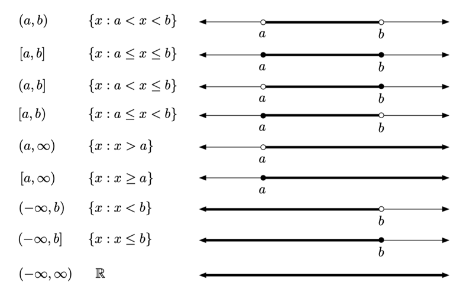
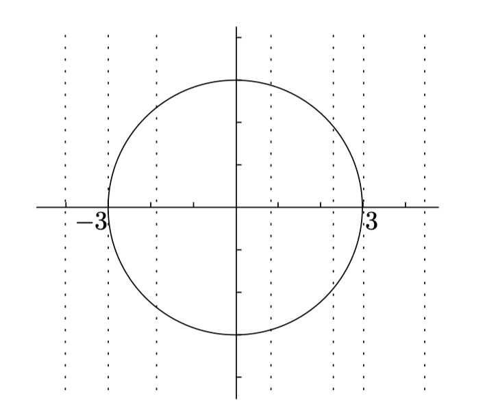

# 0101. Functions, Graphs, and Lines

Trying to do calculus without using functions would be one of the most pointless things you could do. If calculus had an ingredients list, functions would be first on it, and by some margin too. So, the first two chapters of this book are designed to jog your memory about the main features of functions. This chapter contains a review of the following topics:

1 functions: their domain, codomain, and range, and the vertical line test.

2 inverse functions and the horizontal line test.

3 composition of functions.

4 odd and even functions.

5 graphs of linear functions and polynomials in general, as well as a brief survey of graphs of rational functions, exponentials, and logarithms; and

6 how to deal with absolute values.

Trigonometric functions, or trig functions for short, are dealt with in the next chapter. So, let's kick off with a review of what a function actually is.

没有函数的微积分是一件最无意义的事情。如果要列出微积分的要素，那么函数会排在最前面，而且是以很大的优势排在前面的。因此，本书的前两章旨在让你温习函数的主要特征。本章包含对下列主题的回顾。1）函数：其定义域、上域、值域和垂线检验；2）反函数和水平线检验；3）函数的复合；4）奇函数与偶函数；5）线性函数和多项式的图像，以及对有理函数、指数函数和对数函数图像的简单回顾；6）如何处理绝对值。

下一章会涉及三角函数。好啦，就让我们开始吧，一起来回顾一下到底什么是函数。

## 1.1 Functions

A function is a rule for transforming an object into another object. The object you start with is called the input, and comes from some set called the domain. What you get back is called the output; it comes from some set called the codomain. Here are some examples of functions:

1 Suppose you write $f(x)=x^2$. You have just defined a function f which transforms any number into its square. Since you didn't say what the domain or codomain are, it's assumed that they are both R, the set of all real numbers. So you can square any real number, and get a real number back. For example, f transforms 2 into 4; it transforms −1/2 into 1/4; and it transforms 1 into 1. This last one isn't much of a change at all, but that's no problem: the transformed object doesn't have to be different from the original one. When you write f(2) = 4, what you really mean is that f transforms 2 into 4. By the way, f is the transformation rule, while f(x) is the result of applying the transformation rule to the variable x. So it's technically not correct to say "f(x) is a function"; it should be "f is a function."

2 Now, let $g(x)=x^2$ with domain consisting only of numbers greater than or equal to 0. (Such numbers are called nonnegative.) This seems like the same function as f, but it's not: the domains are different. For example, f(−1/2) = 1/4, but g(−1/2) isn't defined. The function g just chokes on anything not in the domain, refusing even to touch it. Since g and f have the same rule, but the domain of g is smaller than the domain of f, we say that g is formed by restricting the domain of f.

3 Still letting $f(x)=x^2$, what do you make of f(horse)? Obviously this is undefined, since you can't square a horse. On the other hand, let's set h(x) = number of legs x has, where the domain of h is the set of all animals. So h(horse) = 4, while h(ant) = 6 and h(salmon) = 0. The codomain could be the set of all nonnegative integers, since animals don't have negative or fractional numbers of legs. By the way, what is h(2)? This isn't defined, of course, since 2 isn't in the domain. How many legs does a "2" have, after all? The question doesn't really make sense. You might also think that h(chair) = 4, since most chairs have four legs, but that doesn't work either, since a chair isn't an animal, and so "chair" is not in the domain of h. That is, h(chair) is undefined.

4 Suppose you have a dog called Junkster. Unfortunately, poor Junkster has indigestion. He eats something, then chews on it for a while and tries to digest it, fails, and hurls. Junkster has transformed the food into... something else altogether. We could let j(x) = color of barf when Junkster eats x, where the domain of j is the set of foods that Junkster will eat. The codomain is the set of all colors. For this to work, we have to be confident that whenever Junkster eats a taco, his barf is always the same color (say, red). If it's sometimes red and sometimes green, that's no good: a function must assign a unique output for each valid input.

Now we have to look at the concept of the range of a function. The range is the set of all outputs that could possibly occur. You can think of the function working on transforming everything in the domain, one object at a time; the collection of transformed objects is the range. You might get duplicates, but that's OK.

So why isn't the range the same thing as the codomain? Well, the range is actually a subset of the codomain. The codomain is a set of possible outputs, while the range is the set of actual outputs. Here are the ranges of the functions we looked at above:

5 If $f(x)=x^2$ with domain R and codomain R, the range is the set of nonnegative numbers. After all, when you square a number, the result cannot be negative. How do you know the range is all the nonnegative numbers? Well, if you square every number, you definitely cover all nonnegative numbers. For example, you get 2 by squaring √ 2 (or − √ 2).

6 If $g(x)=x^2$, where the domain of g is only the nonnegative numbers but the codomain is still all of R, the range will again be the set of nonnegative numbers. When you square every nonnegative number, you still cover all the nonnegative numbers.

7 If h(x) is the number of legs the animal x has, then the range is all the possible numbers of legs that any animal can have. I can think of animals that have 0, 2, 4, 6, and 8 legs, as well as some creepy-crawlies with more legs. If you include individual animals which have lost one or more legs, you can also include 1, 3, 5, and 7 in the mix, as well as other possibilities. In any case, the range of this function isn't so clear-cut; you probably have to be a biologist to know the real answer.

8 Finally, if j(x) is the color of Junkster's barf when he eats x, then the range consists of all possible barf-colors. I dread to think what these are, but probably bright blue isn't among them.

函数是将一个对象转化为另一个对象的规则。起始对象称为输入，来自称为定义域的集合。返回的对象称为输出，来自称为上域的集合。来看一些函数的例子吧。

1、假设你写出 $f(x)=x^2$，这就定义了一个函数 f，它会将任何数变为自己的平方。由于你没有说明其定义域或上域，我们不妨假设它们都属于，即所有实数的集合。这样，你就可以将任何实数平方，并得到一个实数。例如，f 将 2 变为 4、将 -1/2 变为 1/4，将 1 变为 1。最后一个变换根本没有什么变化，但这没问题，因为转变后的对象不需要有别于原始对象。当你写出 f(2)=4 的时候，这实际上意味着 f 将 2 变为 4。顺便要说的是，f 是一个变换规则，而 f(x) 是把这个变换规则应用于变量 x 后得到的结果。因此，说「f(x) 是一个函数」是不正确的，应该说「f 是一个函数」。

现在，令 g(x)=x^2，其定义域仅包含大于或等于零的数（这样的数称为非负的）。它看上去好像和函数 f 是一样的，但实际不同，因为定义域不同。例如，f(-1/2)=1/4，但 g(-1/2) 却是没有定义的。函数 g 会拒绝非其定义域中的一切。由于 g 和 f 有相同的规则，但 g 的定义域小于 f 的定义域，因而我们说 g 是由限制 f 的定义域产生的。

仍然令 f(x)=x^2，f(马) 会是什么呢？这显然是无定义的，因为你不能平方一匹马呀。另一方面，让我们指定「h(x)=x的腿的个数」，其中 h 的定义域是所有动物的集合。这样一来，我们就会得到 h(马)=4，h(蚂蚁)=6，h(鲑鱼)=0。因为动物腿的个数不会是负数或者分数，所以其上域可以是所有非负整数的集合。顺便问一下，h(2) 会是什么呢？当然，这也是没有定义的，因为 2 不在其定义域中。「2」究竟会有几条腿呢？这个问题实际上没有任何意义。你或许也可以认为 h(椅子)=4，因为多数椅子都有四条腿，但这也没有意义，因为椅子不是动物，所以「椅子」不在 h 的定义域当中。也就是说，h(椅子)是没有定义的。

假设你有一条狗，它叫 Junkster。可怜的 Junkster 不幸患有消化不良症。它吃点东西，嚼一会儿，消化食物，可每次都失败，都会吐出来。Junkster 将食物变成了……我们可以令「j(x)=当Junkster吃x时呕吐物的颜色」，其中 j 的定义域是 Junkster 所要吃的食物的集合。其上域是所有颜色的集合。为了使之有效，我们必须认为如果 Junkster 吃了玉米面卷，它的呕吐物始终是一种颜色（假设是红色的吧）。如果有时候是红色的，而有时候是绿色的，那就不太好了，一个函数必须给每一个有效的输入指定唯一的输出。

现在我们要来看看函数值域的概念。值域是所有可能的输出所组成的集合。你可以认为函数转变其定义域中的一切，每次转变一个对象；转变后的对象所组成的集合称作值域。可能会重复，但这也没什么。

那么，为什么值域和上域不是一回事呢？值域实际上是上域的一个子集。上域是可能输出的集合，而值域则是实际输出的集合。下面给出上述函数的值域。

如果 f(x)=x^2，其定义域和上域均为实数 R，其值域是非负数的集合。毕竟，平方一个数，其结果不可能是负数。那你又如何知道值域是所有的非负数呢？如果平方每一个数，结果一定包括所有的非负数。例如，平方「根号2」或「负根号2」结果都是 2。

如果 g(x)=x^2，其中，g 的定义域仅为非负数，但其上域仍是所有实数，其值域又是非负数的集合。当平方每一个非负数时，结果仍然会包括所有的非负数。

如果 h(x) 是动物 x 的腿的个数，那么其值域就是任何动物可能会有的腿的个数的集合。我可以想到有 0、2、4、6 和 8 条腿的动物，也有一些有更多条腿的爬行动物。如果你还想到了个别的像失去一条或多条腿的动物，也可以将 1、3、5 和 7 等其他可能的数加入其值域。不管怎样，这个函数的值域并不是很清晰。要想了解真实的答案，你或许必须得是一位生物学家。

最后，如果 j(x) 是当 Junkster 吃 x 时呕吐物的颜色，那么其值域就会包含所有可能的呕吐物的颜色。我很怕去想它们会是什么样的，但或许亮蓝色不在其中吧。

### 1.1.1 Interval notation

In the rest of this book, our functions will always have codomain R, and the domain will always be as much of R as possible (unless stated otherwise). So we'll often be dealing with subsets of the real line, especially connected intervals such as { x : 2 ≤ x < 5 }. It's a bit of a pain to write out the full set notation like this, but it sure beats having to say "all the numbers between 2 and 5, including 2 but not 5." We can do even better using interval notation.

We'll write [a, b] to mean the set of all numbers between a and b, including a and b themselves. So [a, b] means the set of all x such that a ≤ x ≤ b. For example, [2, 5] is the set of all real numbers between 2 and 5, including 2 and 5. (It's not just the set consisting of 2, 3, 4, and 5: don't forget that there are loads of fractions and irrational numbers between 2 and 5, such as 5/2, √ 7, and π.) An interval such as [a, b] is called closed.

If you don't want the endpoints, change the square brackets to parentheses. In particular, (a, b) is the set of all numbers between a and b, not including a or b. So if x is in the interval (a, b), we know that a < x < b. The set (2, 5) includes all real numbers between 2 and 5, but not 2 or 5. An interval of the form (a, b) is called open.

You can mix and match: [a, b) consists of all numbers between a and b, including a but not b. And (a, b] includes b but not a. These intervals are closed at one end and open at the other. Sometimes such intervals are called half-open. An example is the set { x : 2 ≤ x < 5 } from above, which can also be written as [2, 5).

There's also the useful notation (a, ∞) for all the numbers greater than a not including a; [a, ∞) is the same thing but with a included. There are three other possibilities which involve −∞; all in all, the situation looks like this: 

区间表示法

在本书剩余部分，我们的函数总有上域，并且其定义域总会尽可能和差不多（除非另有说明）。因此，我们会经常涉及实轴的子集，尤其是像 `{x:2≤x<5}` 这样的了连通区间。像这样写出完整的集合有点儿烦，但总比说「介于 2 和 5 之间的所有数，包括 2 但不包括 5」要强。使用区间表示法会让我们做得更好。

我们写 [a, b] 是指从 a 到 b 端点间的所有实数，包括 a 和 b。所以 [a，b] 指的是所有使得 a≤x≤b 成立的 x 的集合。

例如，[2, 5] 是所有介于 2 和 5 之间（包括 2 和 5）的实数的集合。（它不仅仅包括 2、3、4 和 5，不要忘记还有一大堆处于 2 和 5 之间的分数和无理数，比如 5/2、和 π。）像 [a, b] 这种形式表示的区间我们称作闭区间。

如果你不想包括端点，把方括号变为圆括弧就行了。所以 (a, b) 指的是介于 a 和 b 之间、但不包括 a 和 b 的所有实数的集合。这样，如果 x 在区间 (a, b) 中，我们就知道 a<x<b。集合 (2，5) 表示介于 2 和 5 之间、但不包括 2 和 5 的所有实数。像 (a, b) 这种形式表示的区间我们称作开区间。

2『闭区间和开区间，做一张术语卡片。（2021-06-16）』

你也可以混和匹配：[a, b) 指的是介于 a 和 b 之间、包括 a 但不包括 b 的所有实数的集合；(a, b] 包括 b，但不包括 a。这些区间在一个端点处是闭的，而在另一个端点处是开的。有时候，像这样的区间我们称作半开区间。上述的 `{x:2≤x<5}` 就是一个例子，也可以写成 [2，5)。还有一个有用的记号就是 (a, ∞)，它是指大于 a 但不包括 a 的所有数；[a, ∞) 也一样，只是它包括 a。还有 3 个涉及 ∞ 的可能性。总而言之，情况如下。

### 1.1.2 Finding the domain { x : a < x < b }

Sometimes the definition of a function will include the domain. (This was the case, for example, with our function g from Section 1.1 above.) Most of the time, however, the domain is not provided. The basic convention is that the domain consists of as much of the set of real numbers as possible. For example, if k(x) = √ x, the domain can't be all of R, since you can't take the square root of a negative number. The domain must be [0, ∞), which is just the set of all numbers greater than or equal to 0.

OK, so square roots of negative numbers are bad. What else can cause a screw-up? Here's a list of the three most common possibilities:

1 The denominator of a fraction can't be zero.

2 You can't take the square root (or fourth root, sixth root, and so on) of a negative number.

3 You can't take the logarithm of a negative number or of 0. (Remember logs? If not, see Chapter 9)

2『上面的 3 种常见去定义域的条件，做一张信息数据卡片。（2021-06-18）』—— 已完成

You might recall that tan(90°) is also a problem, but this is really a special case of the first item above. You see,

$$tan(90) = \frac{sin(90)}{cons(90)} = 1/0$$

so the reason tan(90°) is undefined is really that a hidden denominator is zero. Here's another example: if we try to define

$$f(x) = \frac{log_{10}(x+8)\sqrt{26-2x}}{(x-2)(x+19)}$$

then what is the domain of f? Well, for f(x) to make sense, here's what needs to happen:

1 We need to take the square root of (26−2x), so this quantity had better be nonnegative. That is, 26 − 2x ≥ 0. This can be rewritten as x ≤ 13.

2 We also need to take the logarithm of (x + 8), so this quantity needs to be positive. (Notice the difference between logs and square roots: you can take the square root of 0, but you can't take the log of 0.) Anyway, we need x + 8 > 0, so x > −8. So far, we know that −8 < x ≤ 13, so the domain is at most (−8, 13].

3 The denominator can't be 0; this means that (x−2) ≠ 0 and (x+19) ≠ 0. In other words, x ≠ 2 and x ≠ −19. This last one isn't a problem, since we already know that x lies in (−8, 13], so x can't possibly be −19. We do have to exclude 2, though.

So we have found that the domain is the set (−8, 13] except for the number 2. This set could be written as `(−8, 13] \ {2}`. Here the backslash means "not including."

求定义域

有时候，函数的定义中包括了定义域。（确实如此，比如 1.1 节中的函数 g）然而，大多数情况下，定义域是没有给出的。

按照惯例，定义域包括尽可能多的实数集合。例如 k(x)=√x，其定义域就不可能是 R 中的所有实数，因为不可能得到一个负数的平方根。其定义域一定是 [0，∞)，就是大于或等于 0 的所有实数的集合。

好了，我们知道取负数的平方根会出问题。那么，还有什么会把问题搞糟呢？以下是 3 种最常见的情况。

1、分数的分母不能是零。

2、不能取一个负数的平方根（或四次根，六次根，等等）。

3、不能取一个负数或零的对数。(还记得对数函数吗？如果忘了，就请看看第 9 章！）

或许你还记得 tan(90°) 也是一个问题，但这实际上是上述第一项的特例。你看：

$$tan(90) = \frac{sin(90)}{cons(90)} = 1/0$$

所以，tan(90°) 是无定义的，实际上是因为其隐藏的分母为零。这里还有一个例子。

如果我们定义：

$$f(x) = \frac{log_{10}(x+8)\sqrt{26-2x}}{(x-2)(x+19)}$$

那么，f 的定义域是什么呢？当然，为了使 f(x) 有意义，以下是我们必须要做的。

1、我们需要取 (26-2x) 的平方根，所以，这个量必须是非负的。也就是说，26-2x≥0。还可以写成 x≤13。

2、我们也需要取 (x+8) 的对数，所以，这个量必须是正的。（注意对数和平方根的区别：可以取 0 的平方根，但不能取 0 的对数。）不管怎么说，我们需要 x+8>0，所以 x>-8。到现在为止，我们知道 -8<x≤13，所以，定义域最多是 (-8，13]。

3、分母不能为 0，这就是说 (x-2)≠0 且 (x+19)≠0。换句话说，x≠2 且 x≠-19。最后一个条件不是问题，因为我们已经知道 x 处于 (-8，13] 内，所以 x 不可能是 -19。我们还应该把 2 去掉。

这样，我们就找到了其定义域是除了 2 以外的集合 (-8，13]。这个集合可以写作 `(-8，13]\{2}`，这里的反斜杠表示「不包括」。

### 1.1.3 Finding the range using the graph

Let's define a new function F by specifying that its domain is [−2, 1] and that F(x) = x^2 on this domain. (Remember, the codomain of any function we look at will always be the set of all real numbers.) Is F the same function as f, where f(x) = x^2 for all real numbers x? The answer is no, since the two functions have different domains (even though they have the same rule). As in the case of the function g from Section 1.1 above, the function F is formed by restricting the domain of f.

Now, what is the range of F? Well, what happens if you square every number between −2 and 1 inclusive? You should be able to work (a, this b) out directly, but this is a good opportunity to see how to use a graph to find the [a, b] range of a function. The idea is to sketch the graph of the function, (a, b] then imagine two rows of lights shining from the far left and far right of the graph [a, b) horizontally toward the y-axis. The curve will cast two shadows, one on the (a, ∞) left side and one on the right side of the y-axis. The range is the union of both shadows: that is, if any point on the y-axis lies in either the left-hand or (−∞, b) the right-hand shadow, it is in the range of the function. Let's see how this works with our function F:

The left-hand shadow covers all the points on the y-axis between 0 and 4 inclusive, which is [0, 4]; on the other hand, the right-hand shadow covers the points between 0 and 1 inclusive, which is [0, 1]. The right-hand shadow doesn't contribute anything extra: the total coverage is still [0, 4]. This is the range of F.

利用图像求值域

让我们来定义一个新的函数 F，指定其定义域为 [-2, 1]，并且，F(x)=x^2 在此定义域上。（记住，我们看到的任何函数的上域总是所有实数的集合。）其中，对于所有的实数 x，f(x)=x^2，F 和 f 是同一个函数吗？回答是否定的，因为两个函数的定义域不相同（尽管它们有相同的函数规则）。正如 1.1 节中的函数 g，函数 F 是由限制 f 的定义域得到的。

现在，F 的值域又是什么呢？如果你将 -2 到 1 之间（包括 -2 和 1）的每一个实数平方的话，会发生什么呢？

你应该有能力直接求解，但这是观察如何利用图像来求一个函数的值域的很好机会。基本思想就是画出函数图像，然后想象从图像的左边和右边很远的地方朝向 y 轴水平地射入两束亮光。曲线会在 y 轴上有两个影子，一个在 y 轴的左侧，另一个在 y 轴的右侧。值域就是影子的并集；也就是说，如果 y 轴上的任意一点落在左侧或是右侧的影子里，那么它处于函数的值域中。我们以函数 F 为例来看一下图 1-1 这是怎么运作的吧。

图 1-1 中左侧的影子覆盖了在 y 轴从 0 到 4（包括 0 和 4）的所有点，也就是 [0，4]；另一方面，右侧的影子覆盖了从 0 到 1（包括 0 和 1）的所有点，也就是 [0, 1]。右侧的影子没有任何其他的贡献，全部的覆盖范围仍然是 [0, 4]。这就是函数 F 的值域。

### 1.1.4 The vertical line test

In the last section, we used the graph of a function to find its range. The graph of a function is very important: it really shows you what the function "looks like." We'll be looking at techniques for sketching graphs in Chapter 12, but for now I'd like to remind you about the vertical line test.

You can draw any figure you like on a coordinate plane, but the result may not be the graph of a function. So what's special about the graph of a function? What is the graph of a function f, anyway? Well, it's the collection of all points with coordinates (x, f(x)), where x is in the domain of f. Here's another way of looking at this: start with some number x. If x is in the (a, b) domain, you plot the point (x, f(x)), which of course [a, b] is at a height of f(x) units above the point x on the x-axis. If x isn't in the domain, you don't plot (a, b] anything. Now repeat for every real number x to build [a, b) up the graph.

Here's the key idea: you can't have two points with the same x-coordinate. In other words, no two points on the graph can lie on the same vertical line. Otherwise, how would you know which of the two or more heights above the point x on the x-axis corresponds to the value of f(x)? So, this leads us to the vertical line test: 

if you have some graph and you want to know whether it's the graph of a function, see whether any vertical line intersects the graph more than once. If so, it's not the graph of a function; but if no vertical line intersects the graph more than once, you are indeed dealing with the graph of a function. For example, the circle of radius x units centered at the origin has a graph like this:

Such a commonplace object should be a function, right? No, check the vertical lines that are shown in the diagram. Sure, to the left of −3 or to the right of 3, there's no problem — the vertical lines don't even hit the graph, which is fine. Even at −3 or 3, the vertical lines only intersect the curve in one point each, which is also fine. The problem is when x is in the interval (−3, 3). For any of these values of x, the vertical line through (x, 0) intersects the circle (a, b] twice, which screws up the circle's potential function-status. You just don't know whether f(x) is the top point or the bottom point.

The best way to salvage the situation is to chop the circle in half horizontally and choose only the top or the bottom half. The equation for the whole circle is x^2 + y^2 = 9, whereas the equation the top semicircle is y = √ 9−x^2. The bottom semicircle has equationy −√ 9−x^2. These last two are functions, both with domain [−3, 3]. If you felt like chopping in a different way, you wouldn't actually have to take semicircles — you could chop and change between the upper and lower semicircles, as long as you don't violate the vertical line test. For example, here's the graph of a function which also has domain [−3, 3]:

The vertical line test checks out, so this is indeed the graph of a function.

垂线检验

在上一节中，我们利用一个函数的图像来求其值域。函数的图像非常重要：它真正地展示了函数「看起来是什么样子的」。在第 12 章，我们将会看到画图技巧，但现在，我很想提醒你注意的是垂线检验。

你可以在坐标平面上画任何你想画的图形，但结果可能不是一个函数的图像。所以，函数的图像有什么特别之处呢？或者说，什么是函数 f 的图像呢？

它是所有坐标为 (x, f(x)) 的点的集合，其中，x 在 f 的定义域中。还有另外一种方式来看待它：我们以某个实数 x 开始。如果 x 在定义域中，你就画点 (x, f(x))，它自然是，在 x 轴上的点 x 的正上方，高度为 f(x)。如果 x 没有在定义域中，你不能画任何点。现在，对于每一个实数 x，我们重复这个过程，从而构造出函数的图像。

这里有个重要思想：你不可能有两个点有相同的 x 坐标。换句话说，在图像上没有两个点会落在相对于 x 轴的同一条垂线上。要不然，你又将如何知道在点 x 上方的两个或多个高度的点中，哪一个是对应于 f(x) 的值呢？

这样，就有了垂线检验：如果你有某个图像并且想知道它是否是函数的图像，就来看看是否任何的垂线和图像相交多于一次。如果是这样的话，那它就不是函数的图像；反之，如果没有一条垂线和图像相交多于一次，那么你的确是在处理函数的图像。

2『判断一个图形是否是函数图像，用「垂线检验」。做一张任意卡片。（2021-06-16）』 —— 已完成

例如，以原点为中心，半径为 3 个单位的圆的图像，如图 1-2 所示。

这么普通的对象应该是个函数，对吗？不对，让我们进行如图所示的垂线检验。当然，在 -3 的左边或是 3 的右边都没有问题（垂线甚至都没有击中图像），这很好。就连在 -3 或 3 上，垂线和图像也仅仅有一次相交，这也很好。问题出在 x 落在区间 (-3, 3) 上时。对于这其中的任意 x 值，垂线通过 (x, 0) 和圆相交两次，这就扭曲了圆的潜在函数特质。你不知道 f(x) 到底是对应上方的点还是下方的点。

最好的解决方法是把圆分成上下两个半圆，并只选择上一半或者下一半。整个圆的方程是 x^2+y^2=9，然而，上半圆的方程是 y=√(9-x^2)，下半圆的方程是 y=-√(9-x^2)。这最后两个就是函数了，定义域都是 [-3, 3]。你可以以不同的方式来分割，实际上，你不是必须要把它分成半圆（可以分割并改变上半圆和下半圆，只要不违反垂线检验就行了。）

例如，图 1-3 也是一个函数的图像，其定义域也是 [-3, 3]：

## 1.2 Inverse Functions

Let's say you have a function f. You present it with an input x; provided that x is in the domain of f, you get back an output, which we call f(x). Now we try to do things all backward and ask this question: if you pick a number y, what input can you give to f in order to get back y as your output?

Here's how to state the problem in math-speak: given a number y, what x in the domain of f satisfies f(x) = y? The first thing to notice is that y has to be in the range of f. Otherwise, by definition there are no values of x such that f(x) = y. There would be nothing in the domain that f would transform into y, since the range is all the possible outputs.

On the other hand, if y is in the range, there might be many values that work. For example, if f(x) = x 2 (with domain R), and we ask what value of x transforms into 64, there are obviously two values of x: 8 and −8. On the other hand, if g(x) = x 3, and we ask the same question, there's only one value of x, which is 4. The same would be true for any number we give to g to transform, because any number has only one (real) cube root.

So, here's the situation: we're given a function f, and we pick y in the range of f. Ideally, there will be exactly one value of x which satisfies f(x) = y. If this is true for every value of y in the range, then we can define a new 8 • Functions, Graphs, and Lines

function which reverses the transformation. Starting with the output y, the new function finds the one and only input x which leads to the output. The new function is called the inverse function of f, and is written as f −1. Here's a summary of the situation in mathematical language:

1 Start with a function f such that for any y in the range of f, there is exactly one number x such that f(x) = y. That is, different inputs give different outputs. Now we will define the inverse function f −1.

2 The domain of f −1 is the same as the range of f.

3 The range of f −1 is the same as the domain of f.

4 The value of f −1 (y) is the number x such that f(x) = y. So,

if f(x) = y,

The transformation f −1 acts like an undo button for f: if you start with x and transform it into y using the function f, then you can undo the effect of the transformation by using the inverse function f −1 on y to get x back.

This raises some questions: how do you see if there's only one value of x that satisfies the equation f(x) = y? If so, how do you find the inverse, and what does its graph look like? If not, how do you salvage the situation? We'll answer these questions in the next three sections.

反函数

我们假设一个函数 f。你给了它一个输入 x；如果 x 在 f 的定义域中，就能得到一个输出，我们称它为 f(x)。现在，我们把过程倒过来，并问：如果你选一个实数 y，那么应该赋予 f 什么样的输入才能得到这个输出 y 呢？

用数学语言来陈述这个问题就是：给定一个实数 y，那么在 f 定义域中的哪个 x 满足 f(x)=y？首先要注意的是，y 必须在 f 的值域中。否则，根据定义，将不再有 x 的值使得 f(x)=y 成立了。在 f 定义域中也许没有这样的 x 满足 f(x)=y，因为值域是所有的可能输出。

另一方面，如果 y 在值域当中，也可能会有很多值都满足 f(x)=y。例如 f(x)=x^2(其定义域为，我们的问题是 x 取何值时会输出 64。很显然，有两个 x 值：8 和 -8。另外，如果 g(x)=x^3，对于相同的问题，这时只有一个 x 值，就是 4。对于我们赋予 g 的任意一个实数去做变换，结果都是一样的，因为任何数都只有一个(实数)立方根。

所以，这里有一种情形：给定一个函数 f，我们在 f 的值域中选择 y。在理想状况下，仅有一个 x 值满足 f(x)=y。如果上述理想状况对于值域中的每一个 y 来说都成立，那么就可以定义一个新的函数，它将逆转变换。我们以输出 y 开始，这个新的函数发现一个且仅有一个输入 x 满足 f(x)=y。这个新的函数称为 f 的反函数，并写作 f-1。以下是使用数学语言对上述情况的总结。

1、从一个函数 f 出发，使得：对于在 f 值域中的任意 y，都只有唯一的 x 值满足 f(x)=y。也就是说，不同的输入对应不同的输出。现在，我们就来定义反函数 f-1。

2、f-1 的定义域和 f 的值域相同。

3、f-1 的值域和 f 的定义域相同。

4、f-1(y) 的值就是满足 f(x)=y 的 x。所以，如果 f(x)=y，那么 f-1(y)=x。

变换 f-1 就像是 f 的恢复按钮：如果你以 x 开始，并通过函数 f 将它变换为 y，那么可以通过在 y 上的反函数 f-1 来恢复这个变换的效果，取回 x。

这会引发一些问题：你是如何知道只有唯一的 x 值满足 f(x)=y 的呢？如果是这样，如何求得反函数呢？如何知道其图像是什么样子的呢？如果不是这样，你又如何挽救这一局面呢？在接下来的 3 个小节中我们会对这些问题做出回答。

### 1.2.1 The horizontal line test

For the first question — how to see that there's only one value of x that works PSfrag replacements for any y in the range — perhaps the best way is to look at the graph of your (a, b) function. We want to pick y in the range of f and hopefully only have one value [a, b] of x such that f(x) = y. What this means is that the horizontal line through (a, b] the point (0, y) should intersect the graph exactly once, at some point (x, y). [a, b) That x is the one we want. If the horizontal line intersects the (a, curve ∞) more [a, ∞) than once, there would be multiple potential inverses x, which is bad. In that (−∞, b) case, the only way to get an inverse function is to restrict the domain; we'll (−∞, b] come back to this very shortly. What if the horizontal line doesn't intersect (−∞, ∞) the curve at all? Then y isn't in the range after all, which is x : a OK. < x < b { }

So, we have just described the horizontal line test: if every x : a horizontal line { ≤ x ≤ b } ≤ } intersects the graph of a function at most once, the function { x : a has < x an b inverse. } If even one horizontal line intersects the graph more than { x once, : a ≤ there x < b isn't an x : x ≥ a } inverse function. For example, look at the graphs of f(x) = x 3 { and g(x) = x 2 :

No horizontal line hits y = f(x) more than once, so f (a, has b) an inverse. On the other hand, some of the horizontal lines hit the curve [a, y b] = g(x) twice, so g has no inverse. Here's the problem: if you want to solve (a, b] y = x 2 for x, where [a, b) y is positive, then there are two solutions, x = √ y and x = − √ y. You don't know which one to take! (a, ∞)

[a, ∞)

1.2.2 Finding the inverse

(−∞, b)

(−∞, b]

Now let's move on to the second of our questions: (−∞, how do ∞) you find the inverse of a function f? Well, you write down y = { x f(x) : a < and x < try b } to solve for x. In 3 our example of f(x) = x 3 { 3 x so,wehavey = x, : a x ≤ = x ≤ b y. } This means that √ 3 f −1 (y) = √ y. If the variable y here offends { x : you, a < by x ≤ all b } means switch it to 3 x: you can write f −1 (x) = √ x if you prefer. { x : Of a ≤ course, x < b } solving for x is not always easy and in fact is often impossible. On { x the : x other ≥ a } hand, if you know what the graph of your function looks like, the { graph x : x > of a the inverse function } ≤ } is easy to find. The idea is to draw the line y = { x x on : x the b graph, then pretend that this line is a two-sided mirror. The inverse { x function : x < b } is the reflection of the original function in this mirror. When f(x) = x 3, here's what f −1 looks R like:

The original function f is reflected in the mirror y = x to get the inverse function. Note that the domain and range of both f and f −1 are the whole real line.

水平线检验

对于第一个问题 —  — 如何知道对于 f 值域中的任意 y，只有一个 x 值满足 f(x)=y，最好的方法也许是看一下函数图像。我们想要在 f 值域中选择 y，并且希望只有一个 x 值满足 f(x)=y。这就意味着通过点 (0，y) 的水平线应该和图像仅有一次相交，且交点为点 (x，y)。那个 x 就是我们想要的。如果水平线和曲线相交多于一次，那将会有多个可能的对应 x 值，情况会很糟。如果是那样，获得反函数唯一的方法就是对定义域加以限制，我们很快会讨论这一点。如果水平线根本就没有和曲线相交，会怎样呢？就是 y 根本没有在值域当中，这样也不错。

这样一来，我们就可以描述水平线检验：如果每一条水平线和一个函数的图像相交至多一次，那么这个函数就有一个反函数。如果即使只有一条水平线和图像相交多于一次，那么这个函数就没有反函数。例如，我们来看一下图 1-4 中 f(x)=x^3 和 g(x)=x^2 的图像。

图 1-4

没有一条水平线和 y=f(x) 相交多于一次，所以 f 有一个反函数。另一方面，一些水平线和曲线 y=g(x) 相交两次，所以 g 没有反函数。这里有个问题：如果通过 y=x^2 来求解 x，其中 y 为正，那么就会出现两个解：x=√y 和 x=-√y。你不知道要取哪一个。

求逆

现在，来看我们的第二个问题：如何求得函数 f 的反函数呢？你记下 y=f(x)，并试图解出 x。在 f(x)=x^3 的例子中，有 y=x^3，所以 x=3√y。这就意味着 f-1(y)=3√y，如果你不喜欢变量 y，可以将它改写为 x，如果你愿意，可以写成 f-1(x)=3√x。当然了，求解 x 并不总是那么简单，事实上，求解经常是不可能的。

另一方面，如果你知道函数图像是什么样子的，反函数的图像就会很容易画出来。基本思想就是在图像上画一条 y=x 的直线，然后将这条直线假想为一个双面的镜子。反函数就是原始函数的镜面反射。如果 f(x)=x^3，那么 f-1 的图像如图 1-5 所示。

图 1-5

原始函数 f 在 y=x 这面「镜子」中被反射，从而得到反函数。注意：f 和 f-1 的定义域和值域都是整个实轴。

### 1.2.3 Restricting the domain

Finally, we'll address our third question: if the horizontal line test fails and there's no inverse, what can be done? Our problem is that there are multiple values of x that give the same y. The only way to get around the problem is to throw away all but one of these values of x. That is, we have to decide which one of our values of x we want to keep, and throw the rest away. As we saw in Section 1.1 above, this is called restricting the domain of our function. Effectively, we ghost out part of the curve so that what's left no longer fails the horizontal line test. For example, if g(x) = x 2, we can ghost out the left half of the graph like this:

The new (unghosted) curve has the reduced domain [0, ∞) and satisfies the shadow horizontal line test, so there is an inverse function. More precisely, 0 the function h, which has domain [0, ∞) and is defined by h(x) = x 2 on this 1 domain, has PSfrag replacements an inverse. Let's play the reflection game to see what it looks like:

To find the equation of the inverse, we { have x : x to ≥ a solve } for x in the equation y = x 2. Clearly the solution is x = √ y { or x : x x = − } y, but which one do we >a √ need? We know that the range of the { inverse ≤ function is the same as the x : x b } domain of the original function, which we have restricted to be [0, ∞). So { x : x < b } we need a nonnegative number as our answer, and that has to be x = √ y. R That is, h −1 (y) = √ y. Of course, we could have ghosted out the right half of a the original graph to restrict the domain to (−∞, 0]. In that case, we'd get a b function j which has domain (−∞, 0] and again satisfies j(x) = x 2, but only shadow on this domain. This function also has an inverse, 0 but the inverse is now the negative square root: j −1 (y) = − √ y. 1

By the way, if you take the original function g 4 given by g(x) = x 2 with domain (−∞, ∞), which fails the horizontal line −2 test, and try to reflect it in the mirror y = x, you get the following picture: 3

Notice that the graph fails the vertical line test, so it's not the graph of a function. This illustrates the connection between the vertical and horizontal line tests — when horizontal lines are reflected in the mirror y = x, they become vertical lines.

限制定义域

终于，我们要提及第三个问题了：如果水平线检验失败并且没有反函数，那应该怎么办呢？我们的问题是，对于相同的 y 有多个 x 值。解决此问题的唯一方法是：除了这些多个 x 值中的一个，我们放弃所有其他值。也就是说，我们必须决定要保留哪一个 x 值，然后放弃剩余的值。正如在 1.1 节中看到的，这称为限制函数的定义域。事实上，我们删去部分曲线，使得保留下来的部分能够通过水平线检验。例如 g(x)=x^2，可以删除左半边的图像，如图 1-6 所示。

图 1-6

这条新的(实线的)曲线将定义域缩减为 [0，∞)，并且满足水平线检验，所以它有反函数。更确切地说，定义在定义域 [0，∞) 上的函数 h 有反函数，其中 h(x)=x^2。让我们用镜面游戏来看一下它到底是什么样子的。

为了找到反函数的方程，我们必须在方程 y=x^2 中解出 x。很明显，问题的解就是 x=√y 或 x=-√y，但是我们需要哪一个呢？我们知道反函数的值域和原始函数的定义域是相同的，它被限制为 [0，∞)，所以我们需要一个非负的数来作为答案，即 x=√y。这就是说，h-1(y)=√y。当然，我们也可以把原始图像的右半边删除，将定义域限制为 (-∞，0]。在那种情况下，我们得到一个定义域为 (-∞，0]的函数j，并且也满足 j(x)=x^2，但是只是在这个定义域上才成立。这个函数也有反函数，反函数是负的平方根，即 j-1(y)=-√y，如图 1-7 所示。

图 1-7

顺便说一下，如果你取的原始函数 g 定义是 g(x)=x^2，其定义域为 (-∞，∞)，没有通过水平线检验，并且你试图将它在镜面 y=x 中反射，那么会得到如图 1-8 图像。

图 1-8

注意，这个图像不会通过垂线检验，所以它不是函数的图像。这说明垂线检验和水平线检验之间有一定的联系，即当水平线被镜面 y=x 反射后会变成垂线。

### 1.2.4 Inverses of inverse functions

One more thing about inverse functions: if f has an inverse, it's true that f −1 (f(x)) = x for all x in the domain of f, and also that f(f −1 (y)) = y for all y in the range of f. (Remember, the range of f is the same as the domain of f −1, so you can indeed take f −1 (y) for y in the range of f without causing any screwups.)

3 For example, if f(x) = x 3, then f has an inverse given by f −1 (x) = √ x, 3 and so f −1 (f(x)) = √ x 3 = x for any x. Remember, the inverse function is like an undo button. We use x as an input to f, and then give the output to f −1 ; this undoes the transformation and gives us back x, the original number. 3 Similarly, f(f −1 (y)) = ( √ y) 3 = y. So f −1 is the inverse function of f, and f is the inverse function of f −1. In other words, the inverse of the inverse is the original function.

Now, you have to be careful in the case where you restrict the domain. Let g(x) = x 2 ; we've seen that you need to restrict the domain to get an inverse. Let's say we restrict the domain to [0, ∞) and carelessly continue to refer to the function as g instead of h, as in the previous section. We would then say that g −1 (x) = √ x. If you calculate g(g −1 (x)), you find that this is ( √ x) 2, which equals x, provided that x ≥ 0. (Otherwise you can't take the square root in the first place.)

On the other hand, if you work out g −1 (g(x)), you get √ x 2, which is not always the same thing as x. For example, if x = −2, then x 2 = 4 and so √ x 2 = √ 4 = 2. So it's not true in general that g −1 (g(x)) = x. The problem is that −2 isn't in the restricted-domain version of g. Technically, you can't even compute g(−2), since −2 is no longer in the domain of g. We really should be working with h, not g, so that we remember to be more careful. Nevertheless, in practice, mathematicians will often restrict the domain without changing letters! So it will be useful to summarize the situation as follows:

If the domain of a function f can be restricted so that f has an inverse f −1, then

• f(f −1 (y)) = y for all y in the range of f; but

• f −1 (f(x)) may not equal x; in fact, f −1 (f(x)) = x only when x is in the restricted domain.

We'll be revisiting these important points in the context of inverse trig functions in Section 10.2.6 of Chapter 10.

反函数的反函数

有关反函数还有一点：如果 f 有反函数，那么对于在 f 定义域中的所有 x，f-1(f(x))=x 成立；同样，对于在 f 值域当中的所有 y，都有 x，f(f-1(y))=y。(记住，f 的值域和 f-1 的定义域相同，所以的确可以取 f-1(y) 作为 f 值域当中的 y，不会导致任何曲解。)

例如 f(x)=x^3，f 的反函数由 f-1(x)=3√x 给出，所以对于任意的 x，f-1(f(x))=3√(x^3)=x。不要忘记，反函数就像是恢复按钮。我们使用 x 作为 f 的输入，然后给出输出到 f-1；这就恢复了变换并且我们取回了 x 这个原始的数。类似地，f(f-1(y))=(3√y)^3。所以，f-1 是 f 的反函数，且 f 是 f-1 的反函数。换句话说，反函数的反函数就是原始函数。

现在，对于限制定义域的情况一定要当心。令 g(x)=x^2，我们已经看到你需要对其定义域加以限制，方能取得反函数。如果我们把定义域限制为 [0，∞)，但由于粗心，把函数继续看成是 g 而不是 h，正如先前小节所述。我们便会说。如果你真要计算 g(g-1(x))，就会发现它是，如果 x≥0，它就等于 x。(否则，从一开始你就无法取得平方根。)

另一方面，如果你解出 g-1(g(x))，你会得到，它不是总和 x 相同。例如，如果 x=-2，那么 x^2=4，。所以，总的说来，g-1(g(x))=x 不成立。问题是 -2 没有在 g 的限制定义域当中。而且，从技术角度而言，你甚至不可能计算 g(-2)，因为 -2 不再属于 g 的定义域了。我们确实应该使用 h，而不是 g，这样我们要记得更加小心。尽管如此，在实际中，数学家们会经常不改变字母来限制定义域！所以，把这种情形总结如下对大家是很有帮助的。

如果一个函数 f 的定义域可以被限制，使得 f 有反函数 f-1，那么对于 f 值域中的所有 y，都有 f(f-1(y))=y；但是 f-1(f(x)) 可能不等于 x；事实上，f-1(f(x))=x 仅当 x 在限制的定义域中才成立。

在 10.2.6 节，对于反三角函数，我们会继续讨论这些要点。

## 1.3 Composition of Functions

Let's say we have a function g given by g(x) = x 2. You can replace x by anything you like, as long as it makes sense. For example, you can write [a, b] (a, b] [a, b) (a, ∞) rag replacements [a, ∞) (−∞, (a, b)

(−∞, [a, b]

g(y) = y 2, or g(x + 5) = (x + 5) 2. This last example shows that you need to be very careful with parentheses. It would be wrong to write g(x+5) = x+5 2, since this is just x + 25, which is not the same thing as (x + 5) 2. If in doubt, use parentheses. That is, if you need to write out f(something), replace every instance of x by (something), making sure to include the parentheses. Just about the only time you don't need to use parentheses is when the function is an exponential function — for example, if h(x) = 3 x, then you can just write h(x 2 + 6) = 3 x 2 +6. You don't need parentheses since you're already writing the x 2 + 6 as a superscript.

R 4 a −2 b 3

shadow −3 2 g(x) = x0

3 f(x) = x 1

2 g(x) = x 4

f(x) = −2 x 3 3 mirror (y = x) 3 f −1 (x) = √ −3 x g(x) = x 2 y = h(x) y f(x) = h −1 (x) =x3  g(x) = x2 

f(x) = x3 

mirror (y = x)

f

−1

√

(x) = 3 x y = h(x) y = h −1 (x)

Now consider the function f defined by f(x) = cos(x 2 ). If I give you a number x, how do you compute f(x)? Well, first you square it, then you take the cosine of the result. Since we can decompose the action of f(x) into these two separate actions which are performed one after the other, we might as well describe those actions as functions themselves. So, let g(x) = x 2 and h(x) = cos(x). To simulate what f does when you use x as an input, you could first give x to g to square it, and then instead of taking the result back you could ask g to give its result to h instead. Then h spits out a number, which is the final answer. The answer will, of course, be the cosine of what came out of g, which was the square of the original x. This behavior exactly mimics f, so we can write f(x) = h(g(x)). Another way of expressing this is to write f = h ◦ g; here the circle means "composed with." That is, f is h composed with g, or in other words, f is the composition of h and g. What's tricky is that you write h before g (reading from left to right as usual!) but you apply g first. I agree that it's confusing, but what can I say — you just have to deal with it.

It's useful to practice composing two or more functions together. For example, if g(x) = 2 x, h(x) = 5x 4, and j(x) = 2x − 1, what is a formula for the function f = g ◦ h ◦ j? Well, just replace one thing at a time, starting with j, then h, then g. So:

f(x) = g(h(j(x))) = g(h(2x − 1)) = g(5(2x − 1) 4 ) = 2 5(2x−1) 4.

You should also practice reversing the process. For example, suppose you start off with

1 f(x) =. tan(5 log 2 (x + 3))

How would you decompose f into simpler functions? Zoom in to where you see the quantity x. The first thing you do is add 3, so let g(x) = x + 3. Then you have to take the base 2 logarithm of the resulting quantity, so set h(x) = log 2 (x). Next, multiply by 5, so set j(x) = 5x. Then take the tangent, so put k(x) = tan(x). Finally, take reciprocals, so let m(x) = 1/x. With all these definitions, you should check that

f(x) = m(k(j(h(g(x))))).

Using the composition notation, you can write

f = m ◦ k ◦ j ◦ h ◦ g. rag replacements

(a, b) [a, b]

(a, b] rag replacements [a, b) (a, b) (a, ∞) [a, b] [a, ∞) (−∞, (a, b) b] (−∞, [a, b) b] (−∞, (a, ∞) ∞) [a, ∞) { x : a < x < b } (−∞, b) { x : a ≤ x ≤ b } (−∞, b] { x : a < x ≤ b } (−∞, ∞) { x : a ≤ x < b } { x : { a x < : x x < ≥ b a } } { x : { a x ≤ : x x ≤ > b a } } { x : a { x < : x x ≤ ≤ b b } } { x : a { x ≤ : x x < < b b } } { x : x ≥ a R } { x : x > a } a { x : x ≤ b } b x < b } { x : shadow

R 0 a 1 b 4 shadow −2 0 3 1 −3 2 g(x) = x 4

Section 1.3: Composition of Functions • 13

This isn't the only way to break down f. For example, we could have combined h and j into another function n, where n(x) = 5 log 2 (x). Then you should

check that n = j ◦ h, and

f = m ◦ k ◦ n ◦ g.

Perhaps the original decomposition (involving j and h) is better because it breaks down f into more elementary steps, but the second one (involving n) isn't wrong. After all, n(x) = 5 log 2 (x) is still a pretty simple function of x.

Beware: composition of functions isn't the same thing as multiplying them together. For example, if f(x) = x 2 sin(x), then f is not the composition of two functions. To calculate f(x) for PSfrag any given x, replacements you actually have to find both x 2 and sin(x) (it doesn't matter which one you (a, b) find first, unlike with composition) and then multiply these two things together. If g(x) = x 2 and [a, b] h(x) = sin(x), then we'd write f(x) = g(x)h(x), or f (a, = b] gh. Compare this to the composition of the two functions, j = g ◦ h, which is given by [a, b)

(a, ∞)2  j(x) = g(h(x)) = g(sin(x)) = (sin(x)) [a, ∞)

(−∞, b) or simply j(x) = sin 2 (x). The function j is a completely different function (−∞, b] from the product x 2 sin(x). It's also different from the function k = h ◦ g, (−∞, ∞) which is also a composition of g and h but in the other order:

f(x) = −2 x 3 2 g(x) = x 3 −3 f(x) = x 3 g(x) = x 2 mirror (y = x) f(x) = x 3 3 f −1 (x) = √ x 2 g(x) y = = h(x) x x3  y f(x) = h −1 = (x) mirror (y = x)

This is yet another completely different { x function. : a ≤ x The < b } moral of the story is that products and compositions are not the same { x : thing, ≥ } and furthermore, the x a order of the functions matters when you compose them, but not when you { x : x > a } multiply them together.

One simple but important example of { composition } of functions occurs x:x<b when you compose some function f with g(x) = x − a, where a is some R constant number. You end up with a new function h given by h(x) = f(x−a). a A useful point to note is that the graph of y = h(x) is the same as the graph b of y = f(x), except that it's shifted over a units to the right. If a is negative, shadow then the shift is to the left. (The way to think of this, for example, is that a 0 shift of −3 units to the right is the same as a shift of 3 units to the left.) So, how would you sketch the graph of y = (x − 1) 2 ? This is the same as y = x 2, 4 but with x replaced by x − 1. So the gra

Similarly, the graph of y = (x + 2) 2 is the graph of y = x 2 shifted to the left by 2 units, since you can interpret (x + 2) as (x − (−2)).

函数的复合

我们说对于有表达式 g(x)=x^2 的函数 g，可以将 x 替换成任何使函数有意义的对象，如 g(y)=y^2 或 g(x+5)=(x+5)^2。后一个例子需要特别注意小括号，若写成 g(x+5)=x+5^2 就是错的，因为 x+25 并不等于 (x+5)^2。所以在替换过程中如果拿不准，可用小括号。也就是说，如果你需将 f(x) 写成 f(某表达式)，可将每一个 x 替换成(某表达式)，这时一定要加小括号。唯一不需要加小括号的情况是当函数是指数函数时，如 h(x)=3^x，则可写 h(x^2+6)=3^(x^2+6)，不需要加小括号是因为已经将 x^2+6 写成上标了。

现在考虑定义为 f(x)=cos(x^2) 的函数 f。若给定一个数 x，如何计算 f(x) 呢？你会首先计算 x 的平方，然后计算平方值的余弦，鉴于我们可将 f(x) 的计算分解成一个连着一个的两个独立的计算，我们也就可以将这些计算各描述成一个函数，因此令 g(x)=x^2，h(x)=cos(x)。为了模拟函数 f 是如何作用于输入值 x 的，你可先将 x 输入到函数 g 进行求平方运算，接着不必返回 g 的结果而直接让 g 将其结果作为函数 h 的输入，然后 h 计算出一个最终的结果值，该结果值当然是由函数 g 计算出的 x 平方值的余弦值。这个过程恰恰模拟了 f，故我们可以写出 f(x)=h(g(x))，也可表示为，这里圈表示「与……的复合」，即 f 是 g 与 h 的复合。换言之，f 是 g 与 h 的复合函数，容易误导我们的是 h 写在 g 的前面(像平常一样按从左向右的顺序来读)，但计算起来要先从 g 开始。我承认容易搞混，但我还得说你不得不这么做。

练习求两个或多个函数的复合是很有用的。例如，若 g(x)=2^x，h(x)=5x^4，j(x)=2x-1，则函数的表达式 f=gohoj 是什么？我们只需从 j 开始，将其代换到 h，接着再将结果代换到 g，可得：

省略，详见电子书

同样，你需要练习该过程的逆过程。例如，假定你开始于函数：

省略，详见电子书

如何将 f 分解为几个简单函数呢？从函数式中找到 x，首先需要加 3，所以设 g(x)=x+3；然后要对所得值取以 2 为底的对数，令 h(x)=log2(x)；接着需乘 5，则设置 j(x)=5x；下面要求正切值，因此令 k(x)=tan(x)；最后要取倒数，令 m(x)=1/x。由上，验证下式：

省略，详见电子书

利用复合符号，可以写成：

省略，详见电子书

这并不是函数 f 的唯一分解形式。如，我们可以将函数 h 和 j 复合成另一个函数 n，其中 n(x)=5log2(x)，验证一下，或许最初(包含j和h)的分解较好一点，因为它将 f 分解成更多的基本形式，但第二种(包含n)也没错，毕竟 n(x)=5log2(x) 仍是关于 x 的较为简单的函数。

注意，函数的复合并不是把它们相乘。如 f(x)=x^2sin(x)，f 不是两个函数的复合，因为对任意给定的 x，计算 f(x) 的值需要求解 x^2 和 sin(x)(先求哪个值都没关系，这与复合函数不同)，然后将这两个值乘起来。若令 g(x)=x^2，h(x)=sin(x)，则我们可以写成 f(x)=g(x)h(x) 或 f=gh。将它与这两个函数的复合函数(如下)：

省略，详见电子书

即 j(x)=sin^2(x) 比较一下。函数 j 完全不同于乘积 x^2sin(x)，它同样不同于函数，函数 k 也是 g 和 h 的复合函数，不过是按另一个顺序的复合：

省略，详见电子书

k 是另一个完全不同的函数。上述事实的寓意在于，函数的乘积和复合是不同的，且函数的复合与函数顺序有关系，而函数的乘积与函数顺序无关。

当你将函数 f 和 g(x)=x-a(a是常数) 进行复合后，就会出现复合函数中一个简单但很重要的例子。对复合得到的新函数 h(x)=f(x-a)，需要关注的是新函数 y=h(x) 和函数 y=f(x) 的图像是一样的，只不过 y=h(x) 的函数图像向右平移了 a 个单位。如果 a 是负的，那么就是向左平移(亦即，向右平移 -3 个单位与向左平移 3 个单位是一样的)。那么，如何画 y=(x-1)^2 的图像呢？就像画 y=x^2 的图像一样，只是用 x-1 来代替 x。所以可将函数 y=x^2 向右平移 1 个单位，如图 1-9 所示。

图 1-9

类似地，y=(x+2)^2 的图像是将 y=x^2 的图像向左平移 2 个单位，可把 (x+2) 理解为 (x-(-2))。

## 1.4 Odd and Even Functions

Some functions have some symmetry properties that make them easier to deal with. Consider the function f given by f(x) = x 2. Pick any positive number you like (I'll choose 3) and hit it with f (I get 9). Now take the negative of that number, −3 in my case, and hit that with f (I get 9 again). You should get the same answer both times, as I did, regardless of which number you chose. You can express this phenomenon by writing f(−x) = f(x) for all x. That is, if you give x to f as an input, you get back the same answer as if you used the input −x instead. Notice that g(x) = x 4 and h(x) = x 6 also have this property — in fact, j(x) = x n, where n is any even number (n could in fact be negative), has the same property. Inspired by this, we say that a function f is even if f(−x) = f(x) for all x in the domain of f. It's not good enough for this equation to be true for some values of x; it has to be true for all x in the domain of f.

Now, let's say we play the same game with f(x) = x 3. Take your favorite positive number (I'll stick with 3) and hit that with f (I get 27). Now try again with the negative of your number, −3 in my case; I get −27, and you should also get the negative of what you got before. You can express this mathematically as f(−x) = −f(x). Once again, the same property holds for j(x) = x n when n is any odd number (and once again, n could be negative). So, we say that a function f is odd if f(−x) = −f(x) for all x in the domain of f.

In general, a function might be odd, it might be even, or it might be neither odd nor even. Don't forget this last point! Most functions are neither odd nor even. On the other hand, there's only one function that's both odd and even, which is the rather boring function given by f(x) = 0 for all x (we'll call this the "zero function"). Why is this the only odd and even function? Let's convince ourselves. If the function f is even, then f(−x) = f(x) for all x. But if it's also odd, then f(−x) = −f(x) for all x. Take the first of these equations and subtract the second from it. You should get 0 = 2f(x), which means that f(x) = 0. This is true for all x, so the function f must just be the zero function. One other nice observation is that if a function f is odd, and the number 0 is in its domain, then f(0) = 0. Why is it so? Because f(−x) = −f(x) is true for all x in the domain of f, so let's try it for x = 0. You get f(−0) = −f(0). But −0 is the same thing as 0, so we have f(0) = −f(0). This simplifies to 2f(0) = 0, or f(0) = 0 as claimed.

Anyway, starting with a function f, how can you tell if it is odd, even, or neither? And so what if it is odd or even anyway? Let's look at this second question before coming back to the first one. One nice thing about knowing that a function is odd or even is that it's easier to graph the function. In fact, if you can graph the right-hand half of the function, the left-hand half is a piece of cake! Let's say that f is an even function. Then since f(x) = f(−x), the graph of y = f(x) is at the same height above the x-coordinates x and −x. This is true for all x, so the situation looks something like this:

We can conclude that the graph of an even function has mirror sym0 metry about the y-axis. So, if you graph the right half of a function which 1 4 you know is even, you can get the left half by reflecting the right half about the y-axis. Check the graph of y = x 2 to make sure that it −2 has this mirror symmetry. 3

Same height

−3 On the other hand, let's say that f is an odd function. g(x) = x Since 2 we have f(−x) = −f(x), the graph of y = f(x) is at the same height above the f(x) = x 3 x-coordinate x as it is below the x-coordinate −x. (Of course, if f(x) is g(x) = x 2 negative, then you have to switch the words "above" and "below.") In any f(x) = x 3 case, the picture looks like this:

The symmetry is now a point symmetry about the origin. That is, the graph of an odd function has 180 ◦ point symmetry about the origin. This means that if you only have the right half of a function which you know is odd, you can get the left half as follows. Pretend that the curve is sitting on top of the paper, so you can pick it up if you like but you can't change its shape. Instead of picking it up, put a pin through the curve at the origin (remember, odd functions must pass through the origin if they are defined at 0) and then spin the whole curve around half a revolution. This is what the left-hand half of the graph looks like. (This doesn't work so well if the curve isn't continuous, that is, if the curve isn't all in one piece!) Check to see that the above graph and also the graph of y = x 3 have this symmetry.

Now, suppose f is defined by the equation f(x) = log 5 (2x 6 −6x 2 +3). How do you tell if f is odd, even, or neither? The technique is to calculate f(−x) by replacing every instance of x with (−x), making sure not to forget the parentheses around −x, and then simplifying the result. If you end up with the original expression f(x), then f is even; if you end up with the negative of the original expression f(−x), then f is odd; if you end up with a mess that isn't either f(x) or −f(x), then f is neither (or you didn't simplify enough!).

In the example above, you'd write

f(−x) = log 5 (2(−x) 6 − 6(−x) 2 + 3) = log 5 (2x 6 − 6x 2 + 3),

a { x : x ≥ −x } { x x > a } frag Same : replacements length, opposite : signs { x x ≤ b } (a, b) { x : x < [a, b b] }

which is actually equal to the original f(x). So the function f is even. How about

2x3  +x g(x) = 3x2 

+

5

and

3 +x−1 h(x) 2 3x

2x 5

= +

?

R (a, b] [a, a b) b (a, ∞) shadow [a, ∞) (−∞, 0 b) 1 (−∞, b] 4 (−∞, ∞) −2 { x : a < x < b } 3 { x : a ≤ x ≤ b } −3 { x : a < x ≤ b } x : g(x) a = x < b x3 2  { ≤ } f(x) { x : = x ≥ a } x g(x) = x2  { x : x > a } f(x) x : x ≤ x 3 b = { }

mirror x (y : x = < x) b } −1 { 3 f (x) = √ x R

y = h(x) a y = h −1 (x) b y = (x − 1)2  shadow −1 0 x 1 Same height 4

−2 −x 3 Same length, −3 opposite g(x) signs 2 =x

f(x) = x3 

g(x) = x2 

f(x) = x3 

Well, for g, we have

2(−x)3  + (−x) −2x − x g(−x) = =. 3(−x) 2 + 5 3x2 3 + 5

Now you have to observe that you can take the minus sign out front and write

2x3  +x g(−x) =, 3x 2 + 5

which, you notice, is equal to −g(x). That is, apart from the minus sign, we get the original function back. So, g is an odd function. How about h? We have

3 2(−x) + (−x) − 1 −2x3 − x − 1 h(−x) = 2 =. 3(−x)

+ 2

5

3x

+

5

Once again, we take out the minus sign to get

2x3  +x+1 h(−x) = −. 3x 2 + 5

Hmm, this doesn't appear to be the negative of the original function, because of the +1 term in the numerator. It's not the original function either, so the function h is neither odd nor even.

mirror (y = x)

3 f −1 (x) = √ x

y = h(x)

y = h −1 (x)

y = (x − 1)2  −1 x

Same height

−x Same length, opposite signs

Let's look at one more example. Suppose you want to prove that the product of two odd functions is always an even function. How would you go about doing this? Well, it helps to have names for things, so let's say we have two odd functions f and g. We need to look at the product of these functions, so let's call the product h. That is, we define h(x) = f(x)g(x). So, our task is to show that h is even. We'll do this by showing that h(−x) = h(x), as usual. It will be helpful to note that f(−x) = −f(x) and g(−x) = −g(x), since f and g are odd. Let's start with h(−x). Since h is the product of f and g, we have h(−x) = f(−x)g(−x). Now we use the oddness of f and g to express this last term as (−f(x)) (−g(x)). The minus signs now come out front and cancel out, so this is the same thing as f(x)g(x) which of course equals h(x). We could (and should) express all this text mathematically like this:

h(−x) = f(−x)g(−x) = (−f(x)) (−g(x)) = f(x)g(x) = h(x).

Anyway, since h(−x) = h(x), the function h is even. Now you should try to prove that the product of two even functions is always even, and also that the product of an odd and an even function must be odd. Go on, do it now! {

x : x < b }

R a b

shadow

Section 1.5: Graphs of Linear Functions • 17 0

1 4 1.5 Graphs of Linear Functions −2 3 Functions of the form f(x) = mx + b are called linear. There's a good reason −3 for this: the graphs of these functions are g(x) lines. = (As far as we're concerned, x2  f(x) = x3  the word "line" always means "straight line.") The slope of the line is given by m. Imagine for a moment that you are in g(x) the = x page, 2 climbing the line as f(x) = x 3 if it were a mountain. You start at the PSfrag left side replacements of the page and head to the x) right, like this:

If the slope m is positive, as it is in the above { x : a ≤ picture, x < b } then you are heading uphill. The bigger m is, the steeper the climb. { x : x ≥ On a } the other hand, if the { } slope is negative, then you are heading downhill. x : x > a The more negative the { ≤ b } slope, the steeper the downhill grade. If the slope x : x is zero, then the line is flat, { x : x < b } or horizontal — you're going neither uphill nor downhill, just trudging along a flat line. R

a To sketch the graph of a linear function, you only need to identify two b points on the graph. This is because there's only one line that goes through shadow two different points. You just put your ruler on the points and draw the line. 0 One point is easy to find, namely, the y-intercept. Set x = 0 in the equation 1 y = mx + b, and you see that y = m × 0 + b = b. That is, the y-intercept is 4 −2 equal to b, so the line goes through (0, b). To find another point, you could find the x-intercept by setting y = 0 and finding what 3 x is. This works pretty well except in two cases. The first case is when b = −3 0, in which case we are g(x) = x 2 just dealing with y = mx. This goes through the origin, so the x-intercept f(x) = x 3 and the y-intercept are both zero. To get another point, you'll just have to g(x) = x 2 substitute in x = 1 and see that y = m. So, f(x) the = line x 3 y = mx goes through the origin and (1, m). For example, the line mirror y = (

The other bad case is when m = 0. But then f(x) we just = x have y = b, which is a horizontal line through (0, b). mirror (y = 3 x) −1 √ 
f (x) = x For a more interesting example, consider y = 2 1 x − 1. The y-intercept is −1, and the slope is. To sketch the line, find y = the h(x) x-intercept by setting −1 (x) y = 0. We get 0 = 1 2 x1 2 − 1, which simplifies to y = x h = 2. So, the line looks like 2 this: y = (x − 1) 

−1 x ySame height = 12x−1
−x Same length, opposite signs
−1
2
y = −2x −2 1
Now, let's suppose you know that you have a line in the plane, but you don't know its equation. If you know it goes through a certain point, and you know what its slope is, then you can find the equation of the line. You really, really, really need to know how to do this, since it comes up a lot. This formula, called the point-slope form of a linear function, is what you need to know: 
If a line goes through (x 0, y 0 ) and has slope m, 
then its equation is y − y 0 = m(x − x 0 ). 
For example, what is the equation of the line through (−2, 5) which has slope −3? It is y − 5 = −3(x − (−2)), which you can expand and simplify down to y = −3x − 1. 
Sometimes you don't know the slope of the line, but you do know two points that it goes through. How do you find the equation? The technique is to find the slope, then use the previous idea with one of the points (your choice) to find the equation. First, you need to know this: 
y = −2x −2 1 y = 1 2 x−1 2 
y2 −y1 If a line goes through (x 1, y 1 ) and (x 2, y 2 ), its slope is equal to. x2 −x1 
−1 
So, what is the equation of the line through (−3, 4) and (2, −6)? Let's find the slope first: 
−6 4 −10 slope = = −2. 
= 2 − (−3) 5 
We now know that the line goes through (−3, 4) and has slope −2, so its equation is y − 4 = −2(x − (−3)), or after simplifying, y = −2x − 2. Alternatively, we could have used the other point (2, −6) with slope −2 to see that the equation of the line is y − (−6) = −2(x − 2), which simplifies to y = −2x − 2. Thankfully this is the same equation as before — it doesn't matter which point you pick, as long as you have used both points to find the slope. 
PSfrag replacements 
(a, b) Section 1.6: Common Functions and Graphs • [a, b] 19 
1.6 Common Functions and Graphs 
(a, b] [a, b) (a, ∞) [a, ∞) 
Here are the most important functions you should know about. 
(−∞, b) 
(−∞, b] 
(−∞, ∞) 1. Polynomials: these are functions built out of nonnegative integer powers { x : a < x < b } of x. You start with the building blocks 1, x, x 2, x 3, and so on, { x and ≤ you are : a x ≤ b } allowed to multiply these basic functions by numbers and add a { x finite : a < x ≤ b } number 3 ≤ x < b } of them together. For example, the polynomial f(x) = 5x4 −4x { +10 x : a is formed a } by taking 5 times the building block x 4 { x : x ≥ x, and −4 times the building block 3, { > a } and 10 times the building block 1, and adding them together. You x : x might also want to include the intermediate building blocks x 2 and x, but { x : x ≤ b } since they { x : x < b } don't appear, you need to take 0 times of each. The amount that you multiply R the building block x n by is called the coe ffi cient of x n. For example, in the a polynomial f above, the coefficient of x 4 is 5, the coefficient of x 3 is −4, the b coefficients of x 2 and x are both 0, and the coefficient of 1 is 10. (Why allow shadow x and 1, by the way? They seem different from the other blocks, but they're 0 not really: x = x 1 and 1 = x 0.) The highest number n such that x n has 1 a nonzero coefficient is called the degree of the polynomial. For example, the 4 −2 degree of the above polynomial f is 4, since no power of x greater than 4 is 3 present. The mathematical way to write a general polynomial of degree n is 
−3 
p(x) = a n x n + a n−1 x n−1 + · · · + a 2 x 2 + a 1 x + a 0, 
g(x) = x2 f(x) = x3 
g(x) = x2 where a n is the coefficient of x n, a n−1 is the coefficient of x n−1, and f(x) so = x 3 on down to a 0, which is the coefficient of 1. mirror (y = x) 
−1 3 f (x) = √ x Since the functions x n are the building blocks of all polynomials, you y = h(x) should know what their graphs look like. The even powers mostly look similar −1 to each other, and the same can be said for the odd powers. Here's y = what h (x) the y = (x − 1) 2 graphs look like, from x 0 up to x 7 : 

Sketching the graphs of more general polynomials is more difficult. Even findf(x) = x3  (−∞, b) ing the x-intercepts is often impossible unless the polynomial is mirror very simple. (y = x) −1 (−∞, b] There is one aspect of the graph that is fairly straightforward, f which (x) is = 3 x what √ (−∞, ∞) happens at the far left and right sides of the graph. This is determined by y = h(x) y = h −1 (x) { x : a < x < b } the so-called leading coe ffi cient, which is the coefficient of the highest-degree 1)2  { x : a ≤ x ≤ b } term. This is basically the number a n defined above. For example, y = (x in − our { x : a < x ≤ b } polynomial f(x) = 5x 4 − 4x 3 + 10 from above, the leading coefficient is 5. −1 In x { x : a ≤ x < b } fact, it only matters whether the leading coefficient is positive or negative. It Same height { x : x ≥ a } also matters whether the degree of the polynomial is odd or even; so there are { x : x > a } four possibilities for what the edges of the graph can look like:

The wiggles in the center of these diagrams aren't relevant — they depend on the other terms of the polynomial. The diagram is just supposed to show what the graphs look like near the left and right edges. In this sense, the graph of our polynomial f(x) = 5x 4 − 4x 3 + 10 looks like the leftmost picture above, since n = 4 is even and a n = 5 is positive.

Let's spend a little time on degree 2 polynomials, which are called quadratics. Instead of writing p(x) = a 2 x 2 +a 1 x+a 0, it's easier to write the coefficients as a, b, and c, so we have p(x) = ax 2 + bx + c. Quadratics have two, one, or zero (real) roots, depending on the sign of the discriminant. The discriminant, which is often written as ∆, is given by ∆ = b 2 − 4ac. There are three possibilities. If ∆ > 0, then there are two roots; if ∆ = 0, there is one root, which is called a double root; and if ∆ < 0, then there are no roots. In the first two cases, the roots are given by

y = −2x −2 1 y = 1 2 x−1 2

−b ± √ b 2 − 4ac. 2a

−1

Notice that the expression in the square root is just the discriminant. An important technique for dealing with quadratics is completing the square. Here's how it works. We'll use the example of the quadratic 2x 2 − 3x + 10. The first step is to take out the leading coefficient as a factor. So our quadratic becomes 2(x 2 − 2 3 x + 5). This reduces the situation to dealing with a monic quadratic, which is a quadratic with leading coefficient equal to 1. So, let's worry about x 2 − 3 2 x + 5. The main technique now is to take the coefficient of x, which in our example is − 2 3, divide it by 2 to get − 4 3, and square it. We get 16 9. We wish that the constant term were 16 9 instead of 5, so let's do some y = 1 2 x−1

(a, b) [a, b] (a, b] [a, b) ∞) Section 1.6: Common Functions and Graphs •(a, [a, 21 ∞) (−∞, b)

mental gymnastics:

(−∞, b]

(−∞, ∞)

3 3 9 9 x2 − x+5=x2 − x+ +5−. 2 2 16 16

Why on earth would we want to add and subtract 16 9 ? Because { the x : a first ≤ x three x : x ≥ a } terms combine to form (x − 4 3 ) 2. So, we have {

a Now we just have to work out the last little bit, which is just arithmetic: b shadow 5 − 16 9 = 71 16. Putting it all together, and restoring the factor of 2, we have

It turns out that this is a much nicer form to deal with in a number g(x) = x2  of situations. Make sure you know how to complete the square, since we'll f(x) be using =x3  this technique a lot in Chapters 18 and 19. mirror (y = x)

3 f −1 (x) = √ x

2. Rational functions: these are functions of the form

Same height

where p and q are polynomials. Rational functions will pop up in many different contexts, and the graphs can look very different depending on the −x polynomials p and q. The simplest examples of rational functions are polySame length, nomials themselves, which arise when q(x) is the constant polynomial opposite 1. signs The next simplest examples are the functions 1/x n, where n is a positive y = −2x integer. Let's look at some of the graphs of these functions:

The odd powers look similar to each other, and the even powers look similar to each other. It's worth knowing what these graphs look like. f(x) = x

2 g(x) (−∞, = x b]

f(x) (−∞, = ∞) x3 

{ } x : mirror a < (y x = < b x)

22 • Functions, Graphs, and Lines

−1 3 } { x f : a (x) ≤ x = ≤ √ b x { x : a < y = x ≤ h(x) b }

≤ b } { x : y a = h x−1 < (x) 3. Exponentials and logarithms: you y need { = : (x to − know ≥ 1) } what graphs of expox x a 2 nentials look like. For example, here is y = 2 { x x : : x > −1

The graph of y = b x for any other base b mirror > 1 (y looks = x) similar to this. Things 3 to notice are that the domain is the whole f −1 real (x) line, = √ the x y-intercept is 1, the range is (0, ∞), and there is a horizontal asymptote on the left at y = 0. y = h(x) In particular, the curve y = b x does not, I y repeat, = h −1 (x) not touch the x-axis, no matter what it looks like on your graphing y = calculator! (x − 1) 2 (We'll be looking at −x asymptotes again in Ch

How about when the base is less than 1? For example, consider the graph of y = ( 2 1 ) x. Notice that ( 1 2 ) x = 1/2 x = 2 −x, so the above graph of y = 2 −x is also the graph of y = ( 1 2 ) x, since 2 −x and ( 1 2 ) x are equal for any x. The same sort of thing happens for y = b x for any 0 < b < 1, not just b = 2 1.

Now, notice that the graph of y = 2 x satisfies the horizontal line test, so there is an inverse function. This is in fact the base 2 logarithm, which is written y = log 2 (x). Using the line y = x as a mirror, the graph of y = log 2 (x) looks like this:

The domain is (0, ∞); note that this backs up what I −3 said earlier about not being able to take logarithms of a negative number g(x) = or x of 12 0. The range is all of 4 (−∞, ∞), and there's a vertical asymptote at f(x) x = 0. −2 The graphs of log 10 (x), = x 3 and indeed log b (x) for any b > 1, are very similar to this one. The log funcg(x) = x 2 3 tion is very important in calculus, so you should really know how to draw the f(x) = −3 x 3 above graph. We'll look at other properties of logarithms in Chapter 9. mirror g(x) (y = x 2 = x)

−1 3 4. Trig functions: these are so important f that (x) = the √ x entire next chapter is f(x) = x 3 devoted to them. y = h(x)

g(x) = x 2 y = h −1 (x) 5. Functions involving absolute values: f(x) let's = take x 3 a close look at the y = (x − 1) 2 x) absolute value function f given by f(x) = | x mirror |. Here's (y = the definition of | x | :

3 f −1 (x) = √ −1 x h(x) x x if x Same y = height ≥ 0, | x | = y = h −1 (x) −x if x < 0. { y = (x − 1) 2 −x −1 Another way of looking at x is that it is Same the distance length, between x and 0 on | | the number line. More generally, you should opposite learn this x nice fact: signs

y = 10x 

y = 2 −x

y = log 2 (x)

y = 10x 

Same height y = −2x | x − y | is the distance between x and y on the number line. −2 −x 1 For example, suppose that you need to identify Same y = the x length, region − 1 | x − 1 | ≤ 3 on the 2 opposite signs number line. You can interpret the inequality as "the distance between x and = 2 y −2x 1 is less than or equal to 3." That is, we are looking for all the points that −1 are no more than 3 units away from the number y 1. = So, let's take a number 2 x line and mark in the number 1 as follows: y2 1 = 10 x

y = x−1 y = 2 −x 2 1 y = log 2 (x) −1 The points which are no more than 3 units away extend y = 2 x to −2 on the left and 4 on the right, so the region we want looks like y this: = 10x 

y = 2 −x

−2

3 units 3 units y = log 2 (x) 1

4

So, the region | x − 1 | ≤ 3 can also be described as [−2, 4]. 24 • Functions, Graphs, and Lines

(−∞, −2 ∞) 3 { x : a < x < b } x : a ≤ x −3 ≤ b } { x : g(x) a < = x ≤ b x2  { } f(x) = x3  { x : a ≤ x < b } { g(x) x : x ≥ x 2 a } = { f(x) x : x = > x 3 a }

(y = It's also true that | x | = √ x 2. To check mirror this, { x : suppose x ≤ x) b } that x ≥ 0; then 3 √ x b } √ x 2 f (x) { x : = x < true=x,noproblem.Ifinsteadx < 0, then it−1 can't be that √ x 2 = x, since the left-hand side is positive but the right-hand y = h(x) side R is negative. The y h −1 a correct equation is √ x 2 = −x; now the right-hand = side (x) is 2 positive, since it's y = (x − 1) b minus a negative number. If you look back at the definition of | x |, you'll see −1 that we have just proved that | x | = √ x 2. Even so, to shadow deal with | x |, it's much x 0 better to use the piecewise definition than to write Same it height as x 2. √

Finally, let's take a look at some graphs. If you know what the graph of a 4 function looks like, you can get the graph of the absolute value of that function −x −2 by reflecting everything below the x-axis up to Same above length, the 3 x-axis, using the x-axis as your mirror. For example, here's the graph of y −3

How about the graph of y = | log 2 | ?(x) Using the opposite reflection signs of the graph of y = −2x y = log 2 (x) above, this is what the absolute value version looks like:

−2

y = 1 2 x−1 2

−1 y = | log 2 (x) | y=2x 

y = 10x 

mirror y = 2 −x (x-axis)

1

y = log 2 (x)

4

3 units

y = | x |

Anyway, that's all I have to say about functions, apart from trig functions which are the subject of the next chapter. Hopefully you've seen a lot of the stuff in this chapter before. Most of the material in this chapter is used over and over again in calculus, so make sure you really get on top of it all as soon as you can!

## 1.4 奇函数和偶函数

一些函数具有对称性，这便于对它们进行讨论。考虑定义为 f(x)=x^2 的函数 f，任选一个正数(我选3)作用于函数 f(得到9)。现在取该数的负值，由我选择的数可得 -3，将其作用于函数 f(又得到9)。不论你选择的是几，应该跟我一样，两次得到了相同的值。你可将这种现象表示为对所有的 x，有 f(-x)=f(x)。也就是说，若将 x 作为f的输入，会得到和将 -x 作为输入一样的结果。注意到 g(x)=x^4 和 h(x)=x^6 同样具有这种性质。事实上，当 n 是偶数时(n可以是负数)，j(x)=x^n 具有相同的性质。受以上讨论的启发，我们说如果对 f 定义域里的所有 x 有 f(-x)=f(x)，则f是偶函数。这个等式可以对某些 x 值不成立，但必须对定义域里的所有 x 成立。

现在，我们对函数 f(x)=x^3 做相同的讨论。选择你喜欢的任一正数(我仍选3)作用于 f(得到27)，用你选的数的负值再试一遍，我的数的负值是 -3，得到 -27，你应该得到先前结果的负值。可以用数学的方式将其表示为 f(-x)=-f(x)。同样地，当 n 是奇数时(n可以是负数)，j(x)=x^n 具有相同的性质。因此我们说，当对f定义域内所有 x 都有 f(-x)=-f(x) 时，f 是奇函数。

总的来说，一个函数可能是奇的，可能是偶的，也可能非奇非偶。要记住这一点，大多数函数是非奇非偶的。从另一方面来说，只有一个函数是既奇又偶的，它就是非常单调的对所有 x 都成立的 f(x)=0(我们称之为零函数)。它为什么是唯一的既奇又偶函数呢？我们证明一下。

若函数 f 是偶函数，则对所有 x 有 f(-x)=f(x)；但如果同时它又是奇的，则对所有 x 有 f(-x)=-f(x)，用第一个等式减去第二个等式，得到 0=2f(x)，即 f(x)=0，这对所有 x 成立，因此函数f定是零函数。

另一个比较好的结论是，如果一个函数是奇的，并且 0 在其定义域内，则 f(0)=0。为什么呢？因为对定义域里的所有 x，f 都有 f(-x)=-f(x)。我们用 0 试一下，可得 f(-0)=-f(0)，但 -0 等于 0，因此 f(0)=-f(0)，化简得 2f(0)=0，即 f(0)=0。

总之，对于一个函数 f，你怎么来判定它是奇函数、偶函数或都不是呢？若是奇函数或偶函数又怎样呢？我们讨论第一个问题前先来看下第二个问题。

当知道函数的奇偶性之后，一个比较好的事情就是画函数图像比较容易了。事实上，如果你能将函数的右半边图像画出来，那么画左半边图像就是小菜一碟。我们先讨论当 f 是偶函数时的情形。因 f(x)=f(-x)，y=f(x) 的图像在 x 和 -x 坐标上方具有相同的高度，且对所有的 x 都成立，故如下页图 1-10 所示。

图 1-10

我们得到这样的结论：偶函数的图像关于 y 轴具有镜面对称性。所以，当你画出偶函数的右半边图像后，可以通过将其图像关于 y 轴反射得到它的左半边图像。用 y=x^2 的图像检验一下它的镜面对称性。

另一个方面，我们讨论当 f 是奇函数的情形。因 f(-x)=-f(x)，y=f(x) 图像在 x 坐标上方和 -x 坐标下方具有相同的高度。(当然，若 f(x) 是负的，你可以调换一下「上方」和「下方」两个词。)在任一情形下的图像如图 1-11 所示。

图 1-11

现在是关于原点的点对称，即奇函数的图像关于原点有 180° 的点对称性。这就意味着如果你只有奇函数的右半边图像，就可按下面的方法得到左半边的图像。

假定曲线在纸上，可以把它拿起来但不能改变它的形状，亦或用大头针从原点穿过曲线(要记住奇函数若在 0 点有定义就一定穿过原点，然后将整个曲线旋转半圈，就得到左半边图像的样子了。(如果曲线是不连续的，即不是连在一起的一条，这个方法就不那么好用了)。验证一下，上面的图像和函数 y=x^3 的图像具有这样的对称性。

现在假设 f 定义为 f(x)=log5(2x^6-6x^2+3)，你怎么确定 f 是奇函数、偶函数还是都不是呢？

方法就是将每个 x 替换为 (-x) 并计算 f(-x)，一定要记着给 -x 加上小括号，然后化简结果。如果你得出了 f(x) 的表达式，f 就是偶的；如果得到负的 f(-x)，f就是奇的；如果得到的结果既不是 f(x) 也不是 f(-x)，则 f 就非奇非偶(或之前没有对结果进行充分的化简)。由上例，可得：

省略，详见电子书

本式实际上等于 f(x) 本身，因此函数f是偶的。那函数 g 的奇偶性如何呢？对函数 g，我们有：

省略，详见电子书

嗯，看起来这不是原函数的负值，因为分子上有个 +1，它也不是原函数本身，所以函数 h 是非奇非偶的。

我们再看一个例子。若想证明两个奇函数之积是偶函数，该怎么做呢？

先给事物命名比较利于讨论，我们就定义有两个奇函数 f 和 g，我们需要看一下它们的乘积，因此定义它们的积为 h，即定义了 h(x)=f(x)g(x)，目的是要证明 h 是偶的。

一般地，我们也需要证明 h(-x)=h(x)。因 f 和 g 都是奇的，注意到 f(-x)=-f(x)，g(-x)=-g(x) 会有所帮助。我们从 h(-x) 开始，因为 h 是 f 和 g 的乘积，有 h(-x)=f(-x)g(-x)，利用 f 和 g 的奇函数性质将等式右边表示为 (-f(x))(-g(x))，负号提到前面消掉，由此得到跟 f(x)g(x) 一样的结果，当然等于 h(x)。我们可以(也应该)把上述过程用数学式表示为：

省略，详见电子书

总之，由 h(-x)=h(x) 可得函数 h 是偶函数。现在你可以证明两偶函数之积仍为偶函数，奇函数和偶函数之积是奇函数。马上试一下吧！

## 1.5 线性函数的图像

形如 f(x)=mx+b 的函数叫做线性函数。如此命名原因很简单：因为它们的图像是直线。直线的斜率是 m。设想一下，此时此刻你就在这页纸中，这条直线就像是座山，你从左向右开始登山。见图 1-12。

图 1-12

如果像上图一样，斜率 m 为正数，那么你正在上山。m 越大，这段山路就越陡。相反，如果 m 为负数，那么你正在下山。m 的数值越小(即绝对值越大)，这段山路就越陡。如果斜率为 0，这段山路就是水平的，你既不在上山，也不在下山，仅仅是在沿一条直线前行。

你仅仅需要确认两个点，就可以画出线性函数的图像，因为两点确定一条直线。你所要做的就是把尺子放在这两点上，轻轻一连就行了。

其中一点很容易找，就是 y 轴的截距。设 x=0，很显然 y=m×0+b=b。也就是说，y 轴的截距为 b，所以直线通过 (0，b) 这点。我们可以通过找 x 轴的截距来找另一点，设 y 为 0，求 x 的值。这两种求点的方法很实用，但有两个特殊情况需要考虑。

情况一：b=0，这时函数变为 y=mx。直线通过原点，x 轴和 y 轴的截距都为零。接下来再求另一点，把 x=1 代入，可得 y=m。所以，直线 y=mx 通过原点和 (1，m) 这两点。例如，直线 y=-2x 通过原点以及 (1，-2)，如图 1-13 所示。

图 1-13

情况二：当 m=0，这时函数变为 y=b，是一条通过 (0，b) 的水平直线。

下面举一个有趣的例子，考虑函数 y=(1/2)x-1。很显然，y 轴截距为 -1，斜率为 1/2。为画这条直线，我们还需要求出 x 轴的截距，通过设 y=0 可以得出，化简后得出 x=2。图像如图 1-14 所示。

图 1-14

现在我们假设你知道平面上有一条直线，但不知道它的方程。如果你知道这条直线通过某一固定的点以及它的斜率，就会很容易地找到它的方程。你真的很有必要去掌握这种方法，因为它经常出现。这个公式叫直线方程的「点-斜式」，其文字表达方式如下：

如果已知直线通过点 (x0，y0)，斜率为 m，则它的方程为 y-y0=m(x-x0)。

例如，如果已知一条直线通过 (-2，5)，斜率为 -3，如何求它的方程？

方程为 y-5=-3(x-(-2))，化简后结果为 y=-3x-1。

有时你不知道直线的斜率，但知道它通过哪两点。怎样求它的方程？解决问题的技巧在于如何求它的斜率，再用刚才的方法去求出方程。首先需要知道的是：

如果一条直线通过 (x1，y1) 和 (x2，y2)，则它的斜率等于 (y2-y1)/(x2-x1)。

问题：如何求通过 (-3，4) 和 (2，-6) 的直线方程。首先，求它的斜率：-2。

我们现在知道该直线通过 (-3，4) 斜率为 -2，所以它的方程为 y-4=-2(x-(-3))，化简后为 y=-2x-2。同样，我们也可以使用另一点 (2，-6) 斜率为 -2，方程为 y-(-6)=-2(x-2)，化简后为 y=-2x-2。你会发现，无论使用哪一个点，最后得到的结果都是相同的。

## 1.6 常见函数及其图像

下面是你应该知道的最重要的函数。

### 1. 多项式　

有许多函数是基于 x 的非负次幂建立起来的。你可以以 1、x、x^2、x^3 等为基本项，然后用实数同这些基本项做乘法，最后把有限个这样的项加到一起。

例如，多项式 f(x)=5x^4-4x^3+10 是由 x^4 的 5 倍加 x^3 的 -4 倍加 10 而形成的。你可能也想加中间的基本项 x^2 和 x，但是由于它们没有出现，所以我们可以说零倍的 x^2 和零倍的 x。基本项 x^n 的倍数叫做 x^n 的系数。

例如，刚才的多项式 x^4、x^3、x^2、x 和常数项的系数分别为 5、-4、0、0 和 10。(顺便问一下，为什么有 x 和 1 的形式？这两项看上去与其他项不同，但实际上是一样的，因为 x=x^1，1=x^0。最大的幂指数 n（该项系数不能为零）叫做多项式的次数。

例如上述多项式的系数为 4，因为不存在比 4 大的 x 的幂指数。次数为 n 的多项式的通式的数学写法为：

其中 an 为 x^n 的系数，an-1 为 x^(n-1) 的系数，以此类推，最后一项 a0 为 1 的系数。

因为 x^n 是所有多项式的基本项，你应该知道它们的图像是什么样的。偶次幂的图像之间是非常类似的，同样奇次幂的图像之间也很类似。图 1-15 是从 x^0 到 x^7 的图像。

图 1-15

一般的多项式的图像是很难画的。除非是很简单的多项式，否则 x 轴的截距都很难找到。但是多项式最左端和最右端的走势是很容易判断的。这是由最大次数的项的系数决定的，该系数叫做首项系数。an 就为上述多项式通式的首项系数。

例如，我们刚才提到的 5x^4-4x^3+10 多项式，5 为它的首项系数。实际上，我们只需考虑首项系数正负以及多项式次数的奇偶就能决定图像两端的走势了。所以对于图像两端的走势共有如下 4 种情况，如图 1-16 所示。

图 1-16

上述图像的中间部分是由多项式的其他项决定的。图像仅仅准确地显示出了左右两端的走势。例如多项式 5x^4-4x^3+10 同最左边的图像很类似，因为 n=4 为偶数，an=5 为正数。

我们讨论一下次数为 2 的多项式，又叫二次函数。不用传统的写法 p(x)=a2x^2+a1x+a0，我们用一种更容易的写法来表达二次函数 p(x)=ax^2+bx+c。

根据判别式的正负可以决定二次函数到底有二个、一个还是没有实数解。通常我们用希腊字母 Δ 来表示判别式 Δ=b^2-4ac。共有三种可能性。

情况一：Δ>0，有两个不同的解；情况二：Δ=0，只有一个解，也可以说有两个相同的解；Δ<0，在实数范围内无解。

对于前两种情况解为：

注意该表达式根号下为判别式。二次函数的一个重要技术是「配方」。下面我用实例说明。

考虑二次函数 2x^2-3x+10。

第一步是把二次项的系数提出来 2(x^2-(3/2)x+5)。这时就得到一个二次项系数为 1 的函数。

接下来，我们考虑 x 的系数 -(3/2)，被 2 除得，再平方得 9/16。我们希望系数为 9/16 而不是 5，下面我们做一些脑力练习：

为什么要加一次 9/16，又减一次 9/16 呢？因为这样的话，前三项为平方形式。这时，我们得到：

接下来，只剩最后一小步。最后恢复系数 2，我们有：

可以发现，这是一种更好的二次函数形式。你一定要学会如何配方，因为我们要在第 18 和第 19 章用这个技巧。

### 2. 有理函数　

p(x)/q(x) 这种形式的函数，其中 p 和 q 为多项式，叫做有理函数。有理函数变化多样，它的图像根据 p 和 q 两个多项式的变化而变化。

最简单的有理函数是多项式本身，即 q(x) 为 1 的有理函数。另一个简单的例子是 1/(x^n)，其中 n 为正整数。我们看图 1-17 中一些有理函数的图像。

图 1-17

奇次幂的图像之间类似，偶次幂的图像之间也很类似。这些图像很值得一看。

### 3. 指数函数和对数函数　

知道指数函数的图像是很必要的。例如，下图是 y=2^x 的图像。

y=b^x(b>1) 的图像与上图很类似。有几点值得注意。

首先，该函数的定义域为全体实数；其次，y 轴的截距为 1 并且值域为大于零的实数；最后，左端的水平渐近线为 x 轴。再强调一下，该图像非常接近于 x 轴，但永远不会接触到 x 轴，无论在你的图形计算器上多么接近。(在第 3 章的学习中，我们会再次见到渐近线。)y=2^(-x) 与 y=2^x 关于 y 轴对称，如图 1-18 所示。

图 1-18

如果底小于 1，情况会是怎样？例如，考虑 y=(1/2)^x 的图像。我们发现 (1/2)^x=1/(2^x)=2^(-x)，因为对于任意 x，2^(-x) 与 (1/2)^x 均相等，所以图 1-18 中 y=2^(-x) 的图像也是 y=(1/2)^x 的图像。同理可得任何 y=bx(0<b<1) 的图像。

由于 y=2^x 的图像满足水平线检验，所以该函数有反函数。这个反函数就是以 2 为底的对数 y=log2(x)。以直线 y=x 为对称轴，y=log2(x) 如图 1-19 所示。

图 1-19

注意，它支持了我之前所说的负数及 0 不能求对数的说法。该函数的定义域为 (0，+∞)，值域为全体实数，y 轴为垂直渐近线。logb(x)(b>1) 的图像都是很相似的。对数函数在微积分的学习中是很重要的，你一定要学会怎样去画上面的图像。我们将在第 9 章学习对数函数的特性。

### 4. 三角函数　

三角函数很重要，所以整个下一章将对其作详细的介绍。

### 5. 带有绝对值的函数　

我们研究由 f(x)=|x| 定义的绝对值函数。该函数的定义为：

另一个研究这个绝对值函数的方法是数轴上 0 和 x 的距离。更概括地说，你也应该知道：

|x-y| 是它表示数轴上 x 和 y 两点间的距离。

例如，假设你需要去找不等式 |x-1|≤3 在数轴上的覆盖区域。我们能解释该不等式为 x 和 1 之间的距离小于或等于 3。也就是说，我们要找到所有与 1 之间的距离不大于 3 的点。所以我们画一个数轴并标记 1 的位置，如图 1-20 所示：

图 1-20

距离不大于 3 的点最左到 -2 最右到 4，所以区域如图 1-21 所示：

图 1-21

所以 |x-1|≤3 所表示的区域为 [-2，4]。

而且我们知道 |x|=√(x^2)。可以校验一下，当 x≥0，显然 √(x^2)=x；如果 x<0，这个表达式就错了，因为左边为正，右边为负。正确的表达式为 √(x^2)=-x，这次右边为正了，负负得正。如果你再重新看一次 |x| 的定义，会发现我们已经证明了 |x|=√(x^2)。尽管这样，对于 |x| 这个函数，最好是用分段函数去定义。

最后我来说说函数的图像。如果你知道一个函数的图像，那么可以得到函数绝对值的图像，即以 x 轴为对称轴，把 x 轴下方的图像映射上来，x 轴上方的图像不变。例如，对于 |x| 的图像，可以通过翻转 y=x 在 x 轴下方的部分得到，图 y=|x| 的图像如图 1-22。

图 1-22

怎样画 y=|log2(x)| 的图像呢？使用图像对称的原理，则这个绝对值函数的图像如图 1-23。

图 1-23

除了三角函数要在下一章讲外，这是我在函数部分要讲解的所有内容。希望你在学习本章后能够获益良多。本章中的大部分知识将在微积分中被反复使用，所以希望你能尽快掌握这些知识。