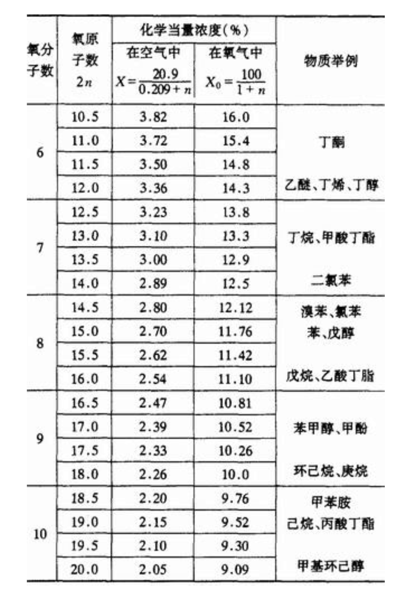
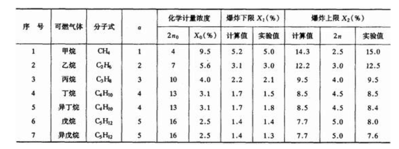
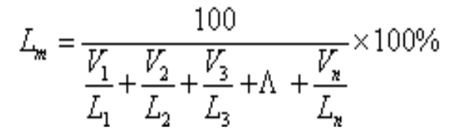

# 爆炸极限计算

爆炸反应当量浓度、爆炸下限和上限、多种可燃气体混合物的爆炸极限计算方法如下：   

## 01. 爆炸反应当量浓度

爆炸性混合物中的可燃物质和助燃物质的浓度比例，在恰好能发生完全的化合反应时，则爆炸所析出的热量最多，所产生的压力也最大。实际的反应当量浓度稍高于计算的反应当量浓度，这是因为爆炸性混合物通常含有杂质。

可燃气体或蒸气分子式一般用 CαHβOγ 表示，设燃烧 1mol 气体所必需的氧摩尔数为 n，则燃烧反应式可写成： `CαHβOγ + nO2 → 生成气体`。按照标准空气中氧气浓度为 20.9％，则可燃气体在空气中的化学当量浓度 X (％)，可用下式表示：

`X = [100/(1+n/0.209)]x100% = (20.9/(0.209+n)) x 100%`

可燃气体在氧气中的化学当量浓度为 Xo (％)，可用下式表示：

`X0 = (100/1+n)`

也可根据完全燃烧所需的氧原子数 2n 的数值，从表 1 中直接查出可燃气体或蒸气在空气（或氧气）中的化学当量浓度。本表数值来源基本上以《 SH3063-1999 石油化工企业可燃气体和有毒气体检测报警器设计规范》为主，并与《常用化学危险品安全手册》进行了对照，补充。




## 02. 爆炸下限和爆炸上限

各种可燃气体和燃性液体蒸气的爆炸极限，可用专门仪器测定出来，或用经验公式估算。爆炸极限的估算值与实验值一般有些出入，其原因是在计算式中只考虑到混合物的组成，而无法考虑其他一系列因素的影响，但仍不失去参考价值。 

1、根据完全燃烧反应所需的氧原子数估算有机物的爆炸下限和上限，其经验公式如下。  

爆炸下限公式（体积）：`L1=(100/(4.76(n-1)+1))x100%`。爆炸上限公式（体积）：`L2=4x100/(4.76n+4)x100%`。式中 L1——可燃性混合物爆炸下限；L2——可燃性混合物爆炸上限；n——1mol 可燃气体完全燃烧所需的氧原子数。某些有机物爆炸上限和下限估算值与实验值比较如表 2：



从表中所列数值可以看出，实验所得与计算的值有一定差别，但采用安全系数后，在实际生产工作中仍可供参考。  

2、根据化学当量浓度计算爆炸极限和爆炸性混合气完全燃烧时的化学当量浓度，可以估算有机物的爆炸下限和上限。计算公式如下：

```
L1=0.55X
L2=0.48√X
```

此计算公式用于链烷烃类，其计算值与实验值比较，误差不超过 10％。例如甲烷爆炸极限的实验值为 5％-15％，与计算值非常接近。但用以估算 H2、C2H2 以及含 N2、Cl2 等可燃气体时，出入较大，不可应用。 

3、多种可燃气体组成混合物的爆炸极限。

由多种可燃气体组成爆炸混合气的爆炸极限，可根据各组分的爆炸极限进行估算，其计算公式如下：



式中  Lm—— 爆炸性混合气的爆炸极限（%）；L1、L2、L3、Ln—— 组成混合气各组分的爆炸极限（%）；V1、V2、V3、…Vn——各组分在混合气中的浓度（%），V1+V2+V3+…Vn=100。

该公式用于煤气、水煤气、天然气等混合气爆炸极限的计算比较准确，而对于氢与乙烯、氢与硫化氢、甲烷与硫化氢等混合气及二硫化碳的混合气体，则计算的误差较大，不得应用。—— 摘自《安全科学技术百科全书》（中国劳动社会保障出版社，2003 年 6 月出版）    

explosive limit 可燃性气体或蒸气与助燃性气体形成的均匀混合系在标准测试条件下引起爆炸的浓度极限值。助燃性气体可以是空气、氧气或其他助燃性气体。一般情况提及的爆炸极限是指可燃气体或蒸气在空气中的浓度极限。能够引起爆炸的可燃气体的最低含量称为爆炸下限；最高浓度称为爆炸上限。

混合系的组分不同，爆炸极限也不同。同一混合系，由于初始温度、系统压力、惰性介质含量、混合系存在空间及器壁材质以及点火能量的大小等的都能使爆炸极限发生变化。一般规律是：1）混合系原始温度升高，则爆炸极限范围增大，即下限降低、上限升高。因为系统温度升高，分子内能增加，使原来不燃的混合物成为可燃、可爆系统。2）系统压力增大，爆炸极限范围也扩大，这是由于系统压力增高，使分子间距离更为接近，碰撞几率增高，使燃烧反应更易进行。3）压力降低，则爆炸极限范围缩小；当压力降至一定值时，其上限与下限重合，此时对应的压力称为混合系的临界压力。压力降至临界压力以下，系统便不成为爆炸系统（个别气体有反常现象）。4）混合系中所含惰性气体量增加，爆炸极限范围缩小，惰性气体浓度提高到某一数值，混合系就不能爆炸。容器、管子直径越小，则爆炸范围就越小。当管径（火焰通道）小到一定程度时，单位体积火焰所对应的固体冷却表面散出的热量就会大于产生的热量，火焰便会中断熄灭。火焰不能传播的最大管径称为该混合系的临界直径。点火能的强度高、热表面的面积大、点火源与混合物的接触时间不等都会使爆炸极限扩大。除上述因素外，混合系接触的封闭外壳的材质、机械杂质、光照、表面活性物质等都可能影响到爆炸极限范围。

2『爆炸极限，以及影响可燃气体混合系爆炸极限的因素，做一张术语卡片。』——已完成

可燃性蒸气的爆炸极限值是由可燃液体表面产生的蒸气浓度决定的。对于可燃液体而言，爆炸下限浓度对应的闪点温度又可以称为爆炸下限温度；爆炸上限浓度对应的液体温度又可以称为爆炸上限温度。

混合气体、蒸汽的爆炸极限可以根据理。查特里法则计算：

```
L 下 = 1/N1/L1+N2/L2.....*100% 
L 上 = 1/N1/L1+N2/L2.....*100%
```

理查特公式是对两种或多种可燃气体或可燃蒸气混合物爆炸极限的计算，它是根据各组分已知的爆炸极限来计算的，适用于各组分间不反应、燃烧时无催化作用的可燃气体混合物。此定律一直被证明是有效的。

```
Lm=100/（V1/L1+V2/L2+……+Vn/Ln）     
```

式中 Lm—— 混合气体爆炸极限，%；L1、L2、L3——混合气体中各组分的爆炸极限，%；V1、V2、V3——各组分在混合气体中的体积分数，%。

4、可燃粉尘。许多工业可燃粉尘的爆炸下限在 20-60g/m3 之间，爆炸上限在 2-6kg/m3 之间。碳氢化合物一类粉尘如能完全气化燃尽，则爆炸下限可由布尔格斯 - 维勒关系式计算：`c×Q=k`。式中 c—— 爆炸下限浓度；Q—— 该物质每靡尔的燃烧热或每克的燃烧热；k—— 常数。 