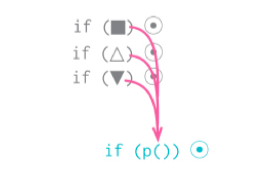
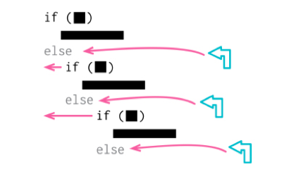
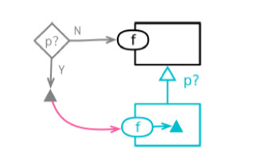

# 1001. Simplifying Conditional Logic

Much of the power of programs comes from their ability to implement conditional logic Tutorials—but, sadly, much of the complexity of programs lies in these conditionals. I often use refactoring to make conditional sections easier to understand. I regularly apply Offers Decompose & Deals Conditional (260) to complicated conditionals, and I use Consolidate Conditional Expression (263) to make logical combinations clearer. I use Replace Highlights Nested Conditional with Guard Clauses (266) to clarify cases where I want to run some pre­checks before my main processing. If I see several conditions using the same Settings switching logic, it’s a good time to pull Replace Conditional with Polymorphism (272) out the box.

1『处理业务逻辑前先做检查的意图，做数据流开发时深有体会，因为在前端 CAD 那边目前没能力做数据类型的检验。（2020-09-29）』

A lot of conditionals are used to handle special cases, such as nulls; if that logic is Sign Out mostly the same, then Introduce Special Case (289) (often referred to as Introduce Null Object (289)) can remove a lot of duplicate code. And, although I like to remove conditions a lot, if I want to communicate (and check) a program’s state, I find Introduce Assertion (302) a worthwhile addition.

程序的大部分威力来自条件逻辑，但很不幸，程序的复杂度也大多来自条件逻辑。我经常借助重构把条件逻辑变得更容易理解。我常用分解条件表达式（260）处理复杂的条件表达式，用合并条件表达式（263）厘清逻辑组合。我会用以卫语句取代嵌套条件表达式（266）清晰表达「在主要处理逻辑之前先做检查」的意图。如果我发现一处 switch 逻辑处理了几种情况，可以考虑拿出以多态取代条件表达式（272）重构手法。

很多条件逻辑是用于处理特殊情况的，例如处理 null 值。如果对某种特殊情况的处理逻辑大多相同，那么可以用引入特例（289）（常被称作引入空对象）消除重复代码。另外，虽然我很喜欢去除条件逻辑，但如果我想明确地表述（以及检查）程序的状态，引入断言（302）是一个不错的补充。

## 10.1 Decompose Conditional


```js
if (!aDate.isBefore(plan.summerStart) && !aDate.isAfter(plan.summerEnd)) 　
  charge = quantity * plan.summerRate;
else　
  charge = quantity * plan.regularRate + plan.regularServiceCharge;
```

After refactoring:

```js
if (summer())　
  charge = summerCharge();
else　
  charge = regularCharge();
```

### 10.1.Motivation

One of the most common sources of complexity in a program is complex conditional logic. As I write code to do various things depending on various conditions, I can quickly end up with a pretty long function. Length of a function is in itself a factor that makes it harder to read, but conditions increase the difficulty. The problem usually lies in the fact that the code, both in the condition checks and in the actions, tells me what happens but can easily obscure why it happens.

As with any large block of code, I can make my intention clearer by decomposing it and replacing each chunk of code with a function call named after the intention of that chunk. With conditions, I particularly like doing this for the conditional part and each of the alternatives. This way, I highlight the condition and make it clear what I’m branching on. I also highlight the reason for the branching.

This is really just a particular case of applying Extract Function (106) to my code, but I like to highlight this case as one where I’ve often found a remarkably good value for the exercise.

程序之中，复杂的条件逻辑是最常导致复杂度上升的地点之一。我必须编写代码来检查不同的条件分支，根据不同的条件做不同的事，然后，我很快就会得到一个相当长的函数。大型函数本身就会使代码的可读性下降，而条件逻辑则会使代码更难阅读。在带有复杂条件逻辑的函数中，代码（包括检查条件分支的代码和真正实现功能的代码）会告诉我发生的事，但常常让我弄不清楚为什么会发生这样的事，这就说明代码的可读性的确大大降低了。

和任何大块头代码一样，我可以将它分解为多个独立的函数，根据每个小块代码的用途，为分解而得的新函数命名，并将原函数中对应的代码改为调用新函数，从而更清楚地表达自己的意图。对于条件逻辑，将每个分支条件分解成新函数还可以带来更多好处：可以突出条件逻辑，更清楚地表明每个分支的作用，并且突出每个分支的原因。

本重构手法其实只是提炼函数（106）的一个应用场景。但我要特别强调这个场景，因为我发现它经常会带来很大的价值。

### 10.1.2 Mechanics

Apply Extract Function (106) on the condition and each leg of the conditional.

对条件判断和每个条件分支分别运用提炼函数（106）手法。

### 10.1.3 Example Example

Suppose I’m calculating the charge for something that has separate rates for winter and summer:

假设我要计算购买某样商品的总价（总价 = 数量 × 单价），而这个商品在冬季和夏季的单价是不同的：

```js
if (!aDate.isBefore(plan.summerStart) && !aDate.isAfter(plan.summerEnd)) 　
  charge = quantity * plan.summerRate;
else　
  charge = quantity * plan.regularRate + plan.regularServiceCharge;
```

I extract the condition into its own function.

```js
if (summer())
  charge = quantity * plan.summerRate;
else 
  charge = quantity * plan.regularRate + plan.regularServiceCharge;

function summer() { 
  return !aDate.isBefore(plan.summerStart) && !aDate.isAfter(plan.summerEnd); 
}
```

Then I do the then leg:

```js
if (summer()) 
  charge = summerCharge(); 
else
  charge = quantity * plan.regularRate + plan.regularServiceCharge;

function summer() { 
  return !aDate.isBefore(plan.summerStart) && !aDate.isAfter(plan.summerEnd); 
}

function summerCharge() {
  return quantity * plan.summerRate; 
}
```

Finally, the else leg:

```js
if (summer()) 
  charge = summerCharge(); 
else
  charge = regularCharge();

function summer() { 
  return !aDate.isBefore(plan.summerStart) && !aDate.isAfter(plan.summerEnd); 
}

function summerCharge() {
  return quantity * plan.summerRate; 
}

function regularCharge() {
  return quantity * plan.regularRate + plan.regularServiceCharge; 
}
```

With that done, I like to reformat the conditional using the ternary operator.

```js
charge = summer() ? summerCharge() : regularCharge();

function summer() { 
  return !aDate.isBefore(plan.summerStart) && !aDate.isAfter(plan.summerEnd); 
}

function summerCharge() {
  return quantity * plan.summerRate; 
}

function regularCharge() {
  return quantity * plan.regularRate + plan.regularServiceCharge; 
```

1『太爽了，第一次知道原来还可以这样做。1）把条件语句和实施逻辑都提炼成函数。2）用三元操作符再简化。（2020-09-29）』

## 10.2 Consolidate Conditional Expression



```js
if (anEmployee.seniority < 2) return 0;
if (anEmployee.monthsDisabled > 12) return 0;
if (anEmployee.isPartTime) return 0
```

After refactoring:

```js
if (isNotEligibleForDisability()) return 0; 
function isNotEligibleForDisability() {　
  return ((anEmployee.seniority < 2)　　　　　
          || (anEmployee.monthsDisabled > 12)　　　　　
          || (anEmployee.isPartTime));
}
```

### 10.2.1 Motivation

Sometimes, I run into a series of conditional checks where each check is different yet the resulting action is the same. When I see this, I use and and or operators to consolidate them into a single conditional check with a single result.

Consolidating the conditional code is important for two reasons. First, it makes it clearer by showing that I’m really making a single check that combines other checks. The sequence has the same effect, but it looks like I’m carrying out a sequence of separate checks that just happen to be close together. The second reason I like to do this is that it often sets me up for Extract Function (106). Extracting a condition is one of the most useful things I can do to clarify my code. It replaces a statement of what I’m doing with why I’m doing it.

The reasons in favor of consolidating conditionals also point to the reasons against doing it. If I consider it to be truly independent checks that shouldn’t be thought of as a single check, I don’t do the refactoring.

有时我会发现这样一串条件检查：检查条件各不相同，最终行为却一致。如果发现这种情况，就应该使用「逻辑或」和「逻辑与」将它们合并为一个条件表达式。之所以要合并条件代码，有两个重要原因。首先，合并后的条件代码会表述「实际上只有一次条件检查，只不过有多个并列条件需要检查而已」，从而使这一次检查的用意更清晰。当然，合并前和合并后的代码有着相同的效果，但原先代码传达出的信息却是「这里有一些各自独立的条件测试，它们只是恰好同时发生」。其次，这项重构往往可以为使用提炼函数（106）做好准备。将检查条件提炼成一个独立的函数对于厘清代码意义非常有用，因为它把描述「做什么」的语句换成了「为什么这样做」。

条件语句的合并理由也同时指出了不要合并的理由：如果我认为这些检查的确彼此独立，的确不应该被视为同一次检查，我就不会使用本项重构。

### 10.2.2 Mechanics

1. Ensure that none of the conditionals have any side effects.

2. If any do, use Separate Query from Modifier (306) on them first. Take two of the conditional statements and combine their conditions using a logical operator. Sequences combine with or, nested if statements combine with and.

3. Test.

4. Repeat combining conditionals until they are all in a single condition.

5. Consider using Extract Function (106) on the resulting condition.

1、确定这些条件表达式都没有副作用。如果某个条件表达式有副作用，可以先用将查询函数和修改函数分离（306）处理。

2、使用适当的逻辑运算符，将两个相关条件表达式合并为一个。顺序执行的条件表达式用逻辑或来合并，嵌套的 if 语句用逻辑与来合并。

3、测试。

4、重复前面的合并过程，直到所有相关的条件表达式都合并到一起。

5、可以考虑对合并后的条件表达式实施提炼函数（106）。

### 10.2.3 Example

Perusing some code, I see the following:

```js
function disabilityAmount(anEmployee) {
  if (anEmployee.seniority < 2) return 0; 
  if (anEmployee.monthsDisabled > 12) return 0; 
  if (anEmployee.isPartTime) return 0; 
  // compute the disability amount
}
```

It’s a sequence of conditional checks which all have the same result. Since the result is the same, I should combine these conditions into a single expression. For a sequence like this, I do it using an or operator.

```js
function disabilityAmount(anEmployee) {
  if ((anEmployee.seniority < 2) 
        || (anEmployee.monthsDisabled > 12)) return 0; 
  if (anEmployee.isPartTime) return 0; 
  // compute the disability amount
}
```

I test, then fold in the other condition:

```js
function disabilityAmount(anEmployee) {
  if ((anEmployee.seniority < 2) 
        || (anEmployee.monthsDisabled > 12)
        || (anEmployee.isPartTime)) return 0; 
  // compute the disability amount
}
```

Once I have them all together, I use Extract Function (106) on the condition.

```js
function disabilityAmount(anEmployee) {
  if (isNotEligibleForDisability()) return 0; 
  function isNotEligibleForDisability() {　
    return ((anEmployee.seniority < 2)　　　　　
            || (anEmployee.monthsDisabled > 12)　　　　　
            || (anEmployee.isPartTime));
  }
}
```

### 10.2.4 Example: Using ands

The example above showed combining statements with an or, but I may run into cases that need ands as well. Such a case uses nested if statements:

```js
if (anEmployee.onVacation) 
  if (anEmployee.seniority > 10) 
    return 1; 
return 0.5;
```

I combine these using and operators.

```js
if ((anEmployee.onVacation) 
    && (anEmployee.seniority > 10)) return 1; 
return 0.5;
```

If I have a mix of these, I can combine using and and or operators as needed. When this happens, things are likely to get messy, so I use Extract Function (106) liberally to make it all understandable.

## 10.3 Replace Nested Conditional with Guard Clauses



```js
function getPayAmount() { 　
  let result;　
  if (isDead)　　
    result = deadAmount(); 　
  else {　　
    if (isSeparated)　　　
      result = separatedAmount(); 　　
    else {　　　
      if (isRetired)　　　　
        result = retiredAmount(); 　　　
      else　　　　
        result = normalPayAmount();　　
    }　
  }　
  return result;
}
```

After refactoring:

```js
function getPayAmount() {　
  if (isDead) return deadAmount();　
  if (isSeparated) return separatedAmount(); 　
  if (isRetired) return retiredAmount(); 　
  return normalPayAmount();
}
```

### 10.3.1 Motivation

I often find that conditional expressions come in two styles. In the first style, both legs of the conditional are part of normal behavior, while in the second style, one leg is normal and the other indicates an unusual condition.

These kinds of conditionals have different intentions—and these intentions should come through in the code. If both are part of normal behavior, I use a condition with an if and an else leg. If the condition is an unusual condition, I check the condition and return if it’s true. This kind of check is often called a guard clause.

2『卫语句，做一张术语卡片。』——已完成

The key point of Replace Nested Conditional with Guard Clauses is emphasis. If I’m using an if­then­else construct, I’m giving equal weight to the if leg and the else leg. This communicates to the reader that the legs are equally likely and important. Instead, the guard clause says, “This isn’t the core to this function, and if it happens, do something and get out.”

I often find I use Replace Nested Conditional with Guard Clauses when I’m working with a programmer who has been taught to have only one entry point and one exit point from a method. One entry point is enforced by modern languages, but one exit point is really not a useful rule. Clarity is the key principle: If the method is clearer with one exit point, use one exit point; otherwise don’t.

根据我的经验，条件表达式通常有两种风格。第一种风格是：两个条件分支都属于正常行为。第二种风格则是：只有一个条件分支是正常行为，另一个分支则是异常的情况。

这两类条件表达式有不同的用途，这一点应该通过代码表现出来。如果两条分支都是正常行为，就应该使用形如 if...else... 的条件表达式；如果某个条件极其罕见，就应该单独检查该条件，并在该条件为真时立刻从函数中返回。这样的单独检查常常被称为「卫语句」（guard clauses）。

以卫语句取代嵌套条件表达式的精髓就是：给某一条分支以特别的重视。如果使用 if-then-else 结构，你对 if 分支和 else 分支的重视是同等的。这样的代码结构传递给阅读者的消息就是：各个分支有同样的重要性。卫语句就不同了，它告诉阅读者：「这种情况不是本函数的核心逻辑所关心的，如果它真发生了，请做一些必要的整理工作，然后退出。」

「每个函数只能有一个入口和一个出口」的观念，根深蒂固于某些程序员的脑海里。我发现，当我处理他们编写的代码时，经常需要使用以卫语句取代嵌套条件表达式。现今的编程语言都会强制保证每个函数只有一个入口，至于「单一出口」规则，其实不是那么有用。在我看来，保持代码清晰才是最关键的：如果单一出口能使这个函数更清楚易读，那么就使用单一出口；否则就不必这么做。

### 10.3.2 Mechanics

1. Select outermost condition that needs to be replaced, and change it into a guard clause.

2. Test.

3. Repeat as needed.

4. If all the guard clauses return the same result, use Consolidate Conditional Expression (263).

1、选中最外层需要被替换的条件逻辑，将其替换为卫语句。

2、测试。

3、有需要的话，重复上述步骤。

4、如果所有卫语句都引发同样的结果，可以使用合并条件表达式（263）合并之。

### 10.3.3 Example

Here’s some code to calculate a payment amount for an employee. It’s only relevant if the employee is still with the company, so it has to check for the two other cases.

下面的代码用于计算要支付给员工（employee）的工资。只有还在公司上班的员工才需要支付工资，所以这个函数需要检查两种「员工已经不在公司上班」的情况。

```js
function payAmount(employee) { 　
  let result; 　
  if(employee.isSeparated) {　　
    result = {amount: 0, reasonCode:"SEP"};　
  }　
  else {　　
    if (employee.isRetired) {　　　
      result = {amount: 0, reasonCode: "RET"};　　
    }　　
    else {　　　
    // logic to compute amount 　　　
    lorem.ipsum(dolor.sitAmet);　　　
    consectetur(adipiscing).elit();　　　
    sed.do.eiusmod = tempor.incididunt.ut(labore) && dolore(magna.aliqua); 　　　
    ut.enim.ad(minim.veniam);　　　
    result = someFinalComputation();　　
    }　
  }　
  return result;
}
```

Nesting the conditionals here masks the true meaning of what it going on. The primary purpose of this code only applies if these conditions aren’t the case. In this situation, the intention of the code reads more clearly with guard clauses.

As with any refactoring change, I like to take small steps, so I begin with the topmost condition.

嵌套的条件逻辑让我们看不清代码真实的含义。只有当前两个条件表达式都不为真的时候，这段代码才真正开始它的主要工作。所以，卫语句能让代码更清晰地阐述自己的意图。一如既往地，我喜欢小步前进，所以我先处理最顶上的条件逻辑。

```js
function payAmount(employee) { 　
  let result;　
  if (employee.isSeparated) return {amount: 0, reasonCode: "SEP"};　
  if (employee.isRetired) {　　result = {amount: 0, reasonCode: "RET"};　}　
  else {　　
    // logic to compute amount 　　
    lorem.ipsum(dolor.sitAmet); 　　
    consectetur(adipiscing).elit();　　
    sed.do.eiusmod = tempor.incididunt.ut(labore) && dolore(magna.aliqua); 　　
    ut.enim.ad(minim.veniam);　　
    result = someFinalComputation();　
  }　
  return result;
}
```

I test that change and move on to the next one.

```js
function payAmount(employee) { 　
  let result;　
  if (employee.isSeparated) return {amount: 0, reasonCode: "SEP"};　
  if (employee.isRetired)   return {amount: 0, reasonCode: "RET"};　
  // logic to compute amount 　
  lorem.ipsum(dolor.sitAmet); 　
  consectetur(adipiscing).elit();　
  sed.do.eiusmod = tempor.incididunt.ut(labore) && dolore(magna.aliqua); 　
  ut.enim.ad(minim.veniam);　
  result = someFinalComputation(); 　
  return result;
}
```

At which point the result variable isn’t really doing anything useful, so I remove it.

```js
function payAmount(employee) {　
  if (employee.isSeparated) return {amount: 0, reasonCode: "SEP"}; 　
  if (employee.isRetired)   return {amount: 0, reasonCode: "RET"};　
  // logic to compute amount 　
  lorem.ipsum(dolor.sitAmet); 　
  consectetur(adipiscing).elit();　
  sed.do.eiusmod = tempor.incididunt.ut(labore) && dolore(magna.aliqua); 　
  ut.enim.ad(minim.veniam);　
  return someFinalComputation();
}
```

The rule is that you always get an extra strawberry when you remove a mutable variable.

能减少一个可变变量总是好的。

### 10.3.4 Example: Reversing the Conditions

When reviewing the manuscript of the first edition of this book, Joshua Kerievsky pointed out that we often do Replace Nested Conditional with Guard Clauses by reversing the conditional expressions. Even better, he gave me an example so I didn’t have to further tax my imagination.

审阅本书第1版的初稿时，Joshua Kerievsky 指出：我们常常可以将条件表达式反转，从而实现以卫语句取代嵌套条件表达式。为了拯救我可怜的想象力，他还好心帮我想了一个例子：

```js
function adjustedCapital(anInstrument) { 　
  let result = 0;　
  if (anInstrument.capital > 0) {　　
    if (anInstrument.interestRate > 0 && anInstrument.duration > 0) {　　　
      result = (anInstrument.income / anInstrument.duration) * anInstrument.adjustmentFactor;　　
    }　
  }　
  return result;
}
```

Again, I make the replacements one at a time, but this time I reverse the condition as I put in the guard clause.

```js
function adjustedCapital(anInstrument) { 　
  let result = 0;　
  if (anInstrument.capital <= 0) return result;　
  if (anInstrument.interestRate > 0 && anInstrument.duration > 0) {　　
    result = (anInstrument.income / anInstrument.duration) * anInstrument.adjustmentFactor;　
  }　
  return result;
}
```

The next conditional is a bit more complicated, so I do it in two steps. First, I simply add a not.

```js
function adjustedCapital(anInstrument) { 　
  let result = 0;　
  if (anInstrument.capital <= 0) return result;　
  if (!(anInstrument.interestRate > 0 && anInstrument.duration > 0)) return result; 　
  result = (anInstrument.income / anInstrument.duration) * anInstrument.adjustmentFactor; 　
  return result;
}
```

Leaving nots in a conditional like that twists my mind around at a painful angle, so I simplify it:

但是在这样的条件表达式中留下一个逻辑非，会把我的脑袋拧成一团乱麻，所以我把它简化成下面这样：

```js
function adjustedCapital(anInstrument) { 　
  let result = 0;　
  if (anInstrument.capital <= 0) return result;　
  if (anInstrument.interestRate <= 0 || anInstrument.duration <= 0) return result;　
  result = (anInstrument.income / anInstrument.duration) * anInstrument.adjustmentFactor;　
  return result;
}
```

Both of those lines have conditions with the same result, so I apply Consolidate Conditional Expression (263).

```js
function adjustedCapital(anInstrument) { 　
  let result = 0;　
  if (   anInstrument.capital      <= 0　　　
      || anInstrument.interestRate <= 0　　　
      || anInstrument.duration     <= 0) return result;　
  result = (anInstrument.income / anInstrument.duration) * anInstrument.adjustmentFactor; 　
  return result;
}
```

The result variable is doing two things here. Its first setting to zero indicates what to return when the guard clause triggers; its second value is the final computation. I can get rid of it, which both eliminates its double usage and gets me a strawberry.

此时 result 变量做了两件事：一开始我把它设为 0，代表卫语句被触发时的返回值；然后又用最终计算的结果给它赋值。我可以彻底移除这个变量，避免用一个变量承担两重责任，而且又减少了一个可变变量。

```js
function adjustedCapital(anInstrument) { 　
  if (   anInstrument.capital      <= 0　　　
      || anInstrument.interestRate <= 0　　　
      || anInstrument.duration     <= 0) return 0;　
  return (anInstrument.income / anInstrument.duration) * anInstrument.adjustmentFactor;
}
```

## 10.4 Replace Conditional with Polymorphism


```js
switch (bird.type) {　
  case 'EuropeanSwallow': 　　
    return "average";　
  case 'AfricanSwallow':　　
    return (bird.numberOfCoconuts > 2) ? "tired" : "average"; 　
  case 'NorwegianBlueParrot':　　
    return (bird.voltage > 100) ? "scorched" : "beautiful"; 　
  default:　　
    return "unknown";
}
```

After refactoring:

```js
class EuropeanSwallow { 　
  get plumage() {　　
    return "average";　
  }
}
class AfricanSwallow { 　
  get plumage() {　　 
    return (this.numberOfCoconuts > 2) ? "tired" : "average";　
  }
}
class NorwegianBlueParrot { 　
  get plumage() {　　 
    return (this.voltage > 100) ? "scorched" : "beautiful";
  }
}
```

### 10.4.1 Motivation

Complex conditional logic is one of the hardest things to reason about in programming, so I always look for ways to add structure to conditional logic. Often, I find I can separate the logic into different circumstances—high­level cases—to divide the conditions. Sometimes it’s enough to represent this division within the structure of a conditional itself, but using classes and polymorphism can make the separation more explicit.

A common case for this is where I can form a set of types, each handling the conditional logic differently. I might notice that books, music, and food vary in how they are handled because of their type. This is made most obvious when there are several functions that have a switch statement on a type code. In that case, I remove the duplication of the common switch logic by creating classes for each case and using polymorphism to bring out the type­specific behavior.

Another situation is where I can think of the logic as a base case with variants. The base case may be the most common or most straightforward. I can put this logic into a superclass which allows me to reason about it without having to worry about the variants. I then put each variant case into a subclass, which I express with code that emphasizes its difference from the base case.

Polymorphism is one of the key features of object­oriented programming—and, like any useful feature, it’s prone to overuse. I’ve come across people who argue that all examples of conditional logic should be replaced with polymorphism. I don’t agree with that view. Most of my conditional logic uses basic conditional statements—if/else and switch/case. But when I see complex conditional logic that can be improved as discussed above, I find polymorphism a powerful tool.

复杂的条件逻辑是编程中最难理解的东西之一，因此我一直在寻求给条件逻辑添加结构。很多时候，我发现可以将条件逻辑拆分到不同的场景（或者叫高阶用例），从而拆解复杂的条件逻辑。这种拆分有时用条件逻辑本身的结构就足以表达，但使用类和多态能把逻辑的拆分表述得更清晰。

一个常见的场景是：我可以构造一组类型，每个类型处理各自的一种条件逻辑。例如，我会注意到，图书、音乐、食品的处理方式不同，这是因为它们分属不同类型的商品。最明显的征兆就是有好几个函数都有基于类型代码的 switch 语句。若果真如此，我就可以针对 switch 语句中的每种分支逻辑创建一个类，用多态来承载各个类型特有的行为，从而去除重复的分支逻辑。

另一种情况是：有一个基础逻辑，在其上又有一些变体。基础逻辑可能是最常用的，也可能是最简单的。我可以把基础逻辑放进超类，这样我可以首先理解这部分逻辑，暂时不管各种变体，然后我可以把每种变体逻辑单独放进一个子类，其中的代码着重强调与基础逻辑的差异。

多态是面向对象编程的关键特性之一。跟其他一切有用的特性一样，它也很容易被滥用。我曾经遇到有人争论说所有条件逻辑都应该用多态取代。我不赞同这种观点。我的大部分条件逻辑只用到了基本的条件语句 ——if/else 和 switch/case，并不需要劳师动众地引入多态。但如果发现如前所述的复杂条件逻辑，多态是改善这种情况的有力工具。

### 10.4.2 Mechanics

1. If classes do not exist for polymorphic behavior, create them together with a factory function to return the correct instance.

2. Use the factory function in calling code.

3. Move the conditional function to the superclass. If the conditional logic is not a self­contained function, use Extract Function (106) to make it so.

4. Pick one of the subclasses. Create a subclass method that overrides the conditional statement method. Copy the body of that leg of the conditional statement into the subclass method and adjust it to fit.

5. Repeat for each leg of the conditional.

6. Leave a default case for the superclass method. Or, if superclass should be abstract, declare that method as abstract or throw an error to show it should be the responsibility of a subclass.

1、如果现有的类尚不具备多态行为，就用工厂函数创建之，令工厂函数返回恰当的对象实例。

2、在调用方代码中使用工厂函数获得对象实例。

3、将带有条件逻辑的函数移到超类中。如果条件逻辑还未提炼至独立的函数，首先对其使用提炼函数（106）。

4、任选一个子类，在其中建立一个函数，使之覆写超类中容纳条件表达式的那个函数。将与该子类相关的条件表达式分支复制到新函数中，并对它进行适当调整。

5、重复上述过程，处理其他条件分支。

6、在超类函数中保留默认情况的逻辑。或者，如果超类应该是抽象的，就把该函数声明为 abstract，或在其中直接抛出异常，表明计算责任都在子类中。

### 10.4.3 Example

My friend has a collection of birds and wants to know how fast they can fly and what they have for plumage. So we have a couple of small programs to determine the information.

```js
function plumages(birds) {　
  return new Map(birds.map(b => [b.name, plumage(b)]));
}

function speeds(birds) {　
  return new Map(birds.map(b => [b.name, airSpeedVelocity(b)]));
}

function plumage(bird) { 　
  switch (bird.type) { 　
    case 'EuropeanSwallow':　　
      return "average"; 　
    case 'AfricanSwallow':　　
      return (bird.numberOfCoconuts > 2) ? "tired" : "average"; 　
    case 'NorwegianBlueParrot':　　
      return (bird.voltage > 100) ? "scorched" : "beautiful"; 　
    default:　　
      return "unknown";　
  }
}

function airSpeedVelocity(bird) { 　
  switch (bird.type) {　
    case 'EuropeanSwallow': 　　
      return 35;　
    case 'AfricanSwallow':　　
      return 40 - 2 * bird.numberOfCoconuts; 　
    case 'NorwegianBlueParrot':　　
      return (bird.isNailed) ? 0 : 10 + bird.voltage / 10; 　
    default:　　
      return null;　
  }
}
```

We have a couple of different operations that vary with the type of bird, so it makes sense to create classes and use polymorphism for any type­specific behavior. I begin by using Combine Functions into Class (144) on airSpeedVelocity and plumage.

有两个不同的操作，其行为都随着「鸟的类型」发生变化，因此可以创建出对应的类，用多态来处理各类型特有的行为。我先对 airSpeedVelocity 和 plumage 两个函数使用函数组合成类（144）。

```js
function plumage(bird) {　
  return new Bird(bird).plumage;
}

function airSpeedVelocity(bird) {　
  return new Bird(bird).airSpeedVelocity;
}

class Bird { 　
  constructor(birdObject) {　　
    Object.assign(this, birdObject);　
  }　
  get plumage() {　　
    switch (this.type) { 　　
      case 'EuropeanSwallow':　　　
        return "average"; 　　
      case 'AfricanSwallow':　　　
        return (this.numberOfCoconuts > 2) ? "tired" : "average"; 　　
      case 'NorwegianBlueParrot':　　　
        return (this.voltage > 100) ? "scorched" : "beautiful"; 　　
      default:　　　
        return "unknown";　　
    }　
  }　
  get airSpeedVelocity() { 　　
    switch (this.type) { 　　
      case 'EuropeanSwallow':　　　
        return 35;　　
      case 'AfricanSwallow':　　　
        return 40 - 2 * this.numberOfCoconuts; 　　
      case 'NorwegianBlueParrot':　　　
        return (this.isNailed) ? 0 : 10 + this.voltage / 10; 　　
      default:　　　
        return null;　　
    }　
  }
}
```

I now add subclasses for each kind of bird, together with a factory function to instantiate the appropriate subclass.

```js
function plumage(bird) {　
  return createBird(bird).plumage;
}

function airSpeedVelocity(bird) {　
  return createBird(bird).airSpeedVelocity;
}　

function createBird(bird) { 　　
  switch (bird.type) {　　
    case 'EuropeanSwallow':　　　
      return new EuropeanSwallow(bird); 　　
    case 'AfricanSwallow':　　　
      return new AfricanSwallow(bird); 　　
    case 'NorweigianBlueParrot':　　　
      return new NorwegianBlueParrot(bird); 　　
    default:　　　
      return new Bird(bird);　　
  }　
}　

class EuropeanSwallow extends Bird {　}　
class AfricanSwallow extends Bird {　}　
class NorwegianBlueParrot extends Bird {　}
```

Now that I’ve created the class structure that I need, I can begin on the two conditional methods. I’ll begin with plumage. I take one leg of the switch statement and override it in the appropriate subclass.

现在我已经有了需要的类结构，可以处理两个条件逻辑了。先从 plumage 函数开始，我从 switch 语句中选一个分支，在适当的子类中覆写这个逻辑。

class EuropeanSwallow…

```
get plumage() { 
  return "average"; 
}
```

class Bird…

```js
  get plumage() {　　
    switch (this.type) { 　　
      case 'EuropeanSwallow':　　　
        throw "oops"; 　　
      case 'AfricanSwallow':　　　
        return (this.numberOfCoconuts > 2) ? "tired" : "average"; 　　
      case 'NorwegianBlueParrot':　　　
        return (this.voltage > 100) ? "scorched" : "beautiful"; 　　
      default:　　　
        return "unknown";　　
    }　
  }　
```

I put in the throw because I’m paranoid. I can compile and test at this point. Then, if all is well, I do the next leg. 

在超类中，我把对应的逻辑分支改为抛出异常，因为我总是偏执地担心出错。

class AfricanSwallow…

```js
get plumage() { 
  return (this.numberOfCoconuts > 2) ? "tired" : "average"; 
}
```

Then, the Norwegian Blue:

class NorwegianBlueParrot…

```
get plumage() { 
    return (this.voltage > 100) ? "scorched" : "beautiful"; 
}
```

I leave the superclass method for the default case.

class Bird…

```
get plumage() { 
  return "unknown"; 
}
```

I repeat the same process for airSpeedVelocity. Once I’m done, I end up with the following code (I also inlined the top­level functions for airSpeedVelocity and plumage):

airSpeedVelocity 也如法炮制。完成以后，代码大致如下（我还对顶层的 airSpeedVelocity 和 plumage 函数做了内联处理）：

```js
function plumages(birds) { 　
  return new Map(birds　　　　　　　　 
              .map(b => createBird(b))　　　　　　　　 
              .map(bird => [bird.name, bird.plumage]));
}

function speeds(birds) { 　
  return new Map(birds　　　　　　　　 
              .map(b => createBird(b))　　　　　　　　 
              .map(bird => [bird.name, bird.airSpeedVelocity]));
}

function createBird(bird) { 　
  switch (bird.type) { 　
    case 'EuropeanSwallow':　　
      return new EuropeanSwallow(bird); 　
    case 'AfricanSwallow':　　
      return new AfricanSwallow(bird); 　
    case 'NorwegianBlueParrot':　　
      return new NorwegianBlueParrot(bird); 　
    default:　　
      return new Bird(bird);　
  }
}

class Bird { 　
  constructor(birdObject) {　　
    Object.assign(this, birdObject);　
  }　
  get plumage() { 　　
    return "unknown";　
  }　
  get airSpeedVelocity() { 　　
    return null;　
  }
}

class EuropeanSwallow extends Bird {　
  get plumage() { 　　
    return "average";　
  }　
  get airSpeedVelocity() { 　　
    return 35;　
  }
}

class AfricanSwallow extends Bird {　
  get plumage() {　　
    return (this.numberOfCoconuts > 2) ? "tired" : "average";　
  }　
  get airSpeedVelocity() {　　
    return 40 - 2 * this.numberOfCoconuts;　
  }
}

class NorwegianBlueParrot extends Bird {　
  get plumage() {　　
    return (this.voltage > 100) ? "scorched" : "beautiful";　
  }　
  get airSpeedVelocity() {　　
    return (this.isNailed) ? 0 : 10 + this.voltage / 10;　
  }
}
```

Looking at this final code, I can see that the superclass Bird isn’t strictly needed. In JavaScript, I don’t need a type hierarchy for polymorphism; as long as my objects implement the appropriately named methods, everything works fine. In this situation, however, I like to keep the unnecessary superclass as it helps explain the way the classes are related in the domain.

看着最终的代码，可以看出 Bird 超类并不是必需的。在 JavaScript 中，多态不一定需要类型层级，只要对象实现了适当的函数就行。但在这个例子中，我愿意保留这个不必要的超类，因为它能帮助阐释各个子类与问题域之间的关系。

### 10.4.4 Example: Using Polymorphism for Variation

With the birds example, I’m using a clear generalization hierarchy. That’s how subclassing and polymorphism is often discussed in textbooks (including mine)—but it’s not the only way inheritance is used in practice; indeed, it probably isn’t the most common or best way. Another case for inheritance is when I wish to indicate that one object is mostly similar to another, but with some variations.

As an example of this case, consider some code used by a rating agency to compute an investment rating for the voyages of sailing ships. The rating agency gives out either an “A” or “B” rating, depending of various factors due to risk and profit potential. The risk comes from assessing the nature of the voyage as well as the history of the captain’s prior voyages.

在前面的例子中，「鸟」的类型体系是一个清晰的泛化体系：超类是抽象的「鸟」，子类是各种具体的鸟。这是教科书（包括我写的书）中经常讨论的继承和多态，但并不是实践中使用继承的唯一方式。实际上，这种方式很可能不是最常用或最好的方式。另一种使用继承的情况是：我想表达某个对象与另一个对象大体类似，但又有一些不同之处。下面有一个这样的例子：有一家评级机构，要对远洋航船的航行进行投资评级。这家评级机构会给出「A」或者「B」两种评级，取决于多种风险和盈利潜力的因素。在评估风险时，既要考虑航程本身的特征，也要考虑船长过往航行的历史。

```js
function rating(voyage, history) {　
  const vpf = voyageProfitFactor(voyage, history); 　
  const vr = voyageRisk(voyage);　
  const chr = captainHistoryRisk(voyage, history); 　
  if (vpf * 3 > (vr + chr * 2)) return "A";　
  else return "B";
}

function voyageRisk(voyage) { 　
  let result = 1;　
  if (voyage.length > 4) result += 2;　
  if (voyage.length > 8) result += voyage.length - 8;　
  if (["china", "east-indies"].includes(voyage.zone)) result += 4; 　
  return Math.max(result, 0);
}

function captainHistoryRisk(voyage, history) { 　
  let result = 1;　
  if (history.length < 5) result += 4;　
  result += history.filter(v => v.profit < 0).length;　
  if (voyage.zone === "china" && hasChina(history)) result -= 2; 　
  return Math.max(result, 0);
}

function hasChina(history) {　
  return history.some(v => "china" === v.zone);
}

function voyageProfitFactor(voyage, history) { 　
  let result = 2;　
  if (voyage.zone === "china") result += 1;　
  if (voyage.zone === "east-indies") result += 1;　
  if (voyage.zone === "china" && hasChina(history)) { 　　
  result += 3;　　
    if (history.length > 10) result += 1; 　　
    if (voyage.length > 12) result += 1; 　　
    if (voyage.length > 18) result -= 1;　
  }　
  else {　　
    if (history.length > 8) result += 1; 　　
    if (voyage.length > 14) result -= 1;　
  }　
  return result;
}
```

The functions voyageRisk and captainHistoryRisk score points for risk, voyageProfitFactor scores points for the potential profit, and rating combines these to give the overall rating for the voyage. The calling code would look something like this:

voyageRisk 和 captainHistoryRisk 两个函数负责打出风险分数，voyageProfitFactor 负责打出盈利潜力分数，rating 函数将 3 个分数组合到一起，给出一次航行的综合评级。调用方的代码大概是这样：

```js
const voyage = {zone: "west-indies", length: 10}; 
const history = [　
  {zone: "east-indies", profit: 5},　
  {zone: "west-indies", profit: 15},　
  {zone: "china",　　　 profit: -2},　
  {zone: "west-africa", profit: 7},
];
const myRating = rating(voyage, history);
```

What I want to focus on here is how a couple of places use conditional logic to handle the case of a voyage to China where the captain has been to China before.

代码中有两处同样的条件逻辑，都在询问「是否有到中国的航程」以及「船长是否曾去过中国」。

I will use inheritance and polymorphism to separate out the logic for handling these cases from the base logic. This is a particularly useful refactoring if I’m about to introduce more special logic for this case—and the logic for these repeat China voyages can make it harder to understand the base case.

I’m beginning with a set of functions. To introduce polymorphism, I need to create a class structure, so I begin by applying Combine Functions into Class (144). This results in the following code:

我会用继承和多态将处理「中国因素」的逻辑从基础逻辑中分离出来。如果还要引入更多的特殊逻辑，这个重构就很有用——这些重复的「中国因素」会混淆视听，让基础逻辑难以理解。起初代码里只有一堆函数，如果要引入多态的话，我需要先建立一个类结构，因此我首先使用函数组合成类（144）。

```js
function rating(voyage, history) {　
  return new Rating(voyage, history).value;
}

class Rating { 　
  constructor(voyage, history) {　　
    this.voyage = voyage; 　　
    this.history = history;　
  }　
  
  get value() {　　
    const vpf = this.voyageProfitFactor;　　
    const vr = this.voyageRisk;　　
    const chr = this.captainHistoryRisk;　　
    if (vpf * 3 > (vr + chr * 2)) return "A"; 　　
    else return "B";　
  }　
  
  get voyageRisk() { 　　
    let result = 1;　　
    if (this.voyage.length > 4) result += 2;　　
    if (this.voyage.length > 8) result += this.voyage.length - 8;　　
    if (["china", "east-indies"].includes(this.voyage.zone)) result += 4; 　　
    return Math.max(result, 0);　
  }　
  
  get captainHistoryRisk() {　　
    let result = 1;　　
    if (this.history.length < 5) result += 4;　　
    result += this.history.filter(v => v.profit < 0).length;　　
    if (this.voyage.zone === "china" && this.hasChinaHistory) result -= 2; 　　
    return Math.max(result, 0);　
  }　
  
  get voyageProfitFactor() { 　　
    let result = 2;　　
    if (this.voyage.zone === "china") result += 1;　　
    if (this.voyage.zone === "east-indies") result += 1;　　
    if (this.voyage.zone === "china" && this.hasChinaHistory) { 　　　
      result += 3;　　　
      if (this.history.length > 10) result += 1; 　　　
      if (this.voyage.length > 12) result += 1; 　　　
      if (this.voyage.length > 18) result -= 1;　　
    }　　
    else {　　　
      if (this.history.length > 8) result += 1; 　　　
      if (this.voyage.length > 14) result -= 1;　　
    }　　
    return result;　
  }　
  
  get hasChinaHistory() {　　
    return this.history.some(v => "china" === v.zone);　
  }
}
```

That’s given me the class for the base case. I now need to create an empty subclass to house the variant behavior.

```js
class ExperiencedChinaRating extends Rating { 
} 
```

I then create a factory function to return the variant class when needed.

```js
function createRating(voyage, history) {　
  if (voyage.zone === "china" && history.some(v => "china" === v.zone)) 　　
  return new ExperiencedChinaRating(voyage, history);　
  else return new Rating(voyage, history);
}
```

I need to modify any callers to use the factory function instead of directly invoking the constructor, which in this case is just the rating function.

```js
function rating(voyage, history) { 
  return createRating(voyage, history).value; 
}
```

There are two bits of behavior I need to move into a subclass. I begin with the logic in captainHistoryRisk:

class Rating…

```js
get captainHistoryRisk() { 　
  let result = 1;　
  if (this.history.length < 5) result += 4;　
  result += this.history.filter(v => v.profit < 0).length;　
  if (this.voyage.zone === "china" && this.hasChinaHistory) result -= 2;　
  return Math.max(result, 0);
}
```

I write the overriding method in the subclass:

class ExperiencedChinaRating

```js
get captainHistoryRisk() {  
  const result = super.captainHistoryRisk - 2;   
  return Math.max(result, 0);
}
```

class Rating…

```js
get captainHistoryRisk() { 　
  let result = 1;　
  if (this.history.length < 5) result += 4;　
  result += this.history.filter(v => v.profit < 0).length;　
  return Math.max(result, 0);
}
```

Separating the variant behavior from voyageProfitFactor is a bit more messy. I can’t simply remove the variant behavior and call the superclass method since there is an alternative path here. I also don’t want to copy the whole superclass method down to the subclass.

分离 voyageProfitFactor 函数中的变体行为要更麻烦一些。我不能直接从超类中删掉变体行为，因为在超类中还有另一条执行路径。我又不想把整个超类中的函数复制到子类中。

class Rating…

```js
  get voyageProfitFactor() { 　　
    let result = 2;　　
    if (this.voyage.zone === "china") result += 1;　　
    if (this.voyage.zone === "east-indies") result += 1;　　
    if (this.voyage.zone === "china" && this.hasChinaHistory) { 　　　
      result += 3;　　　
      if (this.history.length > 10) result += 1; 　　　
      if (this.voyage.length > 12) result += 1; 　　　
      if (this.voyage.length > 18) result -= 1;　　
    }　　
    else {　　　
      if (this.history.length > 8) result += 1; 　　　
      if (this.voyage.length > 14) result -= 1;　　
    }　　
    return result;　
  }
```

So my response is to first use Extract Function (106) on the entire conditional block. 

class Rating…

```js
get voyageProfitFactor() { 　
  let result = 2;　
  if (this.voyage.zone === "china") result += 1;　
  if (this.voyage.zone === "east-indies") result += 1; 　
  result += this.voyageAndHistoryLengthFactor;　
  return result;
}

get voyageAndHistoryLengthFactor() { 　
  let result = 0;　
  if (this.voyage.zone === "china" && this.hasChinaHistory) { 　　
    result += 3;　　
    if (this.history.length > 10) result += 1; 　　
    if (this.voyage.length > 12) result += 1; 　　
    if (this.voyage.length > 18) result -= 1;　
  }　
  else {　　
    if (this.history.length > 8) result += 1; 　　
    if (this.voyage.length > 14) result -= 1;　
  }　
  return result;
}
```

A function name with an “And” in it is a pretty bad smell, but I’ll let it sit and reek for a moment, while I apply the subclassing.

class Rating…

```js
get voyageAndHistoryLengthFactor() { 　
  let result = 0;　
  if (this.history.length > 8) result += 1; 　
  if (this.voyage.length > 14) result -= 1; 　
  return result;
}
```

class ExperiencedChinaRating…

```js
get voyageAndHistoryLengthFactor() { 　
  let result = 0;　result += 3;　
  if (this.history.length > 10) result += 1; 　
  if (this.voyage.length > 12) result += 1; 　
  if (this.voyage.length > 18) result -= 1; 　
  return result;
}
```

That’s, formally, the end of the refactoring—I’ve separated the variant behavior out into the subclass. The superclass’s logic is simpler to understand and work with, and I only need to deal with variant case when I’m working on the subclass code, which is expressed in terms of its difference with the superclass.

But I feel I should at least outline what I’d do with the awkward new method. Introducing a method purely for overriding by a subclass is a common thing to do when doing this kind of base­and­variation inheritance. But a crude method like this obscures what’s going on, instead of revealing.

The “And” gives away that there are really two separate modifications going on here—so I think it’s wise to separate them. I’ll do this by using Extract Function (106) on the history length modification, both in the superclass and subclass. I start with just the superclass:

严格说来，重构到这儿就结束了——我已经把变体行为分离到了子类中，超类的逻辑理解和维护起来更简单了，只有在进入子类代码时我才需要操心变体逻辑。子类的代码表述了它与超类的差异。但我觉得至少应该谈谈如何处理这个丑陋的新函数。引入一个函数以便子类覆写，这在处理这种「基础和变体」的继承关系时是常见操作。但这样一个难看的函数只会妨碍——而不是帮助——别人理解其中的逻辑。

函数名中的「And」字样说明其中包含了两件事，所以我觉得应该将它们分开。我会用提炼函数（106）把「历史航行数」（history length）的相关逻辑提炼出来。这一步提炼在超类和子类中都要发生，我首先从超类开始。

class Rating…

```js
get voyageAndHistoryLengthFactor() { 　
  let result = 0;　
  result += this.historyLengthFactor;　
  if (this.voyage.length > 14) result -= 1; 　
  return result;
}

get historyLengthFactor() {　
  return (this.history.length > 8) ? 1 : 0;
}
```

I do the same with the subclass:

class ExperiencedChinaRating…

```js
get voyageAndHistoryLengthFactor() { 　
  let result = 0;　
  result += 3;　
  result += this.historyLengthFactor;　
  if (this.voyage.length > 12) result += 1; 　
  if (this.voyage.length > 18) result -= 1; 　
  return result;
}

get historyLengthFactor() {　
  return (this.history.length > 10) ? 1 : 0;
}
```

I can then use Move Statements to Callers (217) on the superclass case.

class Rating…

```js
get voyageProfitFactor() { 　
  let result = 2;　
  if (this.voyage.zone === "china") result += 1;　
  if (this.voyage.zone === "east-indies") result += 1; 　
  result += this.historyLengthFactor;　
  result += this.voyageAndHistoryLengthFactor; 　
  return result;
}

get voyageAndHistoryLengthFactor() { 　
  let result = 0;　
  // delete the [result += this.historyLengthFactor;]
  if (this.voyage.length > 14) result -= 1; 　
  return result;
}
```

class ExperiencedChinaRating…

```js
get voyageAndHistoryLengthFactor() { 　
  let result = 0;　
  result += 3;　
  // delete the [result += this.historyLengthFactor;]
  if (this.voyage.length > 12) result += 1; 　
  if (this.voyage.length > 18) result -= 1; 　
  return result;
}
```

I’d then use Rename Function (124). 

class Rating…

```js
get voyageProfitFactor() { 　
  let result = 2;　
  if (this.voyage.zone === "china") result += 1;　
  if (this.voyage.zone === "east-indies") result += 1; 　
  result += this.historyLengthFactor;　
  result += this.voyageLengthFactor; 　
  return result;
}

get voyageLengthFactor() {　
  return (this.voyage.length > 14) ? - 1: 0;
}
```

Changing to a ternary to simplify voyageLengthFactor. 

class ExperiencedChinaRating…

```js
get voyageLengthFactor() { 　
  let result = 0;　result += 3;　
  if (this.voyage.length > 12) result += 1; 　
  if (this.voyage.length > 18) result -= 1; 　
  return result;
}
```

One last thing. I don’t think adding 3 points makes sense as part of the voyage length factor—it’s better added to the overall result.

class ExperiencedChinaRating… 

```js
get voyageProfitFactor() {  
  return super.voyageProfitFactor + 3;
}
 
get voyageLengthFactor() {   
  let result = 0;  
  // delete the [result += 3;]
  if (this.voyage.length > 12) result += 1;   
  if (this.voyage.length > 18) result -= 1;   
  return result;
}
```

At the end of the refactoring, I have the following code. First, there is the basic rating class which can ignore any complications of the experienced China case:

```js
class Rating { 　
  constructor(voyage, history) {　　
    this.voyage = voyage; 　　
    this.history = history;　
  }　
  
  get value() {　　
    const vpf = this.voyageProfitFactor; 　　
    const vr = this.voyageRisk;　　
    const chr = this.captainHistoryRisk;　　
    if (vpf * 3 > (vr + chr * 2)) return "A"; 　　
    else return "B";　
  }　
  
  get voyageRisk() { 　　
    let result = 1;　　
    if (this.voyage.length > 4) result += 2;　　
    if (this.voyage.length > 8) result += this.voyage.length - 8;　　
    if (["china", "east-indies"].includes(this.voyage.zone)) result += 4; 　　
    return Math.max(result, 0);　
  }　
  
  get captainHistoryRisk() { 　　
    let result = 1;　　
    if (this.history.length < 5) result += 4;　　
    result += this.history.filter(v => v.profit < 0).length; 　　
    return Math.max(result, 0);　
  }　
  
  get voyageProfitFactor() { 　　
    let result = 2;　　
    if (this.voyage.zone === "china") result += 1;　　
    if (this.voyage.zone === "east-indies") result += 1; 　　
    result += this.historyLengthFactor;　　
    result += this.voyageLengthFactor; 　　
    return result;　}　
    
  get voyageLengthFactor() {　　
    return (this.voyage.length > 14) ? - 1: 0;　
  }　
  
  get historyLengthFactor() {　　
    return (this.history.length > 8) ? 1 : 0;　
  }
}
```

The code for the experienced China case reads as a set of variations on the base:

```js
class ExperiencedChinaRating extends Rating {　
  get captainHistoryRisk() {　　
    const result = super.captainHistoryRisk - 2; 　　
    return Math.max(result, 0);　
  }　
  
  get voyageLengthFactor() { 　　
    let result = 0;　　
    if (this.voyage.length > 12) result += 1; 　　
    if (this.voyage.length > 18) result -= 1; 　　
    return result;　
  }　
  
  get historyLengthFactor() {　　
    return (this.history.length > 10) ? 1 : 0;　
  }　
  
  get voyageProfitFactor() {　　
    return super.voyageProfitFactor + 3;　
  }
}
```

## 10.5 Introduce Special Case

formerly: Introduce Null Object



```js
if (aCustomer === "unknown") customerName = "occupant";
```

After refactoring:

```js
class UnknownCustomer {    
  get name() {return "occupant";
}
```

### 10.5.1 Motivation

A common case of duplicated code is when many users of a data structure check a specific value, and then most of them do the same thing. If I find many parts of the code base having the same reaction to a particular value, I want to bring that reaction into a single place.

A good mechanism for this is the Special Case pattern where I create a special­case element that captures all the common behavior. This allows me to replace most of the special­case checks with simple calls.

A special case can manifest itself in several ways. If all I’m doing with the object is reading data, I can supply a literal object with all the values I need filled in. If I need more behavior than simple values, I can create a special object with methods for all the common behavior. The special­case object can be returned by an encapsulating class, or inserted into a data structure with a transform.

A common value that needs special­case processing is null, which is why this pattern is often called the Null Object pattern. But it’s the same approach for any special case—I like to say that Null Object is a special case of Special Case.

一种常见的重复代码是这种情况：一个数据结构的使用者都在检查某个特殊的值，并且当这个特殊值出现时所做的处理也都相同。如果我发现代码库中有多处以同样方式应对同一个特殊值，我就会想要把这个处理逻辑收拢到一处。处理这种情况的一个好办法是使用「特例」（Special Case）模式：创建一个特例元素，用以表达对这种特例的共用行为的处理。这样我就可以用一个函数调用取代大部分特例检查逻辑。

特例有几种表现形式。如果我只需要从这个对象读取数据，可以提供一个字面量对象（literal object），其中所有的值都是预先填充好的。如果除简单的数值之外还需要更多的行为，就需要创建一个特殊对象，其中包含所有共用行为所对应的函数。特例对象可以由一个封装类来返回，也可以通过变换插入一个数据结构。

一个通常需要特例处理的值就是 null，这也是这个模式常被叫作「Null 对象」（Null Object）模式的原因 —— 我喜欢说：Null 对象是特例的一种特例。

### 1.5.2 Mechanics

Begin with a container data structure (or class) that contains a property which is the subject of the refactoring. Clients of the container compare the subject property of the container to a special­case value. We wish to replace the special­case value of the subject with a special case class or data structure.

1. Add a special­case check property to the subject, returning false.

2. Create a special­case object with only the special­case check property, returning true.

3. Apply Extract Function (106) to the special­case comparison code. Ensure that all clients use the new function instead of directly comparing it.

4. Introduce the new special­case subject into the code, either by returning it from a function call or by applying a transform function.

5. Change the body of the special­case comparison function so that it uses the specialcase check property.

6. Test.

7. Use Combine Functions into Class (144) or Combine Functions into Transform (149) to move all of the common special­case behavior into the new element. Since the special­case class usually returns fixed values to simple requests, these may be handled by making the special case a literal record.

8. Use Inline Function (115) on the special­case comparison function for the places where it’s still needed.

我们从一个作为容器的数据结构（或者类）开始，其中包含一个属性，该属性就是我们要重构的目标。容器的客户端每次使用这个属性时，都需要将其与某个特例值做比对。我们希望把这个特例值替换为代表这种特例情况的类或数据结构。

1、给重构目标添加检查特例的属性，令其返回 false。

2、创建一个特例对象，其中只有检查特例的属性，返回 true。

3、对「与特例值做比对」的代码运用提炼函数（106），确保所有客户端都使用这个新函数，而不再直接做特例值的比对。

4、将新的特例对象引入代码中，可以从函数调用中返回，也可以在变换函数中生成。

5、修改特例比对函数的主体，在其中直接使用检查特例的属性。

6、测试。

7、使用函数组合成类（144）或函数组合成变换（149），把通用的特例处理逻辑都搬移到新建的特例对象中。特例类对于简单的请求通常会返回固定的值，因此可以将其实现为字面记录（literal record）。

8、对特例比对函数使用内联函数（115），将其内联到仍然需要的地方。

### 10.5.3 Example

A utility company installs its services in sites.

一家提供公共事业服务的公司将自己的服务安装在各个场所（site）。

class Site…

```js
get customer() {return this._customer;}
```

There are various properties of the customer class; I’ll consider three of them.

class Customer…

```js
get name() {...} 
get billingPlan() {...} 
set billingPlan(arg) {...} 
get paymentHistory() {...}
```

Most of the time, a site has a customer, but sometimes there isn’t one. Someone may have moved out and I don’t yet know who, if anyone, has moved in. When this happens, the data record fills the customer field with the string “unknown”. Because this can happen, clients of the site need to be able to handle an unknown customer. Here are some example fragments:

大多数情况下，一个场所会对应一个顾客，但有些场所没有与之对应的顾客，可能是因为之前的住户搬走了，而新搬来的住户我还不知道是谁。这种情况下，数据记录中的 customer 字段会被填充为字符串「unknown」。因为这种情况时有发生，所以 Site 对象的客户端必须有办法处理「顾客未知」的情况。下面是一些示例代码片段。

client 1…

```js
const aCustomer = site.customer; 
// ... lots of intervening code ... 
let customerName;
if (aCustomer === "unknown") customerName = "occupant";
else customerName = aCustomer.name;
```

client 2… 

```js
const plan = (aCustomer === "unknown") ? 　　　      
    registry.billingPlans.basic　　　
    : aCustomer.billingPlan;
```

client 3…

```js
if (aCustomer !== "unknown") aCustomer.billingPlan = newPlan;
```

client 4…

```js
const weeksDelinquent = (aCustomer === "unknown") ?
  0 
  : aCustomer.paymentHistory.weeksDelinquentInLastYear;
```

Looking through the code base, I see many clients of the site object that have to deal with an unknown customer. Most of them do the same thing when they get one: They use “occupant” as the name, give them a basic billing plan, and class them as zeroweeks delinquent. This widespread testing for a special case, plus a common response, is what tells me it’s time for a Special Case Object.

I begin by adding a method to the customer to indicate it is unknown.

浏览整个代码库，我看到有很多使用 Site 对象的客户端在处理「顾客未知」的情况，大多数都用了同样的应对方式：用「occupant」（居民）作为顾客名，使用基本的计价套餐，并认为这家顾客没有欠费。到处都在检查这种特例，再加上对特例的处理方式高度一致，这些现象告诉我：是时候使用特例对象（Special Case Object）模式了。我首先给 Customer 添加一个函数，用于指示「这个顾客是否未知」。

class Customer…

```js
get isUnknown() {return false;}
```

I then add an Unknown Customer class.

```js
class UnknownCustomer { 
  get isUnknown() {return true;} 
} 
```

Note that I don’t make UnknownCustomer a subclass of Customer. In other languages, particularly those statically typed, I would, but JavaScript’s rules for subclassing, as well as its dynamic typing, make it better to not do that here.

Now comes the tricky bit. I have to return this new special­case object whenever I expect "unknown" and change each test for an unknown value to use the new isUnknown method. In general, I always want to arrange things so I can make one small change at a time, then test. But if I change the customer class to return an unknown customer instead of “unknown”, I have to make every client testing for “unknown” to call isUnknown—and I have to do it all at once. I find that as appealing as eating liver (i.e., not at all).

There is a common technique to use whenever I find myself in this bind. I use Extract Function (106) on the code that I’d have to change in lots of places—in this case, the special­case comparison code.

注意，我没有把 UnknownCustomer 类声明为 Customer 的子类。在其他编程语言（尤其是静态类型的编程语言）中，我会需要继承关系。但 JavaScript 是一种动态类型语言，按照它的子类化规则，这里不声明继承关系反而更好。

下面就是麻烦之处了。我必须在所有期望得到「unknown」值的地方返回这个新的特例对象，并修改所有检查「unknown」值的地方，令其使用新的 isUnknown 函数。一般而言，我总是希望细心安排修改过程，使我可以每次做一点小修改，然后马上测试。但如果我修改了 Customer 类，使其返回 UnknownCustomer 对象（而非 "unknown" 字符串），那么就必须同时修改所有客户端，让它们不要检查 "unknown" 字符串，而是调用 isUnknown 函数 —— 这两个修改必须一次完成。我感觉这一大步修改就像一大块难吃的食物一样难以下咽。

还好，遇到这种困境时，有一个常用的技巧可以帮忙。如果有一段代码需要在很多地方做修改（例如我们这里的「与特例做比对」的代码），我会先对其使用提炼函数（106）。

```js
function isUnknown(arg) {　
  if (!((arg instanceof Customer) || (arg === "unknown"))) 　　
  throw new Error(`investigate bad value: <${arg}>`);　
  return (arg === "unknown");
}
```

I’ve put a trap in here for an unexpected value. This can help me to spot any mistakes or odd behavior as I’m doing this refactoring. I can now use this function whenever I’m testing for an unknown customer. I can change these calls one at a time, testing after each change.

我会放一个陷阱，捕捉意料之外的值。如果在重构过程中我犯了错误，引入了奇怪的行为，这个陷阱会帮我发现。现在，凡是检查未知顾客的地方，都可以改用这个函数了。我可以逐一修改这些地方，每次修改之后都可以执行测试。

client 1…

```js
let customerName; 
if (isUnknown(aCustomer)) customerName = "occupant"; 
else customerName = aCustomer.name;
```

After a while, I have done them all.

client 2… 

```js
const plan = (isUnknown(aCustomer)) ?
        registry.billingPlans.basic 
        : aCustomer.billingPlan;
```

client 3…

```js
if (!isUnknown(aCustomer)) aCustomer.billingPlan = newPlan;
```

client 4…

```js
const weeksDelinquent = isUnknown(aCustomer) ?
        0 
        : aCustomer.paymentHistory.weeksDelinquentInLastYear;
```

Once I’ve changed all the callers to use isUnknown, I can change the site class to return an unknown customer.

class Site…

```js
get customer() { 
  return (this._customer === "unknown") ? new UnknownCustomer() : this._customer 
}
```

I can check that I’m no longer using the “unknown” string by changing isUnknown to use the unknown value.

client 1…

```js
function isUnknown(arg) {　
  if (!(arg instanceof Customer || arg instanceof UnknownCustomer)) 　　
  throw new Error(`investigate bad value: <${arg}>`);　
  return arg.isUnknown;
}
```

I test to ensure that’s all working.

Now the fun begins. I can use Combine Functions into Class (144) to take each client’s special­case check and see if I can replace it with a commonly expected value. At the moment, I have various clients using “occupant” for the name of an unknown customer, like this:

测试，以确保一切运转如常。现在，有趣的部分开始了。我可以逐一查看客户端检查特例的代码，看它们处理特例的逻辑，并考虑是否能用函数组合成类（144）将其替换为一个共同的、符合预期的值。此刻，有多处客户端代码用字符串「occupant」来作为未知顾客的名字，就像下面这样。

client 1…

```js
let customerName; 
if (isUnknown(aCustomer)) customerName = "occupant"; 
else customerName = aCustomer.name;
```

I add a suitable method to the unknown customer:

class UnknownCustomer…

```js
get name() {return "occupant";}
```

Now I can make all that conditional code go away.

client 1…

```js
const customerName = aCustomer.name;
```

Once I’ve tested that this works, I’ll probably be able to use Inline Variable (123) on that variable too. Next is the billing plan property.

client 2… 

```js
const plan = (isUnknown(aCustomer)) ?
        registry.billingPlans.basic 
        : aCustomer.billingPlan;
```

client 3…

```js
if (!isUnknown(aCustomer)) aCustomer.billingPlan = newPlan;
```

For read behavior, I do the same thing I did with the name—take the common response and reply with it. With the write behavior, the current code doesn’t call the setter for an unknown customer—so for the special case, I let the setter be called, but it does nothing.

对于读取该属性的行为，我的处理方法跟前面处理 name 属性一样——找到通用的应对方式，并在 UnknownCustomer 中使用之。至于对该属性的写操作，当前的代码没有对未知顾客调用过设值函数，所以在特例对象中，我会保留设值函数，但其中什么都不做。

class UnknownCustomer…

```js
get billingPlan() {return registry.billingPlans.basic;} 
set billingPlan(arg) { /* ignore */ }
```

client reader…

```js
const plan = aCustomer.billingPlan;
```

client writer…

```js
aCustomer.billingPlan = newPlan;
```

Special­case objects are value objects, and thus should always be immutable, even if the objects they are substituting for are not. The last case is a bit more involved because the special case needs to return another object that has its own properties.

特例对象是值对象，因此应该始终是不可变的，即便它们替代的原对象本身是可变的。最后一个例子则更麻烦一些，因为特例对象需要返回另一个对象，后者又有其自己的属性。

client…

```js
const weeksDelinquent = isUnknown(aCustomer) ?
        0 
        : aCustomer.paymentHistory.weeksDelinquentInLastYear;
```

The general rule with a special­case object is that if it needs to return related objects, they are usually special cases themselves. So here I need to create a null payment history.

一般的原则是：如果特例对象需要返回关联对象，被返回的通常也是特例对象。所以，我需要创建一个代表「空支付记录」的特例类 NullPaymentHistory。

class UnknownCustomer…

```js
get paymentHistory() {return new NullPaymentHistory();}
```

class NullPaymentHistory…

```js
get weeksDelinquentInLastYear() {return 0;}
```

client…

```js
const weeksDelinquent = aCustomer.paymentHistory.weeksDelinquentInLastYear;
```

I carry on, looking at all the clients to see if I can replace them with the polymorphic behavior. But there will be exceptions—clients that want to do something different with the special case. I may have 23 clients that use “occupant” for the name of an unknown customer, but there’s always one that needs something different.

我继续查看客户端代码，寻找是否有能用多态行为取代的地方。但也会有例外情况——客户端不想使用特例对象提供的逻辑，而是想做一些别的处理。我可能有23处客户端代码用「occupant」作为未知顾客的名字，但还有一处用了别的值。

client…

```js
const name = ! isUnknown(aCustomer) ? aCustomer.name : "unknown occupant";
```

In that case, I need to retain a special­case check. I will change it to use the method on customer, essentially using Inline Function (115) on isUnknown.

client…

```js
const name = aCustomer.isUnknown ? "unknown occupant" : aCustomer.name;
```

When I’m done with all the clients, I should be able to use Remove Dead Code (237) on the global isPresent function, as nobody should be calling it any more.

处理完所有客户端代码后，全局的 isUnknown 函数应该没人再调用了，可以用移除死代码（237）将其移除。

### 10.5.4 Example: Using an Object Literal

Creating a class like this is a fair bit of work for what is really a simple value. But for the example I gave, I had to make the class since the customer could be updated. If, however, I only read the data structure, I can use a literal object instead.

Here is the opening case again—just the same, except this time there is no client that updates the customer:

我们在上面处理的其实是一些很简单的值，却要创建一个这样的类，未免有点儿大动干戈。但在上面这个例子中，我必须创建这样一个类，因为 Customer 类是允许使用者更新其内容的。但如果面对一个只读的数据结构，我就可以改用字面量对象（literalobject）。还是前面这个例子——几乎完全一样，除了一件事：这次没有客户端对 Customer 对象做更新操作：

class Site…

```js
get customer() {return this._customer;}
```

class Customer…

```js
get name() {...} 
get billingPlan() {...} 
set billingPlan(arg) {...} 
get paymentHistory() {...}
```

client 1…

```js
const aCustomer = site.customer; 
// ... lots of intervening code ... 
let customerName;
if (aCustomer === "unknown") customerName = "occupant";
else customerName = aCustomer.name;
```

client 2…

```js
const plan = (aCustomer === "unknown") ?
        registry.billingPlans.basic 
        : aCustomer.billingPlan;
```

client 3…

```js
const weeksDelinquent = (aCustomer === "unknown") ?
        0 
        : aCustomer.paymentHistory.weeksDelinquentInLastYear;
```

As with the previous case, I start by adding an isUnknown property to the customer and creating a special­case object with that field. The difference is that this time, the special case is a literal.

和前面的例子一样，我首先在 Customer 中添加 isUnknown 属性，并创建一个包含同名字段的特例对象。这次的区别在于，特例对象是一个字面量。

class Customer…

```js
get isUnknown() {return false;}
```

top level…

```js
function createUnknownCustomer() {   
  return {    
    isUnknown: true,  
  };
}
```

I apply Extract Function (106) to the special case condition test.

```js
function isUnknown(arg) {
  return (arg === "unknown");
}
```

client 1…

```js
let customerName; 
if (isUnknown(aCustomer)) customerName = "occupant"; 
else customerName = aCustomer.name;
```

client 2…

```js
const plan = isUnknown(aCustomer) ?
        registry.billingPlans.basic 
        : aCustomer.billingPlan;
```

client 3…

```js
const weeksDelinquent = isUnknown(aCustomer) ?
        0 
        : aCustomer.paymentHistory.weeksDelinquentInLastYear;
```

I change the site class and the condition test to work with the special case.

class Site…

```js
get customer() { 
    return (this._customer === "unknown") ? createUnknownCustomer() : this._custom 
}
```

top level… 

```js
function isUnknown(arg) { 
    return arg.isUnknown; 
}
```

Then I replace each standard response with the appropriate literal value. I start with the name:

```js
function createUnknownCustomer() {   
  return {    
    isUnknown: true,    
    name: "occupant",  
  };
}
```

client 1…

```js
const customerName = aCustomer.name;
```

Then, the billing plan:

```js
function createUnknownCustomer() {   
  return {    
    isUnknown: true,     
    name: "occupant",    
    billingPlan: registry.billingPlans.basic,
  }
}
```

client 2…

```js
const plan = aCustomer.billingPlan; 
```

Similarly, I can create a nested null payment history with the literal:

```js
function createUnknownCustomer() {   
  return {    
    isUnknown: true,     
    name: "occupant",    
    billingPlan: registry.billingPlans.basic,    
    paymentHistory: {       
      weeksDelinquentInLastYear: 0,    
    },  
  };
}
```

client 3…

```js
const weeksDelinquent = aCustomer.paymentHistory.weeksDelinquentInLastYear;
```

If I use a literal like this, I should make it immutable, which I might do with freeze. Usually, I’d rather use a class.

如果使用了这样的字面量，应该使用诸如 Object.freeze 的方法将其冻结，使其不可变。通常，我还是喜欢用类多一点。

### 10.5.5 Example: Using a Transform

Both previous cases involve a class, but the same idea can be applied to a record by using a transform step. Let’s assume our input is a simple record structure that looks something like this:

前面两个例子都涉及了一个类，其实本重构手法也同样适用于记录，只要增加一个变换步骤即可。假设我们的输入是一个简单的记录结构，大概像这样：

```js
{　name: "Acme Boston", 　
  location: "Malden MA",　
  // more site details 　
  customer: {　　
    name: "Acme Industries", 　　
    billingPlan: "plan-451", 　　
    paymentHistory: {　　　
      weeksDelinquentInLastYear: 7　　　
      //more　　
    },　　
    // more　
  }
}
```

In some cases, the customer isn’t known, and such cases are marked in the same way:

```js
{  
  name: "Warehouse Unit 15",   
  location: "Malden MA",  
  // more site details   
  customer: "unknown",
}
```

I have similar client code that checks for the unknown customer:

client 1…

```js
const site = acquireSiteData(); 
const aCustomer = site.customer; 
// ... lots of intervening code ... 
let customerName;
if (aCustomer === "unknown") customerName = "occupant";
else customerName = aCustomer.name;
```

client 2…

```js

const plan = (aCustomer === "unknown") ?
        registry.billingPlans.basic 
        : aCustomer.billingPlan;
```

client 3…

```js
const weeksDelinquent = (aCustomer === "unknown") ?
        0 
        : aCustomer.paymentHistory.weeksDelinquentInLastYear; 
```

My first step is to run the site data structure through a transform that, currently, does nothing but a deep copy.

client 1…

```js
const rawSite = acquireSiteData(); 
const site = enrichSite(rawSite); 
const aCustomer = site.customer; 
// ... lots of intervening code ... 
let customerName;
if (aCustomer === "unknown") customerName = "occupant";
else customerName = aCustomer.name;

function enrichSite(inputSite) { 
  return _.cloneDeep(inputSite); 
}
```

I apply Extract Function (106) to the test for an unknown customer.

```js
function isUnknown(aCustomer) {
  return aCustomer === "unknown";
}
```

client 1…

```js
const rawSite = acquireSiteData(); 
const site = enrichSite(rawSite); 
const aCustomer = site.customer; 
// ... lots of intervening code ...
let customerName; 
if (isUnknown(aCustomer)) customerName = "occupant"; 
else customerName = aCustomer.name;
```

client 2…

```js
const plan = (isUnknown(aCustomer)) ? 
        registry.billingPlans.basic 
        : aCustomer.billingPlan;
```

client 3…

```js
const weeksDelinquent = (isUnknown(aCustomer)) ?
        0 
        : aCustomer.paymentHistory.weeksDelinquentInLastYear;
```

I begin the enrichment by adding an isUnknown property to the customer.

```js
function enrichSite(aSite) {　
  const result = _.cloneDeep(aSite); 　
  const unknownCustomer = {　　
    isUnknown: true,　
  };　
  if (isUnknown(result.customer)) result.customer = unknownCustomer; 　
  else result.customer.isUnknown = false;　
  return result;
}
```

I can then modify the special­case condition test to include probing for this new property. I keep the original test as well, so that the test will work on both raw and enriched sites.

```js
function isUnknown(aCustomer) {
  if (aCustomer === "unknown") return true;
  else return aCustomer.isUnknown;
}
```

I test to ensure that’s all OK, then start applying Combine Functions into Transform (149) on the special case. First, I move the choice of name into the enrichment function.

```js
function enrichSite(aSite) {　
  const result = _.cloneDeep(aSite); 　
  const unknownCustomer = {　　i
    sUnknown: true,　　name: "occupant",　
  };　
  if (isUnknown(result.customer)) result.customer = unknownCustomer; 　
  else result.customer.isUnknown = false;　
  return result;
}
```

client 1…

```js
const rawSite = acquireSiteData(); 
const site = enrichSite(rawSite); 
const aCustomer = site.customer; 
// ... lots of intervening code ...
const customerName = aCustomer.name;
```

I test, then do the billing plan.

```js
function enrichSite(aSite) {　
  const result = _.cloneDeep(aSite); 　
  const unknownCustomer = {　　
    isUnknown: true, 　　
    name: "occupant",　　
    billingPlan: registry.billingPlans.basic,　
  };
  if (isUnknown(result.customer)) result.customer = unknownCustomer; 　
  else result.customer.isUnknown = false;　
  return result;
}
```

client 2…

```js
const plan = aCustomer.billingPlan;
```

I test again, then do the last client. Click here to view code image

```js
function enrichSite(aSite) {　
  const result = _.cloneDeep(aSite); 　
  const unknownCustomer = {　　
    isUnknown: true, 　　
    name: "occupant",　　
    billingPlan: registry.billingPlans.basic,　　
    paymentHistory: { 　　　
      weeksDelinquentInLastYear: 0,　　
    }　
  };　
  if (isUnknown(result.customer)) result.customer = unknownCustomer; 　
  else result.customer.isUnknown = false;　
  return result;
}
```

client 3…

```js
const weeksDelinquent = aCustomer.paymentHistory.weeksDelinquentInLastYear;
```

## 10.6 Introduce Assertion


```js
if (this.discountRate) 
  base = base - (this.discountRate * base);
```

After refactoring:

```js
assert(this.discountRate>= 0); 
if (this.discountRate)  
  base = base - (this.discountRate * base);
```

### 10.6.1 Motivation

Often, sections of code work only if certain conditions are true. This may be as simple as a square root calculation only working on a positive input value. With an object, it may require that at least one of a group of fields has a value in it.

Such assumptions are often not stated but can only be deduced by looking through an algorithm. Sometimes, the assumptions are stated with a comment. A better technique is to make the assumption explicit by writing an assertion.

An assertion is a conditional statement that is assumed to be always true. Failure of an assertion indicates a programmer error. Assertion failures should never be checked by other parts of the system. Assertions should be written so that the program functions equally correctly if they are all removed; indeed, some languages provide assertions that can be disabled by a compile­time switch.

I often see people encourage using assertions in order to find errors. While this is certainly a Good Thing, it’s not the only reason to use them. I find assertions to be a valuable form of communication—they tell the reader something about the assumed state of the program at this point of execution. I also find them handy for debugging, and their communication value means I’m inclined to leave them in once I’ve fixed the error I’m chasing. Self­testing code reduces their value for debugging, as steadily narrowing unit tests often do the job better, but I still like assertions for communication.

常常会有这样一段代码：只有当某个条件为真时，该段代码才能正常运行。例如，平方根计算只对正值才能进行，又例如，某个对象可能假设一组字段中至少有一个不等于 null。这样的假设通常并没有在代码中明确表现出来，你必须阅读整个算法才能看出。有时程序员会以注释写出这样的假设，而我要介绍的是一种更好的技术 —— 使用断言明确标明这些假设。

断言是一个条件表达式，应该总是为真。如果它失败，表示程序员犯了错误。断言的失败不应该被系统任何地方捕捉。整个程序的行为在有没有断言出现的时候都应该完全一样。实际上，有些编程语言中的断言可以在编译期用一个开关完全禁用掉。

我常看见有人鼓励用断言来发现程序中的错误。这固然是一件好事，但却不是使用断言的唯一理由。断言是一种很有价值的交流形式 —— 它们告诉阅读者，程序在执行到这一点时，对当前状态做了何种假设。另外断言对调试也很有帮助。而且，因为它们在交流上很有价值，即使解决了当下正在追踪的错误，我还是倾向于把断言留着。自测试的代码降低了断言在调试方面的价值，因为逐步逼近的单元测试通常能更好地帮助调试，但我仍然看重断言在交流方面的价值。

### 10.6.2 Mechanics

When you see that a condition is assumed to be true, add an assertion to state it. Since assertions should not affect the running of a system, adding one is always behavior­preserving.

如果你发现代码假设某个条件始终为真，就加入一个断言明确说明这种情况。因为断言应该不会对系统运行造成任何影响，所以「加入断言」永远都应该是行为保持的。

### 10.6.3 Example

Here’s a simple tale of discounts. A customer can be given a discount rate to apply to all their purchases:

下面是一个简单的例子：折扣。顾客（customer）会获得一个折扣率（discount rate），可以用于所有其购买的商品。

class Customer…

```js
applyDiscount(aNumber) {   
  return (this.discountRate)    
    ? aNumber - (this.discountRate * aNumber)    
    : aNumber;
}
```

There’s an assumption here that the discount rate is a positive number. I can make that assumption explicit by using an assertion. But I can’t easily place an assertion into a ternary expression, so first I’ll reformulate it as an if-­then statement.

class Customer…

```js
applyDiscount(aNumber) {
  if (!this.discountRate) return aNumber;  
  else return aNumber - (this.discountRate * aNumber);
}
```

Now I can easily add the assertion.

class Customer…

```js
applyDiscount(aNumber) {  
  if (!this.discountRate) return aNumber;   
  else {    
    assert(this.discountRate >= 0);    
    return aNumber - (this.discountRate * aNumber);  
  }
}
```

In this case, I’d rather put this assertion into the setting method. If the assertion fails in applyDiscount, my first puzzle is how it got into the field in the first place.

对这个例子而言，我更愿意把断言放在设值函数上。如果在 applyDiscount 函数处发生断言失败，我还得先费力搞清楚非法的折扣率值起初是从哪儿放进去的。

class Customer…

```js
set discountRate(aNumber) {  
  assert(null === aNumber || aNumber >= 0);  
  this._discountRate = aNumber;
}
```

An assertion like this can be particularly valuable if it’s hard to spot the error sourcewhich may be an errant minus sign in some input data or some inversion elsewhere in the code. There is a real danger of overusing assertions. I don’t use assertions to check everything that I think is true, but only to check things that need to be true. Duplication is a particular problem, as it’s common to tweak these kinds of conditions. So I find it’s essential to remove any duplication in these conditions, usually by a liberal use of Extract Function (106).

I only use assertions for things that are programmer errors. If I’m reading data from an external source, any value checking should be a first­class part of the program, not an assertion—unless I’m really confident in the external source. Assertions are a last resort to help track bugs—though, ironically, I only use them when I think they should never fail.

真正引起错误的源头有可能很难发现 —— 也许是输入数据中误写了一个减号，也许是某处代码做数据转换时犯了错误。像这样的断言对于发现错误源头特别有帮助。

注意，不要滥用断言。我不会使用断言来检查所有「我认为应该为真」的条件，只用来检查「必须为真」的条件。滥用断言可能会造成代码重复，尤其是在处理上面这样的条件逻辑时。所以我发现，很有必要去掉条件逻辑中的重复，通常可以借助提炼函数（106）手法。

我只用断言预防程序员的错误。如果要从某个外部数据源读取数据，那么所有对输入值的检查都应该是程序的一等公民，而不能用断言实现 —— 除非我对这个外部数据源有绝对的信心。断言是帮助我们跟踪 bug 的最后一招，所以，或许听来讽刺，只有当我认为断言绝对不会失败的时候，我才会使用断言。