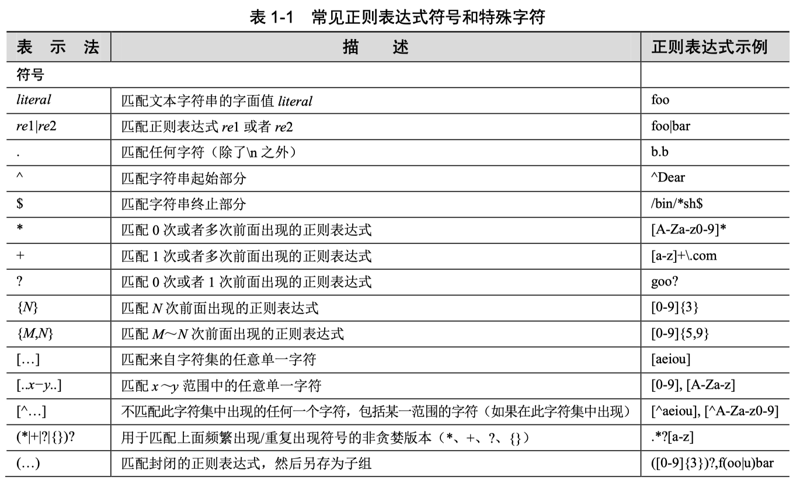
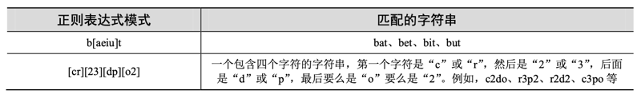
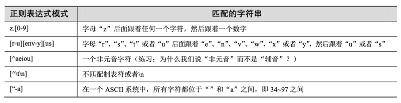
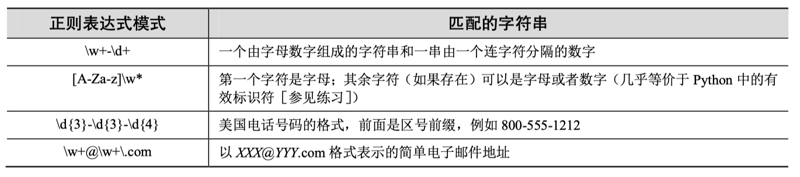
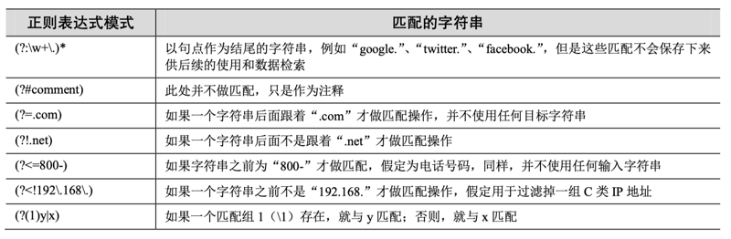
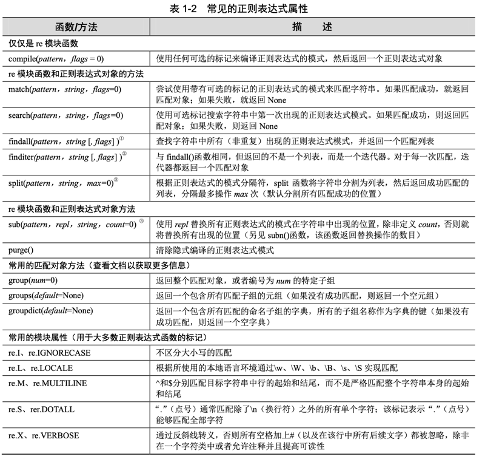
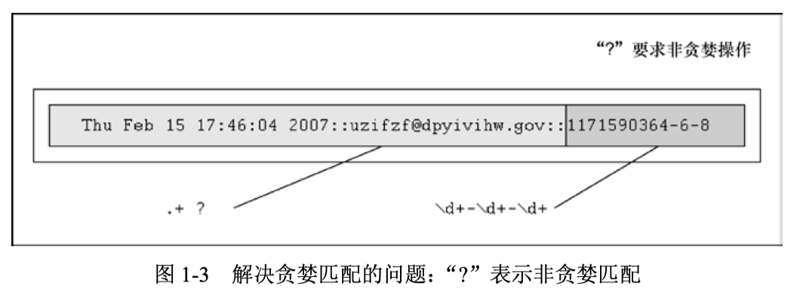

# 01 正则表达式

有些人在碰到问题时，就想：「我知道，我可以使用正则表达式。」现在，他们就有了两 个问题。

—— Jamie「jwz」Zawinski，1997 年 8 月

## 1.1 简介／动机

操作文本或者数据可是件大事。如果不相信，就仔细看看当今的计算机都在做些什么工 作：文字处理、网页表单的填写、来自数据库转储的信息流、股票报价信息、新闻源，而且 这个清单还会不断增长。因为我们可能还不知道需要用计算机编程来处理的文本或数据的具 体内容，所以能将这些文本或者数据以某种可被计算机识别和处理的模式表达出来是非常有 用的。

如果我在运营一个电子邮件存档公司，而作为我的一位客户，你希望查看你自己在去年 2 月份发送和接收的所有电子邮件。如果我能够设计一个计算机程序来收集这些信息，然后 转发给你，而不是人工阅读你的邮件然后手动处理你的请求，无疑要好很多。因为如果有人 看了你的邮件，哪怕只是用眼睛瞄了一下邮件的时间戳，你可能都会对此感到担心（甚至愤 怒）。又比如，你可能会认为凡是带有「ILOVEYOU」这样主题的邮件都是已感染病毒的邮 件，并要求从你的个人邮箱中删除它们。这就引出了一个问题，即我们如何通过编程使计算 机具有在文本中检索某种模式的能力。

正则表达式为高级的文本模式匹配、抽取、与 / 或文本形式的搜索和替换功能提供了基础。简单地说，正则表达式（简称为 regex）是一些由字符和特殊符号组成的字符串，它们描述了 模式的重复或者表述多个字符，于是正则表达式能按照某种模式匹配一系列有相似特征的字 符串（见图 1-1）。换句话说，它们能够匹配多个字符串…… 一种只能匹配一个字符串的正则 表达式模式是很乏味并且毫无作用的，不是吗？

Python 通过标准库中的 re 模块来支持正则表达式。本节将做一个简短扼要的介绍。限于 篇幅，内容将仅涉及 Python 编程中正则表达式方面的最常见内容。当然，读者对于正则表达 式方面的经验（熟悉程度）肯定不同，我们强烈建议阅读一些官方帮助文档和与此主题相关 的文档。你将再次会对字符串的理解方式有所改变！

核心提示：搜索和匹配的比较

本章通篇会使用搜索和匹配两个术语。当严格讨论与字符串中模式相关的正则表达式 时，我们会用术语「匹配」（matching），指的是术语「模式匹配」（pattern-matching）。在 Python 术语中，主要有两种方法完成模式匹配：「搜索」（searching），即在字符串任意部 分中搜索匹配的模式；而「匹配」（matching）是指判断一个字符串能否从起始处全部或者 部分地匹配某个模式。搜索通过 search () 函数或方法来实现，而匹配通过调用 match () 函数 或方法实现。总之，当涉及模式时，全部使用术语「匹配」；我们按照 Python 如何完成模 式匹配的方式来区分「搜索」和「匹配」。

图 1-1 可以使用正则表达式来识别有效的 Python 标识符，例如下面这些：[A-Za-z]\w + 的含义是第一个字符 是字母，也就是说要么 A～Z，要么 a～z，后面是至少一个（+）由字母数字组成的字符（\w）。如图所示，可以看到很多字符串被过滤，但是只有那些符合要求的正则表达式模式的字符串被筛选出来。比如「4xZ」被筛选出来，这是因为它是以数字开头的

你的第一个正则表达式

前面讲到，正则表达式是包含文本和特殊字符的字符串，该字符串描述一个可以识别各 种字符串的模式。我们还简单阐述了正则表达式字母表。对于通用文本，用于正则表达式的 字母表是所有大小写字母及数字的集合。可能也存在一些特殊字母；例如，指仅包含字符「0」和「1」的字母表。该字母表可以表示所有二进制字符串的集合，即「0」、「1」、「00」、「01」、「10」、「11」、「100」等。

现在，让我们看看正则表达式的大部分基本内容，虽然正则表达式通常被视为「高级主 题」，但是它们其实也非常简单。把标准字母表用于通用文本，我们展示了一些简单的正则表达式以及这些模式所表述的字符串。下面所介绍的正则表达式都是最基本、最普通的。它们 仅仅用一个简单的字符串构造成一个匹配字符串的模式：该字符串由正则表达式定义。下面 所示为几个正则表达式和它们所匹配的字符串。

上面的第一个正则表达式模式是「foo」。该模式没有使用任何特殊符号去匹配其他符号，而只匹配所描述的内容，所以，能够匹配这个模式的只有包含「foo」的字符串。同理，对于 字符串「Python」和「abc123」也一样。正则表达式的强大之处在于引入特殊字符来定义字 符集、匹配子组和重复模式。正是由于这些特殊符号，使得正则表达式可以匹配字符串集合，而不仅仅只是某单个字符串。

1.2 特殊符号和字符

本节将介绍最常见的特殊符号和字符，即所谓的元字符，正是它给予正则表达式强大的 功能和灵活性。表 1-1 列出了这些最常见的符号和字符。

1.2.1 使用择一匹配符号匹配多个正则表达式模式

表示择一匹配的管道符号（|），也就是键盘上的竖线，表示一个「从多个模式中选择其 一」的操作。它用于分割不同的正则表达式。例如，在下面的表格中，左边是一些运用择一 匹配的模式，右边是左边相应的模式所能够匹配的字符。

有了这个符号，就能够增强正则表达式的灵活性，使得正则表达式能够匹配多个字符串 而不仅仅只是一个字符串。择一匹配有时候也称作并（union）或者逻辑或（logical OR）。

1.2.2 匹配任意单个字符

点号或者句点（.）符号匹配除了换行符 \n 以外的任何字符（Python 正则表达式有一个编译标记 [S 或者 DOTALL]，该标记能够推翻这个限制，使点号能够匹配换行符）。无论字母、 数字、空格（并不包括「\n」换行符）、可打印字符、不可打印字符，还是一个符号，使用点 号都能够匹配它们。

问：怎样才能匹配句点（dot）或者句号（period）字符？ 答：要显式匹配一个句点符号本身，必须使用反斜线转义句点符号的功能，例如「\.」。

1.2.3 从字符串起始或者结尾或者单词边界匹配

还有些符号和相关的特殊字符用于在字符串的起始和结尾部分指定用于搜索的模式。如 果要匹配字符串的开始位置，就必须使用脱字符（^）或者特殊字符 \A（反斜线和大写字母 A）。后者主要用于那些没有脱字符的键盘（例如，某些国际键盘）。同样，美元符号（\$）或者 \Z 将用于匹配字符串的末尾位置。

使用这些符号的模式与本章描述的其他大多数模式是不同的，因为这些模式指定了位置 或方位。之前的「核心提示」记录了匹配（试图在字符串的开始位置进行匹配）和搜索（试 图从字符串的任何位置开始匹配）之间的差别。正因如此，下面是一些表示「边界绑定」的 正则表达式搜索模式的示例。

再次说明，如果想要逐字匹配这些字符中的任何一个（或者全部），就必须使用反斜线进 行转义。例如，如果你想要匹配任何以美元符号结尾的字符串，一个可行的正则表达式方案 就是使用模式.*\$$。

特殊字符 \b 和 \B 可以用来匹配字符边界。而两者的区别在于 \b 将用于匹配一个单词的边 界，这意味着如果一个模式必须位于单词的起始部分，就不管该单词前面（单词位于字符串 中间）是否有任何字符（单词位于行首）。同样，\B 将匹配出现在一个单词中间的模式（即，不是单词边界）。下面为一些示例。

1.2.4 创建字符集

尽管句点可以用于匹配任意符号，但某些时候，可能想要匹配某些特定字符。正因如此，发明了方括号。该正则表达式能够匹配一对方括号中包含的任何字符。下面为一些示例。

关于 [cr][23][dp][o2] 这个正则表达式有一点需要说明：如果仅允许「r2d2」或者「c3po」作为有效字符串，就需要更严格限定的正则表达式。因为方括号仅仅表示逻辑或的功能，所以使用方括号并不能实现这一限定要求。唯一的方案就是使用择一匹配，例如，r2d2|c3po。

然而，对于单个字符的正则表达式，使用择一匹配和字符集是等效的。例如，我们以正 则表达式「ab」作为开始，该正则表达式只匹配包含字母「a」且后面跟着字母「b」的字符 串，如果我们想要匹配一个字母的字符串，例如，要么匹配「a」，要么匹配「b」，就可以使 用正则表达式 [ab]，因为此时字母「a」和字母「b」是相互独立的字符串。我们也可以选择 正则表达式 a|b。然而，如果我们想要匹配满足模式「ab」后面且跟着「cd」的字符串，我们 就不能使用方括号，因为字符集的方法只适用于单字符的情况。这种情况下，唯一的方法就 是使用 ab|cd，这与刚才提到的 r2d2/c3po 问题是相同的。

1.2.5 限定范围和否定

除了单字符以外，字符集还支持匹配指定的字符范围。方括号中两个符号中间用连字符 （-）连接，用于指定一个字符的范围；例如，A-Z、a-z 或者 0-9 分别用于表示大写字母、小 写字母和数值数字。这是一个按照字母顺序的范围，所以不能将它们仅仅限定用于字母和十 进制数字上。另外，如果脱字符（^）紧跟在左方括号后面，这个符号就表示不匹配给定字符 集中的任何一个字符。

1.2.6 使用闭包操作符实现存在性和频数匹配

本节介绍最常用的正则表达式符号，即特殊符号 *、+ 和？，所有这些都可以用于匹配一 个、多个或者没有出现的字符串模式。星号或者星号操作符（*）将匹配其左边的正则表达式 出现零次或者多次的情况（在计算机编程语言和编译原理中，该操作称为 Kleene 闭包）。加 号（+）操作符将匹配一次或者多次出现的正则表达式（也叫做正闭包操作符），问号（？） 操作符将匹配零次或者一次出现的正则表达式。

还有大括号操作符（{}），里面或者是单个值或者是一对由逗号分隔的值。这将最终精 确地匹配前面的正则表达式 N 次（如果是 {N}）或者一定范围的次数；例如，{M，N} 将匹 配 M～N 次出现。这些符号能够由反斜线符号转义；\* 匹配星号，等等。

注意，在之前的表格中曾经多次使用问号（重载），这意味着要么匹配 0 次，要么匹配 1 次，或者其他含义：如果问号紧跟在任何使用闭合操作符的匹配后面，它将直接要求正则表 达式引擎匹配尽可能少的次数。

「尽可能少的次数」是什么意思？当模式匹配使用分组操作符时，正则表达式引擎将试图「吸收」匹配该模式的尽可能多的字符。这通常被叫做贪婪匹配。问号要求正则表达式引擎去「偷懒」，如果可能，就在当前的正则表达式中尽可能少地匹配字符，留下尽可能多的字符给 后面的模式（如果存在）。本章末尾将用一个典型的示例来说明非贪婪匹配是很有必要的。现 在继续查看闭包操作符。

1.2.7 表示字符集的特殊字符

我们还提到有一些特殊字符能够表示字符集。与使用「0-9」这个范围表示十进制数相比，可以简单地使用 d 表示匹配任何十进制数字。另一个特殊字符（\w）能够用于表示全部字母 数字的字符集，相当于 [A-Za-z0-9_] 的缩写形式，\s 可以用来表示空格字符。这些特殊字符的 大写版本表示不匹配；例如，\D 表示任何非十进制数（与 [^0-9] 相同），等等。

使用这些缩写，可以表示如下一些更复杂的示例。

1.2.8 使用圆括号指定分组

现在，我们已经可以实现匹配某个字符串以及丢弃不匹配的字符串，但有些时候，我们 可能会对之前匹配成功的数据更感兴趣。我们不仅想要知道整个字符串是否匹配我们的标准，而且想要知道能否提取任何已经成功匹配的特定字符串或者子字符串。答案是可以，要实现 这个目标，只要用一对圆括号包裹任何正则表达式。

当使用正则表达式时，一对圆括号可以实现以下任意一个（或者两个）功能：

·对正则表达式进行分组；

·匹配子组。关于为何想要对正则表达式进行分组的一个很好的示例是：当有两个不同的正则表达式 而且想用它们来比较同一个字符串时。另一个原因是对正则表达式进行分组可以在整个正则 表达式中使用重复操作符（而不是一个单独的字符或者字符集）。使用圆括号进行分组的一个副作用就是，匹配模式的子字符串可以保存起来供后续使用。这些子组能够被同一次的匹配或者搜索重复调用，或者提取出来用于后续处理。1.3.9 节的结 尾将给出一些提取子组的示例。为什么匹配子组这么重要呢？主要原因是在很多时候除了进行匹配操作以外，我们还想 要提取所匹配的模式。例如，如果决定匹配模式 \w+-\d+，但是想要分别保存第一部分的字母 和第二部分的数字，该如何实现？我们可能想要这样做的原因是，对于任何成功的匹配，我 们可能想要看到这些匹配正则表达式模式的字符串究竟是什么。如果为两个子模式都加上圆括号，例如 (\w+)-(\d+)，然后就能够分别访问每一个匹配 子组。我们更倾向于使用子组，这是因为择一匹配通过编写代码来判断是否匹配，然后执行另一个单独的程序（该程序也需要另行创建）来解析整个匹配仅仅用于提取两个部 分。为什么不让 Python 自己实现呢？这是 re 模块支持的一个特性，所以为什么非要重蹈覆辙呢？

1.2.9 扩展表示法

我们还没介绍过的正则表达式的最后一个方面是扩展表示法，它们是以问号开始（?…）。我们不会为此花费太多时间，因为它们通常用于在判断匹配之前提供标记，实现一个前视（或 者后视）匹配，或者条件检查。尽管圆括号使用这些符号，但是只有（?P<name>）表述一个 分组匹配。所有其他的都没有创建一个分组。然而，你仍然需要知道它们是什么，因为它们 可能最适合用于你所需要完成的任务。

1.3 正则表达式和 Python 语言

在了解了关于正则表达式的全部知识后，开始查看 Python 当前如何通过使用 re 模块来 支持正则表达式，re 模块在古老的 Python 1.5 版中引入，用于替换那些已过时的 regex 模块 和 regsub 模块 —— 这两个模块在 Python 2.5 版中移除，而且此后导入这两个模块中的任意一 个都会触发 ImportError 异常。

re 模块支持更强大而且更通用的 Perl 风格（Perl 5 风格）的正则表达式，该模块允许多 个线程共享同一个已编译的正则表达式对象，也支持命名子组。

1.3.1 re 模块：核心函数和方法

表 1-2 列出了来自 re 模块的更多常见函数和方法。它们中的大多数函数也与已经编译的 正则表达式对象（regex object）和正则匹配对象（regex match object）的方法同名并且具有 相同的功能。本节将介绍两个主要的函数 / 方法 ——match () 和 search ()，以及 compile () 函数。下一节将介绍更多的函数，但如果想进一步了解将要介绍或者没有介绍的更多相关信息，请 查阅 Python 的相关文档。

① Python 1.5.2 版中新增；2.4 版中增加 flags 参数。

② Python 2.2 版中新增；2.4 版中增加 flags 参数。③ Python 2.7 和 3.1 版中增加 flags 参数。

核心提示：编译正则表达式（编译还是不编译？）

在 Core Python Programming 或者即将出版的 Core Python Language Fundamentals 的 执行环境章节中，介绍了 Python 代码最终如何被编译成字节码，然后在解释器上执行。特 别是，我们指定 eval () 或者 exec（在 2.x 版本中或者在 3.x 版本的 exec () 中）调用一个代码 对象而不是一个字符串，性能上会有明显提升。这是由于对于前者而言，编译过程不会重 复执行。换句话说，使用预编译的代码对象比直接使用字符串要快，因为解释器在执行字 符串形式的代码前都必须把字符串编译成代码对象。

同样的概念也适用于正则表达式 — 在模式匹配发生之前，正则表达式模式必须编译 成正则表达式对象。由于正则表达式在执行过程中将进行多次比较操作，因此强烈建议使 用预编译。而且，既然正则表达式的编译是必需的，那么使用预编译来提升执行性能无疑 是明智之举。re.compile () 能够提供此功能。

其实模块函数会对已编译的对象进行缓存，所以不是所有使用相同正则表达式模 式的 search () 和 match () 都需要编译。即使这样，你也节省了缓存查询时间，并且不必 对于相同的字符串反复进行函数调用。在不同的 Python 版本中，缓存中已编译过的 正则表达式对象的数目可能不同，而且没有文档记录。purge () 函数能够用于清除这些 缓存。

1.3.2 使用 compile () 函数编译正则表达式

后续将扼要介绍的几乎所有的 re 模块函数都可以作为 regex 对象的方法。注意，尽管推 荐预编译，但它并不是必需的。如果需要编译，就使用编译过的方法；如果不需要编译，就 使用函数。幸运的是，不管使用函数还是方法，它们的名字都是相同的（也许你曾对此感到 好奇，这就是模块函数和方法的名字相同的原因，例如，search ()、match () 等）。因为这在大 多数示例中省去一个小步骤，所以我们将使用字符串替代。我们仍将会遇到几个预编译代码 的对象，这样就可以知道它的过程是怎么回事。

对于一些特别的正则表达式编译，可选的标记可能以参数的形式给出，这些标记允许不 区分大小写的匹配，使用系统的本地化设置来匹配字母数字，等等。请参考表 1-2 中的条目 以及在正式的官方文档中查询关于这些标记（re.IGNORECASE、re.MULTILINE、re.DOTALL、 re.VERBOSE 等）的更多信息。它们可以通过按位或操作符（|）合并。

这些标记也可以作为参数适用于大多数 re 模块函数。如果想要在方法中使用这些标记，它 们必须已经集成到已编译的正则表达式对象之中，或者需要使用直接嵌入到正则表达式本身的 （？F）标记，其中 F 是一个或者多个 i（用于 re.I/IGNORECASE）、m（用于 re.M/MULTILINE）、s（用于 re.S/DOTALL）等。如果想要同时使用多个，就把它们放在一起而不是使用按位或操作，例如，（?im）可以用于同时表示 re.IGNORECASE 和 re.MULTILINE。

1.3.3 匹配对象以及 group () 和 groups () 方法

当处理正则表达式时，除了正则表达式对象之外，还有另一个对象类型：匹配对象。这 些是成功调用 match () 或者 search () 返回的对象。匹配对象有两个主要的方法：group () 和 groups ()。

group () 要么返回整个匹配对象，要么根据要求返回特定子组。groups () 则仅返回一个包含 唯一或者全部子组的元组。如果没有子组的要求，那么当 group () 仍然返回整个匹配时，groups () 返回一个空元组。

Python 正则表达式也允许命名匹配，这部分内容超出了本节的范围。建议读者查阅完整 的 re 模块文档，里面有这里省略掉的关于这些高级主题的详细内容。

1.3.4 使用 match () 方法匹配字符串

match () 是将要介绍的第一个 re 模块函数和正则表达式对象（regex object）方法。match () 函数试图从字符串的起始部分对模式进行匹配。如果匹配成功，就返回一个匹配对象；如果 匹配失败，就返回 None，匹配对象的 group () 方法能够用于显示那个成功的匹配。下面是如 何运用 match ()（以及 group ()）的一个示例：

>>> m = re.match ('foo', 'foo') # 模式匹配字符串

>>> if m is not None: ... m.group() ...

'foo'

# 如果匹配成功，就输出匹配内容

模式「foo」完全匹配字符串「foo」，我们也能够确认 m 是交互式解释器中匹配对象的示例。

>>> m # 确认返回的匹配对象 <re.MatchObject instance at 80ebf48>

如下为一个失败的匹配示例，它返回 None。

>>> m = re.match ('foo', 'bar')# 模式并不能匹配字符串

>>> if m is not None: m.group () # （单行版本的 if 语句） ...

>>>

因为上面的匹配失败，所以 m 被赋值为 None，而且以此方法构建的 if 语句没有指明 任何操作。对于剩余的示例，如果可以，为了简洁起见，将省去 if 语句块，但在实际操作 中，最好不要省去以避免 AttributeError 异常（None 是返回的错误值，该值并没有 group () 属性 [方法]）。

只要模式从字符串的起始部分开始匹配，即使字符串比模式长，匹配也仍然能够成功。例如，模式「foo」将在字符串「food on the table」中找到一个匹配，因为它是从字符串的起 始部分进行匹配的。

>>> m = re.match ('foo', 'food on the table') # 匹配成功

>>> m.group() 'foo'

可以看到，尽管字符串比模式要长，但从字符串的起始部分开始匹配就会成功。子串「foo」是从那个比较长的字符串中抽取出来的匹配部分。甚至可以充分利用 Python 原生的面向对象特性，忽略保存中间过程产生的结果。

>>> re.match('foo', 'food on the table').group() 'foo'

注意，在上面的一些示例中，如果匹配失败，将会抛出 AttributeError 异常。

1.3.5 使用 search () 在一个字符串中查找模式（搜索与匹配 的对比）

其实，想要搜索的模式出现在一个字符串中间部分的概率，远大于出现在字符串起始部 分的概率。这也就是 search () 派上用场的时候了。search () 的工作方式与 match () 完全一致，不 同之处在于 search () 会用它的字符串参数，在任意位置对给定正则表达式模式搜索第一次出现 的匹配情况。如果搜索到成功的匹配，就会返回一个匹配对象；否则，返回 None。

我们将再次举例说明 match () 和 search () 之间的差别。以匹配一个更长的字符串为例，这 次使用字符串「foo」去匹配「seafood」：

>>> m = re.match('foo', 'seafood')

>>> if m is not None: m.group() ...

>>>

# 匹配失败

可以看到，此处匹配失败。match () 试图从字符串的起始部分开始匹配模式；也就是说，模式中的「f」将匹配到字符串的首字母「s」上，这样的匹配肯定是失败的。然而，字符串「foo」确实出现在「seafood」之中（某个位置），所以，我们该如何让 Python 得出肯定的结 果呢？答案是使用 search () 函数，而不是尝试匹配。search () 函数不但会搜索模式在字符串中 第一次出现的位置，而且严格地对字符串从左到右搜索。

>>> m = re.search ('foo', 'seafood') # 使用 search () 代替

>>> if m is not None: m.group() ...

'foo' # 搜索成功，但是匹配失败

>>>

此外，match () 和 search () 都使用在 1.3.2 节中介绍的可选的标记参数。最后，需要注意的 是，等价的正则表达式对象方法使用可选的 pos 和 endpos 参数来指定目标字符串的搜索范围。

本节后面将使用 match () 和 search () 正则表达式对象方法以及 group () 和 groups () 匹配对象 方法，通过展示大量的实例来说明 Python 中正则表达式的使用方法。我们将使用正则表达式 语法中几乎全部的特殊字符和符号。

1.3.6 匹配多个字符串

在 1.2 节中，我们在正则表达式 bat|bet|bit 中使用了择一匹配（|）符号。如下为在 Python 中使用正则表达式的方法。

>>> bt = 'bat|bet|bit'

>>> m = re.match(bt, 'bat')

>>> if m is not None: m.group() ...

'bat'

>>> m = re.match(bt, 'blt')

>>> if m is not None: m.group() ...

# 正则表达式模式: bat、bet、bit # 'bat' 是一个匹配

# 对于 'blt' 没有匹配

>>> m = re.match (bt, 'He bit me!') # 不能匹配字符串

>>> if m is not None: m.group() ...

>>> m = re.search (bt, 'He bit me!') # 通过搜索查找 'bit'

>>> if m is not None: m.group() ...

'bit'

1.3.7 匹配任何单个字符

在后续的示例中，我们展示了点号（.）不能匹配一个换行符 \n 或者非字符，也就是说，一个空字符串。

下面的示例在正则表达式中搜索一个真正的句点（小数点），而我们通过使用一个反斜线 对句点的功能进行转义：

1.3.8 创建字符集（[

]）

前面详细讨论了 [cr][23][dp][o2]，以及它们与 r2d2|c3po 之间的差别。下面的示例将说明 对于 r2d2|c3po 的限制将比 [cr][23][dp][o2] 更为严格。

1.3.9 重复、特殊字符以及分组

正则表达式中最常见的情况包括特殊字符的使用、正则表达式模式的重复出现，以及使用 圆括号对匹配模式的各部分进行分组和提取操作。我们曾看到过一个关于简单电子邮件地址的 正则表达式（\w+@\w+\.com）。或许我们想要匹配比这个正则表达式所允许的更多邮件地址。为了在域名前添加主机名称支持，例如 www.xxx.com，仅仅允许 xxx.com 作为整个域名，必须 修改现有的正则表达式。为了表示主机名是可选的，需要创建一个模式来匹配主机名（后面跟 着一个句点），使用「？」操作符来表示该模式出现零次或者一次，然后按照如下所示的方式，插入可选的正则表达式到之前的正则表达式中：\w+@(\w+\.)?\w+\.com。从下面的示例中可见，该表达式允许.com 前面有一个或者两个名称：

>>> patt = '\w+@(\w+\.)?\w+\.com'

>>> re.match(patt, 'nobody@xxx.com').group() 'nobody@xxx.com'

>>> re.match(patt, 'nobody@www.xxx.com').group() 'nobody@www.xxx.com'

接下来，用以下模式来进一步扩展该示例，允许任意数量的中间子域名存在。请特别注 意细节的变化，将「?」改为「*. : \w+@(\w+\.)*\w+\.com」。

>>> patt = '\w+@(\w+\.)*\w+\.com'

>>> re.match(patt, 'nobody@www.xxx.yyy.zzz.com').group() 'nobody@www.xxx.yyy.zzz.com'

但是，我们必须要添加一个「免责声明」，即仅仅使用字母数字字符并不能匹配组成电子 邮件地址的全部可能字符。上述正则表达式不能匹配诸如 xxx-yyy.com 的域名或者使用非单 词 \W 字符组成的域名。

之前讨论过使用圆括号来匹配和保存子组，以便于后续处理，而不是确定一个正则表达 式匹配之后，在一个单独的子程序里面手动编码来解析字符串。此前还特别讨论过一个简单 的正则表达式模式 \w+-\d+，它由连字符号分隔的字母数字字符串和数字组成，还讨论了如何 添加一个子组来构造一个新的正则表达式 (\w+)-(\d+) 来完成这项工作。下面是初始版本的正则表达式的执行情况。

在上面的代码中，创建了一个正则表达式来识别包含 3 个字母数字字符且后面跟着 3 个 数字的字符串。使用 abc-123 测试该正则表达式，将得到正确的结果，但是使用 abc-xyz 则不 能。现在，将修改之前讨论过的正则表达式，使该正则表达式能够提取字母数字字符串和数 字。如下所示，请注意如何使用 group () 方法访问每个独立的子组以及 groups () 方法以获取一 个包含所有匹配子组的元组。

>>> m = re.match('(\w\w\w)-(\d\d\d)', 'abc-123')

>>> m.group () # 完整匹配 'abc-123'

>>> m.group (1) # 子组 1 'abc'

>>> m.group (2) # 子组 2 '123'

>>> m.groups () # 全部子组 ('abc', '123')

由以上脚本内容可见，group () 通常用于以普通方式显示所有的匹配部分，但也能用于获 取各个匹配的子组。可以使用 groups () 方法来获取一个包含所有匹配子字符串的元组。如下为一个简单的示例，该示例展示了不同的分组排列，这将使整个事情变得更加清晰。

1.3.10 匹配字符串的起始和结尾以及单词边界

如下示例突出显示表示位置的正则表达式操作符。该操作符更多用于表示搜索而不是匹 配，因为 match () 总是从字符串开始位置进行匹配。

读者将注意到此处出现的原始字符串。你可能想要查看本章末尾部分的核心提示「Python 中原始字符串的用法」（Using Python raw strings），里面提到了在此处使用它们的原因。通常 情况下，在正则表达式中使用原始字符串是个好主意。

读者还应当注意其他 4 个 re 模块函数和正则表达式对象方法：findall ()、sub ()、subn () 和 split ()。

1.3.11 使用 findall () 和 finditer () 查找每一次出现的位置

findall () 查询字符串中某个正则表达式模式全部的非重复出现情况。这与 search () 在执行 字符串搜索时类似，但与 match () 和 search () 的不同之处在于，findall () 总是返回一个列表。如 果 findall () 没有找到匹配的部分，就返回一个空列表，但如果匹配成功，列表将包含所有成 功的匹配部分（从左向右按出现顺序排列）。

>>> re.findall('car', 'car')

['car']

>>> re.findall('car', 'scary')

['car'] >>> re.findall('car', 'carry the barcardi to the car') ['car', 'car', 'car']

子组在一个更复杂的返回列表中搜索结果，而且这样做是有意义的，因为子组是允许从 单个正则表达式中抽取特定模式的一种机制，例如匹配一个完整电话号码中的一部分（例如 区号），或者完整电子邮件地址的一部分（例如登录名称）。

对于一个成功的匹配，每个子组匹配是由 findall () 返回的结果列表中的单一元素；对于 多个成功的匹配，每个子组匹配是返回的一个元组中的单一元素，而且每个元组（每个元组 都对应一个成功的匹配）是结果列表中的元素。这部分内容可能第一次听起来令人迷惑，但 是如果你尝试练习过一些不同的示例，就将澄清很多知识点。

finditer () 函数是在 Python 2.2 版本中添加回来的，这是一个与 findall () 函数类似但是更节 省内存的变体。两者之间以及和其他变体函数之间的差异（很明显不同于返回的是一个迭代 器还是列表）在于，和返回的匹配字符串相比，finditer () 在匹配对象中迭代。如下是在单个 字符串中两个不同分组之间的差别。

在下面的示例中，我们将在单个字符串中执行单个分组的多重匹配。

注意，使用 finditer () 函数完成的所有额外工作都旨在获取它的输出来匹配 findall () 的输出。最后 ，与 match () 和 search () 类似，findall () 和 finditer () 方法的版本支持可选的 pos 和 endpos 参数，这两个参数用于控制目标字符串的搜索边界，这与本章之前的部分所描述的类似。

1.3.12 使用 sub () 和 subn () 搜索与替换

有两个函数 / 方法用于实现搜索和替换功能：sub () 和 subn ()。两者几乎一样，都是将某字 符串中所有匹配正则表达式的部分进行某种形式的替换。用来替换的部分通常是一个字符串，但它也可能是一个函数，该函数返回一个用来替换的字符串。subn () 和 sub () 一样，但 subn () 还返回一个表示替换的总数，替换后的字符串和表示替换总数的数字一起作为一个拥有两个 元素的元组返回。

前面讲到，使用匹配对象的 group（）方法除了能够取出匹配分组编号外，还可以使用 \N，其中 N 是在替换字符串中使用的分组编号。下面的代码仅仅只是将美式的日期表示法 MM/DD/YY {,YY} 格式转换为其他国家常用的格式 DD/MM/YY {,YY}。

>>> re.sub(r'(\d{1,2})/(\d{1,2})/(\d{2}|\d{4})', ... r'\2/\1/\3', '2/20/91') # Yes, Python is... '20/2/91'

>>> re.sub(r'(\d{1,2})/(\d{1,2})/(\d{2}|\d{4})', ... r'\2/\1/\3', '2/20/1991') # ... 20+ years old! '20/2/1991'

1.3.13 在限定模式上使用 split () 分隔字符串

re 模块和正则表达式的对象方法 split () 对于相对应字符串的工作方式是类似的，但是与 分割一个固定字符串相比，它们基于正则表达式的模式分隔字符串，为字符串分隔功能添加 一些额外的威力。如果你不想为每次模式的出现都分割字符串，就可以通过为 max 参数设定 一个值（非零）来指定最大分割数。

如果给定分隔符不是使用特殊符号来匹配多重模式的正则表达式，那么 re.split () 与 str.split () 的工作方式相同，如下所示（基于单引号分割）。

>>> re.split(':', 'str1:str2:str3')

['str1', 'str2', 'str3']

这是一个简单的示例。如果有一个更复杂的示例，例如，一个用于 Web 站点（类似于 Google 或者 Yahoo! Maps）的简单解析器，该如何实现？用户需要输入城市和州名，或者城 市名加上 ZIP 编码，还是三者同时输入？这就需要比仅仅是普通字符串分割更强大的处理方 式，具体如下。

上述正则表达式拥有一个简单的组件：使用 split 语句基于逗号分割字符串。更难的部分是 最后的正则表达式，可以通过该正则表达式预览一些将在下一小节中介绍的扩展符号。在普通的 英文中，通常这样说：如果空格紧跟在五个数字（ZIP 编码）或者两个大写字母（美国联邦州缩 写）之后，就用 split 语句分割该空格。这就允许我们在城市名中放置空格。

通常情况下，这仅仅只是一个简单的正则表达式，可以在用来解析位置信息的应用中作 为起点。该正则表达式并不能处理小写的州名或者州名的全拼、街道地址、州编码、ZIP+4 （9 位 ZIP 编码）、经纬度、多个空格等内容（或者在处理时会失败）。这仅仅意味着使用 re.split () 能够实现 str.split () 不能实现的一个简单的演示实例。

我们刚刚已经证实，读者将从正则表达式 split 语句的强大能力中获益；然而，记得一定 在编码过程中选择更合适的工具。如果对字符串使用 split 方法已经足够好，就不需要引入额 外复杂并且影响性能的正则表达式。

1.3.14 扩展符号

Python 的正则表达式支持大量的扩展符号。让我们一起查看它们中的一些内容，然后展 示一些有用的示例。

通过使用 (?iLmsux) 系列选项，用户可以直接在正则表达式里面指定一个或者多个标 记，而不是通过 compile () 或者其他 re 模块函数。下面为一些使用 re.I/IGNORECASE 的示例，最后一个示例在 re.M/MULTILINE 实现多行混合：

>>> re.findall(r'(?i)yes', 'yes? Yes. YES!!') ['yes', 'Yes', 'YES']

>>> re.findall(r'(?i)th\w+', 'The quickest way is through this tunnel.')

['The', 'through', 'this']

>>> re.findall(r'(?im)(^th[\w ]+)', """

... This line is the first, ... another line, ... that line, it's the best ... """) ['This line is the first', 'that line']

在前两个示例中，显然是不区分大小写的。在最后一个示例中，通过使用「多行」，能够 在目标字符串中实现跨行搜索，而不必将整个字符串视为单个实体。注意，此时忽略了实例「the」，因为它们并不出现在各自的行首。

下一组演示使用 re.S/DOTALL。该标记表明点号（.）能够用来表示 \n 符号（反之其通常 用于表示除了 \n 之外的全部字符）：

re.X/VERBOSE 标记非常有趣；该标记允许用户通过抑制在正则表达式中使用空白符（除 了在字符类中或者在反斜线转义中）来创建更易读的正则表达式。此外，散列、注释和井号 也可以用于一个注释的起始，只要它们不在一个用反斜线转义的字符类中。

>>> re.search (r'''(?x) ... \((\d {3})\) # 区号 ... [] # 空白符 ... (\d {3}) # 前缀 ... - # 横线 ... (\d {4}) # 终点数字 ... ''', '(800) 555-1212').groups () ('800', '555', '1212')

(?:…) 符号将更流行；通过使用该符号，可以对部分正则表达式进行分组，但是并不会保 存该分组用于后续的检索或者应用。当不想保存今后永远不会使用的多余匹配时，这个符号 就非常有用。

>>> re.findall(r'http://(?:\w+\.)*(\w+\.com)', ... 'http://google.com http://www.google.com http:// code.google.com') ['google.com', 'google.com', 'google.com']

>>> re.search(r'\((?P<areacode>\d{3})\) (?P<prefix>\d{3})-(?:\d{4})',

... '(800) 555-1212').groupdict() {'areacode': '800', 'prefix': '555'}

读者可以同时一起使用 (?P<name>) 和 (?P=name) 符号。前者通过使用一个名称标 识符而不是使用从 1 开始增加到 N 的增量数字来保存匹配，如果使用数字来保存匹配结 果，我们就可以通过使用 \1,\2 ...,\N \ 来检索。如下所示，可以使用一个类似风格的 \g<name> 来检索它们。

使用后者，可以在一个相同的正则表达式中重用模式，而不必稍后再次在（相同） 正则表达式中指定相同的模式。例如，在本示例中，假定让读者验证一些电话号码的规 范化。如下所示为一个丑陋并且压缩的版本，后面跟着一个正确使用的 (? x)，使代码变 得稍许易读。

读者可以使用 (?=...) 和 (?!…) 符号在目标字符串中实现一个前视匹配，而不必实际上使 用这些字符串。前者是正向前视断言，后者是负向前视断言。在后面的示例中，我们仅仅对 姓氏为「van Rossum」的人的名字感兴趣，下一个示例中，让我们忽略以「noreply」或者「postmaster」开头的 e-mail 地址。

第三个代码片段用于演示 findall () 和 finditer () 的区别；我们使用后者来构建一个使用相同 登录名但不同域名的 e-mail 地址列表（在一个更易于记忆的方法中，通过忽略创建用完即丢 弃的中间列表）。

最后一个示例展示了使用条件正则表达式匹配。假定我们拥有另一个特殊字符，它仅 仅包含字母「x」和「y」，我们此时仅仅想要这样限定字符串：两字母的字符串必须由一 个字母跟着另一个字母。换句话说，你不能同时拥有两个相同的字母；要么由「x」跟着「y」，要么相反。

>>> bool(re.search(r'(?:(x)|y)(?(1)y|x)', 'xy')) True

>>> bool(re.search(r'(?:(x)|y)(?(1)y|x)', 'xx')) False

1.3.15 杂项

可能读者会对于正则表达式的特殊字符和特殊 ASCII 符号之间的差异感到迷惑。我们 可以使用 \n 表示一个换行符，但是我们可以使用 \d 在正则表达式中表示匹配单个数字。

如果有符号同时用于 ASCII 和正则表达式，就会发生问题，因此在下面的核心提示中，建议使用 Python 的原始字符串来避免产生问题。另一个警告是：\w 和 \W 字母数字字符集同 时受 re.L/LOCALE 和 Unicode（re.U/UNICODE）标记所影响。

核心提示：使用 Python 原始字符串

读者可能在之前的一些示例中见过原始字符串的使用。正则表达式对于探索原始字符 串有着强大的动力，原因就在于 ASCII 字符和正则表达式的特殊字符之间存在冲突。作为 一个特殊符号，\b 表示 ASCII 字符的退格符，但是 \b 同时也是一个正则表达式的特殊符号，表示匹配一个单词的边界。对于正则表达式编译器而言，若它把两个 \b 视为字符串内容而 不是单个退格符，就需要在字符串中再使用一个反斜线转义反斜线，就像这样：\\b。

这样显得略微杂乱，特别是如果在字符串中拥有很多特殊字符，就会让人感到更加困 惑。我们在 Core Python Programming 或者 Core Python Language Fundamentals 的 Sequence 章节中介绍了原始字符串，而且该原始字符串可以用于（且经常用于）帮助保持正则表达 式查找某些可托管的东西。事实上，很多 Python 程序员总是抱怨这个方法，仅仅用原始字 符串来定义正则表达式。

如下所示的一些示例用于说明退格符 \b 和正则表达式 \b 之间的差异，它们有的使用、 有的不使用原始字符串。

>>> m = re.match('\bblow', 'blow') # backspace、no match

>>> if m: m.group() ...

>>> m = re.match('\\bblow', 'blow') # escaped\，now it works

>>> if m: m.group() ...

'blow'

>>> m = re.match(r'\bblow', 'blow') # use raw string instead

>>> if m: m.group() ...

'blow'

读者可能回想起来我们在正则表达式中使用 \d 而没有使用原始字符串时并未遇到问题，这 是因为 ASCII 中没有相应的特殊字符，所以正则表达式的编译器知道你想要表示十进制数字。

1.4 一些正则表达式示例

下面看一些 Python 正则表达式的示例代码，这将使我们更接近实际应用中的程序。如下 所示，以 POSIX（UNIX 风格操作系统，如 Linux、Mac OS X 等）的 who 命令的输出为例，该命令将列出所有登录当前系统中的用户信息。

可能我们想要保存一些用户登录信息，诸如登录名、用户登录的终端类型、用户登录的 时间和地点。在前面的示例中使用 str.split () 方法并不高效，因为此处的空白符既不稳定也不 一致。另一个问题是在登录时间戳中间的月、日和时间之间有空格，我们可能想要保存这些 连续的字段。

读者需要一些方法描述诸如「分割两个或者多个空白符」之类的模式。这通过正则表达 式很容易完成。很快，我们可以使用正则表达式模式 \s\s+，该模式的意思是至少拥有两个以 上的空白符。

下面创建一个名为 rewho.py 的程序，该程序读取 who 命令的输出，然后假定将得到的输 出信息存入一个名为 whoadat.txt 的文件之中。rewho.py 脚本最初如下所示：

import re for eachLine in f:

f = open('whodata.txt', 'r')

print re.split(r'\s\s+', eachLine) f.close()

上述代码同样使用原始字符串（将字母「r」或者「R」放置在左引号之前），主要目的是 为了避免转义特殊字符串字符，如 \n，该字符并不是特殊的正则表达式模式。对于确实拥有 反斜线的正则表达式模式，读者可能希望逐字地处理它们；否则，读者必须在前面加上双斜 线来保持它们的安全。

现在将执行 who 命令，保存输出到 whodata.txt 文件之中，然后调用 rewho.py 查看结果。

这是非常好的一次尝试。首先，我们不期望单个制表符（ASCII \011）作为输出的一 部分（可能看起来像是至少两个空白符），然后可能我们并不真的希望保存 \n（ASCII \012） 作为每一行的终止符。我们现在将修复这些问题，然后通过一些改进来提高应用的整体 质量。

首先，应当在脚本内部运行 who 命令而不是在外部，然后将输出存入 whodata.txt 文件，如果手动重复做这件事很快就会感到厌倦。要在该程序中调用其他程序，需要调用 os.popen () 命令。尽管 os.popen () 命令现在已经被 subprocess 模块所替换，但它更容易使用，而且此处的 重点是展示 re.split () 的功能。

去除尾部的 \n（使用 str.rstrip ()），然后添加单个制表符的检查，用于代替 re.split () 分 隔符。示例 1-1 展示最终的 rewho.py 脚本在 Python 2 中的版本。

示例 1-2 表示 rewho3.py，这是 Python 3 版本。和 Python 2 版本的主要差别在于 print () 函数（或者表达式）。这一整行表明了 Python 2 和 3 的关键区别。with 语句在 Python 2.5 版中是试验性的，在 Python 2.6 版本中提供正式支持，该语句用于操作并支持所构建的对 象实例。

通过使用 with 语句，拥有上下文管理器的对象变得更易于使用。关于 with 语句和上下 文 管 理 的 更多 信 息 ，请参 考 Core Python Pragramming 或者 Core Pythom Language Fundamentals 中的「Errors and Exceptions」章节。记住，两个版本（rewho.py 或者 rewho3.py） 中的 who 命令仅能在 POSIX 系统中使用，除非可以在 Windows 系统的计算机中使用 Cygwin。对于运行 Microsoft Windows 的个人电脑，可以尝试 tasklist 命令，但读者还需要做一个额外 的调整。继续阅读本章后续的章节，查看一个执行 that 命令的示例。

示例 1-3 将 rewho.py 和 rewho3.py 合并为 rewhoU.py，该名称的含义是「通用的 rewho」。该程序能够在 Python 2 和 3 的解释器下运行。我们欺骗并避免使用 print 或者 print ()，方法是 使用一个在 2.x 和 3.x 版本中都存在并且功能并不齐全的函数：distutils.log.warn ()。这是一个 单字符串输出函数，因此如果输出要复杂一些，就需要合并所有输出到一个字符串中，然后 调用。要在该脚本中指明它的使用方式，就将它命名为 printf ()。

我们也在此使用 with 语句。这就意味着读者需要至少使用 Python 2.6 版本来运行该程序。这还不确切。之前提到过，在 2.5 版本中 with 语句是试验性的。这就意味着如果想要在 Python 2.5 中使用，就需要导入额外的语句：from __future__ import with_statement。如果读者仍 在使用 2.4 或者更老的版本，就不能使用这个 import 语句，并且必须按照示例 1-1 那样运行 这段代码。

rewhoU.py 的创建是一个介绍如何创建通用脚本的示例，这将帮助我们避免为 Python 2 和 3 同时维护两个版本的相同脚本。使用合适的解释器执行这些脚本中的任何一个都会得到正确、简洁的输出。

同样不要忘记，之前的小节介绍过 re.split () 函数也可以使用可选的 flage 参数。在 Windows 计算机上可以使用 tasklist 命令替代 who 来得到类似的结果。让我们查看该 命令的输出结果。

可以看到，输出包含不同于 who 命令的输出信息，但格式是类似的，所以可以考虑之前 的方案：在一个或多个空白符上执行 re.split ()（此处没有制表符的问题）。

问题是命令名称可能有一个空白符，而且我们（应当）更倾向于将整个命令名称连接 在一起。对于内存的使用也有这个问题，我们通常得到的是「NNN K」，其中 NNN 是内存 数量大小，K 表示千字节。我们也希望将这些数据连接在一起，因此，最好分隔至少一个 空白符，对吧？

不，不能这样做。注意，进程 ID（PID）和会话名称列仅仅由一个空白符分隔。这就意 味着如果去掉至少一个空白符，PID 和会话名称将被合并在一起作为单个结果。如果复制之 前的一个脚本，重命名它为 retasklist.py，然后将 who 命令修改为 tasklist /nh（/nh 选项将会去 除每一列的标题），并使用一个 \s\s + 正则表达式，就将得到如下所示的输出。

已经确认，尽管我们将命令名称和内存使用字符串保存在一起，但也不经意地将 PID 和 会话名称放在一起。因此我们不得不放弃使用 split 函数，而且通过正则表达式匹配实现。我 们可以这样实现，然后滤除会话名称和编号，因为两者都会为输出添加数值。示例 1-4 显示。

如果运行这个脚本，就能得到期望（已截断）的输出。

细致的正则表达式将会扫描全部的 5 列输出字符串，仅对重要的数据进行分组：命令名 称、命令相应的 PID，以及该命令使用的内存大小。该脚本使用已经在本章中介绍过的正则 表达式的很多特性。

显然，在本小节中实现的全部脚本只向用户显示输出。实际上，我们有可能在处理数据，并将数据保存入数据库，使用得到的输出来为管理层生成报表等。

1.5 更长的正则表达式示例

我们现在将浏览一个深入的示列，它以不同的方式使用正则表达式来操作字符串。首先 是一些实际上生成用于操作随机数（但不是太随机）的代码。示例 1-5 展示了 gendata.py，这 是一个生成数据集的脚本。尽管该程序只是将简单地将生成的字符串集显示到标准输出，但 是该输出可以很容易重定向到测试文件。

该脚本生成拥有三个字段的字符串，由一对冒号或者一对双冒号分隔。第一个字段是随 机（32 位）整数，该整数将被转换为一个日期。下一个字段是一个随机生成的电子邮件地址。最后一个字段是一个由单横线（-）分隔的整数集。

运行这段代码，我们将获得以下输出（读者将会从此获益颇多），并将该输出在本地另存 为 redata.txt 文件。

读者或者可能会辨别出来，但是来自该程序的输出是为正则表达式处理做准备的。后续将逐 行解释，我们将实现一些正则表达式来操作这些数据，以及为本章末尾的练习留下很多内容。

逐行解释

第 1～6 行 在示例脚本中，需要使用多个模块。由于多种原因，尽管我们小心翼翼地避免使用 from-import 语句（例如，很容易判断一个函数来自哪个模块，以及 可能导致本地模块冲突等），我们还是选择从这些模块中仅导入特定的属性，来帮助读者仅专注于那些属性，以及缩短每 行代码的长度。

第 8 行 tlds 是一组高级域名集合，当需要随机生成电子邮件地址时，就可以从中随机选出一个。第 10～12 行 每次执行 gendata.py，就会生成第 5 行和第 10 行之间的输出（该脚本对于所有需要随机整数 的场景都使用 random.randrange () 函数）。对于每一行，我们选取所有可能范围（0～231–1  [sys.maxint]）中的随机整数，然后使用 time.ctime () 函数将该整数转换为日期。Python 中的系统 时间和大多数基于 POSIX 的计算机一样，两者都使用从「epoch」至今的秒数，epoch 是指 1970 年 1 月 1 日格林威治时间的午夜。如果我们选择一个 32 位整数，那么该整数将表示从 epoch 到 最大可能时间（即 epoch 后的 2 32 秒）之间的某个时刻。

第 13～16 行

伪造邮件地址的登录名长度为 4～7 个字符（因此使用 randrange (4，8)）。为了将它们放 在一起，需要随机选择 4～7 个小写字母，将所有字母逐个连接成一个字符串。random.choice () 函数的功能就是接受一个序列，然后返回该序列中的一个随机元素。在该示例中，string.ascii_lowercase 是字母表中拥有 26 个小写字母的序列集合。

我们决定伪造电子邮件地址的主域名长度不能多于 12 个字符，但是至少和登录名一样 长。再一次使用随机的小写字母，逐个字母来组合这个名字。

第 17～18 行

该脚本的关键部分就是将所有随机数据放入输出行。先是数据字符串，然后是分隔符。然后将所有电子邮件地址通过登录名、「@」符号、域名和一个随机选择的高级域名组合在一 起。在最终的双冒号之后，我们将使用用于表示初始时间的随机数字符串（日期字符串），后 面跟着登录名和域名的长度，所有这些都由一个连字符分隔。

1.5.1 匹配字符串

对于后续的练习，为正则表达式创建宽松和约束性的版本。建议读者在一个简短的应用 中测试这些正则表达式，该应用利用之前所展示的示例文件 redata.txt（或者使用通过运行 gendata.py 生成的数据）。当做练习时，读者将需要再次使用该数据。

在将正则表达式放入应用中之前，为了测试正则表达式，我们将导入 re 模块，然后将 redata.txt 中的一个示例行赋给字符串变量 data。如下所示，这些语句在所有展示的示例中都 是常量。

>>> import re

>>> data = 'Thu Feb 15 17:46:04 2007::uzifzf@dpyivihw.gov::1171590364-6-8'

在第一个示例中，我们将创建一个正则表达式来提取（仅仅）数据文件 redata.txt 中每一 行时间戳中一周的几天。我们将使用下面的正则表达式。

该示例需要字符串以列出的 7 个字符串中的任意一个开头（「^」正则表达式中的脱字符）。如果我们将该正则表达式「翻译」成自然语言，读起来就会像这样：「字符串应当以「Mon」，「Tue」，. . . ,「Sat」或者「Sun」开头。

换句话说，如果按照如下所示的方式对日期字符串分组，我们就可以使用一个脱字符来 替换所有脱字符。

"^(Mon|Tue|Wed|Thu|Fri|Sat|Sun)"

括住字符串集的圆括号意思是：这些字符串中的一个将会有一次成功匹配。这是我们一 开始就使用的「友好的」正则表达式版本，该版本并没有使用圆括号。如下所示，在这个修 改过的正则表达式版本中，可以以子组的方式来访问匹配字符串。

>>> patt = '^(Mon|Tue|Wed|Thu|Fri|Sat|Sun)'

>>> m = re.match(patt, data)

>>> m.group() # entire match 'Thu'

>>> m.group(1) # subgroup 1 'Thu'

>>> m.groups() # all subgroups ('Thu',)

我们在该示例所实现的这个特性可能看起来并不是革命性的，但是在下一个示例或者作 为正则表达式的一部分提供额外数据来实现字符串匹配操作的任何地方，它确定有它的独到 之处，即使这些字符并不是你所感兴趣字符的一部分。

以上两个正则表达式都是非常严格的，尤其是要求一个字符串集。这可能在一个国际化 的环境中并不能良好地工作，因为所在的环境中会使用当地的日期和缩写。一个宽松的正则 表达式将为：^\w {3}。该正则表达式仅仅需要一个以三个连续字母数字字符开头的字符串。再一次，将正则表达式转换为正常的自然语言：脱字符 ^ 表示「作为起始」，\w 表示任意单个 字母数字字符，{3} 表示将会有 3 个连续的正则表达式副本，这里使用 {3} 来修饰正则表达式。再一次，如果想要分组，就必须使用圆括号，例如 ^(\w {3})。

>>> patt = '^(\w{3})'

>>> m = re.match(patt, data)

>>> if m is not None: m.group() ...

'Thu'

>>> m.group(1) 'Thu'

注意，正则表达式 ^(\w){3} 是错误的。当 {3} 在圆括号中时，先匹配三个连续的字母数字字符，然后表示为一个分组。但是如果将 {3} 移到外部，它就等效于三个连续的单个字母数字字符。

当我们访问子组 1 时，出现字母「u」的原因是子组 1 持续被下一个字符替换。换句话说，m.group (1) 以字母「T」作为开始，然后变为「h」，最终被替换为「u」。这些是单个字母数字 字符的三个独立（并且重叠）分组，与一个包含三个连续字母数字字符的单独分组相反。

在下一个（而且是最后）的示例中，我们将创建一个正则表达式来提取 redata.txt 每一行 的末尾所发现的数字字段。

1.5.2 搜索与匹配…… 还有贪婪

然而，在创建任何正则表达式之前，我们就意识到这些整数数据项位于数据字符串的末 尾。这就意味着我们需要选择使用搜索还是匹配。发起一个搜索将更易于理解，因为我们确 切知道想要查找的内容（包含三个整数的数据集），所要查找的内容不是在字符串的起始部分，也不是整个字符串。如果我们想要实现匹配，就必须创建一个正则表达式来匹配整个行，然 后使用子组来保存想要的数据。要展示它们之间的差别，就需要先执行搜索，然后实现匹配，以展示使用搜索更适合当前的需要。

因为我们想要寻找三个由连字符分隔的整数，所以可以创建自己的正则表达式来说明这 一需求：\d+-\d+-\d+。该正则表达式的含义是，「任何数值的数字（至少一个）后面跟着一个 连字符，然后是多个数字、另一个连字符，最后是一个数字集。」我们现在将使用 search () 来 测试该正则表达式：

>>> patt = '\d+-\d+-\d+'

>>> re.search(patt, data).group() '1171590364-6-8'

# entire match

一个匹配尝试失败了，为什么呢？因为匹配从字符串的起始部分开始，需要被匹配的数 值位于字符串的末尾。我们将不得不创建另一个正则表达式来匹配整个字符串。但是可以使 用惰性匹配，即使用「.+」来表明一个任意字符集跟在我们真正感兴趣的部分之后。

patt = '.+\d+-\d+-\d+' >>> re.match(patt, data).group() # entire match 'Thu Feb 15 17:46:04 2007::uzifzf@dpyivihw.gov::1171590364-6-8'

该正则表达式效果非常好，但是我们只想要末尾的数字字段，而并不是整个字符串，因 此不得不使用圆括号对想要的内容进行分组。

发生了什么？我们将提取 1171590364-6-8，而不仅仅是 4-6-8。第一个整数的其余部分在哪 儿？问题在于正则表达式本质上实现贪婪匹配。这就意味着对于该通配符模式，将对正则表达 式从左至右按顺序求值，而且试图获取匹配该模式的尽可能多的字符。在之前的示例中，使用「.+」获取从字符串起始位置开始的全部单个字符，包括所期望的第一个整数字段。\d + 仅仅需 要一个数字，因此将得到「4」，其中.+ 匹配了从字符串起始部分到所期望的第一个数字的全部 内容：「Thu Feb 15 17:46:04 2007::uzifzf@dpyivihw.gov::117159036」，如图 1-2 所示。

其中的一个方案是使用「非贪婪」操作符「?」。读者可以在「*」、「+」或者「?」之后使 用该操作符。该操作符将要求正则表达式引擎匹配尽可能少的字符。因此，如果在「.+」之 后放置一个「?」，我们将获得所期望的结果，如图 1-3 所示。

另一个实际情况下更简单的方案，就是把「::」作为字段分隔符。读者可以仅仅使用正 则字符串 strip (':: ') 方法获取所有的部分，然后使用 strip ('-') 作为另一个横线分隔符，就能够获 取最初想要查询的三个整数。现在，我们不想先选择该方案，因为这就是我们如何将字符串放在一起，以使用 gendata.py 作为开始！

最后一个示例：假定我们仅想取出三个整数字段中间的那个整数。如下所示，这就是实现的 方法（使用一个搜索，这样就不必匹配整个字符串）：-(\d+)-。尝试该模式，将得到以下内容。

本章几乎没有涉及正则表达式的强大功能，在有限的篇幅里面我们不可能做到。然而，我们希望已经向读者提供了足够有用的介绍性信息，使读者能够掌握这个强有力的工具，并 融入到自己的编程技巧里面。建议读者阅读参考文档以获取在 Python 中如何使用正则表达式 的更多细节。对于想要更深入研究正则表达式的读者，建议阅读由 Jeffrey E. F. Friedl. 编写的 Mastering Regular Expressions。

