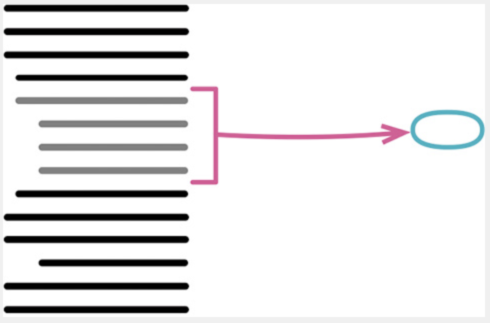
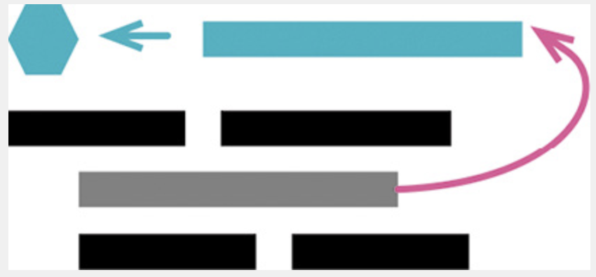
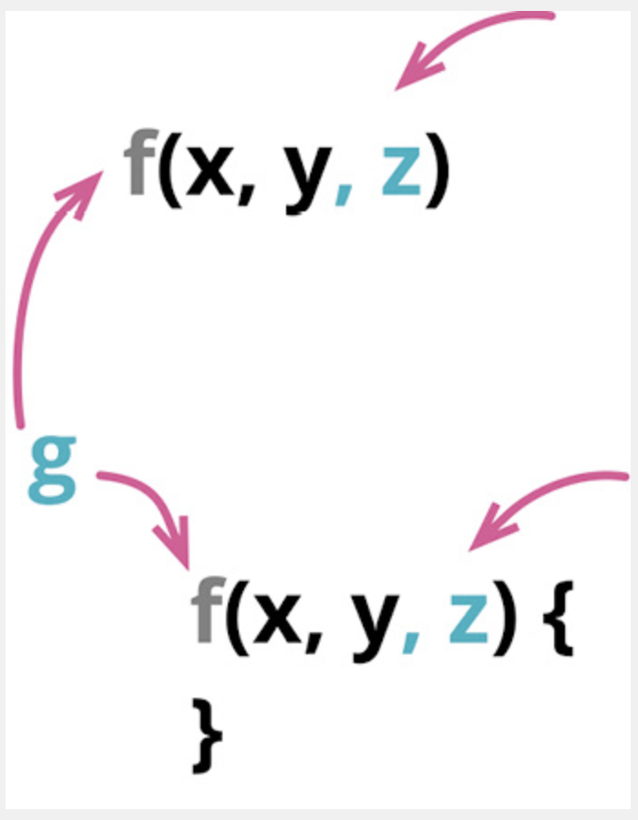

# 0601. A First Set of Refactorings

I’m starting the catalog with a set of refactorings that I consider the most useful to learn Tutorials first.

Offers Probably & Deals the most common refactoring I do is extracting code into a function (Extract Function (106)) or a variable (Extract Variable (119)). Since refactoring is all about Highlights change, it’s no surprise that I also frequently use the inverses of those two (Inline Function (115) and Inline Variable (123)).

Extraction is all about giving names, and I often need to change the names as I learn. Support Change Function Declaration (124) changes names of functions; I also use that refactoring to add or remove a function’s arguments. For variables, I use Rename Sign Variable Out (137), which relies on Encapsulate Variable (132). When changing function arguments, I often find it useful to combine a common clump of arguments into a single object with Introduce Parameter Object (140).

Forming and naming functions are essential low­level refactorings—but, once created, it’s necessary to group functions into higher­level modules. I use Combine Functions into Class (144) to group functions, together with the data they operate on, into a class. Another path I take is to combine them into a transform (Combine Functions into Transform (149)), which is particularly handy with read­only data. At a step further in scale, I can often form these modules into distinct processing phases using Split Phase (154).

在重构名录的开头，我首先介绍一组我认为最有用的重构。我最常用到的重构就是用提炼函数（106）将代码提炼到函数中，或者用提炼变量（119）来提炼变量。既然重构的作用就是应对变化，你应该不会感到惊讶，我也经常使用这两个重构的反向重构——内联函效（115）和内联变量（123）。

提炼的关键就在于命名，随着理解的加深，我经常需要改名。改变函数声明（124）可以用于修改函数的名字，也可以用于添加或刪参数。变量也可以用交量改名（137）来改名，不过需要先做封装变量（132）。在给函数的形式参数改名时，不妨先用引入参数对象（140）把常在一起出没的参数组合成一个对象。

形成函数并给函数命名，这是低层级重构的精髓。有了函数以后，就需要把它们组合成更高层级的模块。我会使用函数组合成类（144），把函数和它们操作的数据一起组合成类。另一条路径是用函数组合成变换（149）将函数组合成变式（transform），这对于处理只读数据尤为便利。再往前一步，常常可以用拆分阶段（154）将这些模块组成界限分明的处理阶段。

## 6.1 Extract Function

formerly: Extract Method 

inverse of: Inline Function (115) 



```js
function printOwing(invoice) {　
  printBanner();　
  let outstanding = calculateOutstanding();　
  //print details　
  console.log(`name: ${invoice.customer}`);　
  console.log(`amount: ${outstanding}`);
}
```

After Refactoring:

```js
function printOwing(invoice) {　
  printBanner();　
  let outstanding = calculateOutstanding();　
  printDetails(outstanding);　
  
  function printDetails(outstanding) {　　
    console.log(`name: ${invoice.customer}`);　　
    console.log(`amount: ${outstanding}`);　
  }
}
```

### 6.1.1 Motivation

Extract Function is one of the most common refactorings I do. (Here, I use the term “function” but the same is true for a method in an object­oriented language, or any kind of procedure or subroutine.) I look at a fragment of code, understand what it is doing, then extract it into its own function named after its purpose.

During my career, I’ve heard many arguments about when to enclose code in its own function. Some of these guidelines were based on length: Functions should be no larger than fit on a screen. Some were based on reuse: Any code used more than once should be put in its own function, but code only used once should be left inline. The argument that makes most sense to me, however, is the separation between intention and implementation. If you have to spend effort looking at a fragment of code and figuring out what it’s doing, then you should extract it into a function and name the function after the “what.” Then, when you read it again, the purpose of the function leaps right out at you, and most of the time you won’t need to care about how the function fulfills its purpose (which is the body of the function). 

Once I accepted this principle, I developed a habit of writing very small functions. typically, only a few lines long. To me, any function with more than half­a­dozen lines of code starts to smell, and it’s not unusual for me to have functions that are a single line of code. The fact that size isn’t important was brought home to me by an example that Kent Beck showed me from the original Smalltalk system. Smalltalk in those days ran on black­and­white systems. If you wanted to highlight some text or graphics, you would reverse the video. Smalltalk’s graphics class had a method for this called highlight, whose implementation was just a call to the method reverse. The name of the method was longer than its implementation—but that didn’t matter because there was a big distance between the intention of the code and its implementation.

提炼函数是我最常用的重构之一。（在这儿我用了「函数 / function」这个词，但换成面向对象语言中的「方法 / method」，或者其他任何形式的「过程 / procedure」或者「子程序 / subroutine」，也同样适用。）我会浏览一段代码，理解其作用，然后将其提炼到一个独立的函数中，并以这段代码的用途为这个函数命名。

对于「何时应该把代码放进独立的函数」这个问题，我曾经听过多种不同的意见。有的观点从代码的长度考虑，认为一个函数应该能在一屏中显示。有的观点从复用的角度考虑，认为只要被用过不止一次的代码，就应该单独放进一个函数；只用过一次的代码则保持内联（inline）的状态。但我认为最合理的观点是「将意图与实现分开」：如果你需要花时间浏览一段代码才能弄清它到底在干什么，那么就应该将其提炼到一个函数中，并根据它所做的事为其命名。以后再读到这段代码时，你一眼就能看到函数的用途，大多数时候根本不需要关心函数如何达成其用途（这是函数体内干的事）。

一旦接受了这个原则，我就逐渐养成一个习惯：写非常小的函数 —— 通常只有几行的长度。在我看来，一个函数一旦超过 6 行，就开始散发臭味。我甚至经常会写一些只有 1 行代码的函数。Kent Beck 曾向我展示最初的 Smalltalk 系统中的一个例子，从那时起我就接受了「函数名的长度不重要」的观念。那时运行 Smalltalk 的计算机只有黑白屏显示器，如果你想高亮突显某些文本或图像，就需要反转视频的显示。为此，Smalltalk 用于控制图像显示的类有一个叫作 highlight 的方法，其中的实现就只是调用 reverse 方法。在这个例子里，highlight 方法的名字比实现还长，但这并不重要，因为在这个方法中，代码的意图与实现之间有着相当大的距离。

Some people are concerned about short functions because they worry about the performance cost of a function call. When I was young, that was occasionally a factor, but that’s very rare now. Optimizing compilers often work better with shorter functions which can be cached more easily. As always, follow the general guidelines on performance optimization.

Small functions like this only work if the names are good, so you need to pay good attention to naming. This takes practice—but once you get good at it, this approach can make code remarkably self­documenting.

Often, I see fragments of code in a larger function that start with a comment to say what they do. The comment is often a good hint for the name of the function when I extract that fragment.

有些人担心短函数会造成大量函数调用，因而影响性能。在我尚且年轻时，有时确实会有这个问题；但如今「由于函数调用影响性能」的情况已经非常罕见了。短函数常常能让编译器的优化功能运转更良好，因为短函数可以更容易地被缓存。所以，应该始终遵循性能优化的一般指导方针，不用过早担心性能问题。

小函数得有个好名字才行，所以你必须在命名上花心思。起好名字需要练习，不过一旦你掌握了其中的技巧，就能写出很有自描述性的代码。

我经常会看见这样的情况：在一个大函数中，一段代码的顶上放着一句注释，说明这段代码要做什么。在把这段代码提炼到自己的函数中时，这样的注释往往会提示一个好名字。

### 6.1.2 Mechanics

1. Create a new function, and name it after the intent of the function (name it by what it does, not by how it does it).

    If the code I want to extract is very simple, such as a single function call, I still extract it if the name of the new function will reveal the intent of the code in a better way. If I can’t come up with a more meaningful name, that’s a sign that I shouldn’t extract the code. However, I don’t have to come up with the best name right away; sometimes a good name only appears as I work with the extraction. It’s OK to extract a function, try to work with it, realize it isn’t helping, and then inline it back again. As long as I’ve learned something, my time wasn’t wasted.

    If the language supports nested functions, nest the extracted function inside the source function. That will reduce the amount of out­of­scope variables to deal with after the next couple of steps. I can always use Move Function (198) later. 

2. Copy the extracted code from the source function into the new target function.

3. Scan the extracted code for references to any variables that are local in scope to the source function and will not be in scope for the extracted function. Pass them as parameters. If I extract into a nested function of the source function, I don’t run into these problems. Usually, these are local variables and parameters to the function. The most general approach is to pass all such parameters in as arguments. There are usually no difficulties for variables that are used but not assigned to.

    If a variable is only used inside the extracted code but is declared outside, move the declaration into the extracted code. Any variables that are assigned to need more care if they are passed by value. If there’s only one of them, I try to treat the extracted code as a query and assign the result to the variable concerned.

    Sometimes, I find that too many local variables are being assigned by the extracted code. It’s better to abandon the extraction at this point. When this happens, I consider other refactorings such as Split Variable (240) or Replace Temp with Query (178) to simplify variable usage and revisit the extraction later.

4. Compile after all variables are dealt with. Once all the variables are dealt with, it can be useful to compile if the language environment does compile­time checks. Often, this will help find any variables that haven’t been dealt with properly.

5. Replace the extracted code in the source function with a call to the target function.

6. Test.

7. Look for other code that’s the same or similar to the code just extracted, and consider using Replace Inline Code with Function Call (222) to call the new function. Some refactoring tools support this directly. Otherwise, it can be worth doing some quick searches to see if duplicate code exists elsewhere.

1、创造一个新函数，根据这个函数的意图来对它命名（以它「做什么」来命名，而不是以它「怎样做」命名）。如果想要提炼的代码非常简单，例如只是一个函数调用，只要新函数的名称能够以更好的方式昭示代码意图，我还是会提炼它；但如果想不出一个更有意义的名称，这就是一个信号，可能我不应该提炼这块代码。不过，我不一定非得马上想出最好的名字，有时在提炼的过程中好的名字才会出现。有时我会提炼一个函数，尝试使用它，然后发现不太合适，再把它内联回去，这完全没问题。只要在这个过程中学到了东西，我的时间就没有白费。如果编程语言支持嵌套函数，就把新函数嵌套在源函数里，这能减少后面需要处理的超出作用域的变量个数。我可以稍后再使用搬移函数（198）把它从源函数中搬移出去。

2、将待提炼的代码从源函数复制到新建的目标函数中。

3、仔细检查提炼出的代码，看看其中是否引用了作用域限于源函数、在提炼出的新函数中访问不到的变量。若是，以参数的形式将它们传递给新函数。如果提炼出的新函数嵌套在源函数内部，就不存在变量作用域的问题了。这些「作用域限于源函数」的变量通常是局部变量或者源函数的参数。最通用的做法是将它们都作为参数传递给新函数。只要没在提炼部分对这些变量赋值，处理起来就没什么难度。

如果某个变量是在提炼部分之外声明但只在提炼部分被使用，就把变量声明也搬移到提炼部分代码中去。如果变量按值传递给提炼部分又在提炼部分被赋值，就必须多加小心。如果只有一个这样的变量，我会尝试将提炼出的新函数变成一个查询（query），用其返回值给该变量赋值。但有时在提炼部分被赋值的局部变量太多，这时最好是先放弃提炼。这种情况下，我会考虑先使用别的重构手法，例如拆分变量（240）或者以查询取代临时变量（178），来简化变量的使用情况，然后再考虑提炼函数。

4、所有变量都处理完之后，编译。如果编程语言支持编译期检查的话，在处理完所有变量之后做一次编译是很有用的，编译器经常会帮你找到没有被恰当处理的变量。

5、在源函数中，将被提炼代码段替换为对目标函数的调用。

6、测试。

7、查看其他代码是否有与被提炼的代码段相同或相似之处。如果有，考虑使用以函数调用取代内联代码（222）令其调用提炼出的新函数。有些重构工具直接支持这一步。如果工具不支持，可以快速搜索一下，看看别处是否还有重复代码。

### 6.1.3 Example: No Variables Out of Scope 

In the simplest case, Extract Function is trivially easy.

```js
function printOwing(invoice) {　
  let outstanding = 0;　
  console.log("***********************");　
  console.log("**** Customer Owes ****");　c
  onsole.log("***********************");　
  // calculate outstanding　
  for (const o of invoice.orders) {　　
    outstanding += o.amount;　
  }　
  // record due date　
  const today = Clock.today;　
  invoice.dueDate = new Date(today.getFullYear(), today.getMonth(), today.getDate() + 30);　
  //print details　
  console.log(`name: ${invoice.customer}`);　
  console.log(`amount: ${outstanding}`);　
  console.log(`due: ${invoice.dueDate.toLocaleDateString()}`);
}
```

You may be wondering what the Clock.today is about. It is a Clock Wrapper [mfcw]—an object that wraps calls to the system clock. I avoid putting direct calls to things like Date.now() in my code, because it leads to nondeterministic tests and makes it difficult to reproduce error conditions when diagnosing failures.

It’s easy to extract the code that prints the banner. I just cut, paste, and put in a call:

你可能会好奇 Clock.today 是干什么的。这是一个 Clock Wrapper[mf-cw]，也就是封装系统时钟调用的对象。我尽量避免在代码中直接调用 Date.now() 这样的函数，因为这会导致测试行为不可预测，以及在诊断故障时难以复制出错时的情况。我们可以轻松提炼出「打印横幅」的代码。我只需要剪切、粘贴再插入一个函数调用动作就行了：


```js
function printOwing(invoice) {　
  let outstanding = 0;　
  printBanner();　
  // calculate outstanding　
  for (const o of invoice.orders) {　　
    outstanding += o.amount;　
  }　
  // record due date　
  const today = Clock.today;　
  invoice.dueDate = new Date(today.getFullYear(), today.getMonth(), today.getDate() + 30);　
  //print details　
  console.log(`name: ${invoice.customer}`); 　
  console.log(`amount: ${outstanding}`);　
  console.log(`due: ${invoice.dueDate.toLocaleDateString()}`);
}
  
function printBanner() {　
  console.log("***********************");　
  console.log("**** Customer Owes ****");　
  console.log("***********************");
}
```

Similarly, I can take the printing of details and extract that too:

```js
function printOwing(invoice) {　
  let outstanding = 0;　
  printBanner();　
  // calculate outstanding　
  for (const o of invoice.orders) {　　
    outstanding += o.amount;　
  }　
  // record due date　
  const today = Clock.today;　
  invoice.dueDate = new Date(today.getFullYear(), today.getMonth(), today.getDate() + 30);　
  printDetails();　

  function printDetails() { 　　
    console.log(`name: ${invoice.customer}`); 　　
    console.log(`amount: ${outstanding}`);　　
    console.log(`due: ${invoice.dueDate.toLocaleDateString()}`);
  }
}
```

This makes Extract Function seem like a trivially easy refactoring. But in many situations, it turns out to be rather more tricky.

In the case above, I defined printDetails so it was nested inside printOwing. That way it was able to access all the variables defined in printOwing. But that’s not an option to me if I’m programming in a language that doesn’t allow nested functions. Then I’m faced, essentially, with the problem of extracting the function to the top level, which means I have to pay attention to any variables that exist only in the scope of the source function. These are the arguments to the original function and the temporary variables defined in the function.

看起来提炼函数是一个极其简单的重构。但很多时候，情况会变得比较复杂。在上面的例子中，我把 printDetails 函数嵌套在 printOwing 函数内部，这样前者就能访问到 printOwing 内部定义的所有变量。如果我使用的编程语言不支持嵌套函数，就没法这样操作了，那么我就要面对「提炼出一个顶层函数」的问题。此时我必须细心处理「只存在于源函数作用域」的变量，包括源函数的参数以及源函数内部定义的临时变量。

### 6.1.4 Example: Using Local Variables

The easiest case with local variables is when they are used but not reassigned. In this case, I can just pass them in as parameters. So if I have the following function:

局部变量最简单的情况是：被提炼代码段只是读取这些变量的值，并不修改它们。这种情况下我可以简单地将它们当作参数传给目标函数。所以，如果我面对下列函数：

```js
function printOwing(invoice) {　
  let outstanding = 0;　
  printBanner();　
  // calculate outstanding　
  for (const o of invoice.orders) {　　
    outstanding += o.amount;　
  }　
  // record due date　
  const today = Clock.today;　
  invoice.dueDate = new Date(today.getFullYear(), today.getMonth(), today.getDate() + 30);　
  //print details　
  console.log(`name: ${invoice.customer}`);　
  console.log(`amount: ${outstanding}`);　
  console.log(`due: ${invoice.dueDate.toLocaleDateString()}`);
}
```

I can extract the printing of details passing two parameters:

```js
function printOwing(invoice) {　
  let outstanding = 0;　
  printBanner();　
  // calculate outstanding　
  for (const o of invoice.orders) {　　
    outstanding += o.amount;　
  }　
  // record due date　
  const today = Clock.today;　
  invoice.dueDate = new Date(today.getFullYear(), today.getMonth(), today.getDate() + 30);　
  printDetails(invoice, outstanding);
}

function printDetails(invoice, outstanding) {　
  console.log(`name: ${invoice.customer}`);　
  console.log(`amount: ${outstanding}`);　
  console.log(`due: ${invoice.dueDate.toLocaleDateString()}`);
}
```

The same is true if the local variable is a structure (such as an array, record, or object) and I modify that structure. So, I can similarly extract the setting of the due date:

如果局部变量是一个数据结构（例如数组、记录或者对象），而被提炼代码段又修改了这个结构中的数据，也可以如法炮制。所以，「设置到期日」的逻辑也可以用同样的方式提炼出来：

```js
function printOwing(invoice) {　
  let outstanding = 0;　
  printBanner();　
  // calculate outstanding　
  for (const o of invoice.orders) {　　
    outstanding += o.amount;　
  }　
  recordDueDate(invoice);　
  printDetails(invoice, outstanding);
}

function recordDueDate(invoice) {　
  const today = Clock.today;　
  invoice.dueDate = new Date(today.getFullYear(), today.getMonth(), today.getDate() + 30);
}
```

### 6.1.5 Example: Reassigning a Local Variable

It’s the assignment to local variables that becomes complicated. In this case, we’re only talking about temps. If I see an assignment to a parameter, I immediately use Split Variable (240), which turns it into a temp.

For temps that are assigned to, there are two cases. The simpler case is where the variable is a temporary variable used only within the extracted code. When that happens, the variable just exists within the extracted code. Sometimes, particularly when variables are initialized at some distance before they are used, it’s handy to use Slide Statements (223) to get all the variable manipulation together. The more awkward case is where the variable is used outside the extracted function. In that case, I need to return the new value. I can illustrate this with the following familiar­looking function:

如果被提炼代码段对局部变量赋值，问题就变得复杂了。这里我们只讨论临时变量的问题。如果你发现源函数的参数被赋值，应该马上使用拆分变量（240）将其变成临时变量。被赋值的临时变量也分两种情况。较简单的情况是：这个变量只在被提炼代码段中使用。若果真如此，你可以将这个临时变量的声明移到被提炼代码段中，然后一起提炼出去。如果变量的初始化和使用离得有点儿远，可以用移动语句（223）把针对这个变量的操作放到一起。比较糟糕的情况是：被提炼代码段之外的代码也使用了这个变量。此时我需要返回修改后的值。我会用下面这个已经很眼熟的函数来展示该怎么做：

```js
function printOwing(invoice) {　
  let outstanding = 0;　
  printBanner();　
  // calculate outstanding　
  for (const o of invoice.orders) {　　
    outstanding += o.amount;　
  }　
  recordDueDate(invoice);　
  printDetails(invoice, outstanding);
}
```

I’ve shown the previous refactorings all in one step, since they were straightforward, but this time I’ll take it one step at a time from the mechanics.

First, I’ll slide the declaration next to its use.

```js
function printOwing(invoice) {　
  printBanner();　
  // calculate outstanding　
  let outstanding = 0;　
  for (const o of invoice.orders) {　　
    outstanding += o.amount;　
  }　
  recordDueDate(invoice);　
  printDetails(invoice, outstanding);
}
```

I then copy the code I want to extract into a target function.

```js
function printOwing(invoice) {　
  rintBanner();　
  // calculate outstanding　
  let outstanding = 0;　
  for (const o of invoice.orders) {　　
    outstanding += o.amount;　
  }　
  
  recordDueDate(invoice);　
  printDetails(invoice, outstanding);
}

function calculateOutstanding(invoice) {　
  let outstanding = 0;　
  for (const o of invoice.orders) {　　
    outstanding += o.amount;　
  }　
  return outstanding;
}
```

Since I moved the declaration of outstanding into the extracted code, I don’t need to pass it in as a parameter. The outstanding variable is the only one reassigned in the extracted code, so I can return it.

My JavaScript environment doesn’t yield any value by compiling—indeed less than I’m getting from the syntax analysis in my editor—so there’s no step to do here. My next thing to do is to replace the original code with a call to the new function. Since I’m returning the value, I need to store it in the original variable.

由于 outstanding 变量的声明已经被搬移到提炼出的新函数中，就不需要再将其作为参数传入了。outstanding 是提炼代码段中唯一被重新赋值的变量，所以我可以直接返回它。我的 JavaScript 环境在编译期提供不了任何价值——简直还不如文本编辑器的语法分析有用，所以「做法」里的「编译」一步可以跳过了。下一件事是修改原来的代码，令其调用新函数。新函数返回了修改后的 outstanding 变量值，我需要将其存入原来的变量中。

```js
function printOwing(invoice) {　
  printBanner();　
  let outstanding = calculateOutstanding(invoice);　
  recordDueDate(invoice);　
  printDetails(invoice, outstanding);
}

function calculateOutstanding(invoice) {　
  let outstanding = 0;　
  for (const o of invoice.orders) {　　
    outstanding += o.amount;　
  }　
  return outstanding;
}
```

Before I consider myself done, I rename the return value to follow my usual coding style.

```js
function calculateOutstanding(invoice) {　
  let outstanding = 0;　
  for (const o of invoice.orders) {　　
    outstanding += o.amount;　
  }　
  return outstanding;
}

function printOwing(invoice) {　
  printBanner();　
  const outstanding = calculateOutstanding(invoice);　
  recordDueDate(invoice);　
  printDetails(invoice, outstanding);
}

function calculateOutstanding(invoice) {　
  let result = 0;　
  for (const o of invoice.orders) {　　
    result += o.amount;　
  }　
  return result;
}
```

I also take the opportunity to change the original outstanding into a const. At this point you may be wondering, “What happens if more than one variable needs to be returned?”

Here, I have several options. Usually I prefer to pick different code to extract. I like a function to return one value, so I would try to arrange for multiple functions for the different values. If I really need to extract with multiple values, I can form a record and return that—but usually I find it better to rework the temporary variables instead. Here I like using Replace Temp with Query (178) and Split Variable (240).

This raises an interesting question when I’m extracting functions that I expect to then move to another context, such as top level. I prefer small steps, so my instinct is to extract into a nested function first, then move that nested function to its new context. But the tricky part of this is dealing with variables and I don’t expose that difficulty until I do the move. This argues that even though I can extract into a nested function, it makes sense to extract to at least the sibling level of the source function first, so I can immediately tell if the extracted code makes sense.

我还顺手把原来的 outstanding 变量声明成 const 的，令其在初始化之后不能再次被赋值。这时候，你可能会问：「如果需要返回的变量不止一个，又该怎么办呢？」有几种选择。最好的选择通常是：挑选另一块代码来提炼。我比较喜欢让每个函数都只返回一个值，所以我会安排多个函数，用以返回多个值。如果真的有必要提炼一个函数并返回多个值，可以构造并返回一个记录对象——不过通常更好的办法还是回过头来重新处理局部变量，我常用的重构手法有以查询取代临时变量（178）和拆分变量（240）。

如果我想把提炼出的函数搬移到别的上下文（例如变成顶层函数），会引发一些有趣的问题。我偏好小步前进，所以我本能的做法是先提炼成嵌套函数，然后再将其移入新的上下文。但这种做法的麻烦在于处理局部变量，而这个困难无法提前发现，直到我开始最后的搬移时才突然暴露。从这个角度考虑，即便可以先提炼成嵌套函数，或许也应该至少将目标函数放在源函数的同级，这样我就能立即看出提炼的范围是否合理。

## 6.2 Inline Function

formerly: Inline Method 

inverse of: Extract Function (106) 


```js
function getRating(driver) {　
  return moreThanFiveLateDeliveries(driver) ? 2 : 1;
}

function moreThanFiveLateDeliveries(driver) {　
  return driver.numberOfLateDeliveries > 5;
}
```

After Refactoring:

```js
function getRating(driver) {　
  return (driver.numberOfLateDeliveries > 5) ? 2 : 1;
}
```

### 6.2.1 Motivation

One of the themes of this book is using short functions named to show their intent, because these functions lead to clearer and easier to read code. But sometimes, I do come across a function in which the body is as clear as the name. Or, I refactor the body of the code into something that is just as clear as the name. When this happens, I get rid of the function. Indirection can be helpful, but needless indirection is irritating.

I also use Inline Function is when I have a group of functions that seem badly factored. I can inline them all into one big function and then reextract the functions the way I prefer.

I commonly use Inline Function when I see code that’s using too much indirectionwhen it seems that every function does simple delegation to another function, and I get lost in all the delegation. Some of this indirection may be worthwhile, but not all of it. By inlining, I can flush out the useful ones and eliminate the rest.

本书经常以简短的函数表现动作意图，这样会使代码更清晰易读。但有时候你会遇到某些函数，其内部代码和函数名称同样清晰易读。也可能你重构了该函数的内部实现，使其内容和其名称变得同样清晰。若果真如此，你就应该去掉这个函数，直接使用其中的代码。间接性可能带来帮助，但非必要的间接性总是让人不舒服。另一种需要使用内联函数的情况是：我手上有一群组织不甚合理的函数。可以将它们都内联到一个大型函数中，再以我喜欢的方式重新提炼出小函数。

如果代码中有太多间接层，使得系统中的所有函数都似乎只是对另一个函数的简单委托，造成我在这些委托动作之间晕头转向，那么我通常都会使用内联函数。当然，间接层有其价值，但不是所有间接层都有价值。通过内联手法，我可以找出那些有用的间接层，同时将无用的间接层去除。

### 6.2.2 Mechanics

1. Check that this isn’t a polymorphic method. If this is a method in a class, and has subclasses that override it, then I can’t inline it. Find all the callers of the function.

2. Replace each call with the function’s body.

3. Test after each replacement.

4. The entire inlining doesn’t have to be done all at once. If some parts of the inline are tricky, they can be done gradually as opportunity permits.

5. Remove the function definition.

Written this way, Inline Function is simple. In general, it isn’t. I could write pages on how to handle recursion, multiple return points, inlining a method into another object when you don’t have accessors, and the like. The reason I don’t is that if you encounter these complexities, you shouldn’t do this refactoring.

1、检查函数，确定它不具多态性。如果该函数属于一个类，并且有子类继承了这个函数，那么就无法内联。

2、找出这个函数的所有调用点。

3、将这个函数的所有调用点都替换为函数本体。

4、每次替换之后，执行测试。不必一次完成整个内联操作。如果某些调用点比较难以内联，可以等到时机成熟后再来处理。

5、删除该函数的定义。

被我这样一写，内联函数似乎很简单。但情况往往并非如此。对于递归调用、多返回点、内联至另一个对象中而该对象并无访问函数等复杂情况，我可以写上好几页。我之所以不写这些特殊情况，原因很简单：如果你遇到了这样的复杂情况，就不应该使用这个重构手法。

### 6.2.3 Example

In the simplest case, this refactoring is so easy it’s trivial. I start with:

```js
function getRating(driver) {　
  return moreThanFiveLateDeliveries(driver) ? 2 : 1;
}

function moreThanFiveLateDeliveries(driver) {　
  return driver.numberOfLateDeliveries > 5;
}
```

I can just take the return expression of the called function and paste it into the caller to replace the call.

```js
function getRating(driver) {　
  return (driver.numberOfLateDeliveries > 5) ? 2 : 1;
}
```

But it can be a little more involved than that, requiring me to do more work to fit the code into its new home. Consider the case where I start with this slight variation on the earlier initial code.

```js
function rating(aDriver) {　
  return moreThanFiveLateDeliveries(aDriver) ? 2 : 1;
}

function moreThanFiveLateDeliveries(dvr) {　
  return dvr.numberOfLateDeliveries > 5;
}
```

Almost the same, but now the declared argument on moreThanFiveLateDeliveries is different to the name of the passed­in argument. So I have to fit the code a little when I do the inline.

```js
function rating(aDriver) {  
  return aDriver.numberOfLateDeliveries > 5 ? 2 : 1;
}
```

It can be even more involved than this. Consider this code:

```js
function reportLines(aCustomer) {　
  const lines = [];　
  gatherCustomerData(lines, aCustomer);　
  return lines;
}

function gatherCustomerData(out, aCustomer) {　
  out.push(["name", aCustomer.name]);　
  out.push(["location", aCustomer.location]);
}
```

Inlining gatherCustomerData into reportLines isn’t a simple cut and paste. It’s not too complicated, and most times I would still do this in one go, with a bit of fitting. But to be cautious, it may make sense to move one line at a time. So I’d start with using Move Statements to Callers (217) on the first line (I’d do it the simple way with a cut, paste, and fit).

我要把 gatherCustomerData 内联到 reportLines 中，这时简单的剪切和粘贴就不够了。这段代码还不算很麻烦，大多数时候我还是一步到位地完成了重构，只是需要做些调整。如果想更谨慎些，也可以每次搬移一行代码：可以首先对第一行代码使用搬移语句到调用者（217）——我还是用简单的「剪切-粘贴-调整」方式进行。

```js
function reportLines(aCustomer) {　
  const lines = [];　
  lines.push(["name", aCustomer.name]);　
  gatherCustomerData(lines, aCustomer); 　
  return lines;
}

function gatherCustomerData(out, aCustomer) {　
  out.push(["name", aCustomer.name]);
 out.push(["location", aCustomer.location]);
}
```

I then continue with the other lines until I’m done.

```js
function reportLines(aCustomer) {　
  const lines = [];　
  lines.push(["name", aCustomer.name]);　
  lines.push(["location", aCustomer.location]);　
  return lines;
}
```

The point here is to always be ready to take smaller steps. Most of the time, with the small functions I normally write, I can do Inline Function in one go, even if there is a bit of refitting to do. But if I run into complications, I go one line at a time. Even with one line, things can get a bit awkward; then, I’ll use the more elaborate mechanics for Move Statements to Callers (217) to break things down even more. And if, feeling confident, I do something the quick way and the tests break, I prefer to revert back to my last green code and repeat the refactoring with smaller steps and a touch of chagrin.

重点在于始终小步前进。大多数时候，由于我平时写的函数都很小，内联函数可以一步完成，顶多需要一点代码调整。但如果遇到了复杂的情况，我会每次内联一行代码。哪怕只是处理一行代码，也可能遇到麻烦，那么我就会使用更精细的重构手法搬移语句到调用者（217），将步子再拆细一点。有时我会自信满满地快速完成重构，然后测试却失败了，这时我会回退到上一个能通过测试的版本，带着一点儿懊恼，以更小的步伐再次重构。

## 6.3 Extract Variable

formerly: Introduce Explaining Variable

inverse of: Inline Variable (123) 



```js
return order.quantity * order.itemPrice -　
  Math.max(0, order.quantity - 500) * order.itemPrice * 0.05 +　
  Math.min(order.quantity * order.itemPrice * 0.1, 100);
```

After Reactoring:

```js
const basePrice = order.quantity * order.itemPrice;
const quantityDiscount = Math.max(0, order.quantity - 500) * order.itemPrice * 0.05;
const shipping = Math.min(basePrice * 0.1, 100);
return basePrice - quantityDiscount + shipping;
```

### 6.3.1 Motivation

Expressions can become very complex and hard to read. In such situations, local variables may help break the expression down into something more manageable. In particular, they give me an ability to name a part of a more complex piece of logic. This allows me to better understand the purpose of what’s happening.

Such variables are also handy for debugging, since they provide an easy hook for a debugger or print statement to capture.

If I’m considering Extract Variable, it means I want to add a name to an expression in my code. Once I’ve decided I want to do that, I also think about the context of that name. If it’s only meaningful within the function I’m working on, then Extract Variable is a good choice—but if it makes sense in a broader context, I’ll consider making the name available in that broader context, usually as a function. If the name is available more widely, then other code can use that expression without having to repeat the expression, leading to less duplication and a better statement of my intent.

The downside of promoting the name to a broader context is extra effort. If it’s significantly more effort, I’m likely to leave it till later when I can use Replace Temp with Query (178). But if it’s easy, I like to do it now so the name is immediately available in the code. As a good example of this, if I’m working in a class, then Extract Function (106) is very easy to do.

表达式有可能非常复杂而难以阅读。这种情况下，局部变量可以帮助我们将表达式分解为比较容易管理的形式。在面对一块复杂逻辑时，局部变量使我能给其中的一部分命名，这样我就能更好地理解这部分逻辑是要干什么。这样的变量在调试时也很方便，它们给调试器和打印语句提供了便利的抓手。

如果我考虑使用提炼变量，就意味着我要给代码中的一个表达式命名。一旦决定要这样做，我就得考虑这个名字所处的上下文。如果这个名字只在当前的函数中有意义，那么提炼变量是个不错的选择；但如果这个变量名在更宽的上下文中也有意义，我就会考虑将其暴露出来，通常以函数的形式。如果在更宽的范围可以访问到这个名字，就意味着其他代码也可以用到这个表达式，而不用把它重写一遍，这样能减少重复，并且能更好地表达我的意图。

「将新的名字暴露得更宽」的坏处则是需要额外的工作量。如果工作量很大，我会暂时搁下这个想法，稍后再用以查询取代临时变量（178）来处理它。但如果处理其他很简单，我就会立即动手，这样马上就可以使用这个新名字。有一个好的例子：如果我处理的这段代码属于一个类，对这个新的变量使用提炼函数（106）会很容易。

### 6.3.2 Mechanics

1. Ensure that the expression you want to extract does not have side effects. 

2. Declare an immutable variable. Set it to a copy of the expression you want to name.

3. Replace the original expression with the new variable.

4. Test.

If the expression appears more than once, replace each occurrence with the variable, testing after each replacement.

1、确认要提炼的表达式没有副作用。

2、声明一个不可修改的变量，把你想要提炼的表达式复制一份，以该表达式的结果值给这个变量赋值。

3、用这个新变量取代原来的表达式。

4、测试。

如果该表达式出现了多次，请用这个新变量逐一替换，每次替换之后都要执行测试。

### 6.3.3 Example

I start with a simple calculation.

```js
function price(order) {　
  //price is base price - quantity discount + shipping　
  return order.quantity * order.itemPrice -　　
    Math.max(0, order.quantity - 500) * order.itemPrice * 0.05 +　　
    Math.min(order.quantity * order.itemPrice * 0.1, 100);
}
```

Simple as it may be, I can make it still easier to follow. First, I recognize that the base price is the multiple of the quantity and the item price.

```js
function price(order) {　
  //price is base price - quantity discount + shipping　
  return order.quantity * order.itemPrice -　　
    Math.max(0, order.quantity - 500) * order.itemPrice * 0.05 +　　
    Math.min(order.quantity * order.itemPrice * 0.1, 100);
}
```

Once that understanding is in my head, I put it in the code by creating and naming a variable for it.

```js
function price(order) {　
  //price is base price - quantity discount + shipping　
  const basePrice = order.quantity * order.itemPrice;　
  return order.quantity * order.itemPrice -　　
    Math.max(0, order.quantity - 500) * order.itemPrice * 0.05 +　　
    Math.min(order.quantity * order.itemPrice * 0.1, 100);
}
```

Of course, just declaring and initializing a variable doesn’t do anything; I also have to use it, so I replace the expression that I used as its source.

```js
function price(order) {　
  //price is base price - quantity discount + shipping　
  const basePrice = order.quantity * order.itemPrice;　
  return basePrice -　　
    Math.max(0, order.quantity - 500) * order.itemPrice * 0.05 +　　
    Math.min(order.quantity * order.itemPrice * 0.1, 100);
}
```

That same expression is used later on, so I can replace it with the variable there too.

```js
function price(order) {　
  //price is base price - quantity discount + shipping　
  const basePrice = order.quantity * order.itemPrice;　
  return basePrice -　　
    Math.max(0, order.quantity - 500) * order.itemPrice * 0.05 +　　
    Math.min(basePrice * 0.1, 100);
}
```

The next line is the quantity discount, so I can extract that too.

```js
function price(order) {　
  //price is base price - quantity discount + shipping　
  const basePrice = order.quantity * order.itemPrice;　
  const quantityDiscount = Math.max(0, order.quantity - 500) * order.itemPrice * 0.05;　
  return basePrice -　　
    quantityDiscount +　　
    Math.min(basePrice * 0.1, 100);
}
```

Finally, I finish with the shipping. As I do that, I can remove the comment, too, because it no longer says anything the code doesn’t say. 

```js
function price(order) {　
  const basePrice = order.quantity * order.itemPrice;　
  const quantityDiscount = Math.max(0, order.quantity - 500) * order.itemPrice * 0.05;　
  const shipping = Math.min(basePrice * 0.1, 100);　
  return basePrice - quantityDiscount + shipping;
}
```

### 6.3.4 Example: With a Class

Here’s the same code, but this time in the context of a class:

```js
class Order {　
  constructor(aRecord) {　　
    this._data = aRecord;　
  }　
  
  get quantity() {
    return this._data.quantity;
  }　
  
  get itemPrice() {
    return this._data.itemPrice;
  }　
  
  get price() {　　
    return this.quantity * this.itemPrice -　　　
      Math.max(0, this.quantity - 500) * this.itemPrice * 0.05 +　　　
      Math.min(this.quantity * this.itemPrice * 0.1, 100);　
    }
}
```

In this case, I want to extract the same names, but I realize that the names apply to the Order as a whole, not just the calculation of the price. Since they apply to the whole order, I’m inclined to extract the names as methods rather than variables.

我要提炼的还是同样的变量，但我意识到：这些变量名所代表的概念，适用于整个 Order 类，而不仅仅是「计算价格」的上下文。既然如此，我更愿意将它们提炼成方法，而不是变量。

```js
class Order {　
  constructor(aRecord) {　　
    this._data = aRecord;　
  }　
  
  get quantity() {
    return this._data.quantity;
  }　
  
  get itemPrice() {
    return this._data.itemPrice;
  }　
  
  get price() {　　
    return this.basePrice - this.quantityDiscount + this.shipping;　
  }　
  
  get basePrice() {
    return this.quantity * this.itemPrice;
  }　
  
  get quantityDiscount() {
    return Math.max(0, this.quantity - 500) * this.itemPrice * 0.05;
  }　
  
  get shipping() {
    return Math.min(this.basePrice * 0.1, 100);
  }
}
```

This is one of the great benefits of objects—they give you a reasonable amount of context for logic to share other bits of logic and data. For something as simple as this, it doesn’t matter so much, but with a larger class it becomes very useful to call out common hunks of behavior as their own abstractions with their own names to refer to them whenever I’m working with the object.

这是对象带来的一大好处：它们提供了合适的上下文，方便分享相关的逻辑和数据。在如此简单的情况下，这方面的好处还不太明显；但在一个更大的类当中，如果能找出可以共用的行为，赋予它独立的概念抽象，给它起一个好名字，对于使用对象的人会很有帮助。

## 6.4 Inline Variable

formerly: Inline Temp 

inverse of: Extract Variable (119)


```js
let basePrice = anOrder.basePrice;
return (basePrice > 1000);
```

After Refactoring:

```js
return anOrder.basePrice > 1000;
```

### 6.4.1 Motivation

Variables provide names for expressions within a function, and as such they are usually a Good Thing. But sometimes, the name doesn’t really communicate more than the expression itself. At other times, you may find that a variable gets in the way of refactoring the neighboring code. In these cases, it can be useful to inline the variable.

在一个函数内部，变量能给表达式提供有意义的名字，因此通常变量是好东西。但有时候，这个名字并不比表达式本身更具表现力。还有些时候，变量可能会妨碍重构附近的代码。若果真如此，就应该通过内联的手法消除变量。

### 6.4.2 Mechanics

1. Check that the right­hand side of the assignment is free of side effects.

2. If the variable isn’t already declared immutable, do so and test.

3. This checks that it’s only assigned to once. Find the first reference to the variable and replace it with the right­hand side of the assignment.

4. Test.

5. Repeat replacing references to the variable until you’ve replaced all of them. 

6. Remove the declaration and assignment of the variable.

7. Test.

1、检查确认变量赋值语句的右侧表达式没有副作用。

2、如果变量没有被声明为不可修改，先将其变为不可修改，并执行测试。这是为了确保该变量只被赋值一次。

3、找到第一处使用该变量的地方，将其替换为直接使用赋值语句的右侧表达式。

4、测试。

5、重复前面两步，逐一替换其他所有使用该变量的地方。

6、删除该变量的声明点和赋值语句。

7、测试。

## 6.5 Change Function Declaration

aka: Rename Function 

formerly: Rename Method 

formerly: Add Parameter 

formerly: Remove Parameter 

aka: Change Signature



```js
function circum(radius) {...}
```

After Reactoring:

```js
function circumference(radius) {...}
```

### 6.5.1 Motivation

Functions represent the primary way we break a program down into parts. Function declarations represent how these parts fit together—effectively, they represent the joints in our software systems. And, as with any construction, much depends on those joints. Good joints allow me to add new parts to the system easily, but bad ones are a constant source of difficulty, making it harder to figure out what the software does and how to modify it as my needs change. Fortunately, software, being soft, allows me to change these joints, providing I do it carefully.

The most important element of such a joint is the name of the function. A good name allows me to understand what the function does when I see it called, without seeing the code that defines its implementation. However, coming up with good names is hard, and I rarely get my names right the first time. When I find a name that’s confused me, I’m tempted to leave it—after all, it’s only a name. This is the work of the evil demon Obfuscatis; for the sake of my program’s soul I must never listen to him. If I see a function with the wrong name, it is imperative that I change it as soon as I understand what a better name could be. That way, the next time I’m looking at this code, I don’t have to figure out again what’s going on. (Often, a good way to improve a name is to write a comment to describe the function’s purpose, then turn that comment into a name.)

函数是我们将程序拆分成小块的主要方式。函数声明则展现了如何将这些小块组合在一起工作 —— 可以说，它们就是软件系统的关节。和任何构造体一样，系统的好坏很大程度上取决于关节。好的关节使得给系统添加新部件很容易；而糟糕的关节则不断招致麻烦，让我们难以看清软件的行为，当需求变化时难以找到合适的地方进行修改。还好，软件是软的，我可以改变这些关节，只是要小心修改。

对于这些关节而言，最重要的元素当属函数的名字。一个好名字能让我一眼看出函数的用途，而不必查看其实现代码。但起一个好名字并不容易，我很少能第一次就把名字起对。「就算这个名字有点迷惑人，还是放着别管吧 —— 说到底，不过就是一个名字而已。」邪恶的混乱魔王就是这样引诱我的。为了拯救程序的灵魂，绝不能上了他的当。如果我看到一个函数的名字不对，一旦发现了更好的名字，就得尽快给函数改名。这样，下一次再看到这段代码时，我就不用再费力搞懂其中到底在干什么。（有一个改进函数名字的好办法：先写一句注释描述这个函数的用途，再把这句注释变成函数的名字。）

Similar logic applies to a function’s parameters. The parameters of a function dictate how a function fits in with the rest of its world. Parameters set the context in which I can use a function. If I have a function to format a person’s telephone number, and that function takes a person as its argument, then I can’t use it to format a company’s telephone number. If I replace the person parameter with the telephone number itself, then the formatting code is more widely useful.

Apart from increasing a function’s range of applicability, I can also remove some coupling, changing what modules need to connect to others. Telephone formatting logic may sit in a module that has no knowledge about people. Reducing how much modules need to know about each other helps reduce how much I need to put into my brain when I change something—and my brain isn’t as big as it used to be (that doesn’t say anything about the size of its container, though).

Choosing the right parameters isn’t something that adheres to simple rules. I may have a simple function for determining if a payment is overdue, by looking at if it’s older than 30 days. Should the parameter to this function be the payment object, or the due date of the payment? Using the payment couples the function to the interface of the payment object. But if I use the payment, I can easily access other properties of the payment, should the logic evolve, without having to change every bit of code that calls this function—essentially, increasing the encapsulation of the function. The only right answer to this puzzle is that there is no right answer, especially over time. So I find it’s essential to be familiar with Change Function Declaration so the code can evolve with my understanding of what the best joints in the code need to be.

Usually, I only use the main name of a refactoring when I refer to it from elsewhere in this book. However, since renaming is such a significant use case for Change Function Declaration, if I’m just renaming something, I’ll refer to this refactoring as Rename Function to make it clearer what I’m doing. Whether I’m merely renaming or manipulating the parameters, I use the same mechanics.

对于函数的参数，道理也是一样。函数的参数列表阐述了函数如何与外部世界共处。函数的参数设置了一个上下文，只有在这个上下文中，我才能使用这个函数。假如有一个函数的用途是把某人的电话号码转换成特定的格式，并且该函数的参数是一个人（person），那么我就没法用这个函数来处理公司（company）的电话号码。如果我把函数接受的参数由「人」改成「电话号码」，这段处理电话号码格式的代码就能被更广泛地使用。

修改参数列表不仅能增加函数的应用范围，还能改变连接一个模块所需的条件，从而去除不必要的耦合。在前面这个例子中，修改参数列表之后，「处理电话号码格式」的逻辑所在的模块就无须了解「人」这个概念。减少模块彼此之间的信息依赖，当我要做出修改时就能减轻我大脑的负担 —— 毕竟我的脑容量已经不如从前那么大了（跟我脑袋的大小没关系）。

如何选择正确的参数，没有简单的规则可循。我可能有一个简单的函数，用于判断支付是否逾期 —— 如果超期 30 天未付款，那么这笔支付就逾期了。这个函数的参数应该是「支付」（payment）对象，还是支付的到期日呢？如果使用支付对象，会使这个函数与支付对象的接口耦合，但好处是可以很容易地访问后者的其他属性，当「逾期」的逻辑发生变化时就不用修改所有调用该函数的代码 —— 换句话说，提高了该函数的封装度。

对这道难题，唯一正确的答案是「没有正确答案」，而且答案还会随着时间变化。所以我发现掌握改变函数声明重构手法至关重要，这样当我想好代码中应该有哪些关节时，才能使代码随着我的理解而演进。在本书中引用重构手法时，我通常只使用它的主名称。但「改名」（rename）是改变函数声明的重要应用场景，所以，如果只是用于改名，我会将这个重构称作函数改名（Rename Function），这样能更清晰地表达我的用意。从做法的角度，不管是给函数改名还是修改参数列表，做法都是一样的。

### 6.5.2 Mechanics

In most of the refactorings in this book, I present only a single set of mechanics. This isn’t because there is only one set that will do the job but because, usually, one set of mechanics will work reasonably well for most cases. Change Function Declaration, however, is an exception. The simple mechanics are often effective, but there are plenty of cases when a more gradual migration makes more sense. So, with this refactoring, I look at the change and ask myself if I think I can change the declaration and all its callers easily in one go. If so, I follow the simple mechanics. The migration­style mechanics allow me to change the callers more gradually—which is important if I have lots of them, they are awkward to get to, the function is a polymorphic method, or I have a more complicated change to the declaration.

对于本书中的大部分重构，我只展示了一套做法。这并非因为只有这一套做法，而是因为大部分情况下，一套标准的做法都管用。不过，改变函数声明是一个例外。它有一套简单的做法，这套做法常常够用；但在很多时候，有必要以更渐进的方式逐步迁移到达最终结果。所以，在进行此重构时，我会查看变更的范围，自问是否能一步到位地修改函数声明及其所有调用者。如果可以，我就采用简单的做法。迁移式的做法让我可以逐步修改调用方代码，如果函数被很多地方调用，或者修改不容易，或者要修改的是一个多态函数，或者对函数声明的修改比较复杂，能渐进式地逐步修改就很重要。

### Simple Mechanics

1. If you’re removing a parameter, ensure it isn’t referenced in the body of the function.

2. Change the method declaration to the desired declaration.

3. Find all references to the old method declaration, update them to the new one.

4. Test.

It’s often best to separate changes, so if you want to both change the name and add a parameter, do these as separate steps. (In any case, if you run into trouble, revert and use the migration mechanics instead.)

1、如果想要移除一个参数，需要先确定函数体内没有使用该参数。

2、修改函数声明，使其成为你期望的状态。

3、找出所有使用旧的函数声明的地方，将它们改为使用新的函数声明。

4、测试。

最好能把大的修改拆成小的步骤，所以如果你既想修改函数名，又想添加参数，最好分成两步来做。（并且，不论何时，如果遇到了麻烦，请撤销修改，并改用迁移式做法。）

### Migration Mechanics

1. If necessary, refactor the body of the function to make it easy to do the following extraction step. Use Extract Function (106) on the function body to create the new function.

2. If the new function will have the same name as the old one, give the new function a temporary name that’s easy to search for.

3. If the extracted function needs additional parameters, use the simple mechanics to add them.

4. Test.

5. Apply Inline Function (115) to the old function.

6. If you used a temporary name, use Change Function Declaration (124) again to restore it to the original name.

7. Test.

If you’re changing a method on a class with polymorphism, you’ll need to add indirection for each binding. If the method is polymorphic within a single class hierarchy, you only need the forwarding method on the superclass. If the polymorphism has no superclass link, then you’ll need forwarding methods on each implementation class.

If you are refactoring a published API, you can pause the refactoring once you’ve created the new function. During this pause, deprecate the original function and wait for clients to change to the new function. The original function declaration can be removed when (and if) you’re confident all the clients of the old function have migrated to the new one.

1、如果有必要的话，先对函数体内部加以重构，使后面的提炼步骤易于开展。

2、使用提炼函数（106）将函数体提炼成一个新函数。如果你打算沿用旧函数的名字，可以先给新函数起一个易于搜索的临时名字。

3、如果提炼出的函数需要新增参数，用前面的简单做法添加即可。

4、测试。

5、对旧函数使用内联函数（115）。

6、如果新函数使用了临时的名字，再次使用改变函数声明（124）将其改回原来的名字。

7、测试。

如果要重构的函数属于一个具有多态性的类，那么对于该函数的每个实现版本，你都需要通过「提炼出一个新函数」的方式添加一层间接，并把旧函数的调用转发给新函数。如果该函数的多态性是在一个类继承体系中体现，那么只需要在超类上转发即可；如果各个实现类之间并没有一个共同的超类，那么就需要在每个实现类上做转发。

如果要重构一个已对外发布的 API，在提炼出新函数之后，你可以暂停重构，将原来的函数声明为「不推荐使用」（deprecated），然后给客户端一点时间转为使用新函数。等你有信心所有客户端都已经从旧函数迁移到新函数，再移除旧函数的声明。

### 6.4.3 Example: Renaming a Function (Simple Mechanics)

Consider this function with an overly abbreved name:

```js
function circum(radius) { 
  return 2 * Math.PI * radius; 
}
```

I want to change that to something more sensible. I begin by changing the declaration:

```js
function circumference(radius) { 
  return 2 * Math.PI * radius; 
}
```

I then find all the callers of circum and change the name to circumference.

Different language environments have an impact on how easy it is to find all the references to the old function. Static typing and a good IDE provide the best experience, usually allowing me to rename functions automatically with little chance of error. Without static typing, this can be more involved; even good searching tools will then have a lot of false positives.

I use the same approach for adding or removing parameters: find all the callers, change the declaration, and change the callers. It’s often better to do these as separate stepsso, if I’m both renaming the function and adding a parameter, I first do the rename, test, then add the parameter, and test again.

然后找出所有调用 circum 函数的地方，将其改为 circumference。在不同的编程语言环境中，「找到所有调用旧函数的地方」这件事的难度也各异。静态类型加上趁手的 IDE 能提供最好的体验，通常可以全自动地完成函数改名，出错的概率极低。如果没有静态类型，就需要多花些工夫：即便再好的搜索工具，也可能会找出很多同名但并非同一函数的地方。

增减参数的做法也相同：找出所有调用者，修改函数声明，然后修改调用者。最好是能分步骤修改：如果既想给函数改名，又想添加参数，我会先完成改名，测试，然后添加参数，然后再次测试。

A disadvantage of this simple way of doing the refactoring is that I have to do all the callers and the declaration (or all of them, if polymorphic) at once. If there are only a few of them, or if I have decent automated refactoring tools, this is reasonable. But if there’s a lot, it can get tricky. Another problem is when the names aren’t unique—e.g., I want to rename the a changeAddress method on a person class but the same method, which I don’t want to change, exists on an insurance agreement class. The more complex the change is, the less I want to do it in one go like this. When this kind of problem arises, I use the migration mechanics instead. Similarly, if I use simple mechanics and something goes wrong, I’ll revert the code to the last known good state and try again using migration mechanics.

这个重构的简单做法缺点在于，我必须一次性修改所有调用者和函数声明（或者说，所有的函数声明，如果有多态的话）。如果只有不多的几处调用者，或者如果有可靠的自动化重构工具，这样做是没问题的。但如果调用者很多，事情就会变得很棘手。另外，如果函数的名字并不唯一，也可能造成问题。例如，我想给代表「人」的 Person 类的 changeAddress 函数改名，但同时在代表「保险合同」的 InsuranceAgreement 类中也有一个同名的函数，而我并不想修改后者的名字。修改越是复杂，我就越不希望一步到位地完成。如果有这些问题出现，我就会改为使用迁移式做法。同样，如果使用简单做法时出了什么错，我也会把代码回滚到上一个已知正确的状态，并改用迁移式做法再来一遍。

### 6.5.4 Example: Renaming a Function (Migration Mechanics)

Again, I have this function with its overly abbreved name:

```js
function circum(radius) { 
  return 2 * Math.PI * radius; 
}
```

To do this refactoring with migration mechanics, I begin by applying Extract Function (106) to the entire function body.

```js
function circum(radius) {  
  return circumference(radius);
}

function circumference(radius) {  
  return 2 * Math.PI * radius;
}
```

I test that, then apply Inline Function (115) to the old functions. I find all the calls of the old function and replace each one with a call of the new one. I can test after each change, which allows me to do them one at a time. Once I’ve got them all, I remove the old function.

With most refactorings, I’m changing code that I can modify, but this refactoring can be handy with a published API—that is, one used by code that I’m unable to change myself. I can pause the refactoring after creating circumference and, if possible, mark circum as deprecated. I will then wait for callers to change to use circumference; once they do, I can delete circum. Even if I’m never able to reach the happy point of deleting circum, at least I have a better name for new code.

此时我要执行测试，然后对旧函数使用内联函数（115）：找出所有调用旧函数的地方，将其改为调用新函数。每次修改之后都可以执行测试，这样我就可以小步前进，每次修改一处调用者。所有调用者都修改完之后，我就可以删除旧函数。

大多数重构手法只用于修改我有权修改的代码，但这个重构手法同样适用于已发布 API—— 使用这些 API 的代码我无权修改。以上面的代码为例，创建出 circumference 函数之后，我就可以暂停重构，并（如果可以的话）将 circum 函数标记为 deprecated。然后我就耐心等待客户端改用 circumference 函数，等他们都改完了，我再删除 circum 函数。即便永远也抵达不了「删除 circum 函数」这个快乐的终点，至少新代码有了一个更好的名字。

### 6.5.5 Example: Adding a Parameter

In some software, to manage a library of books, I have a book class which has the ability to take a reservation for a customer.

想象一个管理图书馆的软件，其中有代表「图书」的 Book 类，它可以接受顾客（customer）的预订（reservation）：

class Book…

```js
addReservation(customer) {  
  this._reservations.push(customer);
}
```

I need to support a priority queue for reservations. Thus, I need an extra parameter on addReservation to indicate whether the reservation should go in the usual queue or the high­priority queue. If I can easily find and change all the callers, then I can just go ahead with the change—but if not, I can use the migration approach, which I’ll show here.

I begin by using Extract Function (106) on the body of addReservation to create the new function. Although it will eventually be called addReservation, the new and old functions can’t coexist with the same name. So I use a temporary name that will be easy to search for later.

现在我需要支持「高优先级预订」，因此我要给 addReservation 额外添加一个参数，用于标记这次预订应该进入普通队列还是优先队列。如果能很容易地找到并修改所有调用方，我可以直接修改；但如果不行，我仍然可以采用迁移式做法，下面是详细的过程。

首先，我用提炼函数（106）把 addReservation 的函数体提炼出来，放进一个新函数。这个新函数最终会叫 addReservation，但新旧两个函数不能同时占用这个名字，所以我会先给新函数起一个容易搜索的临时名字。

class Book…

```js
addReservation(customer) {  
  this.zz_addReservation(customer);
}

zz_addReservation(customer) {   
  this._reservations.push(customer);
}
```

I then add the parameter to the new declaration and its call (in effect, using the simple mechanics).

然后我会在新函数的声明中增加参数，同时修改旧函数中调用新函数的地方（也就是采用简单做法完成这一步）。

class Book…

```js
addReservation(customer) {  
  this.zz_addReservation(customer, false);
}

zz_addReservation(customer, isPriority) {  
  this._reservations.push(customer);
}
```

When I use JavaScript, before I change any of the callers, I like to apply Introduce Assertion (302) to check the new parameter is used by the caller.

在修改调用方之前，我喜欢利用 JavaScript 的语言特性先应用引入断言（302），确保调用方一定会用到这个新参数。

class Book…

```js
zz_addReservation(customer, isPriority) {  
  assert(isPriority === true || isPriority === false);  
  this._reservations.push(customer);
}
```

Now, when I change the callers, if I make a mistake and leave off the new parameter, this assertion will help me catch the mistake. And I know from long experience there are few more mistake­prone programmers than myself.

Now, I can start changing the callers by using Inline Function (115) on the original function. This allows me to change one caller at a time.

I then rename the new function back to the original. Usually, the simple mechanics work fine for this, but I can also use the migration approach if I need to.

现在，如果我在修改调用方时出了错，没有提供新参数，这个断言会帮我抓到错误 —— 以我过去的经验来看，比我更容易出错的程序员怕是不多。

现在，我可以对源函数使用内联函数（115），使其调用者转而使用新函数。这样我可以每次只修改一个调用者。

现在我就可以把新函数改回原来的名字了。一般而言，此时用简单做法就够了；但如果有必要，也可以再用一遍迁移式做法。

### 6.5.6 Example: Changing a Parameter to One of Its Properties

The examples so far are simple changes of a name and adding a new parameter, but with the migration mechanics, this refactoring can handle more complicated cases quite neatly. Here’s an example that is a bit more involved. I have a function which determines if a customer is based in New England.

此前的范例都很简单：改个名，增加一个参数。有了迁移式做法以后，这个重构手法可以相当利落地处理更复杂的情况。下面就是一个更复杂的例子。假设我有一个函数，用于判断顾客（customer）是不是来自新英格兰（New England）地区：

```js
function inNewEngland(aCustomer) {  
  return ["MA", "CT", "ME", "VT", "NH", "RI"].includes(aCustomer.address.state);
}
```

Here is one of its callers:

caller…

```js
const newEnglanders = someCustomers.filter(c => inNewEngland(c));
```

inNewEngland only uses the customer’s home state to determine if it’s in New England. I’d prefer to refactor inNewEngland so that it takes a state code as a parameter, making it usable in more contexts by removing the dependency on the customer.

With Change Function Declaration, my usual first move is to apply Extract Function (106), but in this case I can make it easier by first refactoring the function body a little. I use Extract Variable (119) on my desired new parameter.

inNewEngland 函数只用到了顾客所在的州（state）这项信息，基于这个信息来判断顾客是否来自新英格兰地区。我希望重构这个函数，使其接受州代码（state code）作为参数，这样就能去掉对「顾客」概念的依赖，使这个函数能在更多的上下文中使用。在使用改变函数声明时，我通常会先运用提炼函数（106），但在这里我会先对函数体做一点重构，使后面的重构步骤更简单。我先用提炼变量（119）提炼出我想要的新参数：

```js
function inNewEngland(aCustomer) {  
  const stateCode = aCustomer.address.state;  
  return ["MA", "CT", "ME", "VT", "NH", "RI"].includes(stateCode);
}
```

Now I use Extract Function (106) to create that new function.

```js
function inNewEngland(aCustomer) {  
  const stateCode = aCustomer.address.state;  
  return xxNEWinNewEngland(stateCode);
}

function xxNEWinNewEngland(stateCode) {  
  return ["MA", "CT", "ME", "VT", "NH", "RI"].includes(stateCode);
}
```

I give the function a name that’s easy to automatically replace to turn into the original name later. (You can tell I don’t have a standard for these temporary names.)

I apply Inline Variable (123) on the input parameter in the original function.

我会给新函数起一个好记又独特的临时名字，这样回头要改回原来的名字时也会简单一些。（你也看到，对于怎么起这些临时名字，我并没有统一的标准。）我会在源函数中使用内联变量（123），把刚才提炼出来的参数内联回去：

```js
function inNewEngland(aCustomer) {  
  return xxNEWinNewEngland(aCustomer.address.state);
}
```

I use Inline Function (115) to fold the old function into its callers, effectively replacing the call to the old function with a call to the new one. I can do these one at a time.

然后我会用内联函数（115）把旧函数内联到调用处，其效果就是把旧函数的调用处改为调用新函数。我可以每次修改一个调用处。

caller…

```js
const newEnglanders = someCustomers.filter(c => inNewEngland(c.address.state));
```

Once I’ve inlined the old function into every caller, I use Change Function Declaration again to change the name of the new function to that of the original.

旧函数被内联到各调用处之后，我就再次使用改变函数声明，把新函数改回旧名字：

caller…

```js
const newEnglanders = someCustomers.filter(c => inNewEngland(c.address.state));
```

top level…

```js
function inNewEngland(stateCode) {  
  return ["MA", "CT", "ME", "VT", "NH", "RI"].includes(stateCode);
}
```

Automated refactoring tools make the migration mechanics both less useful and more effective. They make it less useful because they handle even complicated renames and parameter changes safer, so I don’t have to use the migration approach as often as I do without that support. However, in cases like this example, where the tools can’t do the whole refactoring, they still make it much easier as the key moves of extract and inline can be done more quickly and safely with the tool.

自动化重构工具减少了迁移式做法的用武之地，同时也使迁移式做法更加高效。自动化重构工具可以安全地处理相当复杂的改名、参数变更等情况，所以迁移式做法的用武之地就变少了，因为自动化重构工具经常能提供足够的支持。如果遇到类似这里的例子，尽管工具无法自动完成整个重构，还是可以更快、更安全地完成关键的提炼和内联步骤，从而简化整个重构过程。

## 6.6 Encapsulate Variable

formerly: Self­Encapsulate 

Field formerly: Encapsulate Field


```js
let defaultOwner = {firstName: "Martin", lastName: "Fowler"};
```

After Refactoring:

```js
let defaultOwnerData = {firstName: "Martin", lastName: "Fowler"};

export function defaultOwner() {
  return defaultOwnerData;
}

export function setDefaultOwner(arg) {
  defaultOwnerData = arg;
}
```

### 6.6.1 Motivation 

Refactoring is all about manipulating the elements of our programs. Data is more awkward to manipulate than functions. Since using a function usually means calling it, I can easily rename or move a function while keeping the old function intact as a forwarding function (so my old code calls the old function, which calls the new function). I’ll usually not keep this forwarding function around for long, but it does simplify the refactoring.

Data is more awkward because I can’t do that. If I move data around, I have to change all the references to the data in a single cycle to keep the code working. For data with a very small scope of access, such as a temporary variable in a small function, this isn’t a problem. But as the scope grows, so does the difficulty, which is why global data is such a pain.

So if I want to move widely accessed data, often the best approach is to first encapsulate it by routing all its access through functions. That way, I turn the difficult task of reorganizing data into the simpler task of reorganizing functions.

1-2『这个思维妙，先以函数的形式封装所有对数据的访问，将重新组织数据转化为重新组织函数。封装数据，做一张术语卡片。（2020-10-05）』——已完成

Encapsulating data is valuable for other things too. It provides a clear point to monitor changes and use of the data; I can easily add validation or consequential logic on the updates. It is my habit to make all mutable data encapsulated like this and only accessed through functions if its scope is greater than a single function. The greater the scope of the data, the more important it is to encapsulate. My approach with legacy code is that whenever I need to change or add a new reference to such a variable, I should take the opportunity to encapsulate it. That way I prevent the increase of coupling to commonly used data.

This principle is why the object­oriented approach puts so much emphasis on keeping an object’s data private. Whenever I see a public field, I consider using Encapsulate Variable (in that case often called Encapsulate Field) to reduce its visibility. Some go further and argue that even internal references to fields within a class should go through accessor functions—an approach known as self­encapsulation. On the whole, I find self­encapsulation excessive—if a class is so big that I need to self­encapsulate its fields, it needs to be broken up anyway. But self­encapsulating a field is a useful step before splitting a class.

Keeping data encapsulated is much less important for immutable data. When the data doesn’t change, I don’t need a place to put in validation or other logic hooks before updates. I can also freely copy the data rather than move it—so I don’t have to change references from old locations, nor do I worry about sections of code getting stale data. Immutability is a powerful preservative.

1『又见函数式编程范式里的「不可变性」，哈哈。（2020-10-05）』

重构的作用就是调整程序中的元素。函数相对容易调整一些，因为函数只有一种用法，就是调用。在改名或搬移函数的过程中，总是可以比较容易地保留旧函数作为转发函数（即旧代码调用旧函数，旧函数再调用新函数）。这样的转发函数通常不会存在太久，但的确能够简化重构过程。

数据就要麻烦得多，因为没办法设计这样的转发机制。如果我把数据搬走，就必须同时修改所有引用该数据的代码，否则程序就不能运行。如果数据的可访问范围很小，比如一个小函数内部的临时变量，那还不成问题。但如果可访问范围变大，重构的难度就会随之增大，这也是说全局数据是大麻烦的原因。所以，如果想要搬移一处被广泛使用的数据，最好的办法往往是先以函数形式封装所有对该数据的访问。这样，我就能把「重新组织数据」的困难任务转化为「重新组织函数」这个相对简单的任务。

封装数据的价值还不止于此。封装能提供一个清晰的观测点，可以由此监控数据的变化和使用情况；我还可以轻松地添加数据被修改时的验证或后续逻辑。我的习惯是：对于所有可变的数据，只要它的作用域超出单个函数，我就会将其封装起来，只允许通过函数访问。数据的作用域越大，封装就越重要。处理遗留代码时，一旦需要修改或增加使用可变数据的代码，我就会借机把这份数据封装起来，从而避免继续加重耦合一份已经广泛使用的数据。

面向对象方法如此强调对象的数据应该保持私有（private），背后也是同样的原理。每当看见一个公开（public）的字段时，我就会考虑使用封装变量（在这种情况下，这个重构手法常被称为封装字段）来缩小其可见范围。一些更激进的观点认为，即便在类内部，也应该通过访问函数来使用字段 —— 这种做法也称为「自封装」。大体而言，我认为自封装有点儿过度了 —— 如果一个类大到需要将字段自封装起来的程度，那么首先应该考虑把这个类拆小。不过，在分拆类之前，自封装字段倒是一个有用的步骤。

封装数据很重要，不过，不可变数据更重要。如果数据不能修改，就根本不需要数据更新前的验证或者其他逻辑钩子。我可以放心地复制数据，而不用搬移原来的数据 —— 这样就不用修改使用旧数据的代码，也不用担心有些代码获得过时失效的数据。不可变性是强大的代码防腐剂。

### 6.6.2 Mechanics Mechanics

1. Create encapsulating functions to access and update the variable.

2. Run static checks.

3. For each reference to the variable, replace with a call to the appropriate encapsulating function. Test after each replacement.

4. Restrict the visibility of the variable.

5. Sometimes it’s not possible to prevent access to the variable. If so, it may be useful to detect any remaining references by renaming the variable and testing.

6. Test.

7. If the value of the variable is a record, consider Encapsulate Record (162).

1、创建封装函数，在其中访问和更新变量值。

2、执行静态检查。

3、逐一修改使用该变量的代码，将其改为调用合适的封装函数。每次替换之后，执行测试。

4、限制变量的可见性。有时没办法阻止直接访问变量。若果真如此，可以试试将变量改名，再执行测试，找出仍在直接使用该变量的代码。

5、测试。

6、如果变量的值是一个记录，考虑使用封装记录（162）。

### 6.6.3 Example

Consider some useful data held in a global variable. 

```js
let defaultOwner = {firstName: "Martin", lastName: "Fowler"};
```

Like any data, it’s referenced with code like this: 

```js
spaceship.owner = defaultOwner;
```

and updated like this:

```js
defaultOwner = {firstName: "Rebecca", lastName: "Parsons"};
```

To do a basic encapsulation on this, I start by defining functions to read and write the data.

```js
function getDefaultOwner() {return defaultOwner;}
function setDefaultOwner(arg) {defaultOwner = arg;}
```

I then start working on references to defaultOwner. When I see a reference, I replace it with a call to the getting function.

Click here to view code image

spaceship.owner = getDefaultOwner();

When I see an assignment, I replace it with the setting function.

Click here to view code image

setDefaultOwner({firstName: "Rebecca", lastName: "Parsons"});

I test after each replacement.

Once I’m done with all the references, I restrict the visibility of the variable. This both checks that there aren’t any references that I’ve missed, and ensures that future changes to the code won’t access the variable directly. I can do that in JavaScript by moving both the variable and the accessor methods to their own file and only exporting the accessor methods.

defaultOwner.js…

Click here to view code image

let defaultOwner = {firstName: "Martin", lastName: "Fowler"}; export function getDefaultOwner() {return defaultOwner;} export function setDefaultOwner(arg) {defaultOwner = arg;}

If I’m in a situation where I cannot restrict the access to a variable, it may be useful to rename the variable and retest. That won’t prevent future direct access, but naming the variable something meaningful and awkward such as __privateOnly_defaultOwner may help.

I don’t like the use of get prefixes on getters, so I’ll rename to remove it.

defaultOwner.js… Click here to view code image

let defaultOwnerData = {firstName: "Martin", lastName: "Fowler"}; export function getdefaultOwner() {return defaultOwnerData;} export function setDefaultOwner(arg) {defaultOwnerData = arg;}

A common convention in JavaScript is to name a getting function and setting function the same and differentiate them due the presence of an argument. I call this practice Overloaded Getter Setter [ mf­ogs] and strongly dislike it. So, even though I don’t like the get prefix, I will keep the set prefix.

Encapsulating the Value

The basic refactoring I’ve outlined here encapsulates a reference to some data structure, allowing me to control its access and reassignment. But it doesn’t control changes to that structure.

Click here to view code image

const owner1 = defaultOwner(); assert.equal("Fowler", owner1.lastName, "when set"); const owner2 = defaultOwner(); owner2.lastName = "Parsons"; assert.equal("Parsons", owner1.lastName, "after change owner2"); // is this ok?

The basic refactoring encapsulates the reference to the data item. In many cases, this is all I want to do for the moment. But I often want to take the encapsulation deeper to control not just changes to the variable but also to its contents.

For this, I have a couple of options. The simplest one is to prevent any changes to the value. My favorite way to handle this is by modifying the getting function to return a copy of the data.

defaultOwner.js…

Click here to view code image

let defaultOwnerData = {firstName: "Martin", lastName: "Fowler"}; export function defaultOwner() {return Object.assign({}, defaultOwnerData) export function setDefaultOwner(arg) {defaultOwnerData = arg;} I use this approach particularly often with lists. If I return a copy of the data, any clients using it can change it, but that change isn’t reflected in the shared data. I have to be careful with using copies, however: Some code may expect to change shared data. If that’s the case, I’m relying on my tests to detect a problem. An alternative is to prevent changes—and a good way of doing that is Encapsulate Record (162).

Click here to view code image

let defaultOwnerData = {firstName: "Martin", lastName: "Fowler"}; export function defaultOwner() {return new Person(defaultOwnerData);} export function setDefaultOwner(arg) {defaultOwnerData = arg;}

class Person { constructor(data) {

this._lastName = data.lastName;

this._firstName = data.firstName

} get lastName() {return this._lastName;} get firstName() {return this._firstName;} // and so on for other properties

Now, any attempt to reassign the properties of the default owner will cause an error. Different languages have different techniques to detect or prevent changes like this, so depending on the language I’d consider other options.

Detecting and preventing changes like this is often worthwhile as a temporary measure. I can either remove the changes, or provide suitable mutating functions. Then, once they are all dealt with, I can modify the getting method to return a copy.

So far I’ve talked about copying on getting data, but it may be worthwhile to make a copy in the setter too. That will depend on where the data comes from and whether I need to maintain a link to reflect any changes in that original data. If I don’t need such a link, a copy prevents accidents due to changes on that source data. Taking a copy may be superfluous most of the time, but copies in these cases usually have a negligible effect on performance; on the other hand, if I don’t do them, there is a risk of a long and difficult bout of debugging in the future.

Remember that the copying above, and the class wrapper, both only work one level deep in the record structure. Going deeper requires more levels of copies or object wrapping.

As you can see, encapsulating data is valuable, but often not straightforward. Exactly what to encapsulate—and how to do it—depends on the way the data is being used and the changes I have in mind. But the more widely it’s used, the more it’s worth my attention to encapsulate properly.

## RENAME VARIABLE

Motivation

Naming things well is the heart of clear programming. Variables can do a lot to explain what I’m up to—if I name them well. But I frequently get my names wrong—sometimes because I’m not thinking carefully enough, sometimes because my understanding of the problem improves as I learn more, and sometimes because the program’s purpose changes as my users’ needs change.

Even more than most program elements, the importance of a name depends on how widely it’s used. A variable used in a one­line lambda expression is usually easy to follow—I often use a single letter in that case since the variable’s purpose is clear from its context. Parameters for short functions can often be terse for the same reason, although in a dynamically typed language like JavaScript, I do like to put the type into the name (hence parameter names like aCustomer).

Persistent fields that last beyond a single function invocation require more careful naming. This is where I’m likely to put most of my attention.

Mechanics

If the variable is used widely, consider Encapsulate Variable (132).

Find all references to the variable, and change every one.

If there are references from another code base, the variable is a published variable, and you cannot do this refactoring.

If the variable does not change, you can copy it to one with the new name, then change gradually, testing after each change.

Test.

Example

The simplest case for renaming a variable is when it’s local to a single function: a temp or argument. It’s too trivial for even an example: I just find each reference and change it. After I’m done, I test to ensure I didn’t mess up.

Problems occur when the variable has a wider scope than just a single function. There may be a lot of references all over the code base:

let tpHd = "untitled";

Some references access the variable:

result += `<h1>${tpHd}</h1>`;

Others update it:

tpHd = obj['articleTitle'];

My usual response to this is apply Encapsulate Variable (132).

Click here to view code image

result += `<h1>${title()}</h1>`;

setTitle(obj['articleTitle']);

function title() {return tpHd;} function setTitle(arg) {tpHd = arg;}

At this point, I can rename the variable.

Click here to view code image let _title = "untitled";

function title() {return _title;} function setTitle(arg) {_title = arg;}

I could continue by inlining the wrapping functions so all callers are using the variable directly. But I’d rarely want to do this. If the variable is used widely enough that I feel the need to encapsulate it in order to change its name, it’s worth keeping it encapsulated behind functions for the future.

In cases where I was going to inline, I’d call the getting function getTitle and not use an underscore for the variable name when I rename it.

Renaming a Constant

If I’m renaming a constant (or something that acts like a constant to clients) I can avoid encapsulation, and still do the rename gradually, by copying. If the original declaration looks like this:

Click here to view code image

const cpyNm = "Acme Gooseberries";

I can begin the renaming by making a copy:

Click here to view code image

const companyName = "Acme Gooseberries"; const cpyNm = companyName;

With the copy, I can gradually change references from the old name to the new name. When I’m done, I remove the copy. I prefer to declare the new name and copy to the old name if it makes it a tad easier to remove the old name and put it back again should a test fail.

This works for constants as well as for variables that are read­only to clients (such as an exported variable in JavaScript).

## INTRODUCE PARAMETER OBJECT Motivation

I often see groups of data items that regularly travel together, appearing in function after function. Such a group is a data clump, and I like to replace it with a single data structure.

Grouping data into a structure is valuable because it makes explicit the relationship between the data items. It reduces the size of parameter lists for any function that uses the new structure. It helps consistency since all functions that use the structure will use the same names to get at its elements.

But the real power of this refactoring is how it enables deeper changes to the code. When I identify these new structures, I can reorient the behavior of the program to use these structures. I will create functions that capture the common behavior over this data—either as a set of common functions or as a class that combines the data structure with these functions. This process can change the conceptual picture of the code, raising these structures as new abstractions that can greatly simplify my understanding of the domain. When this works, it can have surprisingly powerful effects—but none of this is possible unless I use Introduce Parameter Object to begin the process.

Mechanics

If there isn’t a suitable structure already, create one.

I prefer to use a class, as that makes it easier to group behavior later on. I usually like to ensure these structures are value objects [mf­vo].

Test. Use Change Function Declaration (124) to add a parameter for the new structure.

Test.

Adjust each caller to pass in the correct instance of the new structure. Test after each one.

For each element of the new structure, replace the use of the original parameter with the element of the structure. Remove the parameter. Test.

Example

I’ll begin with some code that looks at a set of temperature readings and determines whether any of them fall outside of an operating range. Here’s what the data looks like for the readings:

Click here to view code image

const station = { name: "ZB1",

readings: [ {temp: 47, time: "2016­11­10 09:10"}, {temp: 53, time: "2016­11­10 09:20"}, {temp: 58, time: "2016­11­10 09:30"}, {temp: 53, time: "2016­11­10 09:40"}, {temp: 51, time: "2016­11­10 09:50"}, ] };

I have a function to find the readings that are outside a temperature range.

Click here to view code image

function readingsOutsideRange(station, min, max) { return station.readings .filter(r => r.temp < min || r.temp > max); }

It might be called from some code like this:

caller

Click here to view code image

alerts = readingsOutsideRange(station, operatingPlan.temperatureFloor, operatingPlan.temperatureCeiling);

Notice how the calling code pulls the two data items as a pair from another object and passes the pair into readingsOutsideRange. The operating plan uses different names to indicate the start and end of the range compared to readingsOutsideRange. A range like this is a common case where two separate data items are better combined into a single object. I’ll begin by declaring a class for the combined data.

Click here to view code image

class NumberRange { constructor(min, max) { this._data = {min: min, max: max}; } get min() {return this._data.min;} get max() {return this._data.max;} }

I declare a class, rather than just using a basic JavaScript object, because I usually find this refactoring to be a first step to moving behavior into the newly created object. Since a class makes sense for this, I go right ahead and use one directly. I also don’t provide any update methods for the new class, as I’ll probably make this a Value Object [mf­vo]. Most times I do this refactoring, I create value objects.

I then use Change Function Declaration (124) to add the new object as a parameter to readingsOutsideRange.

Click here to view code image

function readingsOutsideRange(station, min, max, range) { return station.readings .filter(r => r.temp < min || r.temp > max); }

In JavaScript, I can leave the caller as is, but in other languages I’d have to add a null for the new parameter which would look something like this:

caller

Click here to view code image alerts = readingsOutsideRange(station,

operatingPlan.temperatureFloor, operatingPlan.temperatureCeiling, null);

At this point I haven’t changed any behavior, and tests should still pass. I then go to each caller and adjust it to pass in the correct date range.

caller

Click here to view code image

const range = new NumberRange(operatingPlan.temperatureFloor, operatingPlan.temp alerts = readingsOutsideRange(station,

operatingPlan.temperatureFloor, operatingPlan.temperatureCeiling, range);

I still haven’t altered any behavior yet, as the parameter isn’t used. All tests should still work.

Now I can start replacing the usage of the parameters. I’ll start with the maximum.

Click here to view code image

function readingsOutsideRange(station, min, max, range) { return station.readings .filter(r => r.temp < min || r.temp > range.max); }

caller

Click here to view code image

const range = new NumberRange(operatingPlan.temperatureFloor, operatingPlan.temp alerts = readingsOutsideRange(station, operatingPlan.temperatureFloor,

operatingPlan.temperatureCeiling, range);

I can test at this point, then remove the other parameter. Click here to view code image

function readingsOutsideRange(station, min, range) { return station.readings .filter(r => r.temp < range.min || r.temp > range.max); }

caller

Click here to view code image

const range = new NumberRange(operatingPlan.temperatureFloor, operatingPlan.temp alerts = readingsOutsideRange(station,

operatingPlan.temperatureFloor, range);

That completes this refactoring. However, replacing a clump of parameters with a real object is just the setup for the really good stuff. The great benefits of making a class like this is that I can then move behavior into the new class. In this case, I’d add a method for range that tests if a value falls within the range.

Click here to view code image

function readingsOutsideRange(station, range) { return station.readings .filter(r => !range.contains(r.temp)); }

class NumberRange…

Click here to view code image

contains(arg) {return (arg >= this.min && arg <= this.max);}

This is a first step to creating a range [mf­range] that can take on a lot of useful behavior. Once I’ve identified the need for a range in my code, I can be constantly on the lookout for other cases where I see a max/min pair of numbers and replace them with a range. (One immediate possibility is the operating plan, replacing temperatureFloor and temperatureCeiling with a temperatureRange.) As I look at how these pairs are used, I can move more useful behavior into the range class, simplifying its usage across the code base. One of the first things I may add is a valuebased equality method to make it a true value object.

## COMBINE FUNCTIONS INTO CLASS

Motivation

Classes are a fundamental construct in most modern programming languages. They bind together data and functions into a shared environment, exposing some of that data and function to other program elements for collaboration. They are the primary construct in object­oriented languages, but are also useful with other approaches too.

When I see a group of functions that operate closely together on a common body of data (usually passed as arguments to the function call), I see an opportunity to form a class. Using a class makes the common environment that these functions share more explicit, allows me to simplify function calls inside the object by removing many of the arguments, and provides a reference to pass such an object to other parts of the system.

In addition to organizing already formed functions, this refactoring also provides a good opportunity to identify other bits of computation and refactor them into methods on the new class.

Another way of organizing functions together is Combine Functions into Transform (149). Which one to use depends more on the broader context of the program. One significant advantage of using a class is that it allows clients to mutate the core data of the object, and the derivations remain consistent.

As well as a class, functions like this can also be combined into a nested function. Usually I prefer a class to a nested function, as it can be difficult to test functions nested within another. Classes are also necessary when there is more than one function in the group that I want to expose to collaborators.

Languages that don’t have classes as a first­class element, but do have first­class functions, often use the Function As Object [mf­fao] to provide this capability.

Mechanics

Apply Encapsulate Record (162) to the common data record that the functions share.

If the data that is common between the functions isn’t already grouped into a record structure, use Introduce Parameter Object (140) to create a record to group it together.

Take each function that uses the common record and use Move Function (198) to move it into the new class.

Any arguments to the function call that are members can be removed from the argument list.

Each bit of logic that manipulates the data can be extracted with Extract Function (106) and then moved into the new class.

Example

I grew up in England, a country renowned for its love of Tea. (Personally, I don’t like most tea they serve in England, but have since acquired a taste for Chinese and Japanese teas.) So my author’s fantasy conjures up a state utility for providing tea to the population. Every month they read the tea meters, to get a record like this:

Click here to view code image

reading = {customer: "ivan", quantity: 10, month: 5, year: 2017};

I look through the code that processes these records, and I see lots of places where similar calculations are done on the data. So I find a spot that calculates the base charge:

client 1…

Click here to view code image

const aReading = acquireReading(); const baseCharge = baseRate(aReading.month, aReading.year) * aReading.quantity;

Being England, everything essential must be taxed, so it is with tea. But the rules allow at least an essential level of tea to be free of taxation.

client 2…

Click here to view code image

const aReading = acquireReading(); const base = (baseRate(aReading.month, aReading.year) * aReading.quantity); const taxableCharge = Math.max(0, base ­ taxThreshold(aReading.year));

I’m sure that, like me, you noticed that the formula for the base charge is duplicated between these two fragments. If you’re like me, you’re already reaching for Extract Function (106). Interestingly, it seems our work has been done for us elsewhere.

client 3…

Click here to view code image

const aReading = acquireReading(); const basicChargeAmount = calculateBaseCharge(aReading);

function calculateBaseCharge(aReading) { return baseRate(aReading.month, aReading.year) * aReading.quantity; }

Given this, I have a natural impulse to change the two earlier bits of client code to use this function. But the trouble with top­level functions like this is that they are often easy to miss. I’d rather change the code to give the function a closer connection to the data it processes. A good way to do this is to turn the data into a class.

To turn the record into a class, I use Encapsulate Record (162). Click here to view code image

class Reading { constructor(data) {

this._customer = data.customer;

this._quantity = data.quantity;

this._month = data.month;

this._year = data.year;

} get customer() {return this._customer;} get quantity() {return this._quantity;} get month() {return this._month;} get year() {return this._year;}

}

To move the behavior, I’ll start with the function I already have: calculateBaseCharge. To use the new class, I need to apply it to the data as soon as I’ve acquired it.

client 3…

Click here to view code image

const rawReading = acquireReading(); const aReading = new Reading(rawReading); const basicChargeAmount = calculateBaseCharge(aReading);

I then use Move Function (198) to move calculateBaseCharge into the new class.

class Reading…

Click here to view code image

get calculateBaseCharge() { return baseRate(this.month, this.year) * this.quantity; }

client 3…

Click here to view code image

const rawReading = acquireReading(); const aReading = new Reading(rawReading); const basicChargeAmount = aReading.calculateBaseCharge; While I’m at it, I use

Rename Function (124) to make it something more to my liking.

Click here to view code image

get baseCharge() { return baseRate(this.month, this.year) * this.quantity; }

client 3…

Click here to view code image

const rawReading = acquireReading(); const aReading = new Reading(rawReading); const basicChargeAmount = aReading.baseCharge;

With this naming, the client of the reading class can’t tell whether the base charge is a field or a derived value. This is a Good Thing—the Uniform Access Principle [mf­ua].

I now alter the first client to call the method rather than repeat the calculation.

client 1…

Click here to view code image

const rawReading = acquireReading(); const aReading = new Reading(rawReading); const baseCharge = aReading.baseCharge;

There’s a strong chance I’ll use Inline Variable (123) on the baseCharge variable before the day is out. But more relevant to this refactoring is the client that calculates the taxable amount. My first step here is to use the new base charge property.

client 2…

Click here to view code image

const rawReading = acquireReading(); const aReading = new Reading(rawReading); const taxableCharge = Math.max(0, aReading.baseCharge ­ taxThreshold(aReading.ye I use Extract Function (106) on the calculation for the taxable charge.

Click here to view code image

function taxableChargeFn(aReading) { return Math.max(0, aReading.baseCharge ­ taxThreshold(aReading.year)); }

client 3…

Click here to view code image

const rawReading = acquireReading(); const aReading = new Reading(rawReading); const taxableCharge = taxableChargeFn(aReading);

Then I apply Move Function (198).

class Reading…

Click here to view code image

get taxableCharge() { return Math.max(0, this.baseCharge ­ taxThreshold(this.year)); }

client 3…

Click here to view code image

const rawReading = acquireReading(); const aReading = new Reading(rawReading); const taxableCharge = aReading.taxableCharge;

Since all the derived data is calculated on demand, I have no problem should I need to update the stored data. In general, I prefer immutable data, but many circumstances force us to work with mutable data (such as JavaScript, a language ecosystem that wasn’t designed with immutability in mind). When there is a reasonable chance the data will be updated somewhere in the program, then a class is very helpful.

## COMBINE FUNCTIONS INTO TRANSFORM COMBINE FUNCTIONS INTO TRANSFORM

Motivation

Software often involves feeding data into programs that calculate various derived information from it. These derived values may be needed in several places, and those calculations are often repeated wherever the derived data is used. I prefer to bring all of these derivations together, so I have a consistent place to find and update them and avoid any duplicate logic.

One way to do this is to use a data transformation function that takes the source data as input and calculates all the derivations, putting each derived value as a field in the output data. Then, to examine the derivations, all I need do is look at the transform function.

An alternative to Combine Functions into Transform is Combine Functions into Class (144) that moves the logic into methods on a class formed from the source data. Either of these refactorings are helpful, and my choice will often depend on the style of programming already in the software. But there is one important difference: Using a class is much better if the source data gets updated within the code. Using a transform stores derived data in the new record, so if the source data changes, I will run into inconsistencies.

One of the reasons I like to do combine functions is to avoid duplication of the derivation logic. I can do that just by using Extract Function (106) on the logic, but it’s often difficult to find the functions unless they are kept close to the data structures they operate on. Using a transform (or a class) makes it easy to find and use them.

Mechanics

Create a transformation function that takes the record to be transformed and returns the same values.

This will usually involve a deep copy of the record. It is often worthwhile to write a test to ensure the transform does not alter the original record.

Pick some logic and move its body into the transform to create a new field in the record. Change the client code to access the new field.

If the logic is complex, use Extract Function (106) first.

Test.

Repeat for the other relevant functions.

Example

Where I grew up, tea is an important part of life—so much that I can imagine a special utility that provides tea to the populace that’s regulated like a utility. Every month, the utility gets a reading of how much tea a customer has acquired.

Click here to view code image

reading = {customer: "ivan", quantity: 10, month: 5, year: 2017};

Code in various places calculates various consequences of this tea usage. One such calculation is the base monetary amount that’s used to calculate the charge for the customer.

client 1…

Click here to view code image

const aReading = acquireReading(); const baseCharge = baseRate(aReading.month, aReading.year) * aReading.quantity; Another is the amount that should be taxed—which is less than the base amount since the government wisely considers that every citizen should get some tea tax free.

client 2…

Click here to view code image

const aReading = acquireReading(); const base = (baseRate(aReading.month, aReading.year) * aReading.quantity); const taxableCharge = Math.max(0, base ­ taxThreshold(aReading.year));

Looking through this code, I see these calculations repeated in several places. Such duplication is asking for trouble when they need to change (and I’d bet it’s “when” not “if”). I can deal with this repetition by using Extract Function (106) on these calculations, but such functions often end up scattered around the program making it hard for future developers to realize they are there. Indeed, looking around I discover such a function, used in another area of the code.

client 3…

Click here to view code image

const aReading = acquireReading(); const basicChargeAmount = calculateBaseCharge(aReading);

function calculateBaseCharge(aReading) { return baseRate(aReading.month, aReading.year) * aReading.quantity; }

One way of dealing with this is to move all of these derivations into a transformation step that takes the raw reading and emits a reading enriched with all the common derived results.

I begin by creating a transformation function that merely copies the input object.

Click here to view code image

function enrichReading(original) { const result = _.cloneDeep(original); return result; } I’m using the cloneDeep from lodash to create a deep copy.

When I’m applying a transformation that produces essentially the same thing but with additional information, I like to name it using “enrich”. If it were producing something I felt was different, I would name it using “transform”.

I then pick one of the calculations I want to change. First, I enrich the reading it uses with the current one that does nothing yet.

client 3…

Click here to view code image

const rawReading = acquireReading(); const aReading = enrichReading(rawReading); const basicChargeAmount = calculateBaseCharge(aReading);

I use Move Function (198) on calculateBaseCharge to move it into the enrichment calculation.

Click here to view code image

function enrichReading(original) { const result = _.cloneDeep(original); result.baseCharge = calculateBaseCharge(result); return result; }

Within the transformation function, I’m happy to mutate a result object, instead of copying each time. I like immutability, but most common languages make it difficult to work with. I’m prepared to go through the extra effort to support it at boundaries, but will mutate within smaller scopes. I also pick my names (using aReading as the accumulating variable) to make it easier to move the code into the transformer function.

I change the client that uses that function to use the enriched field instead.

client 3…

Click here to view code image

const rawReading = acquireReading(); const aReading = enrichReading(rawReading); const basicChargeAmount = aReading.baseCharge;

Once I’ve moved all calls to calculateBaseCharge, I can nest it inside enrichReading. That would make it clear that clients that need the calculated base charge should use the enriched record.

One trap to beware of here. When I write enrichReading like this, to return the enriched reading, I’m implying that the original reading record isn’t changed. So it’s wise for me to add a test.

Click here to view code image

it('check reading unchanged', function() { const baseReading = {customer: "ivan", quantity: 15, month: 5, year: 2017}; const oracle = _.cloneDeep(baseReading); enrichReading(baseReading); assert.deepEqual(baseReading, oracle); });

I can then change client 1 to also use the same field.

client 1…

Click here to view code image

const rawReading = acquireReading(); const aReading = enrichReading(rawReading); const baseCharge = aReading.baseCharge;

There is a good chance I can then use Inline Variable (123) on baseCharge too.

Now I turn to the taxable amount calculation. My first step is to add in the transformation function.

Click here to view code image

const rawReading = acquireReading(); const aReading = enrichReading(rawReading); const base = (baseRate(aReading.month, aReading.year) * aReading.quantity); const taxableCharge = Math.max(0, base ­ taxThreshold(aReading.year)); I can immediately replace the calculation of the base charge with the new field. If the calculation was complex, I could Extract Function (106) first, but here it’s simple enough to do in one step.

Click here to view code image

const rawReading = acquireReading(); const aReading = enrichReading(rawReading); const base = aReading.baseCharge; const taxableCharge = Math.max(0, base ­ taxThreshold(aReading.year));

Once I’ve tested that that works, I apply Inline Variable (123):

Click here to view code image

const rawReading = acquireReading(); const aReading = enrichReading(rawReading); const taxableCharge = Math.max(0, aReading.baseCharge ­ taxThreshold(aReading.ye

and move that computation into the transformer:

Click here to view code image

function enrichReading(original) { const result = _.cloneDeep(original); result.baseCharge = calculateBaseCharge(result); result.taxableCharge = Math.max(0, result.baseCharge ­ taxThreshold(result.yea return result; }

I modify the original code to use the new field.

Click here to view code image

const rawReading = acquireReading(); const aReading = enrichReading(rawReading); const taxableCharge = aReading.taxableCharge;

Once I’ve tested that, it’s likely I would be able to use Inline Variable (123) on taxableCharge. One big problem with an enriched reading like this is: What happens should a client change a data value? Changing, say, the quantity field would result in data that’s inconsistent. To avoid this in JavaScript, my best option is to use Combine Functions into Class (144) instead. If I’m in a language with immutable data structures, I don’t have this problem, so its more common to see transforms in those languages. But even in languages without immutability, I can use transforms if the data appears in a readonly context, such as deriving data to display on a web page.

## SPLIT PHASE

Motivation

When I run into code that’s dealing with two different things, I look for a way to split it into separate modules. I endeavor to make this split because, if I need to make a change, I can deal with each topic separately and not have to hold both in my head together. If I’m lucky, I may only have to change one module without having to remember the details of the other one at all. One of the neatest ways to do a split like this is to divide the behavior into two sequential phases. A good example of this is when you have some processing whose inputs don’t reflect the model you need to carry out the logic. Before you begin, you can massage the input into a convenient form for your main processing. Or, you can take the logic you need to do and break it down into sequential steps, where each step is significantly different in what it does.

The most obvious example of this is a compiler. It’s a basic task is to take some text (code in a programming language) and turn it into some executable form (e.g., object code for a specific hardware). Over time, we’ve found this can be usefully split into a chain of phases: tokenizing the text, parsing the tokens into a syntax tree, then various steps of transforming the syntax tree (e.g., for optimization), and finally generating the object code. Each step has a limited scope and I can think of one step without understanding the details of others.

Splitting phases like this is common in large software; the various phases in a compiler can each contain many functions and classes. But I can carry out the basic split­phase refactoring on any fragment of code—whenever I see an opportunity to usefully separate the code into different phases. The best clue is when different stages of the fragment use different sets of data and functions. By turning them into separate modules I can make this difference explicit, revealing the difference in the code.

Mechanics

Extract the second phase code into its own function.

Test.

Introduce an intermediate data structure as an additional argument to the extracted function.

Test.

Examine each parameter of the extracted second phase. If it is used by first phase, move it to the intermediate data structure. Test after each move.

Sometimes, a parameter should not be used by the second phase. In this case, extract the results of each usage of the parameter into a field of the intermediate data structure and use Move Statements to Callers (217) on the line that populates it. Apply Extract Function (106) on the first­phase code, returning the intermediate data structure.

It’s also reasonable to extract the first phase into a transformer object.

Example

I’ll start with code to price an order for some vague and unimportant kind of goods:

Click here to view code image

function priceOrder(product, quantity, shippingMethod) {

const basePrice = product.basePrice * quantity; const discount = Math.max(quantity ­ product.discountThreshold, 0) * product.basePrice * product.discountRate; const shippingPerCase = (basePrice > shippingMethod.discountThreshold) ? shippingMethod.discountedFee : shippingMethod.feePerCase; const shippingCost = quantity * shippingPerCase; const price = basePrice ­ discount + shippingCost; return price;

}

Although this is the usual kind of trivial example, there is a sense of two phases going on here. The first couple of lines of code use the product information to calculate the product­oriented price of the order, while the later code uses shipping information to determine the shipping cost. If I have changes coming up that complicate the pricing and shipping calculations, but they work relatively independently, then splitting this code into two phases is valuable.

I begin by applying Extract Function (106) to the shipping calculation.

Click here to view code image

function priceOrder(product, quantity, shippingMethod) { const basePrice = product.basePrice * quantity; const discount = Math.max(quantity ­ product.discountThreshold, 0) * product.basePrice * product.discountRate; const price = applyShipping(basePrice, shippingMethod, quantity, discount); return price; } function applyShipping(basePrice, shippingMethod, quantity, discount) { const shippingPerCase = (basePrice > shippingMethod.discountThreshold) ? shippingMethod.discountedFee : shippingMethod.feePerCase; const shippingCost = quantity * shippingPerCase; const price = basePrice ­ discount + shippingCost; return price;

}

I pass in all the data that this second phase needs as individual parameters. In a more realistic case, there can be a lot of these, but I don’t worry about it as I’ll whittle them down later.

Next, I introduce the intermediate data structure that will communicate between the two phases.

Click here to view code image

function priceOrder(product, quantity, shippingMethod) {

const basePrice = product.basePrice * quantity; const discount = Math.max(quantity ­ product.discountThreshold, 0) * product.basePrice * product.discountRate; const priceData = {}; const price = applyShipping(priceData, basePrice, shippingMethod, quantity, d return price;

} function applyShipping(priceData, basePrice, shippingMethod, quantity, discount)

const shippingPerCase = (basePrice > shippingMethod.discountThreshold) ? shippingMethod.discountedFee : shippingMethod.feePerCase;

const shippingCost = quantity * shippingPerCase;

const price = basePrice ­ discount + shippingCost;

return price; }

Now, I look at the various parameters to applyShipping. The first one is basePrice which is created by the first­phase code. So I move this into the intermediate data structure, removing it from the parameter list.

Click here to view code image

function priceOrder(product, quantity, shippingMethod) {

const basePrice = product.basePrice * quantity; const discount = Math.max(quantity ­ product.discountThreshold, 0) * product.basePrice * product.discountRate; const priceData = {basePrice: basePrice}; const price = applyShipping(priceData, basePrice, shippingMethod, quantity, d return price;

} function applyShipping(priceData, basePrice, shippingMethod, quantity, discount) const shippingPerCase = (priceData.basePrice > shippingMethod.discountThreshol ? shippingMethod.discountedFee : shippingMethod.feePerCase; const shippingCost = quantity * shippingPerCase; const price = priceData.basePrice ­ discount + shippingCost; return price;

}

The next parameter in the list is shippingMethod. This one I leave as is, since it isn’t used by the first­phase code.

After this, I have quantity. This is used by the first phase but not created by it, so I could actually leave this in the parameter list. My usual preference, however, is to move as much as I can to the intermediate data structure.

Click here to view code image

function priceOrder(product, quantity, shippingMethod) {

const basePrice = product.basePrice * quantity; const discount = Math.max(quantity ­ product.discountThreshold, 0) * product.basePrice * product.discountRate; const priceData = {basePrice: basePrice, quantity: quantity}; const price = applyShipping(priceData, shippingMethod, quantity, discount); return price;

} function applyShipping(priceData, shippingMethod, quantity, discount) {

const shippingPerCase = (priceData.basePrice > shippingMethod.discountThreshol ? shippingMethod.discountedFee : shippingMethod.feePerCase;

const shippingCost = priceData.quantity * shippingPerCase;

const price = priceData.basePrice ­ discount + shippingCost;

return price; }

I do the same with discount.

Click here to view code image

function priceOrder(product, quantity, shippingMethod) {

const basePrice = product.basePrice * quantity; const discount = Math.max(quantity ­ product.discountThreshold, 0) * product.basePrice * product.discountRate; const priceData = {basePrice: basePrice, quantity: quantity, discount:discount const price = applyShipping(priceData, shippingMethod, discount); return price;

} function applyShipping(priceData, shippingMethod, discount) {

const shippingPerCase = (priceData.basePrice > shippingMethod.discountThreshol ? shippingMethod.discountedFee : shippingMethod.feePerCase; const shippingCost = priceData.quantity * shippingPerCase; const price = return price;

priceData.basePrice ­ priceData.discount + shippingCost;

}

Once I’ve gone through all the function parameters, I have the intermediate data structure fully formed. So I can extract the first­phase code into its own function, returning this data.

Click here to view code image

function priceOrder(product, quantity, shippingMethod) { const priceData = calculatePricingData(product, quantity); const price = applyShipping(priceData, shippingMethod); return price; } function calculatePricingData(product, quantity) { const basePrice = product.basePrice * quantity; const discount = Math.max(quantity ­ product.discountThreshold, 0) * product.basePrice * product.discountRate; return {basePrice: basePrice, quantity: quantity, discount:discount}; } function applyShipping(priceData, shippingMethod) { const shippingPerCase = (priceData.basePrice > shippingMethod.discountThreshol ? shippingMethod.discountedFee : shippingMethod.feePerCase; const shippingCost = priceData.quantity * shippingPerCase; const price = priceData.basePrice ­ priceData.discount + shippingCost; return price; }

I can’t resist tidying out those final constants.

Click here to view code image

function priceOrder(product, quantity, shippingMethod) { const priceData = calculatePricingData(product, quantity); return applyShipping(priceData, shippingMethod); } function calculatePricingData(product, quantity) {

const basePrice = product.basePrice * quantity;

const discount = Math.max(quantity ­ product.discountThreshold, 0) * product.basePrice * product.discountRate;

return {basePrice: basePrice, quantity: quantity, discount:discount}; } function applyShipping(priceData, shippingMethod) {

const shippingPerCase = (priceData.basePrice > shippingMethod.discountThreshol ? shippingMethod.discountedFee : shippingMethod.feePerCase; const shippingCost = priceData.quantity * shippingPerCase; return priceData.basePrice ­ priceData.discount + shippingCost;