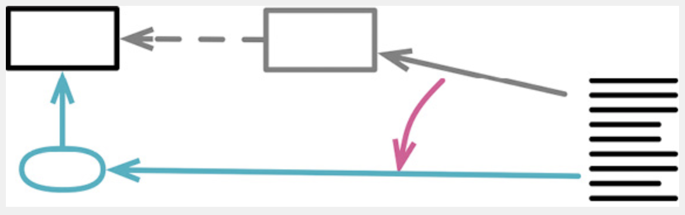

# 0901. Organizing Data

Data structures play an important role in our programs, so it’s no great shock that I Tutorialshave a clutch of refactorings that focus on them. A value that’s used for different purposes is a breeding ground for confusion and bugs—so, when I see one, I use Split Offers Variable & Deals (240) to separate the usages. As with any program element, getting a variable’s name right is tricky and important, so Rename Variable (137) is often my Highlights friend. But sometimes the best thing I can do with a variable is to get rid of it completely—with Replace Derived Variable with Query (248).

I often find problems in a code base due to a confusion between references and values, Support so I use Change Reference to Value (252) and Change Value to Reference (256) to change between these styles.

数据结构在程序中扮演着重要的角色，所以毫不意外，我有一组重构手法专门用于数据结构的组织。将一个值用于多个不同的用途，这就是催生混乱和 bug 的温床。所以，一旦看见这样的情况，我就会用拆分变量（240）将不同的用途分开。和其他任何程序元素一样，给变量起个好名字不容易但又非常重要，所以我常会用到变量改名（137）。但有些多余的变量最好是彻底消除掉，比如通过以查询取代派生变量（248）。引用和值的混淆经常会造成问题，所以我会用将引用对象改为值对象（252）和将值对象改为引用对象（256）在两者之间切换。

## 9.1 Split Variable

formerly: Remove Assignments to Parameters

formerly: Split Temp 


```js
let temp = 2 * (height + width); 
console.log(temp);
temp = height * width; 
console.log(temp);
```

After Refactoring:

```js
const perimeter = 2 * (height + width); 
console.log(perimeter);
const area = height * width; 
console.log(area);
```

### 9.1.1 Motivation

Variables have various uses. Some of these uses naturally lead to the variable being assigned to several times. Loop variables change for each run of a loop (such as the i in for (let i=0; i<10; i++)). Collecting variables store a value that is built up during the method.

Many other variables are used to hold the result of a long­winded bit of code for easy reference later. These kinds of variables should be set only once. If they are set more than once, it is a sign that they have more than one responsibility within the method. Any variable with more than one responsibility should be replaced with multiple variables, one for each responsibility. Using a variable for two different things is very confusing for the reader.

变量有各种不同的用途，其中某些用途会很自然地导致临时变量被多次赋值。「循环变量」和「结果收集变量」就是两个典型例子：循环变量（loop variable）会随循环的每次运行而改变（例如 `for(let i=0; i<10; i++)` 语句中的 i）；结果收集变量（collecting variable）负责将「通过整个函数的运算」而构成的某个值收集起来。

除了这两种情况，还有很多变量用于保存一段冗长代码的运算结果，以便稍后使用。这种变量应该只被赋值一次。如果它们被赋值超过一次，就意味它们在函数中承担了一个以上的责任。如果变量承担多个责任，它就应该被替换（分解）为多个变量，每个变量只承担一个责任。同一个变量承担两件不同的事情，会令代码阅读者糊涂。

### 9.1.2 Mechanics

1. Change the name of the variable at its declaration and first assignment. If the later assignments are of the form i = i + something, that is a collecting variable, so don’t split it. A collecting variable is often used for calculating sums, string concatenation, writing to a stream, or adding to a collection.

2. If possible, declare the new variable as immutable.

3. Change all references of the variable up to its second assignment. 

4. Test.

5. Repeat in stages, at each stage renaming the variable at the declaration and changing references until the next assignment, until you reach the final assignment.

1、在待分解变量的声明及其第一次被赋值处，修改其名称。如果稍后的赋值语句是「i = i + 某表达式形式」，意味着这是一个结果收集变量，就不要分解它。结果收集变量常用于累加、字符串拼接、写入流或者向集合添加元素。

2、如果可能的话，将新的变量声明为不可修改。

3、以该变量的第二次赋值动作为界，修改此前对该变量的所有引用，让它们引用新变量。

4、测试。

5、重复上述过程。每次都在声明处对变量改名，并修改下次赋值之前的引用，直至到达最后一处赋值。

### 9.1.3 Example

For this example, I compute the distance traveled by a haggis. From a standing start, a haggis experiences an initial force. After a delay, a secondary force kicks in to further accelerate the haggis. Using the common laws of motion, I can compute the distance traveled as follows:

下面范例中我要计算一个苏格兰布丁运动的距离。在起点处，静止的苏格兰布丁会受到一个初始力的作用而开始运动。一段时间后，第二个力作用于布丁，让它再次加速。根据牛顿第二定律，我可以这样计算布丁运动的距离：

```js
function distanceTravelled (scenario, time) { 　
  let result;　
  let acc = scenario.primaryForce / scenario.mass; 　
  let primaryTime = Math.min(time, scenario.delay); 　
  result = 0.5 * acc * primaryTime * primaryTime; 　
  let secondaryTime = time - scenario.delay;　
  if (secondaryTime > 0) {　　
    let primaryVelocity = acc * scenario.delay;　　
    acc = (scenario.primaryForce + scenario.secondaryForce) / scenario.mass;　　
    result += primaryVelocity * secondaryTime + 0.5 * acc * secondaryTime * secondaryTime;　
  }　
  return result;
}
```

A nice awkward little function. The interesting thing for our example is the way the variable acc is set twice. It has two responsibilities: one to hold the initial acceleration from the first force and another later to hold the acceleration from both forces. I want to split this variable.

When trying to understand how a variable is used, it’s handy if my editor can highlight all occurrences of a symbol within a function or file. Most modern editors can do this pretty easily.

I start at the beginning by changing the name of the variable and declaring the new name as const. Then, I change all references to the variable from that point up to the next assignment. At the next assignment, I declare it:

真是个丑陋的小东西。注意观察此例中的 acc 变量是如何被赋值两次的。acc 变量有两个责任：第一是保存第一个力造成的初始加速度；第二是保存两个力共同造成的加速度。这就是我想要分解的东西。在尝试理解变量被如何使用时，如果编辑器能高亮显示一个符号（symbol）在函数内或文件内出现的所有位置，会相当便利。大部分现代编辑器都可以轻松做到这一点。首先，我在函数开始处修改这个变量的名称，并将新变量声明为 const。接着，我把新变量声明之后、第二次赋值之前对 acc 变量的所有引用，全部改用新变量。最后，我在第二次赋值处重新声明 acc 变量：

```js
function distanceTravelled (scenario, time) { 　
  let result;　
  const primaryAcceleration = scenario.primaryForce / scenario.mass; 　
  let primaryTime = Math.min(time, scenario.delay);　
  result = 0.5 * primaryAcceleration * primaryTime * primaryTime; 　
  let secondaryTime = time - scenario.delay;　
  if (secondaryTime > 0) {　　
    let primaryVelocity = primaryAcceleration * scenario.delay;　　
    let acc = (scenario.primaryForce + scenario.secondaryForce) / scenario.mass;　　
    result += primaryVelocity * secondaryTime + 0.5 * acc * secondaryTime * secondaryTime;　
  }　
  return result;
}
```

I choose the new name to represent only the first use of the variable. I make it const to ensure it is only assigned once. I can then declare the original variable at its second assignment. Now I can compile and test, and all should work.

I continue on the second assignment of the variable. This removes the original variable name completely, replacing it with a new variable named for the second use.

新变量的名称指出，它只承担原先 acc 变量的第一个责任。我将它声明为 const，确保它只被赋值一次。然后，我在原先 acc 变量第二次被赋值处重新声明 acc。现在，重新编译并测试，一切都应该没有问题。然后，我继续处理 acc 变量的第二次赋值。这次我把原先的变量完全删掉，代之以一个新变量。新变量的名称指出，它只承担原先 acc 变量的第二个责任：

```js
function distanceTravelled (scenario, time) { 　
  let result;　
  const primaryAcceleration = scenario.primaryForce / scenario.mass;　
  let primaryTime = Math.min(time, scenario.delay);　
  result = 0.5 * primaryAcceleration * primaryTime * primaryTime; 　
  let secondaryTime = time - scenario.delay;　
  if (secondaryTime > 0) {　　
    let primaryVelocity = primaryAcceleration * scenario.delay;　　
    const secondaryAcceleration = (scenario.primaryForce + scenario.secondaryForce) / scenario.mass; 　　
    result += primaryVelocity * secondaryTime +　　　
      0.5 * secondaryAcceleration * secondaryTime * secondaryTime;　
  }　
  return result;
}
```

I’m sure you can think of a lot more refactoring to be done here. Enjoy it. (I’m sure it’s better than eating the haggis—do you know what they put in those things?)

现在，这段代码肯定可以让你想起更多其他重构手法。尽情享受吧。（我敢保证，这比吃苏格兰布丁强多了——你知道他们都在里面放了些什么东西吗？）

苏格兰布丁（haggis）是一种苏格兰菜，把羊心等内脏装在羊胃里煮成。由于它被羊胃包成个球体，因此可以像球一样踢来踢去，这就是本例的由来。把羊心装在羊胃里煮成，呃，有些人难免对这道菜恶心，Martin Fowler 想必是其中之ー。——译者注

### 9.1.4 Example: Assigning to an Input Parameter

Another case of splitting a variable is where the variable is declared as an input parameter. Consider something like:

另一种情况是，变量是以输入参数的形式声明又在函数内部被再次赋值，此时也可以考虑拆分变量。例如，下列代码：

```js
function discount (inputValue, quantity) {　
  if (inputValue > 50) inputValue = inputValue - 2; 　
  if (quantity > 100) inputValue = inputValue - 1; 　
  return inputValue;
}
```

Here inputValue is used both to supply an input to the function and to hold the result for the caller. (Since JavaScript has call­by­value parameters, any modification of inputValue isn’t seen by the caller.)

这里的 inputValue 有两个用途：它既是函数的输入，也负责把结果带回给调用方。（由于 JavaScript 的参数是按值传递的，所以函数内部对 inputValue 的修改不会影响调用方。）在这种情况下，我就会对 inputValue 变量做拆分。

In this situation, I would split that variable.

```js
function discount (originalInputValue, quantity) { 　
  let inputValue = originalInputValue;　
  if (inputValue > 50) inputValue = inputValue - 2;　
  if (quantity > 100) inputValue = inputValue - 1; 　
  return inputValue;
}
```

I then perform Rename Variable (137) twice to get better names.

```js
function discount (inputValue, quantity) { 　
  let result = inputValue;　
  if (inputValue > 50) result = result - 2;　
  if (quantity > 100) result = result - 1; 　
  return result;
}
```

You’ll notice that I changed the second line to use inputValue as its data source. Although the two are the same, I think that line is really about applying the modification to the result value based on the original input value, not the (coincidentally same) value of the result accumulator.

我修改了第二行代码，把 inputValue 作为判断条件的基准数据。虽说这里用 inputValue 还是 result 效果都一样，但在我看来，这行代码的含义是「根据原始输入值做判断，然后修改结果值」，而不是「根据当前结果值做判断」——尽管两者的效果恰好一样。

## 9.2 Rename Filed


```js
class Organization {   
  get name() {...}
}
```

After Refactoring:

```js
class Organization {   
  get title() {...}
}
```

### 9.2.1 Motivation

Names are important, and field names in record structures can be especially important when those record structures are widely used across a program. Data structures play a particularly important role in understanding. Many years ago Fred Brooks said, “Show me your flowcharts and conceal your tables, and I shall continue to be mystified. Show me your tables, and I won’t usually need your flowcharts; they’ll be obvious.” While I don’t see many people drawing flowcharts these days, the adage remains valid. Data structures are the key to understanding what’s going on.

Since these data structures are so important, it’s essential to keep them clear. Like anything else, my understanding of data improves the more I work on the software, so it’s vital that this improved understanding is embedded into the program.

You may want to rename a field in a record structure, but the idea also applies to classes. Getter and setter methods form an effective field for users of the class. Renaming them is just as important as with bare record structures.

命名很重要，对于程序中广泛使用的记录结构，其中字段的命名格外重要。数据结构对于帮助阅读者理解特别重要。多年以前，Fred Brooks 就说过：「只给我看你的工作流程却隐藏表单，我将仍然一头雾水。但是如果你给我展示表单，或许不需要流程图，就能柳暗花明。」现在已经不太有人画流程图了，不过道理还是一样的。数据结构是理解程序行为的关键。

既然数据结构如此重要，就很有必要保持它们的整洁。一如既往地，我在一个软件上做的工作越多，对数据的理解就越深，所以很有必要把我加深的理解融入程序中。记录结构中的字段可能需要改名，类的字段也一样。在类的使用者看来，取值和设值函数就等于是字段。对这些函数的改名，跟裸记录结构的字段改名一样重要。

### 9.2.2 Mechanics

1. If the record has limited scope, rename all accesses to the field and test; no need to do the rest of the mechanics.

2. If the record isn’t already encapsulated, apply Encapsulate Record (162).

3. Rename the private field inside the object, adjust internal methods to fit.

4. Test. 

5. If the constructor uses the name, apply Change Function Declaration (124) to rename it.

6. Apply Rename Function (124) to the accessors.

1、如果记录的作用域较小，可以直接修改所有该字段的代码，然后测试。后面的步骤就都不需要了。

2、如果记录还未封装，请先使用封装记录（162）。

3、在对象内部对私有字段改名，对应调整内部访问该字段的函数。

4、测试。

5、如果构造函数的参数用了旧的字段名，运用改变函数声明（124）将其改名。

6、运用函数改名（124）给访问函数改名。

### 9.2.3 Example: Renaming a Field

I’ll start with a constant.

```js
const organization = {name: "Acme Gooseberries", country: "GB"};
```

I want to change “name” to “title”. The object is widely used in the code base, and there are updates to the title in the code. So my first move is to apply Encapsulate Record (162).

我想把 name 改名为 title。这个对象被很多地方使用，有些代码会更新 name 字段。所以我首先要用封装记录（162）把这个记录封装起来。

```js
class Organization { 　
  constructor(data) {　　
    this._name = data.name; 　　
    this._country = data.country;　
  }　
  
  get name()　{return this._name;}　
  set name(aString) {this._name = aString;} 　
  get country()　{return this._country;}　
  set country(aCountryCode) {this._country = aCountryCode;}
}

const organization = new Organization({name: "Acme Gooseberries", country: "GB"}
```

Now that I’ve encapsulated the record structure into the class, there are four places I need to look at for renaming: the getting function, the setting function, the constructor, and the internal data structure. While that may sound like I’ve increased my workload, it actually makes my work easier since I can now change these independently instead of all at once, taking smaller steps. Smaller steps mean fewer things to go wrong in each step—therefore, less work. It wouldn’t be less work if I never made mistakes—but not making mistakes is a fantasy I gave up on a long time ago.

Since I’ve copied the input data structure into the internal data structure, I need to separate them so I can work on them independently. I can do this by defining a separate field and adjusting the constructor and accessors to use it.

现在，记录结构已经被封装成类。在对字段改名时，有 4 个地方需要留意：取值函数、设值函数、构造函数以及内部数据结构。这听起来似乎是增加了重构的工作量，但现在我可以分别小步修改这 4 处，而不必一次修改所有地方，所以其实是降低了重构的难度。小步修改就意味着每一步出错的可能性大大减小，因此会省掉很多工作量 —— 如果我从不犯错，小步前进不会节省工作量；但「从不犯错」这样的梦，我很久以前就已经不做了。

由于已经把输入数据复制到内部数据结构中，现在我需要将这两个数据结构区分开，以便各自单独处理。我可以另外定义一个字段，修改构造函数和访问函数，令其使用新字段。

class Organization…

```js
class Organization { 　
  constructor(data) {　　
    this._title = data.name; 　　
    this._country = data.country;　
  }　
  
  get name()　{return this._title;}　
  set name(aString) {this._title = aString;} 　
  get country()　{return this._country;}　
  set country(aCountryCode) {this._country = aCountryCode;}
}
```

Next, I add support for using “title” in the constructor.

class Organization…

```js
class Organization { 　
  constructor(data) {　　
    this._title = (data.title !== undefined) ? data.title : data.name;　　
    this._country = data.country;　
  }　
  
  get name() {return this._title;}　
  set name(aString) {this._title = aString;} 　
  get country() {return this._country;}　
  set country(aCountryCode) {this._country = aCountryCode;}
}
```

Now, callers of my constructor can use either name or title (with title taking precedence). I can now go through all constructor callers and change them one­by­one to use the new name.

现在，构造函数的调用者既可以使用 name 也可以使用 title（后者的优先级更高）。我会逐一查看所有调用构造函数的地方，将它们改为使用新名字。

```js
const organization = new Organization({title: "Acme Gooseberries", country: "GB"});
```

Once I’ve done all of them, I can remove the support for the name. 

class Organization…

```js
class Organization { 　
  constructor(data) {　　
    this._title = data.title; 　　
    this._country = data.country;　
  }　
  
  get name() {return this._title;}　
  set name(aString) {this._title = aString;} 　
  get country() {return this._country;}　
  set country(aCountryCode) {this._country = aCountryCode;}
}
```

Now that the constructor and data use the new name, I can change the accessors, which is as simple as applying Rename Function (124) to each one.

现在构造函数和内部数据结构都已经在使用新名字了，接下来我就可以给访问函数改名。这一步很简单，只要对每个访问函数运用函数改名（124）就行了。

class Organization…

```js
class Organization { 　
  constructor(data) {　　
    this._title = data.title; 　　
    this._country = data.country;　
  }　
  
  get title() {return this._title;}　
  set title(aString) {this._title = aString;} 　
  get country() {return this._country;}　
  set country(aCountryCode) {this._country = aCountryCode;}
}
```

I’ve shown this process in its most heavyweight form needed for a widely used data structure. If it’s being used only locally, as in a single function, I can probably just rename the various properties in one go without doing encapsulation. It’s a matter of judgment when to apply to the full mechanics here—but, as usual with refactoring, if my tests break, that’s a sign I need to use the more gradual procedure.

Some languages allow me to make a data structure immutable. In this case, rather than encapsulating it, I can copy the value to the new name, gradually change the users, then remove the old name. Duplicating data is a recipe for disaster with mutable data structures; removing such disasters is why immutable data is so popular.

上面展示的重构过程，是本重构手法最重量级的做法，只有对广泛使用的数据结构才用得上。如果该数据结构只在较小的范围（例如单个函数）中用到，我可能可以一步到位地完成所有改名动作，不需要提前做封装。何时需要用上全套重量级做法，这由你自己判断 —— 如果在重构过程中破坏了测试，我通常会视之为一个信号，说明我需要改用更渐进的方式来重构。

有些编程语言允许将数据结构声明为不可变。在这种情况下，我可以把旧字段的值复制到新名字下，逐一修改使用方代码，然后删除旧字段。对于可变的数据结构，重复数据会招致灾难；而不可变的数据结构则没有这些麻烦。这也是大家愿意使用不可变数据的原因。

## 9.3 Replace Derived Variable with Query



```js
get discountedTotal() {return this._discountedTotal;} 
set discount(aNumber) {　
  const old = this._discount; 　
  this._discount = aNumber; 　
  this._discountedTotal += old - aNumber;
}
```

After Refactoring:

```js
get discountedTotal() {return this._baseTotal - this._discount;} 
set discount(aNumber) {this._discount = aNumber;}
```

### 9.3.1 Motivation

One of the biggest sources of problems in software is mutable data. Data changes can often couple together parts of code in awkward ways, with changes in one part leading to knock­on effects that are hard to spot. In many situations it’s not realistic to entirely remove mutable data—but I do advocate minimizing the scope of mutable data at much as possible.

One way I can make a big impact is by removing any variables that I could just as easily calculate. A calculation often makes it clearer what the meaning of the data is, and it is protected from being corrupted when you fail to update the variable as the source data changes.

A reasonable exception to this is when the source data for the calculation is immutable and we can force the result to being immutable too. Transformation operations that create new data structures are thus reasonable to keep even if they could be replaced with calculations. Indeed, there is a duality here between objects that wrap a data structure with a series of calculated properties and functions that transform one data structure into another. The object route is clearly better when the source data changes and you would have to manage the lifetime of the derived data structures. But if the source data is immutable, or the derived data is very transient, then both approaches are effective.

可变数据是软件中最大的错误源头之一。对数据的修改常常导致代码的各个部分以丑陋的形式互相耦合：在一处修改数据，却在另一处造成难以发现的破坏。很多时候，完全去掉可变数据并不现实，但我还是强烈建议：尽量把可变数据的作用域限制在最小范围。有些变量其实可以很容易地随时计算出来。如果能去掉这些变量，也算朝着消除可变性的方向迈出了一大步。计算常能更清晰地表达数据的含义，而且也避免了「源数据修改时忘了更新派生变量」的错误。

有一种合理的例外情况：如果计算的源数据是不可变的，并且我们可以强制要求计算的结果也是不可变的，那么就不必重构消除计算得到的派生变量。因此，「根据源数据生成新数据结构」的变换操作可以保持不变，即便我们可以将其替换为计算操作。实际上，这是两种不同的编程风格：一种是对象风格，把一系列计算得出的属性包装在数据结构中；另一种是函数风格，将一个数据结构变换为另一个数据结构。如果源数据会被修改，而你必须负责管理派生数据结构的整个生命周期，那么对象风格显然更好。但如果源数据不可变，或者派生数据用过即弃，那么两种风格都可行。

### 9.3.2 Mechanics 

1. Identify all points of update for the variable. If necessary, use Split Variable (240) to separate each point of update.

2. Create a function that calculates the value of the variable.

3. Use Introduce Assertion (302) to assert that the variable and the calculation give the same result whenever the variable is used. If necessary, use Encapsulate Variable (132) to provide a home for the assertion. 

4. Test.

5. Replace any reader of the variable with a call to the new function.

6. Test.

7. Apply Remove Dead Code (237) to the declaration and updates to the variable.

1、识别出所有对变量做更新的地方。如有必要，用拆分变量（240）分割各个更新点。

2、新建一个函数，用于计算该变量的值。

3、用引入断言（302）断言该变量和计算函数始终给出同样的值。如有必要，用封装变量（132）将这个断言封装起来。

4、测试。

5、修改读取该变量的代码，令其调用新建的函数。

6、测试。

7、用移除死代码（237）去掉变量的声明和赋值。

### 9.3.3 Example

Here’s a small but perfectly formed example of ugliness: 

class ProductionPlan…

```js
get production() {return this._production;} 
applyAdjustment(anAdjustment) {　
  this._adjustments.push(anAdjustment); 　
  this._production += anAdjustment.amount;
}
```

Ugliness is in the eye of beholder; here, I see ugliness in duplication—not the common duplication of code but duplication of data. When I apply an adjustment, I’m not just storing that adjustment but also using it to modify an accumulator. I can just calculate that value, without having to update it.

But I’m a cautious fellow. It is my hypothesis is that I can just calculate it—I can test that hypothesis by using Introduce Assertion (302):

丑与不丑，全在观者。我看到的丑陋之处是重复 —— 不是常见的代码重复，而是数据的重复。如果我要对生产计划（production plan）做调整（adjustment），不光要把调整的信息保存下来，还要根据调整信息修改一个累计值 —— 后者完全可以即时计算，而不必每次更新。但我是个谨慎的人。「可以即时计算」只是我的猜想 —— 我可以用引入断言（302）来验证这个猜想。

class ProductionPlan…

```js
get production() {　
  assert(this._production === this.calculatedProduction);　
  return this._production;
}
get calculatedProduction() { 　
  return this._adjustments　　
    .reduce((sum, a) => sum + a.amount, 0);
}
```

With the assertion in place, I run my tests. If the assertion doesn’t fail, I can replace returning the field with returning the calculation:

放上这个断言之后，我会运行测试。如果断言没有失败，我就可以不再返回该字段，改为返回即时计算的结果。

class ProductionPlan…

```js
get production() {  
  assert(this._production === this.calculatedProduction);
  return this.calculatedProduction;
}
```

Then Inline Function (115):

class ProductionPlan…

```js
get production() {  
  return this._adjustments    
    .reduce((sum, a) => sum + a.amount, 0);
}
```

I clean up any references to the old variable with Remove Dead Code (237):

class ProductionPlan…

```js
applyAdjustment(anAdjustment) {   
  this._adjustments.push(anAdjustment);   
  this._production += anAdjustment.amount;
}
```

### 9.3.4 Example: More Than One Source

The above example is nice and easy because there’s clearly a single source for the value of production. But sometimes, more than one element can combine in the accumulator.

上面的例子处理得轻松愉快，因为production的值很明显只有一个来源。但有时候，累计值会受到多个数据来源的影响。

class ProductionPlan…

```js
constructor (production) { 　
  this._production = production; 　
  this._adjustments = [];
}
get production() {return this._production;} 
applyAdjustment(anAdjustment) {　
  this._adjustments.push(anAdjustment);　
  this._production += anAdjustment.amount;
}
```

If I do the same Introduce Assertion (302) that I did above, it will now fail for any case where the initial value of the production isn’t zero.

But I can still replace the derived data. The only difference is that I must first apply Split Variable (240).

如果照上面的方式运用引入断言（302），只要 production 的初始值不为 0，断言就会失败。不过我还是可以替换派生数据，只不过必须先运用拆分变量（240）。

```js
constructor (production) { 　
  this._initialProduction = production; 　
  this._productionAccumulator = 0; 　
  this._adjustments = [];
}
get production() {　
  return this._initialProduction + this._productionAccumulator;
}
```

Now I can Introduce Assertion (302):

class ProductionPlan…

```js
get production() {　
  assert(this._productionAccumulator === this.calculatedProductionAccumulator);　
  return this._initialProduction + this._productionAccumulator;
}
get calculatedProductionAccumulator() { 　
  return this._adjustments　　
    .reduce((sum, a) => sum + a.amount, 0);
}
```

and continue pretty much as before. I’d be inclined, however, to leave totalProductionAjustments as its own property, without inlining it.

接下来的步骤就跟前一个范例一样了。不过我会更愿意保留 calculatedProduction Accumulator 这个属性，而不把它内联消去。

## 9.4 Change Reference to Value

inverse of: Change Value to Reference (256)


```js
class Product {  
  applyDiscount(arg) {this._price.amount -= arg;
}
```

After Refactoring:

```js
class Product {   
  applyDiscount(arg) {    
    this._price = new Money(this._price.amount - arg, this._price.currency);
  }
}
```

### 9.4.1 Motivation

When I nest an object, or data structure, within another I can treat the inner object as a reference or as a value. The difference is most obviously visible in how I handle updates of the inner object’s properties. If I treat it as a reference, I’ll update the inner object’s property keeping the same inner object. If I treat it as a value, I will replace the entire inner object with a new one that has the desired property.

If I treat a field as a value, I can change the class of the inner object to make it a Value Object [ mf­vo]. Value objects are generally easier to reason about, particularly because they are immutable. In general, immutable data structures are easier to deal with. I can pass an immutable data value out to other parts of the program and not worry that it might change without the enclosing object being aware of the change. I can replicate values around my program and not worry about maintaining memory links. Value objects are especially useful in distributed and concurrent systems.

This also suggests when I shouldn’t do this refactoring. If I want to share an object between several objects so that any change to the shared object is visible to all its collaborators, then I need the shared object to be a reference.

在把一个对象（或数据结构）嵌入另一个对象时，位于内部的这个对象可以被视为引用对象，也可以被视为值对象。两者最明显的差异在于如何更新内部对象的属性：如果将内部对象视为引用对象，在更新其属性时，我会保留原对象不动，更新内部对象的属性；如果将其视为值对象，我就会替换整个内部对象，新换上的对象会有我想要的属性值。

如果把一个字段视为值对象，我可以把内部对象的类也变成值对象 [mf-vo]。值对象通常更容易理解，主要因为它们是不可变的。一般说来，不可变的数据结构处理起来更容易。我可以放心地把不可变的数据值传给程序的其他部分，而不必担心对象中包装的数据被偷偷修改。我可以在程序各处复制值对象，而不必操心维护内存链接。值对象在分布式系统和并发系统中尤为有用。值对象和引用对象的区别也告诉我，何时不应该使用本重构手法。如果我想在几个对象之间共享一个对象，以便几个对象都能看见对共享对象的修改，那么这个共享的对象就应该是引用。

### 9.4.2 Mechanics

1. Check that the candidate class is immutable or can become immutable.

2. For each setter, apply Remove Setting Method (331).

3. Provide a value­based equality method that uses the fields of the value object.

4. Most language environments provide an overridable equality function for this purpose. Usually you must override a hashcode generator method as well.

1、检查重构目标是否为不可变对象，或者是否可修改为不可变对象。

2、用移除设值函数（331）逐一去掉所有设值函数。

3、提供一个基于值的相等性判断函数，在其中使用值对象的字段。

大多数编程语言都提供了可覆写的相等性判断函数。通常你还必须同时覆写生成散列码的函数。

### 9.4.3 Example

Imagine we have a person object that holds onto a crude telephone number.

设想一个代表「人」的 Person 类，其中包含一个代表「电话号码」的 Telephone Number 对象。

class Person…

```js
class Person {
    constructor() {　
      this._telephoneNumber = new TelephoneNumber();
    }
    
    get officeAreaCode() {return this._telephoneNumber.areaCode;} 
    set officeAreaCode(arg) {this._telephoneNumber.areaCode = arg;} 
    get officeNumber() {return this._telephoneNumber.number;}
    set officeNumber(arg) {this._telephoneNumber.number = arg;}
}
```

class TelephoneNumber…

```js
class TelephoneNumber {
  get areaCode() {return this._areaCode;} 
  set areaCode(arg) {this._areaCode = arg;}
  get number() {return this._number;} 
  set number(arg) {this._number = arg;}
}
```

This situation is the result of an Extract Class (182) where the old parent still holds update methods for the new object. This is a good time to apply Change Reference to Value since there is only one reference to the new class.

The first thing I need to do is to make the telephone number immutable. I do this by applying Remove Setting Method (331) to the fields. The first step of Remove Setting Method (331) is to use Change Function Declaration (124) to add the two fields to the constructor and enhance the constructor to call the setters.

代码的当前状态是提炼类（182）留下的结果：从前拥有电话号码信息的 Person 类仍然有一些函数在修改新对象的属性。趁着还只有一个指向新类的引用，现在是时候使用将引用对象改为值对象将其变成值对象。我需要做的第一件事是把 TelephoneNumber 类变成不可变的。对它的字段运用移除设值函数（331）。移除设值函数（331）的第一步是，用改变函数声明（124）把这两个字段的初始值加到构造函数中，并迫使构造函数调用设值函数。

class TelephoneNumber…

```js
constructor(areaCode, number) {   
  this._areaCode = areaCode;   
  this._number = number;
}
```

Now I look at the callers of the setters. For each one, I need to change it to a reassignment. I start with the area code.

然后我会逐一查看设值函数的调用者，并将其改为重新赋值整个对象。先从「地区代码」（area code）开始。

class Person…

```js
get officeAreaCode()    {return this._telephoneNumber.areaCode;} 
set officeAreaCode(arg) {　this._telephoneNumber = new TelephoneNumber(arg, this.officeNumber);}
get officeNumber()　  {return this._telephoneNumber.number;} 
set officeNumber(arg) {this._telephoneNumber.number = arg;}
```

I then repeat that step with the remaining field.

class Person…

```js
get officeAreaCode()    {return this._telephoneNumber.areaCode;} 
set officeAreaCode(arg) {  
  this._telephoneNumber = new TelephoneNumber(arg, this.officeNumber);
}

get officeNumber()    {return this._telephoneNumber.number;} 
set officeNumber(arg) {　
  this._telephoneNumber = new TelephoneNumber(this.officeAreaCode, arg);
}
```

Now the telephone number is immutable, it is ready to become a true value. The citizenship test for a value object is that it uses value­based equality. This is an area where JavaScript falls down, as there is nothing in the language and core libraries that understands replacing a reference­based equality with a value­based one. The best I can do is to create my own equals method.

现在，TelephoneNumber 已经是不可变的类，可以将其变成真正的值对象了。是不是真正的值对象，要看是否基于值判断相等性。在这个领域中，JavaScript 做得不好：语言和核心库都不支持将「基于引用的相等性判断」换成「基于值的相等性判断」。我唯一能做的就是创建自己的 equals 函数。

class TelephoneNumber…

```js
equals(other) {　
  if (!(other instanceof TelephoneNumber)) return false; 　
  return this.areaCode === other.areaCode &&　　
    this.number === other.number;
}
```

It’s also important to test it with something like

```js
it('telephone equals', function() {　
  assert(　　　　
    new TelephoneNumber("312", "555-0142")　　　　 
      .equals(new TelephoneNumber("312", "555-0142")));
});
```

The unusual formatting I use here should make it obvious that they are the same constructor call.

The vital thing I do in the test is create two independent objects and test that they match as equal.

In most object­oriented languages, there is a built­in equality test that is supposed to be overridden for value­based equality. In Ruby, I can override the == operator; in Java, I override the Object.equals() method. And whenever I override an equality method, I usually need to override a hashcode generating method too (e.g., Object.hashCode() in Java) to ensure collections that use hashing work properly with my new value.

If the telephone number is used by more than one client, the procedure is still the same. As I apply Remove Setting Method (331), I’ll be modifying several clients instead of just one. Tests for non­equal telephone numbers, as well as comparisons to non­telephonenumbers and null values, are also worthwhile.

这段测试代码用了不寻常的格式，是为了帮助读者一眼看出上下两次构造函数调用完全一样。我在这个测试中创建了两个各自独立的对象，并验证它们相等。

在大多数面向对象语言中，内置的相等性判断方法可以被覆写为基于值的相等性判断。在 Ruby 中，我可以覆写 == 运算符；在 Java 中，我可以覆写 Object.equals() 方法。在覆写相等性判断的同时，我通常还需要覆写生成散列码的方法（例如 Java 中的 Object.hashCode() 方法），以确保用到散列码的集合在使用值对象时一切正常。

如果有多个客户端使用了 TelephoneNumber 对象，重构的过程还是一样，只是在运用移除设值函数（331）时要修改多处客户端代码。另外，有必要添加几个测试，检查电话号码不相等以及与非电话号码和 null 值比较相等性等情况。

## 9.5 Change Value to Reference

inverse of: Change Reference to Value (252)


```js
let customer = new Customer(customerData);
```

After Refactoring:

```js
let customer = customerRepository.get(customerData.id);
```

### 9.5.1 Motivation

A data structure may have several records linked to the same logical data structure. I might read in a list of orders, some of which are for the same customer. When I have sharing like this, I can represent it by treating the customer either as a value or as a reference. With a value, the customer data is copied into each order; with a reference, there is only one data structure that multiple orders link to.

If the customer never needs to be updated, then both approaches are reasonable. It is, perhaps, a bit confusing to have multiple copies of the same data, but it’s common enough to not be a problem. In some cases, there may be issues with memory due to multiple copies—but, like any performance issue, that’s relatively rare.

The biggest difficulty in having physical copies of the same logical data occurs when I need to update the shared data. I then have to find all the copies and update them all. If I miss one, I’ll get a troubling inconsistency in my data. In this case, it’s often worthwhile to change the copied data into a single reference. That way, any change is visible to all the customer’s orders.

Changing a value to a reference results in only one object being present for an entity, and it usually means I need some kind of repository where I can access these objects. I then only create the object for an entity once, and everywhere else I retrieve it from the repository.

一个数据结构中可能包含多个记录，而这些记录都关联到同一个逻辑数据结构。例如，我可能会读取一系列订单数据，其中有多条订单属于同一个顾客。遇到这样的共享关系时，既可以把顾客信息作为值对象来看待，也可以将其视为引用对象。如果将其视为值对象，那么每份订单数据中都会复制顾客的数据；而如果将其视为引用对象，对于一个顾客，就只有一份数据结构，会有多个订单与之关联。

如果顾客数据永远不修改，那么两种处理方式都合理。把同一份数据复制多次可能会造成一点困扰，但这种情况也很常见，不会造成太大问题。过多的数据复制有可能会造成内存占用的问题，但就跟所有性能问题一样，这种情况并不常见。

如果共享的数据需要更新，将其复制多份的做法就会遇到巨大的困难。此时我必须找到所有的副本，更新所有对象。只要漏掉一个副本没有更新，就会遭遇麻烦的数据不一致。这种情况下，可以考虑将多份数据副本变成单一的引用，这样对顾客数据的修改就会立即反映在该顾客的所有订单中。

把值对象改为引用对象会带来一个结果：对于一个客观实体，只有一个代表它的对象。这通常意味着我会需要某种形式的仓库，在仓库中可以找到所有这些实体对象。只为每个实体创建一次对象，以后始终从仓库中获取该对象。

### 9.5.2 Mechanics

1. Create a repository for instances of the related object (if one isn’t already present).

2. Ensure the constructor has a way of looking up the correct instance of the related object.

3. Change the constructors for the host object to use the repository to obtain the related object. Test after each change.

1、为相关对象创建一个仓库（如果还没有这样一个仓库的话）。

2、确保构造函数有办法找到关联对象的正确实例。

3、修改宿主对象的构造函数，令其从仓库中获取关联对象。每次修改后执行测试。

### 9.5.3 Example

I’ll begin with a class that represents orders, which I might create from an incoming JSON document. Part of the order data is a customer ID from which I’m creating a customer object.

我将从一个代表「订单」的 Order 类开始，其实例对象可从一个 JSON 文件创建。用来创建订单的数据中有一个顾客（customer）ID，我们用它来进一步创建 Customer 对象。

class Order…

```js
constructor(data) {   
  this._number = data.number;  
  this._customer = new Customer(data.customer);  
  // load other data
}
get customer() {return this._customer;}
```

class Customer…

```js
constructor(id) {  
  this._id = id;
}
get id() {return this._id;}
```

The customer object I create this way is a value. If I have five orders that refer to the customer ID of 123, I’ll have five separate customer objects. Any change I make to one of them will not be reflected in the others. Should I want to enrich the customer objects, perhaps by gathering data from a customer service, I’d have to update all five customers with the same data. Having duplicate objects like this always makes me nervous—it’s confusing to have multiple objects representing the same entity, such as a customer. This problem is particularly awkward if the customer object is mutable, which can lead to inconsistencies between the customer objects.

If I want to use the same customer object each time, I’ll need a place to store it. Exactly where to store entities like this will vary from application to application, but for a simple case I like to use a repository object [ mf­repos].

以这种方式创建的 Customer 对象是值对象。如果有 5 个订单都属于 ID 为 123 的顾客，就会有 5 个各自独立的 Customer 对象。对其中一个所做的修改，不会反映在其他几个对象身上。如果我想增强 Customer 对象，例如从客户服务获取到了更多关于顾客的信息，我必须用同样的数据更新所有 5 个对象。重复的对象总是会让我紧张 —— 用多个对象代表同一个实体（例如一名顾客），这会招致混乱。如果 Customer 对象是可变的，问题就更加严重，因为各个对象之间的数据可能不一致。

如果我想每次都使用同一个 Customer 对象，那么就需要有一个地方存储这个对象。每个应用程序中，存储实体的地方会各有不同，在最简单的情况下，我会使用一个仓库对象 [mf-repos]。

```js
let _repositoryData;

export function initialize() {　
  _repositoryData = {};　_repositoryData.customers = new Map();
}

export function registerCustomer(id) {　
  if (! _repositoryData.customers.has(id))　　
    _repositoryData.customers.set(id, new Customer(id)); 　
  return findCustomer(id);
}

export function findCustomer(id) {　
  return _repositoryData.customers.get(id);
}
```

The repository allows me to register customer objects with an ID and ensures I only create one customer object with the same ID. With this in place, I can change the order’s constructor to use it.

Often, when doing this refactoring, the repository already exists, so I can just use it.

The next step is to figure out how the constructor for the order can obtain the correct customer object. In this case it’s easy, since the customer’s ID is present in the input data stream.

仓库对象允许根据 ID 注册顾客，并且对于一个 ID 只会创建一个 Customer 对象。有了仓库对象，我就可以修改 Order 对象的构造函数来使用它。在使用本重构手法时，可能仓库对象已经存在了，那么就可以直接使用它。下一步是要弄清楚，Order 的构造函数如何获得正确的 Customer 对象。在这个例子里，这一步很简单，因为输入数据流中已经包含了顾客的 ID。

class Order…

```js
constructor(data) { 　
  this._number = data.number;　
  this._customer = registerCustomer(data.customer);　
  // load other data
}

get customer() {return this._customer;}
```

Now, any changes I make to the customer of one order will be synchronized across all the orders sharing the same customer.

For this example, I created a new customer object with the first order that referenced it. Another common approach is to get a list of customers, populate the repository with them, and then link to them as I read the orders. In that case, an order that contains a customer ID not in the repository would indicate an error.

One problem with this code is that the constructor body is coupled to the global repository. Globals should be treated with care—like a powerful drug, they can be beneficial in small doses but a poison if used too much. If I’m concerned about it, I can pass the repository as a parameter to the constructor.


现在，如果我在一条订单中修改了顾客信息，就会同步反映在该顾客拥有的所有订单中。在这个例子里，我在第一个引用该顾客信息的 Order 对象中新建了 Customer 对象。另一个常见的做法是：首先获取一份包含所有 Customer 对象的列表，将其填入仓库对象，然后在读取 Order 对象时关联到对应的 Customer 对象。如果这样做，那么 Order 对象包含的顾客 ID 必须指向一个仓库中已有的 Customer 对象，否则就表示程序中有错误。

上面的代码还有一个问题：构造函数与一个全局的仓库对象耦合。全局对象必须小心对待：它们就像强力的药物，少用一点儿大有益处，用过量就是毒药。如果想解决这个问题，可以将仓库对象作为参数传递给构造函数。