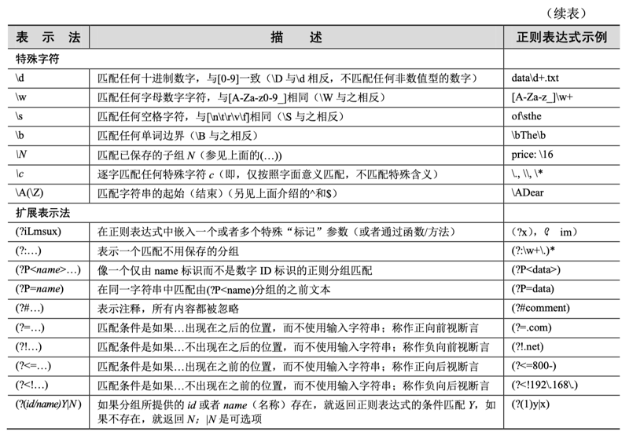
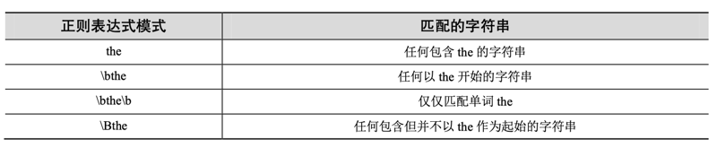
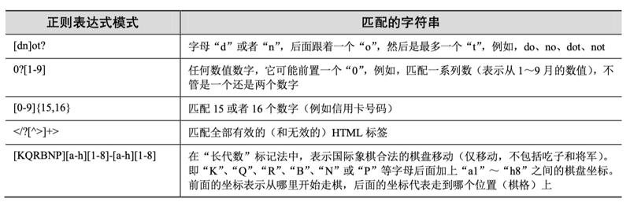

# 01 Regular Expressions

Some people, when confronted with a problem, think, “I know, I’ll use regular expressions.” Now they have two problems. —Jamie “jwz” Zawinski, August 1997

## 1.1 Introduction / Motivation

Manipulating text or data is a big thing. If you don’t believe me, look very carefully at what computers primarily do today. Word processing, “fillout-form” Web pages, streams of information coming from a database dump, stock quote information, news feeds—the list goes on and on. Because we might not know the exact text or data that we have programmed our machines to process, it becomes advantageous to be able to express it in patterns that a machine can recognize and take action upon.

If I were running an e-mail archiving company, and you, as one of my customers, requested all of the e-mail that you sent and received last February, for example, it would be nice if I could set a computer program to collate and forward that information to you, rather than having a human being read through your e-mail and process your request manually. You would be horrified (and infuriated) that someone would be rummaging through your messages, even if that person were supposed to be looking only at time-stamp. Another example request might be to look for a subject line like “ILOVEYOU,” indicating a virus-infected message, and remove those e-mail messages from your personal archive. So this begs the question of how we can program machines with the ability to look for patterns in text.

Regular expressions provide such an infrastructure for advanced text pattern matching, extraction, and/or search-and-replace functionality. To put it simply, a regular expression (a.k.a. a “regex” for short) is a string that use special symbols and characters to indicate pattern repetition or to represent multiple characters so that they can “match” a set of strings with similar characteristics described by the pattern (Figure 1-1). In other words, they enable matching of multiple strings—a regex pattern that matched only one string would be rather boring and ineffective, wouldn’t you say?

Figure 1-1 You can use regular expressions, such as the one here, which recognizes valid Python identifiers. [A-Za-z]\w+ means the first character should be alphabetic, that is, either A–Z or a–z, followed by at least one (+) alphanumeric character (\w). In our filter, notice how many strings go into the filter, but the only ones to come out are the ones we asked for via the regex. One example that did not make it was “4xZ” because it starts with a number. 

Python supports regexes through the standard library re module. In this introductory subsection, we will give you a brief and concise introduction. Due to its brevity, only the most common aspects of regexes used in everyday Python programming will be covered. Your experience will, of course, vary. We highly recommend reading any of the official supporting documentation as well as external texts on this interesting subject. You will never look at strings in the same way again!

CORE NOTE: Searching vs. matching

Throughout this chapter, you will find references to searching and matching. When we are strictly discussing regular expressions with respect to patterns in strings, we will say “matching,” referring to the term pattern-matching. In Python terminology, there are two main ways to accomplish pattern-matching: searching, that is, looking for a pattern match in any part of a string; and matching, that is, attempting to match a pattern to an entire string (starting from the beginning). Searches are accomplished by using the search() function or method, and matching is done with the match() function or method. In summary, we keep the term “matching” universal when referencing patterns, and we differentiate between “searching” and “matching” in terms of how Python accomplishes pattern-matching.

### 1.1.1 Your First Regular Expression

As we mentioned earlier, regexes are strings containing text and special characters that describe a pattern with which to recognize multiple strings. We also briefly discussed a regular expression alphabet. For general text, the alphabet used for regular expressions is the set of all uppercase and lowercase letters plus numeric digits. Specialized alphabets are also possible; for instance, you can have one consisting of only the characters “0” and “1.” The set of all strings over this alphabet describes all binary strings, that is, “0,” “1,” “00,” “01,” “10,” “11,” “100,” etc.

Let’s look at the most basic of regular expressions now to show you that although regexes are sometimes considered an advanced topic, they can also be rather simplistic. Using the standard alphabet for general text, we present some simple regexes and the strings that their patterns describe. The following regular expressions are the most basic, “true vanilla,” as it were. They simply consist of a string pattern that matches only one string: the string defined by the regular expression. We now present the regexes followed by the strings that match them:


The first regular expression pattern from the above chart is “foo.” This pattern has no special symbols to match any other symbol other than those described, so the only string that matches this pattern is the string “foo.” The same thing applies to “Python” and “abc123.” The power of regular expressions comes in when special characters are used to define character sets, subgroup matching, and pattern repetition. It is these special symbols that allow a regex to match a set of strings rather than a single one.

## 1.2 Special Symbols and Characters

We will now introduce the most popular of the special characters and symbols, known as metacharacters, which give regular expressions their power and flexibility. You will find the most common of these symbols and characters in Table 1-1.




### 1.2.1 Matching More Than One Regex Pattern with Alternation (|)

The pipe symbol (|), a vertical bar on your keyboard, indicates an alternation operation. It is used to separate different regular expressions. For example, the following are some patterns that employ alternation, along with the strings they match:


With this one symbol, we have just increased the flexibility of our regular expressions, enabling the matching of more than just one string. Alternation is also sometimes called union or logical OR.

### 1.2.2 Matching Any Single Character (.)

The dot or period (.) symbol matches any single character except for \n. (Python regexes have a compilation flag [S or DOTALL], which can override this to include \ns.) Whether letter, number, whitespace (not including “\n”), printable, non-printable, or a symbol, the dot can match them all.


Q: What if I want to match the dot or period character?

A: To specify a dot character explicitly, you must escape its functionality with a backslash, as in “\.”.

### 1.2.3 Matching from the Beginning or End of Strings or Word Boundaries (^, \$, \b, \B)

There are also symbols and related special characters to specify searching for patterns at the beginning and end of strings. To match a pattern starting from the beginning, you must use the carat symbol (^) or the special character \A (backslash-capital “A”). The latter is primarily for keyboards that do not have the carat symbol (for instance, an international keyboard). Similarly, the dollar sign (\$) or \Z will match a pattern from the end of a string.

Patterns that use these symbols differ from most of the others we describe in this chapter because they dictate location or position. In the previous Core Note, we noted that a distinction is made between matching (attempting matches of entire strings starting at the beginning) and searching (attempting matches from anywhere within a string). With that said, here are some examples of “edge-bound” regex search patterns:


Again, if you want to match either (or both) of these characters verbatim, you must use an escaping backslash. For example, if you wanted to match any string that ended with a dollar sign, one possible regex solution would be the pattern 

    .*\$$.

The special characters \b and \B pertain to word boundary matches. The difference between them is that \b will match a pattern to a word boundary, meaning that a pattern must be at the beginning of a word, whether there are any characters in front of it (word in the middle of a string) or not (word at the beginning of a line). And likewise, \B will match a pattern only if it appears starting in the middle of a word (i.e., not at a word boundary). Here are some examples:



### 1.2.4 Creating Character Classes ([])

Whereas the dot is good for allowing matches of any symbols, there might be occasions for which there are specific characters that you want to match. For this reason, the bracket symbols ([]) were invented. The regular expression will match any of the enclosed characters. Here are some examples:


One side note regarding the regex [cr][23][dp][o2]—a more restrictive version of this regex would be required to allow only “r2d2” or “c3po” as valid strings. Because brackets merely imply logical OR functionality, it is not possible to use brackets to enforce such a requirement. The only solution is to use the pipe, as in r2d2|c3po.

For single-character regexes, though, the pipe and brackets are equivalent. For example, let’s start with the regular expression “ab,” which matches only the string with an “a” followed by a “b.” If we wanted either a one-letter string, for instance, either “a” or a “b,” we could use the regex [ab]. Because “a” and “b” are individual strings, we can also choose the regex a|b. However, if we wanted to match the string with the pattern “ab” followed by “cd,” we cannot use the brackets because they work only for single characters. In this case, the only solution is ab|cd, similar to the r2d2/c3po problem just mentioned.

### 1.2.5 Denoting Ranges (-) and Negation (^)

In addition to single characters, the brackets also support ranges of characters. A hyphen between a pair of symbols enclosed in brackets is used to indicate a range of characters; for example A–Z, a–z, or 0–9 for uppercase letters, lowercase letters, and numeric digits, respectively. This is a lexicographic range, so you are not restricted to using just alphanumeric characters. Additionally, if a caret (^) is the first character immediately inside the open left bracket, this symbolizes a directive not to match any of the characters in the given character set.


### 1.2.6 Multiple Occurrence/Repetition Using Closure Operators (*, +, ?, {})

We will now introduce the most common regex notations, namely, the special symbols \*, +, and ?, all of which can be used to match single, multiple, or no occurrences of string patterns. The asterisk or star operator (*) will match zero or more occurrences of the regex immediately to its left (in language and compiler theory, this operation is known as the Kleene Closure). The plus operator (+) will match one or more occurrences of a regex (known as Positive Closure), and the question mark operator (?) will match exactly 0 or 1 occurrences of a regex.

There are also brace operators ({}) with either a single value or a comma-separated pair of values. These indicate a match of exactly N occurrences (for {N}) or a range of occurrences; for example, {M, N} will match from M to N occurrences. These symbols can also be escaped by using the backslash character; \* matches the asterisk, etc.

In the previous table, we notice the question mark is used more than once (overloaded), meaning either matching 0 or 1 occurrences, or its other meaning: if it follows any matching using the close operators, it will direct the regular expression engine to match as few repetitions as possible.

What does “as few repetitions as possible” mean? When patternmatching is employed using the grouping operators, the regular expression engine will try to “absorb” as many characters as possible that match the pattern. This is known as being greedy. The question mark tells the engine to lay off and, if possible, take as few characters as possible in the current match, leaving the rest to match as many succeeding characters of the next pattern (if applicable). Toward the end of the chapter, we will show you a great example where non-greediness is required. For now, let’s continue to look at the closure operators:



### 1.2.7 Special Characters Representing Character Sets

We also mentioned that there are special characters that can represent character sets. Rather than using a range of “0–9,” you can simply use \d to indicate the match of any decimal digit. Another special character, \w, can be used to denote the entire alphanumeric character class, serving as a shortcut for A-Za-z0-9_, and \s can be used for whitespace characters. Uppercase versions of these strings symbolize non-matches; for example, \D matches any non-decimal digit (same as [^0-9]), etc.

Using these shortcuts, we will present a few more complex examples:


### 1.2.8 Designating Groups with Parentheses (())

Now, we have achieved the goal of matching a string and discarding nonmatches, but in some cases, we might also be more interested in the data that we did match. Not only do we want to know whether the entire string matched our criteria, but also whether we can extract any specific strings or substrings that were part of a successful match. The answer is yes. To accomplish this, surround any regex with a pair of parentheses.

A pair of parentheses (()) can accomplish either (or both) of the following when used with regular expressions:

• Grouping regular expressions

• Matching subgroups

One good example of why you would want to group regular expressions is when you have two different regexes with which you want to compare a string. Another reason is to group a regex in order to use a repetition operator on the entire regex (as opposed to an individual character or character class).

One side effect of using parentheses is that the substring that matched the pattern is saved for future use. These subgroups can be recalled for the same match or search, or extracted for post-processing. You will see some examples of pulling out subgroups at the end of Section 1.3.9.

Why are matches of subgroups important? The main reason is that there are times when you want to extract the patterns you match, in addition to making a match. For example, what if we decided to match the pattern \w+-\d+ but wanted save the alphabetic first part and the numeric second part individually? We might want to do this because with any successful match, we might want to see just what those strings were that matched our regex patterns.

If we add parentheses to both subpatterns such as (\w+)-(\d+), then we can access each of the matched subgroups individually. Subgrouping is preferred because the alternative is to write code to determine we have a match, then execute another separate routine (which we also had to create) to parse the entire match just to extract both parts. Why not let Python do it; it’s a supported feature of the re module, so why reinvent the wheel?


### 1.2.9 Extension Notations

One final aspect of regular expressions we have not touched upon yet include the extension notations that begin with the question mark symbol (? . . .). We are not going to spend a lot of time on these as they are generally used more to provide flags, perform look-ahead (or look-behind), or check conditionally before determining a match. Also, although parentheses are used with these notations, only (?P<name>) represents a grouping for matches. All others do not create a group. However, you should still know what they are because they might be “the right tool for the job.”


## 1.3 Regexes and Python

Now that we know all about regular expressions, we can examine how Python currently supports regular expressions through the re module, which was introduced way back in ancient history (Python 1.5), replacing the deprecated regex and regsub modules—both modules were removed from Python in version 2.5, and importing either module from that release on triggers an ImportError exception.

The re module supports the more powerful and regular Perl-style (Perl 5) regexes, allows multiple threads to share the same compiled regex objects, and supports named subgroups.

### 1.3.1 The re Module: Core Functions and Methods

The chart in Table 1-2 lists the more popular functions and methods from the re module. Many of these functions are also available as methods of compiled regular expression objects (regex objects and regex match objects. In this subsection, we will look at the two main functions/methods, match() and search(), as well as the compile() function. We will introduce several more in the next section, but for more information on all these and the others that we do not cover, we refer you to the Python documentation.

CORE NOTE: Regex compilation (to compile or not to compile?)

In the Execution Environment chapter of Core Python Programming or the forthcoming Core Python Language Fundamentals, we describe how Python code is eventually compiled into bytecode, which is then executed by the interpreter. In particular, we specified that calling eval() or exec (in version 2.x or exec() in version 3.x) with a code object rather than a string provides a performance improvement due to the fact that the compilation process does not have to be performed repeatedly. In other words, using precompiled code objects is faster than using strings because the interpreter will have to compile it into a code object (anyway) each time before execution.

The same concept applies to regexes—regular expression patterns must be compiled into regex objects before any pattern matching can occur. For regexes, which are compared many times during the course of execution, we highly recommend using precompilation because, again, regexes have to be compiled anyway, so doing it ahead of time is prudent for performance reasons. re.compile() provides this functionality.

『我们指定 eval() 或者 exec 调用一个代码对象而不是一个字符串，性能上会有明显提升。这是由于对于前者而言，编译过程不会重复执行。换句话说，使用预编译的代码对象比直接使用字符串要快，因为解释器在执行字符串形式的代码前都必须把字符串编译成代码对象。同样的概念也适用于正则表达式，在模式匹配发生之前，正则表达式模式必须编译成正则表达式对象。由于正则表达式在执行过程中将进行多次比较操作，因此强烈建议使用预编译。而且，既然正则表达式的编译是必需的，那么使用预编译来提升执行性能无疑是明智之举。re.compile() 能够提供此功能。』

The module functions do cache the compiled objects, though, so it’s not as if every search() and match() with the same regex pattern requires compilation. Still, you save the cache lookups and do not have to make function calls with the same string, over and over. The number of compiled regex objects that are cached might vary between releases, and is undocumented. The purge() function can be used to clear this cache.

『其实模块函数会对已编译的对象进行缓存，所以不是所有使用相同正则表达式模式的 search() 和 match() 都需要编译。 即使这样，你也节省了缓存查询时间， 并且不必对于相同的字符串反复进行函数调用。 在不同的 Python 版本中， 缓存中已编译过的正则表达式对象的数目可能不同， 而且没有文档记录。 purge() 函数能够用于清除这些缓存。』

### 1.3.2 Compiling Regexes with compile()

Almost all of the re module functions we will be describing shortly are available as methods for regex objects. Remember, even though we recommend it, precompilation is not required. If you compile, you will use methods; if you don’t, you will just use functions. The good news is that either way, the names are the same, whether a function or a method. (This is the reason why there are module functions and methods that are identical; for example, search(), match(), etc., in case you were wondering.) Because it saves one small step for most of our examples, we will use strings, instead. We will throw in a few with compilation, though, just so you know how it is done.

Optional flags may be given as arguments for specialized compilation. These flags allow for case-insensitive matching, using system locale settings for matching alphanumeric characters, etc. Please see the entries in Table 1-2 and the official documentation for more information on these flags (re.IGNORECASE, re.MULTILINE, re.DOTALL, re.VERBOSE, etc.). They can be combined by using the bitwise OR operator (|).

These flags are also available as a parameter to most re module functions. If you want to use these flags with the methods, they must already be integrated into the compiled regex objects, or you need to use the (?F) notation directly embedded in the regex itself, where F is one or more of i (for re.I/IGNORECASE), m (for re.M/MULTILINE), s (for re.S/DOTALL), etc. If more than one is desired, you place them together rather than using the bitwise OR operation; for example, (?im) for both re.IGNORECASE plus re.MULTILINE.

『如果需要编译，就使用编译过的方法；如果不需要编译，就使用函数。幸运的是，不管使用函数还是方法，它们的名字都是相同的（也许你曾对此感到好奇，这就是模块函数和方法的名字相同的原因，例如，search()、match() 等）。因为这在大 多数示例中省去一个小步骤，所以我们将使用字符串替代。我们仍将会遇到几个预编译代码的对象，这样就可以知道它的过程是怎么回事。对于一些特别的正则表达式编译，可选的标记可能以参数的形式给出，这些标记允许不区分大小写的匹配，使用系统的本地化设置来匹配字母数字，等等。请参考表 1-2 中的条目以及在正式的官方文档中查询关于这些标记（re.IGNORECASE、re.MULTILINE、re.DOTALL、 re.VERBOSE 等）的更多信息。它们可以通过按位或操作符（|）合并。这些标记也可以作为参数适用于大多数 re 模块函数。如果想要在方法中使用这些标记，它们必须已经集成到已编译的正则表达式对象之中，或者需要使用直接嵌入到正则表达式本身的（?F）标记，其中 F 是一个或者多个 i（用于 re.I/IGNORECASE）、m（用于 re.M/MULTILINE）、s（用于 re.S/DOTALL）等。如果想要同时使用多个，就把它们放在一起而不是使用按位或操作， 例如，（?im）可以用于同时表示 re.IGNORECASE 和 re.MULTILINE。』

### 1.3.3 Match Objects and the group() and groups() Methods

When dealing with regular expressions, there is another object type in addition to the regex object: the match object. These are the objects returned on successful calls to match() or search(). Match objects have two primary methods, group() and groups(). group() either returns the entire match, or a specific subgroup, if requested. groups() simply returns a tuple consisting of only/all the subgroups. If there are no subgroups requested, then groups() returns an empty tuple while group() still returns the entire match.

1『除了正则对象外，匹配成功返回的匹配对象也很重要，其有 2 个主要的函数，group() 和 groups()。』

Python regexes also allow for named matches, which are beyond the scope of this introductory section. We refer you to the complete re module documentation for a complete listing of the more advanced details we have omitted here.

### 1.3.4 Matching Strings with match()

match() is the first re module function and regex object (regex object) method we will look at. The match() function attempts to match the pattern to the string, starting at the beginning. If the match is successful, a match object is returned; if it is unsuccessful, None is returned. The group() method of a match object can be used to show the successful match. Here is an example of how to use match() [and group()]:

```py
>>> m = re.match('foo', 'foo')  # pattern matches string 
>>> if m is not None:   # show match if successful
... m.group() ...
'foo'
```

The pattern “foo” matches exactly the string “foo.” We can also confirm that m is an example of a match object from within the interactive interpreter:

```py
>>> m # confirm match object returned 
<re.MatchObject instance at 80ebf48>
```

Here is an example of a failed match for which None is returned:

```py
>>> m = re.match('foo', 'bar')# pattern does not match string
>>> if m is not None: 
    m.group() # (1-line version of if clause) ...
```

The preceding match fails, thus None is assigned to m, and no action is taken due to the way we constructed our if statement. For the remaining examples, we will try to leave out the if check for brevity, if possible, but in practice, it is a good idea to have it there to prevent AttributeError exceptions. (None is returned on failures, which does not have a group() attribute [method].)

A match will still succeed even if the string is longer than the pattern, as long as the pattern matches from the beginning of the string. For example, the pattern “foo” will find a match in the string “food on the table” because it matches the pattern from the beginning:

```py
>>> m = re.match('foo', 'food on the table') # match succeeds
>>> m.group() 'foo'
```

As you can see, although the string is longer than the pattern, a successful match was made from the beginning of the string. The substring “foo” represents the match, which was extracted from the larger string. We can even sometimes bypass saving the result altogether, taking advantage of Python’s object-oriented nature:

```py
>>> re.match('foo', 'food on the table').group() 
'foo'
```

Note from a few paragraphs above that an AttributeError will be generated on a non-match.

### 1.3.5 Looking for a Pattern within a String with search() (Searching versus Matching)

The chances are greater that the pattern you seek is somewhere in the middle of a string, rather than at the beginning. This is where search() comes in handy. It works exactly in the same way as match, except that it searches for the first occurrence of the given regex pattern anywhere with its string argument. Again, a match object is returned on success; None is returned otherwise. We will now illustrate the difference between match() and search(). Let’s try a longer string match attempt. This time, let’s try to match our string “foo” to “seafood”:

```py
>>> m = re.match('foo', 'seafood')  # no match
>>> if m is not None: m.group() 
...
>>>
```

As you can see, there is no match here. match() attempts to match the pattern to the string from the beginning; that is, the “f” in the pattern is matched against the “s” in the string, which fails immediately. However, the string “foo” does appear (elsewhere) in “seafood,” so how do we get Python to say “yes”? The answer is by using the search() function. Rather than attempting a match, search() looks for the first occurrence of the pattern within the string. search() evaluates a string strictly from left to right.

```py
>>> m = re.search('foo', 'seafood')     # use search() instead
>>> if m is not None: m.group() 
...
'foo' # search succeeds where match failed
>>>
```

Furthermore, both match() and search() take the optional flags parameter described earlier in Section 1.3.2. Lastly, we want to note that the equivalent regex object methods optionally take pos and endpos arguments to specify the search boundaries of the target string.

We will be using the match() and search() regex object methods and the group() and groups() match object methods for the remainder of this subsection, exhibiting a broad range of examples of how to use regular expressions with Python. We will be using almost all of the special characters and symbols that are part of the regular expression syntax.

等价的正则表达式对象方法使用可选的 pos 和 endpos 参数来指定目标字符串的搜索范围。本节后面将使用 match() 和 search() 正则表达式对象方法以及 group() 和 groups() 匹配对象方法，通过展示大量的实例来说明 Python 中正则表达式的使用方法。我们将使用正则表达式语法中几乎全部的特殊字符和符号。

### 1.3.6 Matching More than One String (|)

In Section 1.2, we used the pipe character in the regex bat|bet|bit. Here is how we would use that regex with Python:

```
>>> bt = 'bat|bet|bit'              # regex pattern: bat, bet, bit
>>> m = re.match(bt, 'bat')     # 'bat' is a match
>>> if m is not None: m.group() ...

'bat'

>>> m = re.match(bt, 'blt')     # no match for 'blt'
>>> if m is not None: m.group() ...

>>> m = re.match(bt, 'He bit me!') # does not match string
>>> if m is not None: m.group() ...

>>> m = re.search(bt, 'He bit me!') # found 'bit' via search
>>> if m is not None: m.group() ...
'bit'
```

### 1.3.7 Matching Any Single Character (.)

In the following examples, we show that a dot cannot match a \n or a noncharacter; that is, the empty string:

```py
>>> anyend = '.end'
>>> m = re.match(anyend, 'bend')    # dot matches 'b'
>>> if m is not None: m.group() ...
'bend'

>>> m = re.match(anyend, 'end')     # no char to match
>>> if m is not None: m.group() ...

>>> m = re.match(anyend, '\nend')   # any char except \n
>>> if m is not None: m.group() ...

>>> m = re.search('.end', 'The end.')   # matches ' ' in search
>>> if m is not None: m.group() ...
' end'
```

The following is an example of searching for a real dot (decimal point) in a regular expression, wherein we escape its functionality by using a backslash:

```py
>>> patt314 = '3.14'         # regex dot
>>> pi_patt = '3\.14'       # literal dot (dec. point)

>>> m = re.match(pi_patt, '3.14')   # exact match
>>> if m is not None: m.group() ...
'3.14'

>>> m = re.match(patt314, '3014')   # dot matches '0'
>>> if m is not None: m.group() ...
'3014'

>>> m = re.match(patt314, '3.14')   # dot matches '.'
>>> if m is not None: m.group() ...
'3.14'
```

### 1.3.8 Creating Character Classes ([])

Earlier, we had a long discussion about [cr][23][dp][o2] and how it differs from r2d2|c3po” In the following examples, we will show that r2d2|c3po is more restrictive than [cr][23][dp][o2]:

```py
>>> m = re.match('[cr][23][dp][o2]', 'c3po')    # matches 'c3po'
>>> if m is not None: m.group() ...
'c3po'

>>> m = re.match('[cr][23][dp][o2]', 'c2do')# matches 'c2do'
>>> if m is not None: m.group() ...
'c2do'

>>> m = re.match('r2d2|c3po', 'c2do')# does not match 'c2do'
>>> if m is not None: m.group() ...

>>> m = re.match('r2d2|c3po', 'r2d2')# matches 'r2d2'
>>> if m is not None: m.group() ...
'r2d2'
```

### 1.3.9 Repetition, Special Characters, and Grouping

The most common aspects of regexes involve the use of special characters, multiple occurrences of regex patterns, and using parentheses to group and extract submatch patterns. One particular regex we looked at related to simple e-mail addresses (\w+@\w+\.com). Perhaps we want to match more e-mail addresses than this regex allows. To support an additional host-name that precedes the domain, for example, www.xxx.com as opposed to accepting only xxx.com as the entire domain, we have to modify our existing regex. 

To indicate that the hostname is optional, we create a pattern that matches the hostname (followed by a dot), use the ? operator, indicating zero or one copy of this pattern, and insert the optional regex into our previous regex as follows: \w+@(\w+\.)?\w+\.com. As you can see from the following examples, either one or two names are now accepted before the .com:

1『使用 ？操作符来表示该模式出现零次或者一次，直觉上这个用处超级大。』

```py
>>> patt = '\w+@(\w+\.)?\w+\.com'

>>> re.match(patt, 'nobody@xxx.com').group() 
'nobody@xxx.com'

>>> re.match(patt, 'nobody@www.xxx.com').group() 
'nobody@www.xxx.com'
```

Furthermore, we can even extend our example to allow any number of intermediate subdomain names with the following pattern. Take special note of our slight change from using ? to \*. : \w+@(\w+\.)*\w+\.com:

```py
>>> patt = '\w+@(\w+\.)*\w+\.com'

>>> re.match(patt, 'nobody@www.xxx.yyy.zzz.com').group() 
'nobody@www.xxx.yyy.zzz.com'
```

However, we must add the disclaimer that using solely alphanumeric characters does not match all the possible characters that might make up e-mail addresses. The preceding regex patterns would not match a domain such as xxx-yyy.com or other domains with \W characters.

Earlier, we discussed the merits of using parentheses to match and save subgroups for further processing rather than coding a separate routine to manually parse a string after a regex match had been determined. In particular, we discussed a simple regex pattern of an alphanumeric string and a number separated by a hyphen, \w+-\d+, and how adding subgrouping to form a new regex, (\w+)-(\d+), would do the job. Here is how the original regex works:

```py
>>> m = re.match('\w\w\w-\d\d\d', 'abc-123')
>>> if m is not None: m.group()
'abc-123'

>>> m = re.match('\w\w\w-\d\d\d', 'abc-xyz')
>>> if m is not None: m.group()
...
>>>
```

In the preceding code, we created a regex to recognize three alphanumeric characters followed by three digits. Testing this regex on abc-123, we obtained positive results, whereas abc-xyz fails. We will now modify our regex as discussed before to be able to extract the alphanumeric string and number. Note how we can now use the group() method to access individual subgroups or the groups() method to obtain a tuple of all the subgroups matched:

```py
>>> m = re.match('(\w\w\w)-(\d\d\d)', 'abc-123')
>>> m.group() # entire match 'abc-123'
>>> m.group(1) # subgroup 1 'abc'
>>> m.group(2) # subgroup 2 '123'
>>> m.groups() # all subgroups ('abc', '123')
```

As you can see, group() is used in the normal way to show the entire match, but it can also be used to grab individual subgroup matches. We can also use the groups() method to obtain a tuple of all the substring matches. Here is a simpler example that shows different group permutations, which will hopefully make things even more clear:

1『这个例子充分展示了正则模式里使用分组 () 去匹配的优势。』

```py
>>> m = re.match('ab', 'ab')
>>> m.group() 
'ab'
>>> m.groups()
()
>>>

>>> m = re.match('(ab)', 'ab')
>>> m.group() 
'ab'
>>> m.group(1) 
'ab'
>>> m.groups() 
('ab',)
>>>

>>> m = re.match('(a)(b)', 'ab')
>>> m.group() 
'ab'
>>> m.group(1) 
'a'
>>> m.group(2) 
'b'
>>> m.groups() 
('a', 'b')
>>>

# 下面的匹配不是很明白
>>> m = re.match('(a(b))', 'ab')
>>> m.group() 
'ab'
>>> m.group(1) 
'ab'
>>> m.group(2) 
'b'
>>> m.groups() 
('ab', 'b')
```

### 1.3.10 Matching from the Beginning and End of Strings and on Word Boundaries

The following examples highlight the positional regex operators. These apply more for searching than matching because match() always starts at the beginning of a string.

```py
>>> m = re.search('^The', 'The end.')   # match
>>> if m is not None: m.group() 
...
'The'

>>> m = re.search('^The', 'end. The')   # not at beginning
>>> if m is not None: m.group() 
...

>>> m = re.search(r'\bthe', 'bite the dog') # at a boundary
>>> if m is not None: m.group() 
...
'the'

>>> m = re.search(r'\bthe', 'bitethe dog') # no boundary
>>> if m is not None: m.group() 
...

>>> m = re.search(r'\Bthe', 'bitethe dog') # no boundary
>>> if m is not None: m.group() 
...
'the'
```

You will notice the appearance of raw strings here. You might want to take a look at the Core Note, “Using Python raw strings,” toward the end of this chapter for clarification on why they are here. In general, it is a good idea to use raw strings with regular expressions.

1『r'\bthe' 指原始字符串（ raw strings），传参的正则表达式用原始字符串。』

There are four other re module functions and regex object methods that we think you should be aware of: findall(), sub(), subn(), and split().

### 1.3.11 Finding Every Occurrence with findall() and finditer()

findall() looks for all non-overlapping occurrences of a regex pattern in a string. It is similar to search() in that it performs a string search, but it differs from match() and search() in that findall() always returns a list. The list will be empty if no occurrences are found, but if successful, the list will consist of all matches found (grouped in left-to-right order of occurrence).

```py
>>> re.findall('car', 'car')
['car']

>>> re.findall('car', 'scary')
['car'] 

>>> re.findall('car', 'carry the barcardi to the car')
['car', 'car', 'car']
```

Subgroup searches result in a more complex list returned, and that makes sense, because subgroups are a mechanism with which you can extract specific patterns from within your single regular expression, such as matching an area code that is part of a complete telephone number, or a login name that is part of an entire e-mail address.

For a single successful match, each subgroup match is a single element of the resulting list returned by findall(); for multiple successful matches, each subgroup match is a single element in a tuple, and such tuples (one for each successful match) are the elements of the resulting list. This part might sound confusing at first, but if you try different examples, it will help to clarify things.

『子组在一个更复杂的返回列表中搜索结果，而且这样做是有意义的，因为子组是允许从单个正则表达式中抽取特定模式的一种机制，例如匹配一个完整电话号码中的一部分（例如区号），或者完整电子邮件地址的一部分（例如登录名称）。对于一个成功的匹配，每个子组匹配是由 findall() 返回的结果列表中的单一元素；对于多个成功的匹配，每个子组匹配是返回的一个元组中的单一元素，而且每个元组（每个元组都对应一个成功的匹配）是结果列表中的元素。这部分内容可能第一次听起来令人迷惑，但是如果你尝试练习过一些不同的示例，就将澄清很多知识点。』

The finditer() function, which was added back in Python 2.2, is a similar, more memory-friendly alternative to findall(). The main difference between it and its cousin, other than the return of an iterator versus a list (obviously), is that rather than returning matching strings, finditer() iterates over match objects. The following are the differences between the two with different groups in a single string:

『finditer() 函数是在 Python 2.2 版本中添加回来的，这是一个与 findall() 函数类似但是更节省内存的变体。两者之间以及和其他变体函数之间的差异（很明显不同于返回的是一个迭代器还是列表）在于，和返回的匹配字符串相比，finditer() 在匹配对象中迭代。如下是在单个字符串中两个不同分组之间的差别。』

```py
>>> s = 'This and that.'
>>> re.findall(r'(th\w+) and (th\w+)', s, re.I) 
[('This', 'that')]

>>> re.finditer(r'(th\w+) and (th\w+)', s, re.I).next().groups() 
('This', 'that')

>>> re.finditer(r'(th\w+) and (th\w+)', s, re.I).next().group(1) 
'This'

>>> re.finditer(r'(th\w+) and (th\w+)', s, re.I).next().group(2) 
'that'

>>> [g.groups() for g in re.finditer(r'(th\w+) and (th\w+)', s, re.I)]
 [('This', 'that')]
```

In the example that follows, we have multiple matches of a single group in a single string:

```py
>>> re.findall(r'(th\w+)', s, re.I) 
['This', 'that']

>>> it = re.finditer(r'(th\w+)', s, re.I)

>>> g = it.next()
>>> g.groups() 
('This',)

>>> g.group(1) 
'This'

>>> g = it.next()
>>> g.groups() 
('that',)

>>> g.group(1) 
'that'

>>> [g.group(1) for g in re.finditer(r'(th\w+)', s, re.I)] 
['This', 'that']
```

Note all the additional work that we had to do using finditer() to get its output to match that of findall(). Finally, like match() and search(), the method versions of findall() and finditer() support the optional pos and endpos parameters that control the search boundaries of the target string, as described earlier in this chapter.

### 1.3.12 Searching and Replacing with sub() and subn()

There are two functions/methods for search-and-replace functionality: sub() and subn(). They are almost identical and replace all matched occurrences of the regex pattern in a string with some sort of replacement. The replacement is usually a string, but it can also be a function that returns a replacement string. subn() is exactly the same as sub(), but it also returns the total number of substitutions made—both the newly substituted string and the substitution count are returned as a 2-tuple.

```
>>> re.sub('X', 'Mr. Smith', 'attn: X\n\nDear X,\n')

'attn: Mr. Smith\012\012Dear Mr. Smith,\012' >>>

>>> re.subn('X', 'Mr. Smith', 'attn: X\n\nDear X,\n')

('attn: Mr. Smith\012\012Dear Mr. Smith,\012', 2) >>>

>>> print re.sub('X', 'Mr. Smith', 'attn: X\n\nDear X,\n')

attn: Mr. Smith

Dear Mr. Smith,

>>> re.sub('[ae]', 'X', 'abcdef')

'XbcdXf'

>>> re.subn('[ae]', 'X’, 'abcdef')

('XbcdXf', 2)
```

As we saw in an earlier section, in addition to being able to pull out the matching group number using the match object’s group() method, you can use \N, where N is the group number to use in the replacement string. Below, we’re just converting the American style of date presentation, MM/ DD/YY{,YY} to the format used by all other countries, DD/MM/YY{,YY}:

```
>>> re.sub(r'(\d{1,2})/(\d{1,2})/(\d{2}|\d{4})', ... r'\2/\1/\3', '2/20/91') # Yes, Python is... '20/2/91'

>>> re.sub(r'(\d{1,2})/(\d{1,2})/(\d{2}|\d{4})', ... r'\2/\1/\3', '2/20/1991') # ... 20+ years old! '20/2/1991'
```

### 1.3.13 Splitting (on Delimiting Pattern) with split() 

The re module and regex object method split() work similarly to its string counterpart, but rather than splitting on a fixed string, they split a string based on a regex pattern, adding some significant power to string splitting capabilities. If you do not want the string split for every occurrence of the pattern, you can specify the maximum number of splits by setting a value (other than zero) to the max argument. 


If the delimiter given is not a regular expression that uses special symbols to match multiple patterns, then re.split() works in exactly the same manner as str.split(), as illustrated in the example that follows (which splits on a single colon): 

```
>>> re.split(':', 'str1:str2:str3') 
['str1', 'str2', 'str3'] 
```

That’s a simple example. What if we have a more complex example, such as a simple parser for a Web site like Google or Yahoo! Maps? Users can enter city and state, or city plus ZIP code, or all three? This requires more powerful processing than just a plain ’ol string split: 

```
>>> import re 
>>> DATA = ( ... 'Mountain View, CA 94040', ... 'Sunnyvale, CA', ... 'Los Altos, 94023', ... 'Cupertino 95014', ... 'Palo Alto CA', ... ) 
>>> for datum in DATA: 
... print re.split(', |(?= (?:\d{5}|[A-Z]{2})) ', datum) ... 
['Mountain View', 'CA', '94040'] ['Sunnyvale', 'CA'] ['Los Altos', '94023'] ['Cupertino', '95014'] ['Palo Alto', 'CA'] 
```

The preceding regex has a simple component, split on comma-space (“, “). The harder part is the last regex, which previews some of the extension notations that you’ll learn in the next subsection. In plain English, this is what it says: also split on a single space if that space is immediately followed by five digits (ZIP code) or two capital letters (US state abbreviation). This allows us to keep together city names that have spaces in them. 

Naturally, this is just a simplistic regex that could be a starting point for an application that parses location information. It doesn’t process (or fails) 

lowercase states or their full spellings, street addresses, country codes, ZIP+4 (nine-digit ZIP codes), latitude-longitude, multiple spaces, etc. It’s just meant as a simple demonstration of re.split() doing something str.split() can’t do. 
As we just demonstrated, you benefit from much more power with a regular expression split; however, remember to always use the best tool for the job. If a string split is good enough, there’s no need to bring in the additional complexity and performance impact of regexes. 

### 1.3.14 Extension Notations (?...) 

There are a variety of extension notations supported by Python regular expressions. Let’s take a look at some of them now and provide some usage examples. 

With the (?iLmsux) set of options, users can specify one or more flags directly into a regular expression rather than via compile() or other re module functions. Below are several examples that use re.I/IGNORECASE, with the last mixing in re.M/MULTILINE: 

```
>>> re.findall(r'(?i)yes', 'yes? Yes. YES!!') ['yes', 'Yes', 'YES'] 
>>> re.findall(r'(?i)th\w+', 'The quickest way is through this tunnel.') 
['The', 'through', 'this'] 
>>> re.findall(r'(?im)(^th[\w ]+)', """ 
... This line is the first, ... another line, ... that line, it's the best ... """) ['This line is the first', 'that line'] 
```

For the previous examples, the case-insensitivity should be fairly straightforward. In the last example, by using “multiline” we can perform the search across multiple lines of the target string rather than treating the entire string as a single entity. Notice that the instances of “the” are skipped because they do not appear at the beginning of their respective lines. 
The next pair demonstrates the use of re.S/DOTALL. This flag indicates that the dot (.) can be used to represent \n characters (whereas normally it represents all characters except \n): 

```
>>> re.findall(r'th.+', ''' 
... The first line ... the second line ... the third line 

... ''') ['the second line', 'the third line'] >>> re.findall(r'(?s)th.+', ''' ... The first line ... the second line ... the third line ... ''') ['the second line\nthe third line\n'] 
The re.X/VERBOSE flag is quite interesting; it lets users create more human-readable regular expressions by suppressing whitespace characters within regexes (except those in character classes or those that are backslash-escaped). Furthermore, hash/comment/octothorpe symbols (#) can also be used to start a comment, also as long as they’re not within a character class backslash-escaped: 
>>> re.search(r'''(?x) ... \((\d{3})\) # area code ... [ ] # space ... (\d{3}) # prefix ... - # dash ... (\d{4}) # endpoint number ... ''', '(800) 555-1212').groups() ('800', '555', '1212') 
The (?:...) notation should be fairly popular; with it, you can group parts of a regex, but it does not save them for future retrieval or use. This comes in handy when you don’t want superfluous matches that are saved and never used: 
>>> re.findall(r'http://(?:\w+\.)*(\w+\.com)', ... 'http://google.com http://www.google.com http:// code.google.com') ['google.com', 'google.com', 'google.com'] 
>>> re.search(r'\((?P<areacode>\d{3})\) (?P<prefix>\d{3})-(?:\d{4})', 
... '(800) 555-1212').groupdict() {'areacode': '800', 'prefix': '555'} 
```

You can use the (?P<name>) and (?P=name) notations together. The former saves matches by using a name identifier rather than using increasing numbers, starting at one and going through N, which are then retrieved later by using \1, \2, ... \N. You can retrieve them in a similar manner using \g<name>: 
>>> re.sub(r'\((?P<areacode>\d{3})\) (?P<prefix>\d{3})-(?:\d{4})', 
... 
'(\g<areacode>) 
\g<prefix>-xxxx', 
'(800) 
555-1212') 
'(800) 555-xxxx' 
Using the latter, you can reuse patterns in the same regex without specifying the same pattern again later on in the (same) regex, such as in this example, which presumably lets you validate normalization of phone 

numbers. Here are the ugly and compressed versions followed by a good use of (?x) to make things (slightly) more readable: 
>>> bool(re.match(r'\((?P<areacode>\d{3})\) (?P<prefix>\d{3})- 
(?P<number>\d{4}) (?P=areacode)-(?P=prefix)-(?P=number) 
1(?P=areacode)(?P=prefix)(?P=number)', 
... '(800) 555-1212 800-555-1212 18005551212')) True >>> bool(re.match(r'''(?x) ... 
... # match (800) 555-1212, save areacode, prefix, no. ... 
\((? 
P<areacode>\d{3})\)[ 
](? 
P=prefix)-(? 
P<prefix>\d{3})-(? 
P=number) 
P<number>\d{4}) 
... 
... # space ... [ ] ... 
... # match 800-555-1212 ... 
(? 
P=areacode)-(? 
... 
... # space ... [ ] ... 
... # match 18005551212 ... 
1(? 
P=areacode)(? 
P=prefix)(? 
P=number) 
... 
... ''', '(800) 555-1212 800-555-1212 18005551212')) True 
You use the (?=...) and (?!...) notations to perform a lookahead in the target string without actually consuming those characters. The first is the positive lookahead assertion, while the latter is the negative. In the examples that follow, we are only interested in the first names of the persons who have a last name of “van Rossum,” and the next example let’s us ignore e-mail addresses that begin with “noreply” or “postmaster.” 
The third snippet is another demonstration of the difference between findall() and finditer(); we use the latter to build a list of e-mail addresses (in a more memory-friendly way by skipping the creation of the intermediary list that would be thrown away) using the same login names but on a different domain. 
>>> re.findall(r'\w+(?= van Rossum)', ... ''' ... Guido van Rossum ... Tim Peters ... Alex Martelli ... Just van Rossum ... Raymond Hettinger ... ''') ['Guido', 'Just'] 
>>> re.findall(r'(?m)^\s+(?!noreply|postmaster)(\w+)', 

... ''' ... sales@phptr.com ... postmaster@phptr.com ... eng@phptr.com ... noreply@phptr.com ... admin@phptr.com ... ''') ['sales', 'eng', 'admin'] >>> ['%s@aw.com' % e.group(1) for e in \ re.finditer(r'(?m)^\s+(?!noreply|postmaster)(\w+)', ... ''' ... sales@phptr.com ... postmaster@phptr.com ... eng@phptr.com ... noreply@phptr.com ... admin@phptr.com ... ''')] ['sales@aw.com', 'eng@aw.com', 'admin@aw.com'] 
The last examples demonstrate the use of conditional regular expression matching. Suppose that we have another specialized alphabet consisting only of the characters ‘x’ and ‘y,’ where we only want to restrict the string in such a way that two-letter strings must consist of one character followed by the other. In other words, you can’t have both letters be the same; either it’s an ‘x’ followed by a ‘y’ or vice versa: 
>>> bool(re.search(r'(?:(x)|y)(?(1)y|x)', 'xy')) True 
>>> bool(re.search(r'(?:(x)|y)(?(1)y|x)', 'xx')) False 

### 1.3.15 Miscellaneous 

There can be confusion between regular expression special characters and special ASCII symbols. We can use \n to represent a NEWLINE character, but we can use \d meaning a regular expression match of a single numeric digit. 
Problems can occur if there is a symbol used by both ASCII and regular expressions, so in the following Core Note, we recommend the use of Python raw strings to prevent any problems. One more caution: the \w and \W alphanumeric character sets are affected by the re.L/LOCALE and Unicode (re.U/UNICODE) flags. 

CORE NOTE: Using Python raw strings
You might have seen the use of raw strings in some of the previous examples. Regular expressions were a strong motivation for the advent of raw strings. The reason lies in the conflicts between ASCII characters and regular expression special characters. As a special symbol, \b represents the ASCII character for backspace, but \b is also a regular expression special symbol, meaning “match” on a word boundary. For the regex compiler to see the two characters \b as your string and not a (single) backspace, you need to escape the backslash in the string by using another backslash, resulting in \\b. 
This can get messy, especially if you have a lot of special characters in your string, adding to the confusion. We were introduced to raw strings in the Sequences chapter of Core Python Programming or Core Python Language Fundamentals, and they can be (and are often) used to help keep regexes looking somewhat manageable. In fact, many Python programmers swear by these and only use raw strings when defining regular expressions. 
Here are some examples of differentiating between the backspace \b and the regular expression \b, with and without raw strings: 
>>> m = re.match('\bblow', 'blow') # backspace, no match 
>>> if m: m.group() ... 
>>> m = re.match('\\bblow', 'blow') # escaped \, now it works 
>>> if m: m.group() ... 
'blow' 
>>> m = re.match(r'\bblow', 'blow') # use raw string instead 
>>> if m: m.group() ... 
'blow' 
You might have recalled that we had no trouble using \d in our regular expressions without using raw strings. That is because there is no ASCII equivalent special character, so the regular expression compiler knew that you meant a decimal digit. 

## 1.4 Some Regex Examples 

Let’s look at a few examples of some Python regex code that takes us a step closer to something that you would actually use in practice. Take, for example, the output from the POSIX (Unix-flavored systems like Linux, Mac OS X, etc.) who command, which lists all the users logged in to a system: 

```
$ who wesley wesley wesley wesley wesley wesley wesley wesley wesley wesley 
console pts/9 pts/1 pts/2 pts/4 pts/3 pts/5 pts/6 pts/7 pts/8 
Jun 20 20:33 Jun 22 01:38 Jun 20 20:33 Jun 20 20:33 Jun 20 20:33 Jun 20 20:33 Jun 20 20:33 Jun 20 20:33 Jun 20 20:33 Jun 20 20:33 
(192.168.0.6) (:0.0) (:0.0) (:0.0) (:0.0) (:0.0) (:0.0) (:0.0) (:0.0) 
```

Perhaps we want to save some user login information such as login name, the teletype at which the user logged in, when the user logged in, and from where. Using str.split() on the preceding example would not be effective because the spacing is erratic and inconsistent. The other problem is that there is a space between the month, day, and time for the login timestamps. We would probably want to keep these fields together. 
You need some way to describe a pattern such as “split on two or more spaces.” This is easily done with regular expressions. In no time, we whip up the regex pattern \s\s+, which means at least two whitespace characters. 
Let’s create a program called rewho.py that reads the output of the who command, presumably saved into a file called whodata.txt. Our rewho.py script initially looks something like this: 
import re for eachLine in f: 
f = open('whodata.txt', 'r') 
print re.split(r'\s\s+', eachLine) f.close() 
The preceding code also uses raw strings (leading “r” or “R” in front of the opening quotes). The main idea is to avoid translating special string characters like \n, which is not a special regex pattern. For regex patterns that do have backslashes, you want them treated verbatim; otherwise, you’d have to double-backslash them to keep them safe. 
We will now execute the who command, saving the output into whodata.txt, and then call rewho.py to take a look at the results: 
1.4 Some Regex Examples 
37 
$ who > whodata.txt $ rewho.py ['wesley', 'console', 'Jun 20 20:33\012'] ['wesley', 'pts/9', 'Jun 22 01:38\011(192.168.0.6)\012'] ['wesley', 'pts/1', 'Jun 20 20:33\011(:0.0)\012'] ['wesley', 'pts/2', 'Jun 20 20:33\011(:0.0)\012'] ['wesley', 'pts/4', 'Jun 20 20:33\011(:0.0)\012'] ['wesley', 'pts/3', 'Jun 20 20:33\011(:0.0)\012'] ['wesley', 'pts/5', 'Jun 20 20:33\011(:0.0)\012'] ['wesley', 'pts/6', 'Jun 20 20:33\011(:0.0)\012'] ['wesley', 'pts/7', 'Jun 20 20:33\011(:0.0)\012'] ['wesley', 'pts/8', 'Jun 20 20:33\011(:0.0)\012'] 
It was a good first try, but not quite correct. For one thing, we did not anticipate a single TAB (ASCII \011) as part of the output (which looked like at least two spaces, right?), and perhaps we aren’t really keen on saving the \n (ASCII \012), which terminates each line. We are now going to fix those problems as well as improve the overall quality of our application by making a few more changes. 
First, we would rather run the who command from within the script instead of doing it externally and saving the output to a whodata.txt file—doing this repeatedly gets tiring rather quickly. To accomplish invoking another program from within ours, we call upon the os.popen() command. Although os.popen() has now been made obsolete by the subprocess module, it’s still simpler to use, and the main point is to illustrate the functionality of re.split(). 
We get rid of the trailing \ns (with str.rstrip()) and add the detection of a single TAB as an additional, alternative re.split() delimiter. Example 1-1 presents the final Python 2 version of our rewho.py script: 
Example 1-1 
Split Output of the POSIX who Command (rewho.py) 
This script calls the who command and parses the input by splitting up its data along various types of whitespace characters. 
1 2 3 4 5 
#!/usr/bin/env python 
import os import re 
6 f = os.popen('who', 'r') 
7 8 9 
for eachLine in f: 
print re.split(r'\s\s+|\t', eachLine.rstrip()) f.close() 
Example 1-2 presents rewho3.py, which is the Python 3 version with an additional twist. The main difference from the Python 2 version is the 
3.x 
38 
Chapter 1 • Regular Expressions 
2.5-2.6 
print() function (vs. a statement). This entire line is italicized to indicate critical Python 2 versus 3 differences. The with statement, available as experimental in version 2.5, and official in version 2.6, works with objects built to support it. 
Example 1-2 
Python 3 Version of rewho.py Script (rewho3.py) 
This Python 3 equivalent of rewho.py simply replaces the print statement with the print() function. When using the with statement (available starting in Python 2.5), keep in mind that the file (Python 2) or io (Python 3) object’s context manager will automatically call f.close() for you. 
1 2 3 4 5 6 7 8 
#!/usr/bin/env python 
import os import re 
with os.popen('who', 'r') as f: 
for eachLine in f: 
print(re.split(r'\s\s+|\t', eachLine.strip())) 
Objects that have context managers implemented for them makes them eligible to be used with with. For more on the with statement and context management, please review the “Errors and Exceptions” chapter of Core Python Programming or Core Python Language Fundamentals. Don’t forget for either version (rewho.py or rewho3.py) that the who command is only available on POSIX systems unless you’re using Cygwin on a Windows-based computer. For PCs running Microsoft Windows, try tasklist instead, but there’s an additional tweak you need to do. Keep reading to see a sample execution using that command. 
Example 1-3 merges together both rewho.py and rewho3.py into rewhoU.py, with the name meaning “rewho universal.” It runs under both Python 2 and 3 interpreters. We cheat and avoid the use of print or print() by using a less than fully-featured function that exists in both version 2.x and version 3.x: distutils.log.warn(). It’s a one-string output function, so if your display is more complex than that, you’ll need to merge it all into a single string, and then make the call. To indicate its use within our script, we’ll name it printf(). 
We also roll in the with statement here, too. This means that you need at least version 2.6 to run this. Well, that’s not quite true. We mentioned earlier that it’s experimental in version 2.5. This means that you need to include this additional statement if you wish to use it: from __future__ import with_statement. If you’re still using version 2.4 or older, you have no access to this import and must run code such as that in Example 1-1. 
1.4 Some Regex Examples 
39 
Example 1-3 
Universal Version of rewho.py Script (rewhoU.py) 
This script runs under both Python 2 and 3 by proxying out the print statement and the print() function with a cheap substitute. It also includes the with statement available starting in Python 2.5. 
1 2 3 4 5 6 7 8 9 
#!/usr/bin/env python 
import os from distutils.log import warn as printf import re 
with os.popen('who', 'r') as f: 
for eachLine in f: 
printf(re.split(r'\s\s+|\t', eachLine.strip())) 
The creation of rewhoU.py is one example of how you can create a universal script that helps avoid the need to maintain two versions of the same script for both Python 2 and 3. 
Executing any of these scripts with the appropriate interpreter yields the corrected, cleaner output: 
$ rewho.py ['wesley', 'console', 'Feb 22 14:12'] ['wesley', 'ttys000', 'Feb 22 14:18'] ['wesley', 'ttys001', 'Feb 22 14:49'] ['wesley', 'ttys002', 'Feb 25 00:13', '(192.168.0.20)'] ['wesley', 'ttys003', 'Feb 24 23:49', '(192.168.0.20)'] 
Also don’t forget that the re.split() function also takes the optional flags parameter described earlier in this chapter. 
A similar exercise can be achieved on Windows-based computers by using the tasklist command in place of who. Let’s take a look at its output on the following page. 
C:\WINDOWS\system32>tasklist 
Image Name 
PID Session Name 
Session# 
Mem Usage 
========================= ====== ================ ======== ============ 
System Idle Process System smss.exe csrss.exe winlogon.exe services.exe . . . 
0 Console 4 Console 708 Console 764 Console 788 Console 836 Console 
0 0 0 0 0 0 
28 K 240 K 420 K 4,876 K 3,268 K 3,932 K 
As you can see, the output contains different information than that of who, but the format is similar, so we can consider our previous solution by performing an re.split() on one or more spaces (no TAB issue here). 
40 
Chapter 1 • Regular Expressions 
The problem is that the command name might have a space, and we (should) prefer to keep the entire command name together. The same is true of the memory usage, which is given by “NNN K,” where NNN is the amount of memory K designates kilobytes. We want to keep this together, too, so we’d better split off of at least one space, right? 
Nope, no can do. Notice that the process ID (PID) and Session Name columns are delimited only by a single space. This means that if we split off at least one space, the PID and Session Name would be kept together as a single result. If we copied one of the preceding scripts and call it retasklist.py, change the command from who to tasklist /nh (the /nh option suppresses the column headers), and use a regex of \s\s+, we get output that looks like this: 
Z:\corepython\ch1>python retasklist.py 
[''] ['System Idle Process', '0 Console', '0', '28 K'] ['System', '4 Console', '0', '240 K'] ['smss.exe', '708 Console', '0', '420 K'] ['csrss.exe', '764 Console', '0', '5,028 K'] ['winlogon.exe', '788 Console', '0', '3,284 K'] ['services.exe', '836 Console', '0', '3,924 K'] 
. . . 
We have confirmed that although we’ve kept the command name and memory usage strings together, we’ve inadvertently put the PID and Session Name together. We have to discard our use of split and just do a regular expression match. Let’s do that and filter out both the Session Name and Number because neither add value to our output. Example 1-4 shows the final version of our Python 2 retasklist.py: 
Example 1-4 
Processing the DOS tasklist Command Output (retasklist.py) 
This script uses a regex and findall() to parse the output of the DOS tasklist command, displaying only the data that’s interesting to us. Porting this script to Python 3 merely requires a switch to the print() function. 
1 2 3 4 5 6 7 8 9 10 11 
#!/usr/bin/env python 
import os import re 
f = os.popen('tasklist /nh', 'r') for eachLine in f: 
print re.findall( r'([\w.]+(?: [\w.]+)*)\s\s+(\d+) \w+\s\s+\d+\s\s+([\d,]+ K)', 
eachLine.rstrip()) f.close() 
1.5 A Longer Regex Example 
41 
If we run this script, we get our desired (truncated) output: 
Z:\corepython\ch1>python retasklist.py 
[] [('System Idle Process', '0', '28 K')] [('System', '4', '240 K')] [('smss.exe', '708', '420 K')] [('csrss.exe', '764', '5,016 K')] [('winlogon.exe', '788', '3,284 K')] [('services.exe', '836', '3,932 K')] 
. . . 
The meticulous regex used goes through all five columns of the output string, grouping together only those values that matter to us: the command name, its PID, and how much memory it takes. It uses many regex features that we’ve already read about in this chapter. 
Naturally, all of the scripts we’ve done in this subsection merely display output to the user. In practice, you’re likely to be processing this data, instead, saving it to a database, using the output to generate reports to management, etc. 
1.5 A Longer Regex Example 
We will now run through an in-depth example of the different ways to use regular expressions for string manipulation. The first step is to come up with some code that actually generates random (but not too random) data on which to operate. In Example 1-5, we present gendata.py, a script that generates a data set. Although this program simply displays the generated set of strings to standard output, this output could very well be redirected to a test file. 
Example 1-5 
Data Generator for Regex Exercises (gendata.py) 
This script creates random data for regular expressions practice and outputs the generated data to the screen. To port this to Python 3, just convert print to a function, switch from xrange() back to range(), and change from using sys.maxint to sys.maxsize. 
1 2 3 4 5 6 7 
#!/usr/bin/env python 
from random import randrange, choice from string import ascii_lowercase as lc from sys import maxint from time import ctime 
(Continued) 
42 
Chapter 1 • Regular Expressions 
Example 1-5 
Data Generator for Regex Exercises (gendata.py) (Continued) 
8 tlds = ('com', 'edu', 'net', 'org', 'gov') 
9 10 11 12 13 14 15 16 17 18 
for i in xrange(randrange(5, 11)): 
dtint = randrange(maxint) # pick date dtstr = ctime(dtint) # date string llen = randrange(4, 8) # login is shorter login = ''.join(choice(lc) for j in range(llen)) dlen = randrange(llen, 13) # domain is longer dom = ''.join(choice(lc) for j in xrange(dlen)) print '%s::%s@%s.%s::%d-%d-%d' % (dtstr, login, dom, choice(tlds), dtint, llen, dlen) 
This script generates strings with three fields, delimited by a pair of colons, or a double-colon. The first field is a random (32-bit) integer, which is converted to a date. The next field is a randomly generated e-mail address, and the final field is a set of integers separated by a single dash (-). 
Running this code, we get the following output (your mileage will definitely vary) and store it locally as the file redata.txt: 
Thu Jul 22 19:21:19 2004::izsp@dicqdhytvhv.edu::1090549279-4-11 Sun Jul 13 22:42:11 2008::zqeu@dxaibjgkniy.com::1216014131-4-11 Sat May 5 16:36:23 1990::fclihw@alwdbzpsdg.edu::641950583-6-10 Thu Feb 15 17:46:04 2007::uzifzf@dpyivihw.gov::1171590364-6-8 Thu Jun 26 19:08:59 2036::ugxfugt@jkhuqhs.net::2098145339-7-7 Tue Apr 10 01:04:45 2012::zkwaq@rpxwmtikse.com::1334045085-5-10 
You might or might not be able to tell, but the output from this program is ripe for regular expression processing. Following our line-by-line explanation, we will implement several regexes to operate on this data as well as leave plenty for the end-of-chapter exercises. 
Line-by-Line Explanation 
Lines 1–6 In our example script, we require the use of multiple modules. Although we caution against the use of from-import because of various reasons (e.g., it’s easier to determine where a function comes from, possible local module conflict, etc.), we choose to import only specific attributes from these modules to help you focus on those attributes only as well as shortening each line of code. 
1.5 A Longer Regex Example 
43 
Line 8 tlds is simply a set of higher-level domain names from which we will randomly pick for each randomly generated e-mail address. 
Lines 10–12 Each time gendata.py executes, between 5 and 10 lines of output are generated. (Our script uses the random.randrange() function for all cases for which we desire a random integer.) For each line, we choose a random integer from the entire possible range (0 to 2 31 – 1 [sys.maxint]), and then convert that integer to a date by using time.ctime(). System time in Python and most POSIX-based computers is based on the number of seconds that have elapsed since the “epoch,” which is midnight UTC/GMT on January 1, 1970. If we choose a 32-bit integer, that represents one moment in time from the epoch to the maximum possible time, 2 32 seconds after the epoch. 
Lines 13–16 The login name for the fake e-mail address should be between 4 and 7 characters in length (thus randrange(4, 8)). To put it together, we randomly choose between 4 and 7 random lowercase letters, concatenating each letter to our string, one at a time. The functionality of the random.choice() function is to accept a sequence, and then return a random element of that sequence. In our case, the sequence is the set of all 26 lowercase letters of the alphabet, string.ascii_lowercase. 
We decided that the main domain name for the fake e-mail address should be no more than 12 characters in length, but at least as long as the login name. Again, we use random lowercase letters to put this name together, letter by letter. 
Lines 17–18 The key component of our script puts together all of the random data into the output line. The date string comes first, followed by the delimiter. We then put together the random e-mail address by concatenating the login name, the “@” symbol, the domain name, and a randomly chosen high-level domain. After the final double-colon, we put together a random integer string using the original time chosen (for the date string), followed by the lengths of the login and domain names, all separated by a single hyphen. 
44 
Chapter 1 • Regular Expressions 
1.5.1 Matching a String 
For the following exercises, create both permissive and restrictive versions of your regexes. We recommend that you test these regexes in a short application that utilizes our sample redata.txt, presented earlier (or use your own generated data from running gendata.py). You will need to use it again when you do the exercises. 
To test the regex before putting it into our little application, we will import the re module and assign one sample line from redata.txt to a string variable data. These statements are constant across both illustrated examples. 
>>> import re 
>>> data = 'Thu Feb 15 17:46:04 2007::uzifzf@dpyivihw.gov::1171590364-6-8' 
In our first example, we will create a regular expression to extract (only) the days of the week from the timestamps from each line of the data file redata.txt. We will use the following regex: 
“^Mon|^Tue|^Wed|^Thu|^Fri|^Sat|^Sun” 
This example requires that the string start with (“^” regex operator) any of the seven strings listed. If we were to “translate” the above regex to English, it would read something like, “the string should start with “Mon,” “Tue,”. . . , “Sat,” or “Sun.” 
Alternatively, we can bypass all the caret operators with a single caret if we group the day strings like this: 
“^(Mon|Tue|Wed|Thu|Fri|Sat|Sun)” 
The parentheses around the set of strings mean that one of these strings must be encountered for a match to succeed. This is a “friendlier” version of the original regex we came up with, which did not have the parentheses. Using our modified regex, we can take advantage of the fact that we can access the matched string as a subgroup: 
>>> patt = '^(Mon|Tue|Wed|Thu|Fri|Sat|Sun)' 
>>> m = re.match(patt, data) 
>>> m.group() # entire match 'Thu' 
>>> m.group(1) # subgroup 1 'Thu' 
>>> m.groups() # all subgroups ('Thu',) 
This feature might not seem as revolutionary as we have made it out to be for this example, but it is definitely advantageous in the next example or anywhere you provide extra data as part of the regex to help in the 
1.5 A Longer Regex Example 
45 
string matching process, even though those characters might not be part of the string you are interested in. 
Both of the above regexes are the most restrictive, specifically requiring a set number of strings. This might not work well in an internationalization environment, where localized days and abbreviations are used. A looser regex would be: ^\w{3}. This one requires only that a string begin with three consecutive alphanumeric characters. Again, to translate the regex into English, the caret indicates “begins with,” the \w means any single alphanumeric character, and the {3} means that there should be 3 consecutive copies of the regex which the {3} embellishes. Again, if you want grouping, parentheses should be used, such as ^(\w{3}): 
>>> patt = '^(\w{3})' 
>>> m = re.match(patt, data) 
>>> if m is not None: m.group() ... 
'Thu' 
>>> m.group(1) 'Thu' 
Note that a regex of ^(\w){3} is not correct. When the {3} was inside the parentheses, the match for three consecutive alphanumeric characters was made first, and then represented as a group. But by moving the {3} outside, it is now equivalent to three consecutive single alphanumeric characters: 
>>> patt = '^(\w){3}' 
>>> m = re.match(patt, data) 
>>> if m is not None: m.group() ... 
'Thu' 
>>> m.group(1) 'u' 
The reason why only the “u” shows up when accessing subgroup 1 is that subgroup 1 was being continually replaced by the next character. In other words, m.group(1) started out as “T,” then changed to “h,” and then finally was replaced by “u.” These are three individual (and overlapping) groups of a single alphanumeric character, as opposed to a single group consisting of three consecutive alphanumeric characters. 
In our next (and final) example, we will create a regular expression to extract the numeric fields found at the end of each line of redata.txt. 
46 
Chapter 1 • Regular Expressions 
1.5.2 Search versus Match... and Greediness, too 
Before we create any regexes, however, we realize that these integer data items are at the end of the data strings. This means that we have a choice of using either search or match. Initiating a search makes more sense because we know exactly what we are looking for (a set of three integers), that what we seek is not at the beginning of the string, and that it does not make up the entire string. If we were to perform a match, we would have to create a regex to match the entire line and use subgroups to save the data we are interested in. To illustrate the differences, we will perform a search first, and then do a match to show you that searching is more appropriate. 
Because we are looking for three integers delimited by hyphens, we create our regex to indicate as such: \d+-\d+-\d+. This regular expression means, “any number of digits (at least one, though) followed by a hyphen, then more digits, another hyphen, and finally, a final set of digits.” We test our regex now by using search(): 
>>> patt = '\d+-\d+-\d+' 
>>> re.search(patt, data).group() '1171590364-6-8' 
# entire match 
A match attempt, however, would fail. Why? Because matches start at the beginning of the string, the numeric strings are at the end. We would have to create another regex to match the entire string. We can be lazy, though, by using .+ to indicate just an arbitrary set of characters followed by what we are really interested in: 
patt = '.+\d+-\d+-\d+' >>> re.match(patt, data).group() # entire match 'Thu Feb 15 17:46:04 2007::uzifzf@dpyivihw.gov::1171590364-6-8' 
This works great, but we really want the number fields at the end, not the entire string, so we have to use parentheses to group what we want: 
>>> patt = '.+(\d+-\d+-\d+)' 
>>> re.match(patt, data).group(1) '4-6-8' 
# subgroup 1 
What happened? We should have extracted 1171590364-6-8, not just 4-6-8. Where is the rest of the first integer? The problem is that regular expressions are inherently greedy. This means that with wildcard patterns, regular expressions are evaluated in left-to-right order and try to “grab” as many characters as possible that match the pattern. In the preceding case, the .+ grabbed every single character from the beginning of the string, including most of the first integer field that we wanted. The \d+ needed only 
1.5 A Longer Regex Example 
47 
a single digit, so it got “4,” whereas the .+ matched everything from the beginning of the string up to that first digit: “Thu Feb 15 17:46:04 2007::uzifzf@dpyivihw.gov::117159036,” as indicated in Figure 1–2. 
+ is a greedy operator 
Thu Feb 15 17:46:04 2007::uzifzf@dpyivihw.gov::117159036 4-6-8 
.+ 
\d+-\d+-\d+ 
Figure 1-2 Why our match went awry: + is a greedy operator. 
One solution is to use the “don’t be greedy” operator: ?. You can use this operator after *, +, or ?. It directs the regular expression engine to match as few characters as possible. So if we place a ? after the .+, we obtain the desired result, as illustrated in Figure 1–3. 
>>> patt = '.+?(\d+-\d+-\d+)' 
>>> re.match(patt, data).group(1) '1171590364-6-8' 
# subgroup 1 
? requests non-greedy operation 
Thu Feb 15 17:46:04 2007::uzifzf@dpyivihw.gov::1171590364-6-8 
.+ ? 
\d+-\d+-\d+ 
Figure 1-3 Solving the greedy problem: ? requests non-greediness. 
Another solution, which is actually easier, is to recognize that “::” is our field separator. You can then just use the regular string strip('::') method to get all the parts, and then take another split on the dash with strip('-') to obtain the three integers you were originally seeking. Now, we did not choose this solution first because this is how we put the strings together to begin with using gendata.py! 
48 
Chapter 1 • Regular Expressions 
One final example: suppose that we want to pull out only the middle integer of the three-integer field. Here is how we would do it (using a search so that we don’t have to match the entire string): -(\d+)-. Trying out this pattern, we get: 
>>> patt = '-(\d+)-' 
>>> m = re.search(patt, data) 
>>> m.group() '-6-' 
>>> m.group(1) '6' 
# entire match 
# subgroup 1 
We barely touched upon the power of regular expressions, and in this limited space we have not been able to do them justice. However, we hope that we have given an informative introduction so that you can add this powerful tool to your programming skills. We suggest that you refer to the documentation for more details on how to use regexes with Python. For a more complete immersion into the world of regular expressions, we recommend Mastering Regular Expressions by Jeffrey E. F. Friedl. 
