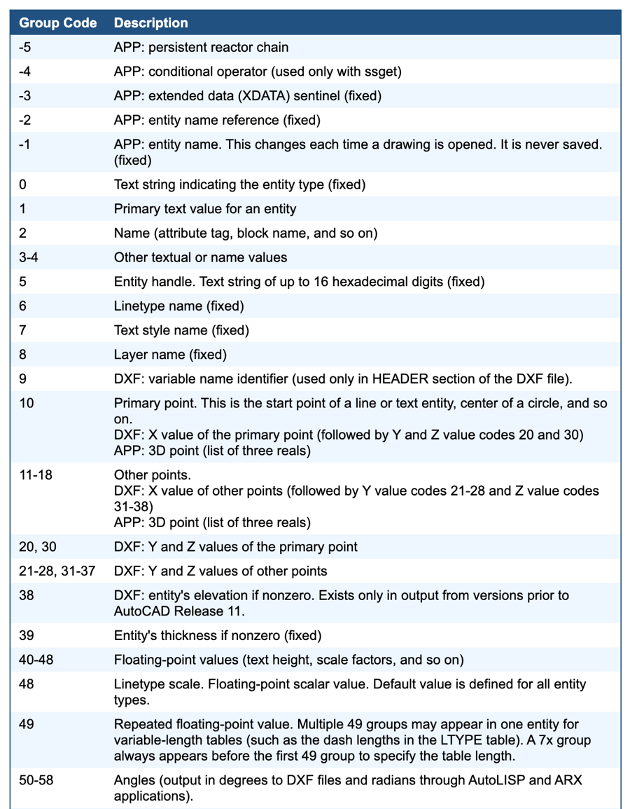

# 0501. DXF group codes

[DXF Group Codes | AfraLISP](https://www.afralisp.net/reference/dxf-group-codes.php)

-5 —— APP: persistent reactor chain

-4 —— APP: conditional operator (used only with ssget)

-3 —— APP: extended data (XDATA) sentinel (fixed)

-2 —— APP: entity name reference (fixed)

-1 —— APP: entity name. This changes each time a drawing is opened. It is never saved. (fixed)

0 —— Text string indicating the entity type (fixed)

1 —— Primary text value for an entity

2 —— Name (attribute tag, block name, and so on)

3-4 —— Other textual or name values

5	Entity handle. Text string of up to 16 hexadecimal digits (fixed)

6	Linetype name (fixed)

7	Text style name (fixed)

8	Layer name (fixed)

9	DXF: variable name identifier (used only in HEADER section of the DXF file).

10	Primary point. This is the start point of a line or text entity, center of a circle, and so on. DXF: X value of the primary point. (followed by Y and Z value codes 20 and 30) APP: 3D point (list of three reals)

11-18 Other points. DXF: X value of other points. (followed by Y value codes 21-28 and Z value codes 31-38) APP: 3D point (list of three reals)

20, 30 DXF: Y and Z values of the primary point

21-28, 31-37	DXF: Y and Z values of other points

38	DXF: entity's elevation if nonzero. Exists only in output from versions prior to AutoCAD Release 11.

39	Entity's thickness if nonzero (fixed)

40-48 Floating-point values (text height, scale factors, and so on)

48	Linetype scale. Floating-point scalar value. Default value is defined for all entity types.

49	Repeated floating-point value. Multiple 49 groups may appear in one entity for variable-length tables (such as the dash lengths in the LTYPE table). A 7x group always appears before the first 49 group to specify the table length.

50-58 Angles (output in degrees to DXF files and radians through AutoLISP and ARX applications).

60	Entity visibility. Integer value. Absence or 0 indicates visibility; 1 indicates invisibility.

62	Color number (fixed)

66	"Entities follow" flag (fixed)

67	Space--that is, model or paper space (fixed)

68	APP: identifies whether viewport is on but fully off screen; is not active or is off.

69	APP: viewport identification number.

70-78 —— Integer values, such as repeat counts, flag bits, or modes

90-99 32-bit integer values

100	Subclass data marker (with derived class name as a string). Required for all objects and entity classes that are derived from another concrete class to segregate data defined by different classes in the inheritance chain for the same object. This is in addition to the requirement for DXF names for each distinct concrete class derived from ARX (see "Subclass Markers").

102	Control string, followed by "{<arbitrary name>" or "}". Similar to the xdata 1002 group code, except that when the string begins with "{", it can be followed by an arbitrary string whose interpretation is up to the application. The only other allowable control string is "}" as a group terminator. As noted before, AutoCAD does not interpret these strings except during drawing audit operations; they are for application use.

105	DIMVAR symbol table entry object handle

210	Extrusion direction (fixed). DXF: X value of extrusion direction APP: 3D extrusion direction vector

220, 230	DXF: Y and Z values of the extrusion direction

280-289	8-bit integer values

300-309	Arbitrary text strings

310-319	Arbitrary binary chunks with same representation and limits as 1004 group codes: hexadecimal strings of up to 254 characters represent data chunks of up to 127 bytes.

320-329	Arbitrary object handles. Handle values that are taken "as is." They are not translated during INSERT and XREF operations.

330-339	Soft-pointer handle. Arbitrary soft pointers to other objects within same DXF file or drawing. Translated during INSERT and XREF operations.

340-349	Hard-pointer handle. Arbitrary hard pointers to other objects within same DXF file or drawing. Translated during INSERT and XREF operations.

350-359	Soft-owner handle. Arbitrary soft ownership links to other objects within same DXF file or drawing. Translated during INSERT and XREF operations.

360-369	Hard-owner handle. Arbitrary hard ownership links to other objects within same DXF file or drawing. Translated during INSERT and XREF operations.

999	DXF: The 999 group code indicates that the line following it is a comment string. DXFOUT does not include such groups in a DXF output file, but DXFIN honors them and ignores the comments. You can use the 999 group to include comments in a DXF file that you've edited.

1000 —— ASCII string (up to 255 bytes long) in extended data.

1001 —— Registered application name (ASCII string up to 31 bytes long) for extended data.

1002 —— Extended data control string (`"{"or "}"`).

1003 —— Extended data layer name.

1004 —— Chunk of bytes (up to 127 bytes long) in extended data.

1005 —— Entity handle in extended data. Text string of up to 16 hexadecimal digits

1010 —— A point in extended data. DXF: X value. (followed by 1020 and 1030 groups) APP: 3D point

1011 —— A 3D world space position in extended data. DXF: X value. (followed by 1021 and 1031 groups) APP: 3D point

1012 —— A 3D world space displacement in extended data. DXF: X value. (followed by 1022 and 1032 groups) APP: 3D vector

1013 —— A 3D world space direction in extended data. DXF: X value. (followed by 1022 and 1032 groups) APP: 3D vector

1020, 1030 —— DXF: Y and Z values of a point

1021, 1031 —— DXF: Y and Z values of a World space position

1022, 1032 —— DXF: Y and Z values of a World space displacement

1023, 1033 —— DXF: Y and Z values of a World space direction

1040 —— Extended data floating-point value.

1041 —— Extended data distance value.

1042 —— Extended data scale factor.

1070 —— Extended data 16-bit signed integer.

1071 —— Extended data 32-bit signed long.

