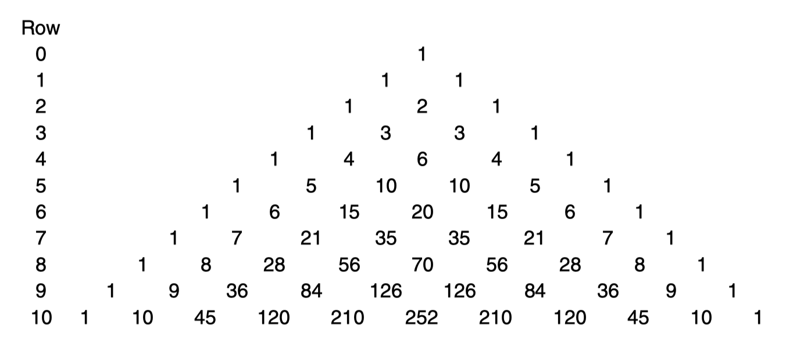

# 0401. Tracking the Pathways to Success

IF A GAMBLER of Cardano's day had understood Cardano's mathematical work on chance, he could have made a tidy profit betting against less sophisticated players. Today, with what he had to offer, Cardano could have achieved both fame and fortune writing books like The Idiot's Guide to Casting Dice with Suckers. But in his own time, Cardano's work made no big splash, and his Book on Games of Chance remained unpublished until long after his death. Why did Cardano's work have so little impact? As we've said, one hindrance to those who preceded him was the lack of a good system of algebraic notation. That system in Cardano's day was improving but was still in its infancy. Another roadblock, however, had yet to be removed: Cardano worked at a time when mystical incantation was more valued than mathematical calculation. If people did not look for the order in nature and did not develop numerical descriptions of events, then a theory of the effect of randomness on those events was bound to go unappreciated. As it turned out, had Cardano lived just a few decades later, both his work and its reception might have been far different, for the decades after his death saw the unfolding of historic changes in European thought and belief, a transformation that has traditionally been dubbed the scientific revolution.

The scientific revolution was a revolt against a way of thinking that was prevalent as Europe emerged from the Middle Ages, an era in which people's beliefs about the way the world worked were not scrutinized in any systematic manner. Merchants in one town stole the clothes off a hanged man because they believed it would help their sales of beer. Parishioners in another believed illness could be cured by chanting sacrilegious prayers as they marched naked around their church altar.1 One trader even believed that relieving himself in the「wrong」toilet would bring bad fortune. Actually he was a bond trader who confessed his secret to a CNN reporter in 2003.2 Yes, some people still adhere to superstitions today, but at least today, for those who are interested, we have the intellectual tools to prove or disprove the efficacy of such actions. But if Cardano's contemporaries, say, won at dice, rather than analyzing their experience mathematically, they would say a prayer of thanks or refuse to wash their lucky socks. Cardano himself believed that streaks of losses occur because「fortune is averse」and that one way to improve your results is to give the dice a good hard throw. If a lucky 7 is all in the wrist, why stoop to mathematics?

The moment that is often considered the turning point for the scientific revolution came in 1583, just seven years after Cardano's death. That is when a young student at the University of Pisa sat in a cathedral and, according to legend, rather than listening to the services, stared at something he found far more intriguing: the swinging of a large hanging lamp. Using his pulse as a timer, Galileo Galilei noticed that the lamp seemed to take the same amount of time to swing through a wide arc as it did to swing through a narrow one. That observation suggested to him a law: the time required by a pendulum to perform a swing is independent of the amplitude of the swing. Galileo's was a precise and practical observation, and although simple, it signified a new approach to the description of physical phenomena: the idea that science must focus on experience and experimentation — how nature operates — rather than on what intuition dictates or our minds find appealing. And most of all, it must be done with mathematics.

Galileo employed his scientific skills to write a short piece on gambling,「Thoughts about Dice Games.」The work was produced at the behest of his patron, the grand duke of Tuscany. The problem that bothered the grand duke was this: when you throw three dice, why does the number 10 appear more frequently than the number 9? The excess of 10s is only about 8 percent, and neither 10 nor 9 comes up very often, so the fact that the grand duke played enough to notice the small difference means he probably needed a good twelve-step program more than he needed Galileo. For whatever reason, Galileo was not keen to work on the problem and grumbled about it. But like any consultant who wants to stay employed, he kept his grumbling low-key and did his job.

If you throw a single die, the chances of any number in particular coming up are 1 in 6. But if you throw two dice, the chances of different totals are no longer equal. For example, there is a 1 in 36 chance of the dice totaling 2 but twice that chance of their totaling 3. The reason is that a total of 2 can be obtained in only 1 way, by tossing two 1s, but a total of 3 can be obtained in 2 ways, by tossing a 1 and then a 2 or a 2 and then a 1. That brings us to the next big step in understanding random processes, which is the subject of this chapter: the development of systematic methods for analyzing the number of ways in which events can happen.

THE KEY TO UNDERSTANDING the grand duke's confusion is to approach the problem as if you were a Talmudic scholar: rather than attempting to explain why 10 comes up more frequently than 9, we ask, why shouldn't 10 come up more frequently than 9? It turns out there is a tempting reason to believe that the dice should sum to 10 and 9 with equal frequency: both 10 and 9 can be constructed in 6 ways from the throw of three dice. For 9 we can write those ways as (621), (531), (522), (441), (432), and (333). For 10 they are (631), (622), (541), (532), (442), and (433). According to Cardano's law of the sample space, the probability of obtaining a favorable outcome is equal to the proportion of outcomes that are favorable. A sum of 9 and 10 can be constructed in the same number of ways. So why is one more probable than the other?

The reason is that, as I've said, the law of the sample space in its original form applies only to outcomes that are equally probable, and the combinations listed above are not. For instance, the outcome (631) — that is, throwing a 6, a 3, and a 1 — is 6 times more likely than the outcome (333) because although there is only 1 way you can throw three 3s, there are 6 ways you can throw a 6, a 3, and a 1: you can throw a 6 first, then a 3, and then a 1, or you can throw a 1 first, then a 3, then a 6, and so on. Let's represent an outcome in which we are keeping track of the order of throws by a triplet of numbers separated by commas. Then the short way of saying what we just said is that the outcome (631) consists of the possibilities (1,3,6), (1,6,3), (3,1,6), (3,6,1), (6,1,3), and (6,3,1), whereas the outcome (333) consists only of (3,3,3). Once we've made this decomposition, we can see that the outcomes are equally probable and we can apply the law. Since there are 27 ways of rolling a 10 with three dice but only 25 ways to get a total of 9, Galileo concluded that with three dice, rolling a 10 was 27/25, or about 1.08, times more likely.

In solving the problem, Galileo implicitly employed our next important principle: The chances of an event depend on the number of ways in which it can occur. That is not a surprising statement. The surprise is just how large that effect is — and how difficult it can be to calculate. For example, suppose you give a 10-question true-or-false quiz to your class of 25 sixth-graders. Let's do an accounting of the results a particular student might achieve: she could answer all questions correctly; she could miss 1 question — that can happen in 10 ways because there are 10 questions she could miss; she could miss a pair of questions — that can happen in 45 ways because there are 45 distinct pairs of questions; and so on. As a result, on average in a collection of students who are randomly guessing, for every student scoring 100 percent, you'll find about 10 scoring 90 percent and 45 scoring 80 percent. The chances of getting a grade near 50 percent are of course higher still, but in a class of 25 the probability that at least one student will get a B (80 percent) or better if all the students are guessing is about 75 percent. So if you are a veteran teacher, it is likely that among all the students over the years who have shown up unprepared and more or less guessed at your quizzes, some were rewarded with an A or a B.

A few years ago Canadian lottery officials learned the importance of careful counting the hard way when they decided to give back some unclaimed prize money that had accumulated.3 They purchased 500 automobiles as bonus prizes and programmed a computer to determine the winners by randomly selecting 500 numbers from their list of 2.4 million subscriber numbers. The officials published the unsorted list of 500 winning numbers, promising an automobile for each number listed. To their embarrassment, one individual claimed (rightly) that he had won two cars. The officials were flabbergasted — with over 2 million numbers to choose from, how could the computer have randomly chosen the same number twice? Was there a fault in their program?

The counting problem the lottery officials ran into is equivalent to a problem called the birthday problem: how many people must a group contain in order for there to be a better than even chance that two members of the group will share the same birthday (assuming all birth dates are equally probable)? Most people think the answer is half the number of days in a year, or about 183. But that is the correct answer to a different question: how many people do you need to have at a party for there to be a better than even chance that one of them will share your birthday? If there is no restriction on which two people will share a birthday, the fact that there are many possible pairs of individuals who might have shared birthdays changes the answer drastically. In fact, the answer is astonishingly low: just 23. When pulling from a pool of 2.4 million, as in the case of the Canadian lottery, it takes many more than 500 numbers to have an even chance of a repeat. But still that possibility should not have been ignored. The chances of a match come out, in fact, to about 5 percent. Not huge, but it could have been accounted for by having the computer cross each number off the list as it was chosen. For the record, the Canadian lottery requested the lucky fellow to forgo the second car, but he refused.

Another lottery mystery that raised many eyebrows occurred in Germany on June 21, 1995.4 The freak event happened in a lottery called Lotto 6/49, which means that the winning six numbers are drawn from the numbers 1 to 49. On the day in question the winning numbers were 15-25-27-30-42-48. The very same sequence had been drawn previously, on December 20, 1986. It was the first time in 3,016 drawings that a winning sequence had been repeated. What were the chances of that? Not as bad as you'd think. When you do the math, the chance of a repeat at some point over the years comes out to around 28 percent.

Since in a random process the number of ways in which an outcome can occur is a key to determining how probable it is, the key question is, how do you calculate the number of ways in which something can occur? Galileo seems to have missed the significance of that question. He did not carry his work on randomness beyond that problem of dice and said in the first paragraph of his work that he was writing about dice only because he had been「ordered」to do so.5 In 1633, as his reward for promoting a new approach to science, Galileo was condemned by the Inquisition. But science and theology had parted ways for good; scientists now analyzing how? were unburdened by the theologians' issue of why? Soon a scholar from a new generation, schooled since his youth on Galileo's philosophy of science, would take the analysis of contingency counting to new heights, reaching a level of understanding without which most of today's science could not be conducted.

WITH THE BLOSSOMING of the scientific revolution the frontiers of randomness moved from Italy to France, where a new breed of scientist, rebelling against Aristotle and following Galileo, developed it further and deeper than had either Cardano or Galileo. This time the importance of the new work would be recognized, and it would make waves all over Europe. Though the new ideas would again be developed in the context of gambling, the first of this new breed was more a mathematician turned gambler than, like Cardano, a gambler turned mathematician. His name was Blaise Pascal.

Pascal was born in June 1623 in Clermont-Ferrand, a little more than 250 miles south of Paris. Realizing his son's brilliance, and having moved to Paris, Blaise's father introduced him at age thirteen to a newly founded discussion group there that insiders called the Académie Mersenne after the black-robed friar who had founded it. Mersenne's society included the famed philosopher-mathematician René Descartes and the amateur mathematics genius Pierre de Fermat. The strange mix of brilliant thinkers and large egos, with Mersenne present to stir the pot, must have had a great influence on the teenage Blaise, who developed personal ties to both Fermat and Descartes and picked up a deep grounding in the new scientific method.「Let all the disciples of Aristotle…,」he would write,「recognize that experiment is the true master who must be followed in Physics.」6

But how did a bookish and stodgy fellow of pious beliefs become involved with issues of the urban gambling scene? On and off Pascal experienced stomach pains, had difficulty swallowing and keeping food down, and suffered from debilitating weakness, severe headaches, bouts of sweating, and partial paralysis of the legs. He stoically followed the advice of his physicians, which involved bleedings, purgings, and the consumption of asses' milk and other「disgusting」potions that he could barely keep from vomiting — a「veritable torture,」according to his sister Gilberte.7 Pascal had by then left Paris, but in the summer of 1647, aged twenty-four and growing desperate, he moved back with his sister Jacqueline in search of better medical care. There his new bevy of doctors offered the state-of-the-art advice that Pascal「ought to give up all continued mental labor, and should seek as much as possible all opportunities to divert himself.」8 And so Pascal taught himself to kick back and relax and began to spend time in the company of other young men of leisure. Then, in 1651, Blaise's father died, and suddenly Pascal was a twenty-something with an inheritance. He put the cash to good use, at least in the sense of his doctors' orders. Biographers call the years from 1651 to 1654 Pascal's「worldly period.」His sister Gilberte called it「the time of his life that was worst employed.」9 Though he put some effort into self-promotion, his scientific research went almost nowhere, but for the record, his health was the best it had ever been.

Often in history the study of the random has been aided by an event that was itself random. Pascal's work represents such an occasion, for it was his abandonment of study that led him to the study of chance. It all began when one of his partying pals introduced him to a forty-five-year-old snob named Antoine Gombaud. Gombaud, a nobleman whose title was chevalier de Méré, regarded himself as a master of flirtation, and judging by his catalog of romantic entanglements, he was. But de Méré was also an expert gambler who liked the stakes high and won often enough that some suspected him of cheating. And when he stumbled on a little gambling quandary, he turned to Pascal for help. With that, de Méré initiated an investigation that would bring to an end Pascal's scientific dry spell, cement de Méré's own place in the history of ideas, and solve the problem left open by Galileo's work on the grand duke's dice-tossing question.

The year was 1654. The question de Méré brought to Pascal was called the problem of points: Suppose you and another player are playing a game in which you both have equal chances and the first player to earn a certain number of points wins. The game is interrupted with one player in the lead. What is the fairest way to divide the pot? The solution, de Méré noted, should reflect each player's chance of victory given the score that prevails when the game is interrupted. But how do you calculate that?

Pascal realized that whatever the answer, the methods needed to calculate it were yet unknown, and those methods, whatever they were, could have important implications in any type of competitive situation. And yet, as often happens in theoretical research, Pascal found himself unsure of, and even confused about, his plan of attack. He decided he needed a collaborator, or at least another mathematician with whom he could discuss his ideas. Marin Mersenne, the great communicator, had died a few years earlier, but Pascal was still wired into the Académie Mersenne network. And so in 1654 began one of the great correspondences in the history of mathematics, between Pascal and Pierre de Fermat.

In 1654, Fermat held a high position in the Tournelle, or criminal court, in Toulouse. When the court was in session, a finely robed Fermat might be found condemning errant functionaries to be burned at the stake. But when the court was not in session, he would turn his analytic skills to the gentler pursuit of mathematics. He may have been an amateur, but Pierre de Fermat is usually considered the greatest amateur mathematician of all times.

Fermat had not gained his high position through any particular ambition or accomplishment. He achieved it the old-fashioned way, by moving up steadily as his superiors dropped dead of the plague. In fact, when Pascal's letter arrived, Fermat himself was recovering from a bout of the disease. He had even been reported dead, by his friend Bernard Medon. When Fermat didn't die, an embarrassed but presumably happy Medon retracted his announcement, but there is no doubt that Fermat had been on the brink. As it turned out, though twenty-two years Pascal's senior, Fermat would outlive his newfound correspondent by several years.

As we'll see, the problem of points comes up in any area of life in which two entities compete. In their letters, Pascal and Fermat each developed his own approach and solved several versions of the problem. But it was Pascal's method that proved simpler — even beautiful — and yet is general enough to be applied to many problems we encounter in our everyday experience. Because the problem of points first arose in a betting situation, I'll illustrate the problem with an example from the world of sports. In 1996 the Atlanta Braves beat the New York Yankees in the first 2 games of the baseball World Series, in which the first team to win 4 games is crowned champion. The fact that the Braves won the first 2 games didn't necessarily mean they were the superior team. Still, it could be taken as a sign that they were indeed better. Nevertheless, for our current purposes we will stick to the assumption that either team was equally likely to win each game and that the first 2 games just happened to go to the Braves.

Given that assumption, what would have been fair odds for a bet on the Yankees — that is, what was the chance of a Yankee comeback? To calculate it, we count all the ways in which the Yankees could have won and compare that to the number of ways in which they could have lost. Two games of the series had been played, so there were 5 possible games yet to play. And since each of those games had 2 possible outcomes — a Yankee win (Y) or a Braves win (B) — there were 25, or 32, possible outcomes. For instance, the Yankees could have won 3, then lost 2: YYYBB; or they could have alternated victories: YBYBY. (In the latter case, since the Braves would have won 4 games with the 6th game, the last game would never have been played, but we'll get to that in a minute.) The probability that the Yankees would come back to win the series was equal to the number of sequences in which they would win at least 4 games divided by the total number of sequences, 32; the chance that the Braves would win was equal to the number of sequences in which they would win at least 2 more games also divided by 32.

This calculation may seem odd, because as I mentioned, it includes scenarios (such as YBYBY) in which the teams keep playing even after the Braves have won the required 4 games. The teams would certainly not play a 7th game once the Braves had won 4. But mathematics is independent of human whim, and whether or not the players play the games does not affect the fact that such sequences exist. For example, suppose you're playing a coin-toss game in which you win if at any time heads come up. There are 22, or 4, possible two-toss sequences: HT, HH, TH, and TT. In the first two of these, you would not bother tossing the coin again because you would already have won. Still, your chances of winning are 3 in 4 because 3 of the 4 complete sequences include an H.

So in order to calculate the Yankees' and the Braves' chances of victory, we simply make an accounting of the possible 5-game sequences for the remainder of the series. First, the Yankees would have been victorious if they had won 4 of the 5 possible remaining games. That could have happened in 1 of 5 ways: BYYYY, YBYYY, YYBYY, YYYBY, or YYYYB. Alternatively, the Yankees would have triumphed if they had won all 5 of the remaining games, which could have happened in only 1 way: YYYYY. Now for the Braves: they would have become champions if the Yankees had won only 3 games, which could have happened in 10 ways (BBYYY, BYBYY, and so on), or if the Yankees had won only 2 games (which again could have happened in 10 ways), or if the Yankees had won only 1 game (which could have happened in 5 ways), or if they had won none (which could have happened in only 1 way). Adding these possible outcomes together, we find that the chance of a Yankees victory was 6 in 32, or about 19 percent, versus 26 in 32, or about 81 percent for the Braves. According to Pascal and Fermat, if the series had abruptly been terminated, that's how they should have split the bonus pot, and those are the odds that should have been set if a bet was to be made after the first 2 games. For the record, the Yankees did come back to win the next 4 games, and they were crowned champion.

The same reasoning could also be applied to the start of the series — that is, before any game has been played. If the two teams have equal chances of winning each game, you will find, of course, that they have an equal chance of winning the series. But similar reasoning works if they don't have an equal chance, except that the simple accounting I just employed would have to be altered slightly: each outcome would have to be weighted by a factor describing its relative probability. If you do that and analyze the situation at the start of the series, you will discover that in a 7-game series there is a sizable chance that the inferior team will be crowned champion. For instance, if one team is good enough to warrant beating another in 55 percent of its games, the weaker team will nevertheless win a 7-game series about 4 times out of 10. And if the superior team could be expected to beat its opponent, on average, 2 out of each 3 times they meet, the inferior team will still win a 7-game series about once every 5 matchups. There is really no way for sports leagues to change this. In the lopsided 2/3-probability case, for example, you'd have to play a series consisting of at minimum the best of 23 games to determine the winner with what is called statistical significance, meaning the weaker team would be crowned champion 5 percent or less of the time (see chapter 5). And in the case of one team's having only a 55–45 edge, the shortest statistically significant「world series」would be the best of 269 games, a tedious endeavor indeed! So sports playoff series can be fun and exciting, but being crowned「world champion」is not a very reliable indication that a team is actually the best one.

As I said, the same reasoning applies to more than games, gambling, and sports. For example, it shows that if two companies compete head-to-head or two employees within a company compete, though there may be a winner and a loser each quarter or each year, to get a reliable answer regarding which company or which employee is superior by simply tallying who beats whom, you'd have to make the comparison over decades or centuries. If, for instance, employee A is truly superior and would in the long run win a performance comparison with employee B on 60 out of 100 occasions, in a simple best-of-5 series of comparisons the weaker employee will still win almost one-third of the time. It is dangerous to judge ability by short-term results.

The counting in all these problems has been simple enough to carry out without much effort. But when the numbers are higher, the counting becomes difficult. Consider, for example, this problem: You are arranging a wedding reception for 100 guests, and each table seats 10. You can't sit your cousin Rod with your friend Amy because eight years ago they had an affair and she dumped him. On the other hand, both Amy and Leticia want to sit next to your buff cousin Bobby, and your aunt Ruth had better be at a table out of earshot or the dueling flirtations will be gossip fodder for holiday dinners for the next five years. You carefully consider the possibilities. Take just the first table. How many ways are there to choose 10 people from a group of 100? That's the same question as, in how many ways can you apportion 10 investments among 100 mutual funds or 10 germanium atoms among 100 locations in a silicon crystal? It's the type of problem that comes up repeatedly in the theory of randomness, and not only in the problem of points. But with larger numbers it is tedious or impossible to count the possibilities by listing them explicitly. That was Pascal's real accomplishment: a generally applicable and systematic approach to counting that allows you to calculate the answer from a formula or read it off a chart. It is based on a curious arrangement of numbers in the shape of a triangle.

THE COMPUTATIONAL METHOD at the heart of Pascal's work was actually discovered by a Chinese mathematician named Jia Xian around 1050, published by another Chinese mathematician, Zhu Shijie, in 1303, discussed in a work by Cardano in 1570, and plugged into the greater whole of probability theory by Pascal, who ended up getting most of the credit.10 But the prior work didn't bother Pascal.「Let no one say I have said nothing new,」Pascal argued in his autobiography.「The arrangement of the subject is new. When we play tennis, we both play with the same ball, but one of us places it better.」11 The graphic invention employed by Pascal, given below, is thus called Pascal's triangle. In the figure, I have truncated Pascal's triangle at the tenth row, but it can be continued downward indefinitely. In fact, it is easy to continue the triangle, for with the exception of the 1 at the apex, each number is the sum of the number in the line above it to the left and the number in the line above it to the right (add a 0 if there is no number in the line above it to the left or to the right).



Pascal's triangle

Pascal's triangle is useful any time you need to know the number of ways in which you can choose some number of objects from a collection that has an equal or greater number. Here is how it works in the case of the wedding guests: To find the number of distinct seatings of 10 you can form from a group of 100 guests, you would start by looking down the numbers to the left of the triangle until you found the row labeled 100. The triangle I supplied does not go down that far, but for now let's pretend it does. The first number in row 100 tells you the number of ways you can choose 0 guests from a group of 100. There is just 1 way, of course: you simply don't choose anyone. That is true no matter how many total guests you are choosing from, which is why the first number in every row is a 1. The second number in row 100 tells you the number of ways you can choose 1 guest from the group of 100. There are 100 ways to do that: you can choose just guest number 1, or just guest number 2, and so on. That reasoning applies to every row, and so the second number in each row is simply the number of that row. The third number in each row represents the number of distinct groups of 2 you can form, and so on. The number we seek — the number of distinct arrangements of 10 you can form — is therefore the eleventh number in the row. Even if I had extended the triangle to include 100 rows, that number would be far too large to put on the page. In fact, when some wedding guest inevitably complains about the seating arrangements, you might point out how long it would have taken you to consider every possibility: assuming you spent one second considering each one, it would come to roughly 10,000 billion years. The unhappy guest will assume, of course, that you are being histrionic.

In order for us to use Pascal's triangle, let's say for now that your guest list consists of just 10 guests. Then the relevant row is the one at the bottom of the triangle I provided, labeled 10. The numbers in that row represent the number of distinct tables of 0, 1, 2, and so on, that can be formed from a collection of 10 people. You may recognize these numbers from the sixth-grade quiz example — the number of ways in which a student can get a given number of problems wrong on a 10-question true-or-false test is the same as the number of ways in which you can choose guests from a group of 10. That is one of the reasons for the power of Pascal's triangle: the same mathematics can be applied to many different situations. For the Yankees-Braves World Series example, in which we tediously counted all the possibilities for the remaining 5 games, we can now read the number of ways in which the Yankees can win 0, 1, 2, 3, 4, or 5 games directly from row 5 of the triangle:

1 5 10 10 5 1

We can see at a glance that the Yankees' chance of winning 2 games (10 ways) was twice as high as their chance of winning 1 game (5 ways).

Once you learn the method, applications of Pascal's triangle crop up everywhere. A friend of mine once worked for a start-up computer-games company. She would often relate how, although the marketing director conceded that small focus groups were suited for「qualitative conclusions only,」she nevertheless sometimes reported an「overwhelming」4-to-2 or 5-to-1 agreement among the members of the group as if it were meaningful. But suppose you hold a focus group in which 6 people will examine and comment on a new product you are developing. Suppose that in actuality the product appeals to half the population. How accurately will this preference be reflected in your focus group? Now the relevant line of the triangle is the one labeled 6, representing the number of possible subgroups of 0, 1, 2, 3, 4, 5, or 6 whose members might like (or dislike) your product:

1 6 15 20 15 6 1

From these numbers we see that there are 20 ways in which the group members could split 50/50, accurately reflecting the views of the populace at large. But there are also 1 + 6 + 15 + 15 + 6 + 1 = 44 ways in which you might find an unrepresentative consensus, either for or against. So if you are not careful, the chances of being misled are 44 out of 64, or about two-thirds. This example does not prove that if agreement is achieved, it is random. But neither should you assume that it is significant.

Pascal and Fermat's analysis proved to be a big first step in a coherent mathematical theory of randomness. The final letter of their famous exchange is dated October 27, 1654. A few weeks later Pascal sat in a trance for two hours. Some call that trance a mystical experience. Others lament that he had finally blasted off from planet Sanity. However you describe it, Pascal emerged from the event a transformed man. It was a transformation that would lead him to make one more fundamental contribution to the concept of randomness.

IN 1662, a few days after Pascal died, a servant noticed a curious bulge in one of Pascal's jackets. The servant pulled open the lining to find hidden within it folded sheets of parchment and paper. Pascal had apparently carried them with him every day for the last eight years of his life. Scribbled on the sheets, in his handwriting, was a series of isolated words and phrases dated November 23, 1654. The writings were an emotional account of the trance, in which he described how God had come to him and in the space of two hours delivered him from his corrupt ways.

Following that revelation, Pascal had dropped most of his friends, calling them「horrible attachments.」12 He sold his carriage, his horses, his furniture, his library — everything except his Bible. He gave his money to the poor, leaving himself with so little that he often had to beg or borrow to obtain food. He wore an iron belt with points on the inside so that he was in constant discomfort and pushed the belt's spikes into his flesh whenever he found himself in danger of feeling happy. He denounced his studies of mathematics and science. Of his childhood fascination with geometry, he wrote,「I can scarcely remember that there is such a thing as geometry. I recognize geometry to be so useless…it is quite possible I shall never think of it again.」13

Yet Pascal remained productive. In the years that followed the trance, he recorded his thoughts about God, religion, and life. Those thoughts were later published in a book titled Pensées, a work that is still in print today. And although Pascal had denounced mathematics, amid his vision of the futility of the worldly life is a mathematical exposition in which he trained his weapon of mathematical probability squarely on a question of theology and created a contribution just as important as his earlier work on the problem of points.

The mathematics in Pensées is contained in two manuscript pages covered on both sides by writing going in every direction and full of erasures and corrections. In those pages, Pascal detailed an analysis of the pros and cons of one's duty to God as if he were calculating mathematically the wisdom of a wager. His great innovation was his method of balancing those pros and cons, a concept that is today called mathematical expectation.

Pascal's argument went like this: Suppose you concede that you don't know whether or not God exists and therefore assign a 50 percent chance to either proposition. How should you weigh these odds when deciding whether to lead a pious life? If you act piously and God exists, Pascal argued, your gain — eternal happiness — is infinite. If, on the other hand, God does not exist, your loss, or negative return, is small — the sacrifices of piety. To weigh these possible gains and losses, Pascal proposed, you multiply the probability of each possible outcome by its payoff and add them all up, forming a kind of average or expected payoff. In other words, the mathematical expectation of your return on piety is one-half infinity (your gain if God exists) minus one-half a small number (your loss if he does not exist). Pascal knew enough about infinity to know that the answer to this calculation is infinite, and thus the expected return on piety is infinitely positive. Every reasonable person, Pascal concluded, should therefore follow the laws of God. Today this argument is known as Pascal's wager.

Expectation is an important concept not just in gambling but in all decision making. In fact, Pascal's wager is often considered the founding of the mathematical discipline of game theory, the quantitative study of optimal decision strategies in games. I must admit I find such thinking addictive, and so I sometimes carry it a bit too far.「How much does that parking meter cost?」I ask my son. The sign says 25¢. Yes, but 1 time in every 20 or so visits, I come back late and find a ticket, which runs `$`40, so the 25¢ cost of the meter is really just a cruel lure, I explain, because my real cost is `$`2.25. (The extra `$`2 comes from my 1 in 20 chance of getting a ticket multiplied by its `$`40 cost.)「How about our driveway,」I ask my other son,「is it a toll road?」Well, we've lived at the house about 5 years, or roughly 2,400 times of backing down the driveway, and 3 times I've clipped my mirror on the protruding fence post at `$`400 a shot. You may as well put a toll box out there and toss in 50¢ each time you back up, he tells me. He understands expectation. (He also recommends that I refrain from driving them to school before I've had my morning coffee.)

Looking at the world through the lens of mathematical expectation, one often comes upon surprising results. For example, a recent sweepstakes sent through the mail offered a grand prize of `$`5 million.14 All you had to do to win was mail in your entry. There was no limit on how many times you could enter, but each entry had to be mailed in separately. The sponsors were apparently expecting about 200 million entries, because the fine print said that the chances of winning were 1 in 200 million. Does it pay to enter this kind of「free sweepstakes offer」? Multiplying the probability of winning times the payoff, we find that each entry was worth 1/40 of `$`1, or 2.5¢ — far less than the cost of mailing it in. In fact, the big winner in this contest was the post office, which, if the projections were correct, made nearly `$`80 million in postage revenue on all the submissions.

Here's another crazy game. Suppose the state of California made its citizens the following offer: Of all those who pay the dollar or two to enter, most will receive nothing, one person will receive a fortune, and one person will be put to death in a violent manner. Would anyone enroll in that game? People do, and with enthusiasm. It is called the state lottery. And although the state does not advertise it in the manner in which I have described it, that is the way it works in practice. For while one lucky person wins the grand prize in each game, many millions of other contestants drive to and from their local ticket vendors to purchase their tickets, and some die in accidents along the way. Applying statistics from the National Highway Traffic Safety Administration and depending on such assumptions as how far each individual drives, how many tickets he or she buys, and how many people are involved in a typical accident, you find that a reasonable estimate of those fatalities is about one death per game.

State governments tend to ignore arguments about the possible bad effects of lotteries. That's because, for the most part, they know enough about mathematical expectation to arrange that for each ticket purchased, the expected winnings — the total prize money divided by the number of tickets sold — is less than the cost of the ticket. This generally leaves a tidy difference that can be diverted to state coffers. In 1992, however, some investors in Melbourne, Australia, noticed that the Virginia Lottery violated this principle.15 The lottery involved picking 6 numbers from 1 to 44. Pascal's triangle, should we find one that goes that far, would show that there are 7,059,052 ways of choosing 6 numbers from a group of 44. The lottery jackpot was `$`27 million, and with second, third, and fourth prizes included, the pot grew to `$`27,918,561. The clever investors reasoned, if they bought one ticket with each of the possible 7,059,052 number combinations, the value of those tickets would equal the value of the pot. That made each ticket worth about `$`27.9 million divided by 7,059,052, or about `$`3.95. For what price was the state of Virginia, in all its wisdom, selling the tickets? The usual `$`1.

The Australian investors quickly found 2,500 small investors in Australia, New Zealand, Europe, and the United States willing to put up an average of `$`3,000 each. If the scheme worked, the yield on that investment would be about `$`10,800. There were some risks in their plan. For one, since they weren't the only ones buying tickets, it was possible that another player or even more than one other player would also choose the winning ticket, meaning they would have to split the pot. In the 170 times the lottery had been held, there was no winner 120 times, a single winner only 40 times, and two winners just 10 times. If those frequencies reflected accurately their odds, then the data suggested there was a 120 in 170 chance they would get the pot all to themselves, a 40 in 170 chance they would end up with half the pot, and a 10 in 170 chance they would win just a third of it. Recalculating their expected winnings employing Pascal's principle of mathematical expectation, they found them to be (120/170 × `$`27.9 million) + (40/170 × `$`13.95 million) + (10/170 × `$`6.975 million) = `$`23.4 million. That is `$`3.31 per ticket, a great return on a `$`1 expenditure even after expenses.

But there was another danger: the logistic nightmare of completing the purchase of all the tickets by the lottery deadline. That could lead to the expenditure of a significant portion of their funds with no significant prize to show for it.

The members of the investment group made careful preparations. They filled out 1.4 million slips by hand, as required by the rules, each slip good for five games. They placed groups of buyers at 125 retail outlets and obtained cooperation from grocery stores, which profited from each ticket they sold. The scheme got going just seventy-two hours before the deadline. Grocery-store employees worked in shifts to sell as many tickets as possible. One store sold 75,000 in the last forty-eight hours. A chain store accepted bank checks for 2.4 million tickets, assigned the work of printing the tickets among its stores, and hired couriers to gather them. Still, in the end, the group ran out of time: they had purchased just 5 million of the 7,059,052 tickets.

Several days passed after the winning ticket was announced, and no one came forward to present it. The consortium had won, but it took its members that long to find the winning ticket. Then, when state lottery officials discovered what the consortium had done, they balked at paying. A month of legal wrangling ensued before the officials concluded they had no valid reason to deny the group. Finally, they paid out the prize.

To the study of randomness, Pascal contributed both his ideas about counting and the concept of mathematical expectation. Who knows what else he might have discovered, despite his renouncing mathematics, if his health had held up. But it did not. In July 1662, Pascal became seriously ill. His physicians prescribed the usual remedies: they bled him and administered violent purges, enemas, and emetics. He improved for a while, and then the illness returned, along with severe headaches, dizziness, and convulsions. Pascal vowed that if he survived, he would devote his life to helping the poor and asked to be moved to a hospital for the incurable, in order that, if he died, he would be in their company. He did die, a few days later, in August 1662. He was thirty-nine. An autopsy found the cause of death to be a brain hemorrhage, but it also revealed lesions in his liver, stomach, and intestines that accounted for the illnesses that had plagued him throughout his life.

## Notes

1 Bengt Ankarloo and Stuart Clark, eds., Witchcraft and Magic in Europe: The Period of the Witch Trials (Philadelphia: University of Pennsylvania Press, 2002), pp. 99–104.

2 Meghan Collins,「Traders Ward Off Evil Spirits,」October 31, 2003, http://www.CNNMoney.com/2003/10/28/markets_trader_superstition/index.htm.

3 Henk Tijms, Understanding Probability: Chance Rules in Everyday Life (Cambridge: Cambridge University Press, 2004), p. 16.

4 Ibid., p. 80.

5 David, Gods, Games and Gambling, p. 65.

6 Blaise Pascal, quoted in Jean Steinmann, Pascal, trans. Martin Turnell (New York: Harcourt, Brace & World, 1962), p. 72.

7 Gilberte Pascal, quoted in Morris Bishop, Pascal: The Life of a Genius (1936; repr., New York: Greenwood Press, 1968), p. 47.

8 Ibid., p. 137.

9 Gilberte Pascal, quoted ibid., p. 135.

10 See A.W.F. Edwards, Pascal's Arithmetical Triangle: The Story of a Mathematical Idea (Baltimore: Johns Hopkins University Press, 2002).

11 Blaise Pascal, quoted in Herbert Westren Turnbull, The Great Mathematicians (New York: New York University Press, 1961), p. 131.

12 Blaise Pascal, quoted in Bishop, Pascal, p. 196.

13 Blaise Pascal, quoted in David, Gods, Games and Gambling, p. 252.

14 Bruce Martin,「Coincidences: Remarkable or Random?」Skeptical Inquirer 22, no. 5 (September/October 1998).

15 Holland, What Are the Chances? pp. 86–89.

0401追寻通往成功的路径

在卡尔达诺的时代，如果有赌徒能够得知他在随机性方面的数学成就，就能利用这些知识，在跟不那么聪明的人赌博时赚到可观的利润。换成今天，卡尔达诺同样能写出诸如《与容易上当的笨蛋玩扔骰子之傻瓜指南》这样的书，并靠它名利双收。但在他那个时代，卡尔达诺的工作却没有激起多少涟漪。《机遇博弈》一书在他死后很久也未能出版。为什么卡尔达诺的工作没能产生多大的影响？正如我们之前已经提到的那样，对他之前的人而言，通往概率论的障碍之一，就在于缺乏一个良好的代数符号体系；到卡尔达诺时，虽然符号系统有了改进，但只能算处在襁褓之中。另外还有一个障碍需要跨越：卡尔达诺完成他的工作的时代，是一个人们认为神秘咒语比数学运算更有用的时代。如果人们根本就没打算找寻自然的秩序，也不曾考虑要创造一种对事件的数值描述，那么一个用来阐述随机性对这些事件的影响的理论，自然注定是不会被人赏识的。后来的历史表明，如果卡尔达诺能多活几十年，他所达到的成就，以及这些成就能被接受的程度，就完全是另一码事了。因为在他死后的几十年里，欧洲的思想与信念发生了历史性转变，这个转变常常被称为科学革命。

对于刚刚摆脱中世纪桎梏的欧洲而言，科学革命是对当时大众思维方式的一次反叛。在中世纪这个刚刚成为历史的时代中，人们关于世界运转方式的观念，还未被任何人以系统的方式深究过。某个小城的商人会偷走被绞死者的衣服，因为他相信这有助于啤酒的销量；而另一个小城教区的居民则相信，裸体围着教堂的祭坛绕圈并吟唱渎神的祷歌可以治愈疾病。某人甚至相信使用了「错误」的厕所会带来坏运气。事实上，该名证券交易员是在 2003 年向 CNN（美国有限电视新闻网）记者坦白这个秘密的。没错，至今还有人仍然迷信，但到了今天，只要你有兴趣，我们就能拥有可以证明或证伪类似行为的功效的知性工具。不过，对于卡尔达诺同时代的人来说，他们并不会对扔赢骰子的经验进行数学分析，而是会跑去做一次感恩祷告，或者从此再也不洗当时穿的那双幸运袜子。卡尔达诺自己也相信，之所以会出现一连串的失败，是因为「幸运之神也有些不快」了，而要改变此种状况，方法之一就是把骰子狠狠地扔一下。如果我们可以把幸运之 7 的彩票结果玩弄于股掌之上，为什么还要对数学卑躬屈膝呢？

常被视为科学革命转折点的那个时刻，出现在 1583 年，此时距卡尔达诺去世才不过 7 年。比萨大学一名年轻的学生正坐在大教堂中。传说他并没有聆听教堂中进行的仪式，却在怔怔地看着一个东西，一件他觉得比那些仪式更有启发性的事情：一盏巨大的吊灯在来回摆动。伽利略用自己的脉搏计时，发现吊灯摆过一个长弧形所用的时间，似乎跟它摆过一个较短弧形的时间是一样的。这个观察似乎暗示着：一个摆完成一次摆动所需的时间，与摆动的幅度无关。伽利略的观察精确而实用，它虽然很简单，却代表了一条描述物理现象的新道路：科学必须专注于经验与实验，即大自然的运作方式，而非直觉认定或对我们更具吸引力的什么东西。最重要的是，这个描述必须通过数学来完成。

伽利略利用他在科学方面的技巧，写了一篇有关赌博的短文《骰子游戏之思考》。这项工作是在其资助人托斯卡纳大公的要求下完成的。困扰大公的问题是这样的：为什么扔 3 次骰子，出现总点数为 10 点的情况比 9 点更频繁？这个频率上的差别只有区区 8% 左右，而且，扔出 10 点或 9 点的情况都并不常见，因此大公能够发现这个微小的差别，一定是在这个骰子游戏上花费了相当多的时间。看来相比于伽利略，大公更需要一个 12 步赌瘾戒除计划。不过不管是什么原因，伽利略对这个问题没有多大兴趣，也不免对这个任务嘟嘟囔囔牢骚满腹。但跟每个不想丢掉饭碗的顾问一样，他把这些牢骚吞进了自己的肚子，然后该干什么还是得干什么。

单独扔一次骰子，每个点数出现的机会都是 1/6。但如果扔两次骰子，可能出现的总点数的机会就不再均等了。例如，扔出 2 点的机会是 1/36，而扔出 3 点的机会要高一倍。造成这个差异的原因在于，如果扔两次骰子，那么只有一种情况能得到 2 点 —— 两次都是 1 点；而扔出 3 点则有两种情况 —— 先扔出 1 点再扔出 2 点，或者先 2 点之后是 1 点。沿着这个思路走下去，就是我们理解随机过程的下一步，同时也是本章的主题：如何建立一种系统性的方法，来分析事件的不同出现方式的数量。

为了理解大公的困惑，让我们把自己想象成一名《塔木德》学者，然后来看看这个问题：与其试图解释为什么 10 点比 9 点出现得更频繁，不如问问为什么 10 点不应该比 9 点出现得更频繁。我们可以给出一个很容易让人接受的理由，来说明 10 点和 9 点应当出现得同样频繁：如果扔 3 次骰子，那么我们有 6 种方式得到 10 点和 9 点。扔出 9 点的方式是（621）、（531）、（522）、（441）和（333）；10 点则是（631）、（622）、（541）、（532）、（442）和（433）。根据卡尔达诺的样本空间定律，得到一个好结果的概率，等于所有好结果在所有可能结果中所占的比例。既然 9 点和 10 点能通过同样多的方式得到，为什么其中一个会比另一个更可能发生呢？

原因正如我说的那样，原始形式的样本空间定律只适用于等可能性的结果，而上述的点数组合，各自发生的可能性并不相等。比如扔出（631），即扔出 1 个 6 点、1 个 3 点和 1 个 1 点的可能性，6 倍于扔出（333）的可能性，因为扔出 3 个 3 点的方式只有 1 种，而扔出 1 个 6 点、1 个 3 点和 1 个 1 点的方式却有 6 种：先 6 后 3 后 1，或先 1 后 3 后 6，等等。现在，我们换种方式表示扔骰子的结果：我们用逗号隔开的三元组来表示投掷结果，并以此区分扔骰子的次序。简单来说，（631）这个结果由以下的可能组合给出：（1, 3, 6）、（1, 6, 3）、（3, 1, 6）、（3, 6, 1）、（6, 1, 3）和（6, 3, 1）；而（333）这个结果只能是（3, 3, 3）。将扔骰子的结果如此分解之后，新方式下的各种结果就具有了相等的可能性，这时我们就能应用样本空间定律了。这种情况下，扔出 10 点的方式有 27 种，而扔出 9 点的只有 25 种，伽利略由此得出结论，即扔三次骰子得到 10 点的可能性，是得到 9 点的可能性的 27/25，即约 1.08 倍。

在这个问题的解决过程中，伽利略隐含地使用了我们的下一条重要原则：一个事件发生的可能性，依赖于这个事件所有可能发生方式的数量。这一事实并不让人吃惊，真正让人吃惊的，是这条原则造成的影响，以及这个数量的计算难度。假设全班 25 名 6 年级学生进行了一次 10 道判断题的小测验，让我们来算算某个学生可能得到的测验结果有多少种：她可能 10 道题全对；她可能只错 1 道题 —— 出现这种情况的方式有 10 种，因为总共有 10 道题供她挑出一个来犯错；她可能只错 2 道题 —— 这种情况对应了 45 种方式，因为这 10 道题能组成 45 对不同的题目构成的题对儿；等等。这样组合的结果就是，假设有一大群学生，他们都是靠碰运气来猜答案的，那么平均而言，对应着每一个得满分的学生，将会有 10 个得 90 分的学生和 45 个得 80 分的学生。得到 50 分左右的成绩的可能性就更高了。对于一个有 25 名学生的班级来说，如果学生都靠猜，那么至少有一名学生能得到 B（80 分）或更高分的概率，差不多是 75%。因此，一名老教师在多年从教中所碰到的那些考前不好好复习、测验时多少在赌一把的学生中，很可能会有一些人的最后得分为 A 或 B。

几年前，加拿大彩票管理部门决定，将一些以往积累下来的无人认领奖金返还给彩民。在这个过程中，他们可结结实实地领教了认真数数的重要性。该部门购买了 500 辆小汽车作为奖品，然后编写了一个计算机程序，从 240 万个彩票订户号中随机抽出 500 个作为奖品的赢取者。官方公布了这 500 个未排序的获奖号码，并承诺每个号码都能赢得一辆汽车。使他们大为尴尬的是，有一个人（正确地）宣称他赢得了两辆汽车。官员们哑然失色 —— 计算机怎么可能从 200 多万个数字中，两次抽中同一个数字呢？是不是程序有问题？

这些彩票官员碰到的计数问题，和「生日问题」是等价的，这个问题问：「如果希望一群人中出现某两人生日相同（假定每天出生的可能性都相等）的可能性大于 50%，这个群体至少应该有多少人？」大多数人都觉得答案应该是一年中天数的一半，也就是大约 183 人。不过如果问题问的是：「要一群人中有某人与你同一天生日的可能性大于 50%，这个群体至少应该有多少人？」那么上面的答案是正确的。但如果问题没有限制到底是哪两个人同一天出生，那么问题的答案被这样一对儿生日相同的人的组合方式的数量戏剧性地改变了。实际上，我们需要的人数少得令人吃惊：仅仅需要 23 个人就够了。如果像加拿大彩票的情况那样，从 240 万个数字中挑数字，我们当然需要远多于 500 个数字，以保证出现重复数字的可能性大于 50%，但仅仅是 500 个数字中发生重复的可能性，也绝非可以忽略不计：实际上，这个概率大约是 5%。不大，但仍然是个需要解决的问题，比如我们可以在计算机每抽取一个数字后，就将它与所有已抽出的数字进行比对，确定是否发生了重复抽取。据报道，加拿大彩票部门要求这个幸运儿放弃一辆汽车，但是遭到拒绝。

而在 1995 年 6 月 21 日的德国，发生了另一起让许多人眼珠子都掉出来的彩票神秘事件。那是一个被称为乐透 6/49 的彩票抽奖，中奖的 6 个号码从数字 1 到 49 中随机抽得。这天的中奖号码是 15-2527-30-42-48，而完全相同的中奖号码在 1986 年 12 月 20 日那天也被抽到过。在这个彩票 3016 次抽奖的历史上，出现重复的中奖序列，这可是破天荒的头一遭。那发生这种事情的可能性有多大呢？并不像你想的那么小。算一算你就会发现，在进行抽奖的这些年里，在某个时刻发生中奖号码重复的概率大概是 28%。

在一个随机过程中，某结果的可能发生方式的数量，是决定该结果发生概率的关键因素之一，因此我们现在的关键问题就在于，怎样才能计算出某事件可能发生方式的数量？伽利略似乎没有注意到这个问题的重要性，他也没有在这个骰子问题上深入下去。不仅如此，他在论文的第一段就说，他之所以写下这篇有关骰子的文章，完全是因为「命令」。1633 年，伽利略收到了他所提出的通往科学的新方法的奖赏 —— 宗教裁判所判处的刑罚。但科学与神学从此永远地分道扬镳了：从这一刻起，科学家卸下了神学家所提出的「（这个世界）为什么（会这样）」的包袱，转而专注于分析「（物理现象是）如何（运作）」的问题。不久之后，那些从小就接受伽利略科学哲学教诲的新一代学者中的一员，将把对可能事件进行计数的数学分析带到一个全新的高度和认知水平上，而如果没有这些认知，当今科学中的绝大部分内容都将无法开展。

随着科学革命欣欣向荣，随机性研究的前线从意大利移到法国。在那里，抛弃了亚里士多德而跟随伽利略的新科学家们，将研究推至比卡尔达诺和伽利略更远也更深的境地。新成就的重要性这次终于为人所知，并形成一股席卷欧洲的浪潮。新观点和新思路再次诞生于博弈这个大背景下，但这些科学家中的第一人，却由数学家变为赌徒，而不是像卡尔达诺那样从赌徒变成数学家。这位科学家的名字是布莱瑟·帕斯卡。

帕斯卡 1623 年 7 月出生于巴黎南边 250 英里以外的克莱蒙费朗。他的父亲发现了儿子的聪明才智，正好又搬家到了巴黎，因此，他推荐 13 岁的帕斯卡加入一个新成立的讨论群。成员们都称这个群体为梅赛纳学院 —— 以创建该团体的黑袍修士的名字命名。梅赛纳的小圈子包括著名哲学家与数学家笛卡儿，以及业余数学天才费马。这些睿智的思想家与自大狂的奇特组合 —— 再加上梅赛纳的积极引导，对十多岁的布莱瑟产生了巨大的影响。他与费马和笛卡儿建立了私人往来，并迅速认识到科学新方法的深层基础。「让所有亚里士多德的信徒……」他写道，「认识到实验才是物理学必须遵从的真正主人。」

但一个有着神圣信仰的乏味的书呆子，怎么会跟城里的赌博圈扯上关系呢？帕斯卡一直断断续续地经受着胃痛的折磨，他吞咽困难，而要让吞下的东西不再返上来也不容易。此外，他还忍受着使人体质变差的虚弱、严重的头痛、一阵阵冒虚汗以及腿部部分瘫痪的折磨。他坚强地遵从医生的建议，这些建议包括使用放血疗法、服用泻药以及驴奶和其他「令人作呕的」药剂，而喝下去的那些药剂差不多都被他吐了出来 —— 按他姐姐吉尔贝特的说法，这些治疗完全是一种「不折不扣的虐待」。帕斯卡这时已经离开了巴黎，但在 1647 年夏天，已经 24 岁并对自己的身体开始绝望的他，和妹妹杰奎琳再次回来，希望能找到更好的治疗方法。新医生们提出一个在当时属于最为先进的建议：帕斯卡「应该放下一切持续的精神负担，并尽可能通过寻欢作乐放松心情」。因此，帕斯卡教会了自己如何好好休息和放松，并开始在其他追求享乐的年轻人的陪伴下打发时间。1651 年，帕斯卡的父亲去世，他突然间成了一个二十来岁的遗产继承人。他对这笔财产的使用相当到位，至少从之前医生建议的角度而言是这样的。传记作家们把 1651 年到 1654 年这几年称为帕斯卡的「入世时期」，而吉尔贝特则称这段时间为「他生命中最被糟蹋的时光」。尽管在自身思想水平的提升方面做了一些努力，但是帕斯卡的科学研究毫无起色。不过根据记载来看，他此时的健康状况倒是达到了最佳状况。

在历史上，有关随机性的研究，常常得益于一些本身就是随机的事件。帕斯卡的成就便是这样一个例子：正是由于他放弃了研究，才最终走向了对机遇的研究。所有这一切，都源于一个派对伙伴把他介绍给了 45 岁的势利之徒安托万·贡博。拥有德·梅雷骑士头衔的贵族贡博一直自视为调情大师，而他的罗曼史的长名单，也充分表明他确实无愧于这一称号。但除此之外，德·梅雷还是一名喜欢在赌桌上一掷千金的专业级赌徒，而且他赢钱的次数之多，让人怀疑他可能是在出老千。德·梅雷曾经因为一个小小的赌博方面的问题而深感困惑，于是他找到帕斯卡寻求帮助。德·梅雷此举引发的研究，宣告了帕斯卡科研枯竭期的结束，也确立了德·梅雷在思想史上的地位，并解决了大公扔骰子问题中伽利略遗留的未解之难题。

德·梅雷提出这个被称为「点数问题」的困惑的时间是 1654 年。问题是这样的：假设你跟对手玩一个游戏，在游戏中你们俩有相等的得分机会，而总分首先达到某个给定值的一方获胜。当游戏进行了一段时间后，游戏暂停，然后让其他赌徒下注赌谁是最终的胜者。那么在这种情况下，我们应该如何确定赔率才是最公平的？德·梅雷注意到，在给定了游戏暂停时对局者各自的分数时，这个确定赔率的方法，应该能够体现对局者各自最终获胜的概率。但如何计算这两个概率呢？

2『概率论的始祖问题，做一张主题卡片。（2021-02-19）』

帕斯卡认识到，不管这个问题的答案是什么，所需的计算方法在当时都是未知的。进一步说，不管这个方法是怎样的，它都可能在任何类型的竞争中具有重要的实用价值。但正如理论研究中常常会发生的事情那样，帕斯卡发现自己对想要采取的方法并不确定，甚至还感到很困扰。最终，他决定寻找一位合作者，或者至少是一位他可以与之讨论想法的数学家。当时，梅赛纳这位了不起的交流者已经亡故数年，但帕斯卡与梅赛纳学院这个网络仍保持着联系。得益于此，我们才能看到从 1654 年开始的数学史上最伟大的书信往来之一 —— 帕斯卡与费马之间的系列通信。

1654 年的费马在图卢兹刑事法庭身居高位。你也许能在开庭的时候，看着身着华丽长袍的费马将罪人处以火刑。但闭庭时，他会把他在分析方面的能力转移到更为温柔的数学探究之中。费马也许只是个业余爱好者，但他常常被认为是古往今来最伟大的业余数学家。

费马并不是靠什么不寻常的野心或成就获得这个职位的。他的方法其实相当老套：当他的上级一个个死于瘟疫时，他一步步稳稳地爬了上去。事实上，当帕斯卡的信寄到费马手中时，他自然也刚从一次瘟疫中慢慢康复过来。费马的朋友贝尔纳·梅东甚至还宣布了他的死讯。不过费马并没有死，尴尬却又开心的梅东收回了他的公告。但是费马曾经一只脚踩进鬼门关这一点，倒是没有什么可怀疑的。虽然费马比帕斯卡年长 22 岁，但他实际上比这位新的通信伙伴还要晚几年才去世。

正如我们下面将要看到的那样，在两个实体存在竞争的任何领域，这个点数问题都会出现。帕斯卡和费马在他们的通信中，各自建立了一套方法，并解决了几个不同版本的点数问题。但后来的事实证明，帕斯卡的方法更简单 —— 甚至可以称为漂亮，而且具有足够的普适性，能够用在许多日常问题的解决中。由于点数问题最初的提出源于赌赛，因此我将用一个体育比赛的例子对其加以说明。在 1996 年的世界职业棒球锦标赛中，亚特兰大勇士队在头两场比赛里都击败了纽约洋基队。而最先获得 4 场胜利的球队将获得冠军。勇士队赢得头两场比赛的事实，当然并不必然意味着其实力更强，但不管怎样，我们将这种情况视为勇士队球员的确更强一些的一个迹象。不过，考虑到我们讨论的目的，我们将一直假设，在一场比赛中，两队各自获胜的可能性是相等的，而头两场比赛不过凑巧都是勇士队赢了而已。

根据这个假设，我们应该给洋基队的获胜定一个怎样的赔率才合适呢？或者洋基队大翻盘的可能性有多大？为了计算这个结果，让我们数一数所有洋基队获胜的可能方式，然后跟其落败的可能方式进行比较。现在这个 7 局系列赛中的两场比赛已经结束，还剩下 5 场可能的比赛。每场比赛都有两种可能的结果，即洋基队获胜（Y）或勇士队获胜（B），因此我们一共有 2^5 即 32 种可能的系列赛结果。比如，洋基队可能先赢 3 场再输 2 场：YYYBB；或者两队有来有往交替获胜：YBYBY。（在后一种情况中，由于勇士队在第 6 场结束时已经获得了 4 场胜利，最后一场就不用比了。不过我们等下再谈这个问题。）因此，洋基队翻盘获得冠军的可能性，就等于这些比赛结果序列中，它至少赢得 4 场比赛的数量，再除以这些可能序列的总数 32；而勇士队获得冠军的可能性，则等于它至少赢得两场比赛的序列数除以 32。

1『一个小窍门，先把概率空间里的总数算出来，这里是 $2^5$，即 32 个。（2021-02-19）』

这种计算方式看起来有点儿怪，因为正如我们提及的，序列中包括了（如 YBYBY 这样的）两队在勇士队赢得所需的 4 场胜利后仍然继续比赛的情况，可一旦勇士队赢了 4 场，这两支球队肯定不会再比第 7 场了。不过人类制定的这些稀奇古怪的规矩并不会影响数学：不论球员们比赛或不比赛，这种结果的存在都不会受影响。假设你扔硬币，只要扔出正面朝上就算赢。那么，扔两次硬币的可能结果有 2^2 即 4 个：正反、正正、反正和反反。如果扔出的是前两种结果，你就不用扔第二次了，因为扔第一次时你就已经赢了，但你获胜的概率仍然是 3/4，因为 4 个可能结果中有 3 个包含了一次正面朝上。

因此，要计算洋基队和勇士队各自获胜的可能性，只需要简单地数一数，系列赛剩下的 5 场比赛将产生哪些可能的比赛结果序列。首先，洋基队如果在 5 场中胜了 4 场，它就能获胜，而这个结果，可以按以下 5 种方式之一发生：BYYYY、YBYYY、YYBYY、YYYBY 或 YYYYB。此外，洋基队还可以用 5 战全胜的战绩班师，此时只有一种组合方式：YYYYY。再来看看勇士队，如果它想当冠军，就需要洋基队只赢 3 场，对应着 10 种可能的发生方式（BBYYY、BYBYY 等等），或者只赢两场（同样有 10 种可能的发生方式），或者只赢一场（5 种可能的发生方式），或者一场都赢不了（只有一种可能的发生方式）。将这些结果加起来，我们发现，洋基队获得冠军的可能性是 6/32，或者约 19%；而勇士队为 26/32，即约 81%。根据帕斯卡和费马的说法，如果系列赛在第二场后被中断，那么赌徒们对最终冠军归属所下的赌注就应以 19∶81 的比例进行，而这也是此时对勇士队获胜应该设置的赔率。最终，洋基队确实来了个大翻盘，它在之后的 4 场比赛中取得连胜，成为冠军。

这种推理方法同样能够用在系列赛刚刚开始的时候，也就是任何比赛一场都没有比的时候。如果两队赢得一场比赛的可能性相等，那么它们理所当然在系列赛刚开始时具有相等的机会赢得冠军。不过，即使一场比赛的双方获胜的概率不一样，类似的推理也一样能用。在这种情况下，我们只需要将原来简单累计所有可能方式的做法稍加修改，给每种可能方式乘以一个与其相对应的概率权值之后再求和就可以了。如果我们在系列赛开始前用这种方法进行分析，就会发现，对一个 7 场比赛构成的系列赛，哪怕是较弱的一方也有相当大的夺冠机会。例如，假设强队在比赛中获胜的概率是 55%，即便如此，弱队也能赢得 10 次系列赛中的 4 次。平均而言，强队在与较弱的对手交战时，如果每 3 次可以胜出两次，那么弱队仍然可以在 5 次系列赛中获胜一次。不过说实话，对体育联赛而言，这种情况确实没办法改变。拿刚才这个 2/3 胜率的例子来说，如果我们希望最终冠军的归属具有所谓的统计显著性，那么系列赛至少得由 23 场比赛组成，此时弱队只有不大于 5% 的机会能获得最终的胜利（见第 5 章）。而对 55∶45 这样的强弱对比，具有统计显著性的「世界职业棒球锦标赛」至少需要 269 场比赛。嗯，好个冗长的赛事！因此，季后赛确实非常有趣而且刺激，但在成为「世界冠军」这一点上，它并不能可靠地表明某队确实就是最强的。

如我所言，这个方法并不仅限于对弈、赌博与体育比赛。如果两个公司狭路相逢要一争高下，或者同一个公司中的两名职员要比个胜负，那么在这种情况下，尽管每个季度或年度都一定有赢家和输家，但是如果想根据简单的胜负记录，可靠地确定哪家公司或哪个雇员更好一些，恐怕得花上几十年乃至几百年才行。比如，如果职员 A 确实更好一些，而且长期来看，100 次中有 60 次 A 能胜过 B，那么在一场 5 战 3 胜制的较量中，较差的 B 仍有近 1/3 的机会获胜。利用短期结果来评估能力，是一种相当危险的做法。

上面这些计数问题都很简单，不费什么力气就可以搞定。但是，当涉及的数值较大时，计数过程就会变得十分困难。考虑一下后面这个问题：假设你在筹备一场婚礼，要负责 100 位宾客的接待工作。每张桌子能坐 10 个人。不过罗德表哥和你的朋友艾米不能坐在一起，因为 8 年前他们有过感情纠葛，艾米把罗德给甩了；另一方面，艾米和利蒂希娅都想挨着你那身材健美的鲍比表弟坐；露兹姨妈则最好坐到「隔墙无耳」的那一桌去，否则她那些争风吃醋的调情，将成为接下来的 5 年中假日聚餐时源源不断的八卦来源。你仔细地考虑着种种情况。先考虑第一张桌子吧。从 100 个人中挑出 10 个，有多少种可能的挑选方式？这个问题也等价于从 100 只基金中挑出 10 只来投资，或者从一块硅晶体的 100 个位置中挑出 10 个来放锗原子，有多少种挑选方式？类似的问题反复出现在随机性理论中，而不仅仅是在点数问题中才存在。当数量很大时，一五一十地罗列所有可能的情况来计算可能方式的数量，这种做法要么冗长无聊，要么根本就做不到。帕斯卡真正的成就就在于此：他提出一种普适而系统性的计数方法，使我们可以通过公式计算或读取图表数据的方式，得到这类问题的答案。这个方法的根基是一种奇特的三角形数字排列。

1-3『妙哉妙哉，看到「帕斯卡三角形」了，之前在书籍「2021083概率论导引」里看到，认识到其在概率论里十分重要。这里重温，而且是从另一个角度来看，作者的解释太通俗了，太有感觉了。（2021-02-19）』

作为帕斯卡工作核心的这个计算方法，其实在 1050 年前后，就已经被中国数学家贾宪发现了。1303 年，另一位中国数学家朱世杰将其发表。卡尔达诺在 1570 年同样就这个问题进行了讨论。但帕斯卡将它整合到更大的概率理论的整体框架中，因此这个方法大部分都归功于他。不过这些前人已有的成果并没有让帕斯卡感到不安。「别说我做的事情里什么新东西都没有，」帕斯卡在自传中争辩道，「这些数字的排列方式就是新的。打网球时，我们打的都是同一个球，但总有人能击出更好的落点。」图 4-1 所示的这个帕斯卡发明的图形因此被称为帕斯卡三角形。在图中，我将帕斯卡三角形截止在第十行上，但这个三角形可以向下方无限延伸。实际上，要扩展这个三角形的做法很简单：除了处在顶端的 1 之外，三角形中的每一个数，都是它左上方与右上方数字之和（如果这两个位置上没有数字，就以 0 代替）。

图 4-1 帕斯卡三角形

如果你想知道从某物体的集合中取出若干的取法有多少种，这时帕斯卡三角形就是一个非常有用的工具。在婚礼宾客问题中，我们可以这样做：要计算从 100 位宾客中挑出 10 位有多少种不同的方式，我们先沿着图中左侧的数字一直往下数，直到标有 100 的那一行为止。这里的三角形并没有画那么多行，不过我们姑且假装它画到了。第 100 行的第一个数字，是从 100 名宾客中挑出 0 位的挑选方式的数量，当然，这样的方式只有一种：谁都不选。这个答案对于任意数目的宾客同样正确，正因为如此，每行的第一个数字都是 1。第 100 行的第二个数字，则是从 100 名宾客中挑出一位的挑选方式的数量，而这样的方式有 100 种：你可以仅仅挑宾客 1 号，或仅仅挑宾客 2 号，等等。这个推理同样适用于每一行，因此每行的第二个数字都简单地等于该行的序号。该行中的第三个数字，表示从 100 名宾客中挑出不同的两位的挑选方式的数量，其余以此类推。因此，我们要找的答案 —— 选出 10 名不同宾客的挑选方式的数量 —— 就是第 100 行的第 11 个数字。不过，即使我们真把帕斯卡三角形画得包含了第 100 行，这个数字也大得无法在一页纸上被完整地写出来。实际上，如果真有来宾抱怨座位安排，你可以告诉他，要考虑到每一种可能的情况，需要足够长的时间。假设对每种情况需要花 1 秒钟来考虑，那么得用 10 万亿年才能把所有的可能情况都考虑到。当然，这位满心不快的客人肯定会认为你在装腔作势。

为了能使用我们这里画出的帕斯卡三角形，现在假设宾客名单中就只有 10 个人。这时，我们的问题需要使用的，就是所给帕斯卡三角形中最底下标着 10 的那一行。行中的数字表示 10 位宾客中的 0 位、1 位、2 位…… 宾客的不同座席安排方式的数量。你也许看出来了，这些数字在前面那个 6 年级测验的例子中也出现过 —— 在 10 道判断题测验中，学生做错若干道题目的可能方式的数量，就等于从 10 名宾客中挑选若干名来安排座位的可能方式的数量。帕斯卡三角形之所以如此有力，原因之一就是，同样的数学方法可以用于许多不同的场合。至于洋基队对勇士队的世界职业棒球锦标赛的例子，我们原来只是乏味地数出了剩余 5 场比赛的所有可能结果，而现在，我们可以直接从三角形中得到洋基队获得 0 场、1 场、2 场、3 场、4 场或 5 场比赛的可能方式的数量：

```
1 5 10 10 5 1
```

从这行数字可以一眼看出，洋基队获得两场胜利的可能性（10 种方式）是获得一场胜利的可能性（5 种方式）的两倍。

一旦掌握了这种方法，我们就会发现，帕斯卡三角形的应用可谓无所不在。我的一位朋友曾为一个刚开始创业的计算机游戏公司工作。她常常跟我说，尽管市场部主任承认小规模的小组座谈会只适合提供「仅仅是定性的结论」，但主任仍然时不时地说参会者达成了 4 比 2 或 5 比 1 的「压倒性」意见，好像这样的数据真有多少意义似的。假设你自己组织一个座谈会，6 名参会者将审查一个还在开发中的新产品，并提出意见。如果实际上有半数人喜欢该产品，那么这个座谈会能以怎样的精确度反映这一真实的喜好呢？这个问题需要用到帕斯卡三角形中标着 6 的那一行，它表明了所有可能的包括 0 人、1 人、2 人、3 人、4 人、5 人或 6 人「小小组」的组成方式数量，这些「小小组」对产品一致表示喜欢（或不喜欢）：

```
1 6 15 20 15 6 1
```

从这些数字可以看出，有 20 种情况，小组成员会分为一半对一半的两群人，一群人喜欢该产品，而另一群人不喜欢。这种情况精确地反映了人们对新产品的真实态度。但除此之外，同样还有 `1+6+15+15+6+1 = 44` 种其他方式，它们给出的或喜欢或不喜欢的一致性意见，实际上并非完全真实的喜好表现。因此，如果不慎重的话，被会议结论误导的概率就是 44/64，或约 2/3。我们举这个例子并非要说会议的共识完全由随机因素造成，我们只是说不能假定这个共识具有显著性。

事后的发展证明，帕斯卡和费马的分析是通往一个自洽的随机性理论的第一大步。他们那著名通信的最后一封信写于 1654 年 10 月 27 日。几周后，帕斯卡精神恍惚地坐了两个钟头。有些人称这种恍惚为一种神秘的体验，其他人则悲叹他最终还是心智失常了。但无论如何，帕斯卡之后完全变成了另一个人。这个改变将带来他在随机性概念上的另一个奠基性贡献。

在 1662 年帕斯卡去世的几天后，仆人发现他的一件夹克上很奇怪地鼓起一块。仆人扯开了夹克内衬，在里面找到几张折起来的羊皮纸和普通纸张。显然，帕斯卡在生命的最后 8 年中，每天都把它们带在身边。这些纸上，是他的潦草笔迹写就的一系列不连贯的词语和词组，标注日期为 1654 年 11 月 23 日。这些文字就是他对那两小时的恍惚做出的说明，其中他描述了上帝如何降临到他面前，并在那两小时内将他从堕落的生活方式中解救出来。

这次启示之后，帕斯卡与大多数他称为「可怕的联系」的朋友断绝了往来。他卖掉了马车、马、家具、藏书 —— 除了《圣经》之外的所有东西。他将钱财施舍给穷人，只给自己留了很少的一点儿，以至他不得不靠乞讨或借债才能果腹。他系着一条内有尖刺的铁腰带，以此让自己总是处于不适之中，而一旦发现自己有高兴起来的危险，他就会将尖刺刺入自己的身体。他结束了数学与科学方面的研究。对于儿时对几何的迷恋，他写道：「我差不多都记不起世界上还有几何这么回事了。我现在认识到几何是如此无用…… 我很可能连想都不会再想它了。」

但帕斯卡仍然多产。在恍惚过后的岁月里，他记下了自己对上帝、宗教和生命的思索。这些思索后来被整理成一本名为《思想录》的书出版了，时至今日仍不时被重印。尽管帕斯卡对数学大加抨击，但他是通过一个数学推导才看透入世生活的轻浮无益的，而在这个推导中，他的概率分析武器得以小试锋芒，用在了一个神学问题上。这个推导就是他做出的另一个贡献，其重要性不亚于他早期在点数问题上所获的成就。

《思想录》中的数学内容被概括在手稿中的两张纸上。这两张纸的正反面都东倒西歪地写满了字，到处都是删改与更正的痕迹。在纸上，帕斯卡详细分析了人对上帝尽责的好处与坏处，就如同用数学求解所下赌注是否明智一般。他那了不起的创新，就是用来计算这些好处与坏处的总结果的方法，也就是今天被称为数学期望的概念。

1-3『帕斯卡对信不信上帝这个问题的解答，很多很多地方看到过。（2021-02-19）』

帕斯卡的论述是这样的：如果首先承认我们不知道上帝是否存在，那么不管存在还是不存在，我们都分别给这两种可能以 50% 的概率。如果我们现在面临着抉择，确定自己今后是否要过一种虔诚的生活，那么我们应该给这两个概率分别赋以怎样的权重呢？帕斯卡认为，如果我们言行虔诚，而上帝又确实存在，那么我们将得到永恒的快乐，其价值为无穷大；另一方面，如果上帝不存在，那么我们所损失的东西或负回报，也不过就是这些虔诚被白白浪费了。帕斯卡接着指出，为了将这些得失归总，我们应该把每种可能结果的概率与其对应的回报相乘，之后再把结果相加，从而得到一种平均或期望的获利。换言之，与我们的虔诚所对应的期望回报，就是无穷大的一半（上帝存在时你的收获），再减去某个小数字的一半（上帝不存在时你的损失）。帕斯卡已经知道足够多关于无穷大的知识，因此他知道无穷大的一半仍然是无穷大，而虔诚的期望回报就是正的无穷大。他由此得出结论：任何一个有理性的人，都应该遵从上帝的律法。这个论证如今被称为帕斯卡赌注。

期望是一个十分重要的概念，不仅在赌博中如此，在所有决策中均如此。事实上，帕斯卡赌注常被认为是博弈论 —— 关于博弈中最优策略的定量研究 —— 这门数学分支诞生的标志。我必须承认，这种思考问题的方式让人上瘾，以至有时我把它用得过了头。「那个停车计时器这次要扣我多少钱？」我问儿子。计时器显示是 25 美分。没错，不过我每 20 次左右就有一次会停车超时，而这时就能看到车上放着一张 40 美元的罚单。因此我是这样解读的：这个 25 美分的计时器费用只是个残酷的诱惑，而实际开销是 2.25 美元（这额外的 2 美元，便是我那 20 次中就有一次的超时概率乘以 40 美元的罚款所产生的费用）。「那么我们这条车道的情况又如何？」我问儿子，「它是收费公路吗？」嗯，我们已经在现在的房子里住了 5 年，粗略算来，我沿着这条车道回家，也有大概 2400 次了，其中有 3 次被伸出的栅栏柱撞断了后视镜，每次都花了我 400 美元。因此我儿子告诉我，这就相当于在路上放一个收费箱，每次我回来时，就得扔 50 美分进去。通过这个例子，他完全理解了期望这个概念（他还建议我，在送他们去学校之前，记得喝杯早咖啡提提神）。

通过数学期望的透镜来看这个世界，我们常常会得出令人惊讶的结果。比如最近有一个通过邮件进行的抽奖，大奖是 500 万美元。只需要寄出一封信，就能参与抽奖并有机会赢得大奖。参与次数没有限制，但一封信只能算一次参与。抽奖的赞助者显然希望能有约 2 亿人次参加，因为本次活动晦涩难懂的条款指出，获胜机会是两亿分之一。那么，参与这样的「免费抽奖」值不值得呢？将获胜的机会乘以它的回报，我们可以求得每次参与的回报大概是 1/40 美元，或者 2.5 美分 —— 远低于所付的邮费。事实上，这场竞赛的大赢家是邮局，而如果关于参与次数的估计是准确的，邮局将因此赚取近 8000 万美元的邮资。

下面是另一个疯狂的游戏。假设加利福尼亚州向它的公民提出如下提议：每名游戏参与者需要支付 1 美元或 2 美元，其中绝大多数人什么都得不到，但某人将得到一笔财富，同时还有一个人会以惨烈的方式被处死。会不会有人参与这个游戏呢？有。不但有，参与者还十分踊跃。这个游戏的名字就叫加州彩票。尽管该州的宣传并没有用我的措辞，但这个彩票带来的后果事实上就是如此。在每次抽奖中，每个获得大奖的幸运儿身后，都有数百万其他竞争者驾车往返于彩票发行点购买彩票，而其中就有一些人会在路上死于交通事故。根据美国国家公路交通安全管理局的统计，并对每个人的驾驶路程、他 / 她购买的彩票张数，以及有多少人卷入了常见的交通事故这些方面做出一些假设后，我们发现，这个死亡率的合理估计值差不多就是 1 人 / 次抽奖。

各州政府都倾向于忽视彩票的潜在不良后果方面的争论。很大程度上，这是由于它们对数学期望有着充分的了解。根据这些了解，它们可以通过一定的设计，使得彩民所购的每张彩票的期望回报 —— 总奖金额除以售出彩票的张数 —— 总小于彩票的价格。通常而言，这笔可观的差额就进入了州政府金库的保险箱中。但 1992 年，澳大利亚墨尔本的一些投资人发现，弗吉尼亚州的彩票竟然违反了上面的原则。该州的彩票是从 1 到 44 中挑出 6 个数字，并以此决定中奖者。如果能找到一个足够大的帕斯卡三角形，就可以发现，从 44 个数字中挑出 6 个来，不同的方式有 7059052 种。彩票的奖金池中有 2700 万美元，而如果把二等、三等和四等奖都算进来，总奖金额就上升为 27918561 美元。这些聪明的澳大利亚投资人进一步算出，如果他们对所有可能的 7059052 种组合的每一个都下一注，那么彩票总价值应等于奖金额，即每张彩票应值 2790 万美元除以 7059052，或者约 3.95 美元。而弗吉尼亚州的决策者定出的彩票价格是多少呢？照例是 1 美元。

这些澳大利亚投资人很快就在本国和新西兰、欧洲及美国找到 2500 个平均愿意出资 3000 美元的小投资者。如果计划成功，这笔 3000 美元的投资将带来 10800 美元的回报。计划还有一些风险。其一，由于他们不是唯一的彩票购买者，因此，可能另有一名甚至不止一名彩民也会买中中奖号码，这就意味着他们将不得不与人分享奖金。在已举办的 170 次抽奖中，有 120 次是无人获奖，一人获奖的不过是 40 次，而两人获奖的仅有 10 次。如果这些数据反映了各种获奖情况的真实概率，就表明投资者有 120/170 的机会独享奖金，有 40/170 的机会得到一半奖金，有 10/170 的机会只获得 1/3 的奖金。通过帕斯卡的数学期望原理重新计算，可知期望奖金额为（120/170×2790 万美元）+（40/170×1395 万美元）+（10/170×697.5 万美元）= 2340 万美元，对应于每张彩票 3.31 美元。相对于 1 美元的彩票价格，即使除去其他开支，这也能获得巨大的回报。

还有另一个危险：要赶在最后时限前完成所有彩票的购买，这可是一场后勤噩梦。这将花费相当一部分投资，而且没有明显的奖金回报。

投资团成员进行了周密准备。他们按规则要求手工填写了 140 万张彩票，每张彩票可抽奖 5 次。他们将一批批购买者安排到 125 个彩票零售点，并说服许多杂货铺参与合作，这些杂货铺从售出的每张彩票中获得一定的利润。方案于最后时限前 72 小时启动。杂货铺的售货员轮班工作，以便卖出尽可能多的彩票。有一个铺子在最后 48 小时卖出了 7.5 万张彩票；一家连锁店则收到足够购买 240 万张彩票的支票，它将打印彩票的工作分配给各个加盟店，还雇用了快递收集这些彩票。即便如此，投资团最终也没能在规定时间完成计划：他们仅仅买了 7059052 张彩票中的 500 万张。

获奖彩票公布后的几天里无人领奖。投资团中奖了，不过他们把这几天都花在寻找中奖彩票上。当州彩票官员发现投资团的所作所为后，他们终止了奖金的支付。紧随其后的是为时一个月的司法争吵，之后这些官员终于明白了，他们没有合理理由取消投资团的奖金。最终，他们支付了这笔奖金。

帕斯卡为随机性研究贡献了计数方法和数学期望的概念。尽管他与数学断绝了往来，但如果身体还能撑得住，那么谁知道他还会发现些什么呢？不过他最终还是撑不住了。1662 年 7 月，帕斯卡身患重病。医生开出常用的处方：放血，并使用烈性泻药、灌肠剂和催吐剂。有那么一阵子，他的状况有所好转，但之后，病魔卷土重来，这次伴随着更严重的头痛、晕眩与痉挛。帕斯卡发誓说，如果他能活下来，就将生命奉献给帮助穷苦人的工作。他还要求把自己转移到一所收治得了不治之症患者的医院，以便死时不会孤单。几天后，1662 年 8 月，帕斯卡去世了，享年 39 岁。尸体解剖发现，他的死因是脑出血，此外还有那些折磨了他一生的病痛对肝脏、胃部和肠道造成的损害。