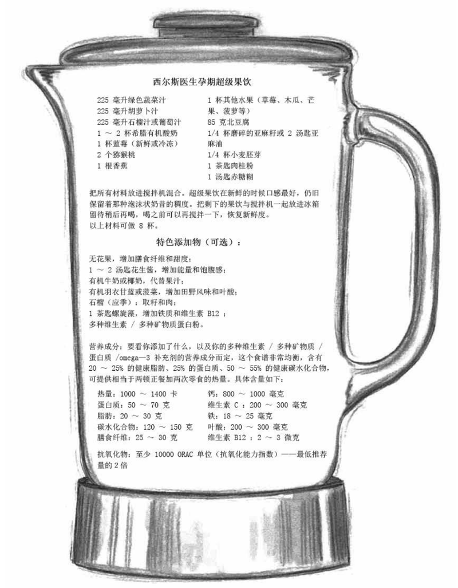

# 0102. 怎么吃：少食多餐、啜饮、蘸食

孕期的肠道和激素的变化会让准妈妈获得自己和宝宝所需的营养变得困难，日渐长大的胎儿压迫已经变得古里古怪的肠胃可能会改变你的饮食方式。请试试这些简单的办法 —— 少食多餐、啜饮、蘸食！

2『孕妇的饮食：少食多餐、啜饮、蘸食，做一张主题卡片。』——已完成

## 2.1 为什么应该少食多餐

少食多餐对妈妈和宝宝都有好处。很多妈妈发现，随着怀孕的进展，要消除那种「总是饥饿」的感觉，一个办法就是整天不停嘴地吃点东西。你会发现成为一个少食多餐者可能不需要有意识地做出决定，身体自然会推动你这么做。作为神秘的身体内部智慧的一部分，你的肠胃开始与头脑对话，告诉你哪些食物最适合你越来越敏感的消化系统，你该吃多少东西，多长时间吃一次。下面，谈谈少食多餐为什么对你和宝宝都有好处：

1、缓解返流。不断增大的子宫压迫进餐后的胃部，推动胃酸进入敏感的食管，造成「妊娠烧心感」，尤其是在吃了一顿大餐后（第 26 页有更多关于烧心的信息）。不过，你很快就会发现自己的胃越来越缺少吃大餐的空间了。

『

### 孕期的激素和谐

在怀孕期间，你会不断听到人们把什么事都怪到激素头上，听得你都厌烦了，但是它们真的要负很大责任吗？激素是个生化信使，流遍全身，带去指示。当宝宝和你的身体发生变化时，你的激素也随之发生变化，来迎合你们不断增长的需求，在你的一生中，激素从未如此大量涌出。

知道如何与激素和谐相处，对于保持孕期健康非常重要，你可以想象体内的各种激素是交响乐队的乐手，此时这些乐手被召集在一起，倾力演出。胰岛素是主导一切的激素，也就是乐队的指挥，当胰岛素稳定时，其他激素也处于和谐状态，就会在你怀孕期间演奏出美妙的音乐 —— 健康的感觉。

胰岛素水平越稳定，你的情绪和体重就越稳定。胰岛素是一种储存脂肪的激素，如果太高，通常是在你大吃大喝的时候（尤其是吃高糖的垃圾食品时），它会促使身体以过剩脂肪的形式储存多出来的热量。持续不断地过度分泌胰岛素（主要是由于血糖不稳定），是导致妊娠期糖尿病的常见原因。

对妈妈好的对胎儿也好。还记得第 16 页讲到的胎儿基因上的「糖尿病开关」吗？准妈妈的激素和谐可以帮助胎儿正在成熟中的内分泌系统达到自身的激素和谐，降低宝宝日后患糖尿病的风险。通过维持血糖水平的稳定，少食多餐可以帮助你和宝宝的内分泌系统演奏出和谐的乐章。你看，胰岛素夸张的波动起伏其实都在你的控制之下（参见「倾听激素交响曲」）。

为两个人吃的原则：1）比平常吃的次数多一倍；2）每次只吃平常一半的量；3）咀嚼时间增加一倍；3）就餐时间增加一倍。

』

2、缓解便秘。当你狼吞虎咽吃下一顿大餐，大量未被消化的食物会滞留在肠道里，导致消化不良和便秘。你会发现你的肠胃在孕期与你的对话明显增多，好像在说「别给我吃太多，也别吃得太快，不然我工作得很辛苦！」我通常吃饭比较快，为了在孕期吃得慢些，我放下了叉子，拿起了筷子，这让我不得不小口吃饭。

为两个人吃意味着吃得要比原来好两倍，而不是多两倍。当我们说起这个关于孕期饮食的简单实用的经验原则时，那些参与我们医疗实践的妈妈回应道：「哦，这很简单，也很有道理，我会这么做的。」通过少食多餐，肠道上半部将会做更多的工作，这样就减少了下半部的不适，而下半部受不断增大的子宫影响更大。另一个少食多餐的好处是：减少了患痔疮的风险。

3、稳定血糖。你会感受到这种想吃个不停的冲动，是因为在有些日子里可能本就应该这么吃。怀孕时，情绪通常都有点儿失衡，少食多餐可以稳定血糖，而稳定的血糖可以带来稳定的情绪。

4、帮助你保持苗条。孕期少食多餐的另一个好处是，你增加过多体脂的可能性会低一些。对肥胖的研究很早就发现，少食多餐的人似乎比大吃大喝的人更苗条些。原因是少食多餐的人能够燃烧更多的热量。

## 2.2 聪明地吃零食

在孕期，聪明的零食选择应该含有至少 3 克膳食纤维、3 克蛋白质，外加健康的脂肪，而不应该含有反营养物质，如高果糖玉米浆、人工色素、不健康的添加剂。试试下面这些聪明的吃法吧！

『

### 孕期饮食建议：吃一把食物

一般来说，要把你一顿正餐限制在一把的量，这大概也就是你的胃容量。特别是在怀孕后期，你所吃的 8 顿迷你餐中的任何一顿如果超过一把的量，肠胃可能就会很痛苦。每天至少要吃 12 种超级食物中的 8 种。

』

12 种超级食物汇总如下：1）小胡萝卜蘸鹰嘴豆泥；2）苹果片蘸花生酱；3）全谷物麦片配酸奶；4）奶酪条和一块水果；5）乡村奶酪和水果；6）皮塔饼涂鹰嘴豆泥；7）米糕配花生酱和香蕉；8）一片全谷物面包涂融化的帕玛森奶酪；9）芹菜蘸花生酱；10）圣女果配奶酪块；11）自制的燕麦提子小饼干；12）生杏仁。

1『筛选：全谷物麦片配酸奶；奶酪条和一块水果：苹果片蘸花生酱；自制的燕麦提子小饼干；圣女果配奶酪块。』

## 2.3 享受啜饮

试试我们的超级果饮吧！在调配这个食谱的时候，我们确保它含有准妈妈和宝宝所需的大部分营养素，而且保证它对孕期的肠胃无刺激。全天都可以啜饮超级果饮，当作早餐、午餐或零食，最后吃一顿正常的健康晚餐，例如我们推荐的孕期沙拉。

| 孕期的消化问题 | 啜饮如何帮助你 |
| --- | --- |
| 返流和烧心、消化不良、便秘 | 混合搅拌的流质食物从胃里排空的速度更快，营养吸收率更高，而且高膳食纤维的流质食物还是天然的泻药。 |
| 炎症 | 超级果饮中的抗氧化物质能够提升免疫力。 |
| 血糖和情绪波动 | 血糖和胰岛素水平更稳定，情绪也更稳定。 |
| 过度增加体重（脂肪） | 少食多餐者和啜饮者通常更苗条，因为他们的肠胃已经习惯满足于更少量的食物。 |
| 疲劳 | 稳定的营养供应带给你稳定的能量供应。 |

在孕早期，「啜饮」这种方式显得尤为舒服，因为混合搅拌的食物更适合此时的肠胃；后期也适合，因为不断长大的婴儿和扩大的子宫会逐渐挤压你的胃，使你根本没有空间吃下整盘食物。我们的诊所推荐啜饮很多年了，准妈妈们说，当她们整天啜饮果饮时，消化不良、便秘、烧心、情绪波动、疲劳这些情况较少出现。

『

### 如何选择适合你的孕期补充剂？

最理想的是从真正的食物中而不是从补充剂中获取营养，但是怀孕之后这一点实施起来很困难。这就是为什么大多数产科医生会建议孕妇服用孕期补充剂的原因。选择补充剂的时候，请考虑以下因素：

1、确保含有三大营养素：叶酸、omega-3 脂肪酸和铁。怀孕的时候，准妈妈体内的这些营养素水平必须大幅提高，其他维生素水平在孕期只需要稍微提高一些。

2、如果你不能每天从食物中获得推荐摄入的 1200-1600 毫克钙，你的补充剂应该包含每天 400-800 毫克钙。

3、考虑服用含有碘化钾的补充剂以避免缺碘。

4、考虑服用益生菌，这有助于缓解某些肠道不适。

5、不要大剂量服用，这主要是指维生素 A，如果剂量过大（每天超过 10000 国际单位），可能会导致婴儿出现先天缺陷 —— 比如唇裂、腭裂和心脏缺陷 —— 的风险提高 5 倍。维生素 A 更容易过量，是因为它是脂溶性的，能够保存在身体脂肪中。其他维生素，比如维生素 C 和 B 族维生素，都是水溶性的，如果过量很容易通过尿液排出。最安全的做法是严格按照医生建议的剂量服用维生素。

』

BJ 医生笔记：很多女性来做孕前检查或产前检查的时候，包里都装满营养补充剂。她们的用意非常好，而且认为多即是好。我尝试帮她们认识到补充剂不能代替均衡的营养。不幸的是，在现代生活中，很多女性声称她们「没时间」注意营养，所以才转向补充剂，让自己的营养更均衡些。

## 2.4 你可能会遇到的营养问题

我是个素食者，我想知道怀孕的时候这么吃是否安全？

你的素食越严格，对宝宝来说危险越大。素食妈妈可能不大会增加过多的体重，但是在怀孕的时候坚持素食，想要获得足够的营养很困难。事实上，准妈妈需要的几大营养素，即 omega-3、维生素 D、维生素 B12 和铁，主要来自海产品和动物性食品。有些素食者甚至会注意到，她们在怀孕的时候会特别想吃之前避开的某些动物性食品。怀孕或许是个好时机，让你尝试更健康的选择。

1、成为一个鱼类素食者。每周增加 350 克安全的海鲜，这将提高你获得更多自己和宝宝所需营养的概率，尤其是 omega-3 脂肪酸、维生素 B12 和维生素 D。

2、在怀孕期间转变成灵活素食者。听从身体的需要，如果你特别想吃动物性食物，比如酸奶、鸡蛋或三文鱼，那么就满足这些健康的渴望吧！

3、为了补充铁质，你可以吃下面这些非肉类的怀孕最佳食品：大豆、扁豆、豆腐、无花果、李子汁、螺旋藻和赤糖糊。植物来源的铁，比如菠菜和羽衣甘蓝里含有的铁，不像肉类来源的铁那么好吸收，所以需要多吃些柑橘类水果（维生素 C 可以提高素食来源铁质的吸收）。一般来说，一杯大豆、扁豆或豆腐可以为你提供的铁质相当于 85 克肉。

4、关注钙。最好的素食来源是那些富含钙质的食物，如橙汁、豆腐、赤糖糊、无花果、豆子、蔬菜和芝麻。

5、为了保证营养，一定要服用一种含有素食中最难摄取的营养素 omega-3、维生素 B12 和铁的孕期补充剂。（参见「如何选择适合你的孕期补充剂」。）

6、在超级果饮里加入一天服用量的螺旋藻，为你提供不吃动物性食物就会缺少的两种营养素 —— 维生素 B12（9 微克）和铁（7 毫克）。

1、我需要在怀孕的时候多摄取多少有营养的食物呢？

头 3 个月，大多数准妈妈只需要每天多吃含 100 卡热量的有营养的食物，然后在剩下的孕期里每天多吃含 300-500 卡热量的营养食品。不过，不要去计算热量，而要多吃真正的食物；不是努力吃下「多出来的 300 卡」，而是考虑增加两份蛋白质和两份水果蔬菜。这种方法更准确，更容易做到，也更健康。或者，只是想：为了我自己和宝宝的健康，我需要每天多吃 4-5 份怀孕超级食物。

「为两个人吃」的真实含义是：你变得比原来挑剔 2 倍，你需要吃掉原来 2 倍的蛋白质和 omega-3 脂肪酸。这并不是说你就可以大吃大喝了，你肯定不需要原来 2 倍的热量，事实上，你在为 1.2 个人吃东西，尤其是在头 3 个月。对大多数准妈妈来说，过多的脂肪储存会提供过多的热量。

尽量做到在一周里保持饮食均衡，而不是非要每顿饭或每天都公式化。你的肠胃情绪和胃口每天都会变，所以尽量保证你在一周里获得足够的营养。虽说你每天需要增加大约 15% 的热量，但是每天所需的其他营养素，如铁、叶酸和 omega-3 脂肪酸等却需要增加 50%。从孕早期就开始补充这些微量元素显然是个好主意。

2、我经常听说维生素 D 缺乏症，孕妇需要多少维生素 D 呢？

维生素 D 有助于为你和宝宝打造强健的肌肉和骨骼。最新研究表明，94% 非洲裔准妈妈，60% 的拉美裔准妈妈，50% 的白种人准妈妈有维生素 D 缺乏症。母亲缺乏维生素 D 会造成：1）剖宫产比例上升，2）宝宝更容易过敏，3）母婴的骨骼更脆弱。

考虑下面的建议：1）请医生检查你的维生素 D 血液水平。2）视你的饮食、日晒时间和血液水平情况，医生会建议你服用 1000-4000 国际单位的补充剂。3）维生素 D 最好的两个来源是三文鱼和阳光。所以，要多吃鱼，天气允许的话，每天露出胳膊和腿去户外晒上大约 15 分钟。

3、我对食物过敏，怎样做才能不让孩子过敏呢？

你可能会很高兴地获悉：新的研究表明，你可以做出几个健康改变来保护宝宝免受过敏之苦。首先，当然是限制摄入你会过敏的食物，过去人们一直认为，准妈妈少吃那些容易引发过敏的食物，比如乳制品、小麦、贝类、豆类、坚果和蛋类，孩子对这些食物过敏的可能性就会更小，但并没有科学研究证实这一点，因而过敏专家现在只建议准妈妈不吃那些她们确定会过敏的食物。这个合理的建议降低了你出现营养不良的风险。

其次，Omega-3 鱼油，维生素 D 和益生菌被证实可以降低宝宝患上哮喘和湿疹等过敏症的风险，一定要补充足够的此类营养素。再其次，母乳喂养也是降低宝宝日后过敏概率的最佳方式之一。