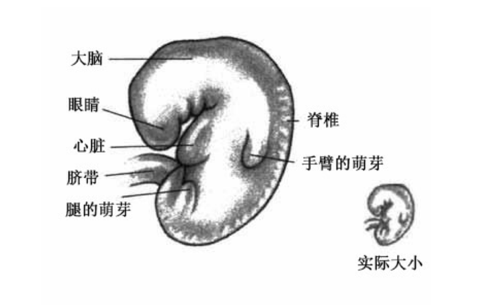
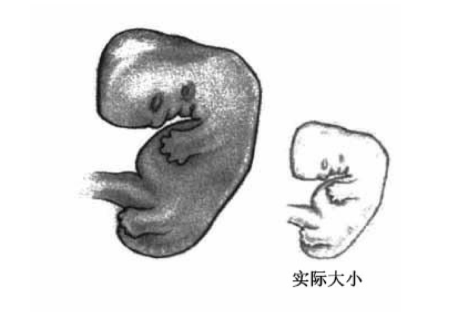
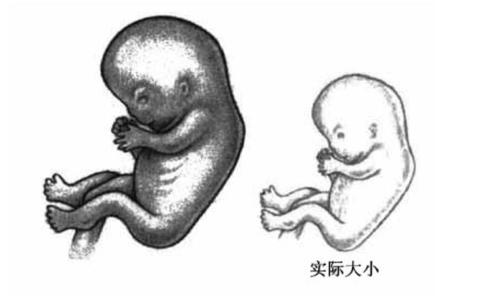

# 0202. 第 2 个月：我真的怀孕了

『

### 第 2 个月的产前检查（5-8 周）

在这个月的产前检查中，你可能会：

1、检查腹部。

2、检查子宫的大小和高度。

3、检查血红蛋白和血细胞比容，看看是否贫血。

4、接受营养咨询。

5、测量体重和血压。

6、尿常规，查看有无感染、糖和蛋白质。

7、有机会与医生讨论你的感受和担忧。

』

在第 2 个月里，身体里的小生命真真切切地登场了。现在，子宫和胎儿生长所需的激素水平正在带来情绪和身体上的变化，你吃的东西可能刚进入胃里就冒出来了。肚子不舒服，恶心的感觉如影随形，无论白天还是晚上，去洗手间的路都是你经常要走的。拥抱这些感受吧！即便眼前的一切充满挑战，你仍然有权感到骄傲，感到特别，感到自己是奇迹的一部分。当你想到自己将在短短的 9 个月的时间里创造一个新生命时，不方便和不舒适也就退而居其次了。

## 2.1 第 5-8 周宝宝的发育情况

5 周大的宝宝（图）

第 5 周：在受孕后的第 4 周末，宝宝的大小相当于一粒苹果种子。即使这么小，形成大脑的组织也占了最大的一块地方；心脏分成左右两个心室，开始跳动；将要变成眼睛、耳朵、鼻子和嘴的小坑已经出现；腿和手臂从身体上凸出来，就像小芽一样；像桨一样的小手开始出现手指的萌芽；呼吸道开始出现。

6 周大的宝宝（图）

第 6 周：宝宝长得跟石榴子一样大，你可能可以通过特殊的超声波仪器听到和看到生命最初的一些声响和迹象。不过，通常要等到第 10-12 周你才能体验到。每一分钟都有超过百万个新细胞加入宝宝正在发育的身体，胎儿的心脏跳得更快了，每分钟 140-150 下，比你的要快一倍。等再过一个月，你第一次听到胎儿心跳那美妙的「噗、噗」声音时，做好被感动和鼓舞的准备吧！绝对是任何事都无可比拟的。

宝宝的胳膊变长了，肘关节出现了，手指也清晰可见；脚已经从腿的萌芽中分化出来，脚趾的痕迹也显现了；头低垂着，几乎跟躯干一样大，样子有点像驼背；眼睑的折痕开始形成，像句号一样小的眼睛已经包含了晶状体、虹膜、角膜和视网膜；鼻尖开始显现；宝宝初生的脊椎看上去就像一摞极小的积木。

7 周大的宝宝（图）

第 7 周：宝宝现在的大小相当于一只蓝莓，小小的肾脏开始产生尿液，然后排出；肘、腕和膝关节清晰可见，脚趾形成了，手指也变长了；眼睑变得清晰，眼睛、耳朵、鼻子和嘴等早期的面部特征已经形成。超声波可以看到宝宝的身体和四肢在动，但是你还要等上几个月才能用手感觉到它们。大脑的神经细胞开始分叉并互相接触，形成原始的神经通路。透过透明的头骨可以看到小脑脑叶，研究人员估计每分钟有 10 万个新的神经细胞被创造出来。

8 周大的宝宝（图）

第 8 周：宝宝长约 2.5 厘米，重约 14 克，大约相当于一颗橄榄。之前弯曲的头和身体现在变直了一些，将会出现在发育完全的婴儿体内的所有内部器官，现在都成形了。

心脏现在分成 4 个腔；手、脚、手指和脚趾已经完全成形；主要关节 —— 肩、肘、腕、膝和脚踝已经清晰可见；鼻子、鼻孔、嘴和嘴唇都可以分辨出来。外生殖器可能开始显现，但是胎儿是男是女还无法通过超声波辨别出来。可以看到，躯干和四肢的运动增加了。

『

### 科学说：胎儿早期有心跳

通过技术的进步，我们现在知道有些器官成熟的时间要比之前认为的早。阴道内超声波显示，大约 6 周或 7 周时，心脏收缩和舒张的波形已经出现，最初的瓣膜，尽管还不严密，但是已经形成了。

』

## 2.2 你可能会有的感觉

哇！第 1 个月感受到的大起大落的情绪在第 2 个月会进一步加深，你的头脑可能会跟你的肠胃一样无法平静下来。请记住，既对孕育宝宝感到高兴，又对孕早期在头脑、身体和生活方式方面要付出的代价感到烦恼，这是很正常的。我感觉自己的情感很矛盾，一天为怀孕而兴奋，另一天则几乎忘记自己怀孕了；一天兴高采烈地浏览新的孕妇装，另一天则为失去苗条身材而忧郁。

1、察觉到乳房的变化。

在肚子还没显示出怀孕迹象之前，乳房早就声明你怀孕了，孕激素在让宝宝发育的同时也让你的乳房增大。最早的轻微疼痛感和肿胀感类似于月经周期后半段乳房的感觉，只是更强烈些。通常，孕早期乳房会增大一个罩杯，在之后的孕期里会继续增大一个罩杯，单是乳房的变化就会在孕期为你增加差不多 0.9 千克的体重。乳房小的孕妇会发现这些变化尤其明显，第一次怀孕的孕妇这一次的感觉比以后怀孕时会更明显。

乳房的变化是由刺激乳腺生长的激素猛增导致的。当激素工作的时候，你可能会感觉整个乳房都在悸动，乳房可能会感觉刺痛、酸痛、温暖和更饱满，对触碰更敏感，偶尔你可能会感觉到时断时续长达 5 分钟的抽动。你很可能会发现，乳晕（乳头周围深色的部分）变大了，颜色加深了，乳晕上那些分泌抗菌润滑液的小腺体变得更明显了，使得乳晕看上去凹凸不平。乳房上的血管可能也更明显了，就像是遍布乳房的一条条溪流，为乳房输送更多的血液。

BJ 医生笔记：我就是通过乳房上突出的血管确认自己怀孕了。

虽然身体的其他部分在怀孕分娩后逐渐恢复原状，但是乳房会获得不同以往的形状，很难说一年后会变成什么样子，可以肯定的一点是，怀孕带来的丰满在哺乳期间会存留一些。记住，你的乳房经历的变化取决于怀孕、遗传和重力，无论是否哺乳都会发生。在孕期，要对你的乳房好一点，经常洗个舒服的热水澡，如果有必要，轻柔地给乳房做个按摩。如果你担心下垂，那就在整个孕期穿着支撑性好的胸罩，如果有必要夜里也别摘下来，这样可以更好地帮助乳房周围的皮肤和肌肉。

2、太疲倦。

第一个月偶尔来袭的疲倦现在可能会被完全的筋疲力尽取代。上个月你还只是想休息，现在则根本没商量！很多孕妇用「深入骨髓」来描述自己的疲倦。这种感觉是大自然用来迫使忙碌的女性慢下来的方式，这样她就可以把能量用到最需要的地方 —— 孕育宝宝。

你可能发现自己必须走慢点，否则很容易就会喘不上气来，甚至正常走路也会如此。不要跟这种疲倦做斗争，为了你自己和宝宝，听从身体发出的信号，尽可能多休息。如果你的工作任务重或是要费神费力地照料学步儿，可能无法奢侈地在床上躺着或睡觉，但是有时候身体会强迫你获取它需要的休息。即使不能把时间花在睡觉上，至少也要停下歇歇脚。如果可能，早点下班，或是放你的学步儿最喜欢的视频，自己窝在沙发上，享受一些急需的休息。

我发现储存一些我丈夫也能热热吃的方便餐很有用。在最初的几周，我都不确定我是谁，更不用说晚饭吃什么了。

『

### 宝宝说：应该叫我什么？

理论上说，直到孕 8 周胎儿还是「胚胎」，此时器官体系已经形成，之后它就成为「胎儿」（意思是「小东西」），然后一直到出生就都是胎儿啦。不过，一旦受孕发生，对于大多数准父母来说，它就是「宝宝」。

』

3、恶心。

可能上个月就开始的晨吐，第 2 个月会进入高峰期。等一等！在你暗自思索为什么要将自己陷入此种境地时，一个朋友或你的医生给出了令人愉快的答案：「哦，这都是激素闹的，恶心表明你的宝宝很健康。」也许很正确，但是当你 24 小时都不舒服的时候，这个信息能够提供的安慰很有限。

4、心跳加快。

当你的身体正在制造更多血液为体内的小人儿输送营养时，你可能发现自己的心跳加快了，尤其是在运动的时候。心脏是身体里适应性最强的器官，这就好像宝宝在给心脏发出指令：「你需要更努力地工作，为我加点速！」

5、流口水。

大多数妈妈认为在宝宝出生之前她们不用跟口水打交道。但是大约到了第 2 个月，她们分泌的唾液就增加了不少，可能味道也会发生变化，甚至带有某种金属味。很讨厌，是不是？导致这种现象的原因还不清楚，但这是无害的。有些妈妈发现，多出来的唾液可以为敏感的食道涂上保护层，防御过多的胃酸，减轻烧心感；另一方面，过多的唾液也会引发恶心。无论如何，到第 3 个月末，唾液就会减少。如果你觉得唾液的味道无法忍受，试试含一颗薄荷糖或柠檬糖，也可以试试用薄荷牙膏刷牙。

6、尿频。

你正在为孕育宝宝而制造更多的血液，需要流经肾脏的血液自然会带来更频繁的小便。此外，变大的子宫正好位于膀胱后面，肯定会不时地提醒你它的存在。尽管小便频繁的现象整个孕期都将持续存在，但是「急着小便」的感觉通常在头 3 个月最明显，把这当作你需要多喝水的一个信号吧！小便时，尽可能腾空膀胱。如果你对总是急着小便感到担心，那就请医生排除感染的可能性。膀胱感染（膀胱炎）的其他症状包括：排尿时的烧灼感以及低烧。

7、口渴。

口渴是身体发出的正常信号，表示你的身体和宝宝需要更多液体。如果你不听从身体发出的口渴信号，可能就会脱水，而这会加重恶心和疲倦。你的身体需要更多液体，因为血容量上升了 40%，充满宝宝越来越大的羊水池也需要增加饮水量，多喝水还会帮助你冲掉肾脏现存的过多废物，不要忘了，多喝水还有助于缓解便秘。消除口渴并不是你需要喝多少水的标准，先喝足够多的水让你不感到口渴，再多喝几杯确保足量。最重要的是，不要为了少上厕所而少喝水，这对你和宝宝都不好。

记住，慢慢啜饮液体比大口灌下去对你的胃更好，而且，大杯大杯喝水并非补充液体的唯一方式，你还可以试试吸吮冰块或自制的冰棍，喝椰子水，吃含水分丰富的食物，比如西瓜。啜饮的方式可能正是医生要求你做的。一般来说，我们不鼓励孕期饮用运动性饮料，虽然它们确实会为你提供更多水分，但是大多数产品都含有反营养物质（甜味剂和化学添加剂），你和宝宝不需要这些东西。

琳达医生笔记：含有电解质的液体会让你的代谢均衡，天然的营养品，例如自制的汤汤水水，比化学制造的瓶装水更健康。

8、便秘。

正如我们已经讨论过的那样，早期的孕激素会减缓食物通过肠道的速度，食物和液体通过得越慢，肠道吸收的水分就越多（也许这是大自然确保你的身体系统得到所需的额外水分的又一种方式）。食物通过肠道的速度变得缓慢，肠道吸收的水分增多，合起来导致大便变硬。为了让孕期的排便更顺畅，要继续那些对胃有益的做法：少食多餐，多吃高膳食纤维的食物，多喝水，多运动。

9、胀气。

腹胀的感觉类似月经开始时腹部的感觉，这让你的小腹在还没有显怀之前就像怀孕了一样。你的肠胃正在学习如何与宝宝相处，导致便秘的那些肠道不适同样会引发胀气。除了第 133 页提到的建议，你还可以试试少吃会导致胀气的食物，比如西蓝花、卷心菜、菜花、甘蓝、豆类以及碳酸饮料，还要避免吃油腻或油炸食品，因为脂肪含量高的食物在肠胃里停留的时间比较长。胀满的感觉可能会让准妈妈觉得腰围好像在持续增大，这可能会促使你第一次调整衣柜，因为你想穿更舒适的裤子，确保它们不会刺激这个高度敏感的区域。

喝碳酸饮料的时候，我甚至能感觉到每个气泡，直到它们从另一端排出。

10、烧心。

饭后不久，有时候甚至在两餐之间，很多孕妇会打嗝，在胸骨正下方有种烧灼的不适。再次责怪激素，从生理上来说一点没错。孕激素（尤其是孕酮）导致肠道运动全面减缓，使胃部肌肉松弛，延缓了食物和胃酸从胃部通过的时间，所以，食物和胃酸在胃部停留的时间比怀孕以前要久一些。孕激素还让胃入口处的保护性肌肉变得松弛，当胃收缩的时候，食物和胃酸更容易从这里返回食管的下端，这种现象在医学上被称为胃食管返流（GER）。胃食管返流还会产生通常被称为消化不良的不适感。到了后期，随着子宫增大，开始向上推挤，施加在肠胃上的压力可能会使烧心的感觉更令人难以忍受。

胃酸是肠道的天然抑菌剂，在细菌有机会抵达下端肠道之前会在上端抵御细菌。因为这个原因，尽量不要用处方或非处方抗酸剂来治疗烧心，除非医生推荐这么做。胃黏膜会自然分泌一种黏稠的黏液，保护胃壁组织不会被胃酸消化掉，但是胃的上端和食管没有这种保护层。记住有益肠胃的 3 个词：少食多餐、啜饮和咀嚼。

『

### 巧克力妥协

特别想吃甜的东西吗？那就每天吃两三块黑巧克力吧！黑巧克力对你有益，因为它富含抗氧化剂类黄酮。身体生长得越多，就会产生越多氧化剂（也被称为自由基）。孕期的逻辑就是，你需要多吃富含抗氧化剂的食物，因为身体正在经历成人期最大的生长高峰期。下面是在享用有益健康的巧克力时，需要注意的一些甜蜜的小贴士：

1、选黑巧克力，与牛奶巧克力相比，黑巧克力含有更多类黄酮，更少糖，更少不健康的脂肪。查看可可含量，越高越好，用巧克力的语言说，就是越苦越好。要塑造自己喜欢吃微苦的黑巧克力的口味，可以先从吃可可含量为 60% 的巧克力开始，然后是 70%，逐渐增加到 80%。

2、不要让自己讨厌巧克力，因为它富含的饱和脂肪酸，属于可可脂中的脂肪类型 —— 硬脂酸，不会像其他饱和脂肪酸一样提高血液中的胆固醇水平。

3、没有添加甜味素的可可粉是最健康的。一项 2005 年发表在《食品科学和技术（国际版）》（FoodScienceandTechnology）上的研究表明，同样重量，可可粉中类黄酮的含量最高，大约是黑巧克力的 3 倍，牛奶巧克力、巧克力饮品、巧克力糖浆的含量最低。

4、愉快地享用一杯热巧克力吧！它富含抗氧化剂和有机低脂牛奶提供的蛋白质，拥有诱人的香气和漂亮的泡沫，你还可以再加一点蜂蜜来增加甜度。

5、研究标签上的数据，可可或可可豆应该是排在第一位的成分，而不是糖。

6、不要吃白巧克力，它含有太多的糖和人工调味剂，只有很少量的可可。

7、3 块黑巧克力只含有微量的咖啡因，无须担忧。

』

11、痉挛。

很多孕妇感觉盆腔下部常常抽痛，实际上，这些通常是「生长痛」，是固定子宫的韧带拉伸的反应。在子宫增大超出耻骨之后，你可能会感觉这些疼痛逐渐减轻，但它们还会不时地回来，尤其在你过度劳累的时候 —— 这是身体告诉你慢下来的另一种方式。如果你的腿半夜会抽筋，可能是缺钾。睡前吃根香蕉或喝杯橙汁，具有神奇的效果。

12、倾听激素交响曲。

为了欣赏孕期身体演奏的奇妙乐曲，我们喜欢把你体内的激素比作交响乐队的乐器。当所有的乐器和谐演奏时，美妙的音乐（健康）就会出现；当它们走调的时候，不和谐（不健康）就会出现。你的大脑（尤其是下丘脑）就是这个拥有一百多种激素的乐队的总指挥。

宝宝正在「听」你演奏的音乐，感受其效果，你也是。在孕期，孕酮升高了大约 100 倍，雌激素水平比孕前直线上升了 15 倍，如此这般，难怪你的身体和大脑都不得不改头换面了。雌激素在孕期每天都在升高，促进宝宝大脑的发育。

当你受孕时，身体内部的药房就开启了，发放你和宝宝需要的内部药物。但这些药物常常带来令人烦恼的副作用（准爸爸，这一点要注意哦）。激素之间如何互相平衡非常有趣，雌激素让你具有高度的警觉性和敏感度，是上升的状态，而孕酮则相反，具有某种镇静的效果，是下降的状态，这就像同时服用高剂量的兴奋剂和镇静剂，两者都在你身上起作用，只有当它们处于均衡状态时，效果才最好。

下面就是这两种激素对宝宝和妈妈的影响：

对宝宝有益：1）防止子宫未到时间就发生宫缩；2）促进子宫和胎盘的血管生长；3）促进宝宝脑组织的生长，促进神经连接，提高流向正在发育中的器官的血流量；4）促进乳房和乳汁制造组织的生长；5）为快速生长的细胞提供抗氧化保护；6）调节胰岛素和其他代谢激素；7）有助于促进新陈代谢，为两个人创造更多能量；8）减缓消化系统的运作；9）松弛分娩肌肉和韧带。

让妈妈烦恼：1）肌肉疲乏；2）困倦嗜睡；3）健忘；4）味觉和嗅觉增强；5）普遍提高的敏感性；6）情绪多变；7）渴望某些食物 —— 有的健康，有的不健康。

你之所以忍受怀孕的种种烦恼，是因为把眼光放在最终的奖励上。

## 2.3 你可能关心的事

1、容易生气和过度敏感。

我很容易生气，之前根本不在意的小事现在也会让我爆发。这是为什么？你的激素正在加班加点工作，而且理由充分。你对声音过度敏感，例如狗叫声或门铃声，这是作为新妈妈特有的高度警惕状态的一部分，你可能会对小的不愉快做出大反应。学步儿常见的一些恼人行为现在可能会让你抓狂，正常的日常生活烦恼被放大了，有时候好像所有的事都让你生气，这些都是正常的情绪波动。把这种易激惹当作一个信号吧！表示你需要创造条件，让自己尽可能多地休息，为孕育宝宝而积聚需要的能量。

2、对丈夫没耐心。

我丈夫习惯了我精力充沛的状态，但是现在我又难受又疲劳，需要很多休息，他不明白我为什么不想做家务，甚至不想做爱。我怎么才能让他明白？怀孕对你来说非常真切，但是你的伴侣可能需要一点时间才能完全理解。他可能还不明白你不再有精力去做几个月前能做的事。当你疲倦恶心，满脑子都是变化的身体时，很难表现得性感。他需要理解你，你可能暂时不大能够忍受他的某种人格特质，但这不是针对他个人的，你可以有策略地提醒他你怀着宝宝，体内涌动的全是疯狂的激素，然后请他阅读爸爸能帮什么忙那部分，让他相信，你在一两个月之后就会感觉好些，肯定也会更性感一些。

3、感觉需要人帮忙。

我太疲倦了，我妈妈飞过来，帮我照顾几周其他孩子，我感觉非常内疚，因为我已经习惯于在公司和家里都非常独立。这样的感受正常吗？肯定是正常的。怀孕之前，你习惯于照顾每个人的需要，现在你是那个需要最多照顾的人，你的身体正在辛苦地工作，是让别人来宠爱你的时候了！尽量不要内疚，因为你和肚子里需要能量的宝宝值得被照顾，被宠爱。

4、皮肤瘙痒。

我的皮肤变得干燥、瘙痒，尤其是手掌和脚跟。我该怎么办？皮肤干燥、瘙痒的问题更有可能出现在孕后期，但是也可能现在就开始出现了。伴随怀孕，皮肤变得超级敏感，身体每个部分的敏感性都至少升高了一点。

5、睡眠困难。

我过去睡得非常死，但是现在，尽管上床更早了，可是我醒的次数也更多了。救救我！睡眠的挑战是孕期每个月都会面临的问题，现在就把专门介绍帮助你睡得安稳的第 7 章重新读一遍吧！寻找一些有用的方法。

6、遗传筛查：如果做，什么时候做，做哪些筛查？

我的医生说要给我做一大堆遗传筛查，我的心情很复杂。对于医生来说，让你知道都有什么选择，是标准的医疗程序。尽管很多筛查通常是在第 3 个月做，但产科医生和助产士常常在第 2 个月就会跟你讨论，这样可以给你充足的时间思考。

这些筛查被用来发现像脊柱裂这样的出生缺陷和像唐氏综合征这样的染色体异常。很多孕妇和伴侣不太接受筛查这个概念及其蕴含的假设 —— 如果发现宝宝有问题，他们就得考虑终止妊娠。还有一些夫妻想做筛查，为的是让自己和家庭能够更好地为有特殊需要的孩子的诞生做好准备。

幸运的是，绝大多数夫妻都能得到令人欣慰的结果，孕期也就少了一整套需要担忧的问题。做哪些遗传检测，什么时候做，需要你和医生一起做决定，但是下面这些问题你们可以考虑一下：1）家族里有没有任何遗传性疾病或发育性疾病的人？2）你的年龄是否让生有出生缺陷宝宝的风险更大？3）你是否属于某个在携带异常基因方面风险更大的族群？4）你是否担心宝宝有特殊的遗传问题？5）你将如何使用获得的信息？你的担心会增加还是减少？6）如果筛查结果显示阳性，你会接着做羊水穿刺吗？7）筛查百分之百准确吗？还是有很高的「假阳性」发生率，会让你毫无必要地担心？

记住，就像筛查这个名字暗示的，对遗传和天生缺陷的筛查并非绝对无误的诊断。有些筛查很准确，有些则出了名的不准。明白为什么要做，做了能揭示什么，什么问题跟这些筛查相关，有助于你决定考虑做哪个，不做哪个。关于如何决定做什么筛查以及什么筛查适合你。

『

### 出血

尽管任何形式的阴道出血都挺吓人的，但是没必要看到出血就以为你的怀孕出问题了。

什么时候不需要担心：1）发生在受孕后 2-4 周的着床出血，这时候你的小宝宝藏进了血液充沛的子宫内膜里。但是有必要做个超声波检查，确定着床发生在子宫里，而不是其他地方（即宫外孕）。2）性交后出血，经常发生，但是无害。3）你可能流一点红色或粉红色的血，但是没有组织碎片。当你用很多血管来建造子宫组织时，一些细小的血管随时都会断裂，所以你可能偶尔会看到血痕或一点出血。

什么时候需要担心：1）出血的时候伴随腹部痉挛性疼痛；2）大量深棕色血液或血块，可能是成块的组织；3）出血量很大，足以浸湿一块卫生巾；4）你感觉无力、眩晕；5）出血越来越多。

如果你血流不止或流出块状组织，就应该立即给医生打电话，告诉你出血的情况（数量、持续性、颜色），持续多长时间，以及伴随出血还有什么其他症状，以便你的医生确定是否真的有问题。

### 超声波：专供医用

为了安全起见，超声波应该被作为有价值的诊断助手，而不是妊娠玩具。

琳达医生笔记：超声波是一种非侵入性的影像技术，传感器发出的声波从液体和固体表面弹回而成像，这些表面包括羊水、子宫壁、胎盘和胎儿组织。超声波普遍应用于现代产科服务中，标准的超声波指标包括：1）确定早期妊娠的方位和可靠性；2）如果在头 20 周做，可以准确地测出受孕日期；3）评估出生缺陷的风险，通常是在大约第 13 周，作为染色体异常筛查的一部分；在大约第 20 周，作为更广泛的结构筛查的一部分；或是在孕后期评估特殊的结构异常；4）评估任何妊娠阶段的出血情况；5）监控宝宝的发育情况；6）协助侵入性治疗，例如羊水穿刺或绒毛膜取样；

超声波通常来说是安全的孕期检查，但是包括美国妇产科医师学会和美国医用超声研究所在内的专业团体已经对其专卖店式的使用 —— 提供胎儿的纪念照片，而没有机构认可、医生建议和结果评估表示担忧。超声波是有用的孕产工具，但是应该由医生为了特别的理由而推荐，在获得认证的地点由具有资质的超声波操作员操作。更多关于诊断性超声波的信息请看 www.aium.org。

1『第 2 个月的怀孕日记模板 ，详见原书。』

』