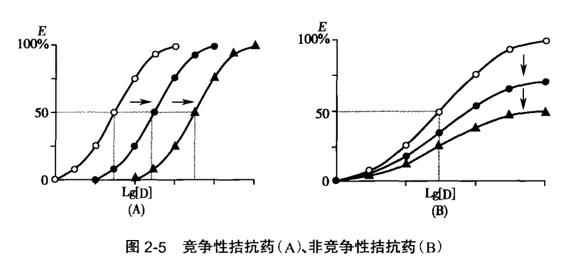
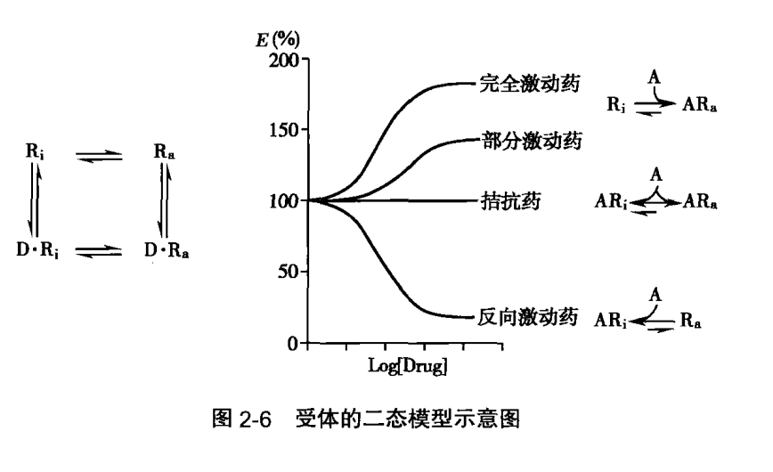
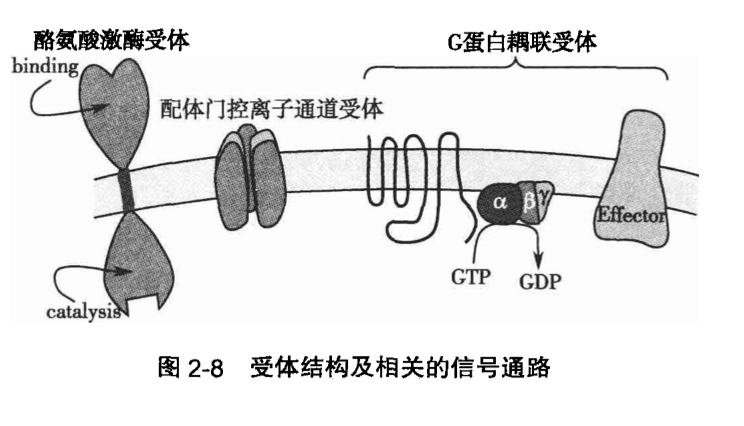

总论

# 02 药物效应动力学

药物效应动力学（pharmacodynamics）简称药效学，是研究药物对机体的作用及作用机制，以阐明药物防治疾病规律的学说。

## 01. 药物的基本作用

### 1. 药物作用与药理效应

药物作用（drug action）是药物对机体的初始作用，是动因。药理效应（pharmacological effect）是药物作用的结果，是机体反应的表现。由于二者意义接近，通常并不严加区别。但当二者并用时，应体现先后顺序。药理作用改变机体器官原有功能水平，功能提高称为兴奋（excitation），功能降低称为抑制（inhibition）。例如，肾上腺素升高血压，呋塞米增加尿量均属兴奋；阿司匹林退热以及吗啡镇痛均属抑制。

多数药物通过化学反应产生药理效应。这种化学反应的专一性使药物的作用具有特异性（specificity）。例如，阿托品特异性地阻断 M - 胆碱受体，而对其他受体影响不大。药物作用特异性取决于药物的化学结构，这就是构效关系。

药物的作用还有其选择性（selectivity），即在一定的剂量下，药物对不同的组织器官作用的差异性。有些药物可影响机体的多种功能，有些药物只影响机体的一种功能，前者选择性低，后者选择性高。药物作用特异性强并不一定引起选择性高的药理效应，即二者不一定平行。例如，阿托品特异性地阻断 M - 胆碱受体，但其药理效应选择性并不高，对心脏、血管、平滑肌、腺体及中枢神经系统都有影响，而且有的兴奋、有的抑制。作用特异性强及（或）效应选择性高的药物应用时针对性较好。反之效应广泛的药物副反应较多。但选择性低的药物在多种病因或诊断未明时也有其方便之处，例如广谱抗生素、广谱抗心律失常药等。选择性的基础有以下几方面：药物在体内的分布不均匀、机体组织细胞的结构不同、生化功能存在差异等。

### 2. 治疗作用与不良反应

#### 01. 治疗作用

治疗作用，也称疗效（therapeutic effect），是指药物作用的结果有利于改变患者的生理、生化功能或病理过程，使患病的机体恢复正常。治疗作用分为：

1. 对因治疗（etiological treatment）。用药目的在于消除原发致病因子，彻底治愈疾病，称为对因治疗，如用抗生素杀灭体内致病菌。

2. 对症治疗（symptomatic treatment）。用药目的在于改善疾病症状，称为对症治疗。对症治疔不能根除病因，但对病因未明暂时无法根治的疾病却必不可少。对某些重危急症如休克、惊厥、心力衰竭、心跳或呼吸暂停等，对症治疗可能比对因治疗更为迫切。有时严重的症状可以作为二级病因，使疾病进一步恶化，如高热引起惊厥、剧痛引起休克等。此时的对症治疗（如退热或止痛）对惊厥或休克而言，又可看成是对因治疗。

祖国医学提倡「急则治其标，缓则治其本」、「标本兼治」，这些是临床实践应遵循的原则。

#### 02. 不良反应

不良反应（adverse drug reaction, ADR）指与用药目的无关并给患者带来不适或痛苦的反应。多数不良反应是药物固有的效应，在一般情况下可以预知，但不一定能够避免。少数较严重的不良反应较难恢复，称为药源性疾病（drug- induced disease），例如链霉素引起的神经性耳聋，肼屈嗪引起的红斑性狼疮等。药物的不良反应主要有以下几类：

1. 副反应（side reaction）。指治疗剂量出现的不良反应，是由于药物作用选择性低，药理效应涉及多个器官，当某一效应用作治疗目的时，其他效应就成为副反应（或称副作用）。例如，阿托品用于治疗胃肠痉挛时，往往引起口干、心悸、便秘等副反应。副反应是药物本身固有的作用，多数较轻微并可以预料。

2. 毒性反应（toxic reaction）。指在剂量过大或药物在体内蓄积过多时发生的危害性反应，一般比较严重。毒性反应一般可以预知，应该避免发生。短期内过量用药引起的毒性称急性毒性反应，多损害循环、呼吸及神经系统功能。长期用药时由于药物在体内蓄积而逐渐发生的毒性称为慢性毒性，多损害肝、肾、骨髓、内分泌等功能。致癌（carcinogenesis) 、致畸胎（teratogenesis）和致突变（mutagenesis）反应也属于慢性毒性范畴。

3. 后遗效应（residual effect）。指在停药后，血药浓度已降至阈浓度以下时残存的药理效应。例如服用巴比妥类催眠药后，次晨出现的乏力、困倦等现象。

4. 停药反应（withdrawal reaction）。指患者长期应用某种药物，突然停药后出现原有疾病加剧的现象，又称回跃反应（rebound reaction）。例如长期服用可乐定降血压，突然停药，次日血压明显升高。

5. 继发反应（secondary reaction）。指继发于药物治疗作用之后的不良反应，是治疗剂量下治疗作用本身带来的间接结果。例如，长期应用广谱抗生素，使敏感细菌被杀灭，而耐药葡萄球菌或真菌大量繁殖，造成二重感染（suprainfection）。

6. 变态反应（allergic reaction）。指药物引起的免疫反应。非肽类药物作为半抗原与机体蛋白结合为抗原后，经过接触 10 天左右的敏感化过程而发生的反应，也称过敏反应（hypersensitive reaction）。常见于过敏体质患者。反应性质与药物原有效成无关，用药理性拮抗药解救无效。反应的严重程度差异很大，多与剂量无明显关系，从轻微的皮疹、发热至造血系统抑制、肝肾功能损害、休克等。停药后反应逐渐消失，再用时可能再发。致敏物质可能是药物本身，也可能是其代谢物，亦可能是制剂中的杂质。临床用药前虽常做皮肤过敏试验，但仍有少数假阳性或假阴性反应。可见这是一类非常复杂的药物反应。

7. 特异质反应（idiosyncratic reaction）。少数特异体质患者对某些药物反应特别敏感，反应性质也可能与常人不同，但与药物固有的药理作用基本一致，反应严重程度与剂量成比例，药理性拮抗药救治可能有效。这种反应不是免疫反应，故不需预先敏化过程。现已知道特异质反应是一类先天遗传异常所致的反应。例如，先天性葡萄糖 - 6 - 磷酸脱氢酶（glucose-6-phosphate dehydrogenase, G-6-PD）缺乏的患者服用伯氨喹后，容易发生急性溶血性贫血和高铁血红蛋白血症。

8. 依赖性（dependence）。是在长期应用某种药物后所造成的一种强迫要求连续或定期使用该药的行为或其他反应，其目的是感受药物的精神效应或避免由于停药造成身体不适。依赖性可分为生理依赖性（physiological dependence）和精神依赖性（psychological dependence）。生理依赖性又称躯体依赖性（physical dependence），是指中枢神经系统对长期使用的药物所产生的一种身体适应状态。一旦停药，将发生一系列生理功能紊乱，称为戒断综合征（withdrawal syndrome）。精神依赖性是指多次用药后使人产生欣快感，导致用药者在精神上对所用药物有一种渴求连续不断使用的强烈欲望，继而引发强迫用药行为，以获得满足和避免不适感。

#### 03. 量效关系

在一定范围内药物的剂量（或浓度）增加或减少时，药物的效应随之增强或减弱，药物的这种剂量（或浓度）与效应之间的关系称为量效关系（dose-effect relationship）。以药理效应的强度为纵坐标，药物剂量（或浓度）为横坐标即得量效曲线（dose-eftect curve）或浓度 - 效应曲线（concentration-effect curve），并以此反映量效关系。

药理效应按性质可分为量反应和质反应两种。效应的强弱呈连续增减的变化，可用具体数量或最大反应的百分率表示者称为量反应（graded response），例如血压的升降、平滑肌的舒缩等，其研究对象为单一的生物单位。以药物的剂量（整体动物实验）或浓度（体外实验）为横坐标，以效应强度为纵坐标作图，可获得直方双曲线（rectangular hyperbola）；如将药物浓度改用对数值作图则呈典型的对称 S 形曲线，这就是通常所称量反应的量 - 效曲线（图 2-1)。

从量反应的量 - 效曲线可以看出下列几个特定位点：

1. 最小有效量（minimal effective dose）或最低有效浓度（minimal effective concentration）即引起效应的最小药物剂量或最小药物浓度，亦称阈剂量（threshold dose）或阈浓度（threshold concentration）。

2. 最大效应（maximal effect, Em）即随着剂量或浓度的增加，效应也增加，当效应增加到一定程度后，若继续增加药物浓度或剂量而其效应不再继绫增强，这一药理效应的极限称为最大效应，也称效能（efficacy）。

3. 半最大效应浓度（concentration for 50% of maximal effect, EC50）是指能引起 50% 最大效应的浓度。

4. 效价强度（potency intensity）指能引起等效反应（一般采用 50% 效应）的相对浓度或剂量，其值越小则强度越大。药物的最大效应与效价强度含意不同，二者并不平行。例如，利尿药以每日排钠量为效应指标进行比较，氢氯噻嗪的效价强度大于呋塞米，而后者的最大效应大于前者（图 2-2)。药物的最大效应值有较大实际意义，不区分最大效应与效价强度只论某药较另药强若干倍易产生歧义。曲线中段斜率（slope）较大则提示药效较剧烈，反之则提示药效较温和。

如果药理效应不随着药物剂量或浓度的增减呈连续性量的变化，而表现为性质的变化，则称为质反应（quantal response or all-or-none response）。质反应以阳性或阴性、全或无的方式表现，如死亡与生存、惊厥与不惊厥等，其研究对象为一个群体。在实际工作中，常将实验动物按用药剂量分组，以阳性反应百分率为纵坐标，以剂量或浓度为横坐标作图，也可得到与量反应相似的曲线。如果按照药物浓度或剂量的区段出现阳性反应频率作图得到呈常态分布曲线。如果按照剂量增加的累计阳性反应百分率作图，则可得到典型的 S 型量效曲线（图 2-3）。

在这一曲线可以看出的特定位点为半数有效量（median effective dose, ED50），即能引起 50% 的实验动物出现阳性反应时的药物剂量；如效应为死亡，则称为半数致死量（median lethal dose, LD50）。通常将药物的 LD50/ED50 的比值称为治疗指数（therapeutic index, TI），用以表示药物的安全性。治疗指数大的药物相对较治疗指数小的药物安全。但以治疗指数来评价药物的安全性，并不完全可靠。如某药的 ED 和 LD 两条曲线的首尾有重叠（图 2-4），即有效剂量与其致死剂量之间有重叠。为此，有人用 1% 致死量（LD1) 与 99% 有效量（ED99）的比值或 5% 致死量（LD5) 与 95% 有效量（ED95）之间的距离来衡量药物的安全性。

#### 04. 构效关系

药物的化学结构与药理活性或毒性之间的关系称为构效关系（structure activity relationship, SAR），是药物化学的主要研究内容之一。药物化学结构的改变，包括其基本骨架、侧链长短、立体异构（手性药物）、几何异构（顺式或反式）的改变均可影响苭物的理化性质，进而影响药物的体内过程、药效乃至毒性。了解药物的构效关系不仅有利于深入认识药物的作用，指导临床合理用药，而且在定向设计药物结构，研制开发新药方面都有重要意义。

20 世纪 60 年代发展的定量构效关系（quantitative structure-activity relationship, QSAR），是一种借助分子的理化性质参数或结构参数，以数学和统计学手段定量研究有机小分子与生物大分子相互作用，以及有机小分子在生物体内吸收、分布、代谢、排泄等生理相关性质的方法。这种方法广泛应用于药物、农药、化学毒剂等生物活性分子的合理设计，在早期的药物设计中，定量构效关系方法占据主导地位。

90 年代以来，随着计算机计算能力的提高和众多生物大分子三维结构的准确测定，人们运用分子形状分析（molecular shape analysis, MSA）、距离几何（distance geometry, DG）、比较分子力场分析（comparative molecular field analysis, COMIFA）、比较分子相似性指数分析（comparative molecular similarity indices analysis, COMSIA）等方法，分析药物分子三维结构与受体作用的相互关系，深入地揭示了药物与受体相互作用的机制。基于分子结构的三维定量构效关系（thre-dimensional quantitative structure-activity relationship, 3D-QSAR）逐渐取代了定量构效关系在药物设计领域的主导地位，至今已成为计算机辅助药物设计的基本手段与分析方法。

## 02. 药物作用的靶点

药物的作用机制（mechanism of action）研究药物如何对机体发挥作用。大多数药物的作用是由于药物与机体生物大分子之间的相互作用，从而引起机体生理、生化功能的改变。机体的每一个细胞都有其复杂的生命活动过程，而药物的作用又几乎涉及与生命代谢活动过程有关的所有环节，因此药物的作用机制十分复杂。药物与机体生物大分子的结合部位就是药物作用的靶点。已知的药物作用靶点涉及受体、酶、离子通道、转运体、免疫系统、基因等。此外，有些药物通过其理化作用（如抗酸药）或补充机体所缺乏的物质而发挥作用。现有药物中，超过 50% 的药物以受体为作用靶点，受体成为最主要和最重要的作用靶点；超过 20% 的药物以酶为作用靶点，特别是酶抑制剂，在临床用药中具有特殊地位；6% 左右的药物以离子通道为作用靶点；以核酸为作用靶点的药物仅占 3%；其余远近 20% 药物的作用靶点有待进一步研究。

### 1. 受体（见第三节）

### 2. 酶

酶是由机体细胞产生的具有催化活性和高度专一性的特殊蛋白质。由于酶参与一些疾病的发病过程，在酶催化下产生一些病理反应介质或调控因子，因此酶成为一类重要的药物作用靶点。药物以酶为作用靶点，对酶产生抑制、诱导、激活或复活作用。此类药物多为酶抑制剂，全球销量排名前 20 位的药物，有 50% 是酶抑制剂。例如，奥美拉唑通过抑制胃黏膜的 H-K·ATP 酶，抑制胃酸分泌；喹诺酮类抑制 DNA 回旋酶，影响 DNA 的合成而发挥杀菌作用；卡托普利抑制血管紧张素 Ⅰ 转换酶；西咪替丁抑制肝药酶。苯巴比妥诱导肝药酶；解磷定使被有机磷酸酯类所抑制的胆碱酯酶复活等。还有些药物本身就是酶，例如胃蛋白酶、胰蛋白酶。也有些药物是酶的底物，需经转化后发挥作用。例如左旋多巴通过血脑屏障后，在纹状体中被多巴脱羧酶所代谢，代谢产物多巴胺发挥补充中枢递质的作用。磺胺类通过与对氨苯甲酸竞争二氢叶酸合成酶，妨碍二氢叶酸的合成，抑制细菌体内叶酸的代谢而干扰核酸的合成。

### 3. 离子通道

离子通道由肽链经多次往返跨膜形成的亚基组成。主要的离子通道有 Ca2+、K+、Na+ 及 CI- 通道，调节细胞膜内外无机离子的分布，这些通道目前均已被克隆。通道的开放或关闭影响细胞内外无机离子的转运，能迅速改变细胞功能，引起神经兴奋、心血管收缩或腺体分泌。有些药物通过激活受体调控离子通道，例如激活 N 胆碱受体可引起 Na+ 通道开放，激活 GABA 受体可引起 Cl- 通道开放，激活 α 肾上腺素受体可引起 Ca2+ 通道开放等。有些离子通道就是药物的直接作用靶点，药物通过改变离子通道的构象使通道开放或关闭。例如阿米洛利阻断肾小管 Na+ 通道，硝苯地平阻断 Ca2+ 通道，吡那地尔激活血管平滑肌 K+ 通道等。

### 4. 转运体

转运体（transporte）是存在于细胞膜上的蛋白质成分，能促进内源性递质或代谢产物的转运过程。转运体是细胞内外物质转运的分子基础，包括离子转运体、神经递质转运体、营养物质（如氨基酸、葡萄糖等）转运体以及外来物质转运体。有些药物可通过对某种转运体的抑制作用而产生效应，例如丙磺舒竞争性抑制肾小管对弱酸性代谢物的主动转运，抑制原尿中尿酸再吸收，用于痛风的防治。再如，利尿药呋塞米及氢氯噻嗪抑制肾小管对 Na+、K+ 及 CI- 再吸收而发挥的利尿作用，可卡因及三环抗抑郁药抑制交感神经末梢对去甲肾上腺素再摄取引起的拟交感作用，都是通过作用于转运体产生效应。

药物转运是机体对药物处置的重要环节。药物转运体（drug transporter）本质上属于外来物质（xenobiotic）转运体，是机体内物质转运系统的组成部分。药物转运体在药物吸收、分布、代谢、排泄等体内过程中起非常重要的作用，是影响药物效应以及产生药物相互作用的重要因素。根据药物的转运方式，药物转运体分为外排和摄取性两种。前者主要包括以多药耐药基因（multi-drug resistance gene1, MDR1）为代表的 ABC（ATP binding cassette）转运体，又名 p- glycoprotein（P-gp）；后者主要包括以有机阴离子转运多肽 1B1（organic anion transporting polypeptidelb1, OATP1B1）为代表的有机阴离子转运蛋白。近年来，对药物转运体的了解逐步深入，成为药理学研究中不可忽视的一个组成部分。

### 5. 免疫系统

正常免疫应答反应在抗感染、抗肿瘤及抗器官移植排斥方面具有重要意义。影响免疫功能的药物是通过影响免疫反应的一个或多个环节而发挥免疫抑制或免疫增强作用。某些药物本身就是免疫系统中的抗体（如丙种球蛋白）或抗原（疫苗）。免疫抑制药如环孢素（cyclosporin），可用于器官移植和治疗其他药物无效的难治性自身免疫性疾病。免疫增强药多作为辅助治疗药物，用于免疫缺陷疾病如艾滋病、慢性感染及恶性肿瘤等。

### 6. 基因

现代遗传学家认为，基因是 DNA 分子上具有遗传效应的特定核苷酸序列的总称，是具有遗传效应的 DNA 分子片段。近年来，随着基因研究的深入，人类基因组计划的实施，某些疾病的相关基因陆续被找到。基因治疗（gene therapy）是指通过基因转移方式将正常基因或其他有功能的基因导入体内，并使之表达以获得疗效（见第四十七章）。1990 年人类历史上首次成功地进行了腺苷脱氨酶（ADA）缺陷患儿的人体基因治疗试验，掀起了人类医学上的一次革命。迄今全世界已批准了近 600 个基因治疗临床试验。例如囊性纤维化（cystic fibrosis, CF）是常染色体隐性遗传病，其基因定位在 7q2.3-q23.1。患者受损细胞的氯离子转运异常，以肺部受累为多见。临床试验方案一般采用腺病毒和阳离子脂质体为载体，将编码 CF 跨膜导电调节因子（CFTR）基因导入患者呼吸道上皮细胞，治疗后基因转移部位的氯离子转运缺陷可获得纠正。

与基因治疗不同，基因工程药物（gene engineering drug）是指应用基因工程技术生产的药品，这类药物是将目的基因与载体分子组成重组 DNA 分子后转移到新的宿主细胞系统，并使目的基因在新的宿主细胞系统内进行表达，然后对基因表达产物进行分离、纯化和鉴定，大规模生产目的基因的表达产物。已应用的产品有人胰岛素、人生长素、干扰素类、组织纤溶酶原激活剂、重组链激酶、白介素类、促红细胞生成素等。

核酸药物是指在核酸水平（DNA 和 RNA）上发挥作用的药物。干扰或阻断细菌、病毒和肿瘤细胞的核酸合成，就能有效地杀灭或抑制细菌、病毒和肿瘤细胞。以核酸为作用靶点的药物主要包括些抗生素如利福平、利福定和利福喷汀等利福霉素类抗生素，作用机制是影响 RNA 的合成；抗病毒药阿昔洛韦、阿糖腺苷、齐多大定等，作用机制是干扰 DNA 的合成；喹诺酮类抗菌药如环丙沙星、氧氟沙星、左氧氟沙星等，作用机制是阻断 DNA 合成；抗肿瘤药如环磷酰胺、甲氨蝶呤、丝裂霉素等，作用机制是破坏 DNA 的结构和功能等。此外，核酸药物还包括反义核酸药物（反义 DNA，反义 RNA 及核酶）以及 DNA 疫苗等。反义 RNA 是指体外合成的寡核苷酸，它能与 mRNA 互补，从而抑制与疾病发生直接相关的基因表达。反义 RNA 只阻断靶基因的翻译表达，具有特异性强、操作简单的特点，可用于治疗由于基因突变或过度表达导致的恶性肿瘤以及严重感染性疾病。

### 7. 其他

有些药物通过简单的物理化学作用，如酸碱反应、渗透压改变、氧化还原（自由基清除）等改变机体内环境。还有些药物补充机体所缺乏的物质，如维生素、微量元素等。

## 03. 受体

受体的概念是 Langley 和 Ehrlich 于 19 世纪末和 20 世纪初在实验研究的基础上提出的。当时 Ehrlich 发现一系列合成有机化合物的抗寄生虫作用和引起的毒性反应有高度的特异性。Langley 根据阿托品和毛果芸香碱对猫唾液分泌具有拮抗作用这一现象，提出在神经末梢或腺细胞中可能存在种能与药物结合的物质。1905 年他在观察烟碱与箭毒对骨骼肌的兴奋和抑制作用时，认为二药既不影响神经传导，也不是作用于骨骼肌细胞，而是作用于神经与效应器之间的某种物质，并将这种物质称为接受物质（receptive substance) 1908 年 Ehrlich 首先提出受体（receptor）概念，指出药物必须与受体进行可逆性或非可逆性结合，方可产生作用。同时也提出了受体应具有两个基本特点：其一是具有特异性识别与之相结合的配体 ligand）或药物的能力，其二是药物 - 受体复合物可引起生物效应，即类似锁与钥匙的特异性关系。

随着对受体研究的不断深入，人们对受体的生物学特性有了进一步的认识，现认为受体是一类介导细胞信号转导的功能蛋白质，能识别周围环境中某种微量化学物质。首先与之结合，并通过中介的信息放大系统，触发后续的生理反应或药理效应。体内能与受体特异性结合的物质称为配体，也称第一信使。受体对相应的配体有极高的识别能力，受体均有相应的内源性配体，如神经递质、激素、自体活性物质（autacoid）等。配体与受体大分子中的一小部分结合，该部位叫做结合位点或受点（binding site）。受体具有如下特性：①灵敏性（sensitivity），受体只需与很低浓度的配体结合就能产生显著的效应。②特异性（specificity），引起某一类型受体兴奋反应的配体的化学结构非常相似，但不同光学异构体的反应可以完全不同。同一类型的激动药与同一类型的受体结合时产生的效应类似。③饱和性 saturability），受体数目是一定的，因此配体与受体结合的剂量反应曲线具有饱和性，作用于同一受体的配体之间存在竞争现象。④可逆性（reversibility），配体与受体的结合是可逆的，配体与受体复合物可以解离，解离后可得到原来的配体而非代谢物。⑤多样性（multiple- variation），同一受体可广泛分布到不同的细胞而产生不同效应，受体多样性是受体亚型分类的基础，受体受生理、病理及药理因素调节，经常处于动态変化之中。

由于受体参与机体的各种生理和病理过程，是药物作用的主要靶点之一。近年来随着分子生物学技术在药理学领域中的渗透，尤其是人类基因组计划的进行，新的受体及其亚型不断被发现，这些新受体亚型的功能及其在疾病发展过程中的作用逐渐被阐明。国际上一些大制药公司为开发新药，竞相投资于以这些克隆受体亚型为靶点的药物筛选，成为推动受体苭物筛选发展的主要力量。

### 1. 药物与受体相互作用的学说

（ー）经典的受体学说一一占领学说

Clark 于 1926 年、Gaddum 于 1937 年分别提出占领学说（occupation theory），该学说认为：受体只有与药物结合才能被激活并产生效应，而效应的强度与被占领的受体数目成正比，当受体全部被占领时出现最大效应。1954 年 Ariens 修正了占领学说，认为药物与受体结合不仅需要亲和力（affinity）还需要内在活性（Intrinsic activity, a）才能激动受体而产生效应。所谓的内在活性是指药物与受体结合后产生效成的能力。只有亲和力而没有内在活性的药物，虽可与受体结合，但不能产生效应。

（二）速率学说

Paton 于 1961 年提出速率学说（rate theory) 2 该学说认为药物发挥作用最重要的因素是药物分子与受体结合和分离的速率，即药物分子与受体碰撞的频率。药物作用的效应与其占有受体的速率成正比，效应的产生是药物分子与受体上的结合位点相碰撞时产生一定量的刺激，并传递到效应器的结果，而与其占有受体的数量无关。

（三）二态模型学说

二态模型学说 two model theory）认为受体的构型（conformation）分活化状态（R*）和失活状态（R) R * 与 R 处于动态平衡，可相互转变。药物可与 R * 或 R 状态受体结合，但与哪一种构形的受体结合取决于亲和力。激动药与 R * 状态的受体亲和力大，结合后可产生效应；而拮抗药与 R 状态的受体亲和力大，结合后不产生效应。当激动药与拮抗药同时存在时，两者竞争受体，其效应取决于 R * 激动药复合物与 R - 拮抗药复合物的比例。如后者较多时，则激动药的作用被减弱或阻断。部分激动药对 R * 与 R 均有不同程度的亲和力，因此既引起较弱的效应，也阻断激动药的部分效应。

### 2. 激动药与拮抗药

根据药物与受体结合后所产生效应的不同，习惯上将作用于受体的药物分为激动药、部分激动药和拮抗药（阻断药）3 类。

（一）激动药

为既有亲和力又有内在活性的药物，它们能与受体结合并激动受体产生效应。依其内在活性大小又可分为完全激动药（full agonist）和部分激动药（partial agonist）。前者具有较强亲和力和较强内在活性（=1）；后者有较强亲和力，但内在活性不强（x <1），与激动药并用还可拮抗激动药的部分效应，如吗啡为完全激动药，而喷他佐辛则为部分激动药。

（二）拮抗药

能与受体结合，具有较强亲和力而无内在活性（a=0) 的药物。它们本身不产生作用，但因占据受体而拮抗激动药的效应，如纳洛酮和普萘洛尔均属于拮抗药。少数拮抗药以拮抗作用为主，同时尚有较弱的内在活性（a <1），故有较弱的激动受体作用，如 β 受体拮抗药氧烯洛尔。

根据拮抗药与受体结合是否具有可逆性而将其分为竞争性拮抗药（competitive antagonist）和非竞争性拮抗药（noncompetitive antagonist）竞争性拮抗药能与激动药竞争相同受体，其结合是可逆的。通过增加激动药的剂量与拮抗药竞争结合部位，可使量效曲线平行右移，但最大效能不变。可用拮抗参数（pA2) 表示竞争性拮抗药的作用强度，其含义为：当激动药与拮抗药合用时，若 2 倍浓度激动药所产生的效应恰好等于未加人拮抗药时激动药所引起的效应，则所加入拮抗药的摩尔浓度的负对数值为 pA2。pA2 越大，拮抗作用越强。pA2 还可用以判断激动药的性质，如两种激动药被同一拮抗药拮抗，且二者 pA2 相近，则说明此二激动药是作用于同一受体。

非竞争性拮抗药与激动药并用时，可使亲和力与活性均降低，即不仅使激动药的量效曲线右移，而且也降低其最大效能（图 2-5)。与受体结合非常牢固，产生不可逆结合的药物也能产生类似效应。

占领学说强调受体必须与药物结合才能被激活并产生效应，而效应的强度与药物所占领的受体数量成正比，全部受体被占领时方可产生最大效应。但一些活性高的药物只需与一部分受体结合就能发挥最大效能，在产生最大效能时，常有 95%~99% 受体未被占领，剩余的未结合的受体称为储备受体（spare receptor），拮抗药必须完全占领储备受体后，才能发挥其拮抗效应。

为什么化学结构类似的药物对于同一受体有的是激动药，有的是拮抗药，还有的是部分激动药？这可用二态模型学说解释。按此学说，受体蛋白有两种可以互变的构型状态：活动状态（active, R2) 与静息状态（Inactive, R）。静息时（没有激动药存在时）平衡趋向 R，。平衡趋向的改变，主要取决于药物对 R。及 R 亲和力的大小。如激动药对 R。的亲和力大于对 R - 的亲和力，可使平衡趋向 R。，并同时激动受体产生效应。一个完全激动药对 R 有充分的选择性，在有足够的药量时，可以使受体构型完全转为 Ra。部分激动药对 R。的亲和力仅比对 R 的亲和力大 50% 左

右，即便是有足够的药量，也只能产生较小的效应。拮抗药对 R。及 R；亲和力相等，并不改变两种受体状态的平衡。另有些药物（如苯二氮草类）对 R、亲和力大于 R，药物与受体结合后引起与激动药相反的效应，称为反向激动药（Inverse agonists)（图 2-6)。

### 3. 受体与药物反应动力学基本公式

根据质量作用定律，药物与受体的相互作用，可用以下公式表达：

### 4. 受体的调节

受体虽是遗传获得的固有蛋白，但并不是固定不变的，而是经常代谢转换处于动态平衡状态，其数量、亲和力及效应力经常受到各种生理及药理因素的影响。

受体的调节是维持机体内环境稳定的一个重要因素，其调节方式有脱敏和增敏两种类型。受体脱敏（receptor desensitization）是指在长期使用一种激动药后，组织或细胞对激动药的敏感性和反应性下降的现象。如仅对一种类型的受体激动药的反应性下降，而对其他类型的受体激动

药的反应性不变，则称之为激动药特异性脱敏（agonist-specific desensitization）；若组织或细胞对种类型受体激动药脱敏，对其他类型受体激动药也不敏感，则称之为激动药非特异性脱敏（agonist nonspecific desensitization），前者可能与受体磷酸化或受体内移有关；后者则可能是由于所有受影响的受体有一个共同的反馈调节机制，也可能受到调节的是它们信号转导通路上的某个共同环节。

受体增敏（receptor hypersensitization）是与受体脱敏相反的一种现象，可因受体激动药水平降低或长期应用拮抗药而造成。如长期应用 β- 受体拮抗药普萘洛尔时，突然停药可致「反跳」现象，这是由于 β 受体的敏感性增高所致。

若受体脱敏只涉及受体密度的变化，则称之为受体下调（down- regulation），可见于长期应用受体激动药时受体的数量减少，表现为受体对激动药的敏感性降低，出现耐受性（tolerance）；若受体增敏只涉及受体密度的变化，则称之为受体上调（up- regulation，是由于长期应用受体拮抗药时，受体数量增加，出现上述的增敏现象。

### 5. 受体分类与亚型

根据受体蛋白结构、信号转导过程、效应性质、受体位置等特点，受体大致可分为下列 5 类：

（一）G 蛋白耦联受体

G 蛋白耦联受体（G protein- coupled receptors）是一类由 GTP 结合调节蛋白（简称为 G 蛋白，G- protein）组成的受体超家族，可将配体带来的信号传送至效应器蛋白，产生生物效应。这一类受体是目前发现的种类最多的受体，包括生物胺、激素、多肽激素及神经递质等受体。G 蛋白的调节效应器包括酶类，如腺苷酸环化酶（deny late cyclase, AC 八磷脂酶 C (phospholipase C, PLC）等及某些离子通道如 Ca2、K 通道。

G 蛋白耦联受体结构非常相似，均为单一肽链形成 7 个 Q - 螺旋（又称跨膜区段结构）往返穿透细胞膜，形成三个细胞外环和三个细胞内环。N - 端在细胞外，C - 端在细胞内，这两段肽链氨基酸组成在各种受体差异很大，与其识别配体及转导信息各不相同有关。胞内部分有 G 蛋白结合区（图 3-8)。G 蛋白是由 a、β、Y 三种亚单位组成的三聚体，静息状态时与 GDP 结合。当受体激活时 GDP-By 复合物在 Mg「参与下，结合的 GDP 与胞浆中 GTP 交换，GTP-a 与 βγ 分离并激活效应器蛋白，同时配体与受体分离。Q 亚单位本身具有 GTP 酶活性，促使 GTP 水解为 GDP，再与 By 亚单位形成 G 蛋白三聚体恢复原来的静息状态。

G 蛋白有许多类型，常见的有兴奋型 G 蛋白（stimulatory G protein, G.），激活 AC 使 CAMP 增加；抑制型 G 蛋白（inhibitory G protein, G，）抑制 AC 使 cAMP 减少；磷脂酶 C 型 G 蛋白（PI-PLCG protein, G）激活磷脂酰肌醇特异的 PLC；转导素（transducin, G）可以激活 cGMP 磷酸二酯酶，同视觉有关；G，可以产生百日咳杆菌毒不导致的一系列效应。据报道 G，在脑内含量最多，参与 Ca2 及 K 通道的调节。一个细胞可表达 20 多种 G 蛋白耦联受体，每一种受体对一种或几种 G 蛋白具有不同的特异性。一个受体可激活多个 G 蛋白，一个 G 蛋白可以转导多个信号给效应器（effector），调节许多细胞的功能。

（二）配体门控离子通道受体

离子通道按生理功能分类，可分为配体门控离子通道（ligand- gated ion channel）及电压门控离子通道（voltage- gated ion channel）。配体门控离子通道受体（ligand- gated ion channel receptors）由配体结合部位及离子通道两部分构成，当配体与其结合后，受体变构使通道开放或关闭，改变细胞膜离子流动状态，从而传递信息。这一类受体包括 N 型乙酰胆碱受体、y - 氨基丁酸（GABA）受体等。由单一肽链往返 4 次穿透细胞膜形成 1 个亚单位，并由 4~5 个亚单位组成穿透细胞膜的离子通道，受体激动时离子通道开放使细胞膜去极化或超极化，引起兴奋或抑制效应（图 2-5)。

（三）酪氨酸激酶受体

胰岛素及一些生长因子的受体本身具有酪氨酸蛋白激酶的活性，称为酪氨酸蛋白激酶受体（tyrosine- protein kinase receptor）这一类受体由三个部分组成（图 2-8): ①细胞外侧与配体结合部位，由此接受外部的信息；②与之相连的是一段跨膜结构；(③细胞内侧为酪氨酸激酶活性区域，能促进自身酪氨酸残基的磷酸化而增强此晦活性，又可使细胞内底物的略氨酸残基磷酸化，激活胞内蛋白激酶，增加 DNA 及 RNA 合成，加速蛋白合成，从而产生细胞生长分化等效应。

（四）细胞内受体

甾体激素、甲状腺激素、维生素 D 及维生素 A 受体是可溶性的 DNA 结合蛋白，其作用是调节某些特殊基因的转录。甾体激素受体存在于细胞浆内，与相应的甾体激素结合形成复合物后，以二聚体的形式进人细胞核中发挥作用。甲状腺素受体存在于细胞核内，功能与甾体激素大致相同。细胞核激素受体（cell nuclear hormone receptors）本质上属于转录因子（transcription factors），激素则是这种转录因子的调控物。

五）其他酶类受体

鸟苷酸环化酶（guanylate cyclase, GC）也是一类具有酶活性的受体，存在两类 GC，一类为膜结合酶，另一类存在于胞浆中。心钠肽（atrial natriuretic peptides）可兴奋鸟苷酸环化酶，使 GTP 转化为 cGMP 而产生生物效应。

### 6. 药物 - 受体相互作用的细胞反应及细胞内信号转导途径

药物或内源性配体与受体结合后可引起一系列细胞反应，并由此产生生理生化效应。该过程中，药物或内源性配体首先被特异的受体识别，并与之结合，再经过一系列复杂的介导过程，导致细胞内效应器活性的变化，调节细胞的各种活动

第一信使是指多肽类激素、神经递质及细胞因子等细胞外信使物质。大多数第一信使不能进入细胞内，而是与靶细胞膜表面的特异受体结合，激活受体而引起细胞某些生物学特性的改变，如膜对某些离子的通透性及膜上某些酶活性的改变，从而调节细胞功能。

第二信使（second messenger）为第一信使作用于靶细胞后在胞浆内产生的信息分子。第二信使将获得的信息增强、分化、整合并传递给效应器才能发挥其特定的生理功能或药理效应。最早发现的第二信使是环磷腺苷（cAMP），现在知道还有许多其他物质参与细胞内信号转导。

1. 环磷腺苷（cAMP) cAMP 是 ATP 经 AC 作用的产物。B 受体、D 受体、H12 受体等激动药通过 G，作用使 AC 活化，ATP 水解而使细胞内 CAMP 增加。a 受体、D2 受体、M2 受体、阿片受体等激动药通过 G，作用抑制 AC，细胞内 cAMP 减少。cAMP 受磷酸二酯酶（phospho- diesterase, PDE）水解为 5·-AMP 后灭活。cAMP 能激活蛋白激酶 A (protein kinase A, PKA, PKA 能在 ATP 存在的情况下使许多蛋白质特定的丝氨酸残基和（或）苏氨酸残基磷酸化，从而产生生物效应。

2. 环磷鸟苷（cGMP) cGMP 是 GTP 经 GC 作用的产物，也受 PDE 灭活。cGMP 作用与 cAMP 相反，使心脏抑制、血管舒张、肠腺分泌等。cGMP 可激活蛋白激酶 C (protein kinase C, PKC）而引起各种效应。

2. 环磷鸟苷（cGMP) cGMP 是 GTP 经 GC 作用的产物，也受 PDE 灭活。cGMP 作用与 cAMP 相反，使心脏抑制、血管舒张、肠腺分泌等。cGMP 可激活蛋白激酶 C (protein kinase C, PKC）而引起各种效应。

3. 肌醇磷脂（phosphatidylinositol）细胞膜肌醇磷脂的水解是另一类重要的受体信号转导系统。ax1、H1、5-HT2、M1、M 等受体激动药与其受体结合后，通过 G 蛋白介导激活 PLC, PLC 使 4,5 - 二磷酸肌醇（PIP2) 水解为二酰甘油（DAG）及 1,4,5 - 三磷酸肌醇（IP3)。DAG 在细胞膜上激活 PKC，使许多靶蛋白磷酸化而产生效应，如腺体分泌、血小板聚集、中性粒细胞活化及细胞生长、代谢、分化等。IP3 能促进细胞内钙池释放 Ca2, 也有重要的生理意义。

4. 钙离子细胞内的 Ca2 浓度在 1 pmol 以下，不到血浆 Ca2 浓度的 0.1%，对细胞功能有着重要的调节作用，如肌肉收缩、腺体分泌、白细胞及血小板活化等。细胞内的 Ca2 可以从细胞外经细胞膜上的钙离子通道流入，也可以从细胞内肌浆网等钙池释放，两种途径互相促进。前者受膜电位、受体、蛋自、G - 蛋白、PKA 等调控，后者受 IP 作用而释放。细胞内的 Ca2 激活 PKC，与 DAG 有协同作用共同促进其他信息传递蛋白及效应蛋白活化。很多药物通过影响细胞内的 Ca2「而发挥其药理效应，故细胞内 Ca2 的调控及其作用机制近年来受到极大重视。

第三信使是指负责细胞核内外信息传递的物质，包括生长因子、转化因子等。它们传导蛋白以及某些原癌基因产物，参与基因调控、细胞增殖和分化以及肿瘤的形成等过程

从分子生物学角度看，细胞信息物质在传递信号时绝大部分通过酶促级联反应方式进行。它们最终通过改变细胞内有关酶的活性、开启或关闭细胞膜离子通道及细胞核内基因的转录，达到调节细胞代谢和控制细胞生长、繁殖和分化的作用。

## 参考文献

1. Rosenbaum DM, Rasmussen SG, Kobilka BK. The structure and function of G-protein-coupled receptors. Nature, 2009, 459 (7245):356-363

