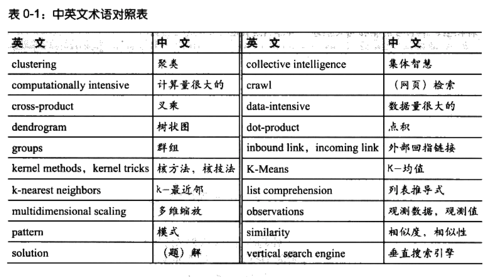

中文版的出版时间：2009 年

## 内容简介

本书以机器学习与计算统计为主题背景，专门讲述如何挖掘和分析 Web 上的数据和资源，如何分析用户体验、市场营销、个人品味等诸多信息，并得出有用的结论，通过复杂的算法来从 Web 网站获取、收集并分析用户的数据和反馈信息，以便创造新的用户价值和商业价值。全书内容翔实，包括协作过滤技术（实现关联产品推荐功能）、集群数据分析（在大规模数据集中发掘相似的数据子集）、搜索引核心技术（爬虫、索引、査询引繁、Pagerank 算法等）、搜索海量信息并进行分析统计得出结论的优化算法、贝叶斯过滤技术（垃圾邮件过滤、文本过滤）、用决策树技术实现预测和决策建模功能、社交网络的信息匹配技术、机器学习和人工智能应用等。

本书是 Web 开发者、架构师、应用工程师等的绝佳选择。

## 译者序

还记得上个世纪 90 年代，当大学校园里的学子们还在为能够通过对等网在不同计算机间相互发送消息而兴奋不已的时候，互联网就已经悄然兴起了。很快，人们就从 C/S 时代跨入 了 B/S 时代。我们不必再担心每次都要安装复杂的客户端程序，只要有浏览器，就会有绚丽多彩的舞台。然而随着时间的推移，人们又开始有所回归，大家不时地抱怨：为什么不能让浏览器像客户端应用那样具有丰富的表现？为什么每次打开链接都要傻傻地等着空白页面消失？直到有一天，Tim O'Reil 向世人宣告了一个新的概念——Web2.0。于是，忽如一夜春风来，大大小小的 Web2.0 应用如雨后春笋般不断涌现，互联网又迈向了一个新的时代。

Web2.0 使互联网变得异彩纷呈：来自不同地域的人们可以随时修改别人写过的文字，这就是维基；你有任何想法或观点都可以尽情地表达并欢迎别人评论，这就是博客；甚至连网页上出现的广告也都是与我们当前所关注的内容密切相关，这就是 Google Adsense 所有这一切，都带给我们不同于以往的全新感受。但是，这些应用究竟是怎样实现的？隐藏在它们背后的原理到底是什么？怎样让我们的 Web2.0 程序变得更加聪明，更加贴心呢？译者相信，本书必定能够为大家逐一解开素绕在心中的这些谜团。

本书以 Web2.0 的核心价值观——集体智慧作为出发点，探讨了各种能够让 Web2.0 程序变得更为智能的算法及其应用。这些算法大多来自机器学习和计算统计领域，其中的一些算法非常普及，而另一些则属于目前相当前沿的课题。它们包括了过滤器、聚类算法、支持向量机、遗传編程、优化技术，以及非常著名的 Pagerank 算法，等等。将如此众多的优秀算法有效应用于互联网领域，并构造出具有智能特征的 Web2.0 应用，应该是本书的一大亮点，同时，这也使本书有别于以往我们所见到过的任何一本纯粹介绍 Web2.0 技术与概念的书籍。不仅如此，本书还提供了大量可供运行的示例代码，这些代码具有很好的复用性只要稍加修改就可以用于实际的应用系统之中。书中代码还大最使用了许多时下流行的开放 API，这些 API 来自于 Yahoo!、eBay、FaceBook 等众多热门的 Web2.0 网站，这使得本书在保有实用价值的同时又不失时效性。

本书的英文版虽只有塞塞 300 多页，比起任何一本大部头的技术书籍都是不足道的，但作为一本为数不多的深入讲解蕴藏于智能 Web2.0 应用背后的算法原理的书籍，其深度和内涵却远远超出了篇幅的局限。为了尽量将原书的思想内涵以中文形式尽数表达出来，作为译者的我们在本书翻译期间着实不敢懈怠。在将书稿提交给出版社编辑之前，我们对每一章的译文都进行了不少于两遍的仔细校对。作为补充，中文版还随附了翻译期间译者所用的中英文术语对照表，希望本书中文版能够得到诸位读者的认可。

这本译作的完成是团队协作努力的结果，这包括了参与翻译、校审，以及关注和支持本书醐译的所有人。感谢博文视点的周筠老师对我们的信任，感谢本书的前后两位责编王凡毓与王晓菲，尤其是晓菲，她为本书的后期校审与编辑加工付出了辛劳，我们的合作非常愉快。此外，还要感谢李唯一，她为本书的前期翻译提供了诸多帮助。

由于译者水平所限，译文难免有疏误之处，欢迎读者批评指正。

为了便于读者阅读理解，特在此附上本书翻译过程中整理提取的中英文术语对照表。下表所包含的多为专业领域的技术术语。其中部分术语在不同的文献中往往有不同的译法。本书为了统一，选择了比较常见的译法，如 clustering 可译作「聚类」或「聚集」，此处我们选择了「聚类」。类似的还有 k-nearest neighbors、cross-product、dot-product，等等。

另一部分术语，虽有固定译法，但我们结合上下文，采用了更为贴切的翻译。如 computationally intensive 常被译为「计算密集的」，而在此处，我们采用「计算量很大的」。类似的还有 data- Intensive、solution、crawl，等等。此外还有一部分术语，在当下的中文文献中并没有明确的公认译法，因而我们在书中给出了参考翻译，以供大家商榷。如 collective intelligence 被译为「集体智慧」，list comprehension 被译为「列表推导式」，等等。



## 前言

无论是有意还是无意，越来越多投身于互联网的人们已经制造出了相当多的数据，这给了我们无数潜在的机会来洞悉用户体验、商业营销、个人偏好和通常所谓的人类行为（human behavior）。本书向大家介绍了一个新兴的领域，称为集体智慧（collective intelligence）。这领域涵盖了诸多方法，借助这些方法我们可以从众多 Web 站点处（这些站点的名字或许你曾经有所耳闻）提取到值得关注的重要数据；借助这些方法我们还可以从使用自己应用程序的用户那里搜集信息，并对我们所掌握的数据进行分析和理解。

本书的目的是要带领你超越以数据库为后端的简单应用系统，并告诉你如何利用自己和他人每天搜集到的信息来编写更为智能的程序。

### 1. 先决条件

本书的代码示例是用 Python 语言编写的，因此熟悉 Python 编程将会有助于你对算法的理解，不过笔者给出了所有算法的解释说明，所以其他语言的程序员也能看懂。对于已经了解了像 Ruby 或 Perl 这样高级语言的程序员，Python 代码应该是非常容易理解的。本书的目的不是要作为一本学习编程的指导书，因此尤为重要的一点在于，为了熟悉基本概念，我们最好已编写过足够多的代码。如果懂得递归和一点点函数式编程（functional programming）的基本概念，那么我们就会发觉书中的内容是很容易理解的。

本书并不假设你已经具备了任何有关数据分析、机器学习或统计学方面的知识。笔者在尝试以尽可能浅显易懂的方式来解释数学概念，不过具备一点三角学和统计学的基本知识将会对你理解算法有所助益。

### 2. 示例风格

本书毎一章节的代码示例都是以一种教程式的风格编写而成的，它鼓励你以循序渐进的方式来构建应用程序，并对算法的工作原理有一个深入的理解和认识。大多数情况下，写完个新的函数或方法之后，我们会在一个交互的会话环境里使用它，以此来理解算法的工作原理。通常算法是有简单的变体的，我们可以用多种方式对其进行扩展。通过示例讲解并以交互的方式对其进行测试，我们对算法将会有更为深入的理解，从而可以对其进行改造，以适应自己的应用程序。

### 3. 为何选择 Python

尽管书中的算法是伴随着对相关公式的解释，以文字形式加以描述的，但是假如有针对算法和示例问题的实际代码，那将会是更有助益的（而且有可能更易于理解）。本书中的所有示例代码都是用 Python，一种优秀的高级语言编写而成的。之所以选择 Python 是因为它有如下特性。

简练。使用像 Python 这样的动态类型语言编写的代码往往比用其他主流语言编写而成的代码更加简短。这意味着，在完成示例的过程中会有更少的录入工作，而且这也意味着我们将更容易记住算法并真正领会算法的原理。

易于阅读。Python 不时被人们指为「可执行的伪代码」。虽然很明显这是一种夸大之词，但是它表明，大多数有经验的程序员可以读懂 Python 代码并领会代码所要表达的意图。Python 中一些不是很显见的语言要素将会在后面的「Python 技巧」一节中加以解释。

易于扩展。Python 随附了许多标准库，这些库涉及数学函数、XML（扩展标记语言）解析，以及网页下载。本书中用到的非标准库，如 RSS (Really Simple Syndication）解析器和 Sqlite 接口，则是免费的，很容易下载、安装和使用。

交互性。在学习示例的过程中，可以尝试执行我们编好的函数，而无须为此专门编写额外的程序，这一点是非常有价值的。Python 可以直接从命令行运行程序，它还有交互提示，允许我们键入函数调用、创建对象，并以交互的形式来对包进行测试。

多范式。Python 支持面向对象、过程式和函数式编程风格。机器学习算法千差万别，最为清晰的做法是针对不同算法采用不同的范式。有时将函数作为参数传入很有用处，而有时我们则须要在对象中捕获状态。对于这两种方式，Python 均予以支持。

多平台和免费。Python 有一个针对所有主流平台的单一参考实现，并且它对所有平台都是免费的。本书中所列代码可以运行于 Windows Inux 和 Macintosh 环境。

### 4. Python 技巧

对于有兴趣学习 Python 编程的初学者而言，笔者推荐大家阅读由 Mark Lutz 与 David Ascher 合著的《Learning Python》（O'reilly），该书有对 Python 的全面论述。为了更为直观地表达算法或基础性概念，笔者在整本书中使用了一些 Python 特有的语法，但是其他语言的程序员应该会发现，Python 的代码相对而言还是较为容易掌握的。下面是为非 Python 程序员提供的一份快速概览。

列表和字典的构造函数。Python 有一组不错的基本类型，其中有两种类型在本书中被大量使用，它们分别是列表和字典。列表是由一组任意类型的值构成的有序列表，它由方括号构造而成；字典是由一组名值对构成的无序集合，类似于其他语言中的 hash map。它由大括号构造；可以通过序列名后跟方括号的形式来访问列表和字典中的元素。

有意义的空白字符。与大多数语言有所不同，Python 实际上是利用代码的缩进来定义代码块的。请看下列代码片段；因为代码是被缩进的，所以语法解释器知道前两个打印语句会在 x 为 1 的时候被执行。缩进可以是任意数量的空格，只要它是常量即可。本书使用的缩进是两个空格。在输入代码的时候，我们须要注意正确拷贝缩进。

列表推导式。列表推导式（list comprehension）是一种方便简洁的语法形式，我们可以利用它将一个列表经过滤后转换成另一个列表，也可以利用它将函数应用于列表中的元素。列表推导式以如下形式书写：[表达式 for 变量 in 列表] 或者 [表达式 for 变量 in 列表 f 条件]。

例如，下列代码：

```
In [17]: l1 = range(10)
In [18]: l1
Out[18]: range(0, 10)
In [19]: print([v*10 for v in l1 if v > 5])
[60, 70, 80, 90]
```

本书中频繁地使用了列表推导式，因为要将一个函数应用于整个列表，或是別除不需要的列表项时，这种表达方法非常简练。列表推导式的另一种常见用法是与 dict 构造函数结合在一起使用。

```
In [20]: dict([(v, v*10) for v in l1])
Out[20]: {0: 0, 1: 10, 2: 20, 3: 30, 4: 40, 5: 50, 6: 60, 7: 70, 8: 80, 9: 90}
```

上述代码将会建立一个字典，以原先的列表作为键，以每个列表项乘以 10 作为值。

### 5. 开放的 API 

用于将集体智慧合成起来的算法需要来自许多用户的数据。除机器学习的算法外，本书还论及了许多开放的 Web APIS（应用编程接口）。这些 API 允许我们通过特殊的协议对来自相应 Web 站点的数据进行访问；我们可以编写程序将数据下载下来并加以处理。这些数据通常是由站点的使用者来提供的，我们可以从中挖掘出新的内涵来。有的时候，我们可以用现成的 Python 库来访问这些 API；而有时，如果没有现成的库，那么最为直接的做法莫过于创建自己的接口来访问数据，为此我们须要利用 Python 提供的内建库将数据下载下来，并对 XML 加以解析。

此处列出了一系列提供开放 API 的 Web 站点，我们将在本书中陆续接触到这些站点。

1. Delicio us。一个社会型书签应用系统（social bookmarking application），其开放的 API 允许你根据标签（tag）或特定的用户来下载链接；

2. Kayak。一个提供 API 的旅游网站，你可以利用 API 在自己的程序中集成针对航班和旅馆的搜索；

3. ebay。一个提供 API 的在线交易站点，允许你査询当前正在出售的货品；

4. Hot or Not。一个评分与交友的网站，提供 API 对人员进行搜索，并获取其评分及个人资料；

5. Akismet。一种用于对协作型垃圾信息进行过滤的 API。

通过对来自单一源的数据进行处理，对来自多个源的数据进行组合，甚至通过将外部信息与自有系统的用户输入信息加以组合，我们可以构造出大量的潜在应用。对人们在不同网站以各种不同方式产生的数据加以充分利用的能力，便是构建集体智慧的一个基本要素。如果你想寻找更多的提供开放 API 的 Web 站点，不妨从访问 Programmable Web 开始（[ProgrammableWeb - APIs, Mashups and the Web as Platform](https://www.programmableweb.com/))。

### 6. 各章概览

本书的每个算法都来源于某一现实的问題，希望这些问题能够很容易地被广大读者所理解。笔者将尝试尽量避开那些要求大量领域知识的问题，而将焦点集中在那些虽不失复杂性，但对大多数涉足者而言却又是简单易懂的问题上。

第 1 章，集体智慧导言。本章解释了藴藏于机器学习背后的概念，并解释了如何将其应用于诸多不同的领域以及如何利用它对搜集自许多不同人群的数据进行分析，并从中得出新的结论。

第 2 章，提供推荐。本章介绍协作型过滤（collaborative filtering）技术，这项技术被许多在线零售商用来向顾客推荐商品或媒体。本章中有一节介绍了如何向一个社会型书签服务网站的用户提供推荐链接，还介绍了如何根据 Movielens 所提供的数据集构筑一个影片推荐系统。

第 3 章，发现群组。本章基于第 2 章中给出的某些观点，介绍了两种不同的聚类方法，利用这些方法，我们可以在一个大数据集中自动找出具有相似特征的群组。本章还演示了如何利用聚类算法从一组颇受欢迎的博客之中寻找群组，以及利用聚类算法根据某个社会型网站的用户意愿去寻找群组。

第 4 章，搜索与排名。本章描述了构成一个搜索引擎的各个不同组成部分，它们包括：爬虫程序（crawler）、素引程序（(indexer），以及査询引擎（query engine）。本章介绍了以来自外部网站的链接信息为依据给网页打分的 Pagerank 算法，还向你展示了如何构建神经网络，借此获知与不同结果相关联的关键词。

第 5 章，优化。本章介绍了优化算法，设计这些算法的目的，是为了对问题的数百万个可能的题解进行搜索，并从中选出最优解来。书中利用示例演示了这些算法的各种不同用法，包括为一群去往相同地点的旅客寻找最佳航班，寻求为学生安排宿舍的最佳方案，以及给出交又线数量最小的网络布局。

第 6 章，文档过滤。本章向读者演示了贝叶斯过滤，这一方法被广泛应用于许多免费的和商业的垃圾信息过滤系统中，用于根据单词类型及出现在文档中的其他特征对文档进行自动分类。我们将其应用于一组 RSS 搜素结果，以此来说明对内容项的自动分类过程。

第 7 章，决策树建模。本章介绍了决策树，我们不仅将它作为一种预测方法，而且还用它来为决策过程进行建模。本章中出现的第一棵决策树是根据假想的服务器日志数据构建而成的，我们利用它来预测用户是否有可能成为付费订户（premium subscriber）。本章的另一个例子则使用了来自真实 Web 站点的数据，用以对住房价格和来自 Hot or Not 网站的「热度」（hotness）评价进行建模。

第 8 章，构建价格模型。本章解决的是数值预测问题而非分类问题，期间用到了 k - 最近邻技术，并且还用到了第 5 章中的优化算法。我们将这些方法与 ebay API 结合在一起构造出一个系统，能够根据拍卖品的一组属性，预测出最终的拍卖价格。

第 9 章，高阶分类：核方法与 SVM。本章向读者介绍了如何利用支持向量机（support-vector machines）对在线约会网站的用户进行匹配，以及如何将其用于针对专业交友网站的好友信息搜索。支持向量机是一项非常高阶的技术，本章将之与其他方法进行了对比。

第 10 章，导找独立特征。本章介绍了一种相对较新的技术，称为非负矩阵因式分解：(non- negative matrix factorization），我们利用这项技术在数据集中寻找独立的特征。对许多数据集而言，其中所包含的内容都是可以借助一组独立特征的组合被重新构造出来的，而这些特征是我们事先不知道的，非负矩阵因式分解的思路便是要寻找这些特征。在本章中，我们利用一组新闻报道说明了该项技术的使用；期间，通过新闻故事来寻找其中的主题，一篇给定的新闻故事中会包含一个或多个这样的主题。

第 11 章，智能进化。本章介绍了遗传编程（genetic programming）的概念，这是一组非常复杂的技术，它超出了优化的范畴。并且，这项技术实际上借鉴了进化的思想，它是通过自动构造算法的方式来解决特定问题的。我们通过一个简单的游戏来说明这项技术的应用。在游戏中，计算机最初只是一个学艺不精的初级选手，但是随着游戏的不断进行，它会通过逐步改进其所拥有的代码来提升自己的技能。

第 12 章，算法总结。本章回顾了书中所讲述的所有机器学习算法及统计算法，并将它们与一组人为设计的问题做了对比。这将有助于我们理解算法的工作原理，并形象地说明每种算法划分数据的方法。

附录 A，第三方函数库。给出了有关本书所用的第三方库的信息，例如在哪里可以找到这些第三方库，以及如何进行安装。

附录 B，数学公式。包含了一部分数学公式及其说明，以及本书通篇引入的、以代码形式描述的诸多数学概念。

位于每章末尾处的练习，为读者提供了许多相关信息，借此我们可以对算法进行护展并使其变得更加强大。

## 关于作者

Toby Segaran 是 Genstruct 公司的软件开发主管，这家公司涉足计算生物领域，他本人的职责是设计算法，并利用数据挖掘技术来辅助了解药品机理。Toby Segaran 还为其他几家公司和数个开源项目服务，帮助它们从收集到的数据当中分析并发掘价值。除此以外，Toby Segaran 还建立了几个免费的网站应用，包括流行的 tasktoy 和 Lazybase。他非常喜欢滑雪与品酒，其博客地址是 blog.kiwitobes.com，现居于旧金山。

[Toby Segaran | Experiments in electronics, data, art, cocktails and physics](https://kiwitobes.com/)

## 关于封面

本书封面上的动物是王企鹅（Aptenodytes patagonicus）。尽管其命名与巴塔哥尼亚（Patagonia）地区有关，但是王企鹅却并非产于南美洲；它们在那里的最后一片栖息地早在 19 世纪就已经被海豹狩猎者给推段了。如今，这些企鹅分布在次南极群岛一帯，如爱德华王子（Prince Edward）、克罗泽特（Crozet）、麦格理（Macquarie），以及福克兰群岛（Falkland Islands）等地。它们居住在海滨及靠近大海的地势平坦的冰川地区。王企鹅完全是一种群居性的鸟类；在它们的繁殖地，种群的数量多达 1 万，而且它们时常聚集在一起饲养幼鸟。

王企鹅站立时有 76.2 厘米（30 英寸）高，体重达到 13.6 千克（30 磅），它们是企鹅家族中体型最大的种群之一一仅次于其近邻帝企鹅。除了体型以外，王企鹅还有一个主要的识别特征，那就是位于其头部的鲜橙色斑点，这些斑点一直向下延伸到其胸部的银白色羽毛处。王企鹅身形圆滑，并且不像帝企鹅那样只会在陆地上跳跃，它们还可以奔跑。王企鹅很习惯于海洋生活，它们以鱼类和乌贼为食，并且可以向下潜到 213.36 米（700 英尺）的深度，比其他大多数企鹅潜得还要深。由于雄性和性在体型和外观上都非常接近，因此人们一般根据它们的行为迹象（比如交配行为）对其加以区分的。

王企鹅并不筑巢；相反，它们会将唯一的一枚卵塞入肚皮下面，并放在两脚的蹼上。没有任何其他鸟类的繁殖周期会比王企鹅的还要长，这些企鹅每三年繁殖两次，并且每次只孵化一只幼鸟。王企鹅的幼鸟身型肥胖呈褐色，浑身毛茸茸的，以至于早期的探险者们以为这是与王企鹅完全不同的另一类企鹅，并将其称为「woolly penguins」（意指毛茸茸的企鹅）。王企鹅在全世界范围内的数量有 200 万对，它并不属于濒危物种，世界自然保护联盟已将其列入了无危物种。

本书封面的图片取自 J. G Wood 的《Animate Creation》。

