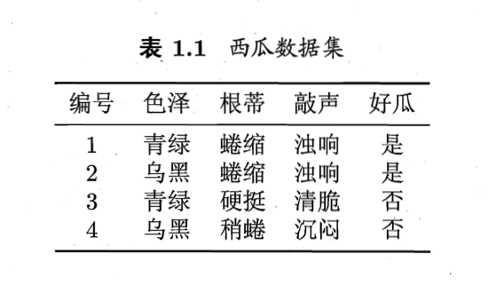
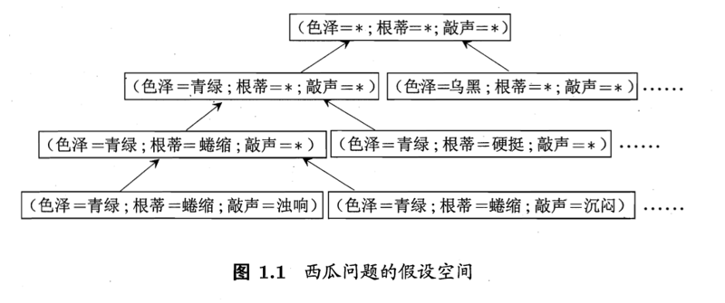
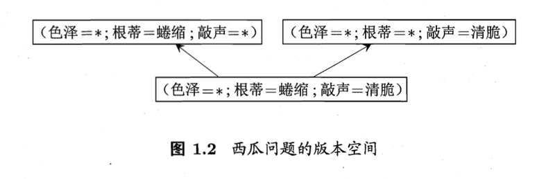
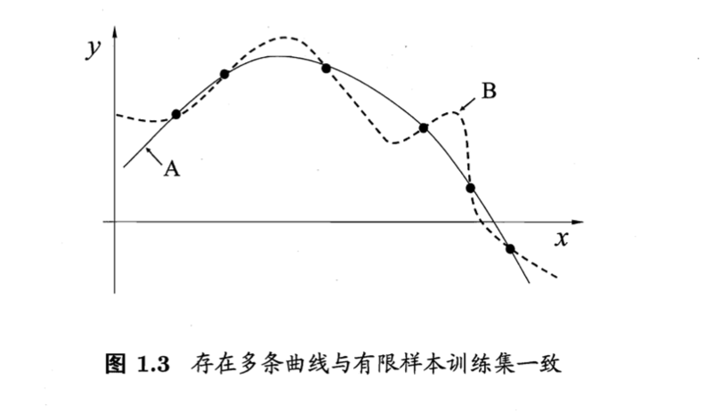
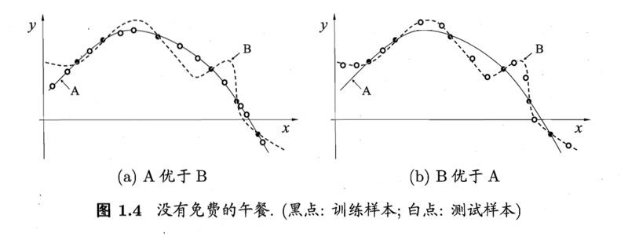
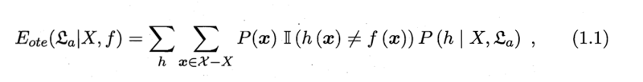
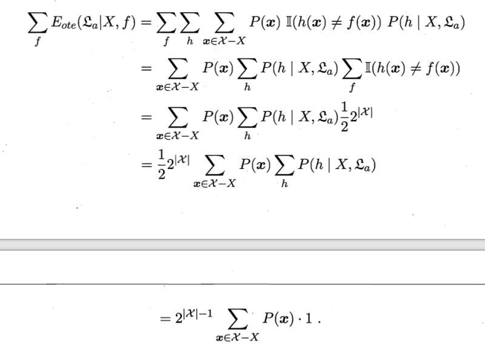
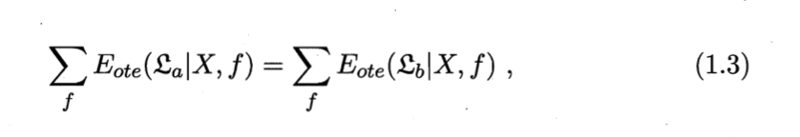

# 0101. 绪论

## 1.1 引言

傍晚小街路面上沁出微雨后的湿润，和煦的细风吹来，抬头看看天边的晚霞，嗯，明天又是一个好天气，走到水果推旁，挑了个根蒂蜷缩、敲起来声音浊响的青绿西瓜，一边满心期待着皮薄肉厚瓤甜的爽落感，一边愉快地想着，这学期狠下了工夫，基础概念弄得凊清楚楚，算法作业也是信手拈来，这门课成绩定差不了！

希望各位在学期结束时有这样的感觉。作为开场，我们先大致了解一下什么是「机器学习」（machine learning） 。

回头看第一段话，我们会发现这里涉及很多基于经验做出的预判。例如，为什么看到微湿路面、感到和风、看到晚霞，就认为明天是好天呢？这是因为在我们的生活经验中已经遇见过很多类似情况，头一天观察到上述特征后，第二天天气通常会很好。为什么色泽青绿、根蒂蜷缩、敲声浊响，就能判断出是正熟的好瓜？因为我们吃过、看过很多西瓜，所以基于色泽、根蒂、敲声这几个特征我们就可以做出相当好的判断。类似的，我们从以往的学习经验知道，下足了工夫、弄清了概念、做好了作业，自然会取得好成绩。可以看出，我们能做出有效的预判，是因为我们已经积累了许多经验，而通过对经验的利用，就能对新情况做出有效的决策。

上面对经验的利用是靠我们人类自身完成的。计算机能帮忙吗？机器学习正是这样一门学科，它致力于研究如何通过计算的手段，利用经验来改善系统自身的性能。在计算机系统中，「经验」通常以「数据」形式存在，因此，机器学习所研究的主要内容，是关于在计算机上从数据中产生「模型」（model）的算法，即「学习算法」（learning algorithm）。有了学习算法，我们把经验数据提供给它，它就能基于这些数据产生模型；在面对新的情况时（例如看到一个没剖开的西瓜），模型会给我们提供相应的判断（例如好瓜）。如果说计算机科学是研究关于「算法」的学问，那么类似的，可以说机器学习是研究关于「学习算法」的学问。

本书用「模型」泛指从数据中学得的结果。有文献用「模型」指全局性结果（例如一棵决策树）而用「模式」指局部性结果（例如一条规则）。

『 Mitchell 1997 年给出了一个更形式化的定义：假设用 P 来评估计算机程序在某任务类 T 上的性能，若一个程序通过利用经验 E 在 T 中任务上获得了性能改善，则我们就说关于 T 和 P，该程序对 E 进行了学习。』

## 1.2 基本术语

要进行机器学习，先要有数据。假定我们收集了一批关于西瓜的数据，例如：

```
（色泽 = 青绿；根蒂 = 蜷缩；敲声 = 浊响）
（色泽 = 鸟黑；根蒂 = 稍蜷；敲声 = 沉闷）
（色泽 = 浅白；根蒂 = 硬挺；敲声 = 清脆）
 ……
```

每对括号内是一条记录，「=」意思是「取值为」。这组记录的集合称为一个「数据集」（data set），其中每条记录是关于个事件或对象（这里是一个西瓜）的描述，称为一个「示例」（instance）或「样本」（sample）。反映事件或对象在某方面的表现或性质的事项，例如「色泽」「根蒂」「敲声」，称为「属性」（attribute）或「特征」（eature）；属性上的取值，例如「青绿」「乌黑」，称为「属性值」（attribute value）。属性张成的空间称为「属性空间」（attribute space）、「样本空间」（sample space）或「输入空间」。例如我们把「色泽」「根蒂」「敲声」作为三个坐标轴，则它们张成个用于描述西瓜的三维空间，每个西瓜都可在这个空间中找到自己的坐标位置。由于空间中的每个点对应一个坐标向量，因此我们也把一个示例称为一个「特征向量」（feature vector）。

一般地，令 `D={x1, x2,......,xm}` 表示包含 m 个示例的数据集，每个示例由 d 个属性描述（例如上面的西瓜数据使用了 3 个属性），则每个示例 `xi= (x; xi2; …xid)` 是 d 维样本空间 X 中的一个向量，`xi ∈ X`，其中 `xij` 是 `xi` 在第 `j` 个属性上的取值（例如上述第 3 个西瓜在第 2 个属性上的值是「硬挺」），d 称为样本 x1 的「维数」（dimensionality）。

从数据中学得模型的过程称为「学习」（earning）或「训练」（training），这个过程通过执行某个学习算法来完成。训练过程中使用的数据称为「训练数据」（training data），其中每个样本称为一个「训练样本」（training sample），训练样本组成的集合称为「训练集」（training set）。学得模型对应了关于数据的某种潜在的规律，因此亦称「假设」（hypothesis）；这种潜在规律自身，则称为「真相」或「真实」（ground-truth），学习过程就是为了找出或逼近真相。本书有时将模型称为「学习器」（learner），可看作学习算法在给定数据和参数空间上的实例化。

如果希望学得一个能帮助我们判断没剖开的是不是「好瓜」的模型，仅有前面的示例数据显然是不够的。要建立这样的关于「预测」（prediction）的模型，我们需获得训练样本的「结果」信息，例如（色泽 = 青绿；根蒂 = 蜷缩；敲声 = 浊响），好瓜）。这里关于示例结果的信息，例如「好瓜」，称为「标记」（label）；拥有了标记信息的示例，则称为「样例」（example）。一般地，用 `(xi, yi)` 表示第个 i 个样例，其中 `yi∈Y` 是示例 `xi` 的标记，Y 是所有标记的集合，亦称「标记空间」（label space）或「输出空间」。

若我们欲预测的是离散值，例如「好瓜」「坏瓜」，此类学习任务称为「分类」（classification）；若欲预测的是连续值，例如西瓜成熟度 0.95、0.37，此类学习任务称为「回归」（regression）。对只涉及两个类别的「二分类」（binary classification）任务，通常称其中一个类为「正类」（positive class），另一个类为「反类」（negative class）；涉及多个类别时，则称为「多分类」（multi-class classification）任务。一般地，预测任务是希望通过对训练集 `{(x1, y1), (x2, y2),......, (xm, ym)}` 进行学习，建立一个从输入空间 X 到输出空间 Y 的映射 `f：X→Y`。对二分类任务，通常令 `y={-1, +1}` 或 `{0,1} `；对多分类任务，`|y| > 2`；对回归任务，`y=R`，R 为实数集。

学得模型后，使用其进行预测的过程称为「测试」（(testing），被预测的样本称为「测试样本」（testing sample）。例如在学得 `f` 后，对测试例 `x`，可得到其预测标记 `y=f (x)`。

我们还可以对西瓜做「聚类」（clustering），即将训练集中的西瓜分成若干组，每组称为一个「簇」（cluster）；这些自动形成的簇可能对应一些潜在的概念划分，例如「浅色瓜」「深色瓜」，甚至「本地瓜」「外地瓜」。这样的学习过程有助于我们了解数据内在的规律，能为更深入地分析数椐建立基础。需说明的是，在聚类学习中，「浅色瓜」「本地瓜」这样的概念我们事先是不知道的，而且学习过程中使用的训练样本通常不拥有标记信息。

根据训练数据是否拥有标记信息，学习任务可大致划分为两大类：「监督学习」（supervised learning）和「无监督学习」（unsupervised learning），分类和回归是前者的代表，而聚类则是后者的代表。

需注意的是，机器学习的目标是使学得的模型能很好地适用于「新样本」而不是仅仅在训练样本上工作得很好；即便对聚类这样的无监督学习任务，我们也希望学得的簇划分能适用于没在训练集中出现的样本。学得模型适用于新样本的能力，称为「泛化」（generalization）能力。具有强泛化能力的模型能很好地适用于整个样本空间。于是，尽管训练集通常只是样本空间的一个很小的采样，我们仍希望它能很好地反映出样本空间的特性，否则就很难期望在训练集上学得的模型能在整个样本空间上都工作得很好。通常假设样本空间中全体样本服从一个未知「分布」（distribution）D，我们获得的每个样本都是独立地从这个分布上采样获得的，即「独立同分布」（independent and identically distributed，简称 i.i.d.）。一般而言，训练样本越多，我们得到的关于 D 的信息越多，这样就越有可能通过学习获得具有强泛化能力的模型。

『注释汇总：1）有时整个数据集亦称一个「样本」，因为它可看作对样本空间的一个采样；通过上下文可判断出「样本」是指单个示例还是数据集。2）若将标记看作对象本身的一部分，则「样例」有时也称为「样本」。3）训练样本亦称「训练示例」（training Instance）或「训练例」。学习算法通常有参数需设置，使用不同的参数值和积（或）训练数据，将产生不同的结果。将「label」译为「标记」而非「标签」，是考虑到英文中「label」既可用作名词、也可用作动词。4）若将标记看作对象本身的一部分，则「样例」有时也称为「样本」。「反类」亦称「负类」。5）亦称「测试示例」（testing Instance）或「测试例」。6）否则标记信息直接形成了簇划分；但也有例外情况，参见 13.6 节。7）亦称「有导师学习」和「无导师学习」。8）「新样本」更确切地说，是「未见示例」  (unseen Instance）。现实任务中样本空间的规模通常很大（例如 20 个属性，每个属性有 10 个可能取值，则样本空间的规模已达 `10^20`）。』

## 1.3 假设空间

归纳（induction）与演绎（deduction）是科学推理的两大基本手段。前者是从特殊到一般的「泛化」（generalization）过程，即从具体的事实归结出一般性规律；后者则是从一般到特殊的「特化」（specialization）过程，即从基础原理推演出具体状况。例如，在数学公理系统中，基于一组公理和推理规则推导出与之相洽的定理，这是演绎；而「从样例中学习」显然是一个归纳的过程，因此亦称「归纳学习」（inductive learning）。

归纳学习有狭义与广义之分，广义的归纳学习大体相当于从样例中学习，而狭义的归纳学习则要求从训练数据中学得概念（concept），因此亦称为「概念学习」或「概念形成」。概念学习技术目前研究、应用都比较少，因为要学得泛化性能好且语义明确的概念实在太困难了，现实常用的技术大多是产生「黑箱」模型。然而，对概念学习有所了解，有助于理解机器学习的一些基础思想概念学习中最基本的是布尔概念学习，即对「是」「不是」这样的可表示为 `0/1` 布尔值的目标概念的学习。举一个简单的例子，假定我们获得了这样个训练数据集：



这里要学习的目标是「好瓜」。暂且假设「好瓜」可由「色泽」「根蒂」「敲声」这三个因素完全确定，换言之，只要某个瓜的这三个属性取值明确了，我们就能判断出它是不是好瓜。于是，我们学得的将是「好瓜是某种色泽、某种根蒂、某种敲声的瓜」这样的概念，用布尔表达式写出来则是：

```
好瓜 ＝（色泽 =?) ∧（根蒂 =?) ∧（敲声 =？）
```

这里「？」表示尚未确定的取值，而我们的任务就是通过对表 1.1 的训练集进行学习，把「？」确定下来。读者可能马上发现，表 1.1 第一行：「（色泽一青绿）∧（根蒂一蜷缩）∧（敲声 = 浊响）」不就是好瓜吗？是的，但这是一个已见过的瓜，别忘了我们学习的目的是「泛化」，即通过对训练集中瓜的学习以获得对没见过的瓜进行判断的能力。如果仅仅把训练集中的瓜「记住」，今后再见到一模一样的瓜当然可判断，但是，对没见过的瓜，例如「（色泽一浅白）∧（根蒂一蜷缩）∧（敲声 = 浊响）」怎么办呢？

我们可以把学习过程看作一个在所有假设（hypothesis）组成的空间中进行搜索的过程，搜索目标是找到与训练集「匹配」（fit）的假设，即能够将训练集中的瓜判断正确的假设。假设的表示一旦确定，假设空间及其规模大小就确定了这里我们的假设空间由形如「（色泽 =?) ∧（根蒂 =?) ∧（敲声 =？）」的可能取值所形成的假设组成。例如色泽有「青绿」「鸟黑」「浅白」这三种可能取值还需考虑到，也许「色泽」无论取什么值都合适，我们用通配符 `*` 来表示，例如「好瓜 =（色泽 =`*`) ∧（根蒂一蜷缩）∧（敲声一浊响）」，即「好瓜是根蒂蜷缩、敲声浊响的瓜，什么色泽都行」。此外，还需考虑极端情况：有可能「好瓜」这个概念根本就不成立，世界上没有「好瓜」这种东西；我们用表示这个假设。这样，若「色泽」「根蒂」「敲声」分别有 3、2、2 种可能取值，则我们面临的假设空间规模大小为 `4×3×3+1=37`。图 1.1 直观地显示出了这个西瓜问题假设空间。



可以有许多策略对这个假设空间进行搜索，例如自顶向下、从一般到特殊，或是自底向上、从特殊到一般，搜索过程中可以不断删除与正例不一致的假设、和（或）与反例一致的假设。最终将会获得与训练集一致（即对所有训练样本能够进行正确判断）的假设，这就是我们学得的结果。

需注意的是，现实问题中我们常面临很大的假设空间，但学习过程是基于有限样本训练集进行的，因此，可能有多个假设与训练集一致，即存在着一个与训练集一致的「假设集合」，我们称之为「版本空间」（version space）。例如在西瓜问题中，与表 1.1 训练集所对应的版本空间如图 1.2 所示。



『「记住」训练样本，就是所谓的「机械学习」Cohen and Feigenbaum, 1983，或称「死记硬背式学习」，参见 1.5 节；这里我们假定训练样本不含噪声，并且不考虑「非青绿」这样的操作。由于训练集包含正例，因此假设自然不出现；有许多可能的选择，如在路径上自顶向下与自底向上同时进行，在操作上只删除与正例不一致的假设等。』

## 1.4 归纳偏好

通过学习得到的模型对应了假设空间中的一个假设。于是，图 1.2 的西瓜版本空间给我们带来一个麻烦：现在有三个与训练集一致的假设，但与它们对应的模型在面临新样本的时候，却会产生不同的输出。例如，对（色泽 = 青绿；根蒂 = 蜷缩；敲声 = 沉闷）这个新收来的瓜，如果我们采用的是「好瓜（色泽 =`*)` ∧（根帯 = 蜷缩）∧（敲声 =`*`）」，那么将会把新瓜判断为好瓜，而如果采用了另外两个假设，则判断的结果将不是好瓜。那么，应该采用哪一个模型（或假设）呢？

若仅有表 1.1 中的训练样本，则无法断定上述三个假设中哪一个「更好」然而，对于一个具体的学习算法而言，它必须要产生一个模型。这时，学习算法本身的「偏好」就会起到关键的作用。例如，若我们的算法喜欢「尽可能特殊」的模型，则它会选择「好瓜（色泽 =`*`) ∧（根蒂一蜷缩）∧（敲声 = 浊响）」但若我们的算法喜欢「尽可能一般」的模型，并且由于某种原因它更「相信」根蒂，则它会选择「好瓜令（色泽 =`*`) ∧（根蒂一蜷缩）∧（敲声 = `*`）」。机器学习算法在学习过程中对某种类型假设的偏好，称为「归纳偏好」（(inductive bias），或简称为「偏好」。

任何一个有效的机器学习算法必有其归纳偏好，否则它将被假设空间中看似在训练集上「等效」的假设所迷惑，而无法产生确定的学习结果。可以想象，如果没有偏好，我们的西瓜学习算法产生的模型每次在进行预测时随机抽选训练集上的等效假设，那么对这个新瓜「（色泽 = 青绿；根蒂=蜷缩；敲声=沉闷）」，学得模型时而告诉我们它是好的、时而告诉我们它是不好的，这样的学习结果显然没有意义。

归纳偏好的作用在图 1.3 这个回归学习图示中可能更直观。这里的每个训练样本是图中的一个点 `(x, y)`，要学得一个与训练集一致的模型，相当于找到条穿过所有训练样本点的曲线。显然，对有限个样本点组成的训练集，存在着很多条曲线与其一致。我们的学习算法必须有某种偏好，オ能产出它认为「正确」的模型。例如，若认为相似的样本应有相似的输出（例如，在各种属性上都很相像的西瓜，成熟程度应该比较接近，则对应的学习算法可能偏好图 1.3 中比较「平滑」的曲线 A 而不是比较「崎岖」的曲线 B。



归纳偏好可看作学习算法自身在一个可能很庞大的假设空间中对假设进行选择的启发式或「价值观」。那么，有没有一般性的原则来引导算法确立「正确的」偏好呢？「奥卡姆剃刀」（Ocam's razor）是一种常用的、自然科学研究中最基本的原则，即「若有多个假设与观察一致，则选最简单的那个」。如果采用这个原则，并且假设我们认为「更平滑」意味着「更简单」（例如曲线 A 更易于描述，其方程式是 `y = -x2 + 6x + 1`，而曲线 B 则要复杂得多），则在图 1.3 中我们会自然地偏好「平滑」的曲线 A。

然而，奥卡姆剃刀并非唯一可行的原则。退一步说，即便假定我们是奥卡姆剃刀的铁杆拥趸，也需注意到，奥卡姆剃刀本身存在不同的诠释，使用奥卡姆剃刀原则并不平凡。例如对我们已经很熟悉的西瓜问题来说，「假设 1: 好瓜分（色泽 =`*`) ∧（根蒂 = 蜷缩）（敲声 = 浊响）」和假设 2:「好瓜（色泽 =`*`) ∧（根蒂一蜷缩）∧（敲声 =`*`）」这两个假设，哪一个更「简单」呢？这个问题并不简单，需借助其他机制才能解决。

事实上，归纳偏好对应了学习算法本身所做出的关于「什么样的模型更好」的假设。在具体的现实问题中，这个假设是否成立，即算法的归纳偏好是否与问题本身匹配，大多数时候直接决定了算法能否取得好的性能。

让我们再回头看看图 1.3。假设学习算法基于某种归纳偏好产生了对应于曲线 A 的模型，学习算法基于另一种归纳偏好产生了对应于曲线 B 的模型。基于前面讨论的平滑曲线的某种「描述简单性」，我们满怀信心地期待算法 a 比 b 更好。确实，图 1.4 (a）显示出，与 B 相比，A 与训练集外的样本更致；换言之，A 的泛化能力比 B 强。



但是，且慢！虽然我们希望并相信 a 比 b 更好，但会不会出现图 1.4(b) 的情况：与 A 相比，B 与训练集外的样本更一致？很遗憾，这种情况完全可能出现。换言之，对于一个学习算法 a，若它在某些问题上比学习算法 b 好，则必然存在另一些问题，在那里 b 比 a 好。有趣的是，这个结论对任何算法均成立，哪怕是把本书后面将要介绍的一些聪明算法作为见而将「随机胡猜」这样的笨拙算法作为 b。惊讶吗？让我们看看下面这个简短的讨论：

为简单起见，假设样本空间和假设空间都是离散的。令 XX 代表算法 a 基于训练数据 X 产生假设 ん 的概率，再令 f 代表我们希望学习的真实目标函数。见 a 的「训练集外误差」，即 a 在训练集之外的所有样本上的误差为：



其中 XX 是指示函数，若 · 为真则取值 1，否则取值 0。

考虑二分类问题，且真实目标函数可以是任何函数 XX，函数空间为 XX。对所有可能的 f 按均匀分布对误差求和，有：



式（1.2）显示出，总误差竞然与学习算法无关！对于任意两个学习算法 a 和 b，我们都有：



也就是说，无论学习算法。多聪明、学习算法多笨拙，它们的期望性能竟然相同！这就是「没有免费的午餐」定理（No Free Lunch Theorem，简称 NFL EE H）。这下子，读者对机器学习的热情可能被一盆冷水浇透了：既然所有学习算法的期望性能都跟随机胡猜差不多，那还有什么好学的？

我们需注意到，NFL 定理有一个重要前提：所有「问题」出现的机会相同、或所有问题同等重要。但实际情形并不是这样。很多时候，我们只关注自己正在试图解决的问题（例如某个具体应用任务），希望为它找到一个解决方案，至于这个解决方案在别的问题、甚至在相似的问题上是否为好方案，我们并不关心。例如，为了快速从 A 地到达 B 地，如果我们正在考虑的 A 地是南京鼓楼、B 地是南京新街口，那么「骑自行车」是很好的解决方案；这个方案对 A 地是南京鼓楼、B 地是北京新街口的情形显然很糟糕，但我们对此并不关心。

事实上，上面 NFL 定理的简短论述过程中假设了 f 的均匀分布，而实际情形并非如此。例如，回到我们熟悉的西瓜问题，考虑 {假设 1：好瓜（色泽 = `*`）∧（根蒂 = 蜷缩）∧（敲声 = 浊响} 和 {假设 2：好瓜（色泽 = `*`) ∧（根蒂 = 硬挺）∧（敲声 = 清脆｝。从 NFL 定理可知，这两个假设同样好。我们立即会想到符合条件的例子，对好瓜（色泽 = 青绿；根蒂 = 蜷缩；敲声 = 浊响）是假设 1 更好，而对好瓜（色泽 = 鸟黑；根蒂 = 硬挺；敲声 = 清脆）则是假设 2 更好。看上去的确是这样。然而需注意到，「（根蒂 = 蜷缩；敲声 = 浊响）」的好瓜很常见，而「（根蒂 = 硬挺；敲声 = 清脆）」的好瓜罕见，甚至不存在。

所以，NFL 定理最重要的寓意，是让我们清楚地认识到，脱离具体问题，空泛地谈论「什么学习算法更好」毫无意义，因为若考虑所有潜在的问题，则所有学习算法都一样好。要谈论算法的相对优劣，必须要针对具体的学习问题；在某些问题上表现好的学习算法，在另一些问题上却可能不尽如人意，学习算法自身的归纳偏好与问题是否相配，往往会起到决定性的作用。

『注释汇总：1）尽可能特殊即「适用情形尽可能少」；尽可能一般即「适用情形尽可能多」。2）对「根蒂」还是对「敲声」更重视，看起来和属性选择，亦称「特征选择」（feature selection）有关，但需注意的是，机器学习中的特征选择仍是基于对训练样本的分析进行的而在此处我们并非基于特征诜择做出对「根蒂」的重视；这里对「根蒂」的信赖可视为基于某种领域知识而产生的归纳偏好。关于特征选择方面的内容参见第 11 章。』

## 1.5 发展历程

机器学习是人工智能（artificial intelligence）研究发展到一定阶段的必然产物。二十世纪五十年代到七十年代初，人工智能研究处于「推理期」，那时人们以为只要能赋予机器逻辑推理能力，机器就能具有智能。这一阶段的代表性工作主要有 A. Newell 和 H. Simon 的「逻辑理论家」（Logic Theorist）程序以及此后的「通用问题求解」（General Problem Solving）程序等，这些工作在当时取得了令人振奋的结果。

例如，「逻辑理论家」程序在 1952 年证明了著名数学家罗素和怀特海的名著《数学原理》中的 38 条定理，在 1963 年证明了全部 52 条定理，特别值得一提的是，定理 2.85 甚至比罗素和怀特海证明得更巧妙。A. Newell 和 H. Simon 因为这方面的工作获得了 1975 年图灵奖。然而，随着研究向前发展，人们逐渐认识到，仅具有逻辑推理能力是远远实现不了人工智能的。E. A. Feigenbaum 等人认为，要使机器具有智能，就必须设法使机器拥有知识在他们的倡导下，从二十世纪七十年代中期开始，人工智能研究进入了「知识期」。在这一时期，大量专家系统问世，在很多应用领域取得了大量成果。E. A. Feigenbaum 作为「知识工程」之父在 1994 年获得图灵奖。但是，人们逐渐认识到，专家系统面临「知识工程瓶颈」，简单地说，就是由人来把知识总结出来再教给计算机是相当困难的。于是，一些学者想到，如果机器自己能够学习知识该多好！

事实上，图灵在 1950 年关于图灵测试的文章中，就曾提到了机器学习的可能；二十世纪五十年代初已有机器学习的相关研究，例如 A. Samuel 著名的跳棋程序。五十年代中后期，基于神经网络的「连接主义」（connectionism）学习开始出现，代表性工作有 F. Rosenblatt 的感知机（Perceptron）、B. Widrow 的 Adaline 等。在六七十年代，基于逻辑表示的「符号主义」（symbolism）学习技术蓬勃发展，代表性工作有 P. Winston 的「结构学习系统」、R. S. Michalski 等人的「基于逻辑的归纳学习系统」、E. B. Hunt 等人的「概念学习系统」等；以决策理论为基础的学习技术以及强化学习技术等也得到发展，代表性工作有 N. J. Nilson 的「学习机器」等；二十多年后红极一时的统计学习理论的些奠基性结果也是在这个时期取得的。

1980 年夏，在美国卡耐基梅隆大学举行了第一届机器学习研讨会（IWML）；同年，《策略分析与信息系统》连出三期机器学习专辑；1983 年，Tioga 出版社出版了 R. S. Michalski、J. G. Carbonell 和 T. Mitchel 主编的《机器学习：一种人工智能途径》[Michalski et al,1983]，对当时的机器学习研究工作进行了总结；1986 年，第一本机器学习专业期刊 Machine Learning 创刊；1989 年，人工智能领域的权威期刊 Artificial Intelligence 出版机器学习专辑，刊发了当时些比较活跃的研究工作，其内容后来出现在 J. G. Carbonell 主编、MIT 出版社 1990 年的《机器学习：范型与方法》（Carbonell 1990）一书中。总的来看，二十世纪八十年代是机器学习成为一个独立的学科领域、各种机器学习技术百花初绽的时期。

R. S. Michalski 等人把机器学习研究划分为「从样例中学习」、「在问题求解和规划中学习」、「通过观察和发现学习」、「从指令中学习」等种类；E. A. Feigenbaum 等人在著名的《人工智能手册》（第三卷 Cohen and Feigenbaum,1983）中，则把机器学习划分为「机械学习」、「示教学习」、「类比学习」和「归纳学习」。机械学习亦称「死记硬背式学习」，即把外界输入的信息全部记录下来，在需要时原封不动地取出来使用，这实际上没有进行真正的学习，仅是在进行信息存储与检索；示教学习和类比学习类似于 R. S. Michalski 等人所说的「从指令中学习」和「通过观察和发现学习」；归纳学习相当于「从样例中学习」，即从训练样例中归纳出学习结果。二十世纪八十年代以来，被研究最多、应用最广的是「从样例中学习」（也就是广义的归纳学习），它涵盖了监督学习、无监督学习等，本书大部分内容均属此范畴。下面我们对这方面主流技术的演进做一个简单回顾。

在二十世纪八十年代，「从样例中学习」的一大主流是符号主义学习，其代表包括决策树（decision tree）和基于逻辑的学习。典型的决策树学习以信息论为基础，以信息熵的最小化为目标，直接模拟了人类对概念进行判定的树形流程。基于逻辑的学习的著名代表是归纳逻辑程序设计（Inductive Logic Programming，简称 ILP），可看作机器学习与逻辑程序设计的交叉，它使用阶逻辑（即谓词逻辑）来进行知识表示，通过修改和扩充逻辑表达式（例如 Prolog 表达式）来完成对数据的归纳，符号主义学习占据主流地位与整个人工智能领域的发展历程是分不开的。前面说过，人工智能在二十世纪五十到八十年代经历了「推理期」和「知识期」，在「推理期」人们基于符号知识表示、通过演绎推理技术取得了很大成就，而在「知识期」人们基于符号知识表示、通过获取和利用领域知识来建立专家系统取得了大量成果，因此，在「学习期」的开始，符号知识表示很自然地受到青睐。事实上，机器学习在二十世纪八十年代正是被视为「解决知识工程瓶颈问题的关键」而走上人工智能主舞台的。决策树学习技术由于简单易用，到今天仍是最常用的机器学习技术之一。ILP 具有很强的知识表示能力，可以较容易地表达出复杂数据关系，而且领域知识通常可方便地通过逻辑表达式进行描述，因此，ILP 不仅可利用领域知识辅助学习，还可通过学习对领域知识进行精化和增强；然而，成也萧何、败也萧何，由于表示能力太强，直接导致学习过程面临的假设空间太大、复杂度极高，因此，问题规模稍大就难以有效进行学习，九十年代中期后这方面的研究相对陷入低潮。

二十世纪九十年代中期之前，「从样例中学习」的另一主流技术是基于神经网络的连接主义学习。连接主义学习在二十世纪五十年代取得了大发展，但因为早期的很多人工智能研究者对符号表示有特别偏爱，例如图灵奖得主 H. Simon 曾断言人工智能是研究「对智能行为的符号化建模」，所以当时连接主义的研究未被纳入主流人工智能硏究范畴。尤其是连接主义自身也遇到了很大的障碍，正如图灵奖得主 M. Minsky 和 S. Papert 在 1969 年指出，（当时的）神经网络只能处理线性分类，甚至对「异或」这么简单的问题都处理不了。1983 年 J. J. Hopfield 利用神经网络求解「流动推销员问题」这个著名的 NP 难题取得重大进展，使得连接主义重新受到人们关注。1986 年，D. E. Rumelhart 等人重新发明了著名的 BP 算法，产生了深远影响。与符号主义学习能产生明确的概念表示不同，连接主义学习产生的是「黑箱」模型，因此从知识获取的角度来看，连接主义学习技术有明显弱点；然而，由于有 BP 这样有效的算法，使得它可以在很多现实问题上发挥作用。事实上，BP 一直是被应用得最广泛的机器学习算法之一。连接主义学习的最大局限是其「试错性」；简单地说，其学习过程涉及大量参数，而参数的设置缺乏理论指导，主要靠手工「调参」；夸张一点说，参数调节上失之毫厘，学习结果可能谬以千里。

二十世纪九十年代中期，「统计学习」（statistical learning）闪亮登场并迅速占据主流舞台，代表性技术是支持向量机（Support Vector Machine，简称 SVM）以及更一般的「核方法」（kernel methods）。这方面的研究早在二十世纪六七十年代就已开始，统计学习理论在那个时期也已打下了基础，例如 V. N. Vapnik 在 1963 年提出了「支持向量」概念，他和 A. J. Chervonenkis 在 1968 年提出 VC 维，在 1974 年提出了结构风险最小化原则等。但直到九十年代中期统计学习才开始成为机器学习的主流，一方面是由于有效的支持向量机算法在九十年代初才被提出，其优越性能到九十年代中期在文本分类应用中オ得以显现；另一方面，正是在连接主义学习技术的局限性凸显之后，人们才把目光转向了以统计学习理论为直接支撑的统计学习技术。事实上，统计学习与连接主义学习有密切的联系。在支持向量机被普遍接受后，核技巧（kernel trick）被人们用到了机器学习的几乎每一个角落，核方法也逐渐成为机器学习的基本内容之一。

有趣的是，二十一世纪初，连接主义学习又卷土重来，掀起了以「深度学习」为名的热潮。所谓深度学习，狭义地说就是「很多层」的神经网络。在若干测试和竞赛上，尤其是涉及语音、图像等复杂对象的应用中，深度学习技术取得了优越性能。以往机器学习技术在应用中要取得好性能，对使用者的要求较高；而深度学习技术涉及的模型复杂度非常高，以至于只要下工夫「调参」把参数调节好，性能往往就好。因此，深度学习虽缺乏严格的理论基础，但它显著降低了机器学习应用者的门槛，为机器学习技术走向工程实践带来了便利那么，它为什么此时才热起来呢？有两个基本原因：数据大了、计算能力强了深度学习模型拥有大量参数，若数据样本少，则很容易「过拟合」；如此复杂的模型、如此大的数据样本，若缺乏强力计算设备，根本无法求解。恰由于人类进入了「大数据时代」，数据储量与计算设备都有了大发展，才使得连接主义学习技术焕发又一春。有趣的是，神经网络在二十世纪八十年代中期走红，与当时 Intel xt86 系列微处理器与内存条技术的广泛应用所造成的计算能力、数据访存效率比七十年代有显著提高不无关联。深度学习此时的状况，与彼时的神经网络何其相似。

需说明的是，机器学习现在已经发展成为一个相当大的学科领域，本节仅是管中窥豹，很多重要技术都没有谈及，耐心的读者在读完本书后会有更全面的了解。

## 1.6 应用现状

在过去二十年中，人类收集、存储、传输、处理数据的能力取得了飞速提升，人类社会的各个角落都积累了大量数据，亟需能有效地对数据进行分析利用的计算机算法，而机器学习恰顺应了大时代的这个迫切需求，因此该学科领域很自然地取得巨大发展、受到广泛关注。

今天，在计算机科学的诸多分支学科领域中，无论是多媒体、图形学，还是网络通信、软件工程，乃至体系结构、芯片设计，都能找到机器学习技术的身影，尤其是在计算机视觉、自然语言处理等「计算机应用技术」领域，机器学习已成为最重要的技术进步源泉之一。

机器学习还为许多交叉学科提供了重要的技术支撑。例如，「生物信息学」试图利用信息技术来研究生命现象和规律，而基因组计划的实施和基因药物的美好愿景让人们为之心潮澎湃。生物信息学研究涉及从「生命现象」到「规律发现」的整个过程，其间必然包括数据获取、数据管理、数据分析、仿真实验等环节，而「数据分析」恰是机器学习技术的舞台，各种机器学习技术已经在这个舞台上大放异彩。

事实上，随着科学研究的基本手段从传统的「理论 + 实验」走向现在的「理论 + 实验 + 计算」，乃至出现「数据科学」这样的提法，机器学习的重要性日趋显著，因为「计算」的目的往往是数据分析，而数据科学的核心也恰是通过分析数据来获得价值。若要列出目前计算机科学技术中最活跃、最受瞩目的研究分支，那么机器学习必居其中。2001 年，美国 NASA-JPL 的科学家在 Science 杂志上专门撰文指出，机器学习对科学研究的整个过程正起到越来越大的支撑作用，其进展对科技发展意义重大。2003 年，DARPA 启动 PAL 计划，将机器学习的重要性上升到美国国家安全的高度来考虑。众所周知，美国最尖端科技的研究通常是由 NASA 和 DARPA 推进的，而这两大机构不约而同地强调机器学习的重要性，其意义不言而喻。

2006 年，卡耐基梅隆大学宣告成立世界上第一个「机器学习系」，机器学习领域奠基人之一 T. Mitchell 教授出任首任系主任。2012 年 3 月，美国奥巴马政府启动「大数据研究与发展计划」，美国国家科学基金会旋即在加州大学伯克利分校启动加强计划，强调要深入硏究和整合大数据时代的三大关键技术：机器学习、云计算、众包（crowdsourcing）。显然，机器学习在大数据时代是必不可少的核心技术，道理很简单：收集、存储、传输、管理大数据的目的，是为了「利用」大数据，而如果没有机器学习技术分析数据，则「利用」无从谈起。

谈到对数据进行分析利用，很多人会想到「数据挖掘」（data mining），这里简单探讨一下数据挖掘与机器学习的联系。数据挖掘领域在二十世纪九十年代形成，它受到很多学科领域的影响，其中数据库、机器学习、统计学无疑影响最大。数据挖掘是从海量数据中发掘知识，这就必然涉及对「海量数据」的管理和分析。大体来说，数据库领域的研究为数据挖掘提供数椐管理技术，而机器学习和统计学的研究为数据挖掘提供数据分析技术。由于统计学界的研究成果通常需要经由机器学习研究来形成有效的学习算法，之后再进入数据挖掘领域，因此从这个意义上说，统计学主要是通过机器学习对数据挖掘发挥影响，而机器学习领域和数据库领域则是数据挖掘的两大支撑。

今天，机器学习已经与普通人的生活密切相关。例如在天气预报、能源勘探、环境监测等方面，有效地利用机器学习技术对卫星和传感器发回的数据进行分析，是提高预报和检测准确性的重要途径；在商业营销中，有效地利用机器学习技术对销售数据、客户信息进行分析，不仅可帮助商家优化库存降低成本，还有助于针对用户群设计特殊营销策略……。下面再举几例：

众所周知，谷歌、百度等互联网搜索引擎已开始改变人类的生活方式，例如很多人已习惯于在出行前通过互联网搜索来了解目的地信息、寻找合适的酒店、餐馆等。美国《新闻周刊》曾对谷歌有一句话评论：「它使任何人离任何问题的答案间的距离变得只有点击一下鼠标这么远。」显然，互联网搜索是通过分析网络上的数据来找到用户所需的信息，在这个过程中，用户查询是输入、搜索结果是输出，而要建立输入与输出之间的联系，内核必然需要机器学习技术。事实上，互联网搜索发展至今，机器学习技术的支撑居功至伟。到了今天，搜索的对象、内容日趋复杂，机器学习技术的影响更为明显，例如在进行「图片搜索」时，无论谷歌还是百度都在使用最新潮的机器学习技术。谷歌、百度、脸书、雅虎等公司纷纷成立专攻机器学习技术的研究团队，甚至直接以机器学习技术命名的研究院，充分体现出机器学习技术的发展和应用，甚至在定程度上影响了互联网产业的走向。

再举一例。车祸是人类最凶险的杀手之一，全世界每年有上百万人丧生车轮，仅我国每年就有约十万人死于车祸。由计算机来实现自动汽车驾驶是一个理想的方案，因为机器上路时可以确保不是新手驾驶、不会疲劳驾驶，更不会酒后驾驶，而且还有重要的军事用途。美国在二十世纪八十年代就开始进行这方面研究。这里最大的困难是无法在汽车厂里事先把汽车上路后所会遇到的所有情况都考虑到、设计出处理规则并加以编程实现，而只能根据上路时遇到的情况即时处理。若把车载传感器接收到的信息作为输入，把方向、刹车、油门的控制行为作为输出，则这里的关键问题恰可抽象为一个机器学习任务。2004 年 3 月，在美国 DARPA 组织的自动驾驶车比赛中，斯坦福大学机器学习专家 S. Thrunp 的小组研制的参赛车用 6 小时 53 分钟成功走完了 132 英里赛程获得冠军。比赛路段是在内华达州西南部的山区和沙漠中，路况相当复杂，在这样的路段上行车即使对经验丰富的人类司机来说也是一个挑战。S. Thrun 后来到谷歌领导自动驾驶车项目团队。值得一提的是，自动驾驶车在近几年取得了飞跃式发展，除谷歌外，通用、奥迪、大众、宝马等传统汽车公司均投入巨资进行研发，目前已开始有产品进入市场。2011 年 6 月，美国内华达州议会通过法案，成为美国第一个认可自动驾驶车的州，此后，夏威夷州和佛罗里达州也先后通过类似法案。自动驾驶汽车可望在不久的将来出现在普通人的生活中，而机器学习技术则起到了「司机」作用。

机器学习技术甚至已影响到人类社会政治生活。2012 年美国大选期间，奥巴马麾下有一支机器学习团队，他们对各类选情数据进行分析，为奥巴马提示下一步竞选行动。例如他们使用机器学习技术分析社交网络数据，判断出在总统候选人第一次辦论之后哪些选民会倒戈，并根据分析的结果开发出个性化宣传策略，能为每位选民找出一个最有说服力的挽留理由；他们基于机器学习模型的分析结果提示奥巴马应去何处开展拉票活动，有些建议甚至让专业竞选顾问大吃一惊，而结果表明去这些地方大有收获。总统选举需要大量金钱，机器学习技术在这方面发挥了奇效。

例如，机器学习模型分析出，某电影明星对某地区某年龄段的特定人群很有吸引力，而这个群体很愿意出高价与该明星及奥巴马共进晚餐…...果然，这样一次筹资晚宴成功募集到 1500 万美元；最终，借助机器学习模型，奥巴马筹到了创纪录的 10 亿美元竞选经费机器学习技术不仅有助于竞选经费「开源」，还可帮助「节流」，例如机器学习模型通过对不同群体选民进行分析，建议购买了一些冷门节目的广告时段，而没有采用在昂贵的黄金时段购买广告的传统做法，使得广告资金效率相比 2008 年竟选提高了 14%...… 胜选后，《时代》周刊专门报道了这个被奥巴马称为「竞选核武器」、由半监督学习研究专家 R. Ghani 领导的团队。

值得一提的是，机器学习备受瞩目当然是由于它已成为智能数据分析技术的创新源泉，但机器学习研究还有另一个不可忽视的意义，即通过建立一些关于学习的计算模型来促进我们理解「人类如何学习」。例如，P. Kanerva，在二十世纪八十年代中期提出 SDM（Sparse Distributed Memory）模型时并没有刻意模仿脑生理结构，但后来神经科学的研究发现，SDM 的稀疏编码机制在视觉、听觉、嗅觉功能的脑皮层中广泛存在，从而为理解脑的某些功能提供了一定的启发。自然科学研究的驱动力归结起来无外是人类对宇宙本源、万物本质、生命本性、自我本识的好奇，而「人类如何学习」无疑是个有关自我本识的重大问题。从这个意义上说，机器学习不仅在信息科学中占有重要地位，还具有一定的自然科学探索色彩。

1『注释汇总：1）器学习提供数据分析能力，云计算提供数据处理能力，众包提供数据标记能力；2）数据挖掘这个词很早就在统计学界出现并略带贬义，这是由于传统统计学研究往往醉心于理论的优美而忽视实际效用但最近情况发生变化，越来越多的统计学家开始关注现实问题，进入机器学习和数据挖掘领域。』

## 1.7 阅读材料

[Mitchell, 1997] 是第一本机器学习专门性教材，[Duda et al,2001;: Al paydin,2004; Flach,2012] 都是出色的入门读物。[Hastie et all,2009] 是很好的进阶读物，[Bishop, 2006] 也很有参考价值，尤其适合于贝叶斯学习偏好者。[Shalev-Shwartz and Ben- David,2014] 则适合于理论偏好者。[Witten et al 2011] 是基于 WEKA 撰写的入门读物，有助于初学者通过 WEKA 实践快速掌握常用机器学习算法。

本书 1.5 和 1.6 节主要取材于 [周志华，2007]。《机器学习：一种人工智能途径》[Michalski et al.,198] 汇集了 20 位学者撰写的 16 篇文章，是机器学习早期最重要的文献。该书出版后产生了很大反响，Morgan Kaufmann 出版社后来分别于 1986 年和 1990 年出版了该书的续篇，编为第二卷和第三卷。《人工智能手册》系列是图灵奖得主 E. A. Feigenbaum 与不同学者合作编写而成，该书第三卷 [Cohen and Feigenbaum,1983] 对机器学习进行了讨论，是机器学习早期的重要文献。[Dietterich, 1997] 对机器学习领域的发展进行了评述和展望早期的很多文献在今天仍值得重视，一些闪光的思想在相关技术进步后可能焕发新的活力，例如近来流行的「迁移学习」（transfer learning) [Pan and Yang, 2010]，恰似「类比学习」（learning by analogy）在统计学习技术大发展后的升级版；红极一时的「深度学习」（deep learning）在思想上并未显著超越二十世纪八十年代中后期神经网络学习的研究。

机器学习中关于概念学习的研究开始很早，从中产生的不少思想对整个领域都有深远影响。例如作为主流学习技术之一的决策树学习，就起源于关于概念形成的树结构研究 [Hunt and Hovland,1963]。[Winston,1970] 在著名的「积木世界」研究中，将概念学习与基于泛化和特化的搜索过程联系起来。[Simon and Lea,1974] 较早提出了「学习」是在假设空间中搜索的观点。[Mitchell,1977] 稍后提出了版本空间的概念，概念学习中有很多关于规则学习的内容。

奥卡姆剃刀原则主张选择与经验观察一致的最简单假设，它在自然科学如物理学、天文学等领域中是一个广为沿用的基础性原则，例如哥白尼坚持「日心说」的理由之一就是它比托勒密的「地心说」更简单且符合天文观测。奥卡姆剃刀在机器学习领域也有很多追随者 [Blumer et al,1996]。但机器学习中什么是「更简单的」这个问题一直困扰着研究者们，因此，对奥卡姆剃刀在机器学习领域的作用一直存在着争议 [Web,1996; Domingos,1999]。需注意的是，奥卡姆剃刀并非科学研究中唯一可行的假设选择原则，例如古希腊哲学家伊壁鸠鲁（公元前 341 年 - 前 270 年）提出的「多释原则」（principle of multiple explanations），主张保留与经验观察一致的所有假设 [Asmi,1984]，这与集成学习（ensemble learning）方面的研究更加吻合。

机器学习领域最重要的国际学术会议是国际机器学习会议（IOML）、国际神经信息处理系统会议（NIPS）和国际学习理论会议（COLT），重要的区域性会议主要有欧洲机器学习会议（ECML）和亚洲机器学习会议（ACMD）；最重要的国际学术期刊是 Journal of Machine Learning Research 和 Machine Learning 人工智能领域的重要会议如 ICAI、AAAI 以及重要期刊如 Artificial Intell gence、Journal of Artificial Intelligence Research 数据挖掘领域的重要会议如 KDD、ICDM 以及重要期刊如 ACM Transactions on Knowledge Discovery from Data、Data Mining and Knowledge Discovery，计算机视觉与模式识别领域的重要会议如 CVPR 以及重要期刊如 IEEE Transactions on Pattern Analysis and Machine Intelligence，神经网络领域的重要期刊如 Neural Com putation, IEEE Transactions on Neural Networks and Learning Systems 也经常发表机器学习方面的论文。此外，统计学领域的重要期刊如 Annals of Statistics 等也常有关于统计学习方面的理论文章发表。

国内不少书籍包含机器学习方面的内容，例如 [陆汝钤，1996]、[李航，2012] 是以统计学习为主题的读物。国内机器学习领域最主要的活动是两年一次的中国机器学习大会（CCML）以及每年举行的「机器学习及其应用」研讨会（MLA）；很多学术刊物都经常刊登有关机器学习的论文。

## 习题