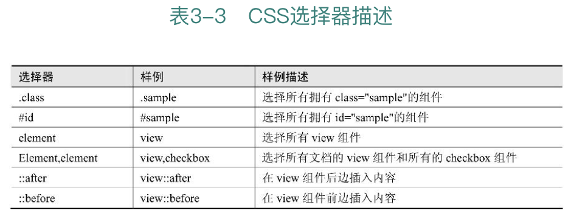

# 03 从第一个简单的「Welcome」页面开始小程序之旅

本章我们将正式开始 Orange Can 项目的编码工作。项目从编写一个最简单的 welcome 欢迎页面开始，并在编写页面的过程中逐步介绍小程序的基本文件结构、CSS 的使用限制、自适应单位 rpx、全局样式、App.json 配置文件以及 Flex 布局等小程序开发的必备知识。

## 3.1 认识小程序的基本文件结构

我们还是以第 2 章中新建的官方示例项目为参考，来看一下构成一个小程序的基本文件要素，如图 3-1 所示。不同于其他框架，小程序的目录结构非常简单，也非常易于理解。

首先我们看到根目录下面有 3 个文件：app.js、app.json 和 app.wxss。一个小程序项目必须有这 3 个描述 App 的文件，它们必须放在应用程序的根目录下，否则小程序会提示找不到 app.json 文件。表 3-1 描述了 3 个文件的意义。

表 3-1 app.js、app.json 和 app.wxss 的含义

app.js 是小程序逻辑文件（必填）；app.json 小程序配置文件（必填）；app.wxss 全局公共样式文件（非必填）。

这 3 个文件是应用程序级别的文件。

接着是和这 3 个应用程序级别文件平行的 pages 文件夹。一个小程序由若干个页面文件构成，如图 3-1 中 pages 文件夹下就有 2 个页面，分别是 indexI 页面和 ogs 页面。每个页面可以由 4 个文件构成，分别是：js、xml、wxss 和 json 文件。表 3-2 描述了这 4 个页面文件的意义。

js 是页面逻辑（必填）；wxml 是页面结构（必填）；wxss 是页面样式表（非必填）；json 是页面配置（非必填）。其实，这 4 个文件的作用大家并不陌生。我们可以和熟悉的 Web 前端开发技术做一个对比。

wxml 文件类似于我们熟悉的 HTML 文件，用来编写页面的标签和骨架，不同的是 wxml 文件里的标签元素不可以使用 HTML 标签，只能使用小程序自己封装的一些组件，这些组件也是我们后面要重点学习的知识。

wxss 文件的作用类似于我们熟悉的 CSS 文件，用于编写小程序的样式，实际上小程序的样式编写语言就是 CSS，只是把 CSS 文件换成了、wxss 文件。

json 文件用来配置页面的样式与行为。

js 文件类似于我们前端编程中的 Javascript 文件，用来编写小程序的页面逻辑。

以上 4 种类型的页面文件的文件名称必须相同，这是要注意的一个地方。

我们可以看到，小程序的 4 种页面级别文件同 3 个应用程序级別文件相比，多出了ー个 wxml 顶面标签文件，其他 3 个的作用基本相似，只不过页面文件作用于页面本身而应用程序文件作用于应用程序整体。

除了 pages 文件夹外，官方的示例项目中还有一个 utils 文件夹，这个文件夹用来存放一些公共的 js 文件，如 utls 下面的 uti.js。我们可以任意定义类似于 utils 文件夹的目录，并放在小程序的任意位置，小程序对此并没有任何限制。

## 3.2 开始动手编写第一个小程序页面

掌握以上的少量知识，我们就可以开始编写小程序了，是不是很惊奇。是的，小程序就是这样门适合实践的技术，让我们马上开始吧。

我们从零开始新建一个项目。每个项目都有一个自己的名字，比如 Google 的 Tensor Flow（一个机器学习项目）、淘宝的 Ocean Base（一个分布式数据库）、微软的 Azure（云计算「蔚蓝」），还有大家写代码使用的各类框架：Flask、Spring、jquery。我们的项目虽小，但还是要给它起个名字，就叫「Orange Can」吧。没有什么特殊的意思，纯粹是因为笔者现在想吃「桔子懽头」了。大家可以随意来给项目命名。

我们按照在 2.2 小节里所讲的方式，新建一个项目。仍选择（无 APPID），并且不勾选「在当前目录中创建 quick starti 顼目」这个选项，因为我们要从零开始编写一个项目，所以每个文件都将由自己亲手创建。项目创建后，会出现一个如图 3-2 所示的错误提示，这是因为现在的项目里还没有任何文件，由于缺少必要的文件，所以小程序会报错。之所以完全新建一个全新的项目，是为了向开发者展示这些常见的错误消息，如果大家不想经历这些错误，那么可以在官方提供的 quick start 项目上修改。

图 3-2 新建一个空白的项目，小程序会提示错误

错误信息提示我们缺少 app.json 文件。我们首先把 3.1 小节中所提到的 3 个应用程序文件新建在项目的根目录下。这时候，小程序依然会提示错误信息，可以先忽略掉这些错误信息。

我们继续在项目根目录下新建一个 pages 文件夹，并在 pages。文件夹下新建一个名为 welcome 的文件夹，接着再在 welcome 文件夹下新建 4 个页面文件：welcome.js、welcome.wxml、welcome. wxss 和 welcome.json。新建后的文件目录结构如图 3-3 所示。

完成以上操作后，第一个页面 'welcome' 所需要的全部文件就新建完毕了。这时候开发工具可能依然提示有错误，继续忽略它。

我们现在要做的事情是让 welcome 页面能够成功地显示出来。打开 /pages/welcome 现 welcome wxml 文件，在文件内敲入一行文字：「Welcome，桔子罐头」。如何让这段文本成功地显示在小程序中呢？

要显示 welcome 这个页面，必须让小程序的 MINA 框架知道这个页面的「存在」以及这个页面的具体位置（文件路径）。所以，我们需要在某个应用程序级别配置文件中注册这个 welcome 页面。那么哪个文件是用来做应用程序级别的配置的呢？回顾上ー小节中所讲的内容就应该知道，app.json 文件就是小程序提供给我们的全局配置文件。

那么，我们来学习一下如何在 app.json 中注册 welcome 页面。在 app.json 中加入如下代码：

代码清单 3-1 app.json

```
{
  "pages": [
    "pages/index/index",
    "pages/logs/logs",
    "pages/welcome/welcome"
  ],
  "window": {
    "backgroundTextStyle": "light",
    "navigationBarBackgroundColor": "#fff",
    "navigationBarTitleText": "WeChat",
    "navigationBarTextStyle": "black"
  },
  "style": "v2",
  "sitemapLocation": "sitemap.json"
}
```

上面这段代码将 welcome 页面注册到了小程序中。代码是一个典型的 json 对象。这个对象的第一个属性 pages 接受一个数组，数组的每一项是一个字符串，用来指定我们的小程序将由哪些页面组成。每一项由对应页面的「路径 + 文件名」组成。比如上面这段代码中的 pages/welcome/welcome，就指定了 welcome 页面的页面路径。

注意，页面路径前面不要加「/」。形如「/pages/ welcome/welcome」这样的路径是错误的。如果加入了「/」，小程序会提示错误：无法找到 welcome 页面。

这里要特别强调，路径最后一段 welcome，不需要指定具体的文件扩展名，无须写成 pages/welcome/ welcome.wxml。MINA 框架将会自动去寻找页面路径，并将页面的 json、js、wxml 和 wxss 这 4 个文件进行整合。

如果有多个页面，需要将每个页面的路径加入到 bages 这个数组下，否则小程序不会加载这些页面。下面代码是 Drange Can 项目后期的 pages 注册情况。

```
{
  "pages": [
    "pages/welcome/welcome",
    "pages/posts/posts",
    "pages/movies/more-movie/more-movie",
    "pages/movies/movies",
    "pages/posts/post-detail/post-detail",
    "pages/posts/post-item/post-item",
    "pages/posts/post-comment/post-comment"
  ]
```

页面的添加或者删除都需要在 pages 数组下面增减对应的页面路径，否则小程序会报错。当然现在只有一个 welcome 页面，那么 pages 下面先加入一个页面就可以了。随着 Drange Can 项目的不断开发，我们将在 pages 下面加入越来越多的页面路径。

现在，我们的小程序可能还会出现如图 3-4 所示的错误。

Sat Dec10201616:38:54 GMT+0800（中国标谁时间）page 编译错误

pages/welcome/ welcome 出现脚本错误或者未正确调用 Page ()

图 3-4 未正确调用 Page（）的错误提示

出现这个错误的主要原因是，welcome.js 文件是一个空文件，这是小程序所不允许的。即使我们门的 welcome 页面中没有任何 Javascript 代码，依然需要在 welcome.js 中主动调用一下 Page() 方法。我们在 welcome.js 文件中加入以下代码：

```
Page({

}
```

关于 Page() 方法的用法，我们将在编写 welcome.js 页面的 Javascript 代码时具体讲解，现在只需要知道页面的 js 文件是不可以完全为空白的，否则小程序会报错。

这个时候，我们的「Welcome，桔子罐头」这段文本还是没有在小程序中正确显示。那么试着在 welcome.json 中加入如下代码。

```
{

}
```

是的，正如 welcome. Js 文件不能为空一样，welcome json 文件同样不可以为空，即使你目前不想在 json 文件中配置任何属性，也需要加入ー个空的，以保证小程序能正确执行。

当我们完成以上所有的操作后，Ctrl+S 保存一下项目。此时，我们的小程序应该不会再报错了同时在模拟器中也应该能够正确地显示出「Welcome，桔子罐头」这段文本。这说明 welcome 页面已经被 MINA 框架正确地加载和运行了。

我们每次创建一个新页面时，都需要手动地新建一个目录 + 4 个文件，这是相当麻烦的事儿。这里告诉大家一个一次创建 4 个页面文件的小技巧（官方文档里没有提到过，开发工具也没有显示的标识）。如果 app.json 文件下 pages 数组里的页面路径，指向的是一个不存在的文件，那么 MINA 框架会自动创建这个页面的 4 个文件。我们可以试一下，在 app.json 文件的 pages 数组里添加一项「pages/orange/orange」，然后保存项目，会发生什么呢？

通过这样的方式新建的页面文件将自动补全每个页面文件里必须的基本代码，不会出现错误。本小节讲解手动创建文件的例子，是为了向开发者展示一些常见的错误提示并解释错误的原因。后续页面文件的创建将采取这种比较方便的方式。

## 3.3 构建 welcome 页面的元素和样式

在上ー小节中，我们仅仅正确地加载和显示了 welcome 页面，还没有编写任何页面代码。在本节中，将尝试为 welcome 页面添加一些标签元素。

可以在本书的彩页中查看 welcome 页面的最终设计图。这个设计图的设计元素非常简单，仅由张圆形的图片、一段文本和一个按钮构成。下面我们一起来完成第一个小程序页面吧。

首先来编写 3.2 小节中所创建的 welcome.wxml 文件，在该文件中键入以下代码，这段代码将 welcome 页面所需要的标签元素全部填入到页面源文件中。

```
<view class="container">
  <image></image>
  <text class="motto">Hello, 大龙</text>
  <view class="hi">
    <text>开启小程序之旅</text>
  </view>
</view>
```

这段代码总共使用了 3 个微信小程序的组件，分别是 view、text 和 image 组件。view 组件通常作为容器来使用，类似于 HTML 中的 dⅳ 标签；text 组件用来显示一段文本，类似于 HTML 中的 span 标签，本例中第一个 text 组件用来显示一段文本「Hello，桔子罐头」；而 image 组件用来显示一张图片，类似于 HTML 中的 img 标签。

大家应该注意到了，笔者在描述这些元素时的用词区别。描述 wxml 元素使用的是「组件」，而描述 HTML 元素使用的是「标签」，这是符合规范称呼的。HTML 是标记语言，它的标签主要是用来标记页面骨架，标签的属性也比较少。但组件不同，组件除了标记的作用，它的属性一般也是非常丰富的。小程序官方文档中也将 view、text、image 称为组件，而并没有称为标签。

同 HTML 中的 img 标签一样，images 组件需要设置一个 src 属性，该属性指向长图片的路径，用来显示该图片。我们在项目的根目录下新建一个名为 images 的目录，用来存放 Orange Can 的所有图片资源。在 images 目录下新建 avatar 目录，然后将一些适合做头像的图片拷贝到 avatar 目录中。

如何将图片放入到小程序的目录中？微信 Web 开发者工具无法通过 Ctrl+C/Ctrl+V 的功能复制粘贴图片，也没有提供导入图片的功能。我们需要在操作系统中打开项目的目录，并将图片拷贝到对应的 avatar 文件夹中，小程序会自动刷新目录，并在开发工具中显示这些图片。

以上操作完成后，我们的过程目录将变成如图 3-5 所示的结构。

现在在 image 组件中加入属性 src：

    <image src="../images/avatar/avatar-1.png"></image>

当保存项目后，模拟器立刻会出现这张图片，但图片显示的高宽并不是图片本身的高宽。它被 MINA 框架设置成了宽度 300 px、高度 225 px，这也是小程序默认的图片高宽。如果我们不显示地指定图片高宽，所有图片都将保持这个默认值。

相对路径与绝对路径。在小程序中同样有相对路径和绝对路径的区别。上面我们在设置 image 组件的 src 属性时，使用的是绝对路径，它以「/」开头，「/」代表根目录。我们也可以使用相对路径来为 image 指定图片路径，比如，将代码中 image 组件的 src 属性改写为相对路径：

    <image src="../../images/avatar/avatar-1.png"></image>

路径中的「..」表示向上一级。这里由于使用绝对路径更加简洁，所以我们使用绝对路径。代码中间部分使用一个 view 组件包裏一个「开启小程序之旅」的 text 组件来实现按钮部分。由于还没有编写样式，所以暂时它还不能呈现为一个按钮的形状。目前整个页面看起来是这个样子的，如图 3-6 所示。


现在来编写 welcome 页面的样式。小程序编写样式的语言就是 CSS，我们应该将 CSS 代码写在页面的 wxss 文件中。在编写 welcome.wxss 文件之前，首先在 welcome.wxml 文件中给每个需要样式的组件加入样式名称 class name。就和我们在 HTML 中编写 CSS 名称一样，不是吗？接着我们将下面这段 CSS 代码加入到 welcome.wxss 文件中。

```
<view class="container">
  <image class="avatar" src="../images/avatar/avatar-1.png"></image>
  <text class="motto">Hello, 大龙</text>
  <view class="journey-container">
    <text class="journey">开启小程序之旅</text>
  </view>
</view>
```

让我们保存一下，看看页面发生了什么变化，如图 3-7 所示。

```
.container{
  display: flex;
  flex-direction: column;
  align-items: center;
}

.avatar{
  width: 200rpx;
  height: 200rpx;
  margin-top: 160rpx;
}

.motto{
  margin-top: 100rpx;
  font-size: 80rpx;
  margin-top: 100rpx;
  color: aqua; 
}

.journey-container{
  margin-top: 200rpx;
  border: 1px springgreen;
  width: 200rpx;
  height: 80rpx;
  border-radius: 5px;
  text-align: center;
}

.journey{
  font-size:22rpx;
  font-weight: bold;
  line-height:80rpx;
  color: blueviolet;
}
```

下面简单介绍一下这些 CSS 代码的作用：

1. container 是所有组件元素的容器样式。这里使用 Flex 布局的方式，来控制容器下子元素的排布规则。关于 FIex 将在下个小节里具体讲解。

2. avatar 设置头像图片的大小和位置。

3. motto 设置「Hello，桔子罐头」这段文本的样式。

4. journey-container 设置了「开启小程序之旅」的外边框，使它们看起来更像一个按钮。border-radius 让这个外边框変成一个「圆角」的矩形。

5. journey 则设置了圆角矩形内的文本样式。

本书的主要目的是讲解小程序的核心知识，并不是一本 CSS 和 Javascript 的基础语法书。限于书籍的篇幅，我们只对 CSS 样式中的核心内容作较为深入的讲解。下个小节，我们来学习小程序官方推荐的布局方式：FIex 布局。

真实项目中，图片资源尽量不要存储在小程序的目录中，因为小程序的大小不能超过 1 MB，超过则无法真机运行和发布项目。应该将图片都存放在服务器上，让小程序通过网络来加载图片资源。

2『图片放在服务器上，这点很重要，因为小程序的大小不能超过 1 MB。』

## 3.4 小程序所支持的 CSS 选择器

需要特别注意的是，小程序中的 CSS 只支持表 3-3 所示 6 种 CSS 选择器。



虽然 CSS1、CSS2 和 CSS3 的选择器种类加起来总计几十种，但在小程序中只能支持以上几种。

同时需要注意的是，本地资源在 wxss 中是无法使用的。比如 background-image，如果使用的是本地图片，则无法显示，可以使用网络图片来代替本地图片。

## 3.5 Flex 布局

在 3.3 小节中，welcome.wxss 文件中的 container 样式使用了一个 display: flex 的样式。那么，什么是 FIex？FIex 布局是 W3C 组织在 2009 年提出的一个新的布局方案，其宗旨是让页面的样式布局更加简单，并且可以很好地支持响应式布局。这并不是小程序所独有的技术，它本身是 CSS 语法的一部分。只不过早期时候，主流的浏览器对 Flex 布局的支持并不完善，造成了很多开发者不知道有这种布局的存在或者使用非常少，我们还是习惯使用传统的 position 和 foat 属性来布局。但传统的布局方式有它的缺陷，比如像垂直居中就不是那么容易实现，Flex 可以很好地解決这些问题。

小程序能够非常好地支持 Flex 布局，并且这也是官方推荐的布局方式，我们结合代码清单 3-7 来学习ー下 FIex 布局的基础知识。FIex 也称为「弹性布局」，主要作用在容器上，比如代码清单 3-7 中样式为 container 的 view 组件，就是一个容器，它将页面中所有的元素都包裏起来。

我们使用 display: flexy 将这个 view 変成了一个弹性盒子。设置 display: flex 是应用一切弹性布局属性的先决条件，如果不设置 display: flex，那么后续的其他相关弹性布局属性都将无效。

接着我们使用 flex-direction 这个属性指定 view 内元素的排列方向。这个属性可能的值有 4 个：1）row；2）column；3）row-reverse；4）column-reverse。

要理解这 4 个属性，首先要了解一个 Flex 布局非常重要的概念：轴。

我们知道，在一个平面直角坐标系里，轴有两个方向（就是 X、Y），分别是水平方向和垂直方向。一个弹性盒子，需要确定一个主轴。这个主轴到底是水平方向还是垂直方向，就由 flex-direction 这个属性的值来确定。如果 flex-direction 值为 row 或者 row-reverse，那么主轴的方向为水平方向，相反，如果值为 column 或者 column-reverse，那么主轴为垂直方向。选定主轴的方向后，另外一个方向的轴我们成为「交叉轴」。也就是说，主轴并不ー定就是水平方向，交叉轴也并不ー定就是垂直方向，主轴的方向由 flex-direction 的取值来決定。理解这一点尤其重要。我们来看图 3-8~ 图 3-11 听示。

图 3-8 到图 3-11 显示了当 flex-direction 取不同值时，主轴方向及子元素排布的情况。注意观察每张图里 3 个小 item 的排布顺序，主轴方向不同，子元素排布的方向也不同。

1. flex-direction: row 时，主轴水平，方向为自左向右。

2. flex-direction: row-reverse 时，主轴水平，但方向为自右向左。

3. flex-direction: column 时，主轴垂直，方向自上而下。

4. flex-direction: column-reverse 时，主轴垂直，方向自下而上。

讲道理不如直接看效果。我们修改一下代码清单 3-7 来看下 4 种属性的效果。将代码清单 3-7里 container 样式中的 flex-direction 的值分别替换为 row、column、row-reverse、column-reverse。为了排除其他属性的干扰，我们将 container 样式中的 aign-items: center 也先注释掉。注释代码的快捷键为 Ctrl+/。得到的效果如图 3-12 ~ 图 3-15 所示。

是不是非常清楚？至于 row 和 row-reverse 这两张图中，「Hello，桔子罐头」往上偏移了一些，是因为受到 welcome.wxss 样式表中其他 CSS 属性的影响。但这 3 个元素的主要排布方向特征正如我们颈期的一样。根据设计图的样式，我们应该选择 flex-direction: column 作为我们的主轴。效果就如图 3-14 所显示的那样。

虽然 welcome 页面的 3 个元素已经呈现出了垂直排列，但他们还没有居中显示。container 样式中的属性 align-items: center，可以让三元素水平居中。

align-items 属性定义子元素在交叉轴上如何对齐。这里特别要注意，align-items 定义的是「交叉轴」这个方向上子元素的对齐方式。比如，由于我们在 container 样式中设置了垂直方向为主轴，那么交叉轴就是水平方向，所以 align-items: center。将设置三元素在水平方向上的对齐方式为居中。

当然，align-items 属性值不是只有 center 这一种，还有其他若干种取值。本书主要讲解小程序相关知识，限于篇幅这里就不再展开赘述这些 CSS 的相关知识。由于 Flex 布局在小程序里地位相当之高，本小节权当抛砖引玉，各位读者可以自行查找资料，更详细深入的学习 Flex 布局。

这里推荐一个学习方法。编程里的知识点是非常细小而琐碎的，学习不同的知识应该掌握不同的方法。对于学习 CSS 这类知识，笔者认为较好的学习方法应该是在实践中学习，而不是像我们上学时那样先把理论知识认真的学习一遍，甚至要求全部记住，这一点是不可取的。比如 Fex 布局的学习，我们首先应当大致浏览一下整个 Flex 的知识树，知道 Fex 解決了什么问题，有什么特点，大致有几类属性就够了。当我们在做项目遇到布局问题时，脑海里就能意识到 FIex 可能可以解決这个问题。接着我们抱着试试看的心态，带着目的去查找 Flex 布局的相关资料，即解決了问题，又能在实践中加深对 Flex 布局的理解，这比单纯死记硬背效果要好很多。人脑总是对形象化的东西记忆特别深刻，所以我们应当尽量在实践中学习知识。当然，也有可能 Flex 不能解决问题，但你查找和尝试解決问题的这个过程本身就是很好的学习手段。

## 3.6 小程序自适应单位 rpx 简介

不知道大家是否注意到，在 welcome.wxss 样式表中，我们绝大多数的长度单位都设置的是 rpx 这个全新的单位，比如 margin-top: 100rpx。在小程序里，长度单位既可以使用 rpx，也可以使用 px。使用 rpx 可以使组件自适应屏幕的高度和宽度，但使用 px 不会。要透彻地理解 rpⅹ 需要对移动端分辨率有一定的了解，比如物理分辨率 px、逻辑分辦率 pt 等概念。这里只需要记住以下的结论，如果你不是很明白本章的内容，也没有关系，只需要记住结论即可，并不影响我们的开发。

建议以 iphone 6 的宽度 750 个物理像素作为标准，来做设计图。在此宽度下，这张设计图里每元素的尺寸转换到小程序样式时，转换比例为 1 物理像素 = 1rpx = 0.5px。rpx 和 px 就是小程序样式里可以使用的两种长度单位。举个例子，我们的 welcome 页面设计图的宽度总长是 750 像素，它是以 iphone 6 的尺寸来设计的，而其中的头像图片高宽为 200x200 像素。如果想在 iphone 6 里正确地显示这张 200x200 像素的图片，那么相应地 image 组件的高宽应该设置为多少呢？

答案是要不就设置为高 200 rpx，宽 200 rpx，要不就设置为高 100 px，宽 100 p×。这两个单位，在 Phone 6 下显示效果一样，但如果我们将模拟器切换到其他机型，这两种不同的单位就会出现差异。rpx 将随着屏幕尺寸的变化而变化，但 px 不会。那么到底选择 rpx 还是选择 pⅹ 呢？这取決于你需要元素随着移动设备尺寸的変化而变化，还是让元素始终保持不变，需要具体问题具体分析。

对于 margin-top 或者是 image 组件的高宽，很多时候，需要他们随着设备的尺寸不同动态地变化，以保持页面元素之间的分布可以保持「一定的比例关系」，这种情况下应该使用 rpx。来看下面这个例子。

我们现在将模拟器的机型调到 iphone 4, 在 iphone 4 机型下，welcome 页面呈现的，如图 3-16 所示。可以看到，虽然页面的整体「变小了」，但 3 个元素之间、元素与页边距之间的比例还是非常和谐和美观的。接着我们将 image 组件的样式，avatar 更改为以下代码，页面将在模拟器 iphone4 机型下呈现如图 3-17 所示。将 image 组件的长度单位由 rpx 更改为 px 后，整个页面元素不再「协调」，image 变得很「大」。这是因为 px 不会根据屏幕尺寸做自适应。

从这两张图可以看到，当 Image 的高宽使用 rpⅹ 做单位时，无论是在 iphone 6 下，还是在 iphone 4 下，整个页面都可以保持很好的布局，因为 rpx 会根据屏幕尺寸做出自动的调整。

开发者们可以自己将 welcome.wxss 里的 rpx 和 px 相互替换一下，或者多调整一下模拟器的机型，来感受一下 rpx 和 px 的不同。

那是不是 rpx 就是万能的，我们可以将页面里的所有元素的长度单位都换成 rpx 呢？来看看下面这个例子，在 welcome.xxss 里有一段这样的代码：

Journey-container 设置了「开启小程序之旅」这段文本的外边框。为什么其他的元素我们都使用 rpx 为单位而唯独 border 这个属性使用的是 1 px 呢？因为我们讲过，rpx 是自适应单位，它通常非常适合用来控制图片的高宽和元素之间的间距（通常这些元素需要随着屏幕尺寸的不同而动态变化）。但我们考虑一下，border 这个属性需要动态变化吗？不需要。如果 border 动态变化，那么它会在屏幕尺寸较大的手机上变得很粗，这并不是我们想要的效果。所以这里应当将 border 的单位设置为 px。同理，使用 px 作为 border-radius 的单位。

最后，我们为什么要强调最好是在 iphone 6 的尺寸下做设计图呢？因为只有在 iphone 6 的尺寸下，设计图里的 1 个像素才满足下面的转换关系：1 物理像素 = 1rpx = 0.5px。

如果不以 iphone 6 的标准来做设计图，也是可以的。但非 iphone 6 的尺寸下，设计图与 rpx、px 的转换关系就不是整数倍的，计算起来比较麻烦，所以建议设计图最好以 iphone 6 的尺寸标准来设计，这样换算起来很方便。这也是官方建议的一个设计标准。如果我们足够细心，可以看到小程序的模拟器选择项下，给出了每种机型的分辨率。要强调的是，这里的分辨率指的是逻辑分辦率 pt，而非物理分辨率。以 iphone 6 为例，模拟器里给出的分辨率是：375x667；Dpr：2。

它的意思是：iphone 6 的水平方向有 375 个逻辑像素点，而竖直方向有 667 个逻辑像素点，每个逻辑像素点包含 2 个物理像素点。开发者一定要注意逻辑像素和物理像素的区别。我们通常在 PS 里做的设计图，它的像素可以简单理解为物理像素。再次提醒开发者，1 物理像素不等于 1 px。假设有一张图片在操作系统下显示宽度为 750 个像素，我们现在想让这个图片水平方向充满整个页面。如果你直接在页面里（iphone 6 模拟机型下）将图片宽度设置为 750 px，这是不对的。正确的设置方法为 750 rpx 或者 375 px，才能让图片水平填满小程序。因为，iphone 6 下 1 物理像素 = 1 rpx = 0.5 px。

## 3.7 全局样式文件 app.wxss

到目前为止，welcome 欢迎页面和实际图相比还有一些不一样的地方，比如字体。设计图里的字体使用的是微软雅黑，而目前的字体还是小程序默认的字体。最简单的更改字体的方法是在 WXSS 页面中加入如下代码：

代码会将 Welcome 页面中的所有 text 组件的字体更改为微软雅黑。那我们思考一个问题，假如现在有 100 个页面，而 100 个页面里几乎所有的字体都应该是微软雅黑。在 100 个页面里重复设置字体这并不是一个很好的解决方案。

所以，我们需要有一个全局样式表，可以为所有页面设置「默认」样式。小程序为我们提供了这样的样式表文件，就是前面提到过的 app.wxss 文件。

我们将代码清单 3-10 的代码，复制到项目根目录下的 app.wxss 文件中。虽然这段代码不在 welcome.wxss 页面样式表中，但依然可以使 welcome 页面的 text 组件字体更改为「微软雅黑」。还可以在这里设置一些其他的公共样式，比如字体大小 font-size、字体颜色 color 等。

如果不想在某个页面中使用全局默认样式，那么只需要在相应页面的 wxss 文件中重新定义这个样式即可。小程序会优先选择页面的 wxss 文件，而不是 app.wxss 文件。

## 3.8 页面的根元素 page

到目前为止，我们的 welcome 页面已经像那么回事儿了。但页面的样式和设计图还不太一样，

设计图中整个页面呈现的是橘红色，而现在的页面还是白色。那么，来修改一下页面的背景颜色吧。要修改页面整体的背景色，需要寻找一个包裹所有页面元素的容器，并设置这个容器的背景色。那么，首先尝试给页面最外层 view (class=" container" 的这个 view）一个背景色。在 welcome.wxss 文件中的 container 样式里新增属性 background-color: #ECC0A8。

接着保存预览一下增加样式后的页面，它将呈现如图 3-18 所示的效果。并不是整个页面都呈现出橘红色，只是有元素占据的地方才呈现出橘红色。原因是因为最外层的 container view 没有固定的高度，它的高度由其内部子元素决定，所以橘红色部分的下边刚好和按钮的下边重合。如何解決这个问题呢？可以通过给 container view 一个固定的高度来解决这个问题，但这并不是最好的办法。因为在不同的机型上，屏幕的尺寸是不ー样的，固定的高度无法去适配不同的机型，可能出现滚动条，也可能橘红色无法覆盖整个页面。

当然，用我们前面学到的 rpx 是可以解決这个问题的，将 container view 的高度单位设置为 rpx，就可以让它随着不同的机型进行自适应调整。但这看起来很蠢，高度具体设置多少，还需要我们了解 iphone 6 的屏幕分辨率。所以，这依然不是一个很好的解决方案。其实，在 container view 的外边，小程序还有一个默认的容器元素：page。我们可以在开发工具中的 Wxm 这个 Pannell 中看一下 welcome 页面的页面结构，如图 3-19 所示。

在 class="container" 这个 view 的外边还有一个容器元素：page。这是 MINA 框架为大家默认添加的。每个小程序页面的最外层都有这个 page 元素。page 元素代表着页面这个整体，所以只需要对 page 设置背景色即可实现设计图里的效果。在 welcome.wxss 文件的尾部追加以下样式。保存后，页面将呈现出如图 3-20 所示的效果。

Page 代表着整个页面的容器，如果想对页面整体做样式或者属性设置，那么应该考虑 page 这个页面的根元素。现在，welcome 页面的顶部还有一块儿黑黢黢的长条，这实在是太难看了。我们下个小节来解決这个问题。

## 3.9 app.json 中的 window 配置项

图 3-20 的顶部黑色长条是小程序默认的导航栏。很遗憾这个导航栏不可以隐藏或者取消，它必须存在。我们之所以说小程序无论从开发还是设计上都比较简单，有很大一部分原因是因为小程序做了很多这样的「强制性约束」，不给开发者很大的自由度，自然简单。这固然是因为小程序设计初衷就是用来快速开发轻量级应用的，但也有一部分原因是因为小程序目前还处于生态的早期阶段，官方没有那么多精力支持非常丰富的组件接口。

既然这个导航栏无法取消，如何让整个页面只有一种颜色呢？下面我们考虑将导航栏的颜色和页面的背景色设置成同一个颜色。还记不记得在 3.2 小节中，我们使用了 app.json 的一个配置项 pages，用来注册小程序页面文件？这一小节，我们来学习 app.json 的另外一个配置项 window。

window 配置可项用来设置小程序的状态栏、导航栏、标题和窗口的背景色。我们先来学习 window 配置项下能够更改导航栏颜色的属性：navigationBarbackgroundcolor。在 app.json 文件中加入一个 window 配置项，并设置 window 的属性 navigationbarbackgroundcolor 值为 #ECC0A8。更改后的 app.json 文件代码如下：

```
  "window": {
    "backgroundTextStyle": "light",
    "navigationBarBackgroundColor": "#ecc0a8",
    "navigationBarTitleText": "WeChat",
    "navigationBarTextStyle": "black"
  }
```

保存后，我们发现 welcome 页面的样式已经変成如图 3-21 所示。

小程序顶部的导航栏已经被「隐藏」了。当然这不是真的被隐藏，导航栏依然存在于小程序中，只不过我们通过设置导航栏和页面的颜色模拟了这种效果。

现在，我们的欢迎页面是不是很像各类 iOS 和 Android Appl 的启动页面？

当然，window 这个选项下并不是只有 navigationbarbackgroundColor 这一个属性，它还有以下几种属性：

1. navigationbarTextstyle 配置导航栏文字颜色，只支持 black/white。

2. navigationBartitleText 配置导航栏文字内容。

3. backgroundColor 配置窗口颜色。

4. backgroundtextstyle 下拉背景字体，仅支持 dark/light。

5. enablepulldownRefresh 是否开启下拉刷新。

正如本书前面所讲，把这些文档内容在这里列出来并没有意义，这些都是官方文档里的内容。本书会将这些知识点尽可能多地编排和融合在 Orange Can 项目中，在案例实践中演示这些组件、属性的具体用法。对于官方文档讲的不清楚、不明白或者错误的地方，本书也会做出补充和修正。

读者朋友应该关注本书章节的标题，每个标题代表着小程序的一个重要知识点，整本书的标题将构成小程序的知识体系框架。但每个知识点下有很多的属性，本书并不会一一列举，因为这些属性的使用方式都可以通过本书的案例并结合官方的文档一目了然。对于每个小程序的知识点，我们在学习阶段最需要关心的只有两点 一一 有什么用和怎么用。比如 window 这个配置项，我们只需要关心以下两点即可：1）window 是做什么的？2）怎么使用 window 这个配置项？

至于 window 下面的属性值，建议具体问题具体对待，不需要现在就搞明白。把这些属性值放到实际的工作项目中学习，不仅节约时间而且印象更加深刻。比如，我们这里需要用到 navigationbarBackgroundColor，把这个属性配置到项目后，就知道 navigationBackgroundColor 的意义了。

Orange Can 项目的后期代码里，我们还会使用到 window 的其他配置项，让我们继续项目，逐步学习。

书籍绝大多数是用来引导入门和分享思想的，它不应该替代官方的 API 文档。API 文档不同于 tutorial 或者 get started（优秀的开发文档都有这两个部分），它一般用于査，是工具而非教程，通常都非常简洁。这里分享一个学习 API 的方法，就是「试」。

对于 window 这个配置项，你只需要将其他几个属性加入到 window 中，再更改几个可能的属性值，就可以立刻即时地预览到属性值的效果。如果属性值的效果不符合你的预期，就具体去分析为什么会出现这种情況。不知不觉中，你对整个 API 就会越来越熟悉。

当然，还是我们之前提到过的，不需要把整个 API 文档都试一遍，当你需要解决问题时，结合具体的案例再来「试」这些 API。
