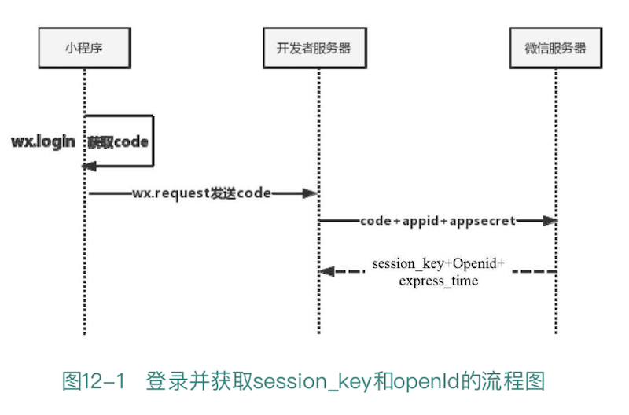
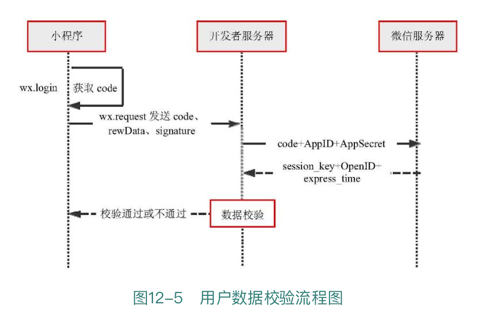
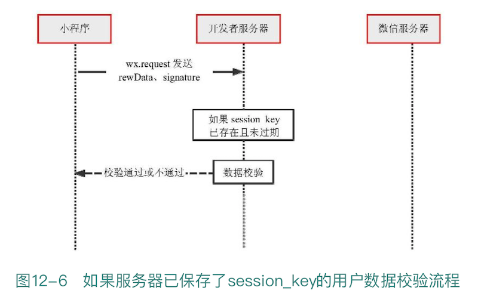
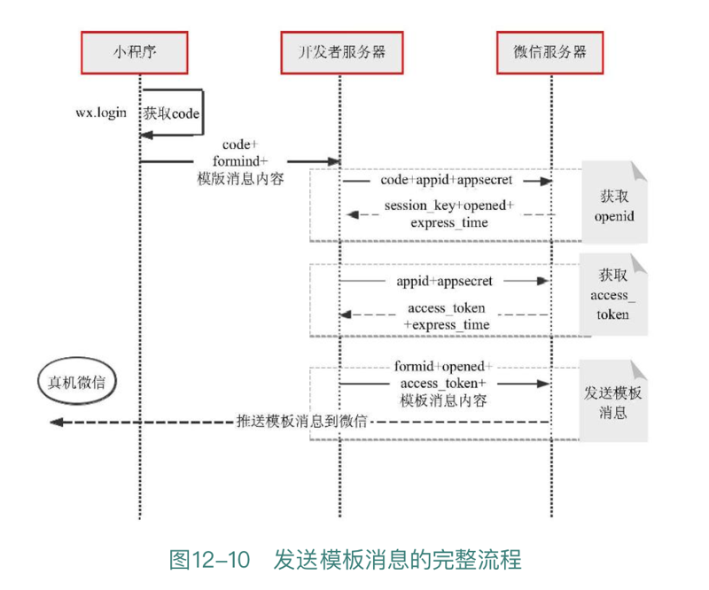
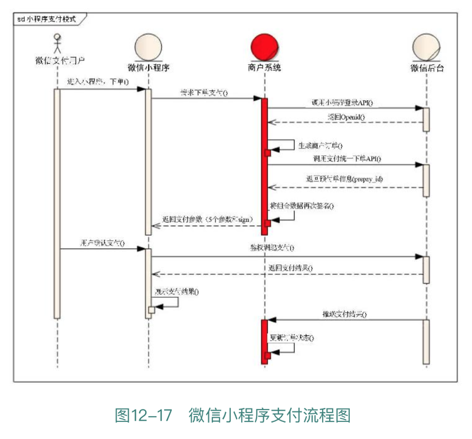
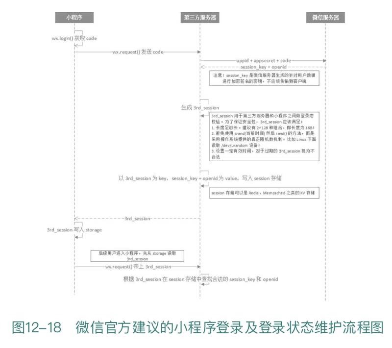

# 12 开放接口

本章我们将学习微信开放接口。毫不夸张地说，微信的开放接口是微信类产品最有价值的一部分。没有微信开放接口，小程序的价值将大打折扣。即使你不是一个微信开发者或者你的小程序无须使用微信开放接口，但理解微信开放接口的设计原理对提升架构方面的知识也很有好处。

关于开放接口这块儿，微信官方文档写得并不够详尽，本章将详细地介绍用户登录、用户信息校验、解析用户加密数据获取 openId、模板消息以及最重要的微信支付。

## 12.1 准备工作

调用微信小程序的开放接口要求开发者必须拥有小程序账号。拥有小程序账号的开发者拥有一个 appld，如果你的 Orange Can 现在没有 appld，请将 appld 加入 Orange Can 项目中。目前小程序开发工具没有提供加入 appld 的快捷方式，所以请开发者新建一个带有 appld 的项目并将目录指向 Orange Can 的文件目录。

本章内容需要使用小程序的 appSecret，小程序的 appld 和 appSecret 均可以在小程序账户的「设置」→「开发设置」→「开发者 ID」中获得。

本章要实现的功能还需要调用服务器接口。本书中的服务器代码均采用 PHP 编写，并部署在本地的 Apache 服务器中。本章会给出所有 PHP 示例代码，你也可以下载我们提供的 PHP 示例代码，并部署在本地或网络服务器上。以下 url 地址是用户登录接口的示例地址：

http://localhost:8080/wxopen/wxlogin.php

注意，如果在项目中填写了 appld 且服务器在本地，那么调用本地 http 接口时一定要勾选「项目」中的「开发环境不校验请求域名以及 TLS 版本」，否则无法访问服务器。

为了简化代码，本章的代码（小程序和 PHP 中的代码）都没有做过多异常处理，只能作为演示功能的示例代码。Orange Can 并不是真实的项目，请各位开发者以理解功能原理为主要目的。如果要开发自己的真实项目，请考虑各种调用失败的情况并加强安全性。

注意，本章的代码依然用于 setting 页面，每个功能都将作为 setting 页面的一个子项，本章 setting 相关的子项配置已经在 11.1 的代码清单 11-5 中添加完毕。同时，本章大多数代码的运行结果与之前的章节不同，之前的章节我们都会使用 UI 效果展示运行结果，而本章大部分示例代码都将以 console.log 的方式输出到控制台中，请开发者自行在「Console」面板中査看代码的运行结果。

## 12.2 用户登录

用户登录是小程序中获取用户加密信息、使用模板消息、客服消息、微信支付等接口的先决条件。只有用户在小程序中登录了，我们才能获取用户在当前小程序中的 openId 以及本次登录会话的 session\_key。openId 是使用一系列微信小程序开放接口的必要参数。关于 openId 的相关内容我们在 11.2 节中已经具体讲解过，这里就不再赘述。

首先，我们要了解什么是微信小程序登录，有什么作用？微信小程序登录是为了让开发者的服务器获取用户的 openId 以及 session\_key 的令牌。请不要将微信小程序的用户登录理解为传统意义上的登录。虽然从大的方向上讲，登录都是为了确认用户的身份、拿到用户的唯一身份标识，但是微信小程序的登录流程和传统的账号密码流程不太一样。当你进入小程序后，不需要输入任何账号密码，开发者服务器就可以获取你的 openId 标识。微信小程序的登录流程远比传统的账号密码登录要复杂。

微信小程序提供了 wx.login(OBJECT) 方法用于用户登录。wx.login 方法的主要目的是拿到用户的 openId 和用户本次登录的 session\_key。openId 是用户对于当前小程序的身份标识，类似于我们自己产品里的用户 id 号，只不过在微信里有自己的用户账户体系，你可以使用这个 openId 作为用户的身份标识。当然，也可以建立一套自己的用户标识，不过当你需要调用微信开放接口（比如支付、发送模板消息）时，还是必须知道用户的 openId。session\_key 是本次用户登录的会话密钥，通常用来对用户的通信数据进行加解密。

到目前为止，如果对于 openId 和 session\_key 的概念还很模糊，不知道这两者的用处，没有关系，在后面的小节中我们将陆续讲解和使用这两个参数。在本小节中，首先要在开发者服务器拿到 openId 和 session\_key。微信开放 API 中有很多概念不是那么好理解，必须用实例代码进行演示讲解。

图 12-1 所示为获取 openId 和 session\_key 的流程图。这张图非常重要，可能你现在还看不明白在阅读本小节后面的内容时可时时回顾一下。



要获取 session\_key 和 openId，首先需要在小程序中调用 wx.login，并获取 code；随后将 code 发送到开发者服务器，并同 appid 和 appsecret 一起发送到微信服务器，微信服务器会返回我们需要的 session\_key 和 openId。

下面编写具体的代码，实现上述流程并最终拿到 session\_key 和 openid。

首先，在 /pages/setting/open-api 下新建 login 目录及 login 页面的 4 个文件用来演示用户登录的代码和效果。在 app.jon 文件的 pages 数组下新增 login 页面。接着，在 login.wxml 中增加一个 button 按钮。

```
<!--pages/setting/open-api/login/login.wxml-->
<button class="btn" type="primary" loading="{{loading}}" disabled="{{disabled}}" bindtap="onTap">
  用户登录
</button>
```

1『上面是微信自动生成的按钮代码。』

在 button 按钮上注册了ー个事件 onTap，后面将在 onTap 函数中调用 wx.login(OBJECT) 方法。在 setting.js 文件中添加 login 事件响应函数，点击 setting 页面的「用户登录」选项后，将跳转到 login 页面。

```
  login: function () {
    wx.navigateTo({
      url: '/pages/setting/open-api/login/login'
    });
  },
```

做完以上准备工作后，点击 setting 页面的「用户登录」子项，将跳转到如图 12-2 所示的页面。

下面编写 login 页面的按钮响应时间 onTap。在 login.js 中添加 onTap 事件响应函数。

```
  onTap: function () {
    wx.login({
      success: function (res) {
        console.log('code:'+res.code);
        wx.request({
          url: "http://192.168.64.2/2020084wxserver/wxLogin.php",
          data: {
            code: res.code
          },
          success: function (res) {
            console.log(res.data);
          }
        })
      }
    })
  },
```

1『

书里的代码，控制台显示返回的：

code:001Yx0ra27sjFJ0u9hpa2I30ra2Yx0rC

然后找了下官方文档：[wx.login(Object object) | 微信开放文档](https://developers.weixin.qq.com/miniprogram/dev/api/open-api/login/wx.login.html)，根据文档改进的代码如下。经验证也能返回 code。

```
  onTap: function () {
    wx.login({
      success (res) {
        if (res.code) {
          console.log('code:'+res.code)
          //发起网络请求
          wx.request({
            url: 'http://192.168.64.2/2020084wxserver/wxLogin.php',
            data: {
              code: res.code
            }
          })
        } else {
          console.log('登录失败！' + res.errMsg)
        }
      }
    })
  },
```

』

用户在 login 页面点击「用户登录」后，将执行 onTap 函数。我们在 onTap 函数中调用了 wx.login 方法，这个方法没有参数，只有回调函数。success 回调函数是当微信服务器成功返回结果时调用的函数。

先来看 success 回调函数返回参数的参数说明：1）errMsg，错误消息。2）code，开发者需要将 code，发送到开发者服务器后台，使用 code 换取 session\_key。3）api，将 code 换成 openId 和 session\_key。重点是返回值 code。code 是一把钥匙，是得到 openId 和 session\_key 的关键。code 有效期只有 5 分钟，如果在 5 分钟之内还没有用 code 换取 openId 和 session-key，那么就不能再使用了。

可不可以直接在小程序内部用 code 去微信服务器换取 openId 和 session\_key 呢？理论上是可以的，但这完全没有意义。无论出于安全性还是实用性，都应该将 code 发送到开发者服务器由开发者服务器获取 openId 和 session\_key。

所以，我们在 wx.login 的 success 回调函数中再次发起了一个 wx.request 请求，将 code 发送到了本地服务器中。在编写服务器 PHP 代码前，首先来学习如何使用 code 调用微信服务器获取 openId 和 session\_key。微信提供了一个 https 接口用于 code 换取 openId 以及 session\_key。接口地址如下：[auth.code2Session | 微信开放文档](https://developers.weixin.qq.com/miniprogram/dev/api-backend/open-api/login/auth.code2Session.html)。

需要以下 4 个参数才能正确调用该接口：1）appid，小程序唯一标识。2）secret，小程序的 app secret。3）js_code，登录时获取的 code。4）grant_type 填写为 authorization_code。

appid 和 secret 均来自于微信小程序账号，是 2 个固定的字符串；js_code 是我们在小程序客户端调用 wx.login 时返回的 code；grant_typel 固定为 authorization_code 即可。

下面编写服务端代码。先给出服务器 PHP 代码的目录示意图，如图 12-3 所示。

首先，编写一个 PHP 的类 WXLogin，位于 wxLoginClass.php 中，wxLoginClass.php 文件位于根目录的 class 目录下。WXLogin 主要负责用 code 换取 openId 和 session-key。

```
<?php

class WXLogin{
    private $loginUrl;
    private $wxAppID;
    private $wxAppSecret;

    function WXLogin(){
        $config = include('./config.php');
        $this->loginUrl = $config['LOGINURL'];
        $this->wxAppID = $config['WXAPPID'];
        $this->wxAppSecret = $config['WXAPPSECRET'];
    }

    public function login($code){
        $loginUrl = sprintf($this->loginUrl, $this->wxAppID, $this->wxAppSecret,$code);
        $ch = curl_init();
        $timeout = 10;
        try{
            curl_setopt ($ch, CURLOPT_URL, $loginUrl);
            curl_setopt ($ch, CURLOPT_RETURNTRANSFER, 1);
            curl_setopt ($ch, CURLOPT_CONNECTTIMEOUT, $timeout);

             // 设置为false仅用于测试，生产环境请设置为true
            curl_setopt($ch, CURLOPT_SSL_VERIFYPEER, false);
            $res = curl_exec($ch);
            curl_close($ch);
            $resArray = json_decode($res,true);
            return $resArray;
        }
        catch (Excetption $e){
            return $e;
        }
    }
}
?>
```

以上代码需要 PHP 开启 curl 支持。在代码中，我们 include 了一个 config.php 的配置文件，config.php 文件位于根目录下，该配置文件主要用于存放小程序的 appid 以及 appsecret。

请开发者自行将 appiah 和 appsecret 替换为自己的 appid 和 secret。看到 config.php 中的代码后，开发者可能就会明白为什么不能在小程序客户端中换取 openId 和 session\_key。因为调用换取接口需要敏感数据 appid 和 appsecret，特别是 secret，一定不可以放在客户端中。

有了 config.php 和 wxLoginClass.php，就可以编写 wxlogin.php 接口文件了，该文件位于根目录下：

```
<?php
        #  用户登陆示例代码
        #  用户登陆主要是去微信服务器获取到session\_key和用户的openid

include_once('./class/wxLoginClass.php');

$code = $_GET['code'];
$login = new WXLogin();
echo json_encode($login->login($code));
?>
```

接口代码很简单，接收小程序客户端传来的 code 值，并通过 WXLogin 类调用微信服务器，最终拿到 openId 和 session\_key。

要特别注意，以上代码为了演示效果，所以将拿到的 openId 以及 session\_key 返回到了客户端。但在真实的项目中，将 session\_key 和 openId 返回客户端是极其危险的，也完全没有必要。因为需要使用 session\_key 和 openld 的场景都会被放置在服务器进行，所以将这两个参数返回小程序中没有任何意义，反而会增加数据泄露的风险。

以上完成了用户登录的全部服务器端代码。运行客户端小程序，点击 login 页面的「用户登录」按钮后，console 的显示结果如图 12-4 所示结果。

1『

发现无法获取 openId 和 session\_key。可能是 PHP 没开启 curl 支持，查找了方法：[PHP 开启 cURL 功能 - CSDN博客](https://blog.csdn.net/u010596115/article/details/53173427)。在 XAMPP 里，/Users/Daglas/.bitnami/stackman/machines/xampp/volumes/root/etc/php.ini，即挂起的 lampp 盘的根目录下的 etc 文件夹里，搜 php_curl.dll 把其前面的分号 ; 去掉，然后重启服务器 Apache。验证是够开始后直接写一个 php 文件，打印语句「phpinfo();」看看结果即可。

发现还是解决不了问题，然后尝试用作者书里的 wx.login() 代码，运行成功，说明自己参看官方文档修改的代码有问题，具体什么问题待确认。

』

注意，除了 openId 和 session\_key，服务器还返回了ー个 expires_in 参数。这个参数的数值官方并没有在文档中提到，笔者猜测这个数值是 session\_key 的失效时间戳，单位推测为秒，换算为天是 30 天。由于失效期太长，目前没有验证过，所以以上结论仅是推测（在开发工具目前的最新版本中，这个过期时间已被更改为 7200，单位未知，推测单位是秒，也就是 2 小时）。

session\_key 肯定是有失效期的。要注意的是，在 session\_key 的有效期内，开发者最好不要重复调用 wx.login 接口、不断用 code 换取 session\_key，而应该将 session\_key 保存在服务器中。等到 session\_key 失效后，再重新获取新的 session\_key。

那么如何知道 session\_key 是否已经过期呢？小程序提供了ー个 wx.checkSession(OBJECT) 用来校验 session\_key 是否过期。只有在 session\_key 确实过期后，才会再次调用 wx.login。当然，Orange Can 是一个示例项目，并不会在服务器记录 session\_key，所以每次操作都会重新调用 wx.login 接口换取新的 session\_key。wx.checkSession 的使用非常简单，下面直接给出示例代码。

```
  wx.checkSession({
    success:function(){
      // 未过期
    },
    fail:function(){
      // 过期
      wx.login()
    }
  }),

```

这里还要注意，wx.login 得到的 code 只能使用一次，一旦你使用 code 换取了 openId 和 session\_key，这个 code 就会马上失效，不能再次使用。当然，如果 5 分钟内这个 code 还没有被使用，那么也会失效。虽然我们拿到了 openId 和 session\_key，但并没有使用。拿到 openId 和 session\_key 是用户登录要做的事情，其作用会在后续章节中逐步介绍。

## 12.3 用户信息校验

在 12.2 节中，我们学习了如何调用 wx.login 获取当前用户的 openId 以及本次登录的 session\_key，本小节将介绍 session\_key 的使用。在 11.2 节中，我们调用 wx.getUserInfo 接口拿到了用户的明文基本信息数据和用户加密数据，并使用了明文数据。下面回顾一下 wx.getUserInfo 返回的数据：1）userInfo，用户基本信息对象，不包含 openId 等敏感信息。2）rawData，不包含敏感信息的基本信息字符串，通常用来计算签名，防止从微信返回的用户信息被簒改。3）signature，使用 sha1(rawData+ sessionkey) 得到字符串，用于校验用户信息。4）encryptedData，包括敏感数据在内的完整用户信息的加密数据。5）iv，加密算法的初始向量。

在之前的 11.2 节中，我们使用了 userInfo 对象，包括 userInfo 和 rawData 在内的明文数据都可能存在被簒改的风险。如何知道明文数据是否被簒改了呢？

这个时候 rawData 和 singature 就可以发挥作用了。rawData 和 singature 用于校验用户数据到底有没有被簒改过（没有绝对安全的网络，数据极有可能被抓包或者通过其他方式改）。通常来说，想要实现这个校验必须在服务器编码才能进行。这需要小程序将获取的 rawData 和 signature 一并提交到服务器，由服务器完成校验工作。

校验的基本原理是：rawData 是用户原始明文数据，signature 是使用 sha1(rawData+sessionkey) 得到的字符串。理论上讲，如果数据没有被簒改，那么 signature 等于 sha1(rawData+sessionkey) ；如果 rawData 或者 signature 被修改了，那么 signature 必然不再等于 sha1(rawData+sessionkey)。

是否存在 signature 和 rawData 同时被修改的情况呢？理论上是不可能的，因为 session\_key 并不在网络上传输，簒改者不知道这个变量，被簒改且校验通过的概率很小。

有可能从 signature 中推算出 session\_key 吗？理论上讲，这是不可能的。因为 sha1 算法是不可逆的，无法在已知 rawData 和 signature 的情况下推算出 session\_key。不知道 session\_key 就无法通过同时修改 rawData 和 signature 达到「欺骗校验的目的」。如果知道了 session\_key，只需要修改 rawData 并重新用 session\_key 计算一下新的 sha1(rawData+sessionkey) 就又可以让新的 rawData 等于新的 sha1(rawData+sessionkey) 了。这样，开发者就无法知道 rawData 是被修改过的。

这也是为什么官方文档一再强调，不要在网络上传输 session\_key，而应该将其保存在服务器上使用，以降低 session\_key 被泄露的风险。

session\_key 有点类似于我们在数据库中保存用户密码时所使用的「盐」（salt）。在数据库保存用户密码时，并不是直接将用户的密码以明文的方式存放在数据库表中，通常都会使用 SHA-1 或者 MD5 算法将用户密码和 salt 随机字符串拼接在一起，重新计算一下再存入数据库中。被重新使用 SHA-1 或 MD5 算法计算的用户密码谁都不知道是什么，开发者也只能比对每次登录时输入的密码和数据库保存的密码是否一致，判断是否为合法用户，却无法知道密码到底是什么。

用户数据校验的流程图如图 12-5 所示。



需要说明的是，在 12.2 节中，我们明确说明服务器是没有保存 session\_key 的。因为我们需要拿到 session\_key 才能进行用户数据校验，所以在上述流程图再一次重复了用户的登录流程。在真实的流程中，用户登录在 session\_key 的有效时间内只应该执行一次，session\_key 也应当被保存在服务器中。其实小程序只需要使用 wx.request 将 rawData 和 signature 发送到服务器即可，服务器无须使用 code 换取 session\_key，直接做 SHA-1 签名比对即可。如图 12-6 所示为服务器已保存 session\_key 的用户数据校验流程。



对比图 12-5 和图 12-6，很明显可以看出，服务器保存 session\_key 后整个流程变得更加简单，完全不需要再与微信服务器交互。服务器管理 session\_key 的过程非常复杂，为了降低代码的复杂度，我们没有在服务器中保存 session\_key。我们后续的所有开放 API 调用流程都将重复完整的流程，因为单独完整的流程更加有利于开发者理解每个开放 API。

下面实现校验用户数据的功能。当用户点击 setting 页面的「校验用户信息」选项时，页面将跳转到一个子页面；当用户在子页面中点击 button 按钮时，将调用服务器接口并验证用户信息。

新建一个 check 子页面。在 app.json 的 bages 数组下新增 check 页面的路径。

接着，在 setting.js 文件中编写点击子项的事件响应函数，将页面导航至 check 子页面。

```
  check: function () {
    wx.navigateTo({
      url: '/pages/setting/open-api/check/check'
    });
  },
```

在 check.wxml 中添加一个 button。

```
<!--pages/setting/open-api/check/check.wxml-->
<button class="btn" type="primary" loading="{{loading}}" disabled="{{disabled}}" bindtap="onTap">
  校验用户信息
</button>
```

下面是点击 button 后所执行的 onTap 事件响应函数。在 check.js 中新增 onTap 函数：

```
// 校验签名，防止篡改
  onTap: function () {
    wx.login({
      success: function (loginRes) {
        wx.getUserInfo({
          success: function (userRes) {
            console.log(JSON.parse(userRes.rawData))
            wx.request({
              url: "http://192.168.64.2/2020084wxserver/wxCheckUserInfo.php",
              data: {
                code: loginRes.code,
                signature:userRes.signature,
                rawData:userRes.rawData
              },
              success: function (res) {
                console.log(res.data);
              }
            })
          }
        })
      }
    })
  },
```

请将上述代码与图 12-5 结合在一起看。首先，登录并拿到 code 码，然后调用 wx.getUserInfo 接口到 rawData 和 signature，再使用 wx.request，将这 3 个参数发送到服务器中，服务器会进行数据校验工作并返回校验结果。下面是服务器  wxCheckUserInfo.php 的编码。

```
<?php
        #  用户信息校验

include_once('./class/wxLoginClass.php');

$code = $_GET['code'];
$signature = $_GET['signature'];
$rawData = $_GET['rawData'];

$login = new WXLogin();
$sessionRes = $login->login($code);

$valid = checkUserInfo($signature, $rawData, $sessionRes['session_key']);
echo $valid;

function checkUserInfo($signatureOri, $rawData, $session_key){
    $signatureSha1 = sha1($rawData.$session_key);
    if($signatureOri==$signatureSha1){
        return "校验通过";
    }
    else{
        return "校验不通过";
    }
}
?>    
```

在以上代码中，首先使用 code 调用微信服务器换取 session\_key，随后使用 session\_key 和 signature 校验用户发送过来的 rawData，最后返回校验结果。其中，login 已经在 12.2 节用户登录时编写完成，这里只需要复用这个类即可。图 12-7 所示是最终返回到小程序中的校验结果。

我们可以简单测试校验不通过的情况，请在代码清单 12-12 中将 rawData 稍微修改一下，比如在调用 wx.request 时在 rawData 后面拼接一个字符串。在发送到服务器的 rawData 字符串后面附加了ー个字符串 LOL。再次运行代码将呈现如图 12-8 所示的输出结果。

建议开发者在客户端使用用户明文数据时使用 rawData，而不要使用 userInfo。因为数据验证的是 rawData 有没有被簒改，而不是验证 userInfo 是否被簒改。至于微信能否确保 userInfo 和 rawData 的一致性，这个不得而知。建议开发者使用 rawData 作为用户的基本信息。

## 12.4 解析用户加密数据获取 openId 及 UnionId

在 12.3 节中我们完成了用户明文数据的校验工作，本节将学习解密用户的非明文用户信息。

调用 wx.getUserInfo 后将返回 encryptedData 和 iv 两个数据。encryptedData 是包括敏感数据在内的完整用户信息的加密数据，iv 用于解密这个数据。整个解密用户数据的过程同 12.3 节中用户信息校验的流程基本相同。不同的是，我们提交到服务器的数据是 encryptedData 和 iv，而不是 signature 和 rawData。

首先，在 appjson 中注册 decrypted 子页面。在 setting.js 页面中添加 decrypted 函数，用于跳转到 decrypted 子页面。

```
  decrypted: function () {
    wx.navigateTo({
      url: '/pages/setting/open-api/decrypted/decrypted'
    });
  },
```

在 decrypted.wxml 中添加一个 button。

```
<!--pages/setting/open-api/decrypted/decrypted.wxml-->
<button class="btn" type="primary" loading="{{loading}}" disabled="{{disabled}}" bindtap="onTap">
  获取用户加密数据
</button>
```

下面编写用户数据解密的核心代码，在 decrypted.js 文件中编写 onTap 事件响应函数。

```
  // 获取用户加密信息
  onTap: function () {
    wx.login({
      success: function (loginRes) {
        wx.getUserInfo({
          success: function (userRes) {
            wx.request({
              url: "http://192.168.64.2/2020084wxserver/wxdecryptuserinfo.php",
              data: {
                code: loginRes.code,
                encryptedData: userRes.encryptedData,
                iv: userRes.iv
              },
              success: function (res) {
                console.log(res.data);
              }
            })
          }
        })
      }
    })
  },
```

以上代码将 code（用于获取 session\_key）、encryptedData 和 iv 三个参数发送到了 wxdecryptuserinfo.php 中。

服务器如何解密 encryptedData 数据呢？解密时需要 session\_key、iv、小程序的 Appld 三个变量参与。session\_key 由 code 可以换取到，iv 由小程序客户端提交，Appld 本身就是一个固定的已知变量。具体的解密算法较为复杂，但微信官方提供了包括 C++、Nodejs、PHP 和 Python 四种语言的解密 SDK，我们只需要使用官方提供的 SDK 即可，无须自己编写解密算法。目前，官方没有提供 JAVA 和 C# 版本的 SDK，开发者可自行翻译。4 种语言解密 SDK 的下载地址为。

每种语言的接口名称都是一致的，请选择适合自己的语言。服务器的解密工作主要使用官方提供的 SDK 进行解密。

我们选择 PHP 版本的 SDK。PHP 版本的 SDK 主要包含以下 4 个文件：wxBizDataCrypt.php、pkcs7Encoder、errorCode、demo.php。

3『[服务端获取开放数据 | 微信开放文档](https://developers.weixin.qq.com/miniprogram/dev/framework/open-ability/signature.html)』

wxBizDataCrypt.php 是 SDK 的接口类，在内部调用了 pkcs7Encoder，pkcs7Encoder 提供基于 PKCS7 算法的加解密接口；errorcode.php 是错误码说明；demo.php 是使用解密 SDK 的示例，我们无须关心解密的细节。（当然，如果有兴趣，开发者也可以看看源码研究学习下）

下面我们编写 wxDecryptUserInfo.php，该页面向小程序提供接口实现用户数据的解密，wxDecryptUserInfo.php 内部主要调用微信提供的 SDK 进行数据解密。首先，将微信提供的 3 个用于解密的 PHP 文件放在如图 12-9 所示的位置。

在 wxDecryptUserInfo.php 中编写以下代码：

```
<?php
        #  解密用户非明文数据

include_once('./class/wxBizDataCrypt.php');
include_once('./class/wxLoginClass.php');
$config = include_once('config.php');

$code = $_GET['code'];
$encryptedData = $_GET['encryptedData'];
$iv = $_GET['iv'];
$wxAppID = $config['WXAPPID'];

$login = new WXLogin();
$sessionRes = $login->login($code);

$pc = new WXBizDataCrypt($wxAppID, $sessionRes['session_key']);
$errCode = $pc->decryptData($encryptedData, $iv, $data );

if ($errCode == 0) {
    echo $data;
} else {
    print $errCode;
}
?>
```

数据解密的代码同样首先使用 code 换取 session\_key，接着实例化微信提供的 WXBizDataCrypt，实例化 WXBizDataCrypt 需要 appid、session\_key 这两个参数，然后调用 WXBizDataCrypt 实例的 decryptData 方法实现数据的解密。最后判断 errCode 的取值，如果 errCode 为 0，就认为解密成功，将 data 返回小程序中。

以下是小程序最终得到的返回结果的数据示例结构。微信在数据的末尾添加了一个 watermark 水印字段，此字段可以用来校验应用数据的有效性。1）appld，敏感数据归属 appld，开发者可校验此参数与自身 appld 是否一致。2）timestamp，敏感数据获取的时间戳，开发者可以用于数据时效性校验。

1『无法获得解密信息，去官网下了最新的 SDK，不过只有 wxBizDataCrypt.php、errorCode、demo.php 三个文件，替换掉即可抓取到解密信息。』

## 12.5 模板消息

不同于前几节的示例代码，本节内容的示例代码需要以下 4 个条件才能成功运行：1）在真机上运行小程序（开发工具中拿不到 formeId）2）开发者服务器位于外网。3）外网地址已经加入小程序账号的可信域名列表中。4）服务器接口需要提供 https 支持（因为在真机上只能调用 https 接口）。

笔者一直认为，小程序应该充分借助微信的优势提升开发者的开发效率、降低开发成本并提升用户体验，比如可以借助微信消息体系向用户推送各类通知。信息触达率高是微信的一项优势，借助微信的信息触达渠道远比自建信息渠道要好得多。微信订阅号可以一天群发一条消息，微信服务号一个月可以群发 4 条消息。和微信订阅号、服务号不同，小程序不可以主动向用户群发消息。这几乎切断了小程序的媒体属性，不利于开发者推广小程序。

笔者分析限制微信小程序群发能力的原因有以下 4 点：1）在微信上的产品一向是极为克制的，从不盲目添加功能，凡是对用户体验有影响的功能般都不会轻易开放。毕竟群发消息会对用户造成一定打扰。2）在本书开始部分分析过，小程序主打的是用完即走的服务，在微信看来不应该具有媒体属性。3）一定程度上是为了保护服务号，不让小程序对现有的产品体系造成太大冲击。4）小程序现在处于萌芽状态，不能在微信上贸然开放太多功能。要知道泼出去的水是收不回来的，即使收回来也要付出较大代价。从策略上来看，先不给你，以后看情况再给你远比先给了你，再收回要高明很多。毕竟小程序的生态没有太多案例可以借鉴，一切都要「摸着石头过河」。

虽然小程序不可以主动向用户群发消息，但是微信提供了一个模板消息。需要注意的是，模板消息具有以下 4 个特点：1）用户接收的模板消息位于微信消息的服务通知中，多个模板消息会被折叠进服务通知里。2）模板消息是被动的，只有用户本人在小程序中有一定交互行为后，服务器才能够向用户推送模板消息。3）模板消息有两种跳转功能，一种是可以进入发送模板的小程序里，这是模板消息的默认跳转，前提条件是必须是线上已发布的小程序；另一种是可以指定一个模板消息的跳转页面，跳转到小程序的内部，这种跳转在体验版或开发版中都可以成功跳转。4）要成功发送模板消息，必须要有一个 formld 的 id 号，但经过测试发现开发工具中无法获取 formld，也就是说在开发工具中不能产生模板消息。只有在真机中才能拿到 formld，而 formld 是发送模板消息的关键。这也是为什么章节开头时提出一定要在真机中运行本示例。

上面我们提到了模板消息是被动的，只有用户本人在小程序中有一定交互行为后，服务器才能够向用户推送模板消息。下面来解释一下用户的什么行为オ能让服务器可以向小程序推送一条模板消息。1）用户在小程序内完成过支付行为，7 天内可允许开发者向用户推送有限条数的模板消息（一次支付可下发一条，多次支付可发条数独立，互相不影响）。2）当用户在小程序内发生过提交表单行为且该表单声明为要发模板消息时，7 天内可允许开发者向用户推送有限条数的模板消息（一次提交表单可发一条，多次提交可发条数独立，相互不影响）。

在本示例中，以用户提交表单的行为编写模板消息示例代码。在编写代码前，首先要对模板消息发送的全部流程有一个清晰的认识。图 12-10 所示为用户提交表单类模板消息的完整流程。要注意的是，微信支付的模板消息与用户提交表单的模板消息流程不太一样，请不要混淆。



以上流程是建立在已经在小程序中拿到了 formld 且 formld 没有被使用的前提下。请开发者先大致浏览以上流程图，在后面具体编码时再回过头来对比这张流程图。发送模板消息需要知道用户的 openId（不知道 openId 就不知道到底发送给哪个用户）。这里要强调下，获取 openId 的流程不是必须的。如果用户已经在小程序中登录，服务器也保存了 openId 和 session\_key，就没有必要再使用 code 换取 openId。

此之外，发送模板消息的流程还需要一个 access\_ token。access\_token 在微信服务号或者订阅号里经常被作为令牌使用，这里也被移植到了小程序中。access_ token 也是有失效期的，开发者应该在真实的项目中像管理 session\_key 一样管理 access\_token。获取 access\_token 同样需要携带微信小程序的 openId 和 appsecret 调用微信服务器。

流程图中没有标示出 formId 的获取过程，那么 formId 是怎么来的呢？

当用户提交表单时，表单提交函数的 event 事件对象中将包含一个 formId，这个 formId 只能使用一次，有效期为 7 天，一旦使用 formId 推送了一条模板消息，这个 formId 就不可以再次使用。如果还想推送模板消息，就只能等用户再一次提交表单并产生新的 formId。

最后还有一个问题，模板的格式怎么定义？先来看示例代码最终推送的模板消息示意图，如图 12-11 所示。小程序提供了许多种类型的模板，每个模板都有一个模板编号。可以在小程序公众账号「模板消息」的「模板库」中选择模板和获取模板编号，如图 12-12 所示。示例代码中选择的是「购买成功通知」模板，这个模板的详情如图 12-13 所示。

我们需要关注模板中的两个关键点：模板 ID 和关键词。模板 ID 表示需要向开发者发送哪种类型的模板消息。关键词是这个模板消息可以发送的内容，比如购买成功通知模板包含购买地点、购买时间、物品名称和交易单号 4 个关键词。在后面的示例代码中我们将看到模板 ID 和关键词的使用方法。

如果在小程序提供的模板库中没有你想要的模板，那么可以向微信团队提出新模板申请。申请新模板有一些约束，请参考以下文档接口说明。该文档中有一个「审核说明」，详细描述了申请新模板的一些要求。

了解以上内容后，开始编写 Orange Can 项目中的模板消息示例代码。首先，在 app.json 的 pages 数组中注册 tpl-message 模板消息子页面。在 setting.js 页面中编写跳转到 tpl-message 模板消息子页面的函数 tplMessage。

```
  tplMessage: function () {
    wx.navigateTo({
      url: '/pages/setting/open-api/tpl-message/tpl-message'
    });
  },
```

在 tpl-message.wxml 中编写模板消息页面的骨架代码。

```
<!--pages/setting/open-api/tpl-message/tpl-message.wxml-->
<form bindsubmit="formSubmit" report-submit="true">
  <input name="place" type="text" placeholder="购买地点：" />
  <picker name="date" mode="date" value="{{date}}"
    start="2017-1-1" end="2020-12-31" 
    bindchange="bindDateChange">
        购买时间: {{date}}
  </picker>
  <input name="name" type="text" placeholder="物品名称:" />
  <input name="id" type="text" placeholder="交易单号：" />
  <button formType="submit">Submit</button>
</form>
```

```
/* pages/setting/open-api/tpl-message/tpl-message.wxss */
input {
  height: 100rpx;
  width: 100%;
  background-color: #f6f6f6;
  margin-bottom: 30rpx;
}

button {
  background-color: #4a6141;
}

picker {
  width: 100%;
  background-color: #f6f6f6;
  margin-bottom: 30rpx;
  padding: 19rpx 26rpx;
}

```

在继续编写模板消息核心业务逻辑代码前，先插入一节介绍模板消息页面中的 formId 表单。

## 12.6 form 表单及 picker 组件

在 12.5 节的模板消息页面中，使用 \<form> 标签构建了一个表单。form 表单有什么作用呢？

form 表单中有 3 个 input 和 1 个 picker 组件，假如想获取这 4 个组件的用户输入值，怎么办呢？一种笨办法是在每个组件的 binchang、bindconfirm 等事件中获取该组件的用户输入值，比如我们之前多次使用的 input 组件就是通过此类组件的特殊事件获得的。

假如页面的表单元素非常多，这样一个一个获取太过于烦琐。form 标签的作用就是让开发者可以一次性获取所有表单组件输入值。form 表单有以下 3 个重要属性：1）report-submit，Boolean 类型。是否返回 formId 用于发送模板消息。2）bindsubmit，EventHandle 类型。指定一个响应函数，当 form 表达内部类型为 submite 的 button 被点击时，将触发这个响应函数。3）bindreset，EventHandle 类型。指定一个响应函数，当 form 表达内部类型为 reset 的 button 被点击时，将触发这个响应函数。

当用户点击 form 表达内部类型为 submit 的 button 后，将执行 bindsubmit 属性所指定的响应函数。在响应函数的 event 事件对象中将可以获取 form 下所有表单元素的用户输入值。

注意，form 表单只会提交 6 种类型组件的用户输入值：\<switch/>、 \<input/>、 \<checkbox/>、  \<slider/>、\<radio/>、  \<picker/>。

同时，report-submit 属性也是一个非常重要的属性。如果此属性为 true，那么触发 bindsubmit 后，event 事件对象中将包含一个 formId，这就是要用于发送模板消息所需要的 formId。要注意的是，经过笔者测试，在开发工具中 formId 是一个 mock 字符串：the formId is mock one。这并非是一个可以使用的 formId。只有在真机上才能获取真实的 formId。

下面介绍 picker 组件。小程序的表单类元素有很多，但其用法和属性都比较简单，官方文档中的说明也比较清楚。建议开发者在用到某个表单组件时具体査阅。Picker 组件是从底部弹起的滚动选择器，现在支持 3 种选择器，通过 mode 属性来区分，分别是普通选择器、时间选择器和日期选择器，默认是普通选择器。下面来看 picker 组件的真机效果图如图 12-14 所示。

mode= selector 时，picker 为普通选择器。这是一种自定义类型的选择器，如果需要自定义选择内容，请使用这种类型的选择器。这种类型的选择器有以下 5 种属性：1）range，数组类型。mode 为 selector 时，range 属性才有效。2）range-key，String 类型。当 range 是一个 Object Array 时，通过 range-key 指定 Object 中 key 的值作为选择器的显示内容。3）value Number，类型，默认值为 0。value 的值表示选择了 range 中的第几个（下标从 0 开始）。4）bindchange，EventHandle 类型。value 改变时触发 change 事件。5）disabled，Boolean 类型，默认值为 fale。表示是否禁用。

Mode 为 time 时，picker 为时间选择器。这种模式的 picker 用于选择时间，具有以下 5 个属性：1）value，String 类型。表示选中的时间，格式为「hh:mm」。2）start，String 类型。表示有效时间范围的开始，字符串格式为「hh:mm」。3）end，String 类型。表示有效时间范围的结束，字符串格式为「hh: mm」。4）bindchange，EventHandle 类型。value 改变时触发 change 事件。5）disabled，Boolean 类型，默认值为 false。表示是否禁用。

当 mode 为 date 时，这种模式的 picker 用于选择日期，具有以下 6 个属性：1）value，String 类型，默认值是 0。表示选中的日期，格式为「YYYY-MM-DD」。2）start，String 类型。表示有效日期范围的开始，字符串格式为「YYYY-MM-DD」。3）end，String 类型。表示有效日期范围的结束，字符串格式为「YYYY-MM-DD」。4）fields，String 类型。默认值是 day，有效值为 year、month、day，表示选择器的粒度。5）bindchange，EventHandle 类型。当 value 改变时触发 change 事件。6）disabled，Boolean 类型。默认值是 false。表示是否禁用。

以上有 3 种类型的属性文档都讲述的非常明白，我们只对几个存在误区理解的属性做一些解释。首先是 value 属性，picker 的 value 和 input 的 value 不同。picker 的 value 不是显示在组件上的文本，而是定义 picker 默认的选择顼目，比如将 value 设置为「2017-11-18」，那么打开 picker 时默认将停留在 2017-11-18 这个选项上。其次是 stat 和 end 属性，start 和 end 属性只有当 mode 为 time 和 mode 为 date 时才有。这两个属性并不是指定 pickers 组件的最大选择范围，而是指定可选范围。举个例子，将 start 设置为 2017-1-1, end 设置为 2020-12-31, 还是可以看到超出这个时间范围的年月日，但却无法选择这些超出范围的日期。

## 12.7 发送模板消息

下面继续编写模板消息功能。在之前的章节中，我们编写了 tpl-message 页面的骨架和样式，现在这个页面如图 12-15 所示（购买时间选项将在编写 tpl-message.js 文件后出现）。

在模板消息页面，我们需要采集一些用户的输入值，这些输入值将被提交到服务器中用于发送模板消息，购买地点、购买时间、物品名称和交易订单号刚好对应「购买成功通知」消息模板的 4 个关键词。接着编写 formSubmit 函数，点击页面的 Submit 按钮后将执行此函数。注意，这个事件响应函数名称由 form 标签的 bindsubmit 属性定义，开发者可回顾一下 tpl-message.wxml 中的代码。在 tpl-message.js 文件中编写以下代码：

```
  /**
   * 页面的初始数据
   */
  data: {
    date: "2017-11-18"
  },

  // tpl-meaasge 的业务逻辑
  bindDateChange: function (event) {
    this.setData({
      date: event.detail.value
    })
  },
  formSubmit: function (event) {
    console.log(event);
    wx.login({
      success: function (loginRes) {
        wx.request({
          url: 'http://192.168.64.2/2020084wxserver/wxTPLMessage.php?code='
          + loginRes.code,
          data: {
            formId: event.detail.formId,
            formData: event.detail.value
          },
          method: 'POST',
          success: function (res) {
            console.log(res.data);
          }
        })
      }
    })
  },
```

首先，调用 wx.login 方法得到了 code。接着，使用 wx.request 方法调用服务器接口。注意，代码中的 wx.request 的 url 设置的是一个示例 url。前面我们讲过本节的示例必须在真机上运行才能获取 formId，真机运行必须调用 https 接口。除此之外，接口所在的域名必须加入小程序账号的可信域名列表中。同时要注意，我们将 code 附加在了这个 urI 的 query 参数中。

1『原来 ? 的意思是，后面的信息附加到 urI 的 query 参数中。』

这里我们使用的是 POST 请求，而不是 GET 请求。POST 的数据在 wx.request 的 data 中。data 包含两个属性，即 formId 和 formData。formDatae 的取值来自于 event.detail.value，包含用户输入的购买地点、购买时间、物品名称和交易单号 4 个值。以上是小程序中的全部代码，接着我们需要编写服务器的 PHP 代码。

首先，在 config.php 中增加两个配置项，一个是 TOKENURL，用于获取 access_token 的地址，另一个是 TPLMSGURL，是微信服务器发送模板消息的 URL。

```
<?php
return array(
    'WXAPPID' => 'XX',
    'WXAPPSECRET' => 'XX',
    'LOGINURL' =>  "https://api.weixin.qq.com/sns/jscode2session?".
                    "appid=%s&secret=%s&js_code=%s&grant_type=authorization_code",
    'TOKENURL' => "https://api.weixin.qq.com/cgi-bin/token?".
                    "grant_type=client_credential&appid=%s&secret=%s",
    'TPLMSGURL' => "https://api.weixin.qq.com/cgi-bin/message/wxopen/template/send?".
                    "access_token=%s"
);
?>
```

获取 access\_token 是一个 HTTP GET 请求，需要附带小程序的 appid 以及 appsecret；发送模板消息是一个 HTTP POST 请求，需要 access\_token (access\_token 将附加在接口 url 的 query  参数中）以及模板消息的一系列参数（位于 POST 的 body 中）。注意将 WXAPPID 和 WXAPPSECRET 换成自己小程序的 appid 和 appsecret。

接着新增一个 http.php 文件，位于根目录的 class 文件夹下 http.php 文件包含两个方法，即 curl_post 和 curl_get 用于发送 http 请求。

```
 <?php

   function curl_post($url,array $params = array()){
            $data_string = json_encode($params);
            $ch = curl_init();
            curl_setopt($ch,CURLOPT_URL,$url);
            curl_setopt($ch, CURLOPT_HEADER, 0);
            curl_setopt($ch, CURLOPT_RETURNTRANSFER, 1);
            curl_setopt ($ch, CURLOPT_CONNECTTIMEOUT, 10);
            curl_setopt($ch, CURLOPT_POST, 1);
            
            // 设置为false仅用于测试，生产环境请设置为true
            curl_setopt($ch, CURLOPT_SSL_VERIFYPEER, false);
            curl_setopt($ch, CURLOPT_POSTFIELDS, $data_string);
            curl_setopt($ch, CURLOPT_HTTPHEADER, 
                array(
                'Content-Type: application/json'
                )
            );
            $data = curl_exec($ch);
            curl_close($ch);
            return($data);    
  }

   function curl_get($url){
            $ch = curl_init(); 
            curl_setopt ($ch, CURLOPT_URL, $url);            
            curl_setopt ($ch, CURLOPT_RETURNTRANSFER, 1);     
            curl_setopt($ch, CURLOPT_SSL_VERIFYPEER, false);       
            curl_setopt ($ch, CURLOPT_CONNECTTIMEOUT, 10);             
            $file_contents = curl_exec($ch);             
            curl_close($ch);
            return $file_contents;      
    }
?>
```

最后，编写 wxTPLMessage.php 文件的代码，wxTPLMessage.php 位于根目录下。

```
<?php
        #  模板消息示例代码


include_once('./class/http.php');
include_once('./class/wxLoginClass.php');
$config = include_once('config.php');

//接收参数
$data = file_get_contents("php://input"); 
$data = json_decode($data,true);
$code = $_GET['code'];

//获取openid
$login = new WXLogin();
$loginRes = $login->login($code);
$openId = $loginRes['openid'];

//获取access_token
$tokenUrl = $config['TOKENURL'];
$tokenUrl = sprintf($tokenUrl, $config["WXAPPID"], $config["WXAPPSECRET"]);
$access_token = curl_get($tokenUrl);
$access_token = json_decode($access_token,true);

//发送模板消息
$tplMSG = array(
    'touser' => $openId,
    'form_id' => $data['formId'],
    'page' => 'pages/setting/setting',
    // 填入开发者选择的TemplateID
    'template_id' =>'your template_id',
    'data' => array(
        'keyword1'=>array(
            "value" => $data['formData']['place'],
            "color" => '#333'
        ),
           'keyword2'=>array(
            "value" => $data['formData']['date'],
            "color" => '#333'
        ),
           'keyword3'=>array(
            "value" => $data['formData']['name'],
            "color" => '#333'
        ),
           'keyword4'=>array(
            "value" => $data['formData']['id'],
            "color" => '#333'
        )
    ),
    "emphasis_keyword" => "keyword3.DATA" 
);  

$tplMSGUrl = sprintf($config['TPLMSGURL'],$access_token['access_token']);
$msgResult = curl_post($tplMSGUrl, $tplMSG);
echo($msgResult);
?>
```

wxTPLMessage.php 是处理小程序提交模板消息内容的核心代码。首先，代码从 URL 的 query 参数和 http body 中分别获得 code 和模板消息内容。请开发者在岡读代码时再回顾一下图 12-10 的流程图。拿到 code 后还是先调用 login，不同于前几节，此次 login 是为了获取用户的 openId。接着，使用小程序的 openId 和 secret 去微信服务器换取 access\_token。最后，将 openId、access\_token 及客户端发送来的模板消息内容提交到微信服务器，如果数据正常，那么微信会向指定 openId 的微信用户发送一条消息。

我们重点看一下 \$tplMSG 关联数组下的元素。1）Touser，指定模板接收者的 openId。2）template_id，模板消息的 id 号，这个编号可以直接从小程序公众号账号中获取。3）page，page 指定了用户在收到模板消息后点击模板消息将跳转的小程序页面。4）data，模板消息的内容，我们选择的模板拥有 4 个关键词，每个关键词中包含 value 和 color 两个属性，分别指定该关键词的内容以及关键词的显示颜色。5）emphasis\_keyword，只能指定一个关键词，这个关键词将被「强调」。被强调的关键词将在模板消息中居中、放大、加重。

真机上接收的模板消息效果图如图 12-16 所示。模板消息是实现产品完整闭环逻辑的重要环节，请开发者对这个功能给予足够重视。

1『2020 年 01 月 10 日起，新发布的小程序将不能使用模板消息，请开发者迁移至订阅消息功能。』

## 12.8 微信支付

微信支付是开放接口中最为重要的接口。小程序的微信支付基本同微信 JSAPI 中的微信支付相同。如果你有 JSAPI 中开发微信支付的经验，小程序的支付相当简单。本小节我们来实现小程序中的微信支付。首先来看做信小程序的支付流程图（见图 12-17），该图来自于官方 API 文档。



支付流程看似比较复杂，但微信提供了ー个 SDK，使用 SDK 基本上不需要编写太多支付相关的代码。事实上，在真实项目中，支付相关的代码复杂的不是支付本身，而是我们自己的业务逻辑。下面来看完成一次支付的流程。这个流程是微信支付的最简流程。流程中不包括开发者自己的业务逻辑。

1）首先，小程序客户端调用开发者自己的服务器，将一系列订单信息发送到服务器，比如商品的 id 等信息。2）开发者服务器接收被购买商品的信息后，调用微信服务器的统一下单 APl，生成一个预付单，并将预付单信息返回开发者服务器。统一下单 APl 需要用户的 openId。如果你已经在服务器中保存了 openId（之前几节我们已经反复给出了获取。openId 的示例代码），就不再需要获取用户的 openId 了；如果你没有当前支付用户的 openId，那么需要在第一步中携带 code，以方便在这一步中使用 code 换取用户的 openId。本小节示例中，我们假设服务器没有用户的 openId。3）开发者服务器需要对预付单的信息签名，并将预付单信息和签名一起返回小程序客户端。

4）小程序客户端在收到预付单信息及签名后，再调用 wx.requestPayment，将预付单信息和签名一起提交到微信服务器。5）微信服务器会验证这些预付单信息，如果验证通过，那么小程序将拉起支付界面（在开发工具中，这一步首先会弹出一个二维码，开发者扫描这个二维码将在开发者的微信中拉起支付界面）。6）支付完成后，微信会主动调用开发者服务器将支付结果推送到开发者服务器中，开发者可根据支付结果处理自己的业务逻辑。这一步需要开发者有自己的外网服务器，否则微信无法推送通知。

以上 6 个步骤中，第二步是关键。下面我们实现这 6 个步骤，在 Orange Can 项目中完成一次小程序的支付。

首先，在 Orange Can 项目中新增一个页面 wx-pay。在 app.json 的 pages 数组下新增该页面的路径。接着，在 setting.js 中编写跳转到 wx-pay 支付页面的跳转函数。

```
  wxPay: function () {
    wx.navigateTo({
      url: '/pages/setting/open-api/wx-pay/wx-pay'
    });
  },
```

在 wx-pay.wxml 中增加一个按钮用来触发微信支付。

以上准备工作做好后，就可以编写客户端支付的相关代码了。在 wx-pay.js 中新增 ont ap 事件响应函数，用户点击【微信支付）按钮后，将触发 onTap 函数。

```
  // 微信支付的业务逻辑
  onTap: function () {
    wx.login({
      success: function (res) {
        console.log('code:' + res.code);
        wx.request({
          url: "http://192.168.64.2/2020084wxserver/wxPay.php",
          data: {
            code: res.code
          },
          success: function (res) {
            var preData = res.data;
            console.log(preData);
            wx.requestPayment({
              timeStamp: preData.timeStamp.toString(),
              nonceStr: preData.nonceStr,
              package: preData.package,
              signType: preData.signType,
              paySign: preData.paySign,
              success: function(res){
                console.log(res);
              },
              fail: function(error) {
                 console.log(res);
              }
            })
          }
        })
      }
    })
  },
```

回顾一下我们之前总结的 6 个步骤，在正式拉起支付界面前，需要向自己的服务器请求预支付订单信息。只有获取预支付订单信息，才能在小程序中拉起支付界面。由于预支付订单的生成必须知道用户的 openId，因此再一次调用了 wx.login 获取 code，将 code 发送到自己的服务器中。由于本项目不是真实项目，因此在这一步中没有提交任何商品信息，开发者在开发真实项目时可以将自己商品的信息同 code 一起发送到服务器中。

要特别注意的是，服务器的接口地址 urI 一定不要使用 localhost，而应该使用 127.0.0.1。具体原因是服务器中的微信 SDK 在获取客户端 IP 时可能会将 localhost 获取成 "::1" 这样的字符串（可能是开启了 IPv6 支持引起的），这个字符串是微信 SDK 不允许的。当然，在真实的运行环境中不存在这个问题。建议开发者在调试时使用 127.0.0.1。

代码的 wx.request 的 success 中将接收服务器返回的预支付订单信息。获取预支付订单信息后，调用 wx.requestPayment(OBJECT) 即可拉起微信支付界面。在继续编写调用 wx.requestPayment(OBJECT) 前，我们先来编写服务器代码，没有服务器代码是无法返回预支付订单信息的。

小程序支付的服务器部分基本上不需要编写任何代码，微信已经提供了一整套 SDK 供我们调用。

微信支付服务的 SDK 提供了 Java、C# 和 PHP 三个版本。SDK 包下载地址为：

3『整个支付逻辑应该变了，做这个模块的时候再好好研究。[【微信支付】微信小程序支付开发者文档](https://pay.weixin.qq.com/wiki/doc/api/wxa/wxa_api.php?chapter=7_10&index=1#)』

下载并解压 sdk 包。我们需要使用 SDK 包根目录下 Iib 文件夹里的 5 个文件：Wxpay.Api.php、Wxpay.Config.php、Wxpay.Data.php、Wxpay.Exception.php、Wxpay.Notify.php。其中，Wxpay.Api.php 是 SDK 接口，Wxpay.Config.php 是配置文件，Wxpay.Data.php 定义了一组微信支付中需要用到的基本对象，最后两个文件分别是错误异常类及接收回调通知的处理类。


在服务器代码的根目录下新增一个 wxpay 文件夹，将这 5 个文件拷贝到 wxpay 目录下。开发者必须将自己的一些小程序账号信息配置到 Wxpay.Config.php 中。1）APPID 小程序 appid。

MCHD 商户号 id

KEY 商户的支付密钥。

APPSECRET 小程序的 appsecret。

MCHD 和 KEY 在开发者商户账户的开通邮件中可以查看。APPDZ 和 APPSECRET 在小程序公众账中可以获得。

配置完 Wxpay. Config.php 后，新建 wxpay. Php 文件作为接口文件供 Drange Can 顼目调用。wxpay, php 主要作用是调用微信的統一下单接口，得到预支付订单信息，最后将数据加上签名再返回小程序中。由于只是示例代码，因此代码中没有添加容错处理，开发者请以理解微信支付下单流程为主。开发自己的项目时请合理处理异常并加强安全性。

下面编写 Nxpay.php 中的代码。

代码中的注释很清晰地指示了每段代码的作用。模拟订单信息这一段中，我们虚拟了一件商品的订单信息。这个订单信息包括以下 5 个参数

out trade_no 商品订单编号。

trade_type 在小程序中这是一个固定值，必须传入 JSAP。

total_fee 订单总金额，单位为分。

body 商品的简单描述。

notify_ur』支付完成后，微信服务器将支付结果回调通知这个 urI。

以上代码中，仅仅定义了几个必须的订单参数，微信支付的订单信息远远不止这 5 个参数。总共有十几个，其中过半参数都是必填选项，其余为选填选项，开发者应该根据自己的业务逻辑填写更详细的订单信息。本示例中定义的这几个订单数据仅保证支付能够执行成功，实际上还有更多商品描述和支付控制选项。具体请参考下面的官方文档地址 https://pay.weixin.qq.com/wikidoc/ai/wa/wxa_apiphp?chapter=9_1

订单信息的必填选项高达 10 个，为什么我们只指定这 5 个参数？因为小程序的 SDK 中会将一些其他必填选顼自动加载，如小程序的 appid、商户号等配置项已经在 Nxpay. Config.php 中配置过

这里还要对 notify__urh 做一个说明，其实这个选项也应该在 Wxpay. Config.php 中配置。但经笔者测试，官方的 SDK 中 Wxpay. Contig, php 并没有这个配置项，所以我们选择在外部定义 notify_url。如果开发者在这里既不定义 notify_ur，又不在 Wxpay. Config-php 中配置 notify_url，那么代码运行会报错。

为了方便测试，我们的服务器尽量部署在本地，所以无法接收微信的回调通知，notify_urls 随便填写了一个地址。开发者在真实的项目开发中要将 notify_urI 配置成能够从外网访问到的地址以便接收微信支付结果的通知知。

使用 code 换取用户 openlde 的意图非常明显，就是从微信服务器拿到用户的 openid。

接着，构建预支付订单所需要的信息。Wxpayunifedorder 是微信支付 SDK 中定义的一个类，我

门将使用准备好的订单信息数据及 openid 林构建一个 Wxpayunifiedorder》对象。

构建完 Wxpayunifhedorder 对象后，调用 Wxpayapi 的 unifed Order 方法并将 Wxpayunifedorder。对象作为参数传递进去。unifed Order 方法的内部将调用微信统一下单 AP，并返回结果。返回结果包括 appid、mch_id（商户号）、nonce_str（随机字符串）sign（签名）、result code（业务结果）、trade_type（交易类型）、prepay_id（预支付交易会话表示）等。其中，prepay_id 尤其重要，小程序客户端就是依靠这个变量成功拉起微信支

也可以不使用微信 SDK, 自行调用微信統一下单 API https://api.mchweixinq.com/pay/unifedorder

拿到 prepay_idj 预支付订单信息后不能直接将这些信息返回客户端。虽然这些信息已经完全包含了小程序成功调起支付界面的全部信息，但是这些信息还需要被签名。如果想将这些信息返回客户端，在客户端签名，是不可以的，因为签名需要商户号的密钥，将商户号密钥传输到客户端是非常不安全的行为。

首先，我们来看小程序拉起微信支付界面需要调用什么方法、传入哪些数据。只有知道客户端需要什么方法和参数，才能有选择的为数据签名。小程序在客户端中需要调用 WX. Requestpayment 方法才能够拉起微信支付，以下是这个方法所需要的参数

Timestamp String 类型，时间戳是从 1970 年 1 月 1 日 00:00:00 至今的秒数，即当前时间

noncestr String 类型，随机字符串，长度为 32 个字符以下

package String 类型，统一下单接口返回的 prepay_id 参数值，提交格式如：prepay_id=

sign Type String 类型，签名算法，暂时只支持 MD5

paysign String 类型，签名。

以上参数说明来自于官方说明文档。很多开发者看到这里都会下意识地认为从服务器将以上参数返回回来签名就可以了，事实上 paysign 签名是在服务器里完成后才返回的。如果签名在客户端完成，签名就没有什么意义了。我们无须关心签名的具体算法，在服务器的微信 SDK 中已经集成了签名计算的方法，开发者只需直接调用即可。当然，如果想了解签名的具体算法，可以到 https://pay.weixin.gq.com/wiki/doc/api/jsapi.php?chapter=4_3tf

这里要特別强调，以上 5 个参数是小程序调用 Wx, requestpayment 拉起微信支付的必要参数，但不是生成 paysign 签名的全部参数，这一点尤其重要。生成 paysign 签名需要以下 5 个参数

appl 小程序 appl

timestamp 时间戳。

noncestr 随机字符串。

package 统一下单接口返回的 prepay_id。signtype 签名算法，暂时只支持 MD5。

很明显，调用 Wx. Requestpayment - 不需要 appl，但签名中需要加入 appl（如果被签名的数据和显示传递的数据一样，签名就没有意义了

我们来整理下思路。现在服务器已经拿到了 prepay_id，服务器需要生成一个 timestamp 时间、一个 nonce！随机字符串，再结合 appl、prepay_id 和 signtype，使用这 5 个参数一起生成一个签名。随后将签名和 timestamp、noncestr、prepay_id、signtype - 起返回客户端。这个返回值就是客户端调用 Wx, requestpayment 调起微信支付所需要的全部数据

官方文档对以上流程描述的并不清楚，所以我们多花了一些笔墨讲解这个流程。代码清单 12-33 中的 prepare Signdatal 图数实现了上述签名和打包数据的功能。

在 preparesigndata 函数中，实例化了ー个 Wxpayjsapipay 对象，这个对象是微信 SDK 中专门用来返回签名及签名数据的类。随后读取了 appl，生成了 timestamp 时间戳、noncestrp 随机数，设置了签名方式和 prepay_id。然后调用 Wxpayjsapipay 的 Make Sign 方法生成了一个包括 appl、timestamp、nocestr、签名方式和 prepay_id 的签名。最后将这个签名连同以上被签名的值返回小程序中。

这里要特别注意 3 个地方。第一个地方是 package 一定不能直接等于 prepay_id，必须将其设置

为 prepay_id='. $ ordernol' prepay_id"】，否则小程序调用 Ww: equestpaymente 时会报错；第二个地方是记得最后将 appl 从返回的明文数据数组中删除，小程序不需要 apld 就可以拉起微信支付；第三个地方是极有可能遇到一个错误提示「cur 出错，错误码：60」。解决这个问题的方法是修改一下 Nxpay.Api, php 中的代码。找到 Wxpay Api.php 文件的第 537 行

以上代码修改完成后，服务器将返回客户端小程序调用 Wx, requestpayment，所需要的全部参数。最后，我们来修改一下 Orange Can 项目中的 Wx- pay. S' 代码。给出 Wx- pay. JSI 的完整代码如下

我们在 WX. Requestl 的 success 回调函数中接收服务返回的数据，并调用 wx. Requestpayment。正常情況下，点击【微信支付）』按钮后，小程序将弹出一个二维码（在开发工具中），开发者扫描维码后将在手机微信中拉起微信支付界面。

在微信支付界面完成支付行为并支付成功后，微信将收到一条支付成功的消息。

## 12.9 真实的微信小程序登录状态维护

在本章之前所有示例中，我们反复调用 wx.login 获取 code，并将 code 发送到开发者服务器换取 openId 和 session\_key。正如在前几个章节中反复强调的，在 session\_key 的有效时间内（未过期），开发者应该自行维护 session\_key 而不是重复获取。同时，openId 最好不要作为用户的 id 被传递到小程序客户端。开发者应当自己生成令牌作为自己业务的用户 id，而不应当使用微信的 openId。

我们来看一下微信官方建议的登录以及登录状态维护指导流程，如图 12-18 所示。



第一步还是应当让用户在客户端登录，并向开发者服务器发送登录请求，同时携带 code 码。开发者服务器在收到 code 码后，协同 appid、appsecret 以及 code 码向微信服务器换取当前用户的 session\_key 和 openId。

获取到 session\_key 和 openId 后不要将这两个变量发送回客户端。此时应自己生成一个令牌（随机字符串，也就是图中描述的 3rd\_session）作为用户 session\_key 和 openId 的键，将令牌（键）和 session\_key、openId（值）保存到服务器的 Redis 或者 Memcache 中。

同时，这个自己生成的令牌应当具有一定时效性，时效性一定要小于 30 天。开发者可根据自己小程序的安全性要求自行调整这个令牌的有效期。对于微信中的令牌字符串的要求有一些建议，请查看图 12-18 中 3rd\_session 的说明。

开发者应当将自己生成的令牌发送到小程序并存入小程序的缓存中，每次请求服务器时都携带这个令牌，服务器接收令牌后在 Redis 中查找用户真实的 openId 和 session\_key。

以上流程只是一个指导性的流程，在真实的顼目中还有很多変化和细节，但在总体思路上应当遵守上述流程。