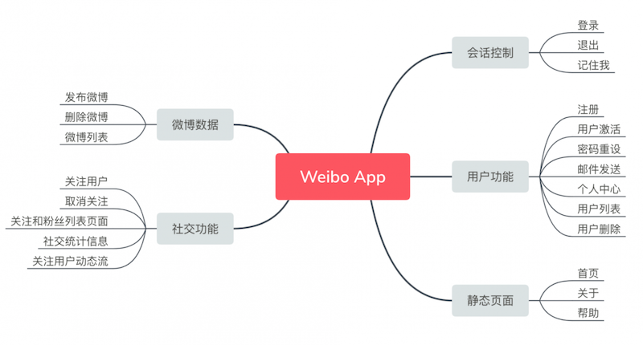
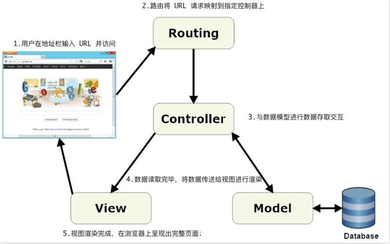
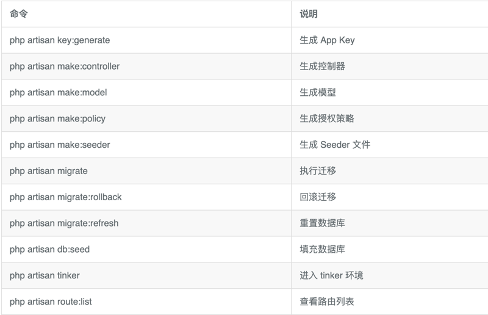

# 03 构建页面

## 3.1. 章节说明

从本章节开始，我们将使用 Laravel 开发一个类似新浪微博的网站。整个网站功能包括：1）用户的注册登录。2）用户个人信息的更改。3）使用管理员权限删除用户。4）发布微博。5）关注用户。6）查看关注用户的微博动态。

下面是一张简单的功能思维导图：



接下来我们将从最简单的静态页面构建开始，踏出使用 Laravel 开发真实应用的第一步。

## 3.2. 创建应用

### 1. 做好准备

由于我们接下来的开发都会在 Homestead 上进行，因此，在开始本章教程之前，请保证你的 Homestead 虚拟机已成功开启并登录。使用下面命令来启动和登录 Homestead：

```
> cd ~/Homestead && vagrant up
> vagrant ssh
```

在虚拟机中进入 Code 文件夹：

    $ cd ~/Code

### 2. 创建 weibo 应用

下面让我们来使用 Composer 创建一个名为 weibo 的应用，后面我们将基于这个应用做更多的功能完善：

```
$ cd ~/Code
$ composer create-project laravel/laravel weibo --prefer-dist "6.*"
```

注：你的界面无需跟我一致（包括软件和提示语），不出现错误即可。

### 3. 修改 hosts

每个 Laravel 项目创建完成后的第一步，即是对 Homestead 进行配置，让应用能在 Homestead 的开发环境上跑起来。

为了方便记忆，一般我们都会将 IP 映射为域名，我们能够通过设置 hosts 文件来指定 IP 与域名之间的映射关系，由于我们在 Homestead 上默认使用 192.168.10.10 来作为虚拟机的 IP 的地址，因此我们需要在系统的 hosts 文件中将域名指向该 IP 上。

Mac 下打开 Hosts 文件：

    > subl /etc/hosts

Windows 下打开 Hosts 文件：

    > subl C:/Windows/System32/Drivers/etc/hosts

Windows 下，如果你没有集成 subl 命令的话， 请使用编辑器直接打开文件，文件路径在 C:\Windows\System32\Drivers\etc\hosts 。

文件成功打开后，在 hosts 文件最后面新增下面一行以完成设置：

    192.168.10.10   weibo.test

### 4. 新增站点

运行下面命令打开 Homestead.yaml 文件：

    > subl ~/Homestead/Homestead.yaml

在 Homestead.yaml 文件中新增 weibo 应用的 sites 和 databases 的相关设置：

```
---
ip: "192.168.10.10"
memory: 2048
cpus: 1
provider: virtualbox

authorize: ~/.ssh/id_rsa.pub

keys:
    - ~/.ssh/id_rsa

folders:
    - map: ~/Code
      to: /home/vagrant/Code

sites:
    - map: homestead.test
      to: /home/vagrant/Code/Laravel/public
    - map: weibo.test # <--- 这里
      to: /home/vagrant/Code/weibo/public # <--- 这里

databases:
    - homestead
    - weibo # <--- 这里

variables:
    - key: APP_ENV
      value: local

# blackfire:
#     - id: foo
#       token: bar
#       client-id: foo
#       client-token: bar

# ports:
#     - send: 93000
#       to: 9300
#     - send: 7777
#       to: 777
#       protocol: udp
```

我们主要设置了 sites 和 databases 两项。 sites 会将域名 weibo.test 映射到虚拟机的 /home/vagrant/Code/weibo/public 文件夹上，而 databases 则为新创建的项目指定数据库名。

### 5. 重启虚拟机

在我们每次对 Homestead.yaml 文件进行了更改之后，都需要运行下面命令来使其更改生效：

    > cd ~/Homestead && vagrant provision && vagrant reload

&& 符号是 Bash 语法，起到拼接命令的作用，此处将三个命令连续执行；

vagrant provision 是命令 Vagrant 重新加载 Homestead.yaml 配置；

vagrant reload 是重启虚拟机使更改生效。

### 6. .env 文件

接下来，我们还需要对应用根目录下的 .env 文件进行设置，为应用指定数据库名称 weibo。

.env

```
.
.
.
DB_DATABASE=weibo
DB_USERNAME=homestead
DB_PASSWORD=secret
.
.
.
```

在 .env 文件中，除了 DB_DATABASE 之外还有其它的设置信息，接下来让我们对里面的几项配置信息进行简单讲解。

一般来说，在进行实际应用的开发过程中，应用会拥有不同的运行环境，通常会有以下环境：1）本地开发环境。2）测试环境。3）生产环境。

在不同环境中，我们可能会使用不同的数据库或邮件发送驱动等配置，这时候则需要通过 .env 文件来针对不同的运行环境作不同的设置。比如上面我们所编辑的 .env 文件配置将应用在本地的开发环境（local）上。

.env 支持对应用的进行简单配置，比如你可以通过 APP_ENV 来设定当前应用的运行环境，使用 APP_DEBUG 来设定是否在应用报错时显示调试信息，使用 APP_KEY 来生成应用的密钥用于加密一些较为敏感的数据。APP_NAME 和 APP_URL 分别是应用名称和访问 URL 。

```
APP_NAME=Weibo
APP_ENV=local
APP_KEY=base64:dIAK2B7exLbY2S54RFQdI3c6vg9/qIWWjYy5M4ESa4A=
APP_DEBUG=true
APP_URL=http://weibo.test
```

接下来对数据库的连接方式、数据库名、用户名密码等做相关配置：

```
DB_CONNECTION=mysql
DB_HOST=127.0.0.1
DB_PORT=3306
DB_DATABASE=weibo
DB_USERNAME=homestead
DB_PASSWORD=secret
```

缓存、会话、队列等驱动的相关配置信息：

```
BROADCAST_DRIVER=log
CACHE_DRIVER=file
QUEUE_CONNECTION=sync
SESSION_DRIVER=file
SESSION_LIFETIME=120
```

Redis 相关的配置信息，默认为 Redis 的通用配置：

```
REDIS_HOST=127.0.0.1
REDIS_PASSWORD=null
REDIS_PORT=6379
```

邮件相关的配置信息：

```
MAIL_DRIVER=smtp
MAIL_HOST=mailtrap.io
MAIL_PORT=2525
MAIL_USERNAME=null
MAIL_PASSWORD=null
MAIL_ENCRYPTION=null
```

在完成对 .env 文件的设置后，我们便可以通过传参给 getenv 方法来获取到 .env 文件中指定的值，如调用 getenv('APP_ENV') 将返回 local。

### 7. 访问应用

现在让我们在 Chrome 浏览器中打开 http://weibo.test 你应该能看到有如下界面显示：

file

### 8. Git 代码版本控制

为了在接下来更好的追踪项目代码的更改，我们还需要将新建的 Laravel 项目纳入到 Git 版本管理中：

```
$ cd ~/Code/weibo
$ git init
$ git add -A
$ git commit -m "Initial commit"
```

我们前面已讨论过关于使用 GitHub 的种种好处，而现在是我们开始正式应用它的时候了。熟悉一个东西最快的方法就是不断训练，不断重复，因此本教程接下来项目构建的代码都将统一托管到 GitHub 上，以便让你对 GitHub 的使用更加熟悉。现在，我们需要在 GitHub 上新建一个名为 weibo 的项目点击创建新项目，并将代码推送上去：

注意请把下面的 <username> 替换为你的用户名。

```
$ git remote add origin git@github.com:<username>/weibo.git
$ git push -u origin master
```

### 9. 上线代码

为了降低项目接下来持续部署的出错率，我们最好在一开始就将项目部署到 Heroku 上。通过在前面教程的学习，我们知道在每个 Laravel 项目开始构建时，都需要对 Heroku 进行以 4 个步骤的配置才能正常使用。

1、创建一个 Heroku App：

    $ heroku create

2、配置 Procfile 文件：

```
$ echo web: vendor/bin/heroku-php-apache2 public/ > Procfile
$ git add -A
$ git commit -m "Procfile for Heroku"
$ git push
$ heroku buildpacks:set heroku/php
```

3、生成 App Key：

```
$ php artisan key:generate --show
base64:ta1aE+E8kuyDFlURbUrHEtL4HY71WtoffyNgUKldMWw=
```

将生成的 App Key （如以上 base64:ta1aE+E8kuyDFlURbUrHEtL4HY71WtoffyNgUKldMWw= ） 替换掉下面命令的 <your_app_key> 并运行命令：

```
$ heroku config:set APP_KEY=<your_app_key>
```

4、配置基本完成，将代码推送到 Heroku 上：

    $ git push heroku master

使用以下命令查看 Heroku 站点地址：

```
$ heroku domains
=== dry-bastion-64171 Heroku Domain
dry-bastion-64171.herokuapp.com
```

注意以上的 dry-bastion-64171 为变量，你的 Heroku 会生成与我不同的地址，这是正常情况。直接访问域名即可看到：

使用 Heroku 过程中如果出现问题，则可以使用下面命令来输出生产环境上的日志进行排错：

    $ heroku logs

### 10. 统一代码风格

为了保证我们的代码风格一致，以避免引起不必要的歧义，我们在『开发环境布置』课程中，已经安装了 EditorConfig 插件。现在我们还需要在 Laravel 应用的根目录下修改 .editorconfig 文件，并写入如下的配置信息：

.editorconfig

```
root = true

[*]
charset = utf-8
end_of_line = lf
insert_final_newline = true
indent_style = space
indent_size = 4
trim_trailing_whitespace = true

[*.md]
trim_trailing_whitespace = false

[*.yml]
indent_size = 2

[*.{js,html,blade.php,css,scss}]
indent_style = space
indent_size = 2
```

接着让我们将该文件加入到版本控制中。

```
$ git add -A
$ git commit -m "Add .editorconfig"
```

本文章首发在 LearnKu.com 网站上。

## 3.3. 静态页面

### 1. 说明

在进行完项目的基本配置之后，我们要开始正式进行项目开发了。本节将通过三个基本静态页面的构建，来让你了解 Laravel 最基本的页面构建流程。本书在接下来都会为每个章节新建一个 Git 分支，并在该分支上进行功能开发，开发完毕之后再将新建的分支合并到主分支上。

### 2. 新建分支

首先让我们使用 Git 来新建一个 static-pages 分支。

```
$ git checkout master
$ git checkout -b static-pages
```

上面的第一条命令 git checkout master 代表将当前分支切换到 master 分支上，master 分支是我们初始化 Git 时默认创建的主分支，其它分支都是基于主分支衍生出来的。第二条命令 git checkout -b static-pages 将会为你创建一个名为 static-pages 的新分支。-b 选项表示创建指定名称的新分支。

你可以将新建的 static-pages 理解为是对 master 分支的克隆，在上面做的所有修改都不会影响到 master 分支。本节后面会将 static-pages 分支合并到 master 分支上，合并成功之后，在 static-pages 分支上做的所有改动都会并入到 master 分支。另外，你也可以选择对一个分支进行删除操作，当一个分支被删除之后，在该分支之上的所有改动也都将被销毁，删除分支的操作不会影响到 master 分支。这便是 Git 工作流的强大之处。

合并分支示例：

    $ git merge fake-branch

删除分支示例：

    $ git branch -d fake-branch

### 3. 移除无用视图

Laravel 默认会为我们生成一个 welcome.blade.php 视图文件，主要用于对默认页面进行渲染，这个文件对我们接下来的项目开发没有一点用处，因此我们可将其移除：

    $ rm resources/views/welcome.blade.php

### 4. 配置路由

当用户在查看一个网页时，一个完整的访问过程如下：

1. 打开浏览器在地址栏输入 URL 并访问；

2. 路由将 URL 请求映射到指定控制器上；

3. 控制器收到请求，开始进行处理。如果视图需要动态数据进行渲染，则控制器会开始从模型中读取数据；

4. 数据读取完毕，将数据传送给视图进行渲染；

5. 视图渲染完成，在浏览器上呈现出完整页面；

如下图：



在 Laravel 开发中，我们使用路由来定义 URL 和 URL 的请求方式，再将该 URL 分配到相对应的控制器动作中进行处理。接下来要构建三个静态页面分别是主页、帮助页、关于页。因此我们需要为路由指定好三个不同的 URL：

routes/web.php

```
<?php

Route::get('/', 'StaticPagesController@home');
Route::get('/help', 'StaticPagesController@help');
Route::get('/about', 'StaticPagesController@about');
```

在上面代码的代码中，我们为 get 方法传递了两个参数，第一个参数指明了 URL，第二个参数指明了处理该 URL 的控制器动作。get 表明这个路由将会响应 GET 请求，并将请求映射到指定的控制器动作上。比方说，我们向 http://weibo.test/ 发出了一个请求，则该请求将会由 StaticPagesController 的 home 方法进行处理。我们将在下节创建 StaticPagesController，为你讲解控制器在收到请求后如何进行相关操作。

在 Laravel 中我们较为常用的几个基本的 HTTP 操作分别为 GET、POST、PATCH、DELETE。1）GET 常用于页面读取。2）POST 常用于数据提交。3）PATCH 常用于数据更新。4）DELETE 常用于数据删除。

在这四个动作中，PATCH 和 DELETE 是不被浏览器所支持的，但我们可以通过在提交表单中做一些手脚，让服务器以为这两个动作是从浏览器中发出的一样，后面我会具体讲解如何在表单中通过添加隐藏域的方式来欺骗服务器。这里你只需要有个大概的印象即可。

### 5. 生成静态页面控制器

要让静态页面在网站上进行展示，我们需要先创建一个 StaticPagesController 控制器，这个控制器将负责整个网站静态页面的处理。Laravel 的控制器命名规范统一使用「驼峰式大小写」和复数形式来命名，在这里我们也应该这么做。一般情况下，我们会使用下面命令来生成静态页面控制器：

    $ php artisan make:controller StaticPagesController

让我们来看下 StaticPagesController 文件生成的默认代码：

app/Http/Controllers/StaticPagesController.php

```
<?php

namespace App\Http\Controllers;

use Illuminate\Http\Request;

class StaticPagesController extends Controller
{
    //
}
```

namespace 代表的是命名空间，这是在 PHP 5.3 之后才加入的语言特性，如果你之前学习过 Java 或 C# 的话，那么你应该对命名空间不陌生。简单来说，开发者可以利用命名空间来区分归类不同的代码功能，避免引起变量名或函数名的冲突。你可以把命名空间理解为文件路径，把变量名理解为文件。当我们在不同路径分别存放了相同的文件时，系统就不会出现冲突。

我们用 use 来引用在 PHP 文件中要使用的类，引用之后便可以对其进行调用。最后我们看到，在静态页面控制器中还定义了一个 StaticPagesController 类，这个类继承了父类 App\Http\Controllers\Controller，这意味着你可以在 StaticPagesController 类中任意使用父类中除私密方法外的其它方法。现在的静态页面控制器中还没有指定好三个页面对应的动作，让我们来为控制器加上这三个动作来处理从路由发过来的请求：

app/Http/Controllers/StaticPagesController.php

```
<?php

namespace App\Http\Controllers;

use Illuminate\Http\Request;

class StaticPagesController extends Controller
{
    public function home()
    {
        return '主页';
    }

    public function help()
    {
        return '帮助页';
    }

    public function about()
    {
        return '关于页';
    }
}
```

在 StaticPagesController 类中，我们新定义了三个方法，这三个方法在接受到路由发过来的请求时，将会返回各自页面的名称，这三个方法名称与路由上的定义一一对应。现在：1）访问 http://weibo.test/ 你将看到有「主页」二字输出。2）访问 http://weibo.test/help 页面，则会看到「帮助页」。3）访问 http://weibo.test/about 页面，则会看到「关于页」。这三个方法返回的只是纯文本内容，算不上真正的视图，接下来我们再来添加并渲染真正的视图。

### 6. 添加静态页面视图

要在控制器中指定渲染某个视图，则需要使用到 view 方法，view 方法接收两个参数，第一个参数是视图的路径名称，第二个参数是与视图绑定的数据，第二个参数为可选参数。本章节讲的是静态页面的构建，因此并不需要利用到第二个参数，在后面的教程中我们会再讲解如何为视图绑定数据，并在视图中使用绑定的数据。view 方法在控制器的应用如下：

app/Http/Controllers/StaticPagesController.php

```
<?php

namespace App\Http\Controllers;

use Illuminate\Http\Request;

class StaticPagesController extends Controller
{
    public function home()
    {
        return view('static_pages/home');
    }

    public function help()
    {
        return view('static_pages/help');
    }

    public function about()
    {
        return view('static_pages/about');
    }
}
```

下面这行代码，将会渲染在 resources/views 文件夹下的 static_pages/home.blade.php 文件。默认情况下，所有的视图文件都存放在 resources/views 文件夹下。

    return view('static_pages/home');

在控制器中指定渲染的视图之后，接下来便是对视图进行构建了，我们需要在 resources/views 中新增下面三个视图。

resources/views/static_pages/home.blade.php

```
<!DOCTYPE html>
<html>
<head>
  <title>Weibo App</title>
</head>
<body>
  <h1>主页</h1>
</body>
</html>
```

resources/views/static_pages/help.blade.php

```
<!DOCTYPE html>
<html>
<head>
  <title>Weibo App</title>
</head>
<body>
  <h1>帮助页</h1>
</body>
</html>
```

resources/views/static_pages/about.blade.php

```
<!DOCTYPE html>
<html>
<head>
  <title>Weibo App</title>
</head>
<body>
  <h1>关于页</h1>
</body>
</html>
```

### 7. Blade 模板

细心的你可能会留意到这三个文件的后缀名均为 .blade.php，而不是 .php。这是因为 Blade 是 Laravel 中提供的一套模板引擎，在 Blade 视图中我们可以使用 Laravel 为这套引擎定义的一些默认方法，并完全兼容 PHP 语法的书写。在项目运行时，Laravel 会把所有的 Blade 视图进行编译缓存成普通的 PHP 代码，因此你不必担心 Blade 会对应用产生负担。

现在所有视图已经创建完毕，访问对应的 URL 地址便能看到视图被成功渲染。

### 8. 使用通用视图

你可能已经注意到了，前面我们创建的几个视图里面包含着一些重复的代码，这明显违反了 DRY（Don't repeat yourself）原则，导致代码变得不够灵活、简洁。因此我们需要对页面进行重构，把多余的代码从视图中抽离出来，单独创建一个默认视图来进行存放通用代码。

我们给应用创建了一个 default 视图，并将其放在 layouts 文件夹中，default 视图将作为整个应用的基础视图。实际上你只要保证视图文件被放置在 resources/views 目录下即可，Laravel 对视图的文件夹和文件命名并没有限制，我将 default 文件放在 layouts 文件下，只是为了让应用的目录结构让人更好理解。

resources/views/layouts/default.blade.php

```
<!DOCTYPE html>
<html>
  <head>
    <title>Weibo App</title>
  </head>
  <body>
    @yield('content')
  </body>
</html>
```

下面的这行代码表示该占位区域将用于显示 content 区块的内容，而 content 区块的内容将由继承自 default 视图的子视图定义。

    @yield('content')

Laravel 的 Blade 模板支持继承，这意味多个子视图可以共用父视图提供的视图模板。接下来让我们修改之前创建的首页视图文件，来学习下如何使用 Blade 模板的继承。

resources/views/static_pages/home.blade.php

```
@extends('layouts.default')
@section('content')
  <h1>主页</h1>
@stop
```

我们使用了 @extends 并通过传参来继承父视图 layouts/default.blade.php 的视图模板。

    @extends('layouts.default')

使用 @section 和 @stop 代码来填充父视图的 content 区块，所有包含在 @section 和 @stop 中的代码都将被插入到父视图的 content 区块。

```
@section('content')
  <h1>主页</h1>
@stop
```

在 Laravel 对 home.blade.php 文件进行编译后，结果如下：

```
<!DOCTYPE html>
<html>
  <head>
    <title>Weibo App</title>
  </head>
  <body>
    <h1>主页</h1>
  </body>
</html>
```

由此可见 Blade 模板继承有多方便。接下来让我们对其它两个视图也进行更改，统一使用父视图的代码。

resources/views/static_pages/help.blade.php

```
@extends('layouts.default')
@section('content')
  <h1>帮助页</h1>
@stop
```

resources/views/static_pages/about.blade.php

```
@extends('layouts.default')
@section('content')
  <h1>关于页</h1>
@stop
```

修改完成之后，再次在网页上访问这几个静态页面，你会发现父视图的代码已被成功嵌入到子视图中。

现在还有一点不足的地方，就是所有的网站标题名字都为 Weibo，这可太没个性了。因此我们接下来要做的就是针对页面标题进行优化，让不同页面显示不同的标题。

首先我们要修改默认视图文件，在代码显示标题的位置嵌入 @yield 区块：

resources/views/layouts/default.blade.php

```
<!DOCTYPE html>
<html>
  <head>
    <title>@yield('title', 'Weibo App')</title>
  </head>
  <body>
    @yield('content')
  </body>
</html>
```

我们给 @yield 传了两个参数，第一个参数是该区块的变量名称，第二个参数是默认值，表示当指定变量的值为空值时，使用 Weibo 来作为默认值。

    <title>@yield('title', 'Weibo App')</title>

下面让我们来为帮助页和关于页加上指定标题。

resources/views/static_pages/help.blade.php

```
@extends('layouts.default')
@section('title', '帮助')

@section('content')
  <h1>帮助页</h1>
@stop
```

resources/views/static_pages/about.blade.php

```
@extends('layouts.default')
@section('title', '关于')

@section('content')
  <h1>关于页</h1>
@stop
```

注意的是，当 @section 传递了第二个参数时，便不需要再通过 @stop 标识来告诉 Laravel 填充区块会在具体哪个位置结束。

我们也可以在 @yield 区块后面进行内容拼接。让我们标题拥有更加丰富的信息。

resources/views/layouts/default.blade.php

```
<!DOCTYPE html>
<html>
  <head>
    <title>@yield('title', 'Weibo App') - Laravel 新手入门教程</title>
  </head>
  <body>
    @yield('content')
  </body>
</html>
```

现在到浏览器重新刷新下页面，应该能看到标题后面成功拼接上我们定义的内容了。

### 9. Git 代码版本控制

接着让我们将本次更改纳入版本控制中：

```
$ git add -A
$ git commit -m "基础页面"
```

本文章首发在 LearnKu.com 网站上。

## 3.4. Artisan 命令

Artisan 是 Laravel 提供的 CLI（命令行接口），它提供了非常多实用的命令来帮助我们开发 Laravel 应用。前面我们已使用过 Artisan 命令来生成应用的 App Key 和控制器。在本教程中，我们会用到以下 Artisan 命令，你也可以使用 php artisan list 来查看所有可用的 Artisan 命令。



后面我们会再对上面每个 Artisan 命令进行具体应用，你也可以使用 help 来查看各个 Artisan 命令的帮助界面，如：

    $ php artisan help migrate

## 3.5. 小结

小结。本章主要为大家介绍了 Laravel 对静态页面的基本构建过程，但现在的静态页面还是有点简陋，我们将在下一章为应用加入一些样式，让应用看起来更加美观。

提交代码。将 Git 切换到 master 分支，并合并 static-pages 分支上的修改：

```
$ git checkout master
$ git merge static-pages
```

最后将代码推送到 GitHub 和 Heroku 上：

```
$ git push                     # 推送到 Github 上
$ git push heroku master       # 上线到 Heorku
```

查看我们的线上应用：

经过本章节的学习，我们学到了以下内容：

对新建的 Laravel 项目进行基本配置；

手动创建静态视图、控制器；

了解控制器与视图的基本协作流程；

了解如何使用通用视图；

了解 Artisan 命令的基本使用；