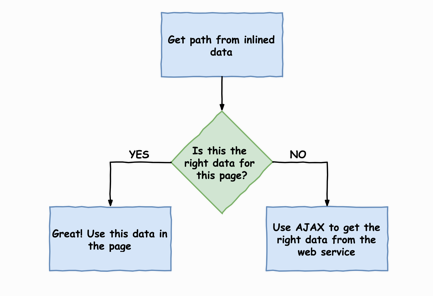

# 0701. Building a Multi-Page App with Vue Router

In the last chapter, we learned about Vue.js components and converted Vuebnb to a component-based architecture. Now that we've done this, we can easily add new pages to our app using Vue Router. In this chapter, we'll create a home page for Vuebnb, including a gallery of clickable thumbnails that showcase the full set of mock listings.

Topics covered in this chapter: 1) An explanation of what router libraries are and why they are a critical part of single-page applications. 2) An overview of Vue Router and its main features. 3) Installation and basic configuration of Vue Router. 4) Using the RouterLink and RouterView special components to manage page navigation. 5) Setting up AJAX with Vue to retrieve data from the web service without a page refresh. 7) Using route navigation guards to retrieve data before a new page is loaded.

## 7.1 Single-page applications

Most websites are broken up into pages in order to make the information they contain easier to consume. Traditionally this is done with a server/client model, where each page must be loaded from the server with a different URL. To navigate to a new page, the browser must send a request to the URL of that page. The server will send the data back and the browser can unload the existing page and load the new one. For the average internet connection, this process will likely take a few seconds, during which the user must wait for the new page to load.

By using a powerful frontend framework and an AJAX utility, a different model is possible: the browser can load an initial web page, but navigating to new pages will not require the browser to unload the page and load a new one. Instead, any data required for new pages can be loaded asynchronously with AJAX. From a user's perspective, such a website would appear to have pages just like any other, but from a technical perspective, this site really only has one page. Hence the name, Single-Page Application (SPA).

2『解释了 SPA 架构的概念，以及其利弊。做张术语卡片。』

The advantage of the Single-Page Application architecture is that it can create a more seamless experience for the user. Data for new pages must still be retrieved, and will therefore create some small disruption to the user's flow, but this disruption is minimized since the data retrieval can be done asynchronously and JavaScript can continue to run. Also, since SPA pages usually require less data due to the reuse of some page elements, page loading is quicker.

The disadvantage of the SPA architecture is that it makes the client app bulkier due to the added functionality, so gains from speeding up page changes may be negated by the fact that the user must download a large app on the first page load. Also, handling routes adds complexity to the app as multiple states must be managed, URLs must be handled, and a lot of default browser functionality must be recreated in the app.

## 7.2 Routers

If you are going with an SPA architecture and your app design includes multiple pages, you'll want to use a router. A router, in this context, is a library that will mimic browser navigation through JavaScript and various native APIs so that the user gets an experience similar to that of a traditional multi-page app. Routers will typically include functionality to: 1) Handle navigation actions from within the page. 2) Match parts of the application to routes. 3) Manage the address bar. 4) Manage the browser history. 5) Manage scroll bar behavior.

2『路由的概念做张术语卡。』

### 7.2.1 Vue Router

Some frontend frameworks, such as Angular or Ember, include a router library out-of-the-box. The philosophy guiding these frameworks is that the developer is better served with a complete, integrated solution for their SPA. Others frameworks/libraries, such as React and Vue.js, do not include a router. Instead, you must install a separate library.

In the case of Vue.js, an official router library is available called Vue Router. This library has been developed by the Vue.js core team, so it is optimized for usage with Vue.js and makes full use of fundamental Vue features such as components and reactivity.

With Vue Router, different pages of the application are represented by different components. When you set up Vue Router, you will pass in configuration to tell it which URLs map to which component. Then, when a link is clicked in the app, Vue Router will swap the active component so as to match the new URL, for example:

```js
let routes = [ 
    { path: '/', component: HomePage }, 
    { path: '/about', component: AboutPage }, 
    { path: '/contact', component: ContactPage } 
];
```

Since rendering a component is an almost instantaneous process in normal circumstances, the transition between pages with Vue Router is as well. However, there are asynchronous hooks that can be invoked to give you the opportunity to load new data from the server, if your different pages require it.

### 7.2.2 Special components

When you install Vue Router, two components are registered globally for use throughout your app: RouterLink and RouterView. 1) RouterLink is generally used in place of a tags and gives your links access to the special features of Vue Router. As explained, Vue Router will swap designated page components as a way of mimicking browser navigation. 2) RouterView is the outlet in which this component swap takes place. Like a slot, you put it somewhere in your main page template. For example:

```html
<div id="app"> 
    <header></header> 
    <router-view> 
        // This is where different page components display 
    </router-view> 
    <footer></footer> 
</div>
```

## 7.3 Vuebnb routing

It was never a stated goal for Vuebnb to be a single-page application. Indeed, Vuebnb will deviate from pure SPA architecture as we'll see later in the book. That said, incorporating Vue Router will be very beneficial to the user's experience of navigation in the app, so we'll add it to Vuebnb in this chapter.

Of course, if we're going to add a router, we'll need some extra pages! So far in the project, we've been working on the listing page of Vuebnb, but are yet to start work on the front page of the app. So in addition to installing Vue Router, we will start work on the Vuebnb home page, which displays thumbnails and links to all our mock listings:

Figure 7.1. Front page of Vuebnb

### 7.3.1 Installing Vue Router

Vue Router is an NPM package and can be installed on the command line:

    $ npm i --save-dev vue-router

3『

改用 yarn 安装。有个疑问，为啥安装成开发者依赖。

[yarn install | Yarn](https://classic.yarnpkg.com/en/docs/cli/install/)

yarn install is used to install all dependencies for a project. This is most commonly used when you have just checked out code for a project, or when another developer on the project has added a new dependency that you need to pick up.

If you are used to using npm you might be expecting to use --save or --save-dev. These have been replaced by yarn add and yarn add --dev. For more information, see the yarn add documentation.

Running yarn with no command will run yarn install, passing through any provided flags. If you need reproducible dependencies, which is usually the case with the continuous integration systems, you should pass --frozen-lockfile flag.

[yarn add | Yarn](https://classic.yarnpkg.com/en/docs/cli/add)

Installs a package and any packages that it depends on.

### Adding dependencies

In general, a package is simply a folder with code and a package.json file that describes the contents. When you want to use another package, you first need to add it to your dependencies. This means running yarn add [package-name] to install it into your project.

This will also update your package.json and your yarn.lock so that other developers working on the project will get the same dependencies as you when they run yarn or yarn install. Most packages will be installed from the npm registry and referred to by simply their package name. For example, yarn add react will install the react package from the npm registry. You can specify versions using one of these:

```
yarn add package-name installs the “latest” version of the package.
yarn add package-name@1.2.3 installs a specific version of a package from the registry.
yarn add package-name@tag installs a specific “tag” (e.g. beta, next, or latest).
```

You can also specify packages from different locations:

```
yarn add package-name installs the package from the npm registry unless you have specified another one in your package.json.
yarn add file:/path/to/local/folder installs a package that is on your local file system. This is useful to test out other packages of yours that haven’t been published to the registry.
yarn add file:/path/to/local/tarball.tgz installs a package from a gzipped tarball which could be used to share a package before publishing it.
yarn add link:/path/to/local/folder installs a symlink to a package that is on your local file system. This is useful to develop related packages in monorepo environments.
yarn add <git remote url> installs a package from a remote git repository.
yarn add <git remote url>#<branch/commit/tag> installs a package from a remote git repository at specific git branch, git commit or git tag.
yarn add https://my-project.org/package.tgz installs a package from a remote gzipped tarball.
```

### Caveats

If you have used a package manager like npm previously, you may be looking for how to add global dependencies. For the vast majority of packages it is considered a bad practice to have global dependencies because they are implicit. It is much better to add all of your dependencies locally so that they are explicit and anyone else using your project gets the same set of dependencies. If you are trying to use a CLI tool that has a bin you can access these in your ./node_modules/.bin directory. You can also use the global command:

    yarn global add <package...>

### Commands

    yarn add <package...>

This will install one or more packages in your dependencies.

    yarn add <package...> [--dev/-D]

Using --dev or -D will install one or more packages in your devDependencies.

    yarn add <package...> [--peer/-P]

Using --peer or -P will install one or more packages in your peerDependencies.

    yarn add <package...> [--optional/-O]

Using --optional or -O will install one or more packages in your optionalDependencies.

    yarn add <package...> [--exact/-E]

Using --exact or -E installs the packages as exact versions. The default is to use the most recent release with the same major version. For example, yarn add foo@1.2.3 would accept version 1.9.1, but yarn add foo@1.2.3 --exact would only accept version 1.2.3.

    yarn add <package...> [--tilde/-T]

Using --tilde or -T installs the most recent release of the packages that have the same minor version. The default is to use the most recent release with the same major version. For example, yarn add foo@1.2.3 --tilde would accept 1.2.9 but not 1.3.0.

    yarn add <package...> [--ignore-workspace-root-check/-W]

Using --ignore-workspace-root-check or -W allows a package to be installed at the workspaces root. This tends not to be desired behaviour, as dependencies are generally expected to be part of a workspace. For example yarn add lerna --ignore-workspace-root-check --dev at the workspaces root would allow lerna to be used within the scripts of the root package.json.

    yarn add <alias-package>@npm:<package>

This will install a package under a custom alias. Aliasing, allows multiple versions of the same dependency to be installed, each referenced via the alias-package name given. For example, yarn add my-foo@npm:foo will install the package foo (at the latest version) in your dependencies under the specified alias my-foo. Also, yarn add my-foo@npm:foo@1.0.1 allows a specific version of foo to be installed.

    yarn add <package...> --audit

Checks for known security issues with the installed packages. A count of found issues will be added to the output. Use the yarn audit command for additional details.

』

Let's put our router configuration into a new file, router.js:

    $ touch resources/assets/js/router.js

To add Vue Router to our project, we must import the library and then use the Vue.use API method to make Vue compatible with Vue Router. This will give Vue a new configuration property, router, that we can use to connect a new router. We then create an instance of Vue Router with new VueRouter().

resources/assets/js/router.js:

```js
import Vue from 'vue'; 
import VueRouter from 'vue-router'; 
Vue.use(VueRouter); 

export default new VueRouter();
```

By exporting our router instance from this new file, we've made it into a module that can be imported in app.js. If we name the imported module router, object destructuring can be used to succinctly connect it to our main configuration object.

resources/assets/js/app.js:

```js
// import "core-js/fn/object/assign";
// window.Vue = require('vue');
import Vue from 'vue';
import ListingPage from '../components/ListingPage.vue';
import router from './router';

// Vue 实例
var vm = new Vue({
    el: "#app",
    render: h => h(ListingPage),
    // components: {ListingPage},
    router,
});

```

### 7.3.2 Creating routes

The most basic configuration for Vue Router is to provide a routes array, which maps URLs to the corresponding page components. This array will contain objects with at least two properties: path and component.

1『核心是创建路由数组，将 URL 和组件对应起来。』

Note that by page components I'm simply referring to any components that we've designated to represent a page in our app. They are regular components in every other way. For now, we're only going to have two routes in our app, one for our home page and one for our listing page. The HomePage component doesn't exist yet, so we'll keep its route commented out until we create it.

resources/assets/js/router.js:

```js
import ListingPage from '../components/ListingPage.vue';

export default new VueRouter({ 
    mode: 'history', 
    routes: [ 
        // { path: '/', component: HomePage }, // doesn't exist yet! 
        { path: '/listing/:listing', component: ListingPage } 
    ] 
});
```

You'll notice that the path for our ListingPage component contains a dynamic segment :listing so that this route will match paths including /listing/1, listing/2 ... listing/whatever.

There are two modes for Vue Router: hash mode and history mode. Hash mode uses the URL hash to simulate a full URL so that the page won't be reloaded when the hash changes. History mode has real URLs and leverages the history.pushState API to change the URL without causing a page reload. The only downside to history mode is that URLs outside of the app, such as /some/weird/path, can't be handled by Vue and must be handled by the server. That's no problem for us, so we'll use history mode for Vuebnb.

## 7.4 App component

For our router to work, we need to declare a RouterView component somewhere in our page template. Otherwise, there's nowhere for the page components to render. We'll slightly restructure our app to do this. As it is, the ListingPage component is the root component of the app, as it is at the top of the component hierarchy and loads all other components that we use.

Since we want the router to switch between ListingPage and HomePage based on the URL, we need another component to be above ListingPage in the hierarchy and handle this work. We'll call this new root component App:


Figure 7.2. The relationship between App, ListingPage, and HomePage

1『上面的图解很形象，多看看。vue 的根实例变成了「router-view」。』

Let's create the App component file:

    $ touch resources/assets/components/App.vue

The root instance of Vue should render this to the page when it loads, instead of ListingPage.

resources/assets/js/app.js:

```js
import App from '../components/App.vue'; 
... 
var app = new Vue({ 
    el: '#app', 
    render: h => h(App), 
    router 
});
```

The following is the content of the App component. I've added the special RouterView component into the template, which is the outlet where either the HomePage or ListingPage component will render.

You'll also notice I've moved the toolbar from app.blade.php into the template of App. This is so the toolbar is in the domain of Vue; before it was outside of the mount point and therefore untouchable by Vue. I've done this so that later we can make the main logo a link to the home page using RouterLink, as this is a convention for most websites. I've moved any toolbar related CSS into the style element as well.

resources/assets/components/App.vue:

```js
<template>
    <div id="toolbar">
        
        <h1>vuebnb</h1>
    </div>
    <router-view></router-view>
</template>

<style>
    #toolbar {
        display: flex;
        align-items: center;
        border-bottom: 1px solid #e4e4e4;
        box-shadow: 0 1px 5px rgba(0, 0, 0, 0.1);
    }

    #toolbar .icon {
        height: 34px;
        padding: 16px 12px 16px 24px;
        display: inline-block;
    }

    #toolbar h1 {
        color: #4fc08d;
        display: inline-block;
        font-size: 28px;
        margin: 0;
    }
</style>
```

1『

这里会报错：Errors compiling template:

src="{{ asset('images/logo.png') }}": Interpolation inside attributes has been removed.

得改下模板里的：

```html
<div id="toolbar">
    
    <h1>vuebnb</h1>
</div>
```

改完还是报错，发现最外层缺了个 div 容器，加上就好了。

```
<div>
    <div id="toolbar">
        
        <h1>vuebnb</h1>
    </div>
    <router-view></router-view>
</div>
```

原理目前没弄明白。（2020-04-27）

』

With that done, if you now navigate the browser to a URL like /listing/1, you'll see everything looks the same as it did before. However, if you look at Vue Devtools, you'll see the component hierarchy has changed, reflecting the addition of the App component. There's also an indicator, which tells us that the ListingPage component is the active page component for Vue Router:

Figure 7.3. /listing/1 with Vue Devtools open, showing the component hierarchy

## 7.5 Home page

Let's start work on our home page now. We'll first create a new component, HomePage:

    $ touch resources/assets/components/HomePage.vue

For now, let's add placeholder markup to the component before we set it up properly.

resources/assets/components/HomePage.vue:

```html
<template> 
    <div>Vuebnb home page</div> 
</template>
```

Be sure to import this component in the router file, and uncomment the route where it's used.

resources/assets/js/router.js:

```js
import Vue from 'vue';
import VueRouter from 'vue-router';
import ListingPage from '../components/ListingPage.vue';
import HomePage from '../components/HomePage.vue';

Vue.use(VueRouter);

export default new VueRouter( {
    mode: 'history',
    routes: [
        {
            path: '/',
            component: HomePage
        },
        {
            path: '/listing/:listing',
            component: ListingPage
        },
    ]
});
```

You might be tempted to test this new route out by putting the URL http://vuebnb.test/ into your browser address bar. You'll find, though, that it results in a 404 error. Remember, we still haven't created a route for this on our server. Although Vue is managing routes from within the app, any address bar navigation requests must be served from Laravel.

1『关键知识点：服务器上建路由必须通过 laravel，vue-router 只是网站内部间的路由管理。』

Let's now create a link to our home page in the toolbar by using the RouterLink component. This component is like an enhanced a tag. For example, if you give your routes a name property, you can simply use the to prop rather than having to supply an href. Vue will resolve this to the correct URL on render.

resources/assets/components/App.vue:

```html
<template>
    <div>
        <div id="toolbar">
            <router-link :to="{name:'home'}">
                
                <h1>vuebnb</h1>
            </router-link>
        </div>
        <router-view></router-view>
    </div>
</template>
```

Let's also add name properties to our routes for this to work.

resources/assets/js/router.js:

```js
export default new VueRouter( {
    mode: 'history',
    routes: [
        {
            path: '/',
            component: HomePage,
            name: 'home',
        },
        {
            path: '/listing/:listing',
            component: ListingPage,
            name: 'listing',
        },
    ]
});
```

We'll also have to modify our CSS now since we now have another tag wrapped around our logo. Modify the toolbar CSS rules to match those that follow.

resources/assets/components/App.vue:

```css
<style>
    #toolbar {
        border-bottom: 1px solid #e4e4e4;
        box-shadow: 0 1px 5px rgba(0, 0, 0, 0.1);
    }

    #toolbar .icon {
        height: 34px;
        padding: 16px 12px 16px 24px;
        display: inline-block;
    }

    #toolbar h1 {
        color: #4fc08d;
        display: inline-block;
        font-size: 28px;
        margin: 0;
    }

    #toolbar a {
        display: flex;
        align-items: center;
        text-decoration: none;
    }
</style>
```

Let's now open a listing page, such as /listing/1. If you inspect the DOM, you'll see that our toolbar now has a new a tag inside it with a correctly resolved link back to the home page:

Figure 7.4. The toolbar is a link back to the home page via the RouterLink element

If you click that link, you'll be taken to the home page! Remember, the page hasn't actually changed; Vue router simply swapped ListingPage for HomePage within RouterView, and also updated the browser URL via the history.pushState API:

Figure 7.5. Home page with Vue Devtools showing component hierarchy

### 7.5.1 Home route

Let's now add a server-side route for the home page so that we can load our app from the root path. This new route will point to a get\_home\_web method in our ListingController class.

routes/web.php:

```
<?php

Route::get('/', 'ListingController@get_home_web'); 
Route::get('/listing/{listing}', 'ListingController@get_listing_web');
```

Going to the controller now, we'll make it so the get\_home\_web method returns the app view, just as it does for the listing web route. The app view includes a template variable model which we use to pass through the initial application state, as set up in Chapter 5, Integrating Laravel and Vue.js with Webpack. For now, just assign an empty array as a placeholder.

app/Http/Controllers/ListingController.php:

```
public function get_home_web() { 
    return view('app', ['model' => []]); 
}
```

With that done, we can now navigate to http://vuebnb.test/ and it will work! When the Vue app is bootstrapped, Vue Router will check the URL value and, seeing that the path is /, will load the HomePage component inside the RouterView outlet for the first rendering of the app.

Viewing the source of this page, it's exactly the same page as we get when we load the listing route since it's the same view, that is, app.blade.php. The only difference is that the initial state is an empty array:

Figure 7.6. Page source of vuebnb.test with empty initial state

### 7.5.2 Initial state

Just like our listing page, our home page will need initial state. Looking at the finished product, we can see that the home page displays a summary of all our mock listings with a thumbnail image, a title, and short description:

Figure 7.7. Completed home page, focusing on listings

### 7.5.3 Refactoring

Before we inject the initial state into the home page, let's do a small refactoring of the code including renaming some variables and restructuring some methods. This will ensure that the code semantics reflect the changing requirements and keep our code readable and easy to understand.

1『重构的思想出来了，微小的改动，比如重命名变量名、重构函数等。』

Firstly, let's rename our template variable from \$model to the more general \$data.

resources/views/app.blade.php:

```html
<script type="text/javascript"> window.vuebnb_server_data = "{!! addslashes(json_encode($data)) !!}" </script>
```

In our listing controller, we're now going to abstract any common logic from our listing route methods into a new helper method called get\_listing. In this helper method, we will nest the Listing model inside a Laravel Collection under the listing key. Collection is an array-like wrapper for Eloquent models that offers a bunch of handy methods that we'll be putting to use shortly. get\_listing will include logic from the add\_image\_urls helper method, which can now safely be deleted. We'll also need to reflect the change to our template variable when we call the view method.

app/Http/Controllers/ListingController.php:

```php
<?php

namespace App\Http\Controllers;

use Illuminate\Http\Request;
use App\Models\ListingModel;

class ListingController extends Controller
{
    // refactoring methods
    public function get_listing($listing)
    {
        $model = $listing->toArray();
        for($i = 1; $i <=4; $i++) {
            $model['image_' . $i] = asset('images/' . $listing->id . '/Image_' . $i . '.jpg');
        }
        return collect(['listing' => $model]);
    }

    public function get_listing_api(ListingModel $listing)
    {
        $data = $this->get_listing($listing);
        return response()->json($data);
    }

    public function get_listing_web(ListingModel $listing)
    {
        $data = $this->get_listing($listing);
        return view('app', ['model' => $data]);
    }

    // home page
    public function get_home_web()
    {
        return view('app', ['data' => []]);
    }
}
```

Finally, we'll need to update our ListingPage component to reflect the new name and structure of the server data we're injecting.

resources/assets/components/ListingPage.vue:

```
<script> let serverData = JSON.parse(window.vuebnb_server_data); 
let model = populateAmenitiesAndPrices(serverData.listing); 
... 
</script>
```

### 7.5.4 Home page initial state

Using Eloquent ORM, it's trivial to retrieve all our listing entries using the method Listing::all. Multiple Model instances are returned by this method within a Collection object.

Note that we don't need all the fields on the model, for example, amenities, about, and so on are not used in the listing summaries that populate the home page. To ensure our data is as lean as possible, we can pass an array of fields to the Listing::all method that will tell the database to only include those fields explicitly mentioned.

app/Http/Controllers/ListingController.php:

```php
    // home page
    public function get_home_web()
    {
        $collection = ListingModel::all([
            'id', 'address', 'title', 'price_per_night'
        ]);
        $data = collect(['listing' => $collection->toArray()]);
        return view('app', ['data' => $data]);
    }
```

1『

目前首页没问题，但详细页面报错：

```
$data is undefined
Make the variable optional in the blade template. Replace {{ $data }} with {{ $data ?? '' }}

Make variable optional
```

』

## 7.6 Adding the thumbnail

Each mock listing has a thumbnail version of the first image, which can be used for the listing summary. The thumbnail is much smaller than the image we use for the header of the listing page and is ideal for the listing summaries on the home page. The URL for the thumbnail is public/images/{x}/Image\_1\_thumb.jpg where {x} is the ID of the listing.

Collection objects have a helper method, transform, that we can use to add the thumbnail image URL to each listing. transform accepts a callback closure function that is called once per item, allowing you to modify that item and return it to the collection without fuss.

2『又见到 Collection 对象，感觉很重要，larave-excel 里也用到，去研究下其具体信息。（2020-04-27）』

app/Http/Controllers/ListingController.php:

```php
    // home page
    public function get_home_web()
    {
        $collection = ListingModel::all([
            'id', 'address', 'title', 'price_per_night'
        ]);
        // 增加 thumb 图片的 url
        $collection->transform(function($listing) {
            $listing->thumb = asset(
                'images/' . $listing->id . '/Image_1_thumb.jpg'
            );
            return $listing;
        });
        $data = collect(['listing' => $collection->toArray()]);
        return view('app', ['data' => $data]);
    }
```

1『感觉又是个关键知识点，可以在原有的数据中额外增加字段属性。』

## 7.7 Receiving in the client

With the initial state now ready, let's add it to our HomePage component. Before we can use it though there's an additional aspect we need to consider: the listing summaries are grouped by country. Look again at Figure 7.7 to see how these groups are displayed.

After we've parsed our injected data, let's modify the object so the listings are grouped by country. We can easily create a function to do this, as every listing object has an address property in which the country is always explicitly named, for example, No. 51, Hanzhong Street, Wanhua District, Taipei City, Taiwan 108. To save you having to write this function, I have supplied one in the helpers module called groupByCountry which can be imported at the top of the component configuration.

1『

找到了 helper.js 里该函数的实现：

```js
let groupByCountry = function (listings) {
  if (!listings) return {};
  return listings.reduce(function (rv, x) {
    let key = ['Taiwan', 'Poland', 'Cuba'].find(country => x.address.indexOf(country) > -1);
    if (!rv[key]) {
      rv[key] = [];
    }
    rv[key].push(x);
    return rv;
  }, {});
};

export { groupByCountry };
```

上面的函数实现值得好好研究。

』


resources/assets/components/HomePage.vue:

```js
... 
<script> 
    import { groupByCountry } from '../js/helpers'; 
    
    let serverData = JSON.parse(window.vuebnb_server_data); 
    let listing_groups = groupByCountry(serverData.listings); 
    
    export default { 
        data() { 
            return { listing_groups } 
        } 
    } 
</script>
```

1『

发现报错说没有 reduce() 这个方法，发现传参传错了，是 serverData.listings 而非 serverData，serverData 是个对象。改完后发现获取的数据是空值，结果发现之前做数据的时候把对象里的属性名做成了「listing」而非作者的「listings」，改下即可。

serverData 是个对象这也是个关键知识点。

```
return Object.assign(serverData, {});
```

Object.assign() 函数里的第一个参数只能是个对象。

』

We'll now see through Vue Devtools that HomePage has successfully loaded the listing summaries, grouped by country and ready for display:

Figure 7.8. Vue Devtools showing the state of the HomePage component

## 7.8 ListingSummary component

Now that the HomePage component has data available, we can work on displaying it. To begin with, clear out the existing content of the component and replace it with a div. This div will feature a v-for directive to iterate through each of our listing groups. Since listing\_groups is an object with key/value pairs, we'll give our v-for two aliases: group and country, which are the value and key of each object item respectively.

We will interpolate country inside a heading. group will be used in the next section.

resources/assets/components/HomePage.vue:

```html
<template>
    <div>
        <div v-for="(group, country) in listing_groups">
            <h1>Places in {{ country }}</h1>
        </div>
        Each listing will go here
    </div>
</template>

<script>...</script>
```

This is what the home page will now look like:

Figure 7.9. Iterating the listing summary groups in the HomePage component

Since each listing summary will be of some complexity, we'll create a separate component, ListingSummary, for displaying them:

    $ touch resources/assets/components/ListingSummary.vue

Let's declare ListingSummary within our HomePage template. We'll again use a v-for directive to iterate group, an array, creating a new instance of ListingSummary for each member. The data for each member will be bound to a single prop, listing.

resources/assets/components/HomePage.vue:

```html
<template>
    <div>
        <div v-for="(group, country) in listing_groups">
            <h1>Places in {{ country }}</h1>
            <div class="listing-summaries">
                <listing-summary v-for="listing in group" :key="listing.id"
                :listing="listing"></listing-summary>
            </div>
        </div>
    </div>
</template>

<script>
import { groupByCountry } from '../js/helpers';
import ListingSummary from './ListingSummary';

let serverData = JSON.parse(window.vuebnb_server_data);
let listing_groups = groupByCountry(serverData.listing);

export default {
    data() {
        return { listing_groups }
    },
    components: {
        ListingSummary,
    },
}
</script>
```

Let's create some simple content for the ListingSummary component, just to test our approach.

resources/assets/components/ListingSummary.vue:

```html
<template>
    <div class="listing-summary">
        {{ listing.address }}
    </div>
</template>

<script>
export default {
    props: ['listing'],
}
</script>
```

Refreshing our page, we'll now see this prototype of our listing summaries:

Figure 7.10. Prototype of ListingSummary component

Since this approach is working, let's now complete the structure of the ListingSummary component. To display the thumbnail, we bind it as a background image for a fixed width/height div. We'll also need some CSS rules to get this displaying nicely.

resources/assets/components/ListingSummary.vue:

```html
<template>
    <div class="listing-summary">
        <div class="wrapper">
            <div class="thumbnail" :style="backgroundImageStyle"></div>
            <div class="info title">
                <span>{{ listing.price_per_night }}</span>
                <span>{{ listing.title }}</span>
            </div>
            <div class="info address">{{ listing.address }}</div>
        </div>
    </div>
</template>

<script>
    export default {
        props: ['listing'],
        computed: {
            backgroundImageStyle() {
                return {
                    'background-image': `url("${this.listing.thumb}")`
                }
            }
        },
    }
</script>

<style>
    .listing-summary {
        flex: 0 0 auto;
    }

    .listing-summary a {
        text-decoration: none;
    }

    .listing-summary .wrapper {
        max-width: 350px;
        display: block;
    }

    .listing-summary .thumbnail {
        max-width: 350px;
        height: 250px;
        background-size: cover;
        background-position: center;
    }

    .listing-summary .info {
        color: #484844;
        word-wrap: break-word;
        letter-spacing: 02.px;
        white-space: nowrap;
        overflow: hidden;
        text-overflow: ellipsis;
    }

    .listing-summary .info title {
        padding-top: 5px;
        font-weight: 700;
        font-size: 16px;
        line-height: 24px;
    }

    .listing-summary .info.address {
        font-size: 14px;
        line-height: 18px;
    }
</style>
```

1『

```
.listing-summary .thumbnail {
    max-width: 350px;
    height: 250px;
    background-size: cover;
    background-position: center;
}
```

添加完上面代码后，图片才显示出来的。

』

After you add that code, your listing summaries will look like this:

Figure 7.11. Complete listing summaries being displayed

We gave each listing summary a fixed width/height so that we could display them in a neat grid. Currently, they're displaying in one tall column, so let's add some CSS flex rules to the HomePage component to get the summaries into rows. We'll add a class listing-summary-group to the element that wraps the summaries. We'll also add a class home-container to the root div to constrain the width of the page and center the content.

resources/assets/components/HomePage.vue:

```js
<template>
    <div class="home-container">
        <div v-for="(group, country) in listing_groups">
            <h1>Places in {{ country }}</h1>
            <div class="listing-summaries">
                <listing-summary v-for="listing in group" :key="listing.id"
                :listing="listing"></listing-summary>
            </div>
        </div>
    </div>
</template>

<script>
    import { groupByCountry } from '../js/helpers';
    import ListingSummary from './ListingSummary';

    let serverData = JSON.parse(window.vuebnb_server_data);
    let listing_groups = groupByCountry(serverData.listing);

    export default {
        data() {
            return { listing_groups }
        },
        components: {
            ListingSummary,
        },
    }
</script>

<style>
    .home-container {
        margin: 0 auto;
        padding: 0 25px;
    }

    @media (min-width: 1131px) {
        .home-container {
            width: 1080px;
        }
    }

    .listing-summary-group {
        padding-bottom: 20px;
    }

    .listing-summaries {
        display: flex;
        flex-direction: row;
        justify-content: space-between;
        overflow: hidden;
    }
    .listing-summaries > .listing-summary {
        margin-right: 15px;
    }
    .listing-summaries > .listing-summary:last-child {
        margin-right: 0;
    }
</style>
```

Finally, we'll need to add a rule to prevent the listings from forcing the edge of the document to exceed the viewport. Add this to the main CSS file.

resources/assets/css/style.css:

```css
html, body { 
    overflow-x: hidden; 
}
```

With that, we get a nice looking home page:

Figure 7.12. Listing summaries in rows

You'll notice that at full page width, we can only see three listings from each country group. The other seven are hidden by the CSS overflow: hidden rule. Soon, we'll be adding image slider functionality to each group to allow the user to browse through all the listings.

## 7.9 In-app navigation

If we use the address bar of the browser to navigate to the home page, http://vuebnb.test/, it works because Laravel is now serving a page at this route. But, if we navigate to the home page from the listing page, there's no longer any page content:

Figure 7.13. Empty home page after navigating from listing page

We currently don't have any links to the listing page from the home page, but if we did, we'd experience a similar issue. The reason is that our page components currently get their initial state from the data we've injected into the head of the document. If we navigate to a different page using Vue Router, which doesn't invoke a page refresh, the next page component will have the wrong initial state merged in.

1『这个问题之前就发现了，目前列表页面没有数据。』

We need to improve our architecture so that when a page is navigated to we check if the model injected into the head matches the current page. To facilitate this, we'll add a path property to the model and check that it matches the active URL. If not, we'll use AJAX to get the right data from the web service:



Figure 7.14. How a page decides what data it needs

If you're interested in reading more about this design pattern, check out the article Avoid This Common Anti-Pattern In Full-Stack Vue/Laravel Apps at https://vuejsdevelopers.com/2017/08/06/vue-js-laravel-full-stack-ajax/.

### 7.9.1 Adding a path to the model

Let's go to the listing controller and add a path property to the data injected into the head of our view. To do this, we'll add a helper function called add\_meta\_data which will add the path, as well as some other meta properties in later chapters.

Note that the path of the current route can be determined by the Request object. This object can be declared as the last argument of any route-handling functions and is provided in each request by the service container.

app/Http/Controllers/ListingController.php:

```php
<?php

namespace App\Http\Controllers;

use Illuminate\Http\Request;
use App\Models\ListingModel;

class ListingController extends Controller
{
    // refactoring methods
    public function get_listing($listing)
    {
        $model = $listing->toArray();
        for($i = 1; $i <=4; $i++) {
            $model['image_' . $i] = asset('images/' . $listing->id . '/Image_' . $i . '.jpg');
        }
        return collect(['listing' => $model]);
    }

    // adding a path to the model
    private function add_meta_data($collection, $request) {
        return $collection->merge([
            'path' => $request->getPathInfo()
        ]);
    }

    public function get_listing_api(ListingModel $listing)
    {
        $data = $this->get_listing($listing);
        return response()->json($data);
    }

    public function get_listing_web(ListingModel $listing, Request $request)
    {
        $data = $this->get_listing($listing);
        $data = $this->add_meta_data($data, $request);
        return view('app', ['data' => $data]);
    }

    // home page
    public function get_home_web(Request $request)
    {
        $collection = ListingModel::all([
            'id', 'address', 'title', 'price_per_night'
        ]);
        // 增加 thumb 图片的 url
        $collection->transform(function($listing) {
            $listing->thumb = asset(
                'images/' . $listing->id . '/Image_1_thumb.jpg'
            );
            return $listing;
        });
        $data = collect(['listings' => $collection->toArray()]);
        $data = $this->add_meta_data($data, $request);
        return view('app', ['data' => $data]);
    }
}
```

1『

有 2 个注意点：

1、详细页里的数据跟 public function get_listing() 方法挂钩，该页面返回的数据对象里的属性名是「listing」。

2、首页里的数据跟 get_home_web() 方法挂钩，该页面返回的数据对象里的属性名是「listings」。

已经被 router-vue 绕晕了，逻辑还没弄清楚。（2020-04-27）

』

### 7.9.2 Route navigation guards

Similar to lifecycle hooks, navigation guards allow you to intercept Vue Router navigations at a particular point in their life cycle. These guards can be applied to a specific component, a specific route, or to all routes. For example, afterEach is the navigation guard called after any route is navigated away from. You might use this hook to store analytics information, for example:

```js
router.afterEach((to, from) => { 
    storeAnalytics(userId, from.path); 
})
```

We can use the beforeRouteEnter navigation guard to fetch data from our web service if the data in the head is unsuitable. Consider the following pseudo-code for how we might implement this:

```js
beforeRouteEnter(to, from, next) { 
    if (to !== injectedData.path) { 
        getDataWithAjax.then(data => { 
            applyData(data) 
        }) 
        } else { 
            applyData(injectedData) 
        } 
    next() 
}
```

### 7.9.3 next

An important feature of navigation guards is that they will halt navigation until the next function is called. This allows asynchronous code to be executed before the navigation is resolved:

```js
beforeRouteEnter(to, from, next) { 
    new Promise(...).then(() => { 
        next(); 
    }); 
}
```

You can pass false to the next function to prevent a navigation, or you can pass a different route to redirect it. If you don't pass anything, the navigation is considered confirmed. The beforeRouteEnter guard is a special case. Firstly, this is undefined within it since it is called before the next page component has been created:

```js
beforeRouteEnter(to, from, next) { 
    console.log(this); // undefined 
}
```

However, the next function in beforeRouteEnter can accept a callback function as an argument, for example, next(component => { ... }); where component is the page component instance. This callback is not triggered until the route is confirmed and the component instance has been created. Due to how JavaScript closures work, the callback will have access to the scope of the surrounding code where it was called:

```js
beforeRouteEnter(to, from, next) { 
    var data = { ... } 
    next(component => { 
        component.$data = data; 
    }); 
}
```

## 7.10 HomePage component

Let's add beforeRouteEnter to the HomePage component. Firstly, move any logic for retrieving data from the document head into the hook. We then check the path property of the data to see if it matches the current route. If so, we call next and pass a callback function that applies the data to the component's instance. If not, we'll need to use AJAX to get the right data.

resources/assets/components/HomePage.vue:

```js
<script>
    import { groupByCountry } from '../js/helpers';
    import ListingSummary from './ListingSummary';

    export default {
        data() {
            return { 
                listing_groups: [],
            };
        },
        components: {
            ListingSummary,
        },
        beforeRouteEnter(to, from, next) {
            let serverData = JSON.parse(window.vuebnb_server_data);
            if (to.path === serverData.path) {
                let listing_groups = groupByCountry(serverData.listings);
                next(component => component.listing_groups = listing_groups);
            } else {
                console.log('Need to get data with AJAX!');
                next(false);
            }
        },
    }
</script>
```

I've added listing\_groups as a data property. Before, we were applying our data to the component instance as it was created. Now, we're applying the data after the component is created. To set up reactive data, Vue must know the names of the data properties, so we initialize with an empty value and update it when the data needed is available.

### 7.10.1 Home API endpoint

We'll now implement the AJAX functionality. Before we do, though, we need to add a home page endpoint to our web service. Let's first add the home API route.

routes/api.php:

```php
...

Route::get('/', 'ListingController@get_home_api');
```

Looking now at the ListingController class, we'll abstract the bulk of the logic from get\_home\_web into a new function, get\_listing\_summaries. We'll then use this function in the get\_home\_api method and return a JSON response.

app/Http/Controllers/ListingController.php:

```php
private function get_listing_summaries() {
    $collection = ListingModel::all([
        'id', 'address', 'title', 'price_per_night'
    ]);
    // 增加 thumb 图片的 url
    $collection->transform(function($listing) {
        $listing->thumb = asset(
            'images/' . $listing->id . '/Image_1_thumb.jpg'
        );
        return $listing;
    });
    return collect(['listings' => $collection->toArray()]);
}

// home page
public function get_home_web(Request $request)
{
    $data = $this->get_listing_summaries();
    $data = $this->add_meta_data($data, $request);
    return view('app', ['data' => $data]);
}

// home api endpoint
public function get_home_api() {
    $data = $this->get_listing_summaries();
    return response()->json($data);
}
```

### 7.10.2 Axios

To perform AJAX requests to the web service, we'll use the Axios HTTP client, which is included with Laravel's default frontend code. Axios has a very simple API allowing us to make requests to a GET URL like this:

```js
axios.get('/my-url');
```

Axios is a Promise-based library, so in order to retrieve the response, you can simply chain a then callback:

```js
axios.get('/my-url').then(response => { 
    console.log(response.data); // Hello from my-url 
});
```

As the Axios NPM package is already installed, we can go ahead and import the HomePage component. We can then use it to perform the request to the home API endpoint, /api/. In the then callback, we apply the returned data to the component instance exactly as we did with the inlined model.

resources/assets/components/HomePage.vue:

```js
<script>
    import { groupByCountry } from '../js/helpers';
    import ListingSummary from './ListingSummary';
    import axios from 'axios';

    export default {
        data() {
            return { 
                listing_groups: [],
            };
        },
        components: {
            ListingSummary,
        },
        beforeRouteEnter(to, from, next) {
            let serverData = JSON.parse(window.vuebnb_server_data);
            if (to.path === serverData.path) {
                let listing_groups = groupByCountry(serverData.listings);
                next(component => component.listing_groups = listing_groups);
            } else {
                console.log('Need to get data with AJAX!');
                axios.get(`api`).then(({data}) => {
                    let listing_groups = groupByCountry(data.listings);
                    next(component => component.listing_groups = listing_groups);
                })
            }
        },
    }
</script>
```

And with that, we can now navigate to the home page in two ways, either via the address bar, or by going from a link from the listing page. Either way, we get the right data!

## 7.11 Mixins

If you have any functionality that is common between components, you can put it in a mixin to avoid rewriting the same functionality. A Vue mixin is an object in the same form as a component configuration object. To use it in a component, declare within an array and assign it to the configuration property mixin. When this component is instantiated, any configuration options of the mixin will be merged with what you've declared on the component:

```js
var mixin = { 
    methods: { 
        commonMethod() { 
            console.log('common method'); 
        } 
    } 
}; 

Vue.component('a', { 
    mixins: [ mixin ] 
}); 

Vue.component('b', { 
    mixins: [ mixin ] 
    methods: { 
        otherMethod() { ... } 
    } 
});
```

You might be wondering what happens if the component configuration has a method or other property that conflicts with the mixin. The answer is that mixins have a merging strategy that determines the priority of any conflicts. Generally, the component's specified configuration will take precedence. The details of the merging strategy are explained in the Vue.js documentation at http://vuejs.org.

### 7.11.1 Moving the solution to a mixin

Let's generalize the solution for getting the right data to the home page so that we can use it on the listing page as well. To do this, we'll move Axios and the beforeRouteEnter hook from the HomePage component into a mixin that can then be added to both page components:

    $ touch resources/assets/js/route-mixin.js

At the same time, let's improve the code by removing the repetition of the next function call. To do this, we'll create a new method, getData, which will be responsible for figuring out where to get the right data for the page and also for getting it. Note that this method will be asynchronous since it may need to wait for AJAX to resolve, so it will return a Promise rather than an actual value. This Promise is then resolved within the navigation guard.

resources/assets/js/route-mixin.js:

```js
import axios from 'axios';

function getData(to) {
    return new Promise((resolve) => {
        let serverData = JSON.parse(window.vuebnb_server_data);
        if (!serverData.path || to.path !== serverData.path) {
            axios.get(`api${to.path}`).then(({data}) => {
                resolve(data);
            })
        } else {
            resolve(serverData);
        }
    });
}

export default {
    beforeRouteEnter: (to, from, next) => {
        getData(to).then((data) => {
            next(component => component.assignData(data));
        });
    }
};
```

We don't need a polyfill for Promise as that is already supplied in the Axios library.

### 7.11.2 assignData

You'll notice that within the next callback we call a method on the subject component called assignData, passing the data object as an argument. We'll need to implement the assignData method in any component that uses this mixin. We do it this way so that the component can process the data, if necessary, before it is applied to the component instance. For example, the ListingPage component must process the data via the populateAmenitiesAndPrices helper function.

resources/assets/components/ListingPage.vue:

```js
<script>
    import { populateAmenitiesAndPrices } from '../js/helpers';
    import ImageCarousel from './ImageCarousel.vue';
    import ModalWindow from './ModalWindow.vue';
    import HeaderImage from './HeaderImage.vue';
    import FeatureList from './FeatureList.vue';
    import ExpandableText from './ExpandableText.vue';
    import routeMixin from '../js/route-mixin';

    export default {
        mixins: [routeMixin],
        data() {
            return {
                title: null,
                about: null,
                address: null,
                amenities: [],
                prices: [],
                images: [],
            }
        },
        components: { 
            ImageCarousel,
            ModalWindow,
            HeaderImage,
            FeatureList,
            ExpandableText,
        },
        methods: {
            assignData({listing}) {
                Object.assign(this.$data, populateAmenitiesAndPrices(listing));
            },
            openModal() {
                this.$refs.imagemodal.modalOpen = true;
            },
        },
}
</script>
```

We'll also need to add assignData to the HomePage component.

resources/assets/components/HomePage.vue:

```js
<script>
    import { groupByCountry } from '../js/helpers';
    import ListingSummary from './ListingSummary';
    import axios from 'axios';
    import routeMixin from '../js/route-mixin';

    export default {
        mixins: [routeMixin],
        data() {
            return { 
                listing_groups: [],
            };
        },
        methods: {
            assignData({listings}) {
                this.listing_groups = groupByCountry(listings);
            }
        },
        components: {
            ListingSummary,
        },
    }
</script>
```

### 7.11.3 Linking to the listing page

The above should work but we can't test it since there are not yet any in-app links to the listing page!

Each of our ListingSummary instances represents a single listing, and should therefore be a clickable link to the page for that listing. Let's use the RouterLink component to achieve this. Note that the object we bind to the to prop includes the name of the route as well as a params object which includes a value for the dynamic segment of the route, the listing ID.

resources/assets/components/ListingSummary.vue:

```html
<template>
    <div class="listing-summary">
        <router-link :to="{name:'listing', params:{listing:listing.id}}">
            <div class="wrapper">
                <div class="thumbnail" :style="backgroundImageStyle"></div>
                <div class="info title">
                    <span>{{ listing.price_per_night }}</span>
                    <span>{{ listing.title }}</span>
                </div>
                <div class="info address">{{ listing.address }}</div>
            </div>
        </router-link>
    </div>
</template>
```

1『

发现详细页面没数据，报错：

http://localhost:8000/listing/api/listing/1 404 (Not Found)

可以看出请求的数据出问题了，路由的名字错了，api 应该在 listing 前面。推理出问题应该在路由上，最后找到（route-mixin.js）：

```js
axios.get(`api${to.path}`).then(({data}) => {
    resolve(data);
})
```

应该是：

```js
axios.get(`/api${to.path}`).then(({data}) => {
    resolve(data);
})
```

少了个 /，魔鬼在细节。

弄错了，关键不是少了 /，关键是前面的 === 应该是 ！===，有没有 / 没有啥影响。

```js
if (!serverData.path || to.path !== serverData.path) {
    axios.get(`api${to.path}`).then(({data}) => {
        resolve(data);
    })
```

』

With that done, the listing summaries will now be links. Clicking from one to the listing page, we see this:

Figure 7.15. Successful AJAX call after navigating to listing page

We can see in Figure 7.15 that the AJAX call to the listing API was successful and returned the data we wanted. If we also look at the Vue Devtools tab, as well as the Dev Tools console, we can see the correct data in our component instance. The problem is that we now have an unhandled 404 error for the header image:

Figure 7.16. Dev Tools console showing error

The reason for this is that the component's first render occurs before the callback in the next hook is called. This means that the initialization values for the component data are used in the first render.

resources/assets/components/ListingPage.vue:

```js
data() { 
    return { 
        title: null, 
        about: null, 
        address: null, 
        amenities: [], 
        prices: [], 
        images: [] 
    } 
},
```

In the HeaderImage declaration, we bind the first image like this: :image-url="images[0]". Since the array is initially empty, this will be an undefined value and results in the unhandled error. The explanation is complex, but the fix is easy: just add a v-if to header-image, ensuring it won't render until valid data is available.

resources/assets/components/ListingPage.vue:

```html
    <header-image v-if="images[0]" 
    :image-url="images[0]" 
    @header-clicked="openModal"></header-image>
```

## 7.12 Scroll behavior

Another aspect of website navigation that the browser automatically manages is scroll behavior. For example, if you scroll to the bottom of a page, then navigate to a new page, the scroll position is reset. But if you return to the previous page, the scroll position is remembered by the browser, and you're taken back to the bottom.

The browser can't do this when we've hijacked navigation with Vue Router. So, when you scroll to the bottom of the Vuebnb home page and click a listing in Cuba, let's say, the scroll position is unchanged when the listing page component is loaded. This feels really unnatural to the user, who would expect to be taken to the top of the new page:

Figure 7.17. Scroll position issue after navigating with Vue Router

Vue Router has a scrollbehavior method that allows you to adjust where the page is scrolled when you change routes by simply defining the x and y positions of the horizontal and vertical scroll bars. To keep it simple, and yet to still keep the UX natural, let's make it so we are always at the top of the page when a new page is loaded.

resources/assets/js/router.js:

```js
export default new VueRouter({ 
    mode: 'history', 
    routes: [ ... ], 
    scrollBehavior (to, from, savedPosition) { 
        return { x: 0, y: 0 } 
    } 
});
```

## 7.13 Adding a footer

To improve the design of Vuebnb, let's add a footer to the bottom of each page. We'll make it a reusable component, so let's begin by creating that:

    $ touch resources/assets/components/CustomFooter.vue

Here is the markup. For now, it's just a stateless component.

resources/assets/js/CustomFooter.vue:

```html
<template>
    <div id="footer">
        <div class="container">
            <p>
                
                <span>
                    <strong>Vuebnb</strong>. A full-stack Vue.js and Laravel demo app
                </span>
            </p>
        </div>
    </div>
</template>

<style>
    #footer .icon {
        height: 23px;
        display: inline-block;
        margin-bottom: -6px;
    }

    .hr {
        border-bottom: 1px solid #dbdbdb;
        margin: 3em 0;
    }

    #footer p {
        font-size: 15px;
        color: #767676 !important;
        display: flex;
    }

    #footer p img {
        padding-right: 6px;
    }
</style>
```

Let's add the footer to the App component, just below the RouterView where the pages are output.

resources/assets/js/App.vue:

```html
<template>
    <div>
        <div id="toolbar">
            <router-link :to="{name:'home'}">
                
                <h1>vuebnb</h1>
            </router-link>
        </div>
        <router-view></router-view>
        <custom-footer></custom-footer>
    </div>
</template>

<script>
import CustomFooter from './CustomFooter';
export default {
    components: {
        CustomFooter,
    }
}
</script>
```

Here's how it looks on the listing page:

Figure 7.18. Custom footer on listing page

Now here's how it looks on the home page. It doesn't look as good because the text is not aligned left as you'd expect. This is because the container constraints used on this page are different to the .container class we've added to the footer:

1『详细页面里排版可以，但首页里的这个版本就比较乱。』

Figure 7.19. Custom footer on home page

In fact, .container was specifically designed for the listing page, while .home-container was designed for the home page. To fix this, and to make things less confusing, let's firstly rename the .container class to .listing-container. You'll also need to update the ListingPage component to ensure it's using this new class name.

Secondly, let's move .home-container to the main CSS file as well, since we'll start to use it globally as well.

resources/assets/css/style.css:

```css
.listing-container {
    margin: 0 auto;
    padding: 0 12px;
}

@media (min-width: 744px) {
    .listing-container {
      width: 696px;
    }
}

.home-container {
    margin: 0 auto;
    padding: 0 25px;
}

@media (min-width: 1131px) {
    .home-container {
        width: 1080px;
    }
}
```

Now we have .home-container and .listing-container as two possible containers for our custom-footer component. Let's dynamically select the class depending on the route, so the footer is always correctly aligned.

### 7.13.1 The route object

The route object represents the state of the currently active route and can be accessed inside the root instance, or a component instance, as this.\$route. This object contains parsed information of the current URL and the route records matched by the URL:

```js
created() { 
    console.log(this.$route.fullPath); // /listing/1 
    console.log(this.$route.params); // { listing: "1" } 
}
```

### 7.13.2 Dynamically selecting the container class

In order to select the correct container class in custom-footer, we can get the name of the current route from the route object, and use that in a template literal.

resources/assets/components/CustomFooter.vue:

```js
<template>
    <div id="footer">
        <div class="hr"></div>
        <div :class="containerClass">
            <p>
                
                <span>
                    <strong>Vuebnb</strong>. A full-stack Vue.js and Laravel demo app
                </span>
            </p>
        </div>
    </div>
</template>

<script>
export default {
    computed: {
        containerClass() {
            // this.$route.name is either 'home' or 'listing'
            return `${this.$route.name}-container`;
        }
    },
}
</script>
```

Now the footer will use .home-container when displayed on the home page:

Figure 7.20. Custom footer on home page with the correct container class

## 7.14 Listing summary image slider

On our home page, we need to make it so that a user can see more than just three of the possible 10 listings for each country. To do this, we will turn each listing summary group into an image slider. Let's create a new component to house each listing summary group. We'll then add arrowheads to the sides of this component, allowing the user to easily step through its listings:

    $ touch resources/assets/components/ListingSummaryGroup.vue

We'll now abstract the markup and logic for displaying listing summaries from HomePage into this new component. Each group will need to know the name of the country and the included listings, so we'll add this data as props.

resources/assets/components/ListingSummaryGroup.vue:

```js
<template>
    <div class="listing-summary-group">
        <h1>Places in {{ country }}</h1>
        <div class="listing-summaries">
            <listing-summary 
            v-for="listing in listings"
            :key="listing.id"
            :listing="listing"></listing-summary>
        </div>
    </div>
</template>

<script>
    import ListingSummary from './ListingSummary.vue';
    export default {
        props: ['country', 'listings'],
        components: {
            ListingSummary,
        },
    }
</script>

<style>
    .listing-summary-group {
        padding-bottom: 20px;
    }

    .listing-summaries {
        display: flex;
        flex-direction: row;
        justify-content: space-between;
        overflow: hidden;
    }

    .listing-summaries > .listing-summary {
        margin-right: 15px;
    }

    .listing-summaries > .listing-summary:last-child {
        margin-right: 0;
    }
</style>
```

Back in the HomePage, we will declare the ListingSummaryGroup with a v-for, iterating over each country group.

resources/assets/components/HomePage.vue:

```js
<template>
    <div class="home-container">
        <listing-summary-group 
        v-for="(group, country) in listing_groups"
        :key="country"
        :listings="group"
        :country="country"
        class="listing-summary-group">
        </listing-summary-group>
    </div>
</template>

<script>
    import { groupByCountry } from '../js/helpers';
    import routeMixin from '../js/route-mixin';
    import ListingSummaryGroup from './ListingSummaryGroup.vue';

    export default {
        mixins: [routeMixin],
        data() {
            return { 
                listing_groups: [],
            };
        },
        methods: {
            assignData({listings}) {
                this.listing_groups = groupByCountry(listings);
            }
        },
        components: {
            ListingSummaryGroup,
        },
    }
</script>
```

Most developers will use the terms image carousel and image slider interchangeably. In this book, I make a slight distinction, a carousel contains a single image that gets completely switched out with another, while a slider shifts the position of images, with several visible at once.

1『

报错，说找不到组件 ListingSummary，找的是找了很久，看了一遍又一遍，最后是发现在 ListingSummaryGroup 里注册 ListingSummary 组件时，少打了一个 s。

```
// 漏掉了组件后面的 s，应该是 components
component: {
    ListingSummary,
},
```

细节细节细节！

』

### 7.14.1 Adding the slider

We'll now add the slider functionality to ListingSummaryGroup. To do this, we'll reuse the CarouselControl component we made back in Chapter 6, Composing Widgets with Vue.js Components. We'll want to display one on either side of the group, so let's put them into the template, remembering to declare the dir attribute. We'll also add some structural markup and CSS for displaying the controls.

resources/assets/components/ListingSummaryGroup.vue:

```js
<template>
    <div class="listing-summary-group">
        <h1>Places in {{ country }}</h1>
        <div class="listing-carousel">
            <div class="controls">
                <carousel-control dir="left"></carousel-control>
                <carousel-control dir="right"></carousel-control>
            </div>
            <div class="listing-summaries-wrapper">
                <div class="listing-summaries">
                    <listing-summary 
                    v-for="listing in listings"
                    :key="listing.id"
                    :listing="listing"></listing-summary>
                </div>
            </div>
        </div>
    </div>
</template>

<script>
    import ListingSummary from './ListingSummary.vue';
    import CarouselControl from './CarouselControl';
    export default {
        props: ['country', 'listings'],
        components: {
            ListingSummary,
            CarouselControl,
        },
    }
</script>
```

After adding this code, your home page will look like this:

Figure 7.21. Carousel controls on listing summary groups

### 7.14.2 Translate

In order to shift our listing summaries in response to the carousel controls being clicked, we will use a CSS transform called translate. This moves an affected element from its current position by an amount specified in pixels.

The total width of each listing summary is 365px (350px fixed width plus 15px margin). This means if we move our group to the left by 365px, it will give the effect of shifting the position of all images by one. You can see here I've added the translate as inline styling to test if it works. Note that we translate in a negative direction to get the group to move to the left:

Figure 7.22. Listing group shifted to the left by using translate

By binding inline style to the element with the listing-summary class, we can control the translate from JavaScript. Let's do this via a computed property so we can calculate the translate amount dynamically.

resources/assets/components/ListingSummaryGroup.vue:

```js
<script>
    import ListingSummary from './ListingSummary.vue';
    import CarouselControl from './CarouselControl';
    export default {
        props: ['country', 'listings'],
        computed: {
            style() {
                return {transform: `translateX(-365px)`}
            }
        },
        components: {
            ListingSummary,
            CarouselControl,
        },
    }
</script>
```

Now all of our summary groups will be shifted:

Figure 7.23. Shifted listing groups with translate controlled by JavaScript

The problem evident in Figure 7.23 is that we can only see three images at once and that they're overflowing out of the container into the other parts of the page. To fix this, we'll move the CSS rule overflow: hidden from listing-summaries to listing-summaries-wrapper.

resources/assets/components/ListingSummaryGroup.vue:

```css
... 

.listing-summaries-wrapper { 
    overflow: hidden; 
} 

.listing-summaries { 
    display: flex; 
    flex-direction: row; 
    justify-content: space-between; 
} 

...
```

### 7.14.3 Carousel controls

We now need the carousel controls to change the value of the translate. To do so, let's add a data property, offset, to ListingSummaryGroup. This will track how many images we've shifted along, that is, it will start at zero, and go up to a maximum of seven (not 10 because we don't want to shift so far along that all of the images are off-screen).

We'll also add a method change, which will serve as an event handling function for the custom event that the carousel control components emit. This method accepts one argument, val, which will either be -1 or 1, depending on whether the left or right carousel control was triggered. change will step the value of offset, which is then multiplied by the width of each listing (365px) to calculate the translate.

resources/assets/components/ListingSummaryGroup.vue:

```js
const rowSize = 3;
const listingSummaryWidth = 365;

export default {
    props: ['country', 'listings'],
    data() {
        return {
            offset:0
        }
    },
    methods: {
        change(val) {
            let newVal = this.offset + parseInt(val);
            if (newVal >= 0 && newVal <= this.listings.length-rowSize) {
                this.offset = newVal;
            }
        }
    },
    computed: {
        style() {
            return {
                transform: `translateX(${this.offset *- listingSummaryWidth}px)`
            }
        }
    },
    components: {
        ListingSummary,
        CarouselControl,
    },
}
```

Lastly, we must use a v-on directive in the template to register a listener for the change-image event of the CarouselControl components.

resources/assets/components/ListingSummaryGroup.vue:

```html
<div class="controls">
    <carousel-control dir="left" @change-image="change"></carousel-control>
    <carousel-control dir="right" @change-image="change"></carousel-control>
</div>
```

With that done, we have a working image slider for each listing group!

### 7.14.4 Finishing touches

There are two more small features to add to these image sliders to give Vuebnb users the best possible experience. Firstly, let's add a CSS transition to animate the translate change over a period of half a second and give a nice sliding effect.

resources/assets/components/ListingSummaryGroup.vue:

```css
.listing-summaries { 
    display: flex; 
    flex-direction: row; 
    justify-content: space-between; 
    transition: transform 0.5s; 
}
```

Sadly you can't see the effects of this in a book, so you'll have to try it for yourself! 

Finally, unlike our image carousel, these sliders are not continuous; they have a minimum and maximum value. Let's hide the appropriate arrow if that minimum or maximum is reached. For example, when the sliders load, the left arrow should be hidden because the user cannot decrement the offset further below zero. To do this, we'll use style bindings to dynamically add a visibility: hidden CSS rule.

resources/assets/components/ListingSummaryGroup.vue:

```js
<div class="controls">
    <carousel-control 
    dir="left" 
    @change-image="change"
    :style="leftArrowStyle"></carousel-control>
    <carousel-control 
    dir="right" 
    @change-image="change"
    :style="rightArrowStyle"></carousel-control>
</div>
```

And the computed properties.

resources/assets/components/ListingSummaryGroup.vue:

```js
computed: {
    style() {
        return {
            transform: `translateX(${this.offset *- listingSummaryWidth}px)`
        }
    },
    leftArrowStyle() {
        return { visibility: (this.offset > 0 ? 'visible' : 'hidden') }
    },
    rightArrowStyle() {
        return {
            visibility: (
                this.offset < (this.listings.length - rowSize) ? 'visible' : 'hidden'
            )
        }
    },
},
```

With that done, we can see the left arrow is hidden when the page loads, as expected:

Figure 7.24. Hidden left arrow on page load

## Summary

In this chapter, we learned how router libraries work and why they are a crucial addition to SPAs. We then got familiar with the key features of Vue Router including the route object, navigation guards, and the RouterLink and RouterView special components. Putting this knowledge into practice, we installed Vue Router and configured it for use in our app. We then built a home page for Vuebnb, including a gallery of listing summaries organized within image sliders. Finally, we implemented an architecture for correctly matching pages with either available local data or new data retrieved from the web service via AJAX.

Now that we have a substantial number of components in our app, many of which communicate data between one another, it's time to investigate another key Vue.js tool: Vuex. Vuex is a Flux-based library that offers a superior way of managing application state.