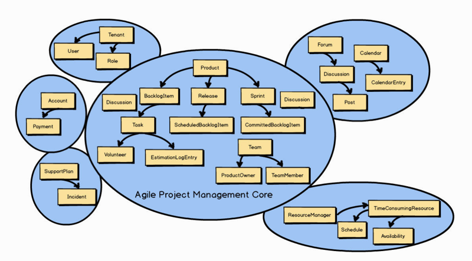
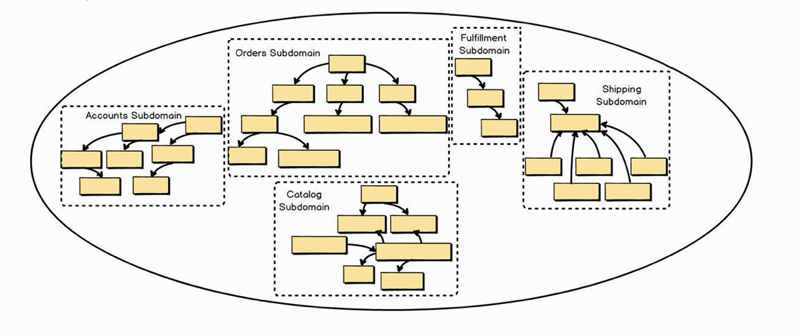
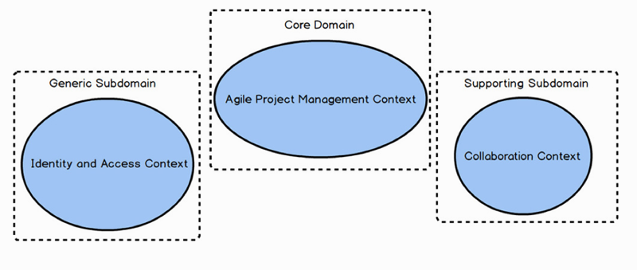

# 0301. Strategic Design with Subdomains

When you work on a DDD project, there are always multiple Bounded Contexts in play. One of the Bounded Contexts will be the Core Domain , and there will also be various Subdomains in other Bounded Contexts. In the previous chapter you saw the importance of dividing different models by their specific Ubiquitous Language and forming multiple Bounded Contexts . There are six Bounded Contexts and six Subdomains in the preceding diagram. Because DDD strategic design was used, the teams achieved the most optimal modeling composition: one Subdomain per Bounded Context , and one Bounded Context per Subdomain. In other words, the Agile Project Management Core is both one clean Bounded Context and one clean Subdomain. In some situations, there may be multiple Subdomains in one Bounded Context , but that doesn’t achieve the most optimal modeling outcome.

DDD 项目中总会碰到很多限界上下文（Bouded Contexts）。这些上下文中一定有个将成为核心域（Core Domain），而其他的限界上下文之中也会存在许多不同的子域（Sub Domain）。第 2 章中，你已经了解了通过特定的通用语言来划分不同模型，并形成多个限界上下文的重要性。上图中有六个限界上下文与六个子城。正是因为采用了 DDD 的战略设计，团队方能实现最佳的建模成果：限界上下文与子域之间一一对应。换句话说，敏捷项目管理核心即一个清晰的限界上下文，也是一个清晰的子域。在某些情况下，一个限界上下文中有可能存在多个子域，但这并非是最理想的建模结果。

## 3.1 What Is a Subdomain?

Simply stated, a Subdomain is a sub-part of your overall business domain. You can think of a Subdomain as representing a single, logical domain model. Most business domains are usually too large and complex to reason about as a whole, so we generally concern ourselves only with the Subdomains that we must use within a single project. Subdomains can be used to logically break up your whole business domain so that you can understand your problem space on a large, complex project.

Another way to think of a Subdomain is that it is a clear area of expertise, assuming that it is responsible for providing a solution to a core area of your business. This implies that the particular Subdomain will have one or more Domain Experts who understand very well the aspects of the business that a specific Subdomain facilitates. The Subdomain also has greater or lesser strategic significance to your business.

If DDD had been used to develop it, the Subdomain would have been implemented as a clean Bounded Context. The Domain Experts who specialize in that particular area of the business would have been members of the team that developed the Bounded Context. Although using DDD to develop a clean Bounded Context is the optimal choice, sometimes we can only wish that had been the case.

简单地说，子域是整个业务领域的一部分。你可以认为子域代表的是一个单一的、有逻辑的领域模型。大多数的业务领域都过于庞大和复杂，难以作为整体来分析，因此我们般只关心那些必须在单个项目中涉及的子域。子域可以用来逻辑地拆分整个业务领域，这样才能理解存在于大型复杂项目中的问题空间。

也可以认为子域是一个明确的专业领域，假设它负责为核心业务提供解决方案。这意味着特定的子城将会有一位或多位领域专家领衔，他们非常了解由这些特定子域促成的业务的方方面面。对你的业务而言，子域也有或多或少的战略意义。

如果通过 DDD 来创建子域，它将会被实现成一个清晰的限界上下文。特定业务的领域专家将会成为共建限界上下文团队中的一员。虽然使用 DDD 来建立一个清晰的限界上下文是最佳选择，但有时这只是我们一厢情愿的想法。

## 3.2 Types of Subdomains

There are three primary types of Subdomains within a project:

1. Core Domain: This is where you are making a strategic investment in a single, well-defined domain model, committing significant resources for carefully crafting your Ubiquitous Language in an explicit Bounded Context. This is very high on your organization’s list of projects because it will distinguish it from all competitors. Since your organization can’t be distinguished in everything that it does, your Core Domain demarcates where it must excel. Achieving the level of deep learning and understanding required to make such a determination requires commitment, collaboration, and experimentation. It’s where the organization needs to invest most liberally in software. I provide the means to accelerate and manage such projects efficiently and effectively later in this book.

2. Supporting Subdomain: This is a modeling situation that calls for custom development, because an off-the-shelf solution doesn’t exist. However, you will still not make the kind of investment that you have made for your Core Domain. You may want to consider outsourcing this kind of Bounded Context to avoid mistaking it for something strategically distinguishing, and thus investing heavily in it. This is still an important software model, because your Core Domain cannot be successful without it.

3. Generic Subdomain: This kind of solution may be available for purchase off the shelf but may also be outsourced or even developed in house by a team that doesn’t have the kind of elite developers that you assign to your Core Domain or even a lesser Supporting Subdomain. Be careful not to mistake a Generic Subdomain for a Core Domain. You don’t want to make that kind of investment here.

When discussing a project where DDD is being employed, we are most likely discussing a Core Domain.

1、核心域（Sub Domain）：它是一个唯一的、定义明确的领域模型，要对它进行战略投资，并在一个明确的限界上下文中投入大量资源去精心打磨通用语言。它是组织中最重要的项目，因为这将是你与其他竟争者的区别所在。正是因为你的组织无法在所有领域都出类拔萃，所以必须把核心域打造成组织的核心竟争力。做出这样的决定需要对核心域进行深入的学习与理解，而这需要承诺、协作与试验。这是组织最需要在软件中倾斜其投资的方向。后面的章节中会提供加速与高效管理这些项目的方法。

2、支撑子域（Supporting Subdomain）：这类建模场景提倡的是「定制开发」，因为找不到现成的解决方案。对它的投入无论如何也达不到与核心域相同的程度。也许会考虑使用外包的方式实现此类限界上下文，以避免因错误地认为其具有战略意义而进行巨额的投资。这类软件模型仍旧非常重要，核心域的成功离不开它。

3、通用子域（Generic Subdomain）：通用子域的解決方案可以采购现成的，也可以采用外包的方式，抑或是由内部团队实现，但我们不用为其分配与核心域同样优质的研发资源，甚至都不如支撑子域。请注意不要把通用子域误认为是核心域。我们并不希望对其投资过甚。当讨论一个正在实施 DDD 的项目时，最有可能讨论的是核心域。

1 子域的划分，不仅仅涉及实现方式、投资规模，同时还会影响组织的架构、流程。因此，合理的子域划分，以及每个子域恰当的定位，是产品得以顺利发展的重要因素。因此我们需要更好地理解这三种子域的定位。核心域是产品独特的竞争力，它是产品之所以存在的根本。因此在产品的初期，没有经过市场的验证之前，我们需要遵循 MVP (Minimum Viable Product）的原则，快速地迭代以获取市场的反馈，一旦产品被市场证明，合理的重构即需要被发生。支撑子域不需要过度地考虑可扩展性和兼容性，可重用性并非其技术着力的方向，可替代性才是，这也要求我们需要对于支撑子域有着明确的契约规范和业务约束条件。通用子域内的业务规则相对明确，在很多产品和业务上下文中保持高度的重合度，因此我们需要通过快速的采购获取，我们对其定制化要求较低，而稳定性和兼容性则要求较高。——译注

## 3.3 Dealing with Complexity

Some of the system boundaries within a business domain will very likely be legacy systems, perhaps those that your organization has created or those that have been purchased through software licensing. At this point you may not be able to do much about improving those legacy systems, but you still need to reason about them when they have an impact on your Core Domain project. To do so, use Subdomains as a tool for discussing your problem space.

业务领域中的某些系统边界将非常可能是遗留系统，它们也许是由你的组织构建的，也许是通过购买软件许可的方式获得的。此时，可能无法对这些遗留系统进行任何改造，但当它们对核心域产生影响时，就需要我们认真对待。为此，子域可以作为讨论问题空间。

Unfortunately, but true all the same, some legacy systems are so counter to the DDD way of designing with Bounded Contexts that you might even refer to them as unbounded legacy systems. That’s because such a legacy system is what I’ve already referred to as a Big Ball of Mud. In reality the one system is full of multiple tangled models that should have been separately designed and implemented but were jumbled together into one very complex and intertwined mess.

不幸的是，事与愿违，有些遗留系统与强调限界上下文的 DDD 设计方式大相径庭，甚至可以称之为无边界（mounded）遗留系统。这样的遗留系统正是我提到的「大泥球」。事实上，「大泥球」内充满了多个错综复杂的模型，这些模型本应被分别设计并实现，但当它们纠缠在一起时，整个系统会乱成一团。

1『上图的子域分别为：账户子域、订单子域、目录子域、发票子域和物流子域。』

Stated another way, when we are discussing a legacy system there are probably some, even many, logical domain models that exist inside that one legacy system. Think of each of those logical domain models as a Subdomain. In the diagram, each logical Subdomain in the unbounded legacy monolithic Big Ball of Mud is marked off by a dashed box. There are five logical models or Subdomains. Treating the logical Subdomains as such helps us grapple with the complexity of large systems. This makes a lot of sense because it allows us to treat the problem space as if it had been developed using DDD and multiple Bounded Contexts.

The legacy system seems less monolithic and muddy if we imagine separate Ubiquitous Languages , at least for the sake of understanding how we must integrate with it. Thinking about and discussing such legacy systems using Subdomains helps us cope with the harsh realities of a large entangled model. And as we reason using this tool, we can determine the Subdomains that are more valuable to the business and necessary for our project, and those that can be relegated to lesser status.

With that in mind, you can even show the Core Domain that you are working on, or are about to work on, right in the same simple diagram. This will help you understand the associations and dependencies between Subdomains. But I will save the details of that discussion for Context Mapping.

换言之，当我们在讨论某个遗留系统时，其中可能会包含一些甚至许多逻辑领域模型。我们将每个逻辑域模型当成一个子域对待。上图中，无边界遗留单体大泥球中，每个逻辑子城都已经被虚线框标记出来。共有五个逻辑模型或子域。这样处理逻辑子域的方式有助于我们应对大型系统的复杂性。这很有意义，因为我们可以像使用 DDD 和多个限界上下文应对问题空间一样，为其提供解决方案。

如果使用分开的通用语言思考，可能遗留系统就不会成为单体大泥球，这至少也可以帮助我们理解如何与它进行集成。使用子域来思考和讨论此类遗留系统有助于我们应对大型错综复杂模型的残酷现实。当使用这类工具时，我们可以明确那些对业务更有价值、对项目更重要的子域，而其他子域可以降低到次要位置。考虑到这一点，甚至可以通过同样的简单图表展示团队准备或正在构建的核心域。这帮助你了解子域间的关联与依赖。更多的细节内容将留到上下文映射（Context Mapping）中介绍。

When using DDD, a Bounded Context should align one-to-one (1:1) with a single Subdomain. That is, when using DDD, if there is one Bounded Context , there is, as a goal, one Subdomain model in that Bounded Context. It may not always be possible or practical to achieve, but where possible it is important to design in that way. This will keep your Bounded Contexts clean and focused on the core strategic initiative.

If you must create a second model in the same Bounded Context (within your Core Domain ), you should segregate the secondary model from your Core Domain using a completely separate Module [IDDD] . (A DDD Module is basically a package in Scala and Java, and a namespace in F# and C#.) This makes a clear linguistic statement that one model is core and the other is merely supporting. This particular use of segregating a Subdomain is one that you would employ in your solution space.

当使用 DDD 时，限界上下文应该与子域一一对应（1:1）。也就是说，如果存在一个限界上下文，那么它的目标就应该是对应且只对应一个子域模型。想要始终做到这一点很难，但在可能的前提下，尽量以这种方式去建模很重要。这样可以使限界上下文清晰并且始终专注于核心战略举措。

如果必须在同一个限界上下文（核心域）中创建第二个模型，应该使用一个完全独立模块，将该模型从核心域中分离出来 [IDDD]（DDD 的模块基本上等同于 Scala 和 Java 中的包，或者是 F# 和 C# 的命名空间）。DDD 通过清晰的语言声明了一个模型是核心，而另一个只是它的支撑。我们可以在解决方案空间中使用分离子域这种特殊方法。

## Summary

In summary you have learned: 1) What Subdomains are and how they are used, both in the problem space and in the solution space. 2) The difference between a Core Domain , a Supporting Subdomain , and a Generic Subdomain. 3) How you can make use of Subdomains while reasoning about integration with a Big Ball of Mud legacy system. 4) The importance of aligning your DDD Bounded Context one-to-one with a single Subdomain. 5) How you should segregate a Supporting Subdomain model from your Core Domain model using a DDD Module when it is impractical to separate the two in different Bounded Contexts. For exhaustive coverage of Subdomains , see Chapter 2 of Implementing Domain-Driven Design [IDDD] .