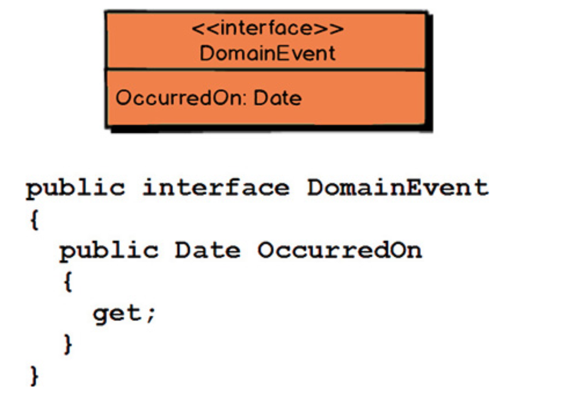
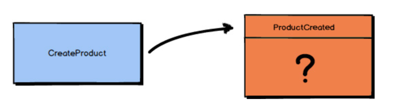
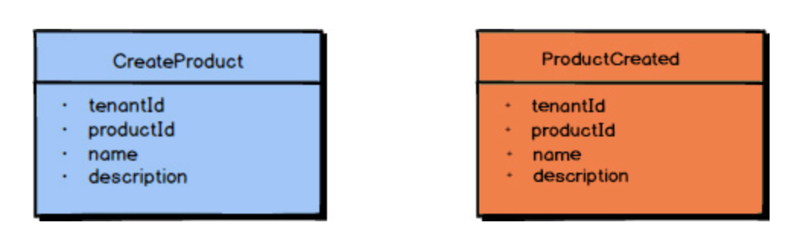
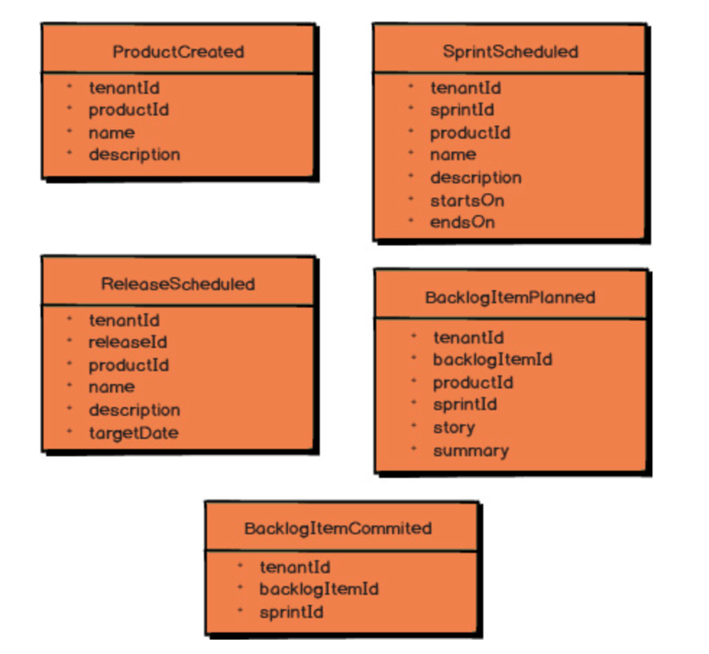
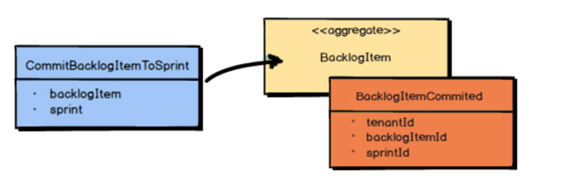
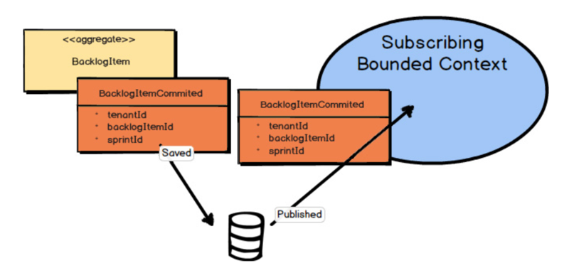
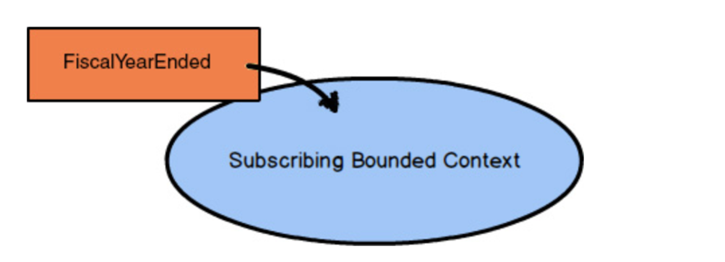

# 0601. Tactical Design with Domain Events

You’ve already seen a bit in previous chapters about how Domain Events are used. A Domain Event is a record of some business-significant occurrence in a Bounded Context. By now you know that Domain Events are a very important tool for strategic design. Still, often during tactical design Domain Events are conceptualized and become a part of your Core Domain.

在前面的章节中己经学到了一些领域事件（Domain Event）的用法。领城事件是一条记录，记录着在限界上下文（Bounded Context）中发生的对业务产生重要影响的事情。目前为止，我们已经了解到领城事件是非常重要的战略设计工具。然而，领域事件往往会在战术设计的过程中被概念化并演变成核心域的组成部分。

To see the full power that results from using Domain Events, consider the concept of causal consistency. A business domain provides causal consistency if its operations that are causally related—one operation causes another—are seen by every dependent node of a distributed system in the same order [Causal]. This means that causally related operations must occur in a specific order, and thus one thing cannot happen unless another thing happens before it. Perhaps this means that one Aggregate cannot be created or modified until it is clear that a specific operation occurred to another Aggregate :

1. Sue posts a message saying, “I lost my wallet!”.

2. Gary says in reply, “That’s terrible!”.

3. Sue posts a message saying, “Don’t worry, I found my wallet!”.

4. Gary replies, “That’s great!”.

我们通过因果一致性的概念来展现运用领城事件所产生的全部威力。如果业务领域中存在因果关系的操作一一即一个操作会由另一个操作引起一一在分布式系统的每个独立节点中它们被观察到的发生顺序都是一样的，这就是业务领域提供的因果一致性 [Casual]。这意味着存在因果关系的操作必须按照特定的顺序发生，而且，如果前一个操作没有发生，那么后面的操作就不能发生。也许这就说明了，只有在一个聚合上明确地发生了特定操的情况下，另一个聚合才能被创建或者修改：

If these messages were replicated on distributed nodes, but not in a causal order, it could appear that Gary said, “That’s great!” to the message “I lost my wallet!” The message “That’s great!” is not directly or causally related to “I lost my wallet!” and that’s definitely not what Gary wants Sue or anyone else to read. Thus, if causality is not achieved in the proper way, the overall domain would be wrong or at least misleading. This sort of causal, linearized system architecture can be readily achieved through the creation and publication of correctly ordered Domain Events.

如果这些消息被复制到多个分布式节点，却没有按照因果顺序排列，就可能会变成 Gray 对消息「我的钱包丢了！」回复「那就好！」。「那就好！」这条消息和「我的钱包丢了！」之间不存在直接关系或因果关系，这也不是 Gary 想让 Sue 或者其他人获得的消息。因此，如果因果关系没有以正确的方式实现，整个领域就会完全错误，或者至少会产生误会。这种因果的线性系统架构可以通过创建并发布顺序正确的领域事件来轻松地实现。

From tactical design efforts Domain Events become a reality in your domain model and can as a result be published and consumed in your own Bounded Context and by others. It’s a very powerful way to inform interested listeners of important occurrences that have taken place. Now you will learn how to model Domain Events and use them in your Bounded Contexts.

由于战术设计的不懈努力，领域事件在领域模型中落实，并且可以在自己的或者其他限界上下文中被发布和消费。这是一种非常有效的方式，它将已发生的重要事件告知感兴趣的监听器。接下来将学习如何建立领域事件模型以及如何在限界上下文中使用它们。

## 6.1 Designing, Implementing, and Using Domain Events

The following guides you through the steps needed to effectively design and implement Domain Events in your Bounded Context. Following this, you will also see examples of how Domain Events are used.

This C# code might be considered the minimum interface that every Domain Event should support. You generally want to convey the date and time when your Domain Event occurred, so that’s provided by the OccurredOn property. This detail is not an absolute necessity, but it is often useful. So your Domain Event types would likely implement this interface.

You must show care in how you name your Domain Event types. The words you use should reflect your model’s Ubiquitous Language. These words will form a bridge between the happenings in your model and the outside world. It’s vital that you communicate your happenings well.

这段 C# 代码可以被认为是每个领域事件都必须支持的最小接口。一般都要表达领域事件发生的日期和时间，所以这些信息由属性 OccurredOn 来提供。这个细节信息不是绝对必要的，但通常很实用。因此领域事件类型很有可能会实现这个接口。必须重视领域事件类型的命名。使用的词语应该体现出模型的通用语言（Ubiquitous Language）。这些词语将形成连接模型中所发生的事情和外部世界的桥梁。就所发生的事情进行充分的沟通至关重要。

Your Domain Event type names should be a statement of a past occurrence, that is, a verb in the past tense. Here are some examples from the Agile Project Management Context : ProductCreated, for instance, states that a Scrum product was created at some past time. Other Domain Events are ReleaseScheduled, SprintScheduled, BacklogItemPlanned, and BacklogItemCommitted. Each of the names clearly and concisely states what happened in your Core Domain.

领域事件类型的名称应该是对过去发生的事情的陈述，即动词的过去式。这里有一些敏捷项目管理上下文中的例子：例如 ProductCreated 表明在过去的某个时间一个 Scrum Product 被创建了。其他领域事件有 ReleaseScheduled、SprintScheduled、BacklogItemPlanned 和 BacklogItemCommitted。每个名称都清晰简洁地呈现了在核心城（Core Domain 中发生的事情）。

It’s a combination of the Domain Event’s name and its properties that fully conveys the record of what happened in the domain model. But what properties should a Domain Event hold?

Ask yourself, “What is the application stimulus that causes the Domain Event to be published?” In the case of ProductCreated there is a command that causes it (a command is just the object form of a method/action request). The command is named CreateProduct. So you can say that ProductCreated is the result of a CreateProduct command.

领域事件的名称和属性组合在一起才能完整记录领域模型中发生的事情。但领域事件应该包含哪些属性呢？问问你自己：「是什么应用的刺激导致领域事件被发布出来？」在 ProductCreated 的例子中，它是由一个命令引起的（命令就是一个方法 / 动作请求的对象形态)。这个命令被命名为 CreateProduct。所以可以说 ProductCreated 就是命令 CreateProduct 的结果。

The CreateProduct command has a number of properties: 1) the tenantId that identifies the subscribing tenant, 2) the productId that identifies the unique Product being created, the 3) Product name, and 4) the Product description. Each of these properties is essential to creating a Product.

Therefore, the ProductCreated Domain Event should hold all the properties that were provided with the command that caused it to be created: 1) tenantId, 2) productId, 3) name, and 4) description. This will fully and accurately inform all subscribers what happened in the model; that is, a Product was created, it was for the tenant identified with the tenantId, the Product was uniquely identified with productId, and the Product had the name and description assigned to it.

因此，领域事件 ProductCreated 必须包含导致 Product 被创建出来的那条命令提供的所有属性：1) tenantId, 2) productId, 3) name, and 4) description，它会完整精准地将模型中发生的事情通知给所有订阅者：即，一个 Product 被创建了，它是为 tenantId 代表的租户创建的，Product 通过 productId 被唯一标识，而且 name 和 description 被赋值给了 Product。

These five examples give you a good idea of the properties that should be included with the various Domain Events published by the Agile Project Management Context. For instance, when a BacklogItem is committed to a Sprint, the BacklogItemCommitted Domain Event is instantiated and published. This Domain Event contains the tenantId, the backlogItemId of the BacklogItem that was committed, and the sprintId of the Sprint to which it was committed.

As described in Chapter 4, “Strategic Design with Context Mapping,” there are times when a Domain Event can be enriched with additional data. This can be especially helpful to consumers that don’t want to query back on your Bounded Context to obtain additional data that they need. Even so, you must be careful not to fill up a Domain Event with so much data that it loses its meaning. For example, consider the problem with BacklogItemCommitted holding the entire state of the BacklogItem. According to this Domain Event, what actually happened? All the extra data may make it unclear, unless you require the consumer to have a deep understanding of your BacklogItem element. Also, consider using BacklogItemUpdated with the full state of the BacklogItem, as opposed to providing BacklogItemCommitted. What happened to the BacklogItem is very unclear, because the consumer would have to compare the latest BacklogItemUpdated to the previous BacklogItemUpdated in order to understand what actually occurred to the BacklogItem.

这五个例子很好地展示了，由敏捷项目管理上下文发布的各种不同的领域事件，应该包含哪些属性。例如，当一个 BacklogItem 被提交到 Sprint 中，领城事件 BacklogItemCommitted 被初始化并发布出来。这个领域事件包含了 tenantId，代表被提交的 BacklogItem 的 backlogItemId，以及代表它被提交的 Sprint 的 sprintId。

正如第 4 章中所述，有时可以使用额外的属性来增强领城事件。某些消费者不想在限界上下文中通过查询来获取他们需要的额外数据，对于这些消费者来说，用额外属性增强过的事件会很方便。即便如此，也必须特别小心，以避免把太多的数据塞给领域事件，从而导致它失去了本来的意义。例如，思考一下包含完整 BacklogItem 状态的 BacklogItemCommitted 所带来的问题。按照这个领域事件的定义，实际发生了什么？所有额外的数据都可能对此含义产生误导，除非消费者对 BacklogItem 元素有着深刻的理解。此外，再想一想使用包含 BacklogItem 完整状态的 BacklogItemUpdated代替 BacklogItemCommitted。这个名字对 BacklogItem 上发生的事情的描述是模糊的，因为消费者不得不对比最新的 BacklogItemUpdated 和前一个 BacklogItemUpdated 才能理解究竟发生了什么。

To make the proper use of Domain Events clearer, let’s walk through one scenario. The product owner commits a BacklogItem to a Sprint. The command itself causes the BacklogItem and the Sprint to be loaded. Then the command is executed on the BacklogItem Aggregate. This causes the state of the BacklogItem to be modified, and then the BacklogItemCommitted Domain Event is published as an outcome.

为了令我们更清楚地理解正确使用领域事件的方法，看看这样一个场景。产品负责人向 Sprint 提交了一个 BacklogItem。这个命令自己会加载 BacklogItem 和 Sprint，然后会在聚合 BacklogItem 上执行。这导致 BacklogItem 的状态被修改，随后领域事件 BacklogItemCommitted 被作为结果发布出来。

It’s important that the modified Aggregate and the Domain Event be saved together in the same transaction. If you are using an object-relational mapping tool, you would save the Aggregate to one table and the Domain Event to an event store table, and then commit the transaction. If you are using Event Sourcing, the state of the Aggregate is fully represented by the Domain Events themselves. I discuss Event Sourcing in the next section of this chapter. Either way, persisting the Domain Event in the event store preserves its causal ordering relative to what has happened across the domain model.

在同一次事务中同时保存修改过的聚合和领城事件非常关键。如果你使用的是对象关系映射工具，可以把聚合保存在一张表里，并且把领域事件保存在另一张事件存储表中然后提交事务。如果你使用的是事件溯源（Event Sourcing），聚合的状态可以完全由领城事件自己表达。我将在本章下一节讨论事件溯源。无论使用哪种方式，在事件存储中对领域事件进行持久化都会保留它们之间的因果顺序，这些顺序和在领域模型中发生的事件相关。

Once your Domain Event is saved to the event store, it can be published to any interested parties. This might be within your own Bounded Context and to external Bounded Contexts. This is your way of telling the world that something noteworthy has occurred in your Core Domain.

Note that just saving the Domain Event in its causal order doesn’t guarantee that it will arrive at other distributed nodes in the same order. Thus, it is also the responsibility of the consuming Bounded Context to recognize proper causality. It might be the Domain Event type itself that can indicate causality, or it may be metadata associated with the Domain Event, such as a sequence or causal identifier. The sequence or causal identifier would indicate what caused this Domain Event, and if the cause was not yet seen, the consumer must wait to apply the newly arrived event until its cause arrives. In some cases it is possible to ignore latent Domain Events that have already been superseded by the actions associated with a later one; in this case causality has a dismissible impact.

一旦领域事件被保存到了事件存储中，它就可以发布给任何对它感兴趣的订阅方。这可能发生在自己的限界上下文中也可能发生在外部的限界上下文中。这是你向世界宣告的方式，宣告在你的核心城中发生了一些值得关注的事件事情。

注意，只是按照因果顺序保存领域事件并不能保证这些事件会以同样的顺序到达其他的分布式节点。因此，识别出正确因果关系的重任就落到了消费事件的限界上下文肩上。因果关系可以由领域事件类型本身表明，或者由和领域事件关联在一起的元数据表示，比如一个序列标识符或者因果标识符。序列标识符或者因果标识符可以表示导致领域事件发生的原因事件，如果原因事件尚未出现，消费者必须等它到达后才能处理先前到达的（结果）事件。某些情况下，可以忽略潜在的领域事件，这些事件已经被后续事件的关联动作取代，这种情况下因果关系具有可消除的影响。

One more point about what can cause a Domain Event is noteworthy. Although often it is a user-based command emitted by the user interface that causes an event to occur, sometimes Domain Events can be caused by a different source. This might be from a timer that expires, such as at the end of the business day or the end of a week, month, or year. In cases like this it won’t be a command that causes the event, because the ending of some time period is a matter of fact. You can’t reject the fact that some time frame has expired, and if the business cares about this fact, the time expiration is modeled as a Domain Event, and not as a command.

What is more, such an expiring time frame will generally have a descriptive name that will become part of the Ubiquitous Language. For example, “Fiscal Year Ended” may be an important event that your business needs to react to. Furthermore, 4:00 p.m. (16:00) on Wall Street is known as “Markets Closed” and not just as 4:00 p.m. Therefore, you have a name for that particular time-based Domain Event.

A command is different from a Domain Event in that a command can be rejected as inappropriate in some cases, such as due to supply and availability of some resources (product, funds, etc.), or another kind of business-level validation. So, a command may be rejected, but a Domain Event is a matter of history and cannot logically be denied. Even so, in response to a time-based Domain Event it could be that the application will need to generate one or more commands in order to ask the application to carry out some set of actions.

关于导致领域事件的原因还有一点值得注意。尽管事件通常都是用户在用户界面发起的命令导致的，但有时领域事件可能由其他原因引起。这些原因可能是快要到期的计时器比如营业日结束或者一周、一月、一年的结尾。这种情况下，导致事件发生的原因不是命令，因为某个时间段的结束是一个事实。你不能抗拒时间范围到期的事实，而且如果业务关注了这个事实，时间到期会被建模成领域事件而不是命令。

而且，这样一个会到期的时间范围通常会有一个描述性的名称，这个名称会成为通用语言的一部分。例如，「财年截止」（Fiscal Year End）可能是业务需要响应的一个重要事件。又比如，华尔街的下午 4 点（16 点整）并不是简单的下午 4 点，而被认为是「收盘」。因此，基于时间的特殊领域事件应该拥有合适的名称。

命令和领域事件的不同在于，某些情况下不恰当的命令可以被拒绝，比如某些资源（产品、资金等）的供应和可用性或者其他业务层面的验证导致的情况。所以，命令可能被拒绝，而领域事件是历史事实，必须无条件地接受。尽管如此，为了响应基于时间的领域事件，应用可能需要生成一条或多条命令，来执行一些动作。

## 6.2 Event Sourcing

Event Sourcing can be described as persisting all Domain Events that have occurred for an Aggregate instance as a record of what changed about that Aggregate instance. Rather than persisting the Aggregate state as a whole, you store all the individual Domain Events that have happened to it. Let’s step through how this is supported.

All of the Domain Events that have occurred for one Aggregate instance, ordered as they originally occurred, make up its event stream. The event stream begins with the first Domain Event that ever occurred for the Aggregate instance and continues until the last Domain Event that occurred. As new Domain Events occur for a given Aggregate instance, they are appended to the end of its event stream. Reapplying the event stream to the Aggregate allows its state to be reconstituted from persistence back into memory. In other words, when using Event Sourcing, an Aggregate that was removed from memory for any reason is reconstituted entirely from its event stream.

In the preceding diagram, the first Domain Event to occur was BacklogItemPlanned; the next was BacklogItemStoryDefined; and the event that just occurred is BacklogItemCommitted. The full event stream is currently composed of those three events, and they follow the order described and seen in the diagram.

Each of the Domain Events that occurs for a given Aggregate instance is caused by a command, just as described previously. In the preceding diagram, it is the CommitBacklogItemToSprint command that has just been handled, and this has caused the BacklogItemCommitted Domain Event to occur.

事件溯源（Event Sourcing）可以描述为，对所有发生在聚合实例上的领域事件进行持久化，把它们当作对聚合实例变化的记录。你存储的是发生在聚合上的所有独立事件，而不是把聚合状态作为一个整体进行持久化。一个聚合实例上发生的所有领域事件，按照它们原本发生的顺序，组成了该实例的事件流。事件流从聚合实例上发生的第一个领域事件开始，到最近发生的领城事件结束。当指定的聚合实例上发生了新的领域事件时，这些事件被追加到该实例事件流的末尾。在聚合上重新应用事件流，可以让它的状态从持久化存储中被重建到内存中。换句话说，使用事件溯源时，出于任何原因从内存中移除的聚合将依据它的事件流完整地进行重建。

在上图中，最先发生的领城事件是 BacklogItemPlanned，接下来是 BacklogItemStoryDefined，而最近刚刚发生的是 BacklogItemCommitted。完整的事件流现在由这三个事件组成，它们按照图中呈现的顺序排列。和之前描述的一样，每个发生在指定聚合实例上的领域事件都是由命令引起的。在上图中，刚刚被处理的命令是 CommitBacklogItemToSprint，并且由此导致事件 BacklogItemCommitted 发生。

The event store is just a sequential storage collection or table where all Domain Events are appended. Because the event store is append-only, it makes the storage mechanism extremely fast, so you can plan on a Core Domain that uses Event Sourcing to have very high throughput, low latency, and be capable of high scalability.

事件存储就是一个顺序存储集合或者一张表，所有领域事件都被追加到其中。由于事件存储只允许追加记录，从而使得存储进程非常快，所以可以规划在核心域上使用事件溯源，来达到高吞吐量、低延迟和高伸缩性。

『

Performance Conscious

If one of your primary concerns is performance, you will appreciate knowing about caching and snapshots. First of all, your highest-performing Aggregates will be those that are cached in memory, where there is no need to reconstitute them from storage each time they are used. Using the Actor model with actors as Aggregates [Reactive] is one of the easier ways to keep your Aggregates’ state cached.

Another tool at your disposal is snapshots, where the load time of your Aggregates that have been evicted from memory can be reconstituted optimally without reloading every Domain Event from an event stream. This translates to maintaining a snapshot of some incremental state of your Aggregate (object, actor, or record) in the database. Snapshots are discussed in more detail in Implementing Domain-Driven Design [IDDD] and in Reactive Messaging Patterns with the Actor Model [Reactive].

如果关注的重点之一是性能，就需要了解缓存和快照的知识。首先，性能最好的是那些缓存在内存中的聚合，每次用到它们时不需要从存储中进行重建。使用 Actor 作为聚合的 Actor 模型 [Reactive] 是一种更为简便的保持缓存聚合状态的方法。可以使用的另外一种工具是快照 [1]，从内存中释放的聚合能够以最优方式进行重建，而不需要加載事件流中的每个领域事件，这样可以节省加栽时间。这将转变成在数据库中对聚合（对象、Actor 或记录）的一些增量状态的快照进行維护。快照在《实现领域驱动设计》和《响应式架构：消息模式 Actor 实现与 Scala、Aka 应用集成》中有更详细的讨论。

1 Snapshot，是事件溯源必须支持的一种机制。如果每次读取聚合实例时，都要从头至尾将所有事件依次「重播」一遍，这样产生的性能开销可想而知，尤其事件数量特别多的时候。随着系统規模的扩大和时间的推移，这显然是无法避免的。而快照可以在某个时间点将聚合实例的完整状态进行持久化，之后的读取只需要在这次保存下来的最新状态上「重播」之后发生的事件，这样可以极大地提升性能。一一译注

』

One of the greatest advantages of using Event Sourcing is that it saves a record of everything that has ever happened in your Core Domain, at the individual occurrence level. This can be very helpful to your business for many reasons, ones that you can imagine today, such as compliance and analytics, and ones that you won’t realize until later. There are also technical advantages. For example, software developers can use event streams to examine usage trends and to debug their source code.

You can find coverage of Event Sourcing techniques in Implementing Domain-Driven Design [IDDD]. Also, when you use Event Sourcing you are almost certainly obligated to use CQRS. You can also find discussions of this topic in Implementing Domain-Driven Design [IDDD].

使用事件溯源最大的优势之一就是它在独立事件这个级别保存了核心城中发生的一切。这会从各个方面对业务产生非常大的帮助，有一些现在就能想象得到，比如合规性检查和数据分析，还有一些将来オ会意识到。它还有一些技术上的优势，例如，软件开发人员可以利用事件流检查使用趋势或者调试源码。在《实现领域驱动设计》中可以找到关于事件溯源技术的内容。另外，当使用事件溯源时，几乎一定会同时使用 CQRS。相关主题的讨论也可以在《实现领域驱动设计》中找到。

## Summary

In this chapter you learned: 1) How to create and name your Domain Events. 2) The importance of defining and implementing a standard Domain Event interface. 3) That naming your Domain Events well is especially important. 4) How to define the properties of your Domain Events. 5) That some Domain Events may be caused by commands, while others may happen due to the detection of some other changing state, such as a date or time. 6) How to save your Domain Events to an event store. 7) How to publish your Domain Events after they are saved. 8) About Event Sourcing and how your Domain Events can be stored and used to represent the state of your Aggregates.

For a thorough treatment of Domain Events and integration, see Chapters 8 and 13 of Implementing Domain-Driven Design [IDDD].

总结：1）如何创建和命名领域事件。2）定义和实现标准领城事件接口的重要性。3）合理地命名领城事件非常重要。4）如何定义领域事件的属性。5）一些领域事件可能是由命令引起的，而另一些事件可能由其他变化的状态引起比如日期和时间。6）如何把领域事件保存到事件存储中。7）在领域事件保存后如何发布它们。8）事件溯源的相关内容，以及领域事件如何存储和使用才能表示聚合的状态。