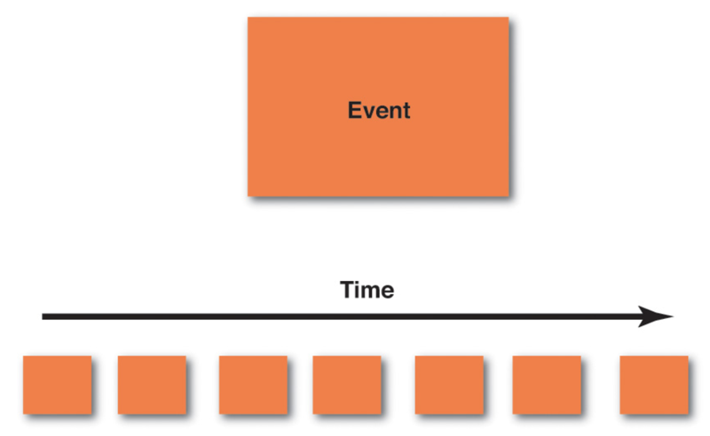
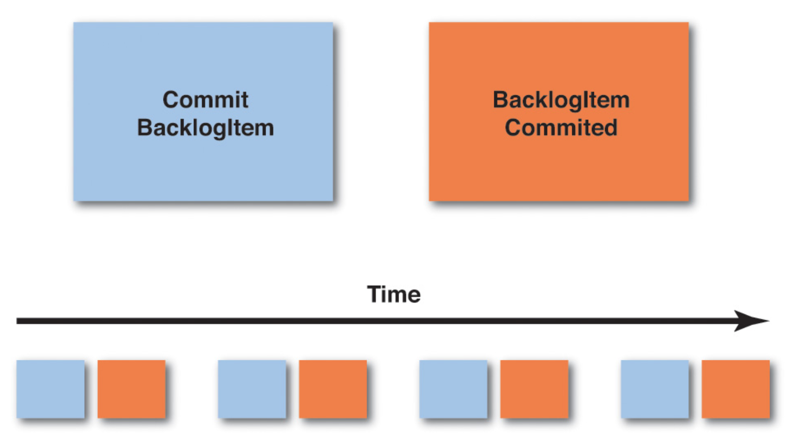
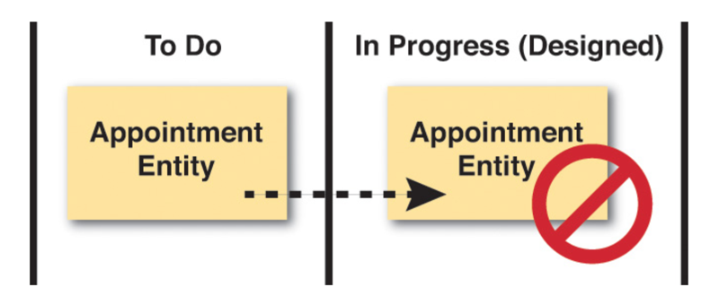
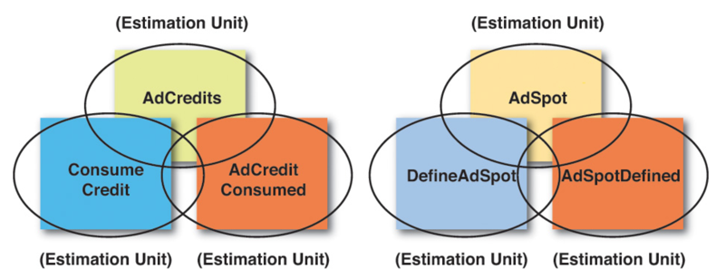
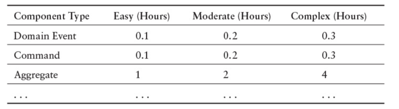

# 0701. Acceleration and Management Tools

When using DDD we are on a quest for deep learning about how the business works, and then to model software based on the extent of our learning. It’s really a process of learning, experimenting, challenging, learning more, and modeling again. We need to crunch and distill knowledge in great quantities and produce a design that is effective in meeting the strategic needs of an organization. The challenge is that we have to learn quickly. In a fast-paced industry we are usually working against time, because time matters, and time generally drives many of our decisions, possibly even more than it should. If we don’t deliver on time and within budget, no matter what we have achieved with the software, we seem to have failed. And everyone is counting on us to succeed in every way.

Some have made efforts to convince management that most project time estimations are valueless and that they cannot be successfully used. I am not sure how those efforts are working out in the large, but every client with whom I work is still being pressured to deliver within very specific time frames, which forces timeboxing into the design/implementation process. At best it’s a constant struggle between software development and management.

Unfortunately, one common response to this negative pressure is to try to economize and shorten timelines by eliminating design. Recall from the first chapter that design is inevitable, and that either you will do poorly as a result of bad design, or you will succeed by delivering with an effective design, and possibly even with a good design. So, what you should attempt to do is meet the demands of time squarely and design in an accelerated way, using approaches that will help you deliver the very best design possible within the limits of time that you face.

To that end I provide some very useful design acceleration and project management tools in this chapter. First I discuss Event Storming and then conclude with a way to leverage the artifacts produced by that collaboration process to create estimates that are meaningful and, best of all, attainable.

当使用 DDD 时，我们的任务是深入学习业务如何运作，然后基于学习的范围建立软件模型。这实际上是一个学习、试验、质疑、再学习和重建模型的过程。我们要从大量学到的内容中研磨和提炼知识，并创造出能有效满足组织战略需要的设计。我们面临的挑战是如何快速地学习。在快节奏的行业中，我们在和时间赛跑，因为时间很关键，并且往往促使我们做出许多决定，有些决定甚至超出了我们的能力范围。如果不能按时、按预算交付，无论我们的软件可以达到什么样的高度，我们都会失败，但每个人都希望我们在各个方面取得成功。

有些人试图说服管理层，大多数项目的时间估算没有价值也不能成功地被采用。我不确定这些尝试在大型项目中的效果，但和我共事的每个客户仍然承受着在给定时间范围内完成交付的压力，这会迫使时间盒变成设计实施的瀑布流程。即使在最乐观的情况下，这也会变成软件开发人员和管理层之间的拉锯战。

不幸的是，应付这种负面压力的一种普遍手段是，牺牲设计来节省时间和缩短周期。第 1 章我们就说过，无论是因为糟糕的设计而挣扎，还是因为交出了有效甚至优秀的设计而成功，设计都是不可或缺的。所以，我们应该尝试不打折扣地满足时间要求，并加速设计，这要运用一些方法，这些方法能够帮你在面对时间限制时交出最佳设计。

为此，我将在本章提供一些非常实用的加速设计和项目管理的工具。首先会讨论事件风暴（Event Storming），然后总结一种方法，该方法利用协作过程中的产出物来做出有意义的估算，最重要的一点是，这些估算是可以达成的。

## 7.1 Event Storming

Event Storming is a rapid design technique that is meant to engage both Domain Experts and developers in a fast-paced learning process. It is focused on the business and business process rather than on nouns and data.

Prior to learning Event Storming I used a technique that I called event-driven modeling. It usually involved conversations, concrete scenarios, and event-centric modeling using very lightweight UML. The UML-specific steps could be achieved on a whiteboard alone and could also be captured in a tool. However, as you probably know, few business people are informed and proficient in even a minimalistic use of UML. So, this left most of the modeling part of the exercise to me or another developer who understood the basics of UML. It was a very useful approach, but there had to be a way to get business experts more directly involved in the process. That probably meant leaving out UML in favor of a more engaging tool.

事件风暴是一种快速的设计技术，让领域专家和开发人员都可以参与到这个快节奏的学习过程中。它聚焦于业务和业务流程，而非名词概念和数据。

在学习事件风暴之前，我使用过一种被我称为事件驱动建模的技术。它通常涉及对话和具体的场景，还会用到非常轻量的 UML，并以事件为中心的方式建模。UML 的相关步骤可以只用白板完成，也可以使用工具记录。然而，你可能已经意识到，很少有业务人员能了解或精通哪怕是最简化的 UML。所以，练习中建模部分的大多数工作就留给了我和另外一位有些 UML 基础的开发人员。这是一种非常有用的方法，但必须想办法让业务专家直接参与整个过程。这很可能意味着要放弃 UML，转投另一种更具吸引力的工具。

I first learned about Event Storming years ago from Alberto Brandolini [Ziobrando], who had also experimented with another form of event-driven modeling. On one occasion, being short on time, Alberto decided that he should ditch the UML and use sticky notes instead. This was the birth of an approach to rapid learning and software design that got everybody in the room very directly involved in the process. Here are some of its advantages:

1. It is a very tactile approach. Everyone gets a pad of sticky notes and a pen and is responsible for contributing to the learning and design sessions. Both business people and developers stand on equal ground as they learn together. Everyone provides input to the Ubiquitous Language.

2. It focuses everyone on events and the business process rather than on classes and the database.

3. It is a very visual approach, which dismisses code from the experimentation and puts everyone on a level footing with the design process.

4. It is very fast and very cheap to perform. You can literally storm out a new Core Domain in rough format in a matter of hours rather than weeks. If you write something on a sticky note that you later decide doesn’t work, you wad up the sticky note and throw it away. It costs you only a penny or two for that mistake, and no one is going to resist the opportunity to refine due to effort already invested.

5. Your team will have breakthroughs in understanding. Period. It happens every time. Some will come to the session thinking that they have a pretty good understanding of the specific core business model, but no matter, they always leave with a greater understanding and even new insights about the business process.

6. Everybody learns something. Whether you are a Domain Expert or a software developer, you will walk away from the sessions with a crisp, clear understanding of the model at hand. This is different from achieving breakthroughs and is important in its own right. In many projects, at least some project members, and possibly many, do not understand what they are working on until it is too late and the damage is already in the code. Storming out a model helps everyone clear up misunderstandings and move forward with a unified direction and purpose.

7. This implies that you are also identifying problems in both the model and in understanding as early and quickly as possible. Iron out misunderstandings and leverage the outcome as new insights. Everybody in the room benefits.

8. You can use Event Storming for both big-picture and design-level modeling. Doing big-picture storming will be less precise, while design-level storming will lead you toward certain software artifacts.

9. It is unnecessary to limit the storming sessions to one. You can start off with a two-hour storming session, then take a break. Sleep on your accomplishments and return the next day to spend another hour or two to expand and refine. If you do this for two hours a day for three or four days, you will gain a deep understanding of your Core Domain and integrations with your surrounding Subdomains.

几年前，我是在 Alberto Brandolini [Ziobrando] 那第一次学习到事件风暴，他也曾经试验过其他形式的事件驱动建模方法。一次偶然的机会，因为时间所剩无几，Alberto 决定放弃 UML 转而使用便利贴。一种能让房间里所有人都直接参与其中的快速学习和进行软件设计的方法由此而诞生。下面是该方法的一些优点：

1、这是一种有很强参与感的方法。每个人都拿着一叠便利贴和马克笔，随时可以加入学习和设计的讨论中。业务人员和开发人员在平等的基础上共同学习。每个人都使用通用语言提出建议。

2、它令每个人都聚焦于事件和业务流程，而不是类和数据库。

3、这是一种高度视觉化的方法，消除了试验过程中的代码，让每个人平等地参与到设计过程中。

4、它实施起来非常快，投入成本也很低。只需花几个小时，而不用数周，就差不多可以通过头脑风暴得出粗略形式的核心域模型。如果后来发现写在便利贴上的内容不对，把它揉成一团扔掉即可。这样的错误只会花费几分钱且谁也不会因为担心浪费己经投入的精力而拒绝改善设计的机会。

5、你的团队成员无一例外地会取得对业务理解的突破。有些成员在加入讨论之前认为他们已经非常了解特定的核心业务，但是无论怎样，他们都会带着对业务流程更深入的认知甚至新颖的见解离开。

6、每个人都能学到东西。无论是业务专家还是软件开发人员，都会带着对现有模型新鲜且清晰的理解离开讨论。这不同于业务理解上取得的突破，对于模型本身的理解也很重要。在许多项目中，一部分甚至大多数项目成员根本不了解他们的工作内容，直到代码出现问题，才发现为时己晚。快速产出模型能帮助每个人消除误解，朝着统一的方向和目标前进。

7、这意味着你已经尽早、尽快地在模型和认知中识别出了问题，扫除误解并将结论作为新的见解善加利用。屋子里的每个人都将受益匪浅。

8、宏观（big-picture）的建模和设计级别（design-level）的建模都可以使用事件风暴。宏观的事件风暴不追求细节，而设计级别的事件风暴会引导你完成一些特定的软件产出物。

9、不必强求一次风暴讨论就能解决所有问题。可以先从一次两小时左右的风暴讨论开始，然后休息。枕着前一天的成果入睡，第二天再花上一两个小时来扩展和完善。如果每天两小时，连续做上三四天，你将会深入地理解核心域以及它和周边子域之间的集成。

Here is a list of the people, mindset, and supplies you will need to storm out a model:

1. Having the right people is essential, which means the Domain Expert(s) and developers who are to work on the model. Everyone is going to have some of the questions and some of the answers. In order to support each other, they all need to be in the same room during the modeling sessions.

2. Everyone should come with an open mind that is free of strict judgment. The biggest mistake I see during Event Storming sessions is people trying to be too correct too soon. You should rather be fully determined to create far too many events. More events is better than fewer events, because that’s what will make you learn the most. There is time to refine later, and refinement is fast and cheap.

3.  Have on hand an assortment of colors of sticky notes, and plenty of them. At a minimum you need these colors: orange, purple/red, light blue, pale yellow, lilac, and pink. You may find that other colors (such as green; see later examples) come in handy. The sticky note dimensions can be square (3 inches by 3 inches, or 7.62 cm by 7.62 cm) rather than the wider variety that are rectangular. You don’t need to write much on the sticky note; usually just a few words will do. Consider getting the extra-sticky variety. You don’t want your sticky notes falling on the floor.

4. Provide one black marker pen for each person, which will enable handwriting to show up bold and clear. Fine-tip markers are best.

5. Find a wide wall where you can model. Width is more important than height, but your modeling surface should be approximately one meter/yard high. Width should be practically unlimited, but something in the range of 10 meters/yards should be considered a minimum. In lieu of such a wall being available, you can always use a long conference table or the floor. The problem with a table is that it will ultimately limit your modeling space. The problem with the floor is that it might not be accessible to everyone on the team. A wall is best.

6. Obtain a long roll of paper, such as can often be found at art stores, teaching supply stores, and even at Ikea stores. The paper should be to the dimensions described previously, with at least 10 meters/yards in width and 1 meter/yard in height. Hang the paper on the wall using strong tape. Some may decide to forgo the paper and just work on whiteboards. This may work for a while, but the sticky notes tend to lose adhesion over time on whiteboards, especially if they are pulled up and restuck in different locations. Stickies adhere longer when they are applied to paper. If you intend to model for brief periods of time over three or four days, rather than in one long session, longevity of stickiness is important.

1、邀请合适的人员是最基本的要求，领域专家和开发人员都要在模型上工作。每个人都会提出问题，也能给出问题的答案。为了互相支持，他们全部都要在同一个房间里参与建模讨论。

2、每个成员都应该以开放包容的心态参与我在事件风暴讨论中观察到的最大问题就是，人们总是苛刻地追求正确和速度。创建事件的时候别犹豫，多多益善，因为你可以从中学到更多的东西，将来还有时间既快速又经济地完善这些事件。

3、手边要有各种颜色的便利贴，永远不要嫌多。你至少需要这几种颜色：橘色、紫红色、浅蓝色、淡黄色、浅紫色和粉红色。你会发现其他颜色（比如绿色，后面的例子会用到）的便利贴也能派上用场。便利贴的尺寸应该是正方形（边长 7.62m）而不是那种更常见的矩形。便利贴上不需要写太多字，通常只用写几个词语。要考虑选一些贴得更牢的便利贴，你不会想看到便利贴散落在地上。

4、每个人都需要一支黑色马克笔，用它写的字清楚醒目。粗字笔效果最好。

5、找一面可以用来建模的宽墙。墙的宽度比高度更重要，但你用来建模的墙面至少需要 1m 的高度。墙面宽度最好没有限制，10m 左右的宽度应该是最低要求。通常可以使用长的会议桌或者地板来代替这样的可用墙面。会议桌的问题是它始终会限制你的施展空间，而地板的问题在于团队中未必所有成员都能轻松地够得着。所以，墙是最好的选择。

6、准备一大卷白纸,通常可以在美术用品店、文具/教具店买到,甚至可以在宜家买到。白纸的尺寸应该和前面提到的墙面一样，宽 10m，高 1m，使用强力胶带将白纸贴在墙上。有些人选择使用白板代替白纸，这样虽然可以工作一段时间，但是白板上的便利贴会慢慢失去黏性，特别是反复地在不同位置上揭开又重贴之后白纸上的便利贴会贴得更久，如果你的建模活动打算进行大概三四天，而不是在几个小时的会议内结東，那么便利贴粘贴的寿命至关重要。

Given the basic supplies and having the right people participating in the session, you are ready to begin. Consider each of the steps, one by one.

### 01

Storm out the business process by creating a series of Domain Events on sticky notes. The most popular color to use for Domain Events is orange. Using orange makes the Domain Events stand out most prominently on the modeling surface.

通过创建一系列写在便利贴上的领域事件，快速梳理出业务流程。最流行的代表领域事件的便利贴颜色是橘色。橘色让建模平面上的领域事件最显眼突出。下面是在创建领域事件时应该遵守的一些基本规则。

The following are some basic guidelines that should be employed as you create your Domain Events:

• Creating Domain Events first should emphasize that we have our first and primary focus on the business process, not on the data and its structure. It may take your team 10 to 15 minutes to warm up to this, but follow the steps just as I outline them here. Don’t be tempted to jump ahead.

• Write the name of each Domain Event on a sticky note. The name, as you learned in the previous chapter, should be a verb stated in the past tense. For example, an event may be named ProductCreated, and another may be named BacklogItemCommitted. (You can certainly break these names into multiple lines on the sticky notes.) If you are doing big-picture storming and you think that these names are too precise for the participants, use other names.

• Place the sticky notes on your modeling surface in time order, that is, from left to right in the order in which each event occurs in the domain. You start with the first Domain Events to the far left of your modeling surface and then move gradually to the right. Sometimes you won’t have a good understanding of the time order, in which case you should just put the corresponding Domain Events somewhere in the model. Figure out the “when” part, which will probably become obvious, later.

• A Domain Event that happens in parallel with another according to your business process can be located under the Domain Event that happens at the same time. So, you use vertical space to represent parallel processing.

• As you go through this part of the storming session, you are going to find trouble spots in your existing or new business process. Clearly mark these with a purple/red sticky note and some text that explains why it’s a problem. You need to invest time at such points to learn more.

• Sometimes the outcome of a Domain Event is a Process that needs to run. This could be a single step or multiple complex steps. Each Domain Event that causes a Proces s to be executed should be captured and named on a lilac sticky note. Draw a line with an arrowhead from the Domain Event to the named Process (lilac sticky note). Model a fine-grained Domain Event only if it is important to your Core Domain. Most likely a user registration process is a necessity but probably not considered a core feature of your application. Model the registration process as one single coarse-grained event, UserRegistered, and move on. Put your concentrated efforts into more important events.

1、在创建领域事件时要强调我们优先和主要关注的是业务流程，而不是数据及其结构。这可能要花费 10-15 分钟才能让团队适应，但是请按照我这里列出的步骤慢慢来，别着急略过任何步骤。

2、把每个领域事件的名称写在一张便利贴上。在前面的章节中已提到，事件的名称应该是动词的过去式。例如，可以命名某个事件为 Productcreated 而命名另一个事件为 Backlogitemcommitted（当然可以把这些名称分成几行写在便利贴上）。如果正在进行的是宏观的事件风暴，并且你认为这些名称对参与者来说过于细致，请使用其他名称。

3、把这些写好事件的便利贴按照时间顺序摆放在建模平面上，即按照每个事件在领域中发生的先后顺序从左到右排列。从建模平面上最左边的、最先发生的领域事件开始，逐步地向右推进。有时可能没有搞清楚确切的时间顺序那就把领域事件放在平面的其他地方。对于它“何时发生”的这个问题，可能稍后才会变得清晰。

4、按照业务流程，有些领域事件会和其他事件并行发生，可以把这些事件摆放在同时发生的领域事件的下方。这样，就可以使用纵向的空间来表示并行处理。

5、在风暴讨论的这个步骤中，会在已有的或新的业务流程中发现问题点。将它们清楚地记录在紫/红色的便利贴上,并用一段文字解释为什么它是一个问题点。你需要在这些问题点上投入更多的时间来学习。

6、有时领域事件将导致一个需要执行的流程（Process）。流程可以是一个单独步骤，也可以是多个复杂步骤。由每个领域事件导致执行的流程都应该被命名并记录在浅紫色的便利贴上。请从领域事件开始绘制一条带箭头的连线最终指向这个命名流程（浅紫色便利贴）。只用对那些核心域中非常重要的细粒度领域事件进行建模。用户注册的流程或许是必需的，但可能不会被视为应用程序的核心功能。应该将注册流程创建成一个粗粒度的事件 UserRegistered，然后继续建模。把精力集中于需要解决的更重要的问题。

If you think you have exhausted all possible important Domain Events, it may be time to take a break and come back to the modeling session later. Returning to the modeling surface a day later will no doubt cause you to find missing concepts and to refine or toss out superficial ones that you previously considered important. Even so, at some point you will have identified most of the Domain Events that are of greatest importance. At that time you should move on to the next step.

如果你认为己经穷尽了所有可能的重要领域事件，那么可以休息一下，稍后再回到建模的讨论中。一天之后再次回到建模平面前，你将可以找到之前缺失的一些概念，还可以改进或抛弃那些之前认为重要但现在却发现无关紧要的概念。即便如此，在某个时刻，你将识别出大部分最重要的领域事件。这时你应该继续下一步。

### 02

Create the Commands that cause each Domain Event. Sometimes a Domain Event will be the outcome of a happening in another system, and it will flow into your system as a result. Still, often a Command will be the outcome of some user gesture, and that Command, when carried out, will cause a Domain Event. The Command should be stated in the imperative, such as CreateProduct and CommitBacklogItem. These are some basic guidelines:

创建导致每个领域事件发生的命令。有时，领域事件由其他系统中所发生的事情引发，作为结果流入系统中。但是，命令（Command）通常是某个用户操作的结果，而且命令的执行将导致领城事件的发生。命令应该被描述成指令式的，比如 CreateProduct 和 CommitBacklogItem。下面是一些基本指南：

• On the light blue sticky notes, write the name of the Command that causes each corresponding Domain Event. For example, if you have a Domain Event named BacklogItemCommitted, the corresponding Command that causes that event is named CommitBacklogItem.

• Place the light blue sticky note of the Command just to the left of the Domain Event that it causes. They are associated in pairs: Command/Event, Command/Event, Command/Event, and so on. Remember that some Domain Events will occur because of time limits being reached and so may not have a corresponding Command that explicitly causes them.

• If there is a specific user role that performs an action, and it is important to specify, you can place a small, bright yellow sticky note on the lower left corner of the light blue Command with a stick figure and the name of the role. In the above figure, “Product Owner” would be the role that performs the Command.

• Sometimes a Command will cause a Process to be run. This could be a single step or multiple complex steps. Each Command that causes a Process to be executed should be captured and named on a lilac sticky note. Draw a line with an arrowhead from the Command to the named Process (lilac sticky note). The Process will actually cause one or more Commands and subsequent Domain Events, and if you know what those are now, create sticky notes for them and show them emitting from the Process.

• Continue to move from left to right in time order just as you did when first creating each of the Domain Events.

• It is possible that creating Commands will cause you to think about Domain Events (as above when discovering lilac Processes, or other ones) that you didn’t previously envision. Go ahead and address this discovery by placing the newly discovered Domain Event on the modeling surface along with its corresponding Command.

• You may also find that there is only one Command that causes multiple Domain Events. That’s fine; model the one Command and place it to the left of the multiple Domain Events that it causes.

1、在浅蓝色便利贴上，写下导致每个领域事件发生的对应命令的名称。例如，如果有一个名为 BacklogItemCommitted 的领域事件，导致该事件发生的对应命令的名称是 CommitBacklogItem。

2、把代表命令的浅蓝色便利贴紧挨着摆放在由它引起的领域事件的左边。它们被成对地关联在一起：命令 / 事件、命令 / 事件、命令 / 事件，一对接一对。记住有些领域事件是由即将到达的时间期限引起的，因此不存在对应的显式命令导致它发生。

3、如果存在一个执行动作的特定用户角色，并且这一点很重要，可以在浅蓝色命令的左下角贴上一张亮黄色的小便利贴，画上一个简笔小人并写上角色的名称。上图的示例中，「产品负责人」就是执行这个命令的角色。

4、有时命令将会导致流程的执行。流程可以是一个单独步骤，也可以是多个复杂步骤。每个命令导致执行的流程都应该被命名并记录在浅紫色的便利贴上。从命令开始绘制一条带箭头的连线，最后指向这个命名流程（浅紫色便利贴）。实际上，流程将触发一个或更多的命令以及这些命令后续的领域事件，如果现在你就知道这些内容，请用便利贴表示它们，并标明它们是由该流程触发的。

5、按照从左到右的时间顺序继续处理下一个命令 / 事件对，和先前创建领域事件时一样。

6、创建命令很有可能让你想到一些之前没有预料到的领域事件（比如上面发现的浅紫色流程或者其他事件）。继续把新发现的领城事件和它对应的命令摆放在建模平面上，记录下这些新的发现。

7、你还会发现一个命令可能导致多个领域事件发生。这很正常。创建一个命令把它摆放在那些由它引起的所有领城事件的左边。

Once you have all of the Commands associated with the Domain Events that they cause, you are ready to move on to the next step.

### 03

Associate the Entity/Aggregate on which the Command is executed and that produces the Domain Event outcome. This is the data holder where Commands are executed and Domain Events are emitted. Entity relationship diagrams are often the first and most popular step in today’s IT world, but it is a big mistake to start here. Business people don’t understand them well, and they can shut down conversations quickly. In fact, this step has been relegated to third place in Event Storming, because we are more focused on the business process than on the data. Even so, we do need to think about data at some point, and that point is now. At this stage, business experts will likely understand that the data comes into play. Here are some guidelines for modeling the Aggregates :

把命令和顿域事件通过实体 / 聚合 [1] 关联起来，命令在实体/聚合上执行并产生领城事件的结果。实体就是命令执行和领域事件触发的数据载体。在如今的 IT 世界中，绘制实体关系图通常是最流行的第一个步骤，但以此为起点却大错特错。业务人员并不了解这些关系图，很快就会失去沟通的兴趣。事实上，这个步骤已经在事件风暴中被推迟到了第三步，因为我们更关注业务流程而非数据。即便如此，我们确实需要在某个时候考虑数据，现在是时候了。在这个阶段，业务专家可能会理解数据在模型中扮演的角色。下面是一些建立聚合模型的指南：

• If the business people don’t like the word Aggregate, or if it confuses them in any way, you should use another name. Usually they can understand Entity, or you could just call it Data. The important thing is that the sticky allows the team to communicate clearly about the concept that it represents. Use the pale yellow sticky notes for all Aggregates and write the name of an Aggregate on each sticky note. This is a noun, such as Product or BacklogItem. You will do this for each Aggregate in your model.

• Place the Aggregate sticky note behind and slightly above the Command and Domain Event pairs. In other words, you should be able to read the noun written on the Aggregate sticky note, but the Command and Domain Event pairs should adhere to the lower part of the Aggregate sticky to indicate that they are associated. If you really want to put a little space between the stickies that’s fine, but just be clear which Commands and Domain Events belong to which Aggregate.

• As you move across your business process timeline, you will probably find that Aggregates are repeatedly used. Don’t rearrange your timeline in order to move all Command/Event pairs under a single Aggregate sticky note. Rather, create the same Aggregate noun on multiple sticky notes and place them repeatedly on the timeline where the corresponding Command/Event pairs occur. The main point is to model the business process; the business process occurs over time.

• It’s possible that as you think about the data associated with various actions, you may discover new Domain Events. Don’t ignore these. Rather, place the newly discovered Domain Events along with the corresponding Commands and Aggregates on the modeling surface. You may also discover that some of the Aggregates are too complex, and you need to break these into a managed Process (lilac sticky). Don’t ignore these opportunities.

1、如果业务人员不喜欢聚合这个词，或者这个词以任何形式干扰了他们，就应该使用其他名称。通常他们可以理解实体，或者干脆称之为数据。重要的是，团队可以利用便利贴清楚地沟通它们代表的概念。使用淡黄色便利贴表示所有聚合，把每个聚合的名称都写在便利贴上。这个名称是一个名词，比如 Product 或 Backlogitem。模型中的每个聚合都要完成这一步。把命令和领域事件便利贴一起贴在聚合便利贴上，聚合便利贴稍微靠上和其他两张便利贴错开一些。换句话说，你应该能看到聚合便利贴上的名词，而命令和领域事件便利贴应该分别贴在聚合便利贴的左下角和右下角，这样表明它们是关联在一起的。如果想让这些便利贴之间多错开一些距离也没有问题，但是要清楚地表示哪些命令和领域事件是属于哪个聚合的。

2、沿着业务流程的时间线移动，你很可能会发现一个聚合被反复地使用。不用调整时间线让所有命令 / 事件对都贴在同一张聚合便利贴上，而应该用多张便 利贴，都写上同一个聚合的名字，分别贴在时间线上对应命令 / 事件对出现的地方。我们的重点是对业务流程建模，而业务流程是按时间发生的。

3、当你思考和各种操作相关的数据时，可能会发现新的领城事件。不要忽视这些事件，而应该将新发现的领域事件和对应的命令和聚合记录下来，放在建模平面上。你还可能会发现某些聚合过于复杂，需要将它们拆分成一个托管的流程（浅紫色便利贴）[2]。不要放过任何改善的机会。

1 在这个步骤中，虽然引用了 DDD 中的两个概念「实体」和「聚合」，但它们所表达的含义和《领域驱动设计》一书中的这两个概念的含义有所不同。Eric 在书中强调，「实体」是对业务对象的抽象属于解决方案。「聚合」由一个或一组实体所组成，也属于解決方案。而当下，我们的团队还处于对业务问题域的分析和理解过程中，因此译者建议读者将该步骤中的「实体」看成客观的业务对象；将「聚合」看成一个拥有生命周期的状态机，并由一个或一组业务对象所组成。——译注

2 就和前面步骤中发现的登录流程一样，它包含很多领域事件和命令，复杂但不属于核心域，使用没紫色便利贴表示就可以。——译注

Once you have completed this part of the design stage, you are approaching some of the extra steps that you can perform if you choose to. Also understand that if you are using Event Sourcing, as described in the previous chapter, you have already come a long way toward understanding your Core Domain implementation, because there is a large overlap in Event Storming and Event Sourcing. Of course, the closer your storming is to the big picture, the further it potentially is from actual implementation. Still, you can use this same technique to reach a design-level view. In my experience teams tend to move in and out of big-picture and design-level within the same sessions. In the end your need to learn certain details will drive you beyond the big picture to reach a design-level model where it is essential.

设计阶段进行这一步后，还可以选择执行一些额外的步骤。还要理解一点，如果使用的是第 6 章中提到的事件溯源，你对核心域实现的理解己经迈进了一大步，因为事件风暴和事件溯源中存在大量的重叠内容。当然，事件风暴越宏观，它离真实的实现就越远。不过，也可以使用同样的技术来完成设计级别的建模。根据我的经验，团队倾向于在同一次事件风暴的讨论中，不断切换宏观和设计级别的视角。最后，对某些细节理解和学习的追求会驱使你超越大局观，接近最基本的设计级别的模型。

### 04

Draw boundaries and lines with arrows to show flow on your modeling surface. You have very likely discovered that there are multiple models in play, and Domain Events that flow between models, in your Event Storming sessions. Here’s how to deal with that:

在建模平面上画出边界和表示事件流动的箭头连线。在事件风暴的讨论中，很可能已经发现了多个模型和在这些模型之间流动的领城事件。下面是处理这些模型和事件方法：

• In summary, you will very likely find boundaries under the following conditions: departmental divisions, when different business people have conflicting definitions for the same term, or when a concept is important but not really part of the Core Domain.

• You can use your black marker pens to draw on the paper modeling surface. Show context and other boundaries. Use solid lines for Bounded Contexts and dashed lines for Subdomains. Obviously drawing boundaries on the paper is permanent, so be sure you understand this level of detail before wading in. If you want to start by bounding models with less permanence, use the pink stickies to mark general areas and withhold drawing boundaries with permanent markers until your confidence justifies it.

• Place the pink sticky notes inside various boundaries and put the name that applies inside the boundary on those sticky notes. This names your Bounded Contexts.

• Draw lines with arrowheads to show the direction of Domain Events flowing between Bounded Contexts. This is an easy way to communicate how some Domain Events arrive in your system without being caused by a Command in your Bounded Context.

1、简要地说，你非常有可能在下面这些条件满足时发现边界：部门分界出现时、不同业务人员对相同术语的定义出现冲突时，或者非常重要但不属于核心城的某个概念出现时。

2、可以用黑色马克笔在建模平面的白纸上绘制边界。要把上下文边界和其他类型的边界区分开。使用实线表示限界上下文边界，使用虚线表示子城边界。显然，绘制在纸上的边界是水久性的，所以请在动笔前确保你对这层细节的理解是准确的。如果你想先把模型围起来并且还可以方便地调整边界，请使用粉红色的便利贴标出大概区域，不要用水久性马克笔绘制边界，直到你具备了判断边界是否准确的信心

3、把粉红色便利贴摆在不同的区域边界内，并在这些便利贴上写上代表该区域内容的名字。这就是在给限界上下文命名。

4、绘制箭头连线来表示领域事件在限界上下文之间的流动方向。这是一种交流领城事件如何抵达系统的简单方法，这些领城事件并非由限界上下文中的命令引起。

Any other details about these steps should be intuitively obvious. Just use boundaries and lines to communicate.

### 05

Identify the various views that your users will need to carry out their actions, and important roles for various users.

• You won’t necessarily need to show every view that your user interface will provide, or any at all for that matter. If you decide to show any views, they should be those that are significant and require some special care in creating. These view artifacts can be represented by green sticky notes on the modeling surface. If it helps, draw a quick mockup (or wireframe) of the user interface views that are most important.

• You can also use bright yellow sticky notes to represent various important user roles. Again, show these only if you need to communicate something of significance about the user’s interaction with the system, or something that the system does for a specific role of user.

It could well be that the fourth and fifth steps are all the extras you will need to incorporate with your Event Storming exercises.

识别用户执行操作所需的各种視图（views），以及不同用户的关键角色。

1、不一定展示用户界面提供的所有视图，或者根本不需要展示任何视图。你觉得需要展示的任何视图都应该是非常重要的并且在创建时需要特别留意。这些视图产出物可以用建模平面上的绿色便利贴表示。请绘制那些最重要的用户界面视图的快速原型（或者线框图），如果这样做有帮助的话。

2、你还可以使用亮黄色便利贴来表示各种不同的重要用户角色。再次重申，只有当关于用户和系统交互的重要事项，或者系统针对用户的特定角色要完成的事情需要交流时，才需要展示这些内容。

### Other Tools

Of course this doesn’t prevent you from experimenting, such as placing other drawings on your modeling surface and trying other modeling steps in your Event Storming session. Remember, this is about learning and communicating a design. Use whatever tools you need to model as a close-knit team. Just be careful to reject ceremony, because that’s going to cost a lot. Here are some other ideas:

Introduce high-level executable specifications that follow the given/when/then approach. These are also known as acceptance tests. You can read more about this in the book Specification by Example by Gojko Adzic [Specification], and I provide an example in Chapter 2, “Strategic Design with Bounded Contexts and the Ubiquitous Language.” Just be careful not to go overboard with these, where they become all-consuming and take precedence over the actual domain model. I estimate that it requires somewhere in the range of 15% to 25% more time and effort to use and maintain executable specifications instead of common unit-testing-based approaches (also demonstrated in Chapter 2 ), and it is easy to get caught up in keeping the specifications relevant to the current business direction as the model changes over time.

Try Impact Mapping [Impact Mapping] to make sure the software you are designing is a Core Domain and not some less important model. This is a technique also defined by Gojko Adzic.

Look into User Story Mapping by Jeff Patton [User Story Mapping]. This is used to place your focus on the Core Domain and understand what software features you should be investing in.

The previous three add-on tools have a large overlap with the DDD philosophy and would be quite suitable to introduce into any DDD project. All of them are meant to be used in a highly accelerated project, are low ceremony, and are very cheap to use.

当然，这并不妨碍你进行试验，比如在建模平面上加入其他图形，并在事件风暴讨论中尝试其他建模步骤。请记住，这是关于设计的学习和沟通的过程，可以使用任何必要的工具将团队拧成一股绳来进行建模。只是要小心抵制仪式化，因为这会浪费很多资源。下面是其他的一些创意。

引入按照「假如/当那么」（Given/When/Then）的格式编写的可执行的高级需求说明，也被称为验收测试。你可以在 Gojko Adzic 的《实例化需求》一书中读到更多相关的内容，我在第 2 章中提供了一个例子。请注意，不要过度使用这种方法，别让它们消耗了全部精力，或是让它们显得比实际的领域模型还要重要。我做过估算，使用和维护可执行的需求说明来代替常见的基于单元测试的方法（在第 2 章中也有描述），需要花费 15%~25% 的额外时间和精力，还要在模型不断变化的同时保持需求说明和当前业务方向一致，这很容易就陷入困境。

## 7.2 Managing DDD on an Agile Project

I previously mentioned that there has been a movement around what is called No Estimates. This is an approach that rejects typical estimation approaches such as story points or task hours. It focuses on delivering value over controlling cost, and not estimating any task that would likely require only a few months to complete. I don’t dismiss this approach. Yet, at the time of writing this, the clients I work with are still required to provide estimates and to timebox tasks, such as programming effort needed to implement even fine-grained features. If No Estimates works for you and your project situation, use it.

I am also aware that some in the DDD community have basically defined their own process or process execution framework for using DDD and performing with it on a project. This may work well and be effective when it is accepted by a given team, but it can be more difficult to get buy-in from organizations that have already invested in an agile execution framework, such as Scrum.

前面我曾提到过周围正在发生的名为拒绝估算（No Estimates) 的运动。这种方法拒绝采用常见的估算形式，比如故事点或者工时。它关注价值的交付更胜于关注成本的控制，对于即使只需要几个月完成的任务都不做估算。我不反对这种做法。然而，在撰写本书时我合作的客户仍然需要提供估算并限制任务时间，比如实现同等的细粒度功能所需的编程工作量。如果拒绝估算适合你和你的项目，那就接受它。

我还了解到，DDD 社区中的一些人为了在项目中实施 DDD，定义了他们自己的基本流程或流程实施框架。当这些流程或框架被某个团队接受时，可能会有效并运转良好。但是，在那些已经把资源投入敏捷实施框架（例如 Scrum）的组织里，这些流程或框架要获得支持可能会更加困难。

No Estimates，最早源于 Twitter 上个 Hashtag（话题）「#NoEstimates」。最初，一些开发者在这个话题下讨论估算的替代方法，这些讨论后来逐步扩大到博客和行业会议中，变成了一场运动。它并非全盘否定估算的效果，而是强调持续改进，不断地思考有哪些手段可以协助或者改善敏捷实践中的估算活动让团队能够更聚焦于交付价值。拒绝估算的实践者会先推动限制可用的估算点数（比如只允许 1 点、2 点和 3 点，甚至只允许 1 点），继而推动团队将故事和任务拆解成更小的可交付的任务。当任务足够小交付足够快时，就不再需要估算了。他们通过这种方法让团队更关注交付价值而不是浪费精力去做不准确的无意义的估算。——译注

Martin Fowler 关于估算的总结恰到好处：「估算本身并无好坏之分…...任何关于估算用法的争论，都要遵从于敏捷的原则，即针对特定的上下文，决定该采用什么样的方法。」请参考《估算的目的》一文。——译注

I have observed that recently Scrum has come under considerable criticism. While I don’t take sides in this criticism, I will openly state that often or even most times Scrum is being misused. I have already mentioned the tendency for teams to “design” using what I call “the task-board shuffle.” It’s just not the way Scrum was meant to be used on a software project. And, to repeat myself again, knowledge acquisition is both a Scrum tenet and a major goal of DDD but is largely ignored in exchange for relentless delivery with Scrum. Even so, Scrum is still heavily used in our industry, and I doubt that it will be displaced anytime soon.

Therefore, what I will do here is to show you how you can make DDD work in a Scrum-based project. The techniques I show you should be equally applicable with other agile project approaches, such as when using Kanban. There is nothing here that is exclusive to Scrum, although some of the guidance is stated in terms of Scrum. And since many of you will already be familiar with Scrum by putting it into practice in some form, most of my guidance here will be regarding the domain model and learning, experimenting, and designing with DDD. You will need to look elsewhere for general guidance on using Scrum, Kanban, or another agile approach.

Where I use the term task or task board, this should be compatible with agile in general, and even Kanban. Where I use the term sprint, I will also try to include the words iteration for agile in general and WIP (work in progress) as a reference to Kanban. It may not always be a perfect fit, as I am not trying to define an actual process here. I hope you will simply benefit from the ideas and find a way to apply them appropriately in your specific agile execution framework.

我注意到最近 Scrum 饱受批评。虽然我不持任何立场，但我会公开声明 Scrum 经常被误用，甚至在大部分时间内都被误用。我经提到过一些团队使用我称之为「任务板挪卡」的方法来进行「设计」的作风。这本来就不是 Scrum 应该在软件项目中的正确使用方式。而且，我再次重申，知识获取（Knowledge Acquisition）既是 Scrum 的宗旨，也是 DDD 的主要目标之一，但是在 Scum 的实施中却在很大程度上被牺牲了，用来交换无止境的交付。即便如此，Scrum 在我们这个行业内仍然会被大量使用，对它很快就会日薄西山的说法我表示怀疑。

因此，我将在这里展示如何在基于 Scrum 运作的项目中运用 DDD。我向你展示的技术应该同样适用于其他敏捷项目方法，比如看板方法。这里没有什么是 Scrum 独有的，尽管些指南是用 Scrum 术语来表述的。鉴于大多数读者都通过某种形式的实践熟悉了 Scrum，所以大部分指南都是关于领域模型，以及使用 DDD 进行学习、试验和设计的。你需要在别处寻找使用 Scrum、看板方法或其他敏捷方法的概要指南。

在这里我将使用术语任务（Task）或任务板（Task Board），这些术语应该与通用敏捷方法甚至是看板方法兼容。在这里我会使用术语冲刺，也会尝试使用通用敏捷方法中的选代（Iteration）一词，在涉及看板方法时我会使用 WIP 这些术语并不总是能完美地契合，因为我并不想在这里尝试定义一个实际的流程。我希望你可以从这些想法中受益，并找到一种方式在特定的敏捷实施框架中恰当地应用这些想法。

Working in Process 的编写，在制品进行中的工作，来源于制造业。此处特指在软件研发工作流中的正在进行的开发任务，并通过对其管理来持续优化产品交付流程。——译注

### 7.2.1 First Things First

One of the most important means to successfully employing DDD on a project is to hire good people. There is simply no replacement for good people, and above-average developers for that matter. DDD is an advanced philosophy and technique for developing software, and it calls for above-average developers, even very good developers, to put it to use. Never underestimate the importance of hiring the right people with the right skills and self-motivation.

在项目中成功应用 DDD 的最重要的手段之一就是聘请优秀的员工。在这方面，优秀人才和中上水平的开发人员根本无法替代。DDD 是开发软件的先进理念和技术，中上水平的乃至是非常优秀的开发人员能运用好它。雇用技能匹配和自我激励的合适人选的重要性永远不能低估。

### 7.2.2 Use SWOT Analysis

In case you are unfamiliar with SWOT analysis [SWOT], it stands for Strengths, Weaknesses, Opportunities, and Threats. SWOT analysis is a way for you to think about your project in very specific ways, gaining maximum knowledge as early as possible. Here are the basic ideas behind what you are looking to identify on a project: 1) Strengths: characteristics of the business or project that give it an advantage over others. 2) Weaknesses: characteristics that place the business or project at a disadvantage relative to others. 3) Opportunities: elements that the project could exploit to its advantage. 4) Threats: elements in the environment that could cause trouble for the business or project.

At any time on any Scrum or other agile project you should feel free and inclined to use SWOT analysis to determine your project’s current situation:

1. Draw a large matrix with four quadrants.

2. Going back to the sticky notes, choose a different color for each of the four SWOT quadrants.

3. Now, identity the Strengths of your project, the Weaknesses of your project, the Opportunities on your project, and the Threats to your project.

4. Write these on the sticky notes and place them in the matrix within the appropriate quadrant.

5. Use these SWOT characteristics of the project (we are particularly thinking domain model here) to plan what you are going to do about them. The next steps you take to promote the good areas and mitigate the troublesome areas could be critical to your success.

You will have the opportunity to place these actions on the task board as you perform project planning, as discussed later.

### 7.2.3 Modeling Spikes and Modeling Debt

Does it surprise you to learn that you can have modeling spikes and modeling debt to pay on a DDD project?

One of the best things you can do at the inception of a project is to use Event Storming. This and related modeling experiments would constitute a modeling spike. You will have to “buy” knowledge about your Scrum product, and sometimes the payment is a spike, and a spike during project inception is almost certain. Still, I have already shown you how using Event Storming can greatly reduce the cost of necessary investment.

For certain, you can’t expect to model your domain perfectly from the start, even if you think in terms of the inception of your project as having a valuable modeling spike. You won’t even be perfect as you use Event Storming. For one thing, business and our understanding of it change over time, and so will your domain model.

Furthermore, if you intend to timebox your modeling efforts as tasks on a task board, expect to incur some modeling debt during each sprint (or iteration, or WIP). You simply won’t have time to carry out every desired modeling task to perfection when you are timeboxed. For one thing, you will start a design and realize after experimentation that the design you have does not fit the business needs as well as you expected. Yet the time limit that you are under will require you to move on.

The worst thing you could do now is to just forget everything that you learned from the modeling efforts that called out for a different, improved design. Rather, make a note that this needs to go into a later sprint (or iteration, WIP). This can be brought to your retrospective meeting 1 and turned in as a new task at your next sprint planning meeting (or iteration planning meeting, or added to the Kanban queue).

看到 DDD 项目中出现建模 Spike，甚至还有建模债务要偿还，你是不是有些惊讶？项目启动阶段最好的选择之一就是事件风暴。它与其他相关的建模试验将共同形成一次建模 Spike。你必须「购买」关于 Scrum 产品的知识，有时「支付方式」就是建模 Spike，项目启动阶段几乎都需要 Spike。不过，我已经展示了使用事件风暴可以大大降低必要的投资成本。

毫无疑问，即便将有价值的建模 Spike 视为项目的启动，也别指望一开始就可以完美地建立领域模型。甚至使用事件风暴之后，建模也不会那么完美。首先，业务和我们对它的理解会随着时间而改变，领域模型也会随之变化。此外，如果打算将建模工作当作任务，在任务板上管理它，并限定其完成时间，则可能会在每个冲刺（或迭代，或 WIP）中产生一些建模债务。当有时间限制时，根本没有足够的时间去尽善尽美地完成所有想要的建模任务。首先，将从设计开始，并在试验后意识到这些设计既不符合业务需求也不符合自己的预期。然而，却迫于时间限制的压力停下未完成的设计继续其他任务。

Spike 一词来源于极限编程（Extreme Programming），它通过一系列的探索活动获取必要的知识，以降低技术方法的风险、更好地理解业务需求或提高用户故事估算的可靠性。这些探索活动包括研究、设计、调查和原型等。——译注

Modeling Debt，建模债务是类比技术债务（Technical Debt）的提法。技术债务是编程及软件工程中的一个比喻，指开发人员为了加速软件开发采取的短视而非最佳的方案，虽然眼前看起来可以得到好处，但必须在未来偿还。作者认为建模也是这样的，会因为时间压力而妥协并产生债务，而这些债务需要记录下来并及时偿还。更多关于技术债务的内容请参考《「鱼变慢」还是「技术债」：适合国人口味的比喻》一文。——译注

项目启动阶段是指在产品或项目启动初期，业务和技术人员通过高密度、深度协作互动的一系列工作坊，对项目范围、技术实现以及需求优先级达成初步一致的理解的过程，以便于快速进入后期项目交付。它也是一个将想法（ldea）变为计划（Plan）的过程。我们也希望读者可以将事件风暴引入这个过程中，以一种快速的设计技术，让领域专家和开发人员都可以参与到这个快节奏的学习过程中。——译注

In Kanban you can actually have retrospectives every day, so don’t wait for long to present the need to improve the model.

### 7.2.4 Identifying Tasks and Estimating Effort

Event Storming is a tool that can be used at any time, not just during project inception. As you work in an Event Storming session, you will naturally create a number of artifacts. Each of the Domain Events, Commands, and Aggregates that you storm out in your paper model can be used as estimation units. How so?

事件风暴可以在任何时间使用，并不会被局限在项目启动阶段中。在事件风暴中的工作会自然而然地创造出大量产出物。在纸面模型中创造出的每个领域事件、命令和聚合，都可以当作估算单元。该如何做呢？

One of the easiest and most accurate ways to estimate is by using a metrics-based approach. As you see here, create a simple table with estimation units for each component type that you will need to implement. This will take the guesswork out of estimates and provide science around the process of creating estimations of effort. Here is how the table works:

1. Create one column for Component Type to describe the specific kind of component for which the estimation units are defined.

2. Create three other columns, one each for Easy, Moderate, and Complex. These columns will reflect the estimation unit, which is in hours or fractions of hours, for the specific unit type.

3. Now create one row for each component type in your architecture. Shown are Domain Event, Command, and Aggregate types. However, don’t limit yourself to those. Create a row for the various user interface components, services, persistence, Domain Event serializers and deserializers, and so on. Feel free to create a row for every single kind of artifact that you will create in source code. (If, for example, you normally create a Domain Event serializer and deserializer along with each Domain Event as a composite step, assign an estimation value to Domain Events that reflects the creation of all of those components together in each column.)

4. Now fill in the hours or fraction of an hour needed for each level of complexity: easy, moderate, and complex. These estimates not only include the time needed for implementation but may also include further design and testing efforts. Make these accurate, and be realistic.

5. When you know the backlog item tasks (WIP) that you will work on, obtain a metric for each of the tasks and identify it clearly. You might use a spreadsheet for this.

6. Add up all the estimation units for all components in the current sprint (iteration or WIP), and this becomes your total estimation.

最简单和最准确的估算方式之一是，使用基于度量指标的方法。正如在这里所看到的创建一张包含估算单元的简单表格，每种需要实现的组件类型都对应着一个估算单元。这将去除估算中的猜测部分，并为工作量估算的过程提供科学依据。以下是该表格的工作原理。

1、第一列代表组件类型（Component Type），描述了特定的组件种类，每一个种类都定义了估算单元。

2、其他三列分别代表简单（Easy）、适中（Moderate）和复杂（Complex）。这些列将代表特定单元类型的估算单元，表示为以小时为单位的整数或分数。

3、现在为架构中出现的每一种组件类型添加一行。这里只展示了领域事件、命令和聚合这几种类型。但是，不要局限于这些类型。各种用户界面组件、服务、持久化操作、领域事件的序列化器和反序列化器等都可以添加一行。源代码中创建的每种特殊的产出物类型都可以添加一行（例如，如果通常在一个复合步骤里创建领域事件以及它的序列化器和反序列化器，在每一列中给这些领域事件分配的估算值要能体现出所有这些组件是一起创建的）。

4、现在，填入每一种复杂级别（简单、适中和复杂）所需要的小时数（整数或者分数）。这些估算不仅包括实现所需的时间，还要包括进一步的设计和测试的工作量。这些数字要做到既精确又真实。

5、当你知道接下来要处理的待办项任务（WIP）时，找到每项任务对应的指标并明确地识别出来。这里电子表格可以派上用场。

6、将当前冲刺（代或 WIP）中所有组件的估算单元相加，就能得到总的估算。

As you execute each sprint (iteration or WIP), tune your metrics to reflect the hours or fractions of hours that were actually required.

If you are using Scrum and you have come to detest hour estimates, understand that this approach is much more forgiving and also much more accurate. As you learn your cadence, you will fine-tune your estimation metrics to be more accurate and realistic. It might require a few sprints to get it right. Also realize that as time and experience progress, you will probably either tune your numbers lower or use the Easy or Moderate columns more readily.

If you are using Kanban and you think that estimates are completely fallacious and unnecessary, ask yourself a question: How do I know how to determine an accurate WIP in the first place in order to correctly limit our work queue? Regardless of what you may think, you are still estimating the effort involved and hoping that it is correct. Why not add a little science to the process and use this simple and accurate estimation approach?

当执行每个冲刺（迭代或 WIP）时，根据实际完成需要的小时数（整数或分数）来调整这些指标。如果正在使用 Scrum 而且已经厌倦了以小时为单位的估算，请理解这种方法会更加宽容，也更加精确。在找到节奏之后，会调整估算度量指标，使其更加准确，更加符合实际。这可能需要几个冲刺来找感觉。还需要意识到，随着时间的推移和经验的增长，可能要调低估算的数字或者更多地使用简单或适中这两列。

如果正在使用看板方法，并且认为估算完全不可靠也没有必要，那么请问自己一个问题：怎样才能先确定精确的 WIP 来正确地限制我们的工作队列？不管你怎么想，你仍然在估算涉及的工作量，并寄希望于它是正确的。为什么不让流程变得更科学一点，使用这种简单而准确的估算方法呢？

相信大部分读者，特别是拥有敏捷（包括 Scrum）软件开发方法实践经验的读者，更熟悉的是使用故事点数来做估算，而不是这里的小时数。要准确地做出对完成故事所需小时数的估算是很困难的，因为影响这个数字的因素实在太多，未知的风险、模棱两可的需求和开发者的经验都会对其产生影响。而故事点数反映的是故事的复杂度。这里作者提出的这种方法也许能在他经历的一些案例中奏效。作者也在他的 Twitter 中提到，这种方法实际上是 #NoEstimates 中定义的「预测」（Forecast）而不是「估算」（Estimate），是「基于参考数据的分析结果对未来事件做出的预判和计算」。「预测」也好「估算」也罢，每一种估算方法都有它使用的场景。读者应该根据自己希望借助估算达成的目标和项目的实际情况选择适合自己的估算方式并持续改进。但是，作者这里对完成每个任务的真实时间的持续记录是非常值得推荐的实践。即便要做出估算，基于过往真实数据的推测总要好过拍脑袋。——译注

『

A Comment on Accuracy

This approach works. On one large corporate program the organization demanded estimates for a large and complex project within the overall program. Two teams were assigned to this task. First there was a team of high-cost consultants who worked with Fortune 500 companies to estimate and manage projects. They were accountants and had doctorates and were outfitted with everything that would both intimidate and give them the clear advantage. The second team of architects and developers was empowered with this metrics-based estimation process. The project was in the \$20 million range, and in the end when both estimates came in, they were within approximately $200,000 of each other (the technical team’s being the slightly lower estimate). Not bad for techies.

You should be able to get within 20% accuracy on long-term estimates, and much better on shorter-term estimates, such as for sprints, iterations, and WIP queues.

这种方法是有效的。在一个大型公司计划中，该组织要求对整个计划中的个大型复杂项目进行估算。这个任务被分配给了两个团队。第一个团队由费用昂贵的顾问组成，他们有着与财富 500 强公司合作的估算和项目管理经验。这个团队里都是会计师和博士，还拥有能带来优势的震撼配置。第二个团队则是架构师和开发人员，他们使用这种基于度量指标的评估流程。该项目的规模在 2000 万美元左右，最终两个团队做出的估算结果只相差约 20 万美元（技术团队的估算略低）。技术人员做得还不赖。

』

## 7.3 Timeboxed Modeling

Now that you have estimates for each component type, you can base your tasks directly off of those components. You might choose to keep each component as a single task with a number of hours or fraction thereof, or you might choose to break your tasks down a bit further. However, I suggest being careful with breaking tasks down to be too fine-grained, so as not to make the task board overly complex. As shown previously, it might even be best to combine all of the Commands and all of the Domain Events used by a single Aggregate into a single task.

现在已经得到了每种组件类型的估算，可以直接将任务建立在这些组件之上。可以选择将每个花费数小时的组件直接保留为单个任务，也可以选择将这些任务进一步分解。但是，我建议分解任务时要小心，别把任务分解得太细，以免任务板变得过于复杂。如前所述，甚至可以将单个聚合使用的所有命令和领域事件合并为一个任务。

### 7.3.1 How to Implement

Even with artifacts identified by Event Storming, you will not necessarily have all the knowledge you need to work on a specific domain scenario, story, and use case. If more is needed, be sure to include time for further knowledge acquisition in your estimates. But time for what? Recall that in Chapter 2 I introduced you to creating concrete scenarios around your domain model. This can be one of the best ways to acquire knowledge about your Core Domain, beyond what you can get out of Event Storming. Concrete scenarios and Event Storming are two tools that should be used together. Here’s how it works:

即使有了在事件风暴中识别的产出物，也不一定掌握了完成关于特定领域场景、故事和用例的工作所需的全部知识。如果需要更多知识，请确保在估算中包含了更深入的知识获取所需的时间。时间怎么安排？回忆ー下，在第 2 章中，我介绍了围绕领域模型创建具体场景的方法。除了通过事件风暴获得知识，这可能是获取核心域知识的最佳途径之一。具体场景和事件风暴这两种工具应该一起使用。下面是具体的方法。

1. Perform a quick session of Event Storming, perhaps just for an hour or so. You will almost certainly discover that you need to develop more concrete scenarios around some of your quick modeling discoveries.

2. Partner with a Domain Expert to discuss one or more concrete scenarios that need to be refined. This identifies how the software model will be used. Again, these are not just procedures but should be stated with the goal of identifying actual domain model elements (e.g., objects), how the elements collaborate, and how they interact with users. (Refer to Chapter 2 as needed.)

3. Create a set of acceptance tests (or executable specifications) that exercise each of the scenarios. (Refer to Chapter 2 as needed.)

4. Create the components to allow the tests/specifications to execute. Iterate (briefly and quickly) as you refine the tests/specifications and the components until they do what your Domain Expert expects.

5. Very likely some of the iteration (brief and quick) will cause you to consider other scenarios, create additional tests/specifications, and refine existing and create new components.

1、开展一次快速的事件风暴讨论，可能只需要 1 小时左右。你几乎肯定会发现，你需要围绕着快速建模的发现来发展更多的具体场景。

2、和领域专家一起讨论一个或多个需要完善的具体场景。这将识别软件模型的使用方式。再次强调，这不仅是流程描述，而且还应该以识别真实的领域模型元素（例如对象）、元素协作方式以及用户交互方式为目标来进行陈述（需要时请参阅第 2 章）。

3、创建一组验收测试（或可执行的需求说明）来验证每个场景（需要时请参阅第 2 章）。

4、创建让这些测试 / 需求可以执行的组件。持续（短平快的）迭代来优化测试 / 需求说明和组件，直到达到领域专家的期望。

5、很可能某些（短平快的）迭代会激发你对其他场景的思考，创建额外的测试 / 需求，完善现有组件并创建新组件。

Continue this until you have acquired all the knowledge necessary to meet a limited business objective, or until your timebox expires. If you haven’t reached the desired point, make sure to incur modeling debt so that this can be addressed in the (ideally near) future.

Yet how much time will you need from Domain Experts?

持续下去直到获得能满足限定业务目标所需的全部知识，或抵达了时间盒的期限。如果还没有达到预期的目标，一定要记录下这些建模债务，这样可以在将来（越快越好）解决这个问题。然而需要占用多少领域专家的时间呢？

### 7.3.2 Interacting with Domain Experts

One of the major challenges of employing DDD is getting time with Domain Experts, and without overdoing it. Many times those who are Domain Experts on a project will have loads of other responsibilities, hours of meetings, and possibly travel. With such potential absences from the modeling environment, it can be difficult to find enough time with them. So, we had better make the time we use count and limit it to just what is necessary. Unless you make modeling sessions fun and efficient, you stand a good chance of losing their help at just the wrong time. If they find it valuable, enlightening, and rewarding, you will likely establish the strong partnership that you will need.

运用 DDD 的主要挑战之一是，合理地协调领域专家的时间。很多时候，项目中的领域专家还承担着大量其他工作，他们要参加大大小小的会议，还有可能出差。他们缺席建模活动的可能性很大，因此很难协调出足够的时间和他们交流。所以，我们最好合理控制时间，将其限制在必要的范围内。除非能让建模讨论有趣又高效，否则很可能因为时间安排错误而失去他们的支持。如果他们觉得这些讨论有价值、有启发、有回报，那么你很可能会和他们建立起所需要的强有力的伙伴关系。

So the first questions to answer are “When do we need time with Domain Experts ? What tasks do they need to help us perform?”

1. Always include Domain Experts in Event Storming activities. Developers will always have a lot of questions, and Domain Experts will have the answers. Make sure they are in the Event Storming sessions together.

2. You will need Domain Experts’ input on discussions and the creation of model scenarios. See Chapter 2 for examples.

3. Domain Experts will be needed to review tests to verify model correctness. This assumes that the developers have already made a conscientious effort to adhere to the Ubiquitous Language and to use quality, realistic test data.

4. You will need Domain Experts to refine the Ubiquitous Language and its Aggregate names, Commands, and Domain Events, which are determined by the entire team. Ambiguities are resolved through review, questions, and discussion. Even so, Event Storming sessions should have already resolved most of the questions about the Ubiquitous Language.

所以，首先要回答的几个问题是：我们什么时候需要领域专家？他们需要帮助我们完成哪些任务？

1、一定要邀请领域专家参加事件风暴活动。开发人员总是会遇到很多问题，而领域专家有他们想要的答案。确保他们共同参与事件风暴讨论。

2、在讨论和创建模型场景时需要领域专家的意见。请参考第 2 章中的示例。

3、需要领域专家来评审验证模型正确性的测试。假定开发人员已经尽职尽责地遵循了通用语言，并使用了高质量的真实的测试数据。

4、需要领域专家来完善通用语言以及聚合名称、命令和领域事件，这些都应该由团队一起决定。通过评审、质疑和讨论来消除歧义。即便如此，事件风暴讨论应该已经解决了关于通用语言的大部分问题。

So, now that you know what you will need from Domain Experts, how much time should you require of them for each of these responsibilities?

1. Event Storming sessions should be limited to a few hours (two or three) each. You may need to hold sessions on consecutive days, such as for three or four days.

2. Block out generous amounts of time for scenario discussion and refinement, but try to maximize the time for each scenario. You should be able to discuss and iterate on one scenario over perhaps 10 to 20 minutes of time.

3. For tests, you will need some time with Domain Experts to review what you have written. But don’t expect them to sit there as you write the code. Maybe they will, and that’s a bonus, but don’t expect it. Accurate models require less time to review and verify. Don’t underestimate the ability of Domain Experts to read through a test with your help. They can do it, especially if the test data is realistic. Your tests should allow the Domain Expert to understand and verify around one test every one to two minutes, or thereabouts.

4. During test reviews, Domain Experts can provide input on Aggregates, Commands, and Domain Events, and perhaps other artifacts, as to how they adhere to the Ubiquitous Language. This can be accomplished in brief amounts of time.

This guidance should help you use just the right amount of time with Domain Experts, and to limit the amount of time that you need to spend with them.

现在已经知道了需要从领域专家那里得到的东西，那么这些工作需要占用他们多少时间呢？

1、每次事件风暴讨论应限制在几个小时（两三个小时）以内。你可以连续几天都进行讨论，比如三天或四天。

2、别用大块的时间讨论和细化场景，但尽量最大化利用每个场景的讨论时间。大概 10-20 分钟的时间，就能够完成一个场景的讨论和迭代。

3、需要一些时间和领域专家一起评审自己写的测试，但是别指望他们坐下来看着你写代码。也许他们会这样做，这是惊喜，但别抱任何幻想。模型越精确，检査和验证花费的时间就越少。不要低估领域专家阅读测试的能力。在你的帮助下，他们能做到这一点，特别是当使用真实测试数据时。测试应该让领域专家在一两分钟之内理解并验证。

4、在测试评审过程中，领域专家可以就聚合、命令和领域事件以及其他可能的产出物遵循通用语言的方式提出意见。这可以在短时间内完成。

上面这份指南应该可以帮助你和领域专家协调恰当的时间，并把他们需要被占用的时间限制在合理范围内。

## Summary

In summary, in this chapter you learned: 1) About Event Storming, how it can be used, and how to perform sessions with your team, all with a view to accelerating your modeling efforts. 2) About other tools that can be used along with Event Storming. 3) How to use DDD on a project and how to manage estimates and the time you need with Domain Experts.

For an exhaustive reference covering the implementation of DDD on projects, see Implementing Domain-Driven Design [IDDD].
