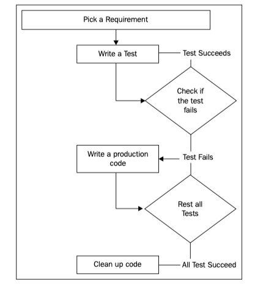

# 0201. Testing Concepts

There are a number of ways and methods to test software quality. TDD is focused on testing the small pieces of code using unit tests. Unit tests play a big and important role in TDD irrespective of the programming language. While learning TDD, it is essential to understand unit testing and testing frameworks. In the previous chapter, you learned about the life cycle of TDD. Now with examples, we will see how each step of the life cycle is executed. For this chapter, we will try to showcase examples using YUI (short for Yahoo User Interface) because of its simplicity and easy-tounderstand functions. 

In this chapter, you will learn about unit testing, a little about frameworks, how a test is written, actions, and assertions in unit tests. In this chapter, you will learn the following: 

• Unit testing 

• Following the process 

• Benefits and pitfalls 

## 2.1 Unit testing

Unit test is a function or method, which invokes a unit of module in software and checks assumptions about the system that the developer has in mind. Unit test helps the developer test the logical functionality of any module. In other words, a unit is the testable piece of software. It can have more than one input and normally a single output. Sometimes, we treat a module of a system as a unit. 

2『单元测试的定义做一张术语卡片。』——已完成

Unit test is only relevant to developers who are closely working with the code. A unit test is only applicable to test a logical piece of a code. Illogical code would not be tested with the use of unit testing. For example, getting and setting values in text field will not be considered in logical code. 

1『单元测试只针对「逻辑代码」。』

Usually, the first unit test is harder to write for any developer. The first test requires more time for any developer. We should follow a practice of asking questions before writing the initial unit test. For example, should you use an already available unit test framework or write you own custom code? What about an automated build process? How about collecting, displaying, and tracking unit test code coverage? Developers are already less motivated to write any unit tests, and having to deal with these questions only makes the process more painful. However, the good thing is that once you're familiar with unit testing and you are comfortable with TDD, it makes life so much easier than before. 

### 2.1.1 Unit testing frameworks 

Unit testing frameworks help developers write, run, and review unit tests. These frameworks are commonly named as xUnit frameworks and share a set of features across implementations. Many times it happens that the developer has unknowingly written few unit tests, but those are not in structured unit testing. Whenever we open developer/development tools in a browser (for example, firebug in Firefox, Safari's Inspector, or others) and open console to debug your code, you probably write few statements and inspect the results printed in the console. In many cases, this is a form of unit testing, but these are not automated tests and the developer will not be able to use them again and again. 

1『其实自己平时自己调试打印到 console 上也是一种单元测试，只是不是自动的而已。』

Usually, every developer has a practice to use some or the other framework when they use JavaScript in their system, likewise to write a unit test, we can use testing frameworks available in market. Testing frameworks provide a lot of the ready-made piece of code, that the developer does not need to recreate: test suite/case aggregation, assertions, mock/stub helpers, asynchronous testing implementation, and more. Plenty of good open source testing frameworks are available. We will use the YUI Test in this chapter, but of course all good practices are applicable across all frameworks—only the syntax (and maybe some semantics) differs. 

The most important step for any testing framework is collecting all the tests into suites and test cases. Test suites and test cases are part of many files; each test file typically contains tests for a single module. Normally, grouping all tests for a module in one test suite is considered as the best practice. The suite can contain many test cases; each test case includes testing of small aspects of any module. Using setUp and tearDown functions provided at the suite and test-case levels, you can easily handle any pretest setup and post-test teardown, such as resetting the state of a database. Sometimes, setUp and tearDown functions are referred to as follows: 

1. beforeEach(): This function runs before each test. 

2. afterEach(): This function runs after each test. 

3. before(): This function runs before all tests. Executes only once. 

4. after(): This function runs after all tests. Executes only once. 

setUp is usually called before running any test. When we want to run few statements before running test, we need to specify that in the setUp() method. For example, if we want to set some global variables, which is needed by test, then we can initialize those in the setUp() method. On the other hand, tearDown can be useful to clean up things after finishing your test, for example, if you want to reset a variable to some default value after test run is complete. We will understand this in more detail later on in this chapter. 

### 2.1.2 YUI Tests 

YUI stands for Yahoo! User Interface, which has a component YUI Test. It is a testing framework to unit test your JavaScript code. You will be learning more about how to use this library while practicing TDD life cycle in this chapter. This library is available at [Test - YUI Library](https://yuilibrary.com/yui/docs/test/). You can use YUI Test library using http://yui.yahooapis.com/3.18.1/build/yui/yui-min.js, which is a minified version of this library. 

3『[Quick Start · yui/yui3 Wiki](https://github.com/yui/yui3/wiki/Quick-Start)

#### 1.1 Copy and paste

```html
// Put the YUI seed file on your page.
<script src="http://yui.yahooapis.com/3.18.1/build/yui/yui-min.js"></script>
```

The YUI seed file is an ultra-small bit of JavaScript that enables you to load any YUI component on your page.

#### 1.2 Start using YUI!

```js
<script>
// Create a YUI sandbox on your page.
YUI().use('node', 'event', function (Y) {
    // The Node and Event modules are loaded and ready to use.
    // Your code goes here!
});
</script>
```

Create a YUI instance, called a "sandbox", to use any YUI component. Each YUI sandbox has its own instance of YUI (that's the Y parameter that gets passed to the callback function) and its own set of activated modules, so it won't conflict with other sandboxes on the same page. Any variables you declare inside your sandbox will only be available in that sandbox and won't pollute the global scope.

When creating your YUI sandbox, specify the modules you'd like to use. In this example, we're using the node and event modules. Then, from inside the sandbox, you can access the Node and Event APIs via the Y instance.

1『最常用的模块应该是 node 和 modules。』

YUI will manage all dependency calculations for the modules you need and load the JavaScript onto your page in a single, combined request. Your code inside the sandbox will execute as soon as all the requested YUI modules are loaded onto the page.

Learn more: See All YUI Components（[YUI User Guides](https://yuilibrary.com/yui/docs/guides/)）

1『本节里的 YUI Tests 只是众多 YUI Components 中的一个。』

#### 2.1 Work with the DOM

The Node component makes it quick and convenient to access, create, and manipulate DOM elements. Node APIs accept element references or selector queries for accessing DOM elements.

```js
YUI().use('node', function (Y) {
    // Access DOM nodes.
    var oneElementById     = Y.one('#foo'),
        oneElementByName   = Y.one('body'),
        allElementsByClass = Y.all('.bar');

    // Create DOM nodes.
    var contentNode = Y.Node.create('<div>'),
        listNode    = Y.Node.create('<ul>'),
        footerNode  = Y.Node.create('<footer>');

    contentNode.setHTML('<p>Node makes it easy to add content.</p>');
    listNode.insert('<li>Buy milk</li>');
    footerNode.prepend('<h2>Footer Content</h2>');

    // Manipulate DOM nodes.
    Y.all('.important').addClass('highlight');

    Y.one('#close-button').on('click', function () {
        contentNode.hide();
    });
});
```

Learn more: The Node Component（[Node - YUI Library](https://yuilibrary.com/yui/docs/node/)）

#### 3.1 Create UI Effects

The Transition component makes it easy to create CSS-based transitions that add polish and finesse to your user interactions.

```js
YUI().use('transition', function (Y) {
    // Fade away.
    Y.one('#fademe').transition({
        duration: 1, // seconds
        opacity : 0
    });

    // Shrink to nothing.
    Y.one('#shrinkme').transition({
        duration: 1, // seconds
        width   : 0,
        height  : 0
    });
});
```

Learn more: The Transition Component（[Transition - YUI Library](https://yuilibrary.com/yui/docs/transition/)）

#### 4.1 Load Content with Ajax

The Node.load() method (provided by the node-load module) makes it easy to populate your web page with dynamic content at runtime.

```js
YUI().use('node-load', function (Y) {
    // Replace the contents of the #content node with content.html.
    Y.one('#content').load('content.html');
});
```

』


### 2.1.3 Following the process

We have been talking about TDD and its life cycle in the last chapter. It's time to see it in action. In this section, we'll take a simple requirement and work on it to understand the life cycle. We will run the test in browser, see, and analyze the report. 

Let's take an example of a currency converter. This is a very simple business requirement where the converter will take a conversion rate and amount as input and return the converted amount. We will build this requirement step by step. Recalling the screenshot in Chapter 1, Overview of TDD, for TDD life cycle, is as follows: 



We will follow each life cycle step with an example to understand how tests are written and executed. 

### 2.1.4 Preparing the environment

There are a number of frameworks and tools that we can use to write a unit test. For now, we are using YUI as mentioned before. We will write a simple HTML file, which includes JavaScript from YUI. We are going to use CSS for our test runner using the style located at http://yui.yahooapis.com/2.9.0/build/logger/assets/skins/sam/logger.css and YUI Test library from http://yui.yahooapis.com/3.18.1/build/yui/yui-min.js. 

In general, you should always keep your business logic and tests in different files. For the sake of simplicity, we are keeping all code in one file for now. Let's take a very simple example of currency conversion. We will create a function which converts a given currency to another. 

A simple file with no tests in it will be as follows: 

```html
<!DOCTYPE html>
<html lang="en">
<head>
    <meta charset="UTF-8">
    <meta name="viewport" content="width=device-width, initial-scale=1.0">
    <title>Document</title>
    <link rel="stylesheet" type="text/css" 
    href="http://yui.yahooapis.com/2.9.0/build/logger/assets/skins/sam/logger.css"> 
    <script src="http://yui.yahooapis.com/3.18.1/build/yui/yui-min.js"></script>

    <script>
        function convertCurrency(amount, rateOfConversion) {
            // Business logic to convert currency
        }
        // Create a new YUI instance and populate it with the required modules.
        YUI().use('test-console', function (Y) {
            // Test is available and ready for use. Add implementation
            // code here.

            // in the container (div here) with id testLogs.
            new Y.Test.Console().render('#testLogs');

            // run the tests
            Y.Test.Runner.run();
        });
    </script>
</head>
<body class="yui3-skin-sam">
    <div id="testLogs"></div>
</body>
</html>
```

1『在项目「laravel-vue」里实现的，这种知其所以然，自我掌控的感觉真爽。（2020-06-15）』

Let's see what the code is doing. We used the YUI().use() function in which we are utilizing the test-console module of YUI. We used the new keyword to create a new console on div with ID testLog using new Y.Test.Console(). render('#testLogs'). After rendering the test console, we try to run the tests using Y.Test.Runner.run(). Let's run this code using test runner on the browser. We used Firefox for running the HTML file: 

The test console is now blank since there is no test written and run yet. The included JavaScript file will load the YUI library, which will enable us to write the test cases and run them. This library will help us to print the test results into the console. This log can be printed to the console of the browser or to the test console provided by YUI. The CSS file is for styling the test console, which we will see very soon after creating a test and running it. 

We have multiple options to display logs within the test console. We can opt to display different types of messages by selecting checkboxes. The types are info, pass, fail, and status. 

### 2.1.5 Following the life cycle

We have already picked our requirement that we are going to write a piece of code for currency conversion. Let's follow the life cycle by writing a test. 

#### 2.1.5.1 Writing a test 

We will name our function convertCurrency(). As of now, our function will not have an implementation. But our test will be present at this moment. Let's take an example of conversion. We will try to convert INR100 to USD. We are given that 1 USD = 63 INR. The result of conversion comes to 1.587. If we round it off to 2 decimal points, it's 1.59. Now we have all required input and desired output for a test. Let's write the test then. 

After writing a test, our \<script> tag will be as follows: 

```js
<script>
    // All our functions and tests go here
    function convertCurrency(amount, rateOfConversion) {
        // Business logic to convert currency
        let toCurrencyAmount = 0;
        return toCurrencyAmount;
    }
    // Create a new YUI instance and populate it with the required modules.
    YUI().use('test-console', function (Y) {
        // Test is available and ready for use. Add implementation
        // code here.
        let testCase = new Y.Test.Case({
            testCurrencyConversion: function() {
                let expectedResult = 1.59;
                let actualResult = convertCurrency(100, 1/63);
                Y.Assert.areEqual(expectedResult, actualResult, 
                '100 INR should be equal to $ 1.59');
            }
        });

        // in the container (div here) with id testLogs.
        new Y.Test.Console({
            newstOnTop: false,
            width: '800px',
            height: '600px',
        }).render('#testLogs');

        Y.Test.Runner.add(testCase);
        // run the tests
        Y.Test.Runner.run();
    });
</script>
```

As of now, we have a dummy implementation of the convertCurrency() function with two parameters, one is the amount to be converted and the other is the rate of conversion. We added a test using new Y.Test.Case(). We created a function named testCurrencyConversion and added a line with an assertion call to Y.Assert.areEqual(). This method takes an expected value, actual value, or expression that will evaluate the actual value and an optional message, which can be printed when this test fails. Assertions are used as a checkpoint in our code to verify the trueness of our code. Here, we are checking if the value returned by the convertCurrency() function is correct or not by matching the output to the given value. You will learn more about assertions later in this chapter. 

#### 2.1.5.2 Running the test and seeing if test fails 

Running this code will run our test and all messages will be put into the test console. If you note the preceding code, we used few properties while creating a test using new Y.Test.Console(). We used these to set the height and width of the test console. Let's run the file now: 

You can see from the result that the test failed. It shows the message we added. It also shows the expected value and actual value and their types. TestRunner created a number of messages, but for now, we see only info and fail messages. Let's select pass and status checkboxes as well and take a look at all the other messages: 

If you note the messages in the last run, you will see that TestRunner created a test suite for us and runs the test suite. Test suite is a collection of tests, which will run one by one when the test suite runs. You will learn more about test suites later in this chapter. 

#### 2.1.5.3 Writing a production code 

Now when we already have the test, we know what is required to pass the test—a logic to calculate the converted currency amount. Let's take a look at the following code: 

```js
<script>
    // All our functions and tests go here
    function convertCurrency(amount, rateOfConversion) {
        // Business logic to convert currency
        let toCurrencyAmount = 0;
        toCurrencyAmount = rateOfConversion * amount;
        toCurrencyAmount = Number.parseFloat(toCurrencyAmount).toFixed(2);
        return toCurrencyAmount;
    }
    // Create a new YUI instance and populate it with the required modules.
    YUI().use('test-console', function (Y) {
        // Test is available and ready for use. Add implementation
        // code here.
        let testCase = new Y.Test.Case({
            testCurrencyConversion: function() {
                let expectedResult = 1.59;
                let actualResult = convertCurrency(100, 1/63);
                Y.Assert.areEqual(expectedResult, actualResult, 
                '100 INR should be equal to $ 1.59');
            }
        });

        // in the container (div here) with id testLogs.
        new Y.Test.Console({
            newstOnTop: false,
            width: '800px',
            height: '600px',
        }).render('#testLogs');

        Y.Test.Runner.add(testCase);
        // run the tests
        Y.Test.Runner.run();
    });
</script>
```

We provided a simple implementation for our requirement—our production code. If we run this code using TestRunner on Firefox or Chrome, the test will pass. But IE does not support Number.parseFloat() and will fail the test. We need to check what should be the correct code for Internet Explorer. Let's correct the code to use global parseFloat() instead of Number.parseFloat(). 

```js
toCurrencyAmount = parseFloat(toCurrencyAmount).toFixed(2); 
```

Please note that we added filters for pass, fail as true for console. Now the console will show fail and pass messages by default, and we don't need to check fail and pass in the UI. 

#### 2.1.5.4 Running all tests 

Now that the implementation is done, let's run the tests again and look at what happens. Look at the following screenshot after running the tests: 

Our test is passed. At this point, we have only one test to run, but that is not the case while developing a project. There may be a good amount of tests already prepared. Our new implementation may cause failure of tests, which already passed. In this case, you will need to recheck your code and fix the implementation until all tests pass. This will ensure that our new implementation never breaks any code that is previously written and all tests passed for. 

#### 2.1.5.5 Cleaning up the code 

If all tests are passed in the previous step, we must clean and refactor the code. This is a very necessary step since there would be thousands of tests, if we don't clean up, we may end up with duplicate code, unnecessary variables, unnecessary statements, and code will never be optimized. Code comments or logs must be added for readability purpose. Believe it or not, code comments help a lot in understanding the code when you revisit the code after months. 

#### 2.1.5.6 Repeat
 
After cleaning up the code, we pick a requirement again and repeat the whole process and keep going. All this ensures that whatever you developed so far, works as expected. 

### 2.1.6 Using the browser console 

So far, you should have an understanding of how you can write a basic test and run it in the browser to see the logs in test console or browser's log console. There will be times when you won't be using test console to show your tests reports and you need to rely on browsers logs. In this case, simply remove the test console from the code and re-run the tests. Take a look at the following screenshot: 

1『

果然，去掉

```js
// new Y.Test.Console({
//     newstOnTop: false,
//     width: '800px',
//     height: '600px',
// }).render('#testLogs');
```

以及

```html
<body class="yui3-skin-sam">
    <!-- <div id="testLogs"></div> -->
</body
```

会在 console 里显示相关信息，但个人觉得不够清晰，还是原生的窗口舒服。
』

This is a console of Firebug plugin of the Firefox web browser. You would find similar logs in console of the Google Chrome web browser. To open the console in Chrome, press Ctrl + Shift + I in Microsoft Windows or command + option + I in Mac and look for the Console tab. 

### 2.1.7 setUp() and tearDown() 

When you need to set up some data before a test runs, you use the setUp() function. Likewise, to clear, delete, and terminate connections, which should happen at the end of the test, you use the tearDown() function. These functions may have different names in other testing frameworks/tools. Both of these methods are optional, and they will be used only when they are defined. 

An example may be to set some initial data and use the data in the test. Let's check out the following code, which showcases a very simple implementation of the setUp() and tearDown() functions: 

```js
<script>
    // All our functions and tests go here
    function convertCurrency(amount, rateOfConversion) {
        // Business logic to convert currency
        let toCurrencyAmount = 0;
        toCurrencyAmount = rateOfConversion * amount;
        toCurrencyAmount = Number.parseFloat(toCurrencyAmount).toFixed(2);
        return toCurrencyAmount;
    }
    // Create a new YUI instance and populate it with the required modules.
    YUI().use('test-console', function (Y) {
        // Test is available and ready for use. Add implementation
        // code here.
        let testCase = new Y.Test.Case({
            setUp: () => {
                this.expectedResult = 1.59;
            },
            tearDown: () => {
                delete this.expectedResult;
            },
            testCurrencyConversion: () => {
                Y.Assert.areEqual(expectedResult, convertCurrency(100, 1/63), 
                '100 INR should be equal to $ 1.59');
            }
        });

        // in the container (div here) with id testLogs.
        new Y.Test.Console({
            newstOnTop: false,
            width: '800px',
            height: '600px',
        }).render('#testLogs');

        Y.Test.Runner.add(testCase);
        // run the tests
        Y.Test.Runner.run();
    });
</script>
```

We created a data object, which holds an array in setUp() and deletes the object in tearDown() to free up memory used. Please note that setUp() and tearDown() are for data manipulation, and actions or assertions should not be used in these functions. Actual implementations and usage would be more complex, but follow the same process. We created an array, but any kind of value can be assigned as per the requirements. 

### 2.1.8 Test suites
 
For a project, there would be a number of tests and most of them can be classified in some ways. For example, if a shopping cart is built, there can be tests related to listing of items, items in cart, payments, and so on. In this case, test suites help to organize the tests in groups. 

We can use Y.Test.Suite() constructor to create a test suite. We can, later, add test cases to the suite and run the suite using Y.Test.Runner.add(suite) just like we used to run test cases. Take a look at the following code: 

We created a suite named TestSuite1 in the preceding code and added testCase to the suite using the suite.add() function call. The name TestSuite1 is for logging purpose and helps us identify which test suite is running. 

You can download the example code files from your account at http://www.packtpub.com for all the Packt Publishing books you have purchased. If you purchased this book elsewhere, you can visit http://www.packtpub.com/support and register to have the files e-mailed directly to you. 

### 2.1.9 Actions and assertions

So far, we have seen very simple tests where only one type of assertion was used. In fact, there are a number of ways you can validate the data. Not only validate the data, but also perform some actions. You will learn about assertions and actions one by one in this section. 

#### 2.1.9.1 Actions 

TDD talks about automated testing, and when it comes to JavaScript, we often need to mock user-driven events. These events can be mouse movements, clicks, submitting a form, and so on. While testing, our code depends on other objects, modules, functions, or actions to be performed. It's not always possible or easy to make an actual call to the function. A mock can be used for this purpose. It will imitate the behavior of a real function being mocked. 

With YUI, we use a node-event-simulate module to simulate native events that behave similar to user generated events. Each framework may define events in its own way, but we are going to see some common scenarios with simple examples in this section: 

1. Mouse events: These events are what users can do with a mouse. There are in total seven events—click, double click, mouse up, mouse down, mouse over, mouse out, and mouse move. 

2. Key events: There are three events—key up, key down, and key press. 

3. UI events: UI events are events which help us change the UI using select, change, blur, focus, scroll, and resize. 

4. Touch gestures: Mobile-first sites are emerging a lot and it is essential to create a mobile site to be on the edge. JavaScript testing frameworks support gesture events testing as well. There are mainly two categories of gestures—single-touch and multi-touch gestures. While there can be a number of gestures, here is the list supported by YUI: single touch/tap, double tap, press, move, flick, two finger gestures—pinch and rotate. 

Let's look at the following example. This example showcases a click event on a button, which adds a class clicked to the button and also renders test console: 

```html
// 暂时忽略
```

In the code, we have an object named controller, which has a handleClick function. This function first renders test console and then adds a class clicked to the caller, which is a button in this case. We have given the showLog class already to the button. We have also given a name to the test; this will help us identify which test case passed or fail. It's always a good practice to give the test case a readable name. 

In setUp(), we bind the click event on the button using this class as selector. We are using the simulate() function to generate a click event which calls handleClick. In case there was an error creating a test console, the button will not have class clicked assigned, and the assertion in next line will fail. Let's run the preceding code: 

As we can see, the test passed. Class clicked was assigned to button and output of assertion was true. This is how a click event can be generated. Similarly, other events can be generated. 

#### 2.1.9.2 Assertions 

Assertions are the key to perform unit tests and validate expression, function, value, state of an object, and so on. A good testing framework has a rich setup assertions. YUI Test has divided assertions into categories. These categories are: 

1.Equity assertions: These are the simplest assertions, which have only two functions areEqual() and areNotEqual(). Both of these accept three parameters—expected value, actual value, and one optional parameter—error message. The last parameter is used when assertion fails. These assertions use the double equal operator (==) to compare and determine if two values are equal: 

```js
Y.Assert.areEqual(2, 2); // Pass 
Y.Assert.areEqual(3, "3", "3 was expected"); // Pass 
Y.Assert.areNotEqual(2, 4); // Pass 
Y.Assert.areEqual(5, 7, "Five was expected."); // Fail 
```

2.Sameness assertions: There are two assertions in this category: areSame() and areNotSame(). Similar to equity assertions, these also accept three parameters: expected value, actual value, and one optional parameter—error message. Unlike equity assertions, these functions use triple equals operator (===) to determine if values and types of two parameters are similar or not: 

```js
Y.Assert.areSame(2, 2); // Pass 
Y.Assert.areNotSame(3, "3", "3 was expected"); // Fail 
```

3.Data type assertions: These assertions are useful when you want to check the data type of something before you move to the next step. The data type can be anything such as array, function, Boolean, number, string, and so on. The following are the assertions in this category: isArray(), isBoolean(), isFunction(), isNumber(), isString(), and isObject(). Each of these takes two parameters—the actual value and optional error message. 

```js
Y.Assert.isString("Test Driven Development Rocks!"); //Pass 
Y.Assert.isNumber(23); //Pass 
Y.Assert.isArray([]); //Pass 
Y.Assert.isObject([]); //Pass 
Y.Assert.isFunction(function(){}); //Pass 
Y.Assert.isBoolean(true); //Pass 
Y.Assert.isObject(function(){}); //Pass 
```

There are two additional assertions in this category for generic purpose, which takes three parameters: expected value, actual value, optional error message. These are isTypeOf() and isInstanceOf(): 

```js
Y.Assert.isTypeOf("string", "TDD Rocks"); //Pass 
Y.Assert.isTypeOf("number", 23); //Pass 
Y.Assert.isTypeOf("boolean", false); //Pass 
Y.Assert.isTypeOf("object", {}); // Pass 
```

4.Special value assertions: Apart from number, strings, Boolean, there are other value types that also exist in JavaScript. To check those types, there are several assertions available: isFalse(), isTrue(), isNaN(), isNotNaN(), isNull(), isNotNull(), isUndefined(), and isNotUndefined(). These functions take two parameters: the actual value and optional error message: 

```js
Y.Assert.isFalse(false); //Pass 
Y.Assert.isTrue(true); //Pass 
Y.Assert.isNaN(NaN); //Pass 
Y.Assert.isNotNaN(23); //Pass 
Y.Assert.isNull(null); //Pass 
Y.Assert.isNotNull(undefined); //Pass 
Y.Assert.isUndefined(undefined); //Pass 
Y.Assert.isNotUndefined(null); //Pass 
```

5.Forced failures: There are times when you need to create your own assertions or you want an assertion to fail intentionally. In this case, you can use the fail() assertion. This assertion takes one optional parameter as an error message: 

```js
Y.Assert.fail(); // The test will fail here. 
Y.Assert.fail("This test should fail."); 
```

Similar to YUI, other frameworks do have assertions. Their naming standards may be different, but almost all these assertions are present in major testing frameworks. 

## 2.2 Benefits and pitfalls 

We have seen how easy it is to create test cases, run them, and analyze the report. Every framework has some benefits and pitfalls. In this section, we will look at some generic benefits and pitfalls. 

### 2.2.1 Benefits of unit testing 

The following are a few benefits of using unit testing for our projects: 

1. Quickly making big changes: We can make big changes easily if we have included unit tests in system. As we know, it works properly because we have run the tests, we simply need to make sure that its working now by just running test again. 

2. Boost your confidence: Unit testing helps you to boost up your confidence about requirements completion. It helps you to make a decision about when you can stop coding. Tests give you confidence that you have performed enough coding for one requirement and now we can move to other requirements. If unit tests are written properly and run every time when we carry out minor changes, then we can easily catch any bugs introduced due to change. 

3. Helps to understand system design: Unit tests help you to understand system design and code written by developers. Instead of spending time to understand code, you can focus on outlining conditions and boundaries for the code and output that we expect from that. Good unit tests can help document and define what something is supposed to do. 

4. Green lighting development: When we see green light at a traffic signal, the same feeling we get once we see successful output from any unit test. Likewise, we can even get the point from where we left by seeing the next red signal on the way which needs fixing. This way, we can easily get feedback for our code and visual effect for the same. 

5. Faster development: Some people have a belief that writing unit tests double the effort to complete any development or take more time to complete any module, but unlikely that belief is not right. Writing unit test is relatively less tough and takes less effort and save more time in completing the development for any system. One can realize this by including unit test in their system. 

6. Easy debugging: Let's say we wrote some code, there are some errors reported and we need to fix them. We will check in my browser for the issue, using a developer tool like Firebug. We will try to check for JavaScript errors via console log. After understanding the issue, we will make some changes, go back to browser, reload the page, and check if the error still exists. We would even need to make some changes to DOM via command line or debug via script tab. But if we had unit tests, we would have run the tests and see all the issues at once. One more advantage can be considered in case of unit test is whenever any test fails; only latest changes need to be checked/debugged. We don't need to check the whole module again. 

7. Reusable code: In order to write unit test for any system, we need to make code modular. This simply means that we can easily reuse and understand that code in near future. This way, we increase production of reusable code in the system. 

8. Saving cost: By writing a unit test, we will save cost for any system as we will find more defects in the development phase in comparison to acceptance testing phase or go live phase. That way we are saving time, effort, and cost. 

### 2.2.2 Pitfalls of unit testing 

We have seen different benefits of unit testing; now let's see what kind of pitfalls can occur during unit testing implementation: 

1. Wrong assumptions for unit testing: Unit testing is not a tool, it's a methodology or technique. We need a set of acquired skills to understand that methodology. Sometimes, we do correct coding, but with wrong assumptions and it can happen that we end up writing wrong unit test. This can happen to anybody. It needs proper training and experience. Before writing any unit test, it is necessary that we understand the method of writing unit test. Only then we implement that in our system. 

2. Not suitable when under tight deadlines: Many times it happens that deadlines for development are very tight or strict. In that case, it will be difficult for any developer to allot proper time for writing unit test. It is normally the job of the whole organization to understand the importance of unit test and give proper timing to develop good quality unit test. 

## Summary 

So far, we have seen how to write simple unit tests, advance them using some actions and assertions. This chapter showcased tests, actions, and assertions using YUI. YUI is used to give an idea of how all this happens and works together through the TDD life cycle. Then you learned about some benefits and pitfalls. 

In the next chapter, you will learn about popular JavaScript tools and frameworks. YUI was a browser-based testing framework, but later we will also check tools, which don't need you to run test cases in the browser. 
