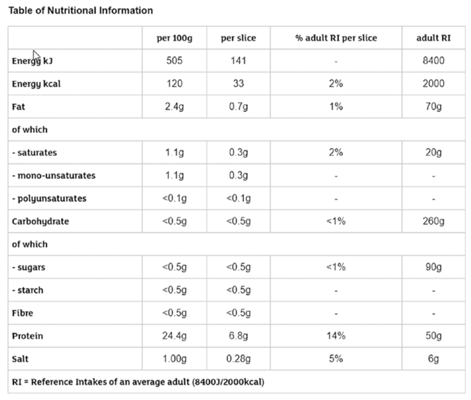

# 03 Using Beautiful Soup

In this chapter, you will learn how to use Beautiful Soup, a lightweight Python library, to extract and navigate HTML content easily and forget overly complex regular expressions and text parsing.

Before I let you jump right into coding, I will tell you some things about this tool to familiarize yourself with it.

Feel free to jump to the next section if you are not in the mood for reading dry introductory text or basic tutorials; and if you don’t understand something in my later approach or the code, come back here.

I find Beautiful Soup easy to use, and it is a perfect tool for handling HTML DOM elements: you can navigate, search, and even modify a document with this tool. It has a superb user experience, as you will see in the first section of this chapter.

## 01. Installing Beautiful Soup

Even though we both know you can install modules into your Python environment, for the sake of completeness let me (as always in this book) add a subsection for this trivial but mandatory task.

    pip install beautifulsoup4

The number 4 is crucial because I developed and tested the examples in this book with version 4.6.0.

## 02. Simple Examples

After a lengthy introduction, it is time to start coding now, with simple examples to familiarize yourself with Beautiful Soup and try out some basic features without creating a complex scraper.

These examples will show the building blocks of Beautiful Soup and how to use them if needed.

You won’t scrape an existing site, but instead will use HTML text prepared for each use case.

For these examples, I assume you’ve already entered from bs4 import BeautifulSoup into your Python script or interactive command line, so you have Beautiful Soup ready to use.

### 1. Parsing HTML Text

The very basic usage of Beautiful Soup, which you will see in every tutorial, is parsing and extracting information from an HTML string.

This is the basic step, because when you download a website, you send its content to Beautiful Soup to parse, but there is nothing to see if you pass a variable to the parser.

You will work most of the time with the following multiline string:

```
example_html = """ 
<html> 
<head>
<title>Your Title Here</title> 
</head>
<body bgcolor="#ffffff">
<center>

</center> 
<hr/>
<a href="http://somegreatsite.com">Link Name</a> is a link to another nifty site 
<h1>This is a Header</h1> 
<h2>This is a Medium Header</h2>
Send me mail at <a href="mailto:support@yourcompany.com">support@yourcompany.com</a>.
<p>This is a paragraph!</p> 
<p> 
<b>This is a new paragraph!</b><br/> 
<b><i>This is a new sentence without a paragraph break, in bold italics.</i></b> 
<a>This is an empty anchor</a> 
</p> 
<hr/> 
</body> 
</html> 
"""
```

To create a parse tree with Beautiful Soup, just write the following code:

    soup = BeautifulSoup(example_html, 'html.parser')

The second argument to the function call defines which parser to use. If you don’t provide any parser, you will get an error message like this:

UserWarning: No parser was explicitly specified, so I'm using the best available HTML parser for this system ("html.parser"). This usually isn't a problem, but if you run this code on another system, or in a different virtual environment, it may use a different parser and behave differently.

The code that caused this warning is on line 1 of the file \<stdin>. To get rid of this warning, change code that looks like this:

BeautifulSoup(YOUR_MARKUP)

to this:

BeautifulSoup(YOUR_MARKUP, "html.parser")

This warning is well defined and tells you everything you need to know. Because you can use different parsers with Beautiful Soup (see later in this chapter), you cannot assume it will always use the same parser; if a better one is installed, it will use that. Moreover, this can lead to unexpected behavior, for example, your script slows down.

Now you can use the soup variable to navigate through the HTML.

### 2. Parsing Remote HTML

Beautiful Soup is not an HTTP client, so you cannot send URLs to it to do extraction. You can try it out.

soup = BeautifulSoup('http://hajba.hu', 'html.parser')

The preceding code results in a warning message like this one:

UserWarning: "http://hajba.hu" looks like a URL. Beautiful Soup is not an HTTP client. You should probably use an HTTP client like requests to get the document behind the URL, and feed that document to Beautiful Soup.

To convert remote HTML pages into a soup, you should use the requests library.

soup = BeautifulSoup(requests.get('http://hajba.hu').text, 'html.parser')

### 3. Parsing a File

The third option to parse content is to read a file. You don’t have to read the whole file; it is enough for Beautiful Soup if you provide an open file handle to its constructor and it does the rest.

```
with open('example.html') as infile:
    soup = BeautifulSoup(infile , 'html.parser')
```

### 4. Difference Between find and find_all

You will use two methods excessively with Beautiful Soup: find and find_all.

The difference between these two lies in their function and return type: find returns only one—if multiple nodes match the criteria, the first is returned; None, if nothing is found. find_all returns all results matching the provided arguments as a list; this list can be empty.

This means, every time you search for a tag with a certain id, you can use find because you can assume that an id is used only once in a page. Alternatively, if you are looking for the first occurrence of a tag, then you can use find too. If you are unsure, use find_all and iterate through the results.

### 5. Extracting All Links

The core function of a scraper is to extract links from the website that lead to other pages or other websites.

Links are in anchor tags (\<a>), and where they point to is in the href attribute of these anchors. To find all anchor tags that have an href attribute, you can use following code:

```
links = soup.find_all('a', href=True) 
for link in links:
    print(link['href'])
```

Running this code against the previously introduced HTML, you get the following result:

http://somegreatsite.com 
mailto:support@yourcompany.com

The find_all method call includes the href=True argument. This tells Beautiful Soup to return only those anchor tags that have an href attribute. This gives you the freedom to access this attribute on resulting links without checking their existence.

To verify this, try running the preceding code, but remove the href=True argument from the function call. It results in an exception because the empty anchor doesn’t have an href attribute.

You can add any attribute to the find_all method, and you can search for tags where the attribute is not present too.

### 6. Extracting All Images

The second biggest use case for scrapers is to extract images from websites and download them or just store their information, like where they are located, their display size, alternative text, and much more.

Like the link extractor, here you can use the find_all method of the soup, and specify filter tags.

    images = soup.find_all('img', src=True) 

Looking for a present src attribute helps to find images that have something to display. Naturally, sometimes the source attribute is added through JavaScript, and you must do some reverse engineering — but this is not the subject of this chapter.

### 7. Finding Tags Through Their Attributes

Sometimes you must find tags based on their attributes. For example, we identified HTML blocks for the requirements in the previous chapter through their class attribute.

The previous sections have shown you how to find tags where an attribute is present. Now it’s time to find tags whose attributes have certain values.

Two use cases dominate this topic: searching by id or class attributes.

```
soup.find('p', id='first') 
soup.find_all('p', class_='paragraph')
```

You can use any attribute in the find and find_all methods. The only exception is class because it is a keyword in Python. However, as you can see, you can use class_ instead.

This means you can search for images, where the source is clouds.jpg.

    soup.find('img', src='clouds.jpg')

You can use regular expressions too to find tags that are of a specific type, and their attributes qualify them through some condition. For example, all image tags that display GIF files.

    soup.find('img', src=re.compile('\.gif$'))

Moreover, the text of a tag is one of its attributes too. This means you can search for tags that contain a specific text (or just a fragment of a text).

```
soup.find_all('p', text='paragraph') 
soup.find_all('p', text=re.compile('paragraph'))
```

The difference between the two preceding examples is their result. Because in the example HTML there is no paragraph that contains only the text “paragraph”, an empty list is returned. The second method call returns a list of paragraph tags that contain the word “paragraph.”

### 8. Finding Multiple Tags Based on Property

Previously, you have seen how to find one kind of tag (\<p>, \) based on its properties.

However, Beautiful Soup offers you other options too: for example, you can find multiple tags that share the same criteria. Look at the next example:

```
for tag in soup.find_all(re.compile('h')):
    print(tag.name)
```

Here, you search for all tags that start with an h. The result would be something like this.

html head hr h1 h2 hr

Another example would be to find all tags that contain the text “paragraph.”

    soup.find_all(True, text=re.compile('paragraph'))

Here you use the True keyword to match all tags. If you don’t provide an attribute to narrow the search, you will get back a list of all tags in the HTML document.

### 9. Changing Content

I rarely use this function of Beautiful Soup, but valid use cases exist. Therefore I think you should learn about how to change the contents of a soup. Moreover, because I don’t use this function a lot, this section is skinny and won’t go into deep details.

#### 01. Adding Tags and Attributes

Adding tags to the HTML is easy, though it is seldom used. If you add a tag, you must take care where and how you do it. You can use two methods: insert and append. Both work on a tag of the soup.

insert requires a position where to insert the new tag, and the new tag itself.

append requires only the new tag to append the new tag to the parent tag’s end on which the method is called.

Because the soup itself is a tag, you can use these methods on it too, but you must take care. For example, try out the following code:

```
h2 = soup.new_tag('h2') 
h2.string = 'This is a second-level header' 
soup.insert(0, h2)
```

Here you want to insert the new tag, h2, into the soup at first place. This results in the following code (I omitted most of the HTML):

    <h2>This is a second-level header</h2><html>

Alternatively, you can change the 0 to a 1, to insert the new tag at the second position. In this case, your tag is inserted at the end of the HTML, after the \</html> tag.

    soup.insert(1, h2)

This results in

    </html><h2>This is a second-level header</h2>

For the two methods just shown, there are convenience methods too: insert_before, insert_after.

The append method appends the new tag at the end of the tag. This means it behaves like the insert_after method.

    soup.append(soup.new_tag('p'))

The preceding code results in the following:

    </html><p></p>

The only difference is that the insert_after method is not implemented on soup objects, just on tags.

Anyway, with these methods you must pay attention where you insert or append new tags into the document.

Adding attributes to the tags is easy. Because tags behave like dictionaries, you can add new attributes the way you add keys and values to dictionaries.

    soup.head['style'] = 'bold'

Even though the preceding code doesn’t affect the rendered output, it added the new attribute to the head tag.

    <head style="bold">

#### 02. Changing Tags and Attributes

Sometimes you don’t want to add new tags but want to change existing content. For example, you want to change the contents of paragraphs to be bold.

```
for p in soup.find_all('p', text=True):
    p.string.wrap(soup.new_tag('b'))
```

If you would like to change the contents of a tag that contains some formatting (like bold or italic tags), but you want to retain the contents, you can use the unwrap function.

```
soup = BeautifulSoup('<p> This is a <b>new</b> paragraph!</p>') 
p = soup.p.b.unwrap() 
print(soup.p)
```

Another example would be to change the id or the class of a tag. This works the same way as with adding new attributes: you can get the tag from the soup, and change the dictionary values.

```
for t in soup.findAll(True, id=True):
    t['class'] = 'withid' 
    print(t)
```

The preceding example changes (or adds) the class withid to all tags that have an id attribute.

#### 03. Deleting Tags and Attributes

If you want to delete a tag, you can use either extract() or decompose() on the tag.

extract() removes the tag from the tree and returns it, so you can use it in the future or add it to the HTML content at a different position.

decompose() deletes the selected tag permanently. No return values, no later usage; it is gone forever.

```
print(soup.title.extract()) 
print(soup.head)
```

Running the preceding code example with the example HTML of this section results in the following lines:

```
<title>Your Title Here</title> 
<head>
</head>
```

Alternatively, you can change extract() to decompose().

```
print(soup.title.decompose()) 
print(soup.head)
```

Here, the result changes only in the first line where you don’t get back anything.

```
None <head>

</head>
```

Deletion doesn’t only work for tags; you can remove attributes of tags too.

Imagine, you have tags that have an attribute called display, and you want to remove this display attribute from each tag. You can do it the following way:

```
for tag in soup.find_all(True, display=True):
    del tag['display']
```

If you now count the occurrences of tags having a display attribute, you will get 0.

    print(len(soup.find_all(True, display=True)))

### 10. Finding Comments

Sometimes you need to find comments in HTML code to reverse-engineer JavaScript calls, because sometimes the content of a website is delivered in a comment and JavaScript renders it properly.

```
for comment in soup.find_all(text=lambda text:isinstance (text, Comment)):
    print(comment)
```

The preceding code finds and prints contents of all comments. To make it work, you need to import Comments from the bs4 package too.

### 11. Converting a Soup to HTML Text

This is one of the easiest parts for Beautiful Soup because as you may know from your Python studies, everything is an object in Python, and objects have a method \__str__ that returns the string representation of this object.

Instead of writing something like soup.__str__() every time, this method is called every time you convert the object to a string — for example when you print it to the console: print(soup).

However, this results in the same string representation as you provided in the HTML content. Moreover, you know, you can do better and provide a formatted string.

That’s why Beautiful Soup has the prettify method. Per default, this method prints the pretty formatted version of the selected tag-tree. Yes, this means you can prettify your whole soup or just a selected subset of the HTML content.

    print(soup.find('p').prettify())

This call results in (soup was created using the HTML from the beginning of this section)

```
<p> 
This is a new paragraph! 
</p>
```

## 03. Extracting the Required Information

Now it is time to prepare your fingers and keyboard because you are about to create your first dedicated scraper, which will extract the required information, introduced in Chapter 2, from the Sainsbury’s website.

All the source code shown in this chapter can be found in the file called bs_scraper.py in the source codes of this book.

However, I suggest, you start by trying to implement each functionality yourself with the tools and knowledge learned from this book already.

I promise, it is not hard — and if your solution differs a bit from mine, don’t worry. This is coding; every one of us has his/her style and approach. What matters is the result in the end.

### 1. Identifying, Extracting, and Calling the Target URLs

The first step in creating the scraper is to identify the links that lead us to product pages. In Chapter 2 we used Chrome’s DevTools to find the corresponding links and their locations.

Those links are in an unordered list (\<ul>), which has the class categories departments. You can extract them from the page with following code:

```
links = []
ul = soup.find('ul', class_='categories departments')
if ul:
    for li in ul.find_all('li'):
        a = li.find('a',href=True)
        if a:
            links.append(a['href'])
```

You now have the links that lead to pages listing products, each showing 36 at most.

However, some of these links lead to other groupings, which can lead to a third layer of grouping before you reach the product pages, just as you can see in Figure 3-1.

Figure 3-1. Three layers of navigation

The navigation goes from “Chicken & turkey” to “Sauces, marinades & Yorkshire puddings,” which leads to the third layer of links.

Therefore, your script should be able to navigate such chains too and get to the product listings.

```
product_pages = []
visited = set()
queue = deque()
queue.extend(department_links)
while queue:
    link = queue.popleft()
    if link in visited:
        continue
    visited.add(link)
    soup = get_page(link)
    ul = soup.find('ul', class_='produtlister gridView')
    if ul:
        product_pages.append(link)
    else:
        ul = soup.find('ul', class_='categories aisles')
        if not ul:
            continue
        for li in ul.find_all('li'):
            a = li.find('a', href=True)
            if a:
                queue.append(a['href'])
```

The preceding code uses the simple Breadth First Search (BFS) from the previous chapter to navigate through all the URLs until it finds the product lists. You can change the algorithm to Depth First Search(DFS); this results in a logically cleaner solution because if your code finds a URL that points to a navigation layer, it digs deeper until it finds all the pages.

The code looks first for shelves (categories shelf), which are the last layer of navigation prior to extracting categories aisles. This is because if it would extract aisles first and because all those URLs are already visited, the shelves and their content will be missing.

1『网站最新的布局里没有「categories shelf」层了，所以调整了作者的代码。』

### 2. Navigating the Product Pages

In Chapter 2 you have seen that products can be listed on multiple pages. To gather information about every product, you need to navigate between these pages.

If you are lazy like me, you might come up with the idea to use the filter and set the product count to 108 per page, just like in Figure 3-2.

Figure 3-2. Filter set to show 108 results

Even though this is a good idea, it can happen that a category holds at least 109 products — and in this case, you need to navigate your script.

```
product_pages = []
visited = set()
queue = deque()
queue.extend(department_links)
while queue:
    link = queue.popleft()
    if link in visited:
        continue
    visited.add(link)
    soup = get_page(link)
    ul = soup.find('ul', class_='produtlister gridView')
    if ul:
        product_pages.append(link)
    else:
        ul = soup.find('ul', class_='categories aisles')
        if not ul:
            continue
        for li in ul.find_all('li'):
            a = li.find('a', href=True)
            if a:
                queue.append(a['href'])
```

The preceding code block navigates through all the product lists and adds the URLs of the product sites to the list of products.

I used a BFS again, and a DFS would be OK too. The interesting thing is the handling of the next pages: you don’t search for the numbering of the navigation but consecutively for the link pointing to the next page. This is useful for bigger sites, where you have umpteen-thousand pages. They won’t be listed on the first site.1 

1 Unless you are lucky. Once I encountered a site where all the links to the remaining pages were there in the HTML code but had been hidden with some JS-magic.

### 3. Extracting the Information

You arrived at the product page. Now it is time to extract all the information required.

Because you already identified and noted the locations in Chapter 2, it will be a simple task to wire everything together.

Depending on your preferences, you can use dictionaries, named tuples, or classes to store information on a product. Here, you will create code using dictionaries and classes.

#### 01. Using Dictionaries

The first solution you create will store the extracted information of products in dictionaries.

The keys in the dictionary will be the fields’ names (which will be later used as a header in a CSV [Comma Separated Value], for example), the value the extracted information.

Because each product you extract has a URL, you can initialize the dictionary for a product as follows:

    product = {'url': url}

I could list here how to extract all the information required, but I will only list the tricky parts. The other building blocks you should figure out yourself, as an exercise.

You can take a break, put down the book and try to implement the extractor. if you struggle with nutrition information or product origin, you will find help below. if you are lazy, you can go ahead and find my whole solution later in this section or look at the source code provided for this book.

For me, the most interesting and lazy part is the extraction of the nutrition information table. It is a lazy solution because I used the table row headings as keys in the dictionary to store the values. They match the requirements, and therefore there is no need to add custom code that reads the table headers and decides which value to use.

```
table = soup.find('table', class_='nutritionTable') 
if table:
    rows = table.findAll('tr') 
    for tr in rows[1:]:
        th = tr.find('th', class_='rowHeader')
        td = tr.find('td') 
        if not th:
            product['Energy kcal'] = td.text 
        else:
            product[th.text] = td.text
```

Extracting the product’s origin was the most complicated part, at least in my eyes. Here you needed to find a header (\<h3>) that contains a specific text and then its sibling. This sibling holds all the text but in a sheer format, which you need to make readable.

```
product_origin_header = soup.find('h3', class_='productDataItemHeader', text='Country of Origin')
if product_origin_header:
    product_text = product_origin_header.find_next_sibling ('div', class_='productText') 
    if product_text:
        origin_info = [] 
        for p in product_text.find_all('p'):
            origin_info.append(p.text.strip()) 
    product['Country of Origin'] = '; '.join (origin_info)
```

After implementing a solution, I hope you’ve got something similar to the following code:

```
# Extracting product information into dictionaries 

product_information = [] 
visited = set() 
for url in product_urls:
    if url in visited:
        continue 
    visited.add(url) 
    product = {'url': url} 
    soup = get_page(url) 
    if not soup:
        continue # something went wrong with the download 
    h1 = soup.find('h1') 
    if h1:
        product['name'] = h1.text.strip()
    pricing = soup.find('div', class_='pricing') 
    if pricing:
        p = pricing.find('p', class_='pricePerUnit')
        unit = pricing.find('span', class_='pricePerUnitUnit') 
        if p:
            product['price'] = p.text.strip()
            if unit:
                product['unit'] = unit.text.strip()
        label = soup.find('label', class_='numberOfReviews') 
        if label:
            img = label.find('img', alt=True) 
            if img:
                product['rating'] = img['alt'].strip() 
            reviews = reviews_pattern.findall(label.text.strip()) 
            if reviews:
                product['reviews'] = reviews[0]
        item_code = soup.find('p', class_='itemCode') if item_code:
item_codes = item_code_pattern.findall(item_code.text. strip()) if item_codes:
product['itemCode'] = item_codes[0]
table = soup.find('table', class_='nutritionTable') if table:
rows = table.findAll('tr') for tr in rows[1:]:
th = tr.find('th', class_='rowHeader')
td = tr.find('td') if not th:
product['Energy kcal'] = td.text else:
product[th.text] = td.text
product_origin_header = soup.find('h3', class_='productDataItemHeader', text='Country of Origin') if product_origin_header:
product_text = product_origin_header.find_next_ sibling('div', class_='productText')
if product_text:
origin_info = [] for p in product_text.find_all('p'):
origin_info.append(p.text.strip()) product['Country of Origin'] = '; '.join(origin_info)
product_information.append(product)
```

As you can see in the preceding code, this is the biggest part of the scraper. But hey! You finished your very first scraper, which extracts meaningful information from a real website.

What you have probably noticed is the caution implemented in the code: every HTML tag is verified. If it does not exist, no processing happens; it would be a disaster and the application would crash.

The regular expressions to extract item codes and review counts is again a lazy way. Even though I am not a regex guru, I can create some simple patterns and use them for my purposes.

```
reviews_pattern = re.compile("Reviews \((\d+)\)") 
item_code_pattern = re.compile("Item code: (\d+)")
```

#### 02. Using Classes

You can implement the class-based solution similarly to the dictionarybased one. The only difference is in the planning phase: while using a dictionary you don’t have to plan much ahead, but with classes, you need to define the class model.

For my solution, I used a simple, pragmatic approach and created two classes: one holds the basic information; the second is a key-value pair for nutrition details.

I don’t plan to go deep into OOP 2 concepts. If you want to learn more, you can refer to different Python books.

As you already know, filling these objects is different too. There are different options for how to solve such a problem, 3 but I used a lazy version where I access and set every field directly.

2 OOP: object-oriented programming

3 For example, the Builder or Factory patterns, a constructor with all arguments.

### 4. Unforeseen Changes

While implementing the source code yourself, you may have found some problems and needed to react.

One of such changes could be the nutrition table. Even though we scrape one website, the rendering is not the same for all pages. Sometimes they display different elements or different styles. Moreover, sometimes the nutrition table contains different values than in the requirements, just like in Figures 3-3 and 3-4.


Figure 3-3. A different kind of nutrition table



Figure 3-4. A third type of nutrition table

What to do in such cases? Well, first, mention to your customer (if you have any) that you’ve found tables that contain nutrition information but in different details and format. Then think out a solution that is good for the outcome, and you don’t have to create extra errands in your code to let it happen.

In my case, I went with the easiest solution and exported all I could from those tables. This means my results have fields that are not in the requirements and some can be missing, like Total sugars. Moreover, because the sublist of fats and carbohydrates has awkward dashes before each entry, or there are rows that contain only the text “of which,” I adjusted the preceding code a bit to handle these cases.

```
table = soup.find('table', class_='nutritionTable') 
if table:
    rows = table.findAll('tr') 
    for tr in rows[1:]:
        th = tr.find('th', class_='rowHeader')
        td = tr.find('td') 
        if not td:
            continue 
        if not th:
            product['Energy kcal'] = td.text 
        else:
            product[th.text.replace('-', ").strip()] = td.text
```

The exceptional case of Energy and Energy kcal (if not th) in the preceding code is fixed automatically in tables, which provide labels for every row.

such changes are inevitable. even though you get requirements and prepare your scraping process, exceptions in the pages can occur. therefore, always be prepared and write code that can handle the unexpected, and you don’t have to redo all the work. You can read more about how i deal with such thing later in this chapter.

## 04. Exporting the Data

Now that all information is gathered, we want to store it somewhere because keeping it in memory does not have much use for our customer.

In this section, you will see basic approaches to how you can save your information into a CSV or JSON file, or into a relational database, which will be SQLite.

Each subsection will create code for the following export objects: classes and dictionaries.

### 1. To CSV

A good old friend to store data is CSV. Python provides built-in functionality to export your information into this file type.

Because you implemented two solutions in the previous section, you will now create exports for both. But don’t worry; you will keep both solutions simple.

The common part is the csv module of Python. It is integrated and has everything you need.

#### 01. Quick Glance at the csv Module

Here you get a quick introduction into the csv module of the Python standard library. If you need more information or reference, you can read it online.4 

I will focus on writing CSV files in this section; here I present the basics to give you a smooth landing on the examples where you write the exported information into CSV files.

for the code examples, i assume you did import csv.

Writing CSV files is easy: if you know how to write files, you are almost done. You must open a file-handle and create a CSV writer.

```
with open('result.csv', 'w') as outfile: 
    spamwriter = csv.writer(outfile)
```

The preceding code example is the simplest example I can come up with. However, there are a lot more options to configure, which sometimes will be important for you.

1. dialect: With the dialect parameter, you can specify formatting attributes grouped together to represent a common formatting. Such dialects are excel (the default dialect), excel_tab, or unix_dialect. You can define your own dialects too.

2. delimiter: If you do/don’t specify a dialect, you can customize the delimiter through this argument. This can be needed if you must use some special character for delimiting purposes because comma and escaping don’t do the trick, or your specifications are restrictive.

3. quotechar: As its name already mentions, you can override the default quoting. Sometimes your texts contain quote characters and escaping results in unwanted representations in MS Excel.

4. quoting: Quoting occurs automatically if the writer encounters the delimiter inside a field’s value. You can override the default behavior, and you can completely disable quoting (although I don’t encourage you to do this).

5. lineterminator: This setting enables you to change the character at the line’s ending. It defaults to '\r\n' but in Windows you don’t want this, just '\n'.

Most of the time, you are good to go without changing any of these settings (and relying on the Excel configuration). However, I encourage you to take some time and try out different settings. If something is wrong with your dataset and the export configuration, you’ll get an exception from the csv module—and this is bad if your script already scraped all the information and dies at the export.

4 https://docs.python.org/3/library/csv.html

5 I have to admit, every time I write CSV files I use spamwriter as my variable’s name. I guess this gives me a global understanding on what’s happening.

#### Line Endings

If you’re working in a Windows environment like I do most of the time, it is a recommended practice to set the line ending for your writer. If not, you will get unwanted results.

```
with open('result.csv', 'w') as outfile: 
    spamwriter = csv.writer(outfile) 
    spamwriter.writerow([1,2,3,4,5]) 
    spamwriter.writerow([6,7,8,9,10])
```

The preceding code results in the CSV file in Figure 3-5.

Figure 3-5. The CSV file with too many empty lines

To fix this, set the lineterminator argument to the writer’s creation.

```
with open('result.csv', 'w') as outfile:
    spamwriter = csv.writer(outfile, lineterminator='\n') 
    spamwriter.writerow([1,2,3,4,5]) 
    spamwriter.writerow([6,7,8,9,10])
```

#### Headers

What are CSV files without a header? Useful for those who know what to expect in which order, but if the order or number of columns changes, you can expect nothing good.

Writing the header works the same as writing a row: you must do it manually.

```
with open('result.csv', 'w') as outfile:
    spamwriter = csv.writer(outfile, lineterminator='\n') 
    spamwriter.writerow(['average', 'mean', 'median', 'max', 'sum']) 
    spamwriter.writerow([1,2,3,4,5]) 
    spamwriter.writerow([6,7,8,9,10])
```

This results in the CSV file of Figure 3-6.

Figure 3-6. CSV file with header

#### 02. Saving a Dictionary


To save a dictionary, Python has a custom writer object that handles this key-value pair object: the DictWriter.

This writer object handles mapping of dictionary elements to lines properly, using the keys to write the values into the right columns. Because of this, you must provide an extra element to the constructor of DictWriter: the list of field names. This list determines the order of the columns; and Python raises an error if a key is missing from the dictionary you want to write.

If the order of the result doesn’t matter, you can easily set the field names when writing the results to the keys of the dictionary you want to write. However, this can lead to various problems: the order is not defined; it is mostly random on every machine you run it on (sometimes on the same machine too); and if the dictionary you choose is missing some keys, then your whole export is missing those values.

How to overcome this obstacle? For a dynamic solution, you can calculate the union 6 of all keys over all the resulted dictionaries. This ensures you won’t encounter errors like the following:

ValueError: dict contains fields not in fieldnames: 'Monounsaturates', 'Sugars'

Alternatively, you can define the set of headers to use beforehand. In this case, you have power over the order of the fields, but you must know all the fields possible. This is not easy if you deal with dynamic key-value pairs just like the nutrition tables.

As you see, for both options you must create the list (set) of possible headers before you write your CSV file. You can do this by iterating through all product information and put the keys of each into a set, or you can add the keys in the extraction method to a global set.

Exporting to a CSV file looks like this.

```
with open('sainsbury.csv', 'w') as outfile:
spamwriter = csv.DictWriter(outfile, fieldnames=get_field_ names(product_information), lineterminator='\n') spamwriter.writeheader() spamwriter.writerows(product_information)
```

I hope your code is like this one. As you can see, I used an extra method to gather all the header-fields. However, as mentioned earlier, use the version that fits you better. My solution is slower because I iterate multiple times over the rows.

#### 03. Saving a Class

The problem with using a class when working with a data-set like we get as we scrape Sainsbury’s products is that we have no idea how the item will look in the end. That’s because the nutrition tables can vary between two

6 Set theory: https://en.wikipedia.org/wiki/Union_(set_theory)

products. To overcome this obstacle, you could write a key-normalization function that tries to map different keys of the product to one, and you can use this to map to the right property of your class. But this is a hard task and it won’t fit into the scope of this book. Therefore, we will stick with the basic information we defined in the previous chapter and create a class based on that information.

class Product:

def __init__(self, url):

self.url = url self.name = None self.item_code = None self.product_origin = None self.price_per_unit = None self.unit = None self.reviews = None self.rating = None self.energy_kcal = None self.energy_kj = None self.fat = None self.saturates = None self.carbohydrates = None self.total_sugars = None self.starc = None self.fibre = None self.protein = None self.salt = None

Even with this structure, you will need a minimal key-mapping from the table to the properties of the Product class. This is because there are some properties that need to be filled with values from the table that have a different name, for example total_sugars will get the value from the field Total Sugars.

Now with the class ready, let’s modify the scraper to use Products instead of a dictionary. To save some space, I will only include the first few lines of the changed function.

def extract_product_information(product_urls):

product_information = [] visited = set() for url in product_urls:

if url in visited:

continue visited.add(url) product = Product(url) soup = get_page(url) if not soup:

continue h1 = soup.find('h1') if h1:

product.name = h1.text.strip()

As you can see, the code didn’t change much; I highlighted the parts that are different. And you must modify your code in a similar fashion to fill the class’ fields.

Now it is time to save the class to CSV. Without much fuss, here is my solution.

def write_results_to_csv(filename, rows):

with open(filename, 'w') as outfile:

spamwriter = csv.DictWriter(outfile, fieldnames=get_ field_names(rows), lineterminator='\n') spamwriter.writeheader() spamwriter.writerows(map(lambda p: p.__dict__, rows))

And here is the get_field_names function.

def get_field_names(product_information):

return set(vars(product_information[0]).keys())) Using the get_field_names method seems like a bit of overwork. If you feel like it, you can add the function’s body instead of the method call, or create a method in the Product class that returns you the field names.

Again, this approach results in a nonpredictable order of columns in your CSV file. To ensure the order between runs and computers, you should define a fixed list for the fieldnames and use it for the export.

Another interesting code part is using the __dict__ method of the Product class. This is a handy built-in method to convert the properties of an instance object to a dictionary. The vars built-in function works like the __dict__ function and returns the variables of the given instance object as a dictionary.

### 2. To JSON

An alternative and more popular way to hold data is as JSON files. Therefore, you will create code blocks to export both dictionaries and classes to JSON files.

Quick Glance at the json module

This will be a quick introduction too. The json module of the Python standard library is huge, and you can find more information online.7 

As in the CSV section, I’ll focus on writing JSON files because the application writes the product information into JSON files.

i assume you did import json for the examples in this section.

7 https://docs.python.org/3/library/json.html

Writing a JSON object to a file is as easy as it is with CSV, if not easier. You can simply tell the json module to write its contents to the given file-handle.

with open('result.json', 'w') as outfile:

json.dump([{'average':12, 'median': 11}, {'average': 10, 'median': 10}], outfile)

The preceding example writes the content (two dictionaries in a list) to the result.json file.

You can have some more control over the results. Because JSON objects in Python are most often dictionaries, you cannot guarantee the order of the keys in which they appear in the exported file. If you care about this (to have a consistent representation between runs), then you can set the sort_keys argument of the dump method to True. This will sort the dictionaries by their keys before writing them to the output.

with open('result.json', 'w') as outfile:

json.dump([{'average':12, 'median': 11}, {'average': 10, 'median': 10}],outfile, sort_keys=True)

Moreover, this is everything you need to know for now about writing data to JSON files.

Saving a Dictionary

As you have read in the previous section, writing results to JSON is easy, even easier than with CSV. Not just because JSON files are dictionaries (or lists of dictionaries), but also you don’t have to care about the keys in the dictionary: if something is missing it won’t bother the export. Sure, if you try to import the file’s contents, then you must check if the current JSON object has the key you want to extract.

with open('sainsbury.json', 'w') as outfile:

json.dump(product_information, outfile)

The preceding code saves the list filled with product information into the designated JSON file.

Saving a Class

Saving a class to a JSON file is not a trivial task, because classes are not your typical object to save into a JSON file.

Let’s jump right into the code and write the method for exporting the results to a JSON file like the dictionary solution.

def write_results_to_json(filename, rows):

with open(filename, 'w') as outfile:

json.dump(rows, outfile)

Now if you run the scraper and arrive at the export method call, you will get an error like this one.

TypeError: Object of type 'Product' is not JSON serializable

The message tells you everything: an instance of the Product class is not serializable. To overcome this little obstacle, let’s use our trick learned while exporting Product instances to a CSV file.

def write_results_to_json(filename, products):

with open(filename, 'w') as outfile:

json.dump(map(lambda p: p.__dict__, products), outfile)

This is not the final solution because a map isn’t serializable either; we have to wrap it to an iterable.

def write_results_to_json(filename, rows):

with open(filename, 'w') as outfile:

json.dump(list(map(lambda p: p.__dict__, rows)), outfile)

### 3. To a Relational Database

Now you will learn how to connect to a database and write data into it. For the sake of simplicity, all the code will use SQLite because it doesn’t require any installation or configuration.

The code you will write in this section will be database agnostic; you can port your code to populate any relational database (MySQL, Postgres).

The data you extracted in this chapter (and you will see throughout this book) doesn’t need a relational database because it has no relations defined. I won’t go into deeper detail on relational databases because my purpose is to get you going on your way to scraping, and many clients need their data in a MySQL table. Therefore, in this section, you will see how you can save the extracted information into an SQLite 3 database. The approach is similar to other databases. The only difference is that those databases need more configuration (like username, password, connection information), but there are plenty of resources available.

The first step is to decide on a database schema. One option is to put everything in a single table. In this case, you will have some empty columns, but you don’t have to deal with dynamic names from the nutrition table. The other approach is to store common information (everything but the nutrition table) in one table and reference a second table with the key-value pairs.

The first approach is good when using dictionaries in the way this chapter uses them, because there you have all entries in one dictionary and it is hard to split the nutrition table from the other content. The second approach is good for classes, because there you already have two classes storing common information and the dynamic nutrition table.

Sure, there is a third approach: set the columns in stone and then you can skip the not needed/unknown keys, which result from different nutrition tables across the site. With this, you must take care of error handling and missing keys—but this keeps the schema maintainable.

To keep the example simple, I’m going with this third approach. The expected fields are defined in Chapter 2, and you can create a schema based on this list.

CREATE TABLE IF NOT EXISTS sainsburys ( item_code INTEGER PRIMARY KEY, name TEXT NOT NULL, url TEXT NOT NULL, energy_kcal TEXT, energy_kjoule TEXT, fat TEXT, saturates TEXT, carbohydrates TEXT, total_sugars TEXT, starch TEXT, fibre TEXT, protein TEXT, salt TEXT, country_of_origin TEXT, price_per_unit TEXT, unit TEXT, number_of_reviews INTEGER, average_rating REAL )

This DDL is SQLite 3; you may need to change it according to what database you’re using. As you can see, we create the table only if it does not exist. This avoids errors and error handling when running the application multiple times. The primary key of the table is the product code. URL and product name cannot be null; for the other attributes you can allow null.

The interesting code comes when you add entries to the database. There can be two cases: you insert a new value, or the product is already in the table and you want to update it.

When you insert a new value, you must make sure the information contains every column by name, and if not, you must avoid exceptions. For the products of this chapter you could create a mapper that maps keys to their database representation prior to saving. I won’t do this, but you are free to extend the examples as you wish.

When updating, there is already an entry in the database. Therefore, you must find the entry and update the relevant (or all) fields. Naturally, if you work with a historical dataset, then you don’t need any updates, just inserts.

With SQLite, you can have both solutions in one query.

INSERT OR REPLACE INTO sainsburys values (?, ?, ?, ?, ?, ?, ?, ?, ?, ?, ?, ?, ?, ?, ?, ?, ?, ?)

Insert or replace solves the problem of identifying already existing entries in the database and updating them separately. Naturally, this solution works only for items where you have a fixed ID derived from the information to store in the database. If you use dynamically created technical IDs, then you need to figure out a way to find the corresponding entry in the database and update it, unless you want historical data stored in your database.

def save_to_sqlite(database_path, rows):

global connection connection = __connect(database_path) __ensure_table() for row in rows:

__save_row(row) __close_connection()

def __connect(database):

return sqlite3.connect(database)

def __close_connection():

if connection:

connection.close()

def __ensure_table():

connection.execute(table_ddl)

def __save_row(row):

connection.execute(sqlite_insert, ( row.get('item_code'), row.get('name'), row.get('url'), row.get('Energy kcal'), row.get('Energy'), row.get('Fat'), row.get('Saturates'), row. get('Carbohydrates'), row.get('Total Sugars'), row.get('Starch'), row.get('Fibre'), row.get('Protein'), row.get('Salt'), row.get('Country of Origin'), row.get('price'), row.get('unit'), row.get('reviews'), row.get('rating')))

The preceding code is a sample example to save the entries in the database.

The main entry point is the save_to_sqlite function. The database_ path variable holds the path to the target SQLite database. If it doesn’t exist, the code will create it for you. The rows variable contains the data-dictionaries in a list.

The interesting part is the __save_row function. It saves a row, and as you can see, it requires a lot of information on the object you want to save. I use the get method of the dict class to avoid Key Errors if the given key is not present in the row to persist.

If you are using classes, I suggest you look at peewee, 8 an ORM 9 tool that helps you map objects to the relational database schema. It has built-in support for MySQL, PostgreSQL, and SQLite. In the examples, I will use peewee too because I like the tool.10 

Here you can find a quick primer to peewee, where we will save data gathered into classes to the same SQLite database schema as previously.

To get started, you have to adapt the Product class; it has to extend the peewee.Model class, and the fields have to be peewee field types.

from peewee import Model, TextField, IntegerField, DecimalField

class ProductOrm(Model):

url = TextField() name = TextField() item_code = IntegerField product_origin = TextField() price_per_unit = TextField() unit = TextField() reviews = IntegerField() rating = DecimalField energy_kcal = TextField() energy_kj = TextField() fat = TextField() saturates = TextField() carbohydrates = TextField() total_sugars = TextField() starch = TextField() fibre = TextField() protein = TextField() salt = TextField()

8 https://github.com/coleifer/peewee

9 Object-relational mapping 10 I have worked since 2007 with ORM tools, and I like the idea, but some queries can become quite complex.

This structure enables you to use the class later with peewee and store the information using ORM without any conversion. I named the class ProductOrm to show the difference from the previously used Product class.

To save an instance of the class, you simply must adapt the functions of the previous section.

We still must ensure that the database connection is open, and the target table exists. To do this, we utilize the functions we know, and which peewee has to offer.

import peewee from product import ProductOrm

def save_to_sqlite(database_path, rows):

""" This function saves all entries into the database :param database_path: the path to the SQLite file. If not exists, it will be created.

:param rows: the list of ProductOrm objects elements to save to the database """ __connect(database_path) __ensure_table() for row in rows:

row.save()

def __connect(database):

ProductOrm._meta.database = peewee.SqliteDatabase(database)

def __ensure_table():

ProductOrm.create_table(True)

Here you can see that using peewee offers a slick version of saving. The database connection must be provided to the Model we use, and to adapt it dynamically, you have to access a protected field while you connect to

the database. Alternatively, if you don’t want to provide the target database dynamically, you could define it in the ProductOrm class too.

import peewee

class ProductOrm(Model):

url = TextField() name = TextField() item_code = IntegerField product_origin = TextField() price_per_unit = TextField() unit = TextField() reviews = IntegerField() rating = DecimalField energy_kcal = TextField() energy_kj = TextField() fat = TextField() saturates = TextField() carbohydrates = TextField() total_sugars = TextField() starch = TextField() fibre = TextField() protein = TextField() salt = TextField()

class Meta:

database = peewee.SqliteDatabase('sainsburys.db')

Any way you proceed, you can use peewee to take over all the action of persisting the data: creating the table and saving the data.

To create the table, you must call the create_table method on the ProductOrm class. With the True parameter provided, this method call will ensure that your target database has the table and if the table isn’t there, it will be created. How will the table be created? This is based

on the ORM model provided by you, the developer. peewee creates the DDL information based on the ProductOrm class: text fields will be TEXT database columns,and IntegerField fields will generate an INTEGER column.

And to save the entity itself, you must call the save method on the instantiated object itself. This removes all knowledge from you about the name of the target table, which parameters to save in which column, how to construct the INSERT statement… And this is just great if you ask me.

### 4. To an NoSQL Database

It would be a shame to forget about modern databases, which are state of the art. Therefore, in this section, you will export the gathered information into a MongoDB.

If you are familiar with this database and followed along with my examples in this book, you already know how I will approach the solution: I will use previous building blocks. In this case, the JSON export.

An NoSQL database is a good fit because most of the time they are designed to store documents that share few or no relations with other entries in the database—at least they shouldn’t do it excessively.

Installing MongoDB

Unlike SQLite, you must install MongoDB on your computer to get it running.

In this section, I won’t go into detailed instructions on how to install and configure MongoDB; it is up to you, and their homepage has very good documentation, 11 especially for Python developers.

I assume for this section you installed MongoDB and the Python library: PyMongo. Without this, it will be hard for you to follow the code examples.

11 https://docs.mongodb.com/getting-started/python/

Writing to MongoDB

As previously, I will focus only on writing to the target database because the scraper stores information but won’t read any entries from the database.

Writing to an NoSQL database like MongoDB is easier because it doesn’t require a real structure and you can put everything into it as you wish. Sure, it would be ridiculous to do such things; we need structure to avoid chaos. However, theoretically, you can just jam everything into your database.

Saving the “basic” dictionary to the MongoDB database works straight out of the box. Because the database stores objects as they are, you don’t have to do any conversions. And you can reuse the code for saving to a JSON file. Yes, even for classes.

import pymongo

connection = None db = None

def save_to_database(database_name, products):

global connection __connect(database_name) for product in products:

__save(product) __close_connection()

def __save(product):

db['sainsburys'].insert_one(product.__dict__)

def __connect(database):

global connection, db connection = pymongo.MongoClient() db = connection[database]

84 Chapter 3

Using BeaUtifUl soUp

def __close_connection():

if connection:

connection.close()

My version is like the SQL-version. I open the connection to the provided database and insert each product into the MongoDB database. To get the JSON representation of the product, I use the __dict__ variable.

If you want to insert a collection into the database, use insert_many instead of insert_one.

If you are interested in using a library like peewee just for MongoDB and ODM (Object-Document Mapping), you can take a look at MongoEngine.

## 05. Performance Improvements

If you put the code of this chapter together and run the extractor, you will see how slow it is.

Serial operations are always slow, and depending on your network connection, it can be slower than slow. The parser behind Beautiful Soup is another point where you can gain some performance improvements, but this is not a big boost. Moreover, what happens if you encounter an error right before finishing the application? Will you lose all data?

In this section, I’ll try to give you options for how you can handle such cases, but it is up to you to implement them.

You could create benchmarks of the different solutions in this section, but as I mentioned earlier in this book, it makes no sense because the environment always changes, and you cannot ensure that your scripts run in exactly the same conditions.

Changing the Parser

One way to improve Beautiful Soup is to change the parser that it uses to create the object model out of the HTML content.

Beautiful Soup can use the following parsers:

• html.parser

• lxml (install with pip install lxml)

• html5lib (install with pip install html5lib) The default parser, which is already installed with the Python standard library, is html.parser—as you have already seen in this book.

Changing the parser doesn’t give such a speed boost that you will see the difference right away, just some minor improvements. However, to see some flawed benchmarking, I added a timer that starts at the beginning of the script and prints the time needed to extract all the 3,005 products without writing them to any storage.

Table 3-1 shows a comparison between the different parsers available with Beautiful Soup while scraping the 3,005 products of the “Meat & fish” department.

Table 3-1. Some Execution Speed Comparisons

Parser

Entries

Time taken (in seconds)

html.parser lxml lxml-xml html5lib

3,005 3,005 3,005 3,005

2,347.9281 2167.9156 2457.7533 2,544.8480

As you can see, the difference is significant. lxml wins the game because it is a well-defined parser written in C, and therefore it can work extremely fast on well-structured documents.

html5lib is very slow; its only advantage is that it creates valid HTML5 code from any input.

Choosing a parser has trade-offs. if you need speed, i suggest you install lxml. if you cannot rely on installing any external modules to python, then you should go with the built-in html.parser.

any way you decide, you must remember: if you change the parser, the parse tree of the soup changes. this means you must revisit and perhaps change your code.

Parse Only What’s Needed

Even with an optimized parser, creating the document model of the HTML text takes time. The bigger the page, the more slowly this model is created.

One option to tune the performance a bit is to tell Beautiful Soup which part of the whole page you will need, and it will create the object model from the relevant part. To do this, you can use a SoupStrainer object.

A SoupStrainer tells Beautiful Soup what parts extract, and the parse tree will consist only of these elements. This speeds up the process a bit, if you can narrow down the required information to a smaller portion of the HTML.

strainer = SoupStrainer(name='ul', attrs={'class': 'productLister gridView'}) soup = BeautifulSoup(content, 'html.parser', parse_ only=strainer)

The preceding code creates a simple SoupStrainer that limits the parse tree to unordered lists having a class attribute 'productLister gridView'— which helps to reduce the site to the required parts—and it uses this strainer to create the soup.

Because you already have a working scraper, you can replace the soup calls using a strainer to speed up things.

The following piece of information is hard to find on the Internet: you can use multiple attributes in the strainer to parse the website. For example, if you extract the links to product pages, you have three options based on the level of the current department link:

• The link leads to product pages.

• The link leads to a first-level sublist.

• The link leads from a first-level sublist to a second-level sublist.

In this case, you have three different classes but want to create the soup if any of them is present. You can do something like this:

BeautifulSoup(content, 'html.parser', name='ul',

attrs={'class': ['productLister gridView', 'categories shelf', 'categories aisles']})

Here, you have listed all three versions of the lists that can happen, and the soup contains all the relevant information.

a (flawed) benchmark using a hard cache: 12 my script gained 100% speedup (from 158.907 seconds to 79.109 seconds) using strainers.

Saving While Working

If your application encounters an exception while running, the current version breaks on the spot and all your gathered information is lost.

One approach is to use DFS. With this approach, you go straight down the target graph and extract the products in the shortest way. Moreover,

12 Hard cache: Get all information from the cache, and if there are attempts to

gather anything from the Internet, refuse it. This makes scraping a bit consistent between runs.

when you encounter a product, you save it to your target medium (CSV, JSON, relational, or NoSQL database).

Another approach keeps the BFS and applies saving the products as they are extracted. This is the same approach as using the DFS algorithm. The only difference is when you reach the products.

Both approaches need a mechanism to restart work, or at least save some time with skipping already written products. For this, you create a function that loads the contents of the target file, stores the extracted URLs in memory, and skips the download of already extracted products.

Staying with the BFS solution of this chapter, you must modify the extract_product_information function to yield every piece of product information when it is ready. Then you wrap the call of this method into a loop and save the results to your target.

Surely, this creates some overhead: you open a file-handle every time you save a piece, you must take care of saving the entries into a JSON array, you open and close database connections for every write… Alternatively, you do opening and closing (file-handle or database connection) surrounding the extraction. In those cases, you must take care of flushing/committing the results; if something happens, your extracted data is saved.

What about try-except? Well, wrapping the whole extracting code in a try-except block is a solution too, but you must ensure that you don’t forget about the exceptions that happened and you can get the missing data later. But such exceptions can happen while you’re at a main page that leads to detail pages—and from my experience i know that once you wrap code into an exception handling block, you will forget to revisit the issues in the future.

## 06. Developing on a Long Run

Sometimes you develop scrapers for bigger projects, and you cannot launch your script after every change because it takes too much time.

Even though this scraper you implemented is short and extracts around 3,000 products, it takes some time to finish — and if you have an error in the data extraction, it is always time-consuming to fix the error and start over.

In such cases I utilize caching of results of intermediate steps; sometimes I cache the HTML codes themselves. This section is about my approach and my opinions.

Because you already have deep Python knowledge, this section is again an optional read: feel free if you know how to utilize such approaches.

### 1. Caching Intermediate Step Results

The first thing I always did when I started working with a basic, self-written spider just like the one in this example was to cache intermediate step results.

Applying this approach to this chapter’s code, you export the resulting URLs after each step into a file and change the application so that it reads the file of the last step back when it starts and skips the scraping until the following step.

Your challenge in such cases is to write your code to continue work where it went down. With intermediate results, this can mean you have to scrape the biggest part of the websites again because your script died before it could save all information on products—or it died while it was about to save the extracted information.

This step is not bad, because you have a checkpoint where you can continue if you step messes up. But honestly, this requires much extra work, like saving the intermediate steps and loading them back for each stage. And because I am lazy and learned a lot while on my development journey, I use the next solution as the basis for all my scraping tasks.

### 2. Caching Whole Websites

A better approach is to cache whole websites locally. This gives better performance in the long run for rerunning your script every time.

When implementing this approach, I extend the functionality of the website gathering method to route over a cache: if the requested URL is in the cache, return the cached version; if it’s not present, gather the site and store the result in the cache.

You can use file-based or database caches to store the websites while you’re developing. In this section you will learn both approaches.

The basic idea for the cache is to create a key that identifies the website. Keys are unique identifiers, and a web page’s URL is unique too. Therefore, let’s use this as the key, and the content of the page is the value.

But we have some limitations (Table 3-2): these URLs can get very long, and some solutions have limitations on the keys, like length or contained characters.

Table 3-2. Limitations by Operating Systems

Operating system

File system

Invalid filename characters

Maximum filename length

linux os X Windows

ext3/ext4 hfs plus ntfs

/ and \0

: and \0

\, /, ?, :, *, ", >, <, and |

255 bytes 255 Utf-16 code units 255 characters

Therefore, I suggest a simple solution: create a hash based on the URL. Hashes are short and if you choose a good algorithm, you can avoid collision for a large number of pages. I’ll use the hashlib.blake2b hash function because it is faster than the commonly used hashes (MD5 for example) and it’s as secure as SHA-313 . Also, this algorithm generates 128 characters, which is short enough for all three dominating operating systems.

13 For more information, visit: https://blake2.net/

File-Based Cache

The first approach that comes into the mind of old-school developers (like me) is to save pages to files. This is the easiest solution because to write files you don’t need a database, you only write permissions. And most of the time this is present because you develop your scrapers locally. For the production run there is no need to cache the website if you run once. If you do multiple runs, then you must deal with cache invalidation (look at a later section).

The only things you must implement are three functions: initializing the cache, retrieving the requested URL’s content from the cache, and saving a URLs content to the filesystem. Because the functionality can be well encapsulated, I decided to implement my cache as a class. You don’t need to follow my approach; use a programming style that best fits your needs and skills (likes).14 

Database Cache

An alternative solution is to save the websites into a database. There are again two options: using a relational database or an NoSQL one. Because websites are documents, I suggest you try using an NoSQL database. But for completeness, I’ll show you both approaches in this section.

As for the product details, in this section I’ll use SQLite 3 as the relational database. The cache is as simple as the file cache: the class must load the cache from the database and save new content to the database. The only difference is that the system in the background is a database.

My approach was the same as with the file-based version: load the contents of the database into memory and use this cache to return the contents. That’s because it makes the script much faster!

14 Alternatively, to be more consistent, you can create a downloader, which hides

the cache from the users of your code.

i don’t want to create benchmarks here. You must decide for yourself how you can utilize your memory usage and disk reads. for many websites, keeping the content in memory is cheap.

I use the same ID generated from the URL because it’s good enough and makes a good primary key too. Some people rely on technical IDs (autogenerated, numeric identifiers), but for this website the generated ID or simply using the URL fits well.

Saving Space

Saving the target website locally can occupy a lot of space. Saving the Sainsbury’s website with this approach takes 253 MB of space. With current computers this is not a big thing, but this is only one web page—a small portion of the whole website. Perhaps you have multiple websites you scrape and with time the occupied space grows, and you want to save space. If you don’t want to, then skip this section.

You can save space by compressing the contents of the page either while using files or a database. This requires only a modification in your saver and loader methods, and the usage of zlib. When saving, you should compress the contents, and when you’re reading the file back, you should decompress it.

Because you’re using Python 3 and zlib requires a bytes-like object to compress, you must encode and decode the strings.

To compare the difference, my file-based cache requires 253 MB of space; after I switched to compression, it required only 49 MB. What a difference!

But every rose has its thorn: saving space requires more computation time for decompressing the content. On my computer with the currently saved dataset, the scraper runs 31 seconds slower when decompressing. This may not sound bad, but proportionally this is 17% more time. But if you compare this result with the running times with different parsers, then you saved over 90% of your running time while working on the fine details of your script. And you don’t overload the website because you run your script 100 times daily.

Updating the Cache

Another part to take into consideration while developing caches is the invalidation time. When an entry in a cache is invalid, when should the parser download it again?

There is no exact answer to this question. You should think about the website you’re scraping and then set a value for the timeout.

For a web shop I’d use one week, but one day at least because the only thing that can change in a product is its price and its reviews. Other information will not change so often.

If you look at the example code and the target website of this chapter, you will come up with the idea to store only product pages in the cache. Why? If you store all the pages, you don’t get information on new products added until the page containing the product details is discarded because of its age. But you won’t navigate away from the product pages, so they are a good target to cache every time and refresh them once a week—if reviews don’t matter as much.

The approach of caching is nothing complicated. For file-based caching you must look at the file’s modification date, and if it is older than the grace period, you can remove it from the cache (and delete the file). For databases, you should add the modification timestamp to the entity you’re saving. Then the protocol is the same: if the entry is too old, delete it and then the scraper does its job and downloads the site anew.

## 07. Source Code for this Chapter

You can find all the code created for this chapter as whole parsers in the chapter_03 folder of the sources.

• basic_scraper.py contains the basic scraper, which extracts the information into dictionaries. It doesn’t have any performance tuning, but you can change the parser used by Beautiful Soup to gain some minor improvements.

• basic_scraper_using_classes.py contains an extended version of the basic scraper: it uses classes to store the extracted information and saves those classes to an SQLite and a MongoDB datasource.

• file_cache.py contains the file-based cache that stores the downloaded pages on your filesystem. The final solution uses compression with zlib and discards old entries on startup.

• downloader.py contains a downloader, which hides the cache and downloading process from your scraper. You can transparently switch caches and perhaps do some combination on the caches too to enable migration from one cache to another. Feel free to try things out!

## Summary

In this chapter you learned a lot, such as how to use Beautiful Soup and requests together, and you created your first full scraper application, which gathers the requirements from Chapter 2.

The scraper exported the gathered results into different stores, like CSV, JSON, and databases.

But every rose has its thorn: you learned about bottlenecks of this simpler solution, and applied some techniques to make it perform better. And with this you’ve learned how complex it can be to write your own scraper.

And even with such a lengthy chapter, there are some points still untouched, for example, honoring the robots.txt file. You can extend the code from this chapter to honor the robots.txt file of the website; you have the building blocks to do so.

In the next chapter you will learn Scrapy, the website scraping tool for Python, which leverages these optimizations from your shoulders. The only things you must do are create the extractor code and configure Scrapy properly.

## Source Code

0302_soup_extract.py

```
# -*- coding: utf-8 -*-

from bs4 import BeautifulSoup
import requests
from collections import deque
import re
import csv
import json

# Change the parser below to try out different options
bs_parser = 'html.parser'
# bs_parser = 'lxml'
# bs_parser = 'lxml-xml'
# bs_parser = 'html5lib'


headers = {
    "Accept": "text/html,application/xhtml+xml,application/xml;q=0.9,image/webp,image/apng,*/*;q=0.8,application/signed-exchange;v=b3;q=0.9", 
    "Accept-Encoding": "gzip, deflate", 
    "Accept-Language": "zh-CN,zh;q=0.9,en;q=0.8", 
    "Host": "httpbin.org", 
    "Upgrade-Insecure-Requests": "1", 
    "User-Agent": "Mozilla/5.0 (Macintosh; Intel Mac OS X 10_15_3) AppleWebKit/537.36 (KHTML, like Gecko) Chrome/80.0.3987.100 Safari/537.36", 
    "X-Amzn-Trace-Id": "Root=1-5e46543d-bd05799e78b628face7329cc",
}

session = requests.session()

reviews_pattern = re.compile("Reviews \((\d+)\)")
item_code_pattern = re.compile("Item code: (\d+)")
product_id_mapping = re.compile('&productId=(\d+)')


def write_to_file(soup, url, name=None):
    if not soup or not url:
        return
    if not name:
        name = url[url.rfind('/') + 1:] + '.html'
    with open(name, 'w') as outfile:
        outfile.write(soup.prettify())


def get_page(url):
    try:
        r = requests.get(url)
        if r.status_code == 200:
            return BeautifulSoup(r.content, bs_parser)
    except Exception as e:
        pass
    return None


def extract_product_information(product_urls):
    product_information = []
    visited = set()
    for url in product_urls:
        if url in visited:
            continue
        visited.add(url)
        product = {'url': url}
        soup = get_page(url)
        if not soup:
            continue
        h1 = soup.find('h1')
        if h1:
            product['name'] = h1.text.strip()

        pricing = soup.find('div', class_='pricing')
        if pricing:
            p = pricing.find('p', class_='pricePerUnit')
            unit = pricing.find('span', class_='pricePerUnitUnit')
            if p:
                product['price'] = p.text.strip()
            if unit:
                product['unit'] = unit.text.strip()

        label = soup.find('label', class_='numberOfReviews')
        if label:
            img = label.find('img', alt=True)
            if img:
                product['rating'] = img['alt'].strip()
            reviews = reviews_pattern.findall(label.text.strip())
            if reviews:
                product['reviews'] = reviews[0]
        else:
            rating = soup.find('span', {'itemprop': 'ratingValue'})
            if rating:
                product['rating'] = rating.text.strip()
            reviews = soup.find('meta', {'itemprop': 'reviewCount'})
            if reviews and reviews.hasattr('content'):
                product['reviews'] = reviews['content'].strip()

        item_code = soup.find('p', class_='itemCode')
        if item_code:
            item_codes = item_code_pattern.findall(item_code.text.strip())
            if item_codes:
                product['item_code'] = item_codes[0]

        table = soup.find('table', class_='nutritionTable')
        if table:
            rows = table.findAll('tr')
            for tr in rows[1:]:
                th = tr.find('th', class_='rowHeader')
                td = tr.find('td')
                if not td:
                    continue
                if not th:
                    product['Energy kcal'] = td.text
                else:
                    product[th.text.replace('-', '').strip()] = td.text

        product_origin_header = soup.find('h3',
                                          class_='productDataItemHeader', text='Country of Origin')
        if product_origin_header:
            product_text = product_origin_header.find_next_sibling('div', class_='productText')
            if product_text:
                origin_info = []
                for p in product_text.find_all('p'):
                    origin_info.append(p.text.strip())
                product['Country of Origin'] = '; '.join(origin_info)

        product_information.append(product)
    return product_information


def extract_product_details(product_pages):
    products = []
    visited = set()
    queue = deque()
    queue.extend(product_pages)
    while queue:
        product_page = queue.popleft()
        if product_page in visited:
            continue
        visited.add(product_page)
        soup = get_page(product_page)
        if soup:
            # 之前卡在这里，通说重写「productLister gridView」解决的
            ul = soup.find('ul', class_='productLister gridView')
            if ul:
                for li in ul.find_all('li', class_='gridItem'):
                    a = li.find('a', href=True)
                    if a:
                        products.append(a['href'])

            next_page = soup.find('li', class_='next')
            if next_page:
                a = next_page.find('a', href=True)
                if a:
                    qm = a['href'].find('?')
                    if '#' in product_page:
                        product_page = product_page[:product_page.find('#')]
                    queue.append(product_page + '#' + a['href'][qm + 1:])
    return products


def extract_links_to_product_pages(department_links):
    product_pages = []
    visited = set()
    queue = deque()
    queue.extend(department_links)
    while queue:
        link = queue.popleft()
        if link in visited:
            continue
        visited.add(link)
        soup = get_page(link)
        ul = soup.find('ul', class_='productLister gridView')
        if ul:
            product_pages.append(link)
        else:
            # ul = soup.find('ul', class_='categories shelf')
            ul = soup.find('ul', class_='categories aisles')
            # if not ul:
                # ul = soup.find('ul', class_='categories aisles')
            if not ul:
                continue
            for li in ul.find_all('li'):
                a = li.find('a', href=True)
                if a:
                    queue.append(a['href'])

    return product_pages


def extract_department_links(url):
    links = []
    soup = get_page(url)
    ul = soup.find('ul', class_='categories departments')
    if not ul:
        return links
    for li in ul.find_all('li'):
        a = li.find('a', href=True)
        if a:
            links.append(a['href'])
    return links


def write_results_to_csv(filename, rows):
    with open(filename, 'w') as outfile:
        spamwriter = csv.DictWriter(outfile, fieldnames=get_field_names(rows), lineterminator='\n')
        spamwriter.writeheader()
        spamwriter.writerows(rows)


def get_field_names(product_information):
    field_names = set()
    for product in product_information:
        field_names.update(product.keys())
    return field_names


def write_results_to_json(filename, rows):
    with open(filename, 'w') as outfile:
        json.dump(rows, outfile)


if __name__ == '__main__':
    from time import time

    start = time()
    department_links = extract_department_links('https://www.sainsburys.co.uk/shop/gb/groceries/meat-fish/')
    print(len(department_links), 'department links found')

    product_pages = extract_links_to_product_pages(department_links)
    print(len(product_pages), 'product pages found')

    product_details = extract_product_details(product_pages)
    print(len(product_details), 'product details found')
    print(len(set(product_details)), 'distinct product details found')

    product_information = extract_product_information(product_details)
    csv_file = 'sainsburys.csv'
    write_results_to_csv(csv_file, product_information)
    print(len(product_information), 'products extracted')
    print('finished in', time() - start, 'seconds')
```

result:

16 department links found
46 product pages found
2697 product details found
1575 distinct product details found

