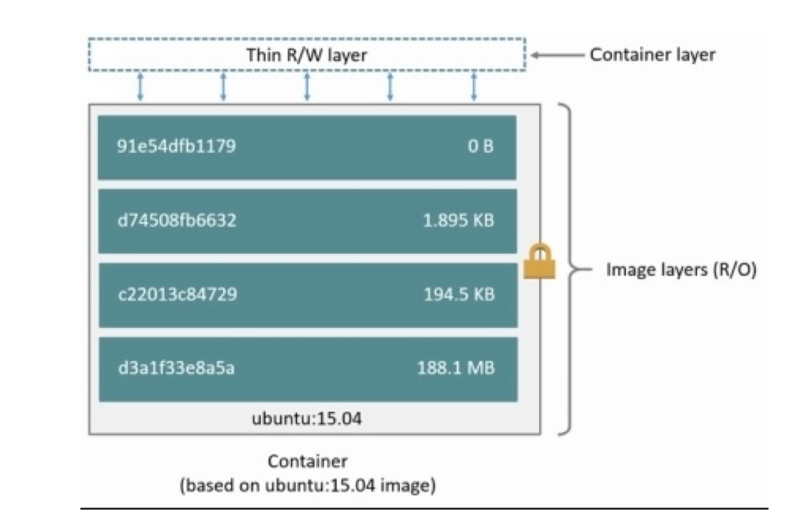
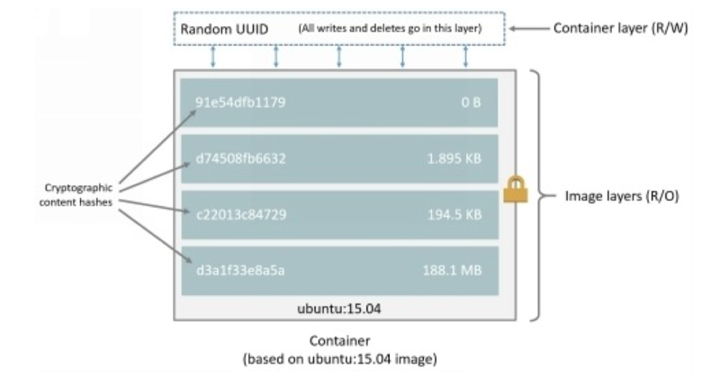
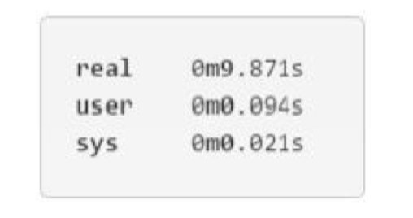

# 0301. Understand Container, Images and Storage Drives

To effectively use your storage device, you should learn how docker creates and stores different images. You have to understand that these images will be utilized by containers. You should have short introduction to this technology to enable container and image operations.

## 01. Layers and Images

Every docker image mentions one list of layers (read-only) that represent the differences n filesystem. The layers may stack on the top of every other to make one base of one root filesystem of the container. The below diagram will help you to understand the image layers of Ubunto 15.04:

Storage driver of docker is liable to stack these layers and provide one single incorporated view.

As you create one new container, you can add one new, writable and thin layer on the top of original stack. This layer may be known as container layer and all changes in your running container, such as new file writing, modification of existing files, removing files will be written on the thin layer of container. You can see the diagram to understand this procedure.

### Addressable Storage for Content

The 1.10 docker is introduced with one addressable model for storage. This is a new method to work layer and mage data on your disk. The layer and image data was stored and referenced with the use of UUID (randomly generated). In the unique model, you can replace it by one content hash.

This new model is good to enhance the security and offer one built-in method to avoid the collisions of ID and guarantee the integrity of data after push, load, pull and save activities. It helps you to share layers by sharing images even from a different built. See the diagram below to understand this:

You can see that all layers in the IDs are cryptographic botches and the ID container is a random UUID. There are various things to note in your new model, such as: 1) Migrate current images. 2) Layer and image filesystem structures.

Current images, pulled and created by the initial docker’s versions, should be migrated before their use with the novel model. Migration may involve calculation of checksums and it is automatically performed for the first time while you start update of your docker daemon. Once the migration is finished, all tags and images will become new and secure IDs. This migration procedure is transparent and automatic and it is intensive on a computational level. It means you have to take some time with image data. During migration time, the docker daemon may not give proper response to requests.

You can get the advantage of migration tool to migrate current images to new format before upgrading your daemon docker. The upgraded daemons docker will not have to perform the in-band migration and avoid any linked downtime. It offers one way to physically migrate current images to distribute them to other deamons docker in current environment with recent docker’s version.

This tool is offered by Docker and it work as one container. You can use [Releases · docker-archive/v1.10-migrator](https://github.com/docker-archive/v1.10-migrator/releases) to download it.

If you are running migrator image, you have to expose the data of directory’s host to your container. If you have to use default data path of docker, the command for docker can be this one:

If you want to use devicemapper driver for storage, you have to write give access to storage driver to your container.

### Example of Migration

Check the example below to use the migration tool on docker 1.9.1 version and AUFs drivers for storage. This host may run on one t2.micro AWS EC2 along with 8GB SSD volume, 1GB RAM and 1 vCPU. The data directory (/var/lib/docker) of docker consumed almost 2GB space. 

With the help of time Unix command, the docker can produce time for a particular operation. If you want to migrate seven images taking 2GB space on your disk, it will take almost one minute. This may include the time required to pull the docker/v1.10-migrator image in almost 3.5 seconds. This similar operation on the m4.10 by large EC2 with 160GB RAM, 8GB EBS and provisioned IOPS and 40 vCPUs may take different time. See below to improve this operation:

It is enough to see the effect of hardware spec on the migration operation.

### Layers and Containers

The basic different between one image and one container is writable layer on the top. All writes to your container may add one new or modify prevailing data stored in the writable layer. If you delete your container, it will also delete your writable layer. There will be no changes in the original image.

Every container contains its individual writable and thin layer and all changes will be secured in the layer of container. It means multiple containers can share the accessibility to the similar image and have their own state of data. See the diagram of multiple containers:

The storage drive in the docker is responsible to manage and enable both writable layers of container and image layers. The storage driver can accomplish between drives in a different way. There are 2 main technologies behind the container management and image of docker. The docker layer stackable images with CoW (copy-on-write) ability.

### Strategy of Copy-on-Write

You can optimize resources by sharing them and people often do this impulsively in their life. For instance, Joseph and Jane are twins taking calculus classes at separate times from separate teachers. They can share their exercise book by passing it to each other. Jane has to complete the homework on the 11 th page his book. Now, the original exercise book can’t be changed and only Jane can copy this page.

Copy-on-write strategy is simple for copying and sharing. This strategy enables system (that requires similar data) processes the data instead of getting their own copy. At a particular point, if one procedure requires some modification to write data, only the procedure that should be written will copy the data. All other procedures will be continuing to the use of actual data.

Docker requires one copy-on-write technology with containers and image. This strategy can optimize the performance of your container and disk space. In the next section, the system will work to leverage the copy with containers and images via copying and sharing.

### Promote Small Images via Sharing

You have to look at the CoW and image layers technology. All images have layers in the local storage of docker and managed by the driver of storage. The Linux-based docker may host this under /var/lib/docker/. These clients often report the images layers and the below command will prove helpful for you:

You can notice output because these commands can actually grab four image layers. Every line is listing the layer images and UUID has. Combination of these layers will help you to make your favorite images.

Every layer will be stored in the directory in the host of docker. It may use local storage area. Earlier versions of docker were storing every layer in one direction with similar name as the actual name of image layer. If you are using 1.9.1 version of docker, you can apply this command and get desired results. See the instruction below: Check the matching procedure of four directories with IDs layer of downloaded images. You can compare with similar operations perfumed on the host version 1.10 of docker.

You can see matchup procedure of all four directories with the layer IDs of images.

You can notice different among image management in afore and after versions. All docker’s version enables images to carefully share the layers. For instance, you can grab one image to share some similar layers of image as one image and it may be already pulled. The daemon Docker can recognize this and pulls the required layers out of their stored location. The second pull proves helpful to pull images with common features and layers.

This illustration can help you, just start with 15.04 Ubuntu image that you have recently pulled and make some changes into it to build a new image. You can use docker build or dockerfile command to make your work easy.

Take empty directory and create one simple dockerfile to start with 15.04 ubuntu image.

You can add one new file and it will be known as new files in the /tmp directory of images and with a line “Hello World”. Once you have done with it, the dockerfile will have these two lines: You have to close and save file and from the terminal in similar folder as Dockerfile, you can run the given commands:

Note: The (.) period is available at the end of above command and this period is important. It will communicate with docker-build command to utilize the current directory and build the context.

The above shown output will show you the new image and its ID will be 94e6b7d2c720.

Execute the docker-images command to authenticate the changed-unbuntu image in the local storage area of docker host.

You have to run the history of docker command to check the layers of images used to create changed-unbuntu pictures.

The history of docker output reveals the new image 94e6b7d2c720 layer at top. This new layer of image is easy to add because it is created by the tmp/newfile of hello world in the dockerfile. The four image layers under it are accurately similar image layers to make Ubuntu: 15.04 pictures.

Note: under the addressable storage content model familiarized with 1.10 docker and history data of image will not be stored in the configuration file with every image layer. It is stored as one string of text in the single configuration to whole image. This may result in the similar image layer and it will be shown mixing in the docker-history output command. This behavior is normal and you can ignore it. These types of images are commonly known as level images.

You can check the changed-ubuntu image because it doesn’t have an individual copy of each layer. You can see in the below diagram that the image is shared with four layers with 15.04 ubuntu image:

The docker-history command will display the size of every layer of image. You can notice the 94e6b7d2c720 layer consumes only 12 byes space on the disk. It means that the image of changed-ubuntu requires only 12 bytes extra space on the docker. All layers already exist on the host docker and shared by various other images.

Sharing image layers make the images of containers and docker really space efficient.

### Copying can Make the Containers Efficient

Container is one docker image with one thin writable and layer of container. This diagram will help you to understand the layers of container on the basis of 15.04 ubuntu image:

All writes on the container are secured in one writable layer of container. The other layers are only RO (read only) layers and you can’t change them. You can use multiple containers to share one single foundation image. The diagram below will help you to understand the sharing of images by multiple containers. Every container may possess its individual layers. See the image: 

As you modify the existing file in a container, the docker utilizes your storage driver to perform operation of CoW. This may specify the operations on the basis of storage driver. For OverlayFS and AUFS storage drivers, the CoW operations can be as follows:

1. You can search through the layers of image to update file. This procedure starts at the top of your new layer and work in the downward direction to the foundation layer. It will work on one layer at a time.

2. You can perform one “copy-up” operation on initial copy of your file. The copy up may copy your file up to the individual container with thin and writable layer.

3. You can modify the copy of file in thin writable layer of your container.

ZFS, Btrfs and many other drivers can handle the CoW (copy-on-write) contrarily.

### Storage Drive and Data Volumes

As you delete one container, the data written to this container may not be stored in the data volume is also deleted with this container. The data volume is one file or directory in the filesystem mounted directly in one container. These volumes will not be controlled by any storage driver.

Data volumes live exterior of local storage on the host docker. It can reinforce the independence from the control of storage driver. As one container is deleted, the data stored in the volumes persists on the host docker.
