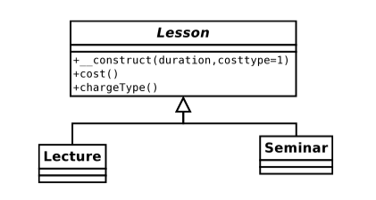

# 0202. Some Pattern Principles

Although design patterns simply describe solutions to problems, they tend to emphasize solutions that promote reusability and flexibility. To achieve this, they manifest some key object-oriented design principles. We will encounter some of them in this chapter and in more detail throughout the rest of the book.

This chapter will cover the following topics: 1) Composition: How to use object aggregation to achieve greater flexibility than you could with inheritance alone. 2) Decoupling: How to reduce dependency between elements in a system. 3) The power of the interface: Patterns and polymorphism. 4) Pattern categories: The types of patterns that this book will cover.

## 2.1 The Pattern Revelation

I first started working with objects in the Java language. As you might expect, it took a while before some concepts clicked. When it did happen, though, it happened very fast, almost with the force of revelation. The elegance of inheritance and encapsulation bowled me over. I could sense that this was a different way of defining and building systems. I got polymorphism, working with a type and switching implementations at runtime. It seemed to me that this understanding would solve most of my design problems, and help me design beautiful and elegant systems.

1『又见多态，可以替代条件语句的功能。working with a type and switching implementations at runtime. 』

All the books on my desk at the time focused on language features and the very many APIs available to the Java programmer. Beyond a brief definition of polymorphism, there was little attempt to examine design strategies. Language features alone do not engender object-oriented design. Although my projects fulfilled their functional requirements, the kind of design that inheritance, encapsulation and polymorphism had seemed to offer continued to elude me.

My inheritance hierarchies grew wider and deeper as I attempted to build a new class for every eventuality. The structure of my systems made it hard to convey messages from one tier to another without giving intermediate classes too much awareness of their surroundings, binding them into the application and making them unusable in new contexts.

It wasn’t until I discovered Design Patterns: Elements of Reusable Object-Oriented Software (Addison-Wesley Professional, 1995), otherwise known as the Gang of Four book, that I realized I had missed an entire design dimension. By that time, I had already discovered some of the core patterns for myself, but others contributed to a new way of thinking.

I found that I had over-privileged inheritance in my designs, trying to build too much functionality into my classes. But where else can functionality go in an object-oriented system?

I found the answer in composition. Software components can be defined at runtime by combining objects in flexible relationships. The Gang of Four boiled this down into a principle:「favor composition over inheritance.」The patterns described ways in which objects could be combined at runtime to achieve a level of flexibility impossible in an inheritance tree alone.

1『金子知识啊，组合替代继承。』

因为我努力地为每一个可能性建造新类，所以我的继承层次体系逐渐变得更广、更深。而在这样的系统结构中，如果中间类对于环境没有足够的了解，如果没有将它们绑定到具体应用中，如果没有使它们只可用于当前局部环境中，那么在系统的层级中传递信息将会变得十分困难。直到发现《设计模式》一书，我才意识到原来我没有完全理解什么是设计。虽然那时我自己也已经发现了一些核心模式，但是书中介绍的其他模式则提供了一种全新的思维方式。

我在设计中给了继承过多的特权，总是试图为我的类构建太多的功能。在面向对象系统里还有别的地方可以放置这些功能吗？我在组合模式中找到了答案。通过以灵活的关系来组合对象，组件能在运行时被定义。《设计模式》将这提炼成了一个原则：组合优于继承（favor composition over inheritance）。在该模式中，运行时组合对象所达到的灵活性非常高，而这在单独的继承树中是不可能达到的。

## 2.2 Composition and Inheritance

Inheritance is a powerful way of designing for changing circumstances or contexts. It can limit flexibility, however, especially when classes take on multiple responsibilities.

### 2.2.1 The Problem

As you know, child classes inherit the methods and properties of their parents (as long as they are protected or public elements). You can use this fact to design child classes that provide specialized functionality.

Figure 8-1 presents a simple example using the UML. The abstract Lesson class in Figure 8-1 models a lesson in a college. It defines abstract cost() and chargeType() methods. The diagram shows two implementing classes, FixedPriceLesson and TimedPriceLesson, which provide distinct charging mechanisms for lessons.

Using this inheritance scheme, I can switch between lesson implementations. Client code will know only that it is dealing with a Lesson object, so the details of cost will be transparent.

What happens, though, if I introduce a new set of specializations? I need to handle lectures and seminars. Because these organize enrollment and lesson notes in different ways, they require separate classes. Now I have two forces that operate upon my design. I need to handle pricing strategies, and separate lectures and seminars.


Figure 8-2.  A poor inheritance structure

Figure 8-2 shows a hierarchy that is clearly faulty. I can no longer use the inheritance tree to manage my pricing mechanisms without duplicating great swathes of functionality. The pricing strategies are mirrored across the Lecture and Seminar class families.

At this stage, I might consider using conditional statements in the Lesson super class, removing those unfortunate duplications. Essentially, I remove the pricing logic from the inheritance tree altogether, moving it up into the super class. This is the reverse of the usual refactoring, where you replace a conditional with polymorphism. Here is an amended Lesson class:

利用这种继承模式，我们可以在课程的实现之间切换。而客户端代码只知道它是在处理一个 Lesson 对象，因此费用的细节就会变得透明。可是如果引入一组新的特殊性，又会怎样呢？比如我们需要处理演讲和研讨会。因为演讲和研讨会会以不同的方式注册登记和教授课程，所以它们会要求独立的类。因此在设计上现在会有两个分支。我们需要处理不同的定价策略并区分演讲和研讨会。

图 8-2 的体系明显是有缺陷的。在该体系中，我们不得不大量重复开发功能，否则无法使用继承树来管理价格机制。定价策略在 Lecture 和 Seminar 类的子类中被重复实现。我们可能要考虑在父类 Lesson 中使用条件语句来移除那些不适宜的重复。我们是把定价逻辑从继承树中一并移除并迁移到父类中，但这与我们通常用多态替换条件的重构思想背道而驰。下面是一个修改过的 Lesson 类。

```php
<?php
// declare(strict_types=1);  // 显式声明类型检查为严格模式

// listing 0801

abstract class Lesson {
    protected $duration;
    const FIXED= 1;
    const TIMED = 2;
    private $costtype;

    public function __construct(int $duration, int $costtype = 1) {
        $this->duration = $duration;
        $this->costtype = $costtype;
    }

    public function cost(): int {
        switch ($this->costtype) {
            case self::TIMED:
                return (5 * $this->duration);
                break;
            case self::FIXED:
                return 30;
                break;
            default:
                $this->costtype = self::FIXED;
                return 30;
        }
    }

    public function chargeType(): string {
        switch ($this->costtype) {
            case self::TIMED:
                return "hourly rate";
                break;
            case self::FIXED:
                return "fixed rate";
                break;
            default:
                $this->costtype = self::FIXED;
                return "fixed rate";
        }
    }

    // more lesson methods...
}

class Lecture extends Lesson {
    // Lecture-specific implementions...
}

class Seminar extends Lesson {
    // Seminar-specific implementions...
}
```

Here’s how I might work with these classes:

```php
$lecture = new Lecture(5, Lesson::FIXED);
echo "{$lecture->cost()}({$lecture->chargeType()})\n";

$seminar = new Seminar(3, Seminar::TIMED);
echo "{$seminar->cost()}({$seminar->chargeType()})\n";
```

And here’s the output:

```
30 (fixed rate)
15 (hourly rate)
```

You can see the new class diagram in Figure 8-3.



Figure 8-3. Inheritance hierarchy improved by removing cost calculations from subclasses

I have made the class structure much more manageable, but at a cost. Using conditionals in this code is a retrograde step. Usually, you would try to replace a conditional statement with polymorphism. Here, I have done the opposite. As you can see, this has forced me to duplicate the conditional statement across the chargeType() and cost() methods. I seem doomed to duplicate code.

### 2.2.2 Using Composition

I can use the Strategy pattern to compose my way out of trouble. Strategy is used to move a set of algorithms into a separate type. By moving cost calculations, I can simplify the Lesson type. You can see this in Figure 8-4.


Figure 8-4.  Moving algorithms into a separate type

I create an abstract class, CostStrategy, which defines the abstract methods, cost() and chargeType(). The cost() method requires an instance of Lesson, which it will use to generate cost data. I provide two implementations for CostStrategy. Lesson objects work only with the CostStrategy type, not a specific implementation, so I can add new cost algorithms at any time by subclassing CostStrategy. This would require no changes at all to any Lesson classes.

Here’s a simplified version of the new Lesson class illustrated in Figure 8-4:

```php
abstract class CostStrategy {
    abstract public function cost(Lesson $lesson): int;
    abstract public function chargeType(): string;
}

abstract class Lesson {
    private $duration;
    private $CostStrategy;

    public function __construct(int $duration, CostStrategy $strategy) {
        $this->duration = $duration;
        $this->CostStrategy = $strategy;
    }

    public function cost(): int {
        return $this->CostStrategy->cost($this);
    }

    public function chargeType(): string {
        return $this->CostStrategy->chargeType();
    }

    public function getDuration(): int {
        return $this->duration;
    }

    // more lesson methods...
}

class Lecture extends Lesson {
    // Lecture-specific implementions...
}

class Seminar extends Lesson {
    // Seminar-specific implementions...
}
```

The Lesson class requires a CostStrategy object, which it stores as a property. The Lesson::cost() method simply invokes CostStrategy::cost(). Equally, Lesson::chargeType() invokes CostStrategy::chargeType(). This explicit invocation of another object’s method in order to fulfill a request is known as delegation. In my example, the CostStrategy object is the delegate of Lesson. The Lesson class washes its hands of responsibility for cost calculations and passes on the task to a CostStrategy implementation. Here, it is caught in the act of delegation:

1『又见委托（delegation）。』

这种显式调用另一个对象的方法来执行一个请求的方式便是所谓的「委托」。在我们的示例中，Coststrategy 对象便是 Lesson 的委托方。Lesson 类不再负责计费，而是把计费任务传给 CostStrategy 类。下面的代码执行了委托操作：

```php
    public function cost(): int {
        return $this->CostStrategy->cost($this);
    }
```

Here is the CostStrategy class, together with its implementing children:

```php
abstract class CostStrategy {
    abstract public function cost(Lesson $lesson): int;
    abstract public function chargeType(): string;
}

class TimedCostStrategy extends CostStrategy {
    function cost(Lesson $lesson):int {
        return ($lesson->getDuration() * 5);
    }

    function chargeType(): string {
        return "hourly rate";
    }
}

class FixedCostStrategy extends CostStrategy {
    function cost(Lesson $lesson): int {
        return 30;
    }

    function chargeType(): string {
        return "fixed rate";
    }
}
```

I can change the way that any Lesson object calculates cost by passing it a different CostStrategy object at runtime. This approach then makes for highly flexible code. Rather than building functionality into my code structures statically, I can combine and recombine objects dynamically:

```php
$lessons[] = new Seminar(4, new TimedCostStrategy);
$lessons[] = new Lecture(4, new FixedCostStrategy);

foreach ($lessons as $lesson) {
    print "lesson charge {$lesson->cost()}. \n";
    echo "Charge type: {$lesson->chargeType()}\n";
}
```

```
lesson charge 20. Charge type: hourly ratelesson charge 30. Charge type: fixed rate
```

1『通过组合 Lesson 和 CostStrategy 实现，在运行时根据不同的条件实施不同的行为，即条件语句实现的功能。』

As you can see, one effect of this structure is that I have focused the responsibilities of my classes. CostStrategy objects are responsible solely for calculating cost, and Lesson objects manage lesson data. So, composition can make your code more flexible because objects can be combined to handle tasks dynamically in many more ways than you can anticipate in an inheritance hierarchy alone. There can be a penalty with regard to readability, though. Because composition tends to result in more types, with relationships that aren’t fixed with the same predictability as they are in inheritance relationships, it can be slightly harder to digest the relationships in a system.

组合使用对象比使用继承体系更灵活，因为组合可以以多种方式动态地处理任务，不过这可能导致代码的可读性下降。因为组合需要更多的对象类型，而这些类型的关系并不像在继承关系中那般有固定的可预见性，所以要理解系统中类和对象的关系会有些困难。

## 2.3 Decoupling

You saw in Chapter 6 that it makes sense to build independent components. A system with highly interdependent classes can be hard to maintain. A change in one location can require a cascade of related changes across the system.

### 2.3.1 The Problem

Reusability is one of the key objectives of object-oriented design, and tight coupling is its enemy. You can diagnose tight coupling when you see that a change to one component of a system necessitates many changes elsewhere. You should aspire to create independent components, so that you can make changes without a domino effect of unintended consequences. When you alter a component, the extent to which it is independent is related to the likelihood that your changes will cause other parts of your system to fail.

重用性是面向对象设计的主要目标之一，而紧耦合（tight-coupling）便是它的敌人。当我们看到系统中一个组件的改变迫使系统其他许多地方也发生改变的时候，就可诊断为紧耦合了。为了能安全地做变动，我们总是期望创建能够独立存在的组件。在修改组件时，其独立程度会决定你的修改对系统中其他组件的影响程度，系统的其他组件甚至有可能会因此失败。

2『紧耦合，做一张术语卡片。』——已完成

You saw an example of tight coupling in Figure 8-2. Because the cost logic was mirrored across the Lecture and Seminar types, a change to TimedPriceLecture would necessitate a parallel change to the same logic in TimedPriceSeminar. By updating one class and not the other, I would break my system—without any warning from the PHP engine. My first solution, using a conditional statement, produced a similar dependency between the cost() and chargeType() methods.

By applying the Strategy pattern, I distilled my cost algorithms into the CostStrategy type, locating them behind a common interface and implementing each only once.

在图 8-2 中，我们看到过紧耦合的例子。因为费用计算逻辑在 Lecture 和 Seminar 类型中都存在，所以对 TimedPriceLecture 的一个改变将会迫使在 TimedPriceSeminar 中同样逻辑的相应变化。如果仅改动一个类而不改动其他类的代码，系统将无法正常工作，而且没有来自 PHP 引擎的任何警告。而我们的第一个解决方案（使用条件语句）在 cost() 和 chargeType() 方法之间生成了一个类似的依赖关系。通过应用策略模式，我们将费用算法提取为 CostStrategy 类型，将算法放置在共同接口后并且每个算法只需实现一次。

Coupling of another sort can occur when many classes in a system are embedded explicitly into a platform or environment. Let’s say that you are building a system that works with a MySQL database, for example. You might use methods such as mysqli::query() to speak to the database server.

Should you be required to deploy the system on a server that does not support MySQL, you could convert your entire project to use SQLite. You would be forced to make changes throughout your code, though, and face the prospect of maintaining two parallel versions of your application.

不过当系统中许多类都显式嵌入到一个平台或环境中时，其他类型的耦合仍时有发生。比如建立了一个基于 MySQL 数据库的系统。你可能会用一些诸如 mysql\_connect() 和 mysql\_query() 的函数来与数据库服务器交互。如果现在你被要求在不支持 MySQL 的服务器上部署系统，比如要把整个项目都转换成使用 SQLite，那么你可能被迫要改变整个代码，并且面临维护应用程序的两个并行版本的状况。

1『中文是老版书籍，看来数据库的连接方法都改了哦。』

The problem here is not the system’s dependency on an external platform. Such a dependency is inevitable. You need to work with code that speaks to a database. The problem comes when such code is scattered throughout a project. Talking to databases is not the primary responsibility of most classes in a system, so the best strategy is to extract such code and group it together behind a common interface. In this way, you promote the independence of your classes. At the same time, by concentrating your gateway code in one place, you make it much easier to switch to a new platform without disturbing your wider system. This process, the hiding of implementation behind a clean interface, is known as encapsulation. The Doctrine database library solves this problem with the DBAL (database abstraction layer) project. This provides a single point of access for multiple databases.

1『如何隔离与数据库交互的代码，这个思路太赞了。这里有提高「Doctrine database library 」这个工具，就是为了解决这个问题的，记得去了解下。突然想到有本 python 的英文书里（那个作者写了好几本书），也有提高这种在程序和数据库之间抽象出来的中间层。』

这里的问题不在于系统对外部平台的依赖。这样的依赖是无法避免的。我们确实需要使用与数据库交互的代码。但当这样的代码散布在整个项目中时，问题就来了。与数据库交互不是系统中大部分类的首要责任，因此最好的策略就是提取这样的代码并将其组合在公共接口后。这可以使类之间相互独立。同时，通过在一个地方集中你的「入ロ」代码，就能更轻松地切换到一个新的平台而不会影响到系统中更大的部分。这个把具体实现隐藏在一个干净的接口后面的过程，正是大家所知道的「封装」。

PEAR 中的 PEAR::MDB2 包（沿袭自 PEAR::DB）可以解决这个问题。该包支持对多个数据库的访问。最新的 PDO 扩展已将此模型移植到 PHP 语言中。MDB2 类提供了一个静态方法 connect()，它接受一个 DSN (Data Source Name，数据源名）字符串参数。根据这个字符串的构成，它返回 MDB2\_Driver\_Comon 类的一个特定实现。因此对于字符串 "mysql://", connect() 方法返回一个 MmB2\_Driver\_mysql 对象，而对于一个以 "sqlite://" 开头的字符串，它将返回一个 MDB2 Driver\_sqlite，对象。可以在图 8-5 中看到该类的结构。

The DriverManager class provides a static method called getConnection() that accepts a parameters array. According to the makeup of this array, it returns a particular implementation of an interface called Doctrine\DBAL\Driver. You can see the class structure in Figure 8-5.


Figure 8-5.  The DBAL package decouples client code from database objects

The DBAL package, then, lets you decouple your application code from the specifics of your database platform. You should be able to run a single system with MySQL, SQLite, MSSQL, and others without changing a line of code (apart from your configuring parameters, of course).

### 2.3.2 Loosening Your Coupling

To handle database code flexibly, you should decouple the application logic from the specifics of the database platform it uses. You will see lots of opportunities for this kind of separation of components in your own projects.

Imagine, for example, that the Lesson system must incorporate a registration component to add new lessons to the system. As part of the registration procedure, an administrator should be notified when a lesson is added. The system’s users can’t agree whether this notification should be sent by mail or by text message. In fact, they’re so argumentative that you suspect they might want to switch to a new mode of communication in the future. What’s more, they want to be notified of all sorts of things, so that a change to the notification mode in one place will mean a similar alteration in many other places.

If you’ve hard-coded calls to a Mailer class or a Texter class, then your system is tightly coupled to a particular notification mode, just as it would be tightly coupled to a database platform by the use of a specialized database API. Here is some code that hides the implementation details of a notifier from the system that uses it:

为了灵活处理数据库代码，我们应该将应用逻辑从数据库平台的特殊性中解耦出来。在你自己的项目中，你会看到很多这种需要分离组件的情况。例如，课程系统中应包含注册组件，从而向系统中添加新课程。添加了新课程后，应该通知管理员，这是注册程序的一部分。对于应该通过邮件发送通知还是通过文本消息发送通知，系统用户的意见不一致。实际上，他们太挑别了，以至于你怀疑将来他们会想使用一种新的信息传达模式。此外，他们希望发生任何事情都会收到通知。所以，修改了通知模式的一处意味着要对多处做同样的修改。

如果已经硬编码了对 Mailer 类或 Texter 类的调用，那么系统就与特殊的通知模式紧密相关了。就像利用专门的数据库 API 时，系统就与某数据库平台紧密相关一样。下面的这些代码对使用通知程序的系统隐藏了通知程序的实现细节。

```php
class RegistrationMgr {
    function register(Lesson $lesson) {
        // do something with the lesson

        // now tell someone
        $notifier = Notifier::getNotifier();
        $notifier->inform("new lesson: cost({$lesson->cost()})");
    }
}

abstract class Notifier {
    public static function getNotifier(): Notifier {
        // acquire concrete class according to configuration or other logic
        if (rand(1, 2) === 1) {
            return new MailNotifier();
        } else {
            return new TextNotifier();
        }
    }
}

class MailNotifier extends Notifier {
    public function inform($message) {
        echo "MAIL notification: {$message}\n";
    }
}

class TextNotifier extends Notifier {
    public function inform($message) {
        echo "TEXT notification: {$message}\n";
    }
}
```

I create RegistrationMgr, a sample client for my Notifier classes. The Notifier class is abstract, but it does implement a static method, getNotifier(), which fetches a concrete Notifier object (TextNotifier or MailNotifier). In a real project, the choice of Notifier would be determined by a flexible mechanism, such as a configuration file. Here, I cheat and make the choice randomly. MailNotifier and TextNotifier do nothing more than print out the message they are passed along with an identifier to show which one has been called.

Notice how the knowledge of which concrete Notifier should be used has been focused in the Notifier::getNotifier() method. I could send notifier messages from a hundred different parts of my system, and a change in Notifier would only have to be made in that one method. Here is some code that calls the RegistrationMgr:

注意，具体应该使用哪个 Notifier 对象取决于 Notifier::getnotifier() 方法。我可以从系统的上百个不同部分发送消息，但只需在该方法中对 Notifier 进行一项修改即可。


```php
$mrg = new RegistrationMgr();
$mrg->register(new Seminar(4, new TimedCostStrategy));
$mrg->register(new Lecture(4, new FixedCostStrategy));
```

And here’s the output from a typical run:

```
TEXT notification: new lesson: cost (20)MAIL notification: new lesson: cost (30)
```


Figure 8-6.  The Notifier class separates client code from Notifier implementations

Figure 8-6 shows these classes.Notice how similar the structure in Figure 8-6 is to that formed by the Doctrine components shown in Figure 8-5.

## 2.4 Code to an Interface, Not to an Implementation

This principle is one of the all-pervading themes of this book. You saw in Chapter 6 (and in the last section) that you can hide different implementations behind the common interface defined in a superclass. Client code can then require an object of the superclass’s type rather than that of an implementing class, unconcerned by the specific implementation it is actually getting.

Parallel conditional statements, like the ones I rooted out from Lesson::cost() and Lesson::chargeType(), are a common sign that polymorphism is needed. They make code hard to maintain because a change in one conditional expression necessitates a change in its siblings. Conditional statements are occasionally said to implement a「simulated inheritance.」

把不同的实现隐藏在父类所定义的共同接口下。然后客户端代码需要一个父类的对象而不是一个子类的对象，从而使客户端代码可以不用关心它实际得到的是哪个具体实现。我们在 Lesson::cost() 和 Lesson::cost() 中创建的并行条件语句，就是需要多态的常见标志。这样的条件语句使代码很难维护，因为条件表达式的改变必然要求与之对应的代码主体也随之改变，所以条件语句有时会被称作实现了一个「模拟继承」。

By placing the cost algorithms in separate classes that implement CostStrategy, I remove duplication. I also make it much easier should I need to add new cost strategies in the future.

From the perspective of client code, it is often a good idea to require abstract or general types in your methods’ parameters. By requiring more specific types, you could limit the flexibility of your code at runtime. Having said that, of course, the level of generality you choose in your argument hints is a matter of judgment. Make your choice too general, and your method may become less safe. If you require the specific functionality of a subtype, then accepting a differently equipped sibling into a method could be risky.

Still, make your choice of argument hint too restricted, and you lose the benefits of polymorphism. Take a look at this altered extract from the Lesson class:

而通过把计费算法放置在一个实现 CostStrategy 的独立的类中，我们可以移除重复代码，也可以使在未来加入新的计费策略变得更加容易。从客户端代码的角度看，类方法参数为抽象或通用类型通常都是不错的主意。如果参数对对象类型要求过于严格，就会限制代码在运行时的灵活性。

当然，如何使用参数类型提示来调整参数对象的「通用性」是需要仔细权衡的。选择过于通用，则会降低方法的安全性。而如果需要某个子类型的特有功能，那么方法接受另一个子类类型则可能会有风险。尽管如此，若参数的类型匹配限制过于严格，那么将无法得到多态带来的好处。下面是修改过的 Lesson 类里的一段代码。

```php
// listing 08.17    

public function __construct(int $duration, FixedCostStrategy $strategy)    {        
    $this->duration = $duration;        
    $this->costStrategy = $strategy;    
}
```

There are two issues arising from the design decision in this example. First, the Lesson object is now tied to a specific cost strategy, which closes down my ability to compose dynamic components. Second, the explicit reference to the FixedPriceStrategy class forces me to maintain that particular implementation.

By requiring a common interface, I can combine a Lesson object with any CostStrategy implementation:

```php
// listing 08.18    
public function __construct(int $duration, CostStrategy $strategy)    {        
    $this->duration = $duration;        
    $this->costStrategy = $strategy;    
}
```

1『 CostStrategy 只提供接口。』

I have, in other words, decoupled my Lesson class from the specifics of cost calculation. All that matters is the interface and the guarantee that the provided object will honor it. Of course, coding to an interface can often simply defer the question of how to instantiate your objects. 

When I say that a Lesson object can be combined with any CostStrategy interface at runtime, I beg the question,「But where does the CostStrategy object come from?」When you create an abstract superclass, there is always the issue of how its children should be instantiated. Which child do you choose and according to which condition? This subject forms a category of its own in the Gang of Four pattern catalog, and I will examine this further in the next chapter.

换句话说，我们把 Lesson 类从具体的费用计算中分离出来了。我们所做的就是提供接口并保证所提供的对象会实现接口。当然，面向接口编程无法回答如何实例化对象的问题。当我们说 Lesson 对象能在运行时与任何 Coststrategy 接口绑定时，我们回避了这么一个问题：「但是 coststrategy 对象从哪里来呢？」当创建一个抽象父类时，常会碰到如何实例化它的子类的问题。你会选择实例化哪个子类来对应相应的条件呢？这个主题在《设计模式》模式目录中形成了一个独立的类别，我们会在下章研究其中一些模式。

1『核心问题：当创建一个抽象父类时，常会碰到如何实例化它的子类的问题。你会选择实例化哪个子类来对应相应的条件呢？』

## 2.5 The Concept that Varies

It’s easy to interpret a design decision once it has been made, but how do you decide where to start?

The Gang of Four recommend that you「encapsulate the concept that varies.」In terms of my lesson example, the varying concept is the cost algorithm. Not only is the cost calculation one of two possible strategies in the example, but it is obviously a candidate for expansion: special offers, overseas student rates, introductory discounts-all sorts of possibilities present themselves.

1『核心观点：封装变化。』

I quickly established that subclassing for this variation was inappropriate, and I resorted to a conditional statement. By bringing my variation into the same class, I underlined its suitability for encapsulation.

The Gang of Four recommend that you actively seek varying elements in your classes and assess their suitability for encapsulation in a new type. Each alternative in a suspect conditional may be extracted to form a class that extends a common abstract parent. This new type can then be used by the class or classes from which it was extracted. This has the following effects:

1. Promoting flexibility through composition.

2. Making inheritance hierarchies more compact and focused.

3. Focusing responsibility.

4. Reducing duplication.

So how do you spot variation? One sign is the misuse of inheritance. This might include inheritance deployed according to multiple forces at one time (e.g., lecture/seminar and fixed/timed cost). It might also include subclassing on an algorithm where the algorithm is incidental to the core responsibility of the type. The other sign of variation suitable for encapsulation is, as you have seen, a conditional expression.

## 2.6 Patternitis

One problem for which there is no pattern is the unnecessary or inappropriate use of patterns. This has earned patterns a bad name in some quarters. Because pattern solutions are neat, it is tempting to apply them wherever you see a fit, whether they truly fulfill a need or not.

The eXtreme Programming (XP) methodology offers a couple of principles that might apply here. The first is,「You aren’t going to need it」(often abbreviated to YAGNI). This is generally applied to application features, but it also makes sense for patterns.

When I build large environments in PHP, I tend to split my application into layers, separating 

application logic from presentation and persistence layers. I use all sorts of core and enterprise patterns in conjunction with one another.

When I am asked to build a feedback form for a small business web site, however, I may simply use 

procedural code in a single page script. I do not need enormous amounts of flexibility; I won’t be building on the initial release. I don’t need to use patterns that address problems in larger systems. Instead, I apply the second XP principle:「Do the simplest thing that works.」

When you work with a pattern catalog, the structure and process of the solution are what stick in the 

mind, consolidated by the code example. Before applying a pattern, though, pay close attention to the problem, or「when to use it,」section, and then read up on the pattern’s consequences. In some contexts, the cure may be worse than the disease.

## 2.7 The Patterns

This book is not a pattern catalog. Nevertheless, in the coming chapters, I will introduce a few of the key patterns in use at the moment, providing PHP implementations and discussing them in the broad context of PHP programming.

The patterns described will be drawn from key catalogs, including Design Patterns: Elements of Reusable Object-Oriented Software, Patterns of Enterprise Application Architecture by Martin Fowler (Addison-Wesley Professional, 2002) and Core J2EE Patterns: Best Practices and Design Strategies (Prentice Hall, 2001) by Alur, et al. I use the Gang of Four’s categorization as a starting point, dividing patterns into five categories, as follows.

Patterns for Generating ObjectsThese patterns are concerned with the instantiation of objects. This is an important category given the principle,「Code to an interface.」If you are working with abstract parent classes in your design, then you must develop strategies for instantiating objects from concrete subclasses. It is these objects that will be passed around your system.

Patterns for Organizing Objects and ClassesThese patterns help you to organize the compositional relationships of your objects. More simply, these patterns show how you combine objects and classes.

Task-Oriented PatternsThese patterns describe the mechanisms by which classes and objects cooperate to achieve objectives.

Enterprise PatternsI look at some patterns that describe typical Internet programming problems and solutions. Drawn largely from Patterns of Enterprise Application Architecture and Core J2EE Patterns: Best Practices and Design Strategies, the patterns deal with presentation and application logic.

Database PatternsAn examination of patterns that help with storing and retrieving data, and with mapping objects to and from databases.

## Summary

In this chapter, I examined some of the principles that underpin many design patterns. I looked at the use of composition to enable object combination and recombination at runtime, resulting in more flexible structures than would be available using inheritance alone. I also introduced you to decoupling, the practice of extracting software components from their context to make them more generally applicable. Finally, I reviewed the importance of interface as a means of decoupling clients from the details of implementation.

In the coming chapters, I will examine some design patterns in detail.