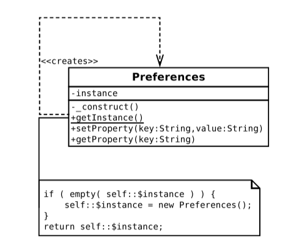
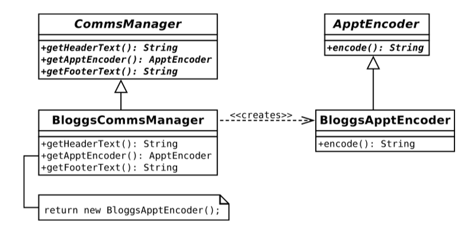
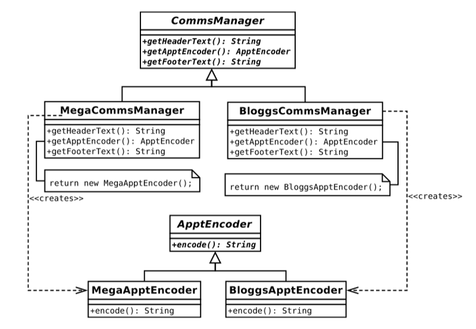
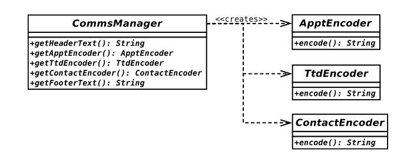

# 0203. Generating Objects

Creating objects is a messy business. So, many object-oriented designs deal with nice, clean abstract classes, taking advantage of the impressive flexibility afforded by polymorphism (the switching of concrete implementations at runtime). To achieve this flexibility, though, I must devise strategies for object generation. This is the topic I will look at in this chapter.

This chapter will cover the following patterns: 1) The Singleton pattern: A special class that generates one—and only one—object instance. 2) The Factory Method pattern: Building an inheritance hierarchy of creator classes. 3) The Abstract Factory pattern: Grouping the creation of functionally related products. 4) The Prototype pattern: Using clone to generate objects. 5) The Service Locator pattern: Asking your system for objects. 6) The Dependency Injection pattern: Letting your system give you objects.

单例模式：生成一个且只生成一个对象实例的特殊类；工厂方法模式：构建创建者类的继承层级。抽象工厂模式：功能相关产品的创建。原型模式：使用克隆来生成对象。

## 3.1 Problems and Solutions in Generating Objects

Object creation can be a weak point in object-oriented design. In the previous chapter, you saw the principle,「Code to an interface, not to an implementation.」To this end, you are encouraged to work with abstract supertypes in your classes. This makes code more flexible, allowing you to use objects instantiated from different concrete subclasses at runtime. This has the side effect that object instantiation is deferred.

对象创建有时会成为面向对象设计的一个薄弱环节。在前一章中，我们看到「针对接口编程，而不是针对实现编程」的原则。就此而言，鼓励在类中使用抽象的超类。这使代码更具灵活性，可以让你在运行时使用从不同的具体子类中实例化的对象。但这样做也有副作用，那就是对象实例化被推迟。

Here’s a class that accepts a name string and instantiates a particular object:

```php
<?php

abstract class Employee {
    protected $name;

    public function __construct(string $name)
    {
        $this->name = $name;
    }

    abstract public function fire();
}

class Minion extends Employee {
    public function fire()
    {
        echo "{$this->name}: I'll clear my desk\n";
    }
}

class NastyBoss {
    private $employees = [];

    public function addEmployee(string $employeeName) {
        $this->employees[] = new Minion($employeeName);
    }

    public function projectFail() {
        if (count($this->employees) >0 ) {
            $emp = array_pop($this->employees);
            $emp->fire();
        }
    }
}

$boss = new NastyBoss();
$boss->addEmployee('harry');
$boss->addEmployee('bob');
$boss->addEmployee('mary');
$boss->projectFail();
```

```
mary: I'll clear my desk
```

As you can see, I define an abstract base class, Employee, with a downtrodden implementation, Minion. Given a name string, the NastyBoss::addEmployee() method instantiates a new Minion object. Whenever a NastyBoss object runs into trouble (via the NastyBoss::projectFails() method), it looks for a Minion to fire.

By instantiating a Minion object directly in the NastyBoss class, we limit flexibility. If a NastyBoss object could work with any instance of the Employee type, we could make our code amenable to variation at runtime as we add more Employee specializations. You should find the polymorphism in Figure 9-1 familiar.

如你所看到的，我们定义了一个抽象基类 Employee（雇员）以及一个受压迫员工的具体实现 Minion。NastyBoss::addEmployee() 方法通过接受的名字字符串来实例化新的 Minion。对象且 Nastyboss（苛刻的老板）对象遇到了麻烦（通过 NastyBoss::projectFails() 方法），它就会解雇一个 Minion。由于在 NastyBoss 类中直接实例化 Minion 对象，代码的灵活性受到了限制。如果 NastyBoss 对象可以使用 Employee 类的任何实例，那么代码在运行时就能应对更多特殊的 Employee。在图 9-1 中，应该可以找到你熟悉的多态。

Figure 9-1.  Working with an abstract type enables polymorphism

If the NastyBoss class does not instantiate a Minion object, where does it come from? Authors often duck out of this problem by constraining an argument type in a method declaration, and then conveniently omitting to show the instantiation in anything other than a test context:

如果 NastyBoss 类不实例化 Minion 对象，那么 Minion 对象从何而来？许多人通常在方法声明中限制参数类型来巧妙避开这个问题，然后除了在测试时实例化对象，在其他时候尽量避免提及。

1『抽象出一个状态类跟 NastyBoss 类组合起来呗，让 NastyBoss 调用状态类来实例化 Minion 对象。』

```php
<?php

abstract class Employee {
    protected $name;

    public function __construct(string $name)
    {
        $this->name = $name;
    }

    abstract public function fire();
}

class Minion extends Employee {
    public function fire()
    {
        echo "{$this->name}: I'll clear my desk\n";
    }
}

class CluedUp extends Employee {
    public function fire() {
        echo "{$this->name}: I'll call my lawyer\n";
    }
}

class NastyBoss {
    private $employees = [];

    public function addEmployee(Employee $employee) {
        $this->employees[] = $employee;
    }

    public function projectFail() {
        if (count($this->employees) >0 ) {
            $emp = array_pop($this->employees);
            $emp->fire();
        }
    }
}

$boss = new NastyBoss();
$boss->addEmployee(new Minion('harry'));
$boss->addEmployee(new CluedUp('bob'));
$boss->addEmployee(new Minion('mary'));
$boss->projectFail();
$boss->projectFail();
$boss->projectFail();
```

```
mary: I'll clear my desk
bob: I'll call my lawyer
harry: I'll clear my desk
```

Although this version of the NastyBoss class works with the Employee type, and therefore benefits from polymorphism, I still haven’t defined a strategy for object creation. Instantiating objects is a dirty business, but it has to be done. This chapter is about classes and objects that work with concrete classes, so that the rest of your classes do not have to.

If there is a principle to be found here, it is「delegate object instantiation.」I did this implicitly in the previous example by demanding that an Employee object be passed to the NastyBoss::addEmployee() method. I could, however, equally delegate to a separate class or method that takes responsibility for generating Employee objects. Here I add a static method to the Employee class that implements a strategy for object creation:

虽然这个版本的 NastyBoss 类能与 Employee 类型一起工作，而且也能从多态中获益，但我们仍旧没有定义创建对象的策略。实例化对象是一件麻烦事，但是我们又不得不去做。这一章讲的是使用具体类的类和对象。这样，不使用具体类的类和对象不一定非要实例化对象。如果说这里存在一个原则的话，那便是「把对象实例化的工作委托出来」。之前的示例已然隐含了这个原则，即要求将一个 Employee 对象传递给 NastyBoss::addEmployee() 方法。然而我们也可以委托一个独立的类或方法来生成 Employee 对象，其效果是一样的。下面给 Employee 类添加一个实现了对象创建策略的静态方法。

```php
abstract class Employee {
    protected $name;
    private static $types = ['Minion', 'CluedUp', 'WellConnected'];

    public static function recruit(string $name) {
        $num = rand(1, count(self::$types)) - 1;
        $class = __NAMESPACE__ . "\\" . self::$types[$num];
        return new $class($name);
    }

    public function __construct(string $name)
    {
        $this->name = $name;
    }

    abstract public function fire();
}

class Minion extends Employee {
    public function fire()
    {
        echo "{$this->name}: I'll clear my desk\n";
    }
}

class CluedUp extends Employee {
    public function fire() {
        echo "{$this->name}: I'll call my lawyer\n";
    }
}

class WellConnected extends Employee {
    public function fire() {
        echo "{$this->name}: I'll call my dad\n";
    }
}
```

As you can see, this takes a name string and uses it to instantiate a particular Employee subtype at random. I can now delegate the details of instantiation to the Employee class’s recruit() method:

```php
$boss = new NastyBoss();
$boss->addEmployee(Employee::recruit("harry"));
$boss->addEmployee(Employee::recruit("bob"));
$boss->addEmployee(Employee::recruit("mary"));
$boss->projectFail();
$boss->projectFail();
$boss->projectFail();
```

 ■ Note: I use the term「factory」frequently in this chapter. a factory is a class or method with responsibility for generating objects.
 
You saw a simple example of such a class in Chapter 4. I placed a static method in the ShopProduct class called getInstance(). 

getInstance() is responsible for generating the correct ShopProduct subclass based on a database query. The ShopProduct class, therefore, has a dual role. It defines the ShopProduct type, but it also acts as a factory for concrete ShopProduct objects:

```php
public static function getInstance(int $id, PDO $pdo): ShopProduct    {        
    $stmt = $pdo->prepare("select * from products where id=?");        
    $result = $stmt->execute([$id]);

    $row = $stmt->fetch();        
    if (empty($row)) {            
        return null;        
    }        
    if ($row['type'] == "book") {            
        // instantiate a BookProduct object        
    } elseif ($row['type'] == "cd") {            
        // instantiate a CdProduct object        
    } else {            
        // instantiate a ShopProduct object        
    }        
    $product->setId($row['id']);        
    $product->setDiscount($row['discount']);        
    return $product;    
}
```

The getInstance() method uses a large if/else statement to determine which subclass to instantiate. Conditionals like this are quite common in factory code. Although you should attempt to excise large conditional statements from your projects, doing so often has the effect of pushing the conditional back to the moment at which an object is generated. This is not generally a serious problem because you remove parallel conditionals from your code in pushing the decision-making back to this point. In this chapter, then, I will examine some of the key Gang of Four patterns for generating objects.

getinstance() 方法使用一系列 if/ese 语句来决定实例化哪个子类。像这样的条件语句在工厂代码中十分常见。尽管我们常尝试从项目中消除大量的条件语句，但生成对象确实需要使用这些条件语句。一般来说这不是一个严重问题，因为我们将代码中并行的条件语句转移到 getInstance() 来，由 getInstance() 来决定对象生成。在本章中，我们将研究一些用于生成对象的关键模式，它们来源于《设计模式》一书。

## 3.2 The Singleton Pattern

The global variable is one of the great bugbears of the object-oriented programmer. The reasons should be familiar to you by now. Global variables tie classes into their context, undermining encapsulation (see Chapter 6,「Objects and Design,」and Chapter 8,「Some Pattern Principles,」for more on this). A class that relies on global variables becomes impossible to pull out of one application and use in another, without first ensuring that the new application itself defines the same global variables.

全局变量是面向对象程序员遇到的引发 bug 的主要原因之一。这是因为全局变量将类捆绑于特定的环境，破坏了封装（参见第 6 章及第 8 章）。如果新的应用程序无法保证一开始就定义了相同的全局变量，那么一个依赖于全局变量的类就无法从一个应用程序中提取出来并应用到新应用程序中。

Although this is undesirable, the unprotected nature of global variables can be a greater problem. Once you start relying on global variables, it is perhaps just a matter of time before one of your libraries declares a global that clashes with another declared elsewhere. You have seen already that, if you are not using namespaces, PHP is vulnerable to class name clashes. But this is much worse. PHP will not warn you when globals collide. The first you will know about it is when your script begins to behave oddly. Worse still, you may not notice any issues at all in your development environment. By using globals, though, you potentially leave your users exposed to new and interesting conflicts when they attempt to deploy your library alongside others.

Globals remain a temptation, however. This is because there are times when the sin inherent in global access seems a price worth paying in order to give all of your classes access to an object.

As I hinted, namespaces provide some protection from this. You can at least scope variables to a package, which means that third-party libraries are less likely to clash with your own system. Even so, the risk of collision exists within the namespace itself.

尽管这并不是我们想要的，但全局变量不受保护的本质的确是个很大的问题。一旦开始依赖全局变量，那么某个类库中声明的全局变量和其他地方声明的全局变量迟早会发生冲突。我们已经看到过 PHP 易受到类名冲突的影响，但全局变量的冲突更加糟糕——PHP 并不会对全局变量冲突发出任何警告。你也许只是发现代码行为有些古怪。更糟的是，在开发环境中你也许根本发现不了任何问题。因此如果在类库中使用全局变量，用户可能在尝试将你的类库与其他类库一同部署时遇到冲突。

然而，全局变量仍是一个诱惑。因为有时我们为了使所有类都能访问某个对象，会不惜忍受全局访问的缺陷。我提到过，命名空间在一定程度上避免了命名冲突。你至少可以将变量的作用域定义在包中，这意味着第三方的库与你的系统产生冲突的可能性大大降低了。即便如此，命名空间内部还是存在命名冲突。

### 3.2.1 The Problem

Well-designed systems generally pass object instances around via method calls. Each class retains its independence from the wider context, collaborating with other parts of the system via clear lines of communication. Sometimes, though, you find that this forces you to use some classes as conduits for objects that do not concern them, introducing dependencies in the name of good design.

经过良好设计的系统一般通过方法调用来传递对象实例。每个类都会与背景环境保持独立并通过清晰的通信方式来与系统中其他部分进行协作。有时你需要使用一些作为对象间沟通渠道的类，此时就不得不引入依赖关系。

Imagine a Preferences class that holds application-level information. We might use a Preferences object to store data such as DSN strings (Data Source Names hold table and user information about a database), URL roots, file paths, and so on. This is the sort of information that will vary from installation to installation. The object may also be used as a notice board, a central location for messages that could be set or retrieved by otherwise unrelated objects in a system.

Passing a Preferences object around from object to object may not always be a good idea. Many classes that do not otherwise use the object could be forced to accept it simply so that they could pass it on to the objects that they work with. This is just another kind of coupling.

假设有一个用于保存应用程序信息的 Preferences 类。我们可能会使用一个 Preferences 对象来保存诸如 DSN（用于保存数据库的表及用户信息）字符串，URL 根目录、文件路径等数据。这些信息在你每次部署程序时都可能会有所不同。该对象也可被用作一个「公告板」，它是可以被系统中其他无关对象设置和获取消息的中心。

但在对象中传递 Preferences 对象并不总是个好主意。你可以让原来并不使用 Preferences 对象的类强制性地接受 Preferences。对象，以便这些类能传递 Preferences 对象给其他对象。但这样做产生了另一种形式的耦合。

You also need to be sure that all objects in your system are working with the same Preferences object. You do not want objects setting values on one object, while others read from an entirely different one.

Let’s distill the forces in this problem: 1) A Preferences object should be available to any object in your system. 2) A Preferences object should not be stored in a global variable, which can be overwritten. 3) There should be no more than one Preferences object in play in the system. This means that object Y can set a property in the Preferences object, and object Z can retrieve the same property, without either one talking to the other directly (assuming both have access to the Preferences object).

我们还需要保证系统中的所有对象都使用同一个 Preferences 对象。我们不希望一些对象在一个 Preferences 对象上设值，而其他对象从另外一个完全不同的 Preferences 对象上读取数据。让我们提炼出这个问题的几个关键点：1）Preferences 对象应该可以被系统中的任何对象使用。2）Preferences 对象不应该被储存在会被覆写的全局变量中。3）系统中不应超过一个 Preferences，对象。也就是说，Y 对象可设置 Preferences 对象的一个属性，而 Z 对象不需要通过其他对象（假设 Y 和 Z 都可以访问 Preferences）对象就可以直接获得该属性的值。

### 3.2.2 Implementation

To address this problem, I can start by asserting control over object instantiation. Here, I create a class that cannot be instantiated from outside of itself. That may sound difficult, but it’s simply a matter of defining a private constructor:

1『定义一个私有的构造函数，可以实现，创建一个不能从外部实例化的类。』

```php
<?php

class Preferences {
    private $props = [];

    private function __construct() {
        //
    }

    public function setProperty(string $key, string $val) {
        $this->props[$key] = $val;
    }

    public function getProperty(string $key): string {
        return $this->props[$key];
    }
}
```

Of course, at this point, the Preferences class is entirely unusable. I have taken access restriction to an absurd level. Because the constructor is declared private, no client code can instantiate an object from it. The setProperty() and getProperty() methods are therefore redundant. I can use a static method and a static property to mediate object instantiation:

```php
<?php

class Preferences {
    private $props = [];
    private static $instance;

    private function __construct() {
        //
    }

    public static function getInstance() {
        if (empty(self::$instance)) {
            self::$instance = new Preferences();
        }
        return self::$instance;
    }

    public function setProperty(string $key, string $val) {
        $this->props[$key] = $val;
    }

    public function getProperty(string $key): string {
        return $this->props[$key];
    }
}
```

The \$instance property is private and static, so it cannot be accessed from outside the class. The getInstance() method has access, though. Because getInstance() is public and static, it can be called via the class from anywhere in a script:

```php
// listing 09.12

$pref = Preferences::getInstance();
$pref->setProperty("name", "matt");
unset($pref);   // remove the reference
$pref2 = Preferences::getInstance();
$pref2->setProperty("name", "matt");
echo $pref2->getProperty("name") . "\n"; // demonstrate value is not lost
```

The output is the single value we added to the Preferences object initially, available through a separate access:

```
matt
```

A static method cannot access object properties because it is, by definition, invoked in a class and not an object context. It can, however, access a static property. When getInstance() is called, I check the Preferences::\$instance property. If it is empty, then I create an instance of the Preferences class and store it in the property. Then I return the instance to the calling code. Because the static getInstance() method is part of the Preferences class, I have no problem instantiating a Preferences object, even though the constructor is private.

静态方法不能访问普通的对象属性，因为根据静态的定义，它只能被类而不是对象调用。但静态方法可以访问一个静态属性。

Figure 9-2 shows the Singleton pattern.



Figure 9-2.  An example of the Singleton pattern

### 3.2.3 Consequences

So, how does the Singleton approach compare to using a global variable? First, the bad news. Both Singletons and global variables are prone to misuse. Because Singletons can be accessed from anywhere in a system, they can serve to create dependencies that can be hard to debug. Change a Singleton, and classes that use it may be affected. Dependencies are not a problem in themselves. After all, we create a dependency every time we declare that a method requires an argument of a particular type. The problem is that the global nature of the Singleton lets a programmer bypass the lines of communication defined by class interfaces. When a Singleton is used, the dependency is hidden away inside a method and not declared in its signature. This can make it harder to trace the relationships within a system. Singleton classes should therefore be deployed sparingly and with care.

Nevertheless, I think that moderate use of the Singleton pattern can improve the design of a system, saving you from horrible contortions as you pass objects unnecessarily around your system. Singletons represent an improvement over global variables in an object-oriented context. You cannot overwrite a Singleton with the wrong kind of data.

那么使用单例对象与使用全局变量相比，又如何呢？首先是坏的一面。单例和全局变量都可能被误用。因为单例在系统任何地方都可以被访问，所以它们可能会导致很难调试的依赖关系。如果改变一个单例，那么所有使用该单例的类可能都会受到影响。在这里，依赖本身并不是问题。毕竟，我们在每次声明一个有特定类型参数的方法时，也就创建了依赖关系。问题是，单例对象的全局化的性质会使程序员绕过类接口定义的通信线路。当单例被使用时，依赖便会被隐藏在方法内部，而并不会出现在方法声明中。这使得系统中的依赖关系更加难以追踪，因此需要谨慎小心地部署单例类。

然而，我认为适度地使用单例模式可以改进系统的设计。在系统中传递那些不必要的对象令人厌烦，而单例可以让你从中解放出来。在面向对象的开发环境中，单例模式是一种对于全局变量的改进。你无法用错误类型的数据覆写一个单例。这种保护在不支持命名空间的 PHP 版本里尤其重要。因为在 PHP 中命名冲突会在编译时被捕获，并使脚本停止运行。

## 3.3 Factory Method Pattern

Object-oriented design emphasizes the abstract class over the implementation. That is, it works with generalizations rather than specializations. The Factory Method pattern addresses the problem of how to create object instances when your code focuses on abstract types. The answer? Let specialist classes handle instantiation.

1『用特定的类来处理实例化。』

### 3.3.1 The Problem

Imagine a personal organizer project that manages Appointment objects, among other object types. Your business group has forged a relationship with another company, and you must communicate appointment data to it using a format called BloggsCal. The business group warns you that you may face yet more formats as time wears on, though.

Staying at the level of interface alone, you can identify two participants right away. You need a data encoder that converts your Appointment objects into a proprietary format. Let’s call that class ApptEncoder. You need a manager class that will retrieve an encoder and maybe work with it to communicate with a third party. You might call that CommsManager. Using the terminology of the pattern, the CommsManager is the creator, and the ApptEncoder is the product. You can see this structure in Figure 9-3.

假设有一个关于个人事务管理的项目，其功能之一是管理 Appointment（预约）对象。我们的业务团队和另一个公司建立了关系，目前需要用一个叫做 BloggsCal 的格式来和他们交流预约相关的数据。但是业务团队提醒我们将来可能要面对更多的数据格式。在接口级别上，我们可以立即定义两个类。其一是需要一个数据编码器来把 Appointment 对象转换成一个专有的格式，将这个编码器命名为 Apptencoder 类；另外需要一个管理员类来获得编码器，并使用编码器与第三方进行通信，我们将这个管理类命名为 CommsManager 类。使用模式术语来描述的话，CommsManager 便是创建者（creator），而 ApptEncoder 是产品（product）你可以在图 9-3 中看到这个结构。


Figure 9-3.  Abstract creator and product classes

How do you get your hands on a real concrete ApptEncoder, though? You could demand that an ApptEncoder be passed to the CommsManager, but that simply defers your problem, and you want the buck to stop about here. Here I instantiate a BloggsApptEncoder object directly within the CommsManager class:

但是如何得到一个具体的 ApptEncoder 对象？我们可以要求传递 ApptEncoder 给 CommsManager，但这只是延缓了问题，而我们希望问题在此可以彻底解决。因此，先在 CommsManager 类中直接实例化 BloggsApptEncoder 对象。

```php
<?php

abstract class ApptEncoder {
    abstract public function encode(): string;
}

class BloggsApptEncoder extends ApptEncoder {
    public function encode(): string
    {
        return "Appointment data encoded in BloggsCal format\n";
    }
}

class MegaApptEncoder extends ApptEncoder {
    public function encode(): string
    {
        return "Appointment data encoded in MegaCal format\n";
    }
}

class CommsManager {
    public function getApptEncoder(): ApptEncoder {
        return new BloggsApptEncoder();
    }
}
```

The CommsManager class is responsible for generating BloggsApptEncoder objects. When the sands of corporate allegiance inevitably shift, and we are asked to convert our system to work with a new format called MegaCal, we can simply add a conditional into the CommsManager::getApptEncoder() method. This is the strategy we have used in the past, after all. Let’s build a new implementation of CommsManager that handles both BloggsCal and MegaCal formats:

CommsManager 类负责生成 BloggsApptEncoder 对象。当团队合作关系发生改变，而我们被要求转换系统来使用一个新的格式 MegaCal 时，可以只添加一个条件语句到 CommsManager::getApptEncoder() 方法。毕竟，这是我们以前用过的策略。下面来建立一个新的可以同时处理 BloggsCal 和 MegaCal格式的 CommsManager 的实现。

```php
class CommsManager {
    const BLOGGS = 1;
    const MEGA = 2;
    private $mode;

    public function __construct(int $mode)
    {
        $this->mode = $mode;
    }
     
    public function getApptEncoder(): ApptEncoder {
        switch ($this->mode) {
            case (self::BLOGGS):
                return new BloggsApptEncoder();
            default:
                return new MegaApptEncoder();
        }
        
    }
}

$man = new CommsManager(CommsManager::MEGA);
echo (get_class($man->getApptEncoder())) . "\n";
$man = new CommsManager(CommsManager::BLOGGS);
echo (get_class($man->getApptEncoder())) . "\n";
```

I use constant flags to define two modes in which the script might be run: MEGA and BLOGGS. I use a switch statement in the getApptEncoder() method to test the \$mode property and instantiate the appropriate implementation of ApptEncoder.

There is little wrong with this approach. Conditionals are sometimes considered examples of bad 「code smells,」but object creation often requires a conditional at some point. You should be less sanguine if you see duplicate conditionals creeping into your code. The CommsManager class provides functionality for communicating calendar data. Imagine that the protocols you work with require you to provide header and footer data to delineate each appointment. I can extend the previous example to support a getHeaderText() method:

这种方式仍有点小小的缺陷。通常情况下，创建对象的确需要指定条件，但有时候条件语句会被当做坏的「代码味道」的象征。如果重复的条件语句蔓延在代码中，我们不应该感到乐观。CommsManager 类已经能够提供交流日历数据的功能。但是，假设我们所使用的协议要求提供页眉和页脚数据来描述每次预约，情况又将如何呢？下面扩展之前的例子来支持 getHeaderText() 方法。

```php
class CommsManager {
    const BLOGGS = 1;
    const MEGA = 2;
    private $mode;

    public function __construct(int $mode)
    {
        $this->mode = $mode;
    }
     
    public function getApptEncoder(): ApptEncoder {
        switch ($this->mode) {
            case (self::BLOGGS):
                return new BloggsApptEncoder();
            default:
                return new MegaApptEncoder();
        }
        
    }

    public function getHeaderText(): string {
        switch ($this->mode) {
            case (self::BLOGGS):
                return "BloggsCal header\n";
            default:
                return "MegaCal header\n";
        }
        
    }
}
```

As you can see, the need to support header output has forced me to duplicate the protocol conditional test. This will become unwieldy as I add new protocols, especially if I also add a getFooterText() method. 

So, let’s summarize the problem so far: 1) I do not know until runtime the kind of object I need to produce (BloggsApptEncoder or MegaApptEncoder). 2) I need to be able to add new product types with relative ease (SyncML support is just a new business deal away!). 3) Each product type is associated with a context that requires other customized operations (e.g., getHeaderText(), getFooterText()).

Additionally, I am using conditional statements, and you have seen already that these are naturally replaceable by polymorphism. The Factory Method pattern enables you to use inheritance and polymorphism to encapsulate the creation of concrete products. In other words, you create a CommsManager subclass for each protocol, each one implementing the getApptEncoder() method.

之前已介绍过这些条件语句可以被多态代替，而工厂方法模式恰好能让我们用继承和多态来封装具体产品的创建。换句话说，我们要为每种协议创建 CommsManager 的一个子类，而每一个子类都要实现 getApptEncoder() 方法。

### 3.3.2 Implementation

The Factory Method pattern splits creator classes from the products they are designed to generate. The creator is a factory class that defines a method for generating a product object. If no default implementation is provided, it is left to creator child classes to perform the instantiation. Typically, each creator subclass instantiates a parallel product child class. I can redesignate CommsManager as an abstract class. That way, I keep a flexible superclass and put all my protocol-specific code in the concrete subclasses. You can see this alteration in Figure 9-4.



Figure 9-4.  Concrete creator and product classes

Here’s some simplified code:

```php
<?php

abstract class ApptEncoder {
    abstract public function encode(): string;
}

class BloggsApptEncoder extends ApptEncoder {
    public function encode(): string
    {
        return "Appointment data encoded in BloggsCal format\n";
    }
}

class MegaApptEncoder extends ApptEncoder {
    public function encode(): string
    {
        return "Appointment data encoded in MegaCal format\n";
    }
}

abstract class CommsManager {
    abstract public function getHeaderText(): string;
    abstract public function getApptEncoder(): ApptEncoder;
    abstract public function getFooterText(): string;
}

class BloggsCommsManager extends CommsManager {
     
    public function getApptEncoder(): ApptEncoder {
        return new BloggsApptEncoder();
    }

    public function getHeaderText(): string {
        return "BloggsCal header\n";
    }

    public function getFooterText(): string {
        return "BloggsCal footer\n";
    }
}

$mgr = new BloggsCommsManager();
echo $mgr->getHeaderText();
echo $mgr->getApptEncoder()->encode();
echo $mgr->getFooterText();
```

So, when I am required to implement MegaCal, supporting it is simply a matter of writing a new implementation for my abstract classes. Figure 9-5 shows the MegaCal classes.



Figure 9-5.  Extending the design to support a new protocol

### 3.3.3 Consequences

Notice that the creator classes mirror the product hierarchy. This is a common consequence of the Factory Method pattern and disliked by some as a special kind of code duplication. Another issue is the possibility that the pattern could encourage unnecessary subclassing. If your only reason for subclassing a creator is to deploy the Factory Method pattern, you may need to think again (that’s why I introduced the header and footer constraints to the example here).

1『对的，如果我只想创建 getApptEncoder 子类，目前的工厂模式额外创建了 getHeaderText 和 getFooterText 两个子类。』

I have focused only on appointments in my example. If I extend it somewhat to include to-do items and contacts, I face a new problem. I need a structure that will handle sets of related implementations at one time. The Factory Method pattern is often used with the Abstract Factory pattern, as you will see in the next section.

请注意我们的创建者类与产品的层次结构是非常相似的。这是使用工厂方法模式的常见结果，这形成了一种特殊的代码重复，因而被一些人所不喜欢。另一个问题是该模式可能会导致不必要的子类化。如果你为创建者类创建子类的原因只是为了实现工厂方法模式，那么最好再考虑下（这就是为什么在例子中引进页眉和页脚）。在示例中我们只关注「预约」功能。如果想扩展一下功能，使其能够处理「待办事宜」及联系人，那么将会遇到新问题。我们需要一个可以同时处理一组相关实现的架构。正如我们在下节中将看到的，工厂方法模式经常和抽象工厂模式一起使用。

## 3.4 Abstract Factory Pattern

In large applications, you may need factories that produce related sets of classes. The Abstract Factory pattern addresses this problem.

在大型应用中，我们很可能需要工厂来产生一组相关的类。抽象工厂模式可解决这个问题。

### 3.4.1 The Problem

Let’s look again at the organizer example. I manage encoding in two formats, BloggsCal and MegaCal. I can grow this structure horizontally by adding more encoding formats, but how can I grow vertically, adding encoders for different types of PIM objects? In fact, I have been working toward this pattern already. In Figure 9-6, you can see the parallel families with which I will want to work. These are appointments (Appt), things to do (Ttd), and contacts (Contact).

再来看一下之前实现的个人事务管理的示例。我们以 BloggsCal 和 MegaCal 这两种格式管理编码。我们可以通过加入更多编码格式来使此结构「横向」增长，但如何通过给不同类型的 PM 对象加入编码器使它「纵向」增长呢？事实上，我们一直在应用该模式。在图 9-6 中，可以看到我们使用的相似的类层次结构，分别是预约（Appt）、待办事宜（Ttd）、和联系人（Contact）。


Figure 9-6.  Three product families

The BloggsCal classes are unrelated to one another by inheritance (although they could implement a common interface), but they are functionally parallel. If the system is currently working with BloggsTtdEncoder, it should also be working with BloggsContactEncoder. To see how I enforce this, you can begin with the interface, as I did with the Factory Method pattern (see Figure 9-7).



Figure 9-7.  An abstract creator and its abstract products

BloggsCal 的类与其他格式（如 MegaCal）互相没有关联（尽管它们实现了一个公共的接口），但它们的功能相似。所以如果系统目前正在使用 BloggsTtdEncoder，那么它应该也能使用 BloggsContactEncoder。看一下如何做到这一点。我们仍从接口开始着手，就如在工厂方法模式中所做的那样（见图 9-7)。

### 3.4.2 Implementation

The abstract CommsManager class defines the interface for generating each of the three products (ApptEncoder, TtdEncoder, and ContactEncoder). You need to implement a concrete creator in order to actually generate the concrete products for a particular family. I illustrate that for the BloggsCal format in Figure 9-8.

CommsManager 抽象类定义了用于生成 3 个产品（ApptEncoder、TtdEncoder 和 ContactEncoder）的接口。我们需要先实现一个具体的创建者，然后才能创建一个特定类型的具体产品。图 9-8 创建了 BloggsCal 格式的创建者。


Figure 9-8.  Adding a concrete creator and some concrete products

Here is a code version of CommsManager and BloggsCommsManager:

```php
abstract class CommsManager {
    abstract public function getHeaderText(): string;
    abstract public function getApptEncoder(): ApptEncoder;
    abstract public function getTtdEncoder(): getTtdEncoder;
    abstract public function getContactEncoder(): getContactEncoder;
    abstract public function getFooterText(): string;
}

class BloggsCommsManager extends CommsManager {
    
    public function getHeaderText(): string {
        return "BloggsCal header\n";
    }

    public function getApptEncoder(): ApptEncoder {
        return new BloggsApptEncoder();
    }

    public function getTtdEncoder(): TtEncoder {
        return new BloggsTtdEncoder();
    }

    public function getContactEncoder(): ContactEncoder {
        return new BloggsContactEncoder();
    }

    public function getFooterText(): string {
        return "BloggsCal footer\n";
    }
}
```

Notice that I use the Factory Method pattern in this example. getContactEncoder() is abstract in CommsManager and implemented in BloggsCommsManager. Design patterns tend to work together in this way, one pattern creating the context that lends itself to another. In Figure 9-9, I add support for the MegaCal format.

请注意，在这个例子中使用了工厂方法模式。getContactEncoder() 是 CommsManager 的抽象方法，并在 BloggsCommsManager 中被实现。设计模式间经常会这样协作：一个模式创建可以把它自己引入到另一个模式的上下文环境。在图 9-9 中，我们加入了对 MegaCal 格式的支持。


Figure 9-9.  Adding concrete creators and some concrete products

### 3.4.3 Consequences

So, let’s look at what this pattern buys: 1) First, I decouple my system from the details of implementation. I can add or remove any number of encoding formats in my example without causing a knock-on effect. 2) I enforce the grouping of functionally related elements of my system. So, by using BloggsCommsManager, I am guaranteed that I will work only with BloggsCal-related classes. 3) Adding new products can be a pain. Not only do I have to create concrete implementations of the new product, but I also have to amend the abstract creator and every one of its concrete implementers in order to support it.

首先，将系统与实现的细节分离开来。我们可以在示例中添加或移除任意数目的编码格式而不会影响系统；对系统中功能相关的元素强制进行组合。因此，通过使用 BloggsCommsManager，可以确保只使用与 BloggsCal 相关的类；添加新产品将会令人苦恼。因为不仅要创建新产品的具体实现，而且为了支持它，我们必须修改抽象创建者和它的每一个具体实现。

Many implementations of the Abstract Factory pattern use the Factory Method pattern. This may be because most examples are written in Java or C++. PHP, however, does not have to enforce a return type for a method (though it now can), which affords us some flexibility that we might leverage. Rather than create separate methods for each Factory Method, you can create a single make() method that uses a flag argument to determine which object to return:

抽象工厂模式的许多实现都会使用工厂方法模式，这可能是因为大多数范例都是用 Java 或者 C++ 写的。但是 PHP 并不会强制规定方法的返回类型，这给了我们一些可能利用的灵活性。我们可以创建一个使用标志参数来决定返回什么对象的单一的 make() 方法，而不用给每个工厂方法创建独立的方法。

```php
interface Encoder {
    public function encode(): string;
}

abstract class CommsManager {
    const APPT = 1;
    const TTD = 2;
    const CONTACT =3;
    abstract public function getHeaderText(): string;
    abstract public function make(int $flag_int): Encoder;
    abstract public function getFooterText(): string;
}

class BloggsCommsManager extends CommsManager {
    
    public function getHeaderText(): string {
        return "BloggsCal header\n";
    }

    public function make(int $flag_int): Encoder {
        switch ($flag_int) {
            case self::APPT:
                return new BloggsApptEncoder();
            case self::CONTACT:
                return new BloggsContactEncoder();
            case self::TTD:
                return new BloggsTtdEncoder();
        }
    }

    public function getFooterText(): string {
        return "BloggsCal footer\n";
    }
}
```

As you can see, I have made the class interface more compact. I’ve done this at a considerable cost, though. In using a factory method, I define a clear interface and force all concrete factory objects to honor it. In using a single make() method, I must remember to support all product objects in all the concrete creators. I also introduce parallel conditionals, as each concrete creator must implement the same flag tests. A client class cannot be certain that concrete creators generate all the products because the internals of make() are a matter of choice in each case.

On the other hand, I can build more flexible creators. The base creator class can provide a make() method that guarantees a default implementation of each product family. Concrete children could then modify this behavior selectively. It would be up to implementing creator classes to call the default make() method after providing their own implementation. You will see another variation on the Abstract Factory pattern in the next section.

可以看出，类的接口变得更加紧凑。但是这样做也有一定代价。在使用工厂方法时，我们定义了一个清晰的接口并强制所有具体的工厂对象遵循它。而使用单一的 make() 方法，我们必须在所有的具体创建者中支持所有的产品对象。同时，我们也引入了平行条件，因为每个具体创建者都必须实现相同的标志检测（flag test）。客户类无法确定具体的创建者是否可以生成所有产品，因为 make() 方法的内部需要对每种情况都进行考虑并作出选择。另一方面，我们可以创建更灵活的创建者。创建者基类可以提供 make() 方法来保证每个产品家族有一个默认实现。具体子类可以选择性地改变这一行为。子类可以实现自己的 make() 方法并调用，由此决定生成何种对象。这些创建者子类可以自行决定是否在执行自己的 make() 方法后调用父类的 make() 方法。我们会在下一节中介绍抽象工厂模式的另一个变形。

## 3.5 Prototype

The emergence of parallel inheritance hierarchies can be a problem with the Factory Method pattern. This is a kind of coupling that makes some programmers uncomfortable. Every time you add a product family, you are forced to create an associated concrete creator (the BloggsCal encoders are matched by BloggsCommsManager, for example). In a system that grows fast enough to encompass many products, maintaining this kind of relationship can quickly become tiresome.

One way of avoiding this dependency is to use PHP’s clone keyword to duplicate existing concrete products. The concrete product classes themselves then become the basis of their own generation. This is the Prototype pattern. It enables you to replace inheritance with composition. This in turn promotes runtime flexibility and reduces the number of classes you must create.

平行继承层次的出现是工厂方法模式带来的一个问题。这是一种让一些程序员不舒服的耦合。每次添加产品家族时，你就被迫去创建一个相关的具体创建者（比如编码器 BloggsCal 和 BloggsCommsManager 匹配）。在一个快速增长的系统里会包含越来越多的产品，而维护这种关系便会很快令人厌烦。一个避免这种依赖的办法是使用 PHP 的 clone 关键词复制已存在的具体产品。然后，具体产品类本身便成为它们自己生成的基础。这便是原型模式。使用该模式我们可以用组合代替继承。这样的转变则促进了代码运行时的灵活性，并减少了必须创建的类。

### 3.5.1 The Problem

Imagine a Civilization-style web game in which units operate on a grid of tiles. Each tile can represent sea, plains, or forests. The terrain type constrains the movement and combat abilities of units occupying the tile. You might have a TerrainFactory object that serves up Sea, Forest, and Plains objects. You decide that you will allow the user to choose among radically different environments, so the Sea object is an abstract superclass implemented by MarsSea and EarthSea. Forest and Plains objects are similarly implemented. The forces here lend themselves to the Abstract Factory pattern. You have distinct product hierarchies (Sea, Plains, Forests), with strong family relationships cutting across inheritance (Earth, Mars). Figure 9-10 presents a class diagram that shows how you might deploy the Abstract Factory and Factory Method patterns to work with these products.

假设有一款「文明」风格的网络游戏，可在区块组成的格子中操作战斗单元（unit）。每个区块分别代表海洋、平原和森林。地形的类别约束了占有区块的单元的移动和格斗能力。我们可以有一个 TerrainFactory 对象来提供 sea、Forest 和 Plains 对象，我们决定允许用户在完全不同的环境里选择，于是 sea 可能是 MarsSea 和 Earthsea 的抽象父类。Forest（森林）和 Plains（平原）对象也会有相似的实现。这里的分支便构成了抽象工厂模式。我们有截然不同的产品体系（sea、Plains、Forest），而这些产品家族间有超越继承的紧密联系，如 Earth（地球）和 Mars（火星），它们都同时存在海洋、森林和平原地形。图 9-10 所示的类图展示了如何对这些产品应用抽象工厂和工厂方法模式。


Figure 9-10.  Handling terrains with the Abstract Factory method

As you can see, I rely on inheritance to group the terrain family for the products that a factory will generate. This is a workable solution, but it requires a large inheritance hierarchy, and it is relatively inflexible. When you do not want parallel inheritance hierarchies, and when you need to maximize runtime flexibility, the Prototype pattern can be used in a powerful variation on the Abstract Factory pattern.

你可以看到，我们依赖继承来组合工厂生成的 terrain（地形）家族产品。这的确是一个可行的解决方案，但这需要有一个大型的继承体系，并且相对来说不那么灵活。当你不想要平行的继承体系而需要最大化运行时的灵活性时，可以使用抽象工厂模式的强大变形——原型模式。

### 3.5.2 Implementation

When you work with the Abstract Factory/Factory Method patterns, you must decide, at some point, which concrete creator you wish to use, probably by checking some kind of preference flag. As you must do this anyway, why not simply create a factory class that stores concrete products, and then populate this during initialization? You can cut down on a couple of classes this way and, as you shall see, take advantage of other benefits. Here’s some simple code that uses the Prototype pattern in a factory:

当使用抽象工厂模式或工厂方法模式时，必须决定使用哪个具体的创建者，这很可能是通过检査配置的值来决定的。既然必须这样做，那为什么不简单地创建一个保存具体产品的工厂类，并在初始化时就加入这种做法呢？这样除了可以减少类的数量，还有其他好处。下面是在工厂中使用原型模式的简单代码：

```php
<?php

class Sea {
    //
}

class EarthSea extends Sea {
    //
}

class MarsSea extends Sea {
    //
}

class Plains {
    //
}

class EarthPlains extends Plains {
    //
}

class MarsPlains extends Plains {
    //
}

class Forest {
    //
}

class EarthForest extends Forest {
    //
}

class MarsForest extends Forest {
    //
}

class TerrainFactory {
    private $sea;
    private $plains;
    private $forest;

    public function __construct(Sea $sea, Plains $plains, Forest $forest) {
        $this->sea = $sea;
        $this->plains = $plains;
        $this->forest = $forest;
    }

    public function getSea(): Sea {
        return clone $this->sea;
    }

    public function getPlains(): Plains {
        return clone $this->plains;
    }

    public function getForest(): Forest {
        return clone $this->forest;
    }
}

$factory = new TerrainFactory(
    new EarthSea(),
    new EarthPlains(),
    new EarthForest()
);

print_r($factory->getSea());
print_r($factory->getPlains());
print_r($factory->getForest());
```

As you can see, I load up a concrete TerrainFactory with instances of product objects. When a client calls getSea(), I return a clone of the Sea object that I cached during initialization. This structure buys me additional flexibility. Want to play a game on a new planet with Earth-like seas and forests, but Mars-like plains? No need to write a new creator class—you can simply change the mix of classes you add to TerrainFactory:

```php
$factory = new TerrainFactory(
    new EarthSea(),
    new MarsPlains(),
    new EarthForest()
);
```

So the Prototype pattern allows you to take advantage of the flexibility afforded by composition. We get more than that, though. Because you are storing and cloning objects at runtime, you reproduce object state when you generate new products. Imagine that Sea objects have a \$navigability property. The property influences the amount of movement energy a sea tile saps from a vessel and can be set to adjust the difficulty level of a game:

```php
class Sea {
    private $navigability = 0;

    public function __construct(int $navigability) {
        $this->navigability = $navigability;
    }
}
```

Now when I initialize the TerrainFactory object, I can add a Sea object with a navigability modifier. This will then hold true for all Sea objects served by TerrainFactory:

```php
$factory = new TerrainFactory(
    new EarthSea(-1),
    new EarthPlains(),
    new EarthForest()
);
```

This flexibility is also apparent when the object you wish to generate is composed of other objects.

 ■ Note: I covered object cloning in Chapter 4. the clone keyword generates a shallow copy of any object to which it is applied. this means that the product object will have the same properties as the source. if any of the source’s properties are objects, then these will not be copied into the product. instead, the product will reference the same object properties. it is up to you to change this default and to customize object copying in any other way, by implementing a \_\_clone() method. this is called automatically when the clone keyword is used.

我们在第 4 章中介绍了对象克隆。clone 关健字能给应用的对象生成一个浅复制（shallow copy）。也就是说，产品对象会具有和源对象一样的属性。如果源对象的任何属性是对象，那么这些对象属性不会被直接复制到产品中，相反产品会引用同样的对象属性。通过实现  \_\_clone() 方法，可以改变克隆的默认行为，并定制对象复制的方式，而这在 clone 关健词被使用时会被自动调用。

Perhaps all Sea objects can contain Resource objects (FishResource, OilResource, etc.). According to a preference flag, we might give all Sea objects a FishResource by default. Remember that if your products reference other objects, you should implement a \_\_clone() method to ensure that you make a deep copy:

如果你想生成的对象是由其他对象组合而成的，以上代码显然颇具灵活性。假设所有的 Sea 对象都能包含 Resource 对象（FishResource、OilResource 等）。通过配置的值，可以给所有的 Sea 对象默认提供一个 FishResource 对象。要记住的是如果产品对象引用了其他对象，那么你应该实现  \_\_clone() 方法来保证你得到的是深复制（deep copy）。

```php
class Contained {
}

class Container {    

    public $contained;

    function __construct()    {        
        $this->contained = new Contained();    
    }

    function __clone()   {        
        // Ensure that cloned object holds a        
        // clone of self::$contained and not a reference to it        
        $this->contained = clone $this->contained;    
    }
}
```

## 3.6 Pushing to the Edge: Service Locator

I promised that this chapter would deal with the logic of object creation, doing away with the sneaky buck-passing of many object-oriented examples. Yet some patterns here have slyly dodged the decision-making part of object creation, if not the creation itself.

The Singleton pattern is not guilty. The logic for object creation is built-in and unambiguous. The Abstract Factory pattern groups the creation of product families into distinct concrete creators. How do we decide which concrete creator to use, though? The Prototype pattern presents us with a similar problem. Both these patterns handle the creation of objects, but they defer the decision as to which object or group of objects should be created.

我保证过这一章主要介绍如何创建对象，不会列举许多与面向对象无关的例子。然而本章的些模式很狡猾地避过了对象生成相关的决策过程，看起来似乎与对象生成无关一一如果并不是创建本身的话。单例模式不在此列，因为单例模式中的对象创建逻辑是内建并明确的。抽象工厂模式产品家族的创建则分布到了不同的具体创建者中。那么我们如何选择具体的创建者呢？原型模式把相似的问题呈现在我们面前。这两个模式都用于创建对象，但它们延缓了应该创建哪个对象或者哪组对象的决定。

The particular concrete creator that a system chooses is often decided according to the value of a configuration switch of some kind. This could be located in a database, a configuration file, or a server file (such as Apache’s directory-level configuration file, usually called .htaccess), or it could even be hard-coded as a PHP variable or property. Because PHP applications must be reconfigured for every request, you need script initialization to be as painless as possible. For this reason, I often opt to hard-code configuration flags in PHP code. This can be done by hand or by writing a script that autogenerates a class file. Here’s a crude class that includes a flag for calendar protocol types:

系统经常根据配置的值来决定选择哪个特定的具体创建者。而这些配置信息可以在数据库、配置文件或服务器文件中（如 Apache 服务器的配置文件通常是 htaccess），或者干脆以 PHP 变量或属性进行硬编码。因为 PHP 应用程序必须为每个请求重新配置，所以需要让脚本的初始化尽可能地简单。正因为此，我经常选择在 PHP 代码中通过硬编码来设定配置标志。这可以通过手写或者写一个自动生成类文件的脚本来完成。下面是一个包含日历协议类型的标记的类：


```php
// listing 09.35class Settings{    static $COMMSTYPE = 'Bloggs';}

Now that I have a flag (however inelegant), I can create a class that uses it to decide which CommsManager 

to serve on request. It is quite common to see a Singleton used in conjunction with the Abstract Factory pattern, so let’s do that:

// listing 09.36

class AppConfig{    private static $instance;    private $commsManager;

    private function __construct()    {        // will run once only        $this->init();    }

    private function init()    {        switch (Settings::$COMMSTYPE) {            case 'Mega':                $this->commsManager = new MegaCommsManager();                break;            default:                $this->commsManager = new BloggsCommsManager();        }    }

    public static function getInstance(): AppConfig    {        if (empty(self::$instance)) {            self::$instance = new self();        }        return self::$instance;    }

    public function getCommsManager(): CommsManager    {        return $this->commsManager;    }}
```

The AppConfig class is a standard Singleton. For that reason, I can get an AppConfig instance anywhere in the system, and I will always get the same one. The init() method is invoked by the class’s constructor and is therefore only run once in a process. It tests the Settings::\$COMMSTYPE property, instantiating a concrete CommsManager object according to its value. Now my script can get a CommsManager object and work with it without ever knowing about its concrete implementations or the concrete classes it generates:

AppConfig 类是一个标准的单例。因此，我们可以在系统中任何地方得到 AppConfig 实例，并且确保得到的一直是同一个实例。init() 方法会被类的构造方法调用，且因此在一个进程中只会运行一次。它检查 Settings::\$COMMSTYPE 属性，并根据该属性的值来实例化一个具体的 CommsManager 对象。现在我们的代码可以得到并使用一个 CommsManager 对象，而不需要知道它的具体实现或者它所生成的具体类。

```php
$commsMgr = AppConfig::getInstance()->getCommsManager();
$commsMgr->getApptEncoder()->encode();
```

Because AppConfig manages the work of finding and creating components for us, it is an instance of what’s known as the Service Locator pattern. It’s neat (and we’ll see it again in more detail in Chapter 12), but it does introduce a more benign dependency than direct instantiation. Any classes using its service must explicitly invoke this monolith, binding them to the wider system. For this reason, some prefer another approach.

## 3.7 Splendid Isolation: Dependency Injection

In the previous section, I used a flag and a conditional statement within a factory to determine which of two CommsManager classes to serve up. The solution was not as flexible as it might have been. The classes on offer were hard-coded within a single locator, with a choice of two components built-in to a conditional. That inflexibility was a facet of my demonstration code, though, rather than a problem with Service Locator, per se. I could have used any number of strategies to locate, instantiate, and return objects on behalf of client code. The real reason Service Locator is often treated with suspicion, however, is the fact that a component must explicitly invoke the locator. This feels a little, well, global. And object-oriented developers are rightly suspicious of all things global.

The ProblemWhenever you use the new operator, you close down the possibility of polymorphism within that scope. Imagine a method that deploys a hard-coded BloggsApptEncoder object, for example:

// listing 09.37

class AppointmentMaker{    public function makeAppointment()    {        $encoder = new BloggsApptEncoder();        return $encoder->encode();    }}

This might work for our initial needs, but it will not allow any other ApptEncoder implementation to be switched in at runtime. That limits the ways in which the class can be used, and it makes the class harder to test. Much of this chapter addresses precisely this kind of inflexibility. But, as I pointed out in the previous section, I have skated over the fact that, even if we use the Prototype or Abstract Factory patterns, instantiation has to happen somewhere. Here again is a fragment of code that creates a Prototype object:

```php
// listing 09.32

$factory = new TerrainFactory(    new EarthSea(),    new EarthPlains(),    new EarthForest());
```

The Prototype TerrainFactory class called here is a step in the right direction—it demands generic types: Sea, Plains, and Forest. The class leaves it up to the client code to determine which implementations should be provided. But how is this done?

ImplementationMuch of our code calls out to factories. As we have seen, this model is known as the Service Locator pattern. A method delegates responsibility to a provider which it trusts to find and serve up an instance of the desired type. The Prototype example inverts this; it simply expects the instantiating code to provide implementations at call time. There’s no magic here—it’s simply a matter of requiring types in a constructor’s signature, instead of creating them directly within the method. A variation on this is to provide setter methods, so that clients can pass in objects before invoking a method that uses them.

So let’s fix up AppointmentMaker in this way:

```php
// listing 09.38

class AppointmentMaker2{    private $encoder;

    public function __construct(ApptEncoder $encoder) {        $this->encoder = $encoder;    }

    public function makeAppointment()    {        return $this->encoder->encode();    }}
```

AppointmentMaker2 has given up control—it no longer creates the BloggsApptEncoder, and we have gained flexibility. What about the logic for the actual creation of objects, though? Where do the dreaded new statements live? We need an assembler component to take on the job. Typically, this approach uses a configuration file to figure out which implementations should be instantiated. There are tools to help us with this, but this book is all about doing it ourselves, so let’s build a very naive implementation. I’ll start with a crude XML format which describes the relationships between classes in our system and the concrete types that should be passed to their constructors:

```php
<objects>    <class name="\popp\ch09\batch11\TerrainFactory">        <arg num="0" inst="\popp\ch09\batch11\EarthSea" />        <arg num="1" inst="\popp\ch09\batch11\MarsPlains" />        <arg num="2" inst="\popp\ch09\batch11\EarthForest" />    </class>

    <class name="\popp\ch09\batch14\AppointmentMaker2">        <arg num="0" inst="\popp\ch09\batch06\BloggsApptEncoder" />    </class></objects>
```

I’ve described two classes from this chapter: TerrainFactory and AppointmentMaker2. I want TerrainFactory to be instantiated with an EarthSea object, a MarsPlains object, and an EarthForest object. I would also like AppointmentMaker2 to be passed a BloggsApptEncoder object.

Here’s a very simple assembler class that reads this configuration data and instantiates objects on demand:

```php
// listing 09.39class ObjectAssembler{    private $components = [];

    public function __construct(string $conf)    {        $this->configure($conf);    }

    private function configure(string $conf)    {        $data = simplexml:load_file($conf);        foreach ($data->class as $class) {            $args = [];            $name = (string)$class['name'];            foreach ($class->arg as $arg) {                $argclass = (string)$arg['inst'];                $args[(int)$arg['num']] = $argclass;            }            ksort($args);            $this->components[$name] = function () use ($name, $args) {                $expandedargs = [];                foreach ($args as $arg) {                    $expandedargs[] = new $arg();                }                $rclass = new \ReflectionClass($name);                return $rclass->newInstanceArgs($expandedargs);            };        }    }

    public function getComponent(string $class)    {        if (! isset($this->components[$class])) {            throw new \Exception("unknown component '$class'");        }        $ret = $this->components[$class]();        return $ret;    }}
```

This is pretty crude, and it is a little dense at first reading, so let’s work through it briefly. Most of the real action takes place in configure(). The method accepts a path which is passed on from the constructor. It uses the simplexml extension to parse the configuration XML. In a real project, of course, we’d add more error handling here and throughout. For now, I’m pretty trusting of the XML I’m parsing. For every \<class> element, I extract the fully qualified class name and store it in the \$name variable. Then I acquire all the \<arg> subelements, all of which have their own class names. I store the arguments in an array named \$args, ordered according to the XML num argument. I pack all of this in an anonymous function which I store in the \$components property. This function, which instantiates a requested class and all its required objects, is only invoked when getComponent() is called with the correct class name. In this way the ObjectAssembler can maintain a pretty small footprint. Note the use of a closure here. The anonymous function has access to the \$name and \$args variables declared in the scope of its creation, thanks to the use keyword.

Of course, this is really toy code. In addition to improved error checking, a robust implementation would need to handle the possibility that the objects to be injected into a component might themselves require arguments. We might also want to address issues around caching. For example, should a contained object be instantiated for every call, or only once?

 if you are considering building a Dependency injection assembler/container, you should look at a 

 ■ Note couple of options: pimple (notwithstanding its unpleasant name) and symfony Di. You can find out more about pimple at http://pimple.sensiolabs.org/; you can learn more about the symfony Di component at http://symfony.com/doc/current/components/dependency_injection/introduction.html.

Nevertheless, we can now maintain the flexibility of our components and handle instantiation dynamically. Let’s try out the ObjectAssembler:

```php
// listing 09.40$assembler = new ObjectAssembler("src/ch09/batch14/objects.xml");$apptmaker = $assembler->getComponent("\\popp\\ch09\\batch14\\AppointmentMaker2");$out = $apptmaker->makeAppointment();print $out;
```

Once we have an ObjectAssembler, object acquisition takes up a single statement. The AppointmentMaker2 class is free of its previous hard-coded dependency on an ApptEncoder instance. A developer can now use the configuration file to control what classes are used at runtime, as well as to test AppointmentMaker2 in isolation from the wider system.

ConsequencesSo, now we’ve seen two options for object creation. The AppConfig class was an instance of Service Locator (i.e., a class with the ability to find components or services on behalf of its client). Using dependency injection certainly makes for more elegant client code. The AppointmentMaker2 class is blissfully unaware of strategies for object creation. It simply does its job. This is the ideal for a class, of course. We want to design classes that can focus on their responsibilities, isolated as far as possible from the wider system. However, this purity does come at a price. The object assembler component hides a lot of magic. We must treat it as a black box and trust it to conjure up objects on our behalf. This is fine, so long as the magic works. Unexpected behavior can be hard to debug.

The Service Locator pattern, on the other hand, is simpler, though it embeds your components into a wider system. It is not the case that, used well, a Service Locator makes testing harder. Nor does it make a system inflexible. A Service Locator can be configured to serve up arbitrary components for testing or according to configuration. But a hard-coded call to a service locator makes a component dependent upon it. Because the call is made from within the body of a method, the relationship between the client and the target component (which is provided by the Service Locator) is also somewhat obscured. This relationship is made explicit in the Dependency Injection example because it is declared in the constructor method’s signature.

So, which approach should we choose? To some extent it’s a matter of preference. For my own part, I tend to prefer to start with the simplest solution, and then to refactor to greater complexity, if needed. For that reason, I usually opt for Service Locator. I can create a Registry class in a few lines of code, and increase its flexibility according to the requirements. My components are a little more knowing than I would like, but since I rarely move classes from one system to another, I have not suffered too much from the embedding effect. When I have moved a system-based class into a standalone library, I have not found it particularly hard to refactor the Service Locator dependency away.

Dependency Injection offers purity, but it requires another kind of embedding. You must buy in to the magic of the assembler. If you are already working within a framework which offers this functionality, there is no reason not to avail yourself of it. The Symfony  DependencyInjection component, for example, provides a hybrid solution of Service Locator (known as the「service container」) and Dependency Injection. The service container manages the instantiation of objects according to the configuration (or code, if you prefer) and provides a simple interface for clients to obtain those objects. The service container even allows the use of factories for object creation. On the other hand, if you are rolling your own, or using components from various frameworks, you may wish to keep things simple at the cost of some elegance.

## Summary

This chapter covered some of the tricks that you can use to generate objects. I began by examining the Singleton pattern, which provides global access to a single instance. Next, I looked at the Factory Method pattern, which applies the principle of polymorphism to object generation. And I combined Factory Method with the Abstract Factory pattern to generate creator classes that instantiate sets of related objects. I also looked at the Prototype pattern and saw how object cloning can allow composition to be used in object generation. Finally, I examined two strategies for object creation: Service Locator and Dependency Injection.

本章介绍了一些用于生成对象的窍门，讨论了支持全局访问实例的单例模式，以及应用多态原则生成对象的工厂方法模式。之后，我们结合使用工厂方法模式和抽象工厂模式来生成一系列创建者类，用于实例化一组相关对象。最后，研究了原型模式，学习了如何使用对象克隆使对象组合可用于生成对象。