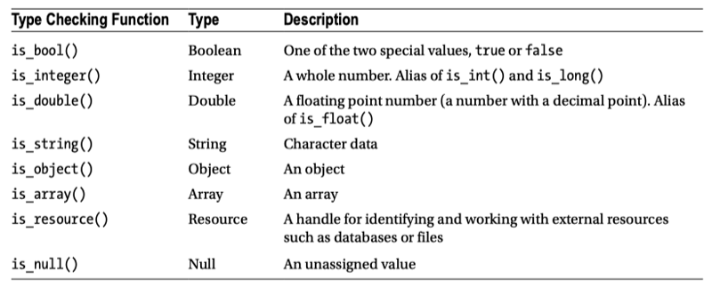
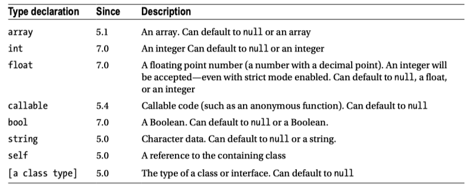

# 03 Object Basics

Objects and classes lie at the heart of this book and, since the introduction of PHP 5 over a decade ago, they have lain at the heart of PHP, too. In this chapter, I lay down the groundwork for more in-depth coverage of objects and design by examining PHP’s core object-oriented features. If you are new to object-oriented programming, you should read this chapter carefully.

This chapter will cover the following topics:

- Constructor methods: Automating the setup of your objects.

- Classes and objects: Declaring classes and instantiating objects.

- Primitive and class types: Why type matters.

- Inheritance: Why we need inheritance and how to use it.

- Visibility: Streamlining your object interfaces and protecting your methods and properties from meddling.

## 01. Classes and Objects

The first barrier to understanding object-oriented programming is the strange and wonderful relationship between the class and the object. For many people, it is this relationship that represents the first moment of revelation, the first flash of object-oriented excitement. So let’s not skimp on the fundamentals.

### 1. A First Class

Classes are often described in terms of objects. This is interesting, because objects are often described in terms of classes. This circularity can make the first steps in object-oriented programming hard going. Because it’s classes that shape objects, we should begin by defining a class.

In short, a class is a code template used to generate one or more objects. You declare a class with the class keyword and an arbitrary class name. Class names can be any combination of numbers and letters, although they must not begin with a number. The code associated with a class must be enclosed within braces. Here I combine these elements to build a class:

```php
// listing 03.01

class ShopProduct
{    
    // class body
}
```

The ShopProduct class in the example is already a legal class, although it is not terribly useful yet. I have done something quite significant, however. I have defined a type; that is, I have created a category of data that I can use in my scripts. The power of this should become clearer as you work through the chapter.

### 2. A First Object (or Two)

If a class is a template for generating objects, it follows that an object is data that has been structured according to the template defined in a class. An object is said to be an instance of its class. It is of the type defined by the class. I use the ShopProduct class as a mold for generating ShopProduct objects. To do this, I need the new operator. The new operator is used in conjunction with the name of a class, like this:

1『 php 里类实例化为对象，用 new 操作符。』

```
// listing 03.02

$product1 = new ShopProduct();
$product2 = new ShopProduct();
```

The new operator is invoked with a class name as its only operand and returns an instance of that class; in our example, it generates a ShopProduct object.

I have used the ShopProduct class as a template to generate two ShopProduct objects. Although they are functionally identical (that is, empty), \$product1 and \$product2 are different objects of the same type generated from a single class. If you are still confused, try this analogy. Think of a class as a cast in a machine that makes plastic ducks. 

1『体现了对象三元素之一的「唯一标识性」，另外 2 个是状态和行为。』

Our objects are the ducks that this machine generates. The type of thing generated is determined by the mold from which it is pressed. The ducks look identical in every way, but they are distinct entities. In other words, they are different instances of the same type. The ducks may even have their own serial numbers to prove their identities. Every object that is created in a PHP script is also given its own unique identifier. (Note that the identifier is unique for the life of the object; that is, PHP reuses identifiers, even within a process).  I can demonstrate this by printing out the \$product1 and \$product2 objects:

```php
// listing 03.03

var_dump($product1);
var_dump($product2);
```

Executing these functions produces the following output:

```php
object(popp\ch03\batch01\ShopProduct)#235 (0) {}
object(popp\ch03\batch01\ShopProduct)#234 (0) {}
```

■ Note: in ancient versions of php (up to version 5.1), you could print an object directly. this casted the object to a string containing the object’s iD. From php 5.2 onward, the language no longer supports this magic, and any attempt to treat an object as a string now causes an error unless a method named \_\_toString() is defined in the object’s class. I look at methods later in this chapter, and I cover \_\_toString() in Chapter 4「advanced Features.」

By passing the objects to var\_dump(), I extract useful information including, after the hash sign, each object’s internal identifier. In order to make these objects more interesting, I can amend the ShopProduct class to support special data fields called properties.

## 02. Setting Properties in a Class

Classes can define special variables called properties. A property, also known as a member variable, holds data that can vary from object to object. So in the case of ShopProduct objects, you may wish to manipulate title and price fields, for example.

A property in a class looks similar to a standard variable except that, in declaring a property, you must precede the property variable with a visibility keyword. This can be public, protected, or private, and it determines the scope from which the property can be accessed. 

■ Note: scope refers to the function or class context in which a variable has meaning (it refers in the same way to methods, which I will cover later in this chapter). so a variable defined in a function exists in local scope, and a variable defined outside of the function exists in global scope. as a rule of thumb, it is not possible to access data defined in a scope that is more local than the current one. so if you define a variable inside a function, you cannot later access it from outside that function. Objects are more permeable than this, in that some object variables can sometimes be accessed from other contexts. Which variables can be accessed and from what context is determined by the public, protected, and private keywords, as you shall see.

I will return to these keywords and the issue of visibility later in this chapter. For now, I will declare some properties using the public keyword:

```php
// listing 03.04

class ShopProduct{    
    public $title = "default product";    
    public $producerMainName = "main name";    
    public $producerFirstName = "first name";    
    public $price  = 0;
}
```

As you can see, I set up four properties, assigning a default value to each of them. Any objects I instantiate from the ShopProduct class will now be prepopulated with default data. The public keyword in each property declaration ensures that I can access the property from outside of the object context.

You can access property variables on an object-by-object basis using the characters '->' (the object operator) in conjunction with an object variable and property name, like this:

```php
// listing 03.05

$product1 = new ShopProduct();
print $product1->title;
```

    default product

Because the properties are defined as public, you can assign values to them just as you can read them, replacing any default value set in the class:

```php
// listing 03.06

$product1 = new ShopProduct();
$product2 = new ShopProduct();
$product1->title="My Antonia";
$product2->title="Catch 22";
```

By declaring and setting the \$title property in the ShopProduct class, I ensure that all ShopProduct objects have this property when first created. This means code that uses this class can work with ShopProduct objects based on that assumption. Because I can reset it, though, the value of \$title may vary from object to object.

■ Note: Code that uses a class, function, or method is often described as the class’s, function’s, or method’s client or as client code. You will see this term frequently in the coming chapters.

In fact, PHP does not force us to declare all our properties in the class. You could add properties dynamically to an object, like this:

```php
// listing 03.07

$product1->arbitraryAddition = "treehouse";
```

However, this method of assigning properties to objects is not considered good practice in object-oriented programming. Why is it bad practice to set properties dynamically? When you create a class you define a type. You inform the world that your class (and any object instantiated from it) consists of a particular set of fields and functions. If your ShopProduct class defines a \$title property, then any code that works with ShopProduct objects can proceed on the assumption that a \$title property will be available. There can be no guarantees about properties that have been dynamically set, though.

1『这不是跟 JS 一样，可以动态添加属性了嘛，赞。但作者却不建议，理由是不好控制。而且可能误加不想要的属性，比如属性名字打错了（后面有例子）。』

My objects are still cumbersome at this stage. When I need to work with an object’s properties, I must currently do so from outside the object. I reach in to set and get property information. Setting multiple properties on multiple objects will soon become a chore:

```php
// listing 03.08

$product1 = new ShopProduct();
$product1->title = "My Antonia";
$product1->producerMainName  = "Cather";
$product1->producerFirstName = "Willa";
$product1->price = 5.99;
```

I work once again with the ShopProduct class, overriding all the default property values one by one until I have set all product details. Now that I have set some data, I can also access it:

```php
// listing 03.09

print "author: {$product1->producerFirstName} "    
    . "{$product1->producerMainName}\n";
```

This outputs the following:

    author: Willa Cather

There are a number of problems with this approach to setting property values. Because PHP lets you set properties dynamically, you will not get warned if you misspell or forget a property name. For example, assume I want to type this line:

```php
$product1->producerMainName  = "Cather";
```

Unfortunately, I mistakenly type it like this:

```php
$product1->producerSecondName  = "Cather";
```

As far as the PHP engine is concerned, this code is perfectly legal, and I would not be warned. When I come to print the author’s name, though, I will get unexpected results.

Another problem is that my class is altogether too relaxed. I am not forced to set a title, a price, or producer names. Client code can be sure that these properties exist, but is likely to be confronted with default values as often as not. Ideally, I would like to encourage anyone who instantiates a ShopProduct object to set meaningful property values.

Finally, I have to jump through hoops to do something that I will probably want to do quite often. As we have seen, printing the full author name is a tiresome process. It would be nice to have the object handle such drudgery on my behalf. All of these problems can be addressed by giving the ShopProduct object its own set of functions that can be used to manipulate property data from within the object context.

1『对象里的成员方法，就是为了解决上面场景遇到的问题而生的，其可以在对象内部操作对象里的数据属性。数据属性声明为私有，在外面只能通过调用成员方法来操作对象里的数据属性，这就解决了在外面误改对象数据属性的可能性。』

## 03. Working with Methods

Just as properties allow your objects to store data, methods allow your objects to perform tasks. Methods are special functions declared within a class. As you might expect, a method declaration resembles a function declaration. The function keyword precedes a method name, followed by an optional list of argument variables in parentheses. The method body is enclosed by braces:

```php
public function myMethod($argument, $another)    
{        
    // ...    
}
```

Unlike functions, methods must be declared in the body of a class. They can also accept a number of qualifiers, including a visibility keyword. Like properties, methods can be declared public, protected, or private. By declaring a method public, you ensure that it can be invoked from outside of the current object. If you omit the visibility keyword in your method declaration, the method will be declared public implicitly. It is considered good practice, however, to declare visibility explicitly for all methods (I will return to method modifiers later in the chapter

```php
// listing 03.10

class ShopProduct
{

    public $title = "default product";    
    public $producerMainName = "main name";    
    public $producerFirstName = "first name";    
    public $price = 0;

    public function getProducer()    {        
    return $this->producerFirstName . " "            
        . $this->producerMainName;    
    }
}
```

In most circumstances, you will invoke a method using an object variable in conjunction with the object operator, ->, and the method name. You must use parentheses in your method call as you would if you were calling a function (even if you are not passing any arguments to the method):

```php
// listing 03.11

$product1 = new ShopProduct();
$product1->title = "My Antonia";
$product1->producerMainName  = "Cather";
$product1->producerFirstName = "Willa";
$product1->price = 5.99;

print "author: {$product1->getProducer()}\n";
```

This outputs the following:

    author: Willa Cather

I add the getProducer() method to the ShopProduct class. Notice that I declare getProducer() public, which means it can be called from outside the class.

I introduce a feature in this method’s body. The \$this pseudo-variable is the mechanism by which a class can refer to an object instance. If you find this concept hard to swallow, try replacing \$this with the phrase「the current instance.」Consider the following statement:

    $this->producerFirstName

This translates to the following: the \$producerFirstName property of the current instance. So the getProducer() method combines and returns the \$producerFirstName and \$producerMainName properties, saving me from the chore of performing this task every time I need to quote the full producer name. This has improved the class a little. I am still stuck with a great deal of unwanted flexibility, though. 

I rely on the client coder to change a ShopProduct object’s properties from their default values. This is problematic in two ways. First, it takes five lines to properly initialize a ShopProduct object, and no coder will thank you for that. Second, I have no way of ensuring that any of the properties are set when a ShopProduct object is initialized. What I need is a method that is called automatically when an object is instantiated from a class.

### Creating a Constructor Method

A constructor method is invoked when an object is created. You can use it to set things up, ensuring that essential properties are assigned values and any necessary preliminary work is completed.

■ Note: in versions previous to php 5, a constructor method took on the name of the class that enclosed it. so the ShopProduct class would use a ShopProduct() method as its constructor. this no longer works in all circumstances and was deprecated as of php 7. Name your constructor method \_\_construct().

Note that the method name begins with two underscore characters. You will see this naming convention for many other special methods in PHP classes. Here I define a constructor for the ShopProduct class:

```php
// listing 03.12

class ShopProduct
{    
    public $title;    
    public $producerMainName;    
    public $producerFirstName;    
    public $price = 0;

    public function __construct(        
        $title,        
        $firstName,        
        $mainName,        
        $price    ) {        
        $this->title = $title;        
        $this->producerFirstName = $firstName;        
        $this->producerMainName = $mainName;        
        $this->price = $price;    
        }

    public function getProducer()    {        
    return $this->producerFirstName . " "            
        . $this->producerMainName;    
    }
}
```

Once again, I gather functionality into the class, saving effort and duplication in the code that uses it. The \_\_construct() method is invoked when an object is created using the new operator:

```
// listing 03.13

$product1 = new ShopProduct(    
    "My Antonia",    
    "Willa",
    "Cather",    
    5.99
);

print "author: {$product1->getProducer()}\n";
```

This produces the following:

    author: Willa Cather

Any arguments supplied are passed to the constructor. So in my example, I pass the title, the first name, the main name, and the product price to the constructor. The constructor method uses the pseudo-variable \$this to assign values to each of the object’s properties.

■ Note:  a ShopProduct object is now easier to instantiate and safer to use. instantiation and setup are completed in a single statement. any code that uses a ShopProduct object can be reasonably sure that all its properties are initialized.

This predictability is an important aspect of object-oriented programming. You should design your classes so that users of objects can be sure of their features. One way you can make an object safe is to render predictable the types of data it holds in its properties. One might ensure that a \$name property is always made up of character data, for example. But how can you achieve this if property data is passed in from outside the class? In the next section, I examine a mechanism you can use to enforce object types in method declarations.

## 04. Arguments and Types

Type determines the way data can be managed in your scripts. You use the string type to display character data, for example, and manipulate such data with string functions. Integers are used in mathematical expressions, Booleans are used in test expressions, and so on. These categories are known as primitive types. On a higher level, though, a class defines a type. A ShopProduct object, therefore, belongs to the primitive type object, but it also belongs to the ShopProduct class type. In this section, I will look at types of both kinds in relation to class methods.

1『 primitive types 类比于 JS 里的 7 大基本语言类型。』

Method and function definitions do not necessarily require that an argument should be of a particular type. This is both a curse and a blessing. The fact that an argument can be of any type offers you flexibility. You can build methods that respond intelligently to different data types, tailoring functionality to changing circumstances. This flexibility can also cause ambiguity to creep into code when a method body expects an argument to hold one type but gets another.

### 1. Primitive Types

PHP is a loosely typed language. This means that there is no necessity for a variable to be declared to hold a particular data type. The variable \$number could hold the value 2 and the string "two" within the same scope. In strongly typed languages, such as C or Java, you must declare the type of a variable before assigning a value to it, and, of course, the value must be of the specified type.

This does not mean that PHP has no concept of type. Every value that can be assigned to a variable has a type. You can determine the type of a variable’s value using one of PHP’s type-checking functions. Table 3-1  lists the primitive types recognized in PHP and their corresponding test functions. Each function accepts a variable or value and returns true if this argument is of the relevant type.

1『表里有检查类型的库函数，基本都是类型名字前面加了个 is\_ ，比如 is\_integer()。』

Table 3-1.  Primitive Types and Checking Functions in PHP



Checking the type of a variable can be particularly important when you work with method and function arguments.

#### Primitive Types Matter: An Example

You need to keep a close eye on type in your code. Here’s an example of one of the many type-related problems that you could encounter.

Imagine that you are extracting configuration settings from an XML file. The \<resolvedomains> XML element tells your application whether it should attempt to resolve IP addresses to domain names, a useful but relatively expensive process. Here is some sample XML:

```
<!-- listing 03.14 -->
<settings>    
    <resolvedomains>false</resolvedomains>
</settings>
```

The string "false" is extracted by your application and passed as a flag to a method called outputAddresses(), which displays IP address data. Here is outputAddresses():

```php
// listing 03.15

class AddressManager
{    
    private $addresses = ["209.131.36.159", "216.58.213.174"];

    public function outputAddresses($resolve)    {        
        foreach ($this->addresses as $address) {            
            print $address;            
            if ($resolve) {                
                print " (".gethostbyaddr($address).")";            
            }            
            print "\n";
        }    
    }
}
```

Of course, the AddressManager class could do with some improvement. It’s not very useful to hardcode IP addresses into a class, for example. Nevertheless, the outputAddresses() method loops through the \$addresses array property, printing each element. If the \$resolve argument variable itself resolves to true, the method outputs the domain name, as well as the IP address.

Here’s one approach that uses the settings XML configuration element in conjunction with the AddressManager class. See if you can spot how it is flawed:

```php
// listing 03.16

$settings = simplexml:load_file(__DIR__."/resolve.xml");
$manager = new AddressManager();
$manager->outputAddresses((string)$settings->resolvedomains);
```

The code fragment uses the SimpleXML API to acquire a value for the resolvedomains element. In this example, I know that this value is the text element "false", and I cast it to a string as the SimpleXML documentation suggests I should.

This code will not behave as you might expect. In passing the string "false" to the outputAddresses() method, I misunderstand the implicit assumption the method makes about the argument. The method is expecting a Boolean value (that is true or false). The string "false" will, in fact, resolve to true in a test. This is because PHP will helpfully cast a nonempty string value to the Boolean true for you in a test context. Consider this code:

```php
if ( "false" ) {    
    // ...
}

    It is actually equivalent to this:

if ( true ) {   
    // ...
 }
```

There are a number of approaches you might take to fix this.You could make the outputAddresses() method more forgiving, so that it recognizes a string and applies some basic rules to convert it to a Boolean equivalent:

```php
// listing 03.17

public function outputAddresses($resolve)    {        
if (is_string($resolve)) {            
$resolve =               
    (preg_match("/^(false|no|off)$/i", $resolve) ) ? false : true;        
    }        
    // ...    
}
```

There are good design reasons for avoiding an approach like this, however. Generally speaking, it is better to provide a clear and strict interface for a method or function than it is to offer a fuzzily forgiving one. Fuzzy and forgiving functions and methods can promote confusion and thereby breed bugs.

You could take another approach: Leave the outputAddresses() method as it is and include a comment containing clear instructions that the \$resolve argument should contain a Boolean value. This approach essentially tells the coder to read the small print or reap the consequences:

```php
/**     
* Outputs the list of addresses.     
* If $resolve is true then each address will be resolved     
* @param    $resolve    boolean    Resolve the address?     
*/    f

unction outputAddresses($resolve)    
{       
    // ...    
}
```

This is a reasonable approach, assuming your client coders are diligent readers of documentation.Finally, you could make outputAddresses() strict about the type of data it is prepared to find in the \$resolve argument. For primitive types like boolean, there was really only one way to do this prior to the release of PHP 7. You would have to write code to examine incoming data and take some kind of action if it does not match the required type:

```php
function outputAddresses($resolve)    
{        
    if (! is_bool($resolve)) {            
        // do something drastic        
    }        
    //...    
}
```

This approach can be used to force client code to provide the correct data type in the \$resolve argument or to issue a warning.

■ Note: in the next section,「taking the hint: Object types,」I will describe a much better way of constraining the type of arguments passed to methods and functions. Converting a string argument on the client’s behalf would be friendly but would probably present other problems. in providing a conversion mechanism, you second-guess the context and intent of the client. by enforcing the boolean data type, on the other hand, you leave the client to decide whether to map strings to boolean values and determine which word should map to true or false. the outputAddresses() method, meanwhile, concentrates on the task it is designed to perform. this emphasis on performing a specific task in deliberate ignorance of the wider context is an important principle in object-oriented programming, and I will return to it frequently throughout the book.

In fact, your strategies for dealing with argument types will depend on the seriousness of any potential bugs on the one hand, and the benefits of flexibility on the other. PHP casts most primitive values for you, depending on context. Numbers in strings are converted to their integer or floating point equivalents when used in a mathematical expression, for example. So your code might be naturally forgiving of type errors. If you expect one of your method arguments to be an array, however, you may need to be more careful. Passing a nonarray value to one of PHP’s array functions will not produce a useful result and could cause a cascade of errors in your method.

It is likely, therefore, that you will strike a balance among testing for type, converting from one type to another, and relying on good, clear documentation (you should provide the documentation, whatever else you decide to do). 

However you address problems of this kind, you can be sure of one thing—type matters. The fact that PHP is loosely typed makes it all the more important. You cannot rely on a compiler to prevent type-related bugs; you must consider the potential impact of unexpected types when they find their way into your arguments. You cannot afford to trust client coders to read your thoughts, and you should always consider how your methods will deal with incoming garbage.

### 2. Taking the Hint: Object Types

Just as an argument variable can contain any primitive type, by default it can contain an object of any type. This flexibility has its uses, but can present problems in the context of a method definition. Imagine a method designed to work with a ShopProduct object:

```php
// listing 03.18

class ShopProductWriter
{    
    public function write($shopProduct)    {        
    $str  = $shopProduct->title . ": "            
        . $shopProduct->getProducer()            
        . " (" . $shopProduct->price . ")\n";        
    print $str;    }
}
```

You can test this class like this:

```php
// listing 03.19

$product1 = new ShopProduct("My Antonia", "Willa", "Cather", 5.99);
$writer = new ShopProductWriter();
$writer->write($product1);
```

This outputs the following:

    My Antonia: Willa Cather (5.99)

The ShopProductWriter class contains a single method, write(). The write() method accepts a ShopProduct object and uses its properties and methods to construct and print a summary string. I used the name of the argument variable, \$shopProduct, as a signal that the method expects a ShopProduct object, but I did not enforce this. That means I could be passed an unexpected object or primitive type and be none the wiser until I begin trying to work with the \$shopProduct argument. By that time, my code may already have acted on the assumption that it has been passed a genuine ShopProduct object.

 ■ Note: You might wonder why I didn't add the write() method directly to ShopProduct. the reason lies with areas of responsibility. the ShopProduct class is responsible for managing product data; the ShopProductWriter is responsible for writing it. You will begin to see why this division of labor can be useful as you read this chapter.

To address this problem, PHP 5 introduced class type declarations (known then as type hints). To add a class type declaration to a method argument, you simply place a class name in front of the method argument you need to constrain. So I can amend the write() method thus:

```php
// listing 03.20

    public function write(ShopProduct $shopProduct)    
    {        
        // ...    
    }
```

Now the write() method will only accept the \$shopProduct argument if it contains an object of type ShopProduct. This snippet tries to call write() with a dodgy object:

1『传递给函数的参数其类型不对是一个大问题，type hints 为此而生，指函数传递的参数前面直接指定类型。』

```
// listing 03.21

class Wrong
{
}

$writer = new ShopProductWriter();
$writer->write(new Wrong());
```

Because the write() method contains a class type declaration, passing it a Wrong object causes a fatal error.

    TypeError: Argument 1 passed to ShopProductWriter::write() must be an instance of ShopProduct, instance of Wrong given, called in Runner.php on ...

This saves me from having to test the type of the argument before I work with it. It also makes the method signature much clearer for the client coder. She can see the requirements of the write() method at a glance. She does not have to worry about some obscure bug arising from a type error because the declaration is rigidly enforced.

Even though this automated type checking is a great way of preventing bugs, it is important to understand that type declarations are checked at runtime. This means that a class declaration will only report an error at the moment that an unwanted object is passed to the method. If a call to write() is buried in a conditional clause that only runs on Christmas morning, you may find yourself working the holiday if you haven’t checked your code carefully.

Armed with scalar type declarations, I can add some constraints to the ShopProduct class:

```php
// listing 03.22

class ShopProduct
{    
    public $title;    
    public $producerMainName;    
    public $producerFirstName;    
    public $price = 0;

    public function __construct(        
    string $title,        
    string $firstName,        
    string $mainName,        
    float $price    
    ) {        
    $this->title = $title;        
    $this->producerFirstName = $firstName;        
    $this->producerMainName = $mainName;        
    $this->price = $price;    }

    // ...
}
```

With the constructor method shored up in this way, I can be sure that the \$title, \$firstName, \$mainName arguments will always contain string data, and that \$price will contain a float. I can demonstrate this by instantiating ShopProduct with the wrong information:

```
// listing 03.23

// will fail
$product = new ShopProduct("title", "first", "main", []);
```

I attempt to instantiate a ShopProduct object. I pass three strings to the constructor, but I fail at the final hurdle by passing in an empty array instead of the required float. Thanks to type declarations, PHP won’t let me get away with that:

    TypeError: Argument 4 passed to ShopProduct::__construct() must be of the type float, array given, called in...

By default, PHP will implicitly cast arguments to the required type, where possible. This is an example of the tension between safety and flexibility we encountered earlier. The new implementation of the ShopProduct class, for example, will quietly turn a string into a float for us. So, this instantiation would not fail:

```php
// listing 03.24

$product = new ShopProduct("title", "first", "main", "4.22");
```

Behind the scenes, the string "4.22" becomes the float 4.22. So far, so useful. But think back to the problem we encountered with the AddressManager class. The string "false" was quietly resolving to the Boolean true. By default, this will still happen if I use a bool type declaration in the AddressManager::outputAddresses() method like this:

```
// listing 03.25

    public function outputAddresses(bool $resolve)    
    {        
        // ...    
    }
```

Now consider a call that passes along a string like this:

```
// listing 03.26

$manager->outputAddresses("false");
```

Because of implicit casting, it is functionally identical to one that passes the Boolean value true.You can make scalar type declarations strict, although only on a file by file basis. Here, I turn on strict type declarations and call outputAddresses() with a string once again:

```
// listing 03.27

declare(strict_types=1);
$manager->outputAddresses("false");
```

Because I declare strict typing, this call causes a TypeError to be thrown:

    TypeError: Argument 1 passed to AddressManager::outputAddresses() must be of the type boolean, string given, called in ...

■ Note:  a strict\_types declaration applies to the file from which a call is made, and not to the file in which a function or method is implemented. so it’s up to client code to enforce strictness.

You may need to make an argument optional, but nonetheless constrain its type if it is provided. You can do this by providing a default value:

```php
// listing 03.28

class ConfReader{

    public function getValues(array $default = null)    
    {        
        $values = [];

        // do something to get values
        // merge the provided defaults (it will always be an array)
        $values = array_merge($default, $values);        
        return $values;    
    }
}
```

In Table 3-2, I list the type declarations supported by PHP.

Table 3-2. Type declarations



array. An array. Can default to null or an array.

int. An integer Can default to null or an integer.

float. A floating point number (a number with a decimal point). An integer will be accepted—even with strict mode enabled. Can default to null, a float, or an integer.

callable. Callable code (such as an anonymous function). Can default to null.

bool. A Boolean. Can default to null or a Boolean.

string. Character data. Can default to null or a string.

self. A reference to the containing class.

[a class type]. The type of a class or interface. Can default to null.

When I described class type declarations, I implied that types and classes are synonymous. There is a key difference between the two, however. When you define a class, you also define a type, but a type can describe an entire family of classes. The mechanism by which different classes can be grouped together under a type is called inheritance. I discuss inheritance in the next section.

## 05. Inheritance

Inheritance is the means by which one or more classes can be derived from a base class.


A class that inherits from another is said to be a subclass of it. This relationship is often described in terms of parents and children. A child class is derived from and inherits characteristics from the parent. These characteristics consist of both properties and methods. The child class will typically add new functionality to that provided by its parent (also known as a superclass); for this reason, a child class is said to extend its parent.

Before I dive into the syntax of inheritance, I’ll examine the problems it can help you to solve.

The Inheritance ProblemLook again at the ShopProduct class. At the moment, it is nicely generic. It can handle all sorts of products:

```
// listing 03.29

$product1 = new ShopProduct("My Antonia", "Willa", "Cather", 5.99);$product2 = new ShopProduct(    "Exile on Coldharbour Lane",    "The",

    "Alabama 3",    10.99);print "author: " . $product1->getProducer() . "\n";print "artist: " . $product2->getProducer() . "\n";
```

Here’s the output:

author: Willa Catherartist: The Alabama 3

Separating the producer name into two parts works well with both books and CDs. I want to be able to sort on「Alabama 3」and「Cather」, not on「The」and「Willa」. Laziness is an excellent design strategy, so there is no need to worry about using ShopProduct for more than one kind of product at this stage.

If I add some new requirements to my example, however, things rapidly become more complicated. 

Imagine, for example, that you need to represent data specific to books and CDs. For CDs, you must store the total playing time; for books, the total number of pages. There could be any number of other differences, but this will serve to illustrate the issue.

How can I extend my example to accommodate these changes? Two options immediately present 

themselves. First, I could throw all the data into the ShopProduct class. Second, I could split ShopProduct into two separate classes.

Let’s examine the first approach. Here, I combine CD- and book-related data in a single class:

```
// listing 03.30

class ShopProduct{    public $numPages;    public $playLength;    public $title;    public $producerMainName;    public $producerFirstName;    public $price;

    public function __construct(        string $title,        string $firstName,        string $mainName,        float $price,        int $numPages = 0,        int $playLength = 0    ) {        $this->title             = $title;        $this->producerFirstName = $firstName;        $this->producerMainName  = $mainName;        $this->price             = $price;        $this->numPages          = $numPages;        $this->playLength        = $playLength;    }

    public function getNumberOfPages()    {        return $this->numPages;    }

    public function getPlayLength()    {        return $this->playLength;    }

    public function getProducer()    {        return $this->producerFirstName . " "            . $this->producerMainName;    }}
```

I have provided method access to the $numPages and $playLength properties to illustrate the divergent 

forces at work here. An object instantiated from this class will include a redundant method and, for a CD, must be instantiated using an unnecessary constructor argument: a CD will store information and functionality relating to book pages, and a book will support play-length data. This is probably something you could live with right now. But what would happen if I added more product types, each with its own methods, and then added more methods for each type? Our class would become increasingly complex and hard to manage.

So forcing fields that don’t belong together into a single class leads to bloated objects with redundant 

properties and methods.

The problem doesn’t end with data, either. I run into difficulties with functionality as well. Consider 

a method that summarizes a product. The sales department has requested a clear summary line for use in invoices. They want me to include the playing time for CDs and a page count for books, so I will be forced to provide different implementations for each type. I could try using a flag to keep track of the object’s format. Here’s an example:

```
// listing 03.31

    public function getSummaryLine()    {        $base  = "{$this->title} ( {$this->producerMainName}, ";        $base .= "{$this->producerFirstName} )";        if ($this->type == 'book') {            $base .= ": page count - {$this->numPages}";        } elseif ($this->type == 'cd') {            $base .= ": playing time - {$this->playLength}";        }        return $base;    }
```

In order to set the $type property, I could test the $numPages argument to the constructor. Still, once again, the ShopProduct class has become more complex than necessary. As I add more differences to my formats, or add new formats, these functional differences will become even harder to manage. Perhaps I should try another approach to this problem.

As ShopProduct is beginning to feel like two classes in one, I could accept this and create two types 

rather than one. Here’s how I might do it:

```
// listing 03.32

class CdProduct{    public $playLength;    public $title;    public $producerMainName;    public $producerFirstName;    public $price;

    public function __construct(        string $title,        string $firstName,        string $mainName,        float  $price,        int    $playLength    ) {        $this->title             = $title;        $this->producerFirstName = $firstName;        $this->producerMainName  = $mainName;        $this->price             = $price;        $this->playLength        = $playLength;    }

    public function getPlayLength()    {        return $this->playLength;    }

    public function getSummaryLine()    {        $base  = "{$this->title} ( {$this->producerMainName}, ";        $base .= "{$this->producerFirstName} )";        $base .= ": playing time - {$this->playLength}";        return $base;    }

    public function getProducer()    {        return $this->producerFirstName . " "            . $this->producerMainName;    }}
```

```
// listing 03.33

class BookProduct{    public $numPages;    public $title;    public $producerMainName;

    public $producerFirstName;    public $price;

    public function __construct(        string $title,        string $firstName,        string $mainName,        float  $price,        int    $numPages    ) {        $this->title             = $title;        $this->producerFirstName = $firstName;        $this->producerMainName  = $mainName;        $this->price             = $price;        $this->numPages          = $numPages;    }

    public function getNumberOfPages()    {        return $this->numPages;    }

    public function getSummaryLine()    {        $base  = "{$this->title} ( {$this->producerMainName}, ";        $base .= "{$this->producerFirstName} )";        $base .= ": page count - {$this->numPages}";        return $base;    }

    public function getProducer()    {        return $this->producerFirstName . " "            . $this->producerMainName;    }}
```

I have addressed the complexity issue, but at a cost. I can now create a getSummaryLine() method for 

each format without having to test a flag. Neither class maintains fields or methods that are not relevant to it.

The cost lies in duplication. The getProducerName() method is exactly the same in each class. Each 

constructor sets a number of identical properties in the same way. This is another unpleasant odor you should train yourself to sniff out.

If I need the getProducer() methods to behave identically for each class, any changes I make to one implementation will need to be made for the other. Without care, the classes will soon slip out of synchronization.

Even if I am confident that I can maintain the duplication, my worries are not over. I now have two types 

rather than one.

Remember the ShopProductWriter class? Its write() method is designed to work with a single type: ShopProduct. How can I amend this to work as before? I could remove the class type declaration from the method signature, but then I must trust to luck that write() is passed an object of the correct type. I could add my own type checking code to the body of the method:

```
// listing 03.34

class ShopProductWriter{    public function write($shopProduct)    {        if (            ! ($shopProduct instanceof CdProduct)  &&            ! ($shopProduct instanceof BookProduct)        ) {            die("wrong type supplied");        }        $str  = "{$shopProduct->title}: "            . $shopProduct->getProducer()            . " ({$shopProduct->price})\n";        print $str;    }}
```

Notice the instanceof operator in the example; instanceof resolves to true if the object in the left-

hand operand is of the type represented by the right-hand operand.

Once again, I have been forced to include a new layer of complexity. Not only do I have to test the \$shopProduct argument against two types in the write() method, but I have to trust that each type will continue to support the same fields and methods as the other. It was all much neater when I simply demanded a single type because I could use a class type declaration and because I could be confident that the ShopProduct class supported a particular interface.

The CD and book aspects of the ShopProduct class don’t work well together but can’t live apart, it 

seems. I want to work with books and CDs as a single type while providing a separate implementation for each format. I want to provide common functionality in one place to avoid duplication, but allow each format to handle some method calls differently. I need to use inheritance.

Working with InheritanceThe first step in building an inheritance tree is to find the elements of the base class that don’t fit together or that need to be handled differently.

I know that the getPlayLength() and getNumberOfPages() methods do not belong together. I also know that I need to create different implementations for the getSummaryLine() method. Let’s use these differences as the basis for two derived classes:

```
// listing 03.35

class ShopProduct{    public $numPages;    public $playLength;    public $title;    public $producerMainName;    public $producerFirstName;    public $price;    public function __construct(        string $title,


        string $firstName,        string $mainName,        float  $price,        int    $numPages = 0,        int    $playLength = 0    ) {        $this->title             = $title;        $this->producerFirstName = $firstName;        $this->producerMainName  = $mainName;        $this->price             = $price;        $this->numPages          = $numPages;        $this->playLength        = $playLength;    }

    public function getProducer()    {        return $this->producerFirstName . " "            . $this->producerMainName;    }

    public function getSummaryLine()    {        $base  = "{$this->title} ( {$this->producerMainName}, ";        $base .= "{$this->producerFirstName} )";        return $base;    }}
```


```
// listing 03.36

class CdProduct extends ShopProduct{    public function getPlayLength()    {        return $this->playLength;    }

    public function getSummaryLine()    {        $base  = "{$this->title} ( {$this->producerMainName}, ";        $base .= "{$this->producerFirstName} )";        $base .= ": playing time - {$this->playLength}";        return $base;    }}
```

```
// listing 03.37

class BookProduct extends ShopProduct{    public function getNumberOfPages()

    {        return $this->numPages;    }

    public function getSummaryLine()    {        $base  = "{$this->title} ( {$this->producerMainName}, ";        $base .= "{$this->producerFirstName} )";        $base .= ": page count - {$this->numPages}";        return $base;    }}
```

To create a child class, you must use the extends keyword in the class declaration. In the example, I 

created two new classes, BookProduct and CdProduct. Both extend the ShopProduct class.

Because the derived classes do not define constructors, the parent class’s constructor is automatically invoked when they are instantiated. The child classes inherit access to all the parent’s public and protected methods (though not to private methods or properties). This means that you can call the getProducer() method on an object instantiated from the CdProduct class, even though getProducer() is defined in the ShopProduct class:

```
// listing 03.38

$product2 = new CdProduct(    "Exile on Coldharbour Lane",    "The",    "Alabama 3",    10.99,    0,    60.33);print "artist: {$product2->getProducer()}\n";
```

So both the child classes inherit the behavior of the common parent. You can treat a BookProduct 

object as if it were a ShopProduct object. You can pass a BookProduct or CdProduct object to the ShopProductWriter class’s write() method and all will work as expected.

Notice that both the CdProduct and BookProduct classes override the getSummaryLine() method, 

providing their own implementation. Derived classes can extend but also alter the functionality of their parents.

The super class’s implementation of this method might seem redundant because it is overridden by both its children. Nevertheless, it provides basic functionality that new child classes might use. The method’s presence also provides a guarantee to client code that all ShopProduct objects will provide a getSummaryLine() method. Later on you will see how it is possible to make this promise in a base class without providing any implementation at all. Each child ShopProduct class inherits its parent’s properties. Both BookProduct and CdProduct access the \$title property in their versions of getSummaryLine().

Inheritance can be a difficult concept to grasp at first. By defining a class that extends another, you ensure that an object instantiated from it is defined by the characteristics of first the child and then the parent class. Another way of thinking about this is in terms of searching. When I invoke \$product2->getProducer(), there is no such method to be found in the CdProduct class, and the invocation falls through to the default implementation in ShopProduct. When I invoke \$product2->getSummaryLine(), on the other hand, the getSummaryLine() method is found in CdProduct and invoked.

The same is true of property accesses. When I access \$title in the BookProduct class’s 

getSummaryLine() method, the property is not found in the BookProduct class. It is acquired instead from the parent class, from ShopProduct. The \$title property applies equally to both subclasses, and therefore, it belongs in the superclass.

A quick look at the ShopProduct constructor, however, shows that I am still managing data in the base class that should be handled by its children. The BookProduct class should handle the \$numPages argument and property, and the CdProduct class should handle the \$playLength argument and property. To make this work, I will define constructor methods in each of the child classes.

Constructors and InheritanceWhen you define a constructor in a child class, you become responsible for passing any arguments on to the parent. If you fail to do this, you can end up with a partially constructed object.

To invoke a method in a parent class, you must first find a way of referring to the class itself: a handle. 

PHP provides us with the parent keyword for this purpose.

To refer to a method in the context of a class rather than an object, you use :: rather than ->:

parent::__construct()

The preceding means,「Invoke the __construct() method of the parent class.」Here I amend my 

example so that each class handles only the data that is appropriate to it:

```
// listing 03.39

class ShopProduct{    public $title;    public $producerMainName;    public $producerFirstName;    public $price;

    function __construct(        $title,        $firstName,        $mainName,        $price    ) {        $this->title             = $title;        $this->producerFirstName = $firstName;        $this->producerMainName  = $mainName;        $this->price             = $price;    }

    function getProducer()    {        return $this->producerFirstName . " "            . $this->producerMainName;    }

    function getSummaryLine()    {

        $base  = "{$this->title} ( {$this->producerMainName}, ";        $base .= "{$this->producerFirstName} )";        return $base;    }}
```

```
// listing 03.40

class BookProduct extends ShopProduct{    public $numPages;

    public function __construct(        string $title,        string $firstName,        string $mainName,        float  $price,        int    $numPages    ) {        parent::__construct(            $title,            $firstName,            $mainName,            $price        );        $this->numPages = $numPages;    }

    public function getNumberOfPages()    {        return $this->numPages;    }

    public function getSummaryLine()    {        $base  = "{$this->title} ( $this->producerMainName, ";        $base .= "$this->producerFirstName )";        $base .= ": page count – {$this->numPages}";        return $base;    }}
```

```
// listing 03.41

class CdProduct extends ShopProduct{    public $playLength;

    public function __construct(        string $title,        string $firstName,

        string $mainName,        float  $price,        int    $playLength    ) {        parent::__construct(            $title,            $firstName,            $mainName,            $price        );        $this->playLength = $playLength;    }

    public function getPlayLength()    {        return $this->playLength;    }

    public function getSummaryLine()    {        $base  = "{$this->title} ( {$this->producerMainName}, ";        $base .= "{$this->producerFirstName} )";        $base .= ": playing time - {$this->playLength}";        return $base;    }}
```

Each child class invokes the constructor of its parent before setting its own properties. The base class now knows only about its own data. Child classes are generally specializations of their parents. As a rule of thumb, you should avoid giving parent classes any special knowledge about their children.

 prior to php 5, constructors took on the name of the enclosing class. the new unified constructors 

 ■ Note use the name __construct(). Using the old syntax, a call to a parent constructor would tie you to that particular class: parent::ShopProduct();. the old constructor syntax was deprecated in php 7.0 and should not be used.

Invoking an Overridden MethodThe parent keyword can be used with any method that overrides its counterpart in a parent class. When you override a method, you may not wish to obliterate the functionality of the parent, but rather to extend it. You can achieve this by calling the parent class’s method in the current object’s context. If you look again at the getSummaryLine() method implementations, you will see that they duplicate a lot of code. It would be better to use rather than reproduce the functionality already developed in the ShopProduct class:

```
// listing 03.42

// ShopProduct class...

    function getSummaryLine()

    {        $base  = "{$this->title} ( {$this->producerMainName}, ";        $base .= "{$this->producerFirstName} )";        return $base;    }
```

```
// listing 03.43

// BookProduct class...

    public function getSummaryLine()    {        $base  = parent::getSummaryLine();        $base .= ": page count - $this->numPages";        return $base;    }
```

I set up the core functionality for the getSummaryLine() method in the ShopProduct base class. Rather 

than reproduce this in the CdProduct and BookProduct subclasses, I simply call the parent method before proceeding to add more data to the summary string.

Now that you have seen the basics of inheritance, I will reexamine property and method visibility in 

light of the full picture.

Public, Private, and Protected: Managing Access to Your ClassesSo far, I have declared all properties public. Public access is the default setting for methods and for properties if you use the old var keyword in your property declaration.

Elements in your classes can be declared public, private, or protected:

Public properties and methods can be accessed from any context.

A private method or property can only be accessed from within the enclosing class. Even subclasses have no access.

A protected method or property can only be accessed from within either the enclosing class or from a subclass. No external code is granted access.

So how is this useful to us? Visibility keywords allow you to expose only those aspects of a class that are 

required by a client. This sets a clear interface for your object.

By preventing a client from accessing certain properties, access control can also help prevent bugs in 

your code. Imagine, for example, that you want to allow ShopProduct objects to support a discount. You could add a \$discount property and a setDiscount() method:


```
// listing 03.44

// ShopProduct class

    public $discount = 0;//...

    public function setDiscount(int $num)    {        $this->discount = $num;    }
```

Armed with a mechanism for setting a discount, you can create a getPrice() method that takes 

account of the discount that has been applied:

```
    public function getPrice()    {        return ($this->price - $this->discount);    }
```

At this point, you have a problem. You only want to expose the adjusted price to the world, but a client 

can easily bypass the getPrice() method and access the \$price property:

    print "The price is {$product1->price}\n";

This will print the raw price and not the discount-adjusted price you wish to present. You can put a stop to this straight away by making the \$price property private. This will prevent direct access, forcing clients to use the getPrice() method. Any attempt from outside the ShopProduct class to access the \$price property will fail. As far as the wider world is concerned, this property has ceased to exist.

Setting properties to private can be an overzealous strategy. A private property cannot be accessed by 

a child class. Imagine that our business rules state that books alone should be ineligible for discounts. You could override the getPrice() method so that it returns the \$price property, applying no discount:

```
// listing 03.45

// BookProduct

    public function getPrice()    {        return $this->price;    }
```

As the private \$price property is declared in the ShopProduct class and not BookProduct, the attempt to 

access it here will fail. The solution to this problem is to declare \$price protected, thereby granting access to descendant classes. Remember that a protected property or method cannot be accessed from outside the class hierarchy in which it was declared. It can only be accessed from within its originating class or from within children of the originating class.

As a general rule, err on the side of privacy. Make properties private or protected at first and relax your 

restriction only as needed. Many (if not most) methods in your classes will be public, but once again, if in doubt, lock it down. A method that provides local functionality for other methods in your class has no relevance to your class’s users. Make it private or protected.

Accessor MethodsEven when client programmers need to work with values held by your class, it is often a good idea to deny direct access to properties, providing methods instead that relay the needed values. Such methods are known as accessors or getters and setters.

You have already seen one benefit afforded by accessor methods. You can use an accessor to filter a 

property value according to circumstances, as was illustrated by the getPrice() method.

You can also use a setter method to enforce a property type. Type declarations can be used to constrain 

method arguments, but a property can contain data of any type. Remember the ShopProductWriter class that uses a ShopProduct object to output list data? I can develop this further, so that it writes any number of ShopProduct objects at one time:

```
// listing 03.46

class ShopProductWriter{    public $products = [];

    public function addProduct(ShopProduct $shopProduct)    {        $this->products[] = $shopProduct;    }

    public function write()    {        $str =  "";        foreach ($this->products as $shopProduct) {            $str .= "{$shopProduct->title}: ";            $str .= $shopProduct->getProducer();            $str .= " ({$shopProduct->getPrice()})\n";        }        print $str;    }}
```

The ShopProductWriter class is now much more useful. It can hold many ShopProduct objects and 

write data for them all in one go. I must trust my client coders to respect the intentions of the class, though. Despite the fact that I have provided an addProduct() method, I have not prevented programmers from manipulating the \$products property directly. Not only could someone add the wrong kind of object to the \$products array property, but he could even overwrite the entire array and replace it with a primitive value. I can prevent this by making the \$products property private:

```
class ShopProductWriter {    private $products = [];//...
```

It’s now impossible for external code to damage the \$products property. All access must be via the addProduct() method, and the class type declaration I use in the method declaration ensures that only ShopProduct objects can be added to the array property.

The ShopProduct ClassesLet’s close this chapter by amending the ShopProduct class and its children to lock down access control:

```
// listing 03.48

class ShopProduct{    private   $title;    private   $producerMainName;    private   $producerFirstName;    protected $price;    private   $discount = 0;

    public function __construct(        string $title,        string $firstName,        string $mainName,        float  $price    ) {        $this->title             = $title;        $this->producerFirstName = $firstName;        $this->producerMainName  = $mainName;        $this->price             = $price;    }

    public function getProducerFirstName()    {        return $this->producerFirstName;    }

    public function getProducerMainName()    {        return $this->producerMainName;    }

    public function setDiscount($num)    {        $this->discount = $num;    }

    public function getDiscount()    {        return $this->discount;    }

    public function getTitle()    {        return $this->title;    }

    public function getPrice()    {        return ($this->price - $this->discount);    }

    public function getProducer()    {        return $this->producerFirstName . 」」           . $this->producerMainName;    }

    public function getSummaryLine()    {        $base  = "{$this->title} ( {$this->producerMainName}, ";        $base .= "{$this->producerFirstName} )";

        return $base;    }}
```

```
// listing 03.49

class CdProduct extends ShopProduct{    private $playLength;    public function __construct(        string $title,        string $firstName,        string $mainName,        float  $price,        int    $playLength    ) {        parent::__construct(            $title,            $firstName,            $mainName,            $price        );        $this->playLength = $playLength;    }

    public function getPlayLength()    {        return $this->playLength;    }

    public function getSummaryLine()    {        $base  = "{$this->title} ( {$this->producerMainName}, ";        $base .= "{$this->producerFirstName} )";        $base .= ": playing time - {$this->playLength}";        return $base;    }}
```

```
// listing 03.50

class BookProduct extends ShopProduct{    private $numPages;

    public function __construct(        string $title,        string $firstName,        string $mainName,        float  $price,        int    $numPages    ) {

        parent::__construct(            $title,            $firstName,            $mainName,            $price        );        $this->numPages = $numPages;    }

    public function getNumberOfPages()    {        return $this->numPages;    }

    public function getSummaryLine()    {        $base  = parent::getSummaryLine();        $base .= ": page count - $this->numPages";        return $base;    }

    public function getPrice()    {        return $this->price;    }}
```

There is nothing substantially new in this version of the ShopProduct family. All properties are either private or protected, and I added a number of accessor methods to round things off.

## Summary

This chapter covered a lot of ground, taking a class from an empty implementation through to a fully featured inheritance hierarchy. You took in some design issues, particularly with regard to type and inheritance. You saw PHP’s support for visibility and explored some of its uses. In the next chapter, I will show you more of PHP’s object-oriented features.
