# 02 Grammar

I know it well:

I read it in the grammar long ago.

—William Shakespeare, The Tragedy of Titus Andronicus 

This chapter introduces the grammar of the good parts of JavaScript, presenting a quick overview of how the language is structured. We will represent the grammar with railroad diagrams.

The rules for interpreting these diagrams are simple:

• You start on the left edge and follow the tracks to the right edge.

• As you go, you will encounter literals in ovals, and rules or descriptions in rectangles.『图里面圆形的是 literals，矩形的是 rules or descriptions. 』

• Any sequence that can be made by following the tracks is legal.

• Any sequence that cannot be made by following the tracks is not legal.

• Railroad diagrams with one bar at each end allow whitespace to be inserted between any pair of tokens. Railroad diagrams with two bars at each end do not.

The grammar of the good parts presented in this chapter is significantly simpler than the grammar of the whole language.

## 01. Whitespace

Whitespace can take the form of formatting characters or comments. Whitespace is usually insignificant, but it is occasionally necessary to use whitespace to separate sequences of characters that would otherwise be combined into a single token. For example, in:

    var that = this;

the space between var and that cannot be removed, but the other spaces can be removed.

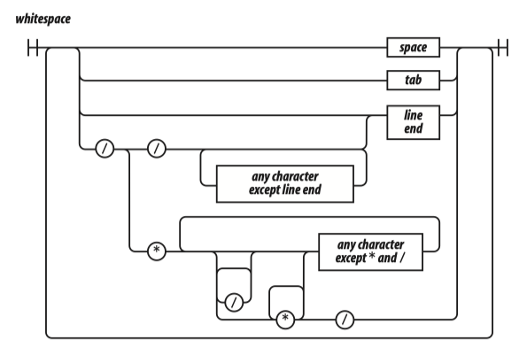

JavaScript offers two forms of comments, block comments formed with /* */ and line-ending comments starting with //. Comments should be used liberally to improve the readability of your programs. Take care that the comments always accurately describe the code. Obsolete comments are worse than no comments.

The /* */ form of block comments came from a language called PL/I. PL/I chose those strange pairs as the symbols for comments because they were unlikely to occur in that language’s programs, except perhaps in string literals. In JavaScript, those pairs can also occur in regular expression literals, so block comments are not safe for commenting out blocks of code. For example:

```
/*
var rm_a = /a*/.match(s);
*/
```

causes a syntax error. So, it is recommended that /* */ comments be avoided and // comments be used instead. In this book, // will be used exclusively.

## 02. Names

A name is a letter optionally followed by one or more letters, digits, or underbars. A name cannot be one of these reserved words:

```
abstract 
boolean break byte 
case catch char class const continue 
debugger default delete do double
else enum export extends 
false final finally float for function 
goto 
if implements import in instanceof int interface
long 
native new null 
package private protected public 
return 
short static super switch synchronized 
this throw throws transient true try typeof 
var volatile void
while with
```


Most of the reserved words in this list are not used in the language. The list does not include some words that should have been reserved but were not, such as undefined, NaN, and Infinity. It is not permitted to name a variable or parameter with a reserved word. Worse, it is not permitted to use a reserved word as the name of an object property in an object literal or following a dot in a refinement.

Names are used for statements, variables, parameters, property names, operators, and labels.

## 03. Numbers


JavaScript has a single number type. Internally, it is represented as 64-bit floating point, the same as Java’s double. Unlike most other programming languages, there is no separate integer type, so 1 and 1.0 are the same value. This is a significant convenience because problems of overflow in short integers are completely avoided, and all you need to know about a number is that it is a number. A large class of numeric type errors is avoided.

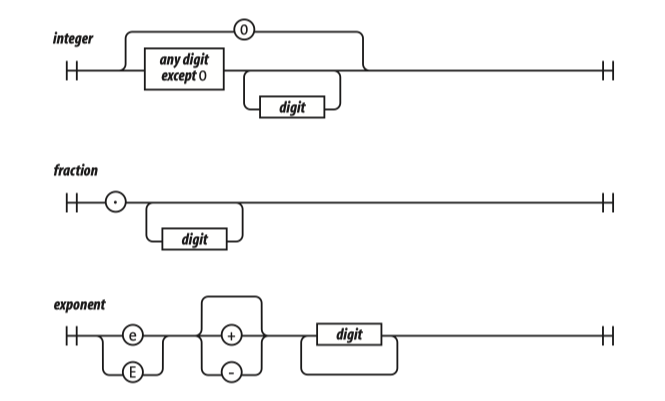

If a number literal has an exponent part, then the value of the literal is computed by multiplying the part before the e by 10 raised to the power of the part after the e. So 100 and 1e2 are the same number.

Negative numbers can be formed by using the – prefix operator.

The value NaN is a number value that is the result of an operation that cannot produce a normal result. NaN is not equal to any value, including itself. You can detect NaN with the isNaN (number) function.

The value Infinity represents all values greater than 1.79769313486231570e+308.

Numbers have methods (see Chapter 8). JavaScript has a Math object that contains a set of methods that act on numbers. For example, the Math.floor (number) method can be used to convert a number into an integer.

## 04. Strings

A string literal can be wrapped in single quotes or double quotes. It can contain zero or more characters. The \ (backslash) is the escape character. JavaScript was built at a time when Unicode was a 16-bit character set, so all characters in JavaScript are 16 bits wide.

JavaScript does not have a character type. To represent a character, make a string with just one character in it.

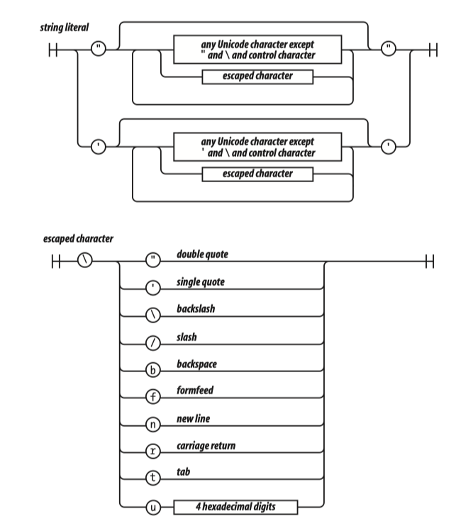

The escape sequences allow for inserting characters into strings that are not normally permitted, such as backslashes, quotes, and control characters. The \u convention allows for specifying character code points numerically.

    "A" === "\u0041"

Strings have a length property. For example, "seven".length is 5.

Strings are immutable. Once it is made, a string can never be changed. But it is easy to make a new string by concatenating other strings together with the + operator.

Two strings containing exactly the same characters in the same order are considered to be the same string. So:

    'c' + 'a' + 't' === 'cat'

is true.

Strings have methods (see Chapter 8):

    'cat'.toUpperCase( ) === 'CAT'

## 05. Statements

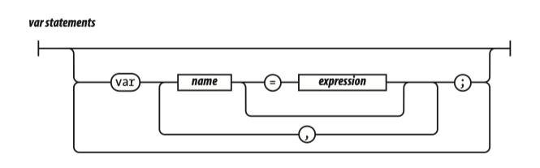

A compilation unit contains a set of executable statements. In web browsers, each \<script> tag delivers a compilation unit that is compiled and immediately executed. Lacking a linker, JavaScript throws them all together in a common global namespace. There is more on global variables in Appendix A.

When used inside of a function, the var statement defines the function’s private variables. 

The switch, while, for, and do statements are allowed to have an optional label prefix that interacts with the break statement.

Statements tend to be executed in order from top to bottom. The sequence of execution can be altered by the conditional statements (if and switch), by the looping statements (while, for, and do), by the disruptive statements (break, return, and throw), and by function invocation.

A block is a set of statements wrapped in curly braces. Unlike many other languages, blocks in JavaScript do not create a new scope, so variables should be defined at the top of the function, not in blocks.

The if statement changes the flow of the program based on the value of the expression. The then block is executed if the expression is truthy; otherwise, the optional else branch is taken.

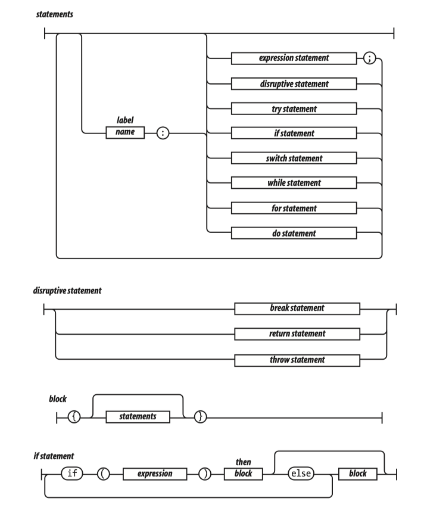

Here are the falsy values:

• false

• null

• undefined

• The empty string ''

• The number 0

• The number NaN

All other values are truthy, including true, the string 'false', and all objects.

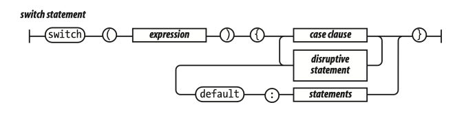

The switch statement performs a multiway branch. It compares the expression for equality with all of the specified cases. The expression can produce a number or a string. When an exact match is found, the statements of the matching case clause are executed. If there is no match, the optional default statements are executed.


A case clause contains one or more case expressions. The case expressions need not be constants. The statement following a clause should be a disruptive statement to prevent fall through into the next case. The break statement can be used to exit from a switch.

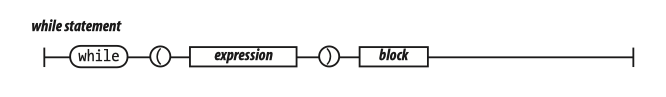

The while statement performs a simple loop. If the expression is falsy, then the loop will break. While the expression is truthy, the block will be executed.


The for statement is a more complicated looping statement. It comes in two forms.

The conventional form is controlled by three optional clauses: the initialization, the condition, and the increment. First, the initialization is done, which typically initializes the loop variable. Then, the condition is evaluated. Typically, this tests the loop variable against a completion criterion. If the condition is omitted, then a condition of true is assumed. If the condition is falsy, the loop breaks. Otherwise, the block is executed, then the increment executes, and then the loop repeats with the condition.

The other form (called for in) enumerates the property names (or keys) of an object. On each iteration, another property name string from the object is assigned to the variable.

It is usually necessary to test object.hasOwnProperty(variable) to determine whether the property name is truly a member of the object or was found instead on the prototype chain.

```
for (myvar in obj) {
    if (obj.hasOwnProperty(myvar)) {
    ...
    }
}
```


The do statement is like the while statement except that the expression is tested after the block is executed instead of before. That means that the block will always be executed at least once.

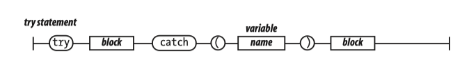

The try statement executes a block and catches any exceptions that were thrown by the block. The catch clause defines a new variable that will receive the exception object.


The throw statement raises an exception. If the throw statement is in a try block, then control goes to the catch clause. Otherwise, the function invocation is abandoned, and control goes to the catch clause of the try in the calling function. The expression is usually an object literal containing a name property and a message property. The catcher of the exception can use that information to determine what to do.

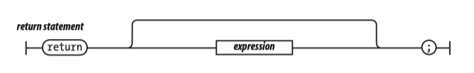

The return statement causes the early return from a function. It can also specify the value to be returned. If a return expression is not specified, then the return value will be undefined.

JavaScript does not allow a line end between the return and the expression.

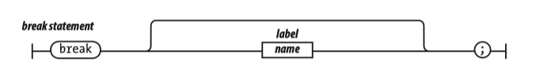

The break statement causes the exit from a loop statement or a switch statement. It can optionally have a label that will cause an exit from the labeled statement.

JavaScript does not allow a line end between the break and the label.


An expression statement can either assign values to one or more variables or members, invoke a method, delete a property from an object. The = operator is used for assignment. Do not confuse it with the === equality operator. The += operator can add or concatenate.

## 06. Expressions

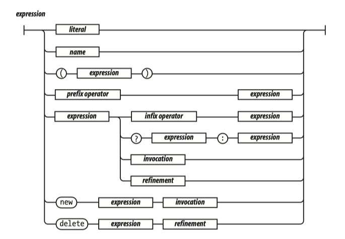

The simplest expressions are a literal value (such as a string or number), a variable, a built-in value (true, false, null, undefined, NaN, or Infinity), an invocation expression preceded by new, a refinement expression preceded by delete, an expression wrapped in parentheses, an expression preceded by a prefix operator, or an expression followed by:


• An infix operator and another expression

• The ? ternary operator followed by another expression, then by :, and then by yet another expression

• An invocation

• A refinement

The ? ternary operator takes three operands. If the first operand is truthy, it produces the value of the second operand. But if the first operand is falsy, it produces the value of the third operand.

Expressions

|

15

The operators at the top of the operator precedence list in Table 2-1 have higher precedence. They bind the tightest. The operators at the bottom have the lowest precedence. Parentheses can be used to alter the normal precedence, so: 2 + 3 * 5 === 17

(2 + 3) * 5 === 25

Table 2-1. Operator precedence

. [] ( )

Refinement and invocation

delete new typeof + - !

Unary operators

* / %

Multiplication, division, modulo

+ -

Addition/concatenation, subtraction

>= <= > <

Inequality

=== !==

Equality

&&

Logical and

||

Logical or

?:

Ternary

prefix operator

type of

typeof

to number

+

negate

-

logical not

!

The values produced by typeof are 'number', 'string', 'boolean', 'undefined',

'function', and 'object'. If the operand is an array or null, then the result is

'object', which is wrong. There will be more about typeof in Chapter 6 and

Appendix A.

If the operand of ! is truthy, it produces false. Otherwise, it produces true.

The + operator adds or concatenates. If youwant it to add, make sure both operands are numbers.

The / operator can produce a noninteger result even if both operands are integers.

The && operator produces the value of its first operand if the first operand is falsy.

Otherwise, it produces the value of the second operand.

16

|

Chapter 2: Grammar

infix operator

logical or

||

multiply

add

greater or equal

equal

logical and

*

+

>=

===

&&

divide

subtract

less or equal

not equal

/

-

<=

!==

modulo

greater

%

>

less

<

The || operator produces the value of its first operand if the first operand is truthy.

Otherwise, it produces the value of the second operand.

invocation

(

expression

)

,

Invocation causes the execution of a function value. The invocation operator is a pair of parentheses that follow the function value. The parentheses can contain arguments that will be delivered to the function. There will be much more about func-

tions in Chapter 4.

refinement

.

name

[

expression

]

A refinement is used to specify a property or element of an object or array. This will be described in detail in the next chapter.

Literals

Object literals are a convenient notation for specifying new objects. The names of the properties can be specified as names or as strings. The names are treated as literal names, not as variable names, so the names of the properties of the object must be known at compile time. The values of the properties are expressions. There will be more about object literals in the next chapter.

Literals

|

17

literal

number literal

string literal

object literal

array literal

function

regexp literal

object literal

{

name

:

expression

}

string

,

array literal

[

expression

]

,

Array literals are a convenient notation for specifying new arrays. There will be more

about array literals in Chapter 6.

regexp literal

regexp choice

/

/

g

i

m

There will be more about regular expressions in Chapter 7.

18

|

Chapter 2: Grammar

Functions

function literal

function

name

parameters

function body

parameters

(

name

)

,

function body

{

var statements

statements

}

A function literal defines a function value. It can have an optional name that it can use to call itself recursively. It can specify a list of parameters that will act as variables initialized by the invocation arguments. The body of the function includes vari-

able definitions and statements. There will be more about functions in Chapter 4.

Functions

|

19

Chapter 3

CHAPTER 3

Objects

3

Upon a homely object Love can wink.

