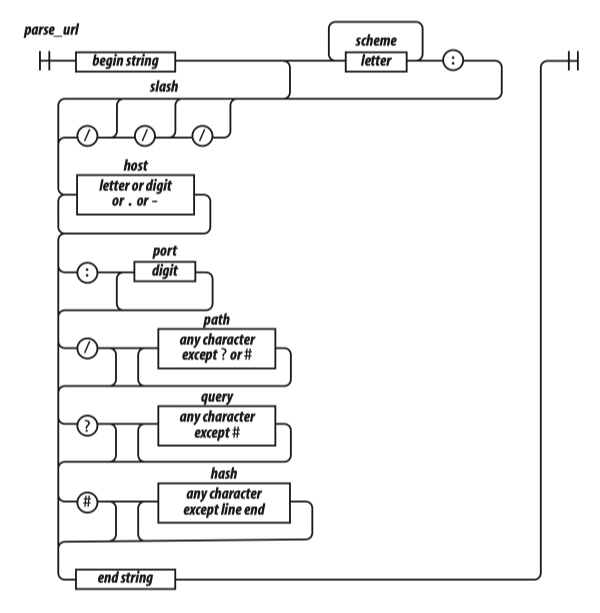
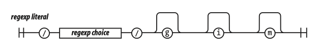
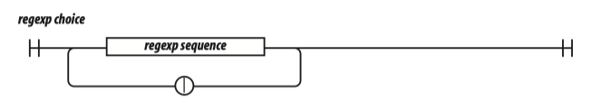
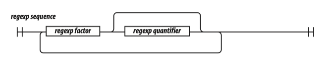
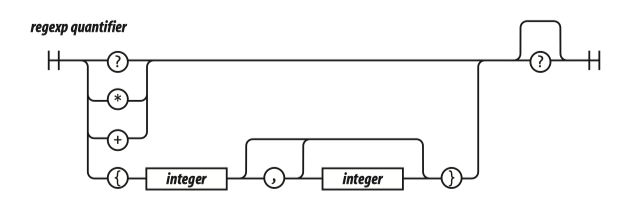

# 07 Regular Expressions

Whereas the contrary bringeth bliss,

And is a pattern of celestial peace.

Whom should we match with Henry, being a king...

—William Shakespeare, The First Part of Henry the Sixth

Many of JavaScript’s features were borrowed from other languages. The syntax came from Java, functions came from Scheme, and prototypal inheritance came from Self. JavaScript’s Regular Expression feature was borrowed from Perl.

A regular expression is the specification of the syntax of a simple language. Regular expressions are used with methods to search, replace, and extract information from strings. The methods that work with regular expressions are regexp.exec, regexp.test, string.match, string.replace, string.search, and string.split. These will all be described in Chapter 8. Regular expressions usually have a significant performance advantage over equivalent string operations in JavaScript.

Regular expressions came from the mathematical study of formal languages. Ken Thompson adapted Stephen Kleene’s theoretical work on type-3 languages into a practical pattern matcher that could be embedded in tools such as text editors and programming languages.

The syntax of regular expressions in JavaScript conforms closely to the original formulations from Bell Labs, with some reinterpretation and extension adopted from Perl. The rules for writing regular expressions can be surprisingly complex because they interpret characters in some positions as operators, and in slightly different positions as literals. Worse than being hard to write, this makes regular expressions hard to read and dangerous to modify. It is necessary to have a fairly complete understanding of the full complexity of regular expressions to correctly read them.

To mitigate this, I have simplified the rules a little. As presented here, regular expressions will be slightly less terse, but they will also be slightly easier to use correctly. And that is a good thing because regular expressions can be very difficult to maintain and debug.

Today’s regular expressions are not strictly regular, but they can be very useful. Regular expressions tend to be extremely terse, even cryptic. They are easy to use in their simplest form, but they can quickly become bewildering. JavaScript’s regular expressions are difficult to read in part because they do not allow comments or whitespace.

『正则表达式起源于对形式语言（formal language）的数学研究。Ken Thompson 基于 Stephen Kleene 对 type-3 语言的理论研究写出了一个切实可用的模式匹配器，它能够被嵌入到编程语言和像文本编辑器这样的工具中。在 Javascript 中，正则表达式的语法是对 Perl 版本的改进和发展，它非常接近于贝尔实验室（Bell Labs）最初提出的构想。正则表达式的书写规则出奇地复杂，在某些位置上的字符串可能解析为运算符，而仅在位置上稍微不同的相同字符串却可能被当做字面量。比不易书写更糟糕的是，这使得正则表达式不仅难以阅读，而且修改时充满危险。要想正确地阅读它们，就必须对正则表达式的整个复杂性有相当透彻的理解。为了缓解这个问题，我对它的规则进行了些许简化。这里所展示的正则表达式可能稍微有些不够简洁，但使用它们的时候不会那么容易出错。这是值得的，因为维护和调试正则表达式可能非常困难。』

All of the parts of a regular expression are pushed tightly together, making them almost indecipherable. This is a particular concern when they are used in security applications for scanning and validation. If you cannot read and understand a regular expression, how can you have confidence that it will work correctly for all inputs? Yet, despite their obvious drawbacks, regular expressions are widely used.

Scheme，一种多范型的蝙程语言，它是两种 Iisp 主要的方言之一。而 Iisp（全名 LISt Processor，即链表处理语言）是由约输·麦卡锡在 1960 年左右创造的一种基于 lambda 演算的函数式编程语言；Self 语言，是一种基于原型的面向对象程序设计语言，于 1986 年由范乐帕洛阿尔托研究中心的 David Ungar 和 Randy Smith 给出了最初的设计；在数学、逻辑和计算机科学中，形式语言是用精确的数学或机器可处理的公式定义的语言。

## 01. An Example

Here is an example. It is a regular expression that matches URLs. The pages of this book are not infinitely wide, so I broke it into two lines. In a JavaScript program, the regular expression must be on a single line. Whitespace is significant: 

Let’s call parse_url’s exec method. If it successfully matches the string that we pass it, it will return an array containing pieces extracted from the url: 

```js
var parse_url = /^(?:([A-Za-z]+):)?(\/{0,3})([0-9.\-A-Za-z]+) (?::(\d+))?(?:\/([^?#]*))?(?:\?([^#]*))?(?:#(.*))?$/;
var url = "http://www.ora.com:80/goodparts?q#fragment"; 
var result = parse_url.exec(url);

var names = ['url', 'scheme', 'slash', 'host', 'port', 'path', 'query', 'hash'];
var blanks = ' ';
var i;
for (i = 0; i < names.length; i += 1) {
    document.writeln(names[i] + ':' +
    blanks.substring(names[i].length), result[i]);
}
```

This produces:

```js
url: http://www.ora.com:80/goodparts?q#fragment
scheme: http
slash: //
host: www.ora.com
port: 80
path: goodparts
query: q
hash: fragment
```

In Chapter 2, we used railroad diagrams to describe the JavaScript language. We can also use them to describe the languages defined by regular expressions. That may make it easier to see what a regular expression does. This is a railroad diagram for parse_url.



Regular expressions cannot be broken into smaller pieces the way that functions can, so the track representing parse_url is a long one.

Let’s factor parse_url into its parts to see how it works:

    ^

The ^ character indicates the beginning of the string. It is an anchor that prevents exec from skipping over a non-URL-like prefix:

    (?:([A-Za-z]+):)?

This factor matches a scheme name, but only if it is followed by a : (colon). The (?:...) indicates a noncapturing group. The suffix ? indicates that the group is optional.

1『这里要用扩展表示法「?:」。The suffix ? indicates that the group is optional. 看来是表示可选的。』

It means repeat zero or one time. The (...) indicates a capturing group. A capturing group copies the text it matches and places it in the result array. Each capturing group is given a number. This first capturing group is 1, so a copy of the text matched by this capturing group will appear in result[1]. The [...] indicates a character class. This character class, A-Za-z, contains 26 uppercase letters and 26 lowercase letters. The hyphens indicate ranges, from A to Z. The suffix + indicates that the character class will be matched one or more times. The group is followed by the : character, which will be matched literally:

『这个因子匹配一个协议名，但仅当它后面限随一个：（冒号）的时候オ匹配。（？表示一个非捕获型分组（noncapturing group）。后缀 ？表示这个分组是可选的。它表示重复 0 次或 1 次表示一个捕获型分组（capturing group）。一个捕获型分组会复制它所匹配的文本，并把其放到 result 数组里。毎个捕获型分组都会被指定一个编号。第一个捕获型分组的编号是 1，所以该分组所匹配的文本副本会出现在 result [1] 表示一个字符类。A-2a-z 这个字符类包含 26 个大写字母和 26 个小写字母。连字符（-）表示范围从 A 到 Z。后级 + 表示这个字符类会被匹配一次或多次。这个组后面跟着字符：，它会按字面进行匹配。』

3『扩展表示法，它们是以问号开始（?…）。 它们通常用于在判断匹配之前提供标记，实现一个前视（或者后视）匹配，或者条件检查。尽管圆括号使用这些符号，但是只有（?P\<name>）表述一个分组匹配。所有其他的都没有创建一个分组。然而，你仍然需要知道它们是什么，因为它们可能最适合用于你所需要完成的任务。「2019082Core-PythonR00.md」』

    (\/{0,3})

The next factor is capturing group 2. \/ indicates that a / (slash) character should be matched. It is escaped with \ (backslash) so that it is not misinterpreted as the end of the regular expression literal. The suffix {0,3} indicates that the / will be matched 0 or 1 or 2 or 3 times:

    ([0-9.\-A-Za-z]+)

The next factor is capturing group 3. It will match a host name, which is made up of one or more digits, letters, or . or –. The – was escaped as \- to prevent it from being confused with a range hyphen:

    (?::(\d+))?

The next factor optionally matches a port number, which is a sequence of one or more digits preceded by a :. \d represents a digit character. The series of one or more digits will be capturing group 4:

    (?:\/([^?#]*))?

We have another optional group. This one begins with a /. The character class [^?#] begins with a ^, which indicates that the class includes all characters except ? and #. The * indicates that the character class is matched zero or more times.

Note that I am being sloppy here. The class of all characters except ? and # includes line-ending characters, control characters, and lots of other characters that really shouldn’t be matched here. Most of the time this will do want we want, but there is a risk that some bad text could slip through. Sloppy regular expressions are a popular source of security exploits. It is a lot easier to write sloppy regular expressions than rigorous regular expressions:

    (?:\?([^#]*))?

Next, we have an optional group that begins with a ?. It contains capturing group 6, which contains zero or more characters that are not #: 

    (?:#(.*))?

We have a final optional group that begins with #. The . will match any character except a line-ending character:

    $

The \$ represents the end of the string. It assures us that there was no extra material after the end of the URL.

Those are the factors of the regular expression parse_url.

It is possible to make regular expressions that are more complex than parse_url, bu t I wouldn’t recommend it. Regular expressions are best when they are short and simple. Only then can we have confidence that they are working correctly and that they could be successfully modified if necessary.

There is a very high degree of compatibility between JavaScript language processors.

The part of the language that is least portable is the implementation of regular expressions. Regular expressions that are very complicated or convoluted are more likely to have portability problems. Nested regular expressions can also suffer horrible performance problems in some implementations. Simplicity is the best strategy.

『 Javascript 的语言处理程序之间兼容性非常高。这门语言中最没有移植性的部分就是对正则表达式的实现。结构复杂或令人费解的正则表达式很有可能导致移植性问题。在执行某些匹配时，嵌套的正则表达式也能导致极恶劣的性能问题。因此简单是最好的策略。』

Let’s look at another example: a regular expression that matches numbers. Numbers can have an integer part with an optional minus sign, an optional fractional part, and an optional exponent part:

```js
var parse_number = /^-?\d+(?:\.\d*)?(?:e[+\-]?\d+)?$/i; 
var test = function (num) {
    document.writeln(parse_number.test(num));
};

test('1'); // true
test('number'); // false
test('98.6'); // true
test('132.21.86.100'); // false
test('123.45E-67'); // true
test('123.45D-67'); // false
```

parse_number successfully identified the strings that conformed to our specification and those that did not, but for those that did not, it gives us no information on why or where they failed the number test. Let’s break down parse\_number:

    /^ $/i

We again use ^ and \$ to anchor the regular expression. This causes all of the characters in the text to be matched against the regular expression. If we had omitted the anchors, the regular expression would tell us if a string contains a number. With the anchors, it tells us if the string contains only a number. If we included just the ^, it would match strings starting with a number. If we included just the \$, it would match strings ending with a number.

『我们又用 ^ 和 \$ 来框定这个正则表达式。它指引这个正则表达式对文本中的所有字符都进行匹配。如果我们省略了这些标识，那么只要一个字符串包含一个数字，这个正则表达式就会进行匹配。但有了这些标识，只有当一个字符串的内容仅为一个数字时，它才会告诉我们。如果我们仅包含 ^，它将匹配以一个数字开头的字符串。如果我们仅包含 \$，则匹配以个数字结尾的字符串。』

1『指定起始很重要，做匹配的时候要养成习惯。但在做替换的时候应该是不需要的。（2020-03-29）』


The i flag causes case to be ignored when matching letters. The only letter in our pattern is e. We want that e to also match E. We could have written the e factor as [Ee] or (?:E|e), but we didn’t have to because we used the i flag:

『 i 标识表示匹配字母时忽略大小写。在我们的模式中唯一可能出现的字母是 e。我们希望既能匹配 e，也能匹配 E。我们可以把 e 因子写成 [Ee] 或 (?:E|e)，但不必这么麻烦，因为我们使用了标识符 i。』

    -?

The ? suffix on the minus sign indicates that the minus sign is optional:

    \d+

\d means the same as [0-9]. It matches a digit. The + suffix causes it to match one or more digits:

    (?:\.\d*)?

The (?:...)? indicates an optional noncapturing group. It is usually better to use noncapturing groups instead of the less ugly capturing groups because capturing has a performance penalty. The group will match a decimal point followed by zero or more digits:

1『通常用非捕获型分组来替代少量不优美日获型分组是很好的方法，因为捕获会有性能上的损失。』

    (?:e[+\-]?\d+)?

This is another optional noncapturing group. It matches e (or E), an optional sign, and one or more digits.

## 02. Construction

There are two ways to make a RegExp object. The preferred way, as we saw in the examples, is to use a regular expression literal.



Regular expression literals are enclosed in slashes. This can be a little tricky because slash is also used as the division operator and in comments. 

There are three flags that can be set on a RegExp. They are indicated by the letters g, i, and m, as listed in Table 7-1. The flags are appended directly to the end of the RegExp literal:

```js
// Make a regular expression object that matches
// a JavaScript string.
var my_regexp = /"(?:\\.|[^\\\"])*"/g;
```

1) g, Global (match multiple times; the precise meaning of this varies with the method). 2) i, Insensitive (ignore character case). 3) m, Multiline (^ and \$ can match line-ending characters).

The other way to make a regular expression is to use the RegExp constructor. The constructor takes a string and compiles it into a RegExp object. Some care must be taken in building the string because backslashes have a somewhat different meaning in regular expressions than in string literals. It is usually necessary to double the backslashes and escape the quotes:

创建这个字符串时请多加小心，因为反斜杠在正则表达式和在字符串字面量中有一些不同的含义。通常需要双写反斜杠，以及对引号进行转义。

```js
// Make a regular expression object that matches
// a JavaScript string.

var my_regexp = new RegExp("\"(?:\\.|[^\\\\\\\"])*\"", 'g'); 
```

The second parameter is a string specifying the flags. The RegExp constructor is useful when a regular expression must be generated at runtime using material that is not available to the programmer. RegExp objects contain the properties listed in Table 7-2.

Table 7-2. Properties of RegExp objects (Property | Use)

1) global. true if the g flag was used. 2) ignoreCase. true if the i flag was used. 3) lastIndex. The index at which to start the next exec match. Initially it is zero. 4) multiline. true if the m flag was used. 5) source. The source text of the regular expression.

RegExp objects made by regular expression literals share a single instance: 

```js
function make\_a\_matcher( ) {
    return /a/gi;
}

var x = make_a_matcher( );
var y = make_a_matcher( );

// Beware: x and y are the same object!
x.lastIndex = 10;
document.writeln(y.lastIndex); // 10
```

## 03. Elements

Let’s look more closely at the elements that make up regular expressions.

### 1. Regexp Choice



A regexp choice contains one or more regexp sequences. The sequences are separated by the | (vertical bar) character. The choice matches if any of the sequences match. It attempts to match each of the sequences in order. So:

    "into".match(/in|int/)

matches the in in into. It wouldn’t match int because the match of in was successful.

### 2. Regexp Sequence



A regexp sequence contains one or more regexp factors. Each factor can optionally be followed by a quantifier that determines how many times the factor is allowed to appear. If there is no quantifier, then the factor will be matched one time.

### 3. Regexp Factor


A regexp factor can be a character, a parenthesized group, a character class, or an escape sequence. All characters are treated literally except for the control characters and the special characters:

    \ / [ ] ( ) { } ? + * | . ^ $

1『正则里的特殊字符就上面的几个，牢记哦。』

which must be escaped with a \ prefix if they are to be matched literally. When in doubt, any special character can be given a \ prefix to make it literal. The \ prefix does not make letters or digits literal.

An unescaped . matches any character except a line-ending character. An unescaped ^ matches the beginning of the text when the lastIndex property is zero. It can also match line-ending characters when the m flag is specified. An unescaped \$ matches the end of the text. It can also match line-ending characters when the m flag is specified.

1『加上标识符 (?s) 的话，点号也可以匹配换行符 \n。』

当 lastindex 属性值为 0 时，一个未转义的 ^ 会匹配文本的开始。当指定了 m 标识时，它也能匹配行结束符。一个未转义的 \$ 将匹配文本的结束。当指定了 m 标识时，它也能匹配行结束符。

### 4. Regexp Escape

The backslash character indicates escapement in regexp factors as well as in strings, but in regexp factors, it works a little differently.

As in strings, \f is the formfeed character, \n is the newline character, \r is the carriage return character, \t is the tab character, and \u allows for specifying a Unicode character as a 16-bit hex constant. In regexp factors, \b is not the backspace character. \d is the same as [0-9]. It matches a digit. \D is the opposite: [^0-9]. 

\s is the same as [\f\n\r\t\u000B\u0020\u00A0\u2028\u2029]. This is a partial set of Unicode whitespace characters. \S is the opposite: [^\f\n\r\t\u000B\u0020\u00A0\u2028\ u2029].

\w is the same as [0-9A-Z_a-z]. \W is the opposite: [^0-9A-Z_a-z]. This is supposed to represent the characters that appear in words. Unfortunately, the class it defines is useless for working with virtually any real language. If you need to match a class of letters, you must specify your own class.

像在字符串中一样，\f 是换页符，\n 是换行符，\r 是回车符，\t 是制表（tab）符，并且\ u 允许指定一个 Unicode 字符来表示一个十六进制的常量。但在正则表达式因子中，\b 不是退格（backspace）符。\w 本意是希望表示出现在话语中的字符。遗憾的是，它所定义的类实际上对任何真正的语言来说都不起作用，如果你需要匹配信件一类的文本，你必须指定自己的类。


A simple letter class is [A-Za-z\u00C0-\u1FFF\u2800-\uFFFD]. It includes all of Unicode’s letters, but it also includes thousands of characters that are not letters. Unicode is large and complex. An exact letter class of the Basic Multilingual Plane is possible, but would be huge and inefficient. JavaScript’s regular expressions provide extremely poor support for internationalization.

\b was intended to be a word-boundary anchor that would make it easier to match text on word boundaries. Unfortunately, it uses \w to find word boundaries, so it is completely useless for multilingual applications. This is not a good part.

\1 is a reference to the text that was captured by group 1 so that it can be matched again. For example, you could search text for duplicated words with: 

doubled_words looks for occurrences of words (strings containing 1 or more letters) followed by whitespace followed by the same word. \2 is a reference to group 2, \3 is a reference to group 3, and so on.

```js
var doubled_words =
    /[A-Za-z\u00C0-\u1FFF\u2800-\uFFFD'\-]+\s+\1/gi;
```

\b 被指定为一个字边界标识，它方便用于对文本的字边界进行匹配。遗憾的是，它使用 \w 去寻找字边界，所以它对多语言应用来说是完全无用的。这并不是个好的特性。\1 是指向分组 1 所捕获到的文本的一个引用，所以它能被再次匹配。例如，你能用下面的正则表达式来搜索文本中的重复的单词。Doubled words 会寻找重复的单词（包含一个或多个字母的字符串），该单词的后面跟着个或多个空白，然后再跟着与它相同的单词。

### 5. Regexp Group

There are four kinds of groups:

1) Capturing. A capturing group is a regexp choice wrapped in parentheses. The characters that match the group will be captured. Every capture group is given a number. The first capturing ( in the regular expression is group 1. The second capturing ( in the regular expression is group 2.


2) Noncapturing. A noncapturing group has a (?: prefix. A noncapturing group simply matches; it does not capture the matched text. This has the advantage of slight faster performance. Noncapturing groups do not interfere with the numbering of capturing groups.

3) Positive lookahead. A positive lookahead group has a (?= prefix. It is like a noncapturing group except that after the group matches, the text is rewound to where the group started, effectively matching nothing. This is not a good part. 4) Negative lookahead. A negative lookahead group has a (?! prefix. It is like a positive lookahead group, except that it matches only if it fails to match. This is not a good part.

非捕获型分组有一个 (?: 前缀。非捕获型分组仅做简单的匹配，并不会捕获所匹配的文本。这会带来微弱的性能优势。非捕获型分组不会干扰捕获型分组的编号。向前正向匹配分组类似于非捕获型分组，但在这个组匹配后，文本会倒回到它开始的地方，实际上并不匹配任何东西。这不是一个好的特性。向前负向匹配分组类似于向前正向匹配分组，但只有当它匹配失败时它才继续向前进行匹配。这不是一个好的特性。

### 6. Regexp Class


A regexp class is a convenient way of specifying one of a set of characters. For example, if we wanted to match a vowel, we could write (?:a | e | i | o | u), but it is more conveniently written as the class [aeiou]. Classes provide two other conveniences. The first is that ranges of characters can be specified. So, the set of 32 ASCII special characters:

```js
! " # $ % & ' ( ) * + , - . / :
; < = > ? @ [ \ ] ^ _ ` { | } ~
```

could be written as:

    (?:!|"|#|\$|%|&|'|\(|\)|\*|\+|,|-|\.|\/|:|;|<|=|>|@|\[|\\|]|\^|_|` |\{|\||\}|~) 

but is slightly more nicely written as:

    [!-\/:-@\[-`{-~]

which includes the characters from ! through / and : through @ and [ through ànd { through ~. It is still pretty nasty looking. The other convenience is the complementing of a class. If the first character after the [ is ^, then the class excludes the specified characters. So [^!-\/:-@\[-`{-~] matches any character that is not one of the ASCII special characters.

它包括从 ！到 /、从 ：到 、从（ 到 ` 和从 [ 到 ~ 的字符。但它看起来依旧相当难以阅读。另一个方便之处是类的求反。如果 [ 后的第一个字符是 ^，那么这个类会排除这些特殊字符，所以取反的正则会匹配任何一个非 ASCI 特殊字符的字符。

### 7. Regexp Class Escape


The rules of escapement within a character class are slightly different than those for a regexp factor. [\b] is the backspace character. Here are the special characters that should be escaped in a character class:

    - / [ \ ] ^

### 8. Regexp Quantifier



A regexp factor may have a regexp quantifier suffix that determines how many times the factor should match. A number wrapped in curly braces means that the factor should match that many times. So, /www/ matches the same as /w{3}/. {3,6} will match 3, 4, 5, or 6 times. {3,} will match 3 or more times. ? is the same as {0,1}. * is the same as {0,}. + is the same as {1,}.

Matching tends to be greedy, matching as many repetitions as possible up to the limit, if there is one. If the quantifier has an extra ? suffix, then matching tends to be lazy, attempting to match as few repetitions as possible. It is usually best to stick with the greedy matching.

如果只有一个量词，表示趋向于进行贪梦性匹配，即匹配尽可能多的副本直至达到上限。如果这个量词附加一个后缀 ?，则表示趋向于进行非贪梦匹配，即只匹配必要的副本就好。一般情况下最好坚持使用贪婪性匹配。