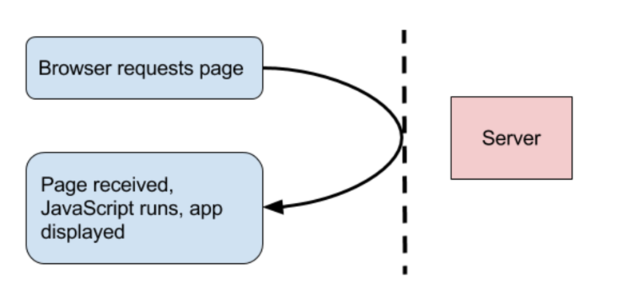

# Avoid This Common Anti-Pattern In Full-Stack Vue/Laravel Apps

Anthony Gore | August 6th, 2017 | 5 min read

相关文章：

[Pre-Render A Vue.js App (With Node Or Laravel) - Vue.js Developers](https://vuejsdevelopers.com/2017/04/01/vue-js-prerendering-node-laravel/)

[The Ultimate AJAX Guide For Vue.js Apps - Vue.js Developers](https://vuejsdevelopers.com/2017/08/28/vue-js-ajax-recipes/)

[Advanced Server-Side Rendering With Laravel & Vue: Multi-Page App - Vue.js Developers](https://vuejsdevelopers.com/2017/11/27/vue-js-laravel-server-side-rendering-router/)

If you want your Vue.js single-page app to communicate with a Laravel backend, you will, quite reasonably, think of using AJAX. Indeed, Laravel comes with the Axios library loaded in by default. However, it's not advisable to use AJAX to retrieve application state on the initial page load, as it requires an extra round-trip to the server that will delay your Vue app from rendering.

1『不建议在首页获取数据信息。』

I see many full-stack Vue/Laravel apps architected in this way. An alternative to this anti-pattern is to inject initial application state into the head of the HTML page so it's available to the app as soon as it's needed. AJAX can then be used more appropriately for subsequent data fetches.

Using this approach can get messy, though, if your app has different routes requiring different initial state. In this article, I'll demonstrate a design pattern that makes it very simple to implement this injection approach, and allows for a lot of flexibility even in multi-route apps.

As you'll shortly see, an example app I created is interactive 25% sooner when implementing this design pattern.

## 01. Passing Data To Vue From Laravel

Here's an example full-stack Vue/Laravel app I built for Oldtime Cars, a fictitious vintage car retailer. The app has a front page, which shows available cars, and a generic detail page, which shows the specifics of a particular model.

This app uses Vue Router to handle page navigation. Each page needs data from the backend (e.g. the name of the car model, the price etc), so a mechanism for sending it between Vue and Laravel is required. The standard design pattern is to setup API endpoints for each page in Laravel, then use Vue Router's beforeRouteEnter hook to asynchronously load the data via AJAX before the page transitions.

1『常规的数据请求过程：后台为每一个配一个 api，页面跳转前用 vue 的 beforeRouteEnter 钩子去异步请求数据。』

The problem with such an architecture is that it gives us this sub-optimal loading process for the initial page load:


Eliminating the AJAX request here would make the page interactive much sooner, especially on slow internet connections.

## 02. Injecting initial application state

If we inject the initial application state into the HTML page, Vue Router won't need to request it from the server, as it will already be available in the client. We can implement this by JSON-encoding the state server-side and assigning it to a global variable:

index.html

```html
<html>
...
<head>
  ...
  <script type="text/javascript">
   window.__INITIAL_STATE__ = '{ "cars": [ { "id": 1 "name": "Buick", ... }, { ... } ] }'
  </script>
</head>
<body>
  <div id="app"></div>
</body>
</html>
```

It is then trivial for the app to access and use the state:

```js
let initialState = JSON.parse(window.__INITIAL_STATE__);

new Vue({
  ...
})
```

This approach eliminates the need for an AJAX request, and reduces the initial app loading process to this:



I've supplied Lighthouse reports at the bottom of the article to show the improvement in load time.

Note: this approach won't be appropriate if the initial application state includes sensitive data. In that case, you could perhaps do a "hybrid" approach where only non-sensitive data is injected into the page and the sensitive data is retrieved by an authenticated API call.

## 03. Implementation in a multi-route app

This approach is good enough as-is in an app with only a single route, or if you're happy to inject the initial state of every page within each page requested. But Oldtime Cars has multiple routes, and it'd be much more efficient to only inject the initial state of the current page.

This means we have the following problems to address: 1) How can we determine what initial state to inject into the page request, since we don't know what page the user will initially land on? 2) When the user navigates to a different route from within the app, how will the app know whether or not it needs to load new state or just use the injected state?

### 3.1 Navigation types

Vue Router is able to capture any route changes that occur from within the page and handle them without a page refresh. That means clicked links, or JavaScript commands that change the browser location. But route changes from the browser e.g. the URL bar, or links to the app from external pages, cannot be intercepted by Vue Router and will result in a fresh page load.

### 3.2 Core concept of the design pattern

With that in mind, we need to ensure that each page has the required logic to get its data from either an injection into the page, or via AJAX, depending on whether the page is being loaded freshly from the server, or by Vue Router.

1『状态的切换其实就 2 种，一是 vue-router 控制的页面间路由的跳转，不涉及后台的路由。另外一个是后台路由的跳转。』

Implementing this is simpler than it sounds, and is best understood through demonstration, so let's go through the code of Oldtime Cars and I'll show you how I did it. You can see the complete code in this Github repo [ [anthonygore/oldtime-cars-vue-laravel](https://github.com/anthonygore/oldtime-cars-vue-laravel) ].

2『源码有空看下。』

## 04. Backend setup

### 4.1 Routes

As the site has two pages, there are two different routes to serve: the home route, and the detail route. The design pattern requires that the routes be served either views, or as JSON payloads, so I've created both web and API routes for each:

routes/web.php

```php
<?php

Route::get('/', 'CarController@home_web');
Route::get('/detail/{id}', 'CarController@detail_web');

```

routes/api.php
```php
<?php

Route::get('/', 'CarController@home_api');
Route::get('/detail/{id}', 'CarController@detail_api');
```

1『老套路，2 手准备，返回页面视图以及返回纯数据对象。这是针对于在 laravel 里前后端一体化的场景，那么前后端分离该如何实现同时返回这两手呢？（2020-05-22）』

### 4.2 Controller

I've abbreviated some of the code to save space, but the main idea is this: the web routes return a view with the initial application state injected into the head of the page (the template is shown below), while the API routes return exactly the same state, only as a payload.

(Also note that in addition to the state, the data includes a path. I'll need this value in the frontend, as you'll see shortly).

app/Http/Controllers/CarController.php

```php
<?php

namespace App\Http\Controllers;

use Illuminate\Http\Request;

class CarController extends Controller
{

  /* This function returns the data for each car, by id */
  public function get_cars($id) { ... }

  /* Returns a view */
  public function detail_web($id)
  {
      $state = array_merge([ 'path' => '/detail/' . $id], $this->get_cars($id));
      return view('app', ['state' => $state]);
  }

  /* Returns a JSON payload */
  public function detail_api($id)
  {
      $state = array_merge([ 'path' => '/detail/' . $id], $this->get_cars($id));
      return response()->json($state);
  }

  public function home_web() { ... }

  public function home_api() { ... }
}
```

### 4.3 View

I'm using the same template for each page. Its only notable feature is that it will encode the state as JSON in the head:

resource/views/app.blade.php

```html
<!DOCTYPE html>
<html>
<head>
  <script type="text/javascript">
    window.__INITIAL_STATE__ = "{!! addslashes(json_encode($fields)) !!}";
  </script>
</head>
<body>
  <div id="app"...>
</body>
</html>
```

## 05. Frontend setup

### 5.1 Router

The frontend of the app uses a standard Vue Router setup. I have a different component for each page i.e. Home.vue and Detail.vue. Note that the router is in history mode, because I want each route to treated separately.

1『如果想让每个 vue-router 被独立的处理，得使用 history 模式而非 hash 模式。』

resources/assets/js/app.js

```js
import Vue from 'vue';
import VueRouter from 'vue-router';

Vue.use(VueRouter);

import Home from './components/Home.vue';
import Detail from './components/Detail.vue';

const router = new VueRouter({
  mode: 'history',
  routes: [
    { path: '/', component: Home },
    { path: '/detail/:id', component: Detail }
  ]
});

const app = new Vue({
  el: '#app',
  router
});
```

### 5.2 Page components

There's very little going on in the page components. The key logic is in a mixin which I'll show next.

Home.vue

```html
<template>
  <div>
    <h1>Oldtime Cars</h1>
    <div v-for="car in cars"...>
  </div>
</template>
<script>
  import mixin  from '../mixin';

  export default {
    mixins: [ mixin ],
    data() {
      return {
        cars: null
      }
    }
  };
</script>
```

### 5.3 Mixin

1『有关 mixin 的知识点来了，其实就是一个封装方法，如果用 vue-state 管理状态的话可以不用它，哈哈。』

This mixin needs to be added to all the page components, in this case Home and Detail. Here's how it works:

1. Adds a beforeRouteEnter hook to each page component. When the app first loads, or whenever the route changes, this hook is called. It in turn calls the getData method.

2. The getData method loads the injected state and inspects the path property. From this, it determine if it can use the injected data, or if it needs to fetch new data. If the latter, it requests the appropriate API endpoint with the Axios HTTP client.

3. When the promise returned from getData resolves, the beforeRouteEnter hook will use whatever data is returned, and assign it to the data property of that component.

mixin.js

```js
import axios from 'axios';

let getData = function(to) {
  return new Promise((resolve, reject) => {
    let initialState = JSON.parse(window.__INITIAL_STATE__) || {};
    if (!initialState.path || to.path !== initialState.path) {
      axios.get(`/api${to.path}`).then(({ data }) => {
        resolve(data);
      })
    } else {
      resolve(initialState);
    }
  });
};

export default {
  beforeRouteEnter (to, from, next) {
    getData(to).then((data) => {
      next(vm => Object.assign(vm.$data, data))
    });
  }
};
```

1『上面的代码总算是吃透了，哈哈。（2020-05-22）』

By implementing this mixin, the page components have the required logic to get their initial state from either the data injected into the page, or via AJAX, depending on whether the page loaded from the server, or was navigated to from Vue Router.

## 06. Performance improvements for Oldtime Cars

I've generated some reports on the app performance using the Lighthouse Chrome extension. If I skip all of the above and go back to the standard pattern of load initial application state from the API, the Lighthouse report is as follows:

One metric of relevance is the time to first meaningful paint, which here is 2570 ms.

Let's compare this to the improved architecture:

By loading initial application state from the within the page rather than from the API, the time to first meaningful paint down to 2050 ms, a 25% improvement.