# 0201. Strategic Design with Bounded Contexts and the Ubiquitous Language

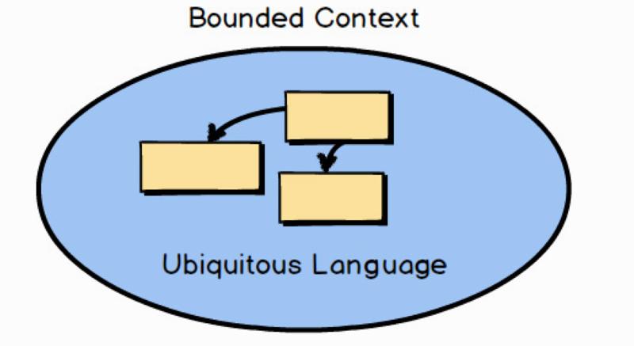

What are these things called Bounded Contexts ? What’s the Ubiquitous Language ? In short, DDD is primarily about modeling a Ubiquitous Language in an explicitly Bounded Context. While true, that probably wasn’t the most helpful description that I could provide. Let me break this down for you.

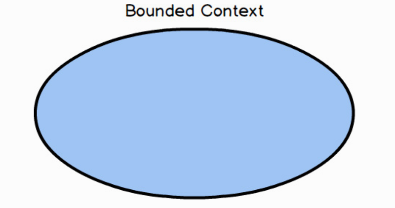

First, a Bounded Context is a semantic contextual boundary. This means that within the boundary each component of the software model has a specific meaning and does specific things. The components inside a Bounded Context are context specific and semantically motivated. That’s simple enough.

When you are just getting started in your software modeling efforts, your Bounded Context is somewhat conceptual. You could think of it as part of your problem space. However, as your model starts to take on deeper meaning and clarity, your Bounded Context will quickly transition to your solution space , with your software model being reflected as project source code. (The problem space and solution space are better explained in the box.) Remember that a Bounded Context is where a model is implemented, and you will have separate software artifacts for each Bounded Context.

首先，限界上下文是语义和语境上的边界。这意味着边界内的每个代表软件模型的组件都有着特定的含义并处理特定的事务。限界上下文中的这些组件有特定的上下文语境和语义理据。这确实很简单。如果刚刚开始投入到软件建模中，限界上下文多少是有些概念化的。你可以将它理解为问题空间（Problem Space）的一部分。然而，随着软件模型开始呈现出更深层次以及更清断的含义时，限界上下文将会被迅速转换到解决方案空间（Solution Space）中，同时软件模型将通过项目的源代码来体现（下面这段文字可以更好地解释问题空间和解决方案空间）。请记住，模型是在限界上下文中实现的，你也将会为每个限界上下文开发出不同的软件。

2『 Bounded Context，做一张术语卡片。』——已完成

『

What Is a Problem Space and a Solution Space?

Your problem space is where you perform high-level strategic analysis and design steps within the constraints of a given project. You can use simple diagrams as you discuss the high-level project drivers and note important goals and risks. In practice, Context Maps work very well in the problem space. Note too that Bounded Contexts may be used in problem space discussions, when needed, but are also closely associated with your solution space.

Your solution space is where you actually implement the solution that your problem space discussions identify as your Core Domain. When the Bounded Context is being developed as a key strategic initiative of your organization, it’s called the Core Domain. You develop your solution in the Bounded Context as code, both main source and test source. You will also produce code in your solution space that supports integration with other Bounded Contexts .

什么是问题空间和解决方案空间？问题空间是在给定项目的约束条件下进行高级战略分析与设计各个步骤的地方。你可以使用简单的图表来展示讨论中高级的项目驱动因素，并记录关键目标与风险。在实践中，上下文映射图可以在问题空间中工作得很好。同时还要注意，限界上下文不仅可以在需要时用于问题空间的讨论，也与你的解决方案空间密切相关。

解决方案空间就是真正实施解决方案的地方，这些解决方案在问題空间讨论中被识别为核心域（Core Domain）1。当限界上下文被当作组织的关键战略举措进行开发时，即被称为核心域。你将主要通过源代码和测试代码来实现限界上下文中的解决方案，也会在解決方案空间中编写代码，来支撑与其他限界上下文之间的集成。

1 核心域的识别是一个持续的精练过程，把一堆混杂在一起的组件分离，以某种形式提炼出最重要的内容，这种形式也将使核心域更具价值。一个严峻的现实是，我们不可能对所有的设计部分投入同等的资源进行优化，如同 MVP (Minimum Viable Product）产品原则所提倡的那样，产品研发需要聚焦在最小化可行产品上，不断获取用户反馈，并在这个最小化可行产品上持续快速选代，从而获得一个稳定的核心产品。在有限的资源下，为了使领域模型成为最有价值的资产，我们必须有效地梳理出模型的真正核心并完全根据这个核心来实现软件服务，这也是核心域的战略价值所在。一一译注

』

The software model inside the context boundary reflects a language that is developed by the team working in the Bounded Context and is spoken by every member of the team that creates the software model that functions within that Bounded Context. The language is called the Ubiquitous Language because it is both spoken among the team members and implemented in the software model. Thus, it is necessary that the Ubiquitous Language be rigorous—strict, exact, stringent, and tight. In the diagram, the boxes inside the Bounded Context represent the concepts of the model, which may be implemented as classes. When the Bounded Context is being developed as a key strategic initiative of your organization, it’s called the Core Domain.

团队在限界上下文中发展了一种语言用于表达其边界内的软件模型，这一语言由在该界上下文中开发软件模型的每个团队成员所使用。它之所以被称之为通用语言（Ubiquitous Language）2，是因为团队成员间交流用的是它，软件模型实现的也是它。因此，通用语言必须严谨、精确，并且紧湊。上图中，限界上下文中的方框所表示的概念模型可以用类来实现。当限界上下文被当作组织的关键战略举措进行开发时，即被称之为核心域。

2 在《实例化需求》[Specification] 一书中译作統一语言，也是一种常见的译法。一一译注

When compared with all the software your organization uses, a Core Domain is a software model that ranks among the most important, because it is a means to achieve greatness. A Core Domain is developed to distinguish your organization competitively from all others. At the very least it addresses a major line of business. Your organization can’t excel at everything and shouldn’t even try. So you choose wisely what should be part of your Core Domain and what should not. This is the primary value proposition of DDD, and you want to invest appropriately by committing your best resources to a Core Domain.

When someone on the team uses expressions from the Ubiquitous Language , everyone on the team understands what is meant with precision and constraints. The expression is ubiquitous within the team, as is all language used by the team that defines the software model being developed.

When you consider language in a software model, think of the various nations that make up Europe. Within one of the countries across this space, the official language of each country is clear. Within the boundaries of those nations—for example, Germany, France, and Italy—the official languages are certain. As you cross a boundary, the official language changes. The same goes for Asia, where Japanese is spoken in Japan, and the languages spoken in China and Korea are clearly different across the national boundaries. You can think of Bounded Contexts in much the same way, as being language boundaries. In the case of DDD, the languages are those spoken by the team that owns the software model, and a notable written form of the language is the software model’s source code.

与组织使用的所有其他软件相比，核心域是其中最重要的软件模型，因为它是组织取得巨大成就的手段。发展核心域可以使你的组织在与其他组织的竞争中脱颗而出。至少，它标明了组织的业务主航道。你的组织无法在所有领域都出类拔萃，也无须如此。因此你需要做出明智的选择，哪些是核心域，而哪些不是。这是 DDD 的首要价值主张，同时你也期望通过恰当的投资把最好的资源投入到核心域中。当团队中有人使用通用语言进行交流时，其他人都可以明白他表达的准确含义和约束条件。通用语言和开发软件模型中使用的其他语言一样，在团队中无处不在。

当你思考软件模型中的语言时，想一想组成欧洲的各个国家：整个欧洲大陆中的任何一个国家，使用的官方语言都是明确的。在这些国家的边境内，如德国、法国和意大利，官方语言是确定的。当你越过边境时，官方语言也会改变。同样的情况也适用于亚洲：被界线分开的日本、韩国和中国都使用着自己的语言。限界上下文也是如此。在 DDD 中通用语言就是软件模型团队日常交流时使用的语言，而软件模型的源代码就是这种语言的书面表达方式。

1-2『限界上下文中的通用语言，上面的欧洲各个国家的隐喻很贴切，通用语言做一张术语卡片。』——已完成

『

Bounded Contexts, Teams, and Source Code Repositories

There should be one team assigned to work on one Bounded Context. There should also be a separate source code repository for each Bounded Context. It is possible that one team could work on multiple Bounded Contexts , but multiple teams should not work on a single Bounded Context. Cleanly separate the source code and database schema for each Bounded Context in the same way that you separate the Ubiquitous Language. Keep acceptance tests and unit tests together with the main source code.

It is especially important to be clear that one team works on a single Bounded Context. This completely eliminates the chances of any unwelcome surprises that arise when another team makes a change to your source code. Your team owns the source code and the database and defines the official interfaces through which your Bounded Context must be used. It’s a benefit of using DDD.

一个团队应该在一个限界上下文中工作。每个限界上下文应该拥有一个独立的源代码仓库 1。一个团队可能工作在多个限界上下文中，但是多个团队不应该在同一个限界上下文中共事。我们应该采用和分离通用语言同样的方式，千净地把不同限界上下文的源代码和数据库模式隔离开。并且，将同一个限界上下文中的验收測试、单元測试和主要源代码存放在一起。尤其重要的是，要明确一个团队只在单一的限界上下文中工作。别给其他团队留下任何机会去修改你的源代码，从而引发意外。2 你的团队控制着源代码和数据库并定义了官方接口，必须通过这些接口才可以调用限界上下文。这是使用DDD 所能带来的好处之一。

1『上面的「一个团队只在一个限界上下文中工作」，这个观点很认可，做一张任意卡片。』——已完成

1 传统软件开发方式里，一个产品往往由多个组件团队共同开发，组件代码分别存放在不同的代码仓库，只有负责的团队拥有组件代码仓库的所有权。由于使用了这种代码仓库的划分方法，大量的集成将会发生在组件与组件之间，同时也会产生大量的跨团队的交流和代码访问。一种常见的场景是，在开发初期新的功能往往无法集成并正常运作，更不可能完成阶段性验收，只有等到开发的后期才能获得一个可以运行的产品。而书中提及的独立代码仓库将遵循限界上下文进行划分，上下文内使用统一的通用语言进行交流，并尽可能由一个团队对领域模型进行维护。两种代码仓库的划分方式的最大区别在于，限界上下文内的领域模型往往具有独立的业务价值，可以独立地提供服务。而传统的组件式代码仓库经常会存在相互间的紧耦合关系，无法独立地提供服务。本书译者所著的《代码管理核心技术及实践》一书中也谈到了类似的案例，介绍了一个团队是如何从组件代码仓库转换到领域代码仓库的。一一译注 

2 这并不是绝对的。事实上，很多上下文的代码仓库是开放的，并接受其他团队提交的代码。甚至，很多独角兽企业（如 Google 和 Facebook）在代码仓库上惊人一致地选择了单一仓库（monoreme）进行代码管理，即整个组织所有的产品代码放在唯一一个超大的代码仓库中。这些代码并不是铁板一块，它依然可以被分成多个服务甚至多个产品，由多个团队独立地构建、测试和维护。单一仓库和开放仓库一样更注重的是代码共有制带来的协作效率。代码共有制不会造成混乱，原因在于它们拥有完善的机制和工具对所有提交的代码进行准入控制和验证，而这些仓库的贡献者也对编写代码有着严格的自我要求。所以并不是要杜绝其他团队对代码仓库进行修改，而是要让这些修改可以预期且可以控制，这必须采取些适合团队的实践和工具来实现，例如频繁交流（如结对编程）、代码走查（如 Pull Request）和自动化验证（如契约测试）等。这些实践和手段往往由上下文映射关系决定，如共享内核关系就可以采用 Pull Request 的实践，而客户一供应商关系则可以采用契约测试的实践。关于映射关系的讨论请参考本书第 4 章的内容。——译注

2『代码走查（如 Pull Request）去做一张术语卡片。』

』


In human languages, terminology evolves over time, and across national boundaries the same or similar words take on nuances of meaning. Think of the differences between Spanish words used in Spain and those same words used in Colombia, where even the pronunciation changes. There is clearly Spain’s Spanish and Colombia’s Spanish. So too with software model languages. It’s possible that people from other teams would have a different meaning for the same terminology, because their business knowledge is within a different context; they are developing a different Bounded Context. Any components outside the context are not expected to adhere to the same definitions. In fact, they are probably different, either slightly or vastly, from the components that your team models. That’s fine.

在人类的语言中，词汇随时间的推移不断发展并跨越国界，相同或相似的词汇在意义上有着细做的差别。比如，同一个西班牙语词汇在西班牙和哥伦比亚代表不一样的含义有些甚至发音也不同。西班牙式的西班牙语与哥伦比亚式的西班牙语有着明显的区别。软件模型的语言也是如此。来自其他团队的成员可能对于同一术语有着不同的理解，这正是因为他们业务知识的上下文不同，他们在开发一个不同的限界上下文。别指望上下文之外的任何组件会遵循相同的定义。事实上，这些组件与你的模型组件之间可能存在着差异，或细做或巨大，这很正常。

To understand one big reason to use Bounded Contexts , let’s consider a common problem with software designs. Often teams don’t know when to stop piling more and more concepts into their domain models. The model may start out small and manageable......

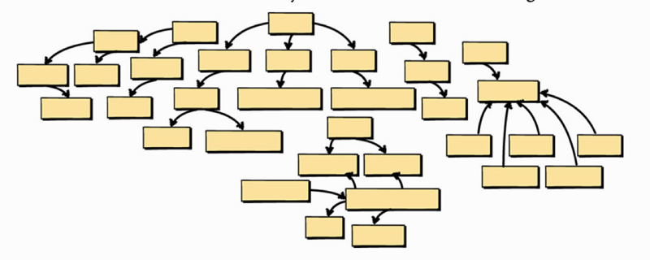

But then the team adds more concepts, and more, and still more. This soon results in a big problem. Not only are there too many concepts, but the language of the model becomes blurred, because when you think about it there are actually multiple languages in one large, confusing, unbounded model.


为了更好地理解使用限界上下文的重要原因，让我们来思考软件设计中的一个常见问题。通常，团队并不清楚应该何时停止向领域模型中注入越来越多的概念。或许刚开始时这个模型很小也能被管理…...然而随着团队不断地注入更多概念，很快便出现了一个大麻烦。不仅概念太多，而且模型中的语言也变得模糊不清，因为在你思考它时，会发现在这个巨大的、混乱的、漫无边际的模型中实际存在着多种语言。

Due to this fault, teams will often turn a brand-new software product into what is called a Big Ball of Mud. To be sure, a Big Ball of Mud is not something to be proud of. It’s a monolith, and worse. This is where a system has multiple tangled models without explicit boundaries. It probably also requires multiple teams to work on it, which is very problematic. Furthermore, various unrelated concepts are blown out over many modules and interconnected with conflicting elements. If this project has tests, it probably takes a very long time to run them, and so the tests may be bypassed at especially important times.

因为这样或那样的错误，团队常常会将全新的软件产品变成一个所谓的大泥球（Big Ball of Mud）。当然，大泥球并不值得骄做。它是一个庞然大物，而且会变得更糟。这个系统由多个没有明确边界并纠缠在一起的模型组成。更为严重的是，它可能还会要求多个团队在其中工作。此外，各种毫不相干的概念充斥在众多的模块中，并与自相矛盾的元素相互关联。如果这个项目有测试，运行它们可能需要很长的时间，而这些测试可能会在非常重要的时刻被忽略。

It’s the product of trying to do too much, with too many people, in the wrong place. Any attempt to develop and speak a Ubiquitous Language will result in a fractured and ill-defined dialect that will soon be abandoned. The language wouldn’t even be as well conceived as Esperanto. It’s just a mess, like a Big Ball of Mud.

这是一个在错误的领域投入过多人力并尝试去做太多事情的产物。任何发展和使用通用语言的努力都将会产生一种支离破碎而又定义不明的方言，并很快被弃用。这种语言甚至不如世界语 1。它只是一个如同大泥球般的烂推子。

1 语言不仅仅只是起到交流的作用，更蕴含了使用该语言的背景、民族历史和发展历程。曾经风靡一时的世界语，正是因为脱离了一个共同的情境而无法真正普及。发展通用语言，是希望读者基于一定的业务上下文的情境不断地优化和建立统一的语言。一一译注

## 2.1 Domain Experts and Business Drivers

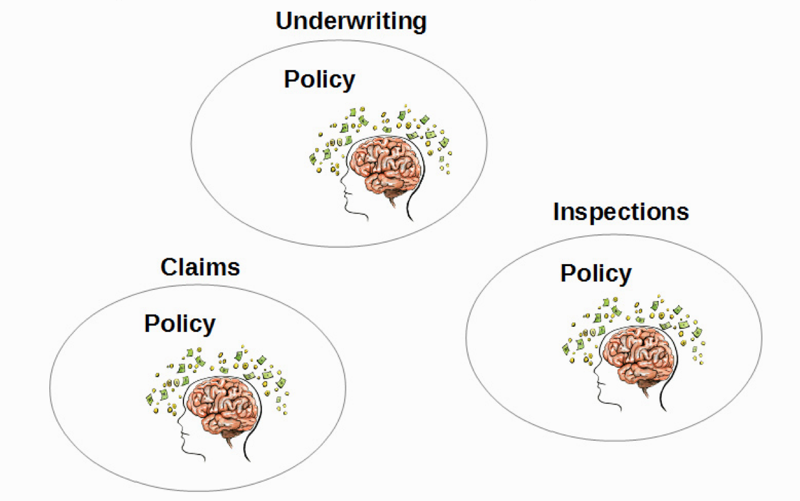

There may be strong, or at least subtle, hints communicated by business stakeholders that could have been used to help the technical team make better modeling choices. Thus, a Big Ball of Mud is often the result of unbridled effort made by a team of software developers who don’t listen to the business experts.

The business’s department or work group divisions can provide a good indication of where model boundaries should exist. You will tend to find at least one business expert per business function. Lately there is a trend toward grouping people by project, while business divisions or even functional groups under a management hierarchy seem to be less popular. Even in the face of newer business models you will still find that projects are organized according to business drivers and under an area of expertise. You may need to think of division or function in those terms.

业务干系人传递出的暗示会帮助技术团队做出更好的建模选择，这些暗示或许强烈或许非常微妙。而大泥球往往是由于软件开发人员无视业务专家的建议，一意孤行的结果。业务部门或工作组织的划分可以很好地标明模型边界的位置。你将倾向于为每个业务功能寻找至少一位业务专家。近来有一种按项目划分团队的趋势，而那些在管理层之下的业务部门，甚至是职能组织都似乎不那么受欢迎。即使在较新的商业模式下，你仍会发现项目是根据业务驱动并被专业领域组织起来的，你需要从这些角度考虑部门和职能。

1『项目是根据业务驱动的。』

You can determine that this kind of segregation is needed when you consider that each business function likely has different definitions for the same term. Consider the concept named “policy” and how the meaning differs across the various insurance business functions. You can easily imagine that a policy in underwriting is vastly different from a policy in claims and a policy in inspections. See the box for more details.

The policy in each of these business areas exists for different reasons. There is no escaping this fact, and no amount of mental gymnastics changes this.

当你意识到不同业务领域对同一术语可能有不同的定义时，就可以背定这种分离是必要的。考虑一下保单（Policy）的概念，以及其在不同的保险业务领域中不同的含义。可以很容易地想象出，保单在承保中的含义与理赔、审核中的含义有很大的不同。更多的细节可以参考下一页的描述。每个业务领域中的保单因不同原因而存在。这是无法回避的事实，即便花费再多的力气、绞尽脑汁也无济于事。

『

Differences in Policies by Function

Policy in Underwriting: In the area of expertise that is focused on underwriting, a policy is created based on the evaluation of the risks of the insured entity. For example, when working in underwriting for property insurance, the underwriters would assess the risks associated with a given property in order to calculate the premium for the policy to cover the property asset.

Policy in Inspections: Again, if we are working in the property insurance field, the insurance organization will likely have an inspections area of expertise that is responsible for inspecting a property that is to be insured. The underwriters are somewhat dependent on the information found during inspections, but only from the standpoint that the property is in the condition asserted by the insured. Assuming that a property will be insured, the inspection details—photos and notes—are associated with a policy in the inspections area, and its data can be referenced by underwriting to negotiate the final premium cost in the underwriting area.

Policy in Claims: A policy in the claims area of expertise tracks the request for payment by the insured based on the terms of the policy created by the underwriting area. The claims policy will need to make some references to the underwriting policy but will be focused on, for example, damages to the insured property and reviews performed by the claims personnel to determine the payment, if any, that should be made.

承保保单：专门从事承保的业务领域中，保单会基于对被保险实体进行的风险评估而创建。例如，在承保财产保险时，保险公司将对给定的财产进行相关风险评估，以便计算承保财产保单的保费。

审核保单：同样，如果我们从事于财产保险领城，保险公司将很有可能下设一个专门负责审核的业务部门，该部门负责审核需要投保的财产。承保部门一定程度上依赖于在审核过程中发现的信息，但仅从财产状况与被保险人声明是否一致的这一点出发。假设有一笔财产正在投保，审核的细节包括照片和文档，这些都与审核环节的保单相关，而在承保环节商定最终保费时，这些信息都会被参考。

理赔保单：理赔中的保单是根据承保环节制订的保险条款，来跟踪投保人理赔的赔付请求进度。索赔保单需要参考承保保单，但会着重确认被保险财产的损害情况和理赔员所审查的材料是否一致，以确定是否应支付保险费，如果是，则究成赔付。

』


If you try to merge all three of these policy types into a single policy for all three business groups, you will certainly have problems. This would become even more problematic if the already-overloaded policy had to support a fourth and fifth business concept in the future. Nobody wins.

On the other hand, DDD emphasizes embracing such differences by segregating the differing types into different Bounded Contexts. Admit that there are different languages, and function accordingly. Are there three meanings for policy? Then there are three Bounded Contexts , each with its own policy, with each policy having its own unique qualities. There’s no need to name these UnderwritingPolicy , ClaimsPolicy , or InspectionsPolicy . The name of the Bounded Context takes care of that scoping. The name is simply Policy in all three Bounded Contexts.

如果你尝试将这三种保单类型合并成一个适合所有业务职能领域的单一保单概念，背定会出问题。如果这个已经超负荷的保单不得不继续承担第四、第五个业务概念，情况会变得更糟。最终没有赢家。

1『所以说嘛，用界限分割上下文很重要，不能混合在一起（建模），必须先划分在其各自的上下文中，然后在每个上线文中分别建模。这里体现了郑烨一直说的「分离关注点」。』


相反，DDD 强调将这些不同的概念类型分离到不同的限界上下文中，以此来拥抱这些差异，并且承认存在不同的通用语言和与之对应的职能。这里确实存在三种不同的保单定义，此处有三个界限上下文，它们都有各自的保单，每个保单都是独一无二的。没有必要把这些保单命名为承保保单、理赔保单或是审核保单，因为限界上下文的名称就可以区分它们。在这三个限界上下文中我们只需要一个简单的名称：保单。

『

Another Example: What Is a Flight?

In the airline industry, a “flight” can have multiple meanings. There is a flight that is defined as a single takeoff and landing, where the aircraft is flown from one airport to another. There is a different kind of flight that is defined in terms of aircraft maintenance. And there is yet another flight that is defined in terms of passenger ticketing, either nonstop or one-stop. Because each of these uses of “flight” is clearly understood only by its context, each should be modeled in a separate Bounded Context. To model all three of these in the same Bounded Context would lead to a confusing tangle.

航空业中的「飞行」有很多含义。其中ー个是，飞机从一个机场飞到另一个机场的单次起降。飞机维修领城则有另一种不同的定义。还有一种是客票领域的定义，可以是直达也可以是中转。这几种「飞行」概念只有通过各自的上下文才能被清晣地解释，并且应该在被分离的限界上下文中建模。在同一个限界上下文中为这三种概念建模会导致混乱。

』

## 2.2 Case Study


To make the reason to use Bounded Contexts more concrete, let me illustrate with a sample domain model. In this case we are working on a Scrum-based agile project management application. So, a central or core concept is Product, which represents the software that is to be built and that will be refined over perhaps years of development. The Product has Backlog Items, Releases, and Sprints. Each Backlog Item has a number of Tasks, and each Task can have a collection of Estimation Log Entries. Releases have Scheduled Backlog Items and Sprints have Committed Backlog Items. So far, so good. We have identified the core concepts of our domain model, and the language is focused and intact.

为了让使用限界上下文的原因更加具体，我将以一个领域模型为例。在此案例中，我们正在开发一个基于 Scrum 的敏捷项目管理应用。因此，核心概念是产品（Product），它代表了将要被开发的软件，并且在未来数年的研发中将会被持续改进。产品由待办项（Backlog Item）、发布（Release）和冲刺（Sprint）组成。每个待办项都包含一些任务（Task），每个任务都拥有一个估算记录条目（Estimation LogEntry）集合。发布中包含计划好的待办项（Scheduled Backlog Item），冲刺中包含已提交的待办项（Committed Backlog Item）。目前为止，一切顺利。我们已经确定了领域模型的核心概念，通用语言也是专注且完整的。


“Oh, yeah,” say the team members, “we also need our users. And we want to facilitate collaborative discussions within the product team. Let’s represent each subscribing organization as a Tenant. Within Tenants we will allow the registration of any number of Users, and Users will have Permissions. And let’s add a concept called Discussion to represent one of the collaborative tools that we will support.”

团队成员说，「我们也需要产品的用户。我们希望促进产品团队内的协作讨论。让我们用租户（Tenant）来表示每个订购了产品的组织，在每个租户中，我们将允许任意数量的用户（User）注册，同时他们还将拥有一些权限（Permission）。让我们增加个讨论（Discussion）的概念，来代表我们即将支持的一种协作工具。」


Then the team members add, “Well, there are also other collaboration tools. Discussions belong within Forums and Discussions have Posts. Also we want to support Shared Calendars.”

随后有成员补充：「嗯，还有其他的协作工具。讨论应该属于论坛（Forum），而且还应该包括讨论帖（Post）。此外，我们还希望支持共享日历（Shared Calendar）。」

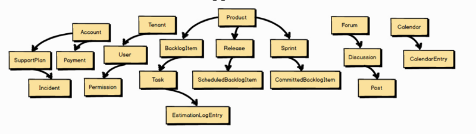

They continue: “And don’t forget that we need a way for Tenants to make Payments. We will also sell tiered support plans, so we need a way to track support incidences. Both Support and Payments should be managed under an Account.”

他们继续说道：「别忘了我们还需要一种方式让租户完成支付（Payment）。我们将会销售支持计划（Support Plan）的套餐，为此还需要一种跟踪支持事件（Incident）的方法无论是支持（Support）还是支付都应该在账户（Account）下进行管理。

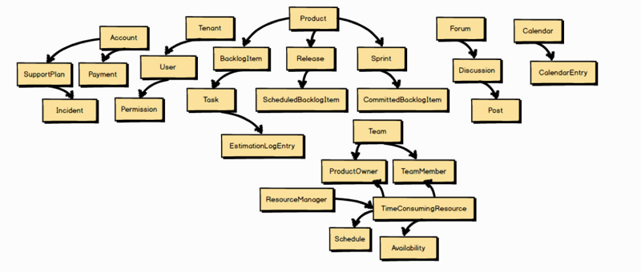

And still more concepts emerge: “Every Scrum-based Product has a specific Team that works on the product. Teams are composed of a single Product Owner and a number of Team Members. But how can we address Human Resource Utilization concerns? Hmmm, what if we modeled the Schedules of Team Members along with their utilization and availability?”

随后会涌现出更多的概念：「每个基于 Scrum 运作的产品都有一个特定团队（Team）团队。由一位产品负责人（Product Owner）和一些团队成员（Team Member）组成。但我们如何解决人力资源利用率（Human Resource Utilization）的问题呢？嗯，如果我们为团队成员建立日程（Schedule），以及利用率（Utilization）和可用性（Availability）的模型，会怎么样？

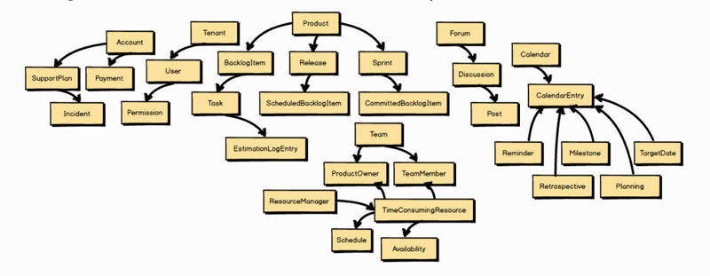

“You know what else?” they ask. “Shared Calendars should not be limited to bland Calendar Entries. We should be able to identify specific kinds of Calendar Entries, such as Reminders, Team Milestones, Planning and Retrospective Meetings, and Target Dates.”

Hang on a minute! Do you see the trap that the team is falling into? Look at how far they have strayed from the original core concepts of Product, Backlog Items, Releases, and Sprints. The language is no longer purely about Scrum; it has become fractured and confused.

「你知道还有什么吗？」团队成员说，「共享日历不应仅限于保存日常的日历条目（Calendar Entry）。它还应该可以保存一些特殊的条目，比如提醒（Reminder）、团队里程碑（Team Milestone）、计划会议（Planning Meeting）和回顾会议（Retrospective Meeting），还有交付日期（Target Date）。等一下！你有没有发现团队正在落入一种陷阱？他们已经偏离了最初的核心概念：产品（Product）、待办项（Backlog Item）、发布（Release）和冲刺（Sprint）。通用语言已经不再纯粹地与 Scrum 相关，它已经变得支离破碎并令人困惑。


Don’t be fooled by the somewhat limited number of named concepts. For every named element, we might expect to have two or three more concepts to support those that quickly popped into mind. The team is already well on its way to delivering a Big Ball of Mud and the project has barely started.

不要因为命名概念过少而疑惑。对于每一个命名元素而言，我们都可能情不自禁地在脑海中闪现两个、三个或更多可以支撑它的概念。而此时项目才刚刚起步，团队就已经滑向大泥球的深渊 1。

1 事实上，开发人员更加擅长在设计过程中不断地抽象对于客观世界的观察。如果这些概念被全盘接受，无形中就会形成过度设计的领域模型。因此在设计过程中，开发人员需要不断地向业务人员确认上下文的核心和必要概念，及时抑制过度设计的冲动。如果无法除那些不必要或不属于核心域的概念，在不的将来就会造就一批低价值的功能，而这些功能对于产品研发而言就是巨大的浪费。一一译注

1『抑制住过渡设计。采用战略设计中的「限界上下文」和「通用语言」可以避免过渡设计，只关注核心领域功能。』

## 2.3 Fundamental Strategic Design Needed

What tools are available with DDD to help us avoid such pitfalls? You need at least two fundamental strategic design tools. One is the Bounded Context and the other is the Ubiquitous Language. Employing a Bounded Context forces us to answer the question “What is core?” The Bounded Context should hold closely all concepts that are core to the strategic initiative and push out all others. The concepts that remain are part of the team’s Ubiquitous Language. You will see how DDD works to avoid the design of monolithic applications.

DDD 中有哪些工具可以帮助我们避免这些陷阱？你至少需要两种基本的战略设计工具，限界上下文和通用语言。采用限界上下文会迫使我们回答「什么是核心？」的问题。它应紧紧地抓住战略举措中所有的核心概念，并排除其他概念，剩下的都应该是团队通用语言的一部分。你将看到 DD 如何避免单体应用设计的产生。

『

Testing Benefits

Because Bounded Contexts are not monolithic, other benefits are experienced when they are used. One such benefit is that tests will be focused on one model and thus be fewer in number and will run more quickly. Although this isn’t the primary motivation to use Bounded Contexts , it sure pays off in other ways.

限界上下文并非庞然大物，使用它们却可以收益良多。其中之一就是测试会聚焦于一个模型中，这样测试的数量会更少，执行更快。虽然这并非是使用限界上下文的主要动机，但确实是意外的收获。

』


Literally, some concepts will be in context and be clearly included in the team’s language.

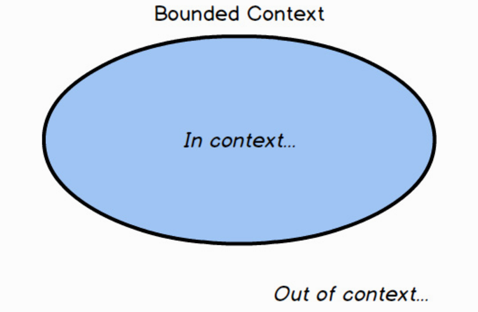

And other concepts will be out of context. The concepts that survive this stringent application of core-only filtering are part of the Ubiquitous Language of the team that owns the Bounded Context.

从字面上看，有些概念属于限界上下文，并被清晰地包含在团队的通用语言中。而其他的概念将会在限界上下文之外。只有经过「仅限核心」的严格过滤之后保留下来的概念，才能成为拥有限界上下文的团队的通用语言的一部分。

Take Note: The concepts that survive this stringent application of core-only filtering are part of the Ubiquitous Language of the team that owns the Bounded Context. The boundary emphasizes the rigor inside.

注意：只有经过「仅限核心」的严格过滤之后保留下来的概念，才能成为拥有限界上下文的团队的通用语言的一部分。限界上下文的边界强调其内部的严谨性。

So, how do we know what is core? This is where we have to bring together two vital groups of individuals into one cohesive, collaborative team: Domain Experts and software developers.

The Domain Experts will naturally be more focused on business concerns. Their thoughts will be centered on their vision of how the business works. In the domain of Scrum, count on the Domain Expert being a Scrum Master who thoroughly understands how Scrum is executed on a project.

然而，我们该如何确定核心？为此，我们必须将两个重要的群体一一领域专家（Domain xper）和软件开发人员，整合成一个有凝聚力的协作团队。领城专家自然会更加关注业务问题。他们的想法会集中在组织如何运作的愿景上。Scrum 的业务领域中，我们期望领域专家是一位 Scrum Master 1，他完全了解如何在项目中实施 Scrum。

1 Scrum Master，是组成 Scrum 团队的三个角色之一，也是 Scrum 团队的敏捷教练。请参考《Scrum 精髓》[Essential Scrum]，——译注

『

Product Owner or Domain Expert?

You may wonder what the difference is between a Scrum product owner and a DDD Domain Expert. Well, in some cases they might be one and the same, that is, one person capable of filling both roles. Yet it should not be surprising that a product owner is typically more focused on managing and prioritizing the product backlog and seeing to it that the conceptual and technical continuity of the project is maintained. This doesn’t mean, however, that the product owner is naturally an expert in the business’s core competency in which you are working. Make sure that you have a true Domain Expert on the team, and don’t substitute a product owner without the necessary know-how instead.

你可能会疑惑，Scum 中的产品负责人与 DD 中的领域专家之间的区别是什么。在某些情况下，他们可能是同一个人，也就是说，一个人承担两个角色。产品负责人常常更加关注管理和产品待办项的优先级排序，并时刻留意着项目的概念和技术是否保持着连续性，这一点也不足为奇。但这并不意味着产品负责人天生就是领城内的业务核心竟争力方面的专家。我们要确保团队中有真正的领城专家，还要避免让缺乏必要专业技能的产品负责人代替领域专家。

』

In your particular business, you also have Domain Experts. It’s not a job title but rather describes those who are primarily focused on the business. It’s their mental model that we start with to form the foundation of the team’s Ubiquitous Language.

On the other hand, developers are focused on software development. As depicted here, developers can become consumed by programming languages and technologies. Yet developers working in a DDD project need to carefully resist the urge to be so technically centered that they cannot accept the business focus of the core strategic initiative. Rather, the developers should reject any uncalled-for terseness and be able to embrace the Ubiquitous Language that is gradually developed by the team inside their particular Bounded Context.

在特定的业务领域中，你还是需要领域专家的。这不仅是一个职称，而是形容那些主要专注于业务的人。领域专家的心智模型将会成为团队通用语言的坚实基础。另一方面，开发人员专注于软件开发。如图所示，开发人员将精力花费在编程语言与技术研究中。然而，在 DDD 项目的实施过程中，开发人员需要尽量克制这种「以技术为中心」的冲动，以防无法接受以业务为中心的核心战略举措。相反开发人员应当抛弃任何多余的技术洁癖 1，并拥抱团队在特定限界上下文中逐步发展的通用语言。

1 在此过程中，开发人员会不由自主地进入「编码实现」的惯性思维模式，比如：这个概念应该设计怎样的关系型数据表，把这个概念设计成一个 REST 资源怎么样，这个概念需要使用一个抽象类来实现方便未来的扩展，等等。这些是过往的经验、对某种技术的偏好或者组织规范的要求而导致的，一点也不奇怪。但需要注意的是，我们在进行战略设计时，一定要暂时搁置这些关于实现的技术细节。一方面，这时通用语言（概念和需求）依然在发展过程中，我们会不断地质疑并修正它们，过早地思考针对这些概念和需求的实现没有任何意义。另一方面，如果在现阶段的讨论中就提及这样一些专业的技术术语，只会对领域专家造成干扰，浪费掉和他们协作的宝贵时间。不用着急，我们会在战术设计阶段再来考虑这些关于实现的细节问题。——译注

『

Focus on Business Complexity, Not Technical Complexity

You are using DDD because the business model complexity is high. We never want to make the domain model more complex than it should be. Still, you are using DDD because the business model is more complex than the technical aspects of the project. That’s why the developers have to dig into the business model with Domain Experts !

之所以会采用 DDD，是因为业务模型的高度复杂。我们从未想过让领城模型比其更复杂。不过，也正是因为业务模型比项目的技术特性更加复杂，我们才会使用 DDD。这也是开发人员必须与领域专家一起深入钻研业务模型的原因。

』

Both developers and Domain Experts should reject any tendency to allow documents to rule over conversation. The best Ubiquitous Language will be developed by a collaborative feedback loop that drives out the combined mental model of the team. Open conversation, exploration, and challenges to your current knowledge base result in deeper insights about the Core Domain.

开发人员和领域专家都应该拒绝任何以文档为主要交流手段的倾向。最佳的通用语言是通过协作反馈循环而发展出来的，从中可以促成团队形成共同的心智模型。对当前知识领域的开放式讨论、探索和质疑都会深化团队对于核心城的认知。

## 2.4 Challenge and Unify

Now back to the question “What is core?” Using the previously out-of-control and ever-expanding model, let’s challenge and unify!

现在让我们回到之前的问题：「什么是核心？」就之前已然失控并无限扩展的业务模型而言，我们要对它提出质疑并将其统一。

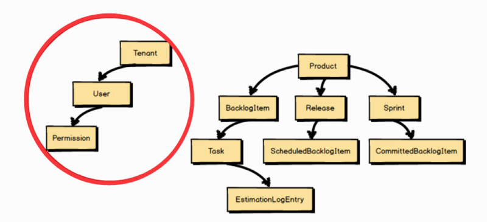

One very simple challenge is to ask whether each of the large-model concepts adheres to the Ubiquitous Language of Scrum. Well, do they? For example, Tenant , User , and Permission have nothing to do with Scrum. These concepts should be factored out of our Scrum software model.

一个非常简单的质疑是，每个大型模型的概念是否都符合 Scrum 通用语言的要求？真的如此吗？例如，Tenant、User 和 Permission 都与 Scrum 无关。这些概念都应该从 Scrum 的软件模型中剥离出去。


Tenant , User , and Permission should be replaced by Team , ProductOwner , and TeamMember . A ProductOwner and a TeamMember are actually Users in a Tenancy , but with ProductOwner and TeamMember we adhere to the Ubiquitous Language of Scrum. They are naturally the terms we use when we have conversations about Scrum products and the work a team does with them.

Tenant、User 和 Permission 应该被 Team、ProductOwner 和 TeamMember 取代。虽然 ProductOwner 和 TeamMember 实际上是一个 Tenant 中的 User，但使用它们更符合 Scrum 的通用语言。当讨论 Scrum 的产品和团队任务时，它们是我们脱口而出的术语。


Are SupportPlans and Payments really part of Scrum project management? The answer here is clearly “no.” True, both SupportPlans and Payments will be managed under a Tenant ’s Account , but these are not part of our core Scrum language. They are out of context and are removed from this model.

SupportPlans 和 Payments 真的是 Scrum 项目管理的一部分吗？答案显然是「不」，的确，它们都将在 Tenant 的 Account 下进行管理，但并不是 Scrum 的核心通用语言。它们脱离了 Scrum 上下文，将会从模型中移除。


What about introducing Human Resource Utilization concerns? It’s probably useful to someone, but it’s not going to be directly used by TeamMember Volunteers who will work on BacklogItemTasks . It’s out of context.

引入人力资源利用率（Human Resource Utilization）的概念会有什么问题吗？对于某些人而言它可能有用，但它并不会被那些负责 BacklogItemTasks 的 Team Member Volunteer 直接使用。它不属于 Scrum 上下文。

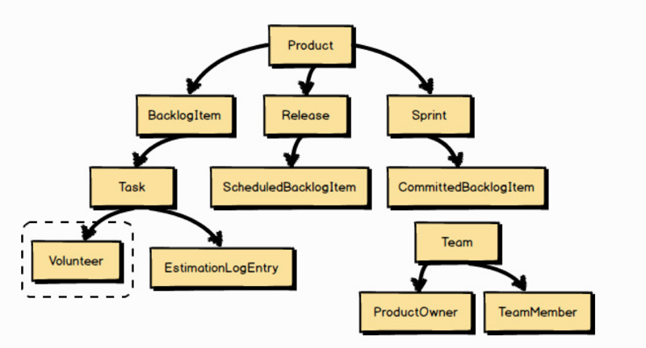

After the addition of the Team , ProductOwner , and TeamMember , the modelers realized that they were missing a core concept to allow TeamMembers to work on Tasks . In Scrum this is known as a Volunteer . So, the Volunteer concept is in context and was included in the language of the core model.

在添加团队、产品负责人和团队成员后，建模者意识到他们遗漏了一个核心的概念，当缺少这个概念时，TeamMember 将无法自愿认领 Task。这就是 Scrum 中的 Volunteer。因此，Volunteer 的概念属于 Scum 上下文，并包含在核心模型的通用语言中。

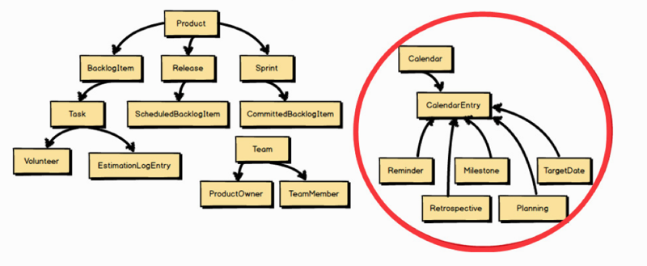

Even though calendar-based Milestones , Retrospectives , and the like are in context, the team would prefer to save those modeling efforts for a later sprint. They are in context, but for now they are out of scope.

尽管日历中的 Milestones、Retrospectives 等类似的概念都属于 Scrum 上下文，但团队更愿意将为其建模的工作留给接下来的冲刺。它们属于这个上下文，但目前已经超出了交付范围。


Finally, the modelers want to make sure that they account for the fact that threaded Discussions will be part of the core model. So they model a Discussion . This means that Discussion is part of the team’s Ubiquitous Language , and thus inside the Bounded Context.

最后，建模者希望确保考虑到的主题 Discussion 概念也将成为核心模型的一部分。为此，他们构建了一个 Discussion 模型。这意味着 Discussion 是团队通用语言的部分，并属于核心限界上下文。


These linguistic challenges have resulted in a much cleaner and clearer model of the Ubiquitous Language. Yet how will the Scrum model fulfill needed Discussions ? It would certainly require a lot of ancillary software component support to make it work, so it seems inappropriate to model it inside our Scrum Bounded Context. In fact, the full Collaboration suite is out of context. The Discussion will be supported by integrating with another Bounded Context —the Collaboration Context.

对于这些语言的质疑使得通用语言的模型越来越清晰。然而，Scrum 模型将如何实现必要的讨论（Discussion）？这里肯定需要许多辅助的软件组件的支持，直接在 Scrum 限界上下文中对其建模似乎是不合适的。事实上，整套协作（Collaboration）的概念都不属于 Scrum 上下文。讨论将通过与另外一个限界上下文，协作上下文的集成获得支持。

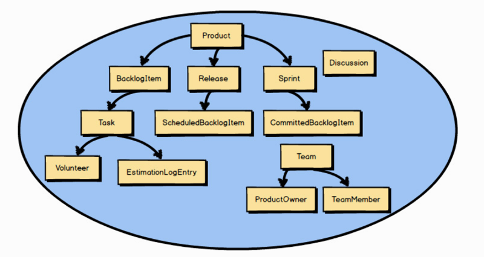

After that walk-through, we’re left with a much smaller actual Core Domain. Of course the Core Domain will grow. We already know that Planning , Retrospectives , Milestones , and related calendar-based models must be developed in time. Still, the model will grow only as new concepts adhere to the Ubiquitous Language of Scrum.

在这次练习之后，我们将会留下一个小巧却实际得多的核心域。当然，核心域将会持续扩展。我们已经知道必须尽快开发 Planning、Retrospectives、Milestones 以及其他基于日历的模型。尽管如此，只有当新的概念符合 Scrum 的通用语言时，才会扩展核心。


And what about all the other modeling concepts that have been removed from the Core Domain ? It’s quite possible that several of the other concepts, if not all, will be composed into their own respective Bounded Contexts , each adhering to its own Ubiquitous Language. Later you will see how we integrate with them using Context Mapping.

那么，我们该如何从核心域中分离出其他的建模概念呢？其他的几个概念，即便不是全部，都有很大的可能被放到不同的限界上下文中，并且都要遵循各自的通用语言。稍后你将了解我们是如何通过上下文映射来集成它们的。

## 2.5 Developing a Ubiquitous Language

So how do you actually go about developing a Ubiquitous Language within your team as you put into practice one of the chief tools provided by DDD? Is your Ubiquitous Language formed from a set of well-known nouns? Nouns are important, but often software developers put too much emphasis on the nouns within a domain model, forgetting that spoken language is composed of far more than nouns alone. True, we have mainly focused on nouns within our previous sample Bounded Contexts to this point, but that’s because we were interested in another aspect of DDD, that of constraining a Core Domain down to essential model elements.

当你将 DDD 的主要工具之一付诸实践时，是如何在团队中发展通用语言的呢？这些通用语言是由一系列通俗易懂的名词所组成的吗？名词固然很重要，但开发人员在领域模型中往往过于强调名词，而忘记了名词只是口头语言中很小的一部分。诚然，目前为止，在之前的限界上下文示例中我们主要关注的是名词，那是因为当时我们对 DDD 的另一个方面感兴趣，即将核心域限制在最基本的模型元素范围内。

『

Accelerate Your Discovery

You may want to try a few Event Storming sessions as you work on your scenarios. These can help you to quickly understand which scenarios you should be working on, and how they should be prioritized. Likewise, developing concrete scenarios will give you a better idea of the direction that you should take in your Event Storming sessions. They are two tools that work well together. I explain the use of Event Storming in Chapter 7 , “Acceleration and Management Tools .”

在一些场景上工作时，你或许想尝试几次事件风暴（Event Storming）的讨论。这些讨论可以帮助你快速地理解应该投入到哪些场景中，以及如何对这些场景进行优先级排序。同样，创建具体场景将会给你的事件风暴讨论方向带来一些更好的思路。这两种工具能够很好地配合。第 7 章中会介绍事件风暴的用法。

』

Don’t limit your Core Domain to nouns alone. Rather, consider expressing your Core Domain as a set of concrete scenarios about what the domain model is supposed to do. When I say “scenarios” I don’t mean use cases or user stories, such as is common in software projects. I literally mean scenarios in terms of how the domain model should work—what the various components do. This can be accomplished in the most thorough way only by collaborating as a team of both Domain Experts and developers.

我们不要将核心域局限在名词上。相反，应当使用一组具体场景来表达核心域，这些场景描述了领域模型应该做的事情。当提及「场景」时，并不是指用例或用户故事这些软件项目中常见的概念。本书所定义的场景，其真正含义是领域模型该如何工作，各种组件该做什么 1。只有领域专家和开发人员组成通力协作的团队，才有可能最大限度地完成这些场景。

1 正如前文所引用的：「绝大部分的人错误地认为设计只关乎外观。人们只理解了表象一一将这个盒子递给设计师，告诉他们：把它变得好看一些！这不是我们对设计的理解。设计并不仅仅是感观，设计也是产品的工作方式。」我们不仅需要认识到设计对于产品重要性，更需要体会通过设计改变产品的内在运作方式可以有效地改善用户的体验。我们对于「场景」的描述，也期望团队不仅仅只是观察到它的表象，更是希望通过不断地协作认知更加清晰地描绘出「场景」背后的运作逻辑。——译注

Here’s an example of a scenario that fits with the Ubiquitous Language of Scrum:

Allow each backlog item to be committed to a sprint. The backlog item may be committed only if it is already scheduled for release. If it is already committed to a different sprint, it must be uncommitted first. When the commit completes, notify interested parties.

Notice that this is not just a scenario about how humans use Scrum on a project. We are not talking about human procedures. Rather, this scenario is a description of how the very real software model components are used to support the management of a Scrum-based project.

下面是一个符合 Scrum 通用语言的场景示例：允许将每一个待办项提交到某个冲刺中。只有待办项位于发布计划中时才能进行提交。对于已经提交过的待办项如果想再次提交到另外一个冲刺中，需要先将其回收。提交完成时，通知相关方取消提交的冲刺与准备提交的冲刺。

请注意，这并不只是一个关于如何在真实的项目中使用 Scrum 的场景。我们不是在讨论人类如何运作 Scrum 的流程，而是描述了如何使用真实的软件模型来支持基于 Scrum 运作的项目管理。

The previous scenario is not a perfectly stated one, and a perk of using DDD is that we are constantly on the lookout for ways to improve the model. Yet this is a decent start. We hear nouns spoken, but our scenario doesn’t limit us to nouns. We also hear verbs and adverbs, and other kinds of grammar. You also hear that there are constraints—conditions that must be met before the scenario can be completed to its successful end. The most important benefit and empowering feature is that you can actually have conversations about how the domain model works—its design.

上述场景的示例陈述得并不完美，而使用 DDD 的额外收获在于我们一直在寻找改进模型的方法。这是一个不错的开端。我们在场景中听到了各种词汇，其中不仅仅有名词，也有动词和副词，还有其他的类型的词。你也会听到一些约束条件，这些约束条件必须在场景顺利完成前得到满足。使用 DDD 带来的最大收获和赋予你的最大能力在于可以真正地通过对话了解领域模型是如何工作的，即它的设计。

We can even draw simple pictures and diagrams. It’s all about doing whatever is needed to communicate well on the team. One word of warning is appropriate here. Be careful about the time spent in your domain-modeling efforts when it comes to keeping documents with written scenarios and drawings and diagrams up-to-date over the long haul. Those things are not the domain model. Rather, they are just tools to help you develop a domain model. In the end the code is the model and the model is the code. Ceremony is for distinguished observances, like weddings, not domain models. This doesn’t mean that you forgo any efforts to freshen scenarios, but only do so as long as it is helpful rather than burdensome.

我们甚至可以绘制一些简单的图画和图表。这些方式都是为了帮助团队进行良好的沟通。这里适当地提醒一句，当心你在建模工作中对文字场景、图画、图表这些文档长期保持同步花费过长的时间。2 这些文档并不是领域模型。相反，它们只是帮助你开发领域模型的工具。模型终将与代码融为一体。只有像婚礼这样的重要活动才需要仪式，而领域模型并不需要这些仪式。这并非意味着你不需要为更新场景付出努力，而是应该在正确的时候做正确的事。

 2 请回忆敏捷宣言，「工作的软件高于详尽的文档」。文档只是一种工具，对于用户而言并不能产生价值所以在产品的研发过程中，利用轻量级的文档（例如 Wiki）去记录一些关键信息和共识足以。一一译注

What would you do to improve a part of the Ubiquitous Language in our previous example? Think about it for just a minute. What’s missing? Before too long you probably wish for an understanding of who does the committing of backlog items to a sprint. Let’s add the who and see what happens:

The product owner commits each backlog item to a sprint . . .

对于之前的示例，你会做些什么来完善这部分通用语言？思考ー下，有什么遗漏吗？很快你会恍然大悟：谁将会把待办项提交到冲刺中？让我们加上谁，看看会发生什么：产品负责人提交每个待办项到一个冲刺中......

You will find in many cases that you should name each persona involved in the scenario and give some distinguishing attribute to other concepts such as to the backlog item and sprint. This will help to make your scenario more concrete and less like a set of statements about acceptance criteria. Still, in this particular case there isn’t a strong reason to name the product owner or further describe the backlog item and sprint involved. In this case all product owners, backlog items, and sprints will work the same way whether or not they have a concrete persona or identity. In cases where giving names or other distinguishing identities to concepts in the scenario helps, use them:

The product owner Isabel commits the View User Profile backlog item to the Deliver User Profiles sprint . . .

你将发现在多数情况下你需要给场景中的每个人物命名，并赋予他们一些和待办项冲刺等这些其他概念有区别的属性。这有助于将场景描述得更加有血有肉，而不只是一堆验收标准的陈述。然而，在这种特殊的情境下，很难找到一个强有力的理由去写清楚产品负责人的名字，或进一步描述涉及的待办项与冲刺。此时，无论是否拥有一个具体的人物角色或身份，所有的产品负责人、待办项和冲刺都会遵循相同的业务规则。如果需要给场景中的概念提供名字或有区别的身份，请这样做：产品负责人 Isabel 提交查看用户设置待办项到交付用户设置冲刺中......

Now let’s pause for a moment. It’s not that the product owner is the sole individual responsible for deciding that a backlog item will be committed to a sprint. Scrum teams wouldn’t like that very much, because they would be committed to delivering software within some time frame that they had no say in determining. Still, for our software model it may be most practical for a single person to have the responsibility to carry out this particular action on the model. So in this case we have stated that it’s the product owner role that does this. Even so, the nature of Scrum teams forces the question “Is there anything that must be done by the remainder of the team to enable the product owner to perform the commitment?”

这里并不是说产品负责人是唯一可以决定将待办项提交到冲刺中的人。Scrum 团队也不会喜欢这样，因为这要求团队承诺在一段时间内交付软件，同时他们却对决定没有任何发言权。尽管如此，对于我们软件模型交付而言，最切合实际的方式仍旧是让一个人负责在模型上执行这个特殊的动作。就这个例子来说，我们主张由产品负责人担任这一角色并执行这一动作。即便如此，Scrum 团队的天性一定会让他们抛出这样的问题：「团队里的其他成员还要做些什么，才能让产品负责人执行提交动作？」

Do you see what has happened? By challenging the current model with the who question, we have been led to an opportunity for deeper insight into the model. Perhaps we should require at least some team consensus that a backlog item can be committed before actually allowing the product owner to carry out the commit operation. This could lead to the following refined scenario:

The product owner commits a backlog item to a sprint. The backlog item may be committed only if it is already scheduled for release, and if a quorum of team members have approved commitment . . .

你看到这里发生的一切了吗？通过使用谁这个问题不断地质疑当前的模型，我们得到一个深入理解模型的机会。在允许产品负责人执行提交动作之前，也许我们至少需要对这一个待办项是否可以被提交达成一些团队共识。这会将场景优化成下面这样：产品负责人提交待办项到冲刺中。只有待办项位于发布计划中时才能进行提交，而且需要赞成承诺的团队成员达到法定人数…...

OK, now we have a refined Ubiquitous Language , because we have identified a new model concept called a quorum. We decided that there must be a quorum of team members who agree that a backlog item should be committed, and there must be a way for them to approve commitment. This has now introduced a new modeling concept and some idea that the user interface will have to facilitate these team interactions. Do you see the innovation unfolding?

There is another who missing from the model. Which one? Our opening scenario concluded: When the commit completes, notify interested parties.

很好，现在的我们的通用语言变得更加准确，这是因为我们识别出了一个新的模型概念，叫作法定人数（Quorum）。我们决定，只有待办项得到法定人数的团队成员同意后才能被提交，并且必须要有一种赞成（Approve）承诺的方法。我们现在引入了一个新的建模概念和一些有助于团队交流的用户界面的新想法。你是否看到了创新？我们还遗漏了模型中的另一个谁。之前的场景是这样结尾的：当待办项的提交完成后，需要通知相关方。

Who or what are the interested parties? This question and challenge further lead to modeling insights. Who needs to know when a backlog item has been committed to a sprint? Actually one important model element is the sprint itself. The sprint needs to track total sprint commitment, and what effort is already required to deliver all the sprint’s tasks. However you decide to design the sprint to track that, the important point now is for the sprint to be notified when a backlog item is committed to it:

If it is already committed to a different sprint, it must be uncommitted first. When the commitment completes, notify the sprint from which it was uncommitted and the sprint to which it is now committed.

相关方是何人何物？这个疑问将引导我们进一步思考这些建模。当提交待办项到冲刺中时，谁会需要知道？实际上，一个重要的模型元素是冲刺本身。冲刺需要跟踪其中承诺的待办项总数，以及交付所有冲刺任务所需要投入的工作量。不管怎样，你决定冲刺要设计成可以跟踪这些信息，此时设计的重点是在待办项提交到冲刺时通知它：对于已经提交过的待办项想再次提交到另外一个冲刺中，那么需要先将其回收。提交完成后时，需要通知相关方（相关的冲刺）。

Now we have a fairly decent domain scenario. This concluding sentence has also led us to an understanding that the backlog item and the sprint may not necessarily be aware of commitment at the same time. We need to ask the business to be certain, but it sounds like a great place to introduce eventual consistency. You will see why that is important and how it is accomplished in Chapter 5 , “Tactical Design with Aggregates .”

The refined scenario in its entirety looks like this:

The product owner commits a backlog item to a sprint. The backlog item may be committed only if it is already scheduled for release, and if a quorum of team members have approved commitment. If it is already committed to a different sprint, it must be uncommitted first. When the commitment completes, notify the sprint from which it was uncommitted and the sprint to which it is now committed.

现在我们有了一个相当不错的领域场景。结尾的这句话令我们了解到，待办项与冲刺可能不需要在同一时间知晓待办项的提交状态。我们需要询问业务来确定，但这听起来像是引入最终一致性（Eventual Consistency）的好去处。在第 5 章中，你将会明白为什么最终致性非常重要，以及如何达成它。

优化后的完整场景如下所示：产品负责人提交待办项到冲刺中。只有待办项位于发布计划中时才能进行提交，而且需要赞成承诺的团队成员达到法定人数。如果待办项已经提交到另外一个冲刺中，那么需要先将其回收。当待办项的提交完成后时，需要通知相关方（相关的冲刺）。

How would a software model actually work in practice? You can well imagine a very innovative user interface supporting this software model. As a Scrum team is participating in a sprint planning session, team members use their smartphones or other mobile devices to add their approval to each backlog item as it is discussed and agreed upon to work on during the next sprint. The consensus of the quorum of team members approving each of the backlog items gives the product owner the ability to commit all of the approved backlog items to the sprint.

实际的软件模型是如何工作的？你可以设想用一个非常有创意的用户界面来支撑这个软件模型。当 Scrum 团队正在进行一场冲刺计划会议时，团队成员们在讨论每个待办项时，会借助智能手机或其他移动设备投出他们的赞成票，这些待办项已被讨论并同意在下个冲刺中完成。赞成每个待办项的团队成员达到法定人数后，产品负责人才能将所有赞成通过的待办项提交到冲刺中。

## 2.6 Putting Scenarios to Work

You may be wondering how you can make the transition from a written scenario to some sort of artifact that can be used to validate your domain model against the team’s specifications. There is a technique named Specification by Example [Specification] that can be used; it’s also called Behavior-Driven Development [BDD] . What you are trying to achieve with this approach is to collaboratively develop and refine a Ubiquitous Language , model with a shared understanding, and determine whether your model adheres to your specifications. You will do this by creating acceptance tests. Here is how we might restate the preceding scenario as an executable specification:

你可能想知道如何把书面场景转换成某种可以用来验证领域模型是否符合团队需求说明的产出物。可以采用一种被称为实例化需求「Specification」的技术，它也被称为行为驱动开发 [BDD] 1。你期望通过这种方法达到这些效果：协作发展并完善通用语言、团队共识建模，以及确定模型是否符合需求说明的要求。我们可以通过创建验收测试 [2] 来达到这些效果。下面是将之前的场景重新表述为可执行的需求说明之后的例子：

1 Behavior Driven Development，行为驱动开发是一种敏捷软件开发方法，它鼓励软件项目中的开发者测试和业务人员之间的协作，包括验收测试和客户測试驱动等实践。实例化需求（Specification by Example, SBE）也是一种用于定义软件产品的需求和面向业务的功能测试的协作方法，它和行为驱动开发表达的是同样的概念，采用的也是同样的实践。实例化需求的介绍请参考同名书籍《实例化需求》[Specification]。——译注

2 验收测试通常指面向业务（用户）的（功能）测试，因此它还承载着衛接需求说明和测试代码的职责。验收测试最好使用业务人员、开发人员、测试人员都能理解的「语言」来描述，尽可能避免需求理解的偏差。在敏捷开发方法中，我们推崇使用用户故事中的验收条件来描述需求，它采用自然语言和「假如 / 当 / 那么」（Given/When/Then）的固定格式。这里验收测试的场景和用户故事中的验收条件几乎一模样。这些场景使用一种简单的编程语言 Gherkin 编写，它是行为驱动开发框架 Cucumber 的一部分。这些场景中的每一行语句都可以被 Cucumber 框架映射成支撑代码来执行。它支持包括中文在内的 60 种自然语言，这里的代码我们也使用了它支持的中文保留字来实现。一一译注

```
Scenario: The product owner commits a backlog item to a sprint

Given a backlog item that is scheduled for release

And the product owner of the backlog item

And a sprint for commitment

And a quorum of team approval for commitment

When the product owner commits the backlog item to the sprint

Then the backlog item is committed to the sprint

And the backlog item committed event is created

场景：产品负责人提交待办项到冲刺中

假知，待办项已经为发布排期

并且，有待办项的产品负责人

并且，有需要承诺的冲刺

并且，有法定数量的团队成员赞成承诺

当，产品负責人提交待办项到冲刺中

那么，待办项被提交到冲刺中

并且，待办项已提交的事件被创建
```

With a scenario written in this form, you can create some backing code and use a tool to execute this specification. Even without a tool, you may find that this form of scenario authoring with its given/when/then approach works better than the previous scenario authoring example. Yet executing your specifications as a means of validating the domain model may be hard to resist. I comment on this further in Chapter 7 , “Acceleration and Management Tools .”

You don’t have to use this form of executable specification in order to validate your domain model against your scenarios. You can use a unit testing framework to accomplish much the same thing, where you create acceptance tests (not unit tests) that validate your domain model:

通过这种形式编写的场景，你可以实现一些支撑代码，并使用工具来执行该需求说明。即便没有工具，你也会发现这种「假如 / 当 / 那么」（Given/When/Then）的场景编写方式比之前的例子要好。然而，可执行的需求说明作为验证领域模型的方法着实让人难以抗拒 1。后面的第 7 章中，会对其进一步点评。你并非一定要使用这种形式的可执行需求说明来验证场景与领域模型是否一致。你也可以使用单元测试框架来达成同样的目标，通过它创建验收测试（不是单元测试）来验证领域模型：

1 这里要提醒读者，行为驱动开发是一组实践方法，Cucumber 等框架只是实践行为驱动开发的可选工具中的一种。通过 Cucumber 框架刻意追求验收测试的自动化是一种狭义的认知。行为驱动开发框架不是自动化测试的银弹，不要期望它能轻易自动地解决你在场景验收中的所有问题。验收试意味着对系统功能进行完整的端到端的测试，这样的测试牵涉到从数据库到用户界面的方方面面，实施自动化的成本特别高。在具体的实施过程中，需要根据产品/项目的实际情况,比如资金、人力资源、时间、组织架构等，合理选择投入的方式与切入点。我们建议学习并理解测试金字塔，来帮助你构建更合理的自动化则试体系。——译注

```js
/*

The product owner commits a backlog item to a sprint.

The backlog item may be committed only if it is already

scheduled for release, and if a quorum of team members

have approved commitment. When the commitment completes,

notify the sprint to which it is now committed.

产品负责人提交待办项到冲刺中。只有计划好的待办项，才可以提交到冲刺中，而且需要赞成承诺的团队成员达到法定人数。如果待办项已经提交到另外一个冲刺中，必须先取消提交。当待办项的提交完成需要通知它现在要提交到的冲刺和被取消提交的冲刺。

*/

[Test]

public void ShouldCommitBacklogItemToSprint()

{

// Given

var backlogItem = BacklogItemScheduledForRelease();
var productOwner = ProductOwnerOf(backlogItem);
var sprint = SprintForCommitment();
var quorum = QuorumOfTeamApproval(backlogItem, sprint);

// When

backlogItem.CommitTo(sprint, productOwner, quorum);

// Then

Assert.IsTrue(backlogItem.IsCommitted());

var backlogItemCommitted =
    backlogItem.Events.OfType<BacklogItemCommitted>().SingleOrDefault();

Assert.IsNotNull(backlogItemCommitted);

}
```

This unit-test-based approach to acceptance testing accomplishes the same goal as the executable specification. The advantage here may be the ability to write this kind of scenario validation more rapidly but at the cost of some readability. Still, most Domain Experts should be able to follow this code with some help from the developer. When using this approach it would probably work best to maintain the document form of the scenario associated with the validation code in comments, as seen in this example.

Whichever approach you decide on, both will generally be used in a red-green (fail-pass) fashion, where your specification will first fail when run, because there is no implementation of domain model concepts yet to be validated. You stepwise refine your domain model through a series of red results until you fully support your specification and the validations pass (you see all green). These acceptance tests will be directly associated with your Bounded Context and kept in its source code repository.

这种基于单元测试的验收测试方法实现的目标与可执行的需求说明相同。其优势在于可以更快完成这种场景验证的编写，但会牺牲一定的可读性。尽管如此，大部分的领域专家都应能在开发人员的协助下读懂这些代码 1。如本例所示，使用这种方法时，在验证代码的注释中维护文档形式的相关场景可能效果更好。

1 理想很丰满现实却骨感：极少有业务人员恩意编写甚至是阅读这种的验收测试「代码」。即便是使用行为驱动开发框架编写的场景也很难激起业务人员的阅读兴趣。而且，也不是所有的验收测试或场景都能自动化。所以，最现实的一种解决方法就是，业务人员按照自己的喜好选择工具，按照验收条件的格式编写需求说明，团队选出最值得做自动化的那些，由开发人员和测试人员将它们「翻译」成自动化测试脚本。这些測试脚本由开发人员和测试人员维护，根据场景的变化来更新测试脚本，这样才能做到像实例化需求提倡的那样让业务人员编写的需求说明持续地「执行」验证。因此，这种情况下对技术人员更友好的单元测试反而比 Cucumber 这样的框架更受欢迎。

无论你决定采用哪种，这两种方法通常都会遵循红一绿（失败一通过）的形式 1，需求说明首先会运行失败，这是因为待验证的领域模型尚未实现。通过一系列的验证失败（红色），逐步完善领域模型，直到完全支持需求说明并通过验证（全绿）。这些验收测试将会直接与你的限界上下文相关，并保存在限界上下文的源代码库中。

1 此处所提及的红一绿（失败一通过）的形式正是测试駆动开发（Test Driven Development, TDD）所提倡的软件实现方式。测试驱动开发是敏捷开发中的一项核心实践和技术，也是一种设计方法论。它的基本思路就是通过测试来推动整个开发的进行，但测试驱动开发并不只是单纯的测试工作，而是把需求分析、设计、质量控实例化的过程。实际上行为驱动开发也是对测试驱动开发的响应，只不过测试驱动开发多发生在开发人员编写代码时，而行为驱动开发从更早的需求梳理阶段就开始了，参与其中的除了开发人员还有业务人员和测试。关于测试驱动开发的内容请参考 Kent Beck 所著的《测试驱动开发》——译注

## 2.7 What about the Long Haul?

Now you may be wondering how we should support the Ubiquitous Language once the innovation has ceased and maintenance sets in. Actually, some of the best learning, or knowledge acquisition, takes place over a long period of time, even during what some might refer to as “maintenance.” It is a mistake for teams to take the view that innovation ends when maintenance begins.

Perhaps the worst thing that could happen is for the label “maintenance phase” to be attached to a Core Domain. A continuous learning process is not a phase at all. The Ubiquitous Language that was developed early on must continue to thrive as years pass. True, it may eventually be less significant, but probably not for quite a while. It is all part of your organization’s commitment to a core initiative. If this long-term commitment cannot be made, is this model that you are working on today truly a strategic differentiator, a Core Domain ?

现在，你可能会关心，一旦创新停滞并进入维护期后 2，我们该如何继续维持通用语言？事实上，最佳的学习方式，即知识获取，将在一段很长的时间持续发生，甚至发生在所谓的「维护期」。团队如果认为创新在维护开始时就结束了，这本身就是一个错误。

最糟糕的情况可能是给核心域贴上「维护阶段」的标签。持续学习的过程根本不是图个阶段。早期发展的通用语言必定随着岁月的流逝而不断成长。确实，它终将可能不那么重要，但这也需要相当长的一段时间。它是组织对于核心举措的全部承诺。如果不能做出长期承诺，那么今天你所开发的模型真的是组织的战略差异性所在，即核心域吗？

2 对于一个产品而言，创新贯穿了整个生命周期，从探索到拓展，再到维护，乃至退出，每个阶段都需要持续创新。我们不能将创新局限在新的功能和新的服务上。同时，商业模式、用户体验以及质量改善也都可以是创新的发力点。当产品进入了稳定期或是维护期时，我们需要在现有的高价值业务流程上延伸出新的创新，有时是入口创新，如近几年很多成功的产品，都从 PC 端转向了移动端，但核心的用户体验或是业务场景还是以原有的为主。有时候是模式创新，如 Microsoft 从多年的 Office 私有化服务最终转向了公有云的商业模式，并一举获得了巨大的成功。——译注

## 2.8 Architecture

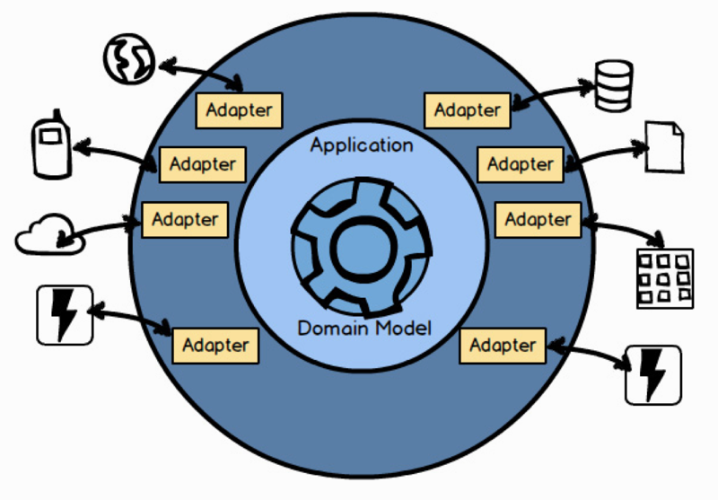

There is another question that you may have wondered about. What’s inside a Bounded Context ? Using this Ports and Adapters [IDDD] architecture diagram, you can see that a Bounded Context is composed of more than a domain model.

These layers are common in a Bounded Context: Input Adapters , such as user interface controllers, REST endpoints, and message listeners; Application Services that orchestrate use cases and manage transactions; the domain model that we’ve been focusing on; and Output Adapters such as persistence management and message senders. There is much to be said about the various layers in this architecture, and it is too elaborate to state in this distilled book. See Chapter 4 of Implementing Domain-Driven Design [IDDD] for an exhaustive discussion.

还有一个你可能想了解的问题。限界上下文内会有什么？当使用端ロ (Port）和适配器（Adapters）[IDDD] 1 的架构图时，你会发现限界上下文的组成绝不仅仅只是一个领域模型。

1 这种架构也称为六边形架构，最早由 Alistair Cockburn 提出。和传统的「数据一应用一展现」的「自下而上」的三层应用架构不同，端口和适配器的「应用一端口一适配器」是「由内向外」的三层架构。它将核心业务逻辑（应用层或领域层）和外层的 API 接口（端口层）以及外部各种具体实现的依赖（适配器层，如各种前端界面、数据库、第三服务、消息机制等）解耦开。通过依赖注入等手段让架构更具灵活性和可扩展性的同时，也让团队把更多的精力聚焦在核心的应用层（领域模型）上。Robert C. Martin 提出的整洁架构（Clean Architecture）也是此架构的变种。请参考《实现领域驱动设计》IDDD 第 4 章的详细介绍。一一译注

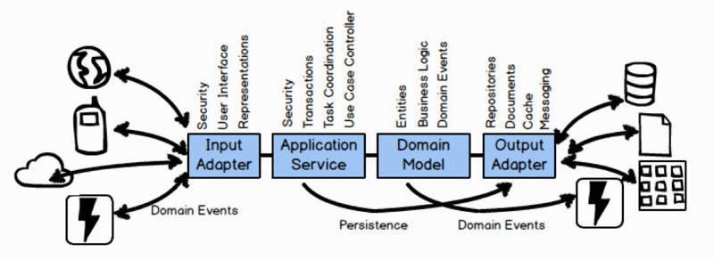

『

Technology-Free Domain Model

Although there will be technology scattered throughout your architecture, the domain model should be free of technology. For one thing, that’s why transactions are managed by the application services and not by the domain model.

虽然在整个架构体系中遍布着各种技术，但领域模型本身与技术无关。这就是为什么事务是由应用服务管理，而不是由领域模型来管理的原因。

』

Ports and Adapters can be used as a foundational architecture, but it’s not the only one that can be used along with DDD. Along with Ports and Adapters, you can use DDD with any of these architectures or architecture patterns (and others), mixing and matching them as needed:

1. Event-Driven Architecture; Event Sourcing [IDDD] . Note that Event Sourcing is discussed in this book in Chapter 6 , “Tactical Design with Domain Events .”

2. Command Query Responsibility Segregation (CQRS) [IDDD] .

3. Reactive and Actor Model; see Reactive Messaging Patterns with the Actor Model [Reactive] , which also elaborates on the use of the Actor model with DDD.

4. Representational State Transfer (REST) [IDDD] .

5. Service-Oriented Architecture (SOA) [IDDD] .

6. Microservices are explained in Building Microservices [Microservices] as essentially equivalent to DDD Bounded Contexts , so both the book you are reading and Implementing Domain-Driven Design [IDDD] discuss the development of microservices from that perspective.

7. Cloud computing is supported in much the same way as microservices, such that anything you read in this book, in Implementing Domain-Driven Design [IDDD] , and in Reactive Messaging Patterns with the Actor Model [Reactive] is applicable.

我们可以使用端口和适配器作为一种基础架构，但这不是在 DDD 中唯一可用的架构。除了端口和适配器，你可以在 DDD 中使用任何架构，或架构模型（或是其他），并可以根据需要进行匹配或是混合使用。1）事件驱动架构，事件溯源「IDDD」。在本书第 6 章中将会讨论事件溯源。2）命令和查询职责分离（CQRS）[IDDD] 1。3）响应式架构和 Actor 模型 2：参阅《响应式架构：消息模式 Actor 实现与 Scala、Akka 应用集成》[Reactive]，它说明了如何结合 DDD 运用 Actor 模型。4）具象状态传输（REST）[IDDD] 3。4）面向服务的架构（SOA）[IDDD] 4。5）《微服务设计》[Microservices] 一书中解释了微服务本质上等同于 DDD 中的限界上下文，所以本书和《实现领域驱动设计》[IDDD] 都是从这个视角讨论微服务开发的。6）云计算和微服务以一样的方式得到支持，同样的内容可以在本书、《实现领域驱动设计》以及《响应式架构：消息模式 Actor 实现与 Scala、Akka 应用集成》中读到 5。

1 命令与查询职责分离（Command Query Responsibility Segregation, CQRS）和传统的 CRUD 模式不一样，它把同一个模型的无副作用查询操作和改变状态的修改操作（通常称为命令）分开。两部分可以分别在不同的模块和服务实现，可以分别部署到不同的硬件或基础设施上，甚至可以使用完全不同的数据存储方式。例如，改变状态的命令经常会采用事件溯源来实现。这种架构特别适合需要高性能且查询和命令的扩展性有不同要求的应用（或者服务），它们可以根据自己的需要分别采用不同的方式进行扩展。当然，随之而来的是架构复杂性的增加，在使用之前需要谨慎地权衡，选择合适的服务或模块应用这种架构。——译注

2 在 Actor 模型中，每个 Actor 都可以被看成是一致性边界和一个独立的业务单元，可以和 DDD 中的聚合概念完美对接。——译注

3 具象状态传递（Representational State Transfer, REST）是 2000 年 Roy Fielding 博士在他的博士论文中提出来的一种软件架构风格。REST 围绕资源这个核心概念定义了一套标准的方法，而这套方法正好和 HTTP 的动词以及状态码匹配。随着互联网的发展，REST 几乎成了 API 定义以及微服务通信的事实标准。REST 会在 DDD 的上下文映射中得到应用。但需要注意的是，REST 并不是真正意义上的标准，对它的理解和实现可谓百花齐放。在使用这种风格之前，请参考 Richardson Maturity Model 和一些公开的 API 设计范例（如 Github API），来了解 REST 的最佳实践。此外，REST 也不是唯一的选择，还有 gRPC 和 graphQL 这样的替代方案（就像 REST 替代 SOAP 一样）。一一译注

4 面向服务的架构（Service Oriented Architecture, SOA）是一个组件模型，它将应用程序的不同功能单元（称为服务）通过这些服务之间定义良好的接口和契约联系起来。我们经常会看见 SOA 和微服务的比较，但实际上微服务和 SOA 一脉相承，可以认为是 SOA 的一种特定的现代的实现。微服务相对于 SOA 更注重对独立业务单元的拆分来形成清晰的边界，并采用轻量级的通信机制，以一种更加松耦合的方式进行集成，来提供更好的扩展性和灵活性。同时，借助 Devops 和云平台的东风，微服务可以由单个独立的小团队开发、部署和运维。因此，微服务已经成为现代分布式系统的首选架构，也成了遗留架构首选的演进和重构方向。微服务强调的服务边界和 DDD 提倡的限界上下文可谓不谋而合，因此，DDD 方法在在微服务的设计和拆分中得到了广泛的应用。——译注

5 充分利用云计算优势构建和运行的应用被称为云原生（Cloud Native）应用，企业需要借助构建和运行云原生应用和服务的平台，来自动执行并集成 Devops、持续交付、微服务和容器等概念。微服务、事件湖源、CORS 以及 Actor 模型这些架构都可以完美地契合云原生应用和平台。而 Amazon 加入 CNCF  (Cloud Native Computing Foundation）之后，三大云平台供应商（Google、Microsoft 和 Amazon）齐齐聚首，推进了云原生的标准化和最佳实践的普及。一一译注

Another comment on microservices is in order. Some consider a microservice to be much smaller than a DDD Bounded Context. Using that definition, a microservice models only one concept and manages one narrow type of data. An example of such a microservice is a Product and another is a BacklogItem . If this is the granularity that you consider a worthy microservice, understand that both the Product microservice and the BacklogItem microservice will still be in the same larger, logical Bounded Context. The two small microservice components have only different deployment units, which may also have an impact on how they interact (see Context Mapping ). Linguistically they are still within the same Scrum-based contextual and semantic boundary.

另一种关于微服务的解释也很恰当。有些人认为其实微服务要比 DDD 的限界上下文要小得多。按照这种定义，一个微服务模型只包含一个概念，并只用管理一种小类型的数据。例如，产品是一个微服务，待办项是另外一个。如果你认为这样粒度的微服务很有价值，那么你需要理解产品微服务和待办项微服务仍将存在于同一个更大的逻辑限界上下文中。1 即使这两个小型的微服务组件之间的区别仅仅是部署单元不一样，这也会影响它们的交互方式（参考上下文映射）。从语言学上来说，它们仍位于同一个基于 Scrum 的语境和语义边界之内。

2 经常会有一些有关于微服务粒度的讨论，也会有人质疑某个微服务太大或是太小，在这里我们希望重中的观点是，微服务的边界（粒度）是一个设计决策，而没有一个标准答案。因此，我们鼓励对微服务划分的质疑，也鼓励针对划分的探讨。但微服务划分归根结底是架构设计，因此，你需要着重从以下几点展开思考：首先是现有架构间的依赖关系，其次是业务上的可扩展性，再次是团队目前的人员能力，最后则是在实现过程中可能遇到的风险与挑战。这些划分的依据往往也是我们在 DDD 中对上下文和子域进行划分时需要考虑的问题。一一译注

## Summary

In summary you have learned: 1) Some of the major pitfalls of putting too much into one model and creating a Big Ball of Mud. 2) The application of DDD strategic design. 3) The use of Bounded Context and Ubiquitous Language. 4) How to challenge your assumptions and unify mental models. 5) How to develop a Ubiquitous Language. 6) About the architectural components found inside a Bounded Context. 6) That DDD is not too difficult to put into practice yourself!

For a more in-depth treatment of Bounded Contexts , see Chapter 2 of Implementing Domain-Driven Design [IDDD] .