# 0401. Strategic Design with Context Mapping

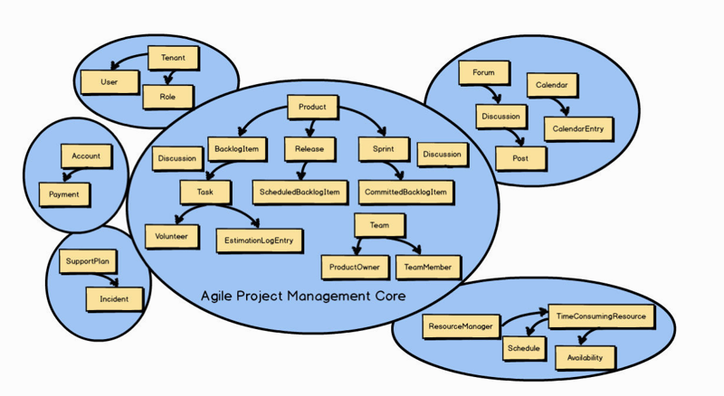

In previous chapters you learned that in addition to the Core Domain , there are multiple Bounded Contexts associated with every DDD project. All concepts that didn’t belong in the Agile Project Management Context —the Core Domain —were moved to one of several other Bounded Contexts.

在前面的章节中，已经了解到除了核心域（Sub Domain）之外，每个 DDD 项目还关联着多个限界上下文。所有不属于敏捷项目管理上下文（即核心域）的概念都会被迁移到其他某个限界上下文之中。

You also learned that the Agile Project Management Core Domain would have to integrate with other Bounded Contexts. That integration is known in DDD as Context Mapping. You can see in the previous Context Map that Discussion exists in both Bounded Contexts. Recall that this is because the Collaboration Context is the source of the Discussion , and that the Agile Project Management Context is the consumer of the Discussion .

还了解到，敏捷项目管理核心域必须和其他限界上下文进行集成。这种集成关系在 DDD 中称为上下文映射（Context Mapping）。你可以在上面的上下文映射图（Context Map）中看到，Discussion 同时存在于两个限界上下文（Bounded Context）之中。回忆一下这是因为协作上下文是 Discussion 的来源，而敏捷项目管理上下文是 Discussion 的消费者。

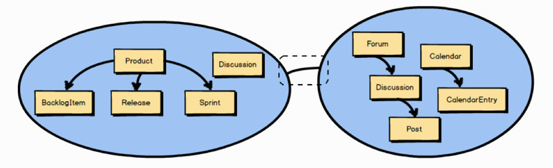

A Context Mapping is highlighted in this diagram by the line inside the dashed box. (The dashed box is not part of the Context Mapping but is used only to highlight the line.) It’s actually this line between the two Bounded Contexts that represents a Context Mapping. In other words, the line indicates that the two Bounded Contexts are mapped in some way. There will be some inter-team dynamic between the two Bounded Contexts as well as some integration.

上图中，上下文映射用虚线框里的线段表示（虚线框不是上下文映射的一部分，只是用于强调中间的线段）。实际上，连接两个限界上下文之间的这条线段就代表了上下文映射。换句话说，这条线段表示这两个限界上下文之间存在着某种形式的映射，包括两个限界上下文之间的集成关系以及团队间的动态关系。

Considering that in two different Bounded Contexts there are two Ubiquitous Languages , this line represents the translation that exists between the two languages. By way of illustration, imagine that two teams need to work together, but they work across national boundaries and don’t speak the same language. Either the teams would need an interpreter, or one or both teams would have to learn a great deal about the other’s language. Finding an interpreter would be less work for both teams, but it could be expensive in various ways. For example, imagine the extra time needed for one team to talk to the interpreter, and then for the interpreter to relay the statements to the other team. It works fine for the first few moments but then becomes cumbersome. Still, the teams might find this a better solution than learning and embracing a foreign language and constantly switching between languages. And, of course, this describes the relationship only between two teams. What if there are a few other teams involved? Similarly, the same trade-offs would exist when translating one Ubiquitous Language into another, or in some other way adapting to another Ubiquitous Language.

考虑到两个不同的限界上下文中存在着两种通用语言（Ubiquitous Language），这条线段也代表着两种语言之间的转译过程。挙个例子，假设有两个团队需要一起工作，但他们位于不同的国家，讲不同的语言。为了解决沟通问题，要么在两个团队间设置一名翻译要么其中一个团或者全部两个团队需要熟练掌握对方的语言。找一名翻译更容易一些，但各方面的开销会显著增加。例如，想一想下面这个场景中所消耗的额外时间：一个团队需要先和翻译沟通，然后由醐译转述给另一个团队。这样做刚开始可能还行，但过一段时间就变成了麻烦。尽管如此，相比学习和接受一门外语并在两者之间来回切换，这些团队可能会认为请翻译是一个更好的解决方案。这还只是涉及两个团队的关系，如果还有更多其他团队参与进来又会怎么样？类似地，将一种通用语言翻译成另一种时，或者以其他某种方式适应另一种通用语言时，也要做出同样的权衡。

When we talk about Context Mapping , what is of interest to us is what kind of inter-team relationship and integration is represented by the line between any two Bounded Contexts. Well-defined boundaries and contracts between them support controlled changes over time. There are several kinds of Context Mappings , both team and technical, that can be represented by the line. In some cases both an inter-team relationship and an integration mapping will be blended.

当我们谈论上下文映射时，我们感兴趣的是连接任意两个限界上下文之间的这条线段究竟代表的是哪种类型的团队间关系和集成关系。它们之间定义清晰的边界和契约可以随着时间发生可控的变化。这条线段表示各种各样的上下文映射，包括团队间的和技术上的在某些情况下，团队间关系和集成映射会被混合在一起。

## 4.1 Kinds of Mappings

What relationships and integrations can be represented by the Context Mapping line? I will introduce them to you now.

### 4.1.1 Partnership

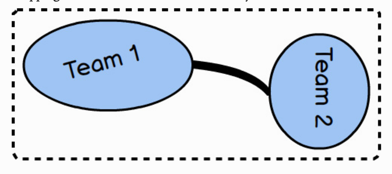

A Partnership relationship exists between two teams. Each team is responsible for one Bounded Context. They create a Partnership to align the two teams with a dependent set of goals. It is said that the two teams will succeed or fail together. Since they are so closely aligned, they will meet frequently to synchronize schedules and dependent work, and they will have to use continuous integration to keep their integrations in harmony. The synchronization is represented by the thick mapping line between the two teams. The thick line indicates the level of commitment required, which is quite high.

It can be challenging to maintain a Partnership over the long term, so many teams that enter a Partnership may do best to set limits on the term of the relationship. The Partnership should last only as long as it provides an advantage, and it should be remapped to a different relationship when the advantage is trumped by the drain of commitment.

合作关系（Partnership）关系存在于两个团队之间。每个团队各自负责一个限界上下文。两个团队通过互相依赖的一套目标联合起来形成合作关系。一损俱损，一荣俱荣。由于相互之间的联系非常紧密，他们经常会面对同步日程安排和相互关联的工作，他们还必须使用持续集成 [1] 对保持集成工作协调一致。两个团队之间的一致步调使用粗的映射线段表示。粗线段表示两个团队彼此需要高度承诺。

保持长期的合作关系很有挑战性，因此许多进入合作关系的团队可能会尽最大努力为这种关系设置一个期限。只有在能发挥彼此优势时才维持合作关系，而随着承诺的消失，这些优势会不复存在，而这种合作关系应该被重新映射成另外的一种关系。

1 Martin Fowler 对持续集成的定义是：持续集成是一种软件开发实践，即团队开发成员经常集成他们的工作，通常每个成员每天至少集成一次，也就意味着每天可能会发生多次集成。每次集成都通过自动化的构建（包括编译、发布、自动化测试）来验证，从而尽快地发现集成错误。许多团队发现这个过程可以大大减少集成的问题，让团队能够更快地开发内聚的软件。这里介绍的上下文映射本质就是一种集成关系，因此持续集成的实践活动对几乎所有的上下文映射关系而言都是不可或缺的。一一译注

### 4.1.2 Shared Kernel

A Shared Kernel , depicted on page 54 by the intersection of the two Bounded Contexts , describes the relationship between two (or more) teams that share a small but common model. The teams must agree on what model elements they are to share. It’s possible that only one of the teams will maintain the code, build, and test for what is shared. A Shared Kernel is often very difficult to conceive in the first place, and difficult to maintain, because you must have open communication between teams and constant agreement on what constitutes the model to be shared. Still, it is possible to be successful if all involved are committed to the idea that the kernel is better than going Separate Ways (see the later section).

共享内核（Shared Kernel）用上图中两个限界上下文的交集表示，它描述了这样一种关系：两个（或更多）团队之间共享着一个小规模但却通用的模型。团队必须就要共享的模型元素达成一致。有可能它们当中只有一个团队会维护、构建及测试共享模型的代码。共事内核通常一开始很难理解，也很难维护，这是因为团队之间的沟通必须完全开放，而且他们必须就共享模型的构成不断地达成一致 [1]。但是，只要所有参与者都认同共享内核比各行其道 [2]（参见后面的小节）的方式更好，就有可能获得成功。

1 共享内核常见的一种方式就是将通用模块通过二进制依赖（如 JAR 包或者链接库）的方式共享给所有上下文使用。正如书中所说，持续地就修改进行开放式沟通并达成一致是很困难的，效率也很低。但蓬勃发展的开源软件社区却给我们做出了表率。大部分的开源软件都以二进制库的形式发布，开发者们也很难有直接面对面的沟通机会，但它们的发展和演进一点也不慢。开源软件开发者们会使用各种约定和相应实践进行沟通协作，使用 Github 的拉取请求（Pull Request）来审查代码并接受贡献，或是使用长期支持版本（Long Term Support, LTS）保持固定发布节奏给下游预留升级时间，又或是使用语义化版本（Semantic Version）向下游宣告破坏性修改。因此，越来越多的企业向开源社区学习，搭建基础设施和平台，建立企业的「内源」（内部开源）社区来开鼓励开发团队更高效地进行跨团队的协作。在译者所著的《代码管理核心技术及实践》中有关于「内源」社区的介绍。——译注

2 Separate Ways，借鉴了《领域駆动设计》中的译法，和《实现领域驱动》（IDDD 中的译法「另谋他路」同义。——译注

### 4.1.3 Customer-Supplier

A Customer-Supplier describes a relationship between two Bounded Contexts and respective teams, where the Supplier is upstream (the U in the diagram) and the Customer is downstream (the D in the diagram). The Supplier holds sway in this relationship because it must provide what the Customer needs. It’s up to the Customer to plan with the Supplier to meet various expectations, but in the end the Supplier determines what the Customer will get and when. This is a very typical and practical relationship between teams, even within the same organization, as long as corporate culture does not allow the Supplier to be completely autonomous and unresponsive to the real needs of Customers.

客户一供应商（Customer-Supplier）描述的是两个限界上下文之间和两个独立团队之间的一种关系：供应商位于上游（图中的 U），客户位于下游（图中的 D）。支配这种关系的是供应商，因为它必须提供客户需要的东西。客户需要与供应商共同制订规划来满足各种预期，但最终却是由供应商来决定客户获得的是什么以及何时获得 [2]。即便是来自于同一个组织的团队，只要企业文化不允许供应商完全自治或无视客户的实际需求，客户一供应商关系也是一种非常典型且现实的关系。

1 此处借鉴了《领域駆动设计》中的译法，和《实现領域驱动》[IDDD] 中的「客户方ー供应方开发」（Customer- Supplier Development）是同样的含义。

2 和共享内核的映射关系一样，保持客户和供应商之间持续开放的沟通也很重要，持续沟通才能保障供应商按照客户的预期提供集成所需的接口。存在这种集成关系的团队常常会采用一种被称为消费者驱动契约（Consumer Driven Contract, CDC）的实践，通过契约测试来保证上游（生产者或供应商）和下游（消费者或客户）之间的协作。而利用一些工具（如 Pact），客户可以在进行测试时，将对供应商接口的期望记录下来，并将其变成供应商的接口测试，作为供应商持续集成流水线的一部分持续地进行验证。这样供应商可以随时了解自己提供的接口实现是否满足了客户期望。关于消费者驱动契的和契的测试的介绍请参考《微服务设计》第 7 章。关于 Pact 的使用请参考官方文档，一一译注

### 4.1.4 Conformist

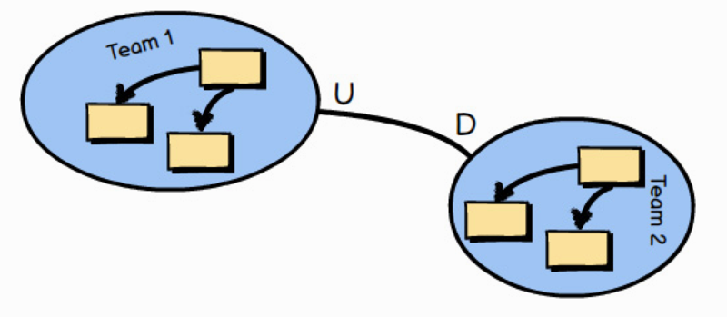

A Conformist relationship exists when there are upstream and downstream teams, and the upstream team has no motivation to support the specific needs of the downstream team. For various reasons the downstream team cannot sustain an effort to translate the Ubiquitous Language of the upstream model to fit its specific needs, so the team conforms to the upstream model as is. A team will often become a Conformist , for example, when integrating with a very large and complex model that is well established. Example: Consider the need to conform to the Amazon.com model when integrating as one of Amazon’s affiliate sellers.

跟随者（Conformist）[1] 关系存在于上游团队和下游团队之间，上游团队没有任何动机满足下游团队 [2] 的具体需求。由于各种原因，下游团队也无法投入资源去翻译上游模型的通用语言来适应自己的特定需求，因此只能顺应上游的模型。例如，当一个团队需要与一个非常庞大复杂的模型集成，而且这个模型已经非常成熟时，团队往往会成为它的跟随者 [3]。例子：在作为亚马逊联盟的卖家进行集成时就需要考虑遵循 Amazon.com 的模型。

1 此处借鉴了《领域驱动设计》中的译法，和《实现领域驱动》中的「遵奉者」同义一一译注

2 很多成对的词语可以表示这种下游依赖上游的类似关系，如：「客户」和「供应商」、「客户端」和「服务端」、「消费」和「生产」，「订阅」和「发布」。这些词语绝大部分情况下在本书中会成对地出现。但有时词语对并不完全「对称」，比如「上游」和「消费」，读者可以结合当时语境理解。 ——译注

3 这种关系对跟随者来说是一把双刃剑。跟随者一方面可以借助上游的生态圈快速地获得用户和流量。而另一方面，跟随者也要严格地遵循上游制订的「游戏规则」，而破坏规则将使自己处于非常被动的境地比如，在国内的移动开发中，无论是 iOS 或是 Android，开发者都特别热衷于实现「动态化」方案，在应用中动态下发和执行代码。这样的方式会使用未公开的隐藏接口，甚至是操作系统的漏洞。一旦这些漏洞和接口被修复或关闭（Apple 和 Google 已经开始这样做了），这些方案将完全失效。无论是出于何种原因（比如快速修复线上问题的 Hotfix），采用这种映射关系将自己的核心域作为上游规则「漏洞」的附庸，实在是不明智的选择。——译注

### 4.1.5 Anticorruption Layer

An Anticorruption Layer is the most defensive Context Mapping relationship, where the downstream team creates a translation layer between its Ubiquitous Language (model) and the Ubiquitous Language (model) that is upstream to it. The layer isolates the downstream model from the upstream model and translates between the two. Thus, this is also an approach to integration.

Whenever possible, you should try to create an Anticorruption Layer between your downstream model and an upstream integration model, so that you can produce model concepts on your side of the integration that specifically fit your business needs and that keep you completely isolated from foreign concepts. Yet, just like hiring a translator to act between two teams speaking different languages, the cost could be too high in various ways for some cases.

防腐层（Anticorruption Layer）是最具防御性的上下文映射关系，下游团队在其通用语言（模型）和位于它上游的通用语言（模型）之间创建了一个翻译层。防腐层隔离了下游模型与上游模型，并完成两者之间的翻译。所以，这也是一种集成的方式。

但凡有可能，你就应该尝试在下游模型和上游集成模型之间创建一个防腐层，这样才可以在你这端的集成中创造出特别适合业务需求的模型概念，并将外部概念完全地隔离。然而，就像为两个讲不同语言的团队雇佣翻译来解决沟通问题一样，在某些情况下各方面的成本会水涨船高。

1 防腐层可以说是最常见的一种阻止外部技术偏好或领域模型侵入的设计模式。几乎没有什么向题是一个防腐层解决不了的。API 网关就是一种防腐层的具体实现。例如，AWS API Gateway 有一项重要的功能就是要对一些服务端点的请求和响应进行转换，我们可以将外部 REST API 返回的数据通过 AWS API Gateway 重新映射，变成我们期望的符合业务模型的事件或者响应数据。另外，在对遗留单块系统进行拆分时，防腐层也发挥着巨大的作用。有一种对付单块系统的重构方式叫作「抽象分支」（Branch by Abstraction），其中从要拆分的模块中提取出的抽象层就发挥着防腐层的作用，在重构的过程中抵挡着未拆分部分对重构工作的腐蚀。这种修者模式的具体介绍，请参考《服务拆分与架构演进》。一一译

### 4.1.6 Open Host Service

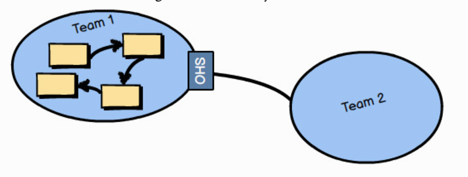

An Open Host Service defines a protocol or interface that gives access to your Bounded Context as a set of services. The protocol is “open” so that all who need to integrate with your Bounded Context can use it with relative ease. The services offered by the application programming interface (API) are well documented and a pleasure to use. Even if you were Team 2 in this diagram and could not take time to create an isolating Anticorruption Layer for your side of the integration, it would be much more tolerable to be a Conformist to this model than many legacy systems you may encounter. We might say that the language of the Open Host Service is much easier to consume than that of other types of systems.

开放式主机服务（Open Host Service）[1] 会定义一套协议或接口，让限界上下文可以被当作一组服务访问。该协议是「开放的」，所有需要与限界上下文进行集成的客户端都可以相对轻松地使用它。通过应用程序編程接口（API）提供的服务都有详细的文档，用起来也很舒服。即使是处在类似图中团队 2 的位置，也没有时间在这端的集成中创建隔离用的防腐层，和许多可能遇到的遗留系统相比，作为团队 1 模型的跟随者更容易被接受。可以说开放主机服务的语言比其他类型的系统语言更易用。

1 REST 服务就是一种最常见的开放主机服务实例。实现开放主机服务相对来说是一种成本较高的集成方式。它的 API 要提供给许多下游上下文使用，这就要求接口实现要做到足够的兼容性、可伸缩性、健壮性。同时，开放主机服务还要提供易用的文档，因此通常会和已发布语言一起使用，采用主流协议来定义 API，这是一种特别适合快速扩张形成生态的方式，我们看到 API 已经变成了主流互联网公司的标配，帮助它们牢牢地把持着自己的生态圈和开发者社区。我们也观察到一些传统的大型企业也在利用 API 和服务化治理整合内部资源，请参考《数字化企业的 API 架构治理》。一一译注

### 4.1.5 Published Language

A Published Language , illustrated in the image at the bottom of page 57 , is a well-documented information exchange language enabling simple consumption and translation by any number of consuming Bounded Contexts. Consumers who both read and write can translate from and into the shared language with confidence that their integrations are correct. Such a Published Language can be defined with XML Schema, JSON Schema, or a more optimal wire format, such as Protobuf or Avro. Often an Open Host Service serves and consumes a Published Language , which provides the best integration experience for third parties. This combination makes the translations between two Ubiquitous Languages very convenient.

上图中展示的已发布语言（Published Language）[1] 是一种有着丰富文档的信息交换语言，可以被许多消费方的限界上下文简单地使用和翻译。需要读写信息的消费者们可以把共享语言翻译成自己的语言，反之亦然，而在此过程中它们对集成的正确性充满信心。这种已发布语言可以用 XML Schema、JSON Schema 或更佳的序列化格式定义，比如 Protobuf 或 Avro。通常，同时提供和使用己发布语言的开放主机服务可以为第三方提供最佳的集成体验。这种结合使得两种通用语言之间的转译非常方便。

1 此处借鉴了《领域驱动设计》中的译法，和《实现领域駆动》IDDD 中的「发布语言」同义。一一译注

2 Protocol Buffers，简称 Protobuf，是 Google 开源的数据交换标准，用于定义数据传输和持久化的报文格式。Avro 是 Apache Hadoop 的一个子项目，是一种远程过程调用和数据序列化框架。除了书中提到的这两种新的序列化协议，另一种新的「查询语言」GraphQL 也在逐渐流行起来。它由 Facebook 开源具备类型安全、内省、文档生成和可预测响应等优势，非常适合对数据有不同要求的各种客户端。有兴趣的读者可以参考其中文网站。——译注

### 4.1.5 Separate Ways

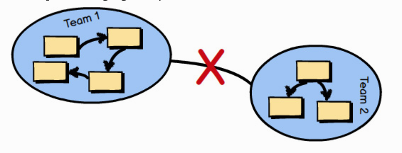

Separate Ways describes a situation where integration with one or more Bounded Contexts will not produce significant payoff through the consumption of various Ubiquitous Languages. Perhaps the functionality that you seek is not fully provided by any one Ubiquitous Language. In this case produce your own specialized solution in your Bounded Context and forget integrating for this special case.

各行其道（Separate Way）[1] 描述了一种情况，使用各种通用语言来与一个或多个限界上下文集成这样的方式不能产生显著的回报。也许你所寻求的功能并不能由任何一种通用语言提供。在这种情况下，只能在限界上下文中创造属于自己的特殊解决方案，并放弃针对这种特殊情况的集成。

1 各行其道意味着两个上下文之间根本没有关系，不需要控制，也不需要承诺。在一个复杂的模型中定存在着许多上下文，而大部分上下文之间应该是没有直接依赖关系的。例如，第 3 章中的一个关于子域的例子里，账户子域（上下文）和物流子域（上下文）之间就没有直接联系。如果任何两个上下文之间都有直接联系，整个模型就要走向另一个极端：大泥球。两个上下文之间没有任何依赖，自由地独立演进，这应该是我们最希望的。因此，在可能的情况下，我们应该把两个上下文分开，让它们各行其道。——译注

### 4.1.5 Big Ball of Mud

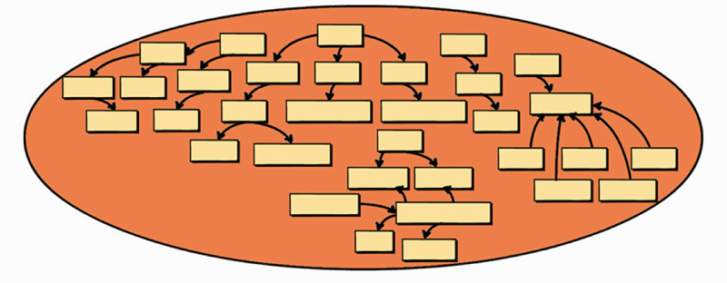

You already learned plenty about Big Ball of Mud in the previous chapters, but I am going to reinforce the serious problems you will experience when you must work in or integrate with one. Creating your own Big Ball of Mud should be avoided like the plague.

在第 3 章中，已经学到了很多关于大泥球（Big Ball of Mud）的知识，但这里要强调在处理大泥球或者要和它进行集成时可能面临的严重问题。制造大泥球这种事应该人人避之唯恐不及。

Just in case that’s not enough warning, here’s what happens over time when you are responsible for creating a Big Ball of Mud: (1) A growing number of Aggregates cross-contaminate because of unwarranted connections and dependencies. (2) Maintaining one part of the Big Ball of Mud causes ripples across the model, which leads to “whack-a-mole” issues. (3) Only tribal knowledge and heroics—speaking all languages at once—save the system from complete collapse.

假如这还不够让你警醒，下面描述的是如何一步一步把系统推向大泥球深渊：1）越来越多的聚合因为不合理的关联和依赖而交叉污染。2）对大泥球的一部分进行维护就会牵一发而动全身，解决问题就像在「打地鼠」。3）只剩下「部落知识」和「个人英雄主义」，唯有同时「讲」出所有语言的极个别「超人」方能扶大厦之将倾 [1]。

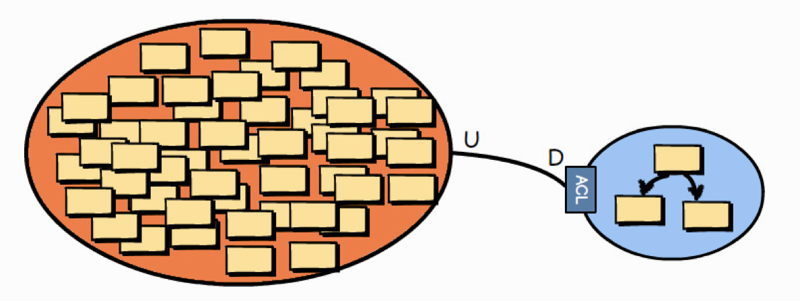

The problem is that there are already many Big Balls of Mud out there in the wide world of software systems, and the number will no doubt grow every month. Even if you are able to avoid creating a Big Ball of Mud by employing DDD techniques, you may still need to integrate with one or more. If you must integrate with one or more, try to create an Anticorruption Layer against each legacy system in order to protect your own model from the cruft that would otherwise pollute your model with the incomprehensible morass. Whatever you do, don’t speak that language!

问题是，大泥球已经遍布于世界上的软件系统中，这个数量还铁定会逐月增长。即使可以通过采用 DDD 技术避免创建自己的大泥球，仍可能不得不与它们集成。如果必须与个或多个这样的大泥球系统集成，请尝试针对每个这样的遗留系统创建一个防腐层，保护自己的模型免受污染，否则会陷入难以理解的泥潭。不管怎样，别「讲」这种语言！

1 Tribal Knowledge，是指一种仅存在于某个部落中的信息或知识，这些知识不为外界所知，没有正式记录，只能口口相传。当系统发展到这个大泥球程度，可以想象，参与到其中的每个团队甚至每个人都有着自己对模型的理解和定义，就像一个个坐井观天的小「部落」一样讲着只有自己能懂的语言。只有极个别充满「个人英雄主义」的架构师能够理解不同小团队或个人的不同语言，苦苦地支撑着脆弱的系统。如果这少数几个架构师失去了坚持下去的勇气或者离开了团队（这很可能会发生），整个系统将完全无法维护，很快会落得重写的结局。最差的情况是，团队连重写的勇气都没有，只能默默地祈祷系统可以荀延残喘。——译注

## 4.2 Making Good Use of Context Mapping

1『中文版书里的这张图可以好好看下。』

You may be wondering what specific kind of interface would be supplied to allow you to integrate with a given Bounded Context. That depends on what the team that owns the Bounded Context provides. It could be RPC via SOAP, or RESTful interfaces with resources, or it could be a messaging interface using queues or Publish-Subscribe. In the least favorable of situations you may be forced to use database or file system integration, but let’s hope that doesn’t happen. Database integration really should be avoided, and if you are forced to integrate that way, you really should be sure to isolate your consuming model by means of an Anticorruption Layer.

Let’s take a look at three of the more trustworthy integration types. We will move from the least robust to the most robust integration approaches. First we will look at RPC, followed by RESTful HTTP, and then messaging.

你可能想知道提供什么样的特定接口才能和指定的限界上下文进行集成。这取决于负责这个限界上下文的团队提供的是什么。它可以是基于 SOAP 的 RPC，也可以是基于资源的 RESTFUL 接口，抑或是使用队列或发布订阅的消息机制。最不济你会被迫使用数据库或文件系统进行集成，让我们祈祷这种情况不会发生。基于数据库的集成方式是一定要避免的 [1]，如果不得不以这种方式进行集成，请务必通过防腐层来隔离要去集成和适配的模型。我们来看看三种更可靠的集成类型。我们将按照健壮性逐步加强的方式介绍这三种集成方式。首先我们介绍的是 RPC，接下来是 RESTful HTTP，最后是消息机制。

1 共享数据库的集成方式看起来简单直接，实现起来很快。因此，它曾经是一种颇受欢迎的集成选择。然而，随着它暴露的问题越来越多，现在已经变成了一种反模式。首先，它是单点故障和性能瓶颈的源头此外，它违背了「高内聚、低耦合」的设计原则。多个消费方上下文和一种具体的数据库技术实现（如关系型数据库）紧密地耦合在了一起，对数据库的任何调整将会导致霰弹式修改。而消费方上下文也受到数据库内部细节和技术选型的干扰。选择这种方式的结果就是所有消费方上下文最后都会骑虎难下不敢做出任何修改。——译注

### 4.2.1 RPC with SOAP

Remote Procedure Calls, or RPC, can work in a number of ways. One popular way to use RPC is via the Simple Object Access Protocol, or SOAP. The idea behind RPC with SOAP is to make using services from another system look like a simple, local procedure or method invocation. Still, the SOAP request must travel over the network, reach the remote system, perform successfully, and return results over the network. This carries the potential for complete network failure, or at least latency that is unanticipated when first implementing the integration. Additionally, RPC over SOAP also implies strong coupling between a client Bounded Context and the Bounded Context providing the service.

远程过程调用（Remote Procedure Call, RPC）能以多种方式工作。一种流行的方式是通过简单对象访问协议（Simple Object Access Protocol, SOAP）使用 RPC [1]。基于 SOAP 的 RPC 背后的思路是让调用另一个系统的服务如同调用一个本地过程或方法那样简单。然而，SOAP 请求必须通过网络传播才能抵达远程系统，成功执行并再次通过网络返回结果。在开始实施这种集成方式时就要承受网络彻底瘫痪的风险，或者至少要承受意外的网络延迟。另外，基于 SOAP 的 RPC 还意味着客户端限界上下文和提供服务的服界上下文之间存在着紧耦合。

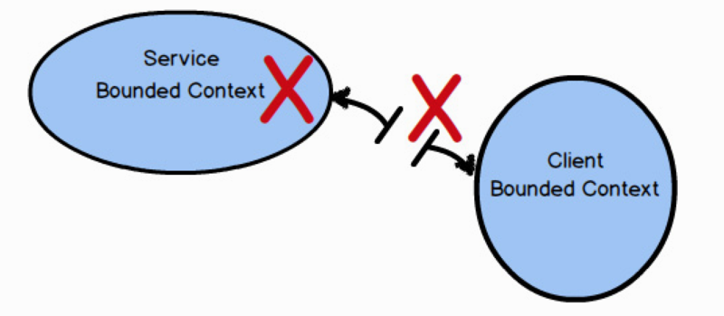

1 SOAP 这种 RPC 方法有些历史了，现在提起 RPC 我们更可能想到的是 gRPC 和 Thrift。相较于 SOAP 这些现代的 RPC 机制能更友好地支持更多的编程语言，对使用者的侵入性更低。它们采用了比 XML 效率更高的数据序列化格式和现代的传输协议（如 HTTP/2），能够有效地降低延迟。因此，如果选择 RPC 作为集成方式，应该考虑采用这些现代的 RPC 机制。一一译注

The main problem with RPC, using SOAP or another approach, is that it can lack robustness. If there is a problem with the network or a problem with the system hosting the SOAP API, your seemingly simple procedure call will fail entirely, giving only error results. Don’t be fooled by the seeming ease of use.

RPC 的主要问题是，无论是使用 SOAP 或是其他方法，它都缺乏健壮性。如果网络出现问题或者托管 SOAP API 的系统出现问题，那么看似简单的过程调用将完全失败，只会留下错误的结果。不要被看似易用的表面所迷惑。

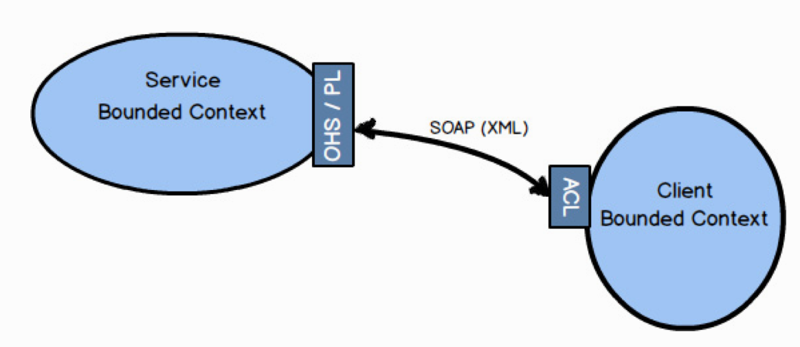

When RPC works—and it mostly works—it can be a very useful way to integrate. If you can influence the design of the service Bounded Context , it would be in your best interests if there is a well-designed API that provides an Open Host Service with a Published Language. Either way, your client Bounded Context can be designed with an Anticorruption Layer to isolate your model from unwanted outside influences.

当 RPC 有效时一一大部分时间它都是有效的一它是一种非常实用的集成方式。当我们可以影响服务端限界上下文的设计时，如果它有一个设计良好的 API 使用已发布语言来提供开放主机服务，那就最好不过了。不管怎样，客户端限界上下文都可以设计一层防腐层，将模型与多余的外部影响隔离开来。

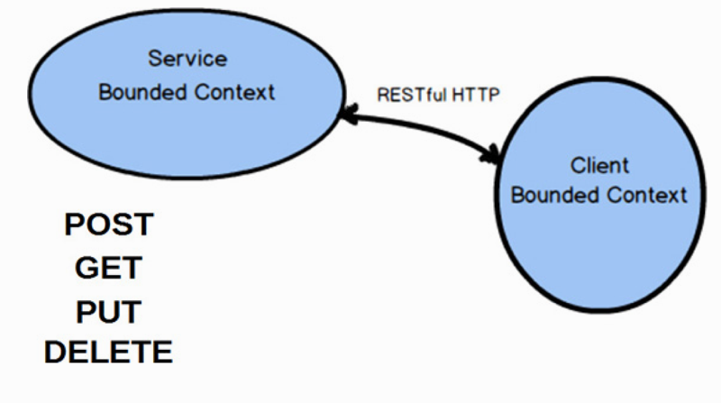

### 4.2.2 RESTful HTTP

Integration using RESTful HTTP focuses attention on the resources that are exchanged between Bounded Contexts , as well as the four primary operations: POST, GET, PUT, and DELETE. Many find that the REST approach to integration works well because it helps them define good APIs for distributed computing. It’s difficult to argue against this claim given the success of the Internet and Web.

使用 RESTful HTTP 的集成将注意力集中在限界上下文之间交换的资源上，还有相关的四个主要操作：POST、GET、PUT 和 DELETE。许多人发现采用 REST 方式进行集成效果很好，因为它可以帮助他们定义出非常适合分布式计算的 API。互联网的成功让这一点不可辩驳。

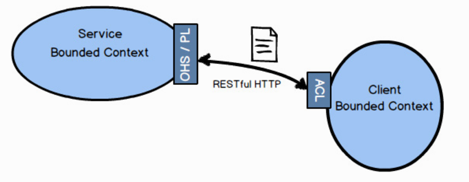

There is a very certain way of thinking when you use RESTful HTTP. I won’t get into the details in this book, but you should look into it before trying to employ REST. The book REST in Practice [RiP] is a good place to start.

A service Bounded Context that sports a REST interface should provide an Open Host Service and a Published Language. Resources deserve to be defined as a Published Language , and combined with your REST URIs they will form a natural Open Host Service.

使用 RESTful HTTP 是一种非常固定的思维方式。在本书里不会详细展开，但应该在尝试之前仔细研究 REST。《REST 实战》[RiP] 这本书是一个不错的开始。支持 REST 接口的服务端限界上下文应该提供开放主机服务和已发布语言。资源理应被定义成已发布语言，而且当它们与你的 REST URI 结合在一起之后，将形成天然的开放主机服务。

RESTful HTTP will tend to fail for many of the same reasons that RPC does—network and service provider failures, or unanticipated latency. However, RESTful HTTP is based on the premise of the Internet, and who can find fault with the track record of the Web when it comes to reliability, scalability, and overall success?

造成 RESTful HTTP 失败的原因通常和许多造成 RPC 失败的原因一样一一网络或服务提供商故障，还有意外延迟。在没有网络的前提下，RESTful HTTP 无法运作，但谁又能通过跟踪这期间的日志记录来发现导致失败的原因，从而达成保证其成功的可靠性、可伸缩性以及完整性的目标呢？

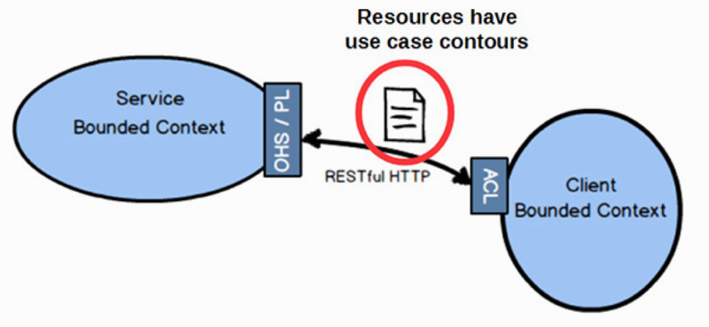

A common mistake made when using REST is to design resources that directly reflect the Aggregates in the domain model. Doing this forces every client into a Conformist relationship, where if the model changes shape the resources will also. So you don’t want to do that. Instead, resources should be designed synthetically to follow client-driven use cases. By “synthetic” I mean that to the client the resources provided must have the shape and composition of what they need, not what the actual domain model looks like. Sometimes the model will look just like what the client needs. But what the client needs is what drives the design of the resources, and not the model’s current composition.

使用 REST 常犯的设计错误是直接把模型中的聚合暴露成资源。服务端模型一旦发生变化，资源也会随之一起改变，这样会把跟随者关系强加给每个客户端。所以你不会想这样做。相反，应该根据客户端驱动的用例设计出「合成」的资源。所「合成」，是指对客户端来说，服务端提供出来的资源必须具有它们所需要的样子和组成，而不是直接给出实际的领域模型。有时候模型看起来就像客户端需要的东西。但客户端真正所需要的是驱动资源模型的设计，而不只是保持模型的皮囊。

### 4.2.3 Messaging

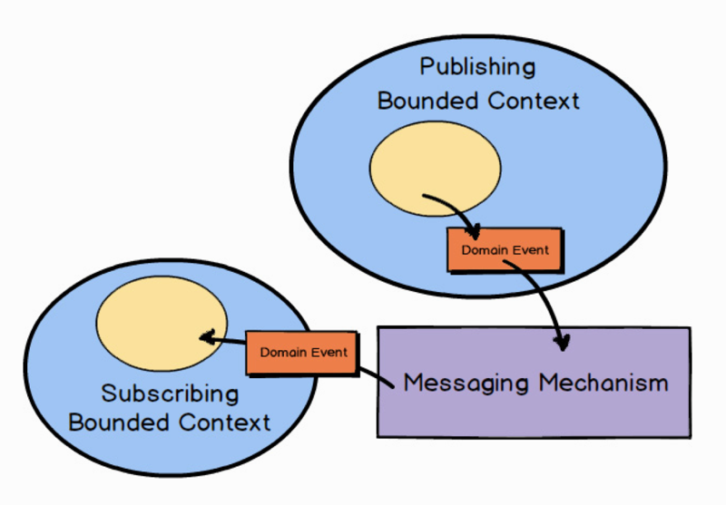

When using asynchronous messaging to integrate, much can be accomplished by a client Bounded Context subscribing to the Domain Events published by your own or another Bounded Context. Using messaging is one of the most robust forms of integration because you remove much of the temporal coupling associated with blocking forms such as RPC and REST. Since you already anticipate the latency of message exchange, you tend to build more robust systems because you never expect immediate results.

在使用异步消息机制进行集成时，很多工作都是通过客户端限界上下文订阅由它自己或另一个限界上下文发布的领域事件（Domain Events）来完成的。使用消息机制是最健壮的集成方法之一，因为可以消除那些和阻塞（同步）形式（如 RPC 和 REST）有关的暂时性耦合。如果可以提前预见到消息交换会产生延迟，就可以构建出更健壮的系统，因为你从未期望结果会即时发生。

『

Going Asynchronous with REST

It’s possible to accomplish asynchronous messaging using REST-based polling of a sequentially growing set of resources. Using background processing, a client would continuously poll for a service Atom feed resource that provides an ever-increasing set of Domain Events. This is a safe approach to maintaining asynchronous operations between a service and clients, while supplying up-to-date events that continue to occur in the service. If the service becomes unavailable for some reason, clients will simply retry on normal intervals, or back off with retry, until the feed resource is available again.

This approach is discussed in detail in Implementing Domain-Driven Design [IDDD].

可以基于 REST 对有序增长的资源集合进行轮询达到异步消息机制的效果。客户端可以在后台进程中持续轮询一个 Atom Feed [1] 资源服务，该资源提供了一个持续增长的领域事件集合。这是一种维持服务和客户端之间异步操作的安全方法，同时还能提供服务中持发生的最新事件。如果服务因某些原因而无法使用，则客户端将简单地在固定时间间隔之后重试，或以退避算法进行重试 [2]，直到资源再次可用。在《实现领域駆动设计》中译细讨论了这种方法。

1 Atom 是工程任务组（ITEF）发布的标准规范，用于表示提要（Feed）格式和用于編辑 Web 资源的协议如 Weblog、在线日志、Wiki 以及类似内容。——译注

2 Backof，是一种重试机制，发送者会在再次重试之前等待一个随机时间，这样可以避免多个发送者按相同时间间隔重试产生的冲突。这个等待时间的随机范一般会采用一种策略和算法来计算，常见的种实现是指数退避算法。——译注

Avoid Integration Train Wrecks

When a client Bounded Context (C1) integrates with a service Bounded Context (S1), C1 should usually not be making a synchronous, blocking request to S1 as a direct result of handling a request made to it. That is, while some other client (C0) makes a blocking request to C1, don’t allow C1 to make a blocking request to S1. Doing so has a very high potential for causing an integration train wreck between C0, C1, and S1. This can be avoided by using asynchronous messaging.

如果客户端限界上下文（C1) 和服务端限界上下文（S1) 集成，C1 在处理其他客户端发给它的请求时，通常不应该将发给 S1 的同步阻塞请求作为这种处理的直接结果。也就是说，当其他某个客户端（C0) 向 C1 发起阻塞请求时，不允许 C1 向 S1 发起另一个阻塞请求。因为这样的做法很可能导致 C0、C1 和 S1 之间发生「集成火车事故」。你可以使用异步消息机制来避免这种事故 [2]。

2 当 C1 向 S1 发起同步阻塞请求并等待其返回作为处理结果来响应 C0 的请求时，它们三者之间就形成了暂时性耦合。C0 的请求是否能成功，返回的是快是慢，取决于 S1 和 C1 以及它们之间的连接（通常是网络连接）。一旦 S1 发生问题，C1 和 C0 就会像相邻的火车车厢一样受到牵连。更糟的是，C0 和 C1 还可能因为阻塞影响可用性。而使用异步消息机制之后，C0 和 C1 首先从设计上就要考虑消息延迟和网络故障导致的失败，自身的健壮性更强。当它们触发命令（发布一条消息）之后，三者之间再无瓜葛，S1 的失敗影响范围就能降到最小。这样就能避免集成火车事故。一一译注

』

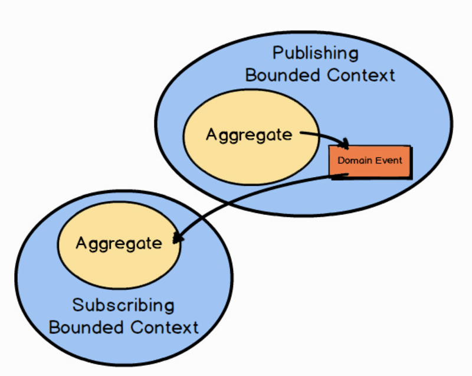

Typically an Aggregate in one Bounded Context publishes a Domain Event , which could be consumed by any number of interested parties. When a subscribing Bounded Context receives the Domain Event , some action will be taken based on its type and value. Normally it will cause a new Aggregate to be created or an existing Aggregate to be modified in the consuming Bounded Context.

通常情况下，领域事件由限界上下文中的聚合（aggregate）发布，许多对它感兴趣的订阅方限界上下文都可以消费。当订阅方限界上下文收到领域事件时，将依据其类型和值进行一些操作。一般它会导致在消费方限界上下文中新聚合的创建或者现有聚合的修改。

『

Are Domain Event Consumers Conformists?

You may be wondering how Domain Events can be consumed by another Bounded Context and not force that consuming Bounded Context into a Conformist relationship. As recommended in Implementing Domain-Driven Design [IDDD] , and specifically in Chapter 13, “Integrating Bounded Contexts,” consumers should not use the event types (e.g., classes) of an event publisher. Rather, they should depend only on the schema of the events, that is, their Published Language. This generally means that if the events are published as JSON, or perhaps a more economical object format, the consumer should consume the events by parsing them to obtain their data attributes.

你可能想知道领域事件如何被另一个服界上下文消费，而不会强迫这个消费方限界上下文变成跟随者。正如《实现领域驱动设计》中（特别是在第 13 章中）所建议的那样，消费者不应该使用事件发布者定义的事件类型（比如，类）。相反，他们只应该依赖事件的格式，即它们的已发布语言。这通常意味着，如果事件以 JSON 格式或者更高效的对象格式发布，那么消者应通过解析它们获取其数据属性来消该事件。

』

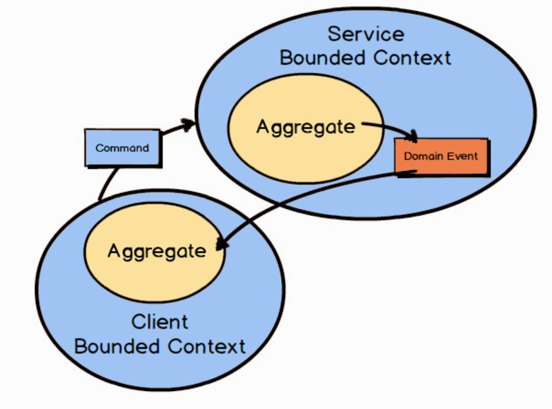

Of course, the foregoing assumes that a subscribing Bounded Context can always benefit from unsolicited happenings in the publishing Bounded Context. Sometimes, however, a client Bounded Context will need to proactively send a Command Message to a service Bounded Context to force some action. In such cases the client Bounded Context will still receive any outcome as a published Domain Event.

当然，上述内容假定订阅方限界上下文总是可以从被动接受的发布方限界上下文事件上获益。然而，有时候客户端限界上下文需要主动发送命令消息给服务端限界上下文来强制执行一些操作。这种情况下，客户端限界上下文依然会收到作为结果被发布出来的领域事件。

In all cases of using messaging for integration, the quality of the overall solution will depend heavily on the quality of the chosen messaging mechanism. The messaging mechanism should support At-Least-Once Delivery [Reactive] to ensure that all messages will be received eventually. This also means that the subscribing Bounded Context must be implemented as an Idempotent Receiver [Reactive] .

在使用消息进行集成的所有用例中，整体解决方案的质量很大程度上将取决于所选消息机制的质量。消息机制应支持至少ー次投递 [Reactive] 来保证所有消息最终都会被收到这也意味着订阅方限界上下文必须实现成幂等接收者（Idempotent Receiver) [Reactive]。

At-Least-Once Delivery [Reactive] is a messaging pattern where the messaging mechanism will periodically redeliver a given message. This will be done in cases of message loss, slow-reacting or downed receivers, and receivers failing to acknowledge receipt. Because of this messaging mechanism design, it is possible for the message to be delivered more than once even though the sender sends it only once. Still, that needn’t be a problem when the receiver is designed to deal with this.

至少ー次投递 [Reactive] 是一种消息机制的模式，这种模式下消息机制将周期性地重发指定消息。在消息丢失、接收者响应不及时，或者宕机以及接收者应答回执发送失败的情况下会发生重发。由于消息机制的这种设计，即使发送者只发送了一次，消息也可能被多次投递。但是，如果接收者的设计可以处理这种情况，那就不是问题。

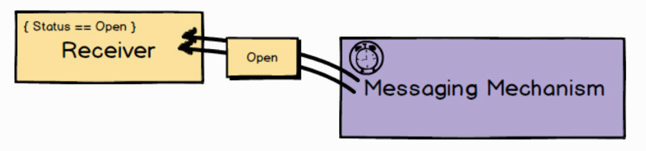

Whenever a message could be delivered more than once, the receiver should be designed to deal correctly with this situation. Idempotent Receiver [Reactive] describes how the receiver of a request performs an operation in such a way that it produces the same result even if it is performed multiple times. Thus, if the same message is received multiple times, the receiver will deal with it in a safe manner. This can mean that the receiver uses de-duplication and ignores the repeated message, or safely reapplies the operation with the exact same results that the previous delivery caused.

Due to the fact that messaging mechanisms always introduce asynchronous Request-Response [Reactive] communications, some amount of latency is both common and expected. Requests for service should (almost) never block until the service is fulfilled. Thus, designing with messaging in mind means that you will always plan for at least some latency, which will make your overall solution much more robust from the outset.

只要消息可以多次投递，接收方的设计就应该正确处理这种情况。幂等接收者（Reactive）描述了请求的接收者执行操作的一种方式，即使多次执行这些操作也能产生相同的结果。因此，即使多次收到相同的消息，接收者也可以妥善处理。这可能意味着接收方要么使用消息去重功能来忽略重复的消息，要么妥善地重新应用该操作，使其结果与之前处理收到的消息所产生的结果完全一致。

因为消息机制总是采用异步的请求响应 [Reactive] 通信方式，所以有一些延迟是正常的，也是可以预见的。服务请求应该（几乎）不会阻塞，直到服务完成。因此，设计时把消息机制放在心上意味着你至少需要时刻准备着处理一些延退，这将使你的整体解决方案从一开始就更加健壮。

## 4.3 An Example in Context Mapping

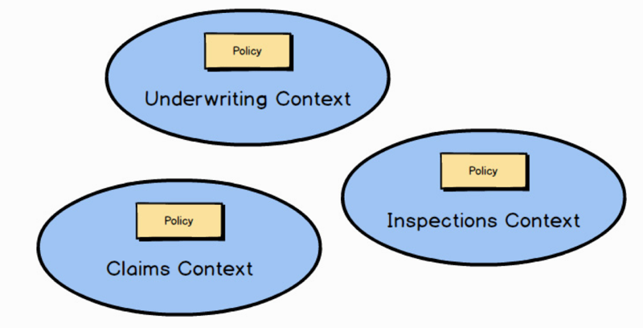

Returning to an example discussed in Chapter 2 , “Strategic Design with Bounded Contexts and the Ubiquitous Language ,” a question arises about the location of the official Policy type. Remember that there are three different Policy types in three different Bounded Contexts. So, where does the “policy of record” live in the insurance enterprise? It’s possible that it belongs to the underwriting division since that is where it originates. For the sake of this example, let’s say it does belong to the underwriting division. So how do the other Bounded Contexts learn about its existence?

到第 2 章中讨论过的例子，有关正式 Policy 类型的位置问题凸显了出来。请记住出现在三个不同的限界上下文中的三种 Policy 类型是有区别的。那么，保单记录（Record of Policy）在保险企业中的位置应该在哪儿呢？它可能属于承保分部，因为那是它的来源。作为示例，我们假设它属于承保分部。那么其他限界上下文如何感知它的存在呢？

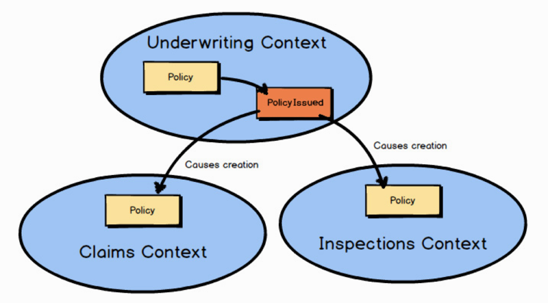

When a component of type Policy is issued in the Underwriting Context , it could publish a Domain Event named PolicyIssued . Provided through a messaging subscription, any other Bounded Context may react to that Domain Event , which could include creating a corresponding Policy component in the subscribing Bounded Context.

当承保上下文中「出立」（issue）了ー个 Policy 类型的组件时，可以同时发布一个名为 PolicyIssued 的领域事件。这个领域事件通过消息订阅提供出去，任何其他服界上下文都可能会对它做出响应，包括在订阅方限界上下文中创建对应的 Policy 组件。

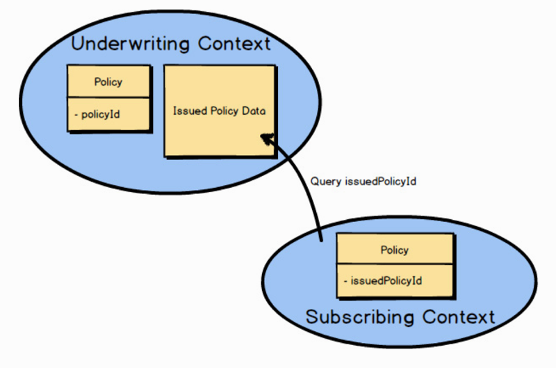

The PolicyIssued Domain Event would contain the identity of the official Policy. Here it’s policyId . Any components created in a subscribing Bounded Context would retain that identity for traceability back to the originating Underwriting Context. In this example the identity is saved as issuedPolicyId . If there is a need for more Policy data than the PolicyIssued Domain Event provided, the subscribing Bounded Context can always query back on the Underwriting Context for more information. Here the subscribing Bounded Context uses the issuedPolicyId to perform a query on the Underwriting Context.

PolicyIssued 领域事件会包含正式 Policy 的唯一标识符。这里就是 policyId，订阅方限界上下文中创建的任何组件都将保留该标识符，用来回溯到原始的承保上下文在这个例子中，标识符被保存为 issuedPolicyId。如果 PolicyIssued 领域事件还要提供更多的 Policy 数据，订阅方限界上下文可以始终反向查询承保上下文来获得更多信息。这里订阅方限界上下文使用 issuedPolicyId 在承保上下文中进行查询。

『

Enrichment versus Query-Back Trade-offs

Sometimes there is an advantage to enriching Domain Events with enough data to satisfy the needs of all consumers. Sometimes there is an advantage to keeping Domain Events thin and allowing for querying back when consumers need more data. The first choice, enrichment, allows for greater autonomy of dependent consumers. If autonomy is your driving requirement, consider enrichment.

On the other hand, it is difficult to predict every piece of data that all consumers will ever need in Domain Events , and there may be too much enrichment if you provide it all. For example, it may be a poor security choice to greatly enrich Domain Events. If that is the case, designing thin Domain Events and a rich query model with security for consumers to request from may be the choice you need.

Sometimes circumstances will call for a balanced blend of both approaches.

在增强事件与反向查询之间的权衡。有时，填充足够多的數据增强领域事件来满足所有消费者的需求是有好处的。而有些时候，保持轻量的领域事件并让消费者在需要更多数据时进行查询会更有利。第一种选择，即增强事件，将给予从属消费者更多自治权。如果自治是你的驱动要素，请选择增强事件数据的方式。另一方面，很难预料到所有消费者需要在领域事件中获取的每一条数据，而且如果全部提供，可能会丰富过了头。例如，在领域事件中填充敏据可能是一个糟糕的安全性决策。如果是这种情况，设计轻量的领域事件和一个可以让消费者请求的安全且丰富的查询模型可能才是正确的选择。而有些时候，需要视情况平衡地混合使用两种方法。

1 请参考《实现领域驱动设计》D 附录 A 中的「增强事件」小节。一一译注

』

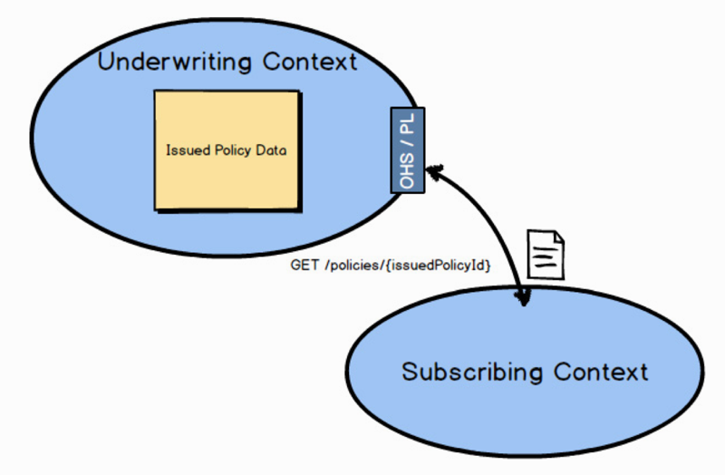

And how might the query back on the Underwriting Context work? You could design a RESTful Open Host Service and Published Language on the Underwriting Context. A simple HTTP GET with the issuedPolicyId would retrieve the IssuedPolicyData .

那么又该如何向承保上下文进行查询呢？你可以在承保上下文中设计 RESTful 开放主机服务和已发布语言。一次带 issuedPolicyId 的简单 HTTP GET 请求就能取回 IssuedpolicyData.

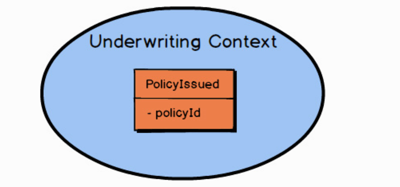

You’re probably wondering about the data details of the Policy-Issued Domain Event. I will provide Domain Event design details in Chapter 6 , “Tactical Design with Domain Events .”

Are you curious about what happened to the Agile Project Management Context example? Straying from that to the insurance business domain allowed you to examine DDD with multiple examples. That should have helped you grasp DDD even better. Don’t worry, we will return to the Agile Project Management Context in the next chapter.

你是不是对敏捷项目管理上下文的例子感到好奇？这里我们切换到保险业务领域，可以让你利用多个例子来研究 DDD，从而帮助你更好地掌握 DDD。别着急，我们将在下一章回到敏捷项目管理上下文上来。

## Summary

In summary, you have learned: 1) About the various kinds of Context Mapping relationships, such as Partnership , Customer-Supplier , and Anticorruption Layer. 2) How to use Context Mapping integration with RPC, with RESTful HTTP, and with messaging. 3) How Domain Events work with messaging. 4) A foundation on which you can build your Context Mapping experience. For thorough coverage of Context Maps , see Chapter 3 of Implementing Domain-Driven Design [IDDD].