# 0501. Tactical Design with Aggregates

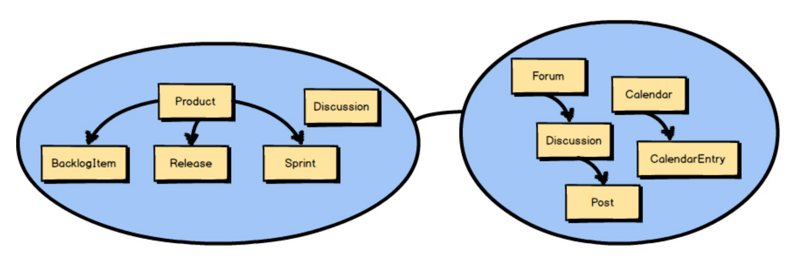

So far I have discussed strategic design with Bounded Contexts, Subdomains, and Context Maps. Here you see two Bounded Contexts, the Core Domain named Agile Project Management Context and a Supporting Subdomain that provides collaboration tools through Context Mapping integration.

目前为止，我们讨论的都是使用限界上下文（Bounded Conter）、子域（Sub Domain)和上下文映射图（Context Map）的战略设计。这里你看到的是两个限界上下文，名为敏捷项目管理上下文的核心域（Core Domain）和提供协作工具的支撑子域（Supporting Subdomain），它们使用上下文映射（Context Mapping）集成在一起。

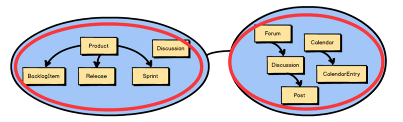

But what about the concepts that live inside a Bounded Context ? I’ve touched on these, but I will next cover them in more detail. They are likely the Aggregates in your model.

但是那些包含在限界上下文之中的概念又是什么呢？接下来，将详细地阐述这些之前曾经提及的概念。它们很可能就是你模型中的聚合（Aggregate）。

## 5.1 Why Used

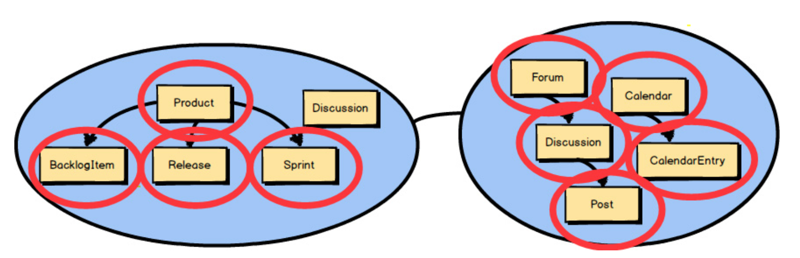

Each of the circled concepts that you see inside these two Bounded Contexts is an Aggregate. The one concept not circled—Discussion —is modeled as a Value Object. Even so, we are focused on Aggregates in this chapter, and we will take a closer look at how to model Product, BacklogItem, Release, and Sprint.

这两个限界上下文中你看到的每一个被圈起来的概念都是一个聚合。只有一个概念 Discussionー一没有被圈起来，它被作为一个值对象（Value object）进行建模。尽管如此，本章我们将重点放在聚合上，并将仔细研究如何对 Product、BacklogItem、Release 和 Sprint 进行建模。

『

What Is an Entity?

An Entity models an individual thing. Each Entity has a unique identity in that you can distinguish its individuality from among all other Entities of the same or a different type. Many times, perhaps even most times, an Entity will be mutable; that is, its state will change over time. Still, an Entity is not of necessity mutable and may be immutable. The main thing that separates an Entity from other modeling tools is its uniqueness—its individuality.

See Implementing Domain-Driven Design [IDDD] for an exhaustive treatment of Entities.

一个实体模型就是一个独立的事物。每个实体都拥有一个唯一的标识符，可以将它的个体性和所有其他类型相同或者不同的实体区分开。许多时候，也许应该说绝大多时侯，实体是可变的。也就是说，它的状态会随着时间发生变化。不过，一个实体不一定必须是可变的，它也可能是不可变的。将实体与其他建模工具区分开的主要因素是它的唯一性一一即它的个体性。请参阅《实现领域驱动设计》中更多对实体的译尽阐述。

』

What is an Aggregate? Two are represented here. Each Aggregate is composed of one or more Entities, where one Entity is called the Aggregate Root. Aggregates may also have Value Objects composed on them. As you see here, Value Objects are used inside both Aggregates.

聚合是什么？这里展示了两个聚合。它们都是由一个或多个实体组成，其中一个实体被称为聚合根（Aggregate Rool）。聚合的组成还可能包括值对象。就像这里看到的，两个聚合中都用到了值对象。

『

What Is a Value Object?

A Value Object, or simply a Value, models an immutable conceptual whole. Within the model the Value is just that, a value. Unlike an Entity, it does not have a unique identity, and equivalence is determined by comparing the attributes encapsulated by the Value type. Furthermore, a Value Object is not a thing but is often used to describe, quantify, or measure an Entity.

See Implementing Domain-Driven Design [IDDD] for detailed coverage of Value Objects.

一个值对象，或者更简单地说，值（Value），是对一个不变的概念整体所建立的模型。在这个模型中，值就真的只有一个值。和实体不一样，它没有唯一标识符，而是由值类型封的属性对比来决定相等性。此外，一个值对象不是事物而是常常被用来描述、量化或者测量一个实体。请参阅《实现领域驱动设计》来获得更多对值对象的译细介绍。

』

The Root Entity of each Aggregate owns all the other elements clustered inside it. The name of the Root Entity is the Aggregate ’s conceptual name. You should choose a name that properly describes the conceptual whole that the Aggregate models.

1『根实体的名称就是聚合概念上的名称，跟聚合取名时就先找出其跟实体。』

每个聚合的根实体（Root Entity）控制着所有聚集在其中的其他元素。根实体的名称就是聚合概念上的名称。你应该选择一个名称来恰当地描述聚合模型概念上的完整性。

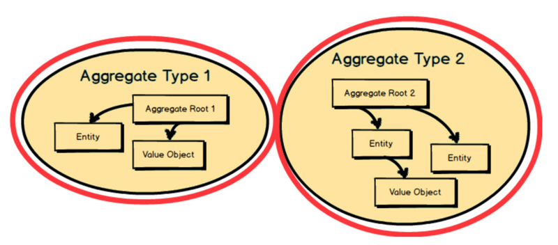

Each Aggregate forms a transactional consistency boundary. This means that within a single Aggregate, all composed parts must be consistent, according to business rules, when the controlling transaction is committed to the database. This doesn’t necessarily mean that you are not supposed to compose other elements within an Aggregate that don’t need to be consistent after a transaction. After all, an Aggregate also models a conceptual whole. But you should be first and foremost concerned with transactional consistency. The outer boundary drawn around Aggregate Type 1 and Aggregate Type 2 represents a separate transaction that will be in control of atomically persisting each object cluster.

每个聚合都会形成保证事务一致性的边界。这意味着在一个单独的聚合中，在控制被提交给数据库的事务时，它的所有组成部分必须根据业务规则保持一致。这并非意味着你不应该把那些事务完成之后不一致的元素组合到聚合中。毕竟，一个聚合也要建立概念上完整的模型。但是，你应该首先关心事务一致性。围绕在 Aggregate Type1（聚合类型 1）和 Aggregate Type2（聚合类型 2）外面的边界分别代表着独立的事务边界，掌管着每个对象集的原子级持久化。

『

Broader Meaning of Transaction

To some degree, the use of transactions in your application is an implementation detail. For example, a typical use would have an Application Service [IDDD] controlling the atomic database transaction on behalf of the domain model. Under a different architecture, such as the Actor model [Reactive] where each Aggregate is implemented as an actor, transactions could be handled using Event Sourcing (see the next chapter) with a database that doesn’t support atomic transactions. Either way, what I mean by “transaction” is how modifications to an Aggregate are isolated and how business invariants—the rules to which the software must always adhere—are guaranteed to be consistent following each business operation. Whether this requirement is controlled by an atomic database transaction or by some other means, the Aggregate ’s state, or its representation by means of Event Sourcing, must be safely and correctly transitioned and maintained at all times.

某种程度上，在应用程序中使用事务是实现的细节。例如，一种典型的实现会包括一个代表领城模型来控制原子级数据库事务的应用服务 [IDDD]。在其他不同的架构中，例如在 Actor 模型 [Reactive] 中，每个聚合都作为 Actor 实现，而事务可以使用事件溯源（Event Sourcing）（见第 6 章）来处理，即便数据库不支持原子级事务。不管怎样，我所说的「事务」就是如何隔离对聚合的修改，以及如何保证业务不变性（即软件必须始终遵守的规则）在每一次业务操作中都保持致。无论是通过原子级的数据库事务还是其他方法来控制需求，聚合的状态或者它通过事件溯源方法表现出的形式，必须始终安全和正确地进行转移和维护。

』

The reasons for the transactional boundary are business motivated, because it is the business that determines what a valid state of the cluster should be at any given time. In other words, if the Aggregate was not stored in a whole and valid state, the business operation that was performed would be considered incorrect according to business rules.

事务边界由商业动机决定，因为任何时候都是业务来决定对象集的有效状态应该是什么。换句话说，如果聚合没有保存在一个完整有效的状态中，那么根据业务规则所执行的业务操作会被认为是错误的。

To think about this in a different way, consider this. Although two Aggregates are represented here, only one of the two should be committed in a single transaction. That’s a general rule of Aggregate design: modify and commit only one Aggregate instance in one transaction. That’s why you see only the instance of Aggregate Type 1 within a transaction. We will look at the other rules of Aggregate design soon.

我们换个角度来思考。虽然这里呈现了两个聚合，但在单次事务中只能对其中之一完成提交。这是聚合设计的一条普遍规则：只能在一次事务中修改一个聚合实例并提交。这就是为什么你只能在本次事务中看到 Aggregate Type 1 的实例。很快我们将讨论其他的聚合设计规则。

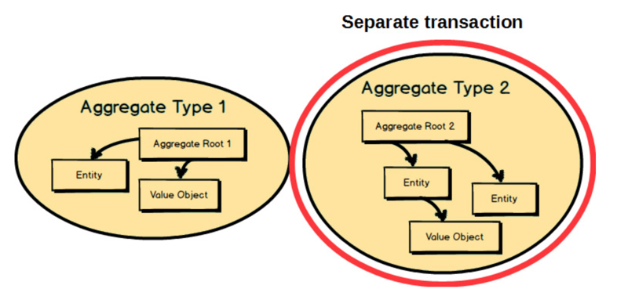

Any other Aggregate will be modified and committed in a separate transaction. That’s why an Aggregate is said to be a transactional consistency boundary. So, you design your Aggregate compositions in a way that allows for transactional consistency and success. As seen here, an instance of Aggregate Type 2 is controlled under a separate transaction from the instance of Aggregate Type 1.

其他聚合将在另一次独立事务中修改并提交。这就是聚合被认为是事务一致性的边界的原因。所以，你可以按照能让事务保持一致性和提交成功的方式来设计你的聚合组成部分。就像这里看到的一样，Aggregate Type 2 实例和 Aggregate Type 1 实例分别在各自的事务中进行控制。

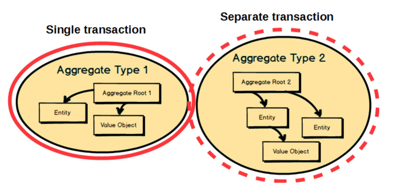

Since instances of these two Aggregates are designed to be modified in separate transactions, how do we get the instance of Aggregate Type 2 updated based on changes made to the instance of Aggregate Type 1, to which our domain model must react? That’s a good question; we will consider the answer to it a bit later in this chapter.

The main point to remember from this section is that business rules are the drivers for determining what must be whole, complete, and consistent at the end of a single transaction.

由于这两个聚合的实例被设计成在各自的事务中进行修改，我们如何根据 Aggregate Type 1 实例上发生的变化来更新 Aggregate Type 2  实例？领域模型必须对这些变化做出响应。我们将在本章稍后考虑这个问题的答案。本节中要记住的重点是，业务规则才是驱动力，最终決定在单次事务完成提交后，哪些对象必须是完整、完全和一致的驱动力。

## 5.2 Aggregate Rules of Thumb

Let’s next consider the four basic rules of Aggregate design:

1. Protect business invariants inside Aggregate boundaries.

2. Design small Aggregates.

3. Reference other Aggregates by identity only.

4. Update other Aggregates using eventual consistency.

Of course, these rules are not necessarily strictly enforced by any “DDD police.” They are meant as sound guidance such that when thoughtfully applied, they will help you design Aggregates that work effectively. That being the case, we will now dig into each of these rules to see how they should be applied wherever possible.

接下来我们要思考的是聚合设计的四条基本规则：1）在聚合边界内保护业务规则不变性。2）聚合要设计得小巧。3）只能通过标识符引用其他聚合。4）使用最终一致性更新其他聚合。当然，这些规则不会由任何「DDD 警察」来强制执行。它们只是适当的指导，当经过深思熟虑被应用之后，它们将帮助你设计出能有效工作的聚合。既然是这样，现在我们要仔细钻研每一条规则，看看它们应该如何运用在合适的地方。

在作者的《实现领域驱动设计》UDD 第 10 章「聚合」中也有提到设计聚合时要遵循的四条原则，它们是：1）一致性边界之内建模真正的不变条件。2）设计小聚合。3）通过唯一标识引用其他聚合。4）在边界之外使用最终一致性。本书中提出的四条原则看起来似乎和它们一样，但描述却更加鮮明准确。在第 1 条规则中作者直接点明了不变性乃是由业务决定，在第 3 条规则中作者强调将标识符作为独一无二的外部引用，在第 1 条和第 4 条中作者更是指出了一致性边界就是聚合边界。这些原则是作者在完成《实现领域驱动设计》之后，经过不断实践再次修正和精练的成果。一一译注

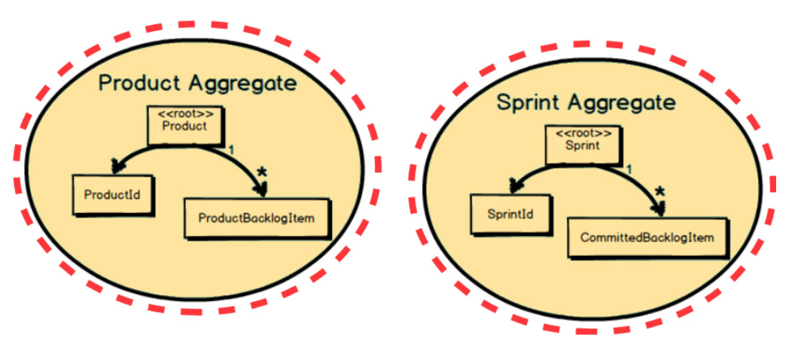

Rule 1: Protect Business Invariants inside Aggregate Boundaries

Rule 1 means that the business should ultimately determine Aggregate compositions based on what must be consistent when a transaction is committed. In the example on page 81, Product is designed such that at the end of a transaction all composed ProductBacklogItem instances must be accounted for and consistent with the Product root. Also, Sprint is designed such that at the end of a transaction all composed CommittedBacklogItem instances must be accounted for and consistent with the Sprint root.

规则一的意思是聚合的组成部分应该由业务最终决定，而且要以那些在一次事务提交中必须保持一致的内容为基础。在上面的例子中，Product 被设计成在事务完成提交时，所有组成它的 ProductBacklogItem 都必须由它负贵并和根 Product 保持一致。同样的，Sprint 被设计成在事务完成提交时，所有组成它的 CommittedBacklogItem 都必须由它负责并和根 Sprint 保持一致。

Rule 1 becomes clearer with another example. Here’s the BacklogItem Aggregate. There is a business rule that states, “When all Task instances have hoursRemaining of zero, the BacklogItem status must be set to DONE.” Thus, at the end of a transaction this very specific business invariant must be met. The business requires it.

规则一在另一个例子中更加明确。这是 BacklogItem 聚合的例子，其中包含着这样一条业务规则：「当所有 Task 实例的 hoursRemaining 都为零时，BacklogItem 的状态必须设置为 DONE。」因此，当事务完成提交时，这项特定的业务不变性规则必须要满足。这是业务要求的。

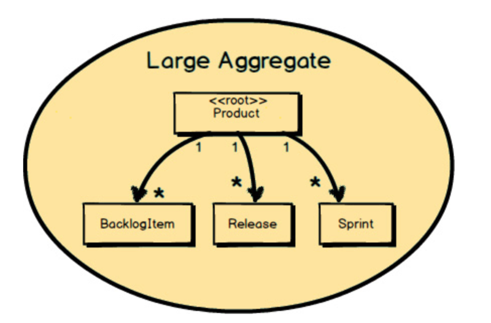

Rule 2: Design Small Aggregates

This rule highlights that the memory footprint and transactional scope of each Aggregate should be relatively small. In the preceding diagram the Aggregate that is represented is not small. Here, Product literally contains a potentially very large collection of BacklogItem instances, a large collection of Release instances, and a large collection of Sprint instances. Over time, these collections could grow to be quite large, with thousands of BacklogItem instances and probably hundreds of Release and Sprint instances. This design approach is generally a very poor choice.

这条规则强调，每个聚合的内存占用空间和事务包含范围应该相对较小。前面图例中展示的聚合并不算小。这里的 Product 确实可能包含大量的 BacklogItem 实例集合大量的 Release 实例集合，还有大量的 Sprint 实例集合。随着时间推移，这些集合可能会变得非常庞大，并且发展为数千个 BacklogItem 实例以及数百个 Release 和 Sprint 实例。这种设计思路通常是非常糟糕的选择。

However, if we break up the Product Aggregate to form four separate Aggregates, this is what we get: a small Product Aggregate, a small BacklogItem Aggregate, a small Release Aggregate, and a small Sprint Aggregate. These load quickly, take less memory, and are faster to garbage collect. Perhaps most importantly, these Aggregates will have transactional success much more frequently than the previous large-cluster Product Aggregate.

Following this rule has the added benefit that each Aggregate will be easier to work on, because each associated task can be managed by a single developer. This also means that the Aggregate will be easier to test.

Another thing to keep in mind when designing Aggregates is the Single Responsibility Principle (SRP). If your Aggregate is trying to do too many things, it is not following SRP, and this will likely be telling in its size. Ask yourself, for example, whether your Product is a very focused implementation of a Scrum product, or if it is also trying to be other things. What is the reason to change Product : to make it a better Scrum product, or to manage backlog items, releases, and sprints? You should change Product only in order to make it a better Scrum product.

可是，当我们把 Product 聚合拆分成四个独立的聚合之后，我们将会得到：一个小型 Product 聚合、一个小型 BacklogItem 聚合、一个小型 Release 聚合和一个小型 Sprint 聚合。这些模型加载快、内存占用少，并且垃圾回收也更迅速。而且也许更重要的是，这些聚合相比之前大块的 Product 聚合能获得更高的事务成功率。

遵守这条规则还可以带来另一个好处：每个聚合可以更容易地实现，因为每个关联到它的任务都可以由一个开发者掌控。这也意味着聚合更容易测试。在设计聚合时还需要记住的是单一职责原则（Single Responsibility Principle, SRP）。如果你的聚合想做的事情太多，就违反了 SRP，这由它的大小就可以判断出来。比如，问问自己，Product 是一个非常专注于 Scrum 产品的实现，还是它需要兼顾其他事情。

Product 发生变化的原因是什么：是为了让它变成更好的 Scrum 产品，还是为了管理待办事项、发布和冲刺？Product 的变化仅仅是为了实现更好的 Scrum 产品，这才应该是你的答案。

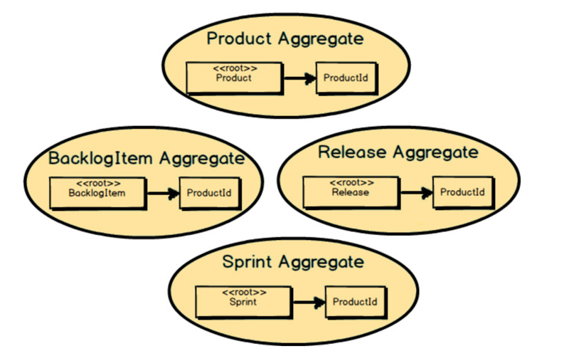

Rule 3: Reference Other Aggregates by Identity Only

Now that we’ve broken up the large-cluster Product into four smaller Aggregates, how should each reference the others where needed? Here we follow Rule 3, “Reference other Aggregates by identity only.” In this example we see that BacklogItem, Release, and Sprint all reference Product by holding a ProductId. This helps keep Aggregates small and prevents reaching out to modify multiple Aggregates in the same transaction.

This further helps keep the Aggregate design small and efficient, making for lower memory requirements and quicker loading from a persistence store. It also helps enforce the rule not to modify other Aggregate instances within the same transaction. With only identities of other Aggregates, there is no easy way to obtain a direct object reference to them.

Another benefit to using reference by identity only is that your Aggregates can be easily stored in just about any kind of persistence mechanism, such as relational database, document database, key-value store, and data grids/fabrics. This means that you have options to use a MySQL relational table, a JSON-based store such as PostgreSQL or MongoDB, GemFire/Geode, Coherence, and GigaSpaces.

现在，我们已经把大块的 Product 拆分成了四个更小的聚合，它们又如何在需要时引用其他的聚合呢？这里我们要遵守规则三：「只能通过标识符引用其他聚合」，在这个例子里，我们看到 BacklogItem、Release 和 Sprint 全都通过持有一个 ProductId 来引用 Product。这能帮助保持聚合不会変大，并防止在同一次事务中画蛇添足地修改多个聚合。

这能进一步帮助保持聚合设计得小巧又高效，从而降低内存需求，并提升持久化存储中加载的速度。它还有助于强化不要在同一次事务中修改其他聚合实例的規则。在只拥有其他聚合标识符的情况下，获取它们的直接对象引用没那么容易。

仅使用标识符引用还有一个好处，就是聚合可以使用任何类型的持久化机制轻松地存储,包括关系型数据库、文档数据库、键值型存储以及数据网格 / 结构。这意味着你可以选择 MYSQL 关系型数据库表、PostgreSQL 或者 MongoDB 这样基于 JSON 的存储，GemFire/Geode、Coherence、还有 Gigaspaces。

Apache Geode 是 Apache 顶级项目，由 Gemfire 开源而来，是集中间件、缓存、消息队列、事件处理引、NoSQL 数据库于一身的分布式内存数据处理平台它的介绍请参考《大中型企业的天网：Apache Geode》一文。——译注

Oracle Coherence 是 Oracle 的内存中数据网格解决方案。更多内容请参考 Coherence 文档。Gigaspaces XAP 是一种在虚拟化和分布式环境中可自动扩展的高端应用服务器，可为事务型和分析型应用提供一个高性能、可扩展、高可靠性的运行平台。更多内容请参考 Gigaspaces 官方网站。一一译注

Rule 4: Update Other Aggregates Using Eventual Consistency

Here a BacklogItem is committed to a Sprint. Both the BacklogItem and the Sprint must react to this. It is first the BacklogItem that knows it has been committed to a Sprint. This is managed in one transaction, when the state of the BacklogItem is modified to contain the SprintId of the Sprint to which it is committed. So, how do we ensure that the Sprint is also updated with the BacklogItemId of the newly committed BacklogItem?

例子里 BacklogItem 被提交到 Sprint 中。BacklogItem 和 Sprint 都要对此做出响应。首先 BacklogItem 知道它被提交到 Sprint 中，这是在一次事务中管理的，这次事务中 BacklogItem 的状态被修改，修改之后的状态会包含它被提交到的那个 Sprint 的 Sprinted。那么，我们如何确保 Sprint 的更新也包括了新提交的 BacklogItem 的 BacklogItemId 呢？

As part of the BacklogItem Aggregate ’s transaction, it publishes a Domain Event named BacklogItemCommitted. The BacklogItem transaction completes and its state is persisted along with the Backlog-ItemCommitted Domain Event. When the BacklogItemCommitted makes its way to a local subscriber, a transaction is started and the state of the Sprint is modified to hold the BacklogItemId of the committed BacklogItem. The Sprint holds the BacklogItemId inside a new CommittedBacklogItem Entity.

作为 BacklogItem 聚合事务的一部分，名为 BacklogItemCommitted 的领城事件将被发布出来。BacklogItem 事务结東之后，它的状态和领域事件 BacklogItemCommitted 一起完成了持久化。当将 BacklogItemCommitted 传递到本地的订阅者那里时，一个新的事务会被触发，而 Sprint 的状态会被修改，并且持有提交给它的 BacklogItem 的 BacklogItemId。Sprint 会在一个新的 CommittedBacklogItem 实体中保存 BacklogItemId。

Recall now what you learned in Chapter 4, “Strategic Design with Context Mapping.” Domain Events are published by an Aggregate and subscribed to by an interested Bounded Context. The messaging mechanism delivers the Domain Events to interested parties by means of subscriptions. The interested Bounded Context can be the same one from which the Domain Event was published, or it could be different Bounded Contexts.

回忆一下你在第 4 章中学到的内容，领域事件由一个聚合发布并由感兴趣的服界上下文订阅。消息机制通过发布 / 订阅的方式把领域事件传递给感兴趣的限界上下文。感兴趣的限界上下文可能和发布领域事件的限界上下文是同一个，也有可能是另外一个。

It’s just that in the case of the BacklogItem Aggregate and the Sprint Aggregate, the publisher and subscriber are in the same Bounded Context. You don’t absolutely need to use a full-blown messaging middleware product for this case, but it’s easy to do so since you already use it for publishing to other Bounded Contexts.

就 BacklogItem 聚合和 Sprint 聚合这个例子而言，发布者和订阅者位于同一个限界上下文中。这种情况下，没有必要使用重量级的消息中间件，但如果已经使用了这样的中间件来发布消息给其他限界上下文，也可以利用它轻松地实现消息发布。

『

If Eventual Consistency Seems Scary

There is nothing incredibly difficult about using eventual consistency. Still, until you can gain some experience, you may be concerned about using it. If so, you should still partition your model into Aggregates according to business-defined transactional boundaries. However, there is nothing preventing you from committing modifications to two or more Aggregates in a single atomic database transaction. You might choose to use this approach in cases that you know will succeed but use eventual consistency for all others. This will allow you to get used to the techniques without taking too big an initial step. Just understand that this is not the primary way that Aggregates are meant to be used, and you may experience transactional failures as a result.

运用最终一致性并非特别地困难。尽管如此，如果你没有任何经验，可能会使用它有些疑虑。即使这样，你依然需要根据业务定义的事务边界来将模型划分成不同的聚合。然而，没有什么能够阻止你在一次原子数据库事务中提交对两个甚至更多聚合的修改。你可以在事务一定能提交成功的场景中使用这种方式而在其他场景中使用最终一致性方法。这可以让你逐步地适应最终一致性技术，而不会刚开始就把步子迈得太大。只是要理解这并非是使用聚合的主流方式，并且你最终可能会遇到事务失败。

』

## 5.3 Modeling Aggregates

There are a few hooks waiting for you as you work on your domain model, implementing your Aggregates. One big, nasty hook is the Anemic Domain Model [IDDD]. This is where you are using an object-oriented domain model, and all of your Aggregates have only public accessors (getters and setters) but no real business behavior. This tends to happen when there is a technical rather than business focus during modeling. Designing an Anemic Domain Model requires you to take on all the overhead of a domain model without realizing any of its benefits. Don’t take the bait!

Also watch out for leaking business logic into the Application Services above your domain model. It can happen undetected, just like physical anemia. Delegating business logic from services to helper/utility classes isn’t going to work out well either. Service utilities always exhibit an identity crisis and can never keep their stories straight. Place your business logic in your domain model, or suffer bugs sponsored by an Anemic Domain Model.

当你在领域模型上展开工作并实现聚合时，有一些诱惑在等待着你。贫血领城模型（Anemic Domain Model）就是一个令人讨厌的巨大诱惑。如果你正在使用面向对象的领域模型，而这些模型除了公有访问器（Getter 和 Setter）之外没有包含任何真正的业务行为，那就是这种模型了。如果在建模过程中过于注重技术而忽略了业务就会造成这种结果。你需要承担领域模型中的所有的开销来设计贫血模型，但从中却获益甚少。所以不要上当！

同时也要注意别把领域模型中的业务逻辑放到上层的应用服务中。这可能在不经意中就发生了，就像生理贫血一样，也不容易检查出来。将服务中的业务逻辑委托给帮助 / 工具类也不会有什么改善。服务工具类往往会显现出身份认同危机，也永远无法保持业务逻辑的连续性。请把业务逻辑放在领域模型之中。不然就要忍受贫血领域模型带来的问题。

1 在使用一些 MVC 框架时我们常常会掉进贫血模型的陷阱。MVC 框架常常会使用 ORM 来将关系型数据库的查询和操作结果直接映射成对象（有的框架甚至就把这些对象称为实体，更增加了迷惑性），这些对象一般只包含 Getter 和 Setter。而真正的业务逻辑和这些所谓的「实体」脱离，被放在另外一些被称为服务的对象里。这些服务一般会负责调用 ORM 加载对象，执行操作改变对象状态，最后进行持久化存储。本来应该和这些实体有着内聚性的业务逻辑完全被置于独立的服务中，最终导致服务越来越臃肿的同时，把这些 ORM 映射的对象变成了贫血领域模型，实际上 ORM 只是一种资源库（Repository）的具体实现方式，它不属于领域模型的一部分，它映射出来的对象也不能简单地直接当作领域模型中的聚合和实体。这种错误的做法显然缺失了领域模型这个关键的层次。领域模型应该由持久化的对象转换而来，并承担被错放在服务中的那些业务逻辑。一一译注

『

What about Functional Programming?

When using functional programming, the rules change considerably. While an Anemic Domain Model is a bad idea when using object-oriented programming, it is somewhat the norm when applying functional programming. That’s because functional programming promotes the separation of data and behavior. Your data is designed as immutable data structures or record types, and your behavior is implemented as pure functions that operate on the immutable records of specific types. Rather than modifying the data that functions receive as arguments, the functions return new values. These new values may be the new state of an Aggregate or a Domain Event that represents a transition in an Aggregate ’s state.

I have largely addressed the object-oriented approach in this chapter because it is still the most widely used and well understood. Yet if you are employing a functional language and approach to DDD, be aware that some of this guidance is not applicable or is at least subject to overriding rules.

当使用函数式程范式时，规则会发生明显的变化：尽管贫血领域模型在使用面向对象编程范式时不是一个好主意，但在使用函数式程范式时却可能成为规范标准。这是因为函数式编程范式宣扬的是数据和行为的分离。你的数据要设计成不变的数据结构或者记录类型，而你的行为将被设计成操作特定类型不变记录的纯函数。函敏将返回新的值，而不是直接修改其作为参数接收的数据。这些新的值可能就是聚合的新状态，或者是表示一次聚合状态转换的领域事件。本章中我还是主要着眼于面向对象方法，因为这种方法仍然应用得最广泛也被理解得更透彻。但如果你正在使用函数式编程语言并准备引入 DDD，注意这指南中有些规则并不适用，或者至少要重新定义才可以遵从。

』

Next I’m going to show you some of the technical components you will need to implement a basic Aggregate design. I assume you are using Scala, C#, Java, or another object-oriented programming language. The following examples are in C# but are very understandable by Scala, F#, Java, Ruby, Python, and other programmers alike.

接下来将展示实现基本的聚合设计所需要的一些技术组件。假定你正在使用 Scala、C#、Java 或者其他任意一门面向对象编程语言。接下来的例子是 C# 编写的，但 Scala、F#、Java、Ruby、Python 和其他相似语言的程序员都可以很容易地理解。

The first thing you must do is create a class for your Aggregate Root Entity. Here is a UML (Unified Modeling Language) representation of the Product Root Entity. Included is also the Product class in C#, which extends a base class named Entity. This base class just takes care of standard Entity kinds of things. See Implementing Domain-Driven Design [IDDD] for exhaustive discussions on both Entity and Aggregate design and implementation.

第一件必须做的事情是为聚合根实体创建一个类。上面图例中有 Product 根实体的 UML（统一建模语言）类图。还包括了用 C# 定义的 Product 类，这个类继承了名为 Entity 的基类。基类仅仅负责那些标准的和实体类型有关的事情。请参阅《实现领域驱动设计》中关于实体和聚合设计实现的详细讨论。

Every Aggregate Root Entity must have a globally unique identity. A Product in the Agile Project Management Context actually has two forms of globally unique identity. The TenantId scopes the Root Entity inside a given subscriber organization. (Every organization that subscribes to the offered services is known as a tenant and thus has a unique identity for that.) The second identity, which is also globally unique, is the ProductId. This second identity sets the Product apart from all others within the same tenant. Also included is the C# code that declares the two identities inside Product.

每一个聚合根实体都必须拥有全局唯一的标识符。敏捷项目管理上下文中的 Product 实际上拥有两种形式的全局唯一标识符。TenantId 将根实体的范围限制在订购了产品的指定组织之内。每个订购了服务的组织都被称为租户，因此要具有代表它的唯一标识符。第二个标识符也是全局唯一的，即 ProductId，它将 Product 与同一租户内的所有其他类型实例区分开来。图中还包括了 Product 中声明两个标识符的 C# 代码。

『

Use of Value Objects

Here, both TenantId and ProductId are modeled as immutable Value Objects.

』

Next you capture any intrinsic attributes or fields that are necessary for finding the Aggregate. In the case of Product, there are both description and name. Users can search one or both of these to find each Product. I also provide the C# code that declares these two intrinsic attributes.

接下来要记录在查找聚合时必须用到的内在属性或者字段。在 Product 这个场景里 description 和 name 就是这样的属性。用户可以通过搜索其中的一个属性或者搜索全部两个属性来找到每一个 Product。我还提供了声明这两个内在属性的 C# 代码。

Of course, you can add simple behavior such as read accessors (getters) for intrinsic attributes. In C# this would probably be done using public property getters. However, you may not want to expose setters as public. Without public setters, how do property/attribute values change? When using an object-oriented approach (C#, Scala, and Java), you change internal state using behavioral methods. If using a functional approach (F#, Scala, and Clojure), the functions will return new values that are different from the values passed as arguments.

当然，你可以给内在属性添加简单行为，比如 Getters。在 C 中使用公有属性 Getter 就能做到。然而，你可能不想将 Setter 暴露成公有的。如果没有公有的 Setter，怎样改变属性的值呢？当使用面向对象（C#、Scala 以及 Java）方法时，会使用行为方法来改变内部状态。如果使用函数式（F#、Scala 以及 Clojure）方法，函数将返回新的值，这些值和作为参数传入的值不同。

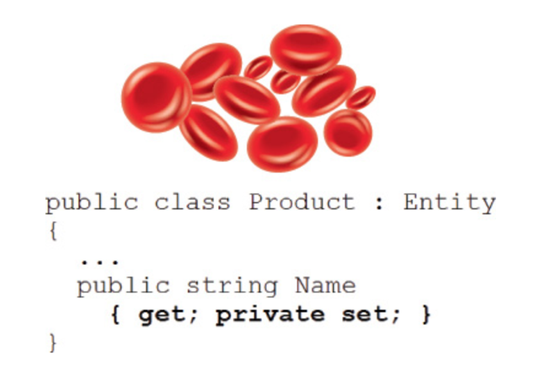

You should be on a mission to fight the Anemic Domain Model [IDDD]. If you expose public setter methods, it could quickly lead to anemia, because the logic for setting values on Product would be implemented outside the model. Think hard before doing this, and keep this warning in mind.

你应当承担对抗贫血顿域模型的责任。如果暴露了公有 setter 方法，用来设置 Product 的值的逻辑可能会在模型之外实现，这样很快会导致模型贫血。谨记这条警告三思而后行。

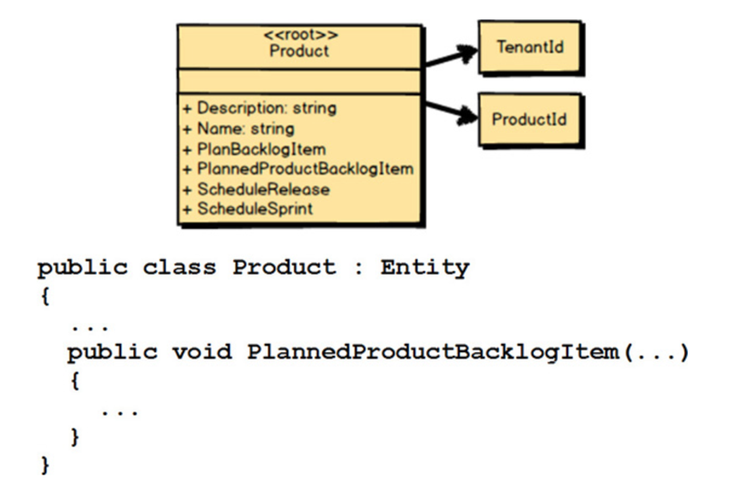

Finally, you add in any complex behavior. Here we’ve got four new methods: PlanBacklogItem(), PlannedProductBacklogItem(), ScheduleRelease(), and ScheduleSprint(). The C# code for each of these methods should be added to the class.

Remember, when using DDD, we are always modeling a Ubiquitous Language inside a Bounded Context. Thus, all parts of the Product Aggregate are modeled per the Ubiquitous Language. You don’t just make up these composed parts. Everything shows harmony between Domain Experts and developers of your close-knit team.

记住，运用 DDD 时，我们总是在一个限界上下文的范围内用通用语言进行建模。因此，Product 聚合的所有部分都是按照通用语言来建模的。这些组成部分都不是凭空想象出来的，这一切都体现出领域专家与开发人员的合作无间。

### 5.3.1 Choose Your Abstractions Carefully

An effective software model is always based on a set of abstractions that address the business’s way of doing things. There is, however, the need to choose the appropriate level of abstraction for each concept being modeled.

If you follow the direction of your Ubiquitous Language, you will generally create the proper abstractions. It’s much easier to model the abstractions correctly because it is the Domain Experts who convey at least the genesis of your modeling language. Still, sometimes software developers who are overzealous for solving the wrong problems will try to force in abstractions that are, well, too abstract.

有效的软件模型总是建立在一套对业务行为方式的抽象之上。所以，为每个建模中的概念选择适当的抽象級别是非常有必要的。如果沿着通用语言的方向，你通常会建立合理的抽象。因为建模语言起码最初是由领域专家表达出来的，所以抽象建模会简单一些。尽管如此，有时候软件开发人员会过度热心于解决错误的问题，他们会建立过高的抽象级别。

For example, in the Agile Project Management Context we are dealing with Scrum. It makes sense to model Product, BacklogItem, Release, and Sprint concepts that we’ve been discussing. Even so, what if the software developers were less concerned about modeling the Ubiquitous Language of Scrum, and more interested in modeling a solution to all current and future Scrum concepts?

If this angle were pursued, the developers would probably come up with abstractions such as ScrumElement and ScrumElementContainer. A ScrumElement could fill the current need for Product and Backlog-Item, and ScrumElementContainer could represent the obviously more explicit concepts of Release and Sprint. The ScrumElement would have a typeName property, and it would be set to "Product" or "BacklogItem" in appropriate cases. We could design the same kind of typeName property for ScrumElementContainer and allow the values "Release" or "Sprint" to be set on it.

以我们正在处理的 Scrum 的敏捷项目管理上下文为例。对己经讨论过的 Product、BacklogItem、Release 以及 Sprint 这些概念所进行的建模当然合乎情理。即便如此，如果软件开发人员关心的不是在 Scrum 的通用语言中建模，而是对所有现在和未来的 Scrum 概念的建模更有兴趣呢？

如果沿着这个方向继续前进，开发人员很可能提出 ScrumElement 和 ScrumElementContainer 这样的抽象概念。 ScrumElement 可以满足当前对 Product 和 BacklogItem 的要求，而 ScrumElementContainer 也可以表示 Release 和 Sprint 概念，这些当前的概念显然更具象。ScrumElement 可以包含一个 typeName 属性，它可以在不同的场景中被适当地设置成「Product」或者「BacklogItem」。我们也可以为 ScrumElementContainer 设计类似的 typeName 属性，并允许将它的值设置为「Release」或者「Sprint」。

Do you see the problems with this approach? There are more than a few, but consider the following:

1. The language of the software model does not match the mental model of the Domain Experts.

2. The level of abstraction is too high, and you will get into deep trouble when you start to model the details of each of the individual types.

3. This will lead to creating special cases in each of the classes and likely result in a complex class hierarchy with general approaches to explicit problems.

4. You will have much more code than you need, because you are trying to solve an unsolvable problem that should not matter in the first place.

5. Often the language of the wrong abstractions will find its way even into the user interface, which will cause confusion for users.

6. You will waste considerable time and money.

7. You will never be able to address all future needs up front, which means if new Scrum concepts are ever added in the future, your existing model will prove to be a failure in foreseeing those needs.

你发现该方法的问题了吗？这里面的问题不少，但请主要思考以下几点：1）软件模型的语言无法匹配领城专家的心智模型。2）抽象级别过高，当你开始对每个独立概念类型进行建模时会陷入大麻烦。3）这会导致每个类中都有特殊情况产生，并且可能造成使用通用方法去解决具体问题的复杂的类层次结构。4）因为试图要先去解决无关紧要的无解问题，你将会编写比实际需要多得多的代码。错误抽象的语言会殃及用户界面，并且将给用户带来困扰。会浪费大量时间和金钱。5）永远无法预先满足未来所有的需求，这意味着未来如果增加新的 Scrum 概念，现有模型对这些需求的预判会被证明是失败的。

Following such a path may seem strange to some, but this incorrect level of abstractions is used often in technically inspired implementations.

Don’t get taken in by this alluring, highly abstract implementation trap. Model the Ubiquitous Language explicitly according to the mental model of the Domain Experts that is refined by your team. By modeling what the business needs today, you will save a considerable amount of time, budget, code, and embarrassment. More still, you will do the business a great service by modeling an accurate and useful Bounded Context that reflects an effective design.

这样的思路看起来有些奇怪，但由技术启发的实现中常常出现这种不正确的抽象级别。不要被这个诱人的、实现高度抽象的陷阱所吸引，而要根据团队精练过的领城专家的心智模型，脚踏实地地对通用语言进行建模。通过对当下的业务需求进行建模，你将省去大量的时间、预算和代码，并且避免了不必要的麻烦。更重要的是，你将通过建立能体现有效设计的准确且实用的限界上下文模型来为业务提供有效的服务。

### 5.3.2 Right-Sizing Aggregates

You may be wondering how you can determine the boundaries of Aggregates and prevent the design of large clusters, while still maintaining consistency boundaries that will protect true business invariants. Here I have provided a worthy design approach. If you have already created large-cluster Aggregates, you can use this approach to refactor into smaller ones, but I am not going to start from that perspective.

你可能在思考如何确定聚合的边界并避免出现臃肿的设计，同时还要维持并保证真实业务不变性规则的一致性边界。在这里我提供了一个有价值的设计方法。如果你已经创建出了臃肿的聚合，你可以使用这种方法将它重构得更小巧，但我会从另一个角度来介绍这个方法。

Consider these design steps that will help you reach consistency boundary goals:

1. Put your first focus on the second rule of Aggregate design, “Design small Aggregates. ” Start by creating every Aggregate with just one Entity, which will serve as the Aggregate Root. Don’t even dare to place two Entities in a single boundary. That opportunity will come soon enough. Populate each of the Entities with the fields/attributes/properties that you believe are most closely associated with the single Root Entity. One big hint here is to define every field/attribute/property that is required to identify and find the Aggregate, as well as any additional intrinsic fields/attributes/properties that are required for the Aggregate to be constructed and left in a valid initial state.

2. Now place your focus on the first rule of Aggregate design, “Protect business invariants inside Aggregate boundaries.” You have already asserted by the previous step that at a minimum all the intrinsic fields/attributes must be up-to-date when the single-Entity Aggregate is persisted. But now you need to look at each of your Aggregates one at a time. As you do so for Aggregate A1, ask the Domain Experts if any other Aggregates you have defined must be updated in reaction to changes made to Aggregate A1. Make a list of each of the Aggregates and their consistency rules, which will indicate the time frames for all reaction-based updates. In other words, “Aggregate A1” would be the heading of one list, and other Aggregate types would be listed under A1 if they will be updated in reaction to A1 updates.

3. Now ask the Domain Experts how much time may elapse until each of the reaction-based updates may take place. This will lead to two kinds of specifications: (a) immediately, and (b) within N seconds/minutes/hours/days. One possible way to find the correct business threshold is by presenting an exaggerated time frame (such as weeks or months) that is obviously unacceptable. This will likely cause business experts to respond with an acceptable time frame.

4. For each of the immediate time frames (3a), you should strongly consider composing those two Entities within the same Aggregate boundary. That means, for example, that Aggregate A1 and Aggregate A2 will actually be composed into a new Aggregate A[1,2]. Now Aggregates A1 and A2 as they were previously defined will no longer exist. There is only Aggregate A[1,2].

5. For each of the reacting Aggregates that can be updated following a given elapsed time (3b), you will update these using the fourth rule of Aggregate design, “Update other Aggregates using eventual consistency.”

思考下面这些可以帮助你达到一致性边界目标的设计步骤。

1、将重点先放在聚合设计的规则二上：「聚合要设计得小巧」。每个聚合一开始创建时只允许包含一个实体，并且它将作为聚合根。千万不要尝试在边界内放入两个实体。这样的机会很快就会出现。用你认为和单个聚合根关联最紧密的字段 / 属性填充每个实体。这里有一个重要的技巧是定义出每个用来识别和查找聚合的字段 / 属性，以及任何其他用于构造聚合并使之处于有效初始状态的内在属性。

2、现在将重点放在聚合设计的规则一上：「聚合边界内保护业务不变性规则」。在上ー步中，已经声明了至少在单个实体持久化时所有内在字段 / 属性必须是最新的。但是现在需要一个一个地检查每个聚合。在检查聚合 A1 时，问问领域专家需不需要更新其他己定义的聚合，来响应聚合 A1 发生的改变。为每个聚合和它的一致性规则制作一个清单，还要记录所有这些基于响应的更新的时间范围。换句话说，「聚合 A1」作为清单的标题，如果其他的聚合类型也需要更新来响应 A1 的变化，就把它们罗列在 A1 之下。

3、现在询问领域专家，每个基于响应的更新可以等待多长时间。答案会是两种：a）即时发生；b）在 n 秒/分/小时/天之内发生。一种可行的寻找正确的业务阈值的方法是，先抛出一个夸张到显然无法接受的时间范围（比如几周或几个月）。业务专家很可能会据此提出一个可接受的时间范围作为回应。

4、对每一个即时发生的时间范围（3a），应该坚定地考虑把这两个实体合并到同一个聚合的边界之内。例如，聚合 A1 和聚合 A2 实际上将合并成一个新的聚合 A[1, 2]。现在之前定义的聚合 A1 和聚合 A2 将不复存在。只剩下唯一的聚合 A[1, 2]。

5、对于每一个在给定等待时间（3b）内更新的响应聚合，将使用聚合设计的规则四来更新它们：「利用最终一致性更新其他聚合」。

In this figure our focus is on modeling Aggregate A1. Note from the A1 list of consistency rules that A2 has an immediate time frame, while C14 has an eventual (30 seconds) time frame. As a result, A1 and A2 are modeled into a single Aggregate A[1,2]. During runtime Aggregate A[1,2] publishes a Domain Event that causes Aggregate C14 to be updated eventually.

Be careful that the business doesn’t insist that every Aggregate fall within the 3a specification (immediate consistency). It can be an especially strong tendency when many in the design session are influenced by database design and data modeling. Those stakeholders will have a very transaction-centered point of view. However, it is very unlikely that the business really needs immediate consistency in every case. To change this thinking you will probably have to spend time proving how transactions will fail due to concurrent updates by multiple users across different composed parts of the (now) large-cluster Aggregates. Furthermore, you can point out how much memory overhead there is with such large-cluster designs. Obviously these kinds of problems are what we are trying to avoid in the first place.

这张图中的焦点是聚合 A1 的建模。注意，在 A1 的一致性规则清单中，A2 的时间范围是即时发生，而 C14 的时间范围是最终发生（30 秒）。因此，A1 和 A2 被建模成单个聚合 A[1, 2]。在运行时聚合 A[1, 2] 会发布领域事件，将导致聚合 C14 最终得到更新。

请注意，业务并不会强求每个聚合都符合 3a 标准（即时一致性）。当大部分设计活动受到数据库设计和数据建模的影响时，即时一致性可能成为一种非常强烈的趋势。这些干系人有着强烈的以事务为中心的观点。然而，业务很可能并不是在任何情况下都真的需要即时一致性。要改变这种想法，可能需要花时间证明，事务是如何因为多个用户在（现在还是）臃肿聚合的不同组成部分中并发更新而失败。此外，你可以指出这种臃肿设计会带来多少内存开销。显然，这些问题才是我们要优先避免的。

This exercise indicates that eventual consistency is business driven, not technically driven. Of course, you will have to find a way to technically cause eventual updates between multiple Aggregates, as discussed in the previous chapter on Context Mapping. Even so, it is only the business that can determine the acceptable time frame for updates to occur between various Entities. Some are immediate, or transactional, which means they must be managed by the same Aggregate. Some are eventual, which means they may be managed through Domain Events and messaging, for example. Considering what the business would have to do if it ran its operations only by means of paper systems can provide some worthwhile insights into how various domain-driven operations should work within a software model of the business operations.

这个练习表明最终一致性是由业务驱动的，而不是由技术驱动的。当然，你必须找到种方法在多个聚合之间完成技术上的最终更新，就像第 4 章中关于上下文映射的讨论一样。即便如此，只有业务才能决定发生在各种实体之间的更新的可接受时间范围。有些时间范围是即时或事务性的，这意味着它们必须由同一个聚合管理。而有些时间范围是最终致的，这意味着它们可以通过领城事件和消息机制进行管理。假定业务只能通过纸制系统才可以完成操作，这样能激发一些有价值的思考，思考各种领域驱动的操作如何在业务操作的软件模型中工作。

### 5.3.3 Testable Units

You should also design your Aggregates to be a sound encapsulation for unit testing. Complex Aggregates are hard to test. Following the previous design guidance will help you model testable Aggregates.

Unit testing is different from validating business specifications (acceptance tests) as discussed in Chapter 2, “Strategic Design with Bounded Contexts and the Ubiquitous Language,” and Chapter 7, “Acceleration and Management Tools.” Development of the unit tests will follow the creation of scenario specification acceptance tests. What we are concerned with here is testing that the Aggregate correctly does what it is supposed to do. You want to push on all the operations to ensure the correctness, quality, and stability of your Aggregates. You can use a unit testing framework for this, and there is much literature available on how to effectively unit test. These unit tests will be directly associated with your Bounded Context and kept with its source code repository.

还应该将聚合封装设计得合理，让它们更适合单元测试。复杂的聚合将难以测试。遵循之前的规则指南将帮助你建立可测试的聚合模型。单元测试和第 2 章以及第 7 章中讨论的业务需求的验证（验收测试）不同。单元测试的开发紧跟在场景需求验收测试创建之后。这里我们关心的是，测试聚合是否正确地做到了它应该做的事情。你希望推进所有活动来确保聚合的正确性、高质量和稳定性。为此可以使用单元测试框架，还可以参考很多关于如何有效进行单元测试的文献。这些单元测试和限界上下文息息相关，并且保存在限界上下文的源代码仓库之中。

## Summary

In this chapter you learned: 1) What the Aggregate pattern is and why you should use it. 2) The importance of designing with a consistency boundary in mind. 3) About the various parts of an Aggregate. 3) The four rules of thumb of effective Aggregate design. 4) How you can model an Aggregate ’s unique identity. 5) The importance of Aggregate attributes and how to prevent creating an Anemic Domain Model. 6) How to model behavior on an Aggregate. 7) To always adhere to the Ubiquitous Language within a Bounded Context. 8) The importance of selecting the proper level of abstraction for your designs. 9) A technique for right-sizing your Aggregate compositions, and how that includes designing for testability.

For a more in-depth treatment of Entities, Value Objects, and Aggregates, see Chapters 5, 6, and 10 of Implementing Domain-Driven Design [IDDD].
