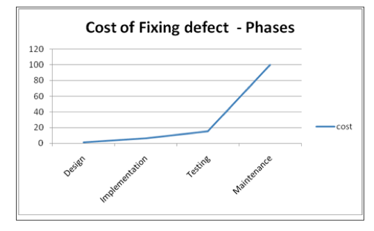
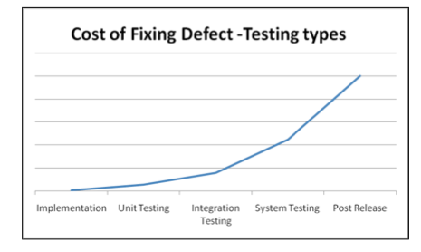
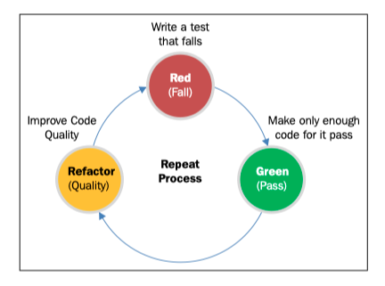

# 0101. Overview of TDD

There are several ways to develop a project. Testing is one of the most important phases in the development of any project, and in the traditional software development model, it is usually executed after the code for functionality is written. Test-driven development (TDD) makes a big difference by writing tests before the actual code. 

You are going to learn TDD for JavaScript and see how this approach can be utilized in projects. In this chapter, you are going to learn the following: 

• The complexity of web pages

• Understanding TDD 

• Agile and TDD 

• Benefits of TDD and common myths 

## 1.1 Complexity of web pages 

When Tim Berners-Lee wrote the first ever web browser around 1990, it was supposed to run HTML, neither CSS nor JavaScript. Who knew that WWW will be the most powerful communication medium? Since then, there are now a number of technologies and tools that help us write the code and run it for our needs. We do a lot these days with the help of the Internet. We shop, read, learn, share, and collaborate... well, a few words are not going to suffice to explain what we do on the Internet, are they? Over the period of time, our needs have grown to a very complex level, so is the complexity of code written for websites. It's not plain HTML anymore, not some CSS style, not some basic JavaScript tweaks. That time has passed. Pick any site you visit daily, view source by opening developer tools of the browser, and look at the source code of the site. What do you see? Too much code? Too many styles? Too many scripts? The JavaScript code and CSS code is so huge to keep it as inline, and we need to keep them in different files, sometimes even different folders to keep them organized.

Now, what happens before you publish all the code live? You test it. You test each line and see if that works fine. Well, that's a programmer's job. Zero defect, that's what every organization tries to achieve. When that is in focus, testing comes into the picture, more importantly a development style that is essentially test driven. As the title for this book says, we're going to keep our focus on test-driven JavaScript development. 

## 1.2 Understanding test-driven development 

TDD, short for test-driven development, is a process for software development. Kent Beck, who is known for development of TDD, refers to this as "rediscovery." Someone asked a question (Why does Kent Beck refer to the "rediscovery" of test-driven development?) about this. Kent's answer to this question on Quora can be found at https://www.quora.com/Why-does-Kent-Beck-refer-to-therediscovery-of-test-driven-development. 

"The original description of TDD was in an ancient book about programming. It said you take the input tape, manually type in the output tape you expect, then program until the actual output tape matches the expected output. After I'd written the first xUnit framework in Smalltalk I remembered reading this and tried it out. That was the origin of TDD for me. When describing TDD to older programmers, I often hear, "Of course. How else could you program?" Therefore I refer to my role as "rediscovering" TDD." 

If you go and try to find references to TDD, you would even get few references from 1968. However It's not a new technique, though it did not get so much attention at that time. Recently, an interest in TDD has been growing, and as a result there are a number of tools on the Web. For example, Jasmine, Mocha, DalekJS, JsUnit, QUnit, and Karma are among these popular tools and frameworks. More specifically, test-driven JavaScript development is becoming popular these days. 

Test-driven development is a software development process, which enforces a developer to write a test before production code. A developer writes a test, expects a behavior, and writes code to make the test pass. It is needless to mention that the test will always fail at the start. You will learn more about the life cycle later in this chapter. 

### 1.2.1 The need for testing 

To err is human. As a developer, it's not easy to find defects in our own code, and often we think that our code is perfect. But there is always a chance that a defect is present in the code. Every organization or individual wants to deliver the best software they can. This is one major reason that every software, every piece of code is well tested before its release. Testing helps to detect and correct defects. 

There are a number of reasons why testing is needed. They are as follows: 1) To check if the software is functioning as per the requirements. 2) There will not be just one device or one platform to run your software. 3) The end users sometimes perform an action as a programmer that you never expected, and these actions might result in defects. To catch these defects, we need testing.

1『这里的 defects 就当 bug 来理解。』

There was a study conducted by the National Institute of Standards and Technology (NIST) in 2002, which reported that software bugs cost the U.S. economy around $60 billion annually. With better testing, more than one-third of the cost could be avoided. The earlier the defect is found, the cheaper it is to fix it. A defect found post release would cost 10-100 times more to fix than if it had already been detected and fixed pre-release. The report on the study performed by NIST can be found at http://www.nist.gov/ director/planning/upload/report02-3.pdf. 

If we draw a curve for the cost, it comes as an exponential. The following figure clearly shows that the cost increases as the project matures with time. Sometimes, it's not possible to fix a defect without making changes in the architecture. In those cases, the cost is sometimes so great that developing the software from scratch seems like a better option. 

### 1.2.2 Types of testing 

Any product, website, or utility, should be very well tested before it is launched. There are a number of testing techniques used to test software. From a block of code to system integration testing, every kind of testing is performed for a zero-defect system. Test-driven development is more about unit testing. It helps to learn about defects in a system at a very early stage. You will learn more about unit tests and testing concepts in the next chapter. 

The following figure shows the cost of detecting and fixing defects in different testing types: 

1『 Implemention -> Unit Testing -> Integration Testing -> System Testing -> Post Release 』

As we can clearly see, if unit testing is performed, the cost of correcting a defect is close to correcting defects at the time of implementation. Since TDD enforces writing unit tests, the cost of the overall project is reduced significantly by reducing the number of defects after release. 

### 1.2.3 The life cycle of TDD

The life cycle of TDD can be divided into several steps. Each time a change is to be made into the system, tests cases are written first and then some code to make the tests pass, and so on. Let's get a closer look at the life cycle. See the following figure: 

The different phases of the life cycle of TDD can be explained as follows: 

1. Write a test: After a set of requirements is captured, one requirement is picked and tests are written for that. Implementation of every new feature or every change begins with writing tests for it. The test can also be a modified version of an existing one. 

    This is a major difference between TDD versus other techniques, where unit tests are written after the code is written. This makes the developer focus on the requirements before writing the code. This also makes it a test-first development approach. 

2. Run the test and see if the test fails: A new test should always require some code to be written to make it pass. This step validates that the new test should not pass without requiring new code. This also verifies whether the required feature already exists or not. This step helps the developer increase confidence that the unit test is testing the correct constraint, and passes only in the intended cases. 

3. Write minimal production code that passes: In this step, the developer writes just enough code to pass the test. The code written in this stage is not supposed to be perfect. Since the code will be improved and cleaned at a later stage, the code as of now is acceptable. At this point, the only purpose of the written code is to pass the test. 

4. Run all tests: Now, we run all the test cases at once. If every test passes, the programmer can be confident that the new code works as required and does not break any existing functionality or degrade the system anyhow. If any of the tests fail, the new code must be corrected to make the test pass. Usually, all our tests should be atomic and should not fail even if a new code is added, but that's not always the case. It may happen that someone else in the team added some code or some changes were made to the existing code. So, it's always a good practice to run all tests to make sure everything works fine as it should have. 

5. The cleanup code: At the end of development, there would be thousands of such test cases and code base that grows and can become complex if it is not cleaned up regularly. Refactoring is much needed. Duplicate code must be removed. Variables, functions, and so on should follow standards, and names should clearly represent their purpose and use. Code comments should be added for readability and documentation purpose. Removal of duplicate code applies to both production and test code. It is a must to ensure that refactoring does not break any existing features. 

6. Repeat: The preceding steps give a somewhat stable code in just one iteration, which works for some defined functionalities. The whole process is now repeated for another requirement. In case new tests fail, the developer can revert the changes or undo the operation performed. This gives a rapid feedback to the developer about the progress and problems in the system. 

1『第 5 步的 cleanup code 其实就是重构。』

### 1.2.4 TDD microcycle

The TDD life cycle is also defined as Red-Green-Refactor, which is also called as the microcycle. This process can be illustrated as shown in the following figure: 

There are only three steps in this microcycle: 

1. Write a test that fails at the start (Red): First of all, simple test cases are written, which test the code yet to be implemented. At this step, the test will always fail (In the figure, it has been colored red). 

2. Write just enough code to pass the test (Green): The developer then writes the code to pass the test. The code is written in the simplest manner and is just sufficient to pass the test. 

3. Refactor the code (Refactor): Before implementing a new feature, developers refactor the old code, which just passed, for clarity and simplicity. This step improves the code quality. 

This microcycle provides rapid feedback to the developer. As soon as a change is made to the system, it is tested. If there is any error, it's detected as soon as possible and fixed. 

## 1.3 Agile and TDD 

When we talk about TDD, Agile is most often discussed. Sometimes, people have doubts about whether Agile can exist without TDD or not. Well, of course it can, though. Agile and some people would say that TDD is Agile at a bigger scale. Through TDD, both show similar characteristics, but they are different. Agile is a process where testing is done as soon as a component is developed. It's not necessary in Agile to write test cases first and then perform development. But in the case of TDD, a test is always written first, and then its corresponding minimal production code. 

TDD is about how code should be written while Agile is about the whole development process, not just code and its testing. Agile does not tell you how to build the system. Agile methodology is a management process, which can use TDD as an integral part. 

Agile, when combined in practice with TDD, brings the best results. This combination minimizes risks, defects, cost, and results in a nearly zero-defect system. 

## 1.4 Benefits of TDD and common myths 

Every methodology has its own benefits and myths. The following sections will analyze the key benefits and most common myths of TDD. 

### 1.4.1 Benefits 

TDD has its own advantages over regular development approaches. There are a number of benefits, which help in making a decision of using TDD over the traditional approach. 

1. Automated testing: If you have seen a website code, you know that it's not easy to maintain and test all the scripts manually and keep them working. A tester may leave a few checks, but automated tests won't. Manual testing is error-prone and slow. 

2. Lower cost of overall development: With TDD, the number of debugs is significantly decreased. You develop some code, run tests; if you fail, redoing the development is significantly faster than debugging and fixing it. TDD aims at detecting defect and correcting them at an early stage, which costs much less than detecting and correcting at a later stage or post release. 

    Also, now debugging is much less frequent and a significant amount of time is saved. With the help of tools/test runners like Karma, JSTestDriver, and so on, running every JavaScript tests on browser is not needed, which saves significant time in validation and verification while the development goes on. 

3. Increased productivity: Apart from time and financial benefits, TDD helps to increase productivity since the developer becomes more focused and tends to write quality code that passes and fulfills the requirement. 

4. Clean, maintainable, and flexible code: Since tests are written first, production code is often very neat and simple. When a new piece of code is added, all the tests can be run at once to see if anything failed with the change. Since we try to keep our tests atomic, and our methods also address a single goal, the code automatically becomes clean. At the end of the application development, there will be thousands of test cases, which will guarantee that every piece of logic can be tested. 

    The same test cases also act as documentation for users who are new to the development of the system, since these tests act as an example of how the code works. 

5. Improved quality and reduced bugs: Complex codes invite bugs. when developers change anything in neat and simple code, they tend to leave fewer or no bugs at all. They tend to focus on the purpose and write code to fulfill the requirement. 

6. Keeps technical debt to minimum: This is one of the major benefits of TDD. Not writing unit tests and documentation is a big part, as this increases the technical debt for a software/project. Since TDD encourages you to write tests first, and if they are well written they act as documentation, you keep the technical debt for these to a minimum. 

As Wikipedia says, "A technical debt can be defined as tasks to be performed before a unit can be called complete. If the debt is not repaid, interest also adds up and makes it harder to make changes at a later stage". More about technical debt can be found at https://en.wikipedia.org/wiki/Technical_debt. 

### 1.4.2 Myths
 
Along with the benefits, TDD has some myths as well. Let's check few of them: 

1. Complete code coverage: TDD forces the writing of tests first, developers write the minimum amount of code to pass the test, and almost 100% code coverage is achieved. But that does not guarantee that nothing has been missed and the code is bug free. Code coverage tools do not cover all the paths. There can be infinite possibilities in loops. Of course it's not possible and feasible to check all the paths, but a developer is supposed to take care of major and critical paths. 

    A developer is supposed to take care of business logic, flow, and process code most of the time. There is no need to test integration parts, setter-getter methods for properties, configurations, UI, and so on. Mocking and stubbing is to be used for integrations. 

2. No need of debugging the code: Though test-first development makes one think that debugging is not needed, but it's not always true. You need to know the state of the system when a test failed. That will help you to correct and further develop the code. 

3. No need for QA: TDD cannot always cover everything. QA plays a very important role in testing. UI defects, integration defects, are more likely to be caught by a QA. Even though developers are excellent, there are chances for errors. QA will try every kind of input and unexpected behavior that even a programmer would not cover with test cases. They will always try to crash the system with random inputs, and discover defects. 

4. I can code faster without tests and can also validate for zero defect: While this may stand true for very small software and websites where the code is small and writing test cases may increase the overall time of development and delivery of the product. But for bigger products, it helps a lot to identify defects at a very early stage and provides a chance to correct them at a very low cost. As seen in the previous screenshots of the cost of fixing defects for phases and testing types, the cost of correcting a defect increases with time. Truly, whether TDD is required for a project or not depends on context. 

5. TDD ensures good design and architecture: TDD encourages developers to write quality code, but it is not a replacement for good design practice and quality code. Will a team of developers be enough to ensure a stable and scalable architecture? Design should still be done by following the standard practices. 

6. You need to write all tests first: Another myth says that you need to write all of the tests first and then the actual production code. Actually, generally an iterative approach is used. Write some tests first, then some code, run the tests, fix the code, run the tests, write more tests, and so on. With TDD, you always test parts of software and keep developing. 

There are many myths, and covering all of them is not possible. The point is, TDD offers developers a better opportunity to deliver quality code. TDD helps organizations by delivering close to zero-defect products. 

## Summary

In this chapter, you learned about what TDD is. You got to know about the life cycle of TDD and how it is called test-first development. Later on, you learned about the benefits and myths of TDD.  In the next chapter, you will learn the concepts of unit testing, and how to write unit tests and run them. 