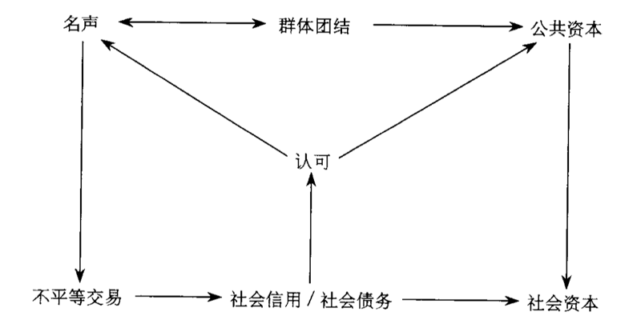

# 0202. Reputation and Social Capital: The Rational Basis for Social Exchange

原书第九章

This chapter continues the dialogue on action and social structure initiated in the previous chapter. As has been pointed out, the multiplicity and complexity of routinized social relations in a collectivity demand increasing rules of recognition and legitimation that recognize the basic right to human capital (property) while at the same time specifying responsibilities and obligations for actors contributing resources. Thus, recognition was also suggested as an important process for individual actors overcoming possible costs to unequal exchanges – why someone higher in social position and richer in resources would be engaged in repeated exchanges with someone lower in social position and poorer in resources. How this process operates at the interactional level has not been articulated. What needs to be understood is that unequal transactions in exchanges can and do occur because there are payoffs for the actors who give more resources than they receive and why this is somewhat related to recognition. This chapter will focus on this issue. I will set aside the legitimation issue and concentrate on the social process of recognition and its significance in exchange – a process of repeated interactions between actors and the fundamental building block of a collectivity.

这一章继续前一章所展开的关于行动与社会结构之间的对话。前面已经指出，集体中例行化的社会关系的多样性与复杂性越来越需要认可与合法化的规则，来承认人力资本（财产）的基本权利，同时明确说明提供资源的行动者的责任与义务。因此，认可也是个体行动者克服不平等交换中的可能成本的一个重要过程。

为什么社会地位较高、资源丰富的人会多次与社会地位较低、资源贫乏的人互动呢？这个过程是如何在互动层次上展开的还没有被阐释清楚。需要解释的是交换中可能而且确实发生的不平等交易。给出资源比收到资源多的行动者也有报偿，这报偿为什么会与认可联系起来。这一章将关注这个问题。我先把合法化问题放在一边，将精力集中在认可的社会过程与它在交换中的重要性上 —— 行动者与集体的基本要素之间重复互动的过程。

## 2.1 Exchange: Social and Economic Elements

Exchange , a central concept in sociological analysis, can be defined as a series of interactions between two (or more) actors in which a transaction of resources takes place. By this definition, exchange has two central components: it requires a relationship between the actors, and it leads to resource transaction. Thus, exchange is social in that the relationship can be seen as interactions (Simmel 1950) in which the action of one actor during the process takes into account the action of the other 143

actor(s) (Weber 1947, pp. 111–115). The process can be seen as economic, since transaction of resources is typical of economic acts. Therefore, an elementary exchange, evoking a relationship between two actors and a transaction of resource(s), contains both social and economic elements. It is useful here to refer to the relational aspect of the exchange as social exchange and to the transactional aspect as economic exchange .

This distinction between exchange’s social and economic elements is often blurred in the research literature due to the common co-occurrence of both elements. This is especially true of the use of the term social exchange . That social exchange is more than social interaction is reflected in the understanding that social exchange contains the added element of resource transactions. As a result of this common usage, social exchange as a concept has been employed by scholars who have selectively focused on one of the two elements in their theoretical or research schemes.

The focus on the economic element in the discourse on social exchange can be traced to Weber. While pointing to four types of action (goal-oriented, valued-oriented, effectual, and traditional action), he concentrated his analytic effort on instrumentally rational (or rational goal-oriented) actions, which are based on the calculation of alternative means to the end (Weber 1968, p. 25). Value-oriented action is determined by a conscious belief in the value (for its own sake) of some ethical, aes-thetic, religious, or other form of behavior independent of its prospect.

Both types of action are based on consciously regulated comparison and choice – that is, on rationality (Misztal 1996, p. 54). The theoretical embedding of the transactional aspect of exchange in rationality of action was thus identified.

This line of argument was brought home forcefully by George Homans (1958), who clearly stated this position:「Interaction between persons is an exchange of goods, material and nonmaterial. An incidental advantage of an exchange theory is that it might bring sociology closer to economics – that science of man most advanced, most capable of application, and, intellectually, most isolated」(p. 597). For Homans, social behavior or exchange1 focuses on the gain (value) and cost for an actor in the transaction;「the problem of the elementary sociology is to state propositions relating the variations in the values and costs of each man to his frequency distribution of behavior among alternatives, where the value (in the mathematical sense) taken by these variables for one man determine in part their values for the other」(p. 598). Thus, the interest of two actors in continuing the interactions or the relationship is con-1 Homans sees social behavior「as an exchange of activity, tangible or intangible, and more or less rewarding or costly, between at least two persons」(1958 and 1961, p. 13).

tingent on the relative utility or payoff to each in each transaction. Interest in the relationship diminishes as the relative payoff (the marginal utility) decreases. It is logical, therefore, for Homans to argue that「the principles of elementary economics are perfectly reconcilable with those of elementary social behavior, once the special conditions in which each applies are taken into account」(1961, p. 68).

Blau’s (1964) work on exchange also reflects this emphasis. While admitting that social exchange may follow from social attractions, a primitive psychological tendency left as exogenous,2 the major theoretical focus of his analysis is the linkage between transactions in exchanges and distribution of power. When an actor (ego) is unwilling or unable to reciprocate3 transactions of equal value in an exchange with another actor (alter), one choice available to ego to maintain the relationship with the alter is to subordinate or comply with the alter’s wishes – the emergence of a power relationship (p. 22). Collective approval of power gives legitimacy to authority, the backbone of social organizations. Thus, in Blau’s theoretical scheme, patterns of transactions dictate patterns of relationships, and this fundamental microstructural process evokes, though not necessarily explains, the much more complex macrostructural (organizational) process.

Coleman (1990) carried this analysis further in his theory of social action, in which social exchange is a means by which actors with differential interests and controls over resources (events) negotiate (through the relative value of the resources they control, or power) with each other to maximize their control over interested resources (a new equilibrium) (pp. 134–135). The mechanism between exchanges and power seems quite similar to Blau’s scheme, but the focus is on an actor’s maximization of gain (control over desired resources) in this process.

By now, the sociological explication of the process of exchange seems to have fulfilled Homan’s prophecy or design that sociology is being brought very close, if not identical, to the economic stance on the centrality of rational choices in economic behaviors. That is, given choices in the marketplace, an actor will choose a transaction to maximize his 2「The basic social processes that govern associations among men have their roots in primitive psychological processes, such as those underlying the feelings of attraction between individuals and their desires for various kinds of rewards. These psychological tendencies are primitive only in respect to our subject matter, that is, they are taken as given without further inquiry into the motivating forces that produce them, for our concern is with the social forces that emanate from them」(Blau 1964, p. 19).

3 Reciprocity, in this case and in many other sociological works, implies balanced exchange or transactions of equal value (e.g., in price or money). This requirement for interaction goes beyond Weber’s original conceptualization about social action, which only requires taking the other actor’s interests into consideration. In that context, reciprocity does not require balanced exchange.

or her profit (e.g., more reward at less cost). Neo-classical economists have realized that certain assumptions of this profit-seeking theory are not likely to be met in reality (a perfect market, full information, and open competition), and have proceeded to specify conditions or institutions (bounded rationality, transaction costs) under which profit-seeking behavior may be moderated (see Williamson 1975; Coase 1984; North 1990). Many of the same arguments and conditions have been adopted by sociologists in analyzing organizational behaviors, power relationships, institutions, and social network and social exchange under the general rubrics of neo-institutionalism or economic sociology.

However, the significance of relationships in exchanges has not been ignored. From early on, anthropologists have paid attention to the relational aspect of exchanges and have argued strongly that many of these patterns are not based on economic or rational calculations. For example, Radcliffe-Brown (1952) described the exchanges among the Andaman Islanders as「a moral one – to bring about a friendly feeling between the two persons who participate」(p. 471). Malinowski (1922) drew sharp distinctions between economic exchange and social exchange (ceremonial exchange) in his analysis of Kula exchanges in the Trobriand Islands and suggested that「the real reward (of exchanges) lies in the prestige, power, and privileges which his position confers upon him」(p. 61).

Levi-Strauss (1949) cited studies by Mauss, Firth, and other anthropologists in his argument that exchanges, including economic transactions, are

「vehicles and instruments for realities of another order: influence, power, sympathy, status, emotion」and stated that「it is the exchange which counts and not the things exchanged」(Levi-Strauss 1969, p. 139). Gifts, for example, are exchanged between actors, but buying oneself a gift at Christmas time is meaningless (Ekeh 1974, p. 47).

Among the sociologists, Comte (1848) spoke of subordinating personal to social considerations, and Durkheim refuted Spencer’s economic assumptions regarding the development of social groups. None of these scholars deny the implications of economic transactions in social exchanges, but they also emphasize the supraindividual (Levi-Strauss) and supraeconomic (Radcliffe-Brown 1952) nature of social exchanges and the significance of relationships. In each of these schemes, the relational orientation to social exchange is demonstrated in the commitment of specific actors to the exchanges on grounds other than the utility of specific resources transacted.

How are the two perspectives on exchanges to be reconciled? Several positions have been taken. One approach simply dismisses the significance of relationships in that any particular relationship is subjected to the decision-making choice of maximizing or optimizing profit. When a relationship generates a profit in transactions, it may be maintained;

when it does not, it is discarded. However, most neo-classical economists and their sociological allies take a moderate position, treating relations as the necessary「transaction cost」or「calculative trust」(Williamson 1985, 1993) in an imperfect market and under the condition of incomplete information. In this modified position, the relationship is recognized but is clearly subsumed under the transactional analysis.

Alternatively, those relationship-inclined scholars have argued that relationships are necessary and significant because not all behaviors and interactions are rational. This argument agrees that economic behavior follows the principle of rational choices, but it points out that not all behaviors are economic and thus rational. Social attractions and attach-ments are primitive survival instincts rather than the result of a calculation of gains and losses in alternatives. The problem here is that rational choices are seen as natural tendencies: rewards or reinforcements elicit actions and transactions, and the fittest survive. Consciousness or unconsciousness is irrelevant, as this principle applies to pigeons as well as to humans (Homans 1961, p. 80). Carrying this analysis further, it becomes problematic why some instincts are rational and others are not.

Still another identifiable argument concedes, sometimes more implicitly than explicitly, that rationality applies to social exchanges, but there are rational principles other than the individual profit-seeking motive.

Because human beings take into account each other’s interests in interactions and exchanges, relationships may be maintained to accommodate this rationality. There are many subarguments along this line of reasoning. Two seems quite pervasive in the literature. First, there is the argument that social approval, esteem, liking, attraction, and such are important motives for exchange. Notably in exchanges where the transactions are imbalanced, the reward for the shortchanged actor may be approval, esteem, liking, or attraction from the other actor. In this case, these symbolic rewards, rather than the material rewards (and its generalized medium, money) usually identified with economic exchanges, constitute meaningful rewards. However, for Homans, Blau, and Coleman, such rewards are different in kind but not in nature. Whether material or symbolic, as long as they represent value (or profit or interest), they are part of the rational calculation. Further, how such values have been developed is irrelevant to the theoretical development of social exchanges.

Another subargument is that human beings need trust (Luhmann 1979; Barber 1983; Misztal 1996). Trust may be defined as confidence or expectation that an alter will take ego’s interests into account in exchanges. It represents faith that an event or action will or will not occur, and such faith is expected to be mutual in repeated exchanges.

It is faith in morality, Misztal (1996) argues, that trust serves three functions: it promotes social stability (as a habitus), social cohesion (friendships), and collaborations. In other words, its motive is to maintain a group or community. Durkheim (1973) suggested that feelings of obligation and altruism as well as moral pressure, which restrains egoistic behavior, are the bases of solidarity.「Men cannot live together without acknowledging, and, consequently, making mutual sacrifices, without tying themselves to one another with strong, durable bonds」

(Durkheim, 1964, p. 228). Durkheim strongly asserted the existence of a moral element in social life, which may entail the sacrifice of rewards, in quality and/or quality, on the part of the actors.

If solidarity and community are fundamental elements in human survival, why can they not be based on rational choices or economic behaviors? Simmel attempted one response, positing that exchange involves「a sacrifice in return for a gain」(Simmel 1971, p. 51) and that exchange is

「one of the functions that creates an inner bond between people – a society, in place of a mere collection of individuals」(Simmel 1978, p.175). He adds,「Without the general trust that people have in each other, society itself would disintegrate, for very few relationships are based entirely upon what is known with certainty about another person, and very few relationships would endure if trust were not as strong as, or stronger than, rational proof or personal observation」(Simmel 1978, pp. 178–179). The functioning of complex societies depends on a multitude of promises, contracts, and arrangements. Since「the single individual cannot trace and verify their roots at all,」we must「take them on faith」(Simmel 1950, p. 313). Faithfulness , or loyalty , refers to the feeling of「preservation of the relationship to the other」(1950, p. 387).

This need for rules of interaction and trust in complex modern society is clearly demonstrated in Parsons’s proposal that trust is the basis for legitimating power to achieve collective goals and societal integration (Parsons 1963). Hechter’s (1983) analysis of group solidarity also advances the rational basis for collectivity.

Luhmann (1988) further elaborates Parsons’s media theory and his concept of symbolic generalization. Trust is seen as one of the generalized media of communication (others being love, money, and power), and as such reduces the complexity of the world faced by the individual actor by providing the capacity for「intersubjective transmission of acts of selection over shorter or longer chains」(Luhmann 1979, p. 49). But Misztal points out that「Luhmann is less forthcoming on the issue of how this function of trust helps to explain the actual formation of trust」(1996, p. 74).

The explanatory basis for trust, then, is the need in a complex society for individuals to rely on rules that are accepted by many people and that guide both interpersonal and impersonal exchanges – the institutions. Without such consensual rules and trust in them, societal func-

tioning would cease. But Homans reminds us that「institutions, as explicit rules governing the behavior of many people, are obeyed because rewards other than the primary ones come to be gotten by obeying them, but that these other rewards cannot do the work alone. Sooner or later the primary rewards must be provided. Institutions do not keep on going forever of their own momentum」(1961, pp. 382–383). By primary rewards , of course, Homans is referring to basic individual needs for profits. Misztal agreed:「In Parsons’ theory the significance of trust as a single explanatory device is clearly overstated. The notion of trust, used as a substitute for familiarity, conformity and symbolic legitimation, does not provide us with an effective instrument with which to analyze social reality」(1996, p. 72). According to Williamson (1985), unless cooperation also serves an egoistic motivation, the practices of cooperation will be unstable. This means that a social order based on trust not grounded in self-interest will be unpredictable and unstable; for this reason, trust is not always functional.

In summary, none of the arguments thus far that defend the significance of relationships in exchanges, once the transactional rationality is presented, seem satisfactory. What I will propose in the remainder of the chapter is another attempt to assert the significance of relationships in exchanges. The argument begins with the premise that rationality should be used as the basis for the theoretical development. Rationality is not a matter of conscious versus unconscious behavior. Nor does it rely on some norms or institutions; these come later. And it is not based on an expectation of ultimate transactional balance in the long run (e.g., repeated transactions will balance out gains and losses) (see Homans’s refutation of these arguments for treating elementary social behaviors as rational: 1961, pp. 80–81). Here, simply, an exchange is seen as a process engaging two actors whose actions are based on calculations of gains and losses and on alternative choices in relationships and transactions.

As long as such calculations and choices are made, the process is considered rational. Further, I assume that these calculations and choices are based on self-interest. This assumption does not rule out considerations of collective interest. What is assumed is that collective interest comes into the calculation only when it is embedded in self-interest; there is a self gain if the collective interest is served. What is not assumed is that collective interest, excluding self-interest, drives calculations and choices.

交换：社会要素与经济要素

交换是社会学分析的一个中心概念，可以定义为两个（或更多）行动者之间进行资源交易的一系列互动。根据这个定义，交换有两个核心要素：它要求行动者之间具有一定的关系；它导致了资源交易。这样交换具有社会性，因为关系可以视为互动（Simmel, 1950），在互动过程中一个行动者要考虑另一个（些）行动者的行动（Weber, 1947, pp11-115）。这个过程具有经济性，因为资源交易是一种典型的经济行动。因此，引起两个行动者之间产生关系与进行资源交易的基本交换包含着社会性的要素与经济性的要素。在这里将交换的关系方面称为社会交换，交易方面称为经济交换是很有用的。

由于交换的社会要素与经济要素通常是同时出现的，因此这二者的区分在研究文献中经常很模糊。使用社会交一词是特別准确的，因为社会交换比社会互动更能反映出交换中所包含的资源交易要素。由于这个词很常用，那些在理论或研究图式中只关注其中一个要素的学者也使用社会交换这个概念。

在关于社会交换的论文中，最先关注经济要素的是韦伯。韦伯指出了行动的四种类型（目标取向的、价值取向的、情感行动的和传统行动），他集中分析了建立在对实现目标的手段进行计算的基础上的工具理性（或理性的目标取向）行动（Weber, 1968, P25）。价值取向的行动是由对一些价值（本身即目的）伦理的、审美的、宗教的或其他不计后果的行为形式，有意识的信仰所决定的。这两种类型的行动都是建立在有意识的比较与选择基础上的 —— 也即理性基础之上的（Misztal, 1996, p54）。这样，交换的交易方面进入了行动理性之中。

乔治·翟曼斯（George Homans, 1958）清楚、有力地说明了这个方向上的观点，他明确地陈述了立场：「人们之间的互动是一种商品、物质与非物质的交換。交换理论的一个附带优势是，它可能使社会学与经济学 —— 人类最先进、应用性最强和在学术界最孤立的科学 一一 靠得更近。」（p597）

霍曼斯认为，社会行为或交换 [1] 关注行动者在交易中的收益（价值）与成本「社会学的基本问题是陈述将每一个人的收益和成本的变化与各种行为的频数分布联系起来的命题，对一个人而言，在各种行为中这些变量所决定的收益（在数学的意义上）也部分地决定着另一个人的收益」（P598）。因此，两个行动者在持续的互动或关系中的利益 —— 在每一次交易中每人的相对效用或报偿 —— 是相依的。随着相对报偿（边际效用）的递减，关系中的利益也相应减少。因此霍曼斯的观点是符合逻辑的 一一 「一旦每一个原则所适应的特殊条件被考虑进去，基本的经济学原则与基本的社会行为原则是完全一致的」（Homans, 1961, p68）。

布劳（1964）有关交换的著作也强调了这一点。虽然他承认社会交换可能源于社会吸引 —— 一种外生的原始心理倾向，[2] 但是他主要关注的是交换中的交易与权力分配之间的联系。在与另一个行动者的交换中，如果行动者（自我）不愿意或不能进行等价的互惠 [3] 交易，那么自我维持与他人的关系的一个选择是服从他人的意愿 —— 权力关系的产生（Banu, 1964, P22）。对权力的集体赞同赋予权威合法性，这是社会组织的基础。因此，在布劳的理论图式中，交易的类型规定着关系的类型，这个基本的微观结构过程引起了ー一尽管不必然解释了 一一 更复杂的宏观结构（组织）过程。

科尔曼（Coleman, 1990）在其社会行动理论中将分析继续向前推进，他指出，社会交换是对资源（事件）有不同的利益与控制的行动者彼此（通过他们控制的资源的相对价值或权力）谈判的一个手段，以使他们对有利害关系的资源的控制最大化（一个新的均衡）（P134-135）。这个交换与权力之间的机制似乎非常类似于布劳的图式，但是科尔曼关注的是行动者在这个过程中的收益（对所需要的资源的控制）最大化。

到目前为止，社会学对交换过程的解释似乎已经实现了霍曼斯的预言或设计：社会学正在靠近 一一 如果不是接近经济学将理性选择置于经济行为的中心地位的立场。也即，假定在市场中可以进行选择，一个行动者将会选择能使他或她的利润最大化的交易（例如，以较少的成本换取较多的报酬）。新古典经济学家已经认识到这种寻利理论（profit-seeking theory）的某些假定在现实中不可能被满足（完备市场、完全信息和开放竟争），开始具体阐述可能节制寻利行为的条件或制度（有限理性、交易成本）（参见 Williamson, 1975; Coase, 1984; North, 1990）。很多相同的观点与条件已经被称为新制度主义或经济社会学的社会学家所采用，被他们用来分析组织行为、权力关系、制度以及社会网络与社会交换。

然而，交换中的关系的重要性依然没有被忽视。人类学家从很早就开始注意到交换的关系方面，指出很多类型的交换并不是建立在经济或理性计算基础上的。例如，拉德克利夫·布朗（Radcliffe-Brown, 1952）将安达曼群岛上的交换描述为「一种道德的交换 —— 给参与交换的两个人带来友好的感情」（P471）。马林诺夫斯基（Malinowski, 1922）在分析特罗布里恩群岛的库拉交换（Kula exchanges）时，指出了经济交换与社会交换之间的巨大区别，「（交换的）真正报酬在于他的位置赋予他的声望、权力和特权」（p61）。列维-斯特劳斯（Levi-Strauss1, 949）在论证自己的观点时列举了莫斯（Mauss）弗思（Firh）和其他人类学家的研究，指出包括经济交易在内的交换是「另一个秩序世界的媒介与工具：影响、权力、同情、地位、情感」，「是交换本身而不是交换物真正具有意义」（Levi-straus, 1969 , p139）。例如，礼物是在行动者之间进行交换的，在圣诞节时给自己买一个礼物是毫无意义的（Ekeh, 1974, P47）。

在社会学家中，孔德（Comte, 1848）提出个人的考虑要服从社会的考虑，涂尔干（Durkheim）驳斥了斯宾塞（Spencer）关于社会群体发展的经济学假定。这些学者都没有否定社会交换中含有经济交易，但是他们也强调了社会交换的超个人性（Ievi-strauss）与超经济性（Radcliffe-brown, 1952）以及关系的重要性。每一种图式都论证到，社会交换的关系取向表现在具体行动者的交换承诺中而不是在交易的具体资源的功用上。

如何协调交换的这两个视角？可以采取以下几种立场。

其一，完全不考虑关系的重要性，因为任何特定的关系都服务于利润最大化或最优化的决策选择。当关系能够在交易中产生利润的时候，它可以被维持；如果不能，它会被抛弃。但是大多数新古典经济学家和他们的社会学同行采取了一种调和的立场，将关系视为不完备市场与不完全竞争信息条件下所必需付出的「交易成本」或「计算性信任」（calculative trust）（Williamson, 1985, 1993）。这个修正的立场承认关系的存在，但是明确地将其置于交易成本的分析框架之内。

其二，那些关系倾向的学者认为关系是必要的、重要的，因为并不是所有的行为与互动都是理性的。这个观点承认经济行为遵循着理性选择原则，但是指出并不是所有的行为都是经济的、理性的。社会吸引和依恋是原始的生存本能，而不是对选择的收益与损失计算的结果。这里的问题是，理性选择被视为自然的倾向奖赏或强化引起了行动与互动，导致了适者生存意识或无意识是不重要的，因为这个原则既适应于鸽子，又适应于人类（Homans, 1961, p80）。进一步向前推进这个分析就会出现问题，为什么一些本能是理性的而另一些却不是。

还有一种观点承认理性有时侯隐含地而不是明显地适应于社会交换，但是这种理性是理性原则而不是个人的寻利动机。因为人类在互动与交换中要考虑彼此的利益，所以关系的维持可能是为了适应这个理性。沿着这条推线索有很多子观点。有两种观点似乎在文献中很流行。

一种观点认为社会赞同、尊敬、喜爱、吸引，诸如此类是交换的重要动机。在交易明显不均衡的交换中，对「吃亏」一方的回报可能是另一方的赞同、尊故、喜爱或吸引。在这种情况下，这些符号性的报酬而不是通常与经济交换相联系的物质性报酬（与一般化的媒介 —— 货币）成为有意义的报酬。然而，对于霍曼斯、布劳和科尔曼而言，这些报酬只是在种类上的差别，而不是本质的不同。无论是物质的还是符号的，只要它们代表着价值（或利润或利益），就都属于理性计算部分。此外，社会交换的理论并不关心这些价值是如何发展而来的。

另一个子观点是，人类需要信任（Luhmann, 1979, Barber, 1983, Misztal, 1996）。信任可以定义为对他人在交换中会考虑到自我的利益的信心或期待。它代表着对一个事件或行动将会发生或不会发生的信念，这种信念是在重复的交换中被相互期待的。它是对道徳的信念，米茨塔尔（1996）认为信任履行着三个功能：它促进了社会稳定（作为惯习）、社会凝聚（友谊）与合作。换言之，它的目的是维持一个群体或社区的存在与持续。涂尔干（1973）指出，义务与利他主义的感情以及约束自我行为的道徳压力是团结的基础。「不接受、不相互作出牺牲，不彼此尽力维持牢固的、持久的组带，人类就不能生活在一起」（Durkheim, 1964, P228）。涂尔于坚信社会生活中道德要素的存在，这可能需要行动者在报酬的质量和数量上作出牺牲。

如果团结与共同体是人类生存的基本要素，为什么它们不能建立在理性选择或经济行为的基础上？齐美尔（Simmel）试着作出了回答，他认为交换涉及到「对回报收益的牺牲」（Simmel, 1971, p51），「交换的功能之一是在人们之间创造一个内在的纽带 一一 形成一个社会，而不只是个人的集合」（Simmel, 1978, p175）。他补充道、「如果人们之间没有通常的信任，社会本身将会瓦解，因为非常少的关系是建立在对另一个人完全了解的基础上的，如果信任不与理性的证据或者个人的观察一样强、或更强，很少有关系会持久下去」（Simmel, 1978, P178-179）。复杂社会的运行依赖于很多的承诺、契约和安排。因为「单一的个人根本不能追溯与证明自己的历史」，我们必须「信以为真」（Simmel, 1950, P313）。忠诚指「与另一个人保持关系」（1950, P387）的感情。帕森斯清晰地论证了复杂的现代社会对互动与信任规则的需要。他提出，信任是为集体目标与社会整合的实现提供合法化权力的基础（Parsons, 1963）。赫克特（Hechter, 1983）在分析群体团结时也论述了集体的理性基础。

卢曼（Luhmann, 1988）进一步阐述了帕森斯的媒介理论与符号一般化的概念。信任被视为沟通的一个一般化的媒介（其他的是爱、货币和权力它为行动者提供了「在主体通过选择或短或长的链条来传递行动」的能力，从而降低了个体行动者所面对的世界的复杂性（Luhmann, 1979, P49）。但是米茨塔尔指出，「卢曼并没有直接论述信任的功能如何有助于解释信任的实际形成问题」（Misztal, 1996, P74）。

信任的解释基础是复杂社会中的个人对规则的依靠的需要，这些规则被很多人所接受并且指导着人际间的、非个人间的交换。这也就是制度。没有这些达成共识的规则与对它们的相信，社会将会停止运行。但是霍曼斯提醒我们，「制度是规范很多人的行为的明确的规则，它被遵守的原因是由此可以获得奖赏，但不是原始性奖赏，这些其他的奖赏不能独自起作用。原始性奖赏迟早要被提供。制度不能永远保持自己的势头」（Homans, 1961, pp.382-383）。霍曼斯用原始性奖赏来指代个体对利润的基本需要。米茨塔尔表示同意：「在帕森斯的理论中，信任作为单一的解释手段的重要性显然被扩大了。用信任的概念来代替熟悉、遵从与符号的合法化的做法是不可行的，因为它并不能给我们提供一个有效的工具来分析社会现实」（Misztal, 1996, p72）。按照威廉姆森（Wiliamson, 1985）的观点，除非合作也符合自我的动机，否则合作将会不稳定。这意味着一个建立在信任而不是有根基的自我利益基础上的社会秩序是难以预测的、不稳定的。由于这个原因，信任不总是起作用的。

总之，当交易理性被提出来之后，所有有关对交换中关系再进一步分析的观点，都不能令人满意。这一章的剩余部分我要提出来的是论述交换中的关系的重要性的另一种尝试。我的论述从理性前提开始 一一 理性应该用作理论发展的基础。理性不是与无意识行为相对的有意识行为。它不依靠一些规范或制度，这些是后来才出现的。它也不是建立在对长时期内最终的交易均衡的期待的基础之上（如重复的交易将会使收益与损失之间出现均衡）（参见霍曼斯对这些将基本的社会行为视为理性的观点的驳斥；Homans, 1961 pp80-81）。

这里简单地说，交换是一个涉及到两个行动者的过程，他们的行动建立在对收益与损失的计算以及对进行关系还是进行交易的选择的基础之上。只要做过计算与选择，这个过程就被认为是理性的。此外，我假定这些计算和选择是建立在自我利益的基础之上的。这个假定没有排除对集体利益的考虑。我假定的是只有当集体利益嵌入到自我利益之中的时侯，集体利益才会被考虑，这样如果集体利益实现了，自我也会有收益。我没有假定排除自我利益的集体利益在驱动着计算和选择。

[1] 霍曼斯将社会行为视为「至少两个人之间的有形的或无形的、或多或少有报偿的或有代价的交换活动」（Homans, 1958 和 1961, p13）。

[2] 支配着人类之间进行交往的基本社会过程植根于原始的心理过程，如那些引起个人之间相互吸引的感情和对各种奖赏的欲求的心理过程。这些心理倾向就我们所讨论的主题而言是原始的，也即它们是预先给定的，不需要进一步寻找激发它们产生的因素，因为我们关心的是源于它们的社会力量。（Blau, 1964, p19）

[3] 在这里以及许多其他社会学著作中，互惠表示均衡交换或者等价（如价格或货币）交易。这个互动的要求超出了韦伯最初关于社会行动的定义。在那里，互惠并不要求交换达到均衡。

## 2.2 Transactional and Relational Rationalities

The critical element, instead, is the ultimate payoff: the kinds of rewards or resources that sustain or interrupt relationships and/or transactions.

There are two ultimate (or primitive) rewards for human beings in a social structure: economic standing and social standing.4 Economic standing is based on the accumulation and distribution of wealth (as indicated by commodities and their symbolic value representations, such as money), and social standing is based on the accumulation and distribution of reputation (as indicated by the extent of recognition in social networks and collectivities).5 Each standing reflects the ranking of an individual relative to others in the structure over the command of the

「capital」concerned. Wealth, therefore, is a functional calculus of the worth of commodities in terms of their value representation, money; reputation is a functional calculus of the worth of public awareness in social networks in terms of its value representation, recognition. Wealth is indicative of economic capital because the commodities and their value representation can be invested to generate certain returns. Likewise, reputation reflects social capital because the social networks and their value representation can be mobilized to generate certain returns. Through reputation, it becomes possible to mobilize the support of others for both instrumental and expressive actions. It is the capacity of resource mobilization through social ties, or social capital, that makes social relationships a powerful motivation for individual actors to engage in exchanges.

Both economic and social standings enhance an individual’s power and influence in the structure (over other members) and, thus, the individual’s psychic well-being and physical survival as well.

Economic standing and social standing are complementary in that the former requires social legitimation and enforcement for its symbolic value (money), and the latter builds on the economic well-being of the group (or embedded resources in the network) in which the reputation is sustained. Without social enforcement, economic standing collapses; without collective wealth, social standing is meaningless. Yet, each standing can be seen as an independent motive in exchanges. Exchanges can be used to extract economic capital (resources through transactions) or social capital (resources through social relations).

Thus, transactional rationality drives the calculations of transactional gains and costs in exchanges, and relational rationality propels the calculations of relational gains and costs. Transactional rationality sees relationships as part of transactional gain–loss calculations, and relational rationality sees transactions as part of relational cost–benefit calcula-4 A third reward, political standing (or power), is also important, but probably is not as primitive as the other two rewards. Power, or the process of legitimation, reflects a process by which the other two primitive rewards are preserved or gained. The relationships among wealth, reputation, and power (legitimation) emerge in the discussions in the previous chapter and this chapter.

5 The usual indicators of social standing include status (for position) and prestige (for occupant) (see Table 3.1 in Chapter 3). I adopt the more general term reputation to capture both, as overall esteem given to an actor by others.

tions. Relational rationality favors the maintenance and promotion of the relationship even when the transactions are less than optimal. Transactional rationality favors the optimal outcome of transactions even if it is necessary to terminate specific relations. While both rationalities are enacted by actors in most exchanges, for a given society at a particular time, institutions favor one rationality over the other, allowing moral judgment on the relative merits of one type of capital (economic or social) over the other. The remainder of this chapter will elaborate on these arguments.

交易理性与关系理性

关键的要素是最终的报偿 —— 维持或中断关系和交易的各种报酬或资源。对人类而言，社会结构中存在着两类最终的（或原始的）报酬：经济地位和社会地位。[4] 经济地位是建立在财富（商品和它们的符号价值表示，如货币）的积累和分配基础上的，社会地位是建立在名声（由社会络和集体的认可程度来表示）的积累和分配基础上的。[5] 每一种地位都反映了个体相对于结构中的其他人在支配相关「资本」上的等级。财富是以货币为价值表现形式的商品价值的函数计算；名声是以认可为价值的表现形式的社会网络中的公共意识价值的函数计算。财富是经济资本的象征，因为商品和它们的价值表现物可以用来投资产生某种回报。同样，名声代表着社会资本，因为社会网络和它们的价值表现物也可以被动员起来产生某种回报。行动者在工具性和表达性行动中可以通过名声来动员他人的支持。通过社会关系进行资源动员的能力或者说社会资本，使社会关系的获得成为个体行动者参与交换的强烈动机。经济地位和社会地位都提高了个体在结构中的权力和影响（对其他成员而言），也有利于个体的心理健康和身体健康。

经济地位和社会地位是互补的，因为前者需要社会对它的符号价值（货币）进行合法化和强制推行，后者的名声维持是建立在群体的经济福利（或者网络中的嵌入性资源）基础之上的。没有社会的强制，经济地位会坍塌；没有集体财富，社会地位也是没有意义的。但是在交换中，可以将获取每一种地位的动机视为独立的。可以通过交换获取经济资本（通过交易获得资源）或社会资本（通过社会关系获得资源）。

因此，交易理性驱动着行动者对交换中的交易收益和成本进行计算，而关系理性推动着行动者对关系收益和成本进行计算。交易理性将关系视为交易收益-损失计算的一部分，关系理性将交易视为关系成本-收益计算的部分。关系理性即使在交易不是最优化的情况下，也会维持和促进关系。而交易理性即使在必须中断某种关系的情况下，也会致力于交易结果的最优化。虽然这两种理性在大多数交换中都会被行动者付诸实践，但是在一个特定的时间内的特定社会中，制度更有利于其中的一种理性，对这一种类型的资本（经济的或社会的）的相对优点存在着道徳判断。下面我会阐述这些观点。

[4] 第三种报酬 一一 政治地位（或权力）也很重要，但可能不是与其他两种报酬一样原始。权力或合法化的过程，反映了维持或获得其他两种原始报酬的过程。财富、声望和权力（合法化）之间的关系出现在前一章和本章的讨论中。

[5] 社会地位的指标通常包括地位（对位置而言）和声望（prestage）（对占据者而言）（参见第三章表 3.1）。我采用更一般的词 —— 名声（reputaton）作为他人给予行动者的整体的尊敬，以涵盖这两者。

## 2.3 Relational Rationality Elaborated

It seems intuitive, due to natural law and natural instinct, to understand the argument of transactional rationality – gain over cost in transactions and maintenance and accumulation of resources through transactions.

Further, its calculation is helped enormously by the generalized medium of money (Simmel 1978). Gains and losses can be counted, and credits and debts documented, with ease. Accounting in relational rationality is not so easy or clear, even though Coleman (1990) notes that social credits (or credit slips) are central to the notion of social capital as well. In economic exchanges, not every episode is symmetric or balanced in the trade of goods. Imbalanced transactions incur economic credits and debts.

However, it is strongly assumed that the balance of credits and debts will be achieved in the long run, but in a finite time frame, in repeated transactions.

In social exchanges where persistent relationships take on significance, episodic transactions are not necessarily symmetric or balanced.

However, even in repeated transactions in a finite time frame, balanced transactions are not required. The critical element in maintaining relationships between partners is social credits (and social debts). In a persistent relationship where transactions are not symmetric even in the long run, the engaging actors are engaging in an ever greater creditor–debtor relationship – the tendency of one actor to give favors to another in imbalanced transactions. While the debtor gains, why would the creditor want to maintain the relationship and thus suffer transactionally? It is argued that the crediting actor gains social capital in maintaining the relationship. How? Presumably the creditor could call on (or threaten) the debtor to repay the debt. But so long as the creditor does not make such a demand, the debtor is perpetually indebted to the creditor. To be able to maintain the relationship with the creditor, the debtor is expected to take certain social actions to reduce the relational cost (or increase the utility of exchanges) for the creditor. That is, the debtor should

propagate to others through his or her social ties his or her indebtedness to the creditor – a social recognition of credit–debt transactions, or social credit given to the creditor. Propagation of indebtedness, or social recognition , is a necessary action on the debtor’s part for maintaining the relationship with the creditor. It leads to greater visibility of the creditor in the larger social network or community, and it increases general awareness (his or her reputation) as an actor who is willing to take a transactional loss in order to sustain the well-being of another actor in the community. The greater the social debt, the greater the need for the debtor to make an effort to disseminate (recognize) the indebtedness.

From the creditor’s point of view, imbalanced transactions promote the creditor–debtor relationship and the propensity to generate recognition.

Furthermore, two actors can maintain a relationship when both become creditors and debtors to each as imbalanced transactions over different kinds of commodities take place between them (giving different favors to each other). Each, then, is expected to propagate the favors rendered by the other in his or her social circles, thus promoting recognition of the other. Transactions are means to maintain and promote social relations, create social credits and social debts, and accumulate social recognition.

In a mass society, recognition can be accelerated with the use of public media as the means of transmission. Public recognition in a mass society makes recognition a public good, just as money is. Public recognition may take a variety of forms, including testimonies and banquets in one’s honor, honorific titles, medals of honor, awards of distinction, certifications of service, and ceremonies of all types, none of which need involve a substantial economic payback. Thus, recognition can transcend particular social networks and become a mass-circulated asset, like money, in a social group.

Reputation, then, is defined as a function of (1) the creditor’s ability to sustain unequal transactions (human and social capital), (2) the persisting credit–debt relationship, (3) the debtor’s propensity (willingness and ability) to acknowledge the relationship through his or her social networks (recognition), and (4) the propensity (size) of the social networks (and generalized network – the mass network) to relay and spread recognition.6 Reputation, then, is the aggregate asset of recognitions 6 Another element, density of the network or strength of relations among actors, may also figure in the formulation of reputation. However, the association is not necessarily a linear one (either positive [the denser the network, the more likely recognition will spread] or negative [the sparser the network, the more likely it will spread]), as rumors do spread (Burt 1998b), sometimes quickly in less dense networks, as presumably more bridges become available. Because of the uncertainty in the association, I have left it out of the present formulation. Further research may identify the proper form of association, if any.

Figure 9.1 From social exchanges to capitalization.

received. It is a function of the extent to which one receives recognition in a social group. Collectively, a group’s reputation is defined as the number of reputed actors in the group and the extent to which recognition is shared by the members known in other groups. Thus, the reputation of actors in social networks and a social group promotes the collective reputation of the social group.

Social credits, recognition, and reputation are all relationally and structurally based utilities. Without persistent social relations, these profits vanish. It is therefore rational for actors to engage in and commit to persistent relations that allow social credits and social debts to remain meaningful and to facilitate recognition. The greater the reputation of certain actors and the more actors enjoying a high reputation, the more the group’s reputation increases. Identification with a more reputable group also enhances an actor’s own reputation. Thus, there is an association between a group’s reputation and the incentive for individual members to engage in persistent and maintained social exchanges and to identify with the group – group identification and group solidarity. Likewise, the groups’ reputation and the reputation of an actor in the group propel the actor to continue engaging in exchanges in which he or she may remain a creditor. Reputation and group solidarity enhance the sharing of resources – the creation and sustaining of public capital. At the same time, reputation and group solidarity provide positive feedback and reinforcement of unequal transactions, social creditor–debtor relationships, and thus social capital for the actors.

Figure 9.1 depicts the hypothesized processes between microlevel exchanges and macrolevel reputation and group solidarity. For the sake

of description, the process may begin with exchanges where transactions are seen as the means by which social creditor–debtor relationships emerge. Such creditor–debtor relationships then propel the spread of recognition in social networks, which eventually creates a generalized reputation that reinforces group solidarity and encourages public capital.

With reputation and group solidarity, the social creditors and debtors gain social capital (embedded in social networks with strong ties and rich resources) and are further reinforced to engage in exchanges. Here the reciprocal and interactive processes between micro- and macrolevel linkages are seen as being facilitated by social networking – an essential element between exchanges and capitalization.

A group may promote solidarity and reputation by recruiting actors with a reputation established elsewhere in the society. By conferring recognition on specific actors, the group expects that these actors will identify with the group and be prepared to engage other members of the group in future exchanges. In this process, reputation and recognition are not consequences of microlevel exchanges, but antecedents to them.

While the actors granted such recognition and reputation may not have been exchange partners with others in this particular group, they will become obligated to carry out such exchanges in the future, should they accept such recognition and added reputation. In this sense, microlevel exchanges and more macrolevel recognition and reputation are eventually reciprocal in causal relations.

对关系理性的阐述

由于自然法则与自然本能的存在，似乎凭直觉就可以理解交易理性的观点 一一 在交易中对成本与收益的计算以及通过交易来维持与积累资源。此外，可以在一般化的媒介 一一 货币的大量的帮助下对它进行计算（Simmel, 1978）。收益与损失可以计算，货款与借款可以很容易地记录下来。尽管科尔曼（Coleman, 1990）指出社会信用（或信用票据）也是社会资本的中心概念，但是关系理性的计算并不是那么容易和清楚。在经济交换中，并不是每时段的商品贸易都是对称的或均衡的。不均衡的交易产生了经济的借贷关系。但是我们假定，在一个长时期内 —— 但必须在一个有限的时间框架内重复交易会实现借货的均衡。

在社会交换中，关系的持久是很重要的，短时段的交易并非必然是对称或者均衡的。即使在一个有限的时间框架内的重复交易中，交易的均衡也不是必需的。维持伙伴关系的关键要素是社会信用（与社会债务）。在即使是长时期内交易也不对称的持久关系中，行动者是在涉人一个更大的贷方-借方关系 一一 一个行动者在不均衡的交易中给予另一个行动者恩惠。这样借方获益了，但是为什么贷方愿意维持关系而蒙受损失呢？可以认为贷方行动者在维持关系中获得了社会资本。这是如何发生的？

贷方可能会要求（或威胁）借方偿还债务。但是只要贷方不作这样的要求，借方就要永远地欠货方的情。为了能够与贷方维持关系，借方要采取社会行动降低贷方的关系成本或提高交换的效用）。也即，借方应该通过他或她的社会关系向其他人宣传方对自己的恩惠 —— 这是对借贷交易的社会认可或者是赋予贷方的社会信用。宣传恩惠或社会认可是借方维持与货方关系的必要行动。这会使贷方在更大的社会网络或社区中变得更加引人注目，从而提高了贷方通常的名声 —— 为了维持社区中另一个行动者的福利，行动者愿意承受交易损失。社会债务越多，借方为传播（认可）恩惠而付出的努力就会越大。从贷方的视角来看，不均衡的交易促进了借贷关系的发展与认可的产生。

而且，当关于不同种类商品的不均衡交易在两个行动者之间发生时，如果他们都变成贷方与借方（彼此给予不同的恩惠），也可以维持关系。这样每个人都被期望着在各自的社会圈子里宣传对方给予的恩惠，从而促进人们对对方的认可。交易是维持与促进社会关系的手段，制造了社会信用和社会债务，并积累了社会认可。

在大众社会，随着作为传播手段的公共媒体的使用，认可的传播加速了。大众社会的公共认可使认可成为像货币一样的公共物品。公共认可可以采取不同的形式，包括荣誉性的宴会与证书、尊称、荣誉奖章、不同的奖品、服务合格证和各种仪式，其中都没有涉及到物质性的经济报偿。因此认可可以超越特定的社会网络，而像货币一样成为社会群体中普遍流通的财产。

因此，名声可以定义为下列因素的函数：1）贷方维持不平等交易的能力（人力资本与社会资本）。2）持久的借货关系。3）借方通过他或她的社会网络（认可）来承认关系的倾向（意愿与能力）。4）借方可用来传递和传播认可的社会络（与普遍化的网络大众网络）的规模。[6] 因此，名声是得到的认可的总和。它是一个人在一个社会群体中得到认可的程度的函数。从群体而言，个群体的集体声望可以定义为，群体中有名声的行动者的数量和他们被其他群体所熟悉的程度。因此，行动者在社会网络与社会群体中的名声促进了社会群体的集体声望。

社会信用、认可和名誉都是以关系与结构性为基础的效用。社会关系不持久，这些收益就会消失。因此，行动者参与并维持持久的关系是理性的，这些关系使社会信用与社会债务保持意义，并促进了认可的发生。某些行动者的名声越高，享有高名声的行动者越多，群体的声望提升得越快。与很多有声望的群体相联系，也会提高一个行动者自身的名声。因此，群体的声望与群体激励使个体成员参与持久的、持续的社会交换，使个体认同群体（群体认同与群体团结）之间存在着关联。同样地，群体的声望与个体行动者在群体中的名声推动着行动者继续参与交换，保持自己的货方身份。名声与群体团结提高了资源的共享公共资本的制造与维持。同时，名声与群体团结为不平等交易、社会借贷关系和行动者的社会资本提供了积极的反馈与强化。

图 9.1 从社会交换到资本化

图 9.1 描绘了我设想的微观层次的交换与宏观层次的声望和群体团结之间的过程。为方便起见，我们先从交换过程开始叙述。交易导致了社会的贷方-借方关系的出现。然后这些货方-借方关系推动了认可在社会网络中的传播，并最终创造了强化群体团结与鼓励公共资本的一般化的声望。通过声塑和群体团结，社会的货方与借方获得了社会资本（嵌入在社会网络中的强关系与丰富资源），他们参与交换的义务也被增强了。因此，社会网络运作 —— 交换与资本化之间的一个基本要素 —— 促进了微观层次与宏观层次之间的互动。

一个群体可以通过招募已经在社会中建立起声望的行动者的方式，来提高集体的团结和名声。群体通过赋予特定的行动者以认可，期望着这些行动者能够认同群体，并准备在今后与群体的其他成员进行交换。在这个过程中，声望与认可不是微观层次交换的结果，而是在它们之前就出现了。虽然这些被给予认可与名声的行动者在以前可能不是这个群体的成员的交换伙伴，但是他们如果接受了这些认可和增加的名声，在将来就有义务进行交换。在这个意义上，微观层次的交换与更宏观层次的认可和声望最终是互为因果关系的。

[6] 另一个要素，网络的紧密度或行动者之间的关系强度，可能也出现在名声公式中。但是它们之间的关联不必然是线性的「或者是正向的（网越密，认可越可能传播）或者是负向的（网越松，越可能传播）」，因为有时候谣言确实在不那么紧密的网络中得到迅速的传播（Bur, 1998b），可能是因为有很多的桥梁可以利用的缘故。由于这个关联的不确定性，我把它排除在外。如果有关联的话，可以通过进一步的研究来确定关联的真正形式。

## 2.4 A Summary

Table 9.1. Rationality of Economic Exchange and Social Exchange

| Element | Economic Exchange | Social Exchange |
| --- | --- | --- |
| Exchange focus | Transactions | Relationships |
| Utility (optimization) | Relative gain to cost in transactions(transaction at a cost) | Relative gain to cost in relations (relationship at a cost) |
| Rational choices | Alternative relations | Alternative transactions |
| | Transactional cost and reduction | Relational cost and reduction |
| Episodic payoff | Money (economic credit, economic debt) | Recognition (social credit, social debt) |
| Generalized payoff | Wealth (economic standing) | Reputation (social standing) |
| Explanatory logic | Law of nature | Law of humans |
| | Survival of the actor | Survival of the group |
| | Optimization of gains | Minimization of loss |

To summarize, some distinguishing characteristics of the two rationalities are presented in Table 9.1. The contrasts are necessarily sharp to highlight the comparison. In transactional rationality, typically implicated in the analysis of economic exchange, the purpose is to gain economic capital (resources through transactions) and the interest lies in the transactional aspect of the exchange – the extent to which resources are transacted, and sometimes mediated, by price and money. The utility of the exchange is to optimize transactional profit, and the rational choice is based on an analysis of alternative relationships producing varying transactional gains and costs. On this basis, the rules of exchange participation are two. First, if the relationship with a particular alter produces relative gain, then the decision is to continue the relationship for further transactions. If the relationship fails to produce relative gain, then there are two decision choices: (1) to find an alternate relationship that may produce relative gain or (2) to maintain the relationship but to suffer or to reduce the transactional cost. The decision between the two choices is based on the relative weights given to the likely gain from a likely alternative relationship and to the likely transactional cost or its reduction in the maintenance of the current relationship. The critical analysis in economic exchanges focuses on symmetric transactions in episodic or repeated transactions.

Transactional rationality can be seen as a neo-Darwinian theory applied to exchanges – the survival of the fittest individuals. It is the instinct to find the partners who optimize resource gains through transactions with ego. The ability of ego to find relationships so that the transactional gain is relatively high or positive and the transactional cost is relatively low or nonexistent follows this instinct. Commitment to a particular alter-actor tends to be episodic and short-term, and the expectation is that the transactions are fair (more gain and less cost).

Partnerships are incidental to the transactional requirements and may become binding through contractual rules so that the relationships reduce the transactional cost and justify their persistence. Therefore, transactional rationality follows the natural law and the rationality of natural choice. The actors who benefit more from repeated transactions not only enrich themselves, but collectively build a richer collectivity.

Such is the argument for the invisible hand of transactional rationality.

Relational rationality, on the other hand, as implicated in social exchange, focuses on the relational aspect of the exchange – the extent to which a relationship is maintained and promoted, usually mediated by recognition (or the expectation that the other actor will spread it).

The motivation is to gain reputation through recognition in networks and groups , and the utility of an exchange is to optimize relational gain (maintenance of social relationships) – also an analysis of gain and cost.

On this basis, there are also two exchange participation rules: One, if a specific transaction promotes a persistent relationship and the spread of recognition, then the transaction will be continued. Two, if the transaction fails to promote a persistent relationship, then two choices are considered: either (1) to find alternative transactions that will (e.g., to increase favors in transactions to entice and encourage recognition) or (2) to maintain the transaction and to suffer or reduce the relational cost (no gain or reduced gain in recognition). Again, the decision is a weighing process involving the relative likelihood of finding an alternative transaction and the relative relational cost.

Persistent relations promote the extension and dissemination of one’s recognition through social connections. More persistent relations increase the likelihood of the spread of recognition. For recognition to keep spreading, the maintenance and promotion of persistent relationships are paramount. Social standing takes on meaning only when a network or group of individuals sharing and spreading the sentiment toward a particular actor persists. Thus, the larger the social connections, direct and indirect, the greater the effect of recognition and reputation. Individuals depend on the survival, persistence, and, indeed, ever-expanding nature of social circles to sustain and promote their social standing. Even those lower in social standing may gain transactionally if they remain participants in the social network and the group.

Transactional rationality is seen as invisible as it builds collective capital from individual capital, yet it depends on the generalized medium of money – a very visible form of capital requiring documentation in every transaction. Relational rationality also builds collective capital from individual capital; the more reputation its members possess, the greater the standing of the group. This relies on an even less invisible medium: recognition, or the spread of the sentiment toward an actor in a social group. It is this invisible hand that drives persistent social relations and group solidarity.

Transactional rationality can survive on an individual basis when partners in exchanges are interchangeable as long as they meet the requirements of transactional utility. Relational rationality depends on the survival of the group and the group’s members. The more resources embedded in the social networks and the stronger the ties, the greater the collective benefit to the group and the relative benefit to each actor in the group.

Relational rationality is based on the principle of survival of the fittest group, a group with persisting relationships among its members. While animal instincts also show such relational rationality for family and clan members, it is only humans who show extensive and generalized relational rationality for solidarity of constructed groups beyond kin and clan criteria. Humans show an interest and ability to maintain persistent and profitable relationships at a reasonable transactional cost. Thus, relational rationality is a human law and is based on the rationality of human choice.

一个总结

表 9.1 经济交换理性与社会交换理性

| 要素 | 经济交换 | 社会交换 |
| --- | --- | --- |
| 交换的关注点 | 交易 | 关系 |
| 效用（最优化） | 交易中相对成本的收益（付出成本的交易） | 交易中相对成本的收益（付出成本的关系） |
| 理性选择 | 可供选择的关系 | 可供选择的交易 |
| | 交易成本与降低交易成本 | 关系成本与降低关系成本 |
| 短暂性报偿 | 货币（经济信用、经济债务） | 认可（社会信用、社会债务） |
| 一般性报偿 | 财富（经济地位） | 声望（社会地位） |
| 解释逻辑 | 自然法则 | 人类法则 |
| | 行动者的生存 | 群体的生存 |
| | 收益最大化 | 损失最小化 |

1『第三行的理性选择中，可供选择的关系和交易，是不是弄反了，查了下原文也是，待确认。（2021-01-08）』

总之，这两种理性的一些显著的特征如表 9.1 所示。为了形成鲜明的对比，我们对二者进行比较。在典型经济交换的分析中所涉及到的交易理性其目的是获得经济资本（通过交易获得资源），关注点在交换的交易方面 —— 资源是以价格和货币的形式进行交易的，有时候是通过中介交易的。交换的效用是使交易利润最优化。理性选择是建立在对具有不同的交易收益与成本的各种关系的分析基础之上。在这个基础上，存在着两个交换参与规则。首先，如果与某一个人保持关系可以产生相对收益，那么会作出维持关系、进行进一步交易的决策。如果关系不能产生相对收益，那么又有两个决策选择：1）寻找另一个可以产生相对收益的关系；2）维持关系，承受或降低交易成本。要在这两个选择之间进行决策，就要对新的替代关系可能产生的收益与维持当前关系可能要付出的或可能降低的交易成本进行权衡。经济交换的关键分析关注短暂性或重复性交易中的对称交易。

交易理性可以视为新达尔文主义理论（neo-Darwinian theory）在交换中的应用 —— 最适合的个体生存下来。在交易中寻找能使自我的资源收益最优化的伙伴是一种本能。自我寻找关系的能力 —— 使交易收益相对高或呈正向，交易成本相对低或不存在 一一 正是由这个本能产生的。行动者对他人的承诺往往是短暂性的与短期的，并且希望交易能够公平（更多的收益与更少的成本）。伙伴关系对于交易要求来讲是临时性的，但为了降低交易成本使关系的持续合法化，伙伴关系可以通过契约规则变得固定。因此，交易理性遵循自然法则与自然选择理性。从重复的交易中得益更多的行动者，不仅使自身富裕起来，而且共同创造了一个富有的集体。这就是交易理性的「看不见的手」的作用的观点。

社会交换所涉及到的关系理性关注的是交换的关系方面 —— 关系的维持与发展，通常是通过认可（或对另一个行动者会传播它的期待）的中介作用实现的。参与社会交换的动机是通过网络与群体的认可来获得名声。交换的效用是使关系收益（社会关系的维持）最优化 —— 也是一个收益与成本的分析。在这个基础上，他存在着两个交换参与规则。第一，如果某一个交易促进了一个关系的持续和认可的传播，那么这个交易会继续。第二，如果交易不能促进关系的持续，那么面临着两个选择：1）寻找可替代的交易（为了诱使和鼓励认可，将会在交易中提高恩惠）。2）维持交易，承受或降低关系成本（在认可中没有收益或降低收益）。决策又是一个权衡的过程 一一 在找到一个可替代的交易的相对可能性与相对的关系成本之间进行权衡。

持久的关系有助于通过社会联系来扩展与传播对一个人的认可。持久关系的增多可以提高传播认可的可能性。为了促进对认可的传播，维持和发展持久关系是至关重要的。只有当个体对某一个行动者共享与传播情感的网络或群体持续下去，社会地位才会有意义。因此，直接和间接的社会联系越多，认可和名声的影响越大。个体依靠社会圈子的存在、持续与不断扩大的性质来维持和提高他们的社会地位。如果个体是社会网络和群体的参与者，即使他们的社会地位很低，也可以从交易中获益。

交易理性通过个人资本增强集体资本的过程是不可见的，但是它依赖于一般化的媒介货币 —— 每次交易都需要一种有凭证的可见化形式的资本。关系理性也通过个人资本增强了集体资本，成员拥有的名声越多，群体的地位越高。这依赖于更不可见性的媒介：认可或在一个社会群体中对一个行动者的情感的传播。正是这只看不见的手在驱动着社会关系和群体团结持续下去。

当交换伙伴满足了彼此对交易效用的要求，他们之间可以进行交换时，交易理性可以在个体基础上存在。关系理性依赖于群体和群体成员的存在。嵌入在社会网络中的资源越多，关系越强，集体从群体中获益越多，群体中每一行动者的相对收益也越大。

关系理性是建立在最适群体 一一 成员之间具有持久的关系 —— 生存原贝的基础之上的。虽然动物本能也能够对家庭与家族成员表现出关系理性，但是只有人类能够对超越亲属与家族标准而建立起来的群体的团结表现出扩展的和一般化的关系理性。人类表现出以合理的交易成本来维持持久与有利的关系的兴趣和能力。因此，关系理性是一种人性法则，它建立在人类的选择理性基础之上。

1『上面的这段信息解释了，为啥社会交换是人类法则，而经济交换是自然法则。（2021-01-09）』

## 2.5 Further Analyses

The remainder of the chapter will be used to clarify some further issues.

First, why is the term reputation preferred to other terms such as social approval , social attraction , and particularly mutual recognition or social credits , already available in the literature? Second, why is there a tendency in one community or society to focus on one type of rationality (transactional or relational) rather than another, and is it an indication of a historical tendency to have one rationality (transactional) supersed-ing another (relational)? Third, what breaks down this exchange–collective solidarity linkage? Finally, are social capital and economic capital two polarized points on a single dimension, thus dictating a choice?

进一步的分析

本章剩下的部分用来进一步澄清一些问题。首先，为什么本书中使用的是名声（reputation）一词，而不是其他的词，如社会赞同、社会吸引，特别是相互认可或社会信用？第二，为什么一个社区或社会比较更关注一种类型的理性（交易理性或关系理性）？一种理性（交易理性）压倒另一种理性（关系理性）是一种历史趋势吗？第三，是什么因素打破了这个交换-集体团结的连结？最后，社会资本与经济资本是一个单一维度上支配着选择的两个极点吗？

### 2.5.1 Reputation as Individual and Group Capital 

So far, the argument for social standing such as reputation or social capital does not seem to differ from other similar arguments. Credits are seen as debts to be collected in later exchanges. Pizzorno (1991), for example, argues that mutual recognition promotes self-preservation. In order to preserve oneself, the price to be paid is the recognition that others will preserve, which presumably leads to others’ recognition of one’s right to preserve, a principle consistent with the argument here.

However, one difficulty in using mutual recognition as the motive or jus-tification for exchange is that mutuality implies reciprocal and symmetric actions and equity in ranking among actors. These actions and interactions lead to cohesive but homophilous memberships in a group

– group solidarity without differentiation among members. What has been developed here is that recognition can be asymmetric in return for favors received in transactions and an episodic account of actions and reactions. Other terms, such as social approval and social attraction , also suffer from a similar problem. What is argued here is the need to take the next step: to recognize that it is possible to have unequal transactions in relationships and that these unequal transactions form the basis of differential social standing (reputation) among actors in a group.

Recognition offers legitimacy to the alter’s (the creditor) claim to his or her resources. As recognition increases in episodes and spreads in the networks, we need a more generalized notion to capture the aggregation of episodes of such recognition accrued to an actor in a social group or community. Reputation is the choice proposed here, as it captures the notion that the asset can be possessed and differentiated by groups or individuals. A group can build, maintain, or lose a reputation. Likewise, within a group, individuals acquire, attain, or suffer different levels of reputation or ill repute. Thus, like wealth in economic exchanges, reputation is both an individual and a collective asset. Two other concepts seem to capture such an asset: prestige and esteem . However, prestige has been appropriated and is understood in the literature to grade positions in the hierarchical structure (e.g., occupational prestige). Esteem is widely used as either a social or a psychological process (e.g., self-esteem).

It should be noted that economists use reputation to account for the failure of economic explanations (e.g., market failures or imperfect information market). It is used as the latent variable accounting for investment in information or signaling (Klein and Leffler 1981), quality (Allen 1984), discipline (Diamond 1989), and commitment (Kreps and Wilson 1982). These other factors, then, are seen as being transmitted between transacting actors to reduce the moral hazard or transaction cost (Williamson 1985) or even to increase the price (Klein and Leffler 1981) and thus the payoff (see Zhou 1999 for a review of these accounts). Even though Grief (1989) mentions a coalition as a boundary within which reputation can be built and sustained, there is little concern or discussion among economists about the social or collective nature of reputation. Without an appreciation of its social nature, the term is reduced to an unobservable notion used to account for unexpected economic phenomena such as market failure.

In the present argument, reputation is understood as a network asset (see, e.g., Burt 1998b, for a similar yet different view). It is built on the processes of transactions and creditor–debtor relations and on the acts of recognition and dissemination in social and mass networks (see Figure 9.1). It reinforces the legitimacy of certain actors who claim their resources and positions and, at the same time, offers incentives for further social exchanges and unequal transactions among actors, enhancing their social capital. It also enhances the group or collective reputation, and thus solidarity and the building of public capital. I do not rule out other pathways leading to reputation; however, the present argument makes explicit a pathway to the construction and utility of reputation.

作为个人资本与集体资本的名声

到目前为止，关于社会地位的观点，如名声或社会资本，似乎与其他类似的观点没有什么不同。信用意味着在以后的交换中可以欠下债务。例如皮佐诺（Pizzano, 1991）认为，相互认可促进了自我保存。为了保存自己要付出代价，对他人的保存予以认可，才可能导致他人对自己保存权利的认可。这个原则与刚刚提到的观点是一致的。然而，把相互认可作为交换的动机或理由存在着一个问题 一一 相互性意味着行动的互惠性、对称性和行动者的等级地位的平等。这些行动和互动导致了群体中成员关系的凝聚性与同质性 —— 成员之间没有分化的群体团结。但是我前面已经指出，为了报答以前交易中所受到的恩惠，或者在短暂性的行动和反应中，认可都可能是非对称性的。其他的概念，如社会赞同与社会吸引，也存在着类似的问题。这里需要讨论的是，是否应该往前推进一步：承认关系中的不平等交易是可能发生的，这些不平等交易形成了行动者在群体中的不同社会地位（名声）的基础。

认可为他人（贷方）对资源的索取提供了合法性。随着认可在社会网络中积累与传播的增加，我们需要一个更一般化的概念来涵盖行动者在社会群体或社区中所获得的一次次认可的集合。这里名声（reputation）是一个选择，因为它可以表达财产被群体或个体拥有并在其中形成分化的概念。群体可以建立、维持或失去声望。同样，群体中的个体也可以获得不同的名声或招致坏名声。因此，像经济交换中的财富一样，名声（声望）既是个人财产又是集体财产。声望（prestige）和尊敬（esteem）两个概念似乎也能涵盖财产的意思。但是在文献中，声望（prestige）已经用来指代等级制结构中的等级位置（如职业声望）。尊敬被广泛地用在社会过程或心理过程中（如自尊）。

应该注意的是，经济学家使用名声来说明经济解释的失败（如市场失效或不完全信息市场）。名声作为隐含变量，用来解释信息投资或信号的使用（Klein 和 Leffer, 1981）、质量（Aln, 1984）、纪律（Diamond, 1989）和承诺（Kreps 和 Wilson）。这些因素在进行交易的行动者之间传播，是为了降低道徳危险或交易成本（Williamson, 1985），甚至是为了提高价格（Klein 和 Leffler, 1981）与盈利（参见 Zhou, 1999 对这些解释的评论）。尽管格里夫（Gief, 1989）提出名声可以在联盟内建立和维持，但是经济学家几乎不关心、不讨论名声的社会性或集体性。由于不重视名声的社会性，这个术语降为一个无法观察的概念，用来解释市场失效等无法预期的经济现象。

在目前的争论中，名声被理解为网络财产（可以参见 Burt, 1998b 中相类似的观点）。名声建立在交易与借贷关系的过程，以及社会网络与大众网络中的认可与传播行动的基础之上（参见图 9.1）。它增强了某些行动者索取资源与地位的合法性，同时为行动者之间的进一步交换和不平等交易提供了刺激，增加了他们的社会资本。它也提高了群体或集体的名声，促进了集体团结和公共资本的建立。我不排除还存在着解释名声的其他途径，但是刚的论述提供了一个很清晰的思路，成功地解释了声望的建立及效用。

### 2.5.2 Institutionalization of Rationalities

If transactional rationality follows neo-Darwinism and natural law, it may be deduced that the natural selection process will eventually favors transactional rationality over relational rationality. Indeed, many examples and studies demonstrating the relational imperative of exchanges, especially from anthropological studies, draw on data and observations from ancient or primitive societies. It has been suggested that emphasis on interpersonal relationships reflects the nature of communities that are more homogeneous, less technologically developed, and less industrially developed, and where rituals, ascription, and emotion define exchanges. As a society develops technologically and industrially and becomes more diverse in skills, knowledge, and production, division of labor requires more rational allocation of resources, including the increasing importance of rationality for resource transactions in exchanges. It has further been argued that the relational significance of economic exchanges today represents residual effects from the past. As the selective process proceeds apace, relational significance will eventually be superseded and replaced by transactional significance. An analysis of exchange relations can be seen in a particular society, such as guanxi in the Chinese context (Lin forthcoming), or blat in the Russian context (Ledeneva 1998).

This view is paradoxical in that if transactional rationality is the law of nature, one would find that exchanges in the more primitive or archaic communities resemble natural instincts more closely. Indeed, Homans (1961) sees the development of more complex societies with increasing institutions as evidence of why more「primary」social behaviors (and exchanges) are becoming less visible. But these「subinstitutions」remain powerful, and unless they are satisfied by the new institutions and「good administration,」they can come into conflict and disrupt them. Modern society and its multitude of institutions, then, is seen as the enemy of both transactional rationality and relational rationality.

Further, this thesis simply is not supported by facts. In studies of contemporary societies (such as China, Japan, northern Italy, and much of East Asia), even well-developed and economically competitive societies as the United States, Britain, Germany, and France, relationships remain an important factor even in economic transactions. The evidence shows that relationships in exchanges not only exist but thrive in diverse contemporary societies (Lin 1989).

If there is no logical ground or evidence to support a developmental view of relational rationality and transactional rationality, what accounts for the dominance of one rationality over the other? I propose that the dominance of a rationality as an ideology reflects the stylized accounting of a society for its survival using its own historical experiences as data. The theorized accounting becomes「truth」as it becomes embedded in its institutions (Lin forthcoming).

It is not hard to document that in some societies, survival and persistence are attributed to the development of wealth. Theories of wealth and its development dictate institutionalization of transactional rationality as it characterizes the building of individual wealth and thus collective wealth. Competition, an open market (and thus free choice of relations in transactions), and reduction of transactional costs dictate analytic assumptions and organizational principles. In other societies, survival and persistence are attributed to the development of social solidarity. Theories of group sentiment dictate institutionalization of relational rationality, as it characterizes the building of collective solidarity, and thus individual loyalty. Cooperation, networking, and thus maintaining guanxi , even at the cost of transactions, dictate analytic assumptions and organizational principles.

Once a rationality becomes the dominant ideology, institutions are developed to implement, operationalize, and reinforce specific individual and collective actions. Further, its explanatory scheme treats the other rationality as either irrationality or noise or constraint.

The prevalence of institutional rules and the dominant ideology ebb and flow in accordance with the rise or fall of historical experiences.

Since the nineteenth century, the Anglo-American experiences of industrialization, technological innovations, and electoral democracy have clearly led to its theorizing of accounting as the dominant ideology. Wealth-building takes central stage in political strategies and intellectual analysis. Social exchanges are markets for transactions.

Any relations that sacrifice transactional gain are attributed to an imperfect market due to lack of information, and social organizations and social networks are necessary constraints due to such imperfections. Even then, they inevitably incur transactional costs and should be analyzed as such.

On the other hand, in many societies and communities, or, for example, guanxi in the Chinese context, the willingness to maintain social relations is seen as the expression and practice of the higher-order law of morality, ethics, and obligations to other human beings. An actor’s social reputation and social standing are paramount. Reputation and face are the core concepts in political strategies and intellectual enterprises, and transactions in exchanges are of secondary importance.

Sacrificing relationships for the sake of transactional gain is considered a lower-order rationality – as immoral, inhuman, unethical, or animalistic.

理性的制度化

如果交易理性遵循新达尔文主义理论与自然法则，可以推导出，自然选择过程最终将有利于交易理性而不是关系理性。很多例子和研究，特别是对古代社会或原始社会进行观察和收集数据的人类学研究，的确证明了关系在交换中的重要性。也有人提出，对人际关系的强调反映了同质性大、技术不发达、工业化水平低的共同体的性质，在那里仪式、承继和情绪界定着交换。当社会的技术水平与工业化程度得到提高，技能、知识和生产变得更加多样化以后，劳动分工需要对资源进行更加理性地分配，资源交易理性的重要性在交换中不断増长。有人甚至认为，在今天，经济交换的关系意义只代表了过去的剩余影响。随着选择性过程的继续拓展，关系的重要性最终将被交易的重要性超越和取代。交换关系的分析只适合某些社会的现象，如中国情境中的关系（Lin 即将发表），或者俄国情境中的拉关系（Ledeneva, 1998）。

这个观点是自相矛盾的，因为如果说交易理性是自然法则，你将会发现在更原始或更古老的共同体中的交换更接近于自然本能。霍曼斯（1961）的确看到了更复杂社会的发展，他用不断增加的制度来解释为什么更加「原始」的社会行为（与交换）正在减少。但是这些「次层制度」仍然很强大，除非它们与新制度和「好的管理」相兼容，否则二者之间会发生冲突，次层制度会破坏新制度。因此，现代社会与它的很多制度是交易理性和关系理性的敌人。

此外，这个论点并不为事实所支持。在当代社会中，如中国、日本、北意大利和很多东亚社会，甚至在很发达、经济竞争很激烈的社会中，如美国、英国、徳国和法国，在经济交易中关系仍然是一个很重要的因素。证据显示，关系在交换中不仅存在，而且在多样化的当代社会中很兴盛（Lin, 1989）。

如果没有逻辑根据或证据支持关系理性与交易理性得到发展的观点，那如何解释一种理性对另一种理性的支配？我认为，一种理性的支配作为意识形态，反映了对一个社会为了生存而使用自己的历史经验作为数据的程式化的解释。当理论化的解释嵌入在制度之中时，它也就变成了「真理」（Lin 即将发表）。

不难用文献证明，在某一些社会中，生存和延续是由于财富的发展。财富及其发展的理论支配着交易理性的制度化，因为它描绘了个人财富与集体财富的建立。竟争、一个开放市场（与在交易中对关系的自由选择）和降低交易成本的思想支配着分析假定与组织原则。而在其他社会中，生存和延续是由于社会团结的发展。群体情感理论支配着关系理性的制度化，因为它描绘了集体团结的建立与个人的忠诚。合作、网络运作和维持关系，甚至以交易为代价的思想，支配着分析假定与组织原则。

一旦一种理性成为占支配地位的意识形态，它就会发展制度来实施与操作这种理性原则，来强化具体的个体行动与集体行动。此外，它的解释图式会将另一种理性视为非理性、噪音或约束因素。

制度规则与主流意识形态的支配地位，随着历史经验的起伏而消长。自从 19 世纪以来，英美的工业化、技术创新和议会民主经验，已经明显地被作为主流意识形态的解释而理论化。财富集聚和增长占据着政治战略和学术分析的中心舞台。社会交换成为交易的市场。任何牺牲交易收益的关系的发生都被归结为缺乏信息的不完全市场的作用，由于这些不完全性，社会组织和社会网络成为必要的约束因素。因此，它们被认为是交易成本，在分析上，都用交易成本来看待它们。

另一方面，在很多社会与共同体中，维持社会关系被视为对他人的道德、伦理和义务的高级法则的表达和实践，例如中国人对关系（guanxi）的重视。一个行动者的社会名声和社会地位是最重要的。名声与脸面是政治战略和学术分析的核心概念，交易在交换中只处于第二位。为了交易收益而牺性关系的做法被视为一种低级理性 一一 被认为是不道徳的、无人性的、没有伦理的甚至兽性的。

### 2.5.3 Misrecognition and Ill Reputation

Breakdown among exchanges, relationships, recognition, and reputation can take place at every link in the process. It may begin at the exchange level, when a rendered favor in transactions is not recognized. When a creditor–debtor relationship is not recognized, the only basis for persistent exchanges is transactional utility, where relations and partners are accidental and secondary in choice considerations. When the transactional cost exceeds the benefit, the incentive to maintain the relationship no longer exists.

When a favor is recognized, the creditor can still disengage from the relationship if the network in which the recognition takes place is not resource-rich for the creditor. Recognition in a circle of baggers is not meaningful for a fashion designer or a scholar. Recognition in the wrong network or group may also be useless or even undesirable for a creditor.

Acknowledging a scholar’s advice in an article published in a third-tier journal will not enhance the reputation of the scholar, and in an article published in a mimeographed journal it may even damage the scholar’s reputation. Further, if the recognition is not sufficient to reflect the extent of the favor given, disengagement may result. For example, acknowledging someone’s help in a footnote when the helper did all the data collection and analysis would provide a disincentive for such help in the future.

Negative recognition may also occur if the debtor does not believe that the favor rendered meets the expectation. Spreading a bad word in the network can lead to negative recognition and a bad reputation (ill repute). In this case, the creditor can decide either to increase the favor in future transactions, reverse the direction of recognition, or avoid future transactions. The decision is a weighing process in which the relational gain (or recognition gain) is weighed against the added transactional cost or the cost of disengaging from the debtor and possibly from the network is weighed against having a tarnished reputation but remaining in a resource-rich group.

Similar considerations apply to a debtor or group perspective.

When would a debtor be expelled from further exchanges? Is it the behavior of spreading a bad word while gaining transactional profit or playing the debtor game without ever considering granting favors? When would a group’s solidarity begin to break down? If group solidarity is indeed based in part on the extent of reputation among its members and the extent of reputation of its leading「citizens,」

then is it the group size, or the relative number of debtors and creditors, or a function of both that would bring about the erosion of group solidarity?

In short, while this chapter focuses on the positive processes, there is a great deal to be developed regarding breakdowns in the social exchange processes. Such developments are equally important for a theory of social exchanges.

误识与坏名声

交换、关系、认可和名声的不融洽性可能发生在从交换到资本化过程的每一个环节。如果交易中给予的恩惠不被认可，故障可能在交换层次上就产生了。当借货关系不被认可的时候，继续交换的惟一基础是交易效用，这种情况下，关系与伙伴在选择考虑中处于第二位。当交易成本超过了收益时，维持关系的刺激就不复存在了。

当恩惠被认可的时，如果认可贷方的网络资源不丰富，贷方仍然可能从关系中解脱出来。对于一个时装设计师或一个学者而言，在一群讨饭人群中获得认可是没有意义的。在不适当的网络或群体中被认可，对于贷方来说可能是没有用的、甚至是不受欢迎的。在一个三流杂志上发表的一篇文章对一位学者的引索，将不会提高这位学者的名声，如果这种情况出现在油印杂志上，甚至会损坏这个学者的名声。此外，如果认可不能充分反映所蒙受恩惠的大小，关系也可能中断。例如，如果有人帮助你进行了全部的数据收集与分析工作，而你只是在文章的脚注中提出感谢，你就很难再得到那人的帮助。

如果借方认为贷方提供的恩惠没有满足自己的预期，也可能发生负面认可。在网络中「说坏话」可以导致负面认可和坏名声。在这种情况下贷方可以决定，是在将来的交易中增加恩惠来扭转认可的方向，还是避开将来的交易。这个决策是一个权衡的过程，贷方要在关系收益（或认可收益）与增加的交易成本之间进行权衡，或者在与借方甚至是这个网络脱离关系的代价与有一个坏名声但是保留在资源丰富的群体中这二者之间进行权衡。

类似的考虑也适合借方或群体方面。为什么贷方会拒绝与借方进行进一步的交换？是因为借方获得交易收益的同时还说贷方的坏话，还是因为只充当借方而从来没有考虑给予对方恩惠？一个群体的团结什么时候开始出现破裂？如果群体团结确实部分地建立在群体成员的名声范围与群体重要人物的名声范围的基础之上，那么是群体的规模，借方与贷方的相对数量，还是这两者的一个函数会导致群体团结的削弱？

简言之，虽然这一章关注的是交换的正面效用过程，但是关于社会交换过程的很多阻碍因素也需要究。这些研究对于社会交换理论是相当重要的。

### 2.5.4 Complementarity and Choice Between Social and Economic Capital

The preceding stylized arguments suggest that both economic and social standing are meaningful criteria for survival and constitute fundamental bases for rational choices. Lest it sound as if it is being argued that the two types of rationality are polarized values on a continuum, and that the two types of rationality are mutually exclusive (an either-or proposition), let me hasten to add that there is no theoretical or empirical reason to propose that this should be the case. It is conceivable that relational and transactional exchanges are complementary and mutually reinforcing under certain conditions. In an ideal situation, a particular relationship may be profitable for both relational and transactional purposes. It may generate transactional gain for both actors, and both actors may engage in social propagation of the other party’s contribution to their own gain, thus increasing each other’s social capital. In this case, it is said that there is an isomorphic utility function for both the relationship and the transactions. An isomorphic utility function promotes exchanges between two actors, as the survival of each individual and the survival of the interacting group are both enhanced. In this idealized situation, the two types of rationality coexist, complement each other, and interact.

This does not hide the potential violence between the two rationalities. Transactional rationality recommends abandoning a particular relationship in favor of better transactions. Partners in exchanges are incidental; they exist so long as and only to the extent that such part-nerships generate transactional gain. This principle clearly puts relational rationality in the second order of choice criterion. Thus, more often than not, a choice needs to be made between transactional rationality and relational rationality.7 That is, optimal transactions do not match optimal relationships. According to the decision rules specified earlier, then, optimizing transactions would lead to a search for alternative relationships, and optimizing relationships would lead to imbalanced transactions. We may speculate that the choice between the two types of exchange is related to public capital – wealth and reputation – in the 7 For primordial groups, the choice seems to favor relational rationality over transactional rationality (succession of children to properties; see Chapter 8).

larger group. Several alternative hypotheses may be posited. First, when one collective capital, say wealth, is low, it is expected that individuals favor the gaining of another collective capital, say, reputation. In this situation, two alternative and competing hypotheses are possible. In one formulation, the marginal utility principle would guide the explanation.

What is expected, then, is that in a community with abundant wealth but lacking in reputational consensus (say, in a community with a large number of newcomers and immigrants but plenty of physical and economic resources), reputation is more valuable for individuals than wealth. Likewise, in a community with a good reputation but no wealth (say, a stable community with scarce physical or economic resources), individuals would tend to favor gaining wealth. However, in another formulation, the collective utility drives individual desires as well. When the collective asset is low on one form of capital, say wealth, but high on another, say reputation, the collective would favor standings based on the more abundant capital, reputation. Individuals would ascribe a higher value to reputation as well. Here I speculate that it is the collective utility principle that should operate.

Second, when both types of public capital are abundant, there is expected to be a strong correspondence and calculus between the two types of capital. That is, having more of one type of capital increases the desire for and likelihood of having more of the other type of capital. In a community where both wealth and reputation are abundant, either choice – striving for more wealth or for reputation – is rational. Gaining one type of capital would also increase the likelihood of gaining the other type of capital. Thus, in a stable community with abundant physical and economic resources, both wealth and reputation are important and complementary.

When a community lacks both wealth and reputation (an unstable population and a scarcity of physical and economic resources), it is expected that the community will be fragmented and contested in terms of the valuation assigned to wealth and reputation. Individuals are expected to strive for either wealth, reputation, or both, depending on the size of the social network in which they are embedded (the larger the network, the more likely reputational gains will be favored) and accessibility to physical and economic resources. The lack of collective consensus and patterns of exchanges make such a collectivity vulnerable to chaos or change. These conjectures should be investigated.

Nevertheless, beyond a level where bare survival is at stake or where capital has been accumulated by only a few members, desirable economic and social capital can be obtained in exchange relationships. An actor with high social status and a wealthy actor can borrow each other’s capital in further promoting their own capital or building up the other type of capital. Accumulation of one type of capital also allows the actor to engage in exchanges promoting his or her other type of capital. If a banker donates money to the needy and the transaction is well publi-cized, it generates social credit and social recognition for the banker.

Likewise, an esteemed physicist may lend her or his reputation in adver-tising a product and generate handsome monetary returns. Good capitalists understand that they must be both instinctive and human, and that it is good for them and for others as well.

It is also important to note that, in the final analysis, both transactional and relational rationalities are socially based. Without the legitimation and support of a social and political system and its constitutive members, the economic system, based on its symbolic and generalized medium, money, simply cannot exist. To say that relational rationality is subsumed under transactional rationality is instinctively attractive but humanly impossible.

社会资本与经济资本之间的互补性以及对二者的选择

前面很程式化的观点指出，经济地位与社会地位都是有意义的生存标准，它们组成了理性选择的基础。为了不让人误以为这两种理性处在一个连续统一体上的两极，是相互排斥的（一个只能二选一的命题），让我强调一句，并没有理论的或经验的理由来提出这样的论断。可以想到，关系交换与交易交换在某种条件下是互补性的和相互增强的。在一个理想的情况下，某一关系可能既有利于实现关系目的，又有利于实现交易目的。两个行动者都会获得交易收益，两个行动者可能都会宣传对方对于他们的收益的贡献，从而提高了彼此的社会资本。在这种情况下，可说存在一个对关系和交易都适应的同构效用函数（isomorphic utility function）。同构效用函数促进了两个行动者之间的交换，因为每一个个体与互动群体的生存能力都得到了提高。在这个理想的情况下，这两种类型的理性是共存的、互补的和相互作用的。

2『社会交换和经济交换并不是非此即彼，是可以互补的。做一张主题卡片。』——已完成

这并不能掩盖这两种理性之间的潜在冲突。为了获得更好的交易效用，交易理性会推动行动者放弃某一关系。交换中的伙伴是次要的，只有这些伙伴关系能够产生交易收益，他们才会存在。很显然，这个原则将关系理性置于选择标准的第二位。因此，行动者经常要在交易理性与关系理性之间作出选择。[7] 也即，最优化的交易与最优化的关系并不匹配。因此，根据前面所说明的决策规则，最优化的交易将会导致对替代性关系的搜寻，而最优化的关系将导致不均衡的交易。我们可以推测，这两种交换类型的选择与群体中的公共资本 —— 财富与名声 一一 有关。我们可以提出几个替代假设。

首先，当一种集体资本很低时，比如财富，可以预计个体会喜欢获得另一种集体资本，比如名声。在这种情况下，可能存在着两个截然不同的假设。一个假设用边际效用原则来解释。那么可以预见的是，在一个拥有丰富的财富但是缺乏名誉共识的社区中（比如说，在一个拥有大量的新来者与移民但是物质资源和经济资源很丰富的社区中），对个人而言，名声比财富更有价值。同样，在一个拥有很好的名声但是缺乏财富的社区中（比如一个物质资源和经济资源缺乏的稳定社区），个人往往喜欢获得财富。另一种观点假设集体效用驱动着个体的需求。当一种资本形式的集体财产很少，比如说财富，但是另一种很高时，比如说名声，集体将侧重于建立在更丰富的资本 一一 名声基础上的地位。个体也会将更高的价值赋予名声。我推测，集体效用原则会在这里起作用。

第二，当两种类型的公共资本都很丰富时，可以预见这两种类型的资本之间存在着很强的一致性和可换算性。也就是说，当一种类型的资本很多时，更多占有另一种类型的资本的欲望与可能性也会增加。在一个财富与名誉都很丰富的社区中，每一个选择 —— 努力获取更多的财富或名声 一一 都是理性的。获得一种类型的资本会提高获得另一种类型的资本的可能性。因此，在一个拥有丰富物质与经济资源的稳定社区中，财富与名声都是重要的，它们之间是互补的。

当一个社区的财富与名声都缺乏时（人口不稳定、物质资源与经济资源都缺乏），可以预见，这个社区对财富与名声的价值评价会陷入意见分裂和争论之中。个人会努力地获取财富或名声，或者二者都获取，这取决于他们所在的社会网络的规模（网络越大，越可能喜欢获得名声收益）以及他们对物质和经济资源的获取能力。集体共识与交换模式的缺乏使这样一个集体在面对混乱和变迁时显得很脆弱。我想应该通过调査硏究来检验这些推测。

然而，当勉强生存都成问题或者资本只被一些少数成员积累起来这两种情况被超越之后，需要的经济资本与社会资本都可以在交换关系中获得。一个社会地位很高的行动者与一个很富有的行动者可以互相借用资本，进一步增加他们自己的那种资本，或增加另一种类型的资本。行动者可以凭借一种类型的资本与其他行动者进行交换，来增加他或她的另一种类型的资本。如果一个银行家向贫困者捐钱，并且这宗交易引起了公众的注意，那么这位银行家会得到社会信用和社会认可。同样，一位令人尊敬的物理学家可以利用他或她的名声为一个产品做广告，从而获得一笔可观的货币回报。好的资本家知道他们必须既靠本能又通人情，这样对人对己都有益。

最后，值得注意的是，交易理性与关系理性都是建立在社会性基础之上的。没有社会系统、政治系统及其成员的合法化与支持，建立在符号化和一般化的货币媒介基础上的经济系统是不能够存在的。因此，将关系理性置于交易理性之下，在直觉上很吸引人，但是从人性角度看是不可能的。

[7] 首属群体似乎首先选择关系理性而不是交易理性（子女对财产的继承；参见第八章）。