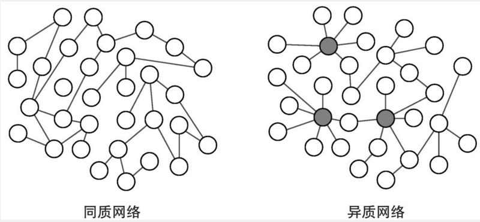
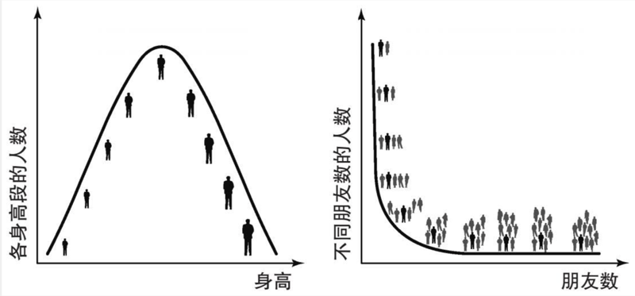

# 0501. Superconnectors

超级连接器

## 5.1 Hubs

In his memorable experiments on the ‘six degrees of separation’, Stanley Milgram made an observation that was going to be fully understood only much later. In one of his experiments, the US psychologist asked random citizens of Nebraska to forward a letter to a stockbroker in Massachusetts. If they did not know the recipient, they should send the letter to somebody that they believed to be closer to him. Beyond the fact that a large part of the letters arrived in an average of just six steps, Milgram observed that a quarter of them were delivered to the recipient from the very same source: a c steps away (friends of friendse ok2lothing merchant and friend of the stockbroker, whom Milgram calls Mr Jacobs. This result was quite mysterious: how was it that so many paths leading to the stockbroker passed through this person?

Frequent air travellers are familiar with a very similar phenomenon. Airports like Heathrow, Frankfurt or JFK in New York are well known to globetrotters: whatever the destination, it is quite likely that flights stop over at those airports. Airline magazines often carry a map of the world, crossed by long lines that show their routes: many of them end up at or pass through places like London, Frankfurt or New York. Airports like these are called hubs and carry a large portion of the overall traffic.

It’s easy to argue that the role of Mr Jacobs in the social network is the same as the big airports in the air traffic network. Probably, Jacobs was a social relations hub: his many contacts connected him to several people, so it was natural that many letters passed through his hands.

Another striking observation made by Milgram is that a large part of the remaining letters arrived from just two other people: Mr Jones and Mr Brown. Using the air traffic metaphor, these two people were most probably ‘average-size airports’ (like Madrid or Milan) of the social network. The remaining letters, that didn’t came from Jacobs, Jones, or Brown, passed through smaller ‘airports’ (like Girona or Olbia) of the social network.

The presence of these hubs is not specific to the stockbroker’s social network, or to the airport network. Many other systems, when represented as graphs, show similar highly connected vertices, or superconnectors. In many networks, one can see a ‘winner takes all’ tendency: a few nodes attract the majority of connections, and the large remainder of nodes have to share the remaining links. A modern analysis has shown that Mozart’s Don Giovanni (who seduced 2,065 women, according to Da Ponte’s libretto: ‘… 640 in Italy, 231 in Germany, 100 in France, 91 in Turkey, but in Spain they are already 1,003 …’) was not an exaggeration: the most connected individuals in sexual interaction networks can reach thousands of intercourses. In some datasets, some of these are people involved in the sex trade. Naturally, these highly connected individuals are those most needing protection against sexually transmitted diseases. Another example of superconnector was found early after the September 11 terrorist attack on New York: management consultant Valdis Krebs drew a simple map of the social networks of the terrorists and found that Mohammad Atta, one of the leaders of the conspiracy, was the most connected node, that is, a hub. In scientific collaboration networks, one can also find key figures that cooperate with a large number of colleagues: Paul Erd ő s was one of them.

Superconnectors are present in many kinds of network, not only in social ones. Some routers in the Internet have thousands of connections: that is, thousands more than the average router, which has just a few links. Meet-me rooms are large facilities — usually buildings full of cables — where hundreds of Internet Service Providers can link to each other: the failure of one of these facilities can leave entire areas as (as large as a state) without Internet connection. Websites of large newspapers attract an enormous number of links from other websites, blogs, and social networks. In foodwebs, top species predate a large quantity of other species. Finally in words’ networks, the hubs are the ambiguous or polysemic words: such as ‘arms’, which in English refers both to bodily extremities and weapons, and he quantity of trianglessH5Athus connects to a larger semantic or synonym field.

Hubs are also present in the networks inside the cell. In the genetic regulatory network, a single gene can control the expression of a large portion of the rest of the genome: in one bacterium (the Caulobacter crescentus), one single regulatory factor (the CtrA) controls 26 per cent of the cell cycle-regulated genes. The p53 molecule is a superconnector of the protein interaction network: the gene associated to this protein is a powerful tumor suppressor, and it is mutated in a large range of tumors. A clear hub of the metabolic network is the Atp molecule (adenosine triphosphate): this plays the role of energy carrier for a large number of biochemical reactions.

枢纽

在其令人印象深刻的「六度分隔理论」诸实验中，斯坦利·米尔格拉姆做了项很久之后人们才能充分理解的观察。其中ー个突验里，美国心理学家请一些随机挑选的内布拉斯加州公民转发一封信至马萨诸塞州的某股票经纪人。如果他们不认识收件人，就把信件寄送至那些他们认为与该经纪人更为接近的人。除了大部分信件平均仅用 6 步便抵达收件人处这一事实之外，米尔格拉姆还观察到，1/4 的信件经由同一个源头传递至收件人，即该股票经纪人的服装商朋友，米尔格拉姆称之为雅各布先生。这一结果令人相当费解：为何如此之多指向该股票经纪人的关系路径都要经过这位先生？

经常坐飞机的人对类似现象都很熟悉。希思罗、法兰克福或纽约肯尼迪等机场对于环球旅行者而言都耳熟能详：无论目的地是何处，飞机都很可能会停靠这些机场。航空杂志常常附有世界地图，纵横交错的长线标出飞行路线：其中许多航线都会途经伦敦、法兰克福以及纽约等地，或将其作为终点。像这样的机场被称为枢纽，它们承载了整个航空交通的大部分运力。我们很容易得出，雅各布先生在社交网络中的位置与这些大型机场在空中交通中的地位相同。很可能，雅各布就是一个社交关系枢纽：他的许多联系人将其与其他一些人相互连接，所以很自然地，许多信件都要经他发出。

米尔格拉姆另一个引人注目的观察是，剩余大部分信件经由另外两人寄达：琼斯先生和布朗先生。借用空中交通这个比喻，这两人最可能是社交网络中「一般规模的机场」（如马德里或米兰等机场）。而剩余那些并非来自雅各布、琼斯或布朗的信件则途经社交网络中的较小「机场」（如吉罗纳或奥尔比亚等机场）。

这些枢的存在并不局限于该股票经纪人的社交网络或者机场网络。在许多其他系统以图表示后，其中也能看到类似的高度连接顶点或超级连接器。在许多网络中，人们都能看到「胜者通吃」的趋势：少数几个节点能吸引大多数连接，而余下的大部分节点将不得不共享剩余连接。现代分析表明，莫扎特创作的唐·乔万尼（此人引诱了 2065 名女性，根据达蓬特的剧本在意大利 640 名，徳国 231 名，法国 100 名，土耳其 91 名，而西班牙境内已达 1003 名。）这一人物并非夸张：在性行为网络中与他人连接最多的个人的性行为可达数次。在一些数据集中，此类人中的一部分涉及性交易。自然地，这些与他人高度关联的个体最需要预防性传播疾病的感染。「9·11」恐怖袭击在约发生后不久，人们发现了超级连接器的又一例证：管理顾问瓦尔迪斯·克雷布斯画出了恐怖分子的社交网络简图，他发现这场阴谋的领导者之一穆罕默德·阿塔是连接最多的节点，即此人为该社交网络的枢纽。在科学合作网络中，我们也能发现那些与大量同行合作的关键人物：保罗·埃尔徳什便是其中之一。

除了社交网络，超级连接器还存在于各种各样的网络中。互联网中的某些路由器具有数干条连接：这比一般的路由器多出几千条，后者仅有少数几条连接。汇接机房乃大型设施 一一 通常为装满电缆的建筑物 一一 数百个互联网服务商可经由它彼此连接：这些设施只要有一处出现故障就能导致整个区域（大到一个国家）失去网络连接。大型报纸的网站吸引了大量来自其他网站、博客和社交网络的链接。而在食物网中，位于顶端的物种捕食其他大量物种。最后，语词网络中的枢则为模棱两可或多义的语词：比如 arms，它在英语中既指身体四肢也指武器，因而与更大的语义场或同义词域相连。

枢纽也存在于细胞内的网络中。在基因调控网络里，单个基因可以控制大部分剩余基因组的表达：在某种细菌（新月柄杆菌）中，一个调节因子（CtrA 基因）便可控制 26% 的细胞周期调节基因。p53 分子是蛋白质相互作用网络的超级连接器：与该蛋白质相关的基因是强大的瘤抑制基因，它会在大量的肿瘤里发生突变。代谢网络的枢很明显是 ATP 分子（腺三磷酸）：它在大量的生物化学反应中起到能量載体的作用。

## 5.2 Giants, Dwarfs, and Networks

And there came out from the camp of the Philistines a champion named Goliath of Gath, whose height was six cubits and a span. […] He was armed with a coat of mail, and the weight of the coat was five thousand shekels of bronze […] The shaft of his spear was like a weaver’s beam, and his spear’s head weighed six hundred shekels of iron (1 Samuel 17 4:7)

According to the biblical book of Samuel, Israelites have to wait 40 days before someone dared to face somebody as imposing as Goliath: then enters David, a brave and reckless boy, who ends up defeating the enemy. This was not a common adversary: the ‘six cubits and a span’ height corresponds to about 3 metres, and the ‘five thousand shekels of bronze’ weight of his coat of mail would be between 60 and 90 kg, according to historians’ estimates.

The conversion of ancient measures into modern ones is not precise; moreover, the biblical narration is most probably symbolic. However, Goliath’s size is not completely unlikely. According to the Guinness Book of Records , the tallest person ever recorded, an American called Robert Wadlow, was 2.75 metres tall. Unlike Goliath, who has special armour and a spear suited to his size, the exceptionally tall are usually surrounded by objects too small for them: chairs are uncomfortable, ceilings are too low, and they need to wear specially tailored shoes and clothing.

The root of their problems is that body size is a homogeneous magnitude. People entering a cinema are of different sizes, but all the seats are identical: some people find them large, others small, but in general they are reasonably comfortable. Body size does not vary a lot from the average. Very tall (or very short) people are exceptionally rare, and the taller (or shorter) they are, the rarer. Almost everybody knows somebody about 1.90 metres tall, but few know a 2-metre tall person and almost nobody a 2.5-metre one. People are also homogeneous with respect to other features. For example, IQ tests yield results close to the average most of the times, and deviations — both upwards and downwards — are rare. Behaviours can be quite homogeneous, too. For example, drivers can be more or less reckless, but most of the time the speed measured on highways conforms quite closely to the average.

However, homogeneity is not always the rule. For example, the number of friends a person can have is extremely variable. Robert Wadlow was 'only' five times taller than the shortest person ever, Chandra Bahadur Dangi, 55 cm tall, according to the Guinness Book of Records. By contrast, the friendliest people (the hubs of social networks) can have tens or hundreds of friends more than the extremely one, who interact with very few individuals. If contacts in virtual social networks are taken as a proxy of the number of friends a person has, then the hubs of these networks have hundreds more friends than the less connected people. While height is a homogeneous magnitude, the number of social connection is a heterogeneous one.

If the height of people reflected the number of their social connections, somebody as tall as Wadlow would not enter any record book. There would be people hundreds of times taller than the shorter ones: ‘social giants’ more than 2 km tall would walk the streets. Even more interestingly, these giants would not be astounding exceptions in a generally short population. All the intermediate heights between dwarf and giant would be represented by some individuals: naturally, the greater the height, the fewer the people of that height; however, the number of tall people in this imaginary world would not diminish as quickly in terms of height as in the real world. In other words, the taller, the rarer: but not as rare as in the real world.

The business of seat manufacturers would be much more difficult in this world, because there would be no way to build a seat that would fit every body size. In the real world, if we want to manufacture seats, or analyse IQ tests, or predict the duration of a road trip, we take into account average height, IQ, or speed. But in order to understand social relations, the very concept of average may be useless. Body size, IQ, road speed, and other magnitudes have a characteristic scale : that is, an average value that in the large majority of cases is a rough predictor of the actual value that one will find. In contrast, social relations do not have this scale. If you knock on the door of an unknown neighbour, you expect to see a person whose height is within a certain reasonable range, and most of the time your guess will be accurate. But it is almost impossible to guess in advance whether that person has many or few friends, and how many. The average number of relationships in a town just gives an idea about whether the social network of that place is more or less dense. But it does not allow us to make any reasonable prediction about each single person. A system with this feature is said to be scale-free or scale-invariant , in the sense that it does not have a characteristic scale. This can be rephrased by saying that the individual fluctuations with respect to the average are too large for us to make a correct prediction.

巨人、侏儒和网络

从非利士营中出来一个讨战的名叫歌利亚的特人，身高六零一虎ロ。…..头戴盔，身穿铠甲，甲重五千客勒......铜戟枪杆粗如织布的机轴，铁枪头重六百客勒。

——《撒母耳记上》，17：4-7

根据《圣经》的《撤母耳记》，以色列人必须等待 40 天才有人敢于面对歌利亚那般强壮的人：随后大卫这个勇敢无畏的男孩进来了，他最终击败敌人。歌利亚并非寻常敌人「六肘零一虎ロ」的身高相当于大约 3 米高，而根据历史学家的推测，他身上「五千舍客勒」的铠甲也重达 60-90 公斤。

古代计量换算为现代计量时并不是很精确；而且，《圣经》的记述很可能是象征性的。然而，歌利亚的身高不是完全没有可能。根据《吉尼斯世界纪录》，有记录的最高者为一个名叫罗伯特·瓦德洛的美国人，此人身高 2.75 米。与歌利亚有着特制的盔甲和适合其身高的矛不同，特别高的人周围的物体与之相比都太过短小：椅子不舒服，天花板太低，他们还需要穿特制的鞋子和衣服。

他们的问题根源在于，身体尺寸是一种「同质」量值。进入电影院的人有着不同的身高，但所有的座椅都一样：有些人觉得椅子大了，其他人觉得小了，但一般而言，他们都觉得还算舒服。身体尺寸不会偏离平均尺寸太多。很高（或很矮）的人非常罕见，越高（或越矮）的人则越少见。几乎每个人都认识 1.9 米高的人，但仅有少数人认识 2 米高的人，而几乎没有人认识身高 2.5 米的人。人们在其他一些特征上也具有同质量值。例如，人们的智商测试结果多数时候接近平均水平，而偏差 一一 无论往上还是向下ー则较为罕见。人们的行为方式也十分同质化。比如，司机可能多少都有些莽撞，但经测量多数时候他们在高速公路上的行驶速度都非常接近平均水平。

然而，同质性并非金科玉律。例如，一个人的朋友数量是极度多变的。根据《吉尼斯世界纪录》，瓦德洛的身高仅是最矮的人的五倍，后者名为钱德拉·巴哈杜尔·唐吉，身高 55 厘米。相比之下，最友好的人（即社交网络中的枢）所交的朋友数比那些仅与很少人交往的极度害羞之人要多出数十上百个。如果将虚拟社交网络中的联系人也算入一个人的朋友之中，那么这些网络的枢纽人物会比那些不善交往的人多出数百个朋友。人们的身高属于「同质」量值，但社交关系的数量却是「异质」的。

1-2『同质对应于正态分布（身高），异质对应于幕律分布（社交数量）。这里的异质引出了「无标度」的概念，即系统不具备特征尺度。无标度做一张术语卡片。（2021-02-16）』——已完成

如果人的身高反映了他们社交关系的数量，那么，像瓦德洛这么高的人不会进入任何世界纪录。社交关系中会有比矮子高出几百倍的人：身高超过两公里的「社交巨人」会行走在社交之路上。更有趣的是，这些巨人在普遍矮小的人群中并不会是惊人的。例外。侏儒和巨人之间的所有中间高度将由另一些人代表：自然，高度越高，人数越少；然而，这个想象世界里的高个子数量不会像在现实世界中那样迅速少。换句话说，越高越少，但也不至于像在现实世界中那般稀有。

在这个想象世界中，座椅制造商的业务难度会增大许多，因为没法制造一个适合每个人身体尺寸的座位。而在现实世界里，如果想制造座椅、分析智商测试或预测自驾旅程的时长，我们会考虑平均身高、智商或行车速度。但为了理解社会关系，平均的概念就显得无用了。身体尺寸、智商、行车速度以及其他量值都具备特征尺度，即大多数情况下的平均值都是对我们所发现的实际值的大致预测。相比之下，社交关系并不具备这种尺度。如果去敲一个陌生邻居的门，你预计看见之人的身高会在一个合理的范围之内，而你的猜测多数时候是准确的。但我们几乎不可能提前猜测此人朋友数量的多寡以及具体数字。某个城镇的平均人际关系数量仅能让我们了解该地区社交网络的密程度。但我们无法据此对每个个人做出任何合理的预测。具备这种特征的系统被认为是无标度或标度不变的，意为该系统并不具备特征尺度。这句话还可以这样表述，相较于平均值，个体波动太大，以至于我们无法做出正确的预测。

## 5.3 Fat Tails

In general, a network with heterogeneous connectivity has a set of clear hubs. When a graph is small, it is easy to find whether its connectivity is homogeneous or heterogeneous (Figure 8). In the first case, all the nodes have more or less the same connectivity, while in the latter it is easy to spot a few hubs. But when the network to be studied is very big (like the Internet, the Web, metabolic networks, and many others) things are not so easy. Fortunately, mathematics provides a way to find whether a magnitude is heterogeneous or homogeneous.

8 A homogeneous network (left), where all nodes have more or less the same degree, compared with a heterogeneous one (right), where highly connected nodes (hubs) are present

Let us start with a homogeneous magnitude, such as people’s height. In order to study the height of the students of a class, one can do as follows. First, make a row with those 1.50 to 1.55 metres tall: there will be a few of them. Then, make a parallel row with those 1.55 to 1.60: there will be some more and the row will be a little longer. Fo$ve of thellow those with 1.60 to 1.65: more people will be in that row. Increasing by 5 centimetres in every row (Figure 9 left). At the end, the profile of the rows will have the shape of a bell curve : the number of students increases as height increases, then reaches the top around the average, and then starts to fall. The very tall and the very short are rare and the majority are in the middle. This curve provides the distribution of heights of the students.

Now, let us consider the number of social contacts of those same students. Now the rows correspond to those with 0 to 20 friends, 20 to 40, 40 to 60, and so on. The outcome of this procedure provides the distribution of the connectivity of the nodes of the social network, that is, the degree distribution of the graph. The resulting picture is very different from the case of heights (Figure 9 right). First of all, there will be many more rows, since there will be people with hundreds or thousands of friends. The majority of people will have some tens of contacts per person, but the resulting distribution will have a ‘fat tail’. In other words, the distribution will be very skewed to the right, with a long or ‘heavy tail’. Mathematically speaking, the shape of the degree distribution is well described by a curve called power law.

9 Height is a homogeneous magnitude, distributed according to a bell curve (left), while the number of friends is a heterogeneous magnitude, distributed according to a power law (right)

In homogeneous networks, the degree distribution is a bell curve, similar to that of height, while in heterogeneous networks, it is a power law, similar to that of friendships. The power law implies that there are many more hubs (and much more connected) in heterogeneous networks than in homogeneous ones. Moreover, hubs are not isolated exceptions: there is a full hierarchy of nodes, each of them being a hub compared with the less connected ones. Take once again the comparison of height and friendships. Probably there are several million people in the world who are 1.50 metres tall; however, if we double that height (3.00 metres), the number of people this tall is much smaller, most probably zero. On the other hand, tens of millions of people have, say, 20 friends in their social network. If we double that number (40 friends), there will be fewer (say a quarter of those with 20), but still millions. We can double the number many times, and the number will be reduced by about a quarter at every step (the actual rate of reduction depends on the slope of the power law). This explains, for example, the role of Mr Jones and Mr Brown in Milgram’s experiment: while Jacobs is the largest hub of the stockbroker’s social network, Jones and Brown are smaller hubs, but still well connected.

Looking at the degree distribution is the best way to check if a network is heterogeneous or not: if the distribution is fat tailed, then the network will have hubs and heterogeneity. A mathematically perfect power law is never found, because this would imply the existence of hubs with an infinite number of connections. However, no real network is infinitely big: this is why the fat tail of the degree distribution always has a cut-off at a maximum value for the degree. Indeed, the size of hubs can be limited by various costs of accumulating connections: for example, neurons cannot accumulate an arbitrary amount of connections, because of their physical and now represents a wide variety of topics in history, philosophy, religion, science, and the humanities. The VSI ve of the structure. In professional collaboration networks, time plays a role: connections cannot be accumulated indefinitely, because at a certain moment the career (or life) of an individual comes to an end. All these and other factors are reflected in the shape of the degree distribution. Nonetheless, a strongly skewed, fat-tailed distribution is a clear signal of heterogeneity, even if it is never a perfect power law.

One has to be careful in interpreting what hubs and fat tails mean. For example, some anthropologists believe that a magnitude called Dunbar number limits the number of social relations. According to this hypothesis the number of stable social bonds cannot increase much above 150. Anthropologist Robin Dunbar put forward this hypothesis in 1992 after finding evidence that the size of a part of the brain’s cortex of primates and humans may be related to that of their social groups. If this is true, what is the explanation of the hubs with thousands of connections found in many social networks? Some scientists think that they are instances of the pizza delivery guy problem. A pizza delivery guy receives many phone calls on his mobile, but just a tiny fraction of them come from real friends; the rest are clients. According to this concept, the majority of the links represented in the fat tail of the distribution would be fictitious in social networks. However, this depends on exactly what problem one wants to study. For example, if the pizza delivery guy catches flu, epidemiologists only care about how many people (friends or not) have been in contact with him.

On the other hand, not all networks are necessarily heterogeneous. While the small-world property is something intrinsic to networked structures, hubs are not present in all kind of networks. For example, power grids usually have very few of them. The same holds for some foodwebs, the neuronal network of the C. elegans , and the World Trade Web.

Finally, an interesting case is found in some directed networks, as in the case of, most genetic regulatory networks. If gene A regulates gene B, an arrow is drawn from A to B, but not necessarily from B to A. The out-degree distribution (that is, the distribution of the number of outcoming arrows) is usually fat tailed: that is, a few genes regulate large portions of the genome. However, the in-degree distribution (that of the number of incoming arrows) is much more homogeneous: just a few other genes regulate a single one. Heterogeneity is widespread in many networks, but when we approach an unknown system we must not take it for granted until we have checked it.

肥尾效应

一般而言，具备异质连接性的网络都会有一组清晰的中心。当图很小时，我们很容易发现其内部连接是同质还是异质的（图 8）。在第一种情況下，所有节点多少具备相同的连接性，而在后者中则很容易发现少量枢纽节点。但是，当被研究的网络非常大（如互联网、万维网、代谢网络以及许多其他网络）时，事情就没那么简单了。幸运的是，数学提供了一种方法来确定一种量值是同质还是异质。

图 8 与存在高度连接节点（枢纽节点）的异质网络（右）相比，同质网络（左）中所有节点的度数大致相同

1-2『判断同质还是异质的数学方法：同质网络中所有节点的「度数」大致相同。另外一种表述形式：同质的数据符合正态分布模型，异质的数据符合幕律分布模型。做一张主题卡片。（2021-02-16）』——已完成

我们以同质量值为起点，比如人的身高。为了研究某班学生的身高，我们可以按照以下方法操作。首先，让那些身高在 1.50 到 1.55 米之间的学生排成一列：他们可能人数不多。然后，让那些身高在 1.55 到 1.60 米之间的学生平行地排成一列：这些人的数量会多些，队伍也会长些。接下来的一列为 1.60 到 1.65 米的学生：更多的人会出现在这一列。然后，每一列身高增加 5 厘米（图 9 左）。最后，这些列的轮廓将构成钟形曲线的形状：

学生的数量随着身高的增加而增加，然后在平均值附近达到峰值，接着开始下降。很高和很矮的学生都较少，大部分处于中间范围。这条曲线提供了学生的身高分布。

图 9 人们的身高为同质量值，钟形线分有（左），而人们的朋友数量则为异质量值，呈律分布（右）

现在，我们来考虑这些学生的社交关系数量。这时，每一列分别对应 0 到 20 个朋友，20 到 40 个朋友，40 到 60 个朋友，以此类推。该过程的结果提供了社交网络节点的连接性分布，即图的度数分布。这个结果图与身高图的情况十分不同（图 9 右）。首先，图中的列会更多，因为有的人的朋友数量会成百上千。多数人的联系人为几十个，但由此产生的分布将具有「肥尾效应」。换言之，分布图的长尾或者说是「厚尾」将明显向右偏斜。从数学角度讲，度数分布的形状可通过幂律得到很好的描述。

在同质网络中，度数分布是类似于前述学生身高的钟形曲线，而在异质网络里，度数分布则遵循幂律，类似于朋友数量的分布图。幂律意昧着异质网络中存在着比同质网络更多的枢组节点（以及更多的连接数）。此外，枢节点并不是单独的例外：与连接数较少的网络相比，连接数较多的网络中有着完整的节点层级结构，每个节点都构成了一个枢纽。

再拿身高和朋友数量来说。世界上身高 1.50 米的人可能有数百万；然而，如果我们将这一高度翻倍（3 米），如此高度的人则少得多，很可能没有。另一方面，数干万人在其社交网络中有比如说 20 位朋友。如果我们将这个数字加倍（40 位朋友）拥有这个朋友数的人数则会少些（比如比加倍之前人数减少了 1/4）, 但仍有数百万。我们可将这个数字多次加倍，而对应的人数则每次减少约 1/4（实际少的速度取決于幂律的斜率）。这便解释了比如琼斯先生和布朗先生在米尔格拉姆实验中的作用：虽然雅各布是股票经纪人社交网络中的最大枢纽而琼斯和布朗是更小的枢纽，但与他们联系的人依然很多。

查看度数分布是检查网络是否为异质结构的最佳方法：如果度数分布呈肥尾，则该网络将有多个枢纽且为异质结构。人们从未发现某种数学上完美的幂律，因为这将意味着存在拥有无限连接数的枢纽。然而，不存在无限大的真实网络：这就是为何度数分布的肥尾总有一个度数最大值上限的原因。实际上，枢纽的大小会受到连接累积的各种成本的限制：例如，由于神经元的物理结构，神经元无法累积任意数量的连接。在专业协作网络中，时间起着某种作用：连接数无法无限累积，因为个体的事业（或生命）会在某个时刻终结。所有这些和其他因素都反映在度数分布的形状上。尽管如此，严重偏斜的肥尾状度数分布仍是异质网络的清楚信号，即便它从来都不是一个完美的幂律。

在解释枢纽和肥尾的含义时必须小心谨慎。例如，一些人类学家认为，一种叫邓巴数字的量值限制了人们的社交关系数量。根据这一假设，稳定的社交关系数量不能超过 150 这个数字太多。人类学家罗宾·邓巴在发现灵长类动物和人类的大脑皮质某部分的大小可能与它们的社会群组规模相关的证据之后，于 1992 年提出这一假设。如果这一假设为真，那又如何解释人们在许多社交网络中发现的有着上干联系人的社交枢纽呢？

一些科学家认为，这便是「披萨送货员问题」的实例。披萨送货员在自己的手机上会接到许多电话，但只有极少的一部分来自其真正的朋友；其余则为客户。根据这种想法，呈现在社交网络度数分布图肥尾处的多数连接都是泛泛之交。然而，这还得看人们究竟想研究什么问题。例如，如果披萨送货员得了流感，流行病学家只会关心有多少人（不管是不是朋友）曾与他有过接触。

另一方面，并非所有网络都是异质结构。尽管小世界属性是网络结构所固有的，但不是所有的网络中都会出现枢纽。例如，电网通常就仅有少量枢纽。还有一些食物网、线虫的神经网络以及世界贸易网络等都很少有枢纽存在。

最后，人们在一些有向网络中发现了一个有趣的情況，正如在多数基因调控网络中发现的那样。如果基因 A 调控基因 B，则箭头从 A 指向 B，但 B 不是一定要指向 A。出度分布（即朝外箭头数的分布）通常是肥尾状：少数基因调控大部分基因组。然而，入度分布（即朝内箭头数的分布）则均匀得多：少数其他基因调控某个基因。异质性在许多网络中都广泛存在，但当我们处理未知系统时，在检验之前我们不要理所当然地认为它就是异质网络。

## 5.4 The Signature of self-organization

Heterogeneity and the lack of characteristic scale may very well be a sign of disorder. One could reason as follows. Many networks (like the Internet or social networks) have grown without any blueprint or supervision. As a consequence, every node in the network follows its own criteria and performs completely different and uncoordinated behaviours. These are so disordered that they can be easily assimilated to an overall random process. As a consequence, random graphs should be good models for these networks. This line of reasoning seems to work, but some problems appear after deeper inspection. The most noticeable is that random networks are not heterogeneous at all. On the contrary, their degree distribution is bell shaped, suggesting that all nodes have more or less the same degree. The process of connecting pairs at random is such that every node ends up with more or less the same degree. More precisely, the degree has a characteristic scale, with small fluctuations around the average. In contrast with many real-world networks, hubs are not present in random networks.

A consequence of this is that, while random networks are small worlds, heterogeneous ones are ultra-small worlds. That is, the distance between their vertices is relatively smaller than in their random counterparts. If one takes a random network and adds a certain number of hubs to it (thus making it more heterogeneous), then the distance becomes smaller. Conversely, if one takes a heterogeneous network and randomizes it (that is, builds a network with the same number of nodes and edges, but with edges distributed at random), then hubs disappear, and the average distance becomes larger. This shows that hubs are responsible for the majority of the connectivity of these networks: a large portion of the connections arise precisely from this small number of superconnected nodes.

More importantly, the fact that random networks are homogeneous means that the equivalence between heterogeneity and disorder is flawed. A disordered process such as the one described by random networks does not yield the heterogeneous connectivity found in many real-world networks. On the contrary, heterogeneity may arise from the exact opposite: that is, from some kind of regular, ordered behaviour.

This is rather puzzling, since many networks are not the result of a blueprint, nor do they evolve under tight top-down supervision. Few networks, like the electrical or road ones, are controlled by political and technical authorities, but most of them are unsupervised. The Internet, for example, is controlled by network administrators at the local level, and is also constrained by technical, economic, and geographic features. However, its large-scale structure is largely unplanned: the Internet is very similar to a global-scale experiment, where nobody draws the overall structure, which is the result of the actions of innumerable agents. Biological networks are an even clearer example: there is no designer, only the tinkering effects of evolution. With respect to social networks, politics, money, religion, language, and culture influence the relations between individuals, but when spaces of fre number of cou

自组织的标志

异质性和特征尺度的缺乏可能是无序的极好标志。推论如下。许多网络（比如互联网或社交网络）是在没有任何蓝图或监督的情况下成长起来的。因此，网络中的每个节点都遵循其自身的标准，并表现出彼此完全不同和不协调的行为。这些节点十分混乱，以至于它们很容易就被某种总体无序的过程所同化。因此，随机图应该成为这些网络的良好模型。这种推理似乎有效，但若深入检验，一些问题便出现了。最明显的是，随机网络根本不是异质结构。相反，它们的度数分布为钟形结构，这表明所有节点都有着大致相同的度数。随机关联节点的过程便是如此，即每个节点最终都有着同样的度数。更确切地说，度数具有特征尺度，且在平均值附近小幅波动。与许多真实的网络相比，随机网络中不存在枢纽节点。

其结果是，随机网络为小世界，而异质网络则是超小世界。也就是说，异质网络顶点间的距离小于其随机对照网络中的相应距离。如果人们在一个随机网络中加入一定数量的枢纽节点（因而使其更具异质结构），则节点之间的距离会变小。相反，如果人们将一个异质网络随机化（即用相同数量的点和边建构一个网络，但让边随机分布），枢节点便会消失，节点之间的平均距离也会変大。这表明枢组节点承担了这些网络中的大多数连接：这些连接中的大部分正是从这些少数的超级连接点中产生的。

更重要的是，随机网络为同质结构这一事实意着异质并不完全等同于无序。如前述随机网络那般的无序过程并不会产生那些在现实网络中所发现的异质连接。相反，异质性可能恰恰来自其对立面，即来自某种规则的有序行为。

1『异质对应于（意味）有序。大赞。（2021-02-16）』

这一点十分令人困惑，因为许多网络都不是设计的结果，也并非是在自上而下的严格监管中发展起来的。像电网或道路网络等少数网络由政治和技术权威控制，但大多数网络则无人监管。例如，互联网由地方一级的网络管理员控制，并且也受到技术、经济和地理特征的限制。然而，其大规模的结构在很大程度上则是未经筹划的：互联网非常类似于一项全球规模的实验，其中没人提出整体结构，而是靠无数代理人的行动将其建立。生物网络是一个更为清晰的例子：它没有设计者，仅有进化提供修补效果。社交网络、政治、金钱、宗教、语言和文化都会对个人之间的关系产生影响，但是当个人关系存在自由空间的时候，这些网络的形成便不再是严格规划的。在所有这些情况下，系统的整体组织产生于其组成部分的集体行为，即某种自下而上的自组织过程。这个过程可以解释为何许多网络即便没有规划，却仍然显示出异质性这样明显的有序标志。

异质性并非网络系统所独有。例如，地震强度便有肥尾状的分布特征，而如果人们绘制出地震频率与其强度的对比图，它便会呈现出很好的幂律分布。「平均强度的地震」并不存在，其中有很大的多性，从无法察觉的震动到大规模的灾难。另一个例子是城市的规模；其范围从中国最大的大都会到托斯卡纳的小镇不等。还有就是收入分配：20 世纪初，经济学家维尔弗雷多·帕累托指出意大利 80% 的土地掌握在 20% 的人手中。所有经济体中都存在不同程度的此种不均衡。

所有这些例子与网络共有一个基本特征：它们都是复杂且大体上无监管进程的结果。异质性并不等同于随机性。相反，异质性可能成为某种隐藏有序结构的标志，它并非某种自上而下的计划，而是由系统的所有元素共同作用而产生。这个特征在大范围不同网络中的出现表明，在许多这种网络中，可能有着某种共同的底层机制在起作用。了解这种自组织秩序的起源则是网络科学面临的核心挑战之一。