# 0301. AI 炼金术：数据产生价值

这正是历史知识的矛盾。知识如果不能改变行为，就没有用处。但知识一旦改变了行为，本身就立刻失去意义。我们拥有越多数据，对历史了解越深入，历史的轨迹就改变得越快，我们的知识也过时得越快。

—《未来简史》—

方法论是以解决问题为目标的体系或系统。在方法论的指导下我们会有一个纵观全局的广阔视野，有一套统筹全局的落地方法。缺乏方法论的指导，不论多么充满智慧的思维都难逃纸上空谈的结局。AI 思维就是从理论到实践的一套完整的思维，它既有理论层面关于人工智能的认识，也有实践层面指导人工智能落地的方法论。本章旨在讲清楚 AI 思维中的「术」，也就是从方法论的角度阐述 AI 思维是如何从数据中得出决策，创造出源源不断的价值的。数据量越发庞大，以术理事，AI 炼金术可理清纷繁复杂的数据；新问题层出不穷，以术驭事，AI 炼金术可将数据为我所用，优化业务结果；面临抉择犹豫不决，以术成事，AI 炼金术可通过深度学习等人工智能模型驱动决策。接下来就让我们了解一下，AI 炼金术到底是如何从数据中创造出价值的。

## 3.1 从数据到价值的历程

在人工智能的整个生态系统中，数据既是根本，也是重点。在人类社会中，数据无处不在，而且生生不息，越来越多。我们每天的所看所感都可以转化为数据，这些数据就是各种行为和现象的记录。特别是在互联网如此发达的当下，我们能够接触和获取到的数据更为多维、多样而且庞杂。当然，这对于人工智能的运用来说，完全是一件好事，因为人工智能的运行离不开数据的支持。对于人工智能来说，数据更多，就相当于炼油厂运来了更多的原油，人工智能就能够更好地运作，为人类的生产、生活增添价值。人工智能通过数据驱动决策而产生的变现是我们能够真实看到的，比如优化提升的用户体验，实打实的业绩、利润，或者是口袋里不断飙升的年终奖。

关于数据的重要性，我们先从奈飞（Netflix）的案例说起。奈飞最出名的身份是世界最大的在线影片租赁服务商，但它同时也是美国的流媒体巨头，业务广泛，也涉足影视剧拍摄。奈飞想在好剧频出的美剧圈拍摄出一部像《权力的游戏》《生活大爆炸》《破产姐妹》这样的高人气剧集，于是它开始探索 —— 究竟该怎么做呢？据统计，奈飞在全世界的订阅用户总量达 3 300 万；每天，用户都会在奈飞的网站上产生 3 000 多万个行为，订阅用户会在网站上给出 400 多万个评分和 300 多万次搜索请求，询问剧集播放时间等。奈飞借助这些大数据进一步分析 —— 通过分析几千万用户的观影历史、观影题材内容、故事情节、演员选择以及对不同影视剧的评分等数据，决定拍摄一部有关一位参议员的连续剧，这部剧就是政治题材的人气美剧《纸牌屋》。该剧一经播出就获得了巨大成功，在美国及 40 多个国家和地区成为最热门的在线剧集之一。因为这次新鲜的尝试，奈飞前所未有地获得了 112 项艾美奖提名，也让美剧巨头 HBO（Home Box Office）电视网 18 年来第一次失去了剧集霸主的地位。

《纸牌屋》的惊人成就离不开奈飞数以亿万计的数据的支持。由此可见，数据是新时代商业取胜的重要因素。就像上面说的，奈飞通过对大量受众数据的分析，采取合理决策方案，最终获取了极大的效益和声誉。所以数据是 AI 思维的基础，要从数据产生价值，就要利用人工智能通过对数据的深度分析，引导决策者做出最优决策，从而落地价值。

如何把数据变为价值，主要涉及两个问题。第一个问题，什么样的数据在场景中有价值？无论是在电商行业、广告行业、教育行业，还是生产制造行业，企业的负责人都会不约而同地考虑他们要在网站或者设备、机器上收集什么样的数据。其实，只要是有效数据，都能为之所用，只不过要如何用或者用来做什么各不相同罢了。第二个问题是，如何通过人工智能让这些数据产生价值？这个问题已经得到了初步的解答：人工智能从诞生到现在已经经历了几十个年头，所以行业内已经有比较通用的模式应用人工智能，从而可以从数据中提取价值。

人工智能的应用并非只对行业的格局产生影响，实际上，它与我们的日常生活也息息相关。现代人每天奔波于公司与家的两点一线中，一旦有了节假日这样属于自己的时间，大部分人都会选择出门逛街看风景、到商场购物，或是看一场热映的电影，抛掉平日工作的紧张，让身心彻底放松。所以，我们都希望自己能够得到全方位的引导和服务，而不想再在这方面花费大量时间和精力了。但是，一般情况下，商家并不能很清楚地知道哪些顾客需要什么样的商品，所以尽管每天都有很多顾客路过店家门口，却并不能实现有效转化。另一方面，消费者难得有了一个放松休闲的机会，却因为没能够快速、准确地找到相关商品或者服务而影响了大好心情。为解决这些问题，人工智能就派上了用场：商家可以通过人工智能对顾客数据进行分析，预测顾客需求，根据需求定期向顾客推送商品或者服务的信息；用户接收到信息，也不必为自己在休息时去哪里、做什么这样的问题而绞尽脑汁，只需要放假时直接去商家店里选择自己心仪的商品和服务就可以了。最终的结果很大概率是产生了交易。换言之，人工智能为商业活动带来了实际价值。

从 AI 思维角度来说，人工智能可以从数据中提取价值，可只有数据是不够的，数据量还必须充足。如果没有对足够的数据进行分析，或者对数据的利用不够恰当，都可能导致决策失误。决策一旦失误，自然会影响到整个行为最终诉诸的回报，也就是我们所说的价值。

### 3.1.1 数据产生决策：为了懂你，我学了很多知识

有了充足的数据，就等于是为人工智能这个系统备足了原料，接下来我们就来看一下，AI 炼金术是如何从数据中挖掘出价值的。如图 3-1 所示，这整个过程包含了四个步骤。我们将通过全球知名的高端化妆品品牌兰蔻使用人工智能机器人促进销量的案例来进行仔细分析。

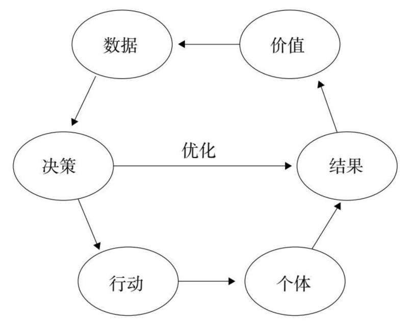

图 3-1 从数据产生价值的过程示意图

第一步，从数据产生决策。消费者千千万，每个人都有各自的喜好和适用款，所以他们的行为是多样的；而从人的单方面观感上又很难判断哪类人、多少人喜欢怎样的商品、怎样的服务，适合怎样的款式。为此，兰蔻引入人工智能机器人，并使其化身为兰蔻专柜导购中的一员。要使人工智能机器人胜任这个岗位需要做很多前期准备，其中最重要的两点是 —— 第一，熟记并灵活运用所有产品信息、卖点和美妆知识；第二，快速明确顾客需求，推荐给顾客真正需要的东西。

从具体场景来说，兰蔻专柜的大部分顾客是女性，但不同女性对化妆品、护肤品的需求千差万别。有的人注重爆款，有的人注重功效，有的人注重成分，甚至有人买化妆品只是为了试色。对于过往的真人导购来说，首先，他们必须了解每一种产品的功效、成分、适用人群等，才能很好地应对顾客的层层「拷问」。其次，导购还需要熟悉不同肤质、不同肤色、不同脸型的顾客适合的美妆产品，才能留住顾客的心。人工智能机器人导购员如何掌握这样的「读心术」呢？一方面，人工智能机器人通过与顾客进行对话交流，理解和预测出顾客的需求；另一方面，人工智能机器人还需要从多种来源的数据中挖掘获取美妆行业的知识，并通过分析整合，为用户进行精准的推荐与引导，让顾客享受到愉悦的购物体验。

### 3.1.2 决策到行动：为了提高顾客满意度，我使尽浑身解数

第二步，从决策到具体行动。从数据到决策的过程让我们知道了不同用户的需求，为具体行动提供了方向。具体行动是要深入到个体，根据目标用户的具体喜好来分析的。为了让用户的体验最优化，人工智能机器人做足了功课，不遗余力地提高顾客的满意度。在给顾客进行推介交流时，人工智能机器人可以像真人导购一样为大家进行对话式个性化推荐。

在对话的场景下，人工智能机器人可以通过三种方式向顾客进行推介。首先是要理解顾客的语言来分析对方需求，例如，对方说：「我这几天脸上皱纹有点多，皮肤也很干，有什么产品推荐吗？」人工智能机器人能够根据对这些语句的理解和分析，进行智能推荐：「试试具有滋润功效的小黑瓶！」其次，人工智能机器人可以通过人脸属性识别来了解用户需求。例如，有顾客问：「我这个年纪适合用什么呀？」人工智能机器人能够通过对该顾客面部的扫描识别，发现对方有皱纹、年龄偏大，并非常情感化地回复：「皱纹不可怕，推荐塑颜紧致系列哦！」最后，基于前期大量的知识学习和数据输入，人工智能机器人能够进行多元数据挖掘与推荐。比如，当有顾客表露：「我要一只鬼怪色口红送人。」人工智能机器人能够将这些信息与内置的数据库匹配，给出精准引导：「鬼怪色的色号是 290，超美，在口红区！」或者当顾客问道：「最近换季，有什么推荐呢？」人工智能机器人也能根据所学知识为顾客解忧：「试试水光润系列，深入补水还能抗氧化，非常火，广受好评哦！」有些顾客拿不准自己的偏好，可能会问：「我想买个眼霜，最近流行的哪种比较好呀？」此时，人工智能机器人会根据以往的消费者数据，提供合理的推荐：「今天已经有 19 个顾客小姐姐询问过小黑瓶大眼精华眼霜呢，要不要试试？」

无论是哪一类顾客、哪一种需求，人工智能机器人都能根据大量的数据基础，依靠人工智能进行分析，为顾客提供高质量的推荐。这样，在精准给到高质量信息的情况下，人工智能机器人提高了顾客的满意度。

### 3.1.3 个体产生结果：真是太能干了！

第三步，个体产生结果。在得到了这一系列的推荐后，顾客开始做出相应的行动。在此之前，兰蔻专柜的负责人曾表示：「有时候顾客太多，难免有照顾不周的地方，如何提升服务质量、给顾客最佳的体验，是我们一直思考的事情。」而当人工智能机器人加入后，迎送宾客、为顾客解答疑问、推荐化妆品、漫游行走寻找指定产品等工作都可以全权交给人工智能机器人去做，并且这样能给顾客带来趣味性、多样化的购物体验。在场受到人工智能机器人帮助的顾客都惊叹：「真是太能干了！」

更准确地来说，人工智能机器人在为导购人员提供更好的帮助的同时，也为顾客带来了更智能的服务，让他们拥有「上帝之感」，开启了顾客愉快的购物体验。在现场，有位女士问：「能帮我找一下大粉水吗？」「人工智能机器人带你去看看吧。」这位女士感叹：「万万没想到，接待自己的居然是一个机器人！」

以往人们去化妆品专卖店购物，进门不到三分钟就会有好几个美容导购员寸步不离地进行推销，即使有些人已经有了选购的目标，导购员依然会跟在身后不厌其烦地介绍。这些导购员的过度热情令人十分尴尬，也使得导购员这一角色备受争议。但是如今，导购机器人的出现解决了这类问题，同时也满足了顾客对咨询、引导的需要。

### 3.1.4 实现价值：人工智能服务于人类的一次探索

第四步，实现价值。说到价值，人工智能机器人的出现，满足了顾客的购物需求，给顾客带来了美好的休闲体验。这对于商家来说又意味着什么呢？或者说，商家从中获得了什么呢？这次兰蔻与人工智能机器人的跨界合作，是美妆与人工智能的一次探索。目前，人工智能已经落地多个行业，有效地辅助着人们的工作。有了「美妆知识 + 机器人」这样的人工智能解决方案，导购能够从基础的重复性劳动中解放出来，学习更多的专业知识和技巧，提升个人服务能力。这也就意味着，商家能够在减少许多人力成本的同时，更好地在导购层面提升质量。除此之外，人工智能机器人还可以基于人脸属性识别和顾客历史消费数据等，进行精准营销。比如，针对陌生的女性顾客优先推荐促销信息，或者为有商品咨询记录的顾客提供定制化的商品介绍、引导等购物服务。这样，给商家带来的最终的价值是，他们能够获取极高的顾客购买率。

人的认知有时候是一个很主观的过程，在化妆品领域更是如此。可能这几天周围的人都在讨论豆沙色的口红或者玫瑰香的粉底液，你就直观地认为他们一定喜欢这类化妆品，或者说全国、全世界范围内的顾客都会喜欢这个款式。但有时候人们的讨论焦点的触发动机并不是单一的，这些动机在日常的对话中并不能准确体现出来，那么这样的主观揣测就未免过于武断。有些顾客之所以买豆沙色的口红，是因为这款口红刚好是她喜欢的演员或者偶像代言的；有些顾客之所以买豆沙色的口红，是因为刚好有套衣服与之相配。这种阶段性的需求可能过段时间就不灵了。如果始终按照之前的需求为顾客推荐，就可能会出现顾客需要粉底液而为她推荐防晒霜的「错配」现象。在这一方面，人工智能可以精准地抓取顾客在方方面面留下的迹象进行组合判断，更全面、更精准、更客观地判断出你究竟对哪种化妆品里的哪种因素更「来电」。所以，我们要摒弃下意识的主观感受，恰如其分地挖掘、利用好数据。

这四步完成，实际上我们就走完了从数据到价值的一次旅程：人工智能机器人通过对大量数据进行学习，了解顾客的需求，定向合理地推荐一些符合受众品位的化妆产品。对于顾客来说，他们能够及时获取最符合自己兴趣和心意的产品，满足了自身愉悦购物的需求；对于商家而言，顾客对感兴趣产品的咨询和光顾次数，就直接影响了顾客的购买率。

这是一个从数据出发，到价值为止的过程。但一次业绩的提升并不是终点，人工智能还会把这一次的数据反馈到模型里，从而提升下一轮的决策质量，也就是说，数据和人工智能会持续地为我们带来价值。所以对于像兰蔻这样的商家和企业来说，运用人工智能其实就是了解顾客需求的过程，并能够有效地提升服务。

到这儿我们总结一下，AI 思维的核心竞争力是去平均化的能力。所谓的平均化思维，指的是无差别化，每个人、每个产品都同质化；而去平均化，则是肯定人与人、环境与环境的差异性，不同的人有不同的想法和喜好，根据这些差异化需求产出差异化体验。我们可以通过数据和人工智能准确理解每个人的潜在动机，从而最优化决策，达到各自理想的目标。如能合理使用，无疑将带来更高的生产力和更合理的资源利用方式，产生新的价值。AI 炼金术便能从数据中产生价值，同时它也是 AI 思维的具象表现形式。

通过人工智能决策来实现价值的源头是数据，所以，数据的广度和精确度决定了人工智能能够为人类做出多大的贡献。数据越多，越能更全面地反映个体的实际行为与想法，人工智能的预测就会越精准。如果赋予人类预测的能力的话，我想大多数人都会选择先预测一下自己的命运。所谓「知生死安天命」，随着人类身体数据的累积，人工智能对病人的死亡时间预测的准确率也有望更加精准。相关资料显示，科学家通过人工智能解读数据，利用 200 万份电子病历来进行人工智能深度神经网络的训练，全方位审查患者家族史、用药情况、各项体质指数、食物摄入等因素，进而能够预测机体的未来。目前，这一人工智能模型已经能够依据大量的数据提前 12 个月预测到患者的死亡时间，准确率达 90%。研究团队还将这一预测结果与英国国家统计署的死亡记录、英国癌症注册记录等数据库的死亡数据进行了比对，之后又将这套人工智能模型与两项标准的预测方法进行比较，结果显示，这一新模型的准确率比之前的预测方法高了 10.1%。

根据上面这些数据，科学家们不仅能够预测到很多原本无法定论的结果，而且还能了解到影响人生命期限的多种因素，从而使人们根据这些结果对自身生活习惯进行调整，达到延长生命的目的。例如，科学家在实验中对受试者的水果、蔬菜、肉类、奶酪、谷物、鱼类、酒精等食品摄入的量做了考查，找到最利于生命体健康的饮食摄入比例，在病人治疗期、康复期对其饮食结构进行调整，使其达到促进机体代谢健康的目的。这也是人工智能通过数据进行预测的价值所在。

新制度经济学的鼻祖、诺贝尔经济学奖获得者罗纳德·科斯曾说过：「如果你拷问数据到一定程度，它会坦白一切。」大数据包罗万象，能够将许多看似并不相关的事件联系在一起，使我们能够更加清晰明了地把握事物发展的趋势，跟上瞬息万变的社会潮流。谁掌握了大数据，谁就掌握了主动权，不仅能够决策世事，更能够成全自己。但数据就像一片汪洋大海，望不到边际，我们自己很难游上岸；这时就需要人工智能做舟 —— 长风破浪会有时，直挂云帆济沧海。

## 3.2 AI 如何做出决策

前面我们讲了从「数据」到「价值」的历程，大数据的出现使人工智能的决策更高效更聪明。数据加人工智能，为我们在决策时提供了无数个在以前无法实现甚至是无法想象的可能性。那么人工智能是如何一步步地将「数据」转化为「决策」的呢？如图 3-2 所示，从「数据」产生「决策」的具体过程是这样的：首先要通过对历史数据的特征处理产生特征数据，然后通过机器学习产生预测模型，之后需要通过模型评估来产生回测效果。在回测中检验合格的模型就可以投入生产，生产过程中如果有新的个体数据输入，就会通过生产模型得到预测分数，根据预测分数的高低和其他因素进行业务优化，产生针对个体数据的业务决策。模型本身也要受到监控，监控的目的是产生质量报告，来确保模型正常运行。这一整套框架被称为「人工智能决策引擎」，接下来我们将对它进行详细了解。

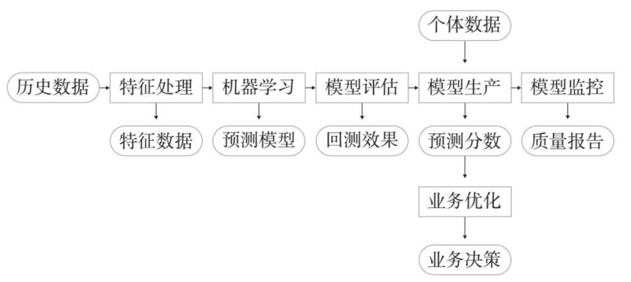

图 3-2 人工智能决策引擎示意图

### 3.2.1 数据和特征处理

毋庸置疑，数据是当下这个时代很重要的一种资产。我们经常提到的大数据有「3V」：1）Volume，即数据量，以往数据量少，以 MB、GB 为单位，但是随着互联网的发展，数据不断积累，现在数据量已经发展到了以 PB、EB、ZB 为单位表示；2）Variety，即多样性，根据数据的结构是否统一，将数据分为结构化数据、半结构化数据以及非结构化数据；3）Velocity，即速度，指的是数据的产生速度越来越快。

那么数据是如何产生的呢？首先，社会在发展、人类在生活，就会有源源不断的新数据涌现出来。无论是机器生产还是市场营销活动，都沉淀了越来越多的数据。其次，随着互联网的发展，知识的权威性不断下降，任何人都可以成为信息的发布者，数据就这样不断地积累，数量越来越多。最后，随着学科的不断发展，人们描述同一类型事物的角度越来越多，例如随着基因科学的发展，现在用来描述基因的指标维度非常多，比如说，每个人的 DNA（脱氧核糖核酸）分子是由约 30 亿个碱基对按精确的顺序排列而成的，一个碱基对就对应了一个维度，那么一个人的 DNA 分子就有几十亿个维度。像这样的例子其实还有很多，数据就这样不断积累到了一个非常庞大的数量。

通常，在各种各样的业务过程中形成的历史数据很杂乱，并且分散在不同的数据库和数据表里，不够系统化。为了更好地利用它们，我们需要把它们整合在一起，得到一套结构明确、条理清晰、便于理解的系统化数据。比如说现在需要处理一份在过去两年时间里形成的顾客在不同商家的消费行为数据，由于顾客消费行为的多变性以及商家的多样性，这份数据的数据量庞大且类型多样。而人工智能会对这些复杂的数据做特征处理，特征处理是通过对原始数据的处理和加工，将原始数据维度转换为特征数据的过程，特征是数据中所呈现出来的重要特性，通常是通过数据维度的计算、组合或转换得到的。经过特征处理，数据就被加工成了机器学习能够理解的数据形式。

过去，特征处理都是通过单台计算机进行，处理效率比较低。2005 年，由阿帕奇（Apache）基金会所开发的哈杜普（Hadoop）可以将多台计算机连接在一起形成计算机集群，提供分布式并行的特征处理和分析功能，实现对复杂数据的快速、可靠的计算。由于其技术的高效性，对特征处理能力的提高，特征处理变得越来越容易，所以特征处理的门槛越来越低。到 2008 年左右，越来越多的公司意识到大数据时代分布式并行计算的重要性，同样地，这也为人工智能处理大数据提供了完善的基础设施。但特征处理的过程通常也是枯燥而繁重的，看不到直接有用的结果。如果卡在这步，对企业来说，人工智能就无法落地。

### 3.2.2 机器学习和优化

做好了特征处理，下一步就是机器学习。机器学习，就是在特征上建立模型的过程，这里需要选择合适的预测模型，运用历史数据学习出模型。机器学习在各行各业都开始应用，例如在零售领域，通过发放优惠券来刺激老顾客、吸引新顾客是常用的营销手段，但是随机投放优惠券往往效果不明显，在某种程度上还会打扰到顾客，这样不仅造成了营销成本的浪费，还会降低品牌的声誉。为改善营销效果，一些零售商采用机器学习来进行营销。机器学习根据大量消费数据学习出预测模型，能够预测顾客是否需要某种类型的优惠券，以此来决定是否向该顾客投放优惠券。这样不但使真正需要的顾客享受到了优惠，还改善了商家自身的营销效果。

机器学习的过程，其实和人类通过经验总结生活规律再来指导我们之后的生活是相类似的。我们通过生活规律来指导的是以后遇到的事情，同样地，机器学习需要预测的也是将来。未雨绸缪，早为之所，商家可以根据机器预测提前做很多事情来促进顾客的消费，在最短的时间内抢占市场份额，扩大利润，也为自己争取更多时间，使自己更加灵活地应对一些突如其来的市场变化。如果一个人平时有吃零食的习惯，那他一定听说过良品铺子。从竞争激烈的零食行业中发展到现在会员数量达 7 400 万、2 000 多家线下门店以及覆盖多个外卖渠道，良品铺子的崛起离不开人工智能的帮助。零食品类所面向的消费群体是非常大的，但零食又是一个随意购买性的商品，也就是说平时你可能想不起来买零食，但是如果身边刚好有一个零食货架，你可能会很随意地拿几样薯片和可乐去结账。

为了抢占如此大的消费市场，推动自己的产品覆盖更多的场景，良品铺子开始借助人工智能来帮助提高自身的业务预测能力。人工智能的任务就是对良品铺子的各种历史数据进行学习，然后将其多个渠道的会员数据打通，在这些数据的基础上了解用户需求，也就是通过机器学习建立预测模型。这样的模型可以提前预测哪些用户购买零食的可能性大、哪些用户最喜欢购买哪几种零食，在此基础上为用户提供更加符合个人喜好的个性化推送；推送渠道也会根据用户最常使用的渠道来确定，真正实现以用户为中心的精准营销。除此之外，人工智能还可以为前端业务创新提供支持。譬如说，如果跟踪用户购买情况的数据，显示某段时间内用户的购买热情有所下降，商家就可以制定秒杀、拼团或者发放优惠券等活动来刺激用户购买力。

机器学习产生模型还能用来检测接吻场景。这个功能的发展源自斯坦福大学数据科学家阿米尔·齐亚（Amir Ziai）的奇思妙想，他想让人工智能学习什么是接吻，所以他从好莱坞电影数据库中挑选了 100 部经典电影中的代表性片段，按内容将不同的电影片段标记为接吻或者非接吻片段，并通过机器学习分析了这些片段，特别是观察电影片段中人物的嘴唇动作，然后配合场景和电影背景音乐，学习什么是接吻，形成了专门的接吻识别模型。一般而言，接吻是影片中的高潮节点，推动了整个故事的发展，这个模型可以将影片中的接吻片段标记出来，为做视频剪辑工作的人员提供精彩片段的筛选过程。与接吻模型属于同类型的微表情识别模型和动作识别模型现在也展开了应用，比如在 2019 年，日本开发出一种基于人工智能的偷窃预警系统 VaakEye，它经过 10 万小时的训练，能够识别出顾客是否将商品装入包中，或者是否出现可疑行为，并提醒超市工作人员注意防范。日本 50 多家便利店应用了 VaakEye，其盗窃行为识别的准确率高达 81%，将便利店的入店行窃损失减少了 77%。

模型建好之后，仍然需要详细的评估和验证。模型评估，也就是回测模型效果的过程。回测指的是用历史数据来验证建立的预测模型是否有效。预测模型，顾名思义，是用来预测未来的、目前尚未发生的事情。经过回测，评估合格的模型才有资格进入生产环节。这样做是因为只把模型构建完成是不够的，我们并不知道这个模型是否具有实践中的普适性，是否存在差错和不合理的地方，如果匆忙将模型投产，可能会为企业带来损失；片面地忽视回测结果，缺少后续推动，也会导致人工智能落地艰难。科学的回测既能保证人工智能为我们创造价值，又能为企业的每一个业务决策提供保障，避免损失。很多企业的领导不了解回测这种手段，也不重视过程，只关注最终的收益。事实上，他们忽略了科学的回测结果跟最终的经济结果之间本身就有着极强的相关性，是实践中非常重要的信号。通常，只要回测结果证明模型是合格的，最终的经济结果就很有可能令人满意。

只有模型评估合格，达到预期的效果以后，我们才能将它投入例行化生产，开始预测分数。比如说在一个借贷项目中，对许多参与者的信用程度进行预测，然后将预测的分数做个排序，通常来说，信用分数越高的用户获得贷款的可能性就越大。模型生产涉及大量工程化的工作，需要将软件开发工作系统化、模块化、规范化，从而保证高稳定性和可靠性，这个过程要在复杂的计算机和数据系统上进行，并与其他软件进行耦合，所以需要人工智能科学家和工程师紧密的配合。我见过一些大公司，人工智能科学家和工程师之间不能紧密配合，团队之间割裂，即便他们拥有一流的人工智能团队，人工智能也无法发挥价值。

下一步就是业务优化。业务优化，也就是从预测分数做出决策的过程。对个体行为准确的预测和把握，可以帮助行业决策者做出优秀的商业决策。在这个过程里，我们会通过优化整体的业务目标，比如说收益，把预测结果转化为具体的、可执行的业务决策。例如，Caliber Collison 是一家美国的汽车修理公司，离职率曾高达 40%。公司研究后发现，这一问题的部分原因在于其门店有时没有足够的车供员工修理，导致员工之间的工资差距较大。于是它开始从人力资源软件中提取出员工数据，建立定制的机器学习模型，预测员工是否会考虑离职。然后，Caliber 通过该模型对员工离职率的预测分数进行业务决策。例如，如果模型检测到一名员工的工资在几周内一直下降，那么他的预测分数就会相对高一些。为了尽量让员工留下来，Caliber 的地区经理就会多分配给他一些汽车去修理，让他的工资有所上升。相反，如果模型检测到一名员工很忙，虽然他的工资很高，但是他感到很疲惫，那么他离职的预测分数仍然不会低，这时公司就可以把一些工作重新分配给他的同事。如此一来，公司的工作结构就更加均衡，Caliber 的离职率也直线下降，每年在招聘上节省了百万美元。

除了帮企业做出优秀决策之外，业务优化还能引导用户做出选择。当你准备在购物网站搜索想要的商品时，人工智能推荐给每个用户的商品列表就是优化的结果，它们能够帮助用户更快地找到自己感兴趣的商家，也能为商家做更好的市场推广，这其中的经济价值是巨大的。eHub 就是这样一个人工智能营销平台，它收集了来自营销、销售和客服的多渠道数据，通过这些数据建立预测模型。这些模型可以根据数据中反映出的用户属性特征和行为特征分析用户的喜好、需求，并进行分数预测。比如一个用户经常购买糖果、巧克力、奶油蛋糕，那么模型就会预测该用户购买甜食的分数高，然后给该用户推荐其他品牌的糖果、巧克力或者其他甜食，甚至是其他喜欢吃甜食的用户经常购买的商品，以此来实现一对一的个性化营销、精准营销。用户看到每天推送的都是自己喜欢的商品，购买概率也会大大上升。由于该平台十分符合自己的需求，用户在平时也会多浏览该平台的商品。

最后一个环节就是模型监控。模型监控是监控模型效果和质量的过程。由于数据源会变化，各种外部因素会干扰数据，我们很难确保一开始正确的模型一定能持续工作并有产出。因此，我们要对每一个环节都进行严格的质量把控。质量把控需要通过模型监控，持续地跟踪模型效果来实现，输出实时的质量报告，一旦出现问题，及时向相关人员报警，进行排查。很多人工智能项目在开始时没有设置模型监控，导致了机器学习结果出现错误。例如，巴西一家金融服务公司开发了一个聊天机器人模型，这个模型可以和求职者聊天并传达应聘信息。聊天机器人模型会让求职者通过实时聊天和电话回答一系列问题，但是没有设置模型监控，所以在使用该聊天机器人模型时，出现了两个关键问题：一是发错了给求职者的个人资料和职业表格，二是安排的面试时间错误造成人力资源部门工作延误。由于没有对聊天机器人模型进行精确的调整，该公司判定所收集的数据中有大约 10% 是不正确的。该公司人员坦言：「我们犯了一个错误，以为一切都解决了，而没有去监督聊天机器人模型。教训是，一定至少要有几个月的时间全时监督聊天机器人模型。我们不能停止关注可能出现的偏差，以及新出现的情况 —— 当我们开始这个项目时，这些都是出乎意料的。」正是因为这家金融服务公司在使用人工智能时忽略了模型监控环节，才导致后续出现问题。这也正验证了模型监控环节的重要性。

这就是从「数据」产生「决策」的全过程：第一，将历史数据经过特征化处理为机器理解的数据形式。第二，通过机器学习产生能够准确预测新样本的预测模型。第三，通过模型评估回测模型是否合格。第四，评估合格的模型就可以投入生产，生产过程中如果有新样本输入，就可以通过模型产生预测分数，再根据预测分数的高低和其他因素进行业务优化，产生针对个体数据的业务决策。第五，对模型本身进行监控，产生质量报告，时刻保证模型的正常运行。

### 3.2.3 人工智能助力精准推荐

我们都知道人工智能是能够大大解放人力、产生高效价值的新生事物，但是我们也经常听到有人说人工智能在企业落不了地。他们认为人工智能还未发展到能够真正为企业产出价值的阶段，又或者，人工智能只是一场众人追捧的闹剧，并不真的适合在企业中应用。但这正显示出他们对于人工智能不够了解。如果上述过程都做到了，如果数据充分，每个步骤都能正确地实现，是不可能没有效果的。例如在接下来的这个案例中，人工智能不仅成功落地，还帮助企业提升了效益，帮助其在短短四年时间内，市值增长为原来的 3 倍多。

这个企业就是我之前任职的 PayPal 公司。人工智能在 PayPal 落地的整个过程是从历史数据开始的，比如说 PayPal 的历史交易数据，也就是记录哪个用户在哪个商家消费了多少金额的一套数据。这些数据分布在不同的系统中，我们首先把历史数据全部整理了出来，并且做了特征化处理，加工成机器学习能够理解的特征数据。

下一步就是机器学习，用来建立预测模型。机器学习需要预测的是将来，简单点来说，我们的人工智能需要预测的就是将来某个顾客最有可能在哪个商家购物。如果该顾客是体育爱好者，那么他将来去购物的店可能是耐克、阿迪达斯、安德玛，即使之前他没去过，这样的推荐仍然会对他有很大的吸引力。相反，如果给这个顾客推荐花店、玩具店之类的商店，那么可能就是缘木求鱼、南辕北辙了。通过机器学习，人工智能可以在多次的推荐后，通过用户的浏览时间以及购买情况得知推送的内容准不准确，符不符合用户的需求，通过用户在不同渠道的响应率得知用户最经常使用的渠道是哪个。经过多次这样的推荐和用户反馈之后，能够实现模型的持续学习，逐渐形成精准的推荐模型。

模型建好之后，需要对其进行回测，评估这个模型是否合格。那我们现在如何确定它是有效的呢？方法很简单，就是用过去的数据来模拟和验证。具体来说，如果我们用 2018 年一整年的数据来建立这个推荐模型，就可以用 2019 年的数据来「回测」，因为对于从 2018 年的数据学习出的模型来说，2019 年的数据代表了未来。所以，如果模型在 2019 年的数据上效果良好，它就通过了回测。通过回测，我们就可以在模型投产落地之前知道构建的人工智能决策引擎的预测是否准确、准确率有多高，是否真的能为我们的企业创造出价值，防止引擎开始落地时才发现没有效果、成本全部打水漂的现象发生，为人工智能的顺利落地提供了保障。

预测模型建立出来并评估合格之后，就要把它投入生产，例行化地通过模型产生预测分数。PayPal 这种类型的公司对生产的要求很高，对模型生产过程中的检验、部署、监控，都有相当严格的要求。完成了模型生产和监控后，我们就有了源源不断的预测分数，对应的是每一个用户将来在各个商家购物的概率。

当我们得知用户是否在各个商家购物的预测分数后，就要进行业务优化。针对一个用户，我们将这个用户可能会在各个商家购买的预测分数按照高低排序，形成这个用户的商家推荐列表，这样就能帮助用户更快地找到自己感兴趣的商家和商品。针对多个用户，我们可以将这些用户按照他们在某个商家购物的预测分数的高低排序，形成这个商家的用户推荐列表，帮助商家更快地发现哪些用户是营销转化率最高的用户，使得商家更好地打开市场。

这一整套人工智能决策引擎执行下来，并通过运营数据的反馈多次进行优化，最终可以帮助 PayPal 更好地进行业务决策。当然这不是终点，当人工智能决策引擎开始正式助力 PayPal 的业务运营之后，我们仍然需要对该模型进行监控，实时更新质量报告，这样才能及时发现可能出现的问题，及时抢修，避免出现更大的损失，同时保证人工智能为企业和用户提供持续而且优质的服务。

以上就是这套人工智能决策引擎在 PayPal 落地的过程。这套决策引擎落地后，PayPal 用户开始积极响应 PayPal 的营销活动，其所带来的收益远远高于活动成本，而且产生了稳定的增益。几年来，这套人工智能决策引擎的顺利运作，为 PayPal 经营发展提供了有力的支持，直至 2018 年，PayPal 市值突破千亿美元，人工智能决策引擎可以说是功不可没。

人工智能决策引擎是一套完备的企业决策引擎，它可以应用到企业决策的每一个环节，就像代表智慧的九连环，每一个环单独看都不起眼，但是所有环连在一起就成了智慧的象征，能够为企业创造出源源不断的价值。而且人工智能决策引擎环环相扣，每一个环节都必不可少，不论哪一个环节出了问题，都会直接影响甚至是威胁到接下来的环节，之前做好的准备也很有可能功亏一篑。人工智能决策引擎是 AI 思维的重要框架，也显示出 AI 思维的缜密智慧：只有事无巨细地做好每一件事情，才能真正从数据中得出决策，人工智能才能成功落地。

## 3.3 业务优化方法

水往低处流，但人要往高处走。在工作中，我们兢兢业业，精益求精，希望每一次的绩效考核都可以拿第一；在学习中，我们尽心竭力，一丝不苟，希望经历过的每一场考试都可以名列前茅；在生活中，我们脚踏实地，善始善终，希望活过的日子都不会有遗憾。浑浑噩噩也是一生，但大多数人都不会放弃自己，所有不甘于现状的努力都出于对一个「最」字的追求。「最」字体现在人身上是追求极致人生的动力，体现在 AI 思维上就是通过人工智能找到一个让系统发挥最大效能的方案，找到解决问题的最佳决策。

### 3.3.1 何为最优化？

人生大方向的最优解是建立在日常小事情最优解的积累上的。选择哪一种材料的衣服，才能舒适又美观；选择哪一种食物，才能美味又营养；选择在哪里买房子，才能交通便利又价格适中；选择哪一条路线上班，才能快速地到达公司；选择哪一家公司，才能工资多又同事和睦。找到这些最优决策的方法叫作「最优化方法」。最优化，就是在一定的约束条件下，从众多可能的选择中找出最优选择，使系统的目标函数找到最大值或最小值。形象点来理解，就是你面前有无数座连绵不断的高山，你需要在这些高山中找到海拔最高的那个山峰或者海拔最低的那个山谷。

不但个人需要找到人生的最优解，各行各业也都希望找到这个最优点，在不多浪费任何一种资源的条件下达到最佳的效果。在商业中，通过投资、收购等一系列操作，追求利润最大化；在体育运动中，通过完整而系统的训练，让运动员更高、更快、更强；在医疗行业中，通过各种治疗，让病人在最短的时间内摆脱病痛。那你肯定会有疑问：人工智能与最优化有什么关系呢？

首先，人工智能是为服务人类而生的，所以人类需要追求最优解，人工智能也需要追求最优解。其次，从本质上来看，人工智能的最终目标其实就是最优化：在数量庞大的数据以及瞬息万变的环境中，做出最优的决策。最优化贯穿了人工智能产生、发展和运用的全过程，从预测结果到业务决策，用的都是最优化方法，因而，最优化方法是人工智能最基础的知识。

人工智能的全过程其实都是在寻找最优解，通过机器学习，产生了对个体的预测分数，我们对未来的事件就有了基于数据的预判。就像我们在路上行车，有了清晰向前的视野，这对我们接下来产生的决策非常有帮助。在人工智能决策引擎中，首先要通过对历史数据的特征处理产生特征数据，然后通过机器学习产生预测模型，最后进行决策。那么，AI 思维如何帮助我们产生最优化的业务决策呢？

如图 3-3 所示，从整体来看，优化过程共分为以下三个步骤：定义问题、优化模型、输出应用。人工智能是不能直接理解我们的要求的，所以我们要把业务的需求转化成人工智能可以理解的数学语言，这就是定义问题。

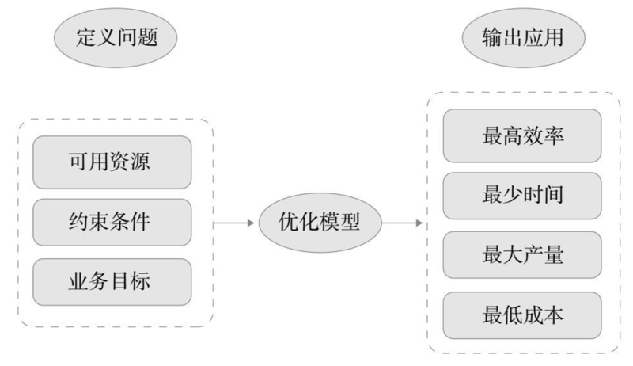

图 3-3 优化过程示意图

定义问题包括以下三个要素：第一个要素是可用资源，就是我们现有的各种资源，比如要生产一种产品，我们有多少原材料，生产工人技术的熟练程度，还有生产机器的数量等。第二个要素是约束条件，比如说要想任务保质保量地完成，工人和机器都需要休息，所以约束条件就是工人每天只能工作 8 小时，机器连续运转 16 小时就需要散热和检修。第三个要素是业务目标：任何业务决策都需要一个目标，比如要生产多少产品，这个项目才算完成；这个营销计划执行完，要增长多少用户量；或者这个季度结束，要完成多少订单。在数学上这个目标可以通过目标函数来定义，也就是 f（项目）= 产量，f（营销）= 用户量。在制定这个目标函数的过程中，实际上作为具有 AI 思维的你，已经开始在宏观的层面思考业务问题了。

目标函数由预测分数和决策变量构成，决策变量是我们对个体的决策。比如说，我们花了大量的资金在网站上投放广告，但是广告效果并不是很理想，我们就会想去提高广告的点击量。这时，我们的目标就是最优化广告投放的总点击量，预测分数是针对每一个用户点击率的预估，决策变量则是是否对某个用户投放，从而做出对哪些用户投放广告的决策。显而易见，我们把所有的分数做个排序，选择高点击率的用户投放即可。这是个简单的目标优化问题。

优化模型决定了我们需要选用什么样的优化方法，而我们一般选用数学优化方法。总的来说，优化问题分为两种：有约束优化和无约束优化。顾名思义，有约束优化是在一系列约束条件下，寻找一组决策变量，使目标函数值达到最优；无约束优化与有约束优化相对应，指的是没有任何约束条件的优化。现实中的优化问题通常是有约束的，因为我们做一件事的资源总是有限的，比如一个企业要在一个周之内做完一个项目，一周就是时间约束，也就是我们的时间资源是有限的。或者是这个企业要用 3 000 元来办一场活动，这 3 000 元就是预算约束，也就是我们的成本和预算是有限的。

输出应用就是输出我们的最优解，是优化方法的最终目标。比如我们花最少的时间到达了目的地，用最低价格购买了一幢房子，用最高的效率完成了生产任务或者以最大的产量完成了绩效目标。

其实我们在很久之前就接触过这种最优化的思维。比如语文课本上「田忌赛马」的故事讲的就是最优化的思维，四大名著之一的《三国演义》就是军事最优化理论的真实写照；我们从学生时期就开始做求最大利润、最快速度、最少成本这样的极值数学题，其实都是在训练我们的最优化思维。在 AI 思维中，最优化思维十分重要，然后才是对问题的求解。我们做过很多这种求极值的数学题，不知不觉中就积累了最优化解决问题的能力，不过我们在现实生活中遇到的问题要比数学题复杂得多。情况是错综复杂的，但我们只要有了这种最优化的思维，能够把在生活中遇到的各种问题和现象翻译成人工智能可以理解的数学语言，建立适当的数学模型，这些问题就可以迎刃而解了。下面我们就来看一下在现实生活中，优化思维是如何解决业务难题，为企业带来商业价值的。

### 3.3.2 优化的业务价值

我们在讲优化的第三步输出应用时讲到，优化方法的最终目标有：最高效率、最大产量、最少时间和最低成本等。这其实就是优化所带来的业务价值的一个缩影。试问哪一个公司不想用最低的成本、最少的时间来获得最高的产量呢？但是这在现实生活中基本上是不能兼得的，用最少的时间获得最高的产量，就意味着可能要付出更高的成本。优化其实就是在这些冲突之间帮助企业找到一个平衡点，在现有资源的范围内，保证企业最大限度地赢利，还能为用户提供最优质的服务，提高用户的满意程度。

更详细地讲，优化带来的业务价值有如下几条：第一，优化可以帮助企业降低生产成本，提高企业运作效率，缩短生产和服务的交付周期。德国一家汽车生产公司有两条汽车生产线，各负责生产一种型号的汽车，这两条生产线每年能够生产 20 万辆汽车，这已经是一个很高的产量了。这家公司仍然不满足，想在不开通第三条生产线的情况下生产第三种型号的汽车。为了实现这个目标，它自主搭建了一个流程优化系统，在没有花费大量资金去建立新生产线的条件下，将生产力提高了 30%，将生产周期从 7 天缩减到了 4 天。由此，该公司节约了 5 亿美元的成本。这种能够看见的成本优化，提高了工作效率，增加了产量，在日后能够带来的经济效益是不可估量的。

第二，优化可以帮助企业提高资源利用率，向客户提供更加优质、灵活且准确的服务。法国一家快递公司之前送货速度没有比别的快递公司快，快递费也因为成本问题不能降低，相比之下没有任何竞争优势，迟迟不见盈利。不过，这家快递公司有一个特点 —— 它依附于一家航空公司，因此，综合考虑公司可以调动的资源，该快递公司决定利用航空资源来优化自己的快递业务，这样快递的送货速度就有了保证。但同时会出现一些其他优化问题，比如飞机搭载乘客之外，运输快递的数量是有限制的，飞机的路线和快递路线不能完全匹配，飞机加入后每个快递集散中心工作量上升等。但该公司的优化模型通过充分利用现有航空资源，合理安排飞机路线等方法，不但节约了增添航空设备的成本，还提高了送快递的速度，在提高公司本身竞争优势的同时，为用户提供了快速优质的物流服务。

第三，优化可以帮助企业实现精准营销，提升销量，扩大产品和企业的知名度和影响力。在广告营销领域，需要解决的问题有很多。首先，这个广告要投放给谁的问题。通过最优化思维，我们可以找到投放成本最低、需求最高、转化率最高的那一批用户，优化了广告的响应率。其次，通过什么渠道去进行推广营销的问题。通过最优化思维，我们可以找到用户打开频率最高、响应率最高的渠道，比如某用户平时使用淘宝的频率比京东高，那广告当然要投放在淘宝平台，这样可以优化广告的曝光率。最后，问题在于，要向用户推送什么样的广告。通过最优化思维，我们可以发现每个用户不同的需求，商家的广告也需要根据需求来定制，这样用户收到的广告推送就会千人千面，更符合他们个性化的需求，用户的购买欲望也会相应地提升，在一定程度上优化了产品的销量。

第四，优化可以帮助企业减少库存，降低管理风险。日本一家家具企业经常大量购进优质木材，因而经常会出现所有订单都完成了还剩下很多木材的情况。这些木材存放的时间久了会出现虫蛀、受潮、色泽不均等问题，无法再用于做新家具，这样不但产生了大量的仓储成本，还浪费了大量的资源。为解决这个问题，该公司引进了一个优化系统，对从木材采购到木材保管的全过程都进行了优化。首先，在采购之前，系统会根据优化模型算出一个最佳的木材采购量，这样既避免了过度购买木材，也减少了采买过程中的贪腐行为；其次，该企业还会对剩下的木材进行防蛀防潮湿处理，避免了资源浪费。仓储量的下降减少了工作人员的工作量，降低了管理风险。

### 3.3.3 业务优化应用案例

优化能够带来如此大的业务价值，那它在实际生活中是如何实践的？在实际业务运作中是如何发挥作用的？现在我们就通过具体案例来说明一下优化是如何执行的。比如说，现在有一个电商网站要进行一次营销活动，该网站的用户量巨大，如果这次营销活动要针对每一个用户，营销成本就会非常大，所以这个网站打算只选择部分顾客进行营销。对这个网站而言，每个用户的营销成本是不一样的，我们需要根据已有顾客的预测转化率，最大化选择的顾客的总分数。这其中的约束条件是：营销成本不能超过总预算。

假设我们有 5 个顾客，每个顾客的营销成本分别是 c1, c2 … c5（已知），转化率分别是 p1, p2 … p5（已算出），x1, x2 … x5 表示我们是否对一个顾客营销。那么优化问题可以这么写：

最大转化率： 

$$p_1x_1 + p_2x_2 ...... + p_{10}x_{10} $$

约束条件： 

$$c_1x_1 + c_2x_2 ...... + c_{10}x_{10} ≤ 预算$$

x1, x2 … x10 取值 0 或 1（0 代表不进行营销，1 代表进行营销）

若 5 个顾客的营销预算为 1 500 元，营销成本和转化率如表 3-1 所示：

表 3–1 营销成本和转化率

| 用户 | 1 | 2 | 3 |
| --- | --- | --- | --- |
| 营销成本（c） | 100 | 300 | 500 |
| 营销转化率（p）| 27% | 68% | 76% |

则优化问题应该这样写：

最大转化率：

$$0.27x_1 + 0.68x_2 + 0.76x_3 + 0.83x_4 + 0.95x_5 $$

约束条件：

$$100x_1 + 300x_2 + 500x_3 + 700x_4 + 1000x_5 ≤ 1500 $$

在进行顾客营销时，我们当然会选择那些转化率高的用户来进行营销，但是我们同样也要考虑到营销的成本。在这 5 个用户当中，第五个的预测转化率最高，但是要对他进行营销的成本是 1 000 元，成本太高，如果都是这样的用户，那我们很有可能会超出预算，而且还没有达到预期的营销效果，这样就得不偿失了。第一个的营销成本最低，但是转化率只有 27%，仍然达不到想要的营销效果。相比之下，中间 3 个用户的营销成本适中，营销效果也很好，性价比最高，而且成本在预算之内，所以最后我们选择中间 3 个进行营销，达到效果最优化。

通过上述预测分析和优化模型，我们就可以看出哪些是营销成本低但营销效果不好的用户，哪些是营销效果好但营销成本高的用户，而我们最终选择的肯定是那些转化率高且成本适中的用户，对这些用户进行营销可以控制成本在营销预算之内，又能达到很高的转化率。这是最优化思维最初的目标：以最低的成本达到最佳的效果。同时，这也是最优化思维最终的结果：帮助企业实现了最佳的营销转化率。

最优化思维在诸如航空、物流、生产制造、金融、资源管理、环境保护、电力管理等领域中得到了广泛应用，在相关领域都已经有成功的优化实施案例。以物流行业为例，我们来看一下最优化思维如何在实际场景中展开应用。

近几年电子商务迅速崛起，在网上购物已经成了大众生活的常态，随之而来的是物流行业的蓬勃发展。国家发改委统计数据显示，2018 年中国物流成本占国内生产总值的比重高达 14.5%，而相比之下，欧美国家的物流成本占其国民生产总值的 10% 都不到。为切实有效地解决国内物流成本的问题，最优化思维势在必行。

在一切物流问题中，最重要的莫过于车辆路线问题。在面对数量众多且需求不同的客户时，组织多少辆货车最合适，走哪一条路线路程最短，选择哪一种物流方式成本最低、耗时最短等一系列问题，都属于车辆路线问题，也都属于最优化思维应当解决的问题范围。

现在许多地图服务商都提议提供最短路线或者最短时间方案，但是在实际运输过程中，要真正实现最短路线、最快时间以及最低成本，还需要解决许多复杂问题，例如不同货物配送的先后顺序，水、陆、空三种运输方式和多家快递公司的不同组合搭配，等等。此外，考虑到诸如限行、修路、恶劣天气或者交通事故等突发状况，物流所要优化的问题，复杂度直线上升。

为了优化解决这些问题，市场上出现了一些优化模型，例如针对物流优化的小马驾驾。首先，面对复杂且数量巨大的物流信息，优化模型会先对其进行学习，并在训练和学习中不断优化自身，让自己的判断越来越准确；其次，为了应对突发状况，优化模型可进行实时判断，做出路线调整，找到物流的最优路线；为了优化目前物流领域存在的业务模式多变、效率低下、资源利用不合理等问题，优化模型提出了多种提货送货模式，比如多地点提货单地点送货、单地点提货多地点送货、多地点提货多地点送货等，大大提高了提货送货的效率，节约了时间成本。

在选择最短路线方面，优化模型将所有订单综合考虑，整合所有路线，将所有目的地都串联在一起，使得同一个目的地的商品能够一起派送。除此之外，优化模型还会考虑到回程问题，避免出现货车空仓回程的情况。这样既解决了回程问题，又最大可能地降低了运输成本，提高了物流效率。在配送服务方面，模型也可以根据用户需求灵活调整车辆、车型、仓库等，达到优化的效果。在控制成本方面，除了缩短物流时间可以降低成本之外，选择不同的车型或者运送方式也可以很好地降低成本，比如短途运送小型货物可以选择小型货车，成本相对较低；但是长途运送生鲜货物，还是应该选择航空运输，航空运输虽然成本高，但是生鲜商品的配送费本身也很贵，航空运输速度快，能够保证商品的新鲜程度，提高用户对物流的满意程度，这样才能留住客源。据统计，使用该优化物流模型制定的优化物流方案，可以将每日全城的调度时间从 3 小时减少到 15 分钟，企业的运送成本可以降低 10% 到 20%。

面对海量的信息数据、复杂的环境、多变的市场和需求，我们在日常工作中，必然会求助于人工智能。如果企业不拥抱人工智能，就很难跟上时代快速发展的步伐，甚至会面临被淘汰的危险。我们需要人工智能为我们提供业务决策，其实是需要它为我们提供最优的那个决策。可以说，最优化是 AI 思维解决问题的出发点。有了 AI 思维的帮助，我们就可以更加轻松准确地在生活、工作和业务运作过程中做出最佳的决策。

## 3.4 会思考的人工智能

《终结者》里的天网是一套人工智能防御系统，但它却拥有了自我意识，想要毁灭人类；《我，机器人》中具有自我思考能力的人工智能机器人 VIKI 在负责生产机器人的同时，还在默默计划让机器人成为人类世界的主宰；《魔种》中的人工智能系统 Proteus IV 不但具有了自我意识，还将人类囚禁起来。现在越来越多的科幻电影里出现了人工智能的身影，而且它们都不约而同地拥有了独立思考的能力。其实从人工智能出现以来，人们一直都有这样的疑问：人工智能是否能够和人类一样拥有独立思考的能力？

关于这个疑问，被称为计算机科学之父的艾伦·图灵在 1952 年曾经进行过一个测试：将一个人和一台计算机分别关在两个房间内，再找一个人对房间里的人和计算机分别进行提问。提问者事先并不知道哪个房间里的是人，哪个房间里的是计算机，他要通过二者对问题的回答进行判断。如果有超过 30% 的人不能准确判断出哪一个是人，哪一个是计算机，那么这台计算机就通过了此次测试，而且可以被认为是具有了人的智能。这一用来判断机器是否具有人类智能的测试后来被称为图灵测试。一直没有计算机能通过图灵测试，直到出现了深度学习，人们才看到了一丝曙光。

### 3.4.1 深度学习的前世今生

我们知道，机器学习是人工智能的分支，它专门研究计算机如何模拟和实现人类的学习行为。在人工智能发展过程中，机器学习占据核心地位。通过各种模型，机器学习可以从海量的数据中学习出规律，从而对新的数据做出智能识别或者预测，并且为决策提供支持。深度学习是机器学习的一种。如图 3-4 所示，人工智能是一个范围很大的概念，其中包括了机器学习。机器学习是人工智能提升性能的重要途径，而深度学习又是机器学习的重要组成部分。深度学习解决了许多复杂的识别和预测难题，使机器学习向前迈进了一大步，推动了人工智能的蓬勃发展。那么深度学习又是如何发展起来的呢？

1-2『看到这里的信息才算明确了：AI、机器学习和深度学习的关系，做一张任意卡片。（2021-02-26）』

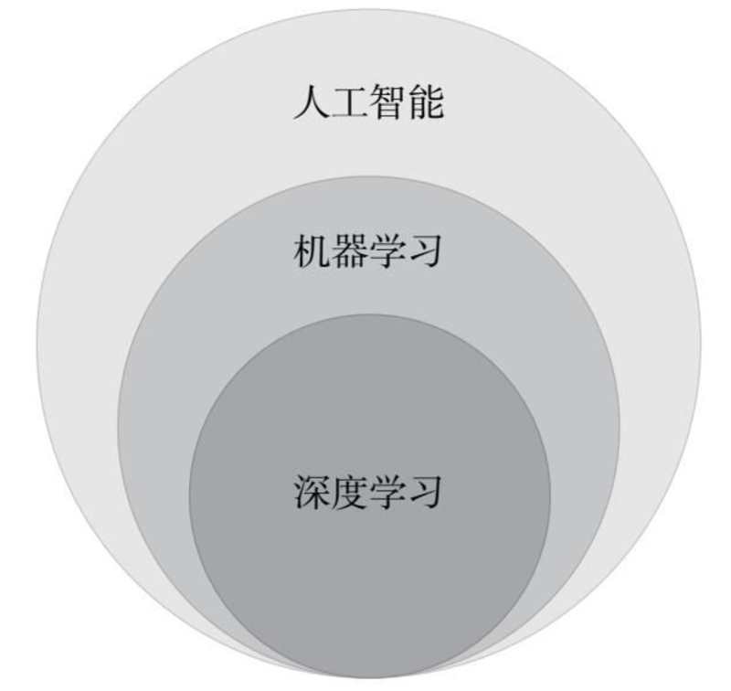

图 3-4 深度学习关系示意图

深度学习的概念最初起源于人工神经网络（Artifi cial Neural Networks）。科学家发现人的大脑中含有大约 1 000 亿个神经元，大脑平时所进行的思考、记忆等工作，都是依靠神经元彼此之间的连接而形成的神经网络来进行的。人工神经网络是一种模仿人类神经网络来进行信息处理的模型，它具有自主学习和自适应的能力。

2『深度学习，做一张术语卡片。（2021-02-26）』

1943 年，数学家皮茨（Pitts）和麦卡洛克（McCulloch）建立了第一个神经网络模型 M-P 模型，能够进行逻辑运算，为神经网络的发展奠定了基础。生物神经元一共由四个部分组成：细胞体、树突、轴突和突触，M-P 模型其实是对生物神经元结构的一个模仿，如图 3-5 所示，左边是生物神经元的示意图，右边是 M-P 模型的示意图，为了建模更加方便简单，M-P 模型将神经元中的树突、细胞体等接收到的信号都看作输入值 x ，突触发出的信号视作输出值 y 。1958 年，计算机科学家罗森布拉特（Rosenblatt）发明了感知机，分为三个部分：输入层、输出层和隐含层。感知机能够进行一些简单的模式识别和联想记忆，是人工神经网络的一大突破，但这个感知机存在一个问题，就是它无法对复杂的函数进行预测。20 世纪 80 年代，人工智能科学家鲁姆尔哈特（Rumelhart）、威廉姆斯（Williams）、辛顿（Hinton）、莱库（LeCun）等人发明的多层感知机解决了这个问题，推动了人工神经网络的进一步发展。20 世纪 90 年代，诺贝尔奖获得者埃德尔曼（Edelman）提出 Darwinism 模型，并建立了一种神经网络系统理论，对 90 年代神经网络的发展具有重大意义。

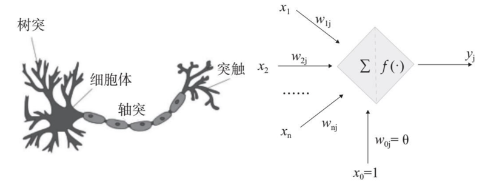

图 3-5 神经元及 M-P 模型示意图

从这之后，神经网络技术再也没有出现过突破性的发展。直到 2006 年，被称为人工智能教父的辛顿正式提出了深度学习的概念，认为通过无监督学习和有监督学习相结合的方式，可以对现有的模型进行优化。这一观点的提出在人工智能领域引起了很大反响，许多像斯坦福大学这样的著名高校的学者们纷纷开始研究深度学习。2006 年被称为「深度学习元年」，深度学习从这一年开始迎来了一个爆发式的发展。2009 年，深度学习应用于语音识别领域。2012 年，深度学习模型 AlexNet 在 ImageNet 图像识别大赛中拔得头筹，深度学习开始被视为神经网络的代名词。同样是在这一年，人工智能领域权威学者吴恩达教授开发的深度神经网络将图像识别的错误率从 26% 降低到了 15%，这是人工智能在图像识别领域的一大进步。2014 年，脸书开发的深度学习项目 DeepFace 在识别人脸方面的准确率达到了 97% 以上。2016 年，基于深度学习的 AlphaGo 在围棋比赛中战胜了韩国顶尖棋手李世石，在世界范围内引起轰动，这一事件不但使深度学习得到了认可，人工智能也因此被社会大众所熟知。2017 年，深度学习开始在各个领域展开应用，如医疗影像、金融风控、课堂教学等，在不知不觉中已经渗透到我们的生活中。

### 3.4.2 深度学习的经典模型

那么深度学习到底是什么呢？深度学习是建立在计算机神经网络理论和机器学习理论上的科学，它使用建立在复杂的网络结构上的多处理层，结合非线性转换方法，对复杂数据模型进行抽象，能够很好地识别图像、声音和文本。深度学习有两种经典模型：CNN 和 RNN。

CNN 全称是 Convolutional Neural Network，也就是卷积神经网络。对于卷积神经网络的研究最早出现于 20 世纪 80 至 90 年代，到了 21 世纪，随着科学家们对深度学习的深入研究，卷积神经网络也得到了飞速的发展，该网络经常用于图像识别领域。如图 3-6 所示，卷积神经网络共分为以下几个层级部分，输入层（input layer）、卷积层（convolution layer）、池化层（pooling layer）、全连接层（fully connected layer）。

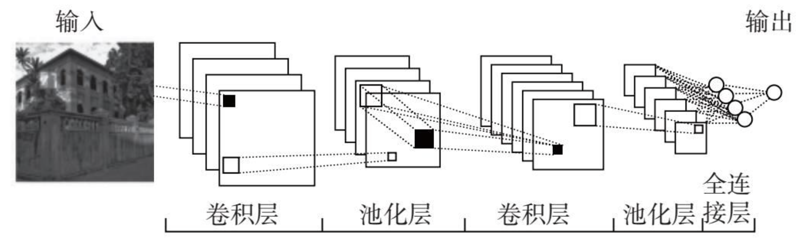

图 3-6 卷积神经网络工作过程示意图

当图像进入输入层，模型会对这个图像进行一些简单的预处理，比如降低图像维度，便于图像识别。卷积层里的神经元会对图像进行各个维度的特征提取。这一提取动作不是针对原图像进行的，而是仅对图像的局部进行特征提取，比如需要识别的是一张包含小狗的照片，但是神经元只负责处理这张照片中的一小部分，比如狗的耳朵、眼睛。卷积层对图像不同尺度进行特征提取，大大丰富了获取特征的维度，有助于提升最终识别的准确度。池化层对图像进行压缩降维，降低图像识别需要处理的数据量。全连接层需要做的就是将前面所提取出来的所有图像特征连接组合起来，如图 3-7 中，将提取到的小狗的头、身体、腿等局部特征组合起来，形成一个完整的包含小狗的特征向量，然后识别出类别，这就是卷积神经网络进行图像识别的全过程。

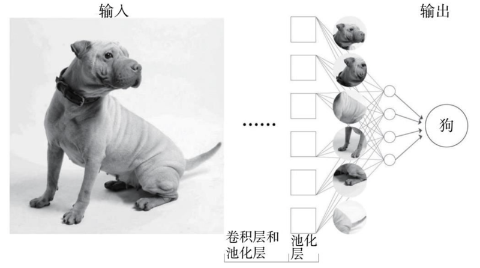

图 3-7 卷积神经网络图像识别过程示意图

通过对卷积神经网络工作过程的梳理，我们总结出卷积神经网络的三个特性：第一，图像识别不需要识别图像的全部，每个神经元只需要聚焦到图像的一小部分，识别的难度降低；第二，卷积层对应的神经元可以应用于不同的图像识别任务，比如图 3-7 中的神经元，经过训练，已经能够识别出小狗，那这些神经元也可以应用于识别其他任何图像中的相似物体；第三，虽然图像特征的维度降低了，但是由于保留了图像的主要特征，所以并不影响图像识别，反而降低了识别图像需要处理的数据量。这三个特性决定了卷积神经网络非常适合用于图像识别。例如由牛津大学开发的 VGG 模型就是基于卷积神经网络模型建立的，它在识别物体的候选框生成、图像的定位与检索等方面十分准确，这使得它在 2014 年 ImageNet 竞赛定位任务中获得了第一名。

人工神经网络和卷积神经网络在深度学习领域都占有一席之地，但它们识别的都是独立的事件，比如卷积神经网络非常擅长识别独立的图像，如果让它识别 100 张照片，输出的结果互相不受任何影响，但是让它识别或者预测一句连续的话，比如一个寓言故事或者翻译一段英文，可能就没有这么好的效果了。可是在现实生活中，我们会遇到很多连续的事件，比如「小明每次去超市都会买很多苹果，因为他最喜欢吃（ ）」，联系上下文，我们可以很容易推测出括号里应该是「苹果」这个词，因为括号前的「吃」字是一个动词，动词后面经常跟着的是名词，而这个句子中的名词只有「苹果」最合适。为了能够识别这些连续性很强的事件，弥补人工神经网络和卷积神经网络的不足，RNN 模型诞生了。

RNN 全称是 Recurrent Neural Network，也就是循环神经网络。对于循环神经网络的研究最早出现于 20 世纪 80 年代，由约翰·霍普菲尔德（John Hopfi eld）、迈克尔·乔丹（Michael Jordan）以及杰弗里·埃尔曼（Jeffrey Elman）等人提出，该模型经常用于时序信号（如语音）的识别和理解。

循环就是重复的意思，循环神经网络模型在运行时会对同一个序列进行循环操作。序列是被排成一列的对象，序列中的元素相互依赖，排列顺序非常重要，比如时序数据、对话等，一旦顺序错乱，含义和作用都会发生巨大改变。循环神经网络解决了卷积神经网络不能很好地识别连续性事件的问题，在深度学习领域发挥着不可替代的作用。

循环神经网络之所以能对连续性事件进行识别，是因为它不仅将当前的输入数据作为网络输入，还将之前感知到的一并作为输入。根据记忆的长短，从第一层开始，将激活传递到下一层，以此类推，最后得到输出。图 3-8 就是一个循环神经网络的示意图，它由输入层、隐藏层和输出层三部分组成。循环就发生在隐藏层。隐藏层里一般会设置一个特定的预测函数，当我们向循环神经网络模型输入一个连续性事件后，在隐藏层的这个函数就会进行运算，这个运算结果又可以作为输入进入隐藏层再一次进行运算。如此这般，就形成了一个不断循环的预测，这个预测与新输入的数据有关，也取决于每一次循环的输入。

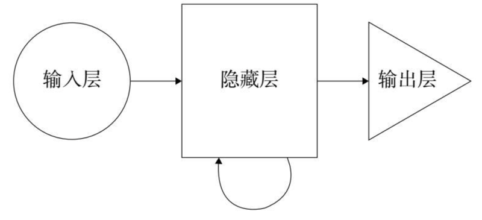

图 3-8 循环神经网络原理示意图

连续性数据在日常生活中出现的频率之高决定了循环神经网络有着广泛的应用空间。例如，我们可以依靠循环神经网络预测一句话中的下一个词语或一篇文章中下一句话是什么，以此来生成文本，现在很多写稿机器人就是基于循环神经网络来进行运作的。循环神经网络模型还可以将文本翻译成其他的语言，所以它也广泛用于机器翻译。循环神经网络另一个常见的应用是语音识别，我们现在使用的很多智能语音助手都应用了循环神经网络。

股票的价格波动也存在一定的规律，根据前一段时间的股票波动情况可以大致预测出之后股票的走势。因此，循环神经网络在股票预测方面有先天的优势。随着经济的发展，股票市场的规模不断扩大，大量股票历史数据的积累使得循环神经网络可以学习股票的走势规律。比如，当循环神经网络发现，某只股票价格不断下跌超过七天，之后就会缓慢上升，并且在很长一段时间内这只股票都呈现出这个规律时，如果这只股票价格再一次持续下跌，那么下跌的第七天就是股民买入的最好时机。实践证明，循环神经网络对股票的预测能够较好地拟合真实数据，具有很高的应用价值。

循环神经网络可以有效地进行文本识别，而在商业世界中，最重要的一种文本数据就是商品评论。随着生活节奏的加快、电子商务的兴起，人们越来越倾向于网络购物。网购时，用户没有见过真实的商品，只能通过商家的描述进行了解，而商家的描述又不能保证用户了解到的信息完全属实，此时，用户的商品评论就成为反映商品质量和商家信用的一个重要参考标准。但是，用户的评论也有很大的主观性，如何结合用户的主观评价正确评估商品质量及商家信用成为一个亟须解决的问题。在循环神经网络强大的文本识别功能的帮助下，我们可以很好地解决这个问题。循环神经网络在分析评论的过程中，最重要的一个步骤是对用户的主观评价进行处理，即通过循环神经网络分析用户的商品评论，再将其转化为对商家的等级评价。比如，循环神经网络识别出不同的商家同时在售卖同一种商品，但在商品质量方面，商家甲好评数远远高于商家乙，那么在这一方面，商家甲的等级评价就会高于商家乙的等级评价。影响商家等级评价的因素还有很多，比如服务态度、发货速度，以及商品与描述相符度等，将这些因素全部考虑在内，就会形成一个全面的商家等级评价。循环神经网络在商家评价方面的应用使用户不会被海量商品信息以及其他用户的主观评价所混淆，直接找到符合自身需求并且质量上乘的商品，提升了用户的网上购物体验。

2『深度学习的两大经典模型：卷积神经网络和循环神经网络，做一张术语卡片。（2021-02-26）』

### 3.4.3 深度学习商业网络

数据是商业发展的基础，也是商业竞争的关键。现在越来越多的公司都在通过数据的深度分析来了解用户的需求，把握市场的发展方向，提高自己的竞争力，以此达到在激烈的商业竞争中获胜的最终目标。深度学习作为人工智能的关键能力，其对数据的理解能力也超过了之前的相关模型。对数据的深度理解能够挖掘出数据背后隐含的知识，能更加快速准确地掌握用户需求，所以深度学习在商业场景中具有非常重要的应用价值。下面我们来介绍两个在商业领域应用的深度学习网络：潜在客户转化率深度学习模型和客户购买力深度学习模型。

如图 3-9 所示，这是专门用于房地产行业的潜在客户转化率的预测模型。这个模型可以通过线上、线下数据以及在 App 上对不同房产的浏览数据等，推测出一个潜在的购房客户转化为真正的购房客户的概率有多大。

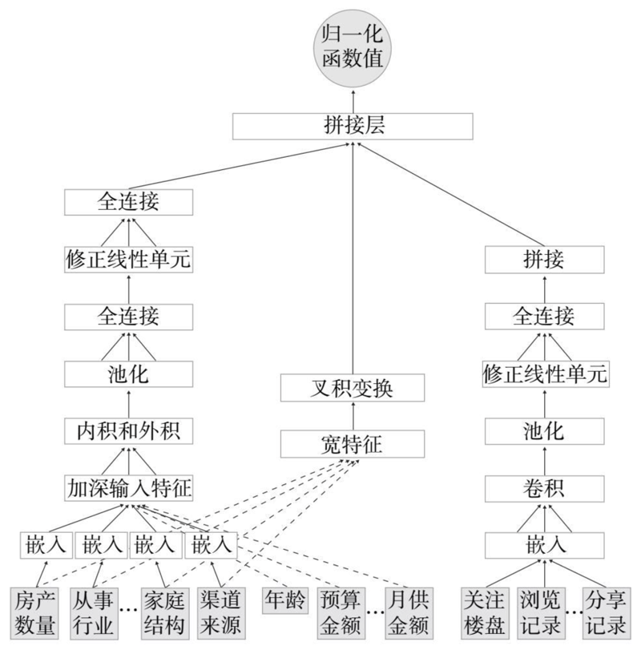

图 3-9 潜在客户转化率深度学习模型示意图

在这个模型中，输入的数据包括：类别特征数据，如客户的房产数量、从事行业、家庭结构、渠道来源等；连续特征数据，如客户的年龄、预算金额、月供金额等；序列特征数据，如客户的关注楼盘、浏览记录、分享记录等。我们对不同分类的数据需要进行不同的操作，例如类别特征数据需要经过嵌入、池化以及全连接等操作，序列特征数据需要经过嵌入、卷积后才能进行池化以及全连接等操作。当这些操作都进行完之后，数据就可以进入拼接层，然后输出每个客户在接下来的一段时间内买房的概率。

如图 3-10 所示，这是一个专门用于预测房地产公司客户购买力的深度学习模型。这个模型可以通过一系列复杂的深度学习，最终预测出一个客户是高价值的买房客户还是相对低价值的买房客户。

在这个模型中，输入的数据包括客户的基本信息，如职业、收入、偿还能力、来源、意向、家庭结构、购房用途等；客户行为数据，如关注、点击、浏览、分享等；房屋描述信息，如建造年份、户型、位置、交通、物业等；还需要一些房屋、小区等周边环境的图像信息。不同类别的数据也需要进行不同的操作，例如客户基本信息中的类别特征数据需要进行嵌入操作，将稀疏的数据变成连续向量；客户基本信息中的连续特征数据就可以直接进行处理；客户行为数据要经过嵌入、卷积、池化以及全连接等一系列的操作；房屋描述信息数据要经过词向量化、嵌入、LSTM（长短期记忆网络）、堆叠特征处理。其中，LSTM 适用于处理和预测时间序列中，间隔和延迟相对较长的重要事件，堆叠特征处理可以将不同的特征拼接在一起。图像数据要经过图像预处理、基于预训练的 VGG 模型以及全连接操作。当这些操作都完成之后，所有的数据要一起进行决策树处理。最后，我们就可以看出这个客户到底是高购买力客户还是低购买力客户了。

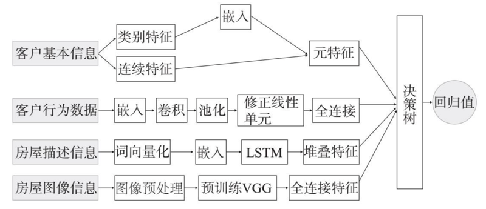

图 3-10 客户购买力深度学习模型示意图

深度学习的出现为人工智能带来的是一种全新的思维方式和思考方式，它赋予了人工智能新的活力，为人工智能带来了无限的可能性。万物皆可智能正是因为人工智能有了深度学习的支持，是深度学习为人工智能插上了飞翔的翅膀。更有人提出，深度学习甚至决定了人工智能的未来，所以现在深度学习越来越成为机器学习和人工智能不可或缺的一部分。以小博大，见微知著，AI 思维强调要抓住事物的本质特征才能做出最好的决策。掌握了深度学习，就算是掌握了人工智能的核心，所以，深度学习是我们构建 AI 思维不可或缺的重要一环。

## 3.5 AI 炼金术的应用生态

中世纪的时候，人们十分相信占星术，认为天上的星体可以带来幸运；并且将地上的一些贵重金属视作天体的代表，比如黄金代表金黄色的太阳、白银代表银白色的月亮等，这些贵金属因为稀少并且被赋予了幸运的含义，价格昂贵。地中海附近的国家希望能有一种将贱金属转变为贵金属的法术，这种法术被称为炼金术。人工智能拥有的就是这种将看似没有价值的数据转变为价值难以估量的决策的「法术」。

我们先来回顾一下 AI 炼金术全过程：首先，我们要通过对历史数据的特征处理产生特征数据，然后通过机器学习产生预测模型。模型产生之后，需要通过回测对其进行模型评估，在评估中合格的模型才可以投入生产。生产过程中如果有新的样本数据输入，就可以通过模型来产生预测分数，根据分数的高低和其他因素来进行业务优化，产生针对个体的业务决策。决策指导产生针对个体的具体行动，行动作用在个体上产生结果，虽然各自的结果可能会有差异，但人工智能总体上能够优化业务，从而实现价值。AI 炼金术就是这样一步一步，对数据千锤万凿，百炼成金。

### 3.5.1 人工智能赋能架构

AI 炼金术所创造的价值是不可估量的，对于企业，它是大赚 1 000 亿美元的秘密武器，对于个人，它是安居乐业人生美满的秘诀。但人工智能炼金术不是一座飘浮起来的空中花园，它需要建立在真正落地的实际系统上，需要系统给各个参与者赋能，否则再神奇的炼金术也只能是一场美好的空谈。那么人工智能炼金术最终要落地在一个什么样的系统上呢？

基于人工智能赋能架构的系统，能够为企业和消费者赋能。如图 3-11 所示，它分为左右两边，左边是 C 端，也就是用户端，通常涉及企业的用户或消费者，他可能在企业经营的门店里购买过商品，在企业运营的网站上注册过会员，或者是使用过企业提供的手机 App，总之他和企业有过一些交互和接触。右边是 B 端，也就是服务端，服务端就是要在企业的后台为用户提供优质的服务，确保用户端得到最佳的体验。

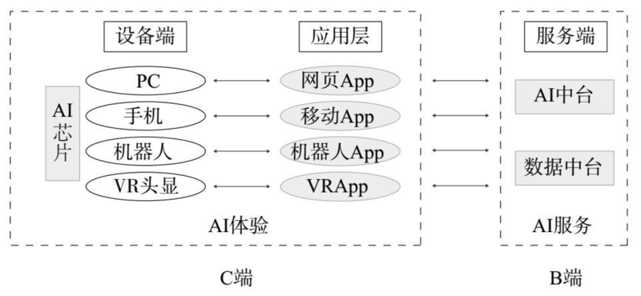

图 3-11 人工智能赋能架构示意图

服务端的系统分为两部分，一部分是数据中台 ，另一部分是 AI 中台。数据中台会对海量数据进行采集、计算、存储、加工，形成统一的标准数据，形成大数据集合，进而通过 AI 中台为用户提供个性化服务。从数据到价值的 AI 炼金术，是 AI 思维的具象表现形式，AI 中台则是 AI 思维的实现载体。在服务端，既需要数据、需要人工智能，也需要数据中台和 AI 中台的连通。只有数据中台和 AI 中台融为一体，人工智能才能知道瞬息万变的市场变化、用户的需求，才能给用户提供优质的服务。另外，数据中台和 AI 中台打通了，就会有源源不断的数据输入 AI 中台，人工智能训练的数据越多，训练的次数越多，它的智能程度就会越高，做出来的决策就会越准确，其所创造出来的价值就越高。

然后我们再来看用户端，用户端主要有两个模块，一个是设备端，另一个是应用层。现在的用户无论是线上还是线下跟企业交互，都要通过一些设备来实现，比如说在 PC（个人电脑）端看视频、在手机端玩游戏、通过 VR 头显（虚拟现实头戴式显示设备）感受虚拟现实，或者说与在实景中摆放的机器人交流互动。所以说 PC 端、手机端、VR 头显端或者是机器人端都是一个用户的触达点，都是一个企业的触角。通过这些触角，企业可以实时了解用户的需求并为其提供服务，比如说现在很多酒店都配备了智能机器人，如果酒店的房客半夜想要喝水，发现房间里的纯净水都喝光了，而酒店的工作人员都已经休息了，就可以让机器人为房客送纯净水。

在这些设备端里面可能会有 AI 芯片。在人工智能中，AI 芯片是专门用于模型运算任务的一个模块，它可以在手机里做大量快速的计算，比如说现在很多年轻人喜欢通过各种美图 App 给自己上妆或者为自己的照片换背景，这些特效的实现都是实时的，呈现效果也非常好，所以需要很大的人工智能运算量。面对越来越高的用户的体验要求和越来越高的运算量，传统的硬件已经不足以解决问题了，因此现在手机上都安装了专门用来处理这些问题的 AI 芯片。手机 AI 芯片发展迅速，比如说三星最新研发的手机 AI 芯片有了独立的神经网络处理单元，运算速度提升了 7 倍；华为研发的 AI 芯片 NPU（Neural Network Processing Unit，嵌入式神经网络处理器）使图形处理性能提升了 20%，能效提升了 50%，图像识别速度可达到每分钟 2 000 张；OPPO、vivo 使用的是科技公司联发科研发的手机 AI 芯片，有低能耗、高性能的特点。

虽然 AI 芯片只是一块小小的芯片，但是 AI 芯片产业却是一个大的产业，因为它既能在用户端上进行人工智能的运算，也能在服务端进行人工智能的运算。虽然服务端跟用户端是连通的，但是网络存在延迟，直接在用户端进行计算可以缓解这个延迟。从整体架构上来说，设备端和服务端中间是应用层，其中包括像微信、QQ（腾讯公司的即时通信软件）这样的应用 App，通常企业需要花大量的时间和精力去改良这些应用，提高用户体验和服务质量。例如，谷歌开发的语音助手 Google Assistant 的语音模型一开始是存储在谷歌服务端的，它能够准确识别出用户所说的指令并做出相应的回应。但是在使用过程中，用户对着 Google Assistant 说一句话，这句话需要上传到服务端才能被语音模型识别，然后再传回用户的手机，这就导致了语音识别速度很慢。为了改善用户在使用语音助手时的体验，谷歌对语音模型做了处理，将其大小从 100G 压缩到了 0.5G，使其可以直接缓存到用户的手机上。如此一来，语音在手机和服务端之间的传输时间大大减少，Google Assistant 的语音识别速度提高了将近 10 倍，极大地提高了用户体验。

所以前文提到的 AI 炼金术，其实是构建在这样一套赋能架构上的。从图 3-11 最左边的用户到最右边的企业，环环相扣，人工智能不仅可以由企业的服务端提供算力，也可以在用户的设备上进行运算。这块根据响应时间会有一个切分，对响应时间比较敏感的会在用户端进行，而对时间要求没有那么紧急的任务，可以放在服务端进行。另外，服务端有更多更全的数据，适合更为宏观的人工智能运算。这套连接服务端和用户端的赋能架构，是人工智能炼金术所依赖的系统基础。理解整个赋能架构，能够帮助我们更好地应用人工智能，通过人工智能更多的创造价值。

中台即在一些系统中，被共用的中间件的集合。—— 编者注

### 3.5.2 人工智能应用矩阵

人工智能的发展、传播和被接受是经过了一段漫长的寒冬的。十多年前，它还只是一个不被人看好的小众领域，但是现在，它却已经成为街头巷尾的热点谈资，几乎任何事情都可以和人工智能联系在一起。

短短十年间，世界发生了天翻地覆的变化，新数据不断涌现，各种问题层出不穷，直到现在，人工智能的春天才算是真的到来了，各个领域都亟须人工智能的帮助。这也是为什么人工智能的商业化应用范围如此广阔，人工智能市场更是如一块等待开垦的处女地一般。如图 3-12，这是一份人工智能的商业版图，横轴代表不同的行业领域，例如金融、零售、医疗和教育等，纵轴代表不同的职能方向，例如营销、风控和安全等。横轴和纵轴共同构成了一个二维的商业矩阵，对于每个行业中的相关职能，人工智能都可以探索相关应用场景，例如在金融行业的营销、CRM（客户关系管理）、客服、风控和安全等方面以及零售行业的营销、CRM 和客服等方面都已经有人工智能实践落地。但其实，现在的人工智能只填充了广阔的商业领域中非常小的一部分，还有更多没尝试和拓展的人工智能应用场景。

在金融行业，人工智能应用十分广泛。以金融服务集团蚂蚁金服为例，他们推出了智能理赔服务，用户可以直接在手机上上传票据，通过智能审核就能迅速获得赔付款；支付宝将人脸转变为数字密码的刷脸支付功能也是人工智能在金融行业的应用。除此之外，人工智能还可以通过模型和投资组合优化等，为用户提供投资参考的智能投顾服务；通过自然语言理解、语音识别等，实时为用户咨询提供回答的智能客服服务；通过推荐模型，根据大数据为用户推荐个性化产品的智能营销服务；以及通过人脸识别和指纹识别，在支付时检测用户身份的智能风控服务。这样一系列服务使人工智能在金融领域扎实落地。

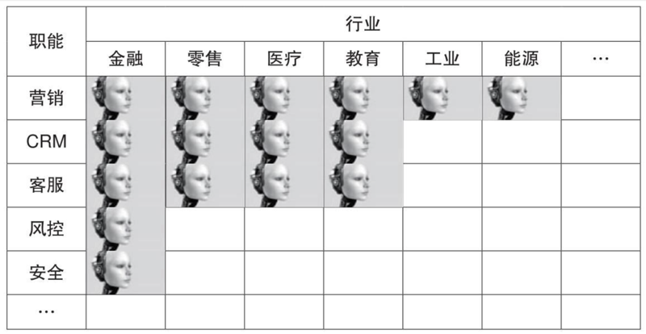

图 3-12 人工智能的商业版图

随着社会经济的发展，居民收入水平的提高，人们的消费能力逐渐上升，零售行业规模随之扩大。根据预测，2020 年全球零售销售总额将超过 26 万亿美元。由此可见，人工智能在零售业的落地也有很大的应用前景。例如，人工智能可以依靠基于大数据的机器学习模型，为用户生成精准化、定制化的推荐，提高零售业销量，Stitch Fix 的成功就是很好的证明。Stitch Fix 是美国的一家时尚电商，活跃用户达数百万人。它之所以在电商行业竞争如此激烈的当下能够留住用户，就是因为正确运用了人工智能，向用户推荐个性化商品。Stitch Fix 专门请数据科学家建立了人工智能推荐模型，根据用户的身高、体重、职业等信息以及穿衣风格和购买价位等偏好，为用户推荐定制化、个性化的商品。Stitch Fix 在 2016 年和 2017 年分别创造出了 7.3 亿美元和 9.8 亿美元的销售额，而且这些销售额来自智能推荐。由此可见，人工智能可以有效地赋能零售行业，为其带来效益的增长。

在工业、医疗行业等领域，人工智能虽然也有应用，但并不及在金融和零售行业普遍。从整体来看，由于人工智能是近几年才发展起来的新技术，所以它在很多行业和领域的应用并不广泛深入。但是人工智能发展势头很好，在每个行业都有落地的可能性，而且随着机器学习、计算机视觉、语音识别、自然语言处理等人工智能领域的发展，我们有理由相信，人工智能在各个领域都能扎下根去，遍地开花。

以前，行业追求的都是芯片驱动（Intel inside），用芯片为企业提供算力和速度，让企业能够跑赢市场，找到自己的阿尔法。但这都已经成为过去，以后行业追求的人工智能驱动（AI inside）才是真正的阳关大道。人工智能会成为行业的决策引擎，取代在战术层面上需要人工干预的场景，持续有效地让企业在最佳状态下运行；而且人工智能带来的效果不仅仅是「优化」这么简单，而是革命性的、成倍数的增长。如此，人工智能才能真正展现它的能力，真正为行业赋能。

### 3.5.3 AI 炼金术的场景化应用

既然 AI 炼金术在各个领域都有落地应用的可能性，并且在多个领域的应用已经产生了不错的效果，那么，它在具体的场景下是如何展开应用的呢？为了便于理解，我们先从一个大多数人都比较熟悉的例子讲起。比如说，你在一个电商网站上买东西时，遇到了很多广告。这些广告位都是商家花钱购买的，即使你可能并不会购买广告位的商品，这个商家在此投入的广告费是无法撤回的，所以商家要尽可能地提高你购买广告位商品的概率。此时，人工智能精准推荐就成为商家提高购买率的法宝，因为显示一个顾客感兴趣的商品能大大提高他的购买率。事实证明，经过人工智能精准推荐出现在广告位的商品，让无数剁手党们欲罢不能。

百年大计，教育为本。社会各界对教育越来越重视，国家更是提出了科教兴国的教育发展战略。教育是不可忽视的，但与此同时，教育业也存在诸如教育水平发展不均衡，学生学习负担重、学习兴趣不高等问题。而人工智能的出现为这些问题提供了解决方案。在教学环节，教师可利用人脸识别模型实时检测学生随堂表现，辅助教师教学；在练习环节，文字识别模型可批改文科作业，图像识别模型可批改数学作业，这些智慧作业平台大大减轻了教师批改作业的负担；在考试环节，语音识别模型可对语言语音进行打分，也可利用人工智能进行试卷批改，统计、分析分数；课堂之外，学生可以利用人工智能搜集资料、完成作业等，比如遇到不会做的题目，学生可利用各种人工智能拍照搜题找到答案。除此之外，人工智能还可以根据学生的成绩、课堂表现、作业反馈等信息，判断该学生的学习习惯、学习能力以及学习程度，并为其制订个性化学习方案。例如，一个学生的英语听说能力很好，读写能力不足，那么在日常英语学习中，可以相对减少一点对于听说能力的训练，节省下来的时间用于加大读写能力的训练。通过人工智能制定的个性化学习方案，老师和家长能更好地帮助学生找到学习的乐趣，提高学习的能力，获得更多的知识。

人工智能在法律领域的应用也非常广泛。当事人如果遇到法律问题，人工智能可以根据当事人的信息、相似案情的判决等数据来进行决策，为当事人提供法律咨询，或者为当事人推荐最合适的律师。对于律师来说，人工智能的文本处理能力可以帮助律师搜集资料，例如相关法律条文、相关案情的判决书等。人工智能现在已经可以根据已有信息判断案件能否胜诉。比如说，CaseCrunch 公司的人工智能就可以根据案件信息进行判决预测，并且预测的成功率高达 86.6%，打败了人类律师 62.3% 的成功率。

2018 年斯坦福等高校联合开发的律政界人工智能软件，和 20 名有经验的律师做了一个比赛。该比赛的内容是在 4 小时内审查 5 项协议，并回答 30 个法律问题，涉及领域包括仲裁、赔偿等。最终，人工智能软件以 94% 的准确率完胜律师的 85%。人工智能为法律领域带来的价值是为不懂法律的大众提供专业的法律帮助，为律师减轻工作负担，提高法律案件处理的效率，协助法律系统创造一个公平清明的世界。

人工智能在维护社会公平自由的同时，还能为医疗行业贡献一份力量，维护人类的健康。根据《2018 世界人工智能产业发展蓝皮书》显示，2013 年至 2018 年第一季度，全球人工智能的投资在医疗健康领域的热度最高。据老牌咨询公司麦肯锡预测，到 2025 年，全球智能医疗行业规模将达到总计 254 亿美元，约占全球人工智能市场总值的 1/5。由此可见，人工智能在医疗领域有广阔的应用前景。

医疗行业长期存在优质医生资源分配不均的问题，与此同时，在诊断过程频频出现误诊漏诊现象，而且医疗费用一直居高不下。对于普通民众来说，也一直存在看病难、看病贵的问题。人工智能通过对大量医疗数据、病人信息的分析，可以了解病人的病情，甚至能够预测一些疾病的发病时间。根据这些信息，人工智能可以生成针对每个病人的个性化医疗方案，帮助病人尽快康复并预防其他疾病。而那些严重的疾病，比如基因变异引起的癌症，虽然千差万别，情况复杂，但是人工智能可以针对每个人独特的基因变异数据，协助制订最佳的治疗方案，最大限度地挽救生命。病人康复出院之后，人工智能还能提供长期的健康监测服务，防止旧病复发、新病萌芽等现象。同时，人工智能医疗流程系统还能为医护人员安排最合理的工作流程，避免医生在简单的咨询工作中耗时过长，从而提高医生的诊疗效率。

人工智能在各行各业的广泛应用空间可能会使你有些恐慌，觉得人工智能再发展下去将取代人类的工作，甚至给这个世界带来灾难。这不只是一个人的忧虑。早在 2016 年，英国著名物理学家霍金就说过人工智能可能是人类的灾难：「对于人类来说，强大人工智能的出现可能是最美妙的事，也可能是最糟糕的事。」但我们现在的人工智能大部分都是弱人工智能，是那些不能真正地独立推理和解决问题的智能机器。有人又要问，AlphaGo 不是具有自我学习独立思考的能力吗？其实不然，围棋有固定的规则，对手下棋的习惯可以被模型捕捉到，但真实世界里的情况千变万化，不用说庞大而复杂的基因数据了，就是普通人的行为都千差万别，没有人类参与的人工智能是很难成气候的。而那些能够独立推理和解决问题的强人工智能的出现目前来看还很遥远，所以我觉得，认为人工智能会取代人类这样的焦虑，有些杞人忧天。