# 0401. 人人都能理解 AI

在制造分秒的时候，钟表把时间从人类的活动中分离开来，并且使人们相信时间是可以以精确而可计量的单位独立存在的。分分秒秒的存在不是上帝的意图，也不是大自然的产物，而是人类运用自己创造出来的机械和自己对话的结果。

—《娱乐至死》—

在前文中，我们首先从「道」的层面理解了 AI 是时代的机遇，之后又从「法」的层面讲了 AI 思维的底层逻辑，最后从「术」的层面讲了 AI 炼金术。但是学习是一个螺旋式上升的过程，需要不断深入，不断提高；知识进一步提升，思维能力也会更强，理解和运用人工智能也是这个道理。本章将会更加深入下去，从「器」的层面讲解 AI 思维。「器」可以帮我们理解 AI 思维的奥秘，也是人工智能越战越勇的法宝，对人工智能的「器」有了深刻的理解，就像孙悟空有了金箍棒，可上九天揽月，就像哪吒有了混天绫和乾坤圈，可下五洋捉鳖。「器」是工具，而人工智能领域的「器」就是模型，模型是 AI 思维的核心，本章将挑选人工智能领域的经典模型来帮助你理解 AI 思维，其中包括分类和聚类的模型，图像、语音以及文本的识别模型，还有消费和社交数据的处理模型。首先让我们从 AI 的分类和聚类开始理解 AI 思维的「器」。

## 4.1 AI 的分类和聚类

只会纸上谈兵的赵括由于缺乏战场经验，在长平之战中输给了秦将白起；熟读兵书的马谡不听从有实战经验的副将的建议，将街亭输给了司马懿，逼得诸葛亮只能挥泪斩马谡。历史上许多故事都告诉我们：缺乏实践经验，只会空谈，必然会导致失败。

过了那个兵荒马乱的年代，虽然我们不会再经历千军万马丢城失地的覆灭，但在日常生活中，若缺少经验，我们常常会遭遇挫折。从没有学过游泳的人，为了冒险刺激就往深水区游，难免会多呛几口水，甚至失去生命；从没有投资过的人，看到别人获利就盲目进入风云莫测的股市，便是注定了赔钱的命运。

然而我们都是第一次生而为人，只要对这个世界仍然保持着好奇心，总会去尝试无数个缺乏经验的第一次。第一次失败了并不可怕，重要的是你从这次的失败中学到了什么。及时总结，在一次次的试错中，也就是从经验中，我们学习了万事万物的规律。操千曲而后晓声，观千剑而后识器。以后再遇到相似的问题，我们就能妥善地处理了；碰到新的问题，我们也能根据习得的规律从容地做出比较准确的判断了。

人工智能各种能力的形成也是这个过程。我们从经验出发，得到处理事情的方法论；人工智能从数据出发，得到预知未来的模型。经过对数据的多次学习，人工智能就像一个身经百战的智能人，如果再有新的数据输入，人工智能也可以独立做出准确的判断，以及合理的预测。对于人工智能来说，产生模型的方法论就是机器学习，下面我们来仔细讲解一下。

### 4.1.1 机器学习的分类

我们获取知识的途径有两种，一种是通过他人的传递，例如我们遇到不会的问题时去请教老师或同学；另一种是在没有接受指导的情况下自学获得的。类似地，机器学习也有两种：监督学习和无监督学习。

监督学习是从标记的数据来学习模型的任务，每个标记的数据都是由一个输入数据（也就是通常所说的 x ）和一个期望的输出数据（也就是通常所说的标记 y ）组成。无监督学习处理的则是没有标记的数据。监督学习适合有明确预测目标的应用场景，即 y 可以被明确地定义和量化。而无监督学习通常适用于无法预先知道输出值的场景，只能对现有输入向量进行观察分析，它可以从数据中发现具有相似输入向量的结构，这些结构统称为簇（cluster）。

机器学习问题根据输出的数据来分，也有两类。一类是离散输出，通常用来表示个体的类别，比如把人分为两类，男人和女人；把客户分两类，高价值客户、低价值客户。数学中的离散是和连续相对的，所以另一类就是连续输出。连续输出的数据是指那些在一定区间内可以任意取值的数据，其数值是连续不断的，相邻的两个数据之间可以做无限的分割。比如说两趟地铁之间的间隔是 10 分钟，一个乘客在地铁站等地铁的时间是一个随机变量，取值范围可以是从 0 到 10 这个区间内的任意实数。所以连续输出有很大的应用空间，比如要预测公司的收入、客户的价值、生产流程的能耗、生产系统输出的气体浓度等，这些都需要用连续数字来表示，就都需要连续的输出。

监督类型分为通过监督学习和无监督学习，是机器学习问题分类的一种依据；输出分为离散型和连续型，是机器学习问题分类的另一种依据。将以上四类排列组合，就形成了四种不同类型的机器学习问题，如表 4-1，分别是：

如果通过监督学习，得到离散输出，就是分类问题。

如果通过无监督学习，得到离散输出，就是聚类问题。

如果通过监督学习，得到连续输出，就是回归问题。

如果通过无监督学习，得到连续输出，就是降维问题。

1-2『丁磊从「有无监督」「输出为离散或连续」这两个维度将机器学习问题划分为 4 大类，这个角度之前从未看到过，有一种醍醐灌顶的感觉，而且两维度划分四个区域这种方法论在其他 N 多领域看到过，很经典很经典。机器学习 4 个典型问题，做一张主题卡片。（2021-02-27）』

表 4–1 机器学习问题的类型

| - | 监督学习 | 无监督学习 |
| --- | --- | --- |
| 离散输出 | 分类问题 | 聚类问题 |
| 连续输出 | 回归问题 | 降维问题 |

这四类问题是机器学习的基本问题，深入理解了这四类问题，我们就能对机器学习有一个完整的把握。无论在哪一类问题中，机器学习的目标都是根据新的输入，做出预测。理解清楚了这四类问题的框架，我们就能深入体会到人工智能解决实际问题的思路。下面我会深入分析两类问题 —— 聚类问题和分类问题，它们也是机器学习中最常使用的两类。

### 4.1.2 聚类问题

《战国策》有云：「物以类聚，人以群分。」在日常生活中，有各种事物需要聚类，连人也在无形之中有聚类。而在人工智能领域，聚类问题对应的是无监督学习、离散输出的机器学习，也就是要通过机器学习将一些没有标记过的数据归为一类。数据的维度越来越多，聚类的目标是找到这些数据中具有某些相似特征的簇，找到每个个体的输入数据和簇之间的归属关系。也就是说，聚类中，我们需要按照一定的模型，把所关心的个体归并到一些簇里。

这个世界日新月异，每时每刻都有新的事情发生，新闻记者在事件发生的第一现场为我们传递新闻。但是很多时候我们并不能了解到新闻的全貌，因为它散落在各大新闻报刊以及新闻网站的各个角落。聚类的出现就能够让零散的新闻聚集起来，帮助我们了解新闻的来龙去脉。通过聚类，我们可以有效地将那些相同主题的新闻聚集在一起，形成簇状的结构，我们再进行浏览时就会更加全面、准确。

在商业实践中，聚类对于发现一些特定的人群结构非常有用。就比如 PayPal 面对的是全球范围内的几亿用户，它可以通过聚类对这些用户成百上千的维度进行详细的分析，从中得到百余个簇。每个簇对应属性和行为比较接近的一类用户，不同簇之间的差异化程度比较大。例如，一个簇对应了年轻的母亲，一个簇对应了中年艺术家，一个簇对应了软件专业人士，等等。理解了人群的不同特点和诉求后，公司才可以针对性地定位、开发、推广产品。另外，聚类中有时会发现一些未曾关注却占比显著的簇，那么整个品牌的定位都会被聚类的结果和发现影响。PayPal 建立的这一套聚类体系帮助公司更好地了解用户和市场的需求，为他们提供了更加贴心的服务，由此可见，聚类体系是可以为商业带来价值的。

常见的聚类方法有：K - 均值聚类、EM 聚类、合成聚类、Mean-shift 聚类、频谱聚类。这些方法根据不同的数学原理来做聚类。方法不同，结果不同，但大的目标都是一致的，都是为了发现并输出数据中的簇。簇的标志性特征是内部差异化较小，而簇与簇之间的差异比较大，这也是聚类方法的基本原理。

下面我们来说明一下聚类。如图 4-1 所示，左边是原始的数据，用三种深浅不同的点来表示有三个簇。K - 均值聚类和 EM 聚类的结果分别在中间和右边的图上。因为聚类是无监督学习，没有方法能够完全还原原始的簇，但是合适的聚类方法还是能够发现数据内在的结构。各行各业都会产生数据，所以不论是在商业领域，还是在生物学、医学、天文学等科学领域里，聚类都有它的用武之地，都能够帮助各领域的专业人员发现新的知识。聚类就像一个数据显微镜，能够拉近我们和数据的距离，把微小的每个样本聚合成可以解读、可视化的簇，增加我们对数据的理解。

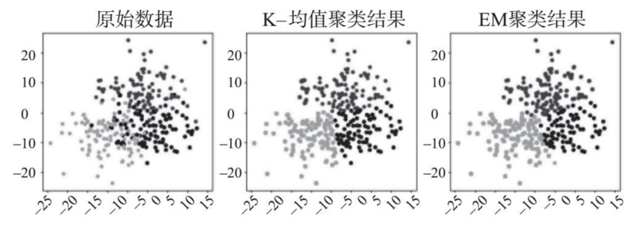

图 4-1 聚类示意图

### 4.1.3 分类问题

下面我们来看一下分类，也就是监督学习、离散输出的机器学习。分类要做的是将一个预测函数 f ，作用在个体的特征 x 上，得到想要的输出 f(x)。这个看似简单的识别过程其实是非常强大和灵活的，基本上所有监督学习的过程都可以抽象成这样的形式。预测的目标可以是任何跟业务相关的量，包括顾客的价值、消费者的喜好、借款人的风险、病人康复的概率等。深入理解了人工智能后，你就可以针对你所在的领域，构造出相应的分类问题，从而有效地提升业务。

提到分类，就不得不提 2019 年全国都在热议的话题 —— 垃圾分类。2019 年 7 月，上海正式开始强制实施垃圾分类，个人投放垃圾错误最高可罚 200 元，单位投放垃圾错误最高可罚 5 万元。一时间，垃圾分类成为上海人民生活的主旋律。即便是将垃圾分为了可回收物、有害垃圾、干垃圾、湿垃圾四类，但是由于真实生活中垃圾种类繁多，混合垃圾难以分辨种类，很多人还是会分辨错误。其实国外许多国家实行垃圾分类很久了，分辨多种垃圾的问题也困扰国外人民很久了，所以有很多人工智能公司就开发了基于监督学习的垃圾分类系统。例如日本发那科（Fanuc）的分拣机器人 Waste Robot 就是这样一个垃圾分类系统，该系统内部拥有经过数据集训练的模型，可以通过实时检测来分辨垃圾的类型。

监督学习的模型不是想当然地形成的，它要经过严格的训练和预测环节，这两个环节也是监督学习最基本的环节。

2『监督式学习中，训练和预测，是两个核心环节。此处的信息补充进术语卡片「模型的训练和预测」。（2021-02-27）』

训练环节中：给定一个训练集，由标记样本构成 {(x1,y1), …, (xn,yn)}。所谓标记样本就是既有特征向量 x ，又有对应的标记 y 的一组数据。通过最小化训练集上的预测误差，估计一个预测函数 f，也就是我们的预测模型。需要特别注意的是，训练集都是由样本和对应的标记构成的。例如我手中有大象、猴子、长颈鹿等各种动物的图像，然后给这些图像打上相对应的名称标记（图像和名称标记一一对应），打过标记并且一一对应的图像称为训练集。

预测环节中：在新预测样本 x 上，使用 f 输出预测值 y = f(x)。就比如人工智能经过了刚才关于动物图像的训练，我们再把新的图像输入给它，此时人工智能就可以输出图像上的动物是什么了，这就是预测环节。

在训练阶段，样本的标记是已知的，但是在预测阶段，样本的标记是未知的。就像读书的时候，平时死记硬背的同学不一定考试考得好，考试考得好的同学，也未必在社会上发展出色。机器学习也是这个道理，在新的、未曾见到过的预测集上的预测效果，才是做好机器学习的关键。那么要做好机器学习，也就是训练出一个预测效果好的模型，需要多少数据样本呢？这个问题是无法一概而论的。如果你的数据样本大，行为或模式复杂，要预测的标记本身也会发生变化，那么这个模型需要的训练数据就多。通常，跟训练简单模型（好比后面我们要说的线性模型）比较，训练复杂模型需要的样本也会比较多。

需要注意的是，用来训练的样本一定要代表实际的业务场景，这样机器学习产生的模型才能在实际业务中产出良好的预测效果。如果在实际业务中遇到的预测样本和训练样本的特性相差甚远，那么模型是很难产出良好的预测效果的。比如你想开一家饭店，但却只在上海地区展开饮食喜好的调查，那么你大概会得出「消费者都比较喜欢吃清淡一点的食物」的结论。根据这个结论，你精心研发了一份清淡可口的食谱，但是这家饭店最终选址在川渝地区。可想而知，饭店开业后并不会有太好的生意，因为两地的人群样本对食物的喜好相差很大，上海样本上得出的结论很难在川渝样本上产生同样的效果。

通过前面的阐释，我们已经知道了分类的概念，下面再通过一个具体的图像分类的例子来更加深入地了解分类。如图 4-2 所示，训练阶段我们提供了一组有类别标记的图像，预测阶段，给定一个图像，我们的模型可以输出图像上的物体类别。

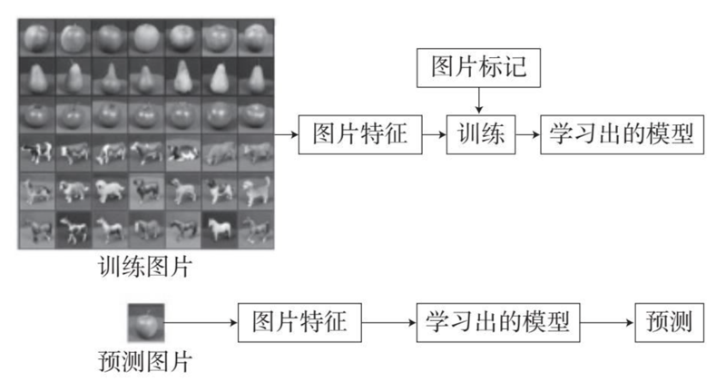

图 4-2 图像分类示意图

训练的时候，我们给了 6 类训练图像，分别是 3 种水果和 3 种动物。每张图像先经过特征化处理，产生图像特征。根据这些图像特征和标记，机器学习能够学习出一个模型。预测的时候，我们给定一张图，把它特征化后，模型就可以针对这个图像特征，输出一个类别预测。

之前提到过，机器学习中，数据以向量形式表示。对图像来说，有很多种向量表示的方法。我们挑选 3 种基本的向量表示方法展开讲解：原始像素值特征、直方图特征、GIST 特征。如图 4-3 所示，原始像素值特征，用的就是原图的彩色或者灰度像素值，把它们拉成一个向量作为图像的表示，这种简单的方法只能表示简单的图像。图像的像素值很容易受到环境中各种因素的干扰，用它们表示复杂图像的内容，可用性不强。直方图特征，是指加工原图像素值，用加工后的像素值分布，而不是原始值来表示图像。GIST 特征，用更复杂的方法来全面表示图像中的场景，能够更好地刻画图像的视觉特点，比如说是自然场景还是人工场景，场景是封闭的还是开阔的。

1『此时此刻看到直方图（不同亮度像素点的部分），直接想到了正态分布，是不是大部分比较常规的图片，其曝光图部分（直方图）基本是符合正态分布的，最和谐的。（2021-02-27）』

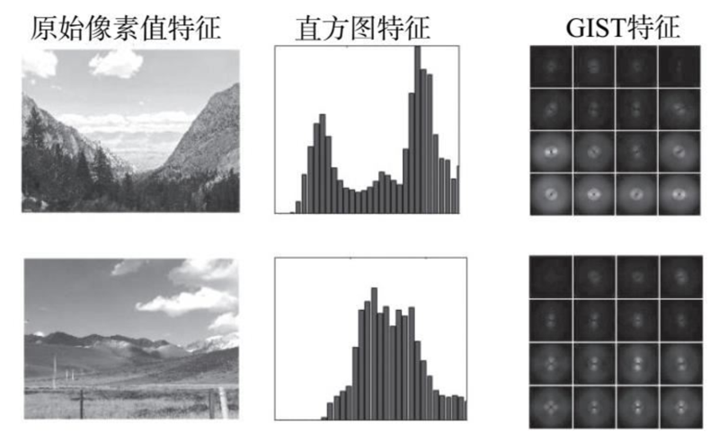

图 4-3 图像的特征向量表示方法

对于图像来说，设计的特征越精巧，在机器学习中，图像识别的效果就能够做得越好，但是人的肉眼却很难看明白这些复杂的特征。人工智能和人的思维方式不一样，对于人来说很直接的原始图像，计算机却很难处理；而构造精妙的图像特征向量，人则不一定能看明白。

### 4.1.3 最近邻分类

前面以图像为例说明了机器学习分类的过程，下面我们来了解一种基本的分类方法：最近邻分类。这种方法不需要训练环节，只需要针对输入数据的距离定义。

2『分类问题，做一张主题卡片。（2021-02-27）』——已完成

如图 4-4 所示，我们用方形和圆形分别表示两种不同的训练样本，一个新的预测样本会根据离两类训练样本距离最近的数据点，来确定自己的分类。也就是说，如果和预测样本最近的样本是方形样本，我们就把它分类为方形，相反，如果和预测样本最近的样本是圆形样本，我们就把它分类为圆形。

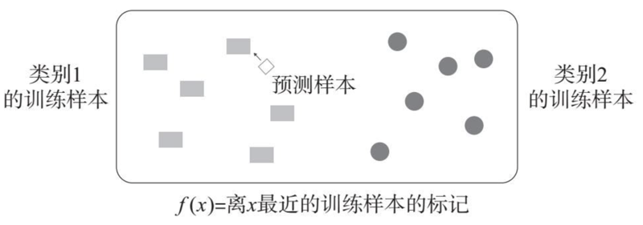

图 4-4 最近邻分类示意图

这个分类过程类似人的思考过程，好比我们对一个不熟悉的物品，一个没去过的地方，一个不认识的人，我们会下意识地把它跟我们接触过的物品、地方、人做对比，用一个我们熟悉的事物的类别作为对这个新事物类别的「预测」。人的思维如此，机器学习也应用了这个原理。

虽然最近邻分类比较简单，但是它在很多实际场景里的应用效果尚能差强人意。有的时候，你可能并不知道要用什么样的模型来分类数据，那我建议你试试最近邻分类，先看看它能产出什么效果。对最近邻分类有了一些了解后，下面我们来介绍更多的分类模型。

### 4.1.4 线性分类和 K - 近邻分类

在机器学习领域，线性分类是一种经典的分类方法，它的目标是寻找一个线性函数，直观上也就是一条线，来分割两类数据，如图 4-5 所示，在这条线的一边是方块的一类，另一边是圆形的一类，而且这条线与两边的距离要适中。

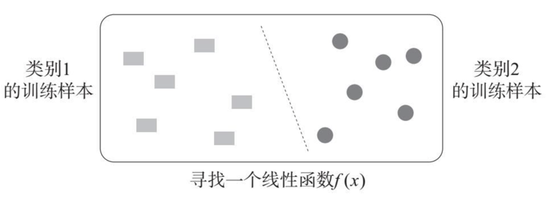

图 4-5 线性分类示意图

当然，分割线未必只能在纸上，也就是在二维空间里画的线，它也可能是三维空间里的一个平面，又或者是高维空间里的超平面。这个线性函数可以在任意维度的空间里，它取决于机器学习任务中特征向量的维度。例如，我们有 2 000 张花花草草的照片，如图 4-6 所示，每张照片由这个高维空间中的一个点表示。如果要把这两千张照片按花和草来分类，那这个线性函数就是图 4-6 所示的超平面。（因为我们无法看到高维空间里的超平面，所以这里的超平面用平面来表示。）

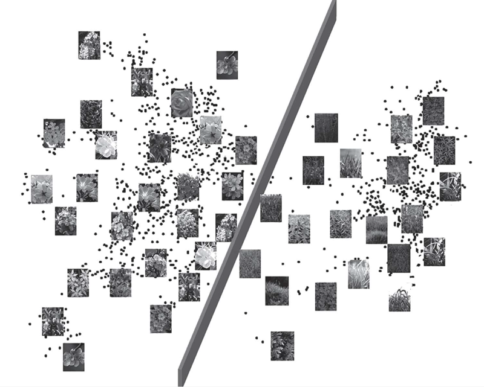

图 4-6 高维空间线性分类示意图

我们实现线性分类的方法叫作最小二乘法，又称最小平方法。通过最小二乘法可以计算出进行分类的这个线性函数的参数，也就是说可以计算出一条分类的最佳分割线。原理上，这个划分两类的分割线，要能充分「拟合」两边的训练数据，不能相差太远。但既然是拟合，就难免会有误差，在数学上，最小二乘法就是通过最小化误差的平方和来寻找最佳拟合的线性函数的。不论你的特征向量维度是多少，最小二乘的方法论都是通用的。理解了线性分类，我们就能理解更多的机器学习模型。机器学习最终学习出的函数形式可能会很复杂，不一定是线性的，但原理上都是通过最小化一个目标值来算出最佳的分类函数。

在实际应用中，线性分类最重要的优势是它的结果易于解读。线性分类会针对每个特征变量，输出一个权重，这个权重决定了变量在分类中的重要性。权重的绝对值越大，变量越重要。如果权重是正数，就意味着变量和预测目标有一定的正相关性；如果权重是负数，就意味着变量和预测目标有一定的负相关性。

举一个简单的例子来说明一下权重。比如你今天到商场逛街，逛累了之后要决定午饭吃些什么。那你就需要收集商场里所有能吃饭的地方的信息 —— 当然可能不需要复杂到建立一个模型，但是肯定也会在大脑里经过思考。假如你十分喜欢吃辣的食物，可以接受面食，不喜欢吃甜食，那么在这次决策里，吃辣的食物以及吃面食这两种变量所对应的权重就都是正数，只不过吃辣的食物权重更高，而吃甜食的权重就是负数。最终你的选择是这些变量的加权线性组合决定的：权重是正数的变量，权重数值越大，相应方案被选择的可能性就越大；权重是负数的变量，权重的绝对值越大，相应方案被选择的可能性就越小。所以你最后很有可能选择比较辣的食物，比如说川菜。

在人工智能里，除了最近邻分类、线性分类外，还有很多种分类方法，比如下面要介绍的 K - 近邻分类。K - 近邻分类的一般原理是给定一个训练集，输入新的样本，在训练数据集中找与该向量最邻近的 K 个样本。这些样本多数属于哪个类别，就把该新样本分到这个类别中。最近邻分类可以看作 K＝1 的情况。

我们举个例子来更好地理解 K - 近邻分类。如图 4-7 所示，下面是我们收集的几部电影的数据：主要统计的是电影中的战斗镜头和拥抱镜头的数量，还有电影的类型（未知电影除外），比如电影 A 中有战斗镜头 4 个，拥抱镜头 109 个，电影 A 为爱情片。

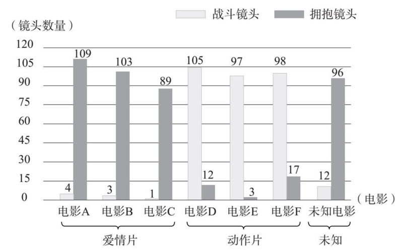

图 4-7 电影镜头数据统计图

根据上述收集的电影数据，我们可以计算出已知电影和未知电影的距离，如图 4-8 所示。

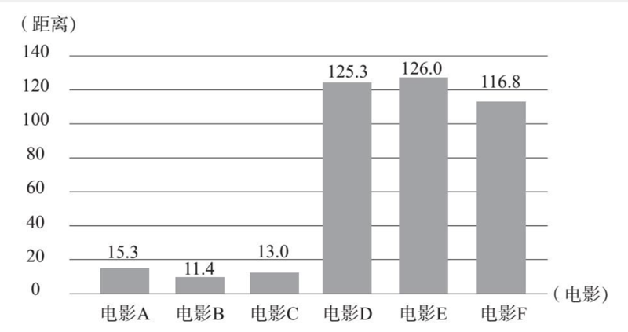

图 4-8 电影距离数据统计图

按照距离的递增排序，可以找到 K 个距离最近的电影，假定 K=3，则三个最靠近的电影依次是：电影 B、电影 C 和电影 A。所以未知类型电影的类型应该和离它距离最近的电影是一样的，所以它应该是爱情片。

除了 K - 近邻外，还有逻辑回归、支持向量机、决策树、随机森林和深度学习等模型。这些模型各有各的特色，就像是十八般武艺，了解之后你也能在实践中使用它们，做到游刃有余。最后，让我们再回到机器学习问题的本源，我们需要建立模型做出准确的预测，不同结构的模型都是通过数据学习出来的。模型在实践中的预测效果以及对业务的提升，都需要相应数据的支撑。一旦模型学习好了，人工智能就会像人在经验中总结出规律一样，在面对新问题时，帮助我们做出正确决策。

这个世界对于我们来说充满了太多的未知，需要我们不断地去探索和发现。人工智能的出现让我们在面对新的事物、新的问题时不再不知所措。不论是针对有标记的事物还是未标记的事物，机器学习都可以有效地进行预测，最终形成决策并为我们提供参考，帮助我们有章可循地认识这个世界，改造这个世界。

## 4.2 AI 感知图像和语音

在实际生活中，我们会遇到各种各样的数据，为了更好地对这些数据进行分析掌握，我们将其分为两类：结构化数据和非结构化数据。结构化数据就是能够用统一的结构加以表示的数据，例如数字、符号等。反之，非结构化数据是指那些字段长度可变，不能够用统一的结构加以表示的数据，如图像、视频、语音、文本等信息。非结构化数据与我们的生活息息相关，我们接下来就来了解一下人工智能是如何处理这些非结构化数据的。

前面我们已经提到过像佳丽的特征脸这种简单图像处理的例子，相信你已经有了一定的图像理解的基础。我们现在要从较为直观的人工智能理解图像开始，层层递进，更加全面深入地讲解人工智能理解非结构化数据的方法。

提到人工智能理解图像，就不得不说计算机视觉。计算机视觉是人工智能在视觉领域的应用，也就是说人工智能理解图像要通过计算机视觉来实现。1966 年，人工智能先驱马文·明斯基让他的一个学生「花一个夏天把相机接在计算机上，让计算机描述它看到的东西」。但明斯基低估了这个项目的难度，他认为只要一个夏天就能让计算机理解图像，但是之后又过了几十年，计算机还是不能很好地理解图像，直到现在，计算机也没有达到能够完全理解图像的高度。要想真正进入千家万户，计算机视觉仍然需要不断改进和提升。

回到人工智能理解图像的正题。图像就是像素值在二维空间的排列，像素可以用 RGB（红绿蓝）三色值来表示，或者灰度值来表示。我们看到的图像无一不是这样类型的数据。虽然人眼能够很简单地理解图像内容，但这对人工智能模型来说却非常复杂。所以我们从以下几个方向对图像理解展开讲解：图像特征、图像分割、图像识别和图像中的目标检测等。

### 4.2.1 图像特征

图像特征主要包括图像的颜色特征、纹理特征、形状特征和空间关系特征。对图像特征的描述分为全局描述和局部描述。全局描述可以通过原始像素值特征、直方图特征、GIST 特征这三种方法来实现，但是因为局部描述比全局描述更细致，所以下面我们主要来介绍局部描述。

局部描述是计算机视觉研究的一个基本问题，它主要用来寻找图像中的关键点，进行物体特征的数字化描述。提到局部特征，首先要想到的是 SIFT 特征。SIFT 全名是尺度不变特征转换（Scale-Invariant Feature Transform），是一种用来检测与描述图像中的局部特征的计算机视觉模型，能够在空间尺度中寻找极值点，并提取出相应的位置、尺度、旋转不变量。尺度可以理解为图像的模糊程度，类似于眼睛近视的度数，尺度越大细节越少。不变量是指计算机视觉识别的图像中物体的本质特征。比如你拍同一个杯子，在不同的角度和位置拍出来的杯子大小以及杯子上花纹的角度位置都是不一样的，但是计算机视觉识别的是杯子的本质特征，虽然位置、大小、角度都发生了变化，但是杯子本身没有发生变化。这个由加拿大教授戴维·洛（David Lowe）总结完善的特征计算方法，在计算机视觉的发展史上非常有影响，在很多涉及图像的人工智能应用里都可以找到它的身影。

局部图像特征的检测与描述可以帮助识别物体，我们在观察一个物体时，如果角度、距离甚至光线不同，我们观察的结果也会有些许误差。但 SIFT 特征是基于物体上的一些局部外观的关键点，与图像的大小和旋转无关，对于光线、噪声、轻微视角改变的容忍度也比较高。例如图 4-9 中的两张照片，它们是同一个物体在不同的视角下拍摄而成的，在这两张照片上存在 SIFT 特征的对应关系，对应的 SIFT 特征用线条连接起来。可以看出，SIFT 特征能较好地描述图像内容，较少受干扰因素的影响。


图 4-9 SIFT 特征示意图

SIFT 特征高度显著且相对容易提取，因而用它很容易辨识物体，而且少有误识。SIFT 特征的本质是在不同的尺度空间上查找关键点，并计算出关键点的方向。SIFT 所查找到的关键点是一些比较突出的点。这些点包括角点、边缘点、暗区的亮点以及亮区的暗点等，它们不易因光照、线性变换和噪声等因素的干扰而发生变化。在人工智能里，这些点对物体的识别和检测非常重要。除此之外，使用 SIFT 特征描述部分遮蔽物体的检测率也比较高。

下面我们来具体讲解一下生成 SIFT 特征的过程。这个过程可以分解为四步。

第一步，尺度空间极值检测：搜索所有尺度上的图像位置，识别潜在的对于尺度和旋转不变的兴趣点。

第二步，关键点定位：在每个候选的位置上，通过模型来确定位置和尺度，根据每个候选位置的稳定程度来选择关键点。

第三步，方向确定：根据图像局部基于像素值变化的梯度方向（像素值增加最快的方向），给每个关键点分配方向。

第四步，关键点描述：在每个关键点周围的邻域内，在选定的尺度上计算图像局部的梯度，从而产生特征表示。

图 4-10 是 SIFT 特征产生的过程。左边显示了图像上一个关键点周边各像素点上的梯度，右边是根据梯度的方向分布生成的直方图，作为该关键点的 SIFT 特征向量。

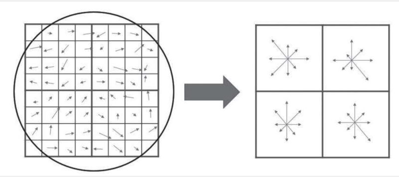

图 4-10 SIFT 特征产生示意图

人工智能里常用的图像的特征向量表示方法还有很多。但是，不论是哪一种表示方法，不论它表示的是全局特征还是局部特征，它都有自己的特点和适用范围。通过特征向量表示图像，从而捕捉全部内容相关的信息，是十分具有挑战性的。

### 4.2.2 图像分割

人工智能感知图像的一个重要应用是图像分割。图像分割就是机器自动从图像中分割出对象区域的过程，这样可以更加容易地获取图像中的内容和特征。图像分割在很多应用场景中发挥了重要作用。例如，在医学影像领域，医院在做肿瘤和其他病理的定位、组织体积的测量、诊断和治疗方案的定制时，都会用到图像分割。图像分割也被广泛应用于卫星图像分析领域，用来定位道路、森林等。此外，我们熟知的一些图像处理软件，比如 Photoshop、美图秀秀，它们的「抠图」功能，本质上也是通过图像分割实现的。

图像分割的一种基本方法是 K - 均值聚类，这种方法在前一节介绍聚类的时候提到过。其具体的过程是这样的：

第一步，从图像上任意选择 K 个像素作为初始簇中心。

第二步，对于剩下的像素，则需要根据它们与这些簇中心的相似度，将它们分配给与其最相似的簇。

第三步，计算每个所获新簇的中心，也就是簇中所有像素特征的均值。

重复第二步和第三步，直至收敛，也就是聚类结果不再发生变化。

如图 4-11 所示，右图是左边原图执行 K - 均值聚类（K=20）后的结果。实际应用中，为了提高速度，人们通常可以先对较大图像进行下采样，也就是均匀地减少像素，然后再进行聚类计算。

在图像分析中，直方图也是十分重要的。图像的直方图能够反映图像像素点灰度值的分布情况。基于直方图的图像分割方法通常会比其他类型的图像更快，因为只需要过一遍所有的像素。在这一过程中，需要先计算所有像素值的直方图，再通过直方图的峰和谷来找图像中的簇。如有必要，可以循环使用直方图来分割图像，找到更小的簇，直到没有新的簇为止。如图 4-12 所示，右图就是左图的直方图图像分割的最终结果。


图 4-11 基于 K - 均值的图像分割结果

图 4-12 基于直方图的图像分割结果

### 4.2.3 图像和视频理解

前面我们介绍了图像特征和图像分割，这些都是理解图像语义的基础，接下来我们就要讲解人工智能是如何识别图像的。前文我们说过人工智能要通过机器学习来产生模型，模拟人脑的深度学习就是机器学习的一种，它允许我们在给定一组训练数据的情况下来训练神经网络模型预测输出。近期的深度学习有了比较大的提升，相对较少地依赖于针对特定数据类型的特征提取，可以实现端到端的处理和学习。端到端处理就是在输入端输入数据后，输出端会直接输出结果，而不用经过复杂的特征提取过程。基于深度学习的人工智能现在已经能够较好地识别图像、视频、文本等非结构化数据，并且识别准确率很高，达到了可以在实际场景中进行应用的水平。尽管如此，理解不同数据类型对应的特征表示，仍能帮助我们更好地理解数据本身的规律和运用 AI 思维。

在人工智能对于图像的识别这一领域，近几年的趋势是通过深度学习来实现图像识别，例如可以用 VGG、Inception 和 ResNet 等深度学习模型来识别。图 4-13 所展示的就是几个通过这几种模型识别图像内容的例子。例如，最左边一列是使用 VGG 识别的图像，对于第一张图像，VGG 认为有 98.14% 概率是足球，有 1.16% 的概率是橄榄球，有 0.42% 的概率是高尔夫球。由此可见，这些模型的正确率还是很高的。

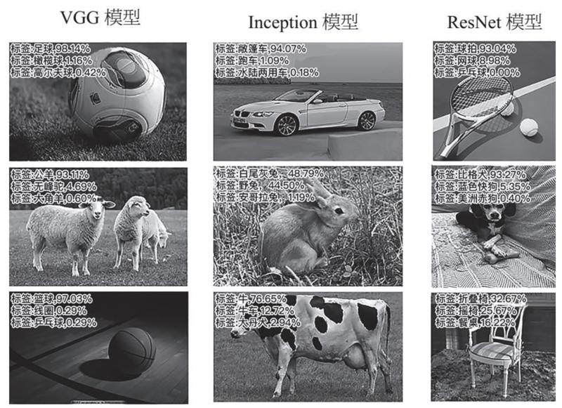

图 4-13 VGG、Inception 和 ResNet 模型图像识别结果

图像中不可能只有我们所要识别的事物。当我们要识别一张照片中某个特定的人物时，这张照片中往往还有一些其他的东西，所以我们要进行目标检测。目标检测的任务是在图像上找到、定位并识别不确定数量的一类物体 —— 需要强调的是，这里的「不确定数量」很重要，对人工智能来说，是有相当的挑战性的。跟图像识别一样，目标检测常用专门的深度学习框架，比如 SSD（Single Shot Detector）、YOLO（You Only Look Once），但检测和识别是不一样的任务。通常，识别的结果是关于一幅图像的类别，而检测要回答的问题难度相对比较高。目标检测的应用场景包括人脸检测、人体检测、车辆检测、商品检测、遥感图像中建筑物检测等。如图 4-14 所示，目标检测模型能够检测出图像中的建筑物、行人和汽车。

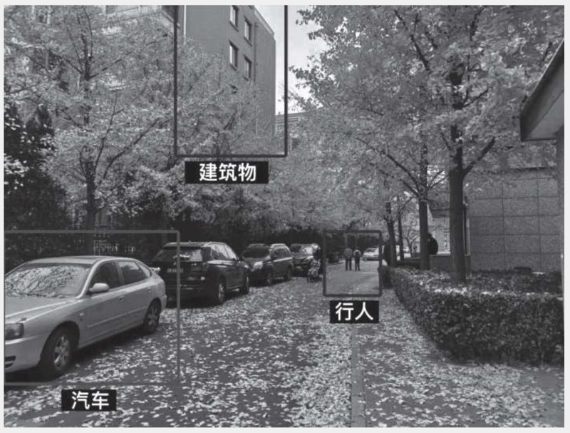

图 4-14 目标检测示意图

几百年前，人们热衷于读书，甚至达到了洛阳纸贵的地步；十几年前，人们进入读图时代，读图成为风尚；而现在，视频成为人们的宠儿，拿起手机看短视频成为越来越多的人的习惯。打开手机、电视看剧，去电影院看电影，我们每个人都是视频内容的消费者，而短视频的兴起又让我们都可以成为视频内容的创造者。视频在我们的生活中的地位慢慢上升，人工智能对于视频内容理解的意义和重要性也相应地不断提升。

从理论上来讲，视频能够将一系列静态影像以信号的方式加以捕捉、记录、处理、存储、传送与重现。简单来理解，视频其实就是很多幅图像在时间上的组合，构成视频的每一幅图像叫作帧。用于测量显示帧数的指标叫作帧率，其单位是每秒显示帧数（Frames Per Second），简称 FPS。由于人眼特殊的生理结构，当所看画面的帧率高于 16 的时候，人们就会认为是连贯的，所以虽然我们看到的是一张张静止的图像，但是却有了动起来的体验。常见的视频编码格式有 AVI、MPG 等，在这些格式的视频形成过程中，其实都将视频的信息做了压缩。压缩后的文件变小，就更有利于处理、存储和传送了。

视频有哪些特征呢？首先，视频是由图像组成的，图像的特征也是视频特征的一部分。除了图像特征之外，视频中物体的运动也给我们的分析带来了新的特征。视频中常用的表示运动的特征叫作光流（optical flow）。光流反映了物体的运动模式，即反映了物体在某视角下由摄像头和背景之间形成的明显移动。通过视频中的图像序列模型，我们可以估计出运动物体在观察成像平面上像素运动的瞬时速度。

具体来说，光流模型可以计算两幅图像之间的变形，它假设一个物体的颜色在前后两帧没有巨大而明显的变化。基于这个思路，我们可以得到相应的图像约束方程。假定不同附加条件的光流问题对应不同的光流模型，常见的模型是 Lucas-Kanade 模型，如图 4-15 所示，我们在图片上显示了计算中的光流向量，向量的箭头表示的是像素运动的方向。

当我们检测出光流向量之后，就可以进一步生成 HOF 特征。HOF 的全称是 Histograms of Oriented Optical Flow，它可以对光流方向进行统计，得到关于光流方向分布的直方图。这个直方图表示了在不同的二维方向上，各分布了多少光流向量。由于 HOF 能够表示出视频中物体运动的本质特点，所以经常用于视频中的动作和事件识别。

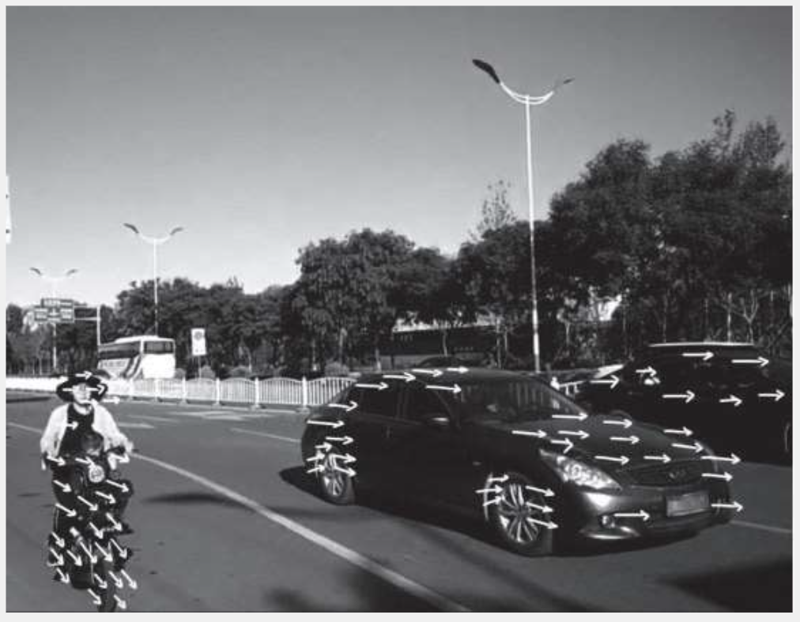

图 4-15 光流示意图

通过光流向量和 HOF 特征对视频处理后，我们就可以通过人工智能识别出视频中的物体的运动了。但是在视频中，我们要识别的目标一般是运动的，如果要对这个目标进行识别，就需要对其进行跟踪。目标跟踪是指给出目标在跟踪视频第一帧中的初始状态，比如目标的位置和尺寸，自动估计目标物体在后续帧中的状态。如图 4-16 所示，视频中跟踪的目标通常会用一个矩形的框来标注。

如果视频中有我们感兴趣的人或物体，可以用目标检测的方法先检测到它，然后再跟踪。这样，我们就不止在一帧中获得了这个人或物体，还能一直跟踪他在哪儿。这在商业场景上大有用处，比如超市想知道消费者的行为轨迹，就可以采用检测和跟踪相结合的方法。商场公共区域都设有摄像头，通过摄像头记录下来的视频，人工智能可以识别出消费者在某家店停留的时间长短和相应的行为，然后估算消费者的消费概率。商家通过人工智能知道了消费者在商场里的完整行为轨迹后，可以做出许多帮助提升体验、促进消费的优化，比如在合理的位置设置休息区，以供消费者休息，这样既可以消除消费者的疲劳，又可以延长其在商场里停留的时间，购买商品的概率也会有所上升。

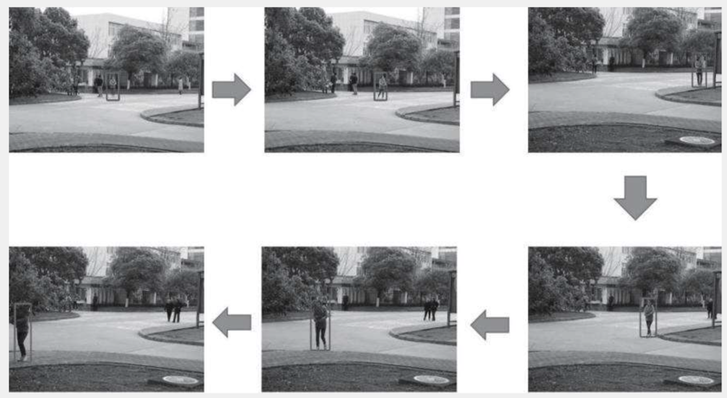

图 4-16 目标跟踪示意图

很多人会通过看电视剧或者电影来打发时间。在看电视剧或电影的过程中，我们能够轻而易举地分辨出电影电视剧中的主角和反派。近几年来，随着人工智能的视频识别不断发展，人工智能也变得和人类一样，在看电影和电视剧的时候，能够分辨出哪些是「好人」，哪些是「坏人」。并且通过这个功能，人工智能还可以对视频中的人物进行社交分析。

那么，人工智能是怎样做到从视频中分析人物之间的社交关系的呢？首先，通过观察可以发现：在与不同的人的交往过程中，人们选择的交互方式也是不同的。比如说，在日常生活中，一个人与比较亲密的同事、恋人之间的交互方式，和与疏远、有敌意的人之间的交互方式，往往是不同的。所以我们就定义了一个指标，叫作结合信号（grouping cue），它能够决定不同人物之间更可能属于何种关系（如亲密或疏远，友善或敌意等）。

然后，在视频中的每一个场景中提取相应的特征向量，通过有标记的训练数据和机器学习模型，学出人物间的结合信号，然后通过模型把这些结合信号整合起来，形成一个人物间的社交网络。有了社交网络，就可以分析人物中有几个社区和每个社区的领袖是谁。人工智能对电影和网络视频中的人物进行社交分析后，能够分辨出视频中有几组人，每组人的领袖是谁。如图 4-17，在电影《加勒比海盗：黑珍珠号的诅咒》（左上、右上）中，左边是善良的一派，领袖是杰克·斯伯洛；右边是阴险的一派，领袖是巴伯萨。在电影《哈利·波特》（左下、右下）中，左边的是正义的一派，领袖是哈利·波特；右边是邪恶的一派，领袖是伏地魔。

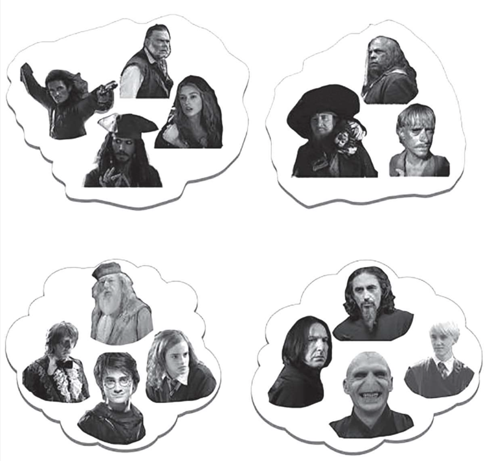

图 4-17 视频中人物的社交分析示意图

### 4.2.4 语音理解

每天我们都听到的声音，在计算机中是以时间序列存储的。也就是说，在计算机中，声音是一串随着时间变化的数字，这串数字代表了在一个时刻声音信号的强弱。就像理解图像和视频一样，人工智能理解音频首先要提取特征。音频的特征主要包括：时域特征和频域特征。时域特征比较好理解，就是在信号时间序列上加工得到的对其的直接描述，包括信号幅度和信号能量等。其中，信号幅度是指信号上下波动的范围，信号能量一般与信号的振幅和持续时间有关。

要想理解频域特征，就不得不提傅立叶变换。傅立叶变换是一种分析信号的方法，它可以分析信号的成分，也可用这些成分合成信号。傅立叶变换，能将满足一定条件的函数表示成不同频率正弦或余弦函数的线性组合。在不同的领域，傅立叶变换具有多种不同的变体，例如连续傅立叶变换和离散傅立叶变换。音频信号的傅立叶变换为我们提供了一种极佳的表示形式。

计算频域特征需要先把信号进行傅立叶变换，然后才能生成频域特征。频域特征主要包括基础频率、频率组成、频谱中心、频谱流量、频谱密度等。因为不同的正弦或余弦函数对应了不同的频率，而频域特征是对音频的傅立叶变换的描述，所以被称作「频域」。频谱是频率的分布曲线，可以表示一个信号是由哪些频率的弦波组成。

跟图像一样，音频数据也可以切分，上述音频特征就可以用在音频分割中。与直观的图像分割不同，音频分割有两种类型：第一种是在时间上将音频切分成几段，每段包括了特定的声音信息，例如对话、音乐、动作声响、环境声响等，这是时间上的分割；第二种是把音频中同一时间叠加的声音分割开，产生若干个并行的音频流，分别对应各自的声源。这种分割对应的是音频信号在各个时间和频率上的分割。

音频理解的一个广泛应用是语音识别：亚马逊的 Alexa、小米的人工智能音箱「小爱同学」、机器人玩具、自动客服等场景中都在使用。那么，语音是如何转成文字的呢？图 4-18 显示了语音识别的全过程，这一过程通常有以下几个部分。

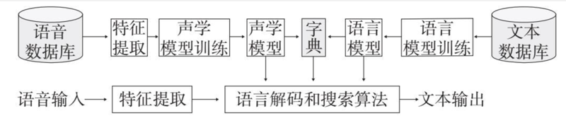

图 4-18 语音识别过程示意图

首先，是声学模型，声学模型是语音识别系统的重要组成部分。声学模型需要从语音数据中提取 MFCC（梅尔倒谱系数）特征。对人耳听觉机理的研究发现，人耳对不同频率的信号有着不同的听觉敏感度，其中，从 200Hz 到 5 000Hz 的信号对语音的清晰度影响最大。并且，对于人耳而言，低频音容易掩蔽高频音，高频音不易掩蔽低频音。基于这样观察得到的特征，MFCC 特征表示，在噪音较高的环境里，MFCC 特征仍然具有较好的语音识别性能。根据 MFCC 特征建立的 GMM-HMM 模型（高斯混合 — 隐马尔可夫模型），可以作为语音识别所需的声学模型。其中 GMM 用于对语音声学特征的分布进行建模，HMM 则用于对语音信号的时序性进行建模。这组 GMM 和 HMM 结合的模型，不但能捕捉单个 MFCC 特征，并且能够体现 MFCC 在时间上的变化，从而模拟出人耳对声音的感知。

其次，是语言模型，可以通过训练文本数据学习 N-gram 模型（N 元模型）。不论在哪一种语言中，词的出现都是有统计规律的，比如当我说「柳暗花明」这个词时，你想到的下一个词是什么呢？我想大家很有可能会想到「又一村」，基本上没有人会想到「又一花」或者「又一树」吧。N-gram 模型的主要思想就是这样的，它能够根据统计规律预测出一个词的前后内容。常用的是建模两个连续词的 Bi-gram 模型和三个连续词的 Tri-gram 模型，分别对应二元和三元的 N-gram 模型。有了这些模型之后，给定一个语音的输入，在生成特征后，通过声学模型、语言模型和已知的字典（也就是我们有哪些候选词作为输出），进行计算和搜索，语音识别系统就可以产生相应的文本输出。

目前，在环境安静、发音标准的情况下，语音识别模型已经完全可以对语音进行识别了，而且识别的准确率很高。但是这种准确率是有条件的。不论哪一款语音识别软件，如果将其放置在一个嘈杂环境下，或者当使用者的普通话不标准、带有口音时，语音识别的准确率都会大打折扣。提高在不同环境下通用语音识别的准确性，是语音识别一直以来的发展方向。

我们赞美天的湛蓝，海的宽广；我们歌颂诗的美妙，曲的动听。何其有幸，我们一出生就拥有看见、听见这个世界的机会。我们拥有感知这个世界的能力，人工智能因我们而生，我们帮助它更好地去体会这个世界。现在，海量数据驱动下的图像识别、视频识别、音频识别给了人工智能这个机会。也许人工智能并不理解在一层层模型下产生的技能到底代表了什么，但却能够帮助我们真正地实现「眼观六路，耳听八方」。

## 4.3 AI 理解自然语言

自然语言通常是指一种自然地随文化演化的语言，例如汉语、英语及其文字。自然语言可以表情达意，是人类沟通交流的工具，同时也能促进人类思维的发展。对自然语言的理解是人工智能的一门重要功课。同时由于自然语言的复杂性和多样性，对于自然语言的理解和处理也充满了挑战。但是我们在日常生活中并不常用「自然语言」这个词，自然语言是一个抽象的概念，我们一般从它的具体形式 —— 文本，展开研究。

要想理解文本，首先就要理解文本的特征。BOW 特征可以帮助我们更好地理解文本特征。BOW 全称是 Bag of Words，也就是词袋模型，它是自然语言处理领域常用的一种文本表示方法。在使用 BOW 特征的过程中，需要将每篇文章都看成一个「袋子」，这个「袋子」里面装的都是词汇，所以称之为词袋。BOW 最初是用于文本分类的，它通过将文本表示成特征向量来实现文本的分类。它的基本思想是忽略文本中的词序、语法和句法，只将文本看成是词汇的集合，而且文本中的每个词都是独立的。举个例子，有如下两个文本：

文本一：

Alice likes to play basketball, Bob likes too.

（艾丽斯喜欢打篮球，鲍勃也喜欢。）

文本二：

Charlie likes to play tennis.

（查利喜欢打网球。）

基于这两个文本，构造一个词典：

```
词典 = {1."Alice", 2."like", 3."to", 4."play", 5."basketball", 6."Bob", 7."too", 8."Charlie", 9."tennis"}
```

这个词典由 9 个不同的单词组成，利用词典的索引号，上面两个文本分别可以用一个 9 维向量表示，下列整数表示的是某个单词在文本中出现的次数，见表 4-2：

表 4-2 单词在文本中出现的次数

| 词典 | Alice | like | to | paly | basketball | Bob | too | Charlie | tennis |
| --- | --- | --- | --- | --- | --- | --- | --- | --- | --- |
| 文本一 | 1 | 2 | 1 | 1 | 1 | 1 | 1 | 0 | 0 |
| 文本二 | 0 | 1 | 1 | 1 | 0 | 0 | 0 | 1 | 1 |

在上述例子中，向量中每个元素表示词典中相关元素在文本中出现的次数。但是通过上表我们可以发现，在构造文本向量时，并没有体现单词在原来句子中出现的次序。这是 BOW 表示的缺点之一，不过这并不影响人工智能对于这一文本的理解。试想，如果一篇文本中人群、大厦、银行、商场这样的词汇多些，而牛、羊、山谷、稻田这样的词汇很少，即使没有按照顺序排列，我们也能做出一个大致判断，得出它是一篇描绘城市的，而不是描述乡村的文本。

假定现在有一个很大的文本集合，里面有许多的文本，我们将文本里面的所有单词提取出来，构成一个包含 N 个单词的词典。通过 BOW 特征，每个文本都可以被表示成为一个 N 维向量，而人工智能非常擅长于处理数值向量。这样，我们就可以通过 BOW 特征来完成海量文本的分类以及其他任务了。

但是，BOW 特征有一个缺点，就是它无法反映出一个句子的关键词。比如上面的文本一中，「like」出现次数最多，若根据 BOW 特征提取这个句子的关键词，则为「like」，但是这个句子中的「basketball」也很重要，这是 BOW 无法准确提取出来的。我们用 TF-IDF 可以很好地解决这个问题。

TF-IDF 也是一种常用的文本特征的表示方法，它的主要思想是：如果某个词在一篇文章中出现的次数高，并且在其他文章中很少出现，则认为这个词是该文章的关键词，通过关键词就可以很好地对现有文本和其他文本进行区分。在 TF-IDF 中，TF 是词频，term frequency；IDF 是逆文档频率，inverse document frequency。在这个特征中，需要将词频和逆文档频率相乘得到对应词的特征值。

TF 表示词条在一个文本中出现的频率，在一个文本中出现次数越多，这个词的 TF 值就越高，就说明它对该文本越重要。IDF 反映了词条在所有文本中出现频率的逆向值，如果一个词在很多的文本中都出现了，那么它的 IDF 值就会低。相反，如果一个词很少在文本中出现，那它的 IDF 值就较高，说明这个词具有较强的代表性。两者的乘积可以用在特征向量中作为数值来表示一个词，从而改进 BOW 形式的表示。由于 TF-IDF 能够准确找出文本中的关键词，所以特别适合用来进行文本相似度对比、文本分类、信息检索、关键词提取以及文本摘要。现在很多搜索引擎、论文网站、新闻网站都应用了 TF-IDF 特征。比如，当你想要了解某些信息时，你会在搜索引擎上输入关键词，而搜索引擎之所以可以帮你找到答案，是因为它应用了 TF-IDF 特征来计算它检索出来的文本和关键词之间的匹配度。如果它发现这个关键词在某个文本中出现的次数最多，而在其他文本中很少出现，那这个文本就是你需要的答案。

### 4.3.1 词嵌入

词嵌入，也就是 word embedding，它也是表示文本特征的一种方式，可以将自然语言表示的单词转换为计算机能够理解的向量形式。简单点来理解，我们都知道文本有千千万万，文本构成的维度也不计其数，所以 BOW 会产生很高维度的特征向量，而词嵌入将词映射到一定维度的连续向量，就能使得这个连续向量的维度比较低，例如几十到几百。产生词的向量之后，我们就可以进行这些向量间的运算，比如通过向量之间的相似度来度量不同词语之间的语义相关性。

词嵌入基于的假设是：如果两个词经常在相同的上下文中出现，那么这两个词的意思应该相近。所有学习词嵌入的方法都是在建模词和上下文之间的关系。如图 4-19，我们举了些词嵌入的例子。相似的词被映射成相近的向量，差别大的词映射以后对应的向量差异也比较大。所以「足球」与同样是球类的「篮球」距离很近，而与形容味道的「好吃的」距离很远。由此可见，通过词嵌入，词之间语义相似性可以被比较恰当地编码成向量了。


图 4-19 词嵌入示意图

近年来，智能手机的普及，使得网络信息迅速增长而且更加碎片化，微信消息、微博、商品评论等短文本大量出现，并逐渐成为网络文本信息的主流形式。短文本的稀疏性、不标准化、数据规模大且标注少等特征，给传统的基于长文本的数据处理带来了新的挑战。而词嵌入具有两个作用：维度缩减和语义扩充。词嵌入的维度缩减消解了短文本不标准、规模大的难题。词嵌入将语义相似的短文本投影到向量空间中的同一区域，这样产生的语义特征又可以作为补充信息，解决短文本语义稀疏、难以理解的局限性。词嵌入的应用提高了短文本分类的精度，为人工智能理解现在大量泛滥的短文本信息提供了帮助。

### 4.3.2 文本分类

文本分类是对文本内容的识别。通过我们上文提到的文本特征化方法，再结合机器学习方法，就可以实现对文本数据的分门别类，例如每天发生的新闻铺天盖地，但是利用文本分类我们就能迅速地将其归为娱乐类、体育类、经济类新闻等。我们每天所接收到的信息也十分泛滥，比如每天都会收到来自四面八方的邮件，里面不乏垃圾邮件。这时，文本分类就派上了用场，一般的电子邮箱都会有文本分类的功能，将收到的邮件分为正常邮件和疑似垃圾邮件两类。

作为一种特殊的文本分类，情感分析是对带有感情色彩的主观性文本进行处理和分析的过程。情感分析可对不同文本进行处理，其中包括基于新闻评论的情感分析和基于产品评论的情感分析。新闻评论是指在关于新闻热点事件的评论中，发表观点的人包括社会中各个层次的人，不同层次的人表达的情感态度或观点不同，这能够反映出很多信息。对于新闻评论的情感分析，可以掌握大众对于新闻事件的思想动向，有利于政府和新闻媒体机构舆情监控工作的展开。

产品评论表达了消费者对一件商品各种功能的满意程度，是一种重要的市场反馈信息。通过基于产品评论的情感分析可以了解某一产品在用户心目中的口碑和用户的关注点等，为产品销售提供科学、可供决策的信息，而且有利于指导商家改善商品，提高用户体验。

例如现在要对某手机的产品评论做出情感分析。这个分析是从用户评论数据出发的，但是这些产品评论都是用户自由发表的，不能保证每一条都有意义，所以我们要对数据进行清洗，以此来保证获取的商品信息的质量。数据清洗后我们就要对评价对象和评价观点进行分析。对于手机来说，评价对象就是价格、系统、处理器、内存这些内容，当然也包括快递、售后等其他服务。评价观点一般分为积极、消极、中性这三类。例如「人脸识别和指纹识别速度非常快」可以标记为积极评论，「不好用，手机烫得要命」可以标记为消极评论，「也没有说的那么好，没啥特别的，也就还行吧」就可以归入中性评论。然后统计每一个评价对象所对应的三类评价观点各有多少，然后我们就可以对这些评论进行情感分析。比如该手机总评论数最多的对象是「外观」，这说明用户在购买手机时十分注意手机的外观，商家在开发新的手机产品时可以重点提高手机的美观度。假如用户对该手机外观的评论有 80% 是积极的，那说明用户对于该手机的外观比较满意，这是该手机的一个优势，商家在开展营销时可以以此为重点。

开发新产品时，也可以借鉴该手机外观上的一些特质，保持用户对手机品牌的满意度，相反，如果对该手机外观的评论有 80% 是消极的，就说明用户对该手机的外观不满意，这是该手机的劣势，那商家在开展营销时就要学会避重就轻，重点突出该手机的其他优势，开发新产品时还要及时改进。同理，对于其他评价对象的情感分析也是这样进行的，这样就可以全面地掌握这款手机的市场反馈信息，为商家不论是开展营销活动，提升用户体验，还是后续研发新产品提供参考。

文本情感分析还可以用在哪里呢？文本情感分析还可以预测股票价格的变动。这其中的奥秘是，人工智能可以从社交媒体中获取大众情绪变化的特征，利用这些特征，可以通过情感分析大致预测出大众情绪的变化。而事实上，公众情绪的变化又能在一定程度上影响股票价格的变动。就是说，文本情感分析可以根据大众情绪的波动预测股票价格的变动。

论文《推特情绪预测股票市场》（Twitter Mood Predicts the Stock Market），讲的就是公众情绪对股票价格变动的影响，由于其思维的先进性和研究的科学性，被大量引用。推特在美国是类似于微博这样的平台，用户可以在这个平台上记录分享自己每天的故事和情绪。这篇论文的主要研究思路是利用推特用户发表的内容数据，通过两种情绪分析方法 OpinionFinder 和 GPOMS（谷歌情绪状态简况），来抓取和分析公众的情绪变化。其中 OpinionFinder 是将人的情绪区分为正面和负面两类，而 GPOMS 将情绪分成六类，分别是平静（calm），警觉（alert），有信心（sure），活力十足（vital），友好（kind）和高兴（happy）。通过分析，文章发现公众情绪与股票价格指数有一定相关性。因此，该文作者大胆假设：公众情绪的某些指标可以有效地预测股价的变动。他们对此展开了一系列的研究，在一个复杂神经网络模型的基础上，将公众情绪的时间序列输入到该模型中，得到的预测效果比较理想，其预测股票价格指数收盘价涨跌方向的准确率高达 86.7%。

随着人工智能的普及，基于文本分析的应用涉及各个领域，而文本数据在日常生活中又随处可见，比如你随手拿起的一本书，你无意中瞥到的广告词，你无聊时刷到的朋友圈，都可以是人工智能理解的文本数据。机会都是留给会思考有准备的有心人的，所以你在平时也可以想一想，你所了解和接触到的这些文本数据，能不能用起来，可以产生怎样的实际价值，说不定就可以成为人工智能的下一个风口。

### 4.3.3 实体识别

随着互联网的高速发展，人们获得信息的渠道越来越多，获取信息的方式日益简单。但是，随之而来的是信息的数量呈指数级增加，而且混乱无序，真假难辨。要想仅仅使用人力从海量的文本数据中获取所需要的信息，也变得难如登天。人工智能的出现解决了这一难题。人工智能通过一系列自然语言处理模型能够提取出复杂文本数据中的关键信息，而自然语言理解的关键步骤就是实体识别。

实体识别又叫命名实体识别（Named Entity Recognition，NER），是指识别文本中具有特定意义的实体，比如说人名、地名、产品名、属性名、日期、数字等。实体识别要做的就是从非结构化的输入文本中抽取出上述实体，并且可以按照业务需求识别出更多类别的实体。在应用过程中，实体识别的确切含义需要根据实际情况来确定，比如，在面向生物的实体信息抽取时，还包括细胞、蛋白质、基因、核糖核酸、脱氧核糖核酸等特殊生物实体。

实体识别在信息提取、问答系统、句法分析、机器翻译等领域应用广泛，在人工智能自然语言处理模型的应用过程中具有重要意义。例如在机器翻译中，有些人的名字在翻译成英文时把名放在前、姓放在后，而有些人的名字就直接用中文的汉语拼音来表示。实体识别可以准确识别出文本中是哪一种形式，大大提高了机器翻译的准确性。作为信息检索系统的一种高级形式，问答系统能用恰当的自然语言回答用户用自然语言提出的问题。当用户提出问题时，问答系统能够对可能的答案进行实体识别和深度分析，然后将最适合的答案呈现给用户，为用户营造一个信息丰富、答案准确、反应迅速的信息获取环境。

由于数量、时间、日期、货币等实体具有统一形式，我们通常可以对它们用模式匹配的方式取得较好的识别效果。但相比之下，人名、地名、机构名较复杂，识别难度很大，普遍存在嵌套和缩写的识别问题。例如「清华大学第一附属医院」这个组织机构名称里面还嵌套着同样可以作为组织机构名称的「清华大学」，再比如，有时人们会把「河北大学」缩写为「河大」，但是「河南大学」的缩写也是「河大」，这就对进行实体识别造成了很大的困难。而且新词汇也在不断涌现。例如随着互联网的发展，一些没有任何规则的网名昵称也为实体识别的进行带来了新的挑战。因此，近年来的实体识别主要以人名、地名、机构名这几种比较复杂的实体识别为主要的突破方向，由原来的单独针对人名、地名等进行识别的方式，发展到用更优化的方法同时进行各类实体的识别。近几年来，实体识别的效果有了显著提高，在各个领域得到普遍应用。

比如说，实体识别在旅游行业有着很大的发挥空间。实体识别在旅游行业的主要应用是对旅游景点的识别。例如，游客可以通过在旅游网站上检索来了解景点的信息，这个过程就涉及了对旅游景点的实体识别。目前对于旅游景点识别的困难主要有：旅游景点数量众多，建立旅游词库工作量大。据不完全统计，仅北京这一个城市的旅游景点就有 6 000 多个，幅员辽阔、地大物博的整个中国大地，旅游景点更是不计其数。旅游景点名称没有固定的格式和规律可循，给实体识别造成了困难，比如北京地安门大街附近的一个湖叫作「后海」，天坛公园里有一个小的景点叫作「皇穹宇」；景点名称经常采用缩写形式，也提高了实体识别的难度，比如「八达岭长城」「居庸关长城」都简称为「长城」。但现在的实体识别模型已经可以很好地解决这些难题了。还是以北京为例，我们首先需要构建一个北京旅游景点词库，词库建立之后经过一系列去重操作和人工审核，得到有效的景点词表。在此之后，通过该词表对旅游文本进行标注，并构建模型训练集和预测集。通过对训练集的反复学习训练，最终，对旅游景点实体识别的预测准确率可以做到很高，有人通过上述方法得出了 95% 的准确率。这样，游客想要了解各种旅游景点时就不会出现检索不到的情况了。

除此之外，实体识别在新闻传播领域的应用也很有前景。由于新闻报道会涉及体育、财经、科技、时尚、教育等社会生活的各个领域，所以对涉及领域的常见专有名词都需要有一定的识别精度。此外，新闻报道都具有时效性，所以也需要关注与热门资讯和突发事件相关联的实体，例如 2019 年 5 月，华为注册了「华为鸿蒙」商标，以及之前大火的电视剧《陈情令》等，这些新产生的、具有很大热度的实体都是需要识别的。现在的实体识别能够自动识别那些未被收录到词表中的词，并且从中发现新词，不仅满足了新闻传播领域精准识别实体的需要，还能帮助媒体行业进行更精准的内容挖掘、对内容进行更有效的监督管理，推动了新闻朝智能化方向发展。

我们已经讲过了人工智能对于图片、视频和文本这些非结构化数据的识别。在人工智能出现之前，这些数据就似汪洋大海一般一直存在，但人工智能的出现，才真正赋予了它们价值。AI 思维就是这样，在已有数据基础上挖掘其未竟的巨大的隐含价值，给予我们做出更好判断和决策的能力。人工智能对于非结构化数据的理解是 AI 思维的一个重要组成部分，我们只有充分理解了这些数据处理的方法论，才能更好地利用人工智能支持决策。

## 4.4 AI 理解商业数据

前面我们讲到了人工智能可以理解图像，具有人脸检测、商品检测等功能；可以理解视频，具有动作识别、社交分析等功能；可以理解语音和自然语言，具有语音识别、文本分类、实体识别等功能。这些都是从具体的某一类型的数据出发的，人工智能对这些非结构化数据的理解是为了更好地为我们的实践提供帮助。下面我们要具体讲解人工智能是如何通过其理解和学习能力直接为商业实践赋能的。

商业实践的基础是商业数据。所谓商业数据，是指在一个行业内各个环节中涉及数据的集合，包括企业内部数据、分销渠道数据、消费市场数据等。通过人工智能对商业数据的理解和分析，我们就可以知道在这个行业中，用户的需求是什么，哪些需求已经被满足了，哪些需求还没有被满足，整个行业还有什么「处女地」没有被挖掘，行业的创新点和决胜点在哪里，以及自己公司的优势、劣势和独特点在哪里。只有这样，我们才能准确地进行市场细分，确定目标用户，制定更加个性化、精准化的营销方案；也只有这样，我们才能准确地进行产品定位，提供让客户更加满意的服务。

人工智能可以通过 SIFT 特征等对图像进行理解，可以通过光流模型等对视频进行理解，可以通过 N-gram 模型等对语言进行理解，那么人工智能是如何理解复杂的商业数据的呢？

### 4.4.1 你被标签化了吗？

我们在注册一个新软件时，软件会让我们勾选一些标签来更好地了解我们的喜好。在许多平台发文章前，平台也会让我们为文章勾选标签，因为这样可以帮助我们更好地定位内容与读者。我们每天都在被贴标签，我们也在给别人贴标签。当我们谈论起 80 后时，我们总认为他们是「叛逆」的一代；当我们谈论起 90 后时，我们觉得他们是「问题青年」；当我们谈论起 00 后时，我们说他们是「新新人类」。不管是哪个年代的人，我们都对他们有相对应的标签，甚至连「80 后」「90 后」都成了一种标签。这些标签都是人们根据他们的性格特点、人生经历做出的总结概括，在一定程度上反映了真实现象。有了这些标签，我们就可以更好地理解对方，甚至被贴上相同标签的人还能迅速拉近距离。现在很多人也通过贴标签的方式被大众熟知，比如网络上有的人因为和一些知名演员长得相像，就给自己贴上诸如「小林志玲」「小吴彦祖」等标签，迅速提升了知名度；还曾有某歌手凭借「四千年一遇的美女」的标签登上热搜成为「国民女神」。人工智能也是通过为数据打标签的方式来理解商业数据的。

标签是一种用来描述业务实体特征的数据形式。比如在描述一个用户时，我们会使用性别、年龄、地区、兴趣爱好、产品偏好等标签来反映该用户的特征。商业数据标签的生成过程以发生在时间和空间中的行为为媒介，将物的特征传递到人，人的特征传递到物。在这个过程中，物包括实物、商品、文本、图像等。标签传递过程形成了一个由人和物为节点，以行为为边的关系网。如图 4-20 所示，在很多实际商业场景下，需要把人打上标签，比如他经常和一些讲诚信的人合作，这样的社交行为多了，他也会被打上「诚信」标签；若他和一些经常毁约的人交往比较多，那和他合作就有一定的风险；他平时购买的运动用品比较多，他就会被贴上「运动」的标签；又或者是他平常喜欢收听科技类音频课的话，他就会被打上「科技」的标签。除了对人打标签外，对物也需要打标签。物包括自然语言的语料，比如说一部英文原声大片，其台词转录成文本以后，也可以打上标签。

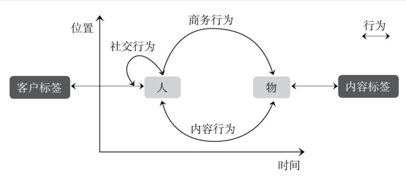

图 4-20 商业数据标签生成过程示意图

### 4.4.2 数据标签化

为数量巨大的商业数据打标签是一个庞大的工程。它有什么必要性呢？首先，根据上述分析我们知道，数据标签化，无论在理解人的属性行为还是理解对应内容的属性上，都是一套非常重要的方法论。其次，在信息爆炸的现在，商业数据的体量也是巨大的，而且它们结构十分复杂，分布在许多不同的数据库中。在实际场景中要应用这些数据时，我们发现很难把这些规模巨大结构复杂的数据直接分析或者用于模型训练。但是在实践中发现，通过分类，可以将杂乱无章的数据条理化，将数据标签化其实就是一种分类。标签化的数据结构更加简单，而且非常容易管理。标签本身就是在分析系统中产生的，所以具有较好的兼容性，可以直接作为训练数据导入训练模型，减少建模的数据准备时间，也极大地提高了数据使用效率。所以，不管是从人工智能理解数据的难易程度还是数据使用效率角度，数据标签化都有优越性。

标签通常是人为规定的高度精练的特征标识，如年龄、性别、兴趣爱好、产品偏好等，将这些标签集合在一起就能抽象出一个用户的信息全貌。首先我们要知道，标签体系基本上都是层级化的。每个标签体系都分为几大类，每个大类底下分别有几个小类，逐层分布。在标签体系中，最高层级的那一级标签称为「一级标签」，以此类推，底下是「二级标签」「三级标签」等。底层标签一般能捕捉到更细的特点信息，所以经常用于精准的广告投放和营销活动，比如说某个用户被贴了一个三级标签「购物方式 — 支付方式 — 信用卡」，在这个标签中，信用卡是底层标签，说明了该用户在购物时经常使用信用卡支付，信用卡对他的生活很重要，所以此时信用卡相关的广告投放对他就很有吸引力，又或者我们可以对应他信用卡支付的习惯向他推荐各种分期付款或者刷信用卡支付的商品。这样就满足了该用户的需要，还迎合了他的习惯，对提高广告投放效果和营销的精准度有很大作用。一般而言，每一个标签都只有一个含义，这样就不会发生同一层级的标签重复或者冲突的现象了。另外，信息粒度是指信息的相对大小和粗糙程度，不同层级的标签对应的信息粒度不同。一般来说，底层标签的信息粒度会相对更细。下面是一些常见类别下的细粒度标签。

表 4-3 常见类别下的细粒度标签

| 类别 | 标签 |
| --- | --- |
| 人口特征 | 年龄、出生日期、性别、地域、教育程度、职业、星座等 |
| 兴趣特征 | 兴趣爱好、浏览内容、收藏内容、使用App类型、使用网站类型、品牌偏好、产品偏好、阅读偏好、互动内容等 |
| 社会特征 | 婚姻状况、家庭情况、子女状况、社交渠道偏好等 |
| 消费特征 | 商品品类、价格区间、收入状况、已购商品、购买渠道偏好、最后购买时间、购买频次等 |

下面我们再来介绍一下各类标签构建的先后顺序。这个先后顺序需要综合考虑实际的业务需求以及构建的难易程度等。因为业务需求各有不同，所以我们这里就只介绍按照构建难易程度来排列的先后顺序，如图 4-21 所示，这是一个化妆品商家的用户标签体系。

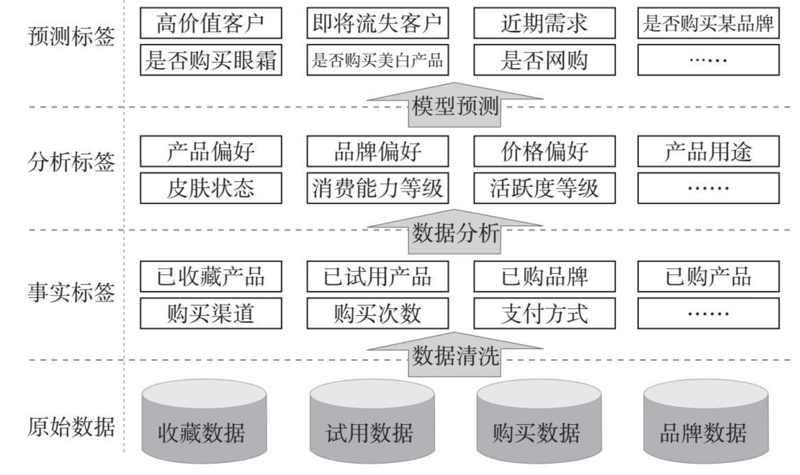

图 4-21 化妆品商家用户标签体系示意图

原始数据就是我们数据库中这些数量庞大、结构混乱的数据。在原始数据基础上构建的是事实标签。事实标签的构建可以是对原始数据的直接提取，也可以是对原始数据的简单统计。事实标签的构建过程并不复杂，但是在这个过程中，我们加深了对数据的理解，也清楚了数据的分布情况，为后续标签打下了基础。在事实标签基础上分析加工形成的是分析标签，分析标签的建立是整个数据标签化过程中的重要步骤。最后构建的是预测标签。预测标签需要通过机器学习预测模型来建立，例如我们可以根据某用户对产品试用的评价来预测他是否购买该产品。需要注意的是，原始数据可能并不完善，比如数据中并没有该用户的年龄信息，这时就需要建立一个模型来预测。模型的预测也是建立在这个用户的其他行为特征上的，例如我们可以根据该用户是否上学、工作岗位等信息来预测他所在的年龄段。在商业场景中，为用户打标签的过程又称为「用户画像」。

### 4.4.3 数据标签化助力企业营销

下面我们来看一下数据标签化是怎样在营销领域应用的。图 4-22 是一个银行的营销类标签体系。对于银行来说，数据标签化的第一步是统一用户标识，统一用户标识之后，用户的信息都汇聚在了一起，这样就可以对用户一贯的行为轨迹形成认知。这时再看银行数据，就能够有效地利用用户的属性数据、行为数据以及 CRM 数据等。属性数据包括年龄、性别、住址、习惯等；行为数据包括用户在银行存钱或者借款等一系列行为形成的数据；CRM 数据就是银行与用户进行过一些营销层面的沟通而形成的数据，比如银行向该用户推送过什么类型的广告和权益等都会有相关记录。对这些数据进行分析总结就可以形成基础行为标签和基础用户画像。当银行知道了用户的基础行为都对应了哪些标签，也就对用户画像有了一定的了解。通过基础行为标签和基础用户画像就可以形成场景化标签。比如要做营销，会有一套标签；要控制风险，会有一套标签；要推广一套产品，会有类似的其他标签；等等。场景化画像形成之后就可以对用户进行全方位的画像，比如用户是谁，哪些用户是有价值的，用户需要什么，对哪些商品感兴趣，如何选择沟通的媒介等。总体来看，数据标签化的应用过程就是用户数据在统一用户标识的基础上逐渐往上发展，最终形成对用户场景化认知的过程。

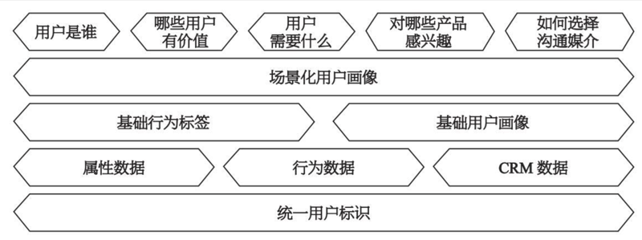

图 4-22 营销类标签体系示意图

图 4-23 是一套具体画像的例子。比如这套画像是针对金融机构用户的。例如，用户对旅游、电商以及交通出行等感兴趣，这些是一级行为标签；再往下细分，金融里面有理财、保险、贷款等二级标签；金融保险里又可以产生车险、少儿险这样的三级标签。这些标签都是根据用户的行为产生的，比如某个用户经常浏览金融理财页面，就会有金融理财标签。根据这些用户行为标签，还可以推出用户人口属性标签。但人口属性标签不全是事实性数据，比如我们不知道一个用户是否有车，但我们可以通过机器学习模型预测出来。假如这个用户平时上下班和周末都是乘坐地铁公交，或者是打车，那他有车的可能性就很低。通过行为数据还可以大致预测出用户所处人生阶段，是已婚还是未婚、中年还是老年等。

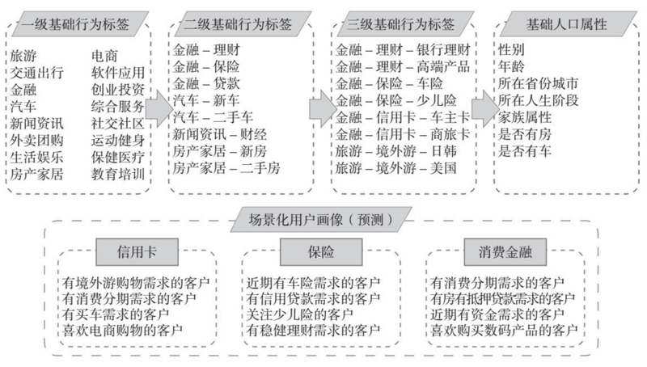

图 4-23 场景化用户画像示意图

通过上述数据能产生多个级别的标签维度，这些标签维度是对用户行为的刻画，通过机器学习方法从用户的行为又可以推知用户的其他属性。这些行为和属性维度可以用于场景化画像，预测客户在具体场景下会有什么需求。根据图 4-23 中金融机构的标签体系，可以预测出跟信用卡、保险、消费金融相关的用户画像，从而为实际的营销和运营活动服务和赋能。比如要做信用卡项目，可以将信用卡的广告信息推送给有境外游购物需求的客户；要做保险项目，可以将保险项目信息推送给有车险需求的客户；要做消费金融项目，可以将相关项目信息推送给有消费分期需求的客户；等等。因为客户的需求和推广的项目都是相对应的，广告营销的针对性和准确性就相对较高，客户购买产品和服务的可能性也就相对会有所提升。

### 4.4.4 深度学习数据标签化

前面具体讲了数据标签化的过程，接下来我们看一下深度学习是怎样进行数据标签化的。深度学习是对人类神经网络的模拟，它对原始数据一层一层地进行分析和学习，最终会给一个句子、文本或者用户打上相应的标签。当我们拥有一套完整的标签体系之后，就可以将这套标签体系下的训练数据用来训练深度学习模型，深度学习模型就会知道哪些数据应该打上哪一类标签。经过深度学习后，人工智能就可以自动打标签了。如图 4-24，这是一个深度学习标签化的一个具体示例。

我们现在有一个句子「曹雪芹是中国古代四大名著之一《红楼梦》的作者」。如果要把这个句子打上标签，可能会有「名人」「图书」这样的相关标签。那么，这套标签是如何通过深度学习加工出来的呢？

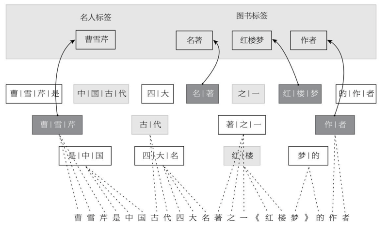

图 4-24 深度学习标签化示意图

首先，深度学习并不知道「曹雪芹」是一个词，它也有可能将「芹」和「是」放在一起看作一个词。但通过大量语料训练以后，深度学习会发现「曹雪芹」更可能是一个词，因为很多语料中「曹」「雪」「芹」这三个字都是组合在一起的，所以「曹雪芹」三个字会聚集成关键词。通过大量文本训练后，深度学习能学出「名人」标签对应的关键词。因为名人经常与「曹雪芹」有关，所以「曹雪芹」就关联上了「名人」标签。同样，深度学习可以自动将「曹雪芹是中国古代四大名著之一《红楼梦》的作者」这句话中的「名著」「红楼梦」「作者」这些关键词贴上图书标签。深度学习通过大量的语料学习，知道哪几个字该放在一起形成词，哪几个字不是放在一起的，并且把关键词和相应的标签关联起来，这就是深度学习理解句子的方法论。

数据是 AI 思维的基础。大数据时代，只有理解了数据，人工智能才能产生决策、创造价值。数据标签化是人工智能处理数据和理解数据的重要工具，更是人工智能理解商业数据的关键环节。数据标签化使我们知道了用户最想要的是什么，在营销过程中，我们就可以精准地投放用户最想要看到的广告；在研发过程中，我们也可以设计出真正符合用户需求的产品。基于数据标签化的商业实践真正做到了有的放矢，它也为未来商业开辟了新的发展空间。

## 4.5 AI 理解消费数据

数据按结构类型分为结构化数据和非结构化数据，我们在前面几节讲过了图像、视频、音频、自然语言这些具有代表性的非结构化数据的处理。下面我们就来了解一下人工智能是如何处理结构化数据的。我们只挑选其中有代表意义的两种数据展开讨论：消费数据和社交数据。很多机构都有这样的数据，那么，通过人工智能来解读它们，可以得到什么价值呢？首先我们来看一下消费数据。

### 4.5.1 消费数据

根据国家统计局数据，2019 年全年国内生产总值为 990 865 亿元，而全年社会消费品零售总额就高达 411 649 亿元。一个人的消费就是另外一个人的收入，用户的消费就是商家的利润来源，消费是拉动整个商业社会向前发展的驱动力，消费数据不仅能反映出社会整体的经济水平，而且对一个企业的经营和发展具有非常重要的指导意义。接下来我们就来了解一下什么是消费数据。

一般来说，消费数据指的是个人在商家购买商品而形成的数据，这个范围非常广泛，与我们的日常生活息息相关。大到买房的消费，小到买一块口香糖的消费，都是消费数据的一部分。

消费数据主要分为以下两类：第一类是购买不同类型的商品而形成的数据，例如在电商网站上的商品分为饰品、鞋靴、数码、电器等一系列类型，在日常生活中，用户也会根据自己需求的不同来购买形形色色的商品；第二类是在不同的时间购买商品而形成的数据，比如用户在春天购买的商品与秋天购买的商品的金额就会有所不同，又或者一个用户在「6·18」年中大促购买了一件商品觉得质量很好，然后在「双 12」时又购买了一件同样的商品。不论哪一类消费数据，都能够有效地反映出消费者的需求与特点。

消费数据的种类不同，用到的处理方法自然也就不同。下面介绍两种数据处理的模型框架：一个是推荐模型，一个是 CLV，也就是客户生命周期价值模型。它们分别对应上面说的两类消费数据相关的场景。

### 4.5.2 推荐模型理解消费数据

听同事说最近新上了一部电影特别好看，我们周末路过电影院不自觉地就去看了这部电影；看到网上很多人说一家店的食物做得特别好吃，我们就会去品尝一下到底有多么美味。我们日常生活中的很多购物消费行为都会受到各种推荐的影响。这些推荐可能来自身边人的分享，也可能是商家的广告营销，它已经成为影响消费的一个重要因素。在人工智能领域中，推荐模型指的是通过分析数据，预测用户需求，再将满足需求的商品和服务推荐给用户的人工智能模型。随着商品种类和数量的快速增长，用户需要花费大量时间和精力才能挑选出最适合自己的商品，所以能够根据用户需求向用户推荐商品的推荐模型，有很大的应用价值。

提到推荐模型，就不得不提及世界上最大的在线影片租赁服务商奈飞。奈飞的电影租赁业务之所以能做到世界头部位置，很大一部分原因是奈飞网站搭建了电影推荐模型。当一个用户在奈飞网站看完一部电影后，他会根据自己的喜好为这部影片打分。这些分数就成为推荐模型的参考数据，推荐模型可以根据这些数据来判断用户是否喜欢某部电影，可能喜欢哪种类型的电影，然后根据预测出的用户需求来向用户推荐电影。为了让自己的推荐模型更加个性化、更加准确，奈飞在 2006 年还组织了一个推荐模型大奖赛。在这个比赛中，只要参赛者能够最大地优化奈飞的推荐模型，就能够赢得 100 万美元。在高额奖金的吸引下，很多做机器学习的高手都来参赛。最终比赛的结果是，奈飞的推荐模型的推荐准确率提升了 10%，整个产业界推荐模型的发展也因此向前迈进了一大步。权威杂志 IEEE Computer 为此曾专门介绍相关推荐模型。下面我们就来了解一下奈飞的推荐模型具体是怎么工作的。

首先我们要知道，奈飞的数据很多，构成了一个庞大的矩阵。在这个矩阵中，每一行对应的是一个用户对不同电影的评分数据，每一列对应的是一部电影收到的不同用户评分数据。比如说一个用户评价过 5 部电影，在奈飞的数据矩阵中，属于这个用户的那一行里就有 5 个非零的数字，来表示这个用户对电影的评分。奈飞大奖赛里获胜的团队用的就是矩阵分解的模型。矩阵分解就是把庞大的矩阵分解成两个小的矩阵，它采用的是降低维度的思路，是把原始矩阵用低维的子空间去拟合。原始矩阵在很高维的空间中，拟合就是用相对低维的空间，比如说用几百个或者几千个维度，来拟合原来更高维的数据。

降维更重要的目的是提取用户本质的行为。通过降维，我们可以在原来庞大的矩阵中提取本质信息，来代表用户兴趣中最稳定的部分，它也是模型可以用来预测行为的部分。比如说在矩阵中，有一个用户看过很多动作电影，而且对动作电影的评分都非常高，那么说明这个用户对动作电影感兴趣，如果向他推荐此类电影，他观看的可能性就会比较高。

通过这样的方法，我们可以预测新的信息。具体是如何实现的呢？当我们用矩阵分解模型把大矩阵分解成两个小的矩阵之后，需要再把这两个小矩阵乘起来，重构一个新矩阵。在这个重构的新矩阵里会有更多非零的数值，而且排列要比原来的矩阵稠密一些。这时就可以根据新矩阵中的非零数值进行推荐，比如选取用户所在的那一行预测出来最大的非零数值，再把这个非零数值所对应的商品或服务推荐给用户。

这就是矩阵分解「协同过滤」思想核心的地方。通过矩阵分解还原用户和商品数据中的规律，再通过重构矩阵来预测出原始矩阵中不存在，但是用户可能感兴趣的商品，然后把它们推荐给用户。为什么这个模型能够准确地预测用户的兴趣呢？比如说，如果许多人都看过某几部电影，那推荐模型就会认为这些人的需求相似，就可以把这个群体中一些人看过的其他电影，推荐给这个群体中没有看过这部电影的人。同样，推荐模型也会认为这些电影之间存在相似性，当这个群体之外的人看过这些电影中的一部，就可以向他推荐这些电影中的其他几部。

为了更好地理解推荐模型，我们下面来举一个实例。如图 4-25，最左边表示的是在某视频网站上观看电影的名称和相应的评分。行对应的是不同的用户，列对应的是不同的影片，分别是《红海行动》《我不是药神》《无名之辈》《芳华》《寻梦环游记》《神秘巨星》，数字表示的是不同用户对这些电影的评分。这个表格其实也可以类比实体商品的消费数据，只需要把影片换成实体商品就可以了。如果想知道一个用户是否对其他商品或商家感兴趣，感兴趣的程度有多高，都可以通过这类推荐模型实现。

从图 4-25 可以得知，第四个用户对《红海行动》的评分为 5 分，对《我不是药神》的评分为 8 分。如果想要继续知道这个用户对《无名之辈》的感兴趣程度，就需要把整个矩阵通过模型做分解。图 4-25 右边的部分展示了分解的过程。首先，我们将大的矩阵分解成两个小的矩阵，左边的矩阵每一行对应一个用户，右边的矩阵每一列对应一部电影。两个小矩阵的每一行或者每一列对应本质的兴趣特征，就像 DNA 存储了生物的基因信息一样。在左边的矩阵里，每一行是关于用户兴趣的 DNA；在右边的矩阵里，每一列是关于影片的 DNA。如果我想知道第四个用户对《无名之辈》的兴趣度有多大，我就可以把第四个用户的 DNA 和《无名之辈》影片的 DNA 乘在一起，算出一个数字，这个数字对应在这个未知的空格中。这个数可能是 8 也可能是 1，如果是 8，代表用户对这部影片的兴趣度很大，如果是 1，代表用户对这部影片的兴趣度很小。

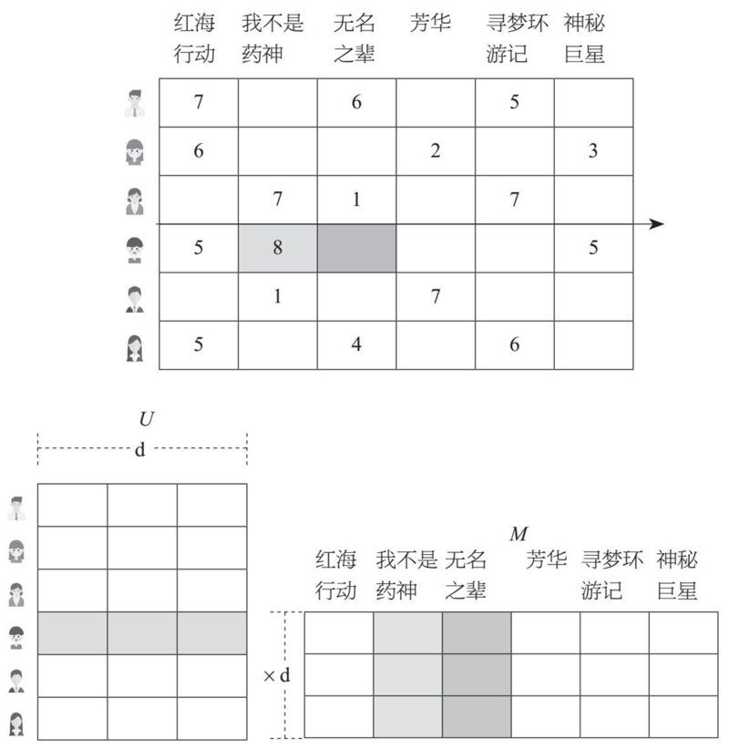

图 4-25 某视频网站推荐模型示意图

现在我们来总结一下矩阵分解模型推荐功能的原理：首先，模型会把消费数据分解为两个小的矩阵，再把矩阵的行和列进行组合，相当于数学上的向量乘法，组合之后就可以预测出行和列交叉处的兴趣值。计算出来的兴趣值大小不一，但是数值越大代表用户的兴趣度越高，所以我们就可以根据兴趣值，向用户推荐他们没有购买消费过，但兴趣值很高的商品或服务。这是各大电商网站推荐商品的原理，也是视频网站上影片推荐的方式。只要用户购买过商品，结合用户的购买行为以及其他具有类似需求的用户的购买行为，矩阵分解模型就可以把最恰当的商品或服务推荐给用户，这是基于消费数据的推荐模型中最基本的框架。

奈飞的电影推荐，电商网站的商品推荐，金融机构向客户交叉销售产品，都可以应用这一类推荐模型。这种推荐模型能够从消费数据中提取规律，为用户推荐最适合他的选择，这是推荐模型最核心的思想。例如，随着生活节奏的加快，人们的闲暇时间越来越少，所以很多人会选择在网络上购物，而各大电商平台也都设置了购买之后的用户评价功能。如果一个用户在购买商品之后给了五星好评，那就说明他对这个商品很满意，这个商品符合他的需求，之后推荐模型就会向与这个用户具有相似喜好的其他用户推荐该商品。

### 4.5.3 客户生命周期价值理解消费数据

接下来我们就来讲一下第二类消费数据处理的模型框架：客户生命周期价值。客户生命周期指的是从一个客户想了解企业的一些信息或者企业想开发这个客户开始，一直到客户和企业的业务关系以及业务的相关事宜完全结束并且处理完毕的这段时间。对于一个企业来讲，客户生命周期描述的是客户与企业的关系从开始到发展再到结束这样不同状态间运动的总体特征，形象地讲，客户与企业的关系经历了诞生、成长、成熟、衰老和死亡这样一个完整的生命过程。

客户生命周期分析经常应用于零售行业，指的是客户从成为某商家的客户并产生业务消费开始，经过消费成长、消费稳定和消费下降阶段，最后完全不在这个商家购物的过程。客户生命周期价值指的是一个公司或者产品预计在与客户的整个业务关系中获得的利润。让客户在生命周期中产生商业价值才是一个企业运营的最终使命，所以企业在运营过程中要尽一切可能来延长客户的生命周期，在客户的生命周期中要尽一切可能来产生商业价值。那么我们如何预测客户生命周期的价值呢？

一般来说，我们都是从已有的消费数据来推算客户生命周期的价值的。从一个简单的角度来讲，对一个客户的消费数据而言，最重要的三个变量分别是：最近一次消费时间（recency）、消费频率（frequency）、消费金额（monetary）。

图 4-26 表示的是一个客户在 6 个月内的购物行为。一个购物车代表一个月，这个客户在第 2 个月和第 5 个月购买了商品，其他时间没有买。在这里，总观察时长是 6，最近一次消费时间是 5，消费频率是 2。掌握了这些变量后，我们就可以计算很多跟消费者有关的指标，比如：客户在将来某个时间点活跃的概率、客户在将来某个时间段购买次数的预期值、客户剩余交易次数的预期值和客户剩余生命周期价值等。其中，客户剩余生命周期价值是 CLV 的一种体现。

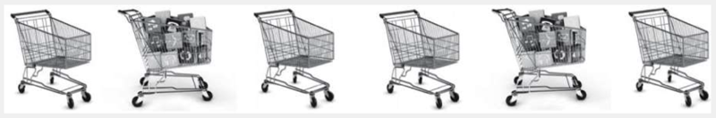

图 4-26 客户生命周期的变量示意图

那么我们是如何计算这些指标的呢？最重要的是，我们需要一个描述客户消费行为的模型，下面来讲一个最基本的 CLV 模型：在每个时间点，客户都有一定的概率购买，也有一定的概率失活，也就是再也不买了。购买概率和失活概率本身也是变量，因此我们要用模型去表示它们。国际著名的《营销科学》（ Marketing Science ）杂志曾有一篇文章讲了这个模型，并得出了一个有趣的结论：上面说的客户在将来某个时间点活跃的概率、客户在将来某个时间段购买次数的预期值、客户剩余交易次数的预期值和客户剩余生命周期价值这 4 个与客户相关的指标，都是可以用最近一次消费时间和消费频率，以及购买概率、失活概率相关的模型参数来表示的。而这些模型参数通过人工智能计算可以求得最优解，将其代入前面提到的 4 个指标后，用最近一次消费时间和消费频率，就可以算出跟客户将来消费相关的一系列指标。这个结论表明了最近一次消费时间和消费频率在消费数据分析领域的重要性。同样，消费金额也有类似的作用。

在与客户相关的 4 个指标中，商家最关心的指标是客户剩余生命周期价值。顾名思义，客户剩余生命周期价值就是客户在之后的生命周期中还有多少价值。比如一个客户在一个行业中的生命周期已经到了消费稳定阶段，那这个客户的剩余生命周期价值就是在消费稳定以及消费下降这两个阶段所带来的价值。剩余生命周期价值的数值可以通过求利润率、每笔交易收入以及客户剩余交易次数的预期值的乘积来得出。商家可以根据客户的剩余生命周期价值来判断，这个客户还会不会购买自己的商品，能够购买多少商品，商家还要不要对这个客户进行营销，如何营销等。这样，商家既能有效地控制成本，又能有针对性地进行推广，广告营销的投资回报率也会相应提高。

除了上述模型外，在客户关系管理中的 RFM 模型也可以用来理解消费数据。RFM 模型能够有效地衡量客户的价值以及客户创造利润的能力，其中的 R、F、M 就是上面提到的理解消费数据最重要的三个变量：最近一次消费时间、消费频率、消费金额。这三个数据是零售商最感兴趣的三个数字，也是在预测客户价值过程中必不可少的三个指标。最近一次消费时间是指客户上一次的消费时间，最近一次消费时间越近的客户，对商品和服务印象越深，再次购买商品和服务的可能性就越大。消费频率是指客户在一定时间段内所购买商品或服务的次数，这个次数越多，那说明该客户对商品或服务的满意度越高，对于企业品牌有一定忠诚度，这样的客户重复购买商品或服务的可能性也就越大，而且还是持续性的。消费金额同理，金额越高说明客户对商品或服务越满意，再次购买的可能性就越大。

通过 RFM 模型可以把客户群区分开，得到不同价值的客户群，比如分成重要维持客户、重要发展客户、重要挽留客户、一般重要客户、一般客户和无价值客户等几个类别。这在智能化客户管理中很重要，很多企业已经对此进行了实践。比如说在没有对客户进行区分的情况下，某家商店可能会付出一定的成本给 1 000 位无差别的用户发短信，通知他们商店有新品上架，欢迎购买，但是可能只会收到 100 个订单。但是有了 RFM 模型之后，商家就可以只将这 1 000 条短信发给重要维持客户、重要发展客户这些购买概率大的客户，付出同样的成本，收到的订单数却会大大上升。而且当 RFM 模型对用户进行区分之后，发的短信就可以不用千篇一律了，比如给那些以前经常购买但有一段时间没有购买过商品的客户，短信的开头可以是「好久不见」，而对于那些在短时间内购买很多商品的客户，短信的开头可以是「恭喜您成为本店的 VIP 客户」。对于客户来说，这样千人千面的短信比那些同质化的短信更具有吸引力，他们再次光顾的可能性也就更大。

人工智能通过客户生命周期的价值来理解消费数据的重要意义是：根据客户有限的消费数据，可以推测他将来是否会继续消费，消费金额是多少。对于那些消费可能性高的客户，商家可以采取相应措施来刺激他们的消费；对于那些消费可能性低的客户，商家也可以采取一些措施来防止客户流失。

消费数据仿佛一棵茂盛的大树，盘根错节，枝蔓横生。但是 AI 思维就是要在这些看似复杂的数据中抓取其最本质的特征，为决策提供依据。理解消费数据的过程就是通过人工智能对这些数据抽丝剥茧、披沙拣金的过程。人工智能理解了消费数据，就可以通过推荐模型提高客户的购买率，可以通过客户的生命周期价值模型提高客户的价值。总之，人工智能理解了消费数据后，就可以从各个角度刺激客户的购买欲，增加企业商品和服务的销量，提高企业的商业价值，对企业的发展起到强有力的推动作用。理解了消费数据，我们就扣住了 AI 思维中的重要一环，在决策中真正做到对症下药，一针见血。

## 4.6 AI 理解社交数据

人类天生就是一种群居动物，社交是我们与生俱来的属性。几百年前人们鸿雁传书交流信息，几十年前人们通过电话与千里之外的人沟通感情。现在，我们动动手指就能在手机上和牵挂的人联系。日常生活中，我们也无时无刻不在与其他人沟通交流。我们离不开社交，每时每刻都在产生着社交数据。这些数据里包含着我们的喜怒哀乐，反映出我们与这个社会的联系，所以我们这一节就来介绍一下人工智能是如何理解社交数据的。

我们在进行社交的过程中，会和许多人建立关系，这样就形成了社交网络。由于我们的时间和精力是有限的，不可能和许多人保持紧密的社交关系。一般来说，一个人的社交网络最大只能包含 150 个人，平均在 124 个人左右。也许你听说过，不论你想要认识谁，只要通过 6 个人就可以认识他，这就是被美国社会学家斯坦利·米尔格拉姆（Stanley Milgram）证明的六度人脉理论。在社交网络中，每个人都是一个节点，人与人之间的关系就是社交网络的边。在现实生活中，以社交网络的节点为基础，通过社交网络的边，就可以拓展我们的人脉。

在社交网络中有一个重要的概念叫作中心性，它表示的是一个节点在网络中处于核心地位的程度。中心性有三种计算方法，分别是度中心性（degree centrality）、中介中心性（betweenness centrality）和紧密中心性（closeness centrality）。

第一种，度中心性。在社交网络中，度中心性表现的是一个节点与很多其他节点发生的直接联系。一个节点连接的节点越多，这个节点也就越重要，处于中心地位，这个是比较直观的指标。比如说，用户甲的社交账号上有 50 个好友，这就意味着有 50 个节点与甲相连接；如果在同样的社交平台上，用户乙的社交账号有 100 个好友，那么乙的度中心性就比甲要高，社交圈子比甲要广。

第二种，中介中心性。中介中心性是指一个节点出现在其他节点之间的最短路径的次数。如果这个节点的中介中心性高，它对整个网络信息的传播就会有很大的影响。例如我们的不少朋友可能都是通过某位社交达人才认识的，那么很显然，这位社交达人起到了中介作用。换句话说，就是这个节点相当于一个关口，和它相连的节点想要到其他节点都得经过它。

第三种，紧密中心性。紧密中心性指的是一个节点到其他所有节点最短路径的和，主要用来考察一个节点在传播信息时对其他节点的依靠程度。如果一个节点离其他节点越近，那么这个节点就不会受制于其他节点，它传播信息的时候也就越不需要依赖其他人。比如，在一个公司里，甲只认识本部门的几个人，而乙除此之外还认识部门外的其他人，那么乙的紧密中心性就要比甲高，因为甲要与非本部门的人进行信息传递可能需要经过乙的搭线，而乙因为本身就认识其他部门的人，则不存在这些限制。

通过这三种方式，我们就可以找到中心性高的节点，也就是找到在社交过程中会产生很大影响的人或者组织。中心的节点有着不可取代的重要性，它们更具有权威性、中枢性、核心性等特征，同时也具有更多的经验和影响力，对社区的形成起着决定性的作用。比如说在营销领域，我们需要挖掘意见领袖，这时候意见领袖就是中心节点，因为，通过意见领袖展开的营销才能更具影响力，更容易被大众相信，营销效果也才会提升。

### 4.6.1 社区发现模型

下面谈谈什么是社区发现。社区是由一组连接紧密的节点组成的，并且这些节点与社区外部的节点连接稀疏。如图 4-27 所示，可以看出图上有三个社区，符合这样的规律。不同社区之间的关系稀疏，因而社区更多地反映的是网络中的个体之间的关联关系。研究网络中的社区对理解整个网络的结构和功能起到至关重要的作用，还可以帮助我们分析、预测整个网络各节点间的关系。社区发现就是在复杂网络中发现这些连接紧密的社区结构，或者说，社区发现就是网络中节点的聚类。举个例子，在一个班级里面，有的学生喜欢文学，有的学生喜欢绘画，有的学生喜欢数学，有相同喜好的学生之间联系会更为紧密和频繁，根据这些交流的频繁程度，可以把整个班级里的同学分成几个不同的社区。又或者说，在公司里，总会有几个联系较为紧密的小群体，例如，一部分人经常聚在一起讨论工作学习，还有一些人经常聚在一起讨论时尚潮流，根据他们之间联系的紧密程度和频率高低，很自然地能够发现这两个人群已经各自形成一个社区。

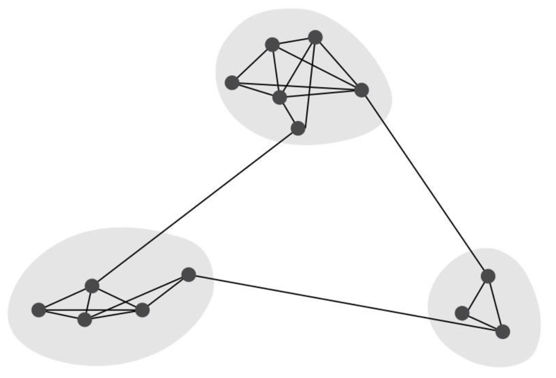

图 4-27 社区示意图

那么，我们怎么去进行社区发现呢？有很多常用的社区发现模型，例如吉尔韦安（Girvan）、纽曼（Newman）等人在 2003 年提出的 GN 社区发现方法（以两位开创者的名字首字母命名），就是社区发现中的一个比较经典的模型。GN 社区发现方法提出了边介数的概念。那么，什么是边介数呢？由网络中社区的定义可知，所谓社区就是指其内部节点的连接稠密，而与其他社区内的节点连接稀疏。这就意味着社区与社区之间联系的通道比较少，一个社区到另一个社区至少要通过这些通道中的一条。如果能找到这些重要的通道，并将它们移除，那么网络就自然而然地分出了社区。在实践中，我们用边的边介数来作为这个分割的依据。

边的边介数定义为网络中所有最短路径中经过该边的数目。跟节点的中介中心性类似，它反映了相应的边在整个网络中的作用和影响力。联系定义可知，通过社区内部的边的最短路径的数目相对较少（边介数较少），而通过社区之间的边的最短路径的数目则相对较多（边介数较多）。因为社区之间的联系只能经由这几条路径发生，就像车流要从停车场开到外面一样，如果停车场只有一条通道，那么车流都得从这条通道走，这条通道的使用率就是 100%，非常高；如果这个停车场内部有 5 条通道，车流可以分散开来，可能每个通道的平均使用率只有 20%，远没有前者高。

2『网络中的边介数，做一张术语卡片。（2021-02-28）』——已完成

GN 社区发现方法是基于删除边的方法，其本质是基于聚类中的分裂思想，原理上使用了边介数作为相似度的度量方法。GN 社区发现通过移除网络中的边来将整个网络划分成为合适的社区结构，将原来的网络分割成为任意数目的社区。在 GN 社区发现方法中，每次都会选择边介数高的边删除。GN 社区发现方法的步骤如下：

第一步，计算每一条边的边介数。

第二步，删除边介数最大的边。

第三步，重新计算网络中剩下的边的边介数。

重复上述步骤，直到产生合适的社区结构。

通过上述步骤，GN 社区发现方法可以较好地发现网络中存在的社区结构。在网络理论中，复杂网络是由数量繁多的节点和节点之间错综复杂的关系构成的。GN 社区发现方法用边介数的概念来探测边的位置，从而在盘根错节的复杂网络中划分出社区。

人与人之间的互动使其相互间产生了或紧密、或松散的联系，也在不经意间建立起了一张张连通社会各个层面的网络：通信往来、商业交易和互联网社交等。社区发现模型可以用来找出网络中的社区聚类，让人们洞察这些网络中隐藏的形形色色的「社区」，也可用于评估一个网络结构中个体组合或分裂的程度，并从中获取很多新发现。

### 4.6.2 社区发现的应用一：推断用户未知信息

我们本来就生活在一张庞大的社交网络之中，随着社交媒体的兴起，社交网络变得越来越复杂。社区发现在近些年的不断发展，使得人们可以对复杂的社交网络进行分析，对于现实生活具有重要的应用意义。我们接下来就从推断用户未知信息、提高营销效果以及发现不良行为团伙三个方面剖析社区发现的应用价值。

社区发现的应用价值之一是推断用户未知信息。随着社交媒体的高度发展，其用户规模也在快速增长，有效的社区发现模型的应用也越来越重要。例如购物网站上的社交购物、商品推荐；微信、微博等媒体的社会舆情分析、意见领袖挖掘等，无论你想要找什么样的信息，都能通过社区发现模型获得启发。如果一个用户的某些信息尚且未知，但是我们知道他所在社区中很多人的信息，那么，我们就可以用这个社区中其他人的信息来推断该用户未知的信息。比如，你发现在朋友圈里有两群人，一群人花钱都大手大脚，入不敷出，另一群人生活稳定有规律，喜欢运动健身、阅读学习。这两群人都要向银行借钱，生活稳定有规律的这群人里，借钱的都还了，那么这群人里还没有借钱的人，一旦借钱，还钱的概率就大；花钱大手大脚的这群人里，不少人借的钱没还，那么，还没有借钱的人，一旦借钱，不还钱的概率就很大。

社区发现之所以可以用来推断用户未知信息，是因为我们可以在真实的社交网络中，通过社区发现找到节点之间的相互关系，利用已知节点的属性信息，推断出未知属性节点的缺失信息。基于社区发现的未知信息推断方法是基于两个假设：属性信息相似的人容易成为朋友，属性信息相似的人群倾向于聚集为社区。如果要推断一个社区中某些用户的未知信息，就要先从社交网络中选取若干个中心性较高的种子节点，通过这些节点的好友数据，运用社区发现模型进行划分，再根据节点的属性信息推断同社区好友的未知信息。实验结果表明，即使当给定的信息只占用户信息的 20% 时，某些用户属性也能够精确推断出来。所以，我们可以通过社区发现模型划分社区，根据未知属性节点所在社区的属性信息推断该节点的未知信息。

社交网络既是交流平台，也是市场营销等活动的平台。在人际关系网中，可以挖掘出具有不同兴趣、背景的社会团体，方便采用不同的宣传策略；在交易网站中，不同的社区代表不同购买力的客户群体，方便运营人员为他们推荐合适的商品。针对社交网络用户社区发现的方法，一般来说，可以基于用户发布的内容提取基于兴趣的用户社区；或者基于用户联系提取基于联系的用户社区；还可以将两个社区进行融合，形成兴趣和联系双重的用户社区。当社区形成之后，这个社区的成员可能就会拥有共同的兴趣或者联系，假如这个社区的大部分成员都喜欢网球，那我们就可以推断，社区的其他成员也很有可能喜欢网球。

社区发现的应用二：提高营销效果

社区发现模型在商业领域有着非常广泛的应用。在电子商务领域中，通过对消费者购买记录进行社区发现，能够挖掘出具有相同或相似购买兴趣的消费群体，发现相关商品的潜在客户并为其进行引导和推荐，进而提升商业价值。例如，通过社区发现模型，我们看到甲、乙两个消费者同属某一个社区，都买了简约风格的装饰画。这时，如果我们还想进一步为乙推荐商品，但苦于目前并没有太多数据，无法得知他的潜在需求是什么的话，可以通过甲的购物记录，发现甲还喜欢买智能手表，推知乙的潜在需求很可能是智能手表，进而做出相应推荐。

通过社区发现模型除了能找到消费者的未知潜在喜好，从而形成针对性的推荐外，还能找到社区中中心性高的核心人群，更好地实现营销触达。例如，我们要对一个社区的人群做营销投放，如果甲的中心性比乙高的话，那么通过甲来做社区整体营销触达的效果会比通过乙要好。因为，甲与社区里的其他人关系更为密切，也更有权威性，经由他来做营销传播，社区人群会更容易接受并采纳，甚至能够转化成实际行动。

在商业领域，有很多通过社区发现优化营销传播，从而实现商业价值的例子。例如阿里的年货节就利用了人工智能社区发现的手段，对品牌的目标人群进行分析，挖掘品牌目标潜在客户，使得其投放效果提升了将近 50%。他们的做法是从品牌方的受众人群出发，进行针对性的营销投放。年货节开发新用户时，先要通过机器学习模型对阿里年货节的受众人群进行预测。预测可以根据往年年货购买人群的数据进行，并以各大节假日促销时的购买数据作为参考，然后以同属一个社区的人有相似的兴趣爱好、价值观为前提假设，再通过社区发现模型找到与潜在消费者有相同或相似喜好的社区人群，利用社交网络关系进行广告投放。比如，一个社区内的大部分用户喜欢运动，经常购买运动类商品，那么我们就可以假设这个社区内的潜在用户也有相同的爱好，也有运动类商品的需求，在进行广告投放时，就可以向其推荐运动类商品。这样，推荐的商品会有很大的可能被购买，这个用户就从潜在用户转化为实际用户。新用户数量逐渐增加，品牌效益也会逐渐提升。

### 4.6.3 社区发现的应用三：发现不良行为团伙

社交媒体的发展让我们能够更加方便快捷地获取资讯，但是人与人之间的交流由于缺乏面对面的真实接触，而变得虚拟了。我们不知道与我们在手机软件上相谈甚欢的那个人的真实面貌，更加不能分辨其中的真伪。在社交网络的保护下，各种诈骗犯罪行为变得越发猖獗。但是，社交网络可以是不良团伙牟利的蜜糖，也可以是将他们困于囹圄的砒霜。基于社交网络的社区发现，一个重要应用就是发现不良行为团伙，打击违法犯罪行为。

例如，每天在家和公司之间穿梭，很多人会选择驾车出行，但是经常穿梭于车水马龙之间，难免会出现一些磕磕碰碰的现象。因此，有车一族都会为汽车买保险。但是保险公司发现，近几年竟然出现了许多车险理赔的欺诈现象。例如，在交通事故理赔中有这样一条规定：如果发生的交通事故不涉及人员伤亡，仅造成轻微财产损失，不需要联系保险公司，可以自行拍摄车辆损失代替现场勘查。有不少人就利用这个漏洞骗取保险金。保险公司曾发现，有部分司机在短期内多次制造轻微相撞事故，骗取保险金。但是事情并没有到此为止，社区发现模型的及时介入使得警方发现了这些司机同在一家公司，于是警方经过调查发现，在这家公司工作的另外几名司机也有同样的诈骗行为，便一举拿下了这个诈骗团伙。

随着经济的高速发展，银行客户群体的规模不断扩大，但与此同时，银行客户群体中也混入了一些不法分子，他们伪装成正常客户群体到银行办理业务，意图牟取非法收入，并且这种违法行为现在越来越团伙化。「近朱者赤，近墨者黑。」团伙化犯罪的成员彼此之间都有联系，所以社区发现模型对于发现不良团伙、维护银行利益具有很大帮助。例如，现在有很多人在大量透支信用卡之后，潜逃或者隐瞒身份来逃避还款，极大地损害了银行的利益。为了防止这一现象的发生，一些大型银行借助社区发现模型建立了银行反欺诈系统。如果一个用户想要申请信用卡，银行会以这个申请用户为节点，调取这个用户所在社区里人员的相关信息，如果这个用户处于不良团伙之内，也就是说，在与他联系比较密切的人里面，大范围出现过类似于恶意透支信用卡这样的金融诈骗行为，那么这个用户就会被划入高欺诈风险的用户范围，他的信用卡申请很有可能会被驳回。此外，利用社区发现模型进行深入调查后，这些隐藏起来的不良团伙也更容易被追根究底，一网打尽。基于社区发现模型的银行反欺诈系统大大提高了银行防范风险的能力，在银行反欺诈领域有很大的应用价值。

人类社会离不开社交，要想让人工智能更好地服务于人类，离不开人工智能对社交数据的理解。正所谓打蛇打七寸，想理解数量庞大的社交数据，理清复杂的社交网络，重点在于理解中心性高的节点；在此之后，我们再结合社区发现模型，找到相应的社区群体，一方面可以精准营销，提升品牌效益，另一方面可以发现不良行为团伙，提升社会效益。不管从哪个角度出发，AI 思维都能够把握住事物的发展方向，帮我们做出正确的决策。