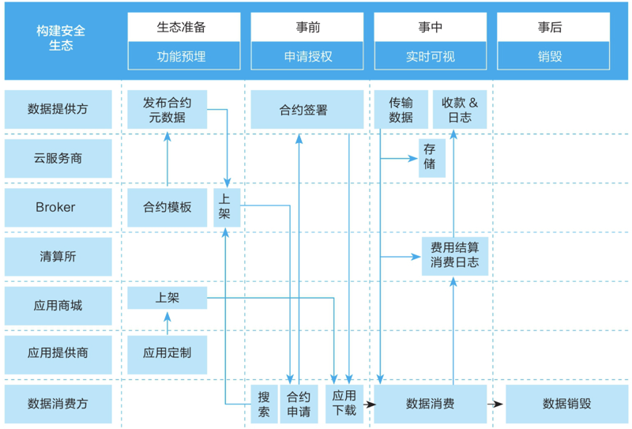
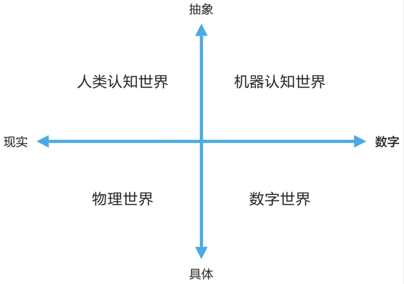

# 1001. 未来已来：数据成为企业核心竞争力

数字化转型不能一蹴而就，数据治理也不是一朝一夕之功。数字化转型带来机遇的同时，也给整个企业的数据治理带来了新的挑战。

基于对华为公司数字化转型的解读，我们建立了数据综合治理体系，发布了信息架构，构建了数据湖、数据底座，打造了数据感知、安全合规能力，提升了数据质量。但是，在数据成为新的生产要素，数据成为企业核心竞争力的情况下，未来已来，面对这样一个新的、复杂的内外部环境，非数字原生企业在数据治理的问题上，做了哪些思考？我们应当如何应对？

## 10.1 数据：新的生产要素

数字化变革改变了人们看待数据的方式。数据不再仅仅被视为商业活动的副产品，而是战略资源，是发展和提供新型数字产品与服务、建立新型数字商业模式的基础。

### 10.1.1 数据被列为生产要素：制度层面的肯定

从制度层面来看，2019 年 10 月，中国共产党第十九届中央委员会第四次全体会议审议通过了《中共中央关于坚持和完善中国特色社会主义制度、推进国家治理体系和治理能力现代化若干重大问题的决定》（以下简称《决定》）。《决定》指出：「健全劳动、资本、土地、知识、技术、管理、数据等生产要素由市场评价贡献、按贡献决定报酬的机制。」这是首次将数据作为与劳动、资本、土地、知识、技术、管理并列的生产要素，从制度层面确立了数据作为一种新的生产要素的重要地位。如何促进数据要素有效参与价值创造和分配，成了数据新时代交给我们的重要课题。

生产要素这一概念，自古典经济学时代以来，就是经济学家们关注和讨论的重点，他们在著作中不惜花费大量篇幅来定义、解析、演绎、推论各项生产要素。人类社会进入数字时代后，数据因其在生产过程中的巨大增值作用而被列为生产要素，这是历史的进步。

2020 年 4 月 9 日，《中共中央、国务院关于构建更加完善的要素市场化配置体制机制的意见》（以下简称《意见》）正式公布。《意见》分类提出了土地、劳动力、资本、技术、数据五个要素领域改革的方向，明确了完善要素市场化配置的具体举措。《意见》提出要从三个方面加快培育数据要素市场：推进政府数据开放共享；提升社会数据资源价值；加强数据资源整合和安全保护。

数据作为生产要素的美好前景在我们眼前展开：加快数据要素价格市场化改革，健全数据要素市场运行机制，并提供组织保障已经提上了议事日程。各地区、各部门间的数据共享交换将得到快速推进，数据共享的责任将进一步明确，公共的、基础的数据资源将得到有效流动。在数据开发利用规范化和数据采集标准化的基础上，数字经济会不断涌现新产业、新业态和新模式。与此同时，数据管理制度得到进一步统一规范，数据质量和规范性不断提高，数据分类分级安全保护制度不断完善，企业商业秘密和个人隐私数据得到更好的保护。

### 10.1.2 数据将进入企业的资产负债表

从企业管理的层面来看，「大数据商业应用第一人」维克托·舍恩伯格在其 2012 年出版的新作《大数据时代》一书中意味深长地说道：「虽然数据还没有被列入企业的资产负债表，但这只是一个时间问题。」当下我们回顾这句话，更加感觉这个「时间」已临近。

根据企业财务管理对于资产的定义，只有被企业拥有和控制，并且能够用货币计量，能够为企业带来经济利益的数据，才能成为企业的生产要素和资产。这三个方面，无疑对我们的数据管理工作和企业的数字化转型提出了努力的方向和要求。也就是说，除了要发挥数据的价值之外，还要重视和关注数据的主权与定价。

数据能创造价值，但数据创造价值的功能并不能由数据自身来直接实现，数据要素也不能直接参与价值分配，而是要经过数据创造、加工并传输给数据要素使用者后，才能创造价值，进而参与价值分配。由此可见，在数字时代，能否掌握数据资产并将其有效转化为生产要素，已经成为衡量一个企业核心竞争力的决定性因素。

从本书前面的内容大家也可以看出，我们始终围绕数据这一新的生产要素的两个方面来论述：第一，如何提高数据资产的利用率；第二，如何降低数据的运行维护成本。

衡量一项资产的价值要从资产未来带来的经济利益来看。对于数据资产而言，应该从最终的应用价值出发来衡量数据价值，而我们采集和整理数据的时候，往往很难确切预计到数据资产后续会如何被使用、会产生多少数据价值，所以对数据资产的价值评估是一个持续更新的动态过程。

在经济学中，国民收入是指物质生产部门劳动者在一定时期所创造的价值，是一个国家的生产要素所有者在一定时期内提供生产要素所得的报酬，即工资、利息、租金和利润等的总和。这表示，劳动、土地、资本、管理等传统的生产要素对最终价值的贡献是加成的。不难想象，因为数据能够提升劳动者能力、加速资本周转、加速知识转化、推进技术进步、提高管理水平，所以数据对最终所得收益的贡献将是一个乘数因子，而非简单的加成。数据对前面几项生产要素所得的报酬或多或少都有提高作用。

### 10.1.3 数据资产的价值由市场决定

数据资产的定价权掌握在市场手中，这就意味着数据资产价值的公允计量取决于市场参与者通过使用资产而创造经济利益的能力，只有努力提高企业自身利用数据资产提升生产效率的能力，才能主导数据资产的市场定价权。我们利用数据资产来提升生产效率的能力，主要体现在提升营收、提高效率、提高质量、提升速度、增加柔性、降低成本、减低风险、品牌增值等方面。而传统做法中，基于数据自身属性（比如数据的数量、质量、及时性、稀缺性、稳定性以及法律限制等）来决定价格的方式，相比之下就缺乏对数据价值的想象力。

作为生产要素的数据资产，其折旧损毁和保值增值是一对永恒的矛盾。数据资产如果不加以有效利用就会逐渐贬值，甚至成为资产负债表上的负资产。实现数据的保值增值，要从扩大数据生态、提高数据活性两方面入手。数据生态会带来数据有效连接的扩大，网络效应获得的数据价值提升往往是指数级的。数据的活性既包括数据自身的时效与质量，又包括使用者对数据的认知和黏性。

当然，数据与传统的生产要素的特点不同，数据的交易、定价、主权保护、收益分配等方面也还存在很多理论空白。可以想见，在不久的未来，在经济学界将掀起对这一生产要素的研究热潮。比如，通过数字化转型促进了企业资产的保值增值，但企业的数据资产自身的变现与保值增值仍然是一个开放的研究课题。

## 10.2 大规模数据交互的企业数据生态

相对于数字原生企业来说，非数字原生企业更需要通过数字化转型来实现变革，共同构建以数据为中心的商业生态系统。平台化的数据生态系统为商业模式创新带来了更多机遇，在生态系统中，众多企业围绕共同的客户价值主张，通过竞争与合作方式发展各项能力。相比之前，生态伙伴的作用及彼此之间的数据流正在发生根本性的变化。生态系统是数据经济中的一种多边组织形式，它与其中的个体及整个共同体均是互利双赢的关系。

### 10.2.1 数据生态离不开底层技术的支撑

在万物互联的智能世界，数据工作所依赖的绝不是一个封闭的系统，而是一个开放的生态。尤其是在大数据时代到来之后，多类型、多形态的数据可能会给我们带来超出预期的收益。对数据生态的梳理和发掘，也会降低依赖于单一数据供应来源所导致的单点失效的风险。

未来的业务不断变化和发展，企业对于数据的需求没有边界。如何建立跨越企业边界的数据共享平台，建立安全可信的数据生态，以尽可能低的成本交换数据、共享数据，将是一个长期而具有挑战性的课题。

由于数据的可复制特性，我们在实施企业内外部的数据共享场景时，存在很大的痛点：在企业间大规模数据交互的场景下，双方通过协议合同定义了严格的数据处理流程条款，包括对逾期数据的及时删除等，这就需要企业投入不少的 IT 及业务人力来保障条款的落实，以满足内外部合规的要求。

因此，我们的数据生态建设目标是：从依赖管理手段到依赖自动化技术，增强数据管理的可信、透明；通过基于密码学和区块链技术的智能合约代码化，支撑商业生态系统的数据安全交换；构建统一标准的数据交换空间，实现与客户、合作伙伴协同的数据生态体验。

### 10.2.2 数据主权是数据安全交换的核心

在数据生态系统中，大规模交互的数据是一种战略资源。数据主权是数据生态系统中数据安全交换的核心。数据主权是自然人或公司实体对其数据进行排他性自决的权利。

数据主权的提出，旨在建立一种便于在数据生态圈内交换数据同时确保数据主权的架构方法，使企业能够在安全可信的数据生态系统中发挥数据的价值。基于数据主权保护的原理，数据所有者在将数据发送给数据消费者之前，需要将访问及使用控制信息附加到数据中，数据消费者只有完全同意该原则才可以使用该数据。

数据主权与云主权、数据采集组件的主权共同构成了完整的生态主权。

那么，数据主权管理与我们所熟知的数据所有权管理有什么区别呢？数据所有权管理针对的是数据提供，确保数据同源可信，数出一孔；数据主权管理针对的是数据访问与使用，确保数据安全共享，防止数据滥用。数据生态下的安全交换架构如图 10-1 所示。

图 10-1 数据生态下的安全交换架

企业内部的数据孤岛可以通过数据底座的建设融合在一起，而企业间的数据孤岛就没有这么容易改变了。近年来，以欧盟 GDPR 为代表的数据隐私监管力度加强，企业对数据共享的态度更为谨慎了。企业间数据生态的建设呼唤新技术的支持，传统的电子数据交换模式已经不能适应现代的业务和监管要求。

### 10.2.3 国际数据空间的目标与原则

国际数据空间（International Data Spaces，IDS）是一个虚拟数据空间。它利用现有数据标准和数据技术以及公认的数据治理模型，推动数据在可信的商业生态系统中进行安全、标准化的交换并促进数据连接，从而为各种智能服务场景及跨公司业务流程提供基础设施，同时确保参与其中的数据所有者的数据主权得到保障。为了履行这项职能，IDS 不存储信息，而是通过身份提供者及经认证的连接器组件，在经认定的通信伙伴之间建立安全交换。外部数据交换是企业的业务交流过程中的一个重要方面，来自外部合作伙伴的数据可用于提升运营服务。

IDS 协会作为一个非营利组织，推动了一系列研发活动以及标准化工作。来自世界各地不同行业、不同规模的众多公司均已加入该协会，成为不可或缺的一部分，确保整体的架构得到发展。

数字化会促使各组织之间共享更多的数据。IDS 很早就认识到，即使在其组织之外，数据所有者也需要掌控其数据资产。因此，IDS 倡议将数据主权作为体系架构开发的一个核心层面。数据主权可定义为自然人或法人实体对其数据享有完全自决的权利，IDS 倡议为该项特定权利及在商业生态系统中进行安全、可信的数据交换的需求等相关内容提出一个参考架构模型。

IDS 的目标是满足以下战略需求：

1、信任：信任是 IDS 的基础。通过全面的身份管理，重点确定参与者的身份，并根据对所有参与者进行的组织评估和认证结果提供有关参与者的信息，来确保他们彼此之间的信任。

2、安全与数据主权：IDS 的各个组成部分依赖于现有的安全措施。除了架构规范之外，还通过对各个组成部分进行评估和认证来确保安全和数据主权。根据确保数据主权的核心要求，IDS 中的数据所有者在将其数据传输给数据消费者之前，会给其数据附上使用限制信息。只有完全接受数据所有者的使用策略，数据消费者才能使用这些数据。

3、数据生态系统：IDS 架构无须具备集中的数据存储能力，相反，IDS 架构追求分散化数据存储，这实际上意味着，在传递给可信任的另一方之前，数据仍然由各自的数据所有者所有。该方式要求将数据源和数据作为资产进行全面描述，并能够为数据集成特定领域的词汇表。生态系统中的代理，可以实现全面实时数据搜索。

4、标准化的互用性：IDS 连接器作为架构的核心组件，由不同的供应商提供并以不同的形式展现。然而，各连接器都能够与 IDS 生态系统中的其他连接器或组件进行交流互动。

5、增值应用：IDS 允许将应用嵌入各个连接器，以便在纯数据交换的基础上提供服务。这包括数据处理服务、统一的数据格式和数据交换协议以及通过远程执行算法进行数据分析。

6、数据市场：IDS 允许创建使用数据应用、基于数据的新型服务。IDS 还通过提供结算、计费和创建特定领域的代理与数据市场，为这些服务打造全新的商业模式。此外，使用限制和法律问题也作为模板提供，并提供相关方法供参考。

另外，作为研究项目的核心交付件，IDS 参考架构模型构成了各种软件实施的基础，因此也是各种商业软件和服务的基础。一系列研发活动以及标准化工作遵循以下准则开展。

1、复用现有技术：组织间信息系统、数据互用性和信息安全是确立已久的研发课题，市场上有大量技术可供选择。IDS 倡议相关工作遵循的理念不是「白费力气做重复工作」，而是尽可能使用现有技术（如来自开源领域的技术）和标准（如万维网联盟的语义标准）。

2、标准化贡献：由于本身是为了建立国际标准，IDS 倡议支持标准化架构堆栈的想法。

为了构建安全的数据生态，需要在生态准备阶段预置相应的功能模块，在事前处理申请授权，在事中做到数据流动与结算实时可视，在事后保证完成共享使命的数据能够得到及时的、合规的、安全的销毁。整个过程需要生态中的各个组件角色（数据提供方、云服务商、Broker、清算所、App 商城、App 提供商、数据消费方）的通力协作。

### 10.2.4 多方安全计算强化数据主权

除了基于公钥基础设施（PKI）的数据共享以外，联邦学习也是构建良好的数据生态、突破企业数据墙有力的技术武器。联邦学习技术底层依赖于同态加密、秘密共享、散列、梯度交换等多种多方安全计算机制，在算法层面上可以灵活支持多方安全计算模式下的逻辑回归、Boosting（提升法）、联邦迁移学习等多种算法模型，可以实现在保护本地数据的前提下让多个数据拥有方联合建立共有的数据挖掘模型，从而实现以隐私保护和数据安全为前提的互利共赢。基于联邦学习技术构建的新型数据生态，有利于打破企业间数据壁垒，实现大范围、高密度的数据空前的融合协作，辅以密码学、区块链等相关技术，必将实现一幅前所未有的惠及各行各业的数据生态场景。

在联邦学习的机制框架下，不仅数据不需要传输出企业边界，算法模型本身也不需要传输，因为对有些企业，算法模型也是非常重要的信息资产，是核心竞争力，安全要求很高。

参考描述网络价值的梅特卡夫定律，数据生态圈作为一个由数据拥有者实体组成的网络，其价值与加入成员数的平方成正比。加入的成员数目越多，那么整个数据生态网络和该网络内的每个成员所能贡献和收益的价值也就越大。随着生态网络规模在多个领域的扩张，生态里会涌现出各个不同垂直领域的数据生态圈，如电信运营商的数据生态圈等。当然也会有跨领域的数据生态合作，比如涉及公共事务的数据分析，往往需要跨越多个领域获取数据。数据生态的构建和参与能力，以及在其所处生态圈中的地位和影响力，将成为未来企业的核心竞争力。

## 10.3 摆脱传统手段的数据管理方式

### 10.3.1 智能数据管理是数据工作的未来

在以传统方式对数据实施管理和治理的过程中，数据工作者和业务方都需要投入相当多的人力和资源，才能达成管理目标，其中的艰辛，相信各位业内人士都深有体会。而随着智能大数据时代的到来，各行各业都看到了摆脱传统工作方式的希望。在数据工作方面更是如此，因为我们的工作对象天然具有极高的数字化程度、极具规模的体量、强大的内生关联度，我们更需要应用智能化、数字化的新方法来提升工作效率和效果，借助于数据挖掘、机器学习、数据可视化等方法来更深入地了解海量、复杂、多维、高度互联的数据，让企业的海量数据更加透明、可知、易用。

### 10.3.2 内容级分析能力提供资产全景图

举个例子，初步完成数据的架构工作并构建了企业级的数据湖之后，我们就可以基于多维数据特征的可视化分析技术，对数据质量进行内容级分析，采用特征工程方法，建立数据内容的多维模型，在高维空间进行多维度聚类，利用可视化投影技术在二维平面进行渲染展示。与传统的表格式数据展示不同，这种基于内容解析的数据资产智能分析会有诸多强大的应用场景，全景展示所有已经进入企业数据湖的表字段及其关系结构只是其中最为直接和显而易见的应用。

### 10.3.3 属性特征启发主外键智能联接

数据表之间的主外键关系是 ER 模型中的重要组成部分，蕴含了对后续数据加工利用有重大价值的信息。然而，出于对性能等因素的考量，很多实现场景并未将这一信息传递到数据供应链的下一阶段，造成重要信息丢失，给数据管理带来了不小的困扰。传统 IT 系统及其开发造成的这一困境，是否可以利用先进的数据分析技术予以弥补乃至解决呢？我们观察到，在全景图中若干个属性字段投影位置重叠，表明它们的数据指纹几乎一致，很有可能是可以做主题连接的主外键。基于这一启发，辅以对主外键关系存在诸多属性约束的条件的帮助，通过实验证实，我们可以以很高的准确率重建已经丢失的主外键关系，加速主题连接的创建和拓展，让已有数据通过更多、更准确的连接发挥更大的业务价值。

### 10.3.4 质量缺陷预发现

数据质量话题，在前面已经有专门章节论述，这里不再赘述。我们想补充的是，除了已有的基于规则对质量的方方面面进行有尺度的微观管控和宏观治理之外，我们也可以利用大数据分析方法，进行介观层面的分析管理。之所以称之为介观层面，是因为通过大数据分析与可视化方法，我们可以以极快的速度在宏观和微观之间切换，以前所未有的人机交互的方式观察数据分布和异常，从而在很大程度上提升管理水平和效率。简单来说，比如我们观察到，相似类型的数据通常呈聚集状态，远离数据群的属性节点则往往需要质量人员的更多关注。

### 10.3.5 算法助力数据管理

另外，我们可以利用基于密码学的资产指纹技术来更好地管理数据架构。由于大量数据表中含有相同或相似的字段，且判断两张数据表是否同源比较耗时，因此我们对每张数据表的字段名进行快速编码，实现数据表快速比对判重，而不受表中各字段排列顺序影响。我们已经为物理级数据资产建立了数据架构指纹库，支持快速查询、资产去重、篡改发现、资产比对。

随着计算能力的不断提升和智能算法的不断优化，我们越来越能够对数据的实质内容而不仅仅是元数据进行深入分析。相信在不久的将来，我们会看到越来越多的智能数据分析算法应用于企业内部的数据管理和治理任务中，让我们数据工作者从繁重的数据处理分析中解脱出来，有更多的时间思考、设计和解决数据管理的本质问题，既能下沉到数据里触摸到落地的细节，又能上升到整个全景把握好宏观趋势。

### 10.3.6 数字道德抵御算法歧视

基于数据的算法因其黑盒的特性而在某种程度上诱导人类让出了自己的决策权，我们应该如何重建数据空间里的信任关系呢？数据道德准则的建立迫在眉睫。我们需要对数据流程上的各个环节所受的影响进行分类，谨慎评估潜在的道德和伦理风险，充分测试、模拟和评估数据系统，提高算法模型的透明度，遵循最佳实践进行数据分享。采集数据之前要取得知情同意，对数据匿名化的能力和限度有充分认知，从而有效地保护数字道德不受到我们自己亲手构建的系统的伤害。

## 10.4 第四个世界：机器认知世界

宇宙自诞生起，一直以恒定的规律在运转，从而构成了我们身处的、已知或未知的物理世界。当代的考古学家和人类学家发现六百万年前已经有了人类的踪影。几百万年来，人类经历了漫长的演化，首先是直立行走、解放双手、制作工具，然后大脑发育出不同的区域，开始了对物理世界的感知，产生了语言与思维，发展了抽象与分析能力，创建了数学、物理学、天文学、生物学、社会学等科学。人类自产生以来就开始了对宇宙这个物理世界及其运行规律的永无止境的认知。

### 10.4.1 真实唯一的「物理世界」和五彩缤纷的「人类认知世界」

在数字技术出现之前，人类通过文字和数据记录了对现实「物理世界」的探索和抽象过程，形成了「人类认知世界」。人类对世界的认知水平，受限于其自身的知识、智力、经验和当时的科技水平。亚里士多德认为重的物体比轻的物体下落快，后来被伽利略证明是错的，哥白尼通过天体观测提出了日心说，牛顿的微积分和万有引力定律对世界的认知达到了数理演绎的阶段，爱因斯坦的相对论又进一步颠覆了绝对时空观。对「物理世界」中的同一事物，每个人的认知是不同的，带有明显的个体或群体的责任标识，认知不同，世界观不同，流派层出，形成了百花齐放、百家争鸣、五彩缤纷的人类认知世界，对「物理世界」的持续不断的认知、再认知，产生了以文学、哲学、科学、宗教为标志的人类文明，推动着社会进步。

以本书的主题数据为例，数据是对真实世界中的对象、事件和概念的某一属性的抽象表示，可以说数据创建这一抽象过程，就是人类对「物理世界」的认知过程。例如在大型企业的信息系统中，「产品」是一个非常重要的主数据，对产品的定义主要受两方面因素影响：

第一，不同的功能部门对产品的认知是不同的。销售部门定义的产品应该是可销售单元，其产品结构是由可销售单元组成的；产品研发部门眼中的产品是从功能和系统的角度定义的；供应链关心的是产品的制造单元和交付单元；实施部门需要有清晰的产品安装单元和结构；财务关心的则是产品盈亏核算单元。可见针对同一个销售给客户并安装运行的产品，销售、研发、制造、供应、实施、财务等部门都会对「产品」进行定义，也就是进行不同的特性抽象和认知。

第二，对于大型企业，往往存在多个产品事业部，存在多个信息系统，对「产品」数据定义除了受到「功能部门」视角的影响，还取决于不同架构师的经验和抽象能力。

「人类认知世界」带有明显的个体差异性，「一千个人心中有一千个哈姆雷特」，也就是说不同个人和组织对同一现实对象的认知很大程度上是不同的。常常听到大型集团的 CIO（首席信息官）抱怨，同类产品数据在不同系统中的数据标准和结构不一致，拉通汇总困难。人类个体的认知能力取决于其知识、智慧和经验，其认知能力和认知视角的差异正是形成企业「数据孤岛」的根本原因。本书前面谈到的数据治理，其核心应该是在一个企业内部对如何描述业务的数据语言形成统一的认知，遵守统一的原则，这样可以大幅降低企业的数据处理成本，提升交流沟通效率，促进对未知事物的认知。这就是为什么企业、行业、国家、国际组织都在努力制定一个个「标准」，在某种程度上统一「认知」，形成我们所说的共识。

### 10.4.2 映射「物理世界」的数字孪生 ——「数字世界」

二十世纪四十年代，数学家香农提出的采样定理是数字化技术的重要基础，即在一定条件下用离散的序列可以完全代表一个连续函数。基于香农定律的现代数字技术，我们已经可以通过对物理世界的感知，构建出完整映射的数字世界，「数字孪生」「数字世界」等概念应运而生。「数字世界」的形成，使我们可以通过对「数字世界」的认知来达到对现实「物理世界」的认知，消除了认知过程中在时间和空间上的约束，大大提升了人类对物理世界的认知能力。

目前，「物理世界」「数字世界」的表述和概念已被广为接受，当然还有我们前面提到的「人类认知世界」。按照概念出现的先后顺序，我们不妨称「物理世界」为第一世界，「人类认知世界」为第二世界，「数字世界」为第三世界（如图 10-2 所示）。

### 10.4.3「数字世界」中的智能认知 ——「机器认知世界」

随着以算法、算力和数据为基础的人工智能的发展和广泛应用，我们可以认为出现了第四个世界 ——「机器认知世界」，即基于大量数据，各种人工智能「机器」按照各自的算法对映射到数字世界中的事物进行认知，其认知结论会直接影响人类的决策和行动，如流行的购物网站的智能推荐、汽车自动驾驶的智能判断、股票交易员数据处理分析的智能助手等。

我们很容易发现，对于同一个事物，给到不同的算法和数据会得出不同的「机器认知」结果，进而采取不同的行动。这和「人类认知世界」是一样的，对相同的事物，每个人的认知可能是不同的。但是，人类的认知带有明显的个体或群体的责任标识，谁的理论、谁的标准、谁的观点，是非常清晰的。人类在几千年的实践中，已经总结出了很多对物理世界的认知方法和体系，形成了一系列处理不同认知的冲突的体系。但在「机器认知世界」则不同，以机器学习和算法为核心的人工智能，强烈依赖于用于训练的数据集，很多机器学习算法本身是一个黑盒，依赖的数据集也大概率是偏倚的，得出的模型和结论缺乏明显的责任标识，社会的大量数据掌握在政府和少数寡头手中，个人或群体无法参与监督和辩论。个人无法知道你所得到的各种推荐是基于什么认知，无法知道你在各个数据库里被打上了多少个不同的标签，也不知道这些标签会对你的生活、就业、升迁等产生什么影响。

对于企业来说，未来的常态是基于各种人工智能的算法，做出一系列的决策与行动。那么谁对决策的结果负责？是算法？还是数据集？如何规避风险，提升决策质量？企业的运作成功与否将在很大程度上取决于其对「数字世界」和「机器认知世界」的治理和管理水平，用通俗的说法，也就是需要建立对智能世界的治理体系，在这方面我们会面临全新的问题和挑战。

## 10.5 本章小结

数据成为企业的生产要素，将带来数据确权体系和数据市场基础设施建设的浪潮。大规模数据交互将构成庞大的企业数据生态，数据管理手段也将全面智能化。「物理世界」「人类认知世界」「数字世界」和「机器认知世界」将构成全新的「智能世界」，数据将成为四个世界相互联接转换的枢纽，成为智能世界的支柱之一。数据治理将面临一系列全新的问题与挑战。

未来已来，让我们共同努力，把数字世界带入每个人、每个家庭、每个组织，构建万物互联的智能世界。