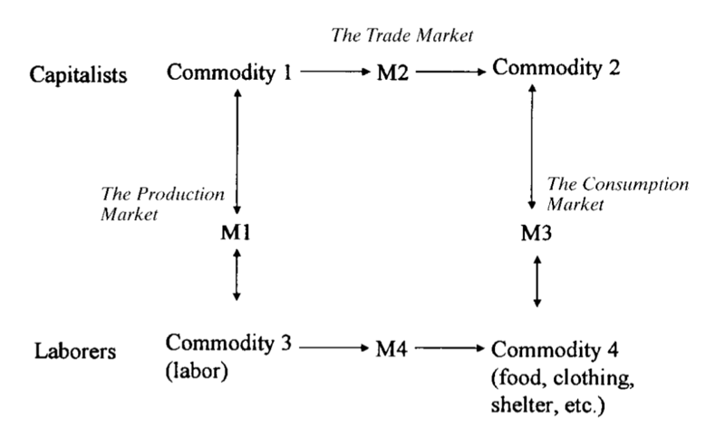
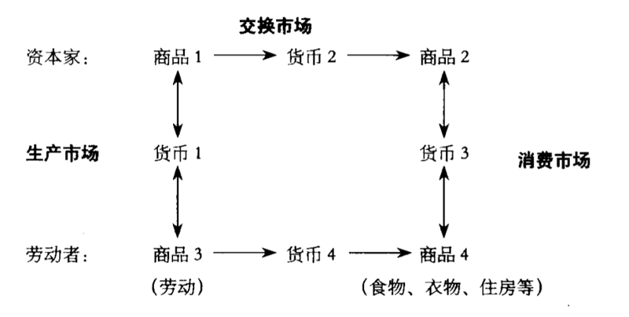

Part I Theory and Research

# 0101. Theories of Capital: The Historical Foundation

One of the far-reaching explanatory schemes in contemporary sociology and economics focuses on the concept of capital. What is capital? I define it as investment of resources with expected returns in the marketplace.

Capital is resources when these resources are invested and mobilized in pursuit of a profit – as a goal in action. Thus, capital is resources twice processed. In the first process, resources are being produced or altered as investment; in the second, the produced or altered resources are being offered in the marketplace for a profit. In one instance, capital is the outcome of a production process (producing or adding value to a resource); in the other, it is the causal factor in a production (the resource is exchanged to generate a profit). These are processes because both investment and mobilization involve time and effort. In the past two decades, social capital in its various forms and contexts has emerged as one of the most salient forms of capital. While much excitement has been generated, divergent views, perspectives, and expectations have also raised a serious question: is this a fad, or does it have enduring qualities that will herald a new intellectual enterprise?

The purpose of this volume is to present a theory of social capital, a theory eliciting the central theme that capital is captured in social relations and that its capture evokes structural constraints and opportunities as well as actions and choices on the part of the actors. Firmly anchored in the general theory of capital, this theory will, it is hoped, contribute to an understanding of capitalization processes explicitly engaging hierarchical structures, social networks, and actors. This theory, and its research enterprise, argue that social capital is best understood by examining the mechanisms and processes by which embedded resources in social networks are captured as investment. It is these mechanisms and processes that help bridge the conceptual gap in the understanding of the macro–micro linkage between structure and individuals.

This chapter will explore the nature of capital and various theories of capital, a context essential in leading up to the presentation and analysis of social capital, which begins in the next chapter.

资本概念是当代社会学和经济学中影响深远的解释图式之一。什么是资本？我将之定义为期望在市场中获得回报的资源投资。资本是在以追求利润为目标的行动中被投资和动员的资源。因而，资本是经过两次处理的资源。在第一个过程中，资源作为投资得以生产或改变；在第二个过程中，将生产或改变后的资源投放市场从而实现利润。一方面，资本是生产过程的结果（对资源进行生产或追加价值）。另一方面，它又是生产的因子（为了获取利润而进行资源交换）。投资和动员都需要时间和精力，因此它们都是资本形成的过程。在过去 20 年里，社会资本作为资本的最显著的类型之一，以不同的形式和背景出现。令人倍感兴奋之余，那些纷繁多样的观点、视角和期待也产生了一个重要的问题：这只是一时的狂热，还是具有持久的性质，预示着一个新的知识事业的来临？

2『林南对资本的定义，做一张术语卡片。』——已完成

本书的写作目的是向大家介绍社会资本理论，它引出了资本的中心主题：资本是在社会关系中获得的，资本的获得引出了结构的约束与机会问题，以及行动者的行动与选择题。以一般的资本理论为基础，我希望社会资本理论有助于理解明确地涉及到等级制结构、社会网络和行动者的资本化过程。社会资本理论及其研究事业表明，通过考察嵌入到社会网络中的资源的获得机制和过程，可以很好地理解社会资本。正是这些机制和过程，有助于弥合在理解结构与个体之间的宏观-微观连接的时候出现的概念鸿沟。

这一章将考査资本的本质和各种关于资本的理论，为下一章提出和分析社会资本理论提供一个基本的背景。

## 1.1 The Classic Theory: The Marxian View of Capital 

To understand social capital, we must first clarify the notion of capital.

The notion of capital can be traced to Marx (1849, 1865/1933/1935, 1867/1995; Brewer 1984) in his analysis of how capital emerges from social relations between the bourgeoisie (capitalists) and laborers in the processes of commodity production and consumption. Marx saw capital as part of the surplus value (created through the processes of commodities production and exchange) that creates further profit (Marx 1867/1995, Vol. 1, Chap. 4, and Vol. 2, Chap. 1). The production of commodities engages labor, land, rents, and materials (including facilities, technology, and transportation). Each of these elements incurs a use (or production) value for the producer. However, while a laborer is paid a fixed weekly or monthly wage, the laborer puts out more than the necessary number of hours in producing the commodity (socially necessary labor), and the produced commodity thus carries a lower cost of labor for the producer. That is, the generated use value surpasses the exchange value in payment to support the laborer’s subsistence. Thus, a surplus value (or profit) results. Further, the producer (or rather the capitalist) then engages in an exchange process in which the produced commodity is exchanged for another commodity (in the modern world, usually a medium of commodities, i.e., money). The field of exchanges may engage the producer and the consumer either directly or through intermediaries such as traders and merchants. The commodity generates a market value in these exchanges. If the market value exceeds the use (production) value or cost, then further surplus value, or capital, results from the exchange.

Figure 1.1 depicts my rendition of Marx’s notions of how capital emerges from social relations between capitalists and laborers in the processes of commodity production and consumption.

The processes begin with the capitalist, who is bestowed with resources (capital) to begin with (e.g., land ownership, aristocracy inheritance) and who engage in commodity production by establishing an exchange relation with laborers, who contribute their labor in the production process. In return, the capitalist assesses the value of the commodity produced and pays the laborers in accordance with this value (known as the exchange value ), usually in money. As presented in Figure 1.1, this relationship is represented by the production exchange between a capitalist and a laborer in the production of Commodity 1.

Figure 1.1 Rendition of Marx’s thesis on production and consumption relations.

Commodity 1 is the outcome of the production, and Commodity 3 is the labor contributed by the laborer. M1 represents the payment of the capitalist to the laborer for the work performed (Commodity 3) on the production of Commodity 1. The exchange value represents the「socially necessary value」for the production, or what is deemed necessary to pay the laborer for the labor performed (Commodity 3).

The produced commodity (Commodity 1) is then moved through a trade market (from Commodity 1 to Commodity 2) and to the consumption market (from Commodity 2 to Commodity 3). Thus, in the simplest process, Commodity 1 is directly offered as Commodity 2 by the producers to the consumers. The consumers, to a large extent, are the laborers who use the money earned in the production process (M1) to purchase the essential commodities (Commodity 4) for survival. They pay a price (M3) to get these commodities. Marx presents the following arguments:

1 M1 is essentially the same as M4 in value. That is, the payment for labor received by the laborer is the same value that the laborer uses to purchase essential commodities for survival. It is the exchange value, representing no gain or loss of value.

2 M2 is greater than M1 and/or M3 is greater than M1. That is, the selling value of the commodity in the trade and consumption markets is greater than its production value.

Thus, these two processes, the production process and the trade/

consumption process, result in two important and separate consequences for laborers and capitalists. Laborers earn the value for their labor (Commodity 3), which is in turn exchanged to get the essential goods (Commodity 4) for survival, and they earn no surplus value in the process (M1 = M4). Capitalists gain a surplus value (M3 - M1), part of which becomes capital.1 Thus, the circulation of commodities sustains laborers’

subsistence so that they can continuously provide the commodity (labor) necessary in the production process, but no more. On the other hand, the capitalists gain surplus value from the circulation of commodities, of which a significant portion can become capital. The processes are usually more complex, of course. For example, the capitalists can trade the produced commodities among themselves or to other capitalists, from Commodity 1 to Commodity 2, and gain a surplus value (M2 > M1). These other capitalists (traders, merchants) create their own surplus values by circulating the commodities to the consumption market (M3 > M2).

Thus, there are capitalists other than those directly engaged in production within the circulation system (the nodes along the circulation of commodities or the chains in the forms of C-M-C and M-C-M, such as traders, merchants, etc.). Capitalists are the ones who get to keep the capital, usually in the form of money.

This system of commodity circulations and social relations between capitalists and laborers sustains itself so long as (1) M1 is kept at a minimum (socially necessary value) and is always nearly equal to M4

and (2) M3 is always greater than M1 (or M2 > M1 and M3 > M2), so that the surplus value (and capital) is generated. When this system is sustained, there is assumed to be no mobility from laborers to capitalists, since, first of all, the capitalists control the means of production (assembling materials, instruments, and labor) and, second, the laborers will never accumulate capital and the capitalists will continue to accumulate capital. Thus, capital is a return (of surplus value) on an investment in the production of useful commodities in the marketplace. Capital can appear in the forms of money, the capacity to control the means of production, and/or further investment to produce more useful commodities. When the focus is on the process of producing surplus value, capital may be defined as an investment with expected returns in the marketplace .

In summary, then, in Marx’s analysis, capital is part of the surplus value captured by capitalists or the bourgeoisie, who control production means in the circulation of commodities and monies between the production and consumption processes. In this scheme of a capitalist society, capital represents two related but distinct elements. On the one hand, it 1 Surplus value has two components: revenue (part of which will be used for the repeated production processes and part of which will be used to sustain luxury-leisure or lifestyle expenditures) and capital (an increment of the valued resources).

is part of the surplus value generated and pocketed by the capitalists (and their「misers,」presumably the traders and sellers). On the other hand, it represents an investment (in the production and circulation of commodities) on the part of the capitalists, with expected returns in the marketplace. Capital, as part of the surplus value, is a product of a process; capital is also an investment process in which the surplus value is produced and captured. It is also understood that the investment and its produced surplus value refer to a return/reproduction of the process of investment and of more surplus values. It is the dominant class that makes investments and captures the surplus value. Thus, Marx’s theory is a theory based on the exploitive social relations between two classes.

Central to this theory are several important notions concerning capital.

First, capital is intimately associated with the production and exchange of commodities. Commodities, in the theory of Marx, are mainly material goods that carry price tags in both the production and exchange processes. Labor, labor power, and labor value are part of the price tag and are seen as「socially necessary」in the production of a commodity.

But it is commodities, through their production and exchange, that generate capital. Labor is a necessary factor in the process of producing a commodity, but it is subservient to the commodity itself.

Second, capital involves processes rather than simply a commodity or value, even though it may be the final result. Capital represents an investment process on the part of the capitalist, as production requires assembling and organizing labor, land/rents, equipment, facilities, and so on. These entail investment of initial capital, effort, and social activities of coordination and persuasion. When the processed commodity is exchanged for a profit, it also entails a process in the marketplace.

Third, as a result of these processes, any resultant capital is an added value (surplus value or profit). The existence of capital means that the market value of a commodity exceeds its production value or cost to produce. If the market value is the same as or less than the cost, there will be no capital from the commodity, and in fact there may be a deficit or debt.

Fourth, capital is intrinsically a social notion. Capital entails processes of social activity. The production process, as mentioned, involves social activities. For example, Marx explicitly describes use value as dependent on「socially necessary labor,」since there is no objective value or worth that can be used to calculate the value or cost of labor. The exchange process, by definition, is also social.

Fifth, capital is captured by the capitalist or producer from the circulation of commodities through the cycle of commodity production and exchange and capital accumulation. Capital is a process and an end result that lies by definition in the hands of those who control the means of production. The means of production create and accumulate in the form of capital. Capital, in turn, consolidates control over production means (e.g., circulation of commodities and circulation of capital; see Marx 1867/1995, Vol. 1, Chaps. 3–5). In Marx’s formulation, laborers are paid wages to meet their subsistence needs, and no more. In other words, capital is the surplus value generated from the capitalist’s investment in the production and is captured by the capitalist.

I will call the notion of capital and its features as described by Marx the classic theory of capital . The basic idea that capital is the investment of resources for the production of profit has been maintained in all subsequent capital theories. However, in the Marxian scheme, both investment and profit are vested in the capitalists. The labor involved in the process of production does not generate or accumulate capital for the laborers. The classic theory of capital is based on the explanatory argument that class differentiation is fundamental in capitalist society, where the exploiting class controls the means of production and collects all the surplus value generated from the labor provided by the exploited class.

The evolution of capital theory in the last four decades into what can be called neo-capital theory essentially modifies or eliminates the class explanation as a necessary and required theoretical orientation. These alternative renditions of capital notably include human capital, cultural capital, and social capital.

古典理论：马克思的资本观

为了理解社会资本，我们必须首先澄清资本的概念。资本的概念可以追溯到马克思 (Marx,1849,1865/1933/1935,1867/199 Brewet,1984)。马克思分析了资本在商品生产和消费过程中，如何从资产阶级（资本家）和劳动者的社会关系中生成。资本是能够产生利润的那部分剩余价值 一一 通过商品的生产和交换过程产生 (Marx,1867/1995,vol1,chap4, and yol2, chap1)。商品生产需要劳动力、土地、租金和物质资料（包括设备、技术和运输工具）。每一种因素都为生产商产生使用（或生产）价值。然而，虽然劳动者得到了固定的周工资或月工资，但是劳动者的付出超过了生产商品的必要劳动时间（社会必要劳动）。因此，对生产商而言，生产的商品所含的劳动成本要低些。也即，生产的使用价值超过了维持劳动者生存的交换价值。这样，剩余价值（或者利润）就产生了。继而，生产商（或者说资本家）参与交换过程，将生产的商品与其他商品（在现代世界通常是商品的媒介，如货币）相交换。交换的范围可以直接处在生产商和消费者之间，或者通过交换媒介 —— 交易人和商人。商品在交换中实现了市场价值，如果市场价值超过了使用价值或生产成本，剩余价值或者说资本就在交换中实现了。图 1.1 是我对马克思关于资本如何在商品生产和消费过程中，从资本家与劳动者的社会关系中生成的观点的解释。

图 1.1 对马克思关于生产与消费关系理论的解释

整个过程开始于资本家。他们开始于被授予资源（资本）（如土地所有权、贵族世袭权），通过与劳动者建立交换关系而进行商品生产。劳动者在生产过程中付出自己的劳动，而资本家根据劳动者生产的商品的价值相应地支付根酬（大家所熟悉的变换价值）—— 通常是货币。如图 1.1 所示，这个关系可以表示为资本家和劳动者在生产商品 1 时的生产交换。商品 1 是生产的结果，商品 3 是劳动者付出的劳动。货币 1 表示资本家对劳动者生产商品 1 的劳动（商品 3）支付。交换价值指生产的「社会必要价值」，或者视为对劳动者的劳动支付（商品 3）。

1-2『此时才意识到，马克思关于，生产和消费关系的理论如此精妙，以前真实瞎了眼，根本没意识到马克思的伟大。特别是书里的那张结构图结合林南的讲解，醍醐灌顶。古典资本理论，生产和消费关系的理论，做一张主题及术语卡片。』——已完成

然后，生产的商品（商品 1）流经交换市场（从商品 1 到商品 2）进入消费市场（从商品 2 到商品 4）[0]。其中最简单的过程，是生产商直接向消费者提供商品 1（以商品 2 的形式）。在很大程度上，消费者就是用在生产过程中获得的工资（货币 1）来购买生活必需品（商品 4）的劳动者。他们通过支付一定的货币（货币 3）来获得这些商品。马克思提出了下列观点：

1、货币 1 在价值上基本与货币 4 相等。也即，劳动者的劳动报酬与他们用来购买生存必需品的花资是等值的。交换价值没有增加也没有减少。

2、货币 2 要大于币 1，或者说货币 3 要大于货币 1，即商品在交换市场和消资市场的售销价值要大于它的生产价值。

生产和交换 / 消费两个过程对劳动者和资本家产生了两个重要而分离的结果。劳动者用获得的劳动力价值（商品 3）来换取生活的必需品（商品 4），他们在这过程中（货币 1 = 货币 4）没有获得剩余价值。而资本家获得了剩余价值（货币 3 - 货币 1），其中部分成为资本 [1]。一方面，商品流通仅能维持劳动者的生存，使他们能够继续提供生产过程中所必需的商品（劳动力）。另一方面，资本家从商品流通中获得剩余价值，其中相当一部分成为资本。

当然，整个过程要比这复杂得多。例如，资本家可以通过内部或者与其他资本家交换生产的商品，从商品 1 到商品 2，来获得剩余价值（货币 2 > 货币 1）。其他资本家（交易者、商人）通过商品在消费市场的流通来获得自己的剩余价值（货币 3 > 货币 2）。因此，在流通领域中存在着不直接从事生产的资本家（他们要么存在于商品流通过程的起点，要么存在于商品-货币-商品和货币-商品-货币流通过程的某一环节，如交易人、商人等）。资本家就是那些获得资本 —— 通常以货币形式存在的人。

要维系商品流通以及资本家与劳动者之间的社会关系体系，需要下列条件：1）货币 1 保持在最小值（社会必要价值），并与货币 4 大体相等；2）货币 3 总是大于货币 1（或者货币 2 > 货币 1，并且货币 3> 货币 2），这样剩余价值（和资本）才能产生。要使这个系统得以维持，我们必须假设没有从劳动者到资本家的流动。因为，首先资本家控制着生产资料（将物质资料、劳动工具和劳动力聚集起来）；其次，劳动者从来不进行资本积累，而资本家会不断地积累资本。这样，资本就是在市场中投资生产有用商品的回报（剩余价值的回报）。以货币的形式出现的资本可以控制生产资料，并且 / 或者进步投资生产有用的商品。当关注剩余价值的生产过程时，可以将资本定义为期望在市场中获得回报的投资。

总之，在马克思的分析中，资本是资本家或者资产阶级获得的剩余价值的一部分，资本家控制着生产与消费过程之间商品与货币流通中的生产资料。在资本主义社会体系中，资本代表着两种相互关联但又相互区别的因素。一方面，资本是生产出来的，是被资本家（与他们的同伙，比如说交易人和销售商）据为己有的剩余价值的一部分。另一方面，它又是资本家的投资（在商品的生产和流通中），被期望从市场中得到回报。资本作为剩余价值的一部分是一个过程的结果；资本也是生产和获得剩余价值的投资过程。投资及其生产的剩余价值，也可以理解为投资过程的回报和更多的剩余价值的再生产。正是统治阶级进行投资并获得剩余价值。因此，马克思的理论建立在两个阶级的剥削的社会关系基础之上。

马克思理论的核心是关于资本的几个重要概念。

首先，资本是与商品的生产和交换紧密相连的。马克思理论中的商品主要是指在生产与交换过程中被贴上价格标签的物质产品。劳动、劳动力和劳动价值是价格标签的一部分，被视为商品生产中的「社会必需」。但是只有通过商品的生产与交换才能产生资本。劳动是商品生产过程中的一个必要因素，但是它从属于商品本身。

第二，尽管商品或价值可能是资本的最终结果，但是资本却不仅仅涉及到商品或价值过程。资本代表着资本家的投资过程，作为生产，它需要聚集和组织劳动力、土地 / 租金、设备、工具和其他要素。这就需要原始资本的投资、精力以及协调和说服的社会活动。为了实现利润，加工的商品又需要经过市场交换的过程。

第三，这些过程的结果使资本增加了价值（剩余价值或者利润）。资本的存在意味着商品的市场价值超过了它的生产价值或者产品成本。如果市场价值等于或者低于成本，资本就不会从商品中产生，事实上会产生亏损或者债务。

第四，资本在本质上是一个社会概念。资本的产生离不开社会活动的过程。前面提及的生产过程就涉及到社会活动。例如，马克思明确地指出，使用价值依赖于「社会必要劳动」，因为根本不存在计算劳动价值或成本的客观价值尺度。从定义来看，交换过程也具有社会性。

第五，资本家或者生产商通过商品生产、交换和资本积累的循环，从商品的流通中获得资本。根据定义，资本是控制生产资料的资本家控制的过程和最终结果。生产资料以资本的形式创造和积累。资本反过来现固了资本家对生产资料的控制（例如：商品流通和资本流通；参见 Marx,1867/195,vol1 chaps.3-5)。在马克思的论述中，劳动者仅获得满足生存需要的工资。换言之，资本是资本家的生产投资所产生的、并被资本家所占有的剩余价值。

我把马克思所描述的资本概念及特征称为古典资本理论。资本作为产生利润的资源投资，这一基本思想在以后所有的资本理论中持续沿用。然而在马克思的图式中，投资和利润都属于资本家，生产过程中的劳动并没有为劳动者产生和积累资本。古典资本理论将论点建立在以下基础之上：阶级分化是资本主义社会的基础，剥削阶级控制着生产资料并占有被剥削阶级劳动所创造的全部剩余价值。在过去 40 年里，资本理论已经发展为新资本理论，新资本理论基本上修改或者排除了作为古典理论方向中所必不可少的的阶级解释。这些对资本的替代性解释主要包括人力资本、文化资本和社会资本的理论。

0 原文是从商品 2 到商品 3，这样讲不通、似乎应该是从商品 2 到商品 4。—— 中译注

1 剩余价值由两部分组成：收入（部分用来重复生产过程，部分用来维持资本家的奢修 —— 休闲或生活方式支出）和资本（有价值资源的增加物）。

## 1.2 Neo-Capital Theory: Human Capital

Human capital, which assumes that capital can rest with the individual laborer, can be traced to Adam Smith, who included all the acquired and useful abilities of the population in a country as part of capital (1937).

In the late nineteenth and early twentieth centuries, this notion occa-sionally surfaced in the economic literature (von Thunen 1875; Fisher 1906). Contemporary understanding of human capital can be attributed to the works of Johnson, Schultz, and Becker (Johnson 1960; Schultz 1961; Becker 1964/1993). Johnson (1960) argued that laborers have become capitalists, not from a diffusion of the ownership of corporation stocks, as capitalist public relations would have it, but from the acquisition of knowledge and skills that have economic value. That is, with knowledge and skill, the laborers can demand from the capitalists payment beyond the exchange value for their labor. Presumably, their knowledge and skills enable the hourly worth of their labor to exceed that of others who do not have such knowledge and skills.

However, the first systematic presentation of the human capital argument was made by Theodore W. Schultz in his presidential address at the 1960 meeting of the American Economic Association (1961). In this seminal piece,「Investment in Human Capital,」he forcefully condemned「the failure to treat human resources explicitly as a form of capital, as a produced means of production, [and] as the product of investment, [which] has fostered the retention of the classical notion of labor as [only] a capacity to do manual work requiring little knowledge and skill, a capacity with which, according to this notion, [all] laborers are endowed about equally」(p. 3). In addition, Becker (1964) explicated human capital most forcefully in terms of education, but later also in terms of a host of other factors.2

Schultz’s challenge and proposal formed the basis of the human capital theory, elaborated by other economists, Becker (1964) being the principal one among them. Human capital, unlike physical capital, is the value added to a laborer when the laborer acquires knowledge, skills, and other assets useful to the employer or firm in the production and exchange processes. The important distinction between physical and human capital is that human capital is the added value embedded in the laborers themselves. Typically, human capital is operationalized and measured by education, training, and experience. Investment in human capital on the part of laborers is good not only for the firm/producer, but also for the laborers themselves. Human capital adds the value of the labor, and part of the value can be negotiated and retained by the laborers as wages and benefits, beyond the minimal amount required for subsistence needs.

Thus conceived, human capital may be seen as any investment on the part of the laborers that will result in increased worth (M1) in commodity production process. This value affords three types of expenditures, according to Schultz: expenditures for (1) consumption, (2) investment (human capital), and (3) both consumption and investment.

Because of the difficulty of disentangling the third type of expenditure from the first two (i.e., decomposition of M4 in terms of these three expenditures), Schultz proposed that the effects of human capital should be estimated by its yield rather than its cost;「the resulting increase in earnings is the yield on the investment」(p. 8). In essence, for human capital, there is no substantial change in the definition of capital relative to the Marxian notion. It remains an investment with an expected return in the marketplace. From the Marxian point of view, this added value 2 For example, Schultz also proposed that not only skill and knowledge acquisition but also health and migration would yield additional economic value. Becker added a host of other factors. There is a danger, however, of including all things that sustain or improve life itself as human capital. I choose to focus on the original intent.

(knowledge, skills) enables the capitalist (the employer or firm) to increase the capacity of labor (e.g., labor power; Marx 1867/95, Vol. 1, Chap. 6). As a result, the market value of the commodity or production is increased (either in quality, quantity, or both). So long as the increased wage for such added capacity grows at a lower rate than the use value from the capacity generated, profit will increase, adding to the capital of the capitalist. Thus, human capital can be seen as consistent with the theoretical scope of Marxian analysis: capital is viewed from the capitalist’s, producer’s, employer’s, or firm’s perspective in the production and exchange of commodities.

However, the classical capital theory received a major challenge: that the immobility of class distinctions between the capitalists and the laborers no longer holds. If laborers can acquire skill, knowledge, and other capital to increase the value of their hourly labor, two things can happen:

1 M1 may no longer be mere exchange value for the laborers. Payment for skilled labor may exceed the socially necessary value of the labor without required skill. Rather than acting as replaceable commodities on the assembly line, certain laborers can now claim and charge higher value for their labor because, for the same labor unit (hour), more production may be accomplished. Thus, M1 contains use value for the laborers and capitalists alike.

2 M1 is no longer equal to M4 – the earnings necessary to sustain lives. Instead, M1 is greater than M4. There is a surplus value of labor for laborers with capital. That is, after expenditures for essential commodities for survival (Commodity 4), there is a residual value that can be used as (1) revenue, which can be used to invest in capital-generating activities or to support leisure and lifestyle needs, and (2) capital (e.g., accumulation of money and other valued resources).

Thus, while the human capital theory does not deviate substantively from the classical (Marxian) theory in the definition of capital, it challenges the classical theory regarding who can or cannot acquire capital.

The vision of the social structure is altered. Everyone can invest and acquire capital. Far from being a homogeneous society, there are different opportunities or motivations in the acquisition or nonacquisition of human capital, so that the worth of labor as a commodity varies across individuals. Nevertheless, the social structure is now envisioned as a hierarchy of many grades of capitalists, with extensive cross-grade mobility possible, rather than a rigid two-class system.

This alternative view challenges the classic theory of capital in its fundamental stance: that in the capitalist state the capitalist, as controller of resources for production, extracts capital from low-skilled and interchangeable laborers. By arguing that laborers themselves can accumulate capital by investing in skills and knowledge that are economically productive, Schultz and Johnson turn laborers into potential capitalists and subvert the Marxian premise of class differentiation and conflict. This challenge, however, does not violate the principal notion of capital as an investment of resources in the production of surplus value. Rather, it incorporates skills and knowledge as resources, and thereby claims that skilled, knowledgeable laborers themselves hold such capital.

In summary, human capital theory deviates substantially from classical Marxian theory in several ways. First, while Marxian theory focuses on the production and exchange of commodities, human capital focuses on a process associated with the laborer . This change of focus is enormously significant. In the classic theory, value is assessed relative to labor costs rather than to the laborer, since laborers are considered interchangeable members in a large, available, competitive pool of workers who simply provide the socially necessary minimal and similarly skilled labor in production. Capital results from a successful calculus between the relative costs of production and prices in the exchange of commodities. In human capital theory, however, it is the laborers themselves, rather than the labor they perform, who figure centrally in the calculus of capital. In this view, capital is seen and calculated as the added value to the laborer, not to labor or the commodity. In other words, the major theoretical orientation has been changed. Labor, rather than being treated as a contributing factor in the exploitive relationship between the capitalist and the laborer, is seen as generative of capital for the laborers themselves. The social relations between capitalists and laborers are modified. Laborers can no longer be treated as replaceable commodities; differential values and payments are due to different laborers, depending on the capital they bring to bear on production – the human capital.

Where do laborers acquire human capital? By gaining education, on-the-job training, or work experiences; by remaining physically healthy and able; by migrating to places where demands are higher; and so forth.

This stance completely subverts the core orientation of the classic theory, which ties capital to the control of production means resting solely in the hands of the capitalist.

Secondly, and related to the first point, the laborer can now be seen as the investor , or at least as a party in the investment scheme. In the original Marxian analysis, laborers offer their labor in exchange for a wage to sustain their subsistence needs. Human capital clearly assumes

that laborers may be in a position to gain profit if profit is defined as a surplus value to what it costs merely to sustain their lives. The tempta-tions of luxury and lifestyle, as well as the possibilities for reinvestment, seen by Marx as exclusively in the capitalist’s possession, are now presumably within the effort and grasp of the laborer as well. In other words, capital, as it is being produced and exchanged, is meaningful and possible for both the capitalist and the laborer engaged in the production process.

A third departure of the concept of human capital from the Marxian notion of capital is that because there is a potential reward in increased wages and other forms of profit, the laborer is now motivated to acquire skills and knowledge. Marx recognized that labor is a purposive act (1867/1995, Vol. 1, Chap. 7). However, he argued that in the capitalist system, the purpose is「provided」or imposed by the capitalist. Thus, the purposive acts of the laborers are appropriated for the purposes of production. Action on the part of the laborers no longer represents or expresses their free will. From the perspective of human capital theory, however, investment in the acquisition of skills and knowledge is motivated by a cost–benefit calculus on the part of laborers themselves. This calculus drives their investment in acquiring skills and knowledge. It reflects a rational choice, and the action taken is a purposive act consistent with the laborer’s self-interest.

Finally, capital in its classic theory is tied to the processes of production and exchange. In the final instance, capital develops as surplus value or profit relative to investment or cost – the outcome of the production and exchange processes. In this formulation, investment in labor is part of the cost calculation. But in the human capital theory, nothing is explicitly delineated concerning the production and exchange processes. Nor is labor calculated as merely cost (expenditure). Rather, it is considered as effort or investment. In fact, an explicit decision is made in the formulation of human capital theory that human capital should be assessed as a function of return or yield to the laborer. Thus,「the resulting increase in earnings is the yield on the investment」(Schultz 1961, p. 8).

Human capital development in the acquisition of skills and knowledge generates economic value, allowing laborers to become capitalists (Johnson 1960; Schultz 1961, p. 3).

The shift of analytic attention to the microstructure of production of skills and knowledge as investment in laborers does not necessarily negate the macrostructure process of production of surplus value for capitalists in the classic theory. Laborers with better human capital make themselves available in the labor market so that capitalists and managers can capture this human capital by hiring these laborers. However, the

labor obtained is no longer an easily interchangeable element in the production process, as Marx assumed. Differential distribution of human capital among laborers makes it necessary for producers and capitalists to calculate the added value of human capital embedded in each of their hired laborers relative to their relative cost (wages and benefits). Presumably, if the added human capital makes it worthwhile for capitalists to pay hired laborers wages and benefits beyond what are required for the workers’ subsistence and survival, that is what they will pay when there are no cheaper alternatives. Attractive wages and benefits keep the laborers with better human capital and entice them to contribute quantitatively and qualitatively to the market value of the commodities produced. Better benefits also allow these laborers to enjoy leisure or to invest in further production of their own capital (more education and training).

The enormous significance of this subversion of the classic theory can be seen in two epistemological implications of human capital research.

First, laborers can become capitalists, as they enjoy the surplus value of their labor. Thus, there is a blurring of the two classes. Since laborers become capitalists by acquiring human capital or, at the minimum, since capital is conceived of as being shared (however unequally) by the capitalist and the laborer in production and exchange, the worker’s acquisition of human capital is now in the interest of both the capitalist and the laborer. The confrontation and struggle between classes becomes a cooperative enterprise –「What’s good for the company is good for the worker, and vice versa.」

Research can now focus on the laborer’s acquisition of and investment in human capital. The production process and its utility for (and manipulation by) capitalists recedes into the background. Rather, since human capital entails purposive action in the laborers’ self-interest, the simple investment–return calculus is now applied to the laborers themselves, independent of the context of commodity production and exchange.

Thus, the only meaningful context for laborer–capitalist relations is the labor market, where the exchange is between the supply of human capital as embedded in laborers and the demand for such human capital. Instead of focusing on the appropriation of labor for the capitalists’ profit, analysis examines the fit between human capital supply and demand. It is the laborer, instead of the manager or capitalist, who is rewarded for or deprived of the price and value of labor power. If labor’s value is low, for example, this is due to a lack of human capital rather than the expropriation of surplus value or capital by the capitalist.

Second, research on the link between education and wages constitutes a core area of human capital analysis. Since educational attainment is seen as a major indicator of investment in skills and knowledge, this becomes individuals’ major asset in the labor market, resulting in their entering better firms and receiving higher wages. Note that nothing in the appropriation of other kinds of capital enters into this equation. The critical analytic tool used by Marx in his theory of exploitation and appropriation of labor – capitalists’ control of the means of production – now becomes the means for analyzing production due to the free will and self-interest of laborers themselves.

I call the human capital theory a neo-capital theory because its rendition of social relations in the production and consumption markets radically differs from the fundamental structure assumed in the classical capital theory.

新资本理论：人力资本

以资本可以存在于个体劳动者中为假设的人力资本理论，最早可以追溯到亚当·斯密（Adam Smith）。斯密将一个国家人口中所有获得的、有用的能力都归结为资本的一部分（Smith,1937）。在 19 世纪晚期到 20 世纪早期，这个概念偶尔出现在经济学的文献中（von Thunen,1875; Fisher,1906）。当代对人力资本的理解来自约翰逊、舒尔茨和贝克尔的著作（Johnson1960; Schultz 1961; Becker1964/1993）。约翰逊（1960）认为劳动者已经变成了资本家，这不是由于像资本家的公共关系部所宣称的公司的股权已经分散，而是因为劳动者获得的知识和技能具有经济价值。也即，拥有知识和技能的劳动者，可以要求资本家付给他们超过劳动力交换价值的报酬。当然，他们的知识和技能，要使他们的日劳动价值超过那些不具备这样的知识和技能的劳动者。

在 1960 年美国经济学会的会议上，T.W.舒尔茨（Theodore W. Schultz）在其就职演说中，第一次系统地提出了人力资本的观点。在「关于人力资本投资」这篇有影响的论文中，他有力地批评道：由于不能明确地将人力资源视为一种资本形式，一种产品的生产手段和一种投资产品，从而助长了人们对劳动力的古典概念的固守，「只是」将之视为几乎不需要任何知识和技能的体力劳动能力，「所有的」劳动者都同样地拥有这种能力。（p3) 此外，贝克尔（Becker 1964）详细地阐述了人力资本，其中在教育方面最有说服力，后来也涉及到许多其他因素的分析。[2]

舒尔茨的挑战和提议形成了人力资本理论的基础，其他经济学家对其进行了详细的阐述，贝克尔是主要代表。与物质资本不同，人力资本是劳动者由于获得知识、技能和其他在生产和交换过程中对雇主或公司有用的品质而增加的价值。物质资本与人力资本之间的重要区别是，人力资本是嵌入到劳动者本身的追加价值。人力资本通常通过教育、培训和经验来进行可操作化和衡量。对劳动者的人力资本投资不仅对公司 / 生产商有益，而且对劳动者本身有益。人力资本增加了劳动的价值，其中的一部分可以以超出维持最低生存需要的工资和津贴的形式让渡给劳动者。

可以将人力资本视为：对在商品生产过程中会产生增加价值（货币 1）的那部分劳动者的任何投资。根据舒尔茨的分析，增加的价值分为三种类型的支出：1）消费；2）投资（人力资本）；3）既消费又投资。因为很难将第三种支出与前两种分开（例如，将货币 4 分解为这三种支出）。舒尔茨指出，人力资本的绩效应该根据它的收益而不是成本来估算，「收入的增加是投资的结果」（p-8）。在本质上，人力资本理论对资本的定义相对于马克思的概念并没有实质性的变化。它仍将之定义为期望在市场中得到回报的投资。从马克思的观点看，这个增加值（知识，技术）使资本家（雇主或者公司）提高了劳动能力（如劳动力；Marx1867/95,voL1,chap.6）。因此，商品或者生产的市场价值提高了（质量或数量，或者两者）。只要因生产能力增加而造成的工资提升幅度，低于生产能力所产生的使用价值的增长幅度，利润就会提高，资本家的资本就会增加。因而，人力资本与马克思的理论分析视野是一致的：在商品的生产和交换中，从资本家、生产商、雇主和公司的视角来考察资本。

但是，古典资本理论受到了一个主要挑战：资本家与劳动者之间的阶级区分的固定性已不存在。如果劳动者通过获得技术、知识和其他资本的方式来提高单位劳动价值，就会发生两种情况。

1、货币 1 可能不再只是劳动者的交换价值。技术劳动的价值会超过无技术劳动的社会必要价值。如果不是生产线上的可替代商品，某一些劳动者可以为他们的劳动索求更高的价值，因为他们在相同的劳动单位（时间）内可以完成更多的生产。这样，币 1 包含的使用价值对动者和资本家来说是相同的。

2、货币 1 不再等于货币 4 —— 维持生活的必需收入。相反，币 1 要大于货币 4。拥有资本的劳动者也有了劳动的剩余价值。也即，除了生存必需品的支出（商品 4）以外，他们还可以使用剩余价值作为：1）收入，在资本生产活动中进行投资或者维持休闲和生活需要；2）资本（如币和其他有价值资源的积累）。

可见，虽然人力资本理论没有实质性地偏离古典（马克思）理论对资本的定义，但是，它在谁能够或者不能够获得资本上对古典理论提出挑战。社会结构的图景被改了。每人都可以投资并获得资本。在远非同质性的社会里，存在不同的获得或者不获得人力资本的机会和动机，因此作为商品的劳动价值因人而异。尽管如此，现在的社会结构仍被视为由不同等级的资本家组成的等级制，只不过它具有广泛的跨等级流动的可能性，而不再是一个严格的两极体系。

这个替代性的观点挑战了古典资本理论的基本立场：在资本主义国家中，资本家是生产资源的控制者，他们从技术水平低、可以替换的劳动者中榨取资本。舒尔茨和约翰逊认为，劳动者本身可以通过采用节约生产的技术和知识投资来积累资本，从而成为潜在的资本家，这就推翻了马克思阶级分化和阶级冲突的理论前提。但是这个挑战并没有违背资本作为生产剩余价值中的资源投资的基本概念。相反，它将技能和知识作为一种资源，并声称有技能、有知识的劳动者本身拥有资本。

总之，人力资本理论在以下几个方面大大偏离了古典马克思理论。

第一马克思的理论关注商品的生产与交换，人力资本理论关注与劳动者相联系的过程。这个关注点的转变具有重要意义。在古典理论中，价值要根据劳动力成本而不是劳动者来估算。因为在大量可以获得的、竞争激烈的工人后备军中，劳动者被视为可替代因素。他们只是在生产中提供社会所需要的最小的相同技术的劳动。资本产生于对生产的相对成本与商品的交换价格的成功筹算。对人力资本理论而言，劳动者本身，而不是他们从事的劳动，在资本的计算中起中心作用。资本被作为对劳动者追加的价值来看待和计算，而不是劳动或者商品增加的价值。换言之，人力资本理论的主要方向已经改变。劳动不再被当作资本家与劳动者之间剥削关系的促成因素，而被看作劳动者自身资本的生产能力。资本家与劳动者之间的社会关系被修改了。劳动者不再被视为可替代的商品；不同的劳动者有不同的价值和报酬，这依赖于他们的自身资本对生产的影响 —— 人力资本。劳动者从哪里获得人力资本？通过接受教育，职业培训或者工作经验；通过保持身体健康和强壮；通过移居到需求更高的地方；诸如此类。这个立场完全推翻了古典理论的核心方向 —— 将资本与资本家完全地控制生产资料联系在一起。

第二，与第一点相关，劳动者可以被看作投资者，或者至少是投资活动的一方。在马克思最初的分析中，劳动者付出劳动是为了交换维持生存需要的工资。人力资本理论明确地指出，如果利润被定义为只是为了维持生活花费之外的剩余价值，劳动者也处于获取利润的位置。奢修品和奢侈生活方式的诱惑以及再投资的可能性，被马克思视为资本家独有的特权，现在可能也在劳动者的努力和欲求范围之列。换句话说，当资本被生产与交换的时候，它对资本家和参与生产过程的劳动者都是有意义，有获取可能性的。

人力资本概念对马克思资本概念的第三个偏离是，由于存在着提高工资和其他利润形式的报酬的可能性，劳动者获取技能和知识的动机被激发了。马克思认识到劳动是有目的的行动（Max,1867/1995,vol1,chap7），但是他认为，在资本主义体系中这个目的是被资本家提供或者强加的。这样，劳动者的行动目的被生产目的所剥夺。劳动者的行动不再代表或表述他们的自由意志。然而从人力资本理论的视角，劳动者在获得技能和知识方面的投资动机是基于对他们自身成本-收益的计算。这种计算驱使他们投资以获取技能和知识。这是理性选择的反映，劳动者的行动是与自身利益相一致的有目的的行动。

最后，在古典理论中，资本与生产和交换的过程相联系。资本最后发展成为与投资或成本相关的剩余价值或利润 一一 生产与交换过程的结果。在这个表述中，劳动投资是成本计算的一部分。但是在人力资本理论中并没有明确地描述生产与交换过程，劳动也不仅仅计为成本（花费），而是被视为精力或者投资。事实上，人力资本理论的分析策略是将人力资本确定为回报或生产对劳动者的函数。也即「收入的增加是投资的结果」（Schultz, 1961, P8)。获得技能和知识的人力资本的发展产生了经济价值，使劳动者可以成为资本家（ohnson,1960; Schultz,1961, p.3）。

将分析的注意力转移到对劳动者将技能和知识生产作为投资的微观结构上，并不必否定古典理论对资本家剩余价值生产的宏观结构过程的论述。拥有较多人力资本的劳动者可以在劳动力市场上获得，因此资本家和经理可以通过雇佣这些劳动者来获得这些人力资本。不过，获得的劳动力已不再是马克思所认为的、在生产过程中可以很容易被替代的因素。由于人力资本在劳动者中有不同的分布，生产商和资本家必须计算嵌入到每个雇佣动者中的人力资本的増加值与相应的成本（工资和津贴）。假定资本家支付给劳动者的工资和津贴多于劳动者维持生存的需要，只要这种人力资本的增加是值得的，那么在没有其他更为廉价的选择之下，资本家也会愿意的。有吸引力的工资和津贴留住了拥有较多的人力资本的劳动者、并促使他们定量、定质地实现其所生产商品的市场价值。大量的津贴也使劳动者得以休闲娱乐，或者进一步投资生产自己的资本（更多的教育和培训）。

推翻古典理论的重大意义表现在人力资本研究的两个认识论的含义上。首先，当劳动者享用他们劳动的剩余价值时，劳动者可以成为资本家。这样，两个阶级的界线就模糊了。既然劳动者可以通过获得人力资本成为资本家，或者至少可以认为资本家与动者在生产和交换时可以共同拥有资本（虽然不相等），那么劳动者获得人力资本就符合资本家和劳动者的共同利益。阶级之间的对抗和斗争转変成了一项合作事业 ——「对公司有益处的对劳动者也有益处，反之亦然。」

研究现在可以关注劳动者对人力资本的获得与投资的问题了。生产过程以及生产过程对资本家的效用（被资本家所操纵）退到了幕后。既然人力资本需要有目的的、符合劳动者自我利益的行动，那么简单的投资-回报计算也适应于劳动者本身，而独立于商品生产与交换的内容。因而，劳动者-资本家关系中惟一有意义的内容是劳动力市场 一一 嵌入到劳动者中的人力资本的供给与需求的交换场所。现在研究不是关注资本家为了利润而剥削劳动者，而是考察人力资本供需的平衡。是劳动者而不是经理或者资本家被给予或者剥夺了劳动力的价格和价值。如果劳动力价值很低，是因为人力资本的缺乏，而不是因为资本家剥削剩余价值或者资本。

第二，教育与工资之间的关系研究构成了人力资本分析的核心领域。因为受教育水平被当作技能和知识投资的一个主要指标，所以它成为了个人在劳动力市场的主要资本，可以使劳动者进人好的公司并获得高薪。注意，这里没有任何其他种类的资本剥削影响这一平衡。马克思在劳动剥削和占有理论中使用的批判的分析工具 一一 资本家对生产资料的控制 一一 现在由于劳动者本身的自由意志和自我利益，而成为分析生产的工具。

人力资本理论对生产和消费市场中的社会关系的解释，与古典资本理论中的基本结构有很大的不同，因此我称之为新资本理论。

2『新资本主义理论，做一张主题及术语卡片。』——已完成

[2] 例如，舒尔茨也提出不仅技能和知识的获得，而且健康和迁移也会产生追加的经济价值。贝克尔增加了许多其他因素。但是存在将一切维持或改善生活本身的因素都归结为人力资力的危险。我倾向于关注它原来的涵义。

## 1.3 Cultural Capital: A Contention

Not all neo-capital theorists agree with the interpretation of human capital as the product of workers’ free will or self-interest. A distinctive alternative theoretical explanation of human capital is the theory of cultural capital. Bourdieu (1990; Bourdieu and Passeron 1977) defines culture as a system of symbolism and meaning (Jenkins 1992, p. 104).

He argues that a society’s dominant class imposes its culture by engaging in pedagogic action (e.g., education), which internalizes the dominant symbols and meanings in the next generation, thus reproducing the salience of the dominant culture. Thus, cultural capital, as conceptualized by Bourdieu (1972/1977, 1983/1986), derives its analytic contribution from the notions of social practice and social reproduction of symbols and meanings. For the purpose of the present discussion, I will focus on his work on social reproduction, which is intrinsically related to the idea and processes of practice.

To Bourdieu (Bourdieu and Passeron 1977), social reproduction is the imposition of「symbolic violence」by the dominant class on the dominated class. Symbolic violence occurs in that pedagogic action through which the culture and values of the dominant class are legitimated as the

「objective」culture and values of the society, so that they are not seen or noticed at all as culture and values that support and sustain the dominant class. In other words, through pedagogic action, the culture and values of the dominant class are「misrecognized」as the culture and values of the entire society. Such pedagogic action occurs in the family, in informal groups and on informal occasions, and, most important, through education, especially schooling (institutionalized education). In the education system, not only do the agents (teachers and administrators) acquire and misrecognize the dominant culture and values as universal and objective, but they transmit「knowledge」by rewarding students who carry out the reproduction of the dominant culture and values in the next generation.3

The result is an internalized and durable training, habitus , in the reproduction of the culture. Symbolic violence through misrecognition and the process of social reproduction carries over to the labor market (the social「field」), which serves to reinforce the pedagogic rewards (Bourdieu 1990). Students who have acquired and misrecognized the culture and values as their own are rewarded in the labor market by being employed by the organizations controlled by the dominant class. Thus, misrecognition is reinforced in the education system so that other students continue the misrecognition of the need and the merit of acquiring the culture and values being transmitted.

The most important feature of symbolic violence is, then, the pedagogic processes by which the dominant culture and values are accepted and taken in as one’s own without any resistance or even conscious awareness on one’s part. The acquisition and misrecognition of the dominant culture and its values (legitimized knowledge) is called cultural capital. Such is the sorcery in social reproduction – the reproduction of dominant class values.

It is clear to Bourdieu that education, or indeed any training that can be taken as human capital by some, can in fact be seen as cultural capital by others. The different viewpoints are more than different perceptions of the same empirical phenomenon (e.g., education); they represent a fundamental divide in theoretical explanations. Bourdieu’s symbolic violence and social reproduction are consistent with Marx’s theoretical stance. They reflect the imposition by one class (the capitalists or a dominant group) of its values on another (the laborers or the dominated group); the appropriation of the latter’s labor to the benefit of the former is justified by this value system. Further, Bourdieu also sees profit (capital) as what is at stake in the perpetual struggle in society or the social field (Wacquant 1989). In fact, he identifies a wide range of capital as being at stake, such as economic capital, social capital (relationships with significant others), cultural capital, and symbolic capital (prestige and honor) (Bourdieu 1980, 1983/1986). It is clear that Bourdieu considers these forms of capital as largely in the hands of the dominant class, since it occupies the top positions in society.

We may trace the lineage of this rendition of capital to Marx. The 3 Bourdieu himself has time and again argued that he is not a structuralist or a Marxist.

Whether the interpretations here are consistent with his work can be judged by reading what he has written. It seems more accurate to rely on what a scholar practices (writes) than on what he claims, as Bourdieu himself has advised.

social relations described by Marx are also assumed; there is a class, capitalists, that controls the means of production – the process of pedagogic action or the educational institutions (in homes, in schools, etc.). In the production (schooling) process, laborers (students or children) invest in the educational process and internalize the culture of the dominant class.

Acquisition of this culture permits or licenses the laborers to enter into the labor market, earn payments, and sustain expenditures for their lives.

The capitalists, or the dominant class, gain cultural capital that supplements their economic capital and accumulate capital of both types in the circulation of commodities (educated mass) and domination of production means (the educational institutions).

Yet, at the same time, Bourdieu’s work on cultural capital shares features with Schultz’s and Becker’s work on human capital. Unlike Marx, Bourdieu focuses on the laborer and on relations between acquired capital and the market. He clearly argues for the significance of external social structure (i.e., the dominance of one class and its culture and values) for the process of symbolic violence and social reproduction, and of the pedagogic actions it uses to create and impose misrecognition on its agents and laborers. Yet, for Bourdieu, the dominant group always remains only as the latent force implied in the background rather than in the forefront of the analysis. That is, the analysis of cultural capital engages the micro- and mesostructures rather than the macrostructures.

Bourdieu (1972/1977) does not seem to rule out purposive action or choices of behavior either. In his analysis of social behavior and interactions (practice), he clearly sees a calculation (strategizing) between opportunities and constraints, and between what is desirable (subjective expectation) and what is probable (objective probability) (1990). Bourdieu is also less rigid than Marx in the demarcation between the exploiting and exploited classes, since he sees society (field or fields) as a network of positions, the better ones of which are struggled over (Wacquant 1989). In fact, some members of the dominated group may contest for and occupy positions holding such capital, as they have misrecognized and acquired the dominant values. These features reflect the neo-capital theoretical stance of the cultural capital theory, as distinguished from Marx’s classic theory of capital.

Another break from Marx can be seen in the fact that Bourdieu does not assume perfect correspondence between the accumulation of economic capital and cultural capital. Some economic capitalists do not possess cultural capital, and some cultural capitalists are not economically endowed. This less than perfect correspondence would seem to open a possible path for some laborers, allowing them to use their cultural habitus to gain a foothold in the dominant class. It is conceivable that they can become part of the educational institutions and gain returns in the labor market due to their cultural capital. Bourdieu does not carry his analysis this far, but he seems to leave open the process of social mobility and the possibility of agency.

As a rendition relative to the one depicted in Figure 1.1, one can describe Bourdieu’s work as misrecognized or reproduced symbols and meanings constituting the necessary labor, or Commodity 3, that is exchanged for employment and compensation in the production market dominated by the cultural elites or capitalists, who can use the labor in the reproduction of the culture and their dominance, which constitute their surplus value and capital. However, at the same time, the laborers, by offering their culturally reproduced labor to the elites, can in turn acquire compensations, presumably generating a surplus value and capital as well, so that they themselves can reinvest in the accumulation of cultural symbols and meanings to advance further in their relations with the elites and therefore improve their relative standing in the society. In this rendition, I conceive Bourdieu’s cultural capital as a neoclassical capital theory with elements from the classical theory.

文化资本：一个争论

并不是所有的新资本理论家，都同意将人力资本解释为工人自由意志或自我利益的产品。对人力资本的另一套特别的理论解释是文化资本理论。布迪厄（Bourdieu,1990; Bourdieu 和 Passeron,1977）将文化定义为一个符号和意义系统（Jenkins,192,104）。他认为，社会的统治阶级通过控制教化活动（比如：教育）—— 使主流的符号和意义内化于下一代中，将自身的文化价值强加在其他阶级身上，从而实现了统治阶级文化特征的再生产。布迪厄 (Bourdieu,1972/1977, 1983/1986）的文化资本概念，来自他关于社会实践以及符号和意义的社会再生产的思想。为了讨论的需要，我们先关注他对社会再生产的论述，因为社会再生产与实践的思想和过程是内在相关的。

对布迪厄（Bourdieu& Passeron,1977）而言，社会再生产是统治阶级对被统治阶级施加的「符号暴力」（symbolic violence）。符号暴力就发生在教化活动中，统治阶级通过教化活动，将自身的文化和价值合法化为社会的「客观」文化和价值。因此，尽管主流的文化和价值在支持和维护统治阶级的利益，人们却觉察不到。换言之，由于教化活动，统治阶级的文化和价值被「误识」（misrecogrze）为整个社会的文化和价值。这些教化活动发生在家庭、非正式群体与非正式场合中，最重要的是通过教育，特别是学校教育（制度化的教育）的途径进行。在教育系统中，不仅代理人（教师和行政管理人员）自己接受了统治阶级的文化和价值，并将之误识为普遍的和客观的文化与价值，而且代理人还通过奖赏那些在下一代中进行统治阶级的文化和价值再生产的学生的方式，来传播「知识」[3]。

这样的结果是一场内化的和持久的训练 —— 文化再生产中的惯习（habitus）的培养。符号暴力通过误识和社会再生产的过程，扩大到劳动力市场（社会场域），从而强化了教化的回报（Bourdieu 1990)。已获得文化和价值并将之误识为己有的学生，到统治阶级所控制的组织中工作，从而在劳动力市场中获得报酬。这样，误识在教育系统中被强化，以致其他学生继续对获得被传播的文化和价值的需要和益处进行误识。

符号暴力最重要的特征在教化活动过程中，统治阶级利用教化过程，使社会成员在没有任何抵抗、甚至是自觉意识的情况下接受主流文化和价值，并将之内化为自己的一部分。行动者对主流文化与价值（合法化的知识）的获得与误识被称为文化资本。这就是社会再生产的魔法 一一 统治阶级价值的再生产。

对布迪厄而言，被一些人视之为人力资本的教育甚或是任何训练，都可以被另一些人视为文化资本。这是不同的观点不仅仅是对相同的经验现象（如教育）的不同感觉；它们代表了理论解释中的基本分歧。布迪厄的符号暴力和社会再生产概念是与马克思的理论立场相一致的。它们反映了一个阶级（资本家或统治群体）对另一个阶级（劳动者或被统治群体）的价值强加；这套价值体系将前者对后者的劳动剥削合法化。此外，布迪厄也将利润（资本）视为社会或社会场域中得失攸关的永久性斗争（Wacquant, 1989)。实际上，他将广义的资本，如经济资本、社会资本（与重要人物们的关系）文化资本和符号资本（声望和荣誉），都视为得失攸关的（Bourdieu,1980, 1983/1986）。布迪厄认为这些形式的资本主要在统治阶级的控制之中，因为它占据了社会的最高位置。

我们可以将资本的这种解释追溯到马克思。马克思所描述的社会关系也可以这样看：资本家阶级控制着生产资料 一一 教化活动的过程或者教育制度（在家庭、学校等地方）。在生产（学校教育）过程中，劳动者（学生或儿童）要为教育过程进行投资，并将统治阶级的文化内化。劳动者获得文化后就可以进人劳动力市场，赚取报酬和维持生活消费。资本家或统治阶级，通过文化资本来补充经济资本，并在商品（受教育的大众）流通和生产资料（教育机构）的控制中积累这两种资本。

同时，布迪厄对文化资本的论述与舒尔茨和贝克尔对人力资本的论述有共同的特征。与马克思不同，布迪厄关注劳动者以及获得的资本与市场之间的关系。他明确地指出了外在的社会结构（也即一个阶级与它的文化和价值的统治）对符号暴力和社会再生产过程的重要性，以及对代理者和劳动者施加误识的教化活动的重要性。但是对布迪厄而言，统治群体只是作为潜在的力量隐藏在背后，而不是处在分析的最前沿。也即，文化资本的分析涉及到微观和中观结构而不是宏观结构。

布迪厄（Bourdieu, 1972/1977）似乎并没有排除目的行动或行为的选择因素。在社会行为与互动（实践）的分析中，他明显地在机会与约束、想望的（主观的期待）与可能的（客观的可能性）之间寻找一种筹算（策略） (Bourdieu, 1990)。布迪厄也没有严格地划分剥削阶级与被剥削阶级，而是将社会（场和场域）视为一个位置的网络，人们都争夺好的位置（Wacquant, 1989）。被统治阶级中的一些成员误识和接受了主流价值后，也会去竞争和占有这些位置。这些特征反映了文化资本理论的新资本观立场，而不同于马克思的古典资本理论。

布迪厄不同于马克思的另一个地方是，他并不认为经济资本和文化资本之间存在着完全对应的关系。一些经济资本家并不拥有文化资本，同时一些文化资本家在经济上并不富有。这种不完全应关系似乎为一些劳动者开辟了一条道路，他们可以利用文化惯习，在统治阶级中获得一个立足点。他们可以凭借文化资本，成为教育制度的一部分，从劳动力市场中获到回报。布迪厄没有分析到这一步，但他似乎为社会流动过程和行动的可能性留出了一块空间。

与图 1.1 的描述相对应，我们可以这样理解布迪厄的观点：误识和再生产的符号和意义组成了必要劳动，也即商品 3，它们在生产市场中被用于交换，其中文化精英或者资本家控制着生产市场，他们在文化和统治的再生产中使用劳动，这些劳动构成了他们的剩余价值和资本。同时，劳动者因向精英提供文化再生产的劳动而获得补偿；这也可能产生剩余价值和资本，因为劳动者可以进行再投资，继续积累文化符号和意义，进一步地发展与精英的关系，从而提高他们在社会中的相对地位。根据刚才的解释，我们可以将布迪厄的文化资本理论视为带有古典理论色彩的新古典资本理论。

2『文化资本理论做一张主题及术语卡片。』——已完成

[3] 布迪厄反复强调他不是结构主义者或马克思主义者。大家可以阅读布迪厄的著作，自己判断一下这里的解释是否符合他的原意。正如布迪厄所主张的，如果要做出准确的判断，我们需要看学者的实践（这里就是指他的著作），而不是他自己的宣称。

## 1.4 Neo-Capital Theoretical Explanation: Structurally Constrained Actions

We may now briefly summarize the two critical elements that these neo-capital theories share. For one, there has been a clear shift of explanation from the macroanalytic level employed by the classic Marxian theory to the microanalytic level used in the neo-capital theories. Rather than seeing capital as part of the process of class exploitation in society, the neo-capital theories favor a microlevel explanation of how individual laborers as actors make the necessary investments in order to gain surplus value of their labor in the marketplace.

This shift to a microlevel explanation does not rule out the effects of the larger macrolevel or structural influences in the process of capitalization. Cultural capital theory clearly stresses the「invisible hand」of the dominant class behind the capitalization process. Yet, it is the individual actor, a laborer or potential laborer, I argue, who is the focus of analytic attention.

Second, action or choice has emerged as an important element in neo-capital theories. In the classic theory, action resides solely with the capitalists, while laborers are helpless interchangeable components in the scheme of production to generate surplus value for the capitalists. As such, the laborers have no choice but to provide cheap labor to the production process in exchange for a subsistence livelihood. In the neo-capital theories, laborers are now capable of gaining and keeping some surplus value of their own labor. To an extent, it is up to the individual laborers to decide whether and how much of an effort or investment they wish to make to acquire useful skills and knowledge, which they can「sell」to the producers for a larger share of the surplus value of the labor in the production process. This choice action is the primary and sometimes the only explanatory force employed in the human capital theory.

To be sure, there are constraints to the availability and range of choices for different individuals. Physical health and mental health, whatever their origins, vary among individuals and account for choice differenti-ations of capitalization. Human capital theorists even take into account family and other individual characteristics (gender, race, etc.). Cultural capital theory, in fact, emphasizes the role of the class structure in society and what it does to individual actions. Not only do structural or class positions define the types of capital having differential values in the market place, but, more important, they dictate what actions the under-privileged must take to acquire such valued skills and knowledge.

In short, neo-capital theories stress the interplay of individual actions and structural positions in the capitalization process. While each particular theory places emphasis either on the former or the latter element, it is recognized that it is this interplay, or choice actions within structural constraints, that accounts for the capitalization process.

However, this interplay remains largely in the background of both human capital and cultural capital theories. Human capital theory clearly chooses to focus on choice behavior in capitalization. Cultural capital theory strongly argues for the dominant class’s vested interest in the types of capital and the imposition of their acquisitions in an indoctrination process. Yet, this explanation is largely assumed rather than demonstrated. Dominant values or culture, observable in every society (e.g., there is no society without culture), are assumed to be dictated by a dominant class, and pedagogic indoctrination and misrecognition of these values and culture are assumed to be the process of schooling.

A more explicit explication of the interplay between structure and action is afforded by still another neoclassic capital theory – the social capital theory. It is this theory that will be this volume’s primary focus of analysis. The next chapter considers its development.

新资本理论的解释：结构性约束下的行动

我们现在可以简要地总结一下这些新资本理论共同包含的两个重要因素。

第一，存在一个明显的、从古典马克思主义理论所使用的宏观分析层次，到新资本理论的微观分析层次的解释转向。新资本理论不是把资本视为社会中阶级剥削过程的一部分，而是偏向于微观层次，解释作为行动者的个体劳动者，为了在市场中获得劳动的剩余价值如何进行投资。这个向微观层次解释的转向，没有排除更大的宏观层次或结构在资本化的过程中的影响。新资本理论确地强调在资本化过程背后的统治阶级的「看不见的手」的作用。但是，我认为新资本理论分析的焦点是个体行动者 —— 劳动者或潜在的劳动者。

第二，行动或选择已经作为新资本理论的一个重要因素出现。在古典理论中，行动只是属于资本家；而劳动者只是在生产的格局中为资本家生产剩余价值的无助的可替代因素，劳动者本身没有进行选择，只是为了换取维持生存而在生产过程中提供廉价的劳动。在新资本理论中，劳动者能够获得和保持自己劳动的一些剩余价值。在某种程度上，为了获得有用的技能和知识 —— 劳动者在生产过程中可以将之「卖」给生产商以获得更多的剩余价值，是否需要以及需要付出多少精力或投资，完全由劳动者个人决定。这个选择行动，是在人力资本理论中使用的主要的、有时是惟一的解释力量。

不同个体的选择的有效性和范围的确存在着不同的约束。无论身体健康和心理健康来源于什么，它们在个体中的情况是非常不同的，并且解释了资本化的选择差异。人力资本理论家甚至考虑到家庭和其他个体特征（性别种族等）。文化资本理论实际上强调阶级结构在社会中所扮演的角色，以及文化资本对个体行动的作用。结构或阶级位置不仅定义了市场中拥有差异价值的资本类型，而且更重要的是，它们支配着社会经济地位低下者获得这些有价值的技能和知识的行动。

简而言之，新本理论强调个人行动与结构位置在资本化过程中的互动。虽然它们有的强调前者有的强调后者，但是每个理论都承认，在结构约束下的互动或选择行动解释了资本化的过程。

1-2『结构性约束下的行动，即「社会资本」，这是本书的核心观点。做一张主题卡片。』——已完成

然而，这个互动在很大程度上存在于人力资本和文化资本理论的幕后。人力资本理论主要关注资本化中的选择行为。文化资本理论强调统治阶级在这类资本中的既得利益以及如何通过文化灌输使之合法化。但是，这个解释只是一个假设，而没有被证明。虽然在所有社会中都可以察觉到一些垄断性的价值和文化，但是这些价值和文化是如何被统治阶级所垄断，又如何通过灌输的方式（如教育）被「误识」为一般化的价值和文化，毕竟都是文化资本理论的假设，而非证明。

结构与行动之间的互动的更详尽的阐述，由另ー个新古典资本理论社会资本理论来完成。社会资本理论是本书分析的重点，下一章将考察它的发展过程。