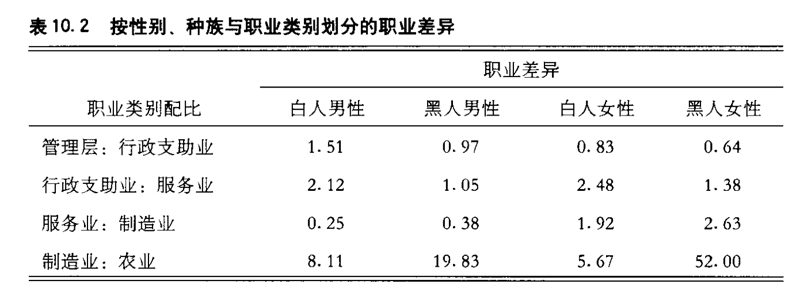

# 0203. Social Capital in Hierarchical Structures

原书第十章

In the previous two chapters, I initiated a conceptual formulation in which motivations of actions are shown to lead to certain types of interactions and the utility of social capital. I suggested that actions lead to the emergence of social structures with increasing complexity of positions, authority, rules, and agency (Chapter 8). The purpose of this chapter is to extend this line of conceptualization by examining access to and use of social capital in the context of a complex social structure – an organization. Here I begin by assuming stable and functioning hierarchies such as organizations and assess how actors, through their positions, may or may not access better social capital – resources embedded in other positions, especially hierarchically higher positions. Thus, the concern here is, first, to demonstrate structural constraints and, second, to show how actions to access social capital operate within these constraints.

Recall that the theory of social capital proposes that, in addition to the principal proposition that social capital generates returns, two factors affect access to social capital (Chapter 5). The strength-of-position proposition hypothesizes that a given position of origin in the hierarchical structure determines in part how well one may gain access to better social capital. It is a structural factor and is independent of individuals in the structure, although individuals may benefit as occupants of the positions. In contrast, the strength-of-(network)-locations proposition hypothesizes the potential payoff for individual action. Since normal interactions are dictated by the homophily principle, going beyond the routine set of frequent interactions and seeking out weaker ties or bridges represents action choices beyond most of the interactions and structural positions’ normative expectations. In relative terms, the strength of position should have greater effects on social capital than the strength of network locations. This statement recognizes the significance of structural constraints everywhere in the social structure. The theoretical implications of these propositions will be further discussed later. In empirical systems, both factors are expected to operate, even though their relative effects may vary.

In the studies examining social capital in the status attainment process (Chapter 6), empirical evidence thus far strongly supports two of the three hypotheses: the social-capital hypothesis and the strength-of-positions hypothesis. Those with better origins tend to find sources of better social capital in job searches, and contacting a source of better resources or generally having better social capital increases the likelihood of finding a better job. These relations hold even after the usual status-attainment variables (e.g., education and first-job status) are taken into account.

However, evidence is equivocal on the strength-of-weak-ties hypothesis. A number of reasons have been offered for this; one could argue, for example, that strength of ties is not an adequate measure of the strength of network locations. More appropriate measures should reflect being part of a bridge or near a bridge, or being at or near structural holes, or being at locations with fewer structural constraints (Burt 1992, 1997).

Or the strength of weak ties has been measured more as role identifications (relatives, friends, or acquaintances) or lack of intimacy (Marsden and Campbell 1984) rather than as network locations. Currently, there is a lack of empirical evidence confirming that these alternative measures would yield different results.

Another line of conceptual reasoning proposes that this result may be due to the interaction between the two exogenous variables: the strength of position and the strength of network locations (e.g., weaker ties) (see Chapters 5 and 6) for instrumental actions. Lin, Ensel, and Vaughn (1981) hypothesized a ceiling effect for weak ties. At the top of the hierarchy there is no advantage to using weak ties, since such ties are likely to lead to inferior positions and therefore inferior resources. The authors did not anticipate that weaker ties would be similarly ineffective toward the bottom of the structure. Marsden and Hurlbert (1988) also found that actors with the lowest origins did not derive greater benefit from contacts with weaker ties in gaining access to better resources than from contacts with stronger ties. Assuming that the interaction effects between the strength of position and the strength of ties occur only at both very high and very low positions of origin, it is interesting to speculate on why such interactions take place there. This is not so difficult to explain for positions near or at the top of the hierarchy. But it is more difficult to understand why positions near or at the bottom of the hierarchy do not derive more benefit from weak ties, since the theory suggests that the increased likelihood of reaching better social capital through such contacts should hold true for occupants of the lowest positions in a hierarchical social structure.

To pursue this line of reasoning, we need to consider structural parameters that dictate the interplay between strength of position and strength of network locations. What is needed is a formulation in which predictions can be made regarding the relative significance of structural constraints (as represented by strength of position) and individual actions (as represented by strength of network locations), given such structural characteristics. These considerations have led to the exploration of structural parameters and an assessment of their effects on the propositions.

The remainder of this chapter delineates a set of structural parameters, variations of which provide the context for further specification of the two theoretical propositions.

Some terms require clarification here. I assume that a social structure consists of different levels, each of which can include a set of structurally equivalent positions. They are equivalent primarily on the basis of levels of similarly valued resources and authority and secondarily on the basis of similar lifestyles, attitudes, and other cultural and psychological factors. For our purposes here, the terms levels and positions are used interchangeably. Also, social mobility , as used here, refers to the voluntary aspect in an internal labor market. Involuntary social mobility, due to job dissatisfaction, lack of alternatives, or other「pushing」or forced factors, is excluded from consideration. As Granovetter (1986) pointed out, voluntary social mobility generally results in wage growth. Likewise, it is argued that voluntary social mobility accounts for the majority of rewards (greater authority, better wages and bonuses, and faster promotions) in hierarchies such as organizations. [1]

[1] It is true that the beginning of a job search is often unplanned (see Granovetter 1974). Many job leads become available on casual occasions (e.g., parties) and through interactions with acquaintances. It is not necessarily the case that a job search begins with the purposive and active seeking out of contacts. However, this does not negate the basic premise that individuals are situated at different levels in the structure and therefore have access to casual settings involving persons who command certain types and amounts of resources and social capital. In fact, it has been empirically demonstrated (Campbell, Marsden, and Hurlbert 1986; Lin and Dumin 1986) that occupants of higher-level positions have greater access to more diverse and heterogeneous levels in the hierarchical structure than do occupants of lower-level positions and hence have greater command of social capital. Thus, it can be expected that casual settings for the higher-level positions are structurally richer in job information, as well as other types of information and influence. This structural advantage, deducible from the pyramidal assumption of the theory, has a distinct effect when the individual eventually launches a job search.

在前面两章中，我从阐述概念开始，论述了行动动机如何导致了某些类型的互动，如何导致了社会资本的效用。我认为行动导致了位置、权威、规则和代理关系不断复杂的社会结构的生成（第八章）。本章通过考察在一个复杂的社会结构（组织）背景中社会资本的获取和使用，继续扩展这条论述线索。这里我先假定等级制结构（如组织）是稳定的和能够正常运行的，然后确定行动者如何通过他们的位置获取好的社会资本 一一 嵌入在其他位置中的，特别是更高的等级制位置中的资源。因此，这里首先论述的是结构性限制，其次说眀获取社会资本的行动如何在这些限制下展开。

前面已经提出了社会资本理论的基本命题 一一 社会资本可以产生回报以及影响社会资本的获取的两个因素（第五章）。地位强度命题假设，在等级制结构中的既定初始位置部分决定着一个人获得好的社会资本的可能性。与此对照，（网络）位置强度命题假设了个体行动可以带来收益。既然规范性的互动是由同质性原则支配的，那么超越例行化的频繁互动与寻找弱关系或桥梁则代表着超越大多数互动和结构位置的规范性期待的行动选择。相对而言，地位强度对社会资本的影响应该比网络位置强度对社会资本的影响大。这个陈述承认社会结构中无所不在的结构性限制的重要性。在后面，我将对这些命题的理论含意进行进一步讨论。尽管这两个因素的相对影响不同，但在经验体系中，它们都在起作用。

1-2『对社会资本产生的影响因素中，地位强度比网络位置强度更重要。地位强度代表的是结构约束，网络位置强度代表的是个体行动。做一张任意卡片。』——已完成

在考察地位获得过程中的社会资本的研究中（第六章），经验证据强有力地支持了三个假设中的两个：社会资本假设与地位强度假设。那些有好的初始位置的行动者往往能够在求职中找到好的社会资本来源，联系好的资本来源，或者通过好的社会资本来提高找到一份好工作的可能性。即使将通常的地位获得量（如教育与首次职业地位）考虑进去，这些关系仍然成立。

然而，关于弱关系假设的证据是不确定的。这里有很多原因，比如，有人会说关系强度不能有效地测量网络位置强度。更有效的测量方法应该测量行动者是否在桥及其附近位置，或者是否在结构洞及其附近位置，或者是否在结构约束（限制）更弱的位置上（Burt, 1992, 1997）。还有一种情况是，弱关系强度被作为角色认同（亲属、朋友或熟人）或缺乏亲密性的测量（Marsden and Campbell, 1984），而不是网络位置的测量。当前还缺乏经验证据证实，这些替代性的测量方法会得出不同的结论。

另一条理论线索指出，这个结果可能是由于两个外生变量 —— 地位强度与在工具性行动中被使用的网络位置强度（如弱关系）（参见第五章和第六章）—— 之间的互动导致的。林南、恩赛尔和沃恩（Lin, Ensel, and Vaughn, 1981）提出了弱关系的天花板效应假设，即处于等级制结构顶端位置的行动者，在使用弱关系上并没有优势，因为这些关系可能连接着较低的位置与较差的资源。学者们没有考虑到，对处于结构底部位置的行动者，弱关系同样无效。马斯顿和赫尔伯特（Marsden and Hurlbert, 1988）也发现，最底层的行动者在获取好资源的过程中，从弱关系的交往者那里得到的好处不比强关系多。我们不妨假定地位强度与关系强度之间的相互影响只发生在初始位置极高和极低处。为什么这些相互影响会发生在这些地方？这个问题是非常有趣的。对于等级制结构顶端及其附近的位置，这个现象并不难解释。但是为什么等级制结构底部及其附近位置的行动者不能从弱关系中得到更多的好处呢？这是很令人费解的。很多理论都提出，通过弱关系获取好的社会资本的可能性提高了，这对于等级制社会结构最底端位置的占据者也应该是适应的。

2『等级结构的顶部和底部的行动者，不能从弱关系中获取比较多的好处。做一张任意卡片。』——已完成

沿着这条理论线索，我们需要考虑决定着地位强度与网络位置强度之间的相互作用的结构参数。考虑到这些结构特征以后，我们需要对结构约束（由地位强度代表）与个体行动（由网络位置强度代表）的相对重要性作出判断。这些考虑导致了对结构参数的探讨，以及结构参数对两个命题的影响的估计。这一章剩下的部分要描述一组结构参数，其变化为进一步说明两个理论命题提供了背景。

这里有一些术语需要澄清。我假定社会结构分为不同的层级（levels），每一层级包括一组等价的结构性位置。等价的基础首先是每一层级有相似的有价值资源和权威，其次是每一层级有相似的生活方式、态度和其他文化心理因素。为了论述的方便，这里的术语层级和位置是可以互换的。此外，这里使用社会流动指内部劳动力市场中的自愿流动，而不包括由于工作不满意、缺乏选择自由以及其他「推动」或「不得已」因素所导致的非自愿性社会流动。正如格拉诺维特（rranovetter, 1986）所指出的，自愿性社会流动通常会导致工资的増长。同样，可以认为自愿性社会流动解释了等级制（如组织）中的大部分报酬（更大的权威、好的工资与奖金以及迅速的晋升）。[1]

[1] 求职的开始阶段经常是无目的性的（参见 Granovetter, 1974）。很多工作门路是在偶然场合（如聚会）以及在与熟人的接触中获得的。开始找工作时不一定是有目的性地积极寻找关系。但这并没有否定基本的前提 —— 个体处于结构的不同层级上，因此接触控制着某些类型和某种数量的资源和社会资本的人的偶然场合也不同。事实上，经验已经证明（Campbell, Marsden, and Hurlbert, 1986; Lin and Dumin, 1986），高层位置的占据者比低层位置的占据者有更多的机会接触到等级制结构中多样化的和异质性的层级，对社会资本有更大的控制。因此可以预见，高层位置的偶然场合在就业信息以及其他类型的信息上比低层位置更丰富，影响更大。这个从社会资本理论的金字塔假定推出来的结构优势，在个体最终投身找工作时会产生显著的影响。

## 3.1 Structural Parameters and Their Effects

A hierarchy, I argue, can be described with variations and permutations of four general parameters: the number of levels in the hierarchy (the level differential ), the distribution (absolute and relative number) of the occupants across the levels (the size differential ), the distribution (absolute and relative amount) of valued resources across levels and among occupants (the resource differential ), and the sum of all occupants and resources in the structure. The first and last parameters are computed for the entire structure; the second and third parameters can be computed for either the entire structure or portions of it.

In general, the social capital proposition, the primary proposition of the social capital theory, should hold regardless of the variations in these parameters. As long as the structure is hierarchical, access to and use of better social capital are expected to facilitate socioeconomic returns under any structural variations. However, the other two hypotheses require further specification relative to variations in the structural parameters. In the following sections, I will describe each parameter and assess the impact of its variation on the two propositions. For simplic-ity, the two propositions will be identified as the positional effect (the strength of the original position) and the location effect (the strength of network locations). Again, we must remain conscious of the dominant effect of structural constraints. Strength of position should have a relatively stronger effect than strength of locations everywhere in the structure, whereas each factor may vary in different parts of the structure.

Also, for generality, I will examine the relative effects of structure (the strength of positions) and networking (the strength of locations). For networking effects, I will employ the general location argument: that is, for instrumental actions, locations at or near a bridge – variously referred to as structural holes , weaker ties , or less structurally constrained locations – reflect the strength of better locations in their likelihood of accessing better social capital. While the descriptions often implicate organizations or firms, it is hoped that the propositions can be generalized to all hierarchical structures.

结构参数及其影响

我认为等级制可以用四个一般性参数的变化与排列来描述：1）等级制的层级数量（层级差异），2）各层占据者的分布（绝对的与相对的数量）（规模差异），3）有价值资源在各层与占据者中的分布（资源差异），4）以及结构中所有的占据者与资源的总量。第一个和最后一个参数是对整个结构的估计，第二个和第三个参数是对整个结构或结构的某些部分的估计。

一般而言，不管这些参数如何变化，社会资本理论的基本命题 一一 社会资本命题，应该是有效的。只要结构是等级制的，在任何结构形式下，获取和使用好的社会资本都有助于获得社会经济回报。然而，其他两个假设需要根据结构性参数的变化进行具体的说明。在下面部分，我将描述每一个参数，确定它的变化对两个命题的影响。为简单起见，将两个命题确定为地位效应（初始位置的强度）和位置效应（网络位置的强度）。此外，我们必须注意结构性约束具有支配性的影响。尽管每一个因素在结构的不同部分可能有所不同，但是地位强度在结构中的任何地方都比位置强度有相对强的影响。

此外，我会笼统地考察一下结构（地位强度）与网络运作（位置强度）的相对影响。对于网络运作的影响，我会使用一般的位置观点来述。也即，对于工具性行动而言，在桥梁及其附近的位置 一一 被称为结构洞、弱关系或结构性约束更弱的位置 一一 反映了好的位置强度对于获取好的社会资本的可能性。虽然这里的等级制暗指组织或公司，但是我希望这些命题可以推广到所有的等级制结构中。

### 3.1.1 The Level Differential

First, the hierarchical structure can be specified by the number of levels within it. A level is defined as a set of social positions that have a similar command of resources and access to capital (including social capital) per occupant. In the occupational structure, for example, the crudest differentiation is based on occupational classifications consensually agreed upon in a given society. Each such classification, however, may be based on a combination of requirements, including the degree and presence of certain skills, training, experience, tenure, and location in an industry, as well as resources. A better differentiation would be one based on

Figure 10.1 Three differentials and the relative significance of the location effect: (a) level differential; (b) size differential; (c) resources differential.

empirical examination of each occupational position’s command of resources and access to social capital. The clustering of equivalent positions would then constitute a level in the structure.2

As illustrated in the top two figures (a) in Figure 10.1, we can describe the variation by identifying two theoretical extremes. At one extreme, the left figure, there are only two levels in the structure, and at the other, the right figure, there are many levels. The two-level system is expected to resemble a caste system in which one level has either all or most of the valued resources and the other has none or few. Thus, the positional effect should be stronger. In the multilevel system, the differentiation of levels reduces the relative inequality of valued resources across levels and therefore the positional effect. Thus, the expectation is that the number of levels will be negatively related to the positional effect.

The two-level structure minimizes interactions between levels, reducing the opportunity for finding and using bridges. In the multilevel struc-2 Breiger’s work (1981) specifying a class hierarchy of occupations is based on the principles of internal and external heterogeneity of mobility. Thus, the classification system is deduced from mobility patterns rather than from resources and social capital. I suspect that there is a strong correspondence in the resulting empirical classifications based on the mobility and resource criteria. For theoretical and tautological reasons, an empirical derivation and demonstration of the resource-based hierarchies is necessary.

ture, however, bridging is maximized. This is not to deny that the networking effect should be present even in the two-level system whenever social ties across the two levels are formed. However, in this castelike arrangement, such ties are difficult to form and follow up on because there is little need for an upper-level occupant to respond to a relationship offered by a lower-level occupant, as all rewards (wealth, power, and reputation) can be found through social ties within the upper level.

The expectation is that the number of levels in the structure will be positively related to the networking effect.

Thus, the number of levels in a structure has opposite consequences for structural constraint and individual action. On the one hand, in the two-level system, the structural constraint is strongest and provides little opportunity for effects of individual actions. On the other hand, differentiation of many levels in a structure lessens structural constraints and provides more opportunity for individual actions that gain valued resources. These effects are consistent with the general empirical observation that social mobility is related to the gradations or number of strata in an occupational structure or a labor market. Rather than explaining such a relationship solely in structural terms, these subhypotheses argue that it is both the loosening of structural constraints and the greater opportunity for action choices that account for greater social mobility across levels in a multilevel structure. However, these effects assume that either the number of occupants at each level is the same or variations in the number of occupants do not have any effect. In most hierarchical structures, this is not true.

层级差异

首先，等级制结构可以具体化为它的层级数量。层级可以定义为每一个占据者都拥有相似的资源控制与资本（包括社会资本）获取能力的一组社会位置。例如在职业结构中，最原始的划分是建立在对某一社会中所达成共识的职业分类的基础上的。但是每一个分类体系都可能是建立在混合要求的基础上的，包括某些技能、培训、经验、任期、在产业中的位置和资源。一个好的划分将建立在对每一职业位置的资源控制能力与社会资本获取能力的经验考察的基础之上。等价的位置合起来组成结构的一个层级。[2]

图 10.1 三种差异与位置效应的相对重要性：（a）层差异；（b）规模差异；（c）资源差异

如图 10.1（a）中的两个图形所示，我们可以通过考虑两种极端情况来描述参数的变化。在一种极端情况下，如左图，结构中只有两个层级；在另一种极端情况下，如右图，结构中有很多层级。两层级体系类似于卡斯特体系，其中一个层级拥有全部或大部分的有价值资源，而另一个层级却没有或几乎没有资源。因此，地位的影响应该更强一些。在多层级体系中，层级的划分降低了各层中有价值资源的相对不平等，减少了地位的影响。因此，层级的数目可能与地位效应负相关。

两层结构使层级之间的互动最小化，降低了寻找和使用桥梁的机会。然而，在多层级结构中，搭桥出现最大化。即使在两层级体系中，当两个层级之间的社会关系建立起来的时候，网络运作的影响就应该存在，这个我们不否认。但是在这种卡斯特式的结构中，这些关系很难建立起来并维持下去，因为高层占据者几乎不需要与低层占据者建立关系，所有的报酬（财富、权力和声望）都可以通过层内的社会关系获得。结构中的层级数量可能与网络运作的影响正相关。

因此，结构中层级的数量对结构性约束与个体行动有着截然不同的影响。一方面，在两层体系中，结构性约束是最强的，它几乎没有为个体行动的影响提供任何机会。另一方面，一个分为多个层级的结构减少了结构性约束，为获取有价值资源的个体行动提供了更多的机会。这些影响与通常的经验观察是一致的：社会流动与职业结构或劳动力市场中的社会阶层的等级或数目有关。这些子假设不只是用结构的术语来解释这样一种关系，它们使用结构约束的松弛与行动选择的机会增多来解释多层级结构中各层间的高社会流动性。我们在讨论这些影响时假定每层的占据者数量是相同的，或者说占据者的数量变化没有任何影响。但是在大多数等级制结构中，这是不真实的。因此，我们需要进行进一步讨论。

[2] 布菜格关于职业分类等级的论述（Breiget, 1981），是建立在流动的内部和外部异质性原则的基础之上。因此，其分类体系是根据流动模式而不是资源和社会资本建立的。我推测，建立在流动和资源标准的基础上的经验分类体系之间存在着很强的一致性。仅仅是理论的推理难免有同义反复之嫌，因此，建立在资源基础上的等级制需要进行经验的推导和证明。

### 3.1.2 The Size Differential

Variations in the relative number of occupants across levels are expected to influence positional and location effects. As in the preceding section, we can discuss this influence by examining two extreme situations, as illustrated in the two figures in the middle panel (b) of Figure 10.1. At one extreme (the left figure), every level has the same number of occupants, and at the other (the right figure), every level has a different number of occupants, the relative number decreasing from the bottom to the top of the structure. In this discussion, the number of levels is held constant. For convenience, we assume a sufficient number of levels so that both the positional and tie effects may occur.

In the equal-size structure, the opportunity for heterophilous interaction is maximal for all occupants. That is, each occupant has an equal opportunity to contact a person at a different level. In Blau’s analysis of intergroup associations (Blau and Schwartz 1984; Blau 1985), he hypothesizes that in a two-group interaction situation, the intergroup association would be greater for the small group (i.e., the probability per

Social Capital in Hierarchical Structures 171

person in Group A of associating with a person in Group B increases as the size of Group A relative to the size of Group B decreases). If it is assumed that in a hierarchical structure the relative sizes tend to decrease toward the top, then the derivation is that intergroup association initiated from a lower (and presumably larger) level (e.g., Group B) to a higher (and presumably smaller) level (e.g., Group A) decreases as the difference between the relative sizes of the two levels increases. However, as the difference in the relative sizes of the levels decreases, such upward association would be increased. Thus, it is argued that in the extreme case, in which all hierarchical levels have a similar number of occupants, there is maximal opportunity for heterophilous interactions across all levels and therefore equal opportunity for socioeconomic returns. In other words, an individual at each level has an equal chance to move up the ladder. This does not mean that everyone in the structure will have an equal opportunity to attain the same highest status. Depending on his or her initial position in the structure, each person will have an equal opportunity to interact with another person at a different level and move up the ladder.

As variations in the number of occupants across levels increase, they inhibit upward cross-level contacts. Intralevel interaction opportunities increase as the size differential increases at all levels, because most of the occupants of the larger levels tend to interact with others at the same level. Assuming that the relatively small levels are higher in the structure, the relative lack of interlevel actions initiated by the lower-level occupants reduces the potential probability effects of weak ties. Thus, the expectation is that the size differential is negatively related to the network location effect.

However, when a lower level is relatively smaller, this expectation does not hold. In such a structure, the chance is greater that lower-level occupants will have a relatively larger number of contacts with occupants at an upper level, which in turn promotes opportunity for mobility to that upper level. For example, in a structure where farm-related levels have relatively fewer occupants than do nonfarm blue-collar sectors, the tie effect should be relatively strong in the status-attainment process.

As for positional effects, variations in occupant numbers across levels have a positive effect. As the size differential increases, intralevel interactions increase among occupants in the larger, and presumably lower, level. These intralevel interactions reinforce the positional effect. The paradox is that as size differentials increase, they also increase the relative opportunity of contacts for these occupants in the smaller level with those in the larger level. In a pyramidal hierarchy (the higher the level, the fewer the occupants), the closer the level to the top, the broader the range of contacts across levels for its occupants; yet these occupants benefit not from heterophilous interactions for socioeconomic returns,

but rather from their same-level contacts. In contrast, at or near the bottom of the structure, the opportunity for occupants who need heterophilous interactions for socioeconomic returns is structurally restricted by the large size of their level.

规模差异

各层占据者的相对数量的变化可能影响到地位效应与位置效应。我们可以像前一部分那样，通过考査两种极端情况来讨论结构与位置的影响，如图 10.1 中间一组（b）的两个图形。在一种极端情况下（左图），每一层级的占据者数量相同；在另一种情况下（右图），每一层级的占据者数量不同，相对数量由结构的底部到顶端逐渐减少。在讨论中，层级的数量保持不変。为方便起见，我们假定有足够的层级数量，以保证地位效应和关系效应可以发生。

在等规模的结构中，对所有占据者而言，异质性互动机会是最大的。也即，每一个占据者与不同层级的人的交往机会是平等的。在对群际交往的分析中（Blau and Schwartz, 1984; Blau, 1985），布劳假设了一种二群体互动的情况，他发现小群体的群际交往更多（也即，当群体 A 相对于群体 B 的规模下降时，群体 A 中的每一个人与群体 B 中的人的交往概率会增大）。

如果是在一个等级制结构中，群体的相对规模往往会沿着上行方向逐步减小，那么可以推出，当两个层级的相对规模的差距增大的时候，由低层级（假设是群体 B，其规模更大一些）向高层级（假设是群体 A，其规模更小一些）发起的群际交往会减少。然而，当层级间的相对规模的差距减小时，这样一种上行的交往会增多。因此，在极端情况下，当所有等级制层级的占据者的数量都相似时，各层间的异质性互动机会达到最大化，社会经济回报的机会也会变得平等。换言之，每一层的个体有平等的向上流动的机会。这不意味着结构中的每一个人都有获得相同的最高地位的平等机会。这取决于他在结构中的初始位置。但是每一个人与各层次的人相互动的机会与向上流动的机会是平等的。

随着各层占据者数量变化的增大，上行的跨层交往会受到阻碍。随着各层差异的大，层内的互动机会会增加，因为层级规模比较大的群体中的大多数占据者往往与同层级的人互动。假定结构中规模相对小的层级很多，由低层级占据者发起的层际互动的相对缺乏会降低弱关系在的可能影响。因此，规模差异可能与网络位置的影响负相关。

但是当低层级相对较小时，这种情况可能不存在。在这样一个结构中，低层级占据者与上层占据者的交往机会会増加、从而向上层流动的机会也会相应增加。例如，在一个农民层级的占据者比非农蓝领部门的占据者相对少的结构中，关系效应在地位获得过程中应该相对比较强。

对于地位效应而言，各层占据者数量的变化会产生正效应。随着规模差异的増大，规模很大的低层级的占据者的层内互动会增加。这些层内互动强化了地位效应。似乎矛盾的是，当规模差异増大时，小规模层级上的占据者与更大规模层级上的占据者交往的机会也相应增加了。在一个金字塔等级制中（层级越高，占据者越少），层级越靠近顶端，其占据者跨层交往的范围越大，但是这些占据者不是从异质性互动中，而是从同层级的交往者中获得社会经济回报。与此相对，在结构的底部及其附近，占据者从异质性互动中获得社会经济回报的机会要受到他们所在层级的规模约束。

### 3.1.3 The Resource Differential

A third feature of the hierarchical structure is differential distribution of resources at various levels. Differentiation of levels can therefore be described in terms of distribution of resources as well as number of occupants. The resource differential can be calculated for the variation in resources across levels in a social structure or for a comparison between two levels. For the description of a social structure, as illustrated in the lower panel (c) in Figure 10.1, the resource differential may vary from minimal (when the resource differential is the same for every pair of contiguous levels) in the left figure to large (when it is different for every pair of contiguous levels) in the right figure. In the former case, the levels are said to be equidistant in resources. In the latter case, we assume that the differentials increase from the bottom to the top of the structure.

That is, the higher up in the structure, the greater the resource differential between two contiguous levels, with the upper level having many more resources per capita than the lower level. Although this assumption is yet to be examined empirically, it is based on the theoretical argument that a marginal incentive or reward of a given amount of resources decreases toward the top of the hierarchical structure. Therefore, an increasing amount of resources is expected toward the top to maintain the same degree of incentive or reward.

It is expected that the equidistant structure increases the opportunity for the location effect. Heterophilous ties are equally likely to be initiated at each level. In the unequal-distance structure, however, it is harder for lower-level occupants to overcome the resource distance across levels, especially toward the top of the structure. Thus, the expectation is that the resource differential will be negatively related to the location effect.

For the positional effect, the opposite should be true. As the resource differential increases, so does the importance of the position of origin for socioeconomic returns. In a structure with a large resource differential, any upward mobility is difficult. But in such a system, when upward mobility does take place, the position of origin rather than the use of network locations should account for the movements. If the structure is equidistant, the positional effect should be relatively small.

If this hypothesis is valid, two consequences follow within any given empirical structure. First, since the hierarchical structure, by definition, rank-orders its levels by resources, it can be deduced that cross-level interactions are most frequent across contiguous levels and decrease for any two levels, depending on how far apart they are in the structure.

Thus, we predict that social mobility (especially socioeconomic returns) should most likely occur across contiguous levels.

Furthermore, inhibition of cross-level interactions is contingent on the difference in the relative amount of per capita resources at the two levels; the interactions between contiguous levels may be attenuated or suppressed as the resource differential increases. In a structure where resource differentials increase toward the top, we predict that social mobility in that direction becomes increasingly difficult. At the very bottom, however, the resource differential between levels may be quite trivial, and thus the cross-level interactions will be substantial.

One interesting aspect of these variations is the implication they hold for any interaction related to socioeconomic returns. It is clear from the discussion so far that, toward the upper levels, there is much advantage in initiating (upward) cross-level interactions, since there is much more to gain because of the resource differentials. However, such initiatives are less likely to be reciprocated, since higher-level occupants have much less to gain from interacting with others at the lower levels. The result should be fewer cross-level interactions and generally a smaller effect from such interactions, since upper-level occupants are less likely to reciprocate actions initiated by lower-level occupants. When the interactions are successful, probably owing mostly to the positional effect, however, the payoff for the job seeker should be substantial. At the bottom, in contrast, cross-level interactions have little advantage or disadvantage since the resource differentials are small. Therefore, although it is expected that cross-level interactions will be frequent, such interactions will not generate significant benefit for the participants.

资源差异

等级制结构的第三个特征是不同层级之间资源分布的差异。因此，层级的分化可以从资源与占据者的数量分布方面来描述。资源差异可以由社会结构中各层的资源变化情况或两层间的对比情况来估计。对于一个社会结构的描述，如图 10.1（c）所示，资源差异可能从右图的最小（每相邻两层的资源差异都是相同的）到左图的最大（每相邻两层的资源差异都是不同的）。对于前者，资源的层级差异是等距的。对于后者，我们假定资源差异从结构的底部到顶端逐步增大。也即，越往结构的顶端，相两层的资源差异越大，上层的人均资源拥有量比下层多。尽管这个假定依然需要经验检验，但它是建立在一定量资源的边际激励或回报沿着等级制结构的上行方向降低的理论观点基础上的。因此，通过不断增加上层资源数量的方式来保持同等程度的激励或回报。

可以预见，等距结构提高了位置发生影响的机会。异质性关系可能被每层级上的占据者发起。但是在非等距结构中，低层占据者很难克服资源的层级距离，越靠近结构的端越是如此。因此，资源差异可能与位置效应负相关。

对于地位效应，情况正好相反。随着资源差异的增大，初始位置对于社会经济回报的重要性也增大。在一个资源差异很大的结构中，任何向上的流动都很困难。但是在这样一个体系中，当向上流动确实发生的时候，应该说是初始地位而不是网络位置的使用起了作用。如果结构是等距的，地位效应应该相对较小。

如果这个假设是有效的，在任何一个经验结构中都可以得出两个结论。

首先，既然等级制结构是根据资源来排列层级顺序的，那么可以推出，跨层的互动最经常发生在相邻的层间，任何两层间的互动数量都取决于它们在结构中的距离。因此，我们可以预测，社会流动（特别是社会经济回报）最可能发生在相邻的层级之间。

此外，跨层互动的障碍是与两层在人均资源拥有量上的相对差异相依的。相邻层级之间的互动可能会随着资源差异的增加而减少或被抑制。在一个资源差异沿着上行方向逐渐增加的结构中，我们预测向上的社会流动会逐渐困难。然而，在靠近结构的底部，层级间的资源差异可能非常细微，因此，跨层互动会相当多。

这些参数变化的一个有趣的方面是，它们同任何与社会经济回报相关的互动都有关联。讨论到现在已经很清楚，沿着上行方向发起的跨层互动存在着很多的有利因素，因为这可以从资源差异中获得很多好处。然而这些主动行动不太可能得到回报，因为高层占据者可以从与低层占据者的互动中得到的东西很少。结果是跨层互动很少，这些互动的影响也很小，因为上层占据者很少对低层占据者发起的行动作出回应。如果互动成功了，最可能是因地位的影响，而且求职者获得的回报应该很大。与此相对，在结构底部，跨层互动有很小的有利因素或者只有不利因素，因为层间的资源差异很小。因此，尽管跨层互动经常发生，但是这些互动不会为参与者带来很大的好处。

### 3.1.4 The Totality of Occupants and Resources

The final feature of the social structure concerns the absolute number of occupants and resources in the entire structure (e.g., industrial sector).

Critical mass is used here to characterize the minimal requirements for a structure’s absolute quantities of population and resources. These requirements vary, depending on the relative sizes of populations and resources in the external environment with which the structure interacts.

Nevertheless, absolute numbers are important features of a structure.

Associations within the structure are strongly affected by the constraints as well as the opportunities to gain resources in the external environment. Thus, analysis must be extended to the larger structure of which the initial focal structure is but a substructure. For example, in under-standing social mobility in a particular labor market, we may wish to analyze the structural parameters of that segment. Analyses, however, must eventually be extended to considerations of other segments, so that relative mobility patterns may be assessed across segments. For the larger structure, similar parameters (the level differential, the location differential, and the resource differential) may be utilized to examine possible cross-segment mobility. No further elaboration and extension of these parts are necessary in this chapter.

占据者和资源的总量

社会结构的最后一个特征涉及到整个结构（例如工业部门）的占据者和资源的绝对数量。我们将一个结构的存在所要求的绝对的人口与资源数量的最小值称为临界值（Critical mass）。这些要求是不同的，这取决于与结构互动的外部环境的人口和资源的相对规模。然而，绝对数量是结构的重要特征。结构内的交往受到在外部环境中获取资源的约束与机会的强烈影响。因此，分析必须扩展到更大的结构，而最初关注的结构只是大结构的子结构。

例如，在理解某一个劳动力市场的社会流动性的时候，我们要分析这个部门的结构参数，但是，最后的分析必须扩展到对其他部门的考虑，因为其相应的流动模式可能要通过很多部门的考察才能确定。对于更大的结构而言，相似的参数（层级差异、规模差异和资源差异）可以用来考察跨部门的流动。这里就不展开论述了。

## 3.2 Implications for Structure and Individuals

In summary, a consideration of the structural parameters has enabled us to specify conditions under which the positional effect and the tie effect vary. In ideal-typical terms, the positional effect should be maximal when the structure contains (1) a minimal number of levels, (2) a large occupant differential across levels, and (3) a large resource differential across levels. The network location effect should be maximal when the structure has (1) a large number of levels, (2) a small occupant differential across levels, and (3) a small resource differential across levels. Again, we must keep in mind that, even when the tie effect is strongest, the positional effect remains dominant.

The positional effect can be seen as an indicator of structural effects, and the location effect (especially the use of weaker ties) suggests the consequences of individual action. As explicated earlier, the normative mode of interactions is homophilous, involving participants with similar socioeconomic characteristics. In contrast, the use of weak ties tends to result in interactions involving participants with dissimilar socioeconomic characteristics. Heterophilous interactions are not totally without benefit for participants from higher status levels, since they may subsequently request or demand services from the lower-level participants.

Nevertheless, the initiation and establishment of such interactions by lower-level persons represent action and effort. Viewed in this context, these principles have theoretical implications for the relative effects of structural constraints and individual choices. They also stimulate consideration of the dynamic balance between vertical (heterophilous) and horizontal (homophilous) interactions in a stable social structure. These implications will be briefly examined here.

结构与个体的含意

总之，对结构参数的考察使我们可以对地位效应和关系效应发生变化的条件作出说明。在理想类型中，地位效应会在结构出现下列特征时达到最大化：1）层级数量尽可能少；2）各层的占据者差异很大；3）各层的资源差异很大。而网络位置效应会在结构出现相反特征时达到最大化：1）层级的数量很多；2）各层的占据者差异很小；3）各层的资源差异很小。此外，我们必须记住，即使在关系效应最强烈的时侯，地位效应仍然处于支配地位。

2『这里的信息，补仓进「地位强度与网路位置强度」那张任意卡中。』——已完成

地位效应可以视为结构性影响的指示器，而位置效应（特别是弱关系的使用）则表明了个体行动的作用。如前所述，互动的规范模式是同质性的，参与者拥有相似的社会经济特征。与此相对，弱关系的使用往往导致拥有非相似社会经济特征的参与者加入互动。异质性互动对于高地位层级的参与者并不是完全没有益处的，因为他们可能要求或者需要低层参与者的服务。然而，低层占据者发起与建立的这些互动代表着行动和努力。从这个方面看，这些原则具有结构性约束与个体选择的相对影响的理论含意。它们也激发了我们对一个稳定的社会结构中的纵向（异质性）互动与横向（同质性）互动之间动态平衡的思考。我会在这里简单考察一下这些含意。

## 3.3 Structural Constraints versus Social Capital 

The theory describes structural conditions under which structural constraints and individual actions affect social mobility. Thus, it is relevant to the debate concerning structural versus action effects. In contemporary sociology, the structural view dominates. Much of the theoretical development and empirical work in the past three decades have supported and advanced the structural perspective. The theory presented here does not disagree with the view that structural effects are predom-inant. It also argues that the positional effect, for example, is relatively more important than the tie effect throughout the structure. However, the specification of structural parameters enables us to ask where and to what extent individual actions become possible and meaningful. The following discussion gives further attention to the relationship between this theory and selected prevailing structural theories.

Blau’s theory of heterogeneity and inequality, along with Emerson and associates’ dependence theory, exemplifies well the structural perspective.

In a nutshell, Blau (1977, 1985; Blau and Schwartz, 1984) has argued that the distribution of a dimension (attribute) and the number of variables differing among groups in a population dictate the extent of association across groups. When the distribution of a dimension varies over a number of nominal or graded groups, such heterogeneity (for nominal groups) and inequality (for graded groups) promote intergroup association and can be examined over multiple dimensions (attributes).

The extent of the congruence between the different heterogeneities and inequalities also affects intergroup association. When the differences in characteristics are closely related (consolidated), intergroup association should be low; when they are not closely related (cross-cutting), intergroup association should be high.

Although the present theory can be seen as an elaboration and extension of Blau’s theory, there are several differences between the two. First, the present theory focuses on two types of social action: instrumental actions for gaining valued resources and expressive actions for maintaining valued resources. Though this chapter deals specifically with socioeconomic returns and mobility, and therefore instrumental actions, the distinction between instrumental and expressive actions plays a central role in the theoretical structure and has immediate consequences for patterns of interactions. Patterns of association differ for instrumental and expressive actions (Lin 1982). The expectation is that vertical (heterophilous) actions and interactions are effective for instrumental purposes, whereas horizontal (homophilous) actions and interactions are effective for expressive purposes. In Blau’s formulation, there is a mixture of the two types of action, with the main emphasis perhaps on the latter.

Intergroup marriage, for example, might be seen as primarily expressive, yet there are circumstances in which marriage takes on an instrumental aspect as well. The specification of the two types of action should clarify potentially conflicting empirical results. It can be argued that Blau’s theory should be relatively more valid for the class of interactions intended for expressive purposes.

Second, the two theories’ primary elements by which groups and positions are identified differ. Though both assume that these elements must be consensually arrived at, the basic criteria are different. For Blau, they are based on the attributes that people take into account in their social relations. For the theory presented here, they are based on resources.

Whereas Blau convincingly argues that the use of attributes based on their influence on social relations at the microlevel does not necessarily affect consequent intergroup relations, the criterion of resources used in the present theory does not involve such a conceptual tautology. In later writings (e.g., 1985), Blau recognized the significance of resources in the identification of attributes. A modification of the definition of attributes in resource terms may resolve the difficulty.

A further consequence of the difference in criteria used to define groups or positions is that Blau’s theory applies to both unranked and ranked groups, whereas the present theory assumes a hierarchical structure based on ranked positions. In the present theory, the determining factor of a social structure is the different amounts of valued resources various levels command. Therefore, the levels are hierarchically ordered.

This more restricted view of social structure offers an advantage in that it eliminates further controversy in ranking categorical variables.

Categories of ethnicity and religion may be ranked in some social systems but not in others. For the present theory, the valued resources must be gradable, even if some of them represent social categories (e.g., race and gender). As long as they are consensually considered to be valued resources for a social system, they form the basis of the hierarchy in the structure. Even for expressive actions, as I have argued elsewhere (Lin 1982, 1986), such a hierarchical view of the structure helps to formulate predictions about patterns of action and interaction within or across levels. This specification may help elaborate differential patterns of intergroup associations. One may postulate, for example, that when categorical variables represent valued resources in a given social system, both the heterogeneity hypothesis and the inequality hypothesis may hold, whereas they diverge for other categorical variables.

Finally, Blau focuses on variation in the distribution of the number of individuals as the major source of structural variation. For both the heterogeneity and inequality principles, population distribution over the various categories or statuses affects intergroup associations. Although he has also identified the number of subgroups as having an impact, he assumes in the bulk of his work that the number of subgroups can be standardized for comparative analysis (1985, pp. 10–11). In other words, his theory tends to treat the number of subgroups as a constant.

The present theory specifically identifies the level differential and the size differential, along with the resource differential, as separate structural parameters. The effects of heterogeneity and inequality as proposed by Blau, therefore, can and should be further specified relative to the variations in both the number of levels (or groups) and the number of persons in them. For example, if a pyramidal structure is compared with an inverse-pyramidal structure, the inequality coefficient may be similar but the interlevel (group) associations may differ drastically. Empirically, an inverse-pyramidal structure may not exist, as discussed earlier, but most structures will have portions in which a lower level has fewer occupants than an adjacent higher level (e.g., agricultural vs. service sectors).

For such a structure or substructure, the interlevel (intergroup) association is expected to be different from the usual one, in which the upper level has relatively fewer occupants. Likewise, while two structures have similar level and occupant differentials, their resource differentials may differ, and therefore their patterns of interlevel association may differ.

For example, in a two-level caste system, where a small minority holds most of the resources, the association between the occupants of the two levels should be substantially different from that in another system in which the level and size differentials of the two levels are similar and there is little difference in their resources.

Having noted these differences, we can now describe Blau’s association theory in greater detail. Chance encounters across levels or groups due to variations in a hierarchical structure can then be predicted according to the level differentials (the more levels or groups, the greater the number of such chance encounters), the size differentials (the more evenly distributed the occupants across levels or groups, the greater the number of such chance encounters), and the resource differentials (the smaller the difference in resources per capita across levels, the greater the number of chance encounters). The effects of the hierarchy (especially the resource differential), however, restrict these general principles of association. In the case of instrumental actions taken for the purpose of socioeconomic returns, reciprocity of association becomes problematic. For a person from a higher level to have a chance encounter with a person from a lower level may be structurally unavoidable (e.g., a banker and a cleaning lady), yet a more substantive and especially status-changing association (e.g., marriage) requires efforts to overcome the structural gap. It is for this type of association that the present theory attempts to clarify the potential effects of individual actions.

Similarly, the structural theory of Emerson and Cook can be explicated in view of the present theory. In their power-dependence theory, Emerson and Cook specify that structural parameters dictate exchange patterns and consequences, even though individuals engage in such exchanges to maximize their resources (Emerson 1962; Cook and Emerson 1978; Cook 1982; Cook, Emerson, Gillmore, and Yamagishi 1983; Emerson, Cook, Gillmore, and Yamagishi 1983). In their theoretical formulation of exchanges, structural dependence, or constraints (number of available exchange partners and distance to sources possessing resources), the type of exchange (e.g., negatively connected networks, in which only one pair of individuals can engage in transactions with one type of resource, and positively connected networks, in which new resources depend on combining two or more types of resources) and the resource salience (amount of resources available to each individual) result in further resource differentiation among individuals.

By specifying these parameters in a hierarchical structure, the present theory helps to predict in what types or parts of structures the rate of increasing dependence or resource differentiation will be faster or slower.

If it is assumed that the resource differential increases toward the top of the structure, one would predict that power or resource differentiation increases faster for occupants positioned closer to the top of the structure. The size differential also predicts differences in the speed of differentiation. The greater the differential, the greater this differentiation, since the larger number of occupants at the lower levels will have fewer opportunities to interact with occupants at the higher levels. The level differential delineates resource distance and should help generalize to larger structures the experimental results of the Emerson–Cook studies, in which the number of positions/levels and occupants is necessarily limited.

Furthermore, the present theory fleshes out possible variations in actions taken by individuals in similarly structured positions. Cook and Emerson (1978) briefly examined such variations by demonstrating the effects of a stronger sense of equity and a stronger sense of commitment on resource differentials; they found some evidence that exercise of power or demand for resources was either curtailed (especially for women) or increased (especially for men). Such data hint at the possibility that individual actions vary beyond predictions based on their structural characteristics. The present theory, with its explicit specification of structural parameters that predict where such individual actions may be relatively large or small, may well refine and elaborate the strictly structural interpretation of the dependence theory to accommodate such empirical variations.

结构性约束与社会资本

由于我的理论描述的是结构性约束与个体行动影响社会流动的结构性条件，因此对结构性影响与行动影响的比较进行讨论是有意义的。在当代社会学中，结构性视角占统治地位。过去 30 年中的很多理论发展与经验研究都支持并向前推进了结构性视角。我提出的理论不是不同意结构性影响居支配地位的观点。例如，我也认为地位效应在整个结构中比关系效应更重要。但是结构参数的具体化使我们能够指出个体行动在何处、在何种程度上是可能的、有意义的。下面的讨论将继续关注我的理论与当前盛行的主要结构性理论之间的关系。

布劳的异质性与不平等理论，埃默森和其同事的依赖理论，都很好地展现了结构性理论的视角。简单地说，布劳（Blau, 1977,1985; Blau 和 Schwartz, 1984）认为一个人口中各群体之间的某一维度（性质）分布与量数目的差异，支配着群际交往的范围。当某一维度在许多分类群体或等级群体中的分布不同时，这些异质性（对于分类群体）与不平等（对于等级群体）促进了群际交往，这也可以在多个维度（性质）中考察。不同的异质性与不平等之间的一致性程度也影响着群际交。当这些不同特征紧密相关（统一）时，群际交往会很少；当它们不紧密相关（交叉）时，群际交往会很多。

尽管我提出的理论是对布劳理论的述与扩展，但是这两个理论之间存在着几个不同点。

首先，我的理论关注两种类型的社会行动：获取有价值资源的工具性行动与维持有价值资源的表达性行动。尽管本章专门论述社会经济回报与流动问题 一一 工具性行动，但是工具性行动与表达性行动之间的区別在结构性理论中扮演着主要角色，对互动类型有着直接的影响。工具性行动和表达性行动的交往类型是不同的（Lin, 1982）。纵向（异质性）行动与互动可以实现工具性的目的，而横向（同质性）行动与互动可以实现表达性的目的。在布劳的阐述中，两种类型的行动是混合在一起的，但他主要关注后者。例如，群体间的婚姻可能主要是表达性的，然而有些情况下婚姻也具有工具性。对两类行动的说明应该澄清潜在的冲突性的经验结果。应该说布劳的理论对于表达性互动的分类相对更有效。

第二，两种理论用来确定群体与地位的基本要素是不同的。尽管它们都假定这些要素一定可以达成一致，但是各自的基本标准是不同的。对于布劳，这些标准是建立在人们在社会关系中所考虑的属性的基础上的。我的理论将它们建立在资源的基础上。尽管布劳令人信服地说明了在微观层次上使用影响社会关系的属性并不必然影响到群际关系，但是我使用的资源标准不涉及这样一个概念的同义反复。在布劳后来的著作中（如 Blau, 1985），他认识到资源在确定属性中的重要性。对定义在资源方面的修正可以解决这个困难。

定义群体或地位的标准不同的另一个后果是，布劳的理论既适应于非等级群体，又适应于等级群体。而我的理论假定，等级制结构建立在等级位置的基础之上。在我的理论中，社会结构的决定因素是各层所控制的有价值资源的数量。因此层级是具有等级序列的。

这个更严格的社会结构观具有一个优势，它消除了在排列范畴变量上的很多争论。族群与宗教范畴在一些社会系统中可以分等级，但在其他的社会系统中则不能。在我的理论中，尽管一些有价值资源代表着社会范畴（如种族和性别），但是有价值资源一定是可分等级的。只要它们被公认为是社会系统中的有价值资源，它们就在结构中形成等级制的基础。在其他地方我已经论述过（Lin, 1982, 1986），即使对于表达性行动，这样一个等级制的结构观点仍有助于说明层内或层际的行动与互动模式。这个观点可能也有助于说明群际交往的不同模式。有人可能会假定，当范畴变量代表着某一个社会中的有价值资源时，异质性假设与不平等假设都会有效，但是这些假设未必适合其他的范畴变量。

最后，布劳关注作为结构变化的主要来源的个体数量分布的変化。对于异质性原则与不平等原则而言，不同范畴或不同地位的人口分布都影响着群际交往。尽管他也把子群体的数量作为一个影响因素，但他在大部分著作中都假定，子群体的数量可以在比较分析中标准化（Blau, 1985, pp10-11）。换言之，他的理论倾向于将子群体的数量作为常量。

我的理论特别确定了层级差异、规模差异和资源差异，它们都作为独立的结构参数。因此，布劳提出的异质性与不平等的影响，可以，也应该从层级（或群体）数量及其层级人数的变化上进一步加以说明。例如，如果把一个金字塔结构与一个倒金字塔结构相比较，不平等系数可能很相似，但是层（群）际交往可能有着巨大的不同。前面已经讨论过，倒金字塔结构可能在经验上并不存在，但是大多数结构可能都会有一部分，其中低层的占据者比相邻更高层的占据者少（例如农业部门相对于服务业部门）。对于这样一个结构或子结构，层（群）际交往可能不同于一般的结构 —— 一般结构的上层有更少的占据者。同样，当两个结构有相似的层级差异与占据者差异时它们的资源差异可能不同，因此，它们的层际交往就可能不同。例如，在个两层的卡斯特体系中，很少的人控制着大多数资源，两层之间的占据者的交往应该与另一个体系很不同 —— 这个两层体系的层级差异和规模差异与卡斯特体系很相似，但是层间的资源差异很小。

注意到这些差别之后，我们现在可以具体描述布劳的交往理论。由于等级制结构的差异而引起的各层或各群体的偶遇机会的差异可以由以下因素来预测：1）层级差异（层级或群体越多，这些偶遇机会的数量越多）；2）规模差异（各层或各群体的占据者的分布越平均，这些偶遇机会的数量越多）；3）资源差异（各层的人均资源差异越小，偶遇机会的数量越多）。但是等级制的作用（特别是资源差异），约束了这些交往的一般原则。在以社会经济回报为目的的工具性行动中，交往的互惠性成了问题。一个来自高层的人可能偶遇上个来自低层的人（例如，一个银行家遇到一个女清洁工），这在结构中是不可避免的，然而，更多的交往、特别是改变地位的交往（例如婚姻）需要努力来克服结构障碍。个体行动对这种类型交往的潜在影响，正是我在理论中想努力澄清的。

同样地埃默森和库克的结构性理论可以在我的理论中得到说明。在权力依赖理论（power-dependence theory）中，埃默森和库克认为尽管个体会参与交换，使他们的资源拥有最大化，但是结构参数支配着交换的模式与后果（Emerson, 1962; Cook and Emerson, 1978; Cook, 1982; Cook, Emerson, Gillmore and Yamagishi, 1983; Emerson, Cook, Gillmore,, and Yamagishi, 1983）。他们在对交换的理论阐述中指出，结构性依赖或约束（可以进行交换的伙伴数量和到资源拥有者的距离）、交换类型（例如，当网络中只有一对个体只进行一种类型的资源交易时，交换与网络负相关；当网络中的新资源依靠组合两种或多种类型的资源时，交换与网络正相关）与资源特征（每人可以利用的资源数量），导致了资源在个体中的进一步分化。

我把这些参数放在一个等级制结构中加以说明，有助于预测在什么类型的结构中或在结构的什么部分中，依赖增长或者资源分化的速度会加快或放慢。如果假定资源差异沿着结构的上行方向逐新增加，我们可以预测，靠近结构顶端位置的占据者的权力或资源分化速度会迅速加快。规模差异也可以预测分化速度的不同，差异越大，分化越大。因为低层的大量占据者与高层占据者互动的机会很少。层级差异描述了资源距离，有助于将埃默森-库克（Emerson-Cook）的实验研究结果扩展到更大的结构中，其研究中的位置 / 层级数量与占据者数量不可避免要受到实验的约束。

此外，我对相似结构位置上的个体所采取的行动的可能差异进行了理论完善。库克和埃默森（Cook and Emerson, 1978）通过说明强公平感与强责任感对资源差异的影响，简单地考察了这些变化。他们发现权力的行使或对资源的需求或者减少了（特别是对于女性）或者增加了（特别是对于男性）。这些数据暗示着个体行动的差异可能超出建立在它们的结构特征基础上的预测。我的理论对预测个体行动变化的结构性参数进行了详细的说明，它完全可以对依赖理论的严格的结构性解释进行提炼与发挥，以说明行动的这些经验变化。

## 3.4 Individual Action versus Social Capital

As stated earlier, the individual perspective, rather than the psychological deductive viewpoint, has emerged in the American sociological literature. The effects of individual actions can be explored from two perspectives. The first focuses on the structural formations or changes due to such actions. For example, Coleman (1986a, 1986b, 1990) argues that social actors promoting their interests engage in social relations that, depending on the specific purposes of the actions involved, may result in a market system, an authority system, or a normative system. He describes the process by which each system evolves, emphasizing the emergence of norms and sanctions from the interacting actors with their respective interests. Rational or cognitive action is the assumed force in the forging of social relations and subsequent structures. In contrast, Collins (1981) sees emotion as the ultimate force behind interactions, in which individuals seek positive reinforcement and claim membership.

Chains of such interaction rituals eventually form and provide cultural (conversational) and energy resources for repeated interactions, which develop into formal organizations and informal groups. These proposals focus on how individual actions can result in structural forms.

From the second perspective, individual actions are possible and meaningful under structural constraints. Burt’s work (1982, 1992) explores structural actions, or actions taken by individuals who are at the same or neighboring positions to protect or promote their common resources and interests. He argues that individuals from different positions can coopt to alleviate structural constraints, and in the process can modify the structure of relationships.

Integration of these two perspectives and the present theory has interesting results. In Chapter 8, it was argued that social capital provides the critical link between individual interests and the emergence of structure.

To have resources, one must form ties with others initially to protect and eventually to gain resources. Maintenance and protection of resources are seen here as driven by emotional or expressive forces, whereas resource gain requires mobilization of instrumental and cognitive motives and action. The resulting horizontal (homophilous) and vertical (heterophilous) interactions and relations constitute the elementary forms of social structure. Social structure allows access to and use of resources not necessarily in each individual’s possession. Differential ability to manage and manipulate social capital helps dictate the emergence of hierarchical positions. Variations in the structural parameters are the evolutionary consequences of the emerging process and its interaction with external structures and resources.

Once structural parameters have become dominant forces, access to and use of social capital continue to motivate individual actions wher-ever and whenever possible in the hierarchical structure. The parameters (level differentials, size differentials, and resource differentials) assume different significance for different types and parts of the hierarchical structure. For example, the extent of collective actions by a given level’s occupants, as well as the outcomes of such actions, are dictated by the relative number of occupants not only at the given level but also across levels. It would be interesting to postulate the structural conditions under which such collective actions will result in further consolidation of the given levels or elimination of variations in structural parameters. In the next section, one such analysis is offered as an illustration.

个体行动与社会资本

前面已经提到，个体化的视角而不是心理学的演绎观，已经出现在美国社会学的文献中。个体行动的影响可以从两个视角进行探讨。

第一个视角关注行动所导致的结构形成或変化。例如，科尔曼（Coleman, 1986a, 1986b, 1990）认为，社会行动者为了增进自我的利益而参与到社会关系中来，这取决于所涉及到的行动的具体目的，还可以导致市场体系、权威体系或者规范体系的形成。他描述了每个体系演化的过程，强调了规范和认可从为了各自的利益而进行互动的行动者中生成的观点。科尔曼假定理性行动或认知行动是社会关系与结构的塑造力量。与此相对照，柯林斯（Collins, 1981）将情感视为互动背后的最终力量，个体在互动中寻找积极的强化与成员身份的认可。这些互动仪式链最终为重复互动形成和提供了文化（交流）资源与能量资源，重复互动最后发展成为正式组织和非正式群体。这些假设关注的是个体行动如何导致结构的形成。

从第二个视角看，个体行动在结构性约束下是可能的、有意义的。伯特的著作（Burt, 1982, 1992）探讨了结构性行动，或者说在相同或者邻近位置的个体为了保护或促进他们的共同资源和利益而采取的行动。他认为，不同位置的个体可以通过合作的方式来减少结构性约束，并且在这过程中可以修改关系的结构。

这两个视角与我的理论的整合产生了有趣的结果。在第八章，我提出社会资本提供了个体利益与结构生成的关键联结。为了拥有资源，一个人必须与其他人结成关系，以保护和获得资源。资源的维持和保护被认为是被表达性的力量所驱动的，而资源的获取需要工具性的和认知性的动机与行动的动员。因此、横向的（同质性的）互动和关系与纵向的（异质性的）互动和关系组成了社会结构的基本要素。社会结构使每个人可以获取和使用不必为个体所拥有的资源。管理与控制社会资本的不同能力有助于说明等级制位置的形成。结构性参数的变化是形成过程的演进以及与外部的结构和资源互动的结果。

2『个人行动与社会资本的关系，做一张任意卡片。』——已完成

一旦结构性参数成为支配力量，社会资本的获取和使用就会持续地驱动着个体行动，这会发生在等级制结构中的任何可能的时空条件下。参数（层级差异、规模差异和资源差异）假定不同类型的等级制结构与等级制结构的不同部分具有不同的意义。例如，某一层级占据者的集体行动的范围与这些行动的结果，是由这一层和各层的占据者的相对数量决定的。那么在什么结构条件下，这些集体行动将会导致某些层级的进一步团结或者结构性参数变量的排除呢？对此进行研究将是很有趣的。在下一部分，我会以此为例进行分析。

## 3.5 Mobility and Solidarity: Some Policy Implications 

I have speculated (Lin 1982) that a stable social system requires a balance of opportunities for both homophilous and heterophilous exchanges. A system that does not provide sufficient opportunities for heterophilous exchanges reduces the opportunity for mobility and will experience fragmented populations with strong intralevel solidarity. This intralevel solidarity will promote the development of level (class) consciousness and potential class conflict. In contrast, a system that encourages a great degree of heterophilous exchange will experience much mobility and hence structural instability since solidarity will not prevail within population groups. The consequence may be a chaotic society in which transient interactions and lack of group solidarity threaten the integration of the system itself.

What this implies is that the structure must strive for adjustments in the number of levels, the distribution of occupants and resources among those levels, and the cumulation of occupants and resources. An increase in the differentiation of levels, perhaps inevitable in the industrialization process, must be accompanied by a redistribution of occupants and resources. That is, the size differential and the resource differential must be kept at reasonable ratios between levels. Significant size and resource differentials usually indicate a rigid structure.

As a crude illustration, let us assume that the American occupational structure is segmented by sex and race. We assume that occupational mobility follows sex and race specifications (e.g., a position vacated by a white male is filled by another white male). The 1999 distribution of occupants of the five major U.S. occupational categories (managerial and professional, technical, sales and administrative support, production/

operations, and farm) by sex and race is shown in Table 10.1. For each race-by-sex combination, we may construct the occupant differential between two assumed contiguous occupation categories by dividing the occupant size of the「higher」category by that of the「lower」one. For example, for white males, the occupant differential between service occupations and production/operations occupations is .25 (5,694/23,084) and the occupant differential between administrative support occupa-

Social Capital in Hierarchical Structures 181

Table 10.1. U.S. Employed Workers by Gender, Race, and Occupational Category (1999)

Employed Workers (thousands)

Source : U.S. Department of Labor, Employment and Earnings (1999, p. 20).

Table 10.2. Occupant Differentials by Gender, Race, and Occupational Category

Note : Differentials based on number of workers in Table 10.1, calculated by the ratio of the upper level to the lower level. The smaller number suggests a reduced opportunity for the lower-level occupants to move to the next higher level.

tions and service occupations is 2.12 (12,069/5,694). Assuming that the resource differentials are the same across these three occupational categories, the present theory would predict that structural constraints on mobility from production/operation occupations to service occupations are quite high: the positional effect would be strong and the tie effect weak. Structural constraints, however, should be quite low for mobility from service to administrative support occupations, where the positional effect is expected to be small and the tie effect large. These and other occupant differentials are presented in Table 10.2.

Now we can compare the patterns of mobility opportunities and the relative positive and tie effects for white and black males and females.

As Table 10.2 shows, both black males and black females have greater structural constraints than their white counterparts for mobility to higher white-collar occupations (from service to administrative support, 1.05 and 1.38 for black males and females and 2.12 and 2.48 for their white counterparts; and from administrative support to managerial occupations, .97 and .64 for black males and females and 1.51 and .83 for their white counterparts). Thus, we would expect that for black males and females to move up in these white-collar occupations, they should expect relatively stronger position effects and weaker tie effects. Comparing males and females, we find that females do not suffer as much structural constraint in moving from service to administrative support jobs, but they do suffer greater structural constraint than their male counterparts in moving from administrative support to managerial occupations (1.51

and .97 for white and black males, respectively, and .83 and .64 for white and black females respectively). In attempting to move to the top tier of the occupational pyramid, then, females should expect relatively stronger position effects and weaker tie effects.

These are very crude data. We are not sure if, in fact, the American occupational structure is rigidly segmented by race and sex (in fact, we know that to some extent that this is a false assumption). The occupational categories here have been kept to a minimum (Breiger 1981, for example, proposed an eight-category classification for a hierarchical structure of American occupations). And the assumption that the resource differentials are constant across levels (occupational categories) is probably invalid. But given these assumptions, the theory informs us that, in such a structure, race and gender do make a difference in occupational mobility. Faced with greater structural constraints in moving up in white-collar occupations, blacks and females would experience difficulty in mobilizing social capital to overcome such structural deficiencies. Thus, the research agenda should shift to finding out how to make access to social capital more likely for structurally disadvantaged blacks and females.

This demonstration (within the limitations set by our assumptions) illustrates the utility of the social capital theory from both the structural and the individual perspectives. At the macrostructural level, the search for ways to overcome such constraints stimulates policy considerations.

Is it possible to create vacancies to equalize the size differential? Is it possible to equalize the resource differential? Is it possible to combine these moves in some way? Or should the structure address the issue of real-location of vacancies across sex and racial categories, thereby emphasizing the interfirm labor market rather than the internal labor market perspective (see such a position advocated in Granovetter 1986)? Unless the structure is capable of making such adjustments, chances are that mobility opportunities will remain structurally unequal and discontent will increase. In extreme cases, such immobility is cause for social revolution.

At the individual level, awareness of structural constraints and of flexibility within them may be reflected in the process of cognitive evalua-

Social Capital in Hierarchical Structures 183

tion. To the extent that such evaluation is engaged in, the individual has the option of initiating action by seeking out heterophilous ties and better social capital. Because the nature, range, and quality of such ties vary at different levels in the hierarchy, the benefits of seeking them out also vary. There is also a risk of nonreciprocated action when the structural gap is too great, along with a loss of identification with other occupants of the initial level. Both may lead to a sense of alienation.

动员与团结：一些政策含意

我推测（Lin, 1982），一个稳定的社会系统需要同质性与异质性交换机会的平衡。一个不能为异质性交换提供足够机会的系统会减少流动机会，从而被很强的层内团结所分裂。这种层内团结会促进层（阶级）意识的发展，导致潜在的阶级冲突。与此相对照，一个积极鼓励异质性交换的系统会产生大量的流动，从而导致结构的不稳定性，因为这样的系统很难维持团结。结果是社会产生混乱，短暂性的互动与群体团结的缺乏威胁着系统自身的整合。

这意味着结构必须尽力调节层级的数量、各层的占据者与资源分布以及占据者与资源的总量。层级分化的扩大可能是工业化过程中所无法避免的现象，但其必然伴随着対占据者与资源的重新分配。也即，规模差异与资源差异必须在各层间保持一个合理的比例。显著的规模差异和资源差异通常表明了一个僵硬结构的指示器。

举一个很粗糙的例子，让我们假定美国职业结构被性別和种族所分割。我们假定职业流动遵循着性和种族的规范（例如，一个白人男性离职后由另一位白人男性来充任）。表 10.1 给出了 1990 年美国的雇用工人在 5 个主要职业类中按性别和种族划分的分布。对于每一个种族一性别组合，我们都可以通过用「更高」类别的雇员规模除以「更低」类别的雇员规模的方式，建立相邻的两个职业类别之间的职业差异。例如，对于白人男性，服务业与制造业之间的职业差异是 0.25（5694/23084）, 行政支助业与服务业之间的职业差异是 2.12（12069/5694）。假定这三个职业类别之间的资源差异是相同的，我的理论可以预测，从制造业流动到服务业的结构性约束会很高：地位效应会很强，而关系效应会很弱。然而，从服务业流动到行政支助业的结构约束会很低，这里地位效应很小，而关系效应很大。这些以及其他的职业差异在表 10.2 中已列出。

注意：差异是利用表 10.1 中给出的数据计算的，表中的数字是上一层雇员数量与下一层雇员数量之间的比值。数字小意味着低层占据者流动到更高一层的机会减少了。

现在我们可以比较一下白人男女性与黑人男女性的流动机会模式以及相应的地位效应与关系效应。如表 10.2 所示，对于更高级的白领职业（从服务业到行政支助业，黑人男性与女性分别为 1.05 和 1.38，而白人男性与白人女性分别为 2.12 和 2.48；从行政支助业到管理层，黑人男性与黑人女性为 0.97 和 0.64，而白人男性与白人女性为 1.51 和 0.83），黑人男性与黑人女性受到的结构性约束都相应地比白人男性与白人女性高。

因此我们可以预见，黑人男性和女性要流动到这些白领职业，就要遇到相对强的地位效应与相对弱的关系效应。对男性和女性进行比较，我们会发现女性在从服务业流动到行政支助业时，并没有受到男性那么多的结构性约束，但是她们在从行政支助业流动到管理层时所受到的结构性约束却比男性要多（白人男性与黑人男性分别为 1.51 和 0.97，而白人女性与黑人女性分别为 0.83 和 0.64）。在努力向职业金字塔的顶端移动中，女性遇到更强的地位效应与更弱的关系效应。

这是一些非常粗略的数据。我们不确定，在现实中美国职业结构是否受到种族和性别的严格分割（事实上，我们知道这在某种程度上是一个不真实的假定）。这里的职业分类已经最小化了（例如，Breiger 1981 将美国职业等级结构刘分为 8 种职业）。假设各层（职业类别）间的资源差异是常量，可能没有根据。但是根据这些假定，我们可以得知，在这样一个结构中，种族和性别在职业流动上是有差别的。黑人和女性在向白领职业流动时面临着更大的结构性约束，他们在动员社会资本克服这些结构性缺陷时也会遇到很大的困难。因此，研究日程将关注处于结构劣势地位的黑人和女性如何更多地获取社会资本。

这个例子（在我们的假定所设定的约束内）展示了从结构和个体两个视角出发的社会资本理论的解释力。在宏观结构层次上，对克服这些约束的方法的研究激发了我们对政策的考虑。可以创造出使规模差异变得平等的空职吗？可以使资源差异变得平等吗？可以按某种方式把这些流动结合起来吗？或者结构应该处理跨越性别和种族范畴的空职的再分配问题，从而强调公司间的劳动力市场的视角而不是内部劳动力市场的视角吗？（参见 Granovetter, 1986 所坚持的立场）除非结构能够作出这些调整，否则流动机会仍然是结构性不平等的，不满将会增加。在极端的情况下，这些静止是社会爆发革命的原因。

在个体层次上，对结构性约束及其弹性的意识可能反映了认知评价的过程。在某种程度上这些评价会影响行动，个体可以寻找异质性关系和更好的社会资本，主动发起行动。因为这些关系的性质、范围和质量在等级制的不同层次中是不同的，因此使用它们的收益也不同。当结构差距太大时，存在着非互惠行动的风险和损失掉原层级的其他占据者的认同的风险。这都会导致一种疏离感。