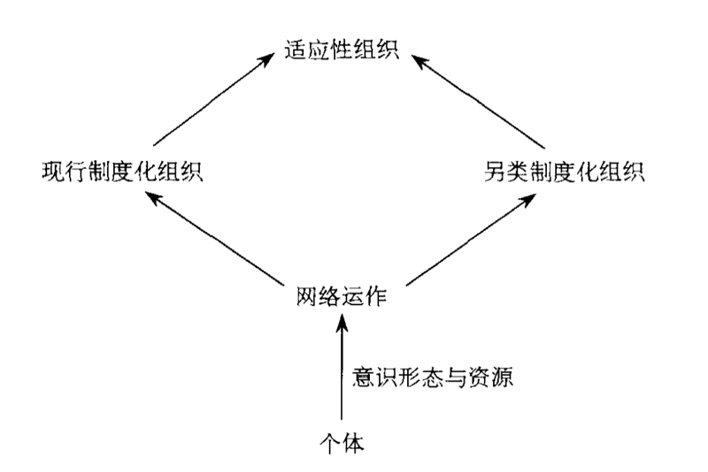

# 0204. Institutions, Networks, and Capital Building Societal Transformations

原书第十一章

In Chapter 8, it was proposed that actions motivated by expressive and instrumental needs propel interactions with others beyond primordial groups so that social capital may be accessed. These purposive actions sustain two types of exchanges, as described in Chapter 9 – to gain and maintain two elementary payoffs: wealth and reputation. These two chapters describe the process from action to structure. Chapter 10 turns to the structure-to-action process by showing how hierarchical structures constrain actions accessing social capital. These are ideal types of linkage between action and structure; in reality, such processes are complicated by structures and processes mediating between actors and hierarchical structures. Unless we identify and describe how these middle-level structures and processes operate, we will be unable to understand how action and structure interact. Further, the two processes – from micro to macro and vice versa – should not be seen in isolation or each depicted as a one-way process. A comprehensive theory of social capital must capture the two-way process between action and structure, as mediated through certain middle-level structures and processes.

In this chapter, I argue that two such middle-level structures – institutions and networks – constitute the infrastructure of society. The framework conceives institutions and networks as the two main social forces guiding the interactions between actors and hierarchical structures and the flows of capital.

Many scholars have used network analysis to delineate this micro-to-macro process, including Coleman, White, Granovetter, Burt, Breiger, Wellman, Erickson, Marsden, Flap, and many others. For those engaged in social networks analysis, social resources or social capital constitute the core element of a sociological explanation. Purposive actions based on two motivational principles, minimization of loss and maximization of gain, lead to the formation of social networks (first the primary group and then secondary ties) for both sentimental and instrumental purposes.

Thus, social networks, as has been pointed out in this monograph, exist not only in hierarchical (e.g., economic) organizations (e.g., the social embeddedness of economic organizations; see Granovetter 1985) but also in the interrelations among individual actors (Granovetter 1973, 1974; Lin 1982; Burt 1992), so that transactions and exchanges take place not only within organizations and between organizations, but also among actors.

Institutional analysis proposes yet another meaningful tool to understand how organizations should be seen as tied to the larger environment (DiMaggio and Powell 1983, 1991; North 1990; Powell and DiMaggio 1991; Meyer and Scott 1992; Scott and Meyer 1994). The survival and persistence of an organization are seen as dependent not only on its efficiency or competitiveness in the marketplace, but also on its ability to adjust to and to comply with expected behaviors as dictated by larger social institutions in society. Subscribing to such social rules leads to isomorphic structuring and behaviors of multiple organizations, or institutional isomorphism (DiMaggio and Powell 1983), which cannot be explained by competitiveness or performance criteria alone.

The institutional and network perspectives are exciting because they clearly propose ways in which we can analyze how social forces, along with economic forces, describe interactions and transactions. They clarify, for example, why transaction costs are always positive and unevenly distributed. They also explain why motives and rationalizations for action by individuals as well as organizations extend beyond economic considerations. Without taking these forces into account, it is clear that we cannot begin to understand how or why individuals and organizations behave or even persist. The excitement, however, is tempered by the fact that gaps remain between concepts and the processes linking the concepts. Several examples illustrate this point.

A major assumption in institutional analysis is that institutions affect and even dictate behaviors of actors and organizations. What is not clear is how this process works. How do individuals learn the rules, and why should they subscribe to them? How are organizations matched with individual actors to improve their institutional resources and thus their chances for survival? In other words, what are the social mechanisms that credit and enforce the compliance of individual actors and organizations with institutional rituals and behaviors?

Another gap is in how institutions and networks are related. One obvious answer is that networks reinforce institutions as they add coher-ence to the structure (Zucker 1988). How then does one explain social movements, which usually involve an interconnected group of actors mobilizing capital to counteract prevailing institutions? Or, to be more specific, is it possible to specify how social capital is useful for instru-

Figure 11.1 Four basic social processes. (Adapted from Coleman 1990, p. 8)

mental actions leading to gains in the prevailing institutions and organizations in some situations, and yet becomes an instrument for institutional transformation in other situations?

This chapter is a modest attempt to explore some of these issues and questions. My approach is to propose a conceptual framework that identifies what I consider the key components in the two-way processes depicted in Figure 11.1: namely, process 1 (macro-to-micro effects) and process 3 (micro-to-macro effects). To do so in a single chapter, I have made two choices. First, I will focus on the key points central to the proposed framework and sacrifice other points that are also significant but that, for the time being, must be pushed to the background. For example, this chapter has little to say about the state or technology, although both are implicated in the descriptions of how various components interact. I will have more to say about technology and social capital in Chapter 12.

Second, I will focus on the more general issues and sacrifice specifics. For example, I will leave out descriptions of certain specific factors, such as gender and ethnicity, which are universal in societies, and opt for generalities (using the term prevailing institutions ).

Basically, I conceive institutions and networks as the infrastructure of society – the vital social forces that link, hold, and consolidate actors and organizations in society. They may not be the most efficient mechanisms, but they define the internal cohesion and external differentiation for the actors and organizations. Of the two, institutions provide the organizing principles for actions and interactions. They offer rhetoric rationality and thus the map for organization and function. Most important, they uphold individual and collective identities. Networks, on the other hand, enhance flexibility for reducing transaction costs beyond what organizations can supply. They also provide mobile forces that fill and link the gaps necessarily existing in society. Just as important, they serve as possible vehicles for institutional transformation.

The remainder of the chapter describes how institutions and networks work in tandem. Specifically, it will show how institutions organize and interact with other major components of society (i.e., institutionalizing organizations, other social and economic organizations, and social networks) and facilitate the flow of capital among these components. The final section highlights the significance of social networks in institutional transformation.

我在第八章中提出，表达性需要和工具性需要激发的行动推动了与首要群体之外的人的互动，这样才能获得社会资本。第九章进一步指出，这些目的性行动维持着两种类型的交换 一一 获得与维持财富和名声这两种基本报偿。这两章描述了从行动到结构的过程。第十章通过说明等级制结构如何约束获取社会资本的行动，转向从结构到行动过程的论述。这些论述建立的是行动与结构之间关系的理想类型。在现实中，这些过程由于行动者与等级制结构之间的一系列中间过程和结构而变得复杂化。除非我们确定这些中层结构和过程如何运作，否则我们不能理解行动与结构如何互动。此外，这两个过程 一一 从微观到宏观，从宏观到微观 一一 不应该视为孤立的或单向的过程。一个全面的社会资本理论必须抓住以某些中层结构和过程作为中介的行动与结构之间的双向过程。

在本章中，我将指出，两个中层结构 一一 制度和网络 —— 组成了社会的基础结构。制度和网络是引导着行动者与等级制结构之间的互动以及社会资本流动的两种主要社会力量。

2『个人目的性行为是微观层，结构是宏观层，制度、网络是中间层。社会资本的微观层、宏观层和中间层，做一张主题卡片。（2021-01-09）』——已完成

很多学者已经使用网络分析来描述这个从微观到宏观的过程，其中包括科尔曼、怀特（White）、格拉诺维特、伯特、布莱格、韦尔曼、埃里克森、马斯顿、弗拉普和很多其他学者。对于进行社会网络分析的那些学者，社会资源或社会资本组成了社会学解释的核心要素。建立在两种动机原则损失最小化与获得最大化 —— 基础上的目的性行动，导致了表达性与工具性目的的社会网络（首先是首要群体，其次是关系）的形成。因此，正如前面所指出的，社会网络不仅存在于（例如经济的）等级制组织之中（例如经济组织的社会性嵌入；参见 Granovetter, 1985），而且存在于个体行动者的相互关系之中（Granovetter, 1973, 1974; Lin, 1982; Burt, 1992），因此交易和交换不仅发生在组织内部和组织之间，而且发生在个体行动者之中。

制度分析提出了另一个理解组织与更大环境之间关系的重要分析工具（DiMaggio and Powell 1983, 1991; North 1990; Powell and DiMaggio 1991; Meyer and Scott 1992; Scott and Meyer 1994）。组织的生存和延续不仅依赖于它在市场中的效率或竞争力，而且依赖于它适应与遵从更高级别的社会制度和规则的能力。对这些社会规则的遵从导致了多样化组织的结构同构与行为趋同，或者说制度同构现象（Dimaggio and Powell, 1983），这是单纯的竞争力力或绩效标准所无法解释的。

制度和网络的视角很振奋人心，因为它们明确提出了分析社会力量与经济力量如何塑造互动和交易的方法。例如，它们澄清了为什么交易成本总是存在的，以及不均衡分布的。它们也解释了为什么个体与组织的行动动机和理性化超出了经济的考虑。如果不考虑这些力量，很明显我们就不能理解个体与组织如何行为或者延续，以及行为的原因是什么。但是概念与将这些概念连接起来的过程之间存在着断裂，几个例子将证明这点。

制度分析的一个主要假定是，制度影响甚至支配着行动者和组织的行为。不清楚的是这个过程是如何发生的。个体如何学习规则？他们为什么要遵从它？与个体行动者相类似的组织如何增加它们的制度资源和它们的生存机会？换言之，使个体行动者和组织顺从制度性的仪式与行为的社会机制是什么？

另一个问题是制度与网络是如何相联系的。一个很显然的答案是网络强化了制度，因为网络增强了结构的内聚性（Zucker, 1988）。那么如何解释社会运动？因为社会运动通常涉及到相互联系的行动者群体，它们通过动员资本的方式来反对现行制度。或者更具体地讲，如何解释社会资本在一些情况下促进了从现行的制度和组织中获得收益的工具性行动，而在另一些情况下成为制度转型的工具？

图 11.1 四种基本的社会过程（来自 Coleman, 1990, p8）

这一章试着对这些问题作出回答。我的方法是先提出一个概念框架，以明确我在图 11.1 中所给出的双向过程 一一 也即过程 1（从宏观到微观）和过程 3（从微观到宏观）中的关键部分。在短短的一章中完成这个任务是很困难的，因此我作了两个调整。

第一，我将关注我所提出的框架中最核心的问题，忍痛割舍掉其他一些也很重要、但是必须暂时放到后面的问题。例如，这一章很少谈到国家或技术，尽管在对各部分如何互动的描述中都要涉及到它们。我会在第十二章更多谈到技术与社会资本的关系。

第二，我会关注更一般性的，放弃一些特殊性的问题。例如，我将不考虑某些特殊因素，而关注一些一般性的普遍制度，如任何社会都存在的性别和族群现象。

我把制度和网络作为社会的基础结构 —— 连接、控制和黏合社会中的行动者与组织的必不可少的社会力量。它们可能不是最有效率的机制，但是它们解释了行动者与组织的内部团结和外部分化。在这两者之中，制度提供了组织行动与互动的原则，提供了修辞理性（rhetoric rationality）以及组织与功能的地图。最重要的是，制度维持着个体和集体的认同。另一方面，网络提高了可以降低超出组织所能负担的交易成本的弹性。网络也提供了填充与联结社会中所必然存在的断裂的活力。同样重要的是，它们还充当着制度转型的媒介。

这一章剩下的部分将描述制度与网络如何共同起作用。特别地，我还将解释制度如何组织社会的其他主要部分（也即制度化的组织，其他的社会、经济组织和社会网络）并与其互动，如何促进资本在这些部分中的流动。最后关注社会网络在制度转型中的重要性。

## 4.1 The Institutional Field and Organization-Society Isomorphism

Institutions , seen as the organizing principles of interaction, can simply be defined as rules of the game (North 1990, p. 3) in a society and can be either formal or informal. These rules serve as the traffic guides in the flow and transactions of goods (both material and symbolic) among actors, including both individuals and organizations. Some rules are more important than others in that the actors are more consciously aware of them and feel the need to demonstrate more deliberately that the rules are followed in their actions and transactions. There are various explanations of how certain rules or institutions come into existence and assume dominant positions in a society. They may result from wars, revolutions, rebellions, colonization, occupation, disasters, acts of charismatic and authoritarian leaders, dominant class interests, or post facto rationality. To a large extent, they may be the result of historical path dependence (see David 1985 for the institutionalization of the QWERTY

keyboard).1 Institutions are cultural rather than scientific, because they do not require logical or empirical proofs or appreciate falsification.

These rules create favored values for actions and interactions in the forms of morality, faith, ideology, decency, or capability (of healing and performing).

When organizations and individuals subject themselves to a similar set of institutions, they are said to be in an institutional field (Lin 1994b).

Within an institutional field, actors (including individuals, networks, and organizations) recognize, demonstrate, and share rituals and behaviors, and subscribe to constraints and incentives as dictated by the social institutions. As such, they reduce transaction costs in measurement (computational abilities) and enforcement (North 1990) for actions and interactions among the actors.

An institutional field may define a society. However, the field may transcend a society’s usual spatial boundary. For example, we can argue that 1 There have been debates as to whether QWERTY actually performed less well than, say, the Dvorak system. However, even if they performed equally well, the fact that QWERTY

historically emerged first represented a real advantage and was an important factor in its prevalence today.

ethnic Chinese communities in many urban ghettos around the world belong to the same institutional field as the proper Chinese society, defined within the boundary of the nation-state of China. Even though these communities and their members may speak different languages, live under the rules and laws of different states, and are subjected to different stratification and mobility constraints and opportunities, they obey the same fundamental rules extending and emanating from the structured relationships among family members (Lin 1989, 1995b). These rules guide their family lives, the celebration of certain holidays and festivities, ancestor worship, deferent treatment of elders, the upbringing of children with discipline and passion, the preference for tacit and informal agreements to formal or legal contracts in business transactions, the recognition of certain differential associations (given priority to family, clan, and village affiliations), and idiosyncratic rules of succession (transfer of authority by the rule of primogeniture and transfer of property by the rule of division among sons). Thus, institutional China is more encompassing than the state of China. Other institutional fields exist within a given a state. In the following discussion, the term society is used to refer to an institutional field.

In an institutional field, the extent to which organizations survive and persist depends on both their economic (technical) and social (institutional) performance. DiMaggio and Powell (1983, p. 148) used the notion of an organizational field to designate a「recognized area of institutional life: key suppliers, resources and product consumers, regulatory agencies, and other organizations that produce similar services or products」and hypothesized that organizations belonging to an organizational field become institutionally isomorphic in that their forms and practices becomes homogeneous because of increased sharing of interactions, information, and awareness of involvement in a common enterprise. An institutional field also involves the process of institutional definition and structuration (Giddens 1979), but it extends beyond specific types of organization (e.g., economic enterprises) or the requirement for interaction among all organizations. Organizations are said to belong to an institutional field when they are conscious of and abide by the rules of a specific set of institutions. By adjusting their internal structure and patterns of behavior, the organizations reduce transaction costs in interacting with other organizations dictated by the same institutions. The organization-society institutional isomorphism (Lin 1994b), therefore, is the prerequisite and imperative condition for organizational isomorphism. One assumption derivable from this imperative is that there is a positive correspondence between an organization’s ability to perform institutional tasks and its hierarchical position in the society. Likewise, it can be assumed that most of the social networks constructed also attain

Figure 11.2 Institutional field.

isomorphism with the organizations. The organization-network institutional isomorphism is reflected in the overlapping rules of the game and the values assigned to certain resources (ideology) between networks (and informal organizations such as churches, chambers of commerce, veterans’ groups, and bowling clubs). Figure 11.2 depicts a functioning institutional field where organizations, networks, and individuals are synchronized in terms of the rules of the game and the values of certain resources.

制度场域与组织 —— 社会同构

制度 —— 组织互动的原则 —— 可以简单地定义为一个社会中的博弈规则（North, 1990, p3），分为正式制度和非正式制度。这些规则在行动者 一一 包括个人与组织一之间的物品（物质的和符号的）流动与交易中扮演着交通指挥系统的角色。一些规则比另一些更重要，因为行动者更容易意识到它们，感到需要有意地证明自己在行动与交易中正遵守着这些规则。规则或者制度是如何形成的，它们是如何占据到社会支配地位的，对此存在着不同的解释。它们可能源自战争、革命、叛乱、殖民化、占领、灾难、克里斯玛型权威型领袖的行动、统治阶级的利益或者事后理性（post facto rationality）。在很大程度上，它们可能是对历史路径依赖的结果（参见 David 1985 对 QWERTY 式键盘的制度化的研究）。[1] 制度是文化性的，而不是科学性的，因为它们并不需要逻辑或者经验证实、或者证伪。这些规则会对某些种类的行动和互动产生价值偏好，通常以道徳、信念、意识形态、礼仪或（治愈和表现的）能力的形式出现。

2『制度，做一张术语卡片。』——已完成

当组织与个体服从同一套制度时，它们就处在一个制度场域之中（Lin, 1994b）。在制度场域之内，行动者（包括个体、网络和组织）认可、体现和共享着仪式与行为，受到社会制度所施加的约束与激励。这样，它们降低了对行动者之的行动和互动进行估计（计算能力）与强化的交易成本（North, 1990）。

制度场域可以界定一个社会。但是，场域可以超越社会的空间边界。例如，我们可以认为在世界各地很多城市的少数民族聚居区中的华人社区属于相同的制度场域 一一 中国社会，在民族一国家意义上来界定就是中国。尽管这些社区与它们的成员可能讲不同的语言，生活在不同国家的规则与法律下，具有不同的分层与流动的约束和机会，但是他们遵守着从家庭成员之间的结构化关系扩展而来的相同的基本规则（Lin, 1989, 1995b）。这些规则指导着人们的家庭生活、节日庆祝、祖先崇拜、尊敬长者、严慈相济的育儿方式、差序格局式的交往方式、特殊的继承规则（对权威施行长子继承制；对财产施行诸子均分制），以及在生意交易中对默许与非正式的协议而不是正式的法律合同方式的偏好。因此，制度意义上的中国的范围要大于国家意义上的中国。但是一般而言，制度场域存在于国家的范围内。在下面的讨论中，社会与制度场域是等价的。

在制度场域中，组织的生存与延续取决于经济的（技术的）和社会的（制度的）绩效。迪马乔和鲍威尔（Dimaggio and Powell, 1983, p148）使用组织场域的概念来指称「制度生活所认可的领域 一一 关键的供应者、资源与产品消费者、管理机构和提供相似服务或产品的其他组织」，并假定制度场域中的组织会变得制度同构起来，由于它们越来越多地共享着互动、信息和对共同事业的参与意识，所以在形式和实践上会变得具有同质性。制度场域也涉及到制度定义与结构化的过程（Giddens, 1979），但是制度场域的扩展超出了具体的组织类型（如经济性质的企业）或对所有组织的具体互动要求。当组织意识到、并且遵守一套具体的制度规则时，它就属于制度场域。组织通过调节内部结构和行为模式，降低了与相同的制度所支配的其他组织相互动的交易成本。因此，组织-社会的制度同构（Lin, 1994b）是组织同构的先决条件与必要条件。从这个必要条件中可以推出一个假定：在组织执行制度任务的能力与它在社会中的等级制地位之间存在着正向的一致性。同样可以假定，建立的大多数社会网络也与组织同构。组织-网络的制度同构反映在博弈规则的重叠和网络体系间（与非正式组织，如教堂、商会、老兵群体和保岭球俱乐部）对某些资源的价值赋予（意识形态）的重叠上。图 11.2 描述了一个运作的制度场域，在制度场域中，组织、络和个体在博弈规则与某些资源的价值上是一致的。

图 11.2 制度场域

[1] 在 QWERTY 式键盘是否真的比其他形式的键盘，如 Dvorak 系统效率低的题上存在着很多争论。但是，即使 QWERTY 式键盘的效率相当高，QWERTY 式键盘在历史上的首先出现代表着一个真正的优勢，成为它在今天能够得到广泛流行的一个重要因素。（QWERTY 式键盘，即我们现在所使用的键盘 —— 中译注）

## 4.2 The Flow of Capital

Given the organization-network-society isomorphism imperative and the incentive for better positioning in the stratified system, organizations are expected to obtain and retain goods useful for transactions of both an institutional and a technical nature. One important type of such goods is workers capable of performing institutional and/or technical tasks.

Correspondingly, the implication for individual actors seeking rewards or returns in society is clear: they need to demonstrate their possession of knowledge and skills, as well as their willingness and ability to be further trained and indoctrinated. The labor market therefore can be conceived as a marketplace where transactions of such goods between individual actors and organizations take place. Before the transaction of goods in the labor market is discussed further, it is important to explore the nature of the goods that flow into the institutional field.

The goods, as mentioned earlier, can be either material or symbolic.

When certain goods are deliberately mobilized for a purposive action, they become capital. Capital is an investment of resources intended to generate returns. Thus, it is tailored by the actor to meet an organization’s demand. In return, the actor may be rewarded with social (reputation), economic (wealth), or political (power) resources. For organizations as actors, such capital generates returns so that they can survive and thrive in the society or institutional field. For individual actors, it is capital that is transacted in the labor market.

Two types of capital dominate these transactions: human capital and institutional capital (Lin 1994b). Human capital reflects technical knowledge and skills. It is needed by organizations to compete successfully in the market. Institutional capital reflects sociocultural knowledge and skills about rules in the institutional field. Organizations need agents to exercise such knowledge and skills in performing as their representatives.

Institutional capital contains elements of what is usually described as cultural capital (Bourdieu 1972/1977, 1980, 1983/1986) and social capital (Bourdieu 1983/1986; Coleman 1988, 1990; Flap and De Graaf 1988; Flap 1991). Cultural capital contains values, rules, and norms sanctioned by the dominant institutional field. Social capital reflects the extent of social connections, where embedded resources can be used to maintain or gain resources – including wealth, power, and reputation – valued in the institutional field. Individual actors who possess or can access cultural and social capital are potential laborers who can perform and fulfill an organization’s obligations in the institutional field. Thus, organizations seek out such candidates in the labor market.

How does an individual actor demonstrate his or her human capital and institutional capital? Human capital, of course, can be demonstrated in examinations. Many organizations employ this method in assessing technical knowledge and skills. But examinations by themselves seldom capture the breadth and depth of human capital. More often, the assessment requires evidence of effort, commitment, and success in the process of acquiring such capital in the form of certification, credentials, or the evaluations of trusted assessors. Degrees, diplomas, certificates, and, equally important, testimonials have become important symbolic demonstrations of human capital.

Demonstration of institutional capital is much more complicated.

Certain examinations or other methods of identification have been devised for this purpose. For example, in historical China, knowledge of Marxist–Leninist ideology, Mao Zedong’s or Sun Yat-sen’s thought, or Confucianism appeared in examinations, and patrilineal ancestries, clan and regional affinities, or class/ideological credentials had to be accounted for. For the most part, this demonstration was reflected in certification, credentials, and testimonies. These symbolic identifications reflected the actor’s acquisition of and affinity for prevailing institutions, and they might vary in different institutional fields. Even in contemporary China, these identifications may include Communist Party membership, clan and ethnic memberships, and affiliation with state-owned work units, but not membership in a church, temple, or social or professional association.2 Complicating the situation is the fact that many societies use the same certification and testimonial procedures to demonstrate both institutional and human capital. We shall return to this issue shortly.

Now we turn to the issue of how resources are mobilized into capital and how capital is certified.

资本的流动

考虑到组织-网络-社会的同构以及处于分层体系中的好位置上的有利因素，我们可以断言，组织会获得和保留对制度性与技术性交易有用的物品。一种重要的此类物品是工人执行制度和 / 或技术任务的能力。因此，很显然，个体行动者想要在社会中寻求报酬或回报，他们就要证明他们拥有知识和技能，他们愿意和有能力接受进一步的培训和深造。这样，劳动力市场就可以视为个体行动者与组织之间进行这些物品交易的市场。在深入讨论劳动力市场中的物品交易之前，探讨流入制度场域中的物品的性质是很重要的。

前面已经提到，物品可以是物质的或符号的。当某些物品在目的性行动中被有意地动员起来时，它们就成为资本。资本是为了产生回报的资源投资。行动者首先要满足组织的需要，作为回报，行动者可以获得社会的（名声）、经济的（财富）或政治的（权力）资源。对于作为行动者的组织而言，只有这些资本产生回报，它们才可以在社会或者制度场域中生存和壮大。对个体行动者而言，在劳动力市场中交易的是资本。

两种类型的资本支配着这些交易：人カ资本和制度资本（Lin, 1994b）。人力资本反映了技术性的知识和技能，它是组织在市场中成功进行竞争所需要的。制度资本反映了制度场域中有关规则的社会文化知识和技能，组织需要行动者在履行代理人职责时运用这些知识和技能。制度资本包括通常描述为文化资本（Bourdieu, 1972/1977）与社会资本（Bourdieu 1983/1986; Coleman 1988, 1990; Flap and De Graaf 1988; Flap 1991）的因素。文化资本包括居于统治地位的制度场域所认可的价值、规则和规范。社会资本反映了社会联系的范围，社会联系中的嵌入性资源可以用来维持或获得制度场域中的有价值资源 —— 包括财富、权力和名声。拥有或者可以获取文化资本与社会资本的个体行动者，是可以帮助组织执行和履行制度场域中的义务的有潜力的劳动者。因此，组织要在劳动力市场中寻找这样的行动者。

那么个体行动者如何证明他的人力资本与制度资本呢？当然，人力资本可以通过考试来证明。很多组织使用这个方法来考察技术知识和技能。但是考试很少能够测出人力资本的广度和深度。更经常的是，个体行动者需要证明自己愿意付出努力，作出承诺，以及出示已经获得的证书、文凭或者可信赖的评估员的评估。学位、文凭、证明以及同样重要的介绍信已经成为人力资本的重要标志。

制度资本的证明更复杂。某些考试或其他的识别方法已经专门为此而设计。例如在中国历史上，马克思列宁主义、毛泽东思想、孙中山思想或者儒家思想的内容都曾出现在考试中，父系祖先、家族和地方性的姻亲关系，或者阶级 / 意识形态证明也不得不考虑。在很大程度上，这种制度资本反映在证书、文凭和证明上。这些符号性的证明反映了行动者与现行制度的密切关系，不同的制度场域中的符号性证明可能是不同的。即使在当代中国，这些证明可能包括党员身份、家族和少数民族成员身份以及与国有单位的从属关系，而不是教会、寺院或者社会性、职业性社团的成员身份。使情况变得复杂的是，很多社会对制度资本与人力资本使用相同的证明程序。我们马上要回到这个问题上。

现在我们先转向资源如何被动员成资本以及资本如何被证明的问题。

## 4.3 Institutionalizing Organizations and Social Networks: Crediting and Enforcing Agents

The process of acquiring both types of capital begins with intergenerational transfers of resources. Several processes are involved in the transfer. One process is socialization, wherein the family provides the setting in which training is conducted to develop actors (by way of imitation and cognitive training) with such valued resources. Another process is through the family’s social networks. Parental networks provide opportunities to contact actors with valued resources. In still another process, parental resources afford an opportunity for actors to acquire additional resources on their own (e.g., through schooling).

Once differentially equipped with the transferred resources, the individual actor needs to mobilize such resources and turn them into capital, an investment for the purpose of matching with, and thus generating, returns from affiliation with an organization. Two avenues are available for turning resources into capital: processing by institutionalizing organizations or using resources embedded in social networks. An actor may go through a process of training, the result of which is certification clearly announcing the actor’s acquisition of capital. Degrees, diplomas, and certificates are the usual signals. Another route is the use of social 2 For an example of a taboo association and identification, read about the 1999 Falun Gong incidents in China (use Internet search engines such as Copernic 99 to find Falun Gong or Falun Dafa listings).

ties and connections for testimonies. Training is accomplished through an important component of society: institutionalizing organizations.

While the following discussion focuses mainly on the process of mobilizing resources into institutional capital, a similar process for human capital also applies.

Institutionalizing organizations are one special type of organization whose purpose or mission is to train and indoctrinate actors with values and skills in performing rituals and behaviors associated with the prevailing institutions. They also differ from other organizations in that they process actors but do not employ or keep them.3 Although some of them are specifically established to provide institutionalizing training, most of them also provide technical training in the form of schools, institutes, and colleges (e.g., cadre schools, military and police academies, seminaries, and scouting organizations). Thus, education through such organizations and the credentials thereby gained signify acquisition of both human capital and institutional capital.4 The disentangling of the two types of capital embedded in educational credentials is a complicated task, but rough estimations are possible. For example, recent studies in China and Taiwan (Lin 1994a, b, 1995b) suggest that education can be decomposed as two-thirds representing human capital and one-third institutional capital.

Society and prevailing organizations also use institutionalizing organizations to enforce rules, rituals, and controlling behaviors. These organizations include prisons, mental hospitals, and labor and concentration camps. Actors in the institutional field are submitted to be processed if their behaviors are deemed deviant from those dictated in the prevailing institutions. Individual actors may be allowed to gain certification or credentials for institutional capital through these processes. Otherwise, they are in danger of being decertified or discredited, deemed inappropriate as players in the institutional field, and subjected to lower returns on their investment.

Social networks provide another avenue for turning resources into capital. Through social ties and networking, actors gain additional resources by accessing the resources of direct and indirect ties. Many networks are formed because of shared processes and experiences in institutionalization (e.g., alumni, occupational, and industrial associations). However, networks also form on the basis of other shared interests or experiences (e.g., bridge and bowling clubs, knitting and 3 Institutionalizing organizations have regular staff primarily as trainers.

4 Bourdieu (Bourdieu 1972/1977; Bourdieu and Passeron 1977) uses the term cultural capital to describe the process of indoctrinating students with dominant class values.

What I am suggesting here is that cultural capital should be considered a subcategory of institutional capital in the context of organizations and markets.

exercise clubs, Elvis Presley and Michael Jackson fan clubs, or neighborhood groups). Through informal and often indirect ties, loose networks extend actors’ reach beyond their immediate social circles.

These socially embedded resources may be turned into social capital when an actor activates and mobilizes a particular chain of ties for the purpose of pursuing purposive actions, such as finding a job. The mobilized resources are deemed useful because of the perceptions of the initiating and facilitating actors that they are institutionally valued. Thus, the testimonies provided by these ties on behalf of the initiating actor may further assure the target organization of his or her human capital.

More importantly, these testimonies may offer assurance that the initiating actor possesses institutional knowledge and skills as well (trustworthiness, social skills, collegiality, loyalty, willingness to follow orders and carry out tasks, and other「appropriate」behaviors). Through the influence of these testimonies, an affiliation with an organization may be realized. This is an investment, because it results in eventual socioeconomic returns to the actor.

Further, while institutionalizing organizations and social networks process resources into capital, many organizations themselves also provide access to further technical and institutional skills, thus allowing selected workers to acquire additional capital. The concept of the internal firm labor market (Baron and Bielby 1980) describes investment in on-the-job training for human capital. Affiliation with a resource-rich organization itself signifies institutional capital, because it can generate further returns for the actor inside and outside the organization. Inside the organization, actors have the opportunity to learn and acquire additional institutional skills as the organization successfully engages in exchanges with other organizations in the institutional field. Experiences gained from participating in such exchanges are part of institutional skills training. Further institutional capital is gained as actors acquire authoritative positions within the organization, and are thus endowed with statuses and symbols associated with skills and knowledge of how to perform institutional tasks. Outside the organization, affiliation with a resource-rich organization signifies the actor’s institutional skills, as well as his or her access to capital that is important for exchanges in the institutional field.

The preceding discussion describes how the infrastructure of society –

namely, institutionalizing organizations and social networks – operates in tandem with other social and economic organizations, reinforcing and sustaining each other. In other words, it describing a stable and functioning institutional field. Figure 11.3 depicts a functioning institutional field.

Figure 11.3 A functioning institutional field.

制度化组织与社会网络：置信和强化机构

获得两类资本的过程都始于世代之间的资源转移。转移中要涉及到几个过程，一个过程是社会化。家庭为孩子提供了社会化的环境，（通过模仿和认知训练）对其进行训练，使之掌握有价值资源。第二个过程是通过家庭的社会网络。父母的网络为孩子提供了接触拥有有价值资源的行动者的机会。在第三个过程中，父母的资源为孩子获得自己的额外资源创造了机会（例如通过教育）。

个体行动者一旦被赋予不同的资源，就需要动员这些资源，将它们转化为资本，这是一种为了从与组织的联系中获得回报的投资。把资源转变成资本的途径有两个：1）已经制度化了的组织的「加工」或者使用嵌入在社会网中的资源。行动者可以接受一个训练的过程，这个过程的结果可以清楚地表明行动者已经获得资本。学位、文凭和证书通常都是标志。2）另一个方法是用社会关系和联系作为证明。训练是通过社会的一个重要部分来实现的 一一 制度化的组织。虽然下面的讨论主要关注的是将资源动员成制度资本的过程，但是人力资本的过程也是如此。

制度化的组织是一类特别的组织，它的目的或使命是对行动者进行训练与灌输，使之具有符合现行制度的仪式与行为的价值和技能。它们不同于其他组织，因为它们是「加エ」而不是使用或保留行动者。[2] 尽管一些组织的建立是专门为了进行制度化训练的，但是大多数组织是以学校、研究所和学院的形式提供技术训练的（例如行政学院，军官与警察学校，神学院和童子军组织）。通过这些组织而获得的教育和文凭标志着行动者已经获得了人力资本与制度资本。[3] 理清嵌入在教育文凭中的这两类资本是一个复杂的任务，但是粗略的估计是可能的。例如，近期在中国大陆和台湾作的研究（Lin, 1994a, 1994b, 1995b）表明，教育可以分解为三分之二的人力资本与三分之一的制度资本。

社会与国家机构也使用制度化的组织来强化规则和仪式，来控制行动者的行为。这些组织包括监狱、精神病院和劳改所。如果行动者在制度场域中的行为被认为偏离了现行制度的规定，他们就要听任处理。个体行动者可以通过制度化的训练过程获得标示着制度资本的证书或文凭。否则他们就有被收回证件或置疑的危险，被视为不适于在制度场域中行动的博弈者，其投资只能收到低回报。

社会网络提供了将资源转化成资本的另一条途径。行动者在社会关系与网络运作中，通过使用直接和间接关系的资源而获得额外的资源。很多网络的形成是因为行动者共享过制度化的过程与经历（如校友、职业和行业关系）。然而，网络也可以在其他的共享资源或经历的基础上形成（例如，桥牌与保球俱乐部、健身俱乐部、埃尔维斯·普雷斯利和迈克尔·杰克逊迷俱乐部，或者是邻里关系）。松网（loose networks）通过非正式关系和间接关系，使行动者的交往范围超出了邻近的社会圈子。

当行动者为了实现工具性行动的目的，例如找工作，而激活和动员某关系链的时侯，这些社会嵌入性资源可以转化成社会资本。被动员的资源是有用的，因为行动发起者与帮助者都认为它们具有价值。因此，代表行动发起者的这些关系所提供的证明，会使准备接收行动者的组织确信他们具有人力资本。更重要的是，这些证明也可以表明行动发起者拥有制度性知识与技能（可信赖性、社会技巧、同僚、忠诚、愿意服从命令与执行任务以及其他的「适宜」行为）。通过这些证明的影响，行动者可以与组织建立联系。这是一种投资，因为这最终会给行动者带来社会经济回报。

此外，不仅制度化的组织与社会网络可以将资源转变成资本，很多组织本身也提供了技术和制度性技能的获取机会，并且会选择一些工人，使之获得这部分额外的资本。公司内部劳动力市场（Baron and Bielby, 1980）描述了对人力资本在职培训的投资现象。与资源丰富的组织有联系本身标示着制度资本，因为无论在组织内还是组织外的行动者都会因此而获得回报。在组织内部，当组织成功地与制度场域中的其他组织进行交换时，行动者有机会学习和获得额外的制度性技能。从参与这样的交换中获得的经验，是制度性技能训练的一部分。当行动者获得了组织内的权威位置，从而被赋予与执行制度任务所需要的技能和知识相联系的地位与符号时，也获得了一些制度资本。在组织外部，与资源丰富的组织有联系标示着行动者具有制度性技能，可以获得对制度场域中的交换具有重要意义的资本。

前面的讨论描述了社会的基础结构 —— 也即制度化组织与社会络如何与其他的社会、经济组织协同运作，互相强化与维持。换言之，我描述的是一个稳定的与正在运作的制度场域，如图 11.3 所示。

图 11.3 制度场域的运作

[2] 制度化的组织有固定的职员作为教员。

[3] 布迪厄（Bourdieu, 1972/1977; Bourdieu 和 Passeron, 1977）用文化资本来描述统治阶级用自己的价值对学生进行灌输的过程。我在这里想表明的是，文化资本在组织和市场的环境中应该作为制度资本的一个分类。

## 4.4 Networks as Vehicles for Institutional Transformation 

However, embedded in these elements are the potential sources and processes for challenges to existing and prevailing institutions, as well as the emergence of alternative institutions. It is possible that organizations (Zucker 1988) or even individual actors (DiMaggio 1988:「institutional entrepreneurs」) may trigger transformations. For example, organizations isomorphic with an alternative, external institutional field may be able to survive, persist, and eventually replace or be incorporated into existing prevailing institutions. Western religion, popular culture, and lifestyles are examples of alternative institutions to indigenous institutions in other societies, and they can transform indigenous institutions so long as participating actors’ capital investment generates expected returns (e.g., social status), as the alternative institutional field holds an advantage in capital to indigenous institutions.

Charismatic leaders can also offer challenges to prevailing institutions.

The personal charm and charisma of Mao Zedong in heralding the Great Cultural Revolution, mobilizing millions of youths, and up-ending existing institutions in 1960s China is a vivid example of the latter (「Rebellion is rational and revolution is not guilty!」was used to uproot existing organizations, cadres, and professionals who had invested capital in those institutions and organizations). However, actor-generated transformations are infrequent and rarely succeed.

The more interesting and powerful indigenous transformation process, I argue, begins with social networking. When a number of actors share

alternative rules or values and begin to connect, the network may sustain their shared interests through solidarity and reciprocal reinforcement.

For example, actors perceived as deprived or actually deprived of opportunities to acquire human or institutional capital may form networks and forge a collective identity. Whether such deprivation is based on gender, ethnic, religious, class, family origin, or other institutional criteria, networking is the first and essential step in developing collective consciousness. As the network expands and the number of participating actors increases, the pool of social capital increases. As shared resources grow, there is an increasing likelihood of a social movement, a process that can transform one or more prevailing institutions.

One straightforward way of generating institutional transformation by way of a social movement is to turn the movement directly into a rebellion or revolution. In extreme circumstances (e.g., mass starvation, external threat, or massive despair), a social movement can quickly generate overwhelming participation leading directly to the overthrow of prevailing institutions. The Russian Revolution in 1917 and the collapse of the former Soviet Union and the Communist states in Eastern Europe are examples. However, in most situations, the social movement involves a minority of actors and requires more elaborate processing in order to generate institutional transformation. Further, the usual goal is not to reject prevailing institutions, but rather to substitute an alternative institution for a prevailing one or to incorporate the alternative institution into the configuration of prevailing institutions.

A social movement can be sustained by turning the shared resources into capital and generating returns. That is, the movement must develop its own institutionalizing organizations in which alternative values and rituals are taught and new members are indoctrinated. Further, it must build or persuade organizations to recruit and retain the actors who have acquired such capital. Through these processes, the movement can then sustain itself and challenge existing institutions.

The mounting and sustaining of alternative programs in either existing or alternative institutionalizing organizations may generate and process alternative capital for actors. As the number of actors equipped with the alternative institutional capital increases, along with the growing pooled social capital through networking, the likelihood that other organizations may recognize the need to take the alternative institution into account in their actions increases. This recognition triggers the need to recruit and retain workers with the knowledge and skills to perform tasks dictated by the alternative institution. The alternative institutional capital will thus increasingly become a legitimate form of capital in the labor market, and the likelihood of the alternative institution’s being absorbed into prevailing institutions is increased.

Figure 11.4 Processes of institutional transformation.

These two alternative routes of institutional transformation are depicted in Figure 11.4. In the following discussion, I will provide two examples of successful transformations using each of the two routes. The emergence of women’s studies in American colleges illustrates how a successful transformation can occur when networking among interested actors infiltrates existing institutionalizing organizations, and the success of the Communist revolution in China demonstrates the successful (though much harder) building of alternative institutionalizing organizations.

作为制度转型媒介的网络

然而，挑战现行制度与生成新制度的潜在根源和过程就嵌入在上面这些要素之中。组织（2 Zucker,1988）甚或个体行动者（Dimaggio [1988】：「制度性企业家」）可以引起制度转型。例如，与另类的（alternative）、外部制度场域同构的组织，可以在现行制度下生存和延续下来，最后甚至可能纳人或者取代现行制度。西方的宗教、流行文化和生活方式对于其他社会的本士文化

而言是另类的制度，只要参与互动的行动者的资本投资产生了预期的回报（例如社会地位），另类制度可以转变成内生制度，因为另类制度场域在资本上赢得了对本土制度的优势。

克里斯玛式的领袖也可能挑战现行制度。一个生动的例子是毛泽东凭借个人魅力发动了文化大革命（the Great Cultural Revolution），动员起千百万的红卫兵，极大地改变了中国 20 世纪 60 年代的制度（「造反有理，革命无罪！」的口号被用来动员群众，扫除当时的组织、干部与专家学者）。然而，靠单个人来改变制度的情况并不是经常的，也很少成功。

我认为更有趣的、更有力的内生性转型过程始于社会的络运作。当很多行动者共享另类规则或价值，开始相互联系时，网络可以通过团结与相互强化的方式来维持行动者的共同兴趣。例如，有被剥夺感或者已经被剥夺了获得人力资本或制度资本的机会的行动者，可以形成网络，塑造集体认同。不管这些剥夺是建立在性别、族群、宗教、阶级、家庭出身上还是其他制度标准上，络运作都是发展集体意识的第一步和重要的一步。当网络得到扩展，参与的行动者数量增多时，社会资本的储量也会增加。当共享资源增加以后，社会运动的可能性也会增大，这会导致一个或多个现行制度的转型。

通过社会运动的方式来实现制度转型的一个直截了当的方法，是将运动直接转变成反叛或革命。在极端的情况下（例如大规模的饥荒、外部的威胁或者普遍的绝望），社会运动可以势不可挡地迅速发展起来，直接推翻现行制度。俄国十月革命、东欧剧变与前苏联解体都是例子。然而在大多数情况下，社会运动只涉及到一小部分行动者，为了实现制度转型，它需要更多的合作过程。此外，通常的目标不是拒绝现行制度，而是用另类制度来替代现行制度，或者将另类制度纳人现行制度的建制之中。

社会运动可以通过将共享资源转变成资本并产生回报的方式来维持。也即，运动必须发展出自己的制度化的组织，这样才可以传播另类价值与规范，对新成员进行思想灌输。此外，运动必须建立组织或者说服组织招募和留佳已经获得这样资本的行动者。通过这些过程，运动オ可以维持下去，从而挑战现行制度。

在现行组织或者另类制度化的组织中的另类方案的发展与维持，可以产生和「加工」行动者的另类资本。随着拥有另类制度资本的行动者数量的增加，以及通过网络运作而聚集的社会资本的增加，其他组织认识到需要将此另类制度考虑进行动中的可能性也会增加。这个认识引发了一类新的需要一招募和留住拥有履行此另类制度所规定的任务的知识与技能的行动者。另类制度资本将逐渐变成劳动力市场中的合法资本形式，另类制度被纳现行制度的可能性也会增加。

图 11.4 制度转型的过程

制度转型的两条路径如图 1.4 所示。在下面的讨论中，我将提供两个例子，它们各采用了其中的一条路径成功地实现了转型。女性研究在美国学院中形成的例子，说明了当主张实行制度转型的行动者的络渗透进现行制度化的组织时，一个成功的转型如何发生；而中国的共产主义革命的成功，则显示了另类制度化组织被成功建立的过程（尽管这一过程更艰难）。

## 4.5 Transforming from Within: Women’s Studies in the United States

The growth of women’s studies programs in the United States in the 1970s and 1980s is recognized as a stunning example of a new institution successfully infiltrating an existing institutionalizing organization (college) in a matter of years. The process can be traced back to the 1960s, when the civil rights movement ignited the women’s liberation movement. A number of female faculty members such as Jessie Bernard, Alice Rossi, Gerda Lerner, Anne Firor Scott, and Sara Evans began to write about the perils of women in society and academia. Courses on women began to appear on several campuses in 1965 (the Free University of Seattle [Howe and Ahlum 1973]) and 1966 (at the New Orleans Free School, the University of Chicago, and Barnard College [Boxer 1982]). Yet, within a decade (by 1976), there were more than 200 programs in women’s studies and some 10,000 courses being developed by 6,500 faculty members in 1,500 different institutions (Howe 1977).

What accounted for this sensational success story of the decade in American higher education? Several critical external factors created opportunities that made this new academic institution possible. The civil rights movement and the women’s liberation movement found sympathy and synergy on American campuses, as antiwar and antidraft activities were generalized to questions and challenges to the status quo.

At the same time, two-income families increased rapidly throughout the 1950s (Kessler-Harris 1982), and female students enrolled in college in growing numbers and proportions (e.g., in 1965, women earned 10

percent of all doctorates, and by 1979, 29 percent of all doctorates were conferred on women; see Stimpson 1986). Female faculty likewise continued to rise (e.g., by 1977, close to 32 percent of college faculty were women [Stimpson 1986, p. 31]). Thus, the pressure to change, as well as demographic changes in the higher education system itself, provided favorable structural opportunities for possible institutional transformation.

A closer examination of the actual process identifies four elements that made women’s studies programs grow so rapidly. The most innovative element was the distribution and sharing of course syllabi, initiated by Sheila Tobias (first at Wesleyan and then at Cornell; see Chamberlain 1988, p. 134) in 1969. Following a conference on women in the winter of 1969, she collected the syllabi of seventeen women’s courses and distributed the list at the annual meetings of professional associations in 1970 ( Feminist Studies I , the collection, was initially printed and distributed from Cornell; Stimpson 1986, p. 4). The list was then distributed at the American Psychological Association’s annual meeting in the fall of 1970 (Chamberlain 1988, p. 134) and was published by KNOW

of Pittsburgh at about that time (Boxer 1982). The distribution was so successful and well received that Feminist Studies grew to ten volumes of syllabi and other course-related materials (Boxer 1982; Stimpson 1986). This distribution and sharing of course materials dramatically generated course development throughout American colleges. The ready-made student market (i.e., women students) responded enthusiastically.

For example, a multidisciplinary course on「female personality」taught by Tobias and others at Cornell registered 400 students in the spring of 1970 (Tobias 1970). In the fall of the same year, coordinated courses about women began to appear on many campuses. The first officially integrated women’s studies program was established at San Diego State University in September 1970.

The second networking element in this development was the use of professional meetings by female faculty and students to exchange information and reinforce the institutionalizing process. It was no surprise that the Modern Language Association (MLA) was the first association to provide this impetus, as women constituted a large proportion of its membership. In the spring of 1969, the MLA established a Commission on the Status and Education of Women, chaired by Florence Howe (Boxer 1982, p. 664), and charged it to study the status of female faculty in 5,000 English and modern language departments and to review the content of the curriculum in those departments. At the December 1970

MLA annual meeting, the Commission「offered to an audience of more than 1,000 women and men a forum that included a paper on the status of women faculty, another on the literary curriculum’s male biases and female stereotypes, and two of the first lectures in feminist literary criticism to be heard」(Chamberlain 1988, p. 135). It also issued the first guide to women’s studies under the title「Current Guide to Female Studies,」listing over 110 courses. The second guide, published only a year later, listed 610 courses and fifteen organized women’s studies programs, five of which granted degrees, with one at the Master’s level (Howe 1977). Soon women’s caucuses appeared in numerous other social science and humanity associations, whose annual meetings provided ready-made occasions for sessions, seminars, and exchanges. The association as the medium culminated in the founding of the National Women’s Studies Association (NWSA) in 1977. The preamble to the constitution of the NWSA, drafted at the Founding Convention in San Fran-cisco (January 13–17), stated that the organization was to「promote and sustain the educational strategy of a breakthrough in consciousness and knowledge」that would「transform」individuals, institutions, relationships, and, ultimately, the entire society (Boxer 1982, p. 661).

A third critical element in developing and institutionalizing women’s studies in American colleges was the resources provided by a number of private foundations to support students, programs, and centers. In 1972

the Ford Foundation began a program to promote the advancement of women and help eliminate sex discrimination in all phases of education (Stimpson 1986). By 1979, more than `$9` million had been granted to address these various issues. In 1980, the Foundation’s board of trustees more than doubled previous Foundation allocations for women’s programs. In 1972, the Foundation created the first national program of faculty and doctoral dissertation fellowships for research on women’s roles. A series of grants established centers for research on women at leading colleges and universities throughout the country, including Stanford, the University of California (Berkeley), Wellesley, Brown, Duke, and the University of Arizona.

According to the Ford Foundation’s own report, between 1972 and 1975, it gave out 130 postdoctoral fellowships and dissertation awards in women’s studies. Fifty percent of the senior people it supported became prominent in women’s studies, as did at least one-third of the people in the dissertation program. Between 1964 and 1979, Ford gave

Societal Transformations 199

a total of `$30` million to advocacy, research, and curriculum projects in women’s studies (Stimpson 1986, p. 23). By 1986, the Ford Foundation had allocated $70 million since 1972 to support「a broad array of programming on behalf of women,」including fellowship awards; grants to campus-based and independent centers for research; grants for「corol-lary」activities, especially publishing and national associations; and support for programs and centers mainstreaming minority women’s studies (Guy-Sheftall 1995, pp. 5–6).

Other private foundations such as the Carnegie Foundation, the Rockefeller Foundation, the Rockefeller Brothers Foundation, the Andrew W. Mellon Foundation, the Helena Rubinstein Foundation, the Russell Sage Foundation, the Exxon Education Foundation, the Eli P.

Lilly Foundation, and the Revlon Foundation quickly joined in support endeavors (Stimpson 1986, p. 23). This substantive support allowed the hiring and retention of many faculty associated with these programs and sustained the development of students dedicated to women’s studies and ideology.

Finally, the networking approach adopted by many women’s studies faculty and programs is also worth noting. The innovators made the conscious decision that rather than creating a discipline or department in isolation, they would adopt the model whereby the program would be run by a coordinator and faculty and students’ committees (Merrit 1984). While the debate continues to the present, the prevailing organization remains this coordinator-committee structure. Most women’s studies programs have opted for the gains of networking, collectivity, and multidiscipline/transdiscipline over possible resource losses and faculty tenure usually budgeted through college departments.

Thus, faculty appointed in traditional departments and disciplines and students work together to develop courses and curricula across disciplinary lines.

The rapid development of women’s studies in the late 1960s and early 1970s represents an institutional response to「an intellectual feast long denied」and「a classical instance of a movement without unified organization or direction,」whose spread followed the geography of the new women’s movement (Howe and Ahlum 1973; Boxer 1982). Yet it is clear that active initiation and networking among pioneers through informal exchanges of course syllabi and materials, their collective efforts through associations and meetings, and the adoption of the coordinator-committee structure coincided with the decision of private foundations to provide resources generating critical masses of faculty and students.

All of this contributed to a massive participation and penetration of existing institutionalizing organizations (the colleges in the changing world of the 1960s and early 1970s), demonstrating how a rapid transformation from within prevailing institutionalizing organizations can occur.5

In summary, the process of women’s studies program development shows that networking among actors with a shared ideology and dedication took advantage of both external and internal opportunities for the prevailing organizations to mobilize and institutionalize potential labor (women students) quickly. Once such cumulated labor (capital) gained a sufficient number and capital, there was little resistance both within the institutionalizing organizations and within society at large.

We should also note that this example refutes the great-man theory of institutional transformation. Despite some notable innovators in the movement (Tobias, Howe, and others), it was clear that the movement, through the networking of many actors, would move forward and keep gaining momentum without charismatic or intellectual stars.

Examples of such successful institutional transformation from within are few and infrequent, because few emerging institutions are accorded so many favorable external and internal conditions (i.e., the changing pattern of female participation in the workforce, the breakdown of the status quo, the increasing presence of actors [female students] in the institutionalizing organizations sharing and demanding identity-supporting ideology and knowledge, and the readily receptive sources of resources

[the private foundations]). Furthermore, some emerging or alternative institutions may demand more than integration or mainstreaming within the framework of existing institutions; they may demand substitution and subversion. When an alternative institution directly challenges and intends to subvert prevailing institutions, institutionalization may take a direct route and process. The following section offers a successful example of this type: the Communist revolution in China.

## 4.6 Constructing Alternative Institutionalization: The Communist Revolution in China

When the Communist Party was first organized in the 1920s, it was clear that it was attempting to use both transforming strategies: infiltrating existing institutionalizing organizations when opportunities arose and/or 5 Women’s studies programs are not without their problems and controversies. Since the very early days, debates have raged over significant issues such as (a)「structurelessness」of networking both within and across campuses and its potential control by elites (Freeman 1972–1973); (b) the ideological split between the「socialist feminists」and「cultural feminists」(「Marxists」and「Matriarchs」), or feminist activities versus acade-micians, or practice versus theory (Boxer 1982); (c) the necessity or possible dominance of the construction of a feminist theory (Boxer 1982); and (d) the neglect of women of color and lesbians (Guy-Sheftall 1995).

establishing alternative institutionalizing organizations when such opportunities were not available. In the end, it was the alternative institutionalizing organizations that helped transform the scale of the movement. It may be informative to describe in a brief historical account here how such strategies were implemented.

An account of the revolutionary institutional transformation of the Communist educational system inevitably starts with Mao Zedong’s personal efforts to establish alternative educational institutions. These「official」historical constructions should be understood in the context of modern school reform in early-twentieth-century China, which preceded the formal establishment of the Chinese Communist Party (CCP) in 1920

and the advent of Mao. Nevertheless, it was true that the Russian Revolution generated much intellectual interest in China, and after May 4, 1919, when students took to the streets in Beijing, Shanghai, and other cities in protest against possible territorial concessions to the Japanese, intellectuals and educators took on added important roles in educational reforms and innovations. Many Chinese intellectuals, including Marxists, led the way and set the stage before Mao’s interest and participation in innovative educational institutions. Li Dazhao and Cai Yuanpei, two leading intellectuals in the 1910s, for example, advocated

「dignity of labor」(Pepper 1996, pp. 96–97).

These progressive movements were echoed in the provinces as well. In the province of Hunan, for example, in 1916, the normal school at Changsha inaugurated a「labor association」designed to accustom students and teachers to manual labor. Among other things, they performed janitorial duties and practiced farming on campus (Shanghai Jiaoyu Chubanshe 1983, pp. 66–69). A workers’ night school had also been set up in 1916, but interest soon flagged among teachers and staff, so students took over the project. Student activist Mao Zedong was director of the night school for about a year during 1917–1918 (Shanghai Jiaoyu Chubanshe 1983, pp. 62–63; Pepper 1996, p. 96). Soon after he finished his formal education at the First Hunan Provincial Normal School in Changsha, Mao was appointed as the acting principal of the elementary school attached to the normal school in 1920 by Yi Peiji, director of the school system and the highest education official in the provincial government (Pepper 1996, p. 96).6 Mao thus became directly involved in educational reform within the context of existing innovative school systems.

6 Yi was a leading progressive education in the province, and Mao’s appointment was one of many that he made to inaugurate his reform-minded administration at First Normal.

Yi took over as the headmaster at First Normal in September 1920. He hired progressive teachers, these teachers moved onto campus, and girls were enrolled in 1921 (Pepper 1996, p. 97).

In 1920, when small Communist cells were being formed in cities around the country, Mao took the lead in organizing one for Changsha as well, and at about the same time, he took up his duties at the elementary school. Representatives from all of these groups gathered in Shanghai in July 1921, the official founding date of the CCP. Mao returned to Changsha as secretary of the CCP for Hunan Province. By this time, he had become a critic of the system itself and saw education reform as only a place to begin to teach Marxism (Pepper 1996, p. 99).

Also in 1920, Bertrand Russell visited Changsha, suggesting that socialism and even communism could be achieved without war, violent revolution, or limitations on personal freedom. The use of education was to change the consciousness of the propertied classes. Mao wrote in letters to friends that Russell’s view was good in theory but would not work in practice, as education required money, people, and facilities. But all these resources, most importantly the schools and the press, were already capitalist-controlled. In addition, capitalists controlled all the other societal institutions necessary for perpetuating their existence.

Hence, the nonpropertied class, despite its numerical superiority, would be helpless to turn education to its own ends. The only solution was for the Communists to「seize political power」(two letters to Ts’ai Ho-shen

[Cai Hesen] dated November 1920 and January 1921; trans. in Schram 1963, pp. 214–216).

In August 1921 Mao left the elementary school and, with a few friends, founded the Self-Study University, with the aim of combining the form of the old academy with the content of modern learning, and creating an institution appropriate to「human nature and convenient for study.」It would strive to become an institution of「truly popular learning」(Pepper 1996, pp. 98–99). It was clear that Mao understood the importance of alternative institutionalization. The Self-Study University opened in the autumn of 1921, with a strong Marxist orientation. The university sponsored a series of public lectures on Marxist theory in 1922, and by its second year was openly recruiting and training CCP

workers. The Self-Study University is regarded as the first training institution for revolutionary cadres in China (Cleverley 1985, p. 89), although it passed quickly into history when it was closed down by the military governor in late 1923 on the grounds that it was promoting unorthodox ideas and threatening public order.7

7 Mao was not the only radical education reformist. Liang Shuming declared that the new education was of no use to anyone. He was enthusiastic about Tao Xingzhi’s experimental normal school project and turned similarly to rural reconstruction. These projects were most extensively implemented in Zouping (Tsou-p’ing) County, Shangdong, between 1931 and 1937. Liang founded the Shangdong Rural Reconstruction Institute, which trained his new-style rural administrators and managers. James Yen conducted

The strategy of infiltrating existing institutionalizing organizations was also much in evidence during a period when the Nationalist Party (KMT) and the CCP joined forces during the late 1920s. In 1927 the KMT

formed a coalition with the CCP with the aim of defeating the northern warlords and forming a national government. CCP cadres joined KMT

officials in several training ventures, the most urgent of which was the preparation of the new army at the Whampoa Military Academy. From July 1924 to September 1926, the KMT Propaganda Department organized with the Peasant Movement Training Institution, which was established to train rural organizers for the First United Front. The Communists Peng Pai, Lu Yiyuan, Ruan Xiaoxian, Tend Zitang, and Mao Zedong all served as directors, and many Communists served as lecturer-teachers (Han 1987, pp. 52–53). In 1926 Mao led a field study group from the Peasant Institute to Haifeng to observe the rural activities of Peng Pai, a student who had returned from Japan and the CCP

peasant mobilization leader. The Hai Lu Feng Soviet had its own school system, which included a Party school, as well as Communist Youth Corps and Pioneers organizations (Cleverley 1985, p. 92). In the seminal paper「Investigations of the Peasant Movement in Hunan,」published in 1927, Mao confessed to a switch of allegiance from support for modern schools in the countryside to rural schools acceptable to peasants (Cleverley 1985, pp. 93–94).

At both Whampoa and the Peasant Movement Institution, Communists including Mao actively recruited and indoctrinated students into the Marxist ideology and the CCP. In each case, an institutionalizing organization established by the KMT for training its own cadres was infiltrated effectively by the Communists for their own purposes. By 1929, the KMT realized how effectively the CCP was able to infiltrate the institutionalizing organizations as well as other government and military units, and it conducted a「Party purification」campaign to expel the Communists and eliminate their influence on the KMT.

Having failed to continue their infiltrating strategy, the Communists had no option but to begin establishing their own institutionalizing organizations. The first attempt by the CCP to introduce a socialist education began in the Jiangxi Soviet and lasted from 1929 to 1934. As it evolved, the Jiangxi school system was based on Lenin elementary large-scale education reforms in Ding County, Hebie, in the mid-1920s (Pepper 1996, pp. 103–105). The KMT attempted rural reconstruction, with an education component, in Jiangxi in the early 1930s. George Sheperd, with the participation and help of many missionaries and Christian universities in China, also experimented with educational reform in Lichuan County, Jiangxi (Pepper 1996, pp. 123–124). All these educational reforms were short-lived, as Japan soon invaded many of China’s coastal provinces in the 1930s.

schools, a middle school in each township, and a Lenin Normal School in Ruijin for teacher training. In these schools, classes were open to adults, school textbooks had socialist content, technical facilities were promised, and full use was made of the resources of the Youth Vanguard, the Children’s Corps, and the labor unions in social education (Cleverley 1985, pp. 95–96). As the Communists engaged in a desperate battle against the KMT’s repeated attempts to encircle and eliminate the Communist stronghold in Jiangxi, the Jiangxi schools operated at a low level of efficiency. Student attendance was irregular, school buildings and facilities were inadequate and often commandeered for war purposes, and desks were taken away as props for air raid shelters (Cleverly 1985, p. 97).

Finally, in the autumn of 1934, about 75,000 to 100,000 Communists broke out of the KMT blockade in Jiangxi, embarking on the exodus later known as the Long March. A year and 6,000 miles later, a small number (no more than 20,000) arrived in the northwest (Pepper 1996, pp. 127–128). Yan’an became the capital of the Shaanxi-Gansu-Ningxia (Shaan-Gan-Ning) Border Region in early 1937. One important task for Mao and his comrades was to create a school system in which Communist political and military cadres could be trained and produced quickly. Xu Teli, a former teacher of Mao from Hunan, initially headed the border region’s education office. He was succeeded as head of the department by Zhou Yang, another cultural luminary from Shanghai (Pepper 1996, p. 130). Gaining breathing room as the KMT fought battles against the invading Japanese and reached a compromise with the CCP in establishing a united front against the Japanese, Mao and others urgently organized many higher-level institutions for CCP members and

「united front」youths to fill and expand depleted positions for political and military cadres and managers.

The CCP schools included the Central Research Institute, which trained「theoretical」cadres; the Central Party School, which trained senior and middle-ranking cadres at both the tertiary and secondary academic levels; and the Military Academy, which trained senior and middle-ranking military cadres. The best-known united front school was the Chinese People’s Anti-Japanese Resistance Military and Political University (Zhongguo renmin kangri zhunshi zhengzhi daxue), or Kangda.8

According to the「Educational Method at K’angta」(Mobilization Society of Wuhan 1939, pp. 81–97; Seybolt 1973, pp. 333–348), Kangda 8 Other schools open to both cadres and noncadres included the Lu Xun Academy of Art and Literature, the Natural Science Academy, the Chinese Medical University, and the National Minorities Institute (Pepper 1996, pp. 150–151).

was「a school for the anti-Japanese United Front, and [did] not belong to any party or faction. Enrollment [was] not closed to members of any anti-Japanese party, nor to any classes of society, and at the same no one

[was] excluded on the basis of race, religion, creed, sex, or occupation.

In terms of its mission and objectives, K’angta [was] a school devoted to filling the needs of the national war of resistance by creating elementary-and intermediate-level military and political cadres for the anti-Japanese war」(Mobilization Society of Wuhan 1939, p. 81). It was based on

「K’angta’s own educational policy: politically (a National United Front against Japan), militarily (offensive warfare), and spiritually (a revolutionary tradition)」(p. 81).

Yan’an University (Yanda), which was created in 1941, merged most of the united front institutes, with the overriding aim of applying mass-line principles and practical applications. It was reorganized as a comprehensive university in 1944. Mao’s address at the opening ceremony in May indicated that it was mainly a university for the study of politics, economics, and culture, and students had to learn how to put those subjects to work in the service of the border region. It was clearly a descendant, in spirit at least, of Mao’s old Self-Study University (Pepper 1996, p. 152).

Training in the management of border education took place at Yan’an University, where a specialized two-year curriculum covered the general situation of education and culture in the Border Region; elementary and middle school education; social education; the investigation of teaching materials; and educational thought in present-day China (Pepper 1996, p. 103). Students also took courses in Chinese revolutionary history, Border Region reconstruction, revolutionary philosophy, and current affairs.

These schools implemented the so-called ten exemplary socialist education principles: correct objectives, firm leadership, good school spirit, political education, integration of theory and practice, simplified content, shortened schooling, lively teaching, revolutionary-minded teachers, and self-reliance (Cleverly 1985, p. 103). In reality, courses were generally six months long, with students specializing in either politics or military strategy (Cleverly 1985, p. 102) and sometimes being moved on quickly to assignments in the field even before they graduated (Pepper 1996, p. 151).

In actuality, these institutionalizing organizations were charged with several missions. First, they produced educated youth who served in production, labor, and military forces for the Border Region, namely, the CCP-controlled region. Second, they promoted the united front of anti-Japanese forces. On the surface, this could be interpreted as the CCP’s willingness to work with the KMT in resisting the Japanese. But in substance, it extended welcoming arms to all who were willing to work with the CCP, even if they were formerly or presently associated with the KMT or self-proclaimed no-party members. This tactic effectively eroded solidarity within the KMT and weakened the potential alliance between the no-party members and the KMT.

Third, the CCP insisted that all educational units be under the direct control of the CCP in ideology and administration. The ideology, as proclaimed by Mao Zedong, was「the cultural ideology of communism led by the CCP」and the「culture of new democracy.」In other words,「the mass culture of anti-imperialism and anti-feudalism」was the「theoretical foundation, on which the proletarians, through the CCP, lead the cultural and educational work」(Mao Zedong 1940, 1942, 1949; Qu 1985, pp. 1–9). In administration, each school was designated under the jurisdiction of a party organ. In 1941, in the「Decisions Regarding Yan’an Cadre Schools,」it was made explicit that every school would be under the jurisdiction of a central CCP unit; for example, Yanda was under the jurisdiction of the CCP Cultural Commission. The Propaganda Bureau was responsible for joining each school in the planning, investigation, and supervision of uniform curricula, teachers, teaching materials, and budgets (Qu 1985, p. 7).

Under the banners of anti-Japanese and united fronts, the CCP actively recruited youth throughout China to its schools. Between May and August 1938, 2,288 educated youths signed up (Qu 1985, pp. 17–18).

While the early 1940s were the hardest years in the Border Region and the education process was haphazard, these schools trained hundreds of thousands of revolutionary cadres. Kangda alone graduated about 200,000 political and military personnel from its various campuses between 1937 and 1946. By the time World War II ended in 1945, the Communists had not only replenished lost cadres but, much more significantly, had established their own institutionalizing organizations, effectively producing hundreds of thousands of diehard cadres who provided the backbone in organizing armies, peasants, intellectuals, and the urban poor. The institutionalizing organizations at Yanan and throughout the Border Region must share the credit for the defeat of the KMT in a matter of four years.9

9 In contrast, a social movement without the opportunity or structure to institutionalize members may evaporate. The 1989 Tiananmen incident in Beijing is a good example of a social movement that failed (Lin 1992b). While the movement drew millions to Tiananmen Square at its peak, it never had the opportunity to indoctrinate followers.

Some participants realized the need and proposed to establish a Democracy University, but the movement was forcefully put down on June 4.

从内部转型：美国的女性研究

美国在 20 世纪 70 年代和 80 年代的女性研究计划的增多，是一种新制度在几年内成功渗透进现行制度化的组织（学院）中的一个绝好例子。这个

过程可以追溯到 60 年代，当时的民权运动点燃了女性解放运动的烈火。大学里的很多女性教职人员如 Jessie Bernard, Alice Rossi Gerda Lerner, Anne Firor Scot 和 Sara Evans，开始在社会上和学术界撰写关于女性险境的文章。在 1965 年（西雅图自由大学【Home and Ahlum1973] 1）和 1966 年（新奥尔良自由学院，芝加哥大学和巴纳德学院「Boxer,1982]），关于女性的课程开始出现在几所大学里。在 10 年内（到 1976 年），在 1500 个不同研究机构中的 6500 名教职人员，提出了 200 多个女性研究计划，开设了大约 1000 课程。如何解释美国高等教育中的这个轰动性的成功事件？几个关键的外部因素创造了机遇，使这个新的学术制度成为可能。随着反战和反征兵运动扩展到质疑与挑战整个现状，民权运动和女性解放运动在美国大学校园内获得了同情与支持。同时，整个 50 年代，双职工家庭迅速增加（Kessler-- Harris 1982），大学的女生学率在数量上和比例上也都增加了（例如，在 1965 年所有获得博士学位的人中，女性占的比例是 10%，到 1979 年这一比例达到 29%6; 参见 Stimpson,1986）。同样，女性教职员的数量也持续增长（例如，到 1977 年，大学教职员中女性的比例接近 32% [Stimpson,1986, P134】）。因此，社会变迁的压力与高等教育体系自身的人口构成的变化，为制度转型提供了有利的结构性机会。

如果对实际过程进行更深人的考察，我们可以找到促进女性研究迅速发展的四个要素。最富有革新性的一个要素是希拉·托拜厄斯在 1969 年（最初在韦斯里安，继而在康奈尔；参见 Chamberlain1988, P134）所发起的课程大纲散发活动。随后，在 1969 年冬天的一个有关女性的会议上，她收集了 17 门女性课程的教学大纲，并在 1970 年的专业协会年会上散发了这个大纲（《女性研究》第一期【Feminist Studies】，这个大纲最初在康奈尔印制和散发； Stimpson,1986, P4）。这个大纲随后在 1970 年秋天的美国心理学会年会（American Psychological Association' s annual meeting）上散发（Ch namber amn 1988P-134），当时被匹兹堡的 KNOW 出版（Boxer1982）。这个散发非常成功，并被广泛接受，以致《女性研究》增加了 10 卷关于课程大纲和其他与课程有关系的材料（Boxer,1982; Stimpson,1986）。课程材料的散发与共享极

大地促进了女性课程在整个美国大学内的发展。现成的学生市场（也即女学生）对此反应很积极。例如，在 1970 年春天，有 400 名学生选了托拜厄斯和其他人在康奈尔大学讲授的一门跨学科的「女性人格」课程（Tobias 1970）。在同一年的秋天，类似的课程出现在很多校园内。1970 年 9 月，第个正式的、完整的女性研究计划在圣地亚哥州立大学制定出来。

第二个促进女性研究网络发展的要素，是女性教职人员与学生通过专业学术会议来交流信息、强化制度化的过程。现代语言协会（Modern Language Association [MLA）是首先出来推动这项活动的社团。这并不奇怪，因为该协会中的女性成员占了很大的比例。在 1969 年春天，MLA 建立了个由 Florence Howe 任主席的女性地位与教育委员会（Commission on the Status and Education of Women）（Boxer1982, P664），并责成它研究女性教职员在 5000 个英语与现代语言系中的地位，考察这些系的课程内容。在 1970 年 12 月的 MLA 年会上，委员会「举办了一个超过 1000 名男性和女性与会者参加的论坛，讨论了女性教职员地位的论文以及文学课程中的男性偏见和女性刻板形象的论文，这两篇论文首次被演讲，它们传达了女性主义文学批评的声音」（Chamberlain,1988, p135）。这次论坛还发行了以「女性研究通用手册」（Current Guide to Female Studies）为标题的第一个手册，在上面列出的课程超过了 110 门。第二个手册只在一年后就出版了，上面列出了 610 门课程和 15 个有组织的女性研究计划，其中 5 个可以授予学位，这 5 个中有一个可以授予硕土学位（Howe,197）。女性预备会很快出现在其他社会与人文科学协会中，它们的年会为举行会议、讨论会和进行交流提供了便利的机会。协会起到了媒介的作用，它的发展以 1977 年国家女性研究协会（National Women' s Studies Association [NWSA】）的建立为高潮。旧金山创建大会（1 月 13-17 日）所起草的国家女性研究协会的章程在序言中指出，这一组织是为了「促进和支持教育战略在意识和知识上的突破」，这些意识和知识将使个体、制度、关系乃至整个社会发生转型（Boxer,1982, 661）

第三个促进女性研究在美国大学中的发展和制度化的重要因素，是很多

私人基金会对学生、研究计划和研究中心的资助。1972 年，福特基金会启动了一个计划，在教育的各个阶段促进女性的发展，消除性别歧视（Stimpson 1986）。到 1979 年为止，福特基金会提供了超过 9 百万美元的资金来解决这些问题。1980 年，福特理事会分配给女性计劇的基金是以前的两倍多。1972 年，基金会设立了第一个全国性的教师资助计划和关于女性角色研究的博士论文奖学金。在一系列资金的支持下，全国主要的大学和学院都建立了女性研究中心，其中包括斯坦福大学、加州大学伯克利分校、韦尔斯利学院、布期大学、杜克大学、亚利那大学。

根据福特基金会自己的报告，从 1972 年到 1975 年间，它分发了 130 个关于女性研究的博士后奖学金和博土论文奖学金。它资助过的大学四年级学生中，有 50% 的人后来成为女性研究的知名学者。在博土论文受到资助的研究生中，至少有三分之一的人成为知名学者。从 1964 年到 1979 年间，福特基金会总共为女性研究的宣传、开展和课程规划提供了 3 千万美元的资助（Stimpson,1986, p-23）。自从 1972 年资助「代表女性利益的一系列教学计划」以来，到 1986 年止，福特基金会总共拨出 7 千万美元的基金，其中包括奖学金资助，对以学院为基础的独立的研究中心的资助，对出版和全国性协会等事项的资助，以及支持使少数民族女性研究进入主流的计划和研究中心（Guy-sheftall, 1995, pp 5-6）

其他私人基金会，如卡内基基金会、洛克菲勒基金、洛克非勒兄弟基金会、梅隆基金会、鲁宾斯坦基金会、拉塞尔·塞奇基金会、埃克森教育基金会、伊莱 P 利利基金会和雷夫隆基金会，也迅速加人了资助的行列（Stimpson1986, p.23）。大量的资助可以用于雇用和维持与这些研究计划有关的教职人员，保证献身于女性研究与女性意识形态的学生的增加。

最后，很多女性研究人员和研究计划所采用的网络运作方法也值得注意。女性主义运动的革新者作出了清醒的决定，不再重新创建一门学科或者个系，而是采用协调人、教职员与学生委员会的模式来运作女性研究计划（Merrit,1984）。虽然关于这个模式的争论至今仍在继续，但是各组织普遍保留了这种协调人一委员会结构。针对可能造成资源损失的情况与通过学院

的系来调整救职人员的任期的做法，大多数女性研究计划已经采取了网络运作、集体主义和多学科 / 跨学科运作的新方式，这种方式的效果更好。传统意上的系和学科中委派出来的教职员和学生一起工作，共同发展跨越学科分类的女性研究。

女性研究在 20 世纪 60 年代后期和 70 年代早期的迅速发展，代表着制度对「长时间被否定的知识界的盛餐」和「没有统一的组织或方向的经典运动案例」的回应，其扩展紧随着新女性运动的发展（Howe and Ahlum,1973; Boxer,1982）。但是很显然，通过课程大纲与课程材料的非正式交流，通过协

会与会议的集体努力，以及通过协调人一委员会结构等方式积极地发动先锋人物并将之结成网络，与提供资源来维持足够数量的教职员和学生队伍的私人基金会的努力方向是一致的。所有这些都促成了现行制度化组织（处在 60 年代和 70 年代早期的变迁时代的大学）的大量参与和被渗透，展示了个迅速的转型如何在现行制度化组织的内部发生

总之，女性研究计划发展的经过显示了共享着相同的意识形态与献身精神的行动者，如何结成网络，利用现行组织内外的机会迅速动员有潜力的力量（女学生），并使之制度化的过程。一旦这些积累起来的力量获得了足够数量的资本，无论是制度化组织还是社会都是无法抵挡它们的。我们也应该注意，这个例子驳斥了制度转型的「英雄论」。尽管运动中有一些有名的先锋人物（Tobias, Howe 和其他人），但是很显然，这次运动是通过很多行动者共同营造的络向前推进和保持住势头的，而没有出现克里斯玛式的领袖或者学术界的领军人物。

这些从内部成功实现制度转型的例子是很少的、不常见的，因为很少有制

[4] 女性研究计划也不是没有题和争议。即使在早期，女性主义运动内部已经出现重大的分岐和问题，例如（a）大学内部和大学之间都出现了络运作的「无结构化」问题，以及潜在被精英所控制的问题（Freeman,1972-1973）;（b）「社会主义女性主义」和「文化女性主义」（「马克思主义」和「母权主义」）之间在意识形态上的分歧，或者说女性主义活动派对学院派，或者说实践派对理论派（Boxer,1982）;（c）建构女性主义理论的必要性或可能产生的优势（Boxer,1982）;（d）对女性肤色和女同性恋者的忽视（Guy-

Sheftall. 1995

度能够使要求各不相同的内部与外部条件（也即就业女性的参与模式的不断变化，现状的失序，在制度化组织中共享着相同的意识形态和知识、并希望得到认同和支持的行动者【女学生的不断出现，可以得到的资源【私人基金会来源）和谐一致。此外，一些新出现的或者另类制度不只是要求被整合进现行制度的框架内或者融人主流，它们可能要求推翻和取代现行制度。当另类制度直接挑战或者想颠覆现行制度时，其制度化可能采取直接的路线与过程。下面部分给出了这类情况的一个成功的例子一中国的共产主义革命。

另一种制度化的过程：

中国的共产主义革命

中国共产党在 20 世纪 20 年代成立时，采取了两种制度转型战略：如果有机会，就渗透进现行制度化组织中；如果没有机会，就建立另类制度化的组织。最后是另类制度化的组织实现了大规模的制度转型。下面我简短地描述一下在这段历史中这些战略是如何被实施的。

共产主义教育体系的革命性制度转型，始于毛泽东想建立新的教育制度的个人努力。这些「官方的」历史建构应该放在中国 20 世纪早期的现代教育制度改革的背景下理解，这个改革发生在中国共产党（Chinese Communist Party [CP】）的正式建立（1921 年）和毛泽东登上历史舞台之前。然而，当时俄国革命的胜利确实引起了中国很多知识分子的极大关注，五四运动 - 1919 年 5 月 4 日，北京、上海和其他城市爆发了学生运动，学生走上街头，反对当时的北京政府对日本人让步，割让中国的领土之后，知识分子和教育家在教育改革和创新中的地位也提高了。在毛泽东对教育制度感兴趣和参与创新、改革之前，很多中国知识分子包括马克思主义者，已经开始探索教育制度的改革问题，并为后来的改革奠定了基础。例如，在 1910-1920 年间两位知识分子领袖李大钊和蔡元培，提倡「劳动光荣」的思想（Pp,1996, P.9%-97）。

这些进步运动也在各省揭开了序幕。例如，1916 年，湖南长沙的师范学校建立了「工会」，帮助学生和老师了解体力劳动。此外，学生和老师们还

施行值班制度并在校园里实践种植（上海教育出版社，1983, P66-69）。工

人的夜校也是在 1916 年设立的，但是教职员的兴趣很快消退了，因此学生接管了这项工作。学生运动领袖毛泽东在 1917-1918 年间担任夜校的校友会

总务和教育研究部部长（上海教育出版社 1983, Pp.62-63; Pepper,1996, p96）。毛泽东从长沙的湖南省立第一师范学校毕业以后，1920 年被易培基（Y Peij）任命为第一师范附属小学的主事。易培基当时是湖南省政府的最高教育长官（Pepper,199p96）。因此，毛泽东是在当时教育体系改革的背景下直接涉人教育改革的。

1920 年，共产主义小组在一些城市中纷纷建立起来，毛泽东是长沙共产主义小组的创始人之一。几平乎在同时，他还掌管着一师附属小学。1921 年 7 月，各地的共产主义小组代表在上海召开会议，正式建立中国共产党。会后，毛泽东以「中共湘区党委书记」的身份返回长沙。到这个时候，他已经成为一个批评家，对当时的体制非常不满，但他只是将教育改革视为传播马克思主义的一块阵地（Pepper,199%, p99）

也是在 1920 年，伯特兰·罗素（Bertrand Russell）l 访问长沙，他提出社会主义、甚至是共产主义可以在不使用战争、暴力革命或者不约東个人自由的情况下实现。教育可以用来改变有产阶级的意识。毛泽东给朋友写信，指出罗素的观点在理论上很好，但是在实践中不可行，因为教育需要钱、人和设施。所有这些资源，最重要的是教育和媒体，都已经被资本家所控制。此外，资本家还控制着其他所有的能够保证他们长久存在下去的社会制度。因此，尽管无产阶级具有数量上的优势，但是却无法通过教育来实现自己的目的。惟一的解决方法是，共产党要「夺取政权」（毛泽东在 1920 年 11 月和

[5 在当时，易培基是湖南省进步教育事业的领导者，他在第一师范实践自己的改革思想，任命毛泽东是其中的一项举措。易培基在 1920 年 9 月开始担任第一师范的校长。他聘请了很多进步人士担任学校的老师，这些老师还住进了学校。学校在 1921 年开始招收女生（Pepper,196, p97）

大后，毛泽东回湖南担任「中国劳动组合书记部湖南分部主任」，后来担任「中共湘区党委书记」，根据文章的意思判断，这里应该指后者。一中译注

1921 年 1 月写给蔡和森的两封信；译自 Schram,1963, pP-214-216）。

在 1921 年 8 月，毛泽东离开了一师附小。不久，他和一些朋友共同建立了自学大学，将旧式学院的形式与現代的教学内容结合起来，创造了「适合人类本质与方便学习」的制度。它力争成为一个「真正大众性学习」的制度（Pepper,196, pP298-99）。很显然，毛泽东深知创建一种新的制度的必要性与重要性。自学大学是在 1921 年秋天建立的，它具有强烈的马克思主义意识形态倾向。1922 年，自学大学举办了一系列关于马克思主义理论的公共讲座。到第二年，自学大学开始公开招收和训练共产党工人。由于自学大学传播的是非正统思想，威胁到公共秩序，因此在 1923 年底被军政府取缔。이 尽管自学大学的生命很短暂，但它是第一个为中国革命培养干部的机构（Cleverley, 1985, p.89）

在国民党时期，通过渗透的方式进现行制度化组织中的情况也是很明显的。共产党在 20 年代后期加入到军队中。1927 年，国民党与共产党建立联合战线，共同打击北洋军阀，以建立国民政府。共产党干部以个人身份加人国民党，并与国民党共同着手建立黄埔军校，培养新军队。从 1924 年 7 月到 1926 年 9 月，国民党宣传部组织了农民运动讲习所，为第一次统一战线培养农村干部。共产党的农运干部彭湃、Lu Yiyuan、阮啸仙、Tend Zitang 和毛泽东都主持过讲习所，还有很多共产党干部在讲习所授过课（Han,1987 pp52-53）。1926 年，毛泽东在海丰的农民协会中组织了一个实地调查组，观察彭湃组织的农村运动。彭湃是从日本回来的留学生和共产党的农运领袖

[6」毛泽东不是惟一的激进教育改革家。梁漱溟认为新教育根本没有用处。他满腔热情地实践陶行之的师范学校的实验方案，同样转向乡村建设运动。从 1931 年到 1937, 梁漱溟在山东邹平县广泛实践了这些方案。梁漱溟建立了山东乡村建设研究院，专门用来培训他的新式农村管理者和经营者。在 20 年代中期，晏阳初（James Yen）在河北定县进行了大规模的教育改革（Pepper,1996, P103-105）。国民党也曾搞过过乡村建设，其中教育部分是在 30 年代早期的江西实验的。George Sheperd 一帮助过在中国的很多教士和基督教大学，参加过很多他们的很多活动 一一 也在江西的黎川县实践过教育改革（Pepper 1996, pp123-124）。由于日本在 30 年代侵人和占领了中国沿海的很多省市，所有的这些改革都很快结束了。

海陆丰苏维埃有自己的学校系统，其中包括党校、共青团和少先队组织（Cleverley,1985, p.92）。毛泽东在 1927 年出版的《湖南农民运动考察报告》中指出，要从支持在农村建立现代学校，转向支持在农村建立教育农民的农校（Cleverley,1985, P93-94）。

在黄埔军校和农民运动协会中，包括毛泽东在内的很多共产党员都积极向学生传播共产主义思想，动员他们加人党组织。共产党成功地渗透进了国民党为了培养自己的部而建立起来的制度化组织。到 1926 年，国民党意识到了共产党对其制度化组织与其他的政府与军事机构的渗透，开始了「清党」运动，将共产党员从国民党中驱逐出去，消除共产党在国民党中的影响。

渗透战略失败以后，共产党别无选择，只有建立自己的制度化组织。共产党的第一个措施是，在江西苏维埃引人社会主义教育体系，这一过程从 1929 年一直持续到 1934 年。新的教育体系逐渐形成。江西的学校体系是建立在列宁小学基础上的，每一城镇都有中学，在瑞金的列宁师范学校是专了培训老师的。在这些学校中，课程是向成年人开放的，学校教科书中有社会主义的内容，技术设施得到许诺，青年先锋队、儿童团和工会的资源也被充分利用起来（Cleverley1985,.95-96）。但是为了粉碎国民党对江西革命根据地的「围剿」，共产党集中全力组织战斗，江西学校的效率也降到了很低点。学生实行非常规的上课方式，学校建筑与设施不足，并且经常服务于战争的需要，课桌有时被拿走作为空袭掩体的支撑物使用（Cleverley, 1985, P-97）

最后，在 1934 年秋天，大约有 75000 到 100000 名的共产党员突破了国民党在江西的防线，开始了历史上有名的长征。一年以后，第一方面军（不足 2 万人）经过万里长征，到达西北（Pepper,199p127-128）。在 1937 年初，延安成为映甘宁革命边区的首府。毛泽东和共产党人的一个重要任务是创建一个学校体系，迅速地培养党的政治和军事干部。最初由毛泽东的老师

不知何原因，原文中是 1929 年，根据对中国革命的历史知识判断，应该是 1926

年中译注

徐特立负责边区的教育事务，后来周扬继承徐特立的职务。周扬是来自上海

的著名文化人士（Pepper,1996, p130）。为了抗击日本帝国主义的侵略，国共进行了第二次合作，建立了抗日民族统一战线。共产党也得以喘息，毛泽东和中共中央紧急成立了共产党和统一战线的很多高层机构，填充与扩展政治和军事编织。

共产党的学校包括培养「理论」干部的中央研究院；培养二级和三级理论层次的中高级干部的中央党校；培养中高级军官的军校。其中最有名的统战线学校是中国人民抗日军事政治大学，简称抗大

根据「抗大的教育方针」（武汉动员协会 1939, Pp.81-97; Seybolt1973 Pp.33-348），抗大是一所「抗日统一战线学校，不属于任何党派。不拒绝任何抗日政党，也不拒绝任何社会阶级，同时也无种族、宗教、信仰、性别或职业约束。抗大的目标和使命是满足民族抗战的需要，为抗日战争培养初级和中级军事与政治干部」（武汉动员协会 1939, P-81）。「抗大自己的教育政策是：政治上的（抗日民族统一战线），军事上的（防御战）和精神上的（革命传统）」（-81）。

延安大学（延大）建于 1941 年，主要是由基本原则与实践应用的目标相重合的统一战线组织合并起来的。到 194 年，它成为一所综合性的大学。毛泽东在 5 月份的开学典礼上发表演讲，指出延大主要是一所硏究政治、经济和文化的大学，学生必须研究那些如何为边区服务的课题。很显然，延大是毛泽东以前的自学大学的派生物，至少是在精神上如此（Pepper,1996, p152）。

边区教育的管理培训是在延安大学。延大有两年的课程，内容包括边区的整个教育和文化情况，小学与中学教育，社会教育，教学材料的调查研究以及当代中国教育思想（Pepper,199, p103）。学生也修中国革命史、边区建设、革命哲学和时事。

这些学校实行所谓的十大规范性社会主义教育原则：端正目的、坚定党

[7] 其他学校既向干部又向群众开放，包括鲁迅艺术文学院、科学院、中国医药大学和国家少数民族研究院（Pepper,199, p15-151）。

的领导、好的学校精神风貌、政治教育、理论与实践相结合、简化内容、缩短培养时间、生动教学、有革命思想的老师和自力更生（Cleverly,1985, p103）。实际上，课程通常是 6 个月的时间，学生选择专修政治或军事战略（Cleverly,1985, P-102），即使在毕业前，他们也有可能被迅速地调到前线执行作战任务（Pepper,196, p151）。

在现实中，这些制度化组织承担着几个使命。首先，它们要培养出有知识的青年，为边区的生产、劳动和军事服务。第二，它们要发展抗日民族统战线。表面上，这表明共产党愿意与国民党合作，并肩抗击日本帝国主义。但实质上，抗日民族统一战线包括所有愿意与共产党合作的军队，即使它们以前或者现在仍然与国民党有联系，或者自称是无党派人士。这个策略有效地腐蚀了国民党内部的团结，削弱了无党派人士与国民党之间的潜在联盟。

第三，中国共产党坚持将所有的教育单位都置于党的意识形态与行政管理的直接控制之下。正如毛泽东所强调的，意识形态是「中国共产党领导的共产主义的文化意识形态」和「新民主主义文化」。换言之，「反帝、反封建的大众文化」是「理论基础，在这个基础上，无产阶级通过共产党来领导文化和教育工作」（毛泽东，1940,1942,1949; Qu,1985, P1-9）。在行政管理上，每个学校都置于党的机构的管辖之下。1941 年，「关于延安干部学校的决定」清楚地表明，所有的学校都要处于共产党中央机构的管辖之下，例如，延大就在中国共产党文化委员会的管辖之下。宣传局负责对每个学校部署任务与调查研究，并统一管理课程安排、教师、教学材料和财政预算 Qu,1985, p7）。

在抗日和统一战线的旗帜下，中国共产党积极地通过学校来吸收全中国的有志青年。从 1938 年的 5 月到 8 月间，2288 名受过教育的青年报名人学（Qu,1985, P17-18）。尽管 40 年代早期是边区最困难的几年，教育也处于无计状态，但是这些学校培养了几十万革命干部。单是抗大，从 1937 年到 1946 年间毕业的军政人员总共有大约 20 万名。到 1945 年二战结束时，共产党不仅补充了损失的干部，而且更重要的是建立了自己的制度化组织，成功地培养了几十万的忠诚干部。他们成为组织军队、农民、知识分子和城市贫民的骨干。在抗战胜利后的四年，共产党很快击败了国民党。在这一过程中，延安与整个边区的制度化组织是居功很大的。

## 4.7 Summary

We may summarize the framework and outline of a theory proposing institutions and networks as the infrastructure through which capital building results in societal maintenance and transformation. The theory begins with several definitions. An institutional field is one in which individual and organizational actors are consciously aware of the rules dictated by a set of institutions and abide by them or enact them accordingly in their actions and interactions. Organization-society institutional isomorphism is the extent to which organizations in an institutional field act and transact in accordance with the rules dictated by prevailing institutions. Likewise, organization-network institutional isomorphism promotes and reinforces prevailing institutions. An institutionalizing organization is one that processes individual actors for the purpose of acquiring and indoctrinating them with the knowledge and skills to perform rituals and behaviors consistent with the rules dictated by prevailing institutions.

The theory employs several assumptions (explaining mechanisms) as well: (1) striving for organization-society isomorphism is the general tendency of all organizations in the institutional field; (2) the rank (or status) of an organization reflects the extent of its isomorphism with prevailing institutions; and (3) one indication of organization-society institutional isomorphism is the extent to which an organization recruits and retains actors with institutional capital.

From these definitions and assumptions, a number of propositions may be constructed, categorized into two social functions: social integration and social change. For social integration, the following hypotheses have been formulated:

Hypothesis 1 (for transfer of personal resources): there is an intergenerational transfer of personal (institutional and human) resources. That is, the greater the parental personal and social (institutional and human) resources, the greater the children’s personal resources.

Hypothesis 2 (for accumulation of social resources): personal resources are positively associated with the heterogeneity and richness (reaching to the top) of resources in one’s social ties and social network.

Hypothesis 3 (for conversion of resources into capital): personal resources (both human and institutional) and social resources are positively associated with the likelihood of being included in processing by institutionalizing organizations.

Certification of institutionalization reflects human and institutional capital.

Hypothesis 4 (for the flow of capital in the labor market): institutional capital (including social capital), along with human capital, is positively related to recruitment and retention by a higher-ranking organization.

For social change, the following hypotheses have been formulated: Hypothesis 5 (networking for alternative institutions): a network that is homogeneous relative to an alternative institutional value makes a positive contribution to group solidarity and identity (as reflected in pooling and sharing of resources).

Hypothesis 6 (constructing alternative programs in institutionalizing organizations): the size of the pooled resources of a social network catering to an alternative institution is positively related to the efforts made and the likelihood of success in establishing alternative programs in institutionalizing organizations.

Hypothesis 7 (for accepting alternative institutional capital by organizations): the extent of alternative programs and their processed actors is positively related to the recruitment and retention by higher-ranking organizations of actors with the alternative institutional capital.

Hypothesis 8 (for institutional transformation): the extent of alternative institutional capital processed by institutionalizing organizations and organizations is positively related to the integration of the alternative institution into prevailing institutions (or the substitution by the alternative institution for a prevailing institution).

前面我们论述了制度和网络是社会的基础结构，通过它们的资本建构可以实现社会的维持和转型，下面我们可以总结一下理论的框架和提纲。理论始于几个定义。一个是制度场域，个体与组织行动者在制度场域中可以意识到规则的存在，这些规则是由一套制度规定的，行动者在行动与互动中要遵守或者实践它们。组织一社会的制度同构是指，制度场域中组织的行动和交易要符合现行制度所规定的规则。同样地，组织一网络的制度同构也维持和强化了现行制度。制度化的组织是一个「加工」个体行动者的组织，它用知识和技能来灌输行动者，使之掌握，以履行与现行制度所规定的规则相一致的仪式与行为。

我在理论中也用到了几个假定（解释机制）:（1）カ求在同构的组织社会中生存下来，是制度场域中的所有组织的一般倾向；（2）组织的等级（或地位）反映了它与现行制度同构的程度；（3）组织一社会的制度同构的个暗示是，组织会招募和保留拥有制度资本的行动者。

可以根据这些定义与假定来建立很多命题，我分为两类社会现象来讨论：社会整合与社会变迁。对于社会整合，我们可以提出下列假设

假设 1（个人资源转移）：个人的（制度和人力）资源存在着代际

转移现象。也即，父母的个人与社会（制度和人力）资源越多，孩子的个人资源越多。

假设 2（社会资源的积累）：个人资源与其在社会关系和社会网络中

的资源异质性和丰富性（特别是能够接触到上层）正相关。

8]」与此相对，没有水平成员制度化的机会或结构的社会运动，可能会很快消失。

假设 3（从资源到资本的转化）：个人资源（人力资源和制度资源）

和社会资源的得与被制度化组织所「加工」的可能性正相关。制度化的证书代表着人カ资本和制度资本。假设 4（资本在劳动力市场中的流动）：制度资本（包括社会资本

和人力资本的得与被高等级组织的招募和保留正相关

对于社会变迁，我们可以提出下列假设

假设 5（另类组织的网络运作）：与另类制度价值相对应的同质性

网络，对群体团结和认同有正向的贡献（反映在资源的聚集与共享上）。

假设 6（在制度化组织中的另类计划的建立）：适合另类制度发展

需要的社会网络资源的聚集规模，与其在现行制度化组织中建立另计划的努力和成功的可能性正相关。

假设 7（组织对另类制度资本的接受）：另计划和它们所「加工」

的行动者的范围，与高级别组织所招慕和保留的拥有另类制度资本的行动者数量正相关。

假设 8（制度转型）：制度化组织和组织所「加工」出来的另类制

度资本的范围，与此另类制度整合进现行制度（或者是此另类制度替代现行组织）的程度正相关。

## 4.8 Concluding Remarks

In this chapter, institutions and networks are conceived as the two basic components of society; they provide the basic rules for the flow of capital in society. The framework and its components allow us to integrate a number of existing and potential theories/hypotheses. For example, the human capital theory and the institutional capital theory are reflected in the processes linking actors through institutionalizing organizations to organizations. Social capital theories are captured in the processes linking actors through social networks to organizations. Social movements (e.g., the resource mobilization theory) can be described in the processes linking actors through social networks to institutionalizing organizations and organizations and to institutions themselves.

The ultimate contribution of this conceptual scheme may lie in its ability to highlight how the two major social forces, institutions and networks, provide the basis for actions and transactions in economic and other markets. These forces help explain why a society remains stable even when transaction costs are always positive and uneven. Organizations and individual actors can coordinate and transact because they share same rules in an institutional field, through the mediation and processes of institutionalizing organizations and social networks. The same scheme suggests the dynamics by which institutional transformation may occur. Once the principles of how institutions and networks create, sustain, and change the rules of actions and transactions are set, it is then logical to bring the contributions of the state and technology into the analysis and examine how interest and agency complement or contend in these processes. In the next chapter, I will examine the intimate relationship between technology and social capital.

在这一章中，我提出制度与网络是社会的两个基本组成部分，它们为社会中的资本流动提供了基本规则。我们可以使用这个分析框架来整合一些理论与假设。例如，我们可以对一些理论提出这样的解释：人力资本和制度资本理论是通过制度化的组织来解释行动者与组织的连接；社会资本理论是通过社会网络来解释行动者与组织之间的连接；而社会运动（例如资源动员理论）是通过社会网络来解释行动者与制度化组织以及组织与制度本身的连接。

这个理论图式的最根本的贡献可能在于，它可以解释制度和网络这两种主要的社会力量如何为经济市场以及其他市场中的行动与交易提供了基础。这两种力量有助于解释，为什么在交易成本存在且不均衡分布的情况下社会仍然能够保持稳定。组织与个体行动者可以相互协调并进行交易的原因是，它们在制度场域中通过制度化的组织与网络的中介作用而共享相同的规则。这一理论图式同样可以解释制度转型得以发生的动力学过程。一制度与网络如何建立、维持和改变行动与交易的规则的过程被阐述清楚了，我们就可以将国家与技术的因素纳到分析中来，考察利益与代理身份在这过程中如何互补或者竞争。下一章将论述技术与社会资本的密切关系。