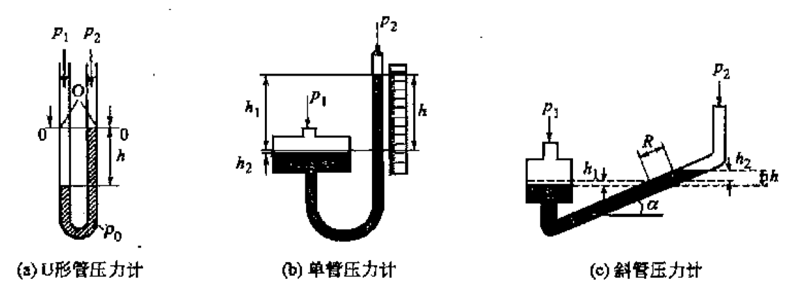
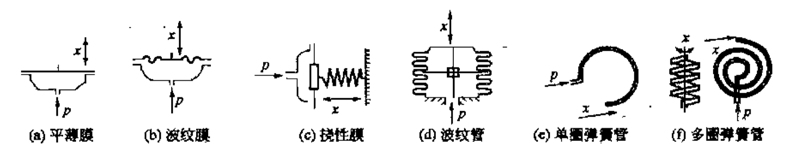
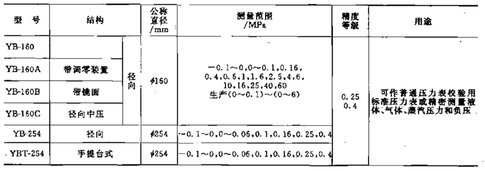

# 0202. 测量仪表

## 2.2 压力测量

### 7.2.1 概述

压力是工业生产过程中反映生产过程好坏、保证工业生产正常进行、高效节能的重要参数之一。工业过程中需要测量的压力范围宽、精度要求多样，因此压力测量仪表也是种类繁多。

1、压力的定义、分类及单位。

工程上所说的「压力」实质是物理学「压强」的概念，即垂直而均匀地作用在单位面积上的力。根据参考点的选择不同，エ业上涉及的压カ分为绝对压力和表压力。根据所测压力类型的不同，压力表的称谓也有所不同。测量绝对压力的压力表称为绝对压力表；测量表压的压力表称为压力表；测量真空的压力表称为真空表或负压表；既能测表压又能测真空的压力表称为压力真空表；测量差压的压力表称为差压表。

力单位是一个导出单位。国际单位中定义压カ的单位为：1 牛顿（N）的力垂直而均地作用在 1m2 面积上产生的力为 1 帕斯卡（简称帕，Pa）。除 Pa 之外还有很多非法定压力单位。各种压力单位的换算见表 7-9。

### 7.2.2

液柱式压力表缺点是体积大、读数不便、玻璃管易碎、精度较低。此类压力计适合就地测量指示及精度要求不高且环境不复杂的条件。受液柱高度的限制，这类压力表的测量上限较低限于测量低压、微压或压差。液柱式压力表种类很多，主要有 U 形管压力计、单管压力计、多管压力计、斜管压力计、补偿式压计、差动式微压计、钟罩式压力计等。一般采用水、酒精或汞作产生平衡压力的液柱。图 7-24 给出了几种常见液柱式压力表的结构。

液柱式压力计使用时应注意以下几点：1）使用汞封液压力计时，由于汞有毒，应装收集器。2）读数时注意液体毛细现象和表面张力的因素。凹形液面（如水）以液面最低点为准，凸形液面（如汞）以液面最低点为准。3）直管材料为玻璃时，为了保证玻璃管的安全，要注意压力计工作环境的温度和振动。4）压力计维修时，如果更换了液体，要重新标度压カ计。5）如果被测介质与工作液混合或发生化学反应，则应更换其他工作液或加隔离液。

近年来液柱式压力计在エ业上应用已日益少，特别是汞压力计已趋于汰，只有在科学实验中还经常使用。

### 7.2.3 弹性式压力表

弹性式压力表是工业生产中使用最广泛的一种历史悠久的压力量仪表。弹性式压力表是根据弹性元件受压产生的弹性变形（即机被位移）与所受压力成正比的原理工作的。弹性式压力表的特点是结构单、使用方便、价格低廉、性能可、防水防爆防腐，若增设附加机构（如记录机构、控制元件、电气转换装置等）可制成压力记录仪、电接点式力表、压力控制报替器等。它主要用来量真空度、压力，可以就地描示、远传集中控制、记录或报。若采用膜片式或膜式结构可测量结晶及腐蚀性介质压力。

1、弹性元件。弹性元件主要有弹管（单圈、多圈）、膜片（平薄膜、波纹膜、绕性膜）、膜盒、波纹管等，图 7-25。膜片式、波纹管式弹性元件只能用来测量微压、低压；弹簧管式弹性元件应用范广泛，为提高相同输入下的输出信号，可以用多圈式代替单圈式。饶性膜和弹簧管两种弹性元件输出特性的线性度较好。

1『膜片、波纹管式的弹性式压力表，只能测微压、低压。（2021-01-11）』

2、弹簧管压力表。弹管压力表是工业生产中应用最广泛的压力表，其中又以单圈结构最多，单圈弹簧压力表的结如图 7-26 所示。从精度等级上分，弹簧管压力表可分为普通压力表和精密压力表两类。普通压表适用于测量不结晶、不凝固、对金属无腐蚀的液体、气体或蒸汽的压力，性能指标见表 7-10；精密压力表用来作普適压力表的校验标准表，性能指标见表 7-1。弹性式压力表型号中，常用汉语拼音缩写表示某种意义 7-12 给出了部分字毋的物理意义。

7-10 普通弹簧管压力表主要技术参数

7-11 精密弹簧管压力表主要技术参数

7-12 弹簧管压力表命名规则涉及符号的物理意义

| 符号 | Y | Z | B | J | A | X | P | E | 数字 | 尺寸后的符号 |
| --- | --- | --- | --- | --- | --- | --- | --- | --- | --- | --- | 
| 物理意义 | 压力 | 真空（阻尼）| 标准（防爆）| 精密（矩形）| 氨表 | 信号（电接点）| 膜片 | 膜盒 | 表盘尺寸（mm）| 结构或配套的仪表 |

3、其他弹性式力表。表 7-13 给出了膜盒式、膜片式、波纹管式压力表的性能参数此外，还有一类具有特殊设计结构和材料、用于特殊场合及用途的专用压力表，如绝对压表、耐振压力表、耐腐蚀压力表、高温压力表等，此处不作详细述。

| 压力表 | 测量范围/MPa | 精度 | 用途 |
| --- | --- | --- | --- |
| 膜片式 | 0-(0.06-2.5)、-0.1-(0.06-2.4) | 1.5，2.5 | 测量腐蚀性、易结晶或粘稠介质的压力 |
| 膜盒式（圆形） | 0-(4-40kPa) | 1.5 | 测量无腐蚀性气体的微压或负压 |
| 膜盒式（矩形） | 0-(0.25-40kPa)、(-0.25~-40kPa)-0、-2~-0.25kPa | 2.5 | 微压测量；制成带电接点的形式，用于位式控制 |
| 波纹管式 | 0-(0.025-0.4) | 1.5，2.5 | 适合作压力记录仪 |

### 7.2.4 物性式压力表（固态测压仪表）

利用某些元件的物理特性随压力变化而变化可以制成物性式压力表，如压电式、压磁式、压阻式等。这类压力仪表由于内部没有运动部分，因此仪表可靠性高。物性式压力表因结构简单、耐腐蚀、精度高、抗干扰能力强、响应快、测量范围宽、利于信号远传、控制等特点成为压力检测仪表的重要组成部分，广泛用于工业生产自动化、航空工业等领。

1、压阻式压力表某些固体受到作用力后其电阻会发生变化，这种现象称为压阻效应。利用压阻效应可以制成压阻式压力表，将压力转换成电阻，经电桥测量转换成电信号输出。20 世纪 70 年代前的压阻元件主要是半导体式；70 年代以后，利用微电子技术和计算机技术，研制出了扩散性压阻传器。

压阻式压力传感器的优点是易于微型化、灵敏度高、测压范宽、精度、工作可靠率响应好、易于集成化和智能化，已成为代表型的新型传感器。缺点是应变片电阻值受环境温度的影响较大，大应变情祝下输出的非线性较大，抗千扰能力差。使用压阻式压力表应注意温度补偿和修正，将应变片贴在不会受到介质污染、氧化、腐蚀的位置。

2、压电式压力表某些介质沿一定方向受外力作用变形时，内部会产生极化现象，同时两个相对表面上产生电荷；外力去掉后，又恢复不带电状态，这种现象称为压电效应。具有压电敕应的材料称为压电材料。压电材料可分成压电晶体和压电陶两类，常见的压电材料有天然石英晶体、人造压电陶瓷、镨钛酸铅、钛酸钡等。

压电效应可以用来测量压力。压电式压力表体积小、重量轻、工作频率宽，是一种可以测快速化压力、进行信号远传的压力表，血压计就是一种典型的压电式压力计。电式压力表已广泛应用于空气动力学、爆破力学中的压力测量。压电式压力表使用时要注意环境温度和湿度（温度升高，压电材料的绝缘电阻明显下降），并做好抗千扰工作。

3、压磁式压力表某些铁磁材料受到外力作用时，材料的磁导率会发生变化，这种现象称为压磁效应。利用压磁效应可以测量压力的大小。压磁材料有硅钢片、坡莫合金和一些铁氧体。

压磁式压力传感器具有输出电势较大（甚至只滤波整流，无需放大处理）、抗于扰能力强、过教性能好、结构简单、能在恶劣环境下工作、寿命长等一系列优点；缺点是测量精度不高、反应速度低。但由于上述优点，尤其是寿命长、对使用条件要求不高两点，压式压力传器很适合在重工业、化学工业等部门应用。压磁式压力传感器在使用中应注意两点：①防止因侧向力干扰而破坏硅钢的叠片结构；②由于铁磁材料的磁化特性会随温度发生变化，因此要进行温度补。

### 7.2.5 压力信号的电测法

工业过程的很多情况下徭要对压力信号远传，进行集中测量、显示、控制、管理等。弹性式力表仅能将压力转换成弹性元件的位移信号，利用信号转换元件将弹性元件的弹性变形换成电号，可以实现压力信号的电测。

1、应式压传感器金属或半导体电阻受力时会产生压阻效应。利用压效应测量弹性元件的应变，可以将弹性变形转换成电信号输出

2、霍尔式压力传感器当一块通有电流的金属或半导体片（霍尔片）垂直地放在磁场中时，薄片的两端就会产生电势（尔电势），这种现象称为霍尔效应。尔电势与尔片通过的电流和磁感应强度成正比，固定电流，改变磁感应强度霍尔电勢就会发生変化尔式压力传感器就是采用这种检测方式，将尔片与弹簧管自由端相连，弹管自由带动尔片移动，改变了通过霍尔片的磁感应强度，从而实现压力-位移-霍尔电勢的转换。由于很尔片均是半导体材料，因此使用时也注意环境涅度对传器性能的响，采取恒温或温度补偿施。

3、电容式压力传感器采用弹性元件作电容器的极板，当弹性元件受压变形时会改变电容器的电容量，通过测量电容，便可以测量压力的大小，实现压力一电容转换。改变电容的方法有改变极板间距离和改变面积两种，但变极板间距离更实用。电容式压力传器在结构上有单端式和差动式两种形式。因为差动式灵敏度高，非缦性误差小，所以常采用这种形式。电容式压力传感器因抗振性好、精度高等优点近年来获得广泛应用。

4、电感式压力传器利用电磁感应原理，把压力变化转换成自或互感系数变化，通过测量电感，便可以测量压力的大小，实现压力 - 电转换。

5、谐振式压力传感器（频率式压力传感器）谐振式压力传感器是通过压力形成的应力改变弹性元件的谐振频率，突现压力 - 率转换。适合与计算机配合，进行集中压力测量显示、控制。根谐振原理可以将振式压力传感器分为电式、机械式、原子式三种。

6、光纤式压力传感器光纤式力传器主要有三种类型：强度调制型光纤压力传感器，大多是基于弹性元件受压变形发生位移变化，政变光纤与弹性元件的距离，从而改变了光纤接收到的反射光量，对光强进行调制；相位调制型光纤压力传感器，利用光纤本身作为敏感元件，压力引起变形器产生位移，导致光纤弯曲而调制光强度；偏赧调整型光纤压力传感器，主要是利用晶体的光弹性效应（晶体受压后折射率发生变化，呈现双折射现象）。这类传感器抗干扰能力强、灵敏度高，适合高压、易燃易爆介质的压力测量。