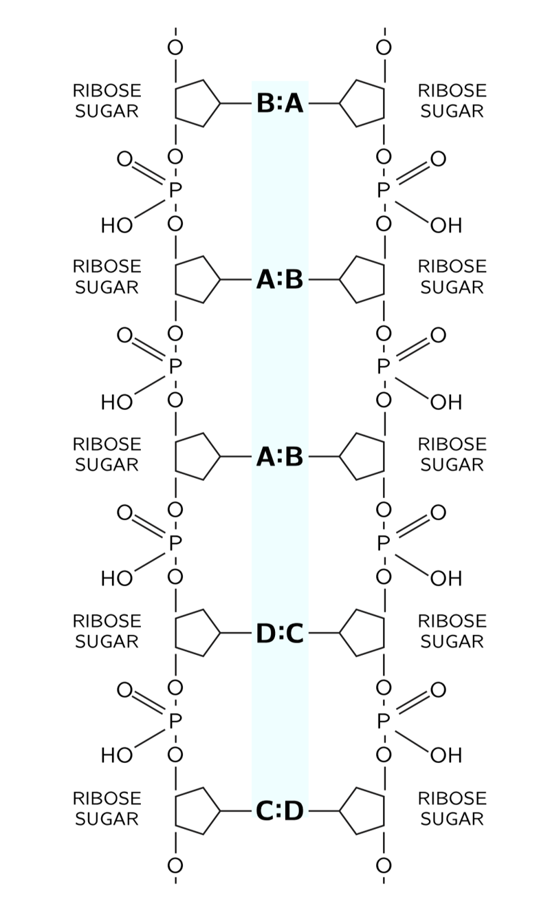

# 0301. The Relation of Physics to Other Sciences

## 3.1 Introduction 

Physics is the most fundamental and all-inclusive of the sciences, and has had a profound effect on all scientific development. In fact, physics is the present-day equivalent of what used to be called natural philosophy, from which most of our modern sciences arose. Students of many fields find themselves studying physics because of the basic role it plays in all phenomena. In this chapter we shall try to explain what the fundamental problems in the other sciences are, but of course it is impossible in so small a space really to deal with the complex, subtle, beautiful matters in these other fields. Lack of space also prevents our discussing the relation of physics to engineering, industry, society, and war, or even the most remarkable relationship between mathematics and physics. (Mathematics is not a science from our point of view, in the sense that it is not a natural science. The test of its validity is not experiment.) We must, incidentally, make it clear from the beginning that if a thing is not a science, it is not necessarily bad. For example, love is not a science. So, if something is said not to be a science, it does not mean that there is something wrong with it; it just means that it is not a science.

3-1 引言

物理学是最基本的、包罗万象的一门学科，它对整个科学的发展有着深远的影响。事实上，物理学是与过去所谓的「自然哲学」相当的现代名称，现代科学大多数就是从自然哲学中产生的。许多领域内的学生都发现自己正在学习物理学，这是因为它在所有的现象中起着基本的作用。在本章中我们试图说明其他科学中的基本问题是什么。当然，在这么一点篇幅内要真正地处理这些领域中的复杂、精致而美妙的事情是不可能的。正因为篇幅较少，使我们不能讨论物理学与工程、工业、社会和战争之间的关系，甚至不能讨论数学与物理之间的最令人注目的关系（按照我们的观点，从数学不是一门自然科学这个意义上来说，它不是一门科学。它的正确性不是用实验来检验的）。顺便提一下，我们必须从一开始就说清楚如果一件事情不是科学，这并不一定不好。例如，爱好就不是科学。所以，如果说某件事不是科学，这并不意味着其中有什么错误的地方，这只是意味着它不是科学而已。

## 3.2 Chemistry 

The science which is perhaps the most deeply affected by physics is chemistry. Historically, the early days of chemistry dealt almost entirely with what we now call inorganic chemistry, the chemistry of substances which are not associated with living things. Considerable analysis was required to discover the existence of the many elements and their relationships—how they make the various relatively simple compounds found in rocks, earth, etc. This early chemistry was very important for physics. The interaction between the two sciences was very great because the theory of atoms was substantiated to a large extent by experiments in chemistry. The theory of chemistry, i.e., of the reactions themselves, was summarized to a large extent in the periodic chart of Mendeleev, which brings out many strange relationships among the various elements, and it was the collection of rules as to which substance is combined with which, and how, that constituted inorganic chemistry. All these rules were ultimately explained in principle by quantum mechanics, so that theoretical chemistry is in fact physics. On the other hand, it must be emphasized that this explanation is in principle. We have already discussed the difference between knowing the rules of the game of chess, and being able to play. So it is that we may know the rules, but we cannot play very well. It turns out to be very difficult to predict precisely what will happen in a given chemical reaction; nevertheless, the deepest part of theoretical chemistry must end up in quantum mechanics.

There is also a branch of physics and chemistry which was developed by both sciences together, and which is extremely important. This is the method of statistics applied in a situation in which there are mechanical laws, which is aptly called statistical mechanics. In any chemical situation a large number of atoms are involved, and we have seen that the atoms are all jiggling around in a very random and complicated way. If we could analyze each collision, and be able to follow in detail the motion of each molecule, we might hope to figure out what would happen, but the many numbers needed to keep track of all these molecules exceeds so enormously the capacity of any computer, and certainly the capacity of the mind, that it was important to develop a method for dealing with such complicated situations. Statistical mechanics, then, is the science of the phenomena of heat, or thermodynamics. Inorganic chemistry is, as a science, now reduced essentially to what are called physical chemistry and quantum chemistry; physical chemistry to study the rates at which reactions occur and what is happening in detail (How do the molecules hit? Which pieces fly off first?, etc.), and quantum chemistry to help us understand what happens in terms of the physical laws.

The other branch of chemistry is organic chemistry, the chemistry of the substances which are associated with living things. For a time it was believed that the substances which are associated with living things were so marvelous that they could not be made by hand, from inorganic materials. This is not at all true— they are just the same as the substances made in inorganic chemistry, but more complicated arrangements of atoms are involved. Organic chemistry obviously has a very close relationship to the biology which supplies its substances, and to industry, and furthermore, much physical chemistry and quantum mechanics can be applied to organic as well as to inorganic compounds. However, the main problems of organic chemistry are not in these aspects, but rather in the analysis and synthesis of the substances which are formed in biological systems, in living things. This leads imperceptibly, in steps, toward biochemistry, and then into biology itself, or molecular biology.

3-2 化学

也许受物理学影响最深的科学就是化学了。在历史上，早期的化学几乎完全讨论那些现在称为无机化学的内容，即讨论那些与生命体不发生联系的物质。人们曾经进行了大量的分析才发现许多元素的存在以及它们之间的关系 一一 即它们是怎样组成在矿石、土壤里所发现的简单化合物的，等等。早期的化学对于物理学是很重要的。这两门科学间的相互影响非常大，因为原子的理论在很大程度上是由化学实验来证实的。化学的理论，即化学反应本身的理论，在很大程度上总结在门捷列夫周期表里，周期表体现了各种元素之间的许多奇特的联系，它汇总了有关的规则：哪一种物质可以与哪一种物质化合，怎样化合，等等，这些就组成了无机化学。原则上，所有这些规则最终可以从量子力学得到解释，所以理论化学实际上就是物理。但是，必须强调的是，这种解释只是原则上的。我们已经讨论过了解下棋规则与擅长下棋之间的差别。也就是说，我们可能知道有关的规则，但是下得不很好。我们知道，精确地预言某个化学反应中会出现什么情况是十分困难的；然而，理论化学的最深刻部分必定会归结到量子力学。

还有一门由物理学与化学共同发展起来的极其重要的分支，这就是把统计学的方法应用于力学定律起作用的场合，这被恰当地称之为统计力学。在任何化学状态中都要涉及大量的原子，我们已经看到原子总是以复杂而毫无规则的方式不停地晃动。假如我们能够分析每一次碰撞，并且跟踪每一个分子的运动细节的话，就能判断出将会发生一些什么。但是要记录所有这些分子就需要许许多多数据，这远远超过了任何计算机的容量，当然也一定超过人脑的容量，所以为了处理这样复杂的情况，重要的是要采取一种有效的方法。统计力学就是关于热现象或热力学的理论。作为一门科学，无机化学现在基本上已归结为所谓物理化学和量子化学。物理化学研究反应率和所发生的详细变化（分子间如何碰撞？哪一些分子先飞离？等等），而量子化学则帮助我们根据物理定律来理解所发生的事。

化学的另一个分支是有机化学，它研究与生命体有关的物质。人们曾一度相信与生命有关的物质极其神秘，因此不可能用我们的手从无机材料中制造出这种物质。这根本不对 —— 它们与无机化学中制成的物质完全一样，只是包括了更复杂的原子排列。很明显，有机化学与提供有机物质的生物学之间有十分密切的关系，与工业也有密切的联系，而且许多物理化学和量子化学的定律不仅适用于无机化合物的情况，而且也适用于有机化合物。然而，有机化学的主要任务并不在于这些方面，而是在于分析、综合那些在生物系统以及在生命体中所形成的物质。这样就不知不觉地逐步引向了生物化学，然后是生物学本身，或分子生物学。

## 3.3 Biology 

Thus we come to the science of biology, which is the study of living things. In the early days of biology, the biologists had to deal with the purely descriptive problem of finding out what living things there were, and so they just had to count such things as the hairs of the limbs of fleas. After these matters were worked out with a great deal of interest, the biologists went into the machinery inside the living bodies, first from a gross standpoint, naturally, because it takes some effort to get into the finer details.

There was an interesting early relationship between physics and biology in which biology helped physics in the discovery of the conservation of energy, which was first demonstrated by Mayer in connection with the amount of heat taken in and given out by a living creature.

If we look at the processes of biology of living animals more closely, we see many physical phenomena: the circulation of blood, pumps, pressure, etc. There are nerves: we know what is happening when we step on a sharp stone, and that somehow or other the information goes from the leg up. It is interesting how that happens. In their study of nerves, the biologists have come to the conclusion that nerves are very fine tubes with a complex wall which is very thin; through this wall the cell pumps ions, so that there are positive ions on the outside and negative ions on the inside, like a capacitor. Now this membrane has an interesting property; if it「discharges」in one place, i.e., if some of the ions were able to move through one place, so that the electric voltage is reduced there, that electrical influence makes itself felt on the ions in the neighborhood, and it affects the membrane in such a way that it lets the ions through at neighboring points also. This in turn affects it farther along, etc., and so there is a wave of「penetrability」of the membrane which runs down the fiber when it is「excited」at one end by stepping on the sharp stone. This wave is somewhat analogous to a long sequence of vertical dominoes; if the end one is pushed over, that one pushes the next, etc. Of course this will transmit only one message unless the dominoes are set up again; and similarly in the nerve cell, there are processes which pump the ions slowly out again, to get the nerve ready for the next impulse. So it is that we know what we are doing (or at least where we are). Of course the electrical effects associated with this nerve impulse can be picked up with electrical instruments, and because there are electrical effects, obviously the physics of electrical effects has had a great deal of influence on understanding the phenomenon.

The opposite effect is that, from somewhere in the brain, a message is sent out along a nerve. What happens at the end of the nerve? There the nerve branches out into fine little things, connected to a structure near a muscle, called an endplate. For reasons which are not exactly understood, when the impulse reaches the end of the nerve, little packets of a chemical called acetylcholine are shot off (five or ten molecules at a time) and they affect the muscle fiber and make it contract—how simple! What makes a muscle contract? A muscle is a very large number of fibers close together, containing two different substances, myosin and actomyosin, but the machinery by which the chemical reaction induced by acetylcholine can modify the dimensions of the muscle is not yet known. Thus the fundamental processes in the muscle that make mechanical motions are not known.

Biology is such an enormously wide field that there are hosts of other problems that we cannot mention at all—problems on how vision works (what the light does in the eye), how hearing works, etc. (The way in which thinking works we shall discuss later under psychology.) Now, these things concerning biology which we have just discussed are, from a biological standpoint, really not fundamental, at the bottom of life, in the sense that even if we understood them we still would not understand life itself. To illustrate: the men who study nerves feel their work is very important, because after all you cannot have animals without nerves. But you can have life without nerves. Plants have neither nerves nor muscles, but they are working, they are alive, just the same. So for the fundamental problems of biology we must look deeper; when we do, we discover that all living things have a great many characteristics in common. The most common feature is that they are made of cells, within each of which is complex machinery for doing things chemically. In plant cells, for example, there is machinery for picking up light and generating glucose, which is consumed in the dark to keep the plant alive. When the plant is eaten the glucose itself generates in the animal a series of chemical reactions very closely related to photosynthesis (and its opposite effect in the dark) in plants.

In the cells of living systems there are many elaborate chemical reactions, in which one compound is changed into another and another. To give some impression of the enormous efforts that have gone into the study of biochemistry, the chart in Fig. 3-1 summarizes our knowledge to date on just one small part of the many series of reactions which occur in cells, perhaps a percent or so of it. Here we see a whole series of molecules which change from one to another in a sequence or cycle of rather small steps. It is called the Krebs cycle, the respiratory cycle. Each of the chemicals and each of the steps is fairly simple, in terms of what change is made in the molecule, but—and this is a centrally important discovery in biochemistry—these changes are relatively difficult to accomplish in a laboratory. If we have one substance and another very similar substance, the one does not just turn into the other, because the two forms are usually separated by an energy barrier or「hill.」Consider this analogy: If we wanted to take an object from one place to another, at the same level but on the other side of a hill, we could push it over the top, but to do so requires the addition of some energy. Thus most chemical reactions do not occur, because there is what is called an activation energy in the way. In order to add an extra atom to our chemical requires that we get it close enough that some rearrangement can occur; then it will stick. But if we cannot give it enough energy to get it close enough, it will not go to completion, it will just go part way up the「hill」and back down again. However, if we could literally take the molecules in our hands and push and pull the atoms around in such a way as to open a hole to let the new atom in, and then let it snap back, we would have found another way, around the hill, which would not require extra energy, and the reaction would go easily. Now there actually are, in the cells, very large molecules, much larger than the ones whose changes we have been describing, which in some complicated way hold the smaller molecules just right, so that the reaction can occur easily. These very large and complicated things are called enzymes. (They were first called ferments, because they were originally discovered in the fermentation of sugar. In fact, some of the first reactions in the cycle were discovered there.) In the presence of an enzyme the reaction will go.

Fig. 3-1. The Krebs cycle.

An enzyme is made of another substance called protein. Enzymes are very big and complicated, and each one is different, each being built to control a certain special reaction. The names of the enzymes are written in Fig. 3-1 at each reaction. (Sometimes the same enzyme may control two reactions.) We emphasize that the enzymes themselves are not involved in the reaction directly. They do not change; they merely let an atom go from one place to another. Having done so, the enzyme is ready to do it to the next molecule, like a machine in a factory. Of course, there must be a supply of certain atoms and a way of disposing of other atoms. Take hydrogen, for example: there are enzymes which have special units on them which carry the hydrogen for all chemical reactions. For example, there are three or four hydrogen-reducing enzymes which are used all over our cycle in different places. It is interesting that the machinery which liberates some hydrogen at one place will take that hydrogen and use it somewhere else.

The most important feature of the cycle of Fig. 3-1 is the transformation from GDP to GTP (guanosine-di-phosphate to guanosine-tri-phosphate) because the one substance has much more energy in it than the other. Just as there is a「box」in certain enzymes for carrying hydrogen atoms around, there are special energy-carrying「boxes」which involve the triphosphate group. So, GTP has more energy than GDP and if the cycle is going one way, we are producing molecules which have extra energy and which can go drive some other cycle which requires energy, for example the contraction of muscle. The muscle will not contract unless there is GTP. We can take muscle fiber, put it in water, and add GTP, and the fibers contract, changing GTP to GDP if the right enzymes are present. So the real system is in the GDP-GTP transformation; in the dark the GTP which has been stored up during the day is used to run the whole cycle around the other way. An enzyme, you see, does not care in which direction the reaction goes, for if it did it would violate one of the laws of physics.

Physics is of great importance in biology and other sciences for still another reason, that has to do with experimental techniques. In fact, if it were not for the great development of experimental physics, these biochemistry charts would not be known today. The reason is that the most useful tool of all for analyzing this fantastically complex system is to label the atoms which are used in the reactions. Thus, if we could introduce into the cycle some carbon dioxide which has a「green mark」on it, and then measure after three seconds where the green mark is, and again measure after ten seconds, etc., we could trace out the course of the reactions. What are the「green marks」? They are different isotopes. We recall that the chemical properties of atoms are determined by the number of electrons, not by the mass of the nucleus. But there can be, for example in carbon, six neutrons or seven neutrons, together with the six protons which all carbon nuclei have. Chemically, the two atoms C12 and C13 are the same, but they differ in weight and they have different nuclear properties, and so they are distinguishable. By using these isotopes of different weights, or even radioactive isotopes like C14, which provide a more sensitive means for tracing very small quantities, it is possible to trace the reactions.

Now, we return to the description of enzymes and proteins. All proteins are not enzymes, but all enzymes are proteins. There are many proteins, such as the proteins in muscle, the structural proteins which are, for example, in cartilage and hair, skin, etc., that are not themselves enzymes. However, proteins are a very characteristic substance of life: first of all they make up all the enzymes, and second, they make up much of the rest of living material. Proteins have a very interesting and simple structure. They are a series, or chain, of different amino acids. There are twenty different amino acids, and they all can combine with each other to form chains in which the backbone is CO-NH, etc. Proteins are nothing but chains of various ones of these twenty amino acids. Each of the amino acids probably serves some special purpose. Some, for example, have a sulfur atom at a certain place; when two sulfur atoms are in the same protein, they form a bond, that is, they tie the chain together at two points and form a loop. Another has extra oxygen atoms which make it an acidic substance, another has a basic characteristic. Some of them have big groups hanging out to one side, so that they take up a lot of space. One of the amino acids, called proline, is not really an amino acid, but imino acid. There is a slight difference, with the result that when proline is in the chain, there is a kink in the chain. If we wished to manufacture a particular protein, we would give these instructions: put one of those sulfur hooks here; next, add something to take up space; then attach something to put a kink in the chain. In this way, we will get a complicated-looking chain, hooked together and having some complex structure; this is presumably just the manner in which all the various enzymes are made. One of the great triumphs in recent times (since 1960), was at last to discover the exact spatial atomic arrangement of certain proteins, which involve some fifty-six or sixty amino acids in a row. Over a thousand atoms (more nearly two thousand, if we count the hydrogen atoms) have been located in a complex pattern in two proteins. The first was hemoglobin. One of the sad aspects of this discovery is that we cannot see anything from the pattern; we do not understand why it works the way it does. Of course, that is the next problem to be attacked.

Another problem is how do the enzymes know what to be? A red-eyed fly makes a red-eyed fly baby, and so the information for the whole pattern of enzymes to make red pigment must be passed from one fly to the next. This is done by a substance in the nucleus of the cell, not a protein, called DNA (short for des-oxyribose nucleic acid). This is the key substance which is passed from one cell to another (for instance sperm cells consist mostly of DNA) and carries the information as to how to make the enzymes. DNA is the「blueprint.」What does the blueprint look like and how does it work? First, the blueprint must be able to reproduce itself. Secondly, it must be able to instruct the protein. Concerning the reproduction, we might think that this proceeds like cell reproduction. Cells simply grow bigger and then divide in half. Must it be thus with DNA molecules, then, that they too grow bigger and divide in half? Every atom certainly does not grow bigger and divide in half! No, it is impossible to reproduce a molecule except by some more clever way.

The structure of the substance DNA was studied for a long time, first chemi- cally to find the composition, and then with x-rays to find the pattern in space. The result was the following remarkable discovery: The DNA molecule is a pair of chains, twisted upon each other. The backbone of each of these chains, which are analogous to the chains of proteins but chemically quite different, is a series of sugar and phosphate groups, as shown in Fig. 3-2. Now we see how the chain can contain instructions, for if we could split this chain down the middle, we would have a series BAADC . . . and every living thing could have a different series. Thus perhaps, in some way, the specific instructions for the manufacture of proteins are contained in the specific series of the DNA.

Fig. 3-2. Schematic diagram of DNA.

Attached to each sugar along the line, and linking the two chains together, are certain pairs of cross-links. However, they are not all of the same kind; there are four kinds, called adenine, thymine, cytosine, and guanine, but let us call them A, B, C, and D. The interesting thing is that only certain pairs can sit opposite each other, for example A with B and C with D. These pairs are put on the two chains in such a way that they「fit together,」and have a strong energy of interaction. However, C will not fit with A, and B will not fit with C; they will only fit in pairs, A against B and C against D. Therefore if one is C, the other must be D, etc. Whatever the letters may be in one chain, each one must have its specific complementary letter on the other chain. What then about reproduction? Suppose we split this chain in two. How can we make another one just like it? If, in the substances of the cells, there is a manufacturing department which brings up phosphate, sugar, and A, B, C, D units not connected in a chain, the only ones which will attach to our split chain will be the correct ones, the complements of BAADC . . ., namely, ABBCD . . . Thus what happens is that the chain splits down the middle during cell division, one half ultimately to go with one cell, the other half to end up in the other cell; when separated, a new complementary chain is made by each half-chain.

Next comes the question, precisely how does the order of the A, B, C, D units determine the arrangement of the amino acids in the protein? This is the central unsolved problem in biology today. The first clues, or pieces of information, however, are these: There are in the cell tiny particles called ribosomes, and it is now known that that is the place where proteins are made. But the ribosomes are not in the nucleus, where the DNA and its instructions are. Something seems to be the matter. However, it is also known that little molecule pieces come off the DNA—not as long as the big DNA molecule that carries all the information itself, but like a small section of it. This is called RNA, but that is not essential. It is a kind of copy of the DNA, a short copy. The RNA, which somehow carries a message as to what kind of protein to make goes over to the ribosome; that is known. When it gets there, protein is synthesized at the ribosome. That is also known. However, the details of how the amino acids come in and are arranged in accordance with a code that is on the RNA are, as yet, still unknown. We do not know how to read it. If we knew, for example, the「lineup」A, B, C, C, A, we could not tell you what protein is to be made. Certainly no subject or field is making more progress on so many fronts at the present moment, than biology, and if we were to name the most powerful assumption of all, which leads one on and on in an attempt to understand life, it is that all things are made of atoms, and that everything that living things do can be understood in terms of the jigglings and wigglings of atoms.

3-3 生物学

我们就这样进入了生物学，它研究的是生命体。在生物学发展的早期，生物学家必须进行单纯的说明性工作 一一 找出有哪生物，所以他们要数数跳蚤足上的细毛之类的东西。当他们以很大的兴趣完成这种工作后，就进而考虑在生命体内部的机制问题，起先自然是从十分粗略的观点出发的，因为要知道更详细的情况是需要经过一番努力的。

在物理学与生物学的早期关系中有过一件很有趣的事，生物学曾经帮助物理学发现了能守便定建，迈耶（J. R. Mayer）最先在关于生物吸收和放出的热量问题上证实了这条定律。

假如我们更仔细地观察动物的生物学过程，就会看到许多物理现象：血液的循环、心脏的跳动、血压，等等。这里还有神经：如果我们踩在一块尖锐的岩石上，就会知道发生了什么事情，这个信息不知怎么地就从我们的脚底传递上来。有趣的是这个信息是怎样传递的。在研究神经时，生物学家得到了这样的结论：神经是非常精细的小管道，有十分薄而复杂的管壁。细胞通过这样的管壁吸进离子，所以在外面有正离子，而在里面则有负离子，就像个电容器一样。这层薄膜还有一个有趣的性质：如果它在某个地方「放电」，即一些离子能够通过这个地方，那么该处的电压就减小，它会影响到邻近地方的离子，而这又会影响那里的薄膜，使它也让离子通过。接着这又要影响更远的薄膜，等等，于是在薄膜中就出现一列「穿透性变动」波，当神经末梢的一端由于碰到尖锐的岩石而受到「刺激」后，这种波就沿着神经传开来。它有点像一长列垂直放置的多米诺骨牌，如果末端的一个被推倒，邻近的一个也就被它带动，等等。当然，除非把多米诺骨牌再重新排好，不然这时只有一个信息传递过去。类似地，在神经元里，也有排出离子的缓慢过程，使神经又处于准备接收下一个脉冲的状态。这就是为什么我们会知道正在做什么（或者至少知道我们在哪里）。当然我们可以用电子仪器测出这种与神经冲动有关的电的效应，因为这里存在着电的作用。十分明显，电效应的物理知识对理解这个现象很起作用。

相反的效应是从大脑中某个地方沿着神经发出一个信息。这时在神经的末梢会出现什么情况呢？神经在末梢处分成了细微的小纤维，这些小纤维与肌肉附近的一种称为端板的结构相连接。由于一些现在还不完全理解的原因，当脉冲信号抵达神经末梢后，射出一小团小团称为乙酰胆碱的化学物质（每次 5-10 个分子），它们影响了肌肉纤维而使其收缩 一一 这一切多么简单！什么东西使肌肉会发生收缩呢？肌肉是由极多的彼此紧贴的纤维所组成的，它含有两种不同的物质：肌球蛋白和肌动球蛋白。但是由乙酰胆碱所引起的那种改变分子大小的化学反应机制现在还不清楚，因而在肌肉中引起机械运动的基本过程也未被我们所知。

生物学的领域是如此广泛，有许多问题我们根本无法叙述。比如视觉是如何产生的（即光在眼晴里做什么）？听觉是如何产生的？等等（思维是如何进行的这一个问题将在后面心理学中讨论）。但是从生物学的观点来说，我们刚才所讨论的这些关于生物学的事情实在并不是基本的，并且不是生命的根源 一一 即使我们理解了它们，仍然不能理解生命本身。

举一个例子：研究神经的人感到他们的工作是很重要的，因为无论如何不存在没有神经的动物，但是没有神经仍然可以有生命。植物既无神经也无肌肉，但是它们照样活动着，照样生存着。所以我们对于生物学的基本问题必须更仔细地研究一下。如果我们这样做，就会发现所有的生命体中存在着许多共同的特征。最普遍的特征是它们都由细胞组成，每个细胞内都有起化学作用的复杂机制。例如，在植物细胞中就存在着接收光线而产生蔗糖的机构，植物在夜间消耗蔗糖以维持其生存。当动物摄取植物后蔗糖在动物体内就产生了一系列化学反应，这些反应与植物体内的光合作用（以及在夜间的相反作用）有很密切的关系。

在生命系统的细胞里有许多复杂的化学反应，在反应中一种化合物变成另一种化合物，然后再变成一种化合物。为了对生物化学研究中所付出的巨大的努力有某种印象，我们在图 3-1 中总结了到此刻为止所知道的在细胞中出现的反应，这些反应只是所有反应中的很小一部分，只占 1% 左右。

这里我们可以看到整整一系列分子，它们在一连串相当小的步骤组成的循环中从一个变到另一个。这个循环称为三羧酸循环或呼吸循环。如果从分子发生的变化来说，每一种化合物和每一步反应都是相当简单的，但是 一一 这是生物化学中非常重要的发现 —— 这些变化在验室里比较难以完成。假如我们有一种物质，还有另一种十分类似的物质，那么前一种物质并不就转成后一种物质，因为这两种形式通常由一个能量屏障或「势垒」隔开。

考虑这样一个类似的情况：如果我们要把一个物体从一个地方拿到另一个地方，而这两个地方处在相同的水平高度，但是分别在一座小山的两边，那么我们可以把物体推过山顶，但是要做到这一点需要一些附加的能量。由于这种原因，大多数化学反应都不会发生，因为有种所谓的活化能妨碍这一反应的进行。为了在一种化合物中增加一个额外的原子，就要使这个原子靠得足够紧，以便能出现某种重新排列，这样它就结合到那个化合物上去了。但是如果我们不能给它足够的能量使之靠得足够近，它就不会越过势垒，只是上去了一部分路程后又倒退回来。然而，假如我们真的能把分子拿在手中，把其中的原子推来推去使它出现个缺口，让新原子进入，然后又使缺口一下子合拢，我们就找到了另一个办法，即绕过势垒，这不需要额外的能量，因此反应就较容易进行。现在，在细胞里确实存在着一些很大的分子，比起我们刚描述过其变化的分子要大得多，它们以某种复杂的方式使较小的分子处于恰当的状态，从而使反应易于发生。这些很大的、复杂的分子称为酶（它们起先被叫做酵素，因为最早是在糖发酵时发现的。事实上三羧酸循环的某些反应最初就是在发酵中发现的）。由于有酶存在，反应就会进行。

2『这里介绍的酶、催化剂的原理，以一座小山两边同水平位置上的石头做隐喻，绝妙。做一张信息数据卡片。』——已完成

酶是由另一种称为蛋白质的物质构成的。酶分子族是非常庞大而复杂的，每一种酶互不相同，并且都控制着一定的特殊反应。图 3-1 中每个反应中都写上了酶的名称（有时同种酶可以控制两种反应）。我们要强调指出：酶本身并不直接参与反应，它们并没有变化，只是使一个原子从一个地方跑到另一个地方。干完了这件事后，它又准备对下一个原子做同样的事，犹如工厂里的机器一样。当然，必须对某种原子进行补充，并且可以处理另一些原子。比如，以氢为例，有些酶具有特殊的结构单元，能在各种化学反应中运送氢原子。例如，有三种或四种脱氢酶在我们整个循环的各个地方都用到。有趣的是，有一种机构使一个地方释放某些氢原子并将其取走，然后用到其他的地方去。

图 3-1 的循环中最重要的是 GDP 转变为 GTP（二酸鸟嘌呤核苷变为三磷酸鸟嘌呤核苷），因为 GTP 比 GDP 含有更多的能量。就像在某些酶中存在着一种运送氢原子的「盒子」一样，在酶中也有特殊的携带能量的「盒子」，三磷酸基就是这样的「盒子」。所以 GTP 比 GDP 具有更多的能量，而且如果循环是朝某个方向时，我们就产生具有附加能量的分子，它可以推动另一个需要能量的循环，比如肌肉的收缩。除非存在着 GTP，肌肉就不会收缩。我们可以拿几根肌肉纤维，把它们浸到水里，加一些 GTP，只要这里存在着适当的酶，肌肉纤维就会收缩，GTP 就变为 GDP。所以真实的系统是在 GDP-GTP 转变中，在晚上就用白天贮藏起来的 GTP 使整个循环往另ー个方向进行。你们可以看到酶对反应进行的方向并不介意，因为倘若不是如此，就会违反一条物理定律。

物理学对于生物学和其他科学之所以极为重要还在于另一个原因，这与实验技术有关。事实上，如果不是由于实验物理的巨大发展，这些生物化学的循环图今天就不可能知道。其理由是：分析这种极其复杂的系统的最有效的方法就是要辨认在反应过程中所用到的原子。例如，如果我们能把一些带有「绿色标记」的二氧化碳引到循环中去，然后测量 3s 后绿色标记的位置，在 10s 后再测量一次，等等，我们就能描绘出反应的过程。那么「绿色标记」是什么呢？它们就是同位素。

我们可以回顾一下：原子的化学性质是由电子的数量而不是原子核的质量所决定的。但是有这种可能，比如在碳原子中，可能有 6 个或 7 个中子与每个碳原子核都具有的 6 个质子在一起。这两个原子碳 12 和碳 13 在化学上是相同的，但它们的重量不同，在核的性质上也有差别，因而是可以区分的。利用这些不同重量的同位素，或者甚至利用放射性同位素如碳 14，就有可能眼踪反应的过程，这是比较灵敏的探査极少量物质的方法。

现在，让我们回到酶和蛋白质的描述。并不是所有的蛋白质都是酶，但是所有的酶都是蛋白质。蛋白质有许多种，比如说肌肉中的蛋白质、结构蛋白质，它们存在于软骨、头发和皮肤中，等等，这些蛋白质本身并不是酶。但是，蛋白质是生命的非常具有代表性的物质。首先，它们组成了所有的酶；其次，它们构成了大部分其余的生命的物质。蛋白质具有十分有趣而简单的结构。它们是一系列不同的氨基酸。有 20 种不同的氨基酸，它们全都能互相组合而形成链，其骨架是 CO-NH，等等。蛋白质不是别的，正是这 20 种氨基酸形成的各种各样的链。每一种氨基酸可能起某种特定的作用。

比如，有一些氨基酸在一定的位置上有一个硫原子；当同一蛋白质内有两个硫原子时，它们就形成一个键，也就是说，它们用链在这两点上连接起来形成一个环。另一种氨基酸有一个额外的氧原子，因而使它变为酸性物质，再有一种则呈碱性的特征。有些氨基酸在一边悬挂着一个大基团，因此占有许多空间。有一种称为脯氨酸的氨基酸实际上并不是氨基酸，而是亚氨基酸。这里稍微有些差别，因为当脯氨酸在链上时，就会出现扭曲。如果我们想制造一种特殊的蛋白质，就应当按照这样的规则：这里先放一个硫钩；然后加进某种东西来占据空位；再加入某种东西以形成链上的扭曲。这样，我们将得到一个外观上复杂的链，它们互相钩连在一起，具有某种复杂的结构。这可能就是所有的酶形成的方式。

1960 年以来，我们所获得的伟大成就之一就是终于发现了某些蛋白质的原子的精确空间排列。在这些蛋自质中，一条链上就含有 56 个或 60 个左右的氨基酸链，在两种蛋白质的复杂图样中已经确定了 1000 个以上的原子（如果把氢原子计入，那么就接近于 2000 个）的位置。第一种阐明结构的蛋白质就是血红蛋白。这个发现的不足之处是我们从这样的图样中不能看出任何东西，我们不理解它为什么会具有那样的功能。当然，这是下一步需要解决的问题。

另一个问题是，酶怎么会知道该成为什么？一个红眼蝇会生出一个小的红眼蝇，这样产生红色素的整个酶组信息必定从一代传到下一代。这是由细胞核中的一种称为 DNA（脱氧核糖核酸的缩写）的物质所完成的，它不是蛋白质。这种关键的物质从一个细胞传到另一个细胞（例如，精虫细胞主要由 DNA 组成），并且携带了关于如何形成酶的信息。DNA 是张「蓝图」。那么这张蓝图看来像什么？它又如何起作用？首先，这张蓝图必须能加以复制。

其次，它必须能给蛋白质以指令。说到复制，我们可能会认为这种过程像细胞的复制。但细胞只是简单地长大，然后一分为二。那么 DNA 分子也必须如此吗？它们也是长大以后分为二吗？每一个原子当然不会长大并一分为！因此，除非有一种更聪明的办法，否则就不可能复制出一个分子来。

对 DNA 这种物质的结构已经进行了很长时间的研究，首先用化学方法找出它的成分。然后又用 X 射线法找出它在空间的图像。结果得到如下值得注意的发现：DNA 分子是一对彼此缠绕在一起的链。这些链与蛋白质的链类似，但化学结构上是完全不同的，每条链的骨架是一列糖与磷酸基，如图 3-2 所示。现在我们看出链是怎样容纳指令的，因为如果我们把这个链从中间劈开，就可以得到一个 BAADC… 系列，而每个生命体都可以有一个不同的系列。这样，也许为制造蛋白质所需的特殊指令已以某种方式包括在 DNA 的特殊系列里。

与链上的每一个糖相结合，并把两条链连接在一起的是一些交叉链对。然而它们并不都是相同的，总共有四种：腺嘌呤、胸腺嘧啶、胞啶及鸟嘌呤。现在让我们称它们为 A、B、C 和 D。有趣的是，只有一定的配对オ 能彼此处于相对的位置，例如 A 对 B，C 对 D。当这些对放在两列链上时，它们「彼此对合」，并具有强大的相互作用能。然而 C 不适合于 A，B 也不适合于 C；它们的适合配对是 A 对 B，C 对 D。所以假如有一个是 C，另ー个就定是 D，等等。在一条链上无论是什么字母，在另一条链上则必须有特定的与之配对的字母。

那么，复制又是怎么一回事呢？假设我们把这整条链一分为二，我们怎么能制造出另ー个正好与它样的链呢？如果在细胞的物质中有一种加工部门，产生了磷酸盐、糖以及没有连在一个链上的 A、B、C、D 单元，那么唯一能与我们那个分开的链相连的单元必须是正确的，是 BAADC… 的互补体，即 ABBCD……。于是，当细胞分裂时，链亦从中间裂开，一半最终与其中一个细胞在一起，而另一半则留在另一个细胞内；当它们分离后，每个半链都会形成一个新的补足的链。

接下来的问题是，A、B、C、D 单元的次序究竟怎样精确地决定蛋白质中氨基酸的排列？这是今天生物学中没有解决的一个中心问题。然而，初步的线，或者说一点信息是：细胞中存在一种叫做微粒体的小粒子，现已知道那就是制造蛋白质的地方。但是微粒体并不在细胞核内，而 DNA 及它的指令却在细胞核内。看来是有某种原因的。然而，现在也知道从 DNA 分出的小分子，不像携带有全部信息的大 DNA 分子那样长，而像它的一小部分，它叫 RNA。但这无关紧要，RNA 是一种 DNA 的拷贝个简短的拷贝。RNA 不知怎么地携带了关于要制造那种蛋白质信息，跑到微粒体中，这一点我们已经知道了。

当它到达那里后，在微粒体中就合成出蛋白质，这一点也已经知道了。不过，氨基酸怎样进入蛋白质，又怎样根据 RNA 上的密码来排列，等等，这些细节还不太清楚。我们不知道如何去解这种密码。比方说，假如我们知道了一排字母 ABCCA，我们也无法告诉你要制造的是什么蛋白质。

今天，无疑没有一个学科或领域在这样多的前沿上比生物学取得更大的进展。如果我们要作出引导着人们在探索生命的努力中不断前进的最有成效的假说，这就是：所有的物质都是由原子组成的，并且生命体所做的每一件事都可以从原子的摆动和晃动中来理解。

## 3.4 Astronomy 

In this rapid-fire explanation of the whole world, we must now turn to astron- omy. Astronomy is older than physics. In fact, it got physics started by showing the beautiful simplicity of the motion of the stars and planets, the understanding of which was the beginning of physics. But the most remarkable discovery in all of astronomy is that the stars are made of atoms of the same kind as those on the earth.* How was this done? Atoms liberate light which has definite frequencies, something like the timbre of a musical instrument, which has definite pitches or frequencies of sound. When we are listening to several different tones we can tell them apart, but when we look with our eyes at a mixture of colors we cannot tell the parts from which it was made, because the eye is nowhere near as discerning as the ear in this connection. However, with a spectroscope we can analyze the fre- quencies of the light waves and in this way we can see the very tunes of the atoms that are in the different stars. As a matter of fact, two of the chemical elements were discovered on a star before they were discovered on the earth. Helium was discovered on the sun, whence its name, and technetium was discovered in certain cool stars. This, of course, permits us to make headway in understanding the stars, because they are made of the same kinds of atoms which are on the earth. Now we know a great deal about the atoms, especially concerning their behavior under conditions of high temperature but not very great density, so that we can analyze by statistical mechanics the behavior of the stellar substance. Even though we cannot reproduce the conditions on the earth, using the basic physical laws we often can tell precisely, or very closely, what will happen. So it is that physics aids astronomy. Strange as it may seem, we understand the distribution of matter in the interior of the sun far better than we understand the interior of the earth. What goes on inside a star is better understood than one might guess from the difficulty of having to look at a little dot of light through a telescope, because we can calculate what the atoms in the stars should do in most circumstances. One of the most impressive discoveries was the origin of the energy of the stars, that makes them continue to burn. One of the men who discovered this was out with his girl friend the night after he realized that nuclear reactions must be going on in the stars in order to make them shine. She said「Look at how pretty the stars shine!」He said「Yes, and right now I am the only man in the world who knows why they shine.」She merely laughed at him. She was not impressed with being out with the only man who, at that moment, knew why stars shine. Well, it is sad to be alone, but that is the way it is in this world.

It is the nuclear「burning」of hydrogen which supplies the energy of the sun; the hydrogen is converted into helium. Furthermore, ultimately, the manufacture of various chemical elements proceeds in the centers of the stars, from hydrogen. The stuff of which we are made, was「cooked」once, in a star, and spit out. How do we know? Because there is a clue. The proportion of the different isotopes— how much C12, how much C13, etc., is something which is never changed by chemical reactions, because the chemical reactions are so much the same for the two. The proportions are purely the result of nuclear reactions. By looking at the proportions of the isotopes in the cold, dead ember which we are, we can discover what the furnace was like in which the stuff of which we are made was formed. That furnace was like the stars, and so it is very likely that our elements were「made」in the stars and spit out in the explosions which we call novae and supernovae. Astronomy is so close to physics that we shall study many astronomical things as we go along.

`*` How I’m rushing through this! How much each sentence in this brief story contains.「The stars are made of the same atoms as the earth.」I usually pick one small topic like this to give a lecture on. Poets say science takes away from the beauty of the stars—mere globs of gas atoms. Nothing is「mere.」I too can see the stars on a desert night, and feel them. But do I see less or more? The vastness of the heavens stretches my imagination—stuck on this carousel my little eye can catch one-million-year-old light. A vast pattern—of which I am a part—perhaps my stuff was belched from some forgotten star, as one is belching there. Or see them with the greater eye of Palomar, rushing all apart from some common starting point when they were perhaps all together. What is the pattern, or the meaning, or the why? It does not do harm to the mystery to know a little about it. For far more marvelous is the truth than any artists of the past imagined! Why do the poets of the present not speak of it? What men are poets who can speak of Jupiter if he were like a man, but if he is an immense spinning sphere of methane and ammonia must be silent?

3-4 天文学

在我们对整个世界非常概括的描绘中，现在必须转到天文学上。天文学是一门比物理学更古老的学科。事实上，正是天文学向物理学提出了解释星体运动得如此美妙而又简单的问题，对于这个问题的理解，就构成了物理学的开端。但是在所有的天文学发现中，最值得注意的是：星体是由同地球一样的原子组成的 `*`。那么这是怎么知道的呢？原子释放具有确定频率的光，这有点像乐器的音色是具有确定的音调或频率的声音。当我们听见几种不同的音调时，可以分别说出它们由来，但是当我们用眼睛观察混合的颜色时，却无法说出它由哪几种颜色组成，因为眼晴的辨能力在这一点上远远比不上耳朵。然而，利用分光镜我们可以分析光波的频率，这样就可以看见各个不同星体上的原子所发出的真正「音调」。事实上，有两种化学元素在地球上被发现之前就已经在星体上发现了。氦是在太阳上发现的，它的名称就是由此而来的 `*`；锝是在一种冷却的星体上发现的。这当然使我们在理解星体方面取得了一定的进展，因为它们也是由跟地球上同样的原子组成的。今天，我们已经知道了许多有关原子的知识，特别是它们在高温而密度不太大的条件下的行为，这样我们就能用统计力学的方法来分析星体物质的性能。即使我们无法在地球上复现有关的条件，但是应用基本的物理定律往往能精确地或十分接近地说出会发生什么事情。这就是物理学帮助了天文学。看来令人奇怪的是，我们对太阳内部物质的分布情况的了解远胜于对自己脚下的地球内部情况的了解。我们对星体内部发生的情况的了解要比在人们必须通过望远镜来观察小小的光点这种困难的情况下可能推测出更多一些，因为在大多数情况下，我们可以算出星体里的原子应当做些什么。

给人印象最深的发现之一是使星球不断发出光和热的能量来源问题。有一个参与这项发现的人，在他认识到要使恒星发光，就必须在恒星上不断地进行核反应之后的一天晚上和他的一位女朋友出去散步。当这个女朋友说：「看这些星星闪烁得多美啊！」他说：「是的，在此刻我是世界上唯一知道为什么它们会发光的人。」他的女朋友只不过对他笑笑。她并没有对于同当时唯一知道恒星发光原因的人一起散步产生什么深刻的印象。的确，孤单是可悲的，不过在这个世界上就是这个样子。

正是氢原子核的「燃烧」太阳提供了能量，这时氢也就转变成了氦，而且，最终从氢制造出各种化学元素的过程是在恒星的中心进行的。组成我们身体的各种元素在一个星体上被「烹调」好后，就被抛出，存在于宇宙之中。我们是怎么知道的呢？因为这里有一条线索。化学反应永远改变不了不同的同位素的比例 一一 多少碳 12，多少碳 13，等等，因为化学反应对两者而言都是大致相同的。这个比例纯粹是核反应的结果。看看，在熄灭的、冷却的余烬 一一 比如我们自己就是这样的产物 —— 里同位素的比例，就可以发现在构成我们身体材料的形成时期熔炉像什么样子。这个熔炉很像恒星，所以我们的元素很可能是在恒星上「制造」出来，而在我们称为新星和超新星的爆炸中被喷吐出来的。正是因为天文学与物理学是这样密切相关，所以我们学下去时将要研究许多有关天文学的知识。

`*` 在这里我是讲得多么匆促啊！在这个简短的叙述中，每一句话包含了多么丰富的内容！「星体和地球都由同样的原子组成。」我通常挑选跟这一样的小题目来讲课。据诗人们说，科学使星星失去了美丽 —— 它们只不过是由气体原子组成的球体。但事实上远不是这么一回事。我也会在荒凉的夜晚仰望星空，并感受它们。但我看到的比诗人少还是更多呢？无垠的天空丰富了我的想象，我那小小的眼扫遍这回转的天穹，就能注视这欢乐的天空，并能捕获 100 万年前发出的星光。宇宙是一幅无边无际的图案 一一 我也是其中的一部分 —— 也许组成我的身体的材料正是从某个已被遗忘的星球上喷射出来的，就像现正在那儿喷射的某个星球一样。假若我通过帕洛玛（Palomar）的巨大眼晴「指安装在美国威尔逊（Wilson）山帕洛玛天文台的 200in 光学望远镜 —— 译者注」来观察夜空，那么就会看到原来或许紧靠在一起的星群从某个共同的起点往四面八方奔驰而去。宇宙的模式，或者说它的含义，它的成因是什么？人们对这些问题有点了解是不会有损于宇宙的奥秘的。真理远比以往任何艺术家的想象更为奇妙！为什么现在的诗人不去歌颂它？为什么如果朱庇特（木星）像一个人，诗人就会歌颂它，但如果朱庇特是一个由甲烷和氨组成的旋转的巨大球体，诗人就不作声了呢？

`*` 氦的英文名 helium 来自 Helios（太阳神）。—— 译者注

## 3.5 Geology 

We turn now to what are called earth sciences, or geology. First, meteorology and the weather. Of course the instruments of meteorology are physical instru- ments, and the development of experimental physics made these instruments possible, as was explained before. However, the theory of meteorology has never been satisfactorily worked out by the physicist.「Well,」you say,「there is nothing but air, and we know the equations of the motions of air.」Yes we do.「So if we know the condition of air today, why can’t we figure out the condition of the air tomorrow?」First, we do not really know what the condition is today, because the air is swirling and twisting everywhere. It turns out to be very sensitive, and even unstable. If you have ever seen water run smoothly over a dam, and then turn into a large number of blobs and drops as it falls, you will understand what I mean by unstable. You know the condition of the water before it goes over the spillway; it is perfectly smooth; but the moment it begins to fall, where do the drops begin? What determines how big the lumps are going to be and where they will be? That is not known, because the water is unstable. Even a smooth moving mass of air, in going over a mountain turns into complex whirlpools and eddies. In many fields we find this situation of turbulent flow that we cannot analyze today. Quickly we leave the subject of weather, and discuss geology! The question basic to geology is, what makes the earth the way it is? The most obvious processes are in front of your very eyes, the erosion processes of the rivers, the winds, etc. It is easy enough to understand these, but for every bit of erosion there is an equal amount of something else going on. Mountains are no lower today, on the average, than they were in the past. There must be mountain-forming processes. You will find, if you study geology, that there are mountain-forming processes and volcanism, which nobody understands but which is half of geology. The phenomenon of volcanoes is really not understood. What makes an earthquake is, ultimately, not understood. It is understood that if something is pushing something else, it snaps and will slide—that is all right. But what pushes, and why? The theory is that there are currents inside the earth—circulating currents, due to the difference in temperature inside and outside—which, in their motion, push the surface slightly. Thus if there are two opposite circulations next to each other, the matter will collect in the region where they meet and make belts of mountains which are in unhappy stressed conditions, and so produce volcanoes and earthquakes.

What about the inside of the earth? A great deal is known about the speed of earthquake waves through the earth and the density of distribution of the earth. However, physicists have been unable to get a good theory as to how dense a substance should be at the pressures that would be expected at the center of the earth. In other words, we cannot figure out the properties of matter very well in these circumstances. We do much less well with the earth than we do with the conditions of matter in the stars. The mathematics involved seems a little too difficult, so far, but perhaps it will not be too long before someone realizes that it is an important problem, and really works it out. The other aspect, of course, is that even if we did know the density, we cannot figure out the circulating currents. Nor can we really work out the properties of rocks at high pressure. We cannot tell how fast the rocks should「give」; that must all be worked out by experiment.

3-5 地质学

我们现在转到所谓的地球科学或地质学。首先是气象学和天气。当然气象学的仪器是物理仪器，就像前面所说的那样，实验物理学的发展使得提供这些仪器成为可能。然而，物理学家从来没有得出满意的气象学理论。「怎么！」你们会说：「这里除了空气以外什么东西都没有，而我们已经知道了空气的运动方程。我们的确知道。「那么，如果我们知道了今天的空气状态，为什么就不能计算出明天的空气状态？」首先，我们并不真正知道今天的状态究竟是怎样的，因为空气到处旋转。结果它非常敏感，甚至不稳定。假如你们看到过水流平稳地流过水坝，然后当它下落时一下子变成大量的水珠和水滴的话，你就会懂得我所说的不稳定是什么意思了。你们知道水在流出溢水口之前的情况，它是十分平滑的；但是在它开始下落的一瞬间，水滴从哪里开始溅出？决定水滴将会有多大，并且在哪里的因素是什么？这些都无法知道，因为这里水是不稳定的。而对于空气来说，即使是平稳地运动着，但当它越过座山时就变成了复杂的旋涡。在许多领域中都出现这种湍流现象，我们在今天还无法对之进行分析。现在，赶快离开天气问题，回到地质学上去吧！

对于地质学而言，它的基本问题是，究竟是什么使地球成为现在这个样子？最明显的过程就在你们的眼前，这就是河流、风等的侵蚀过程。要理解这些事是相当容易的，但是要知道，对于每一片侵蚀都有等量的另外一些东西出现。平均而言，今天的山脉并不比过去的低，因此必定有一种造山过程。假如你们学过地质学，你们就会知道，确实存在着造山过程以及火山作用，这些现象没有人懂得，但却占了地质学的一半内容。实际上，火山的本质并没有被人们所理解。造成地震的原因是什么最终也未被人们所了解。我们所知道的是，如果一个东西推动另外一些东西，那么就会突然断裂，并且产生滑动，这当然是对的。但是什么东西在推？为什么会这样？有一种理论认为，在地球内部存在着环流，它是由于内外温度上的差别而造成的，也就是它们在运动过程中轻微地推着地球的表层，这样，假如有两股相对的环流在某个地方碰上的话，物质就会在这个区域里堆积起来而形成山脉，这些山脉处于非常不相宜的受到应力的状态，这样就会引起火山爆发，或造成地震。

那么地球内部的情况是怎样的呢？关于地震波在地球里的传播速度以及地球的密度分布已经了解得很多。然而，关于物质处于我们预期在地球中心所应有的压强之下会有怎样的密度，物理学家没有能够提出一种有效的理论。换句话说，我们还不能很好地解决在这种情况下的物质的性质问题。我们在地球方面所做的事比在星体的物质条件下所做的事要差得多。这里所包含的数学到现在为止看来似乎过于复杂，但是也许不要很长时间就会有人认识到这是一个重要的问题，并且着手解决这个问题。当然，另一方面，即使我们确实知道了密度，还是不能判断环流，也不能真正得知高压下的岩石的性质。我们无法说出岩石要多快才会「融化」，这必须通过实验来解决。

## 3.6 Psychology 

Next, we consider the science of psychology.

Incidentally, psychoanalysis it is at best a medical process, and perhaps even more like is not a science:

witch-doctoring. It has a theory as to what causes disease—lots of different「spirits,」etc. The witch doctor has a theory that a disease like malaria is caused by a spirit which comes into the air; it is not cured by shaking a snake over it, but quinine does help malaria. So, if you are sick, I would advise that you go to the witch doctor because he is the man in the tribe who knows the most about the disease; on the other hand, his knowledge is not science. Psychoanalysis has not been checked carefully by experiment, and there is no way to find a list of the number of cases in which it works, the number of cases in which it does not work, etc.

The other branches of psychology, which involve things like the physiology of sensation—what happens in the eye, and what happens in the brain—are, if you wish, less interesting. But some small but real progress has been made in studying them. One of the most interesting technical problems may or may not be called psychology. The central problem of the mind, if you will, or the nervous system, is this: when an animal learns something, it can do something different than it could before, and its brain cell must have changed too, if it is made out of atoms. In what way is it different? We do not know where to look, or what to look for, when something is memorized. We do not know what it means, or what change there is in the nervous system, when a fact is learned. This is a very important problem which has not been solved at all. Assuming, however, that there is some kind of memory thing, the brain is such an enormous mass of interconnecting wires and nerves that it probably cannot be analyzed in a straightforward manner. There is an analog of this to computing machines and computing elements, in that they also have a lot of lines, and they have some kind of element, analogous, perhaps, to the synapse, or connection of one nerve to another. This is a very interesting subject which we have not the time to discuss further—the relationship between thinking and computing machines. It must be appreciated, of course, that this subject will tell us very little about the real complexities of ordinary human behavior. All human beings are so different. It will be a long time before we get there. We must start much further back. If we could even figure out how a dog works, we would have gone pretty far. Dogs are easier to understand, but nobody yet knows how dogs work.

3-6 心理学

接下来，我们考虑心理科学。顺便提一下，心理分析并不是一门科学，它充其量不过是个医学过程，也许更像巫术。它有一个疾病起源的理论 —— 据说有许多不同的「幽灵」等。巫医有一个理论说，像疟疾那样的疾病是由进入空气中的幽灵所引起的，但是医治疟疾的药方并不是将一条蛇在病人头上晃动，而是奎宁。所以，如果你的身体感到有什么不舒服，我倒劝你到巫医那儿去，因为他是对疾病知道得最多的那批人中的一个。然而，他的知识不是种科学。心理分析没有用实验仔细地检验过，因此没有办法知道，在哪些情况下它是有效的，在哪些情况下则是无效的，等等。

心理学的其他一些分支，包括感觉的生理学 —— 在眼晴里出现一些什么情况，在大脑中出现一些什么情况 —— 可以说，是并不令人感到兴趣的。但是在它们的研究中取得了一些微小的然而是真正的进展。有一个最有趣的技术性问题可以归之为心理学，也可以不归之为心理学，即有关大脑 —— 如果你愿意的话，或者说神经系统的中心问题是：当某种动物学到了某件事后，它就能做一些以前不会做的事，所以它的大脑细胞也一定会有变化 一一 只要大脑细胞是由原子构成的。那么，差别表现在哪里呢？当一件事情被记在大脑里后，我们不知道在哪儿去找它，或者去找些什么东西。如果一件事情被学到了，它意味着什么？或者说神经系统有些什么变化？我们都不知道。这是一个很重要的问题，但根本没有解决。然而，假设存在着某种记忆的物质的话，那么大脑恰恰就是这么多的连线和神经的集合体，这种集合体大概是无法用简单的方式来分析的。这和计算机以及计算单元很类似，它们也有大量的布线，有某种单元，大概就类似于神经元触点，或者说一根神经到另一根神经的联结点。思维和计算机之间的联系是一个非常有趣的课题，但我们在这里没有时间作进一步的讨论。当然，必须懂得，这个课题在有关人们一般行为的真正复杂性上所告诉我们的东西是非常之少的。人与人之间存在着如此巨大的差别，为了要达到那种理解将需要很长的时间，我们必须把研究起点退到更后面的地方。假如我们总算能够解决狗是怎样活动的，我们就已经走得够远了。狗是比较容易理解的，但是今天还没有一个人懂得狗是怎样活动的。

## 3.7 How did it get that way? 

In order for physics to be useful to other sciences in a theoretical way, other than in the invention of instruments, the science in question must supply to the physicist a description of the object in a physicist’s language. They can say「why does a frog jump?,」and the physicist cannot answer. If they tell him what a frog is, that there are so many molecules, there is a nerve here, etc., that is different. If they will tell us, more or less, what the earth or the stars are like, then we can figure it out. In order for physical theory to be of any use, we must know where the atoms are located. In order to understand the chemistry, we must know exactly what atoms are present, for otherwise we cannot analyze it. That is but one limitation, of course.

There is another kind of problem in the sister sciences which does not exist in physics; we might call it, for lack of a better term, the historical question. How did it get that way? If we understand all about biology, we will want to know how all the things which are on the earth got there. There is the theory of evolution, an important part of biology. In geology, we not only want to know how the mountains are forming, but how the entire earth was formed in the beginning, the origin of the solar system, etc. That, of course, leads us to want to know what kind of matter there was in the world. How did the stars evolve? What were the initial conditions? That is the problem of astronomical history. A great deal has been found out about the formation of stars, the formation of elements from which we were made, and even a little about the origin of the universe.

There is no historical question being studied in physics at the present time. We do not have a question,「Here are the laws of physics, how did they get that way?」We do not imagine, at the moment, that the laws of physics are somehow changing with time, that they were different in the past than they are at present. Of course they may be, and the moment we find they are, the historical question of physics will be wrapped up with the rest of the history of the universe, and then the physicist will be talking about the same problems as astronomers, geologists, and biologists.

Finally, there is a physical problem that is common to many fields, that is very old, and that has not been solved. It is not the problem of finding new fundamental particles, but something left over from a long time ago—over a hundred years. Nobody in physics has really been able to analyze it mathematically satisfactorily in spite of its importance to the sister sciences. It is the analysis of circulating or turbulent fluids. If we watch the evolution of a star, there comes a point where we can deduce that it is going to start convection, and thereafter we can no longer deduce what should happen. A few million years later the star explodes, but we cannot figure out the reason. We cannot analyze the weather. We do not know the patterns of motions that there should be inside the earth. The simplest form of the problem is to take a pipe that is very long and push water through it at high speed. We ask: to push a given amount of water through that pipe, how much pressure is needed? No one can analyze it from first principles and the properties of water. If the water flows very slowly, or if we use a thick goo like honey, then we can do it nicely. You will find that in your textbook. What we really cannot do is deal with actual, wet water running through a pipe. That is the central problem which we ought to solve some day, and we have not.

A poet once said,「The whole universe is in a glass of wine.」We will probably never know in what sense he meant that, for poets do not write to be understood. But it is true that if we look at a glass of wine closely enough we see the entire universe. There are the things of physics: the twisting liquid which evaporates depending on the wind and weather, the reflections in the glass, and our imagination adds the atoms. The glass is a distillation of the earth’s rocks, and in its composition we see the secrets of the universe’s age, and the evolution of stars. What strange array of chemicals are in the wine? How did they come to be? There are the ferments, the enzymes, the substrates, and the products. There in wine is found the great generalization: all life is fermentation. Nobody can discover the chemistry of wine without discovering, as did Louis Pasteur, the cause of much disease. How vivid is the claret, pressing its existence into the consciousness that watches it! If our small minds, for some convenience, divide this glass of wine, this universe, into parts—physics, biology, geology, astronomy, psychology, and so on—remember that nature does not know it! So let us put it all back together, not forgetting ultimately what it is for. Let it give us one more final pleasure: drink it and forget it all!

3-7 情况何以会如此

为了使物理学不仅在仪器的发明方面，而且在理论方面对其他科学也有所裨益，有关的科学就必须向物理学家提供用物理学家的语言描述的研究对象。人们或许会问：「青蛙为什么会跳跃？」物理学家对此就回答不出。如果人们告诉他青蛙是什么，这里有这么多的分子那里有神经，等等，情况就不同了。假如人们或多或少地告诉我们地球或者星星是怎样的，那么我们就能够把它们想象出来。要使物理理论有点用处，我们就必须知道原子的位置。要理解化学，就应当确切知道存在着哪些原子，不然就无法分析。当然，这只是限制因素之一。

在物理学的姐妹科学中存在着另一种物理学中不存在的问题，因为没有更好的措辞，我们可以称它为历史问题。情况何以会如此？假如我们懂得了生物学的一切，就会想要知道现在地球上的所有生物是怎样发展过来的。这就是生物学的一个重要部分 —— 进化论。在地质学中，我们不仅要知道山脉正在怎样形成，而且要知道整个地球最初是怎样形成的，太阳系的起源，等等。当然，这就会使我们想要知道在宇宙的彼时有什么样的物质。恒星是怎样演化的？初始状态又是如何？这些都是天体的历史问题。今天我们已经弄清楚许多有关恒星的形成及有关组成我们身体的元素的形成的知识，甚至还知道一些有关宇宙起源的事。

目前在物理学中还没有这种历史问题要研究。我们不会问：「这里是物理学的定律，它们是怎样变化而来的？」我们此刻不去想象物理定律以某种方式随时间而变化，不认为它们在过去与现在是有差别的。当然，不能排除这种可能，而且我们一旦发现果真如此，物理学的历史问题就将与宇宙发展的其余历史问题交织在一起，于是物理学家就要谈论天文学家地质学家和生物学家同样的问题。

最后，在许多领域中普遍存在着一个物理问题，这是一个很古老的问题，但是还没有得到解决。这并不是寻找新的基本粒子的问题，而是好久之前 一一 大约 100 多年前就遗留下来的一件事情。在物理学上没有一个人能够真正令人满意地对它进行数学的分析，尽管它对于姐妹科学来说是一个重要问题。这就是环流或湍流的分析。如果我们注视着一个恒星的演化，就会发现这样的情形，我们就可以推断出将要出现对流，但在这以后我们就再也无法推断会有什么事发生了。几百万年后这个星体会发生爆炸，但是我们想不出是什么道理。我们不能分析气候，他不知道地球内部的运动。这类问题的最简单的形式就是取一根很长的管子，使水高速通过。我们问：使一定量的水通过管子需要多大的压力？没有人能从基本原理和水的性质出发来分析它。如果水流得非常慢，或者用的是蜂蜜那样的黏性物质，那么我们可以分析得很不错。在你们的教科书上就有这方面的内容。我们真正不能处理的是实际的水流过管子的问题。这是一个我们有朝一日应当解决的中心问题，但是现在还没有解决。

有一位诗人曾经说过：「整个宇宙就存在于一杯葡萄酒中。」我们大概永远不可能知道他是在什么含义上这样说的，因为诗人的写作并不是为了被理解。但是真实的情况是，当我们十分接近地观察一杯葡萄酒时，我们可以见到整个宇宙。这里出现了一些物理学的现象：弯弯的液面，它的蒸发取决于天气和风；玻璃上的反射；而在我们的想象中又添加了原子。玻璃是地球上的岩石的净化产物，在它的成分中我们可以发现地球的年龄和星体演化的秘密。葡萄酒中所包含的种种化学制品的奇特排列是怎样的？它们是怎样产生的？这里有酵素、基质以及它们的生成物。于是在葡萄酒中就发现了伟大的概括：整个生命就是发酵。任何研究葡萄酒的化学的人也必然会像巴斯德（L. Pasteur）所做过的那样发现许多疾病的原因。红葡萄酒是多么的鲜艳！让它深深地留在人们美好的记忆中去吧！如果我们微不足道的有限智力为了某种方便将这杯葡萄酒 一一 这个宇宙 一一 分为几个部分：物理学、生物学、地质学天文学、心理学，等等，那么要记住，大自然是并不知道这一切的。所以让我们把所有这些仍旧归并在一起，并且不要忘记这杯酒最终是干什么用的。让它最后再给我们一次快乐吧！喝掉它，然后把它完全忘掉！