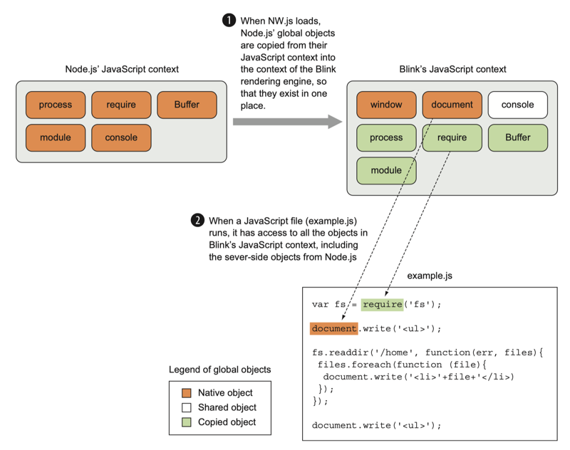
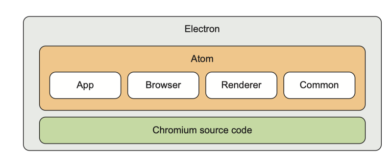
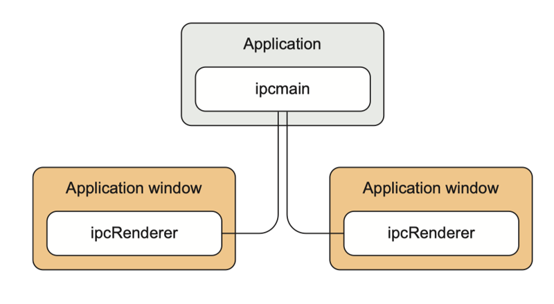
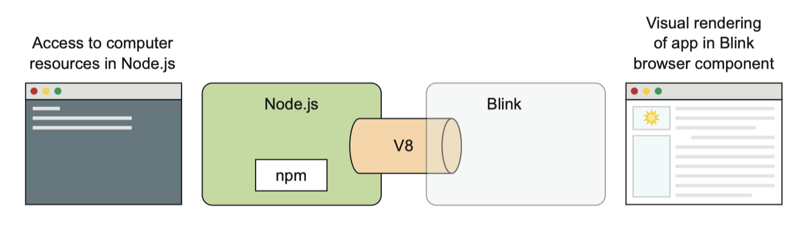

# 0601. Exploring NW.js and Electron's internals

## Summary

In this chapter, we've exposed some differences between NW.js and Electron by exploring how their software components work under the hood. Some of the key takeaways from the chapter include the following:

1 In NW.js, Node.js and Blink share JavaScript contexts, which you can use for sharing data between multiple windows. 

2 This sharing of JavaScript state means that multiple app windows for the same NW.js app can share the same state. 

3 NW.js uses a compiled version of Chromium with custom bindings, whereas Electron uses an API in Chromium to integrate Node.js with Chromium. 

4 Electron has separate JavaScript contexts between the front end and the back end. 

5 When you want to share state between the front end and back end in Electron apps, you need to use message passing via the ipcMain and ipcRenderer APIs.

In the next chapter, we'll look at how to use the various APIs of NW.js and Electron to build desktop apps — specifically, at the way in which you can craft an app's look and feel. It will be more visual, and hopefully more fun.

在本章中，通过介绍 NW.js 和 Electron 内部各组件的工作机制介绍了两者的不同。下面是本章的关键内容：

1、在 NW.js 中，Node.js 和 Blink 共享 JavaScript 上下文，可以在多视窗间共享数据。

2、共享 JavaScript 状态意味着在同一个 NW.js 的多视窗应用中，可以共享同一个状态。

3、NW.js 使用了编译后的 Chromium 版本以及自定义绑定，而 Electron 则使用了 Chromium 中的 API 将 Chromium 和 Node.js 整合在一起。

4、Electron 将前后端的 JavaScript 上下文进行了隔离。

5、当你想在 Electron 应用的前后端进行数据共享时，需要通过 ipcMain 和 ipcRenderer 这两个 API 进行消息传递来实现。

在下一章中，我们会介绍如何使用 NW.js 和 Electron 提供的 API 来构建桌面应用 —— 着重介绍如何改变应用的界面部分。这部分和视觉更相关，也应该更加有趣。

## 6.0

This chapter covers: 1) Understanding how NW.js and Electron combine Node.js and Chromium. 2) Developing with Electron's multi-process approach. 3) Building with NW.js's shared-context approach. 4) Sharing state by passing messages.

Although NW.js and Electron consist of the same software components, and Cheng Zhao has influenced the development of both, the two frameworks have evolved different approaches to how they function under the hood. Analyzing how they operate internally will help you understand what's going on when you're running an app and demystify the software.

In this chapter, we'll look at how NW.js and Electron function internally. We'll take a look at NW.js first to see how it combines Node.js with Chromium (because that was the first Node.js desktop app framework) and then explore how Electron took a different approach to combining those software components. Following that, we'll look at the frameworks' different approaches to context and state. I'll then elaborate a bit on Electron's use of message passing to transmit data as state between the processes in a desktop app.

We'll also look at some resources for further reading. The goal is that you'll be in a good position to understand how the two frameworks differ in their internal architecture and the implications this has on building desktop apps with them.

探索 NW.js 和 Electron 的内部机制

本章要点：1）理解 NW.js 和 Electron 是如何整合 Node.js 和 Chromium 的。2）使用 Electron 多进程特性进行开发。3）使用 NW.js 共享上下文机制进行开发。4）通过消息传递来共享状态。

尽管 NW.js 和 Electron 都包含相同的软件组件，而且赵成参与了这两个框架的开发，但是这两个框架内部的工作方式采用了不同的方式。分析它们内部的工作方式有助于你理解应用运行的背后是怎样工作的。

本章会介绍 NW.js 和 Electron 的内部工作机制。我们先介绍 NW.js 是如何整合 Node.js 和 Chromium 的（因为它是首款 Node.js 桌面应用开发框架），然后再来看 Electron 是如何整合那些软件组件的。紧接着，会介绍这两个框架在上下文和状态管理上采用了什么不同的方式。最后我会花点篇幅介绍使用 Electron 在桌面应用的不同进程间进行消息传递。

我们还会介绍一些扩展阅读的资源。目标是让你理解这两个框架内部架构的不同之处以及使用它们构建桌面应用时的不同点。

## 6.1 How does NW.js work under the hood?

From a developer's view, NW.js is a combination of a programming framework (Node.js) with Chromium's browser engine through their common use of V8. V8 is a JavaScript engine created by Google for its web browser, Google Chrome. It's written in C++ and was designed with the goal of speeding up the execution of JavaScript in the web browser.

When Node.js was released in 2009, a year after Google Chrome, it combined a multiplatform support library called libuv with the V8 engine and provided a way to write asynchronous server-side programs in JavaScript. Because both Node.js and Chromium use V8 to execute their JavaScript, it provided a way to combine the two pieces of software, which Roger Wang came to understand and figure out. Figure 6.1 shows how those components are combined.

Figure 6.1 Overview of NW.js's component architecture in relation to loading an app

Looking at figure 6.1, you can see that Node.js is used in the back end to handle working with the OS, and that Blink (Chromium's rendering engine) is used to handle rendering the front-end part of the app, the bit that users see. Between them, both Node.js and Blink use V8 as the component that handles executing JavaScript, and it's this bit that's crucial in getting Node.js and Chromium to work together. There are three things necessary for Node.js and Chromium to work together: 1) Make Node.js and Chromium use the same instance of V8. 2) Integrate the main event loop. 3) Bridge the JavaScript context between Node and Chromium.

#### NW.js and its forked dependencies

NW.js, a combination of Node.js and the WebKit browser engine, used to be known as node-webkit. Recently, both components were forked: Google created a fork of WebKit called Blink, and in October 2014 a fork of Node.js called IO.js emerged. They were created for different reasons, but as projects that received more regular updates and features, NW.js opted to switch to using them.

As node-webkit no longer used Node.js and WebKit (but IO.js and Blink instead), it was suggested that the project should be renamed; hence, the project was renamed to NW.js.

In May 2015, the IO.js project agreed to work with the Node.js foundation to merge IO.js back into Node.js. NW.js has switched back to using Node.js since.

6.1 NW.js 内部是如何工作的

从一个开发者的角度来看，NW.js 将一门编程框架（Node.js）和 Chromium 的浏览器引擎通过它们共用的 V8 整合起来。V8 是 Google 为其 Web 浏览器 Google Chrome 开发的 JavaScript 引擎。它是用 C++ 编写的，设计目标就是在 Web 浏览器中加快 JavaScript 的执行。

在 Google Chrome 发布一年后，2009 年 Node.js 发布，它将多平台支持代码库 libuv 和 V8 引擎进行了整合，并提供了一种使用 JavaScript 书写服务端异步程序的方式。由于 Node.js 和 Chromium 都使用 V8 来执行，Roger Wang 就想出了一个将它们整合在一起的方法。图 6.1 展示了这两个软件是如何整合在一起的。

图 6.1 和加载应用相关的 NW.js 组件架构一览

如图 6.1 所示，你可以看到 Node.js 在后端主要负责和操作系统交互，Blink （Chromium 的渲染引擎）则用来渲染应用的前端部分，也就是用户肉眼看到的那部分。在这两者中间，Node.js 和 Blink 都使用 V8 来执行 JavaScript 代码，并且这也是能让 Node.js 和 Chromium 一起工作的很重要的一点。要让 Node.js 和 Chromium 一起工作，必须满足如下三点要求：1）Node.js 和 Chromium 要使用同一份 V8 实例。2）将主要的事件循环进行集成。3）在 Node.js 和 Chromium 之间桥接 JavaScript 上下文。

NW.js 以及它的那些被克隆的依赖

NW.js 以前叫 node-webkit，由 Node.js 和 WebKit 渲染引擎组合而成。近期，这两个组件都被克隆了：Google 克隆了 WebKit 并取名为 Blink，而且在 2014 年，Node.js 的一个克隆项目 IO.js 浮现出来。它们出于不同的原因被创建出来，但是随着项目得到了更多的更新和具有更多特性，NW.js 也开始切换到使用这些克隆的项目上来。

由于 node-webkit 不再使用 Node.js 和 WebKit（而是 IO.js 和 Blink），于是有人建议对它也要进行改名，于是，它就被改名为 NW.js。

2015 年 5 月，IO.js 项目同意和 Node.js 基金会合作，将 IO.js 合并回 Node.js。自那以后，NW.js 也再一次切换回使用 Node.js。

### 6.1.1 Using the same instance of V8

Both Node.js and Chromium use V8 to handle executing JavaScript. Getting them to work together requires that a couple of things happen in order. The first thing NW.js does is load Node.js and Chromium so that both of them have their JavaScript contexts loaded in the V8 engine. Node's JavaScript context will expose global objects and functions such as module, process, and require, to name a few. Chromium's JavaScript context will expose global objects and functions like window, document, and console. This is illustrated in figure 6.2 and involves some overlap because both Node and Chromium have a console object.

When this is done, the JavaScript context for Node.js can be copied into the JavaScript context for Chromium.

Although that sounds quite easy, the reality is that there's a bit more glue involved for Node.js and Chromium to work together — the main event loop used by both has to be integrated.

1 When NW.js loads, Node.js' global objects are copied from their JavaScript context into the context of the Blink rendering engine, so that they exist in one place.

2 When a JavaScript file (example.js) runs, it has access to all the objects in Blink's JavaScript context, including the sever-side objects from Node.js.

Figure 6.2 How NW.js handles copying the JavaScript context for Node.js into Chromium's JavaScript context

6.1.1 使用同一个 V8 实例

Node.js 和 Chromium 都使用 V8 来执行 JavaScript。要让这两者能够在一起工作，要求以下几件事要依次发生：首先，NW.js 要做的就是加载 Node.js 和 Chromium，这样它们各自的 JavaScript 上下文就能载入 V8 引擎了。Node.js 的 JavaScript 上下文会暴露一些全局对象和函数，比如 module、process、require 等。Chromium 的 JavaScript 上下文也会暴露一些像 window、document 以及 console 这样的全局对象和函数。如图 6.2 所示，两者之间还有一些重合，因为 Node 和 Chromium 都有 console 对象。

这部分完成后，Node.js 的 JavaScript 上下文可以被复制到 Chromium 的 JavaScript 上下文中。

尽管这听起来很简单，实际上要让 Node.js 和 Chromium 在一起工作还需要做一些事情 —— 要将两者所使用的事件循环进行集成。

图 6.2 NW.js 是如何将 Node.js 的 JavaScript 上下文复制到 Chromium 的 JavaScript 上下文的

### 6.1.2 Integrating the main event loop

As discussed in section 5.1.3, Node.js uses the event loop programming pattern to handle executing code in a non-blocking, asynchronous fashion. Chromium also uses the event loop pattern to handle the asynchronous execution of its code.

But Node.js and Chromium use different software libraries (Node.js uses libuv, and Chromium uses its own custom C++ libraries, known as MessageLoop and MessagePump). To get Node.js and Chromium to work together, their event loops have to be integrated, as illustrated in figure 6.3.

When the JavaScript context for Node.js is copied into Chromium's JavaScript context, Chromium's event loop is adjusted to use a custom version of the MessagePump class, built on top of libuv, and in this way, they're able to work together.

Figure 6.3 NW.js integrates the event loops of Node.js and Chromium by making Chromium use a custom version of MessagePump, built on top of libuv.

6.1.2 集成主事件循环

正如在 5.1.3 节中讨论的，Node.js 使用了事件循环的模式，以异步非阻塞的方式来执行代码。Chromium 也使用这种方式异步执行代码。

但是 Node.js 和 Chromium 使用的是不同的软件代码库（Node.js 使用 libuv, Chromium 使用的则是自定义的 C++ 代码库，名为 MessageLoop 以及 MessagePump）。要让 Node.js 和 Chromium 在一起工作，必须将这两个事件循环进行集成，如图 6.3 所示。

当 Node.js 的 JavaScript 上下文复制到 Chromium 的 JavaScript 上下文的时候，Chromium 的事件循环会被调整为使用一个自定义版本的 MessagePump，它是构建在 libuv 之上的，这样一来，它们就可以在一起工作了。

图 6.3 NW.js 通过让 Chromium 使用一个构建在 libuv 之上的自定义版本的 MessagePump 实现将 Node.js 和 Chromium 的事件循环集成在一起

### 6.1.3 Bridging the JavaScript context between Node and Chromium

The next step to completing the integration of Node with Chromium is to integrate Node's start function with Chromium's rendering process. Node.js kicks off with a start function that handles executing code. To get Node.js to work with Chromium, the start function has to be split into parts so that it can execute in line with Chromium's rendering process. This is a bit of custom code within NW.js that's used to monkey-patch the start function in Node.

Once this is done, Node is able to work inside of Chromium. This is how NW.js is able to make Node.js operate in the same place as the front-end code that's handled by Chromium.

That rounds up a bit about how NW.js operates under the hood. In the next section, we'll explore the different approach taken by Electron.

6.1.3 桥接 Node.js 和 Chromium 的 JavaScript 上下文

要完成 Node 和 Chromium 的整合，下一步需要将 Node 的 start 函数和 Chromium 的渲染进程进行集成。Node.js 通过执行一个 start 函数来处理代码的执行。要让 Node.js 和 Chromium 在一起工作，需要将 start 函数分割成多个部分，这样才能在 Chromium 的渲染进程中进行执行。这部分牵涉 NW.js 自己实现的代码，对 Node.js 的 start 函数打了一些补丁。

这部分完成后，Node 就可以和 Chromium 一起工作了。NW.js 就是通过这种方式让 Node.js 代码在由 Chromium 负责的前端代码中也可以工作。

以上就是 NW.js 内部工作机制的大致情况。下一节，我们会介绍 Electron 的内部工作机制。

## 6.2 How does Electron work under the hood?

Electron's approach shares some similarities in terms of the components used to provide the desktop framework, but differs in how it combines them. It's best to start by looking at the components that make up Electron. To see an up-to-date source code directory, take a look at http://mng.bz/ZQ2J.

Figure 6.4 shows a representation of that architecture at a less-detailed level. Electron's architecture emphasizes a clean separation between the Chromium source code and the app. The benefits of this are that it makes it easier to upgrade the Chromium component, and it also means that compiling Electron from the source code becomes that much simpler.

Figure 6.4 Electron's source code architecture. This diagram shows the main blocks of components that make up Electron.

The Atom component is the C++ source code for the shell. It has four distinct parts (covered in section 6.2.2). Finally, there's Chromium's source code, which the Atom shell uses to combine Chromium with Node.js.

How does Electron manage to combine Chromium with Node.js if it doesn't rely on patching Chrome to combine the event loops for Chromium and Node.js?

3『

[开发 | Electron](https://www.electronjs.org/docs/development)

[源码目录结构 | Electron](https://www.electronjs.org/docs/development/source-code-directory-structure)

』

6.2 Electron 内部是如何工作的

在为了提供桌面应用开发框架而使用到的组件这方面，Electron 采用的方案和 NW.js 类似，但整合这些组件的方式不同。最好的办法就是从组成 Electron 的组件开始来看。通过 [源码目录结构 | Electron](https://www.electronjs.org/docs/development/source-code-directory-structure) 可以看到 Electron 最新的代码结构。

图 6.4 展示了 Electron 的大致架构。Electron 的架构将 Chromium 源代码和应用切分得很清楚。这样做的好处就是使升级 Chromium 组件变得很容易，同时这也意味着通过源代码编译 Electron 也很容易。

Atom 组件是由 C++ 代码编写的。它由 4 个不同的部分组成（在 6.2.2 中会介绍）。最后还有 Chromium 的源代码，Atom shell 用于将 Chromium 和 Node.js 进行整合。在不通过对 Chrome 打补丁来集成 Chromium 和 Node.js 的事件循环的情况下，Electron 是如何对 Chromium 和 Node.js 进行整合的呢？

图 6.4 Electron 的源代码架构。图中展示了组成 Electron 的主要组件

### 6.2.1 Introducing libchromiumcontent

Electron uses a single shared library called libchromiumcontent to load Chromium's content module, which includes Blink and V8. Chromium's content module is responsible for rendering a page in a sandboxed browser. You can find this library on GitHub at [electron/libchromiumcontent: Shared library build of Chromium’s Content module](https://github.com/electron/libchromiumcontent).

You use the Chromium content module to handle rendering web pages for the app windows. This way, there's a defined API for handling the interaction between the Chromium component and the rest of Electron's components.

6.2.1 libchromiumcontent 介绍

Electron 使用了一个名为 libchromiumcontent 的代码库来加载 Chromium 的 content 模块，该模块包含了 Blink 和 V8。Chromium 的 content 模块负责将页面渲染在浏览器的沙箱环境中。你可以通过 GitHub 的 https://github.com/electron/libchromiumcontent 找到该项目的代码。

可以使用 Chromium 的 content 模块来渲染应用视窗中的 Web 页面。通过这种方式，有既定的 API 来处理 Chromium 组件和 Electron 其他组件之间的交互。

### 6.2.2 Electron's components

Electron's code components are organized inside Electron's Atom folder into these sections: 1) App. 2) Browser. 3) Renderer. 4) Common.

We'll look at what each of those folders contains in a bit more detail.

APP: The App folder is a collection of files written in C++11 and Objective-C++ that handles code that needs to load at the start of Electron, such as loading Node.js, loading Chromium's content module, and accessing libuv.

BROWSER: The Browser folder contains files that handle interacting with the front-end part of the app, such as initializing the JavaScript engine, interacting with the UI, and binding modules that are specific to each OS.

RENDERER: The Renderer folder contains files for code that runs in Electron's renderer processes. In Electron, each app window runs as a separate process, because Google Chrome runs each tab as a separate process, so that if a tab loads a heavy web page and becomes unresponsive, that tab can be isolated and closed without killing the browser and the rest of the tabs with it.

Later in this book, we'll look at how Electron handles running code in a main process, and how app windows have their own renderer processes that run separately.

COMMON: The Common folder contains utility code that's used by both the main and renderer processes for running the app. It also includes code that handles integrating the messaging for Node.js' event loop into Chromium's event loop.

Now you have an idea of how Electron's architecture is organized. In the next section, we'll look at how Electron handles rendering app windows in a process that's separate from the main app process.

6.2.2 Electron 中的组件

Electron 的代码组件位于 Electron 的 Atom 文件夹中，包含如下几个部分：App、Browser、Renderer、Common。我们会针对每个部分进行详细介绍。

App：App 文件夹中包含了由 C++ 和 Objective-C 编写的代码文件，负责处理 Electron 启动时的加载工作，如加载 Node.js、Chromium 的 content 模块以及访问 libuv。

Browser：Browser 文件夹中的代码文件负责处理应用前端部分的交互，诸如，初始化 JavaScript 引擎、界面上的交互以及绑定针对不同操作系统模块。

Renderer：Renderer 文件夹中包含运行在 Electron 的 renderer 进程中的代码文件。在 Electron 中，每个视窗都是一个独立的进程，这是因为 Google Chrome 将每个标签都以独立的进程来运行。这样的话，当一个标签加载一个非常大的页面导致无法响应的时候，这个标签页面是被隔离的，可以独立被关闭而不需要关掉整个浏览器或者其他标签页。本书后续部分会介绍 Electron 是如何在 main 进程中运行代码以及应用视窗是如何在互相隔离的、独立的进程中运行的。

Common：Common 文件夹包含了工具类代码，这部分代码当应用运行起来后会被 main 和 renderer 进程用到。还包括了处理将 Node.js 的事件循环整合进 Chromium 的事件循环的代码。

### 6.2.3 How Electron handles running the app

Electron handles running apps differently than NW.js. In NW.js, the back-end and front-end parts of the desktop app share state by having the Node.js and Chromium event loops integrated and by having the JavaScript context copied from Node.js into Chromium. One of the consequences of this approach is that the app windows of an NW.js app end up sharing the same reference to the JavaScript state.

With Electron, any sharing of state from the back-end part of the app to the frontend part and vice versa has to go through the ipcMain and ipcRenderer modules. This way, the JavaScript contexts of the main process and the renderer process are kept separate, but data can be transmitted between the processes in an explicit fashion.

The ipcMain and ipcRenderer modules are event emitters that handle interprocess communication between the back end of the app (ipcMain), and the front-end app windows (ipcRenderer), as shown in figure 6.5.

Figure 6.5 How Electron passes state via messaging to and from the app windows. In Electron, each app window has its own JavaScript state, and communicating state to and from the main app process happens via interprocess communication.

This way, you have greater control over what state exists in each app window as well as how the main app interacts with the app windows.

Regardless of which desktop framework you choose to build your app with, keep in mind how you want data to be accessed and altered within your app. Depending on what your app does, you may find that one framework is better suited to your needs than the other, and in cases where you're working with those desktop app frameworks already, you'll want to keep in mind how NW.js and Electron handle JavaScript contexts.

Now let's take a closer look at how Electron and NW.js make use of Node.js.

6.2.3 Electron 是如何将应用运行起来的

Electron 处理应用的运行方式和 NW.js 不同。在 NW.js 中，通过将 Node.js 和 Chromium 的事件循环集成起来，把 Node.js 的 JavaScript 上下文复制到 Chromium 的 JavaScript 上下文中，可以让桌面应用中的前后端代码进行状态共享。这种方案带来的一个结果就是使用 NW.js 开发的应用中的视窗可以共享对 JavaScript 状态的同一份引用。

而在 Electron 中，不论是想在前端代码中共享后端代码的状态，或者反过来，都需要经过 ipcMain 和 ipcRenderer 模块。这种方式意味着 main 进程中的 JavaScript 上下文和 renderer 进程中的 JavaScript 上下文是互相隔离的，但是数据可以通过一种显式的方式在两个进程之间进行传递。

ipcMain 和 ipcRenderer 模块其实都是事件分发器，负责在应用后端代码（ipcMain）和前端代码（ipcRenderer）之间进行通信，如图 6.5 所示。

图 6.5 展示 Electron 是如何通过消息传递来让应用视窗和后端部分进行通信的。在 Electron 中，每个应用视窗都有自己的 JavaScript 状态，和 main 进程之间进行状态通信是通过进程间通信来完成的

这种方式使你可以对每个应用视窗的状态以及 mian 进程和视窗进程间的通信有更强的控制力。

不论你选择哪种框架来开发桌面应用，都要留意在应用中如何进行数据的访问和修改。根据应用的类型，可以找到一个更符合你应用需求的框架。如果你已经在使用这两个框架开发桌面应用了，要记住 NW.js 和 Electron 是如何处理 JavaScript 上下文的。

现在，我们来看一下 Electron 和 NW.js 是如何使用 Node.js 的。

## 6.3 How does Node.js work with NW.js and Electron?

Node.js interacts with the hybrid desktop environments of NW.js and Electron similarly to server-side apps. But to understand the few differences, we'll look at the way Node.js is integrated into NW.js.

6.3 Node.js 是如何与 NW.js 以及 Electron 一起工作的

Node.js 在 NW.js 和 Electron 这样混合的桌面开发环境中扮演的角色和其在服务端应用中扮演的角色类似。不过要搞清楚它们的区别，我们需要了解 Node.js 是如何被集成进 NW.js 的。

### 6.3.1 Where Node.js fits into NW.js

NW.js's architecture consists of a number of components, Node.js being one of them. NW.js uses Node.js to access the computer's file system and other resources that would otherwise not be available due to web browser security. It also provides a way to access a large number of libraries through npm (figure 6.6).

1 Access to computer resources in Node.js

2 Visual rendering of app in Blink browser component

Figure 6.6 How Node.js is used within NW.js for desktop apps

NW.js makes Node.js available through the context of the embedded web browser, which means you can script JavaScript files that access both Node.js's API and API methods related to the browser's JavaScript namespace — such as the WebSocket class, for example. In earlier examples in the book, you've written code that has accessed Node.js's file system API in the same file that also accesses the DOM in the screen.

This is possible through the way that NW.js has merged the JavaScript namespaces of Node.js and the Blink rendering engine, as well as merged the main event loops of both, allowing them to operate and interact in a shared context.

6.3.1 Node.js 集成在 NW.js 的哪个位置

NW.js 的架构中包含了几个组件，Node.js 就是其中之一。NW.js 使用 Node.js 来访问计算机中的文件系统以及其他在 Web 页面中由于安全限制无法访问到的资源。通过 Node.js 还可以访问大量 npm 上的模块，如图 6.6 所示。

图 6.6 NW.js 是如何将 Node.js 运用在桌面应用中的

NW.js 使得在内嵌的 Web 浏览器中可以使用 Node.js，这意味着你书写的 JavaScript 代码既可以访问 Node.js 的 API 还可以访问浏览器中提供的 JavaScript 命名空间 —— 比如 WebSocket 类。在本书此前的例子中，你在同一个文件中写的代码既可以访问 Node.js 的文件系统 API，又可以访问 DOM。之所以可以这样，是因为 NW.js 已经将 Node.js 的 JavaScript 命名空间整合到了 Blink 渲染引擎中，而且将两者的事件循环也集成在一起了，可以让两者在同一个共享上下文中进行交互。

### 6.3.2 Drawbacks of using Node.js in NW.js

Because of how NW.js merges the JavaScript contexts of the Blink rendering engine and Node.js, you should be aware of some of the consequences that come with this approach. I'll describe what those things are and how you can handle them so that they don't trip you up.

THE NODE.JS CONTEXT IS ACCESSIBLE TO ALL WINDOWS

I've talked about Node.js and Blink sharing the same JavaScript context, but how does that work in the context of an NW.js app where there are multiple windows?

In Blink, each window has its own JavaScript context, because each window loads a web page with its own JavaScript files and DOM. The code in one window will operate in the context of that window only, and not have its context leak into another window — otherwise, this would cause issues with maintaining state in the windows as well as security issues. You should expect the state that exists in one window to be isolated to that window and not leak.

That said, NW.js introduces a way to share state between windows via the way that Node.js's namespace is loaded into the namespace of Blink to create a shared JavaScript context. Even though each window has its own JavaScript namespace, they all share the same Node.js instance and its namespace. This means there's a way to share state between windows through code that operates on Node.js's namespace properties (such as the API methods), including via the require function that's used to load libraries. Should you need to share data between windows in your desktop app, you'll be able to do this by attaching data to the global object in your code.

COMMON API METHODS IN CHROMIUM AND NODE.JS

You may know that both Node.js and Blink have API methods with the same name and that work in the same way (for example, console, setTimeout, encodeURIComponent). How are these handled? In some cases, Blink's implementation is used, and in other cases, Node.js's implementation is used. NW.js opts to use Blink's implementation of console, and for setTimeout, the implementation used depends on whether the file is loaded from a Node.js module or from the desktop app. This is worth keeping in mind when you're using those functions, because although they're consistent in their implementations of inputs and outputs, there might be a slight difference in speed of execution.

6.3.2 在 NW.js 中使用 Node.js 的缺点

NW.js 采用的是将 Blink 渲染引擎和 Node.js 的 JavaScript 上下文整合的方式，要注意这种方式带来的一些结果。下面我会介绍具体带来的结果是什么以及如何解决和避免。

在所有视窗中都可以访问 Node.js 上下文

我讲过，Node.js 和 Blink 是共享同一个 JavaScript 上下文的，那么当 NW.js 应用中有多个视窗的时候又是怎样的情况呢？

在 Blink 中，每个视窗都有自己的 JavaScript 上下文，因为每个视窗都加载一个 Web 页面，该页面拥有自己的 JavaScript 文件和 DOM。该视窗中的代码仅在该视窗的上下文中进行操作，不会将它的上下文泄露到其他视窗中 —— 否则，会带来状态维护以及安全问题。一个视窗的状态应当和其他视窗的状态是隔离的，而且不会泄露出去。

换句话说，NW.js 通过将 Node.js 命名空间载入 Blink 的命名空间创建了一个共享的 JavaScript 上下文，从而引入了一种在视窗间共享状态的方式。尽管每个视窗拥有自己的 JavaScript 命名空间，但它们都共享同一个 Node.js 实例以及它的命名空间。也就是说，通过操作 Node.js 命名空间上的属性（如 API 方法），包括通过用于载入代码库的 require 函数，是可以实现视窗间共享状态的。如果你需要在桌面应用中进行视窗间的数据共享，那么可以在代码中通过 global 对象来传递数据。

Chromium 和 Node.js 有相同的 API 方法

你可能已经知道了，Node.js 和 Blink 有一些同名且功能一样的 API 方法（如，console、setTimeout、encodeURIComponent）。那这些方法怎么处理呢？有的情况下，会使用 Blink 的实现，而有的时候会用 Node.js 的实现。对于 console，NW.js 会采用 Blink 的实现，而对于 setTimeout，使用哪一个取决于代码文件是通过 Node.js 模块载入的还是直接从桌面应用载入的。使用这些方法的时候要注意，尽管它们的执行结果肯定是相同的，但在执行效率方面是有差异的。

### 6.3.3 How Node.js is used within Electron

Electron uses Node.js along with Chromium, but rather than combining the event loops of Node.js and Chromium together, Electron uses Node.js's node_bindings feature. This way, the Chromium and Node.js components can be updated easily without the need for custom modification of the source code and subsequent compiling.

Electron handles the JavaScript contexts of Node.js and Chromium by keeping the back-end code's JavaScript state separate from that of the front-end app window's state. This isolation of the JavaScript state is one of the ways Electron is different from NW.js. That said, Node.js modules can be referenced and used from the front-end code as well, with the caveat that those Node.js modules are operating in a separate process to the back end. This is why data sharing between the back end and app windows is handled via inter-process communication, or message passing.

If you're interested in learning more about this approach, check out this site from GitHub's Jessica Lord: [Essential Electron](http://jlord.us/essential-electron/#stay-in-touch).

1-2『上面的资源：[Essential Electron](http://jlord.us/essential-electron/#stay-in-touch)，一定要去研读，作为本书的一个附件。（2021-04-16）』—— 未完成

6.3.3 Electron 是怎么使用 Node.js 的

Electron 也在 Chromium 中使用 Node.js，但不同于将两者的事件循环进行整合，Electron 使用的是 Node.js 的 `node_bindings` 功能。使用这种方式，Chromium 和 Node.js 的升级都会很容易，不需要对源代码进行修改也不需要再进行编译。

Electron 通过将后端代码的 JavaScript 状态和应用视窗前端代码的 JavaScript 状态隔离开来处理 Node.js 和 Chromium 的 JavaScript 上下文。这种将 JavaScript 状态隔离的方式也是 Electron 有别于 NW.js 的地方之一。也就是说，前端代码可以使用 Node.js 模块，不过要澄清的是，这些 Node.js 模块是在后端一个独立的进程中执行的。这也是为什么在应用视窗和后端要进行数据共享需要通过进程间通信或者消息传递来实现。

如果你对这部分内容有兴趣，想了解更多，可以访问来自 GitHub 上 Jessica Lord 的网站：http://jlord.us/essential-electron/#stay-in-touch。